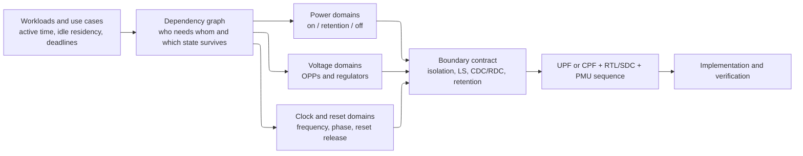

# Low-Power Architecture — Partitioning Power, Voltage, and Clock Domains

> **First-time-reader orientation:** a *domain* is a group of circuit elements controlled together along one physical axis. A power domain answers **what may turn off together**; a voltage domain answers **what must share a voltage operating point**; a clock domain answers **what is timed by the same clock relationship**. These partitions overlap, but they are not interchangeable.
>
> **Abbreviation key — skim now and return as needed:** always-on (AON); clock-domain crossing (CDC); dynamic voltage and frequency scaling (DVFS); electronic design automation (EDA); finite-state machine (FSM); intellectual property (IP); operating performance point (OPP); power-management integrated circuit (PMIC); power-management unit (PMU); power, performance, and area (PPA); register-transfer level (RTL); reset-domain crossing (RDC); static timing analysis (STA); Unified Power Format (UPF); Common Power Format (CPF).
>
> **Prerequisites:** [Power Fundamentals](01_Power_Fundamentals.md) explains where power comes from; [Block Activity and Power](02_Block_Activity_and_Power.md) explains how workload and switching activity turn into a per-mode budget.
> **Hands off to:** [Power Reduction Techniques](04_Power_Reduction_Techniques.md) implements the chosen mechanisms; [UPF/CPF Power Intent](05_UPF_and_CPF_Power_Intent.md) makes the architecture machine-readable.

---

## 0. Why domain partitioning is an architecture problem

A low-power design does not begin with a UPF command. It begins with a workload question:

> Which parts of the chip are needed together, at what performance, for how long, and which state must survive while the rest sleeps?

The answer determines the domain boundaries. Once those boundaries are frozen, they constrain the RTL hierarchy, interfaces, clock/reset plan, power-management firmware, physical floorplan, special-cell count, verification state space, wake latency, and ultimately whether the promised energy saving is real.

Partition too coarsely and a small active function keeps a large region powered and clocked. Partition too finely and the chip fills with switches, isolation cells, level shifters, synchronizers, always-on control routes, and legal power states that must all be verified. The goal is therefore not the maximum number of domains. It is the **smallest set of independently controlled regions that captures the workload's useful idle and performance differences**.

Four partitions must be considered together:

| Partition | Groups logic that shares… | Independent control | Boundary consequence |
|---|---|---|---|
| **Power domain (PD)** | one power fate | on, retention, or off | isolation, optional retention, switch network, legal sequencing |
| **Voltage domain (VD)** | one voltage or OPP schedule | voltage selection / DVFS | level shifting, voltage-aware timing, regulator and rail constraints |
| **Clock domain (CD)** | one synchronous clock relationship | frequency, phase, source, gate state | CDC protocol, clock constraints, clock/reset sequencing |
| **Reset domain (RD)** | one reset assertion/deassertion behavior | reset source and release | RDC checks and safe reset release |

Reset is included because an apparently correct power/clock partition can still fail when one side leaves reset while the other side remains off or asynchronous.

`LS` in the diagram means **level shifter**. `SDC` means **Synopsys Design Constraints**, the timing-constraint format used to describe clocks and timing exceptions.

---

## 1. The three main domains are not the same thing

### 1.1 Power domain: one shared power fate

A power domain contains logic that is switched on and off together. If two blocks must remain independently available, they cannot be in the same independently switchable power domain. If they always enter and leave every low-power state together, separating them may add cost without creating a useful mode.

The defining question is not “do these blocks use the same nominal voltage?” It is:

> Can one block be electrically unpowered while the other continues to operate correctly?

If yes, the boundary needs a contract for what happens to signals and state. Outputs from the off side need isolation; selected state may need retention; controls that must work during shutdown need AON power; and the PMU must enforce an ordered transition.

### 1.2 Voltage domain: one shared voltage schedule

A voltage domain contains logic that shares a supply voltage or a coordinated sequence of voltage operating points. A domain may support several OPPs, such as a low-voltage/low-frequency state and a high-voltage/high-frequency state. What makes it one voltage domain is that its elements move through those voltage states together.

The defining question is:

> Do these blocks need independently chosen voltages at the same moment?

If yes, they need separate voltage domains and a feasible way to generate and distribute those rails. Signals crossing unequal voltages may need level shifters, and timing must be checked for every legal source-voltage/sink-voltage combination.

### 1.3 Clock domain: one synchronous timing relationship

A clock domain contains sequential elements whose clock edges have a relationship that STA can treat as synchronous. “Same frequency” is insufficient: two clocks at 500 MHz from unrelated sources are asynchronous. Conversely, divided clocks derived from one parent can remain synchronously related if their phase relationship is defined and preserved.

The defining question is:

> Can the receiving register rely on a bounded, declared relationship to the transmitting clock edge?

If no, the interface is a CDC and needs a protocol such as a synchronizer, handshake, pulse/toggle synchronizer, or asynchronous first-in/first-out queue (FIFO). A clock-gating region is smaller and different: it is a branch of a clock tree that can stop while remaining part of the same synchronous domain when running.

### 1.4 One practical example of non-one-to-one mapping

Consider a four-core CPU cluster:

- Each core can be power-gated independently: **four power domains**.
- All four cores share one regulated rail and DVFS point: **one voltage domain**.
- Each core has its own gateable clock branch but all branches derive synchronously from one phase-locked loop (PLL): **one synchronous clock family, four gating regions**.
- The shared last-level cache and interrupt controller remain alive: a separate **AON or retention-capable power domain**.

Forcing all three axes into the same four-way partition would require four voltage regulators or rail controls that the architecture does not need. Forcing all three into one domain would prevent per-core shutdown. Correct partitioning preserves the independence that creates value and shares everything else.

---

## 2. Inputs that must exist before drawing boundaries

### 2.1 Use cases and residency, not a block diagram alone

For each important use case, create a mode table:

| Use case | Required blocks | Performance target | Expected duration | Wake-latency tolerance | State that must survive |
|---|---|---:|---:|---:|---|
| interactive burst | CPU, cache, display path | response deadline | short bursts | very small | software and cache context |
| video playback | video engine, memory, display | fixed frame rate | long | moderate | stream/configuration state |
| voice wake | sensor, tiny DSP, AON SRAM | real-time audio | always | none for AON path | detector history |
| deep sleep | RTC, wake controller | minimum | long | product-specific | wake reason and minimal context |

`RTC` means **real-time clock**. The table reveals the useful separations. If the video engine is active for hours while the CPU is mostly idle, putting both in one power domain wastes leakage. If two tiny peripherals are always used together and expose hundreds of crossing signals, splitting them probably loses.

Residency matters because a state that exists but is almost never entered cannot repay its implementation and verification cost. Measure or model:

- fraction of time in each state;
- distribution of idle interval lengths, not only average idle time;
- transition rate between states;
- response deadlines and maximum wake latency;
- energy and latency to save, shut down, restart, restore, and rewarm caches or memories.

### 2.2 Functional and availability dependencies

Build a directed dependency graph. An edge `A → B` means A requires B to make progress or to wake safely. Examples include a CPU depending on an interrupt controller, a DMA engine depending on the interconnect and memory controller, or every switchable domain depending on the PMU.

This graph identifies:

- **AON roots:** PMU, wake detectors, reset generation, real-time clock, and enough interconnect to deliver a wake event;
- **parent/child constraints:** a child cannot be on when the rail, clock source, or fabric it depends on is unavailable;
- **feed-through paths:** a live signal cannot depend on ordinary buffers placed inside an off domain;
- **state ownership:** retained state needs an AON supply and a defined save/restore owner;
- **legal power states:** only dependency-respecting combinations belong in the power-state model.

### 2.3 Technology and physical constraints

Architecture proposals must be feasible in the target process and package. Ask early:

- Which voltage rails, regulator outputs, and voltage ranges are actually available?
- Are the required standard-cell and memory libraries characterized at every proposed voltage?
- Which memories support shutdown, light sleep, deep sleep, or retention?
- Can the floorplan make each voltage area reasonably contiguous?
- Where can switch cells, level shifters, isolation cells, and AON buffers be placed?
- Can the power-delivery network support in-rush current when domains wake?
- Can the clock source remain stable through the proposed voltage transition?
- Is the package pin/ball budget compatible with another external rail?

An extra voltage domain that saves core energy but requires an impractical external rail is not an architecture; it is an unimplemented wish.

---

## 3. Power-domain partition strategy

### 3.1 The benefit side

For a candidate region $R$, a first-order annualized or workload-weighted power benefit is

$$
B_{PD}(R) = \sum_m \pi_m\,P_{leak,R,m}\,\rho_{off,R,m}
$$

where $m$ is a use case or operating mode, $\pi_m$ is its occurrence weight, $P_{leak,R,m}$ is the region's leakage while powered, and $\rho_{off,R,m}$ is the fraction of that mode for which the region can truly be off. This is more useful than “the block is sometimes idle”: a block can be idle but still needed to retain state or meet a microsecond response deadline.

### 3.2 The cost side

The domain cost has both recurring energy and fixed complexity:

$$
C_{PD}(R) = P_{AON,R} + r_{tr,R}E_{tr,R} + \lambda_t\Delta t_{wake,R} + \lambda_A A_{boundary,R} + \lambda_V V_{states,R}
$$

where:

- $P_{AON,R}$ is switch leakage, retention leakage, and AON-control power;
- $r_{tr,R}E_{tr,R}$ is transition rate times transition energy;
- $\Delta t_{wake,R}$ is wake latency, weighted by the product's latency cost $\lambda_t$;
- $A_{boundary,R}$ counts switch, isolation, retention, and routing area;
- $V_{states,R}$ represents verification cost from extra states and transitions.

A candidate split is attractive only if $B_{PD}>C_{PD}$ with margin for modeling uncertainty. Exact units for the weighted complexity terms are project choices; the point is to prevent “saved leakage” from being compared against zero overhead.

### 3.3 What makes a good power-domain boundary

A strong candidate has:

1. **Different availability:** it is often unnecessary while neighbors stay active.
2. **Long enough idle intervals:** off residency exceeds the energy and latency break-even.
3. **Useful leakage mass:** enough cells or memory leakage to repay the boundary.
4. **Small and stable interface:** relatively few signals cross the cut.
5. **Recoverable or retainable state:** wake behavior is defined.
6. **A physical region:** switchable cells can be placed and powered coherently.
7. **Simple dependencies:** legal on/off combinations are understandable and testable.

The interface criterion is a hardware version of surface-to-volume ratio: saving tends to scale with cells inside the region, while isolation and routing cost scale with signals crossing its surface.

### 3.4 Retain, reinitialize, or checkpoint elsewhere

For every state element, classify the wake policy:

| State class | Typical policy | Reason |
|---|---|---|
| pipeline/transient state | discard and reset | cheap to recreate |
| configuration and architectural state | retain or checkpoint | required to resume correctly |
| cache/data memory | memory-specific retention, flush, or invalidate | bit count makes blanket flop retention impractical |
| security keys | dedicated secure retention or erase | policy and threat model decide |
| externally reconstructible state | reload from AON memory or software | trades wake latency for lower retention leakage |

Do not select retention by RTL hierarchy alone. “Retain every flop in this module” is easy to write and often wasteful. Retention is a state-architecture decision.

### 3.5 The AON domain is a minimal trusted island

The always-on domain must contain enough circuitry to detect a wake, validate it, sequence supplies/clocks/resets, and observe completion. It should not become a dumping ground. Every unnecessary AON gate leaks in the deepest state and can never benefit from power gating.

At minimum, audit:

- PMU state and timers;
- wake sources and synchronizers;
- reset and power-good conditioning;
- isolation, switch, save, and restore controls;
- necessary retention supplies and AON repeaters;
- the path that carries a wake request around or through sleeping regions;
- debug/test behavior in every power mode.

---

## 4. Voltage-domain partition strategy

### 4.1 Split only when voltage demand differs in the same time window

Separate voltage domains pay when blocks have different critical-path or throughput demand concurrently. If every block always speeds up and slows down together, one rail avoids regulators, level shifters, state combinations, and rail-routing cost.

Good candidates include:

- latency-critical CPU cores versus a tolerant peripheral fabric;
- an NPU array whose energy-optimal point differs from its control processor;
- memory interfaces constrained to a fixed I/O voltage;
- AON logic optimized for very low leakage rather than peak frequency;
- analog or mixed-signal IP with a required supply independent of digital DVFS.

### 4.2 An OPP couples voltage and clock decisions

An operating performance point is normally a legal pair or tuple such as `(voltage, frequency, body-bias, temperature limit)`. Voltage cannot be lowered independently of frequency unless timing is still guaranteed. Therefore a DVFS controller coordinates a **voltage domain** and one or more **clock domains**:

- scaling down: reduce clock frequency first, then lower voltage;
- scaling up: raise voltage, wait for regulation and power-good, then raise frequency.

This ordering prevents logic from temporarily running too fast for the available voltage.

### 4.3 Regulator granularity and transition cost set the useful boundary

A rail needs a source: board PMIC, package regulator, integrated buck, low-dropout regulator, or another implementation. Each has efficiency, response time, area, inductor/capacitor, and current-limit constraints. A theoretically independent voltage domain is useless if its regulator cannot transition at the workload timescale or if conversion loss exceeds the saved core energy.

For candidate domain $R$ and OPP policy $u(t)$, evaluate total energy:

$$
E_{system} = \int \left(P_{load,R}(u,t) + P_{conversion\ loss,R}(u,t)\right)dt + \sum_{transitions}E_{OPP\ transition}
$$

### 4.4 Boundary and implementation costs

Every legal unequal-voltage crossing must be checked for:

- level-shifter direction and supported voltage range;
- delay at source and sink OPP corners;
- level shifter placement, usually near the receiving or specified domain boundary;
- availability of both rails to the special cell;
- behavior when one side is also power-gated;
- combined isolation/level-shifter cells where the library supports them;
- analog tolerance for signals that are not ordinary digital logic.

Multiple voltage domains also create multiple power grids, voltage areas, rail-aware placement restrictions, and more multi-mode/multi-corner STA views. The boundary is justified by sustained energy value, not merely by the existence of a lower-voltage library.

---

## 5. Clock-domain and clock-gating partition strategy

### 5.1 Separate clock domain from clock-gating region

A **clock domain** is a timing relationship. A **clock-gating region** is a set of loads whose clock activity can be disabled together. Many gating regions can live inside one clock domain. Confusing the two creates needless CDC logic or, worse, hides a real asynchronous crossing.

Choose a new clock domain when a block needs an independent:

- frequency or DVFS response;
- phase or clock source;
- stop/start policy that cannot preserve a defined synchronous relation;
- jitter or latency requirement;
- test-clock behavior.

Choose a new gating region when the clock relationship stays synchronous but the block has a distinct enable/residency pattern.

### 5.2 Clock gating follows activity correlation

The useful granularity is set by whether registers become idle together. A root-level gate saves clock-tree power across a large region but can only close when the entire region is idle. A leaf gate captures fine idle opportunities but leaves upstream clock buffers toggling and adds many enable checks.

For gating region $G$:

$$
\Delta P_{clk}(G) \approx \rho_{gated}(G)\,C_{downstream}(G)V^2f - P_{ICG\ overhead}(G)
$$

where $C_{downstream}$ is the clock capacitance below the integrated clock-gating (ICG) cell. Activity correlation, enable stability, clock-tree topology, and test bypass must all be considered.

### 5.3 CDC, reset, and stopped-clock behavior are architectural

At each clock boundary specify:

- data-transfer protocol and maximum rate;
- whether loss, duplication, or reordering is allowed;
- synchronizer depth or asynchronous FIFO capacity;
- reset assertion and deassertion rules on both sides;
- behavior if the destination clock is stopped;
- backpressure behavior if a neighboring power domain is off;
- DVFS transition behavior while transfers are outstanding.

A two-flop synchronizer is appropriate for a stable single-bit level, not a multi-bit bus, event stream, or reconvergent control bundle. The interface protocol belongs in the architecture document before RTL coding begins.

---

## 6. Co-partition the axes with a domain signature

Assign every block a domain signature:

$$
S(b) = \langle PD(b), VD(b), CD(b), RD(b)\rangle
$$

For each connection `a → b`, compare the two signatures. The differences determine the boundary treatment:

| Signature difference | Required question or protection |
|---|---|
| `PD(a) ≠ PD(b)` | Can either side be off alone? Isolation direction, AON feed-through, state/protocol quiescence |
| `VD(a) ≠ VD(b)` | What voltage pairs are legal? Level shifter and voltage-aware timing |
| `CD(a) ≠ CD(b)` | Are clocks synchronous? CDC protocol and timing constraints |
| `RD(a) ≠ RD(b)` | Can reset release create a false event or illegal state? RDC protection |
| several differences | Compose protections and define a single ordered transition protocol |

### 6.1 Boundary composition example

A request travels from a switchable 0.6–0.9 V CPU domain to a 0.8 V AON PMU on an unrelated clock:

1. the request must be held until acknowledged so it cannot disappear during clock synchronization;
2. a CDC handshake transfers it safely;
3. a level shifter handles the legal source/sink voltage pair;
4. isolation forces the inactive request value before the CPU powers off;
5. the cells performing CDC/isolation must be powered from a rail available in the required state;
6. shutdown cannot proceed until the handshake is quiescent or explicitly aborted.

Checking PD, VD, and CD independently would find three cells but might miss the protocol ordering. Co-partitioning treats the crossing as one contract.

### 6.2 Prefer aligned boundaries, but do not force them

Aligning power, voltage, clock, reset, RTL hierarchy, and physical-region boundaries simplifies implementation. However, forcing alignment can destroy useful sharing. Use alignment as a cost-reduction preference, not a law.

Common valid patterns are:

- several power domains sharing one voltage rail;
- one power domain containing several synchronous or asynchronous clock domains;
- one clock source feeding several independently gated power domains;
- an AON control island physically embedded inside a switchable region;
- one RTL IP hierarchy refined into multiple implementation domains;
- several logical blocks grouped into one physical voltage area.

---

## 7. A repeatable partitioning workflow

### Step 1 — enumerate use cases and modes

Start with real product behavior, including boot, active workloads, idle, thermal throttle, test, debug, and failure recovery. Assign residency and transition-rate estimates with confidence ranges.

### Step 2 — build the dependency and communication graph

Nodes are blocks; edges carry signal count, bandwidth, timing criticality, clock relation, state ownership, and availability dependency. Mark mandatory AON roots.

### Step 3 — create coarse candidates first

Use architecturally meaningful regions such as CPU cluster, GPU, NPU, modem, media, peripheral group, memory controller, and AON subsystem. Avoid starting from individual RTL modules; RTL hierarchy is often finer than a useful power boundary.

### Step 4 — split only for measured independence

Split a candidate when workload modes show distinct off residency, voltage demand, or clock activity. Quantify saving and transition cost. Record why the split exists and which use case pays for it.

### Step 5 — merge expensive cuts

Merge candidates with many high-bandwidth/critical crossings, identical state schedules, inseparable physical placement, or negligible independent residency. Recalculate benefit after the merge.

### Step 6 — define state and transition contracts

For each domain define on/off/retention states, OPPs, required clocks, reset behavior, entry/exit conditions, quiescence, save/restore policy, timeout/failure response, and legal transitions.

### Step 7 — create the boundary matrix

Enumerate every inter-domain path and its PD/VD/CD/RD differences. Decide isolation clamp, level shifting, CDC/RDC protocol, retention ownership, AON supply, and cell placement policy.

### Step 8 — run physical and verification feasibility reviews

Estimate special-cell count, switch area, rail count, crossing timing, floorplan fragmentation, rush current, number of STA views, number of legal power states, and transition-test count. A domain architecture is not frozen until implementation and verification owners accept it.

### Step 9 — freeze traceable artifacts

Every domain and power mode should trace back to a product use case and forward to:

- the power-architecture specification;
- UPF or CPF;
- RTL hierarchy and clock/reset specification;
- PMU registers, firmware states, and sequencing diagrams;
- timing/power analysis views;
- verification plan, assertions, and coverage;
- floorplan voltage areas and power-grid plan.

---

## 8. Worked SoC partition example

Assume a mobile SoC contains CPU, NPU, video decoder, display, memory fabric, sensor hub, and PMU. Its important modes are interactive, AI camera, video playback, voice wake, and deep sleep.

### 8.1 First proposal

| Block | Power need | Voltage need | Clock need | Architectural decision |
|---|---|---|---|---|
| PMU + wake + RTC | always required | lowest fixed AON rail | slow AON clocks | `PD_AON / VD_AON / CD_AON` |
| CPU cluster | off in video/deep sleep | wide DVFS range | high-performance PLL | `PD_CPU / VD_CPU / CD_CPU` |
| NPU | off except AI modes | energy-optimal OPPs differ from CPU | independent throughput clock | `PD_NPU / VD_NPU / CD_NPU` |
| video decoder | long independent active periods | fixed or narrow range | frame-rate clock family | `PD_VIDEO / VD_MEDIA / CD_VIDEO` |
| display | survives while CPU sleeps | shares media rail | independent pixel clock | `PD_DISPLAY / VD_MEDIA / CD_PIXEL` |
| memory fabric | needed by several engines | fixed system rail | fabric clock | `PD_FABRIC / VD_SYS / CD_FABRIC` |
| sensor hub | active in voice wake | low-voltage rail | low-frequency independent clock | `PD_SENSOR / VD_AON_LP / CD_SENSOR` |

Video and display share a voltage domain because their voltage demand is similar and an extra regulator does not repay itself, but they remain separate power and clock domains because video decode may stop while the display scans out the final frame.

### 8.2 Boundary decisions

- `CPU → fabric`: power, voltage, and possibly DVFS-clock boundary; isolate CPU outputs when off, level-shift for unequal rails, and use a protocol that drains outstanding transactions before shutdown.
- `video → display`: separate power and clock domains but common voltage; use an asynchronous FIFO, isolate only paths sourced by the domain that may turn off, and keep the final frame in display-owned memory.
- `sensor → PMU`: both must work in deep sleep, so avoid routing through switchable fabric; use a direct AON wake path with a synchronizer.
- `NPU → memory`: software/PMU must quiesce DMA and observe completion before power-off; isolation alone cannot repair a half-issued memory transaction.

### 8.3 Why a tempting finer split is rejected

Suppose the NPU controller is tiny and always used whenever the NPU array is used. Splitting it into its own switchable power domain saves little leakage, adds a wide command/status boundary, and creates states with controller on/array off that have no product use case. Keep one NPU power domain unless the controller is required for wake, debug, or state retention; in that case move only the necessary control subset into AON logic.

---

## 9. Failure patterns and review questions

| Failure pattern | Why it fails | Corrective question |
|---|---|---|
| one domain per RTL module | hierarchy does not imply independent residency | which product mode powers one off while its neighbor stays useful? |
| power domain = voltage domain = clock domain | throws away useful sharing or hides required crossings | which axes actually require independent control? |
| maximize domain count | boundary and verification cost grow faster than useful saving | what measured residency pays for each split? |
| isolate signals but ignore protocol | outstanding transfers can hang or duplicate | how is the interface quiesced before isolation? |
| retain every register | AON leakage/area erodes sleep saving | which state cannot be reconstructed? |
| add a voltage island without regulator analysis | rail/transition loss may exceed load saving | how is the voltage generated and at what efficiency/timescale? |
| stop a clock without CDC reasoning | receiver may wait forever or capture a partial event | what happens when either clock stops? |
| route wake through a sleeping domain | no electrical path remains | is the complete wake path AON? |
| omit reset/test/debug modes | silicon fails outside normal functional mode | are scan, debug, boot, brownout, and recovery legal states? |
| write UPF before agreeing on architecture | syntax hardens accidental hierarchy into a bad partition | what use-case and boundary documents authorize every domain? |

---

## 10. Architecture handoff checklist

Before the design enters detailed RTL/UPF implementation, require these artifacts:

- [ ] workload/use-case table with residency, transition rate, latency, and performance targets;
- [ ] block dependency graph and explicit AON root;
- [ ] table assigning every instance/IP to PD, VD, CD, and RD;
- [ ] voltage/OPP table with regulator source and legal transition order;
- [ ] clock tree/source/gating plan and CDC protocol per crossing;
- [ ] state ownership table: retain, reset, flush, checkpoint, or reconstruct;
- [ ] legal power-state and transition graph, including boot/test/debug/failure modes;
- [ ] boundary matrix with isolation, clamp, level shift, CDC/RDC, and AON placement;
- [ ] PMU entry/exit sequence with acknowledgements, timeouts, and power-good conditions;
- [ ] preliminary floorplan/voltage-area and power-switch feasibility review;
- [ ] quantitative benefit/cost estimate for every independently controlled domain;
- [ ] verification plan mapping each legal state and transition to checks and coverage.

The output is not yet a final UPF/CPF file. It is the **architecture contract from which a correct power-intent file can be derived and reviewed**.

---

## Rules to remember

| Rule | Meaning |
|---|---|
| PD, VD, and CD are independent axes | do not force a one-to-one mapping |
| partition from workload modes | block diagrams alone do not reveal useful idle residency |
| coarser first, split with evidence | every domain boundary must repay its overhead |
| isolation protects values, not transactions | quiesce protocols before shutdown |
| DVFS couples voltage and clocks | frequency-down before voltage-down; voltage-up before frequency-up |
| clock domain is not gating region | one synchronous domain can contain many independently gated branches |
| state policy precedes retention syntax | retain only what cannot be acceptably reconstructed |
| AON is minimal but complete | the entire wake and sequencing path must remain powered |
| every legal state needs a legal transition | static configurations alone do not prove safe entry/exit |
| architecture precedes UPF/CPF | the format records decisions; it does not make them |

---

## Cross-references

- **Mechanisms:** [Power Reduction Techniques](04_Power_Reduction_Techniques.md) derives clock gating, DVFS, power gating, retention, multi-$V_t$, and their break-even points.
- **Power-intent implementation:** [UPF/CPF Power Intent](05_UPF_and_CPF_Power_Intent.md) translates this page's PD/VD state model and boundary matrix into a tool-consumable flow.
- **CDC/RDC:** [Asynchronous Design and CDC](../03_Frontend_RTL_and_Verification/06_Async_Design_and_CDC.md) develops synchronizers and asynchronous FIFOs; [Lint, CDC, and RDC Signoff](../03_Frontend_RTL_and_Verification/07_Lint_CDC_RDC_Signoff.md) explains structural verification.
- **Clock generation:** [PLL, DLL, and Clock Distribution](../03_Frontend_RTL_and_Verification/05_PLL_DLL_and_Clock_Distribution.md) explains clock sources and jitter; [Clock Division and Switching](../03_Frontend_RTL_and_Verification/04_Clock_Division_and_Switching.md) explains glitch-free switching and gating.
- **Physical feasibility and signoff:** [Physical Design](../05_Backend_Physical_Design/01_Physical_Design.md), [Static Timing Analysis](../06_Signoff/01_STA.md), and [Power Analysis and Signoff](06_Power_Analysis_and_Signoff.md).

---

## References

1. IEEE, *IEEE 1801-2024: Standard for Design and Verification of Low-Power, Energy-Aware Electronic Systems*, 2024, published 2025. The current active UPF standard and its incremental-refinement model: https://standards.ieee.org/ieee/1801/7466/
2. Silicon Integration Initiative (Si2), *Low Power Coalition archive*. Hosts CPF 2.1, the CPF/UPF interoperability guide, and the flow-oriented low-power design guides: https://si2.org/si2-openstandards/
3. Keating, M., Flynn, D., Aitken, R., Gibbons, A., and Shi, K., *Low Power Methodology Manual for System-on-Chip Design*, Springer, 2007. Architecture-to-implementation treatment of multi-voltage design, power gating, isolation, retention, and verification.
4. Cummings, C., *Clock Domain Crossing Design and Verification Techniques Using SystemVerilog*, SNUG papers. CDC protocol principles used in §5–§6.
