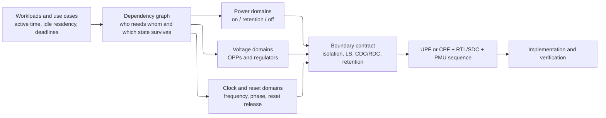
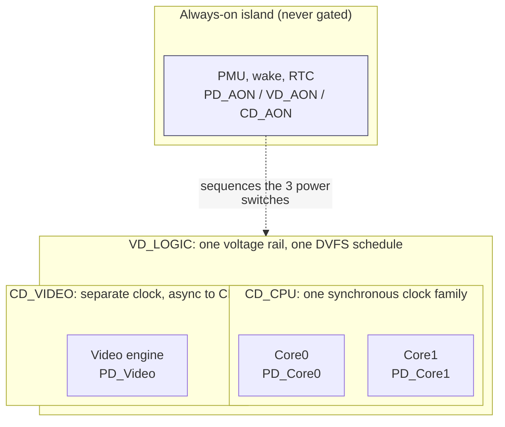
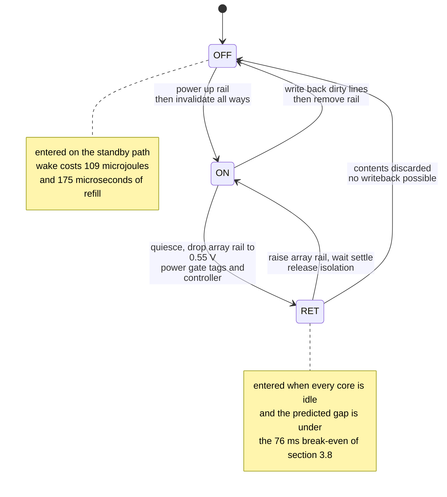

# Low-Power Architecture — Partitioning Power, Voltage, and Clock Domains

> **First-time-reader orientation:** a *domain* is a group of circuit elements controlled together along one physical axis. A power domain answers **what may turn off together**; a voltage domain answers **what must share a voltage operating point**; a clock domain answers **what is timed by the same clock relationship**. These partitions overlap, but they are not interchangeable.
>
> **Abbreviation key — skim now and return as needed:** always-on (AON); automatic test equipment (ATE); automatic test-pattern generation (ATPG); clock-domain crossing (CDC); data-retention voltage (DRV); design for test (DFT); drain-induced barrier lowering (DIBL); dynamic voltage and frequency scaling (DVFS); electronic design automation (EDA); enable-plus-level-shift cell (ELS); equivalent series resistance (ESR); finite-state machine (FSM); intellectual property (IP); integrated voltage regulator (IVR); low-dropout regulator (LDO); operating performance point (OPP); power-delivery network (PDN); power-management integrated circuit (PMIC); power-management unit (PMU); power, performance, and area (PPA); power-supply rejection ratio (PSRR); pulse-frequency modulation (PFM); register-transfer level (RTL); reset-domain crossing (RDC); static noise margin (SNM); static timing analysis (STA); switched-capacitor converter (SC converter); Unified Power Format (UPF); Common Power Format (CPF).
>
> **Prerequisites:** [Power Fundamentals](01_Power_Fundamentals.md) explains where power comes from and gives the alpha-power delay model this page uses to price a lost megahertz; [Block Activity and Power](02_Block_Activity_and_Power.md) explains how workload and switching activity turn into a per-mode budget — this page needs its per-mode residency weights as its only external input.
> **Hands off to:** [Power Reduction Techniques](04_Power_Reduction_Techniques.md) implements the chosen mechanisms; [Power Gating, Retention, and Wake Sequencing](07_Power_Gating_Retention_and_Wake_Sequencing.md) builds the switch fabric, retention cells, and turn-on sequence for every boundary this page draws; [Runtime Power Management and AVFS](08_Runtime_Power_Management_and_Adaptive_Voltage_Frequency.md) turns the resulting state graph into a controller; [UPF/CPF Power Intent](05_UPF_and_CPF_Power_Intent.md) makes the architecture machine-readable.

---

## 0. Why domain partitioning is an architecture problem

A low-power design does not begin with a UPF command. It begins with a workload question:

> Which parts of the chip are needed together, at what performance, for how long, and which state must survive while the rest sleeps?

The answer determines the domain boundaries. Once those boundaries are frozen, they constrain the RTL hierarchy, interfaces, clock/reset plan, power-management firmware, physical floorplan, special-cell count, verification state space, wake latency, and ultimately whether the promised energy saving is real.

Partition too coarsely and a small active function keeps a large region powered and clocked. Partition too finely and the chip fills with switches, isolation cells, level shifters, synchronizers, always-on control routes, and legal power states that must all be verified. The goal is therefore not the maximum number of domains. It is the **smallest set of independently controlled regions that captures the workload's useful idle and performance differences**.

Four partitions must be considered together:

| Partition | Groups logic that shares… | Independent control | Boundary consequence |
|---|---|---|---|
| **Power domain (PD)** | one power fate | on, retention, or off | isolation, optional retention, switch network, legal sequencing |
| **Voltage domain (VD)** | one voltage or OPP schedule | voltage selection / DVFS | level shifting, voltage-aware timing, regulator and rail constraints |
| **Clock domain (CD)** | one synchronous clock relationship | frequency, phase, source, gate state | CDC protocol, clock constraints, clock/reset sequencing |
| **Reset domain (RD)** | one reset assertion/deassertion behavior | reset source and release | RDC checks and safe reset release |

Reset is included because an apparently correct power/clock partition can still fail when one side leaves reset while the other side remains off or asynchronous.


```mermaid
%%{init: {"flowchart": {"defaultRenderer": "elk", "nodeSpacing": 42, "rankSpacing": 55, "htmlLabels": false}}}%%
flowchart LR
    W["Workloads and use cases<br/>active time, idle residency, deadlines"]
    D["Dependency graph<br/>who needs whom and which state survives"]
    P["Power domains<br/>on / retention / off"]
    V["Voltage domains<br/>OPPs and regulators"]
    C["Clock and reset domains<br/>frequency, phase, reset release"]
    B["Boundary contract<br/>isolation, LS, CDC/RDC, retention"]
    I["UPF or CPF + RTL/SDC + PMU sequence"]
    Q["Implementation and verification"]
    W --> D
    D --> P & V & C
    P & V & C --> B --> I --> Q
```

`LS` in the diagram means **level shifter**. `SDC` means **Synopsys Design Constraints**, the timing-constraint format used to describe clocks and timing exceptions.

---

## 1. The three main domains are not the same thing

Each axis groups blocks by *what they share*, and each kind of sharing creates a different boundary problem. A concrete mental model before the definitions:

- **Power domain — a shared breaker.** Same power *fate*: flip the breaker and the group goes dark together. The question is "can I cut this group while that group keeps running?" Because power is removed from live logic, the boundary needs isolation for the now-floating outputs, optional retention for state worth keeping, and a PMU-ordered shutdown.
- **Voltage domain — a shared dimmer.** Same voltage *schedule*: the group sits at one voltage and slides up and down the DVFS dial together. Running one group fast-and-hungry while another runs slow-and-lean *at the same instant* needs two dials, i.e. two rails; a signal crossing between dials needs a level shifter, because a logic high at $0.6\,\text{V}$ is not automatically a clean high to a receiver expecting $0.9\,\text{V}$.
- **Clock domain — a shared metronome.** Same synchronous *beat*: a receiving register knows when the sending register's data is stable relative to its own edge, so it can capture directly. Two groups on unrelated metronomes share no beat; a direct handoff can sample data mid-change and go metastable, so the crossing needs a synchronizer or handshake — a CDC protocol.

The three groupings cut the chip along different lines, so a block's breaker, its dimmer, and its metronome need not be the same set. The subsections make each axis precise; §1.4 shows why they diverge in practice.

### 1.1 Power domain: one shared power fate

A power domain contains logic that is switched on and off together. If two blocks must remain independently available, they cannot be in the same independently switchable power domain. If they always enter and leave every low-power state together, separating them may add cost without creating a useful mode.

The defining question is not “do these blocks use the same nominal voltage?” It is:

> Can one block be electrically unpowered while the other continues to operate correctly?

If yes, the boundary needs a contract for what happens to signals and state. Outputs from the off side need isolation; selected state may need retention; controls that must work during shutdown need AON power; and the PMU must enforce an ordered transition.

### 1.2 Voltage domain: one shared voltage schedule

A voltage domain contains logic that shares a supply voltage or a coordinated sequence of voltage operating points. A domain may support several OPPs, such as a low-voltage/low-frequency state and a high-voltage/high-frequency state. What makes it one voltage domain is that its elements move through those voltage states together.

The defining question is:

> Do these blocks need independently chosen voltages at the same moment?

If yes, they need separate voltage domains and a feasible way to generate and distribute those rails. Signals crossing unequal voltages may need level shifters, and timing must be checked for every legal source-voltage/sink-voltage combination.

### 1.3 Clock domain: one synchronous timing relationship

A clock domain contains sequential elements whose clock edges have a relationship that STA can treat as synchronous. “Same frequency” is insufficient: two clocks at 500 MHz from unrelated sources are asynchronous. Conversely, divided clocks derived from one parent can remain synchronously related if their phase relationship is defined and preserved.

The defining question is:

> Can the receiving register rely on a bounded, declared relationship to the transmitting clock edge?

If no, the interface is a CDC and needs a protocol such as a synchronizer, handshake, pulse/toggle synchronizer, or asynchronous first-in/first-out queue (FIFO). A clock-gating region is smaller and different: it is a branch of a clock tree that can stop while remaining part of the same synchronous domain when running.

### 1.4 One practical example of non-one-to-one mapping

Consider a four-core CPU cluster:

- Each core can be power-gated independently: **four power domains**.
- All four cores share one regulated rail and DVFS point: **one voltage domain**.
- Each core has its own gateable clock branch but all branches derive synchronously from one phase-locked loop (PLL): **one synchronous clock family, four gating regions**.
- The shared last-level cache and interrupt controller remain alive: a separate **AON or retention-capable power domain**.

Forcing all three axes into the same four-way partition would require four voltage regulators or rail controls that the architecture does not need. Forcing all three into one domain would prevent per-core shutdown. Correct partitioning preserves the independence that creates value and shares everything else.

The overlap is easiest to see as a picture. The axes nest differently: one voltage rail can span several clock domains, several power switches can sit inside that one rail, and the always-on island stands apart on all three axes at once. Below, an illustrative logic cluster — two cores plus a video engine on one shared rail, the cores synchronous to each other but asynchronous to video — makes the non-alignment explicit.


```mermaid
%%{init: {"flowchart": {"defaultRenderer": "elk", "nodeSpacing": 40, "rankSpacing": 55, "htmlLabels": false}}}%%
flowchart TB
    subgraph VD1["VD_LOGIC: one voltage rail, one DVFS schedule"]
      subgraph CDA["CD_CPU: one synchronous clock family"]
        C0["Core0<br/>PD_Core0"]
        C1["Core1<br/>PD_Core1"]
      end
      subgraph CDB["CD_VIDEO: separate clock, async to CPU"]
        VID["Video engine<br/>PD_Video"]
      end
    end
    subgraph AON["Always-on island (never gated)"]
      PMU["PMU, wake, RTC<br/>PD_AON / VD_AON / CD_AON"]
    end
    PMU -. "sequences the 3 power switches" .-> VD1
    classDef aon fill:#eef,stroke:#446,stroke-width:1px;
    class PMU aon;
```

Read the picture three ways. The outer box is one **voltage** domain (VD_LOGIC), yet it holds two **clock** domains (CD_CPU and CD_VIDEO), which in turn hold three independently switchable **power** domains (PD_Core0, PD_Core1, PD_Video). No axis is a refinement of another — that is what "non-one-to-one" means. The always-on island is its own power, voltage, and clock domain, and it carries the PMU that sequences everyone else's switches, so it can never itself be switched off (§3.5).

---

## 2. Inputs that must exist before drawing boundaries

### 2.1 Use cases and residency, not a block diagram alone

For each important use case, create a mode table:

| Use case | Required blocks | Performance target | Expected duration | Wake-latency tolerance | State that must survive |
|---|---|---:|---:|---:|---|
| interactive burst | CPU, cache, display path | response deadline | short bursts | very small | software and cache context |
| video playback | video engine, memory, display | fixed frame rate | long | moderate | stream/configuration state |
| voice wake | sensor, tiny DSP, AON SRAM | real-time audio | always | none for AON path | detector history |
| deep sleep | RTC, wake controller | minimum | long | product-specific | wake reason and minimal context |

`RTC` means **real-time clock**. The table reveals the useful separations. If the video engine is active for hours while the CPU is mostly idle, putting both in one power domain wastes leakage. If two tiny peripherals are always used together and expose hundreds of crossing signals, splitting them probably loses.

Residency matters because a state that exists but is almost never entered cannot repay its implementation and verification cost. Measure or model:

- fraction of time in each state;
- distribution of idle interval lengths, not only average idle time;
- transition rate between states;
- response deadlines and maximum wake latency;
- energy and latency to save, shut down, restart, restore, and rewarm caches or memories.

### 2.2 Functional and availability dependencies

Build a directed dependency graph. An edge `A → B` means A requires B to make progress or to wake safely. Examples include a CPU depending on an interrupt controller, a DMA engine depending on the interconnect and memory controller, or every switchable domain depending on the PMU.

This graph identifies:

- **AON roots:** PMU, wake detectors, reset generation, real-time clock, and enough interconnect to deliver a wake event;
- **parent/child constraints:** a child cannot be on when the rail, clock source, or fabric it depends on is unavailable;
- **feed-through paths:** a live signal cannot depend on ordinary buffers placed inside an off domain;
- **state ownership:** retained state needs an AON supply and a defined save/restore owner;
- **legal power states:** only dependency-respecting combinations belong in the power-state model.

### 2.3 Technology and physical constraints

Architecture proposals must be feasible in the target process and package. Ask early:

- Which voltage rails, regulator outputs, and voltage ranges are actually available?
- Are the required standard-cell and memory libraries characterized at every proposed voltage?
- Which memories support shutdown, light sleep, deep sleep, or retention?
- Can the floorplan make each voltage area reasonably contiguous?
- Where can switch cells, level shifters, isolation cells, and AON buffers be placed?
- Can the power-delivery network support in-rush current when domains wake?
- Can the clock source remain stable through the proposed voltage transition?
- Is the package pin/ball budget compatible with another external rail?

An extra voltage domain that saves core energy but requires an impractical external rail is not an architecture; it is an unimplemented wish.

Each of those questions has a numeric answer, and the rest of this page produces them: the memory-mode question in §3.8, the switch-and-boundary placement question in §6.3, the in-rush question in §3.7, the regulator question in §4.3, the clock-stability question in §3.6, and the package-pin question in §4.6.

### 2.4 The running example, as a datasheet

Every quantitative claim from here to §9 is evaluated against one mobile system-on-chip (SoC). Fixing its numbers once is what lets the cost models in §3 and §4 be *computed* rather than merely written down. The technology is a 5 nm-class FinFET process; all leakage figures are quoted at 85 °C and the nominal logic supply of 0.9 V, and rescaled to other temperatures with the canonical **2× per 10 °C** rule from [Power Fundamentals](01_Power_Fundamentals.md), so 25 °C → 85 °C is $2^{6}=64\times$.

**Technology constants.**

| Constant | Value | Where it comes from |
|---|---|---|
| Nominal logic supply $V_{DD}$ | 0.9 V, $V_{th}\approx0.30$ V | library characterization |
| Delay model | $T_d \propto V_{DD}/(V_{DD}-V_{th})^{1.3}$ | [Power Fundamentals](01_Power_Fundamentals.md) §3 |
| Logic leakage density (typical multi-$V_t$ mix) | **12 mW/mm² at 85 °C, 0.9 V** | leakage extraction on a signed-off block |
| SRAM leakage density (high-density cell) | **8 µW/KB at 85 °C, 0.9 V** | memory-vendor datasheet |
| Scan flop area | 3.5 µm²; retention adder +50 % | [Page 07](07_Power_Gating_Retention_and_Wake_Sequencing.md) §8.4 |
| Retention flop leakage | 4.5 nW at 85 °C | [Page 07](07_Power_Gating_Retention_and_Wake_Sequencing.md) §7.2 |
| Virtual-rail capacitance density | 3 nF/mm² | [Page 07](07_Power_Gating_Retention_and_Wake_Sequencing.md) §2.3 |
| Switch-cell width / specific $R_{on}$ | 4 µm per cell; 500 $\Omega\cdot\mu$m | [Page 07](07_Power_Gating_Retention_and_Wake_Sequencing.md) §3.3 |
| Isolation cell / up-shifter / dual-rail shifter area | 0.7 / 1.5 / 2.2 µm² | library |
| Isolation cell / up-shifter delay adder | 30–60 ps / 50–150 ps | [Page 07](07_Power_Gating_Retention_and_Wake_Sequencing.md) §11 |
| LPDDR access energy | 5 pJ/bit including I/O | memory-system budget |
| Subthreshold slope factor $n$, DIBL coefficient $\eta$ | $n=1.3$, $\eta=0.1$ V/V | used in §3.8 to price a lowered array rail |

**Block datasheet.** Areas are post-synthesis estimates; "active" power is the block's own dynamic power at its nominal operating point, excluding its share of the fabric.

| Block | Logic area (mm²) | SRAM (KB) | Flops (k) | Active P (mW) | Leakage @ 85 °C (mW) |
|---|---:|---:|---:|---:|---:|
| CPU cluster (4 cores + L1) | 4.60 | 512 | 460 | 1520 | 55.2 + 4.1 = **59.3** |
| L2 cache 2 MB + controller | 0.50 | 2048 | 35 | 260 | 6.0 + 16.4 = **22.4** |
| NPU array | 3.40 | 1024 | 240 | 1180 | 40.8 + 8.2 = **49.0** |
| NPU controller | 0.32 | 64 | 26 | 58 | 3.8 + 0.5 = **4.35** |
| Video decoder | 1.50 | 512 | 138 | 300 | 18.0 + 4.1 = **22.1** |
| Display pipe | 1.00 | 256 | 88 | 175 | 12.0 + 2.1 = **14.1** |
| Fabric + LPDDR controller | 2.10 | 384 | 175 | 410 | 25.2 + 3.1 = **28.3** |
| Sensor hub (all-HVT, 4.4 mW/mm²) | 0.42 | 128 | 28 | 12 | 1.85 + 0.51 = **2.36** |
| AON island (ultra-low-leakage, 0.4 mW/mm²) | 0.11 | 8 | 6 | 1.5 | 0.044 + 0.03 = **0.074** |
| **Total** | **13.95** | **4936** | **1196** | **3917** | **202.0** |

`NPU` is a neural processing unit; `HVT` is a high-threshold-voltage standard-cell flavor. With every domain powered at 85 °C the digital core leaks **202 mW** — more than a phone's entire standby budget, which is why none of the following is optional.

**Mode table with residency weights.** $\pi_m$ is the fraction of wall-clock time in mode $m$ over the product's assumed usage profile, and $T_{j,m}$ is the junction temperature in that mode. These weights, not the peak numbers, are what the cost models integrate against.

| Mode $m$ | $\pi_m$ | $T_{j,m}$ | Leakage scale $2^{(T_j-85)/10}$ | What is running |
|---|---:|---:|---:|---|
| Interactive (UI, browsing) | 0.06 | 65 °C | 0.250 | CPU bursty, L2 hot, fabric on, display on |
| AI camera | 0.02 | 75 °C | 0.500 | NPU 85 % busy, CPU 30 % busy |
| Video playback | 0.07 | 55 °C | 0.125 | video + display + fabric, CPU 8 % busy |
| Voice wake / standby | 0.55 | 35 °C | 0.031 25 | sensor hub + AON only |
| Deep sleep | 0.30 | 30 °C | 0.022 10 | AON only |

The weights sum to 1.000. Note what they do to the arithmetic: 85 % of the time the die is below 40 °C, where leakage is 3 % of its hot value. **A partition justified only by hot-corner leakage will not repay itself**, because the modes with long residency are also the cold ones. This is the single most common error in a first-pass power architecture, and it is invisible until the weights are written down.

**Interface widths.** Boundary cost scales with these, not with block size (§3.3, §6.3).

| Crossing | out (→) | in (←) | Character |
|---|---:|---:|---|
| CPU cluster ↔ L2 | 752 | 1072 | latency-critical, synchronous, same rail domain family |
| CPU ↔ fabric (2× 128-bit ports) | 620 | 410 | asynchronous, DVFS-crossing |
| NPU ↔ fabric | 480 | 300 | asynchronous, DVFS-crossing |
| NPU controller ↔ NPU array | 272 | 112 | timing-critical command path |
| Video ↔ fabric | 220 | 180 | asynchronous |
| Display ↔ fabric | 190 | 160 | asynchronous |
| Video → display | 96 | 12 | asynchronous, same rail |
| CPU ↔ AON PMU | 24 | 18 | slow, must survive CPU off |
| Sensor hub → AON PMU | 6 | 4 | must survive everything else off |

---

## 3. Power-domain partition strategy

### 3.1 The benefit side

For a candidate region $R$, a first-order annualized or workload-weighted power benefit is

$$
B_{PD}(R) = \sum_m \pi_m\,P_{leak,R,m}\,\rho_{off,R,m}
$$

where $m$ is a use case or operating mode, $\pi_m$ is its occurrence weight, $P_{leak,R,m}$ is the region's leakage while powered, and $\rho_{off,R,m}$ is the fraction of that mode for which the region can truly be off. This is more useful than “the block is sometimes idle”: a block can be idle but still needed to retain state or meet a microsecond response deadline.

#### Evaluating $B_{PD}$ for the NPU

Take $R = $ `PD_NPU`, defined as the array plus its controller: 53.35 mW of leakage at 85 °C from the §2.4 datasheet. Scale to each mode's temperature and multiply by the off-residency the mode actually permits:

| Mode | $\pi_m$ | $P_{leak,R,m}$ (mW) | $\rho_{off}$ | Contribution (mW) |
|---|---:|---:|---:|---:|
| Interactive | 0.06 | $53.35\times0.250 = 13.34$ | 1.00 | 0.800 |
| AI camera | 0.02 | $53.35\times0.500 = 26.68$ | 0.15 | 0.080 |
| Video playback | 0.07 | $53.35\times0.125 = 6.67$ | 1.00 | 0.467 |
| Voice wake | 0.55 | $53.35\times0.031\,25 = 1.667$ | 1.00 | 0.917 |
| Deep sleep | 0.30 | $53.35\times0.022\,10 = 1.179$ | 1.00 | 0.354 |
| | | | | $B_{PD} = \mathbf{2.618}$ |

$$B_{PD}(\text{NPU}) = 0.800+0.080+0.467+0.917+0.354 = 2.62\ \mathrm{mW}$$

Three things are visible only because the sum was written out. First, **voice wake is the largest single contributor (0.92 mW, 35 %)** even though its leakage scale factor is 32× smaller than the hot corner — residency beats temperature. Second, the AI-camera mode, the one the NPU exists for, contributes 3 % of the benefit; the NPU's power domain is justified by the modes in which the NPU is *not used*. Third, 2.62 mW against a standby power budget of order 2–5 mW is not a rounding error — it is the difference between a product that meets its standby claim and one that does not.

#### The same sum for the L2 cache, and why it is not the same question

For a memory-dominated region, $B_{PD}$ as written is the wrong question, because a memory has more than two power states. The L2's 2 MB array can be *on* (22.4 mW at 85 °C including its controller logic), in *retention* at a lowered array supply (§3.8 derives 4.2 mW), or *off* (≈0 mW, contents lost). The benefit of making `PD_L2` a domain separate from `PD_CPU` is the difference between the best policy available with the split and the best policy available without it. Without the split, the L2 shares the cluster's fate: whenever any core may need to run within the next few milliseconds the cluster stays on, and the L2 leaks fully.

Referred to the battery — dividing by the 88 % conversion efficiency derived in §4.3.2, because a milliwatt at the load is not a milliwatt at the cell — the arithmetic is:

| Mode | $\pi_m$ | fraction of mode with all cores idle | L2 inside `PD_CPU` (mW) | L2 as its own domain, retention (mW) | Contribution (mW) |
|---|---:|---:|---:|---:|---:|
| Interactive | 0.06 | 0.62 | $22.4\times0.25/0.88 = 6.36$ | $5.73\times0.25/0.88 = 1.63$ | 0.176 |
| AI camera | 0.02 | 0.70 | $22.4\times0.50/0.88 = 12.73$ | $5.73\times0.50/0.88 = 3.26$ | 0.132 |
| Video playback | 0.07 | 0.92 | $22.4\times0.125/0.88 = 3.18$ | $5.73\times0.125/0.88 = 0.81$ | 0.153 |
| Voice wake, deep sleep | 0.85 | 1.00 | cluster and L2 both off — no difference | | 0 |
| | | | | | $B_{PD} = \mathbf{0.461}$ |

The 5.73 mW is the 4.2 mW of retention leakage *referred to the 0.75 V rail that supplies it*, because the 0.55 V retention rail is produced by an on-die linear regulator whose efficiency is $0.55/0.75 = 73\ \%$ (§4.3.1): $4.2 \times 0.75/0.55 = 5.73$ mW. Skipping that step overstates the benefit by 8 %, and it is exactly the kind of term that an architecture spreadsheet omits.

$B_{PD}(\text{L2}) = 0.461$ mW — **5.7× smaller than the NPU's**, from a block with almost half the leakage, because the L2 is only separable during the fraction of interactive and media modes when every core is idle, and it is jointly off with the cluster in the two modes that carry 85 % of the residency. §3.2 asks whether 0.461 mW pays for a boundary across the chip's most latency-critical interface.

### 3.2 The cost side

The domain cost has both recurring energy and fixed complexity:

$$
C_{PD}(R) = P_{AON,R} + r_{tr,R}E_{tr,R} + \lambda_t\Delta t_{wake,R} + \lambda_A A_{boundary,R} + \lambda_V V_{states,R}
$$

where:

- $P_{AON,R}$ is switch leakage, retention leakage, and AON-control power;
- $r_{tr,R}E_{tr,R}$ is transition rate times transition energy;
- $\Delta t_{wake,R}$ is wake latency, weighted by the product's latency cost $\lambda_t$;
- $A_{boundary,R}$ counts switch, isolation, retention, and routing area;
- $V_{states,R}$ represents verification cost from extra states and transitions.

A candidate split is attractive only if $B_{PD}>C_{PD}$ with margin for modeling uncertainty. The point is to prevent “saved leakage” from being compared against zero overhead — so the rest of this subsection puts a number on every one of the five terms, in milliwatts, for the §2.4 SoC.

#### 3.2.1 Pricing the five terms

**$P_{AON,R}$ — the leakage that survives the shutdown.** Three parts, all computable.

*Switch-fabric off-state leakage.* Size the fabric from the droop budget, following [page 07](07_Power_Gating_Retention_and_Wake_Sequencing.md) §3.3. The NPU draws $1180\ \mathrm{mW}/0.9\ \mathrm{V} = 1.31$ A at its peak operating point. A 5 % droop budget is $0.05 \times 0.9 = 45$ mV, so

$$R_{on,target} = \frac{45\ \mathrm{mV}}{1.31\ \mathrm{A}} = 34.4\ \mathrm{m}\Omega,\qquad W = \frac{500\ \Omega\cdot\mu\mathrm{m}}{0.0344\ \Omega} = 14{,}535\ \mu\mathrm{m} = 3634\ \text{cells at 4 µm.}$$

At 2 nA of off-state leakage per switch cell at 85 °C, the fabric leaks $3634 \times 2\ \mathrm{nA} \times 0.9\ \mathrm{V} = 6.5\ \mu$W while the domain is dark. Weighted over the modes in which the NPU is off — the same $\pi_m\rho_{off}$ weighting and the same temperature scaling as §3.1 — this becomes **0.32 µW**. That is 0.012 % of the 2.62 mW it enables. *The switch fabric is never the reason not to power-gate.*

*Retention leakage.* The NPU retains 2,600 configuration and descriptor flops (§3.6 shows why) at 4.5 nW each: 11.7 µW at 85 °C, **0.50 µW** workload-weighted, dropping to zero in deep sleep where retention is abandoned.

*AON control.* The PMU's per-domain sequencer is roughly 2,000 gates on the AON rail. At the AON island's 0.4 mW/mm² and ~0.2 µm² per gate, that is 0.4 nW·mm⁻²-scale — under 0.2 µW, and it is paid whether or not this particular domain exists.

$$P_{AON,\text{NPU}} \approx 0.32 + 0.50 + 0.2 = \mathbf{1.02\ \mu W}$$

**$r_{tr}E_{tr}$ — the cost of going around the loop.** $E_{tr}$ is dominated by recharging the virtual rail, which is fixed by the domain's capacitance and is *independent of how slowly you ramp it* ([page 07](07_Power_Gating_Retention_and_Wake_Sequencing.md) §7.2). The NPU's switchable area including its SRAM macros is 4.05 mm²:

$$C_{virt} = 4.05\ \mathrm{mm^2}\times 3\ \mathrm{nF/mm^2} = 12.2\ \mathrm{nF},\qquad E_{rail} = C_{virt}V_{DD}^2 = 12.2\ \mathrm{nF}\times0.81\ \mathrm{V^2} = 9.9\ \mathrm{nJ}$$

Add the save/restore shifting and the isolation-cell transitions and call it $E_{tr} = 12$ nJ. The NPU cycles once per camera frame in AI mode (30 s⁻¹) and roughly 0.2 s⁻¹ otherwise, so $r_{tr} = 0.02\times30 + 0.98\times0.2 = 0.80\ \mathrm{s^{-1}}$ and

$$r_{tr}E_{tr} = 0.80\ \mathrm{s^{-1}} \times 12\ \mathrm{nJ} = \mathbf{9.6\ nW}$$

Negligible here — but the same product for a domain cycled at 100 kHz would be 1.2 mW, which is why the transition rate, not the transition energy, is the term to interrogate.

**$\lambda_t\Delta t_{wake}$ — deriving the latency price instead of guessing it.** The temptation is to invent a "cost per microsecond." The honest derivation is mechanical: **wake latency costs power because it removes short idle intervals from the set that can be used.** A governor will not enter a state whose exit latency is a large fraction of the predicted idle time; the usual rule of thumb is to require the predicted idle to exceed $3\times$ the exit latency. So $\Delta t_{wake}$ sets a break-even threshold $T_{BE} \approx 3\,\Delta t_{wake}$, and $\rho_{off}$ is the fraction of *idle time* that sits in intervals longer than $T_{BE}$.

That fraction is measurable. For the CPU cluster in interactive mode:

| Idle interval | Share of idle *events* | Share of idle *time* | Cumulative time above |
|---|---:|---:|---:|
| < 10 µs | 0.52 | 0.02 | 0.98 |
| 10–100 µs | 0.28 | 0.07 | 0.91 |
| 0.1–1 ms | 0.13 | 0.18 | 0.73 |
| 1–10 ms | 0.055 | 0.34 | 0.39 |
| > 10 ms | 0.015 | 0.39 | — |

Half the idle *events* are shorter than 10 µs and they contain 2 % of the idle *time*: the distribution is heavy-tailed, which is the fact that makes power gating viable at all. Interpolating, $\rho_{off}(T_{BE}) = 0.98,\ 0.955,\ 0.91,\ 0.87,\ 0.73$ at $T_{BE} = 10,\ 36,\ 100,\ 180,\ 1000\ \mu$s.

Now price it. The CPU cluster leaks 59.3 mW at 85 °C, i.e. 14.8 mW at the 65 °C of interactive mode, and is idle 62 % of that mode:

$$B(\rho) = \pi\,P_{leak}\,f_{idle}\,\rho = 0.06 \times 14.8\ \mathrm{mW} \times 0.62 \times \rho = 0.551\rho\ \mathrm{mW}$$

(The 59.3 mW already includes the cluster's L1 SRAM, so no separate memory term is needed.) With $\Delta t_{wake} = 60\ \mu$s — the value a phase-locked loop (PLL) relock forces, derived in §3.6 — the threshold is 180 µs and $\rho = 0.87$; with a 3 µs wake the threshold is ~10 µs and $\rho = 0.98$. The difference is the latency price:

$$\lambda_t \Delta t_{wake} = 0.551\,(0.98-0.87)\ \mathrm{mW} = 60.6\ \mu\mathrm{W} \quad\Longrightarrow\quad \lambda_t = \frac{60.6\ \mu\mathrm{W}}{57\ \mu\mathrm{s}} = \mathbf{1.06\ \mu W/\mu s}$$

$\lambda_t$ is not a constant of nature; it is the local slope of the idle-interval distribution times the leakage, and it is 30× larger for a domain whose idle intervals cluster near the threshold. Evaluated for the NPU, whose idle gaps in AI-camera mode are one frame time (33 ms) and effectively infinite elsewhere, $\rho_{off}$ is untouched by a 14 µs wake and the whole term reduces to the energy burned holding the rail up while the block is not yet useful: $30\ \mathrm{s^{-1}}\times 13.6\ \mu\mathrm{s}\times 120\ \mathrm{mW}\times\pi_{AI} = \mathbf{0.98\ \mu W}$.

**$\lambda_A A_{boundary}$ — pricing area in the same units.** Area does not spend power directly; it displaces logic that would otherwise occupy the die, and it is charged at what that logic *would have leaked*. The workload-average leakage density is the hot-corner density times the mode-weighted temperature factor:

$$\bar{\sigma}_{leak} = 12\ \mathrm{mW/mm^2}\times\sum_m \pi_m 2^{(T_{j,m}-85)/10} = 12 \times 0.0576 = 0.69\ \mathrm{mW/mm^2}$$

so $\lambda_A = 0.69$ mW/mm² on the workload average, or 12 mW/mm² if the project prefers to price at the hot corner. The NPU's boundary — 3634 switch cells, 480 isolation cells, 780 dual-rail shifters, two asynchronous first-in/first-out queues (FIFOs), plus a 30 % routing-channel allowance (§6.3 does the count) — is 10,512 µm² = 0.0105 mm²:

$$\lambda_A A_{boundary} = 0.69\ \mathrm{mW/mm^2}\times 0.0105\ \mathrm{mm^2} = \mathbf{7.25\ \mu W}$$

This is the *largest* of the four physical terms, which is not what most engineers guess. Note one modeling hazard: the retention flops' area sits inside $A_{boundary}$ while their leakage is counted in $P_{AON}$. The overlap is real; the model is used for **ranking candidates, not for accounting**, and the ranking is unchanged by a 5 % double count.

**$\lambda_V V_{states}$ — the verification term, as a hurdle rather than a wattage.** Converting engineer-days into milliwatts is arithmetic theater. Express the term instead as a **required margin multiplier**: a split that adds $k$ transitions to the set the PMU firmware must exercise must clear its physical cost by $M = 1 + \kappa k$, with the project setting $\kappa$ (0.15 per transition here, from a rule that a domain should repay roughly two engineer-days of verification per transition within the program).

The state count is countable. The seven-domain baseline plus a three-state L2 gives $2^{6}\times3 = 192$ combinations; the dependency constraints (`CPU on ⟹ L2 on ∧ fabric on`; `NPU/video/display on ⟹ fabric on`) cut that to **68 reachable states** — 4 with the fabric off, 16 with the fabric and CPU on, 48 with the fabric on and the CPU off. Of those 68, the product enters about 10. That gap between 68 reachable and 10 useful *is* the verification cost, and it grows combinatorially: adding one more independently switchable domain that is unconstrained by the others multiplies the reachable count, in this case from 68 to 100 (§8.3).

#### 3.2.2 The three verdicts

| Term | `PD_NPU` | `PD_L2` | `PD_NPU_CTRL` (§8.3) |
|---|---:|---:|---:|
| $B_{PD}$ | **2618 µW** | **461 µW** | **17.4 µW** |
| $P_{AON}$ | 1.02 µW | 0.6 µW + **37.5 µW** LDO quiescent | 0.05 µW |
| $r_{tr}E_{tr}$ | 0.01 µW | 0.03 µW | 0.17 µW |
| $\lambda_t\Delta t_{wake}$ | 0.98 µW | 2.1 µW | 9.2 µW |
| $\lambda_A A_{boundary}$ | 7.25 µW | 4.4 µW | **3350 µW** (timing, see below) |
| $C_{PD}$ total | **9.3 µW** | **44.6 µW** | **3359 µW** |
| $B/C$ | **282×** | **10.3×** | **0.005×** |
| Added reachable states / required margin $M$ | +8 / 1.9 | +12 / 2.2 | +32 / 2.8 |
| Verdict | accept | accept, after a fix | **reject** |

The `PD_L2` column is worth unpacking, since its terms are not the NPU's. $P_{AON}$ is 1,500 retention flops in the cache controller (6.75 µW at 85 °C, 0.39 µW weighted) plus 801 switch cells (0.15 µW weighted). $\lambda_t\Delta t_{wake}$ is the ~0.5 µs of retention-exit settle added to every core wake: at ~2000 core wakes per second in interactive mode that is 1 ms/s of extra cluster-up time at ~35 mW, i.e. 35 µW within the mode and 2.1 µW weighted. $\lambda_A A_{boundary}$ covers 1,890 µm² of boundary (§6.3), 2,625 µm² of retention flops, and ~1,900 µm² of the dual-rail macro's extra straps and periphery — 6,415 µm² at 0.69 mW/mm².

Read the table for what the arithmetic *found*, not for the verdicts:

- **`PD_NPU` passes by 282×.** Good splits are not close calls. The model's job was never to justify this one; it was to reveal that the dominant cost is boundary *area displacement* (7.25 of 9.3 µW), not switches, not retention, and not transitions. If someone proposes doubling the interface width, that term is where it lands.
- **`PD_L2` passes by 10.3×, and the largest term in its cost is the quiescent current of the linear regulator that produces its 0.55 V retention rail** — 37.5 µW for a 100 mA-class on-die LDO, against 461 µW of benefit. Nobody in an architecture review guesses that. The fix falls out of the number: the retention rail carries only leakage current (4.2 mW / 0.55 V = 7.6 mA at 85 °C, 0.24 mA at 35 °C), so size the LDO for 10 mA rather than 100 mA and power-collapse it entirely in deep sleep where the L2 is flushed. Quiescent drops to ~12 µA × 0.75 V = 9 µW, $C_{PD}$ falls from 44.6 µW to 16.1 µW, and $B/C$ becomes **29×**. A cost model that is evaluated changes the design; one that is only written down does not.
- **`PD_NPU_CTRL` fails by 190×**, and it fails on a term nobody costs at architecture time: 272 signals of command bus each gaining an isolation cell on a path that has no slack. §8.3 shows the arithmetic.

The general shape, which holds well beyond this example: $C_{PD}$ is dominated by **timing and verification, not by silicon**. The switch fabric, the isolation cells, and the retention adder together are a fraction of a percent of the domain; the extra cycle of interface latency and the 32 extra reachable states are what actually cost money.

### 3.3 What makes a good power-domain boundary

A strong candidate has:

1. **Different availability:** it is often unnecessary while neighbors stay active.
2. **Long enough idle intervals:** off residency exceeds the energy and latency break-even.
3. **Useful leakage mass:** enough cells or memory leakage to repay the boundary.
4. **Small and stable interface:** relatively few signals cross the cut.
5. **Recoverable or retainable state:** wake behavior is defined.
6. **A physical region:** switchable cells can be placed and powered coherently.
7. **Simple dependencies:** legal on/off combinations are understandable and testable.

The interface criterion is a hardware version of surface-to-volume ratio: saving tends to scale with cells inside the region, while isolation and routing cost scale with signals crossing its surface.

### 3.4 Retain, reinitialize, or checkpoint elsewhere

For every state element, classify the wake policy:

| State class | Typical policy | Reason |
|---|---|---|
| pipeline/transient state | discard and reset | cheap to recreate |
| configuration and architectural state | retain or checkpoint | required to resume correctly |
| cache/data memory | memory-specific retention, flush, or invalidate | bit count makes blanket flop retention impractical |
| security keys | dedicated secure retention or erase | policy and threat model decide |
| externally reconstructible state | reload from AON memory or software | trades wake latency for lower retention leakage |

Do not select retention by RTL hierarchy alone. “Retain every flop in this module” is easy to write and often wasteful. Retention is a state-architecture decision.

### 3.5 The AON domain is a minimal trusted island

Intuitively the AON domain is the chip's night watchman: when the rest of the die is dark it stays lit to notice a wake event, judge whether it is genuine, and bring the sleeping regions back in the right order. It has to exist because of a bootstrap fact — *you cannot power-gate the logic that turns the power back on.* Whatever restores a sleeping region must itself already be powered, so a minimal core of control is exempt from every sleep state. That is also what makes it *trusted*: the wake-and-sequence path is the one circuit that must work in the deepest state, so it is verified hardest. It is an *island* because that circuitry is often physically embedded inside a region that switches off around it.

The always-on domain must contain enough circuitry to detect a wake, validate it, sequence supplies/clocks/resets, and observe completion. It should not become a dumping ground. Every unnecessary AON gate leaks in the deepest state and can never benefit from power gating.

At minimum, audit:

- PMU state and timers;
- wake sources and synchronizers;
- reset and power-good conditioning;
- isolation, switch, save, and restore controls;
- necessary retention supplies and AON repeaters;
- the path that carries a wake request around or through sleeping regions;
- debug/test behavior in every power mode.

### 3.6 Wake latency, decomposed

$\Delta t_{wake}$ appeared in §3.2 as a symbol and in §2.1 as a use-case column. It is a sum of five physically distinct delays with wildly different magnitudes, and an architect who does not decompose it will optimize the wrong one. The circuit derivation of each hardware stage belongs to [Power Gating, Retention, and Wake Sequencing](07_Power_Gating_Retention_and_Wake_Sequencing.md) §6 and §12; this page consumes its results and adds the two stages that page does not own — the clock source and the software.

$$\Delta t_{wake} = t_{decide} + t_{ramp} + t_{clk} + t_{reset+restore} + t_{reinit}$$

Evaluated for `PD_NPU` (12.2 nF of virtual rail, 3634 switch cells, its own PLL, 8 KB of configuration state):

| Stage | Mechanism | Time | Set by |
|---|---|---:|---|
| $t_{decide}$ | PMU request → domain accept round trip on a 200 MHz AON fabric, ~20 cycles | 0.10 µs | [Page 08](08_Runtime_Power_Management_and_Adaptive_Voltage_Frequency.md) §4 |
| $t_{ramp}$ | staged switch-chain turn-on of 12.2 nF; [page 07](07_Power_Gating_Retention_and_Wake_Sequencing.md) §6.5 gives ~250 ns for 3 nF / 800 cells, and the chain is split four ways | 0.90 µs | switch fabric |
| $t_{pg}$ | power-good comparator plus debounce | 0.50 µs | PDN |
| $t_{clk}$ | NPU PLL was powered down: VCO restart, frequency acquisition, lock-detect qualification | **25 µs** | PLL design |
| $t_{reset}$ | 32 cycles of synchronous reset at 800 MHz plus a 3-cycle reset synchronizer | 0.05 µs | reset architecture |
| $t_{restore}$ | retention restore, 20 cycles | 0.03 µs | retention cells |
| $t_{reinit}$ | firmware rewrites 8 KB of descriptors: 2048 32-bit writes × 2 cycles on a 100 MHz register bus | **41 µs** | software |
| **Total, naive serial** | | **67.6 µs** | |

**The two terms that dominate are not hardware.** The switch fabric — the thing every low-power discussion is about — contributes 1.3 % of the total. The PLL and the firmware contribute 98 %. Three repairs follow directly, and each has a price:

1. **Retain the configuration state instead of rewriting it.** 2,600 retention flops remove the entire 41 µs. Cost: $2600 \times 1.75\ \mu\mathrm{m^2} = 4550\ \mu\mathrm{m^2}$ (0.11 % of the NPU) and 11.7 µW of always-on leakage at 85 °C, 0.50 µW workload-weighted. Benefit: at 30 wakes/s in AI-camera mode, 41 µs of rail-up-but-useless time per wake at ~120 mW of idle power is $30\times41\ \mu\mathrm{s}\times120\ \mathrm{mW} = 148\ \mu$W within that mode, or 2.95 µW workload-weighted. **6× payback, and it also removes 41 µs of user-visible frame latency** — the latency, not the microwatts, is why this decision is easy.
2. **Do not power down the PLL.** Keeping the NPU PLL biased and locked removes 25 µs. Cost: ~300 µW of analog bias, always. Benefit for the CPU cluster, computed with the §3.2.1 machinery: dropping $\Delta t_{wake}$ from 60 µs to 12 µs moves $T_{BE}$ from 180 µs to 36 µs and $\rho_{off}$ from 0.87 to 0.955, recovering $0.551\times(0.955-0.87) = 47\ \mu$W. **47 µW recovered for 300 µW spent — reject.** The arithmetic says no, and it says no by 6×, which is a comfortable margin.
3. **Start the domain on a fallback clock.** A free-running ring oscillator or a divided AON clock lets the domain leave reset and begin restoring state while the PLL acquires lock in parallel; the block runs at reduced frequency for the first 25 µs and then switches over glitch-free ([Clock Division and Switching](../03_Frontend_RTL_and_Verification/04_Clock_Division_and_Switching.md)). Cost: a mux, a glitch-free switch sequence, and the obligation to time the block at the fallback frequency. This is the repair that wins, because it converts a 25 µs *serial* term into a 25 µs *overlapped* one at nearly zero recurring power.

With retention and an overlapped fallback clock, the total collapses:

$$\Delta t_{wake} = 0.10 + 0.90 + 0.50 + 0.05 + 0.03 = \mathbf{1.58\ \mu s}$$

And now a different term binds, one that §3.7 derives: the regulator cannot accept the NPU's 1.31 A load step in 1.58 µs. **Time-to-first-instruction is 1.6 µs; time-to-full-throughput is 13.6 µs.** Those are different numbers, they belong in different columns of the §2.1 use-case table, and conflating them is how a design ends up with a wake sequence that browns out its neighbors.

### 3.7 In-rush: what the PDN must absorb, and the wake-latency floor it creates

§2.3 asks whether the power-delivery network (PDN) can support in-rush current when domains wake. The question has two distinct answers on two distinct timescales, and confusing them is common.

**The nanosecond problem: charging the virtual rail.** Closing every switch simultaneously connects a discharged capacitor to the supply. The canonical figure is a 10 nF virtual rail at 0.9 V taken to full voltage in 1 ns:

$$I = C\frac{dV}{dt} = 10\ \mathrm{nF}\times\frac{0.9\ \mathrm{V}}{1\ \mathrm{ns}} = \mathbf{9.0\ A}$$

The NPU's 12.2 nF gives $12.2\ \mathrm{nF}\times0.9/1\ \mathrm{ns} = 11.0$ A. The consequence is not the current, it is the inductive response of the package. With ~200 pH of loop inductance from the bump field to the on-die grid,

$$V_L = L\frac{di}{dt} = 200\ \mathrm{pH}\times\frac{11.0\ \mathrm{A}}{1\ \mathrm{ns}} = 2.2\ \mathrm{V}$$

which is more than the supply. The rail does not droop, it collapses, and it takes every other domain sharing that rail with it. The repair — a staged turn-on that closes a weak device first and ripples the chain — is [page 07](07_Power_Gating_Retention_and_Wake_Sequencing.md) §6's subject; spread over the 0.9 µs of §3.6 the average charging current becomes $12.2\ \mathrm{nF}\times0.9\ \mathrm{V}/0.9\ \mu\mathrm{s} = 12.2$ mA, with a peak of two to three times that. The nanosecond problem is solved by the switch designer, and the architect's only obligation is to *budget the time*.

**The microsecond problem: the regulator's load step, which the architect does own.** Once the rail is up and the clock is released, the block's own current goes from near zero to its operating value. The regulator cannot follow: a buck converter's control loop is stable only up to roughly $f_{sw}/10$ to $f_{sw}/5$, so a 2 MHz converter responds in **2.5–5 µs** ([page 08](08_Runtime_Power_Management_and_Adaptive_Voltage_Frequency.md) §10.2). During that window the output capacitor alone supplies the charge:

$$\Delta V = \frac{I\,\Delta t}{C_{out}} = \frac{1.31\ \mathrm{A}\times 4\ \mu\mathrm{s}}{22\ \mu\mathrm{F}} = 238\ \mathrm{mV}$$

a 26 % collapse of a 0.9 V rail. Applying the canonical alpha-power sensitivity, a 50 mV droop from 0.9 V already costs ≈5.8 % of delay; 238 mV is a functional failure, not a timing derate.

Inverting the same equation gives the architectural constraint. For a droop budget of 5 % (45 mV) with 47 µF of output capacitance and a 4 µs loop response, the largest load step the rail will accept is

$$\Delta I_{max} = \frac{C_{out}\,\Delta V}{\Delta t} = \frac{47\ \mu\mathrm{F}\times45\ \mathrm{mV}}{4\ \mu\mathrm{s}} = 0.53\ \mathrm{A}$$

so the NPU's 1.31 A must arrive in at least three steps separated by at least 4 µs each: **a 12 µs load-ramp floor on the wake sequence, imposed by the regulator and nothing else.** That is the term that binds in §3.6 once retention and the fallback clock have removed the others.

Four ways to buy it back, in increasing order of cost: (a) more output capacitance — 100 µF makes $\Delta I_{max}$ = 1.13 A, at the price of board area and a slower regulator loop; (b) on-die decoupling capacitance, which covers the first ~100 ns but is area-expensive and is [Power Analysis and Signoff](06_Power_Analysis_and_Signoff.md)'s subject; (c) **ramp the frequency, not the current** — release the block at one quarter clock and step up, which is free in hardware and costs only sequencer states; (d) pre-bias the regulator to a slightly high set point before the step, trading a few millivolts of steady-state overvoltage for droop headroom.

The partitioning consequence is a rule worth carrying: **a power domain whose peak current is a large fraction of its regulator's rating cannot be woken instantaneously.** If a domain must respond in under a microsecond, it must either stay powered, or be small enough that its load step is inside the regulator's step budget. That is a hard architectural constraint on how large a fast-wake domain may be — and it is the reason a "wake in 500 ns" requirement usually terminates in an always-on island rather than in a cleverer switch.

### 3.8 Memory decides where the boundary goes

§2.3 asks which memories support shutdown, light sleep, deep sleep, or retention. Here is the answer, with the mechanism of each mode, the voltage floor that limits the deepest one, and the reason memory rather than logic usually determines the domain boundary.

**The four modes are four different circuits being switched off.** An SRAM macro is an array of bitcells plus a periphery: address decoders, word-line drivers, sense amplifiers, timing generation, and output latches. The modes peel that structure back in layers.

| Mode | What is disabled | Data | Leakage (µW/KB @ 85 °C) | Wake |
|---|---|---|---:|---|
| Active | nothing | valid | 8.0 | — |
| Light sleep | periphery clock stopped, sense amplifiers biased off | valid | 5.6 | 1–2 cycles |
| Deep sleep (periphery collapse) | periphery supply removed, array rail held | valid | 4.8 | 10–20 cycles |
| Retention | array rail lowered to $V_{ret}$ | valid | **2.05** | rail ramp + settle, 0.1–1 µs |
| Shutdown | array rail removed | **lost** | ~0.05 | rail ramp + full refill |

**Where the retention number comes from.** Leakage current through an off bitcell transistor falls with drain-to-source voltage through drain-induced barrier lowering (DIBL): $I_{leak}\propto e^{\eta V_{DS}/nV_T}$. At 85 °C the thermal voltage is $V_T = kT/q = 30.9$ mV and $nV_T = 1.3\times30.9 = 40.2$ mV. Dropping the array rail from 0.9 V to 0.55 V therefore multiplies the current by

$$\exp\!\left(-\frac{0.1\times0.35\ \mathrm{V}}{0.0402\ \mathrm{V}}\right) = e^{-0.871} = 0.419$$

and the *power* by a further factor $0.55/0.9 = 0.611$, for a total of $0.419\times0.611 = 0.256$. So $8.0\ \mu\mathrm{W/KB}\times0.256 = \mathbf{2.05\ \mu W/KB}$, a **74 % leakage saving** — which lands inside the 70–90 % band [Power Reduction Techniques](04_Power_Reduction_Techniques.md) §6 quotes for deep-sleep memory, and now it is derived rather than quoted.

**Where the 0.55 V comes from — the SNM floor, and why it is an array-size question.** A bitcell holds its value because two cross-coupled inverters reinforce each other. The margin is the **static noise margin (SNM)**: the largest DC disturbance the cell tolerates before the loop flips. Hold SNM shrinks as $V_{DD}$ falls, and the **data-retention voltage (DRV)** is the supply at which it reaches zero. DRV is a *random variable* across bitcells because threshold voltages vary; take a mean of 0.30 V and $\sigma = 25$ mV.

The array works only if *every* bit holds. For an array-level failure probability of $10^{-3}$ across a 2 MB (16.78 Mbit) L2:

$$P_{bit} = \frac{10^{-3}}{1.678\times10^{7}} = 5.96\times10^{-11} \;\Longrightarrow\; z = 6.44\sigma$$

$$V_{DRV,array} = 0.30 + 6.44\times0.025 = 0.461\ \mathrm{V}$$

Add margin for temperature dependence, aging, and IR drop on the retention rail — call it 60 mV — and round up to the rail the regulator can actually deliver and hold: **0.55 V**. That is the number used above and in §3.1.

Now run the same calculation for the AON island's 8 KB (65,536 bit) SRAM:

$$P_{bit} = \frac{10^{-3}}{65536} = 1.53\times10^{-8} \;\Longrightarrow\; z = 5.54\sigma,\qquad V_{DRV} = 0.30+5.54\times0.025 = 0.439\ \mathrm{V} \to 0.50\ \mathrm{V}$$

**A small array retains at a lower voltage than a large one, purely because of the tail of the distribution.** That is not a curiosity; it is a partitioning instruction. If a design needs to hold 8 KB of context through deep sleep, holding it in a dedicated small array at 0.50 V is strictly better than holding 2 MB at 0.55 V — and it is the reason "checkpoint the essential state to an always-on SRAM" (§3.4) so often beats "retain the big memory." Column redundancy relaxes the requirement by roughly half a sigma, because a handful of failing bits can be repaired rather than tolerated; the vendor states the repaired DRV, and that is the number to use.

**The retention-versus-flush break-even, and why it makes the L2 its own domain.** Retention costs power continuously; shutdown costs energy and time once per wake. For the 2 MB L2, at 5 pJ/bit of LPDDR traffic:

$$E_{refill} = 16.78\ \mathrm{Mbit}\times5\ \mathrm{pJ/bit} = 83.9\ \mu\mathrm{J},\qquad E_{writeback} = 0.30\times16.78\ \mathrm{Mbit}\times 5\ \mathrm{pJ} = 25.2\ \mu\mathrm{J}$$

for a total of **109 µJ** per off-and-on cycle, plus roughly 175 µs of degraded performance while the cache refills. Retention power referred to its 0.75 V source is 5.73 mW at 85 °C. The break-even idle time is the ratio:

| Mode | Retention power at $T_j$ | Break-even idle $= 109\ \mu\mathrm{J}/P_{ret}$ | Actual gap between CPU wakes | Winner |
|---|---:|---:|---:|---|
| Interactive, 65 °C | 1.43 mW | 76 ms | 1–20 ms | **retention** |
| Video playback, 55 °C | 0.72 mW | 152 ms | 5–50 ms | **retention** |
| Standby, 35 °C | 0.179 mW | 609 ms | 1–2 s | **flush and shut down** |

The two answers are different in the two residency regimes, so the architecture must be able to do both. That requires the L2 to have an *independent* three-state control — on, retention, off — which is precisely a separate power domain with a separate array supply. **The memory, not the logic, forced the boundary**, and it forced a three-state boundary rather than the usual two-state one. This is the general case: memory is the densest and idlest structure on the die, it dominates both the leakage a domain saves and the retention cost of saving it, and a partition drawn from the logic hierarchy without looking at where the macros sit will be wrong.

Three consequences for the floorplan and the state model, each of which has bitten a real project:

- **A dual-rail macro needs two power grids over the same region.** The periphery follows the logic supply and scales with DVFS; the array supply is separate and is held at $V_{ret}$ during retention. That costs roughly 5–8 % of macro area and constrains where the macro can be placed relative to the domain edge.
- **The array supply and the logic supply must be sequenced.** Bringing the periphery up before the array, or lowering the array while a write is in flight, corrupts data. The macro's datasheet states the ordering; the PMU must enforce it, and it is a state in the power state machine, not a note in a spec.
- **A memory in retention is not a memory that can be read.** Anything that might access the L2 while it is in retention must be blocked or must trigger an exit first. That is a protocol obligation on the fabric, not something isolation cells can fix (§6.1).

---

## 4. Voltage-domain partition strategy

### 4.1 Split only when voltage demand differs in the same time window

Separate voltage domains pay when blocks have different critical-path or throughput demand concurrently. If every block always speeds up and slows down together, one rail avoids regulators, level shifters, state combinations, and rail-routing cost.

Good candidates include:

- latency-critical CPU cores versus a tolerant peripheral fabric;
- an NPU array whose energy-optimal point differs from its control processor;
- memory interfaces constrained to a fixed I/O voltage;
- AON logic optimized for very low leakage rather than peak frequency;
- analog or mixed-signal IP with a required supply independent of digital DVFS.

Each of those is a claim about *waste*, and the waste has a closed form. [Power Reduction Techniques](04_Power_Reduction_Techniques.md) §3.5 states it: a shared rail must satisfy its hungriest consumer, $V_{shared}=\max_b(V_{needed,b})$, and every other block on that rail then burns $(V_{shared}/V_{needed})^2$ times the dynamic power it needed. Evaluate it for the §2.4 SoC's five candidate rails, taking each block's required voltage from its own timing closure at the frequency the mode demands:

| Mode | Block | $V_{needed}$ | $V_{shared}$ if one rail | Waste factor $(V_s/V_n)^2$ | Block dynamic at $V_n$ | Excess (mW) |
|---|---|---:|---:|---:|---:|---:|
| AI camera | CPU (30 % duty, 1.2 GHz) | 0.70 V | 0.85 V | 1.475 | 300 | 143 |
| AI camera | fabric | 0.75 V | 0.85 V | 1.284 | 410 | 116 |
| Video playback | CPU (8 % duty, 800 MHz) | 0.62 V | 0.75 V | 1.463 | 90 | 42 |
| Video playback | video + display | 0.70 V | 0.75 V | 1.148 | 475 | 70 |
| Interactive | fabric | 0.75 V | 0.95 V (CPU turbo) | 1.604 | 410 | 248 |

Weighting by residency, forcing the CPU, NPU, fabric, and media blocks onto one rail costs $0.02\times259 + 0.07\times112 + 0.06\times248 = 27.9$ mW of workload-average dynamic power — an order of magnitude more than every power-domain benefit computed in §3.1 combined. **This is why voltage partitioning, not power gating, is the larger lever on an SoC that is rarely fully idle.**

But the excess above is what a *perfect* rail split would recover, and no rail split is perfect: the voltage has to be produced by something, and §4.3 shows that the choice of "something" gives back between 10 % and 100 % of it. §4.5 completes the comparison.

### 4.2 An OPP couples voltage and clock decisions

An operating performance point is normally a legal pair or tuple such as `(voltage, frequency, body-bias, temperature limit)`. Voltage cannot be lowered independently of frequency unless timing is still guaranteed. Therefore a DVFS controller coordinates a **voltage domain** and one or more **clock domains**:

- scaling down: reduce clock frequency first, then lower voltage;
- scaling up: raise voltage, wait for regulation and power-good, then raise frequency.

This ordering prevents logic from temporarily running too fast for the available voltage.

### 4.3 Every rail needs a source, and the source decides the boundary

A voltage domain is an abstraction until something produces its voltage. A theoretically independent domain is useless if its regulator cannot transition at the workload timescale, or if conversion loss exceeds the saved core energy. This subsection derives the four regulator families from their circuits, prices each one, and then §4.4 assigns a source to every rail in the running example and defends the choice.

The figure of merit is the system energy, and it has a conversion term the load never sees:

$$
E_{system} = \int \left(\underbrace{P_{load,R}(u,t)}_{\text{what the logic burns}} + \underbrace{P_{conv,R}(u,t)}_{\text{what the regulator burns making it}}\right)dt + \sum_{transitions}E_{OPP\ transition}
$$

Everything below is a way of computing $P_{conv}$.

#### 4.3.1 The linear regulator (LDO): efficiency is conservation of charge

A **low-dropout regulator (LDO)** is a pass transistor in series with the load, its gate driven by an amplifier that compares the output against a reference. It is a controlled resistor. That single structural fact determines everything:

- Every electron delivered to the load came through the pass device from the input, so $I_{in} = I_{out} + I_q$, where $I_q$ is the amplifier's own quiescent current.
- The pass device drops $V_{in}-V_{out}$ at that same current, dissipating $(V_{in}-V_{out})I_{out}$ as heat.

$$\eta_{LDO} = \frac{V_{out}I_{out}}{V_{in}(I_{out}+I_q)} \;\xrightarrow{\;I_q \ll I_{out}\;}\; \boxed{\frac{V_{out}}{V_{in}}}$$

The efficiency does not depend on the design, the process, or the load — only on the ratio. Dropping 1.8 V to 0.9 V is 50 % efficient no matter how good the circuit is; dropping 1.0 V to 0.9 V is 90 % efficient no matter how bad it is. **An LDO is therefore the wrong device for a large step-down and the right device for a small one**, and that is the whole selection rule at the first level of approximation.

Two constraints refine it.

**Dropout.** You cannot set $V_{in}=V_{out}$: the pass device needs some drain-to-source voltage to stay in its regulating region. The *dropout voltage* is that minimum, typically 50–200 mV for a discrete LDO and 30–80 mV for an on-die one with a large PMOS pass device. So the best achievable efficiency at $V_{out}=0.9$ V is around $0.9/0.95 = 95\ \%$, and pushing $V_{in}$ closer trades regulation for efficiency.

**Quiescent current.** For a rail whose load is microamps, $I_q$ is the whole story. An always-on rail delivering 357 µA at 0.70 V draws 250 µW; an LDO with $I_q = 2\ \mu$A adds 7.6 µW at a 3.8 V input — 3 % — while its *ratio* efficiency of $0.70/3.8 = 18\ \%$ wastes 1.11 mW. **For a small rail, ask for the ground current; for a large rail, ask for the ratio.** They are different questions and the datasheet answers them in different tables.

The LDO's real advantages are not efficiency at all:

- **No inductor, no external component, tiny area.** An on-die 100 mA LDO is 0.02–0.10 mm². This is what makes per-core regulation physically possible (§4.3.4).
- **It is a filter that happens to regulate.** Its **power-supply rejection ratio (PSRR)** is 40–60 dB in the megahertz range, so a switching converter's 15 mV of ripple at 3 MHz arrives at the load as 15–150 µV. For a PLL, an analog-to-digital converter, or a serializer, that is the difference between meeting a jitter budget and not. A quiet rail fed by an LDO cascaded behind a buck is a standard and correct topology even though it stacks two conversion losses.
- **Fast.** No inductor current to slew: an on-die LDO moves its output at **50–500 mV/µs** against a buck's 5–20 mV/µs ([page 08](08_Runtime_Power_Management_and_Adaptive_Voltage_Frequency.md) §7.3). §4.3.4 shows why that single number is what per-core DVFS is built on.

#### 4.3.2 The buck converter: paying an inductor to keep the second power of the ratio

A **buck converter** avoids the pass device's loss by never holding a voltage across a resistive element in steady state. It alternates a high-side switch (input to inductor) and a low-side switch (ground to inductor) at frequency $f_{sw}$ with duty ratio $D$, and the inductor integrates the square wave. In continuous conduction, $V_{out} = D\,V_{in}$ ideally, and — this is the point — the *input current* is $D\,I_{out}$, not $I_{out}$. Charge is not thrown away; it is traded for time in a magnetic field. **That is why the buck needs an inductor: it is the energy-storage element that lets input current and output current differ.** There is no inductorless topology with this property except the switched-capacitor converter of §4.3.3, which substitutes charge storage and pays a different tax.

The losses are what remain. Take the running example's VD_CPU rail: $V_{in}=3.8$ V (battery), $V_{out}=0.9$ V, $I_{out}=1.5$ A, $f_{sw}=3$ MHz, $L=470$ nH with 25 mΩ of DC resistance (DCR), high-side $R_{ds,on}=30$ mΩ, low-side 15 mΩ, gate charge 3 nC driven at 1.8 V, switching transition 3 ns per edge.

$$D = \frac{0.9}{3.8} = 0.237$$

**Conduction loss** — $I^2R$ through whichever devices carry the current:

$$P_{cond} = I_{out}^2\left(D R_{HS} + (1-D)R_{LS} + \mathrm{DCR}\right) = 2.25\left(0.237{\cdot}0.030 + 0.763{\cdot}0.015 + 0.025\right) = 2.25\times0.0436 = 98.0\ \mathrm{mW}$$

**Ripple penalty** — the inductor current is a triangle, not a line, and RMS current exceeds average:

$$\Delta I_L = \frac{V_{out}(1-D)}{Lf_{sw}} = \frac{0.9\times0.763}{470\ \mathrm{nH}\times3\ \mathrm{MHz}} = 0.487\ \mathrm{A_{pp}},\qquad I_{rms}^2 = I^2 + \frac{\Delta I_L^2}{12} = 2.25+0.020$$

which adds 0.9 % to conduction loss, 0.9 mW. Small here, dominant in a converter with too little inductance.

**Switching loss** — during each transition both voltage and current are nonzero across the switching device:

$$P_{sw} = \tfrac{1}{2}V_{in}I_{out}(t_r+t_f)f_{sw} = 0.5\times3.8\times1.5\times6\ \mathrm{ns}\times3\ \mathrm{MHz} = 51.3\ \mathrm{mW}$$

**Gate-drive loss** — charging and discharging the power FETs' gates every cycle, independent of load:

$$P_{gate} = Q_gV_{drv}f_{sw} = 3\ \mathrm{nC}\times1.8\ \mathrm{V}\times3\ \mathrm{MHz} = 16.2\ \mathrm{mW}$$

**Core loss and controller quiescent** — magnetic hysteresis in the inductor plus the error amplifier, comparators, and reference: ~20 mW.

$$P_{conv} = 98.0+0.9+51.3+16.2+20 = 186.4\ \mathrm{mW},\qquad \eta = \frac{1350}{1350+186.4} = \mathbf{87.9\ \%}$$

which is where the 88 % used throughout §3 comes from.

**Now change one number and watch the argument invert.** Drop the load to 50 mA:

| Term | at 1.5 A | at 0.05 A | Scaling |
|---|---:|---:|---|
| Conduction | 98.0 mW | 0.11 mW | $\propto I^2$ |
| Switching | 51.3 mW | 1.71 mW | $\propto I$ |
| Gate drive | 16.2 mW | 16.2 mW | **fixed** |
| Core + controller | 20 mW | 20 mW | **fixed** |
| $P_{conv}$ | 186 mW | 38.0 mW | |
| $P_{out}$ | 1350 mW | 45 mW | |
| $\eta$ | 87.9 % | **54.2 %** | |

At 3 % of full load the converter is 54 % efficient, because 36 mW of its loss does not care that the load left. The repair is **pulse-frequency modulation (PFM)**: below a threshold the controller stops switching continuously and instead delivers energy in bursts, dropping $f_{sw}$ by one to two orders of magnitude and taking the two fixed terms down with it, at the price of larger output ripple and a variable, load-dependent switching spectrum that is harder for analog neighbors to tolerate. With PFM, the same converter reaches 80–85 % at 50 mA.

The partitioning consequence is direct: **do not give a rail its own switching converter if that rail spends most of its residency at a few percent of the converter's rating**, unless the converter has a light-load mode and you have checked that its ripple in that mode is acceptable to everything on the rail. This is the arithmetic behind the §4.4 decision on the always-on rail, and it is the opposite of the naive rule.

The buck's other costs are physical and they land on the package, not the die: one inductor (a 1.0 × 0.5 mm to 2.0 × 1.6 mm part), one to two output capacitors of 10–47 µF, ~6–9 mm² of board area, two to eight package balls sized by current, and one channel of the PMIC. §4.6 counts them.

#### 4.3.3 Switched-capacitor conversion: no inductor, but a ladder of fixed ratios

A **switched-capacitor (SC) converter** transfers charge between flying capacitors in two or more phases. A 2:1 topology charges two capacitors in series across $V_{in}$ and discharges them in parallel into $V_{out}$, so its ideal open-circuit output is $V_{oc}=V_{in}/2$. In general $V_{oc}=V_{in}\times(\text{a rational ratio set by the topology})$.

Under load the output sags by an effective output impedance, and efficiency follows immediately:

$$V_{out} = V_{oc} - I_{out}R_{out},\qquad \eta_{SC} = \frac{V_{out}}{V_{oc}}$$

$R_{out}$ has two asymptotes. In the *slow-switching limit* the capacitors fully equilibrate each phase and the loss is pure charge redistribution, $\tfrac12C\Delta V^2$ per transfer, giving $R_{SSL} = k/(C_{fly}f_{sw})$ with $k$ of order 1 set by the topology. In the *fast-switching limit* the switches' resistance dominates and $R_{FSL}\approx k'R_{sw}$. The design sits between them.

Work an on-die 2:1 IVR from a 1.8 V input: $V_{oc}=0.9$ V, total flying capacitance 20 nF, $f_{sw}=100$ MHz, $k=1$:

$$R_{SSL} = \frac{1}{20\ \mathrm{nF}\times100\ \mathrm{MHz}} = 0.5\ \Omega,\qquad \text{at }I_{out}=0.2\ \mathrm{A}:\ V_{out}=0.9-0.1 = 0.8\ \mathrm{V},\ \eta = \frac{0.8}{0.9} = 88.9\ \%$$

The structural weakness is now visible: **efficiency is capped by the ratio ladder.** To deliver 0.6 V from a 2:1 converter with $V_{oc}=0.9$ V, the best possible efficiency is $0.6/0.9 = 66.7\ \%$ even with infinite capacitance — the converter degenerates into an LDO once it is far from its ratio point. Multi-ratio topologies (2:1, 3:2, 4:3, …) are the repair: each additional ratio adds switches, control, and a reconfiguration transient, and buys a new point of high efficiency.

The other cost is area, and it is the reason SC converters were impractical on-die for two decades:

| Capacitor technology | Density | 20 nF costs |
|---|---:|---:|
| MOS capacitor (thin-oxide) | ~10 fF/µm² | **2.0 mm²** |
| Metal-insulator-metal (MIM), 2 plates | ~2–4 fF/µm² | 5–10 mm² |
| Deep-trench capacitor | 200–300 fF/µm² | **0.08 mm²** |

Two square millimeters to regulate one rail is not an engineering trade, it is a refusal. Deep-trench capacitance — a process option, not a free one — changes the answer by 25×, which is why the production SC-based IVRs have appeared on processes that offer it. The alternative industrial answer is to keep the inductor but move it into the package (air-core or magnetic-thin-film inductors on the substrate), trading capacitor density for package complexity.

#### 4.3.4 The integrated voltage regulator, and why it is what makes per-core DVFS possible

An **integrated voltage regulator (IVR)** is any of the above built on the die or in the package rather than on the board. The efficiency arithmetic is unchanged. What changes is *latency and count*, and those change the architecture.

**Latency.** Assemble the DVFS transition time from its parts, using [page 08](08_Runtime_Power_Management_and_Adaptive_Voltage_Frequency.md) §7.3's numbers:

| Source | Command latency | Slew rate | Time for a 250 mV step |
|---|---:|---:|---:|
| Board PMIC over a serial bus | 2–20 µs | 5–20 mV/µs | **25–70 µs** |
| On-package or on-die buck | 0.2–2 µs | 20–50 mV/µs | 5–15 µs |
| On-die digital LDO, direct voltage-identification code | **0.2 µs** | **50–500 mV/µs** | **0.7–5 µs** |

Feed that into the canonical DVFS break-even. The energy wasted by a transition is charged against the low operating point, $E_{trans}\approx\tfrac12\Delta P\,T_{trans}$; for $\Delta P = 0.5$ W and $T_{trans}=50\ \mu$s this is 12.5 µJ, which needs 25 µs of idle at the saving to repay. Shrink $T_{trans}$ to 5 µs and $E_{trans}$ becomes 1.25 µJ with a **2.5 µs** break-even.

$$T_{BE} = \frac{E_{trans}}{\Delta P} = \frac{\tfrac12\Delta P\,T_{trans}}{\Delta P} = \frac{T_{trans}}{2}$$

The break-even is *half the transition time*, independent of $\Delta P$ — which is the cleanest statement of why regulator speed is an architectural parameter. An external PMIC confines DVFS to decisions that hold for hundreds of microseconds, i.e. to the operating-system scheduler's timescale. An on-die regulator moves it to the microsecond scale, which is where a phone's actual burstiness lives: a touch event, a frame boundary, a cache-miss burst. **The workload's structure did not change; the actuator's speed changed what the controller was allowed to see.**

**Count.** Per-core DVFS needs one regulator per core. Four external bucks means four inductors, four to six PMIC channels, ~30 mm² of board, and 24 package balls; four on-die LDOs means 0.4 mm² of die and no package impact at all. The count argument, not the efficiency argument, is what put digital LDOs in production processors.

**The digital LDO (DLDO), specifically.** Replace the analog error amplifier with a comparator and a shift register driving an array of identical PMOS unit devices; regulation becomes "turn on $n$ of $N$ devices." It synthesizes and scales like logic, it works at low supply voltages where an analog amplifier struggles, and it is directly commandable from the PMU with a digital code. Its costs are a quantized output (the step is $V$ per unit device), a limit cycle if the control loop is not damped, and worse PSRR than an analog LDO — so a DLDO is right for a core and wrong for a PLL.

#### 4.3.5 The result that decides multi-rail architecture: LDOs give you one power of the ratio

Section 4.1 said a block forced to $V_{shared}$ instead of $V_{needed}$ wastes $(V_{shared}/V_{needed})^2$. That is what a *perfect* rail split would recover. What an actual split recovers depends on the regulator, and the derivation is three lines.

Let a block need voltage $V_n$ at a fixed frequency; its dynamic power at that voltage is $P_n = kV_n^2$, so the current it draws is $I = P_n/V_n = kV_n$.

- **Option A — run it on the shared rail at $V_s$.** It draws $kV_s^2$ from the rail.
- **Option B — insert an LDO from $V_s$ down to $V_n$.** The block draws $kV_n$ of current at $V_n$; the LDO passes *that same current* from the $V_s$ rail, so the rail supplies $kV_n\cdot V_s$.
- **Option C — insert a switching converter of efficiency $\eta$.** The rail supplies $kV_n^2/\eta$.

$$\frac{P_B}{P_A} = \frac{kV_nV_s}{kV_s^2} = \boxed{\frac{V_n}{V_s}},\qquad \frac{P_C}{P_A} = \frac{1}{\eta}\left(\frac{V_n}{V_s}\right)^{2}$$

**An LDO converts the quadratic win into a linear one.** The second power of the ratio is exactly what is dissipated in the pass device. Numerically, for $V_s = 0.9$ V and $V_n = 0.65$ V:

| Option | Relative dynamic power | Saving |
|---|---:|---:|
| Shared rail at 0.9 V | 1.000 | 0 % |
| LDO to 0.65 V | $0.65/0.9 = 0.722$ | **27.8 %** |
| Buck to 0.65 V at $\eta=0.88$ | $(0.722)^2/0.88 = 0.593$ | **40.7 %** |

Leakage behaves better than dynamic power under an LDO, because leakage *current* also falls with voltage through DIBL. Reusing §3.8's factor, dropping 0.9 → 0.65 V multiplies leakage current by $e^{-0.1\times0.25/0.0402} = 0.537$, so the rail-referred leakage power under an LDO scales as $0.537\times(V_s/V_s) = 0.537$ — a 46 % saving, better than the 28 % on dynamic power. A leakage-dominated block is therefore a better LDO candidate than a switching-dominated one.

The selection boundary follows from the two formulas rather than from taste:

- **Use an LDO** when $V_n/V_s > \sim0.8$ (the linear saving is close to the quadratic one anyway), or when the load is small enough that a converter's fixed losses dominate (§4.3.2), or when the rail must be quiet, or when there is no room for an inductor and no package ball to spare.
- **Use a switching converter** when the ratio is large *and* the current is large — precisely the CPU and NPU rails.
- **Use both**: a buck to an intermediate rail, then per-block LDOs for the last 100–250 mV. The composite efficiency is $\eta_{buck}\times(V_n/V_{int})$, and the intermediate voltage is chosen so that the *worst-case* block's ratio is still acceptable.

#### 4.3.6 Worked comparison: four cores, one turbo

Four CPU cores at 1 GHz; one is running a foreground thread and needs 0.90 V, three are running background work and need 0.65 V. Each core's dynamic power is 900 mW at 0.90 V, hence $900\times(0.65/0.9)^2 = 469$ mW at 0.65 V.

**Architecture 1 — one shared buck at 0.90 V.** All four cores at 0.90 V: $4\times900 = 3600$ mW at the load; at $\eta=0.879$, the battery supplies **4096 mW**.

**Architecture 2 — one shared buck at 1.00 V feeding four digital LDOs.** The turbo core: 900 mW at 0.90 V is 1.00 A, drawn from the 1.00 V rail as 1.00 A × 1.00 V = 1000 mW. Each background core: 469 mW at 0.65 V is 0.721 A, drawn from the 1.00 V rail as 721 mW. Rail total $1000 + 3\times721 = 3163$ mW; at $\eta=0.879$, the battery supplies **3598 mW**.

**Saving: 498 mW, 12.2 %.** Note how much of the theoretical win was eaten: the ideal recovery from letting three cores sit at 0.65 V instead of 0.90 V is $3\times(900-469) = 1293$ mW, and the LDO architecture captured 498 mW of it — **39 %**. The rest went into the pass devices and into the 0.10 V of headroom the LDOs need above the turbo core's 0.90 V.

**Architecture 3 — four independent bucks.** Battery draw $= (900 + 3\times469)/0.879 = 2625$ mW, saving 1471 mW (36 %). It is 973 mW better than the LDO architecture and it is not built, because four bucks means four inductors, four PMIC channels, 24 balls, and ~30 mm² of board for a part whose total board area is contested by the camera, the modem, and the battery. **The DLDO architecture is chosen knowing it captures 39 % of the available win, because the alternative that captures 100 % does not fit.** That sentence is what a voltage-partitioning decision actually sounds like.

### 4.4 Choosing a source for every rail in the running example

| Rail | Voltage | Peak current | Residency-weighted load | Source chosen | Why |
|---|---|---:|---:|---|---|
| `VD_CPU` | 0.60–0.95 V DVFS | 2.2 A | 180 mW | **Battery buck to 1.00 V + 4 on-die DLDOs** | large ratio and large current force a switching front end (§4.3.5); per-core control needs four regulators, which only fits on-die (§4.3.4); composite $\eta = 0.879\times(V_n/1.0)$ |
| `VD_NPU` | 0.55–0.85 V DVFS | 1.6 A | 24 mW | **Dedicated battery buck** | single voltage for the whole array, dwell times of tens of milliseconds per inference make a 25–70 µs PMIC transition irrelevant; 1.6 A rules out a linear device |
| `VD_MEDIA` | 0.70 V fixed | 0.6 A | 34 mW | **Dedicated battery buck** | see the arithmetic below |
| `VD_SYS` | 0.75 V fixed | 0.7 A | 29 mW | **Dedicated battery buck** | must stay up whenever any engine runs; a fixed rail with a 5:1 ratio from the battery |
| `VD_L2RET` | 0.55 V | 10 mA | 0.4 mW | **On-die LDO from `VD_SYS`, collapsible** | ratio 0.55/0.75 = 73 % is acceptable for a leakage-only load; no ball, no inductor; §3.2.2 showed the quiescent current is the term that matters, so it is sized for 10 mA and shut off in deep sleep |
| `VD_AON` | 0.70 V fixed | 2 mA | 0.25 mW | **Dedicated low-$I_q$ PMIC buck** | see below — the naive answer is wrong |
| `VD_AON_LP` | 0.60 V fixed | 20 mA | 3.5 mW | **PMIC LDO from the 1.2 V PMIC rail** | ratio 50 %, but the load is small and the rail must be quiet for the always-on audio path; challenged in §4.6 |
| `VDDQ` (LPDDR I/O) | 1.05 V | — | — | **PMIC buck, fixed by the JEDEC standard** | not a design choice; listed because it consumes a channel |

**The media rail, in full.** `VD_MEDIA` averages 480 mW during video playback ($\pi = 0.07$). Two candidate sources:

- *LDO from the existing 1.00 V CPU rail:* $\eta = 0.70/1.00 = 70\ \%$, so the 1.00 V rail must supply $480/0.70 = 686$ mW, which the battery buck delivers at 87.9 %: **781 mW at the battery.**
- *Dedicated battery buck at $\eta = 0.86$ (lower ratio, lower current than the CPU converter):* **558 mW at the battery.**

The difference is 223 mW during playback. Over one hour, $0.223\ \mathrm{W}\times3600\ \mathrm{s} = 803$ J against a 3500 mAh / 3.85 V battery holding 48.5 kJ — **1.7 % of the battery per hour of video**, or 20 % over a 12-hour playback claim. Against that: one inductor, two balls, ~7 mm² of board, one PMIC channel. The buck wins, and it is not close.

**The always-on rail, where the naive answer is wrong.** `VD_AON` delivers 250 µW at 0.70 V (357 µA) in deep sleep, which is 30 % of the product's entire 2 mW standby budget once conversion is counted. "Tiny rail, therefore LDO" is the reflex, and it is wrong:

| Source | Input | Conversion arithmetic | Battery draw | Waste |
|---|---|---|---:|---:|
| LDO direct from the battery | 3.8 V | $3.8\times357\ \mu\mathrm{A} + 3.8\times2\ \mu\mathrm{A}$ | 1364 µW | **1114 µW** |
| LDO from a 1.0 V rail that is already on | 1.0 V | $357\ \mu\mathrm{W}$, then $/0.78$ for the buck at light load | 458 µW | 208 µW |
| Dedicated PFM buck, low $I_q$ | 3.8 V | $250/0.80 + 3.8\times15\ \mu\mathrm{A}$ | 370 µW | **120 µW** |

The battery-direct LDO wastes 1.11 mW because its ratio is 5.4:1, and 1.11 mW is **56 % of the standby budget** — spent by a component whose load is a quarter of a milliwatt. The dedicated light-load buck wastes 120 µW. This is why every mobile PMIC provides a dedicated always-on buck rather than an always-on LDO, and it is the clearest case in this section of the general rule: **efficiency is set by the ratio, so a small load with a large ratio is exactly as wasteful as a large load with a large ratio, in proportion.**

The second-order conclusion matters more than the first: at 120 µW of unavoidable conversion loss against 250 µW of load, the highest-leverage action is not to change the regulator but to **shrink the always-on load** — which returns to §3.5's warning that the AON island must be minimal, now with a number attached to it.

### 4.5 Boundary and implementation costs

Every legal unequal-voltage crossing must be checked for:

- level-shifter direction and supported voltage range;
- delay at source and sink OPP corners;
- level shifter placement, usually near the receiving or specified domain boundary;
- availability of both rails to the special cell;
- behavior when one side is also power-gated;
- combined isolation/level-shifter cells where the library supports them;
- analog tolerance for signals that are not ordinary digital logic.

Multiple voltage domains also create multiple power grids, voltage areas, rail-aware placement restrictions, and more multi-mode/multi-corner STA views. The boundary is justified by sustained energy value, not merely by the existence of a lower-voltage library.

The STA cost is countable and it is usually the surprise. A boundary between a domain with $k$ operating points and a fixed rail must be timed at $k$ voltage combinations; a boundary between two DVFS domains with $k_1$ and $k_2$ points must be timed at every legal pair, up to $k_1k_2$. The CPU↔fabric boundary in the running example has four CPU operating points against one fixed fabric voltage, so **four voltage combinations, multiplied by the existing process and temperature corners** — a 4× growth in the view count for that interface, and views are the unit in which signoff runtime and engineer attention are spent. Constraining the CPU's four operating points to three, or registering the interface so the crossing is not on a critical path, is often cheaper than paying for the fourth view.

### 4.6 Rail count is a package and PMIC budget, not a die budget

An architecture proposal that adds a voltage domain is implicitly requesting board and package resources. Count them before the proposal leaves the room.

| Resource | Per external switching rail | Per external linear rail | Per on-die rail |
|---|---|---|---|
| Inductor | 1 (1.0 × 0.5 mm to 2.0 × 1.6 mm) | 0 | 0 |
| Output capacitor | 1–2 × 10–47 µF | 1 × 1–10 µF | on-die decap |
| Board area | 6–9 mm² | 2–3 mm² | 0 |
| Package balls (power + return) | 2–16, sized at ~300 mA/ball | 2–4 | 0 |
| PMIC channel | 1 buck of 6–8 | 1 LDO of 12–20 | 0 |
| Sense/feedback | 1 ball (remote sense) | optional | internal |

For the §4.4 assignment: `VD_CPU` at 2.2 A needs 8 power balls and 8 returns; `VD_NPU` 6 + 6; `VD_SYS` 3 + 3; `VD_MEDIA` 2 + 2; `VD_AON` and `VD_AON_LP` 1 + 1 each — **42 balls** out of roughly 495 power/ground balls on a 0.4 mm-pitch package. Pins are 8.5 % consumed and are **not** the binding constraint. The binding constraints are the PMIC's buck count (5 of 6–8 used by the digital core, leaving one to three for camera, display, audio, and the modem) and the ~35 mm² of board that five inductors occupy.

This reframes a common argument. When a system engineer refuses a new rail, the objection is rarely "no pins"; it is "no PMIC channel" or "no board area next to the SoC," and both are answered by *moving the regulator on-die* rather than by dropping the domain. That is a second, quieter reason IVRs matter (§4.3.4): they convert a board-resource request into a die-area request, and die area is a resource the SoC team controls.

**Challenging `VD_AON_LP`.** Merging the sensor hub's 0.60 V rail into `VD_AON` at 0.70 V would save one PMIC LDO channel, two balls, and ~50 µW of that LDO's quiescent current. The cost is that the sensor hub runs 100 mV higher. In voice-wake mode it burns about 3.5 mW, roughly 60 % of it dynamic; raising its supply from 0.60 V to 0.70 V multiplies that dynamic component by $(0.70/0.60)^2 = 1.361$:

$$\Delta P = 0.60\times3.5\ \mathrm{mW}\times(1.361-1) = 0.76\ \mathrm{mW}\ \text{during voice wake},\qquad \pi = 0.55 \Rightarrow \mathbf{0.42\ mW}\ \text{workload-average}$$

plus a smaller leakage increase. **0.42 mW against 50 µW — keep the separate rail**, by 8×. The general form of this test is worth extracting: a rail merge is priced by $(\Delta V/V)$ against the *residency-weighted* power of the block being forced up, and a block that runs in the highest-residency mode almost always wins the argument even when it is the smallest block on the chip.

---

## 5. Clock-domain and clock-gating partition strategy

### 5.1 Separate clock domain from clock-gating region

A **clock domain** is a timing relationship. A **clock-gating region** is a set of loads whose clock activity can be disabled together. Many gating regions can live inside one clock domain. Confusing the two creates needless CDC logic or, worse, hides a real asynchronous crossing.

Choose a new clock domain when a block needs an independent:

- frequency or DVFS response;
- phase or clock source;
- stop/start policy that cannot preserve a defined synchronous relation;
- jitter or latency requirement;
- test-clock behavior.

Choose a new gating region when the clock relationship stays synchronous but the block has a distinct enable/residency pattern.

### 5.2 Clock gating follows activity correlation

The useful granularity is set by whether registers become idle together. A root-level gate saves clock-tree power across a large region but can only close when the entire region is idle. A leaf gate captures fine idle opportunities but leaves upstream clock buffers toggling and adds many enable checks.

For gating region $G$:

$$
\Delta P_{clk}(G) \approx \rho_{gated}(G)\,C_{downstream}(G)V^2f - P_{ICG\ overhead}(G)
$$

where $C_{downstream}$ is the clock capacitance below the integrated clock-gating (ICG) cell. Activity correlation, enable stability, clock-tree topology, and test bypass must all be considered.

Put numbers on it for one CPU core. The cluster's 1520 mW of dynamic power divides across four cores, so a core contributes ~380 mW. The canonical split is **20–35 % of dynamic power in the clock tree proper** (buffers and wire) and **35–50 % including each flop's internal clock inverters**; take 27 % and 42 % respectively. Gating at the core's clock root:

$$\Delta P_{clk} = \rho_{gated}\times 0.42\times380\ \mathrm{mW} - P_{ICG} = \rho_{gated}\times 160\ \mathrm{mW} - P_{ICG}$$

At $\rho_{gated}=0.62$ (the interactive-mode idle fraction from §3.2.1) the root gate saves 99 mW of a core's 380 mW while the core is idle — for the cost of one ICG cell, roughly 16–24 transistors, about 1–1.5× the area of a D flip-flop. **The root gate is 1000× cheaper than the power domain and captures the dynamic term the power domain cannot reach without paying a wake latency.** That is the reason the decision order is always clock gating first, power gating second: the clock gate has a break-even measured in cycles, while §3.6 showed the power domain's is measured in microseconds. The derivation of the ICG's glitch-free structure and the leaf-versus-root granularity argument belong to [Power Reduction Techniques](04_Power_Reduction_Techniques.md) §2.

Note what the gate does *not* buy: with the clock stopped, the core still leaks its full 59.3/4 ≈ 14.8 mW at 85 °C. Gating attacks $\alpha C V^2 f$ only. Reaching the leakage term is what §3's entire cost model is about, and it is why the two mechanisms coexist rather than compete.

### 5.3 CDC, reset, and stopped-clock behavior are architectural

At each clock boundary specify:

- data-transfer protocol and maximum rate;
- whether loss, duplication, or reordering is allowed;
- synchronizer depth or asynchronous FIFO capacity;
- reset assertion and deassertion rules on both sides;
- behavior if the destination clock is stopped;
- backpressure behavior if a neighboring power domain is off;
- DVFS transition behavior while transfers are outstanding.

A two-flop synchronizer is appropriate for a stable single-bit level, not a multi-bit bus, event stream, or reconvergent control bundle. The interface protocol belongs in the architecture document before RTL coding begins.

---

## 6. Co-partition the axes with a domain signature

Assign every block a domain signature:

$$
S(b) = \langle PD(b), VD(b), CD(b), RD(b)\rangle
$$

For each connection `a → b`, compare the two signatures. The differences determine the boundary treatment:

| Signature difference | Required question or protection |
|---|---|
| `PD(a) ≠ PD(b)` | Can either side be off alone? Isolation direction, AON feed-through, state/protocol quiescence |
| `VD(a) ≠ VD(b)` | What voltage pairs are legal? Level shifter and voltage-aware timing |
| `CD(a) ≠ CD(b)` | Are clocks synchronous? CDC protocol and timing constraints |
| `RD(a) ≠ RD(b)` | Can reset release create a false event or illegal state? RDC protection |
| several differences | Compose protections and define a single ordered transition protocol |

### 6.1 Boundary composition example

A request travels from a switchable 0.6–0.9 V CPU domain to a 0.8 V AON PMU on an unrelated clock:

1. the request must be held until acknowledged so it cannot disappear during clock synchronization;
2. a CDC handshake transfers it safely;
3. a level shifter handles the legal source/sink voltage pair;
4. isolation forces the inactive request value before the CPU powers off;
5. the cells performing CDC/isolation must be powered from a rail available in the required state;
6. shutdown cannot proceed until the handshake is quiescent or explicitly aborted.

Checking PD, VD, and CD independently would find three cells but might miss the protocol ordering. Co-partitioning treats the crossing as one contract.

### 6.2 Prefer aligned boundaries, but do not force them

Aligning power, voltage, clock, reset, RTL hierarchy, and physical-region boundaries simplifies implementation. However, forcing alignment can destroy useful sharing. Use alignment as a cost-reduction preference, not a law.

Common valid patterns are:

- several power domains sharing one voltage rail;
- one power domain containing several synchronous or asynchronous clock domains;
- one clock source feeding several independently gated power domains;
- an AON control island physically embedded inside a switchable region;
- one RTL IP hierarchy refined into multiple implementation domains;
- several logical blocks grouped into one physical voltage area.

### 6.3 The boundary cost function, and how to evaluate it

Sections 3 and 4 both terminate in "and then you pay for the boundary." This subsection makes that a formula and evaluates it for the running example's interfaces. The *circuits* of the cells counted here — the switch, the isolation cell, the retention flop, the level shifter, the always-on buffer — belong to [Power Gating, Retention, and Wake Sequencing](07_Power_Gating_Retention_and_Wake_Sequencing.md) §§2, 8, 10, 11. What belongs here is how many of each a boundary needs, and what that costs in area, delay, corners, and states.

**Counting.** For a boundary between domains A and B carrying $n_{A\to B}$ and $n_{B\to A}$ signals, define indicator $o_A = 1$ if the power state table admits *A off while B is on*, and $o_B$ symmetrically. Then:

$$N_{iso} = o_A\,n_{A\to B} + o_B\,n_{B\to A}$$

The first non-obvious result is in that formula: **isolation count is set by the legal power-state table, not by the wire count.** If B is never on while A is off, the $n_{B\to A}$ term vanishes entirely. For the CPU↔L2 boundary that removes 1072 of 1824 cells — the wide, latency-critical read-return direction — because "L2 off while a core is running" is not a legal state.

Level shifters are counted by voltage relationship and by direction, and the two directions are not the same cell:

$$N_{LS}^{\uparrow} = \sum_{\text{signals}}\mathbb{1}[V_{src} < V_{dst}],\qquad N_{LS}^{\downarrow} = \sum_{\text{signals}}\mathbb{1}[V_{src} > V_{dst}]$$

A signal whose source domain does DVFS across a range that straddles the destination voltage is in *both* sets at different operating points, and needs a dual-rail cell that works either way.

Clock crossings are not counted per wire at all. A single-bit stable level needs a two-flop synchronizer; a bus needs a handshake or an asynchronous FIFO, whose cost is $\approx d\cdot w$ bits of storage plus two Gray-coded pointer sets of $\lceil\log_2 d\rceil+1$ bits each with their own synchronizers. Counting a 128-bit bus as 128 synchronizers is the classic error and it produces a design that is both expensive and wrong ([Async Design and CDC](../03_Frontend_RTL_and_Verification/06_Async_Design_and_CDC.md)).

$$A_{boundary} = N_{iso}a_{iso} + N_{LS}^{\uparrow}a_{\uparrow} + N_{LS}^{\downarrow}a_{\downarrow} + A_{FIFO} + N_{sw}a_{sw} + N_{AON}a_{buf} + A_{route}$$

**The direction asymmetry, and why it is an architectural knob.** A low-to-high shifter must actively regenerate the level, because a 0.6 V logic-1 arriving at a 0.9 V gate leaves that gate's PMOS partly conducting alongside its NMOS — a permanent DC crowbar path. The standard cell is a cross-coupled differential structure requiring both supplies routed to it. A high-to-low crossing has no such problem: the input over-drives the receiver, and a characterized buffer suffices. The consequence:

| Direction | Area | Delay adder | Rails routed to the cell | Extra obligations |
|---|---:|---:|---|---|
| High → low | 0.6 µm² | 20–40 ps | one | gate-oxide reliability at over-drive |
| Low → high | 1.5 µm² | 50–150 ps | **two** | both rails valid, or a defined behavior when one is not |
| Dual-rail (straddling DVFS range) | 2.2 µm² | 80–200 ps | two | timed at every legal voltage pair |

**2.5× the area and up to 4× the delay for one direction.** So *orient the boundary so the wide bus travels down-voltage.* Concretely, a 0.6 V NPU writing 512-bit accumulator results into a 0.9 V fabric needs 512 up-shifters: 768 µm² and +100 ps on 512 paths. Performing the final accumulation at the fabric's voltage instead, so the wide path travels high-to-low, costs 307 µm² and +30 ps. The functional result is identical; the difference came from which side of the boundary a pipeline stage sits on, which is a decision made in an architecture document long before anyone opens a library.

**Evaluated: CPU cluster ↔ fabric.** 620 out, 410 in; CPU can be off while the fabric runs, the fabric cannot be off while the CPU runs; CPU at 0.60–0.95 V DVFS against a fixed 0.75 V fabric, so every wire straddles; asynchronous.

| Item | Count | Unit | Area (µm²) |
|---|---:|---:|---:|
| Isolation, CPU outputs only | 620 | 0.7 | 434 |
| Dual-rail shifters, both directions | 1030 | 2.2 | 2266 |
| Asynchronous FIFO pair, 16 × 144 bits, as dual-port macros | 2 | ~1400 | 2800 |
| AON enable buffer tree | ~30 | 0.5 | 15 |
| Routing-channel allowance, 30 % | | | 1655 |
| **Total** | | | **7170 µm² = 0.0072 mm²** |

That is **0.14 % of the CPU cluster's 5.1 mm²**. The area is not the cost. The costs are elsewhere and they are larger:

1. **Latency.** The asynchronous FIFO adds three destination-clock cycles each way. On a memory-bound workload that round trip is worth 2–4 % of instructions per cycle — which, at 1520 mW of cluster power, is 30–60 mW of equivalent energy per unit work. That single number exceeds the entire $B_{PD}$ of `PD_L2`.
2. **Corners.** Four CPU operating points × one fabric voltage = four voltage views for this interface, on top of process and temperature (§4.5).
3. **Always-on routing.** The isolation enable must reach 620 cells from a rail that survives CPU shutdown. That is a small net with an unusual constraint, and routing it *through* the switchable region without accidentally buffering it with an ordinary cell is [page 07](07_Power_Gating_Retention_and_Wake_Sequencing.md) §9.3's classic silicon failure.
4. **Protocol.** Isolation clamps a *value*; it cannot retire an outstanding transaction. The fabric must be quiesced first (§6.1).

**Evaluated: the whole SoC.** Applying the same count to every crossing in the §2.4 table:

| Boundary | Iso cells | Shifters | FIFO pairs | Switch cells | Boundary area (µm²) | Dominant real cost |
|---|---:|---:|---:|---:|---:|---|
| CPU ↔ fabric | 620 | 1030 | 1 | 5900 | 13,070 | +3 cycles each way |
| CPU ↔ L2 | 752 | 0 (same rail family) | 0 | 801 | 1,890 | isolation on the request path only |
| NPU ↔ fabric | 480 | 780 | 1 | 3634 | 10,512 | 4 voltage views |
| Video ↔ fabric | 220 | 400 | 1 | 1000 | 4,110 | none material |
| Display ↔ fabric | 190 | 350 | 1 | 590 | 3,530 | must survive CPU off |
| Video → display | 96 | 0 | 1 | — | 1,890 | frame-boundary quiescence |
| CPU/NPU/etc ↔ AON PMU | 88 | 88 | 4 sync sets | — | 620 | every path must be AON |
| **Total** | **2446** | **2648** | | **11,925** | **35,622 µm² = 0.036 mm²** | |

**The entire boundary apparatus of an eight-domain, six-rail SoC is 0.036 mm², a quarter of one percent of 14 mm² of logic.** Anyone who rejects a partition on boundary *area* has not counted. The reasons to reject a partition are latency, timing corners, always-on routing complexity, and reachable states — all four of which the table's rightmost column names and none of which appear in a square-micron budget.

---

## 7. A repeatable partitioning workflow

### Step 1 — enumerate use cases and modes

Start with real product behavior, including boot, active workloads, idle, thermal throttle, test, debug, and failure recovery. Assign residency and transition-rate estimates with confidence ranges.

### Step 2 — build the dependency and communication graph

Nodes are blocks; edges carry signal count, bandwidth, timing criticality, clock relation, state ownership, and availability dependency. Mark mandatory AON roots.

### Step 3 — create coarse candidates first

Use architecturally meaningful regions such as CPU cluster, GPU, NPU, modem, media, peripheral group, memory controller, and AON subsystem. Avoid starting from individual RTL modules; RTL hierarchy is often finer than a useful power boundary.

### Step 4 — split only for measured independence

Split a candidate when workload modes show distinct off residency, voltage demand, or clock activity. Quantify saving and transition cost. Record why the split exists and which use case pays for it.

### Step 5 — merge expensive cuts

Merge candidates with many high-bandwidth/critical crossings, identical state schedules, inseparable physical placement, or negligible independent residency. Recalculate benefit after the merge.

### Step 6 — define state and transition contracts

For each domain define on/off/retention states, OPPs, required clocks, reset behavior, entry/exit conditions, quiescence, save/restore policy, timeout/failure response, and legal transitions.

### Step 7 — create the boundary matrix

Enumerate every inter-domain path and its PD/VD/CD/RD differences. Decide isolation clamp, level shifting, CDC/RDC protocol, retention ownership, AON supply, and cell placement policy.

### Step 8 — run physical and verification feasibility reviews

Estimate special-cell count, switch area, rail count, crossing timing, floorplan fragmentation, rush current, number of STA views, number of legal power states, and transition-test count. A domain architecture is not frozen until implementation and verification owners accept it.

### Step 9 — freeze traceable artifacts

Every domain and power mode should trace back to a product use case and forward to:

- the power-architecture specification;
- UPF or CPF;
- RTL hierarchy and clock/reset specification;
- PMU registers, firmware states, and sequencing diagrams;
- timing/power analysis views;
- verification plan, assertions, and coverage;
- floorplan voltage areas and power-grid plan.

---

## 8. Worked SoC partition example

The SoC is the one whose datasheet is in §2.4: CPU cluster, L2, NPU array and controller, video decoder, display pipe, memory fabric, sensor hub, and PMU, with the five modes and residency weights fixed there. This section runs the whole workflow of §7 against those numbers and shows the partition the arithmetic produces — including the two splits it accepts, the one it rejects, and what the accepted partition is worth in each mode.

### 8.1 First proposal

| Block | Power need | Voltage need | Clock need | Architectural decision |
|---|---|---|---|---|
| PMU + wake + RTC | always required | lowest fixed AON rail | slow AON clocks | `PD_AON / VD_AON / CD_AON` |
| CPU cluster | off in video/deep sleep | wide DVFS range | high-performance PLL | `PD_CPU / VD_CPU / CD_CPU` |
| NPU | off except AI modes | energy-optimal OPPs differ from CPU | independent throughput clock | `PD_NPU / VD_NPU / CD_NPU` |
| video decoder | long independent active periods | fixed or narrow range | frame-rate clock family | `PD_VIDEO / VD_MEDIA / CD_VIDEO` |
| display | survives while CPU sleeps | shares media rail | independent pixel clock | `PD_DISPLAY / VD_MEDIA / CD_PIXEL` |
| memory fabric | needed by several engines | fixed system rail | fabric clock | `PD_FABRIC / VD_SYS / CD_FABRIC` |
| sensor hub | active in voice wake | low-voltage rail | low-frequency independent clock | `PD_SENSOR / VD_AON_LP / CD_SENSOR` |

Video and display share a voltage domain because their voltage demand is similar and an extra regulator does not repay itself, but they remain separate power and clock domains because video decode may stop while the display scans out the final frame. That claim is now checkable: a dedicated 0.70 V buck for the display alone would carry ~175 mW during video playback; splitting it from the media buck saves nothing on efficiency (both would be ~86 %) and costs an inductor, two balls, and a PMIC channel. The rail merge is correct; the power-domain split is separate and is justified below.

### 8.2 Boundary decisions, with counts

Each decision below carries the boundary count from §6.3 and the term of §3.2's cost model it lands on.

- **`CPU ↔ fabric`** — power, voltage, and clock boundary at once. 620 isolation cells on CPU outputs only (the fabric is never off with the CPU on), 1030 dual-rail shifters because the CPU's 0.60–0.95 V range straddles the fabric's 0.75 V, and an asynchronous FIFO pair. Boundary area 13,070 µm² including the switch fabric; **real cost 3 cycles each way and 4 voltage views**. The protocol obligation dominates: outstanding transactions must be drained and the interface quiesced before isolation, because a clamp preserves a value and cannot retire a read that the fabric has already accepted.
- **`CPU ↔ L2`** — the widest interface on the chip at 1824 signals, and the cheapest boundary on the chip at 1,890 µm², because the legal power-state table eliminates 1072 of the isolation cells and because both sides sit in the same voltage-domain family, so no shifters are needed. The 752 surviving cells sit on the *request* path, which is registered and has a full cycle of budget; the latency-critical read-return path gains nothing. **This is the §6.3 orientation argument paying for itself**, and it is what makes §3.1's marginal 0.461 mW benefit survivable.
- **`video → display`** — separate power and clock domains, one shared rail. 96 isolation cells on the video outputs, a 96-bit asynchronous FIFO, no shifters. The architectural content is not the cells: the final decoded frame must live in display-owned memory so that video can power down while the panel continues to scan out. Without that, the "video off, display on" state does not exist and the domain split is worthless.
- **`sensor hub → AON PMU`** — 6 signals, and every one of them must be electrically alive when the fabric, the CPU, and the NPU are all dark. Routing this path through the fabric would be a functional dead end, not a slow path. Direct AON routing plus a two-flop synchronizer, 10 cells total, and it is the single most safety-critical boundary in the design because it is the only way the chip ever wakes.
- **`NPU ↔ fabric`** — the DMA quiescence case. Isolation cannot repair a half-issued memory transaction; the PMU must issue a quiesce request, the NPU must complete or abort outstanding descriptors, and only then may the handshake accept. [Runtime Power Management](08_Runtime_Power_Management_and_Adaptive_Voltage_Frequency.md) §4 derives that handshake.

### 8.3 The rejection: a separate power domain for the NPU controller, priced on both sides

The NPU controller is 0.32 mm², 26 k flops, 4.35 mW of leakage at 85 °C, and it is used whenever the array is used. Splitting it into its own switchable domain is the kind of proposal that sounds like diligence. Price both sides.

**Benefit, computed generously.** The controller's leakage is *already* captured by `PD_NPU` in every mode where the whole NPU is off — that benefit is in §3.1's 2.62 mW and is not available twice. The only *incremental* benefit is the time when the array is busy and the controller is not, which happens between command batches during AI-camera mode. Assume, generously, that the controller could be off 40 % of the array-busy time and ignore the fact that it must respond to completion interrupts within a few microseconds:

$$\Delta B = \pi_{AI}\times P_{leak,ctrl}(75\ ^\circ\mathrm{C})\times\rho = 0.02\times(4.35\times0.5)\ \mathrm{mW}\times0.40 = \mathbf{17.4\ \mu W}$$

**Cost, computed on the term that actually bites.** The controller↔array interface is 384 signals, and 272 of them are the command path — the array's throughput-critical input. Isolation cells must go on all 384, because both directions are legal off-states once the domains are independent. The cells cost $384\times0.7 = 269\ \mu\mathrm{m^2}$, which is 0.08 % of the controller and is *not* the problem. The problem is 30–60 ps of isolation delay on a path with no slack.

Take 45 ps on a 1.2 GHz array (833 ps cycle): the interface must either slow down by 5.4 % or gain a pipeline stage. Price the first option using the canonical alpha-power model, $T_d\propto V_{DD}/(V_{DD}-V_{th})^{1.3}$ with $V_{th}=0.30$ V. At 0.90 V the normalized delay is $0.9/0.6^{1.3} = 0.9/0.5149 = 1.748$; recovering 5 % of frequency needs $1.748/1.05 = 1.665$, which solves at $V_{DD} = 0.949$ V. Dynamic power then scales by $(0.949/0.9)^2\times1.05 = 1.167$:

$$\Delta P = 0.167\times1180\ \mathrm{mW} = 197\ \mathrm{mW}\ \text{while the array runs};\qquad \pi_{AI}\times0.85 \Rightarrow \mathbf{3.35\ mW}\ \text{workload-average}$$

**The split costs 3350 µW to save 17.4 µW. It loses by 190×.**

Price the second option too, because "pipeline the interface" is the reflex answer. One extra cycle on a command batch of ~40 cycles is 2.5 % of throughput. Recovering 2.5 % of frequency needs $V_{DD}=0.9245$ V, and dynamic power scales by $(0.9245/0.9)^2\times1.025 = 1.082$: $0.082\times1180 = 97$ mW during array activity, or **1.65 mW** workload-average. Still 95× the benefit.

**And the verification term, which fails independently.** Adding the controller as a sibling domain with the constraint `array on ⟹ controller on` changes the reachable-state count from 68 (§3.2.1) to **100** — the NPU contributes three combinations instead of two, so the fabric-on branch grows from 64 to 96. Thirty-two more reachable states, of which the product enters at most four, and roughly twelve more transitions in the set the PMU firmware must exercise: a required margin multiplier of $M = 1+0.15\times12 = 2.8$, applied to a candidate that did not clear 1.0.

The correct action is the one §3.5 already implies. If the controller is needed for wake, debug, or retention, move *only that subset* into AON logic — a few hundred gates and the retention flops of §3.6 — and leave the rest inside `PD_NPU`. The domain count does not change; the always-on load grows by a few microwatts; and the 272-signal command path is never crossed by a boundary at all.

### 8.4 The acceptance: a separate power domain for the L2, and the fix the arithmetic demanded

§3.1 computed $B_{PD}(\text{L2}) = 0.461$ mW and §3.2.2 computed $C_{PD} = 44.6\ \mu$W, of which **37.5 µW was the quiescent current of the on-die LDO producing the 0.55 V retention rail** — 84 % of the cost of the entire domain, in a component nobody lists on a power-domain proposal. Two changes follow directly from having computed it:

1. **Size the retention LDO for its actual load.** The retention rail carries leakage only: $4.2\ \mathrm{mW}/0.55\ \mathrm{V} = 7.6$ mA at 85 °C and 0.24 mA at 35 °C. A 10 mA LDO has roughly an eighth the quiescent current of a 100 mA one — 12 µA at 0.75 V, or 9 µW.
2. **Collapse the retention LDO in deep sleep.** In standby the L2 is flushed and shut down (§3.8's break-even table), so the retention rail has no load at all for 85 % of the residency. Gating it removes even the 9 µW in those modes.

$C_{PD}$ falls from 44.6 µW to 16.1 µW and $B/C$ rises from 10.3× to **29×**. The split is accepted, and the domain ships with a three-state model — `ON`, `RET`, `OFF` — rather than the two-state model every other domain uses.

The state model is worth drawing, because the L2 is the only domain in the design whose transitions are not symmetric.


```mermaid
%%{init: {"flowchart": {"defaultRenderer": "elk", "nodeSpacing": 55, "rankSpacing": 55, "htmlLabels": false}}}%%
stateDiagram-v2
    [*] --> OFF
    OFF --> ON: power up rail<br/>then invalidate all ways
    ON --> RET: quiesce, drop array rail to 0.55 V<br/>power gate tags and controller
    RET --> ON: raise array rail, wait settle<br/>release isolation
    ON --> OFF: write back dirty lines<br/>then remove rail
    RET --> OFF: contents discarded<br/>no writeback possible
    note right of RET
        entered when every core is idle
        and the predicted gap is under
        the 76 ms break-even of section 3.8
    end note
    note right of OFF
        entered on the standby path
        wake costs 109 microjoules
        and 175 microseconds of refill
    end note
```

Read the asymmetry. `ON → OFF` must pass through a dirty-line writeback because the cache holds the only copy of modified data; `RET → OFF` cannot write back, because the controller is already power-gated and the tags are unreadable — so entering `OFF` from `RET` requires first returning to `ON`, or requires that the cache was clean when it entered `RET`. That is a **protocol obligation on the PMU sequence**, invisible in a two-state model, and it is precisely the class of defect that a "one power domain per module" partition never has to think about and a real partition always does.

### 8.5 What the partition is worth, mode by mode

The final partition: eight power domains (`AON`, `SENSOR`, `FABRIC`, `CPU`, `L2`, `NPU`, `VIDEO`, `DISPLAY`), six rails, five clock families. Sum the leakage that survives in each mode, using §2.4's temperature scaling and the domain states each mode permits.

| Mode | Domains powered (duty within the mode) | Leakage, no partition (mW) | Leakage, with partition (mW) | Saved (mW) | $\pi_m$ | Weighted saving (mW) |
|---|---|---:|---:|---:|---:|---:|
| Interactive | AON, sensor, fabric; CPU 46 %; L2 on 38 % / retention 62 %; display | 50.50 | 20.82 | 29.68 | 0.06 | 1.781 |
| AI camera | AON, sensor, fabric; NPU 85 %; CPU 39 %; L2 on 30 % / retention 70 %; display | 101.00 | 61.52 | 39.48 | 0.02 | 0.790 |
| Video playback | AON, sensor, fabric, video, display; CPU 12 %; L2 on 8 % / retention 92 % | 25.25 | 9.96 | 15.29 | 0.07 | 1.070 |
| Voice wake | AON, sensor | 6.313 | 0.076 | 6.237 | 0.55 | 3.430 |
| Deep sleep | AON | 4.464 | 0.002 | 4.462 | 0.30 | 1.339 |
| **Workload average** | | **11.63** | **3.22** | **8.41** | | **8.41** |

One row worked in full, so the rest can be checked. Interactive mode sits at 65 °C, scale factor 0.250. Unpartitioned, every block is powered: $202.0\times0.250 = 50.50$ mW. Partitioned, the always-on set is AON + sensor + fabric = $0.074+2.36+28.3 = 30.73$ mW at 85 °C; the CPU is idle 62 % of the mode and $\rho_{off}=0.87$ of that idle is long enough to gate, so it is dark $0.62\times0.87 = 53.9$ % of the time and contributes $59.3\times0.461 = 27.34$ mW; the L2 is on for the complementary 38 % and in retention otherwise, $0.38\times22.4+0.62\times4.2 = 11.12$ mW; the display contributes 14.1 mW; NPU and video contribute nothing. The sum is 83.29 mW at 85 °C, or $83.29\times0.250 = 20.82$ mW at 65 °C.

Three readings, none of which is available from the block diagram alone:

- **Standby is where the partition earns its keep.** Voice wake and deep sleep contribute 4.77 mW of the 8.41 mW total — 57 % — despite being the *coldest* modes, where leakage per powered gate is 2–3 % of the hot value. Residency wins, exactly as §3.1 predicted.
- **The residual 0.076 mW in voice wake is the AON island plus the sensor hub**, and §4.4 showed that producing that rail costs another 0.12 mW in the regulator. **The conversion loss is now larger than the load.** At this point the only remaining lever is to make the always-on island smaller, and there is no circuit trick that substitutes for it.
- **The 8.41 mW workload average must be compared against the 27.9 mW that §4.1 computed for rail sharing.** Voltage partitioning is the larger lever on this SoC by a factor of 3.3, and it binds earlier in the design — which is the argument for settling §4 before §3 on any part that is rarely fully idle, and the reverse on a part that is mostly asleep. Note also that the two are not additive in general: the voltage saving is dynamic power in the modes where blocks are *running*, and the power saving is leakage in the modes where they are not.

### 8.6 The wake sequence the partition implies

Assembling §3.6's stages and §3.7's load-ramp floor for the NPU gives the timeline the PMU must implement. `pg` is power-good; `iso_n` is the active-low isolation release; `ret_n` releases retention.

```wavedrom
{ "signal": [
  { "name": "pmu_req",   "wave": "01........", "node": ".a........" },
  { "name": "sw_chain",  "wave": "0.1.......", "node": "..b......." },
  { "name": "pg",        "wave": "0...1.....", "node": "....c....." },
  { "name": "clk_en",    "wave": "0....1....", "node": ".....d...." },
  { "name": "ret_n",     "wave": "0....1...." },
  { "name": "iso_n",     "wave": "0.....1...", "node": "......e..." },
  { "name": "clk_div",   "wave": "x.....3.4.", "data": ["div4","div1"], "node": "......f.g." },
  { "name": "load_A",    "wave": "x.....=.=.", "data": ["0.4 A","1.3 A"] }
 ],
 "edge": ["a~>b 0.10 us decide", "b~>c 0.90 us rail ramp", "c~>d 0.50 us power-good", "d~>e 0.08 us reset+restore", "f~>g 12 us load ramp"],
 "head": {"text": "NPU wake: 1.6 us to first instruction, 13.6 us to full throughput"}
}
```

The figure's contract is that no stage may start before its predecessor's completion is *observed*, not merely timed out — the power-good comparator, not a counter, gates the clock enable. Trace one wake: the PMU accepts a request at $t=0$, the switch chain ripples for 0.90 µs, power-good asserts at 1.50 µs, reset and retention restore complete at 1.58 µs, and the block executes its first instruction on a divide-by-four clock. It then spends 12 µs stepping up in three load increments of ~0.44 A each, because §3.7 showed the regulator accepts only 0.53 A per 4 µs window. The trade-off the figure illustrates is that **the last 12 µs are not hardware latency and cannot be removed by a faster switch** — they are the regulator's response time, and the only ways to shorten them are more output capacitance, on-die decap, or accepting a deeper droop.

---

## 9. Power-aware design for test constrains the partition

A partition that cannot be tested is not a partition; it is a set of untestable defects. **Design for test (DFT)** interacts with the power architecture in four ways, each of which places a constraint back on §3 and §4, and all four are routinely discovered after the floorplan is frozen.

### 9.1 Shift power, capture power, and why test is a different power problem

In functional operation, the average net toggles well below once per cycle: the canonical figures are **0.05–0.15 transitions per node per cycle for random control logic** and **0.15–0.35 for datapath nets under uncorrelated data**. In scan shift the picture changes structurally. Adjacent bits of a compressed or pseudo-random test pattern are uncorrelated, so each scan flop's output flips with probability ~0.5 per shift cycle, and every combinational cone downstream of those flops sees near-random inputs. Flop-output activity rises by roughly $0.5/0.12 \approx 4\times$.

That does *not* automatically make shift power four times functional power, because shift runs slowly. Work it for the CPU cluster, whose functional dynamic power is 1520 mW at 0.9 V and 2.0 GHz:

$$P_{shift} = P_{func}\times\frac{\alpha_{shift}}{\alpha_{func}}\times\frac{f_{shift}}{f_{func}} = 1520\ \mathrm{mW}\times\frac{0.5}{0.12}\times\frac{100\ \mathrm{MHz}}{2000\ \mathrm{MHz}} = 317\ \mathrm{mW}$$

Comfortable — and the reason it is comfortable is that 100 MHz was chosen *because* of this calculation, not in spite of it. Push shift to 400 MHz to cut test time by 4× and the number becomes 1267 mW, at which point three facts that hold only in test mode start to matter:

1. **Clock gating is disabled.** `test_mode` forces every ICG transparent so that scan can reach the flops behind it. The clock tree that functional operation gates 62 % of the time now toggles 100 % of the time.
2. **All power domains are typically on simultaneously.** Scan reaches a domain only if it is powered, so the default test configuration powers everything — a state the functional power state table may not even contain, and one the PDN was never sized for. Summing the §2.4 datasheet's active column gives 3917 mW of functional dynamic power that no functional mode ever demands at once.
3. **There is no idle.** Functional peak power is bounded by workload structure — stalls, cache misses, dependency chains. Shift has none of these.

**Capture power is the sharper problem.** A single at-speed launch-to-capture cycle following a randomly filled pattern can toggle 30–40 % of nets at the functional frequency, several times the worst functional cycle. The resulting IR droop slows the logic during exactly the cycle whose timing is being measured, so a good die fails — **yield loss caused by the test method, not by the silicon.** The repairs are ATPG-side and PDN-side: fill the don't-care bits of each pattern to minimize transitions rather than randomly (minimum-transition fill typically halves capture toggle), constrain the tool with a per-pattern switching-activity limit, stagger chain enables so that not every chain shifts on the same edge, and schedule domains so that the ones with the most flops are not captured in the same pattern set.

### 9.2 Scan chains must respect power-domain boundaries

A scan chain is a shift register threaded through the design. If it crosses from `PD_CPU` into `PD_NPU`, then whenever either domain is off the chain is broken and every flop beyond the break is unobservable. The rule is therefore that **chains are built within a power domain**, and only the chain's head and tail cross the boundary — through isolation cells that must be forced transparent in test mode, which is itself a mode the isolation control logic has to support.

The cost is chain balancing. Test time is set by the *longest* chain, so ideal balancing divides 1196 k flops evenly. With per-domain chains and integer counts:

| Domain | Flops (k) | Chains at ~18.5 k target | Actual longest chain (k) |
|---|---:|---:|---:|
| CPU cluster | 460 | 25 | 18.4 |
| L2 | 35 | 2 | 17.5 |
| NPU array | 240 | 13 | 18.5 |
| NPU controller | 26 | 2 | 13.0 |
| Video | 138 | 8 | 17.3 |
| Display | 88 | 5 | 17.6 |
| Fabric | 175 | 10 | 17.5 |
| Sensor hub | 28 | 2 | 14.0 |
| AON | 6 | 1 | 6.0 |
| **Total** | **1196** | **68** | **18.5** |

Sixty-eight chains against the 65 a globally balanced design would need — a 4.6 % increase in chain count for the same shift depth, plus 136 boundary crossings that must be functional in every test power state. Small, but it is a real number and it belongs in the DFT budget at partition time rather than in a surprise at chain insertion.

Two second-order effects push the same way. Ordering the chain to follow *physical* adjacency rather than logical hierarchy reduces the wire capacitance toggled per shift, which attacks the §9.1 power problem directly. And grouping flops by clock-gating region inside the chain lets a whole segment be held, which is how low-power ATPG reduces shift activity without reducing coverage.

### 9.3 Testing the special cells themselves

The isolation, retention, and level-shifter cells are the parts of the design most likely to fail silently, because each is invisible in the mode ordinary test runs in.

- **Isolation cells.** A cell stuck transparent passes its data value through, so it looks correct in every functional test and in every scan pattern generated with all domains on. It fails only when the source domain is off — and scan cannot reach an off domain. The test must therefore be a *sequence* driven from the always-on domain: force the isolation enable, power the source domain down, and observe at the receiving side that the clamped value appears. This requires the test controller and the domain-control path to be always-on, and it requires the ATE (automatic test equipment) to be able to sequence the device's supplies. A quiescent-current (IDDQ) measurement in the off state catches the complementary defect, a switch that never fully turns off — the failure mode that produces a 40× sleep-current miss on first silicon.
- **Retention cells.** Testing retention is inherently sequential: scan in a known pattern, assert `SAVE`, remove the domain supply, restore it, assert `RESTORE`, and scan out. Nothing about that is a combinational pattern, so it needs a dedicated retention test mode and tester-controlled rail sequencing. The tester time is small — eight domains at ~60 µs of wake each plus settling is on the order of a millisecond per part — but the *capability* is not: a test program that cannot independently sequence the DUT's rails cannot test retention at all, and that is a decision made when the load board is designed.
- **Level shifters.** A marginal up-shifter works at nominal voltages and fails at the corner where the level difference is largest. Testing it requires applying the *minimum* source voltage against the *maximum* destination voltage — a multi-voltage test point, i.e. an extra test insertion or an extra voltage step within one. Each additional voltage point is directly test cost.

### 9.4 ATPG under power intent, and what it constrains

Modern **automatic test-pattern generation (ATPG)** reads the power intent file alongside the netlist. Given the UPF description of which domains are on in each test mode, the tool avoids generating patterns that require an off domain to respond, models isolation clamps as the constants they are, and reports coverage per power state rather than pretending the fully-on state is the only one. Without power-aware ATPG, coverage credit for boundary logic is fictitious: the tool believes it is testing paths through a domain that the test configuration has powered down.

Four constraints this places back on the partition, which is why the section sits here and not in the signoff chapter:

1. **Every power domain must be controllable from the test interface.** That means a JTAG or IEEE 1687 path to the domain control, and that path must be always-on. A domain that can only be switched by functional software running on the CPU cannot be tested with the CPU off.
2. **The ATE's independent-supply count bounds the number of externally distinguishable rails.** A test program that must exercise six rails on a tester with four programmable supplies will merge two of them, and the merged pair is then untested in the combinations that matter.
3. **Test power states are additional states.** They enter $\lambda_V V_{states}$ alongside the functional ones, and they include combinations — all domains on, all clock gates transparent — that no functional mode contains.
4. **Wide boundaries cost twice.** Once functionally, in isolation-cell delay (§6.3), and once in test, because each crossing needs a controllable and observable point or is untestable in the off state.

The mechanics of scan insertion, compression, fault models, and coverage closure belong to [DFT and ATPG](../06_Signoff/02_DFT_and_ATPG.md); the gated-domain scan flow specifically is [page 07](07_Power_Gating_Retention_and_Wake_Sequencing.md) §13.5. What belongs to the architect is the recognition that **the DFT engineer is a stakeholder in the domain boundary**, with a veto, and that the veto is cheapest to hear before the boundary is frozen.

---

## 10. Failure patterns and review questions

| Failure pattern | Why it fails | Corrective question |
|---|---|---|
| one domain per RTL module | hierarchy does not imply independent residency | which product mode powers one off while its neighbor stays useful? |
| power domain = voltage domain = clock domain | throws away useful sharing or hides required crossings | which axes actually require independent control? |
| maximize domain count | boundary and verification cost grow faster than useful saving | what measured residency pays for each split? |
| isolate signals but ignore protocol | outstanding transfers can hang or duplicate | how is the interface quiesced before isolation? |
| retain every register | AON leakage/area erodes sleep saving | which state cannot be reconstructed? |
| add a voltage island without regulator analysis | rail/transition loss may exceed load saving | how is the voltage generated and at what efficiency/timescale? |
| stop a clock without CDC reasoning | receiver may wait forever or capture a partial event | what happens when either clock stops? |
| route wake through a sleeping domain | no electrical path remains | is the complete wake path AON? |
| omit reset/test/debug modes | silicon fails outside normal functional mode | are scan, debug, boot, brownout, and recovery legal states? |
| write UPF before agreeing on architecture | syntax hardens accidental hierarchy into a bad partition | what use-case and boundary documents authorize every domain? |
| justify a domain from hot-corner leakage | the long-residency modes are the cold ones, where leakage is 2–3 % of its 85 °C value (§2.4) | what does the split save *weighted by $\pi_m$*, not at the corner? |
| budget wake latency from the switch fabric | the rail ramp is 1 % of it; the PLL and the firmware are 98 % (§3.6) | which of the five wake stages is longest, and is it hardware at all? |
| ignore the regulator when sizing a domain | a 1.3 A load step into a 4 µs loop is a 238 mV collapse (§3.7) | what is the largest current step this rail accepts, and how many steps does wake need? |
| pick an LDO because the rail is small | efficiency is $V_{out}/V_{in}$ regardless of load; a 5.4:1 ratio wastes 82 % of a 250 µW rail (§4.4) | what is the *ratio*, and separately what is the quiescent current? |
| assume a rail split recovers $(V_s/V_n)^2$ | an LDO returns only $V_n/V_s$; the second power is dissipated in the pass device (§4.3.5) | what produces the new voltage, and at what efficiency? |
| count isolation cells from the wire count | the legal power-state table eliminates whole directions (§6.3) | which side can be off while the other is on? |
| orient a wide bus low-to-high | up-shifters are 2.5× area, 4× delay, and need both rails (§6.3) | can a pipeline stage move so the wide path travels down-voltage? |
| freeze the partition before DFT reviews it | chains cannot cross an off domain; isolation and retention need sequenced test modes (§9) | can every domain be powered independently *from the tester*? |
| retain a big memory instead of checkpointing a small one | a 2 MB array's DRV needs 6.44σ; an 8 KB array needs 5.54σ (§3.8) | how many bits actually have to survive? |

---

## 11. Architecture handoff checklist

Before the design enters detailed RTL/UPF implementation, require these artifacts:

- [ ] workload/use-case table with residency, transition rate, latency, and performance targets;
- [ ] block dependency graph and explicit AON root;
- [ ] table assigning every instance/IP to PD, VD, CD, and RD;
- [ ] voltage/OPP table with regulator source and legal transition order;
- [ ] clock tree/source/gating plan and CDC protocol per crossing;
- [ ] state ownership table: retain, reset, flush, checkpoint, or reconstruct;
- [ ] legal power-state and transition graph, including boot/test/debug/failure modes;
- [ ] boundary matrix with isolation, clamp, level shift, CDC/RDC, and AON placement;
- [ ] PMU entry/exit sequence with acknowledgements, timeouts, and power-good conditions;
- [ ] preliminary floorplan/voltage-area and power-switch feasibility review;
- [ ] quantitative benefit/cost estimate for every independently controlled domain — $B_{PD}$ and all five terms of $C_{PD}$, evaluated in milliwatts, with the residency weights stated (§3.1, §3.2);
- [ ] regulator source assigned to every rail with its topology, efficiency at the residency-weighted load, quiescent current, slew rate, and maximum accepted load step (§4.3, §4.4);
- [ ] package and PMIC budget: balls, inductors, board area, and channels, per rail (§4.6);
- [ ] wake-latency budget per domain, decomposed into decide / ramp / clock / reset+restore / re-init, with the binding term identified (§3.6);
- [ ] memory mode table per macro: which modes the vendor supports, the retention voltage with its DRV statistics, and the retention-versus-flush break-even at each mode's temperature (§3.8);
- [ ] boundary count per crossing: isolation, shifters by direction, synchronizers or FIFOs, switch cells, and the added latency in cycles (§6.3);
- [ ] DFT sign-off on the partition: chain allocation per domain, test power states, special-cell test strategy, and ATE rail-sequencing requirements (§9);
- [ ] verification plan mapping each legal state and transition to checks and coverage.

The output is not yet a final UPF/CPF file. It is the **architecture contract from which a correct power-intent file can be derived and reviewed**.

---

## Rules to remember

| Rule | Meaning |
|---|---|
| PD, VD, and CD are independent axes | do not force a one-to-one mapping |
| partition from workload modes | block diagrams alone do not reveal useful idle residency |
| coarser first, split with evidence | every domain boundary must repay its overhead |
| isolation protects values, not transactions | quiesce protocols before shutdown |
| DVFS couples voltage and clocks | frequency-down before voltage-down; voltage-up before frequency-up |
| clock domain is not gating region | one synchronous domain can contain many independently gated branches |
| state policy precedes retention syntax | retain only what cannot be acceptably reconstructed |
| AON is minimal but complete | the entire wake and sequencing path must remain powered |
| every legal state needs a legal transition | static configurations alone do not prove safe entry/exit |
| architecture precedes UPF/CPF | the format records decisions; it does not make them |

---

## Numbers to memorize

| Quantity | Value | Why it matters |
|---|---|---|
| Leakage vs temperature | **2× per 10 °C**, so 25 → 85 °C is $2^6 = 64\times$ | the long-residency modes are cold; a hot-corner justification is not a justification (§2.4, §3.1) |
| Logic leakage density, 5 nm-class | 12 mW/mm² at 85 °C, 0.9 V; 0.69 mW/mm² residency-weighted | converts boundary area into $\lambda_A$, the largest physical cost term (§3.2.1) |
| SRAM leakage density | 8 µW/KB active, **2.05 µW/KB in retention at 0.55 V** | 74 % saving, derived from DIBL, not quoted (§3.8) |
| SRAM retention voltage | 0.55 V for 2 MB, 0.50 V for 8 KB | the tail decides: 6.44σ vs 5.54σ for the same DRV distribution (§3.8) |
| L2 flush-vs-retain break-even | 76 ms at 65 °C, 609 ms at 35 °C | different answers in different modes force a three-state domain (§3.8) |
| Cache refill cost | 109 µJ and 175 µs for 2 MB at 5 pJ/bit | the energy a shutdown decision is charged (§3.8) |
| LDO efficiency | $\eta = V_{out}/V_{in}$, always | a structural fact, not a design parameter (§4.3.1) |
| **LDO recovers $V_n/V_s$, not $(V_n/V_s)^2$** | 0.9 → 0.65 V: 27.8 % saved, vs 40.7 % for a buck at 88 % | the second power of the ratio is dissipated in the pass device (§4.3.5) |
| Mobile buck efficiency | 87.9 % at 1.5 A; **54 % at 50 mA** without PFM | gate-drive and controller losses are load-independent (§4.3.2) |
| Regulator slew | PMIC 5–20 mV/µs; on-die LDO 50–500 mV/µs | 250 mV takes 25–70 µs vs 0.7–5 µs (§4.3.4) |
| DVFS break-even from transition time | $T_{BE} = T_{trans}/2$, independent of $\Delta P$ | why an IVR moves DVFS from the scheduler timescale to the workload timescale (§4.3.4) |
| Virtual-rail in-rush | 10 nF at 0.9 V in 1 ns = **9.0 A**; 200 pH gives 2.2 V of $L\,di/dt$ | the rail collapses, it does not droop (§3.7) |
| Regulator load-step limit | $\Delta I_{max} = C_{out}\Delta V/\Delta t$ = 0.53 A for 47 µF, 45 mV, 4 µs | a 12 µs wake floor no faster switch can remove (§3.7) |
| Wake latency decomposition | rail 1.3 %, PLL 37 %, firmware 61 % of 67.6 µs | the two dominant terms are not hardware (§3.6) |
| Level-shifter asymmetry | up: 1.5 µm², 50–150 ps, two rails. down: 0.6 µm², 20–40 ps | orient the wide bus down-voltage (§6.3) |
| Whole-SoC boundary area | 0.036 mm² for 8 domains and 6 rails — 0.25 % of logic | area is never the reason to reject a partition (§6.3) |
| Reachable power states | 68 of 192 combinations; ~10 entered; +32 for one more domain | the verification term, counted rather than asserted (§3.2.1, §8.3) |
| Scan-shift activity | ~0.5 transitions/flop/cycle vs 0.05–0.15 functional (control logic) | shift is survivable only because $f_{shift}$ is 20× lower (§9.1) |
| Clock-tree share of dynamic | 20–35 % (tree proper), 35–50 % (including in-flop clock) | a root clock gate saves 99 mW of a 380 mW core for one ICG cell (§5.2) |
| Rail-merge test | $(\Delta V/V)$ against residency-weighted power | 0.42 mW vs 50 µW keeps the sensor hub's own rail (§4.6) |

---

## Worked problems

**1 — Should this peripheral cluster be its own power domain?**
*Problem.* A peripheral cluster occupies 0.9 mm² of logic with 96 KB of SRAM and 70 k flops, in the §2.4 technology. It presents 340 signals out and 210 signals in to the fabric, on the same 0.75 V rail and the same clock family. It is idle in every mode except interactive, where it is busy 20 % of the time in gaps averaging 400 µs. Its wake latency would be 4 µs and it retains no state. Use the §2.4 residency weights. Does it earn a power domain?

*Solution.* Leakage at 85 °C: $0.9\ \mathrm{mm^2}\times12\ \mathrm{mW/mm^2} + 96\ \mathrm{KB}\times8\ \mu\mathrm{W/KB} = 10.8 + 0.77 = 11.57$ mW.

Off-residency: in interactive mode it is idle 80 % of the time, and with $\Delta t_{wake} = 4\ \mu$s the governor threshold is $T_{BE}=12\ \mu$s, far below the 400 µs mean gap, so essentially all of that idle is usable: $\rho_{off} = 0.80\times0.97 = 0.776$. In the other four modes it is off entirely.

$$B_{PD} = 11.57\ \mathrm{mW}\times\left[0.06(0.250)(0.776) + 0.02(0.500)(1) + 0.07(0.125)(1) + 0.55(0.031\,25)(1) + 0.30(0.022\,10)(1)\right]$$
$$= 11.57\times\left[0.011\,64+0.010\,00+0.008\,75+0.017\,19+0.006\,63\right] = 11.57\times0.054\,21 = \mathbf{0.627\ mW}$$

Cost. Peak current $\approx$ 0.9 mm² of logic at, say, 250 mA; $R_{on}=45\ \mathrm{mV}/0.25\ \mathrm{A} = 180$ mΩ, $W = 500/0.18 = 2778\ \mu$m = 695 switch cells. Off leakage $695\times2\ \mathrm{nA}\times0.9 = 1.25\ \mu$W at 85 °C, ~0.06 µW weighted. Isolation: the fabric is never off while the cluster runs, so only the 340 outgoing signals need clamps, $340\times0.7 = 238\ \mu\mathrm{m^2}$. No level shifters (same rail), no FIFO (same clock family). Boundary area with the switch fabric and a 30 % routing allowance: $(695\times1.0 + 238)\times1.3 = 1213\ \mu\mathrm{m^2} = 0.0012\ \mathrm{mm^2}$, so $\lambda_AA = 0.69\times0.0012 = 0.84\ \mu$W. Transitions: $C_{virt} = 0.93\ \mathrm{mm^2}\times3\ \mathrm{nF/mm^2} = 2.8$ nF, $E_{tr} = 2.8\ \mathrm{nF}\times0.81 = 2.3$ nJ; at roughly 2000 entries per second during interactive mode, $r_{tr}$ weighted is $0.06\times2000 = 120\ \mathrm{s^{-1}}$, so $r_{tr}E_{tr} = 0.28\ \mu$W. Latency: gaps are 100× the threshold, so $\lambda_t\Delta t_{wake}\approx0$.

$$C_{PD} \approx 0.06+0.84+0.28 = 1.18\ \mu\mathrm{W},\qquad B/C = \frac{627}{1.18} = \mathbf{531\times}$$

*Answer: yes, comfortably.* Note where the answer came from. The five contributions in milliwatts are 0.135, 0.116, 0.101, 0.199, 0.077, so **0.49 mW of the 0.63 mW — 78 % — comes from the four modes in which the cluster is never used at all**, and voice wake alone supplies 32 %. The interactive-mode term, which is the one the proposal was probably argued from, is 21 %. Note also what made the cost so low: same rail, same clock family, no retention, and a fabric that is never off while the cluster runs. Change any one of those — add a level-shifted boundary, an asynchronous crossing, or a retention set — and $C_{PD}$ rises by one to two orders of magnitude while $B_{PD}$ does not move at all.

**2 — Choose a source for a 0.65 V, 400 mA accelerator rail.**
*Problem.* A new accelerator needs 0.65 V and draws 400 mA when active, 5 mA when idle-but-powered. It is active 4 % of the time. Available: a 1.00 V rail already produced by a battery buck at 88 %, a spare PMIC buck channel, and 0.15 mm² of die area. Compare (a) running the accelerator on the existing 1.00 V rail, (b) an on-die LDO from 1.00 V, (c) a dedicated PMIC buck from the 3.8 V battery at 86 % / 60 % (active / idle load).

*Solution.* Take the accelerator's dynamic power at 0.65 V as $P_n = 0.65\times0.400 = 260$ mW.

(a) *On the 1.00 V rail.* Dynamic power scales with $V^2$: $260\times(1.00/0.65)^2 = 615$ mW at the load. Battery draw $= 615/0.88 = 699$ mW active. Idle: 5 mA at 0.65 V would be 3.25 mW; at 1.00 V, leakage current also rises — by $e^{0.1\times0.35/0.0402} = 2.39\times$ — so $5\ \mathrm{mA}\times2.39\times1.00\ \mathrm{V} = 12.0$ mW, or 13.6 mW at the battery.

(b) *On-die LDO from 1.00 V.* Rail current equals load current, 400 mA, drawn at 1.00 V: 400 mW at the rail, $400/0.88 = 455$ mW at the battery. Idle: 5 mA at 1.00 V = 5 mW, 5.7 mW at the battery. This is the §4.3.5 result: the LDO recovered $0.65/1.00 = 65$ % of the rail power where option (a) burned 100 %.

(c) *Dedicated buck.* Active: $260/0.86 = 302$ mW. Idle: $3.25/0.60 = 5.4$ mW plus ~50 µW of quiescent = 5.5 mW.

$$\bar{P}_a = 0.04(699)+0.96(13.6) = 41.0\ \mathrm{mW},\quad \bar{P}_b = 0.04(455)+0.96(5.7) = 23.7\ \mathrm{mW},\quad \bar{P}_c = 0.04(302)+0.96(5.5) = 17.4\ \mathrm{mW}$$

*Answer:* the dedicated buck wins at 17.4 mW, but it beats the on-die LDO by only 6.3 mW while costing an inductor, two balls, ~7 mm² of board, and a PMIC channel. Against a 3.85 V, 3500 mAh battery, 6.3 mW is 0.5 % of average draw. **The LDO is the right answer here**, and the reason is visible in the arithmetic: the load is active only 4 % of the time, so the buck's efficiency advantage applies to 4 % of the energy while its quiescent penalty applies to 100 % of it. Had the duty cycle been 40 % instead of 4 %, $\bar{P}_b = 185$ mW against $\bar{P}_c = 124$ mW and the buck would win by 33 %.

**3 — Budget the wake latency of a display pipe, and decide on retention.**
*Problem.* The display pipe is 1.0 mm² of logic and 256 KB of SRAM, has 12 k configuration flops, its own PLL, and 6 KB of register state that firmware writes over a 100 MHz, 32-bit register bus at 2 cycles per write. Its rail is 0.70 V and it draws 250 mA when scanning out. $C_{out}$ on the media rail is 22 µF, and the regulator responds in 4 µs. It must resume scan-out within 2 ms of a wake request to avoid a visible artifact. Decompose the wake latency and decide whether to retain the configuration state.

*Solution.* Switchable area is $1.0 + 0.08$ (SRAM macro) $= 1.08\ \mathrm{mm^2}$, so $C_{virt} = 3.24$ nF and the staged ramp, scaling [page 07](07_Power_Gating_Retention_and_Wake_Sequencing.md)'s 250 ns per 3 nF, is ~0.27 µs.

| Stage | Value |
|---|---:|
| PMU decide + handshake | 0.10 µs |
| Rail ramp, 3.24 nF | 0.27 µs |
| Power-good | 0.50 µs |
| PLL relock (pixel PLL powered down) | 25 µs |
| Reset + restore | 0.06 µs |
| Firmware re-init: $6\ \mathrm{KB}/4\ \mathrm{B} = 1536$ writes × 2 cycles at 100 MHz | 30.7 µs |
| **Serial total** | **56.6 µs** |

Then the load ramp: $\Delta I_{max} = 22\ \mu\mathrm{F}\times(0.05\times0.70\ \mathrm{V})/4\ \mu\mathrm{s} = 0.193$ A, so 250 mA needs two steps and one 4 µs gap. Total to full scan-out: 60.6 µs.

Against a 2 ms deadline, **56.6 µs passes with 33× of margin, so retention is not required for latency.** Check it on energy instead: 12 k retention flops would cost $12{,}000\times1.75\ \mu\mathrm{m^2} = 21{,}000\ \mu\mathrm{m^2}$ (1.9 % of the block) and $12{,}000\times4.5\ \mathrm{nW} = 54\ \mu$W at 85 °C. The energy saved is 30.7 µs of rail-up-but-idle time per wake at ~60 mW, i.e. 1.84 µJ; the display wakes perhaps 5 times per second in interactive mode ($\pi = 0.06$), so $0.06\times5\times1.84\ \mu\mathrm{J} = 0.55\ \mu$W.

*Answer: do not retain.* 54 µW of always-on leakage to save 0.55 µW and 31 µs of a 2000 µs budget is a 100× loss. Contrast with the NPU in §3.6, where retention won by 6× — the difference is entirely the wake *rate* and the latency budget, not the block size or the flop count. The correct action for the display is instead to overlap the PLL relock with the rail ramp using a fallback clock, which is free and removes 25 µs should the deadline ever tighten.

**4 — Reorient a boundary and price the difference.**
*Problem.* A 0.60 V vector engine produces 384-bit results consumed by a 0.85 V fabric, and consumes 128-bit operands from it. The engine can be power-gated; the fabric cannot be off while the engine runs. Count the boundary cells and the added delay for (a) the interface as described, and (b) an alternative in which the final accumulation stage is moved across the boundary so the wide path travels high-to-low. Which is cheaper, and by how much?

*Solution.* (a) *As described.* Isolation on engine outputs only: 384 cells at 0.7 µm² = 269 µm². Level shifting: the 384 result bits go 0.60 → 0.85 V, low-to-high, needing 384 up-shifters at 1.5 µm² = 576 µm² and 50–150 ps each — call it 100 ps. The 128 operand bits go 0.85 → 0.60 V, high-to-low: 128 down-shifters at 0.6 µm² = 77 µm², 30 ps. Total 922 µm²; worst added delay 100 ps (isolation and shifting are combined in an ELS cell, so they do not add serially) on the 384-bit critical output path.

(b) *Accumulation moved across.* Now 128 partial-product bits go up (128 × 1.5 = 192 µm², 100 ps) and 384 result bits go down (384 × 0.6 = 230 µm², 30 ps). Isolation still applies to whatever the engine drives: 128 cells, 90 µm². Total 512 µm²; worst added delay on the wide path 30 ps.

*Answer:* 512 µm² versus 922 µm², a 44 % area reduction, and 30 ps versus 100 ps on the wide path. The area is trivial in both cases — it is 0.01 % of any block that would contain a vector engine — so the area is not the reason. The reason is the 70 ps. On a 1.5 GHz interface (667 ps), 70 ps is 10.5 % of a cycle. Recovering 10.5 % of frequency through voltage, using $T_d\propto V/(V-V_{th})^{1.3}$ from 0.85 V with $V_{th} = 0.30$ V: the normalized delay is $0.85/0.55^{1.3} = 0.85/0.4597 = 1.849$, the target is $1.849/1.105 = 1.673$, which solves at $V = 0.944$ V, and dynamic power then scales by $(0.944/0.85)^2\times1.105 = 1.362$ — **a 36 % power penalty avoided by moving a pipeline stage.** Note how nonlinear this is: at 0.85 V the engine is already deep into the region where $(V_{DD}-V_{th})$ is small, so buying 10 % of speed costs 94 mV, and 94 mV costs 23 % on the $V^2$ term alone. The cost of moving the pipeline stage is that the accumulator's flops now sit in the always-on fabric domain and leak when the engine is gated: 384 flops × 4.5 nW = 1.7 µW. That is the whole price, and it is four orders of magnitude below the 36 %.

**5 — Is the retention rail worth its regulator?**
*Problem.* A 512 KB memory can be held in retention at 0.55 V, produced by an on-die LDO from a 0.90 V rail. The LDO's quiescent current is 30 µA. The memory's alternative is shutdown, costing 21 µJ of refill. The block enters this state 40 times per second at 45 °C. Retention or shutdown — and does the answer change if the LDO is fed from 0.75 V instead?

*Solution.* Retention leakage: $512\ \mathrm{KB}\times2.05\ \mu\mathrm{W/KB} = 1.05$ mW at 85 °C, and at 45 °C the scale factor is $2^{-4} = 0.0625$, so 65.6 µW. Referred to the 0.90 V source through the LDO, $\eta = 0.55/0.90 = 0.611$: $65.6/0.611 = 107\ \mu$W. Add the LDO's quiescent, $30\ \mu\mathrm{A}\times0.90\ \mathrm{V} = 27\ \mu$W: **134 µW total.**

Shutdown: $40\ \mathrm{s^{-1}}\times21\ \mu\mathrm{J} = \mathbf{840\ \mu W}$.

*Answer: retain*, by 6.3×. From 0.75 V, $\eta = 0.733$ and the numbers become $65.6/0.733 = 89.5\ \mu$W plus $30\times0.75 = 22.5\ \mu$W, i.e. 112 µW — a 16 % improvement that does not change the decision but is free if a 0.75 V rail exists. The decision *does* flip if the entry rate falls: at $40/6.3 = 6.3$ entries per second the two are equal, and below that, shutdown wins. Since entry rate is a workload property that changes with use case, the correct architecture supports **both** states and lets the runtime choose — which is the same conclusion §3.8 reached for the L2, arrived at from a different direction.

---

## Cross-references

- **Down the stack (what this page consumes):** [Power Fundamentals](01_Power_Fundamentals.md) for the master power equation, the alpha-power delay model used to price every lost megahertz in §8.3, and the 2×/10 °C leakage rule that drives every residency-weighted sum here; [Block Activity and Power](02_Block_Activity_and_Power.md) for the per-mode activity and residency weights that §2.4's mode table assumes as input.
- **Mechanisms this page selects but does not build:** [Power Reduction Techniques](04_Power_Reduction_Techniques.md) derives clock gating, DVFS, multi-$V_t$, body bias, and encoding, and §3.5 there owns the $(V_{shared}/V_{needed})^2$ shared-rail argument that §4.1 evaluates; [Power Gating, Retention, and Wake Sequencing](07_Power_Gating_Retention_and_Wake_Sequencing.md) owns the switch circuit and its sizing, the rush-current staging that §3.7 budgets time for, the retention and isolation cells that §6.3 counts, and the physical power-up sequence that §8.6 schedules.
- **Up the stack (what consumes this page's output):** [Runtime Power Management and AVFS](08_Runtime_Power_Management_and_Adaptive_Voltage_Frequency.md) turns the state graph counted in §3.2.1 into a PMU and a set of governors, and owns the quiescence handshake §8.2 requires; [UPF/CPF Power Intent](05_UPF_and_CPF_Power_Intent.md) translates the PD/VD state model and boundary matrix into a tool-consumable flow.
- **CDC/RDC:** [Asynchronous Design and CDC](../03_Frontend_RTL_and_Verification/06_Async_Design_and_CDC.md) develops the synchronizers and asynchronous FIFOs whose cost §6.3 counts; [Lint, CDC, and RDC Signoff](../03_Frontend_RTL_and_Verification/07_Lint_CDC_RDC_Signoff.md) explains structural verification.
- **Clock generation:** [PLL, DLL, and Clock Distribution](../03_Frontend_RTL_and_Verification/05_PLL_DLL_and_Clock_Distribution.md) explains the relock time that dominates §3.6; [Clock Division and Switching](../03_Frontend_RTL_and_Verification/04_Clock_Division_and_Switching.md) explains the glitch-free switch that makes the fallback-clock repair possible.
- **Memory:** [Memory Circuits and Technologies](../00_Fundamentals/06_Memory_Circuits_and_Technologies.md) for the bitcell and its noise margins behind §3.8's DRV statistics.
- **Test:** [DFT and ATPG](../06_Signoff/02_DFT_and_ATPG.md) for scan insertion, compression, and coverage closure, of which §9 uses only the power-relevant subset.
- **Physical feasibility and signoff:** [Floorplanning and Power Planning](../05_Backend_Physical_Design/03_Floorplanning_and_Power_Planning.md) for voltage areas and grid construction, [Physical Design](../05_Backend_Physical_Design/01_Physical_Design.md), [Static Timing Analysis](../06_Signoff/01_STA.md) for the view multiplication of §4.5, and [Power Analysis and Signoff](06_Power_Analysis_and_Signoff.md) for the PDN and decap analysis §3.7 depends on.
- **Section index:** [00_Index](00_Index.md).

---

## References

1. IEEE, *IEEE 1801-2024: Standard for Design and Verification of Low-Power, Energy-Aware Electronic Systems*, 2024, published 2025. The current active UPF standard and its incremental-refinement model: https://standards.ieee.org/ieee/1801/7466/
2. Silicon Integration Initiative (Si2), *Low Power Coalition archive*. Hosts CPF 2.1, the CPF/UPF interoperability guide, and the flow-oriented low-power design guides: https://si2.org/si2-openstandards/
3. Keating, M., Flynn, D., Aitken, R., Gibbons, A., and Shi, K., *Low Power Methodology Manual for System-on-Chip Design*, Springer, 2007. Architecture-to-implementation treatment of multi-voltage design, power gating, isolation, retention, and verification; the source of the domain-signature and boundary-matrix discipline of §6.
4. Cummings, C., *Clock Domain Crossing Design and Verification Techniques Using SystemVerilog*, SNUG papers. CDC protocol principles used in §5–§6.
5. Erickson, R. W. and Maksimović, D., *Fundamentals of Power Electronics*, 3rd ed., Springer, 2020. The conduction/switching/gate-drive loss decomposition and the light-load efficiency behavior worked in §4.3.2, and the control-bandwidth limit behind §3.7.
6. Seeman, M. D. and Sanders, S. R., "Analysis and Optimization of Switched-Capacitor DC–DC Converters," *IEEE Transactions on Power Electronics*, 23(2), 2008. The slow-switching-limit and fast-switching-limit output-impedance model used in §4.3.3.
7. Kim, W., Gupta, M. S., Wei, G.-Y., and Brooks, D., "System Level Analysis of Fast, Per-Core DVFS Using On-Chip Switching Regulators," *IEEE HPCA*, 2008. The argument that regulator transition time, not efficiency, is what sets the granularity of DVFS — §4.3.4's central claim.
8. Burton, E. A. et al., "FIVR — Fully Integrated Voltage Regulators on 4th Generation Intel Core SoCs," *IEEE Applied Power Electronics Conference (APEC)*, 2014. A production integrated-regulator case study covering the package-inductor and per-domain-count trade-offs of §4.3.4 and §4.6.
9. Qin, H., Cao, Y., Markovic, D., Vladimirescu, A., and Rabaey, J., "SRAM Leakage Suppression by Minimizing Standby Supply Voltage," *IEEE ISQED*, 2004. The data-retention-voltage distribution and its dependence on array size, which §3.8 uses to derive the 0.55 V and 0.50 V retention rails.
10. Girard, P., Nicolici, N., and Wen, X. (eds.), *Power-Aware Testing and Test Strategies for Low Power Devices*, Springer, 2010. Shift and capture power, low-power ATPG fill, and domain-aware scan architecture, used throughout §9.

---

⬅ prev [Block Activity and Power](02_Block_Activity_and_Power.md) · [Section Index](00_Index.md) · [Root Index](../Index.md) · next ➡ [Power Reduction Techniques](04_Power_Reduction_Techniques.md)
