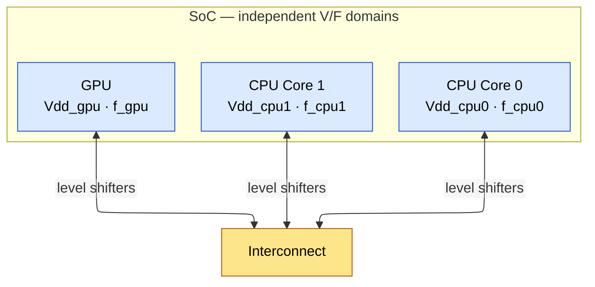
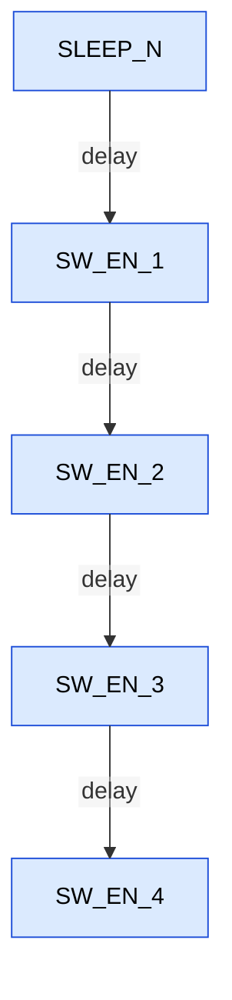
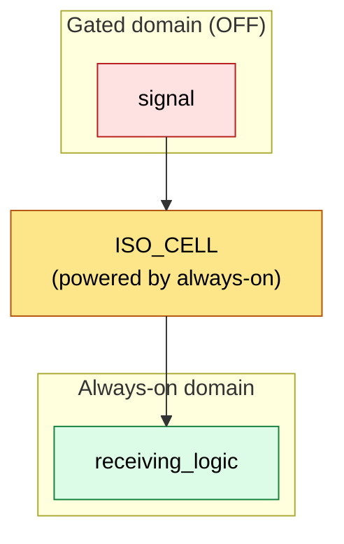

# Power Reduction Techniques for Digital IC / ASIC Design

## 1. Overview of Power Reduction Strategies

Power reduction techniques span all abstraction levels. The higher in the stack you apply
them, the greater the potential savings -- but also the greater the design effort.

| Level          | Techniques                                          | Typical Impact |
|----------------|-----------------------------------------------------|----------------|
| System/Arch    | DVFS, power gating, dark silicon, HW accelerators   | 10-100x        |
| Micro-arch     | Clock gating, operand isolation, memory partitioning | 2-10x          |
| Logic/RTL      | Encoding, resource sharing, FSM optimization         | 10-30%         |
| Gate-level     | Multi-Vt, gate sizing, buffer optimization           | 10-30%         |
| Circuit        | Adiabatic, body biasing, custom cells                | 5-20%          |
| Physical       | Wire optimization, placement for activity            | 5-15%          |

**Flow map -- where each technique enters the chip design flow:**

```verilog
Architecture Definition
  |-- Power budgeting (per block)
  |-- Choose power management strategy (DVFS, PG, CG)
  v
RTL Design
  |-- Clock gating (manual + auto-insert)
  |-- Operand isolation
  |-- Memory partitioning
  |-- Retention register identification
  v
UPF Specification
  |-- Power domains, supplies, states
  |-- Isolation, retention, level shifters
  v
Power-Aware Simulation
  |-- Simulate power-on/off sequences
  |-- Verify isolation, retention, level shifting
  v
Synthesis
  |-- Multi-Vt assignment
  |-- Clock gating insertion
  |-- Cell sizing optimization
  v
Floorplanning
  |-- Power domain placement
  |-- Power grid planning (per domain)
  |-- Switch cell placement
  v
Place & Route
  |-- Isolation cell insertion and placement
  |-- Level shifter insertion
  |-- Retention cell swapping
  |-- Power switch (header/footer) insertion
  |-- Power grid routing
  v
Power Analysis & IR Drop
  |-- Vector-based dynamic power
  |-- Leakage power at all corners
  |-- Static and dynamic IR drop
  |-- EM (electromigration) analysis
  v
Signoff
  |-- All power checks clean
  |-- IR drop within budget
  |-- EM clean
  |-- Thermal analysis OK
```

---

## 2. Clock Gating -- Deep Dive

Clock distribution typically consumes 30-50% of total dynamic power in a synchronous design.
Every flip-flop input sees a toggling clock every cycle, regardless of whether new data is
being captured. Clock gating eliminates unnecessary clock toggles to idle registers.

### 2.1 Basic Concept

```verilog
Without clock gating:
  always @(posedge clk)
    q <= d;            // Clock toggles every cycle regardless

With clock gating:
  always @(posedge clk)
    if (enable)
      q <= d;          // Synthesizer infers ICG cell: gated_clk = clk & enable(latched)
```

### 2.2 ICG (Integrated Clock Gating) Cell -- Transistor-Level Design

There are three common ICG architectures:

**Architecture 1: Latch-AND (Industry Standard)**

```ascii-graph
              ___
  EN ------->|   |
             | L |---+
  CLK ------>|___|   |     _____
   (active   latch   +--->|     |
    low       (neg    |    | AND |---> GCLK
    transparent)  EN_L+--->|_____|
                           ^
  CLK --------------------|
```

The enable signal is latched on the NEGATIVE edge of the clock (latch is transparent
when CLK=0). The latched enable is ANDed with CLK to produce the gated clock.

**Why latch on negative edge?**
The enable must be stable during the positive edge of the clock (when flip-flops capture
data). Latching on the negative edge gives a full half-cycle setup window for the enable
signal. If enable changes during CLK=1 (positive phase), the latch is opaque and the
change is blocked until the next negative edge.

**Timing constraint on enable:**
```verilog
  Conservative house rule: enable stable by t_falling_edge - t_setup_ICG
  (arrive before the latch opens -- no time borrowing through transparency)

  Typical setup time of ICG cell: 50-200 ps (process dependent)
  Hard requirement: the transparent-low latch CLOSES at the next RISING
  edge, so the enable formally has until that rising edge and may borrow
  through the low phase. See 2.12 for precise STA semantics.
```

**Transistor-level implementation (Latch-AND):**
```verilog
                  Vdd
                   |
                [PMOS]--- (CLK_b drives gate)
                   |
  EN ----+----[PMOS]--- (EN_b)     Transmission gate latch
         |         |                (transparent when CLK=0)
         |     [inv]---EN_latched
         |         |
  EN ----+----[NMOS]--- (EN)
                   |
                [NMOS]--- (CLK drives gate)
                   |
                  GND

  Then: GCLK = EN_latched AND CLK  (2-input AND or NAND+INV)
```

**Architecture 2: AND-based (no latch, NOT recommended)**

```verilog
  GCLK = CLK AND EN

  Problem: glitches on EN during CLK=1 propagate directly to GCLK
  -> Can create clock glitches -> metastability / data corruption
  -> NEVER used in production designs for this reason
```

**Architecture 3: NAND-based with inverted clock convention**

```verilog
  GCLK = NOT(NOT(CLK) NAND EN_latched)

  Functionally equivalent to Latch-AND but uses NAND which may be faster
  in some cell libraries. Output clock is active-high same as input.
```

### 2.3 AND-Type vs OR-Type ICG Cells

```verilog
AND-type ICG (clock gating for active-high enables, INDUSTRY STANDARD):

  GCLK = CLK & EN_latched

  The latch captures EN on the NEGATIVE phase (transparent when CLK=0).
  During CLK=1: latch is opaque, EN_latched is stable.
  AND gate: GCLK is HIGH only when both CLK=1 AND EN_latched=1.

  Use when: gating signal is active-HIGH enable (1 = clock enabled).
  This is the default for 95%+ of clock gating in digital designs.
  When EN=0: GCLK is stuck LOW -> flip-flops see no rising edge.

OR-type ICG (clock gating for active-low enables):

  GCLK = CLK | EN_latched_n

  The latch captures EN on the POSITIVE phase (transparent when CLK=1).
  During CLK=0: latch is opaque, EN_latched is stable.
  OR gate: GCLK is LOW only when both CLK=0 AND EN_latched_n=0.

  Use when: gating signal is active-LOW (0 = clock enabled).
  When EN=1: GCLK is stuck HIGH -> flip-flops see no rising edge.

  Rare in practice -- most designs use AND-type with inverted enable if needed.

When to use each:
  - AND-type: standard register file gating, pipeline stage gating, module gating
  - OR-type: rarely needed; some negative-edge-triggered designs use it
  - Most synthesis tools only insert AND-type ICG cells

Timing of enable relative to clock:
  AND-type: EN must be stable by FALLING edge of CLK (setup to negedge)
  OR-type:  EN must be stable by RISING edge of CLK (setup to posedge)

  The setup requirement is to the INACTIVE edge, not the active edge.
  This gives a full half-cycle for enable to propagate from launching FF.
```

### 2.4 Clock Gating Enable Generation from RTL

```verilog
The synthesis tool infers ICG from these RTL patterns:

Pattern 1: if-else with clocked assignment (MOST COMMON)
  always @(posedge clk)
    if (enable)           // <-- ICG inferred here
      q <= d;

  Tool actions:
    1. Extracts "enable" as the gating signal
    2. Inserts ICG cell on the clock path
    3. Removes the mux on D input (saves combinational logic)

  Without clock gating: tool implements D-input mux
    always @(posedge clk)
      q <= enable ? d : q;  // mux on D, clock always toggles

Pattern 2: Explicit clock gating (manual)
  wire gated_clk;
  ICG_CELL u_icg (.CLK(clk), .EN(enable), .GCLK(gated_clk));
  always @(posedge gated_clk)
    q <= d;

Pattern 3: Module-level gating (coarse-grain)
  // In the power management controller:
  always @(posedge clk) begin
    if (module_active)
      module_clk_en <= 1;
    else
      module_clk_en <= 0;
  end
  // ICG for entire module inserted at clock entry point

Module-level vs gate-level clock gating:
  Module-level: one ICG for entire module (1 cell for 10K FFs)
    - Controlled by software/firmware
    - Gating efficiency depends on module idle time
    - Very low area overhead

  Gate-level (RTL-inferred): one ICG per 4-64 FFs
    - Controlled by data path enables
    - Gating efficiency depends on data-dependent activity
    - Higher area overhead (many ICG cells)
    - Typical: 5-8% area increase, 20-40% power reduction

  Best practice: use BOTH. Module-level for sleep modes,
  gate-level for dynamic activity reduction during active operation.
```

### 2.5 Fine-Grain vs Coarse-Grain Clock Gating

| Aspect | Fine-Grain | Coarse-Grain |
|--------|-----------|--------------|
| Granularity | 4-16 FFs per ICG | 100-1000+ FFs per ICG |
| Area overhead | High (many ICGs) | Low (few ICGs) |
| Gating efficiency | High (precise control) | Lower (all-or-nothing) |
| Typical source | Synthesis auto-insertion | Architecture/RTL manual |
| Example | Register enable per field | Module-level sleep |

**Synthesis auto-insertion threshold:**

```tcl
# In Design Compiler:
set_clock_gating_style -minimum_bitwidth 4  ; # Gate groups of 4+ FFs
set_clock_gating_style -max_fanout 64       ; # Max FFs per ICG
compile_ultra -gate_clock
```

The tool identifies registers with a common enable signal and inserts ICG cells. The enable is factored out of the D-input logic and connected to the ICG.

### 2.6 Clock Gating Efficiency (CGE) and Power Savings Calculation

CGE = fraction of clock cycles where the clock is gated (disabled):

- **CGE** = `N_gated_cycles / N_total_cycles`

Power savings from clock gating a group of N flip-flops:

P_saved = CGE * N * C_clk_per_FF * Vdd^2 * f_clk

where C_clk_per_FF includes:
- Clock pin capacitance of the flip-flop (~2-5 fF)
   - Clock wire capacitance to reach that FF (~2-10 fF)
   - Clock buffer drive capacitance allocated per FF (~1-3 fF)
   - Total: ~5-18 fF per FF (let's use 10 fF as typical)

**Numerical Example:**
```verilog
Given:
  N = 1000 flip-flops in a register file
  C_clk_per_FF = 10 fF (including wire and buffer share)
  f_clk = 500 MHz
  Vdd = 0.9V
  CGE = 0.70 (register file accessed 30% of cycles)

P_saved = 0.70 * 1000 * 10e-15 * (0.9)^2 * 500e6
        = 0.70 * 10e-12 * 0.81 * 5e8
        = 0.70 * 4.05e-3
        = 2.835 mW

ICG cell overhead:
  Area: ~2x a minimum inverter = ~1 um^2 in 28nm
  Power: ~5 uW per ICG (clock input toggles, adds small load)
  Number of ICG cells: maybe 50-100 (one per 10-20 FFs)
  Total overhead: 50 * 5uW = 0.25 mW

Net savings: 2.835 - 0.25 = ~2.6 mW
```

### 2.7 Hierarchical Clock Gating

```verilog
Level 1: Module-level gating
  - Gate the entire clock to a submodule when it's idle
  - Example: gate clock to UART when UART is disabled
  - CGE can be very high (>95% for rarely-used peripherals)
  - Controlled by software or power management unit

Level 2: Cluster-level gating
  - Gate groups of related registers (e.g., a pipeline stage)
  - 8-32 FFs per ICG cell
  - Medium CGE (40-70%)

Level 3: Fine-grain (RTL-inferred) gating
  - Synthesis tool inserts ICG for "if(en) q <= d" patterns
  - 1-8 FFs per ICG cell (configurable minimum)
  - CGE varies widely (10-90%)
```

Area overhead trade-off:
- Each ICG cell costs ~1-2x minimum inverter area
- Fine-grain gating: 5-8% area overhead typical
- But fine-grain gating saves more power than coarse-grain (captures more idle cycles)
- Optimal: combine hierarchical (coarse) + fine-grain, let synthesis handle the rest

### 2.8 Synthesis Tool Commands for Clock Gating

```tcl
# Synopsys Design Compiler
# Enable clock gating insertion
set_clock_gating_style \
  -sequential_cell latch \
  -positive_edge_logic {integrated} \
  -negative_edge_logic {integrated} \
  -control_point before \
  -control_signal scan_enable \
  -minimum_bitwidth 4 \
  -max_fanout 64

# Minimum bitwidth: don't insert ICG for fewer than 4 FFs (overhead not worth it)
# Max fanout: limit ICG fanout to 64 FFs (CTS will struggle with more)

# Report clock gating results
report_clock_gating -nosplit > clock_gating.rpt

# Cadence Genus
set_db design_clock_gating_max_fanout 32
set_db design_clock_gating_min_bitwidth 3
set_attribute lp_insert_clock_gating true [current_design]
```

### 2.9 Clock Gating and Scan (DFT Considerations)

During scan shift, ALL flip-flops must be clocked every cycle. Clock gating would block
the scan clock. Solution:

```verilog
  GCLK = CLK AND (EN_latched OR SCAN_ENABLE)

  During scan: SCAN_ENABLE=1 -> GCLK = CLK always (gating bypassed)
  During functional mode: SCAN_ENABLE=0 -> GCLK = CLK AND EN_latched
```

The ICG cell has a dedicated test/scan_enable pin for this purpose.

### 2.10 Sequential / Data-Driven Clock Gating (Beyond Synthesis Inference)

Synthesis-inferred gating only captures explicit `if (en) q <= d` patterns. Two stronger
levels exist, and mid-level interviews increasingly probe them:

**XOR self-gating (data-driven gating):**
```verilog
// Build the enable from actual data change detection:
assign change = |(d_bus ^ q_bus);   // any bit differs?
// gated_clk = ICG(clk, change)
always @(posedge gated_clk)
  q_bus <= d_bus;
```
- Clock fires only when the data ACTUALLY changes -- no architectural enable needed.
- Cost: 1 XOR per bit + wide OR reduction tree + ICG.
- Pays off for wide registers (>16 bits) with low data activity (<10-20% change rate).
- Catch: the D -> XOR -> OR-tree -> ICG enable path adds delay to an already-tight
  enable timing path (see 2.12). For very wide buses, pipeline the OR tree or gate
  per-byte instead of per-word.

**Stability/observability-based (sequential) clock gating:**

Tools (Siemens PowerPro lineage, Cadence Joules RTL Design Studio, Synopsys
PrimePower RTL guidance flow) analyze MULTI-CYCLE behavior:
Observability don't-care (ODC) gating:
If the downstream consumer ignores this register's output for N cycles
(e.g., result register read only when valid_out=1), the register may be
gated even while "new" data arrives -- it computes values nobody observes.

**Stability-condition gating:**
   - If the enable condition provably implies D == Q in some cycles
   - (recirculation), strengthen the enable to exclude those cycles.
Because these transformations change cycle-by-cycle behavior on don't-care cycles,
they CANNOT be verified by combinational equivalence checking. They require
**sequential equivalence checking (SLEC)** -- this distinction is a classic
interview checkpoint.

**Enable strengthening at RTL (manual, very common in practice):**
```text
// Before: multiplier result register clocks every cycle
always @(posedge clk) result <= a * b;

// After: gate with the pipeline valid, one stage earlier
always @(posedge clk) valid_d <= valid_in;
always @(posedge clk) if (valid_in) result <= a * b;  // ICG inferred from valid_in
```

### 2.11 Debugging Low Clock-Gating Efficiency (Real-World Flow)

Scenario you should be able to narrate in an interview: *"Architecture predicted 80%
CGE; emulation/silicon shows 35%. Find out why."*

```verilog
Step 1: Collect per-ICG enable activity
  - RTL sim or emulation -> SAIF/FSDB -> per-ICG toggle/enable statistics
  - Tools report: ICG instance, fanout (#FFs), %cycles enabled

Step 2: Separate the two metrics (people conflate them):
  - ICG COVERAGE   = % of FFs whose clock passes through any ICG
                     (structural; target >95% for a well-gated design)
  - CGE            = % of cycles actually gated (workload-dependent)
  High coverage + low CGE = enables are weak, not missing.

Step 3: Rank offenders by wasted clock power:
  waste(ICG_i) = fanout_i * %cycles_enabled_i * C_clk_per_FF * Vdd^2 * f

Step 4: Classify root causes (the usual suspects):
  a) Enable stuck near 1: upstream "valid" free-runs even when data is garbage
     -> fix at source: qualify valid with downstream ready / FSM busy
  b) Recirculating mux survived: q <= en ? d : q coded in a way the tool
     could not extract (e.g., enable buried under reset priority logic)
     -> recode: separate reset and enable branches
  c) Gating too fine-grained: ICG with fanout 2-3 whose own clock pin +
     latch power exceeds savings -> raise minimum_bitwidth, merge groups
  d) No hierarchical gating: leaf ICGs gate FFs but the 2,000 clock buffers
     above them still toggle -> add cluster/root-level ICG driven by
     module idle (FSM state, no outstanding transactions)
  e) Wrong observation window: CGE measured during a busy benchmark says
     nothing about idle power -- always report CGE per workload/mode

Step 5: Verify the fix moves CLOCK TREE power, not just register power:
  In a well-gated design, clock distribution power should drop roughly
  proportionally to CGE at each level of the tree.
```

### 2.12 ICG Cells in CTS and Enable Timing Closure

**Where the ICG sits in the clock tree matters:**
```verilog
ICG near ROOT:                       ICG near LEAVES:
  + gates all buffers below it        + enable timing is easy
    (max power savings)                 (full insertion delay of tree
  - enable path must arrive             gives margin)
    EARLIER (less clock network       - buffers above still toggle
    insertion delay as margin)          (less power saved)
  - one enable for many FFs          - more ICG instances (area)
```
CTS performs **ICG cloning** (split one ICG into copies placed near sink clusters
when fanout/skew is unmanageable) and **de-cloning** (merge equivalent ICGs to save
power/area). Modern flows (ICC2 concurrent clock-and-data, Innovus CCOpt) treat
ICG placement as a primary CTS optimization target.

**Why the enable path is the hard part -- be precise here (common interview trap):**
```verilog
Plain AND gating (no latch), enable launched by a posedge FF:
  Enable changes at t = tcq, while CLK is HIGH (pulse [0, T/2])
  -> changes the gating value mid-pulse -> truncated/glitched clock pulse
  -> this is a clock-gating HOLD violation BY CONSTRUCTION.
  PrimeTime models this: enable may only change while the clock is LOW
  (setup checked against the next rising edge, hold against the falling edge).

Latch-based ICG (transparent-low latch + AND):
  The latch is OPAQUE while CLK=1 -> blocks mid-pulse enable changes (hold solved)
  The latch closes at the RISING edge -> enable effectively has until the next
  rising edge to settle (nearly a full cycle, with transparency through the
  low phase).
  Many teams still constrain enable arrival to the FALLING edge as a margin
  policy (no time borrowing into the transparent window) -- know the
  difference between the hard requirement and the house rule.
```
With ICGs pulled toward the root, the enable's effective capture point moves
EARLIER in time (less insertion delay downstream of the ICG), tightening the path.
Standard fixes: register the enable one stage earlier, push the ICG one level
down, let CTS apply useful skew to the ICG's clock pin, or pipeline wide enable
logic (see XOR self-gating above).

---

## 3. Dynamic Voltage and Frequency Scaling (DVFS) -- Deep Dive

### 3.1 Voltage-Frequency Relationship from Gate Delay

Gate delay in short-channel regime (velocity saturation):

T_d = C_L * Vdd / I_drive

I_drive ~ mu * Cox * (W/L) * (Vgs - Vth)^alpha

- **where alpha** = `velocity saturation factor:`
   - alpha = 2.0 for long-channel (square law)
   - alpha = 1.0-1.4 for short-channel (velocity saturated)
   - alpha ~ 1.3 is typical for modern FinFET

**Therefore:**
   - T_d ~ C_L * Vdd / ((Vdd - Vth)^alpha)
   - f_max ~ (Vdd - Vth)^alpha / (C_L * Vdd)

For alpha = 1.3:
```verilog
  f_max proportional to (Vdd - Vth)^1.3 / Vdd

  Example (Vth = 0.3V):
    Vdd = 1.0V: f ~ (0.7)^1.3 / 1.0 = 0.636
    Vdd = 0.9V: f ~ (0.6)^1.3 / 0.9 = 0.576  -> 9.4% slower
    Vdd = 0.8V: f ~ (0.5)^1.3 / 0.8 = 0.505  -> 20.5% slower
    Vdd = 0.7V: f ~ (0.4)^1.3 / 0.7 = 0.420  -> 34.0% slower
    Vdd = 0.5V: f ~ (0.2)^1.3 / 0.5 = 0.214  -> 66.4% slower
```

### 3.2 Voltage-Frequency Curve Derivation

For a gate with delay T_d proportional to Vdd / (Vdd - Vth)^alpha:

For constant delay (same performance): Vdd must scale with frequency
If f doubles: T_d halves -> need Vdd to increase
Roughly: Vdd proportional to f for constant delay
(at Vdd >> Vth: T_d ~ Vdd / Vdd^alpha = 1/Vdd^(alpha-1),
so Vdd ~ f^(1/(alpha-1)))

- **For alpha** = `1.3: Vdd ~ f^(1/0.3) = f^3.33`
   - If f increases 20%: Vdd must increase ~80%
   - This is why small frequency increases cost enormous power!

**Detailed operating points table with derivation:**

```verilog
Assume: 7nm FinFET, Vth = 0.25V, alpha = 1.3
Base design at 0.75V, 2.0 GHz

| OPP     | Vdd(V) | F(GHz) | Vdd-Vth | Relative T_d | Relative P_dyn | Use Case         |
|---------|--------|--------|---------|-------------|----------------|-------------------|
| Turbo   | 0.95   | 2.8    | 0.70    | 0.72x (fast)| 1.78x          | Peak burst        |
| Nominal | 0.80   | 2.0    | 0.55    | 1.00x (ref) | 1.00x          | Sustained         |
| SVS     | 0.70   | 1.4    | 0.45    | 1.33x       | 0.64x          | Light load        |
| Low     | 0.60   | 0.8    | 0.35    | 1.90x       | 0.34x          | Background        |
| Min     | 0.50   | 0.4    | 0.25    | 2.98x       | 0.14x          | Always-on sensor  |

Relative P_dyn = (Vdd/Vdd_ref)^2 * (f/f_ref)
  Turbo:  (0.95/0.80)^2 * (2.8/2.0) = 1.41 * 1.40 = 1.97 (close to 1.78 with rounding)
  SVS:    (0.70/0.80)^2 * (1.4/2.0) = 0.766 * 0.70  = 0.54
  Low:    (0.60/0.80)^2 * (0.8/2.0) = 0.563 * 0.40  = 0.23
  Min:    (0.50/0.80)^2 * (0.4/2.0) = 0.391 * 0.20  = 0.08

Power at Turbo = 1.97x the nominal -> thermal throttling kicks in within seconds.
Power at Min   = 0.08x nominal -> 92% dynamic power reduction for background tasks.
```

### 3.3 Power Savings Calculation

```verilog
P_dynamic = C * Vdd^2 * f

If f scales as (Vdd - Vth)^alpha / Vdd:
  P ~ C * Vdd^2 * (Vdd - Vth)^alpha / Vdd
  P ~ C * Vdd * (Vdd - Vth)^alpha

For a 20% Vdd reduction (1.0V -> 0.8V, Vth=0.3V):
  f ratio = (0.5/0.8) / (0.7/1.0)^1.3 = (0.5^1.3/0.8) / (0.7^1.3/1.0)
          = 0.505 / 0.636 = 0.794  -> 20.6% slower
  P ratio = (0.8 * 0.5^1.3) / (1.0 * 0.7^1.3)
          = (0.8 * 0.4040) / (1.0 * 0.6360) = 0.323 / 0.636 = 0.508 -> 49.2% power savings!

Summary: 20% voltage reduction -> ~21% frequency loss -> ~49% dynamic power savings
This is why DVFS is the most powerful knob for dynamic power.
```

### 3.4 Operating Performance Points (OPPs)

A real-world DVFS table for a mobile SoC (representative values):

| OPP Name     | Voltage (V) | Frequency (GHz) | Dynamic Power | Leakage Power | Use Case              |
|--------------|-------------|------------------|---------------|---------------|-----------------------|
| Turbo        | 1.05        | 2.8              | 100% (ref)    | 100%          | Peak benchmark        |
| Nominal      | 0.90        | 2.0              | 55%           | 70%           | Sustained workload    |
| SVS          | 0.75        | 1.2              | 27%           | 45%           | Medium workload       |
| SVS-L1       | 0.65        | 0.8              | 15%           | 30%           | Light workload        |
| Low Power    | 0.55        | 0.4              | 6%            | 18%           | Background tasks      |
| Retention    | 0.50        | 0 (clock off)    | 0%            | 12%           | State retention only  |

### 3.5 DVFS Controller Architecture

```ascii-graph
                    +-------------------+
  Software DVFS     |  Performance      |
  Governor (Linux)  |  Monitoring Unit  |
  (cpufreq)         |  (PMU counters)   |
        |           +--------+----------+
        v                    |
  +-----+--------+          |
  | DVFS          |<---------+
  | Controller    |
  | (Hardware)    |
  +---+------+----+
      |      |
      v      v
  +---+--+ +-+------+
  | PMIC | | PLL /  |
  | (Vdd)| | Divider|
  +------+ +--------+
```

**Voltage-Frequency Change Sequence (CRITICAL for interviews):**

**Increasing performance (scaling UP):**
```verilog
1. Increase voltage FIRST (wait for PMIC settling: 10-50 us typical)
2. THEN increase frequency (PLL relock: 5-20 us)

Why this order: if you increase frequency first at the old (lower) voltage,
timing violations occur because gates are too slow -> functional failure.
```

**Decreasing performance (scaling DOWN):**
```verilog
1. Decrease frequency FIRST (divider change: <1 us, or PLL relock: 5-20 us)
2. THEN decrease voltage (wait for PMIC settling: 10-50 us)

Why this order: if you decrease voltage first at the old (higher) frequency,
same problem -- timing violations at the new lower voltage.
```

**Total transition time:** 20-100 us depending on PMIC speed and PLL architecture.
During this time, the processor is operational but at a non-optimal operating point.

### 3.6 DVFS Controller Decision Logic

```verilog
How the DVFS controller decides V/F level:

Method 1: Utilization-based (most common in mobile SoCs)
  1. Hardware performance counters track:
     - Instructions per cycle (IPC)
     - Cache miss rate
     - Pipeline stall cycles
     - Memory bandwidth utilization
  2. OS governor samples counters every 10-100 ms
  3. Decision algorithm:
     utilization = busy_cycles / total_cycles

     if utilization > 80%: scale UP to next OPP
     if utilization < 30%: scale DOWN to lower OPP
     if 30% < utilization < 80%: maintain current OPP
  4. Hysteresis: require N consecutive samples above/below threshold
     to prevent oscillation (typically N=3 samples at 50ms each = 150ms)

Method 2: Workload prediction (used in modern CPUs)
  - Track workload history (last 10-100 ms)
  - Predict next interval's demand using moving average
  - Preemptively adjust V/F before the workload arrives
  - Reduces response latency for bursty workloads

Method 3: Critical path monitor (hardware AVS)
  - On-die ring oscillators or replica delay lines
  - Measure actual silicon speed in real-time
  - If replica path is faster than needed -> reduce Vdd
  - If replica path is too slow -> increase Vdd
  - Per-chip optimization: fast silicon saves 50-100 mV
```

### 3.7 Adaptive Voltage Scaling (AVS)

Silicon varies. Two chips from the same wafer can have 10-20% speed difference due to
process variation. DVFS uses a fixed voltage for each frequency -- sized for the WORST
chip. AVS adjusts voltage per-chip based on actual silicon speed.

**Implementation approaches:**

1. **Ring oscillator monitors:**
```verilog
   Place ring oscillators on-die that mimic critical path delay.
   Ring oscillator frequency indicates actual silicon speed.
   
   Fast silicon -> ring osc runs fast -> reduce voltage -> save power
   Slow silicon -> ring osc runs slow -> increase voltage to meet timing
   
   Savings: 50-100mV on fast silicon -> 10-20% power reduction
```

2. **Critical path replica monitors:**
```verilog
   Replicate actual critical paths and measure their delay
   More accurate than ring oscillators but harder to design/maintain
   Used in high-performance CPUs (Intel, AMD)
```

3. **In-situ timing monitors (speed sensors):**
```verilog
   Place shadow latches near critical endpoints that detect timing violations
   If violation detected -> increase voltage
   If no violations for N cycles -> decrease voltage
   Most aggressive approach: operates at the edge of failure
   Risk: must detect and recover from actual timing errors
   Used in some ARM designs (adaptive clocking + voltage)
```

### 3.8 Per-Domain DVFS

Modern SoCs have independent voltage/frequency domains:



Each domain has an independent PMIC rail (or LDO), an independent PLL/divider, level shifters at the domain boundaries, and a handshake protocol for cross-domain communication.

### 3.9 Voltage Regulation Hardware: PMIC vs IVR vs DLVR

Per-core/per-domain DVFS is only as good as the regulator granularity behind it.

| Regulator type | Location | Transition speed | Efficiency | Granularity | Example |
|----------------|----------|------------------|------------|-------------|---------|
| Board PMIC (buck) | Motherboard | 10-100 us | 85-92% | Per rail (coarse) | Most mobile SoCs |
| IVR / FIVR (integrated buck) | On-die + package inductors | ~1 us | 80-90% | Per domain | Intel Haswell-era FIVR |
| DLVR (digital LDO) | On-die, per IP | ns-us | = Vout/Vin (linear!) | Per core/cluster | Intel Core Ultra (Meteor/Arrow Lake) |
| Switched-capacitor | On-die | fast | 80-90% at fixed ratios | Per domain | Research/niche |

**Why per-core regulation matters:**
- **With one shared rail, Vdd** = `max(V_request of all cores)`
   - One core running AVX/turbo forces ALL cores to its voltage
   - Idle cores burn (V_shared/V_needed)^2 extra dynamic power

Intel's DLVR (Core Ultra 200S "Arrow Lake"): each P-core, each E-core
cluster, and the ring has its own digital linear regulator fed from the
shared VccIA input rail. The DLVR drops each domain to just-enough voltage.
- Linear regulator loss = (Vin - Vout) * I  -> efficient only when the
   - drop is small; a bypass ("power gate") mode shorts input to output
   - when the domain wants full rail voltage.
AMD Zen families: per-core digital LDOs + per-core DFS, driven by on-die
speed/power sensors (AMD calls the closed-loop system AVFS).

### 3.10 Voltage Regulator Response Time

```verilog
How fast can you change Vdd?

External PMIC (Power Management IC):
  - Buck converter on the PCB
  - Voltage change: 10-50 us settling time
  - Step size: 6.25 mV or 12.5 mV resolution
  - Limited by output inductor and capacitor
  - Most mobile SoCs use this (external PMIC)

On-die LDO (Low Dropout Regulator):
  - Analog LDO on the same die as the logic
  - Voltage change: 0.5-5 us settling time
  - Much faster than external PMIC
  - But LDO efficiency = Vout/Vin (at 0.6V out / 1.0V in = 60% efficient)
  - Used for fine-grain DVFS with fast transitions

DVFS transition overhead:
  Scale up:   10-50 us (wait for PMIC) + 5-20 us (PLL relock) = 15-70 us total
  Scale down: 5-20 us (PLL relock) + 10-50 us (voltage settles) = 15-70 us total

  During transition: logic continues at old V/F (safe but suboptimal)

  Energy wasted during transition:
    E_transition = P_old * T_transition / 2 (roughly, average of old and new)
    For a 50 us transition at 1W average: E = 25 uJ

  Minimum DVFS interval: transition cost must be amortized
    If saving 500 mW by switching down for T_idle:
    Break-even: 500mW * T_idle > 25 uJ -> T_idle > 50 us
    Practical minimum: 1-10 ms between DVFS transitions
```

### 3.11 AVFS, Droop Detection, and Adaptive Clocking

**Terminology ladder (know the difference):**
```verilog
DVFS: open-loop table of (V, f) operating points; firmware picks an entry
AVS:  closed-loop trim of V per chip (process) and per condition (T, aging)
      using on-die monitors -- recovers the worst-case-silicon guardband
AVFS: fully closed-loop V AND f management with distributed on-die sensors
      (speed monitors, droop detectors, power proxies) -- AMD's term
```

**The di/dt problem -- why firmware is too slow:**
```verilog
A load step (vector unit wakes, cache burst) causes L*di/dt droop through
the package/PDN. The "first droop" resonance is at ~50-300 MHz -> the rail
dips within NANOSECONDS. No regulator (us) or firmware loop (ms) can react.

Classical fix: carry a static voltage guardband (e.g., +50-80 mV) sized for
the worst droop that might ever happen. Cost at 0.9V nominal:
  2 * 60/900 = ~13% wasted dynamic power, ALL the time.
```

**Modern fix: droop detector + adaptive clock stretching:**
```verilog
1. On-die droop detector (analog comparator or tunable delay monitor)
   senses Vdd dipping below threshold        (latency: ~1-5 ns)
2. Adaptive clock module stretches the clock period by a few percent
   within a handful of cycles -- gate delays grew because V dropped,
   so the cycle time grows to match. Timing is preserved THROUGH the
   droop instead of margined against it.
3. When Vdd recovers, frequency ramps back.

Implementations:
  - AMD (since Steamroller, refined through Zen): PLL output passed
    through a DLL that produces ~40 phases; the clock stretcher inserts
    phases to lengthen the period smoothly with near-zero latency
  - IBM POWER9: adaptive clocking for droop protection (ISSCC 2017)
  - Intel: related concept in "AVX guardband / license-based frequency" --
    pre-emptively lowers f before enabling wide vector units

Benefit: removing a 50 mV permanent guardband at 0.9V recovers ~11% dynamic
power (P ~ V^2) or the equivalent frequency headroom, in exchange for a few
percent frequency loss only DURING actual droop events (rare, tens of ns).
```

### 3.12 DVFS in GPUs and AI Accelerators

```text
GPU power management stack:
  - Firmware PM controller (NVIDIA: on-die microcontroller running the
    power management stack; AMD: SMU) closes a ~ms control loop
  - Inputs: per-block activity counters, temperature sensors, current
    telemetry from the VRM, power proxies
  - Outputs: per-domain clocks (SM clock vs memory clock are separate
    domains), voltage requests, and THROTTLE events
  - Constraints enforced: total board power (TGP/power limit), current
    limits (AMD: PPT/TDC/EDC), temperature, di/dt ramp rates

Operator-visible knobs: power capping (e.g., nvidia-smi power limit),
clock pinning, per-workload frequency offsets.
```

**AI-era twist -- synchronized power swings (2025-2026 interview gold):**
```verilog
Training = thousands of GPUs in lock-step: compute burst -> collective
communication (compute idles) -> burst... The whole CLUSTER swings tens of
percent of MW-scale power at ms granularity. The grid and facility hate this.

Chip/rack-level mitigations (NVIDIA GB300 NVL72 example):
  - Energy storage in the power shelves (~65 J of electrolytic capacitance
    per GPU) absorbs short spikes and fills short dips
  - Ramp-rate-limited power capping at job start (caps rise gradually)
  - "Burn" mode: on abrupt job end, GPUs keep dissipating power briefly so
    the facility-visible load ramps DOWN smoothly instead of cliff-dropping
  - Net effect: up to ~30% reduction in peak grid demand for the same work

Inference serving angle: prefill is compute-bound (wants max clocks);
decode is bandwidth-bound -- SM clocks can drop with little latency impact
for a large energy saving. Phase-aware DVFS is an active serving-stack
optimization (ties directly to the AI-infra notes on disaggregated serving).
```

### 3.13 Sub-Threshold Operation (VDD < Vth)

Below Vth, transistors still conduct via diffusion current, but:

- Current drops exponentially: I ~ exp(VDD/Vt) for VDD < Vth
- Frequency drops to kHz-MHz range
- Ion/Ioff ratio approaches 1 -> poor noise margins
- Very sensitive to Vth variation (process corners spread widely)
- Used for ultra-low-power sensor nodes, pacemakers

- **At VDD** = `0.3V (sub-Vth for Vth=0.4V):`
   - Freq ~ 10-100 kHz (application-specific)
   - Power ~ 1-10 uW (nW-range for simple logic)
   - Energy per operation: LOWER than super-threshold! (E ~ CV^2 is quadratic)

---

## 4. Power Gating -- Deep Dive

### 4.1 Concept

Power gating physically disconnects a logic block from its supply rails when it is idle,
reducing leakage to near zero (only the switch transistor leakage remains).

```ascii-graph
        Vdd (always on)
         |
      [PMOS header switch]  <-- controlled by SLEEP_N signal
         |
        VVDD (virtual Vdd, switched)
         |
    +----+----+
    | Logic   |
    | Block   |  <-- powered by virtual Vdd
    +----+----+
         |
        GND (or virtual GND with footer switch)
```

### 4.2 Header (PMOS) vs Footer (NMOS) Switches

**Header switch (PMOS between Vdd and VVDD):**
**Advantages:**
   - Logic sees clean ground (no ground bounce)
   - Most ASIC designs use this
   - PMOS in N-well can be isolated (no body effect issues with well taps)

**Disadvantages:**
   - PMOS is weaker than NMOS for same area (~2x larger needed)
   - More area overhead

**Footer switch (NMOS between VSS and VVSS):**
**Advantages:**
   - NMOS is stronger for same area (higher mobility)
   - Smaller switch area
   - Faster power-up (lower resistance for same size)

**Disadvantages:**
   - Virtual ground (VVSS) bounces during switching -> more noise
   - Ground bounce can corrupt data in retention registers
   - Can cause issues with ESD protection paths

**Industry practice:** Header switches are more common in ASIC designs. Footer switches
are sometimes used in SRAM arrays (where the regular structure helps manage ground bounce).

### 4.3 Switch Sizing

The power switch must be large enough to supply the active current of the gated block,
while also controlling inrush current during power-up.

**Steady-state sizing:**
I_active = P_active / Vdd  (active current of the logic block)

Switch on-resistance: R_sw = Vdd_drop / I_active

Vdd_drop target: typically 5-10% of Vdd (to avoid excessive performance degradation)

**Example:**
   - P_active = 100 mW at Vdd = 0.9V
   - I_active = 100mW / 0.9V = 111 mA
   - Target IR drop = 5% * 0.9V = 45 mV
   - R_sw = 45 mV / 111 mA = 0.405 ohms

For a PMOS with R_on ~ 500 ohm*um (typical for 7nm header cell):
Required total width = 500 / 0.405 = ~1235 um

This is distributed across many switch cells (each ~5-10 um wide):
Number of switch cells = 1235 / 7.5 = ~165 switch cells

**Inrush current (rush current) sizing:**
When the switch turns on, internal capacitance charges from 0 to Vdd.
**If all switches turn on simultaneously:**

I_rush = C_internal * dV/dt

where:
C_internal = total decoupling + gate capacitance in the gated domain
dV/dt = rate of voltage rise on virtual Vdd

**To limit Ldi/dt noise on the package:**
   - I_rush < I_rush_max (set by package inductance and voltage noise budget)

**Example:**
   - C_internal = 10 nF (typical for a moderate-size block)
   - I_rush_max = 100 mA (from supply noise analysis)
   - Required dV/dt = 100mA / 10nF = 10 MV/s = 10V/us
   - Time to charge to 0.9V: 0.9V / (10V/us) = 90 ns

If this is too slow, either:
- Accept higher rush current (strengthen package decap)
   - Or use daisy-chain (staged) power-up

### 4.4 Rush Current: Controlled vs Uncontrolled Ramp

When power is restored, the virtual rail must charge from 0V to VDD. The parasitic capacitance of the entire gated domain (gate caps + wire caps + decoupling caps) creates a rush current.

```text
I_rush = C_total * dV/dt

Example:
  Domain area: 1 mm^2
  Decoupling cap: ~10 nF/mm^2 (typical for dense logic)
  C_total = 10 nF
  Target ramp time: 10 us (controlled ramp to limit rush current)

  I_rush_max = C_total * VDD / T_ramp = 10e-9 * 0.8 / 10e-6 = 0.8 mA
  (This is very manageable)

  If uncontrolled (T_ramp ~ 1 ns -- switch turns on instantly):
  I_rush = 10e-9 * 0.8 / 1e-9 = 8A !!
  (This would cause massive IR drop, EM violations, and ground bounce)
```

### 4.5 Daisy-Chain (Staged) Power-Up

Instead of turning on all switches simultaneously, enable them sequentially with a
staggered delay:



```wavedrom
{ "signal": [
  { "name": "SW_EN_1", "wave": "01......" },
  { "name": "SW_EN_2", "wave": "0.1....." },
  { "name": "SW_EN_3", "wave": "0..1...." },
  { "name": "SW_EN_4", "wave": "0...1..." },
  {},
  { "name": "VVDD",    "wave": "x.2.3.4.", "data": ["low","mid","full"] }
], "head": { "text": "Daisy-chained delay cells stagger the power-switch enables so VVDD ramps gradually, limiting inrush di/dt" } }
```

Each switch cell turns on after the previous one has been on for one delay step.
This limits the instantaneous current to roughly I_rush / N_stages.

**Implementation in UPF:**
```verilog
create_power_switch CPU_SW \
  -domain PD_CPU \
  -input_supply_port {vin  VDD} \
  -output_supply_port {vout VDD_CPU} \
  -control_port {sleep_n CPU_SLEEP_N} \
  -on_state {on_state vin {!sleep_n}} \
  -off_state {off_state {sleep_n}}

# Physical implementation handles daisy-chain automatically
# during power switch insertion in ICC2/Innovus
```

### 4.6 Isolation Cells

When a power-gated domain is off, its outputs are undefined (floating/X). This can
corrupt always-on logic that receives these signals. Isolation cells clamp the outputs
to known values.

**Types of isolation cells:**

| Type           | Clamp Value | Implementation          | When to Use                      |
|----------------|-------------|-------------------------|----------------------------------|
| AND isolation  | 0           | AND(signal, !isolate)   | Data buses (force 0)             |
| OR isolation   | 1           | OR(signal, isolate)     | Active-low control signals       |
| Latch isolation| Last value  | Latch + MUX             | Status registers, config outputs |
| Clamp-low      | 0           | Tie to VSS when isolated| General data outputs             |
| Clamp-high     | 1           | Tie to VDD when isolated| Active-low resets, enables       |

**Isolation cell power supply:**
The isolation cell MUST be powered by the always-on supply (since it must function
when the gated domain is off). It is placed at the boundary of the power domain.



**Isolation control signal timing:**
```verilog
Isolation MUST be asserted BEFORE power is removed:
  1. Assert isolation -> outputs clamped to safe values
  2. Turn off power switch -> domain goes dark
  
Isolation MUST be deasserted AFTER power is restored:
  1. Turn on power switch -> domain powers up
  2. Wait for voltage to stabilize
  3. Initialize/restore state
  4. Deassert isolation -> live outputs propagate
```

### 4.7 Retention Registers

When a power-gated domain is turned off, all flip-flop state is lost. For domains that
need fast wake-up (avoid full re-initialization), retention registers save state before
power-down and restore it after power-up.

**Balloon Latch Design:**
```ascii-graph
                        Always-On Supply (VAO)
                              |
                +-------------+-------------+
                |     Shadow Latch          |
  D --->[Master]--->[Slave]--->[Save/Restore]---> Q
         ^         ^    |     ^
         |         |    |     |
        CLK      CLK   +---->+ SAVE/RESTORE signals
                        |
              Switchable Supply (VVDD)
              
  Normal operation:
    Master-slave FF operates normally (powered by VVDD)
    Shadow latch is idle (powered by VAO)
  
  Save (before power-down):
    SAVE pulse copies slave output to shadow latch
    Shadow latch retains value (powered by always-on VAO)
  
  Power-down:
    VVDD goes to 0. Master and slave lose state.
    Shadow latch maintains state on VAO.
  
  Power-up:
    VVDD restored. Master and slave are in unknown state.
  
  Restore (after power-up, before functional operation):
    RESTORE pulse copies shadow latch value back to slave
    FF now has its pre-power-down value
```

**Area and power overhead of retention FFs:**
```verilog
  Standard flip-flop:  ~16-20 transistors, area = 1x
  Retention flip-flop: ~28-36 transistors, area = 1.6-2.0x
  
  Always-on leakage of retention FF: ~2-5 nA per FF (for the shadow latch)
  For 10K retention FFs: 10,000 * 5nA = 50 uA * 0.9V = 45 uW always-on leakage
```

**Selective retention:**
```verilog
Not all state needs retention. To minimize area/leakage:
  - Retain: CPU architectural registers, interrupt state, power management state,
    bus configuration, security context
  - Do NOT retain: cache data (re-fetch from memory), pipeline state (flush and
    restart), debug registers (reinitialize)
    
Selective retention can reduce retention FF count by 80-90%, saving significant area.
```

### 4.8 Retention Register Transistor-Level Design (Balloon Register)

```ascii-graph
Schematic of a retention flip-flop with balloon (shadow) latch:

  Switchable VDD (VVDD)                    Always-On VDD (VDD_AO)
  ┌────────────────────────────┐           ┌──────────────────────┐
  │                            │           │                      │
  │  D ──[TG1]── Master ──[TG2]── Slave ──│── Q                  │
  │       ↑        Latch       ↑   Latch   │                      │
  │      CLK1                 CLK2         │                      │
  │                            │           │   Shadow Latch       │
  │                      [TG3]─┤───────────│──[TG4]── Retain ─────│
  │                       ↑    │           │   ↑     Latch        │
  │                     SAVE   │           │ RESTORE               │
  └────────────────────────────┘           └──────────────────────┘
  
  TG1/TG2: Transmission gates (clocked by CLK, powered by VVDD)
  TG3:     SAVE transmission gate (powered by VVDD for input, VDD_AO for output)
  TG4:     RESTORE transmission gate (powered by VDD_AO)
  
  Normal operation (VVDD = ON):
    Master-slave operates as normal FF
    Shadow latch is idle (SAVE=0, RESTORE=0)
    
  SAVE sequence (before power-down):
    1. Clock is stopped (no active edge)
    2. SAVE is pulsed HIGH: TG3 opens, Slave output -> Shadow input
    3. Shadow latch captures the bit on VDD_AO supply
    4. SAVE goes LOW: TG3 closes, Shadow holds the bit
    
  Power-down:
    VVDD ramps to 0V. Master and Slave lose all state.
    Shadow latch retains on VDD_AO. Only ~4-6 transistors draw leakage.
    
  RESTORE sequence (after power-up):
    1. VVDD is stable at target voltage
    2. Master/Slave are in unknown state (random)
    3. RESTORE is pulsed HIGH: TG4 opens, Shadow output -> Master input
    4. Master captures the saved bit from Shadow
    5. RESTORE goes LOW
    6. Next clock edge: Slave captures from Master -> Q has saved value
    
Area overhead: ~30-50% larger than standard FF
  Standard D-FF: ~16-20 transistors
  Retention D-FF: ~26-34 transistors (shadow latch + TG3/TG4 + control logic)
  
Leakage overhead: only the shadow latch leaks on the always-on rail
  Shadow latch: ~4-6 transistors, ~2-5 nA at 25C
  For 10K retention FFs: 10,000 * 5nA * 0.9V = 45 uW always-on leakage
  This is the cost of fast wake-up (vs. full re-initialization)
```

### 4.9 Complete Power-Up/Down Sequence

**Power-down sequence:**
```verilog
  t0: Software requests power-down for domain PD_CPU
  t1: Hardware waits for pending transactions to complete (drain pipeline)
  t2: Disable clocks to the domain (clock gating)
  t3: SAVE pulse -> retention FFs capture state to shadow latches
  t4: Assert isolation -> outputs clamped to safe values
  t5: Assert sleep (turn off power switches) -> VVDD ramps down
  t6: Domain is fully off. Only always-on logic and retention latches draw power.
```

**Power-up sequence:**
```verilog
  t0: Wake-up event (interrupt, timer, external signal)
  t1: Deassert sleep (turn on power switches, staged/daisy-chain)
      -> VVDD ramps up gradually
  t2: Wait for VVDD to reach stable voltage (monitor with voltage detector or
      fixed timer, typically 5-50 us)
  t3: Assert reset to the domain (put logic in known state)
  t4: RESTORE pulse -> retention FFs recover state from shadow latches
  t5: Deassert reset
  t6: Deassert isolation -> live outputs start propagating
  t7: Enable clocks
  t8: Domain is fully operational. Resume execution.
```

**Timing diagram:**
Retention **power-down** sequence — gate clocks, SAVE the state, assert isolation, then power off:

```wavedrom
{ "signal": [
  { "name": "CLK_EN",  "wave": "10....." },
  { "name": "SAVE",    "wave": "0.10..." },
  { "name": "ISO",     "wave": "0..1..." },
  { "name": "SLEEP_N", "wave": "1...0.." },
  { "name": "VVDD",    "wave": "1....x." }
], "head": { "text": "Power-down: gate clocks -> SAVE state -> assert ISO -> assert SLEEP (power off) -> VVDD collapses" } }
```

Retention **power-up** sequence — power on, restore, de-isolate, resume:

```wavedrom
{ "signal": [
  { "name": "SLEEP_N", "wave": "0.1...." },
  { "name": "VVDD",    "wave": "x.1...." },
  { "name": "RESTORE", "wave": "0...10." },
  { "name": "ISO",     "wave": "1....0." },
  { "name": "CLK_EN",  "wave": "0.....1" }
], "head": { "text": "Power-up: SLEEP off (power on) -> VVDD ramps -> RESTORE state -> de-assert ISO -> resume clocks" } }
```

### 4.10 Power-Up Timing with In-Rush Current Management

```verilog
Detailed power-up sequence with timing:

  t0: Wake-up event (interrupt, timer)
  t1: PMU asserts SLEEP_N deassertion (start turning on header switches)
      - Daisy-chain: group 0 turns on first
      - Each group delayed by ~200 ns from the previous
      - With 10 groups: total ramp time = 10 * 200 ns = 2 us
      - In-rush current limited to: I_domain / N_groups
        = 100 mA / 10 = 10 mA per group (manageable)
        
      Without daisy-chain:
        I_rush = C_domain * VDD / T_ramp_uncontrolled
               = 10 nF * 0.8V / 1 ns (instantaneous switch)
               = 8A !! (catastrophic Ldi/dt, package bondwire fuse risk)
        
  t2: VVDD reaches 90% of VDD (after ~2 us)
      Voltage detector signals "power good"
      
  t3: PMU asserts RESET to domain (1 us minimum pulse width)
      All FFs go to known state (0)
      
  t4: PMU asserts RESTORE to retention FFs (1 us minimum pulse width)
      Shadow latches write back to master/slave
      
  t5: PMU deasserts RESET (synchronous to clock!)
      Domain FFs now have restored values
      
  t6: PMU deasserts ISOLATION
      Domain outputs go from clamped values to live logic
      
  t7: PMU enables clocks (via clock gating deassertion)
      First functional clock edge
      
  t8: Domain is fully operational
      Total wake-up time: ~5-15 us (domain dependent)

Critical ordering violations and their consequences:
  ISOLATION deasserted before VVDD stable:
    -> Outputs are undefined (random) -> corrupt always-on domain
  RESTORE before VVDD stable:
    -> Shadow latch data transfers incorrectly -> silent data corruption
  Clock enabled before RESET deasserted:
    -> FFs clock in garbage data for 1+ cycles
  RESET deasserted asynchronously:
    -> Recovery/removal violation on FFs -> metastability
```

### 4.11 State Retention Power Gating (SRPG) vs Full Power Gating

| Feature              | SRPG (with retention)        | Full Power Gating            |
|----------------------|------------------------------|------------------------------|
| State preservation   | Yes (selected registers)     | No (all state lost)          |
| Area overhead        | ~10-20% (retention FFs)      | ~3-5% (switches + ISO only)  |
| Always-on leakage    | Higher (shadow latches)      | Lower (only ISO cells)       |
| Wake-up latency      | Fast (5-50 us)               | Slow (ms: full boot/init)    |
| Design complexity    | Higher                       | Lower                        |
| Use case             | CPU cores, DSPs              | Peripherals, rarely-used IPs |

### 4.12 Physical Implementation of Power Switches (PnR View)

**Switch placement styles:**
```verilog
RING style:                          COLUMN/GRID style:
  switches form a ring around          switch cells in regular columns
  the domain boundary                  distributed across the domain
  + minimal disturbance to             + uniform IR drop on virtual rail
    internal placement/routing         + scales to large domains
  - IR sags toward the middle          - placement blockages everywhere
  -> small hard macros, IP blocks      -> the default for big domains
```
- **Coarse-grain MTCMOS** (shared switches powering many cells via a virtual
  rail) is the industry standard. **Fine-grain** (a sleep transistor inside
  every cell) costs 2-4x area and is essentially never used in ASIC flows.
- Switch cells come in **mother/daughter (dual-stage)** variants: a weak
  "trickle" transistor chain turns on first to charge the domain slowly,
  then the strong main chain engages once VVDD reaches ~90% -- the in-cell
  version of daisy-chained wake-up.

**What the implementation tools actually do:**
```verilog
1. Read UPF -> know which domain is switched, which strategy
2. Insert switch array (ICC2: create_power_switch_array / Innovus:
   addPowerSwitch -column ...), hook acknowledge chain for staged wake
3. Route virtual rail (VVDD) as a separate net from the parent rail
4. Place always-on (AON) buffers for any signal that must cross or live
   inside the OFF domain (feedthroughs, retention controls, isolation
   enables) -- these get SECONDARY PG pin routing to the AON supply
5. Sign off:
   - ON-state IR: the switch network adds series resistance; budget an
     extra 1-3% drop on top of the grid budget
   - Ramp-up (rush current) dynamic sim: Voltus/RedHawk transient with
     the staging delays -- verify parent rail droop stays in budget and
     wake time meets spec
   - Wake latency check: time from sleep_n deassert to VVDD at 95%,
     measured at the FARTHEST corner of the domain from the switches
```

### 4.13 Power-Gating Verification and the Classic Bug Catalog

**Static low-power checks (Synopsys VC LP, Cadence Conformal Low Power):**
missing isolation on a domain output, isolation cell powered by the wrong
(switched!) supply, level shifter wrong direction, retention supply hookup
errors, control signals (save/restore/iso_en) sourced FROM the domain they
control, AON buffer placed on the switched rail.

**Power-aware simulation (UPF-driven):** simulator corrupts all domain
state to X on power-down; checks isolation clamps actually hold values,
domain recovers through reset/restore, random sleep-injection tests pass.

**Bug catalog worth telling as war stories:**
```verilog
1) Isolation enable polarity inverted
   Symptom: chip works perfectly... until the first sleep entry, then the
   fabric hangs (X / garbage propagated into the always-on interconnect).

2) Restore fired before the rail was stable at the far corner
   Symptom: sporadic single-bit state corruption after wake, worse at cold
   temperature (slower ramp). Fix: voltage detector at the far corner, or
   lengthen the wake timer at the slow corner.

3) Rush current collapses the PARENT rail
   Symptom: a NEIGHBORING domain (or the always-on logic itself!) resets
   "randomly" -- correlated with this domain's wake events. Fix: more
   staging stages, slower trickle, more parent-rail decap.

4) A buffer of an unrelated net auto-placed inside the gated region
   Symptom: some other block's signal dies whenever this domain sleeps.
   Fix: feedthrough exclusion / AON buffering rules in PnR.

5) Wake works on the bench, fails in system
   Root cause: in-system the parent rail is already near its IR budget;
   wake droop adds on top. Bench PSU was stiffer than the real PMIC.
```

### 4.14 SRAM Low-Power Modes (Compiler-Memory Standard Feature)

SRAM macros ship with built-in power modes -- this is asked constantly
because memory is 15-25% of chip power and mostly idle:

| Mode | Periphery | Array | Data | Wake-up | Leakage saved |
|------|-----------|-------|------|---------|----------------|
| Active | On | Full VDD | Valid | -- | 0% |
| Light sleep (LS) | Clock-gated, partial bias | Full VDD | Retained | 1-2 cycles | ~20-50% of macro leakage |
| Deep sleep / retention (DS) | Off | Lowered to retention voltage (~0.5-0.6V via built-in regulator or separate VDDM rail) | Retained | 100s ns - us | ~70-90% |
| Shutdown (SD) | Off | Power removed | LOST | us + re-init/refill | ~95-100% |

**Practical notes:**
- Dual-rail memories: VDD (periphery, scales with logic DVFS) + VDDM
   - (array, fixed higher voltage for bitcell stability). UPF must model the
   - macro's power states and the LS/DS/SD control pins.
- Mapping to a cache hierarchy:
   - L1: active or light sleep only (latency-critical)
   - L2: per-way deep sleep; flush + shutdown unused ways
   - LLC/SLC: bank-level shutdown with dirty-line flush, driven by the
   - power-management firmware based on occupancy counters
- Retention voltage has a MARGIN problem: bitcell retention Vmin rises
   - with process variation and temperature extremes -- signed off with
   - statistical (Monte Carlo) analysis by the memory vendor.

---

## 5. Multi-Vt Optimization -- Deep Dive

### 5.1 Threshold Voltage from MOSFET Physics

```verilog
Vth = Vth0 + gamma * (sqrt(2*phi_f + Vsb) - sqrt(2*phi_f))

where:
  Vth0 = zero-bias threshold voltage (determined by channel doping, ion implant dose)
  gamma = body effect coefficient = sqrt(2*q*epsilon_si*N_A) / Cox
  phi_f = Fermi potential = V_T * ln(N_A / n_i)
  Vsb = source-to-body voltage
```

Foundries create multiple Vth flavors by adjusting the channel implant dose:
- **Higher doping** -> higher Vth -> slower but much less leakage (HVT)
- **Lower doping** -> lower Vth -> faster but much more leakage (LVT)

In FinFET processes, Vth is controlled by work function metal (WFM) type/thickness
rather than channel doping (undoped channel for better mobility and variation).

### 5.2 Library Comparison Table (Typical 7nm FinFET)

| Vt Flavor | Vth (mV) | Delay (normalized) | Leakage (normalized) | Use Case                        |
|-----------|----------|---------------------|-----------------------|---------------------------------|
| UHVT      | ~400     | 1.50x               | 0.05x                 | Ultra-low-power, standby paths  |
| HVT       | ~350     | 1.20x               | 0.20x                 | Non-critical paths (majority)   |
| SVT       | ~300     | 1.00x (baseline)    | 1.00x                 | Moderate paths                  |
| LVT       | ~250     | 0.80x               | 5.0x                  | Near-critical paths             |
| ULVT      | ~200     | 0.65x               | 20.0x                 | Most critical paths only        |
| ELVT      | ~150     | 0.55x               | 80.0x                 | Speed emergency (sparingly)     |

**Key relationships** (absolute numbers for a typical 7nm INV_X1):
```verilog
| Cell   | Vt Type | Delay (ps) | Leakage (nW) | Rel Delay | Rel Leak |
|--------|---------|------------|--------------|-----------|----------|
| INV_X1 | uLVT    | 12         | 150          | 0.80      | 15.0     |
| INV_X1 | LVT     | 14         | 50           | 0.93      | 5.0      |
| INV_X1 | SVT     | 15         | 10           | 1.00      | 1.0      |
| INV_X1 | HVT     | 19         | 2            | 1.27      | 0.2      |
| INV_X1 | uHVT    | 25         | 0.5          | 1.67      | 0.05     |

Observations:
- LVT is ~7% faster than SVT but 5x more leaky
- HVT is ~27% slower than SVT but 5x less leaky
- uLVT is ~20% faster than SVT but 15x more leaky
- Every ~50mV reduction in Vth buys a modest speed gain at an
  exponential leakage cost: the delay penalty is modest, the
  leakage difference is enormous. That asymmetry is the whole game.
```


### 5.3 Vt Optimization Algorithm

The standard approach is constraint-driven Vt assignment:

```verilog
Algorithm: Multi-Vt Optimization

1. Start with ALL cells at HVT (minimum leakage)
2. Run timing analysis (STA)
3. Identify all timing-violating paths
4. For each violating path (worst first):
   a. Identify cells with most negative slack contribution
   b. Swap these cells from HVT -> SVT (or SVT -> LVT)
   c. Re-run incremental timing
   d. If timing met, stop swapping on this path
   e. If still violating, continue swapping more cells
5. Repeat until all paths meet timing
6. Post-optimization: check leakage budget
   - If over budget, consider trading: accept tighter timing margins,
     re-optimize with more aggressive clock uncertainty
7. Final: check timing at all corners (including leakage corner)
```

**Tool commands:**
```tcl
# Synopsys Design Compiler
set_multi_vth_constraint -lvth_percentage 15 -type soft
# Limit LVT cells to 15% of total cell count

# After optimization, check distribution:
report_threshold_voltage_group

# Cadence Innovus (post-route)
setMultiCpuUsage -localCpu 16
optDesign -postRoute -setup -hold
# Automatically performs Vt swapping as part of optimization

# Explicit Vt swap command:
swapCells -cell U123 -toCell NAND2_SVT
```

**Typical Vt distribution in a well-optimized design:**
- **HVT** — 55-65% (non-critical paths, vast majority)
- **SVT** — 20-30% (moderately timing-critical)
- **LVT** — 8-15% (near-critical paths)
- **ULVT** — 1-3%  (most critical paths only)

### 5.4 Multi-Vt Synthesis Flow in Detail

```tcl
Step-by-step multi-Vt optimization in Synopsys Design Compiler:

Phase 0: Library preparation
  - Foundry provides 4-6 Vt flavors per cell (ULVT, LVT, SVT, HVT, UHVT)
  - Each has same function, different Vth implant / work function metal
  - Liberty files: nangate_7nm_UHVT.lib, nangate_7nm_HVT.lib, etc.
  
Phase 1: Initial compile (all HVT for minimum leakage)
  set_link_library "* 7nm_hvt.db 7nm_svt.db 7nm_lvt.db 7nm_ulvt.db"
  compile_ultra -scan
  
Phase 2: Vt assignment (swap up for timing closure)
  optimize_netlist -area -power
  # DC swaps cells from HVT -> SVT -> LVT on critical paths
  # Each swap: ~15-25% faster, ~4-5x more leakage
  
Phase 3: Leakage recovery (swap down for non-critical paths)
  # After timing closure, find cells with positive slack
  # Swap LVT -> SVT -> HVT if timing still meets
  # Priority: swap the highest-leakage cells first
  
Phase 4: Constraint-driven Vt limits
  set_multi_vth_constraint -lvth_percentage 10 -type soft
  # Limit LVT+ULVT to 10% of total cell count
  # Soft constraint: may be violated if timing requires
  
Phase 5: Report and verify
  report_threshold_voltage_group
  report_power -breakdown {vth}
  
Typical result for a well-optimized CPU core at 7nm:
  UHVT:  1%  (absolute critical paths only)
  HVT:  60%  (vast majority of non-critical logic)
  SVT:  28%  (moderately timing-critical)
  LVT:  10%  (near-critical paths)
  ULVT:  1%  (rarely needed, only for the most critical gates)
  
  Leakage breakdown by Vt:
    1% ULVT -> 25% of total leakage (each cell leaks 20-80x more than HVT!)
    10% LVT -> 35% of total leakage
    28% SVT -> 25% of total leakage  
    60% HVT -> 15% of total leakage
    
  This shows the Pareto: a few LVT/ULVT cells dominate total leakage.
  Aggressive leakage recovery on even 1% of LVT cells can save 5-10% total power.
```

### 5.5 Leakage Savings Calculation

```text
Example: 10M gate design, all SVT baseline

All-SVT leakage: 10M * 10 nA * 0.9V = 90 mW (at 25C)

After Vt optimization (60% HVT, 25% SVT, 12% LVT, 3% ULVT):
  HVT contribution:  6.0M * 10 * 0.20 * 0.9V = 10.8 mW
  SVT contribution:  2.5M * 10 * 1.00 * 0.9V = 22.5 mW
  LVT contribution:  1.2M * 10 * 5.00 * 0.9V = 54.0 mW
  ULVT contribution: 0.3M * 10 * 20.0 * 0.9V = 54.0 mW
  Total: ~141 mW

Wait, that's higher! The issue is that a small number of LVT/ULVT cells dominate leakage.

This illustrates the key insight: even 3% ULVT cells contribute 38% of total leakage.
The optimization must minimize the use of fast Vt cells to only truly critical paths.

Better optimization (60% HVT, 30% SVT, 9% LVT, 1% ULVT):
  HVT:  6.0M * 10nA * 0.20 * 0.9V = 10.8 mW
  SVT:  3.0M * 10nA * 1.00 * 0.9V = 27.0 mW
  LVT:  0.9M * 10nA * 5.00 * 0.9V = 40.5 mW
  ULVT: 0.1M * 10nA * 20.0 * 0.9V = 18.0 mW
  Total: ~96 mW -- only slightly more than all-SVT

vs all-HVT: 10M * 10nA * 0.20 * 0.9V = 18 mW (but won't meet timing)

The art is in minimizing the LVT/ULVT count while still meeting timing.
```

### 5.6 Multi-Vt Leakage Reduction Quantified -- Worked Example

```text
Worked example: 5M gate design, 7nm FinFET

All-SVT baseline:
  Leakage per SVT gate = 10 nA (at 25C)
  Total leakage = 5e6 * 10e-9 * 0.75V = 37.5 mW

After multi-Vt optimization (60% HVT, 28% SVT, 10% LVT, 2% ULVT):
  HVT leakage:  3.0M * 10nA * 0.20x = 6.0 mA * 0.75 = 4.5 mW
  SVT leakage:  1.4M * 10nA * 1.00x = 14.0 mA * 0.75 = 10.5 mW
  LVT leakage:  0.5M * 10nA * 5.00x = 25.0 mA * 0.75 = 18.8 mW
  ULVT leakage: 0.1M * 10nA * 20.0x = 20.0 mA * 0.75 = 15.0 mW
  Total: 65 mA * 0.75V = 48.8 mW

Wait -- that's MORE than all-SVT! Why?

The issue: LVT/ULVT cells on critical paths add enormous leakage.
But these cells were NECESSARY to meet timing -- without them, the
design would need to run at lower frequency or higher voltage.

Compare at constant performance:
  All-SVT at 0.85V (higher voltage to meet timing):
    Dynamic: 5e6 * 0.15 * 1.2fF * 0.85^2 * 2GHz = 1.3 W
    Leakage:  37.5 mW (at 0.85V, slightly less due to lower Vds DIBL)
    Total: ~1.34 W
    
  Multi-Vt at 0.75V (lower voltage thanks to LVT on critical paths):
    Dynamic: 5e6 * 0.15 * 1.2fF * 0.75^2 * 2GHz = 1.01 W
    Leakage: 48.8 mW
    Total: ~1.06 W
    
  Net savings: 1.34 - 1.06 = 280 mW (21% reduction!)
  
The key insight: multi-Vt enables lower Vdd operation by speeding up
critical paths with LVT, which saves dynamic power quadratically.
The leakage increase from LVT is small compared to V^2 dynamic savings.

Typical industry result: multi-Vt optimization saves 2-5x total leakage
vs an all-LVT design (which would meet timing trivially but leak terribly),
and 20-30% total power vs all-SVT at higher voltage.
```

### 5.7 Vt vs Cell Sizing Trade-off

**To fix a 20ps setup violation, you can:**

Option A: Swap bottleneck cell from HVT to LVT
Delay improvement: ~20%  (~10-15ps for a typical gate)
Leakage cost: 5-10x for that cell
Area: unchanged (same cell footprint)

Option B: Upsize bottleneck cell from X1 to X2
Delay improvement: ~30-40% (~15-20ps)
Leakage cost: ~2x (double the transistor width)
Area: ~2x for that cell

Option C: Both (LVT + upsize)
Delay improvement: ~50-60%
Leakage cost: 10-20x
Area: 2x

For minimal leakage impact: prefer upsizing (linear leakage increase)
For minimal area impact: prefer Vt swap (no area change)
For maximum speed: both

---

### 5.8 Multi-Vt at GAA / Nanosheet Nodes (N2-Class, 2025-2026)

How Vt flavors are physically created has changed twice:

```verilog
Planar (>=28nm):  channel doping dose        -> many cheap Vt flavors
FinFET (16-3nm):  work-function metal (WFM)  -> Vt set by gate metal stack
                  thickness/composition         (undoped channel)
GAA nanosheet:    WFM space between stacked sheets is TINY -> thick-WFM
(N2, 18A, SF2)    tricks run out -> DIPOLE ENGINEERING takes over:
                  thin dipole layers (n-type and p-type) in the gate stack
                  shift the effective work function without thickness
```
- TSMC reports **six Vt levels spanning ~200 mV on N2**, built with
  third-generation dipole integration (both n- and p-dipoles).
- Nanosheet adds a new knob FinFETs never had: **sheet width tuning**
  (TSMC "NanoFlex": short cells for density/power, tall cells for drive,
  mixable within a block) -- effectively a continuous drive-strength axis
  alongside the discrete Vt axis.
- Practical implications you can cite:
  - Early PDKs at a new node offer FEWER Vt/channel-length combos; leakage
    recovery has less room -> activity reduction and architecture-level
    techniques matter relatively more at bring-up.
  - Vt is now a GATE-STACK property: Vt mistracking between flavors across
    process corners is real -- sign off leakage and timing per-corner, do
    not assume fixed delay/leakage ratios between flavors.

### 5.9 Leakage-Recovery ECO -- The Bread-and-Butter PD Task

After timing closure, recover leakage by downgrading every cell that has
more slack than it needs:

```verilog
Loop (per signoff corner set):
  1. STA at signoff corners (PrimeTime / Tempus)
  2. For each cell with positive WORST slack > threshold (e.g., +20-30 ps):
       swap to the next-higher-Vt FOOTPRINT-COMPATIBLE variant
       (same cell footprint and pinout -> no placement/routing change)
  3. Incremental STA -> reject swaps that break setup, HOLD, or max_tran
  4. Iterate until no legal swaps remain

Tooling:
  PrimeTime:  fix_eco_power  (DMSA, multi-scenario) -> ECO change list
              -> implement via ICC2 place_eco / Innovus ecoChangeCell
  Innovus:    optPower -postRoute (in-place leakage optimization)

Typical result: 20-50% leakage reduction at zero frequency cost, run at
EVERY late netlist drop. This is one of the most common "what did you
actually do" answers for physical design roles.
```
Guardrails (the part interviewers push on):
- Keep a slack cushion: a swap that lands a path at exactly 0 ps slack will
  fail later under OCV/aging updates -- chips age (BTI raises Vt over the
  lifetime), so end-of-life timing must still close.
- Respect global mix constraints (e.g., max 10-15% LVT) and per-corner
  leakage budgets -- a swap legal at TT/85C may bust the FF/125C budget.
- Never blind-swap clock network cells (skew shifts) or cells feeding
  clock-gating enables (half-cycle-ish paths, see 2.9).
- Re-check at the LOW-VOLTAGE corner: HVT delay degrades disproportionately
  as Vdd approaches Vth -- a swap fine at 0.9V can fail at 0.6V.

---

## 6. Body Biasing

### 6.1 Forward Body Bias (FBB)

Apply a small forward bias to the body-source junction:
```verilog
For NMOS: Vbs > 0 (body slightly positive relative to source)
  -> Vth decreases (body effect equation with negative Vsb)
  -> Faster switching (more drive current)
  -> More leakage (lower Vth -> exponentially more subthreshold current)

Typical FBB: 100-300 mV forward
  -> Vth reduction: 30-80 mV
  -> Speed improvement: 10-25%
  -> Leakage increase: 3-10x
```

### 6.2 Reverse Body Bias (RBB)

Apply a reverse bias to increase the body-source junction voltage:
```verilog
For NMOS: Vbs < 0 (body negative relative to source, or equivalently Vsb > 0)
  -> Vth increases (body effect equation with positive Vsb)
  -> Slower switching
  -> Reduced leakage

Typical RBB: 100-500 mV reverse
  -> Vth increase: 30-120 mV
  -> Leakage reduction: 3-30x
  -> Speed degradation: 10-30%
```

### 6.3 Adaptive Body Biasing (ABB)

Combine FBB and RBB adaptively based on silicon speed and operating conditions:

```verilog
  Fast silicon + high temperature: apply RBB to reduce leakage
  Slow silicon + low temperature: apply FBB to meet timing
  
  On-chip ring oscillator detects actual silicon speed
  ABB controller adjusts body bias voltage via on-chip charge pump or external regulator
```

### 6.4 Triple-Well Requirement

Standard bulk CMOS has the P-substrate common to all NMOS devices -- you cannot independently
bias NMOS bodies. Triple-well process adds a deep N-well under the P-well of NMOS devices,
isolating them:

```ascii-graph
  Standard bulk:     P-sub is shared -> no individual NMOS body bias
  Triple-well:       Deep N-well isolates P-well -> independent NMOS body bias per domain

  Cross-section:
  
  PMOS (in N-well)     NMOS (in isolated P-well)
  |  N+  P+ |          |  P+  N+ |
  |  S   B  |          |  B   S  |
  +----N-well----+     +----P-well----+
  |              |     |    Deep N-well     |
  +--------------+     +-------------------+
  |                    P-substrate          |
  +-----------------------------------------+
  
  Separate body bias can be applied to the isolated P-well
```

### 6.5 Body Bias Effectiveness at Advanced Nodes

Body biasing is LESS effective in FinFET processes because:
- The channel is a thin fin with very little body to bias
- Gate control dominates over body effect
- Available body bias range is limited

At 7nm and below, body biasing provides only 5-15% Vth modulation (vs 20-40% in planar).
This is why multi-Vt libraries (WFM-based) are the primary lever in FinFET designs,
and body biasing is a supplementary technique.

---

## 7. Operand Isolation

### 7.1 Concept

When a combinational block's output is not needed (e.g., the result will be discarded
because a MUX selects a different input), the inputs still toggle and waste power.
Operand isolation gates the inputs to prevent unnecessary switching.

### 7.2 RTL Pattern

```verilog
// WITHOUT operand isolation (wasteful):
wire [31:0] mult_result = a * b;  // Multiplier toggles every cycle
wire [31:0] add_result  = c + d;
assign result = sel ? mult_result : add_result;

// WITH operand isolation (power-efficient):
wire [31:0] a_gated = sel ? a : 32'b0;  // Freeze multiplier inputs when not selected
wire [31:0] b_gated = sel ? b : 32'b0;
wire [31:0] mult_result = a_gated * b_gated;  // No toggling when sel=0
wire [31:0] add_result  = c + d;
assign result = sel ? mult_result : add_result;
```

### 7.3 Synthesis Pragma

Many synthesis tools can insert operand isolation automatically:

```verilog
// Synopsys DC pragma
(* isolate_operand = "true" *)
wire [31:0] mult_result = a * b;

// Or via TCL constraint:
// set_operand_isolation -design my_block -elements {mult_instance}
```

### 7.4 Power Savings

For a 32-bit multiplier with random inputs:
Without isolation: multiplier toggles every cycle
- 32x32 multiplier has ~3000-5000 internal gates
   - Average activity ~0.2 -> significant power

With isolation (sel active 30% of cycles):
- Multiplier active only 30% of cycles
   - Power savings: ~70% of multiplier dynamic power

**For a multiplier consuming 5 mW:**
   - Savings = 0.70 * 5 mW = 3.5 mW

**When to use:**
- Multipliers, dividers (high power, not always needed)
- Functional units behind MUXes (only one selected at a time)
- Bus interface blocks (active only during transactions)
- Any large combinational block with a valid/enable signal

---

## 8. Additional Power Reduction Techniques

### 8.1 Memory Power Optimization

Memories (SRAM, register files) often consume 40-60% of total chip power:

**Memory power reduction techniques:**
   1. Memory banking: divide large memory into banks, enable only the accessed bank
- 8-bank memory: 7 banks idle -> ~87% dynamic power savings on inactive banks

2. Peripheral clock gating: gate clocks to memory read/write circuits when idle

3. Bit-line power: use hierarchical bit-lines (local + global) to reduce
bit-line capacitance

4. Memory shutdown: completely power-gate unused memory banks
- Requires data migration or re-initialization
   - State-retentive SRAM available (retention mode at ~0.5V)

5. Read-assist / Write-assist: allow lower Vdd operation for SRAM
- Negative bit-line write: improves write margin at low Vdd
   - Word-line underdrive: reduces SRAM read disturbance at low Vdd

### 8.2 Data Encoding for Low Power

**Bus Invert Coding:**
   - Compare new data word with previous word
   - If Hamming distance > N/2 (more than half the bits change):
   - Invert the data and send an invert flag

Reduces worst-case bus transitions from N to N/2
Average bus power reduction: ~20-30% for random data on wide buses
Overhead: 1 extra wire (invert flag) + XOR logic at both ends

**Gray Coding for counters/addresses:**
   - Only 1 bit changes per increment (vs up to N bits for binary)
   - Counter power reduction: significant for wide counters
   - Used in FIFO pointers, address generators

### 8.3 Voltage Islands

Different blocks can run at different voltages (but same or different frequencies):

```ascii-graph
  +---[CPU: 0.9V]---+   +---[GPU: 0.8V]---+   +---[IO: 1.8V]---+
  |                  |   |                  |   |                 |
  | Level shifters   |<->| Level shifters   |<->| Level shifters  |
  | at boundaries    |   | at boundaries    |   | at boundaries   |
  +------------------+   +------------------+   +-----------------+
  
Level shifters required at EVERY signal crossing between voltage domains.
  - Low-to-high: simple pull-up level shifter
  - High-to-low: more complex (need to handle full swing at destination)
  - Each level shifter adds ~1-3 gate delays of latency
```

### 8.4 Adiabatic and Energy Recovery Logic

Conceptually interesting but rarely practical in digital ASIC:
- **Conventional CMOS** — energy dissipated = C*Vdd^2 per cycle (fundamentally limited)
- **Adiabatic** — use a ramped (AC) power supply that charges/discharges C slowly
- Energy dissipated = (R*C/T) * C*Vdd^2, where T = ramp time
- If T >> RC, dissipation approaches zero
- Requires multi-phase clock generation and distribution
- Performance is low (slow ramp times)
- Area overhead is high
- **Used in** — some ultra-low-power sensor nodes, RFID tags

---

## 9. Summary: Power Reduction Decision Tree

```verilog
Is the block idle for extended periods (ms)?
  YES -> Power gating (eliminate leakage)
         Need fast wake-up? -> SRPG with retention
         Can tolerate slow wake-up? -> Full power gating (simpler)
  
  NO -> Does workload intensity vary?
    YES -> DVFS (scale voltage/frequency with demand)
           Is demand unpredictable? -> Add AVS for per-chip optimization
    
    NO -> Is clock power dominant?
      YES -> Clock gating (always do this regardless)
             Check CGE metric, target >60% for each block
      
      NO -> Is leakage dominant?
        YES -> Multi-Vt optimization (target <10% LVT/ULVT)
               Consider reverse body bias for standby mode
        
        NO -> Dynamic power optimization
              Operand isolation (gate unused functional units)
              Data encoding (bus invert for wide buses)
              Memory banking (activate only needed banks)
              Path balancing (reduce glitch power)
```

---

## 10. Numbers to Memorize

| Quantity | Value | Why it matters |
|---|---|---|
| Savings by abstraction level | Arch 10–100× · µarch 2–10× · RTL/gate 10–30% · circuit 5–20% · physical 5–15% | optimize high in the stack first |
| Clock distribution power | 30–50% of dynamic | clock gating's target |
| ICG cell area | ~1–2× a min inverter | the cost of one gate |
| Fine-grain clock-gating overhead | 5–8% area | granularity vs savings tradeoff |
| ICG power | ~5 µW each | overhead subtracted from savings |
| Clock-gating efficiency (CGE) target | **> 60%** per block (>95% achievable) | the headline gating metric |
| DVFS dynamic power vs Vdd | ∝ **Vdd²** → 20% Vdd cut ≈ **0.64×** (−36%) | the steepest energy lever |
| DVFS frequency vs Vdd | 1.0→0.8 V ≈ 20% slower (Vth=0.3) | why V and f scale together |
| Operand isolation payoff | datapaths **>16 bit**, activity **<10–20%** | when the isolation latch pays for itself |
| Multi-Vt budget | target **<10% LVT/ULVT** cells | bounds standby leakage |
| Power gating wake-up | SRPG + retention (fast) vs full PG (simple) | latency vs area choice |
| Subthreshold slope limit | **60 mV/dec** (Boltzmann), 60–100 practical | floor on Vth/leakage scaling |
| Leakage vs temperature | ~2× per 10 °C → **~64×** from 25→85 °C | thermal-runaway driver |
| Header (PMOS) vs footer (NMOS) switch | PMOS ~**2×** wider for equal R | why headers are larger |
| Switch sizing rule | R_switch · I_max < IR budget | e.g. 100 mA, 40 mV → R<0.4 Ω → ~13 header cells |
| Rush current | I = C_total · dV/dt | controlled ramp (µs) vs 8 A uncontrolled |
| Retention FF area overhead | **~30–50%** vs standard FF | the cost of fast wake-up |
| Retention shadow latch | ~4–6 always-on transistors | the only thing that leaks when gated |
| Isolation clamp | AND-type (clamp 0) / OR-type (clamp 1) | prevents X-propagation from off domain |
| Power-gating break-even | T_idle > E_save⁻¹ · (E_enter + E_exit) | when sleep actually pays |
| Body bias | FBB lowers Vth (speed) · RBB raises Vth (standby leakage) | the post-silicon knob |

---

*This document targets senior-engineer / staff-level ASIC power interview preparation.
Cross-reference with Power_Fundamentals.md, UPF_Power_Intent.md, and
Power_Analysis_and_Signoff.md.*
