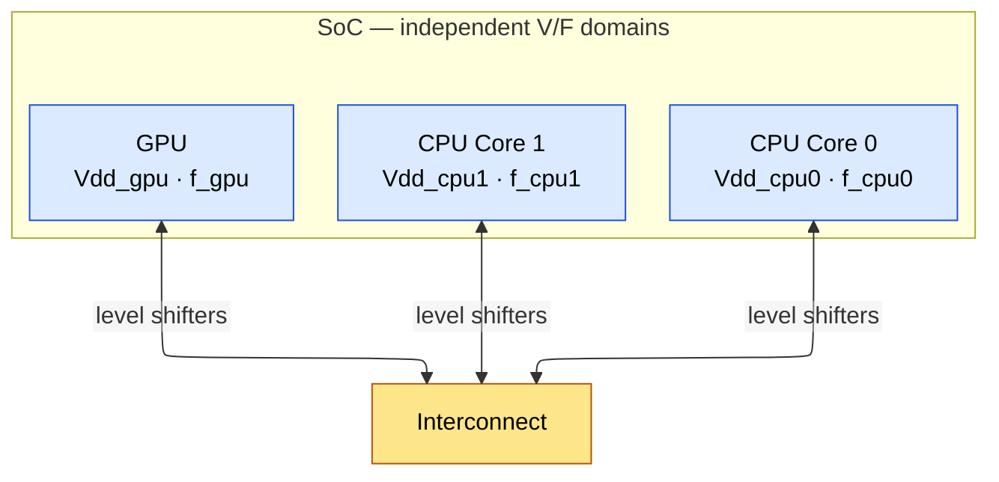
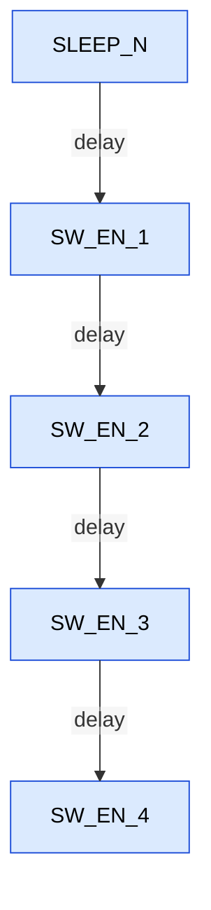
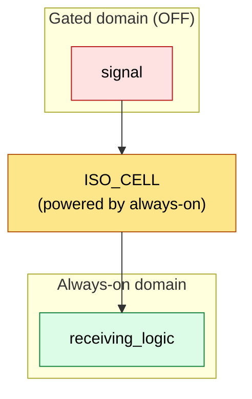

# Power Reduction Techniques for Digital IC / ASIC Design

Every power reduction technique in existence is an attack on one term of the total power
equation derived in [Power Fundamentals](01_Power_Fundamentals.md):

$$P_{total} = \underbrace{\alpha \cdot C_L \cdot V_{DD}^2 \cdot f_{clk}}_{\text{dynamic}} \;+\; \underbrace{I_{leak} \cdot V_{DD}}_{\text{static}}$$

where $\alpha$ is the **activity factor** (average fraction of nodes that make a full
charge/discharge transition per clock cycle, dimensionless), $C_L$ the total switched load
capacitance (F), $V_{DD}$ the supply voltage (V), $f_{clk}$ the clock frequency (Hz), and
$I_{leak}$ the total leakage current (A). Clock gating and operand isolation reduce
$\alpha$; DVFS reduces $V_{DD}$ and $f$ together; multi-Vt and body biasing reduce
$I_{leak}$ exponentially through the threshold voltage; power gating removes $V_{DD}$ from
idle logic altogether. Knowing *which term* a technique attacks tells you when it helps and
when it is useless -- clock gating does nothing for a leakage-dominated standby mode, and
power gating does nothing for a block that is busy every cycle.

These techniques are not bolted on at the end: they enter the design flow at specific,
different points. Clock gating is inferred during synthesis from RTL (register-transfer level) coding patterns; DVFS
is an architecture decision that ripples into clock/reset design, timing signoff corners,
and system software; power gating requires power-intent specification
([UPF](04_UPF_Power_Intent.md)), special cells (switches, isolation, retention), and
dedicated verification; multi-Vt assignment is a synthesis/place-and-route optimization; and
body biasing is a circuit/post-silicon knob. A senior engineer is expected to know each
technique down to the transistor level *and* to know where in the flow it is implemented,
verified, and debugged.

This page walks the techniques in decreasing order of ubiquity. Section 1 maps the
landscape: which technique attacks which term, at which abstraction level, for what typical
return. Sections 2-5 are the four heavyweight techniques -- clock gating, DVFS, power
gating, multi-Vt -- each developed as a complete chain: the problem, the requirement, the
circuit built up from gates and transistors, a signal-by-signal walkthrough, the timing
constraints, and the production failure modes. Sections 6-8 cover the supporting cast (body
biasing, operand isolation, memory/bus-level techniques). Section 9 reassembles everything
into the chronological design flow, a decision tree, and the cross-technique interactions
that bite in production; Sections 10-11 close with the numbers worth memorizing and
cross-references.

Prerequisites: the dynamic-power derivation and leakage physics in
[Power Fundamentals](01_Power_Fundamentals.md) (its Sections 3 and 5 are assumed
throughout); MOSFET (metal-oxide-semiconductor field-effect transistor) operation, transmission gates, and latch structures from
[CMOS Fundamentals](../00_Fundamentals/01_CMOS_Fundamentals.md); setup/hold reasoning from
[STA](../06_Signoff/01_STA.md); and, for context on where the activity numbers come from,
[Block Activity and Power](02_Block_Activity_and_Power.md).

## 1. The Landscape: What Attacks Which Term

### 1.1 Mapping Techniques to the Power Equation

Before diving into any single technique, place them all on one map. Each row of this table
is expanded into a full section later in the page.

| Technique | Term attacked | How | Flow entry point | Section |
|-----------|---------------|-----|------------------|---------|
| Clock gating | $\alpha$ of the clock network | stop clock toggles to idle registers | RTL + synthesis | 2 |
| DVFS | $V_{DD}^2 \cdot f$ | scale voltage and frequency with demand | architecture + system SW | 3 |
| Power gating | $I_{leak} \cdot V_{DD}$ | disconnect supply from idle blocks | architecture + UPF + PnR | 4 |
| Multi-Vt | $I_{leak}$ via $V_{th}$ | high-Vt cells off the critical path | synthesis + PnR | 5 |
| Body biasing | $I_{leak}$ / delay via $V_{th}$ | post-silicon $V_{th}$ tuning through $V_{SB}$ | circuit + system | 6 |
| Operand isolation | $\alpha$ of datapath logic | freeze inputs of unused combinational blocks | RTL | 7 |
| Memory banking / SRAM modes | $C_L$ switched per access, $I_{leak}$ | activate only the accessed bank; array retention modes | architecture | 4.12, 8.1 |
| Data encoding | $\alpha$ of buses | fewer transitions per transferred word | RTL/architecture | 8.2 |
| Voltage islands | $V_{DD}^2$ per block | run each block at its own minimum voltage | architecture + UPF | 8.3 |

### 1.2 Leverage by Abstraction Level

Power reduction techniques span all abstraction levels. The higher in the stack you apply
them, the greater the potential savings -- but also the greater the design effort.

| Level          | Techniques                                          | Typical Impact |
|----------------|-----------------------------------------------------|----------------|
| System/Arch    | DVFS, power gating, dark silicon, HW accelerators   | 10-100x        |
| Micro-arch     | Clock gating, operand isolation, memory partitioning | 2-10x          |
| Logic/RTL      | Encoding, resource sharing, FSM optimization         | 10-30%         |
| Gate-level     | Multi-Vt, gate sizing, buffer optimization           | 10-30%         |
| Circuit        | Adiabatic, body biasing, custom cells                | 5-20%          |
| Physical       | Wire optimization, placement for activity            | 5-15%          |

The practical reading of this table: fight for power at the architecture and
microarchitecture level first (where 2-100x is available), then let the implementation flow
harvest the remaining tens of percent. The chronological flow map -- which technique is
implemented at which flow step -- is deferred to Section 9, after each technique has been
developed in full.

With the map in hand, we start with the technique that is present in essentially every
synchronous design ever taped out: clock gating.

---

## 2. Clock Gating -- Deep Dive

Clock distribution typically consumes 30-50% of total dynamic power in a synchronous design.
The clock is the most active net on the chip: its activity factor is $\alpha = 1$ by
definition (one full high-low cycle *every* cycle, i.e., a full charge and discharge of
every capacitance it touches), while typical datapath nodes toggle with $\alpha =$ 0.05-0.15.
Every flip-flop input sees a toggling clock every cycle, regardless of whether new data is
being captured. Clock gating eliminates unnecessary clock toggles to idle registers.

### 2.1 Basic Concept

Consider a register that only needs to capture new data when an enable condition holds:

```verilog
// Without clock gating: the mux recirculates old data, the clock toggles every cycle
always @(posedge clk)
  q <= enable ? d : q;   // tool builds a mux on D; clock power is spent regardless

// With clock gating: same functional behavior, written so the tool can extract the enable
always @(posedge clk)
  if (enable)
    q <= d;              // synthesizer infers an ICG cell: gclk = clk & enable(latched)
```

Both descriptions are functionally identical: `q` updates only when `enable` is true. The
difference is *where the enable is enforced*. The mux version blocks new **data** but pays
full **clock** power every cycle (clock pin capacitance, the local clock buffers, and the
flip-flop's internal clock inverters all switch). The gated version blocks the **clock
itself**, so on disabled cycles none of that capacitance moves. The element that does the
blocking is the **ICG (Integrated Clock Gating) cell**, and building it correctly is the
subject of the next two subsections -- because the obvious implementation is wrong in an
instructive way.

### 2.2 Why You Cannot Simply AND the Clock

The function we want is: pass the clock when enabled, hold the output low when disabled.
The naive circuit is a single AND gate:

$$GCLK = CLK \wedge EN$$

The problem is that `EN` is an ordinary logic signal. It is launched by a flip-flop on a
rising clock edge and then ripples through combinational logic, so it arrives -- and can
glitch -- at *arbitrary* times within the cycle, including while `CLK` is high. An AND gate
is transparent to its other input whenever one input is 1: any change on `EN` during the
high phase of `CLK` passes straight through to `GCLK`:

```ascii-graph
        ______        ______        ______        ______
CLK ___|      |______|      |______|      |______|      |______

                        ________________________
EN  ___________________|                        |______________
                       (rises mid-high-phase)  (falls mid-high-phase)
                        ___       ______        _
GCLK __________________|   |_____|      |______| |_____________
                       ^^^^^                   ^^^
                       runt pulse:             truncated pulse:
                       GCLK rises when EN      GCLK falls when EN
                       rises, not on a         falls, cutting the
                       real clock edge         clock pulse short
```

Both artifacts are **clock glitches**: edges whose timing is set by a data path, not by the
clock source. The consequences are severe.

- A runt or truncated pulse can violate the flip-flops' **minimum pulse width**, so the
  internal master latch may not close properly -- the flop can go metastable or silently
  fail to capture.
- Even a full-width but late-rising `GCLK` edge is a clock edge at an uncharacterized time:
  every setup/hold relationship at the downstream flops is now referenced to a data-derived
  edge, which STA (static timing analysis) cannot bound.
- Result: glitches on EN during CLK=1 propagate directly to GCLK -> clock glitches ->
  metastability / data corruption. Naive AND gating is **never used in production designs**
  for this reason.

**Deriving the requirement.** Trace the failure: everything went wrong because the gating
value changed *while CLK was high*, i.e., during the window in which the AND gate is
transparent from `EN` to `GCLK`. During the low phase of `CLK`, the AND's output is forced
to 0 and changes on `EN` are invisible. Therefore the fix is a constraint on when the
gating value may change:

> **Requirement:** the signal that actually gates the clock may only take effect while
> `CLK = 0`. Any change that arrives during `CLK = 1` must be *held off* until the clock
> has fallen.

We need a memory element between `EN` and the AND gate that is **transparent while CLK=0**
(new enable values flow through and settle while the AND is blocking anyway) and **opaque
while CLK=1** (the value feeding the AND is frozen for the entire high phase). An element
that is transparent at one clock level and holds at the other is, by definition, a
**level-sensitive latch** -- here transparent-low, also called a **negative-level-sensitive
latch**. That is the entire design insight of the ICG cell; the rest is circuit carpentry.

### 2.3 Building the ICG Cell: Latch + AND, Down to Transistors

#### 2.3.1 Block-level structure

```ascii-graph
            +---------------------+
   EN ----->| D                 Q |----- EN_L ----+
            |   level-sensitive   |               |      +-------+
            |   latch:            |               +----->|       |
            |   transparent       |                      |  AND  |-----> GCLK
   CLK --+->| G  when CLK = 0     |               +----->|       |
         |  +---------------------+               |      +-------+
         |                                        |
         +----------------------------------------+
```

The enable signal is latched on the negative level of the clock (latch is transparent when
CLK=0). The latched enable `EN_L` is ANDed with CLK to produce the gated clock.

**Why transparent when CLK=0?** The enable must be stable during the entire positive phase
of the clock (that is when the AND gate is transparent and when downstream flip-flops
capture data). Making the latch transparent during the *opposite* phase gives the enable
the whole low half-cycle to change and settle, while guaranteeing by construction that no
change can reach the AND during the high phase: if enable changes during CLK=1, the latch
is opaque and the change is blocked until the next falling edge.

#### 2.3.2 Transistor-level structure

To build the transparent-low latch we need (see
[CMOS Fundamentals](../00_Fundamentals/01_CMOS_Fundamentals.md), transmission-gate logic):

1. a **pass element** that conducts only while CLK=0 -- a transmission gate `TG1`
   (an NMOS and PMOS in parallel; it conducts when the NMOS gate is 1 *and* the PMOS gate
   is 0, so we drive the NMOS gate with `CLKB` and the PMOS gate with `CLK`);
2. a **storage node** and buffering -- inverters `INV1`/`INV3`;
3. a **keeper** to make storage static -- inverter `INV2` feeding back through a second
   transmission gate `TG2` clocked in antiphase to `TG1`;
4. the **output AND** -- in static CMOS (complementary metal-oxide-semiconductor), a NAND followed by an inverter;
5. a **local clock inverter** `INV0` to generate `CLKB` inside the cell.

```ascii-graph
 Netlist (18 transistors):
 ------------------------------------------------------------------
  INV0 : in CLK        -> out CLKB                            (2T)
  TG1  : in EN         -> out A    NMOS gate=CLKB, PMOS gate=CLK
         (conducts while CLK=0)                               (2T)
  INV1 : in A          -> out B                               (2T)
  INV2 : in B          -> out K    (keeper driver)            (2T)
  TG2  : in K          -> out A    NMOS gate=CLK,  PMOS gate=CLKB
         (conducts while CLK=1)                               (2T)
  INV3 : in B          -> out EN_L                            (2T)
  NAND : in CLK, EN_L  -> out X                               (4T)
  INV4 : in X          -> out GCLK                            (2T)

 Topology:
                TG1 (on when CLK=0)    A             B
  EN ---------------=[TG1]=------------o---[INV1]>o--o---[INV3]>o--- EN_L
                                       |             |               |
                                       |   K         |               |
                                       +--=[TG2]=----o<[INV2]--------+   |
                                        TG2 (on when CLK=1)          |   |
                                        keeper loop drives A <- K    |   |
                                                                     |   |
  CLK --+---[INV0]>o--- CLKB  (to TG1/TG2 control gates)             |   |
        |                                                            |   |
        |                 +------+          X                        |   |
        +---------------->|      |                                   |   |
                          | NAND |---------o---[INV4]>o--- GCLK      |   |
          EN_L ---------->|      |  <-------------------------------+---+
                          +------+

 Node meanings:
   CLKB = locally inverted clock          A = latch storage node
   B    = NOT(stored enable)              K = keeper output (redrives A)
   EN_L = latched enable (= stored EN)    X = NOT(CLK AND EN_L)
   GCLK = gated clock output
```

**Why the keeper (INV2 + TG2) is not optional.** When CLK=1, `TG1` is off and node `A` is
electrically floating -- without the keeper it would hold its value only as charge on
parasitic capacitance (a *dynamic* node). Subthreshold and gate leakage would corrupt that
charge on a microsecond-to-millisecond timescale, and capacitive coupling from neighboring
nets could flip it instantly. A gated register bank may sit disabled for millions of cycles
-- that is the whole point of clock gating -- so the storage must be **static**: while
CLK=1, `TG2` closes the loop A -> INV1 -> B -> INV2 -> K -> TG2 -> A, and the two inverters
regeneratively hold the value indefinitely. Because `TG1` and `TG2` are clocked in
antiphase, the input never fights the keeper: when the input path conducts, the feedback
path is open, and vice versa. (An alternative keeper style omits `TG2` and instead makes
`INV2` a *weak* long-channel inverter that `TG1`'s driver simply overpowers -- a "jam
latch". It saves the two TG2 transistors but must be ratioed carefully: a keeper sized too
strong means the enable can never be written -- see the failure list below.)

**Commercial cell notes.** Production ICG cells implement exactly this function, usually
with clocked C2MOS/tristate-inverter stages instead of explicit transmission gates (same
behavior, stacked clock transistors -- NMOS clocked by CLK, PMOS by CLKB -- merged into the
inverters), with the NAND+INV merged and optimized, and with an extra OR input for scan
(Section 2.10). Typical size is 12-20 transistors, about 1-2x a minimum inverter's area.

#### 2.3.3 Signal walkthrough over one full cycle

Take the dangerous case from Section 2.2: `EN` rises while CLK=1.

| Phase | CLK | TG1 | TG2 | Node A | EN_L | GCLK = CLK & EN_L |
|-------|-----|-----|-----|--------|------|--------------------|
| 1. idle, CLK low | 0 | ON | off | follows EN = 0 | 0 | 0 (CLK=0 forces it) |
| 2. CLK rises | 1 | off | ON | frozen at 0 (keeper holds) | 0 | 0 -- pulse blocked, clean |
| 3. EN rises mid-high-phase | 1 | off | ON | still 0: TG1 is off, the change cannot get in | 0 | stays 0 -- **no glitch** |
| 4. CLK falls | 0 | ON | off | follows EN = 1 (settles during low phase) | 1 | 0 (CLK=0) |
| 5. next CLK rise | 1 | off | ON | frozen at 1 | 1 | = CLK: **full, clean pulse** |

```wavedrom
{ "signal": [
  { "name": "CLK",  "wave": "0101010101" },
  { "name": "EN",   "wave": "01........", "node": ".a" },
  { "name": "A",    "wave": "0.1.......", "node": "..b" },
  { "name": "EN_L", "wave": "0.1......." },
  { "name": "GCLK", "wave": "0..1010101", "node": "...c" }
],
"edge": [ "a~>b EN change waits for CLK=0", "b~>c first full pulse" ],
"head": { "text": "ICG walkthrough: EN rises during CLK=1; the latch defers it to the low phase; GCLK gains its first full pulse one edge later" } }
```

The symmetric case (EN falls during CLK=1) works identically: the current pulse completes
at full width because `EN_L` is frozen at 1 until the clock falls; from the next rising
edge on, `GCLK` stays low. In both directions, `GCLK` carries only full-width pulses whose
edges are `CLK` edges delayed by the NAND+INV -- exactly the requirement derived in 2.2.

#### 2.3.4 Timing constraints on the enable

```text
Conservative house rule: enable stable by t_falling_edge - t_setup_ICG
(arrive before the latch opens -- no time borrowing through transparency)

Typical setup time of ICG cell: 50-200 ps (process dependent)
Hard requirement: the transparent-low latch CLOSES at the next RISING
edge, so the enable formally has until that rising edge and may borrow
through the low phase. See 2.12 for precise STA semantics.
```

Section 2.5 unpacks these two views (hard requirement vs. margin policy); Section 2.12
covers how CTS (clock tree synthesis) placement of the ICG tightens or relaxes this path.

#### 2.3.5 Failure modes if mis-designed

- **No latch (naive AND):** data-timed clock glitches -- Section 2.2's waveform.
- **Latch transparent during the wrong phase (CLK=1 instead of CLK=0):** enable changes
  flow straight through to the AND during the high phase; you have rebuilt the naive AND
  gate with extra transistors.
- **Missing keeper:** node A is dynamic; after microseconds-to-milliseconds of sitting
  disabled, leakage drifts A toward the trip point -- the ICG can emit spurious clock
  pulses to a block that believes its clock is stopped (state corruption that only appears
  after long idle periods: a horrific silicon debug).
- **Keeper too strong (jam-latch style):** TG1's driver cannot overpower the feedback;
  the enable never updates and the clock is stuck permanently on or permanently off.
- **TG1/TG2 clocked overlapping (both momentarily on):** input and keeper fight
  (contention) during clock edges; storage can be corrupted by races.
- **Discrete latch + discrete AND from the standard-cell library instead of an
  *integrated* cell:** functionally the same Boolean network, but now the latch->AND
  connection is an ordinary routed net: it can pick up crosstalk, its delay varies with
  placement, and the AND's two inputs are no longer characterized as a matched pair, so a
  sliver of skew between EN_L and CLK inside the AND can still glitch. The *integrated*
  cell is characterized as one unit with a guaranteed glitch-free output, has a defined
  CLK->GCLK insertion delay for CTS modeling, and carries the scan-override input.
  This is precisely why the standard cell is called an *Integrated* Clock Gate.

### 2.4 AND-Type vs OR-Type ICG Cells

The cell built above parks the gated clock LOW when disabled. Its mirror image parks the
clock HIGH. Both follow the same requirement from 2.2 -- "the gating value may only change
while the pass gate is blocking" -- but the blocking phase flips with the gate type.

| Property | AND-type ICG | OR-type ICG |
|----------|--------------|-------------|
| Function | $GCLK = CLK \wedge EN_L$ | $GCLK = CLK \vee \overline{EN}_L$ |
| Latch transparency | transparent when CLK=0 (captures on negative phase) | transparent when CLK=1 (captures on positive phase) |
| Phase where enable is frozen | CLK=1 (latch opaque, EN_L stable through the high pulse) | CLK=0 (latch opaque, EN_L_n stable through the low pulse) |
| Disabled state | GCLK stuck LOW -> no rising edges | GCLK stuck HIGH -> no falling/rising edges |
| Enable polarity | active-HIGH enable (1 = clock runs) | active-LOW control (0 = clock runs) |
| Enable setup edge | stable by FALLING edge of CLK (setup to negedge) | stable by RISING edge of CLK (setup to posedge) |
| Typical use | register file / pipeline / module gating -- the default for 95%+ of clock gating | rare; some negative-edge-triggered clocking schemes |

Why the OR-type freezes the opposite phase: $GCLK = CLK \vee \overline{EN}_L$ is forced
HIGH whenever CLK=1, so changes on the gating input are invisible during the high phase --
the dangerous window is now CLK=0, when the OR is transparent from the enable input to
GCLK. Hence its latch must be opaque while CLK=0, i.e., transparent while CLK=1.

In both cases the setup requirement is to the **inactive** edge (the edge that closes the
latch ahead of the transparent-to-output phase), not the active edge. This gives a full
half-cycle for the enable to propagate from its launching flip-flop before it must be
stable. In practice: most synthesis tools only insert AND-type ICG cells, and designs
needing an active-low control simply invert the enable into an AND-type cell.

**A note on the "NAND-based" variant.** Since a static-CMOS AND is a NAND plus an
inverter, some libraries expose the intermediate node: a cell producing
$\overline{GCLK} = \overline{CLK \wedge EN_L}$ (an inverted gated clock) saves the output
inverter and can be useful for negative-edge-triggered sinks. It is the same latch-NAND
structure, minus INV4 -- not a different gating principle. (Beware hand-derived variants:
for example $\overline{\overline{CLK} \cdot EN_L} $ inverted gives $\overline{CLK} \wedge
EN_L$, a clock of *inverted* polarity -- easy to get wrong; stick to library ICG cells.)

### 2.5 The Enable Timing Constraint -- the STA View

Where does the enable's cycle budget actually end? Two answers coexist, and interviewers
probe the difference:

- **Hard requirement (what the circuit needs):** the transparent-low latch closes at the
  next *rising* edge of CLK. The enable may therefore arrive any time before that rising
  edge minus the latch setup time -- it may "borrow" through the entire transparent low
  phase, exactly like any level-sensitive latch path (time borrowing semantics as in
  [STA](../06_Signoff/01_STA.md)).
- **House rule (what many teams constrain):** enable must arrive before the *falling* edge
  minus t_setup. This deliberately forbids borrowing into the transparent window, keeping
  a half-cycle of margin and making the path's timing independent of latch transparency
  analysis.

Either way, the launching flop for the enable and the ICG normally sit on the same clock,
so the enable path has roughly a half cycle (house rule) to a full cycle (hard limit) of
budget -- *minus* the clock network insertion-delay difference between the launching flop
and the ICG's clock pin. That last term is why ICG placement in the clock tree matters so
much; Section 2.12 develops it, and Section 2.11's data-driven enables are where the budget
gets eaten fastest.

With the cell itself understood, the next question is where ICGs come from in a real
netlist: almost all of them are inferred by the synthesis tool from RTL coding patterns.

### 2.6 Clock Gating Enable Generation from RTL

The synthesis tool infers an ICG from these RTL patterns:

**Pattern 1: if-else with clocked assignment (most common)**

```verilog
always @(posedge clk)
  if (enable)           // <-- ICG inferred here
    q <= d;
```

Tool actions:

1. Extracts `enable` as the gating signal.
2. Inserts an ICG cell on the clock path.
3. Removes the mux on the D input (saves combinational logic).

Without clock gating, the tool implements the same behavior as a D-input recirculation
mux -- data blocked, clock still toggling:

```verilog
always @(posedge clk)
  q <= enable ? d : q;  // mux on D, clock always toggles
```

**Pattern 2: Explicit clock gating (manual instantiation)**

```verilog
wire gated_clk;
ICG_CELL u_icg (.CLK(clk), .EN(enable), .GCLK(gated_clk));
always @(posedge gated_clk)
  q <= d;
```

**Pattern 3: Module-level gating (coarse-grain, from the power controller)**

```verilog
// In the power management controller:
always @(posedge clk) begin
  if (module_active)
    module_clk_en <= 1;
  else
    module_clk_en <= 0;
end
// ICG for the entire module inserted at the clock entry point
```

The tool identifies registers with a common enable signal and inserts ICG cells. The
enable is factored out of the D-input logic and connected to the ICG.

### 2.7 Granularity: Fine-Grain, Coarse-Grain, and Hierarchical Gating

One ICG can gate anywhere from a couple of flip-flops to an entire subsystem. The
granularity choice trades area and enable-logic effort against how precisely idle cycles
are captured.

| Aspect | Fine-Grain | Coarse-Grain |
|--------|-----------|--------------|
| Granularity | 4-16 FFs per ICG | 100-1000+ FFs per ICG |
| Area overhead | High (many ICGs) | Low (few ICGs) |
| Gating efficiency | High (precise control) | Lower (all-or-nothing) |
| Typical source | Synthesis auto-insertion | Architecture/RTL manual |
| Example | Register enable per field | Module-level sleep |

**Module-level vs gate-level clock gating:**

```text
Module-level: one ICG for entire module (1 cell for 10K FFs)
  - Controlled by software/firmware
  - Gating efficiency depends on module idle time
  - Very low area overhead

Gate-level (RTL-inferred): one ICG per 4-64 FFs
  - Controlled by data path enables
  - Gating efficiency depends on data-dependent activity
  - Higher area overhead (many ICG cells)
  - Typical: 5-8% area increase, 20-40% power reduction

Best practice: use BOTH. Module-level for sleep modes,
gate-level for dynamic activity reduction during active operation.
```

In practice the two extremes coexist as a hierarchy of three gating levels:

```text
Level 1: Module-level gating
  - Gate the entire clock to a submodule when it's idle
  - Example: gate clock to UART when UART is disabled
  - CGE can be very high (>95% for rarely-used peripherals)
  - Controlled by software or power management unit

Level 2: Cluster-level gating
  - Gate groups of related registers (e.g., a pipeline stage)
  - 8-32 FFs per ICG cell
  - Medium CGE (40-70%)

Level 3: Fine-grain (RTL-inferred) gating
  - Synthesis tool inserts ICG for "if(en) q <= d" patterns
  - 1-8 FFs per ICG cell (configurable minimum)
  - CGE varies widely (10-90%)
```

Area overhead trade-off:

- Each ICG cell costs ~1-2x minimum inverter area
- Fine-grain gating: 5-8% area overhead typical
- But fine-grain gating saves more power than coarse-grain (captures more idle cycles)
- Optimal: combine hierarchical (coarse) + fine-grain, let synthesis handle the rest

**Synthesis auto-insertion threshold:**

```tcl
# In Design Compiler:
set_clock_gating_style -minimum_bitwidth 4  ; # Gate groups of 4+ FFs
set_clock_gating_style -max_fanout 64       ; # Max FFs per ICG
compile_ultra -gate_clock
```

Granularity chosen, the payoff can be quantified -- which is also how gating quality is
tracked in production.

### 2.8 Clock Gating Efficiency (CGE) and Power Savings Calculation

**CGE** is the fraction of clock cycles in which the clock is actually gated (disabled):

$$CGE = \frac{N_{gated\ cycles}}{N_{total\ cycles}}$$

It is dimensionless, ranges 0 to 1, and is workload-dependent (a block 100% busy in one
benchmark may be 95% idle in another).

**Deriving the savings formula.** Start from the switching-power equation
(first occurrence and derivation in [Power Fundamentals](01_Power_Fundamentals.md),
Section 3): $P = \alpha \, C_L V_{DD}^2 f_{clk}$. For the clock net feeding a flip-flop,
$\alpha = 1$ (the clock completes one full charge/discharge every cycle by definition).
Gating removes exactly the fraction $CGE$ of those cycles, i.e., it reduces the clock's
effective activity from 1 to $(1 - CGE)$. For a group of $N$ flip-flops the *saved* power
is therefore:

$$P_{saved} = CGE \cdot N \cdot C_{clk/FF} \cdot V_{DD}^2 \cdot f_{clk}$$

where:

| Symbol | Meaning | Units |
|--------|---------|-------|
| $CGE$ | fraction of cycles gated | -- |
| $N$ | number of flip-flops behind the ICG | -- |
| $C_{clk/FF}$ | clock capacitance attributable to one FF | F |
| $V_{DD}$ | supply voltage | V |
| $f_{clk}$ | clock frequency | Hz |

Intuition and limit check: with $CGE = 0$ (never gated) nothing is saved; with $CGE = 1$
the entire clock power of those flops disappears. Units: $F \cdot V^2 \cdot Hz =
(C/V)\cdot V^2 / s = W$.

$C_{clk/FF}$ bundles everything the clock moves per flop:

- Clock pin capacitance of the flip-flop (~2-5 fF)
- Clock wire capacitance to reach that FF (~2-10 fF)
- Clock buffer drive capacitance allocated per FF (~1-3 fF)
- Total: ~5-18 fF per FF (use 10 fF as a typical planning number)

**Numerical example:**

```text
Given:
  N = 1000 flip-flops in a register file
  C_clk_per_FF = 10 fF (including wire and buffer share)
  f_clk = 500 MHz
  Vdd = 0.9V
  CGE = 0.70 (register file accessed 30% of cycles)

P_saved = 0.70 * 1000 * 10e-15 * (0.9)^2 * 500e6
        = 0.70 * 10e-12 * 0.81 * 5e8
        = 0.70 * 4.05e-3
        = 2.835 mW

ICG cell overhead:
  Area: ~2x a minimum inverter = ~1 um^2 in 28nm
  Power: ~5 uW per ICG (clock input toggles, adds small load)
  Number of ICG cells: maybe 50-100 (one per 10-20 FFs)
  Total overhead: 50 * 5uW = 0.25 mW

Net savings: 2.835 - 0.25 = ~2.6 mW
```

Note the structure of the overhead: the ICG's own clock pin toggles *every* cycle
(upstream of the gate), so an ICG gating too few flops can cost more than it saves --
that is exactly what the `minimum_bitwidth` threshold in 2.7 guards against, and it
reappears as root cause (c) in the debugging flow of 2.13.

### 2.9 Synthesis Tool Commands for Clock Gating

```tcl
# Synopsys Design Compiler
# Enable clock gating insertion
set_clock_gating_style \
  -sequential_cell latch \
  -positive_edge_logic {integrated} \
  -negative_edge_logic {integrated} \
  -control_point before \
  -control_signal scan_enable \
  -minimum_bitwidth 4 \
  -max_fanout 64

# Minimum bitwidth: don't insert ICG for fewer than 4 FFs (overhead not worth it)
# Max fanout: limit ICG fanout to 64 FFs (CTS will struggle with more)

# Report clock gating results
report_clock_gating -nosplit > clock_gating.rpt

# Cadence Genus
set_db design_clock_gating_max_fanout 32
set_db design_clock_gating_min_bitwidth 3
set_attribute lp_insert_clock_gating true [current_design]
```

### 2.10 Clock Gating and Scan (DFT Considerations)

During scan shift, ALL flip-flops must be clocked every cycle. Clock gating would block
the scan clock. Solution: the ICG carries a test override, ORed with the functional enable
*before* the latch:

```text
GCLK = CLK AND (EN_latched OR SCAN_ENABLE)

During scan: SCAN_ENABLE=1 -> GCLK = CLK always (gating bypassed)
During functional mode: SCAN_ENABLE=0 -> GCLK = CLK AND EN_latched
```

The ICG cell has a dedicated test/scan_enable pin for this purpose.

### 2.11 Sequential / Data-Driven Clock Gating (Beyond Synthesis Inference)

Synthesis-inferred gating only captures explicit `if (en) q <= d` patterns. Two stronger
levels exist, and mid-level interviews increasingly probe them:

**XOR self-gating (data-driven gating):**

```verilog
// Build the enable from actual data change detection:
assign change = |(d_bus ^ q_bus);   // any bit differs?
// gated_clk = ICG(clk, change)
always @(posedge gated_clk)
  q_bus <= d_bus;
```

- Clock fires only when the data ACTUALLY changes -- no architectural enable needed.
- Cost: 1 XOR per bit + wide OR reduction tree + ICG.
- Pays off for wide registers (>16 bits) with low data activity (<10-20% change rate).
- Catch: the D -> XOR -> OR-tree -> ICG enable path adds delay to an already-tight
  enable timing path (see 2.12). For very wide buses, pipeline the OR tree or gate
  per-byte instead of per-word.

**Stability/observability-based (sequential) clock gating.** Tools (Siemens PowerPro
lineage, Cadence Joules RTL Design Studio, Synopsys PrimePower RTL guidance flow) analyze
MULTI-CYCLE behavior and strengthen enables beyond what any single-cycle view justifies:

- **Observability don't-care (ODC) gating:** if the downstream consumer ignores this
  register's output for N cycles (e.g., a result register read only when `valid_out=1`),
  the register may be gated even while "new" data arrives -- it computes values nobody
  observes.
- **Stability-condition gating:** if the enable condition provably implies D == Q in some
  cycles (recirculation), strengthen the enable to exclude those cycles.

Because these transformations change cycle-by-cycle behavior on don't-care cycles, they
CANNOT be verified by combinational equivalence checking. They require **sequential
equivalence checking (SLEC)** -- this distinction is a classic interview checkpoint.

**Enable strengthening at RTL (manual, very common in practice):**

```verilog
// Before: multiplier result register clocks every cycle
always @(posedge clk) result <= a * b;

// After: gate with the pipeline valid, one stage earlier
always @(posedge clk) valid_d <= valid_in;
always @(posedge clk) if (valid_in) result <= a * b;  // ICG inferred from valid_in
```

Stronger enables and wider gating scopes push the ICG toward the root of the clock tree
-- which is where its interaction with CTS and the enable timing budget becomes the
limiting factor.

### 2.12 ICG Cells in CTS and Enable Timing Closure

**Where the ICG sits in the clock tree matters:**

```text
ICG near ROOT:                       ICG near LEAVES:
  + gates all buffers below it        + enable timing is easy
    (max power savings)                 (full insertion delay of tree
  - enable path must arrive             gives margin)
    EARLIER (less clock network       - buffers above still toggle
    insertion delay as margin)          (less power saved)
  - one enable for many FFs          - more ICG instances (area)
```

CTS performs **ICG cloning** (split one ICG into copies placed near sink clusters
when fanout/skew is unmanageable) and **de-cloning** (merge equivalent ICGs to save
power/area). Modern flows (ICC2 concurrent clock-and-data, Innovus CCOpt) treat
ICG placement as a primary CTS optimization target.

**Why the enable path is the hard part -- be precise here (common interview trap):**

```text
Plain AND gating (no latch), enable launched by a posedge FF:
  Enable changes at t = tcq, while CLK is HIGH (pulse [0, T/2])
  -> changes the gating value mid-pulse -> truncated/glitched clock pulse
  -> this is a clock-gating HOLD violation BY CONSTRUCTION.
  PrimeTime models this: enable may only change while the clock is LOW
  (setup checked against the next rising edge, hold against the falling edge).

Latch-based ICG (transparent-low latch + AND):
  The latch is OPAQUE while CLK=1 -> blocks mid-pulse enable changes (hold solved)
  The latch closes at the RISING edge -> enable effectively has until the next
  rising edge to settle (nearly a full cycle, with transparency through the
  low phase).
  Many teams still constrain enable arrival to the FALLING edge as a margin
  policy (no time borrowing into the transparent window) -- know the
  difference between the hard requirement and the house rule.
```

(This is the tool-level formalization of the requirement derived in 2.2 and the two-view
budget introduced in 2.5.)

With ICGs pulled toward the root, the enable's effective capture point moves
EARLIER in time (less insertion delay downstream of the ICG), tightening the path.
Standard fixes: register the enable one stage earlier, push the ICG one level
down, let CTS apply useful skew to the ICG's clock pin, or pipeline wide enable
logic (see XOR self-gating in 2.11).

### 2.13 Debugging Low Clock-Gating Efficiency (Real-World Flow)

Scenario you should be able to narrate in an interview: *"Architecture predicted 80%
CGE; emulation/silicon shows 35%. Find out why."*

```text
Step 1: Collect per-ICG enable activity
  - RTL sim or emulation -> SAIF/FSDB -> per-ICG toggle/enable statistics
  - Tools report: ICG instance, fanout (#FFs), %cycles enabled

Step 2: Separate the two metrics (people conflate them):
  - ICG COVERAGE   = % of FFs whose clock passes through any ICG
                     (structural; target >95% for a well-gated design)
  - CGE            = % of cycles actually gated (workload-dependent)
  High coverage + low CGE = enables are weak, not missing.

Step 3: Rank offenders by wasted clock power:
  waste(ICG_i) = fanout_i * %cycles_enabled_i * C_clk_per_FF * Vdd^2 * f

Step 4: Classify root causes (the usual suspects):
  a) Enable stuck near 1: upstream "valid" free-runs even when data is garbage
     -> fix at source: qualify valid with downstream ready / FSM busy
  b) Recirculating mux survived: q <= en ? d : q coded in a way the tool
     could not extract (e.g., enable buried under reset priority logic)
     -> recode: separate reset and enable branches
  c) Gating too fine-grained: ICG with fanout 2-3 whose own clock pin +
     latch power exceeds savings -> raise minimum_bitwidth, merge groups
  d) No hierarchical gating: leaf ICGs gate FFs but the 2,000 clock buffers
     above them still toggle -> add cluster/root-level ICG driven by
     module idle (FSM state, no outstanding transactions)
  e) Wrong observation window: CGE measured during a busy benchmark says
     nothing about idle power -- always report CGE per workload/mode

Step 5: Verify the fix moves CLOCK TREE power, not just register power:
  In a well-gated design, clock distribution power should drop roughly
  proportionally to CGE at each level of the tree.
```

Clock gating removes wasted *activity* at a fixed voltage and frequency. The next
technique attacks the quadratic term itself: scale the voltage, and the frequency with
it, to match the work actually demanded.

---

## 3. Dynamic Voltage and Frequency Scaling (DVFS) -- Deep Dive

### 3.1 Why Voltage Is the Strongest Knob

From the dynamic power equation ([Power Fundamentals](01_Power_Fundamentals.md), Section
3), $P_{dyn} = \alpha C_L V_{DD}^2 f_{clk}$: voltage enters *squared*, and -- as derived
next -- lowering voltage also lowers the achievable frequency, so scaling both together
cuts dynamic power roughly with the cube of voltage. Equally fundamental: the **energy per
operation** is $E_{op} = P_{dyn} \cdot T_{cycle} \propto C_L V_{DD}^2$, independent of
frequency -- running slower at the *same* voltage saves power but not energy; only lowering
the voltage saves energy per unit of work. **DVFS (Dynamic Voltage and Frequency Scaling)**
exploits this by moving the chip between predefined voltage/frequency operating points as
the workload demand varies.

To reason quantitatively about DVFS we first need the one relationship everything else
hangs on: how gate delay -- hence maximum frequency -- depends on supply voltage.

### 3.2 The Alpha-Power Delay Model

**Step 1 -- delay as charge over current.** A logic gate switches by charging or
discharging its load capacitance $C_L$ through the driving transistor. Moving the output
across the full swing transfers charge $Q = C_L V_{DD}$; at an average drive current
$I_{drive}$ this takes:

$$T_d \approx \frac{C_L \cdot V_{DD}}{I_{drive}}$$

Units check: $F \cdot V / A = C / A = s$. (Same first-order gate-delay model as in
[CMOS Fundamentals](../00_Fundamentals/01_CMOS_Fundamentals.md), Section 4.)

**Step 2 -- drive current from the alpha-power law.** The saturation current of a
short-channel MOSFET is well fitted by the **Sakurai-Newton alpha-power law**:

$$I_{drive} \approx \mu C_{ox} \frac{W}{L} \left(V_{gs} - V_{th}\right)^{\alpha}$$

This is an **empirical** model -- a curve fit to measured I-V data, generalizing the
long-channel square law. Its symbols:

| Symbol | Meaning | Units |
|--------|---------|-------|
| $\mu$ | carrier mobility | cm$^2$/(V·s) |
| $C_{ox}$ | gate oxide capacitance per area | F/cm$^2$ |
| $W/L$ | transistor width/length ratio | -- |
| $V_{gs}$ | gate drive; $= V_{DD}$ for a full-swing input | V |
| $V_{th}$ | threshold voltage | V |
| $\alpha$ | velocity-saturation exponent (fitted) | -- |

The fitted exponent:

- $\alpha = 2.0$ for long-channel devices (recovers the classical square law, which *can*
  be derived from the gradual-channel approximation)
- $\alpha = 1.0$-$1.4$ for short-channel devices (carrier velocity saturates, so current
  grows less than quadratically with gate drive)
- $\alpha \approx 1.3$ is typical for modern FinFET (fin field-effect transistor)

Fitted range: the model holds in super-threshold operation, roughly $V_{DD} \gtrsim V_{th}
+ 0.15\,$V. Near and below threshold the conduction mechanism changes to exponential
diffusion current and the model breaks down entirely (Section 3.14).

**Step 3 -- combine.** Substituting Step 2 into Step 1 (with $V_{gs} = V_{DD}$), and
folding the technology constants into the proportionality:

$$T_d \propto \frac{C_L \cdot V_{DD}}{(V_{DD} - V_{th})^{\alpha}} \qquad\Rightarrow\qquad f_{max} \propto \frac{(V_{DD} - V_{th})^{\alpha}}{C_L \cdot V_{DD}}$$

Intuition and limit checks: as $V_{DD} \to V_{th}$ the gate barely conducts and
$T_d \to \infty$; for $\alpha = 2$ and $V_{DD} \gg V_{th}$, $T_d \propto 1/V_{DD}$ -- the
classic "delay inversely proportional to voltage" rule.

For $\alpha = 1.3$ (values from the exact formula; the point is the shape, not the digits):

```text
f_max proportional to (Vdd - Vth)^1.3 / Vdd

Example (Vth = 0.3V), normalized to Vdd = 1.0V:
  Vdd = 1.0V: f ~ (0.7)^1.3 / 1.0 = 0.629 -> 1.000 (ref)
  Vdd = 0.9V: f ~ (0.6)^1.3 / 0.9 = 0.572 -> 0.910  ->  9.0% slower
  Vdd = 0.8V: f ~ (0.5)^1.3 / 0.8 = 0.508 -> 0.807  -> 19.3% slower
  Vdd = 0.7V: f ~ (0.4)^1.3 / 0.7 = 0.434 -> 0.690  -> 31.0% slower
  Vdd = 0.5V: f ~ (0.2)^1.3 / 0.5 = 0.247 -> 0.393  -> 60.7% slower
```

### 3.3 The Voltage-Frequency Curve

Turn the delay model around: if you want a given frequency, what voltage do you need? For
constant delay (same performance), $V_{DD}$ must scale with frequency -- if $f$ is to
double, $T_d$ must halve, which requires more gate overdrive. How *much* more depends on
where you sit on the curve. Take the logarithmic derivative of
$f \propto (V_{DD}-V_{th})^{\alpha}/V_{DD}$:

$$\frac{d\ln f}{d\ln V_{DD}} = \frac{\alpha \, V_{DD}}{V_{DD} - V_{th}} - 1$$

(Origin: $\ln f = \alpha \ln(V_{DD}-V_{th}) - \ln V_{DD} + const$; differentiate each term
with respect to $\ln V_{DD}$.) This dimensionless sensitivity says: "a 1% voltage increase
buys this many % of frequency." Evaluate it in three regimes ($\alpha = 1.3$):

| Regime | Sensitivity $d\ln f / d\ln V$ | Meaning |
|--------|------------------------------|---------|
| Near nominal ($V_{DD}=0.8$, $V_{th}=0.3$) | $1.3 \cdot 0.8/0.5 - 1 = 1.08$ | $f \approx \propto V_{DD}$: the classic rule of thumb "voltage scales roughly with frequency" |
| High voltage ($V_{DD} \gg V_{th}$) | $\to \alpha - 1 = 0.3$ | $V_{DD} \propto f^{1/(\alpha-1)} = f^{3.33}$: a 20% frequency push needs $1.2^{3.33} \approx 1.84\times$ the voltage -- the top of the curve flattens brutally |
| Near threshold ($V_{DD} \to V_{th}$) | $\to \infty$ | tiny voltage changes swing frequency wildly -- and variation sensitivity explodes (Section 3.14) |

The high-voltage row is why the last few hundred MHz of turbo cost enormous power: each
extra percent of frequency demands several percent of extra voltage, squared into
$P_{dyn}$. (Beware quoting "$V \propto f^{3.33}$" as a general law -- it is the
$V_{DD} \gg V_{th}$ *asymptote*; near nominal operating points the relationship is
approximately linear, as the first row shows.)

### 3.4 Power Savings from Scaling V and f Together

Substituting the achievable frequency $f \propto (V_{DD}-V_{th})^{\alpha}/V_{DD}$ into
$P_{dyn} = C V_{DD}^2 f$ (i.e., assuming the chip always runs at the maximum frequency its
voltage allows):

$$P_{dyn} \propto C \cdot V_{DD}^2 \cdot \frac{(V_{DD}-V_{th})^{\alpha}}{V_{DD}} = C \cdot V_{DD} \cdot (V_{DD}-V_{th})^{\alpha}$$

For $V_{DD} \gg V_{th}$ this approaches the famous cubic law $P \propto V_{DD}^{1+\alpha}
\approx V_{DD}^{2.3}$-$V_{DD}^{3}$. Worked example:

```text
For a 20% Vdd reduction (1.0V -> 0.8V, Vth = 0.3V, alpha = 1.3):
  f ratio = (0.5^1.3 / 0.8) / (0.7^1.3 / 1.0)
          = (0.406 / 0.8) / (0.629 / 1.0)
          = 0.508 / 0.629 = 0.807   -> 19.3% slower
  P ratio = (0.8 * 0.5^1.3) / (1.0 * 0.7^1.3)
          = (0.8 * 0.406) / (1.0 * 0.629)
          = 0.325 / 0.629 = 0.517   -> 48.3% power savings

Summary: 20% voltage reduction -> ~19% frequency loss -> ~48% dynamic power savings
This is why DVFS is the most powerful knob for dynamic power.
```

### 3.5 Operating Performance Points (OPPs)

DVFS is deployed as a discrete table of **operating performance points** -- (voltage,
frequency) pairs characterized and signed off as timing-clean corners. First, a derivation
table showing how the relative dynamic power of each point follows from
$P \propto V^2 f$:

```text
Assume: 7nm FinFET, Vth = 0.25V, alpha = 1.3
Base design at 0.80V, 2.0 GHz

| OPP     | Vdd(V) | F(GHz) | Vdd-Vth | Cycle time vs nom (=f_nom/f) | Relative P_dyn | Use Case         |
|---------|--------|--------|---------|------------------------------|----------------|------------------|
| Turbo   | 0.95   | 2.8    | 0.70    | 0.71x (fast)                 | 1.97x          | Peak burst       |
| Nominal | 0.80   | 2.0    | 0.55    | 1.00x (ref)                  | 1.00x          | Sustained        |
| SVS     | 0.70   | 1.4    | 0.45    | 1.43x                        | 0.54x          | Light load       |
| Low     | 0.60   | 0.8    | 0.35    | 2.50x                        | 0.23x          | Background       |
| Min     | 0.50   | 0.4    | 0.25    | 5.00x                        | 0.08x          | Always-on sensor |

Relative P_dyn = (Vdd/Vdd_ref)^2 * (f/f_ref)
  Turbo:  (0.95/0.80)^2 * (2.8/2.0) = 1.41 * 1.40 = 1.97
  SVS:    (0.70/0.80)^2 * (1.4/2.0) = 0.766 * 0.70 = 0.54
  Low:    (0.60/0.80)^2 * (0.8/2.0) = 0.563 * 0.40 = 0.23
  Min:    (0.50/0.80)^2 * (0.4/2.0) = 0.391 * 0.20 = 0.08

Power at Turbo = 1.97x the nominal -> thermal throttling kicks in within seconds.
Power at Min   = 0.08x nominal -> 92% dynamic power reduction for background tasks.
```

A consistency check worth knowing: plug the table's voltages into the Section 3.2 model
(Vth = 0.25, alpha = 1.3) and the predicted $f_{max}$ gain from 0.80V to 0.95V is only
~15% -- yet the table (like real product tables) claims +40%. The resolution is that OPP
tables are **characterized on silicon, not derived from the model**: sustained points sit
*below* the $f_{max}(V)$ curve (thermal and aging margin), turbo points sit close to it,
and effective $\alpha$/$V_{th}$ themselves drift across voltage and temperature. Use the
alpha-power model for reasoning and sensitivities; use the characterized table for signoff.

A real-world DVFS table for a mobile SoC (representative values), including the leakage
column -- note leakage falls with voltage too (DIBL, see
[Power Fundamentals](01_Power_Fundamentals.md) Section 5.4), but far less steeply than
$V^2 f$:

| OPP Name     | Voltage (V) | Frequency (GHz) | Dynamic Power | Leakage Power | Use Case              |
|--------------|-------------|------------------|---------------|---------------|-----------------------|
| Turbo        | 1.05        | 2.8              | 100% (ref)    | 100%          | Peak benchmark        |
| Nominal      | 0.90        | 2.0              | 55%           | 70%           | Sustained workload    |
| SVS          | 0.75        | 1.2              | 27%           | 45%           | Medium workload       |
| SVS-L1       | 0.65        | 0.8              | 15%           | 30%           | Light workload        |
| Low Power    | 0.55        | 0.4              | 6%            | 18%           | Background tasks      |
| Retention    | 0.50        | 0 (clock off)    | 0%            | 12%           | State retention only  |

Who decides which OPP to use, and how the chip physically moves between them, is the
subject of the next four subsections.

### 3.6 DVFS Controller Architecture

```ascii-graph
                    +-------------------+
  Software DVFS     |  Performance      |
  Governor (Linux)  |  Monitoring Unit  |
  (cpufreq)         |  (PMU counters)   |
        |           +--------+----------+
        v                    |
  +-----+--------+          |
  | DVFS          |<---------+
  | Controller    |
  | (Hardware)    |
  +---+------+----+
      |      |
      v      v
  +---+--+ +-+------+
  | PMIC | | PLL /  |
  | (Vdd)| | Divider|
  +------+ +--------+
```

The loop has three pieces: **monitors** (PMU performance counters, temperature and current
sensors) that measure demand, a **decision agent** (an OS governor such as Linux `cpufreq`,
firmware, or dedicated hardware) that picks the target OPP, and **actuators** -- the PMIC (power management integrated circuit)
that moves the voltage and the PLL/divider that moves the frequency.

**Voltage-frequency change sequence (CRITICAL for interviews).** The chip must satisfy
$f \leq f_{max}(V_{DD})$ (Section 3.2) at *every instant*, including mid-transition. Both
legal orderings follow from that one rule: always move first the knob that *creates*
timing slack, then the one that *consumes* it.

```text
Increasing performance (scaling UP):
  1. Increase voltage FIRST (wait for PMIC settling: 10-50 us typical)
     -- at the old, lower frequency the higher voltage only adds slack
  2. THEN increase frequency (PLL relock: 5-20 us)

  Wrong order: raising frequency first at the old (lower) voltage leaves the
  gates too slow for the new period -> setup violations -> functional failure.

Decreasing performance (scaling DOWN):
  1. Decrease frequency FIRST (divider change: <1 us, or PLL relock: 5-20 us)
     -- at the old, higher voltage the lower frequency only adds slack
  2. THEN decrease voltage (wait for PMIC settling: 10-50 us)

  Wrong order: dropping voltage first at the old (higher) frequency -- same
  failure: timing violations at the new lower voltage.
```

**Total transition time:** 20-100 us depending on PMIC speed and PLL (phase-locked loop) architecture. During
the transition the processor keeps running -- correct at every point, merely at a
non-optimal operating point. With the *mechanism* clear, the remaining question is
*policy*: when should the controller move, and to which OPP?

### 3.7 DVFS Controller Decision Logic

Three decision policies dominate practice, in increasing order of hardware involvement.

**Method 1: Utilization-based (most common in mobile SoCs).**

1. Hardware performance counters track: instructions per cycle (IPC), cache miss rate,
   pipeline stall cycles, and memory bandwidth utilization.
2. The OS governor samples the counters every 10-100 ms.
3. Decision algorithm:

```text
utilization = busy_cycles / total_cycles

if utilization > 80%:        scale UP to the next OPP
if utilization < 30%:        scale DOWN to the lower OPP
if 30% < utilization < 80%:  maintain current OPP
```

4. **Hysteresis:** require N consecutive samples above/below threshold before acting
   (typically N=3 samples at 50 ms each = 150 ms). Without it, a workload hovering near a
   threshold would thrash between adjacent OPPs, paying the 20-100 us transition (and its
   energy, Section 3.11) over and over.

**Method 2: Workload prediction (used in modern CPUs).** Track workload history over the
last 10-100 ms, predict the next interval's demand with a moving average, and adjust V/F
*before* the workload arrives. This cuts response latency for bursty workloads -- a purely
reactive governor is always one sampling period late.

**Method 3: Critical path monitor (hardware AVS).** On-die ring oscillators or replica
delay lines measure the actual silicon speed in real time: if the replica path is faster
than needed, reduce $V_{DD}$; if it is too slow, increase $V_{DD}$. This closes the loop
around the *silicon* rather than the *workload*, giving per-chip optimization -- fast
silicon saves 50-100 mV. It is the bridge into adaptive voltage scaling, developed next.

### 3.8 Adaptive Voltage Scaling (AVS)

Silicon varies. Two chips from the same wafer can have a 10-20% speed difference due to
process variation, and every chip drifts with temperature and ages over its lifetime. A
plain DVFS table uses one fixed voltage per frequency -- necessarily sized for the WORST
chip at the worst condition -- so every typical chip carries tens of millivolts of pure
guardband. **AVS (Adaptive Voltage Scaling)** recovers that margin: measure *this* chip's
actual speed, then trim the voltage per-chip (and per-condition) to just-enough.

**Implementation approaches**, in increasing order of aggressiveness:

1. **Ring oscillator monitors.** Place ring oscillators on-die that mimic critical path
   delay; being built from the same transistors as the logic, their frequency indicates
   the actual silicon speed.

```text
Fast silicon -> ring osc runs fast -> reduce voltage -> save power
Slow silicon -> ring osc runs slow -> increase voltage to meet timing

Savings: 50-100 mV on fast silicon -> 10-20% power reduction
```

2. **Critical path replica monitors.** Replicate the design's actual critical paths and
   measure their delay directly. More accurate than generic ring oscillators (same gate
   types and stack depths as the real path), but harder to design and maintain -- the
   replica must track every timing-closure change to the real critical path. Used in
   high-performance CPUs (Intel, AMD).

3. **In-situ timing monitors (speed sensors).** Place shadow latches near critical
   endpoints that detect actual timing violations: if a violation is detected, increase
   the voltage; after N clean cycles, decrease it. The most aggressive approach -- it
   operates at the edge of failure, so it must detect *and recover from* real timing
   errors. Used in some ARM designs (adaptive clocking + voltage).

AVS closes the loop on *slow* variation: process, temperature, aging -- timescales of
milliseconds to years. What it cannot catch is the *nanosecond* supply transient, which
gets its own machinery in Section 3.12. Before that, two sections on the hardware that
delivers the voltages: domain partitioning, then the regulators themselves.

### 3.9 Per-Domain DVFS

One global (V, f) setting wastes power the moment different blocks want different
operating points -- a GPU rendering flat-out should not drag an idle CPU cluster up to its
voltage. Modern SoCs (systems-on-chip) therefore split the chip into independent voltage/frequency domains:



Each domain has an independent PMIC rail (or LDO (low-dropout regulator)), an independent PLL/divider,
**level shifters** at the domain boundaries (a logic high launched at 0.65 V cannot
reliably drive a receiver powered at 0.90 V -- the circuit is covered with voltage islands
in Section 8.3), and a handshake protocol for cross-domain communication (with unrelated
clocks the crossing is a full CDC (clock domain crossing) problem, see
[Async Design and CDC](../03_Frontend_RTL_and_Verification/06_Async_Design_and_CDC.md)).

How finely a chip can be carved into domains is limited by the regulator hardware that has
to feed each one.

### 3.10 Voltage Regulation Hardware: PMIC vs IVR vs DLVR

Per-core/per-domain DVFS is only as good as the regulator granularity behind it.

| Regulator type | Location | Transition speed | Efficiency | Granularity | Example |
|----------------|----------|------------------|------------|-------------|---------|
| Board PMIC (buck) | Motherboard | 10-100 us | 85-92% | Per rail (coarse) | Most mobile SoCs |
| IVR / FIVR (integrated buck) | On-die + package inductors | ~1 us | 80-90% | Per domain | Intel Haswell-era FIVR |
| DLVR (digital LDO) | On-die, per IP | ns-us | = Vout/Vin (linear!) | Per core/cluster | Intel Core Ultra (Meteor/Arrow Lake) |
| Switched-capacitor | On-die | fast | 80-90% at fixed ratios | Per domain | Research/niche |

**Why per-core regulation matters.** With one shared rail, the rail must satisfy the
hungriest consumer: $V_{shared} = \max(V_{request})$ over all cores. One core running
AVX/turbo forces ALL cores to its voltage, and every idle core then burns
$(V_{shared}/V_{needed})^2$ times its necessary dynamic power (straight from
$P_{dyn} \propto V^2$).

**The linear-regulator efficiency law.** A linear regulator (LDO/DLVR) is a controlled
series resistance: the full load current $I$ (A) flows through it while it drops
$V_{in} - V_{out}$ (V) across itself, dissipating $P_{loss} = (V_{in} - V_{out}) \cdot I$.
The load receives $V_{out} \cdot I$, so the efficiency is

$$\eta_{LDO} = \frac{V_{out} \cdot I}{V_{in} \cdot I} = \frac{V_{out}}{V_{in}}$$

-- no design cleverness changes this; it is conservation of energy with the same current
in and out. Reading: dropping 0.85 V from a 0.90 V input is 94% efficient; dropping to
0.55 V is 61%. Linear regulation is therefore attractive only when the drop is small,
which is why DLVR (digital linear voltage regulator) designs include a bypass ("power gate") mode that shorts input to output
when the domain wants full rail voltage.

Product examples worth citing:

- **Intel DLVR (Core Ultra 200S "Arrow Lake"):** each P-core, each E-core cluster, and
  the ring has its own digital linear regulator fed from the shared VccIA input rail. The
  DLVR drops each domain to just-enough voltage.
- **AMD Zen families:** per-core digital LDOs + per-core DFS (dynamic frequency scaling), driven by on-die speed/power
  sensors (AMD calls the closed-loop system AVFS (adaptive voltage and frequency scaling) -- Section 3.12).

### 3.11 Voltage Regulator Response Time and the DVFS Break-Even Interval

How fast can $V_{DD}$ actually move? The regulator sets the tempo of the entire DVFS loop:

```text
External PMIC (Power Management IC):
  - Buck converter on the PCB
  - Voltage change: 10-50 us settling time
  - Step size: 6.25 mV or 12.5 mV resolution
  - Limited by output inductor and capacitor
  - Most mobile SoCs use this (external PMIC)

On-die LDO (Low Dropout Regulator):
  - Analog LDO on the same die as the logic
  - Voltage change: 0.5-5 us settling time
  - Much faster than external PMIC
  - But LDO efficiency = Vout/Vin (Section 3.10): at 0.6V out / 1.0V in = 60%
  - Used for fine-grain DVFS with fast transitions

DVFS transition overhead:
  Scale up:   10-50 us (wait for PMIC) + 5-20 us (PLL relock) = 15-70 us total
  Scale down: 5-20 us (PLL relock) + 10-50 us (voltage settles) = 15-70 us total
  During transition: logic continues at old V/F (safe but suboptimal)
```

**Transition energy and the break-even interval.** During a downward transition of
duration $T_{trans}$ (s) the chip still runs near the old power $P_{old}$ (W) instead of
the new, lower power -- the excess energy relative to an instantaneous switch is roughly
the average of the old and new levels over the window:

$$E_{trans} \approx \frac{P_{old} \cdot T_{trans}}{2}$$

(A coarse first-order estimate -- half the old power for the whole window -- adequate
because everything downstream is an order-of-magnitude argument.) For a 50 us transition
at $P_{old} = 1$ W: $E_{trans} \approx 25\ \mu J$. Dropping to a lower OPP only pays if
the power saved there, $\Delta P$ (W), integrated over the time spent there, exceeds this
cost:

$$\Delta P \cdot T_{idle} > E_{trans} \qquad\Rightarrow\qquad T_{idle} > \frac{E_{trans}}{\Delta P}$$

With $\Delta P = 500$ mW: $T_{idle} > 25\ \mu J / 0.5\ W = 50\ \mu s$. Practical governors
add generous margin: **1-10 ms between DVFS transitions** is the typical floor. This is
the quantitative sense in which DVFS is a *millisecond* technique -- events on nanosecond
timescales need the dedicated machinery of the next section.

### 3.12 AVFS, Droop Detection, and Adaptive Clocking

**Terminology ladder (know the difference):**

```text
DVFS: open-loop table of (V, f) operating points; firmware picks an entry
AVS:  closed-loop trim of V per chip (process) and per condition (T, aging)
      using on-die monitors -- recovers the worst-case-silicon guardband
AVFS: fully closed-loop V AND f management with distributed on-die sensors
      (speed monitors, droop detectors, power proxies) -- AMD's term
```

**The di/dt problem -- why firmware is too slow.** A load step (a vector unit waking, a
cache burst) demands a sudden change in supply current, and the package/PDN inductance
converts it into a voltage droop, $\Delta V = L \cdot di/dt$, where $L$ is the effective
package + power-delivery loop inductance (nH-scale) and $di/dt$ the load-current slew
(A/ns-scale). The "first droop" resonance of the PDN (power delivery network) sits at ~50-300 MHz, so the rail dips
within NANOSECONDS. No regulator (microseconds, Section 3.11) or firmware loop
(milliseconds, Section 3.7) can react in time.

The classical fix is a static voltage guardband (e.g., +50-80 mV) sized for the worst
droop that might ever happen. Its cost follows from $P_{dyn} \propto V^2$: for a small
voltage increment, $\Delta P / P = 2\,\Delta V / V$ to first order (differentiate
$\ln P = 2 \ln V + const$). At 0.9 V nominal, a 60 mV guardband costs

$$\frac{\Delta P}{P} \approx 2 \cdot \frac{60}{900} \approx 13\%$$

of dynamic power -- paid ALL the time, to protect against an event that occurs rarely and
lasts tens of nanoseconds.

**Modern fix: droop detector + adaptive clock stretching.** Instead of margining against
the droop, ride through it:

```text
1. On-die droop detector (analog comparator or tunable delay monitor)
   senses Vdd dipping below threshold        (latency: ~1-5 ns)
2. Adaptive clock module stretches the clock period by a few percent
   within a handful of cycles -- gate delays grew because V dropped
   (Section 3.2), so the cycle time grows to match. Timing is preserved
   THROUGH the droop instead of margined against it.
3. When Vdd recovers, frequency ramps back.

Implementations:
  - AMD (since Steamroller, refined through Zen): PLL output passed
    through a DLL that produces ~40 phases; the clock stretcher inserts
    phases to lengthen the period smoothly with near-zero latency
  - IBM POWER9: adaptive clocking for droop protection (ISSCC 2017)
  - Intel: related concept in "AVX guardband / license-based frequency" --
    pre-emptively lowers f before enabling wide vector units
```

Benefit, by the same first-order rule: removing a 50 mV permanent guardband at 0.9 V
recovers $2 \cdot 50/900 \approx 11\%$ dynamic power (or the equivalent frequency
headroom), in exchange for a few percent frequency loss only DURING actual droop events
(rare, tens of ns). Nowhere is this machinery under more stress than in GPUs and AI
accelerators, where thousands of identical engines start and stop in lock-step.

### 3.13 DVFS in GPUs and AI Accelerators

The same DVFS building blocks -- OPP tables, monitors, droop protection -- reappear at a
different scale in GPUs, with firmware in charge of far more concurrent constraints:

```text
GPU power management stack:
  - Firmware PM controller (NVIDIA: on-die microcontroller running the
    power management stack; AMD: SMU) closes a ~ms control loop
  - Inputs: per-block activity counters, temperature sensors, current
    telemetry from the VRM, power proxies
  - Outputs: per-domain clocks (SM clock vs memory clock are separate
    domains), voltage requests, and THROTTLE events
  - Constraints enforced: total board power (TGP/power limit), current
    limits (AMD: PPT/TDC/EDC), temperature, di/dt ramp rates

Operator-visible knobs: power capping (e.g., nvidia-smi power limit),
clock pinning, per-workload frequency offsets.
```

**AI-era twist -- synchronized power swings (2025-2026 interview gold):**

```text
Training = thousands of GPUs in lock-step: compute burst -> collective
communication (compute idles) -> burst... The whole CLUSTER swings tens of
percent of MW-scale power at ms granularity. The grid and facility hate this.

Chip/rack-level mitigations (NVIDIA GB300 NVL72 example):
  - Energy storage in the power shelves (~65 J of electrolytic capacitance
    per GPU) absorbs short spikes and fills short dips
  - Ramp-rate-limited power capping at job start (caps rise gradually)
  - "Burn" mode: on abrupt job end, GPUs keep dissipating power briefly so
    the facility-visible load ramps DOWN smoothly instead of cliff-dropping
  - Net effect: up to ~30% reduction in peak grid demand for the same work

Inference serving angle: prefill is compute-bound (wants max clocks);
decode is bandwidth-bound -- SM clocks can drop with little latency impact
for a large energy saving. Phase-aware DVFS is an active serving-stack
optimization (ties directly to the AI-infra notes on disaggregated serving).
```

### 3.14 Sub-Threshold Operation (VDD < Vth)

The alpha-power model of Section 3.2 was fitted for $V_{DD} \gtrsim V_{th} + 0.15$ V --
but the chip does not stop working below that. With the channel never strongly inverted,
what remains is **diffusion current**: the same exponential subthreshold conduction that
appears as *leakage* in [Power Fundamentals](01_Power_Fundamentals.md) Section 5 (and
drives the multi-Vt story in Section 5.1 of this page), now pressed into service as the
*drive* current:

$$I_{sub} = I_0 \cdot e^{\frac{V_{gs} - V_{th}}{n \cdot V_T}}$$

| Symbol | Meaning | Units |
|--------|---------|-------|
| $I_0$ | process- and size-dependent prefactor (current at $V_{gs}=V_{th}$) | A |
| $V_{gs}$ | gate drive; $= V_{DD}$ for a full-swing input | V |
| $V_{th}$ | threshold voltage | V |
| $n$ | subthreshold slope factor, $1 + C_{dep}/C_{ox} \approx$ 1.2-1.6 | -- |
| $V_T$ | **thermal voltage** $kT/q \approx 26$ mV at 300 K -- not the threshold voltage! | V |

(Beware the notation trap in the last row -- it is a classic source of confusion, and
sloppy notes write "exp(VDD/Vt)" without saying which V-sub-t they mean.) Consequences of
running logic on this current:

- Current drops exponentially with $V_{DD}$: every $n V_T \ln 10 \approx$ 60-100 mV of
  voltage costs a full decade of current.
- Frequency drops to the kHz-MHz range ($T_d = C_L V_{DD} / I_{sub}$ with a tiny
  denominator).
- $I_{on}/I_{off}$ ratio approaches 1 -> poor noise margins (the "off" transistor and the
  "on" transistor conduct by the same mechanism, separated only by $V_{DD}$ worth of gate
  drive).
- Very sensitive to $V_{th}$ variation: process corners spread widely, because $V_{th}$
  now sits in an exponent -- a 30 mV shift at $nV_T = 36$ mV changes current by
  $e^{30/36} \approx 2.3\times$.
- Used for ultra-low-power sensor nodes, pacemakers.

```text
At VDD = 0.3V (sub-Vth for Vth = 0.4V):
  Freq  ~ 10-100 kHz (application-specific)
  Power ~ 1-10 uW (nW-range for simple logic)
  Energy per operation: LOWER than super-threshold (E ~ C*V^2 is quadratic)
```

One refinement on that last line: $C V_{DD}^2$ keeps falling as voltage drops, but each
operation also takes exponentially *longer*, and leakage integrates over that stretched
cycle ($E_{leak/op} = P_{leak} \cdot T_d$). The sum of the two terms has a **minimum-energy
point**, typically around $V_{DD} \approx$ 0.3-0.5 V; pushing below it makes energy per
operation rise again. Sub-threshold design lives at or near that minimum.

DVFS, AVS, and adaptive clocking all share one assumption: the block is *doing something*,
just possibly slowly. When a block is doing nothing at all for milliseconds at a time,
even the lowest OPP keeps paying leakage on a live rail. The next technique removes the
rail itself.

---

## 4. Power Gating -- Deep Dive

Clock gating stops a block's *dynamic* power; its leakage keeps flowing --
$P_{leak} = I_{leak} \cdot V_{DD}$ is paid every nanosecond the rail is up, busy or idle.
Multi-Vt optimization (Section 5) shrinks $I_{leak}$ but never zeroes it. For a block that
idles for milliseconds or longer, the strongest move is to remove $V_{DD}$ itself:
**power gating** inserts a large series switch transistor between the supply and the
block and opens it during sleep.

Disconnecting a supply is conceptually trivial and practically invasive -- it creates four
new problems, and this section follows them in order: the switch itself and its sizing
(4.2-4.3), the in-rush transient when it turns back on (4.4-4.5), the boundary problem of
floating outputs (4.6), and the state problem of collapsed flip-flops (4.7). Then the
pieces are reassembled: the full sleep/wake sequence (4.8), the retention-vs-reboot
trade-off (4.9), physical implementation (4.10), verification and its classic bug catalog
(4.11), and the special case of SRAM (4.12). Power gating is the technique most entangled
with the design flow: it requires power-intent specification
([UPF](04_UPF_Power_Intent.md)), special cells, and dedicated verification.

### 4.1 Concept and the Problems It Creates

Power gating physically disconnects a logic block from its supply rails when it is idle,
reducing leakage to near zero -- only the leakage of the (now off) switch transistor
itself remains, typically one to two orders of magnitude below the block's leakage. The
switch is built as a **high-Vt** device (the lowest-leakage flavor of Section 5.2) --
that pairing of a high-Vt sleep switch with ordinary logic is the origin of the classic
name **MTCMOS** (multi-threshold CMOS) power gating.

```ascii-graph
        VDD (always-on rail)
         |
      [PMOS header switch]   <-- gate driven by SLEEP_N (0 = sleep, switch off)
         |
        VVDD (virtual VDD -- the switched rail)
         |
    +----+----+
    | Logic   |   <-- powered from VVDD; in sleep, VVDD floats and
    | Block   |       collapses toward 0 V as charge leaks away
    +----+----+
         |
        VSS (or a virtual VSS if a footer switch is used instead)
```

Everything else in this section is a consequence of that one series device:

1. **When ON, it is a resistor** in series with the block's entire supply current -- it
   must be sized so its IR drop does not wreck timing (Section 4.3).
2. **Turning ON is a transient event** -- the discharged domain looks like a huge
   uncharged capacitor, and the resulting rush current can disturb the whole chip
   (Sections 4.4-4.5).
3. **When OFF, the block's outputs float** -- they must be clamped before they poison
   neighboring always-on logic (Section 4.6).
4. **When OFF, all state inside the domain is lost** -- flip-flop contents must be saved
   somewhere that stays powered, or rebuilt from scratch at wake (Section 4.7).

### 4.2 Header (PMOS) vs Footer (NMOS) Switches

The switch can sit on either side of the block: a **header** (PMOS between VDD and the
virtual rail VVDD) or a **footer** (NMOS between virtual ground VVSS and VSS). Two
physical facts drive the trade-off: electron mobility is roughly twice hole mobility, so
an NMOS delivers the same on-resistance in about half the width of a PMOS; and whichever
rail is switched stops being a clean reference for the logic inside.

| Property | Header (PMOS switches VDD) | Footer (NMOS switches VSS) |
|----------|----------------------------|-----------------------------|
| Switch area for equal $R_{on}$ | larger -- PMOS is weaker, needs ~2x width | smaller (higher electron mobility) |
| Reference quality | logic keeps the clean, chip-common ground | virtual ground (VVSS) bounces during switching -> more noise |
| Retention interaction | benign | ground bounce can corrupt data in retention registers |
| Well/body | PMOS sits in its own N-well -- easily isolated, no body-effect issues with well taps | shares the P-substrate unless triple-well (Section 6.4) |
| ESD | standard protection paths preserved | can cause issues with ESD protection paths |
| Power-up speed | slower for the same area | faster (lower resistance for same size) |

**Industry practice:** header switches are more common in ASIC (application-specific integrated circuit) designs -- a clean common
ground for the whole chip is worth the extra switch area. Footer switches are sometimes
used in SRAM (static random-access memory) arrays (where the regular structure helps manage ground bounce).

### 4.3 Switch Sizing

The switch network must satisfy two opposing constraints: **big enough** that the active
block's current flows through it with negligible voltage loss, yet **turned on gently
enough** that charging the dead domain does not disturb the rest of the chip. Sizing works
each constraint in turn.

**Constraint 1 -- steady-state IR drop (Ohm's law).** When the block is active, its
entire supply current flows through the on-resistance of the switch network. The block's
current follows from its power, and the tolerable resistance from the voltage-drop budget:

$$I_{active} = \frac{P_{active}}{V_{DD}}, \qquad R_{sw} = \frac{\Delta V_{drop}}{I_{active}}$$

| Symbol | Meaning | Units |
|--------|---------|-------|
| $P_{active}$ | block power when running | W |
| $I_{active}$ | block supply current when running | A |
| $\Delta V_{drop}$ | allowed voltage loss across the switch | V |
| $R_{sw}$ | required total switch on-resistance | $\Omega$ |

The drop budget is typically **5-10% of $V_{DD}$**: the logic inside effectively runs at
$V_{DD} - \Delta V_{drop}$, and Section 3.2's delay model says every lost millivolt is
lost speed, so the drop must stay small enough not to break timing. Intuition: this is a
resistor divider between the switch and the block -- the switch must look like a short
compared to the block's effective load.

```text
Example:
  P_active = 100 mW at Vdd = 0.9V
  I_active = 100mW / 0.9V = 111 mA
  Target IR drop = 5% * 0.9V = 45 mV
  R_sw = 45 mV / 111 mA = 0.405 ohms

For a PMOS with R_on ~ 500 ohm*um (typical for a 7nm header cell --
on-resistance scales inversely with width, so R_on * W is the constant
the library quotes):
  Required total width = 500 / 0.405 = ~1235 um

Distributed across many switch cells (each ~5-10 um wide):
  Number of switch cells = 1235 / 7.5 = ~165 switch cells
```

**Constraint 2 -- inrush (rush) current at turn-on.** While asleep, the domain's internal
capacitance has discharged to ~0 V. At turn-on it must be recharged; the charging current
follows from differentiating the capacitor charge equation $Q = C \cdot V$:

$$I_{rush} = C_{internal} \cdot \frac{dV}{dt}$$

| Symbol | Meaning | Units |
|--------|---------|-------|
| $C_{internal}$ | total decoupling + gate + wire capacitance in the gated domain | F |
| $dV/dt$ | rate of voltage rise on the virtual rail | V/s |

The package's inductance converts current slew into supply noise for *everyone else* on
the parent rail ($\Delta V = L \cdot di/dt$, as in Section 3.12), so supply-noise analysis
hands down a hard ceiling $I_{rush} < I_{rush,max}$, which in turn dictates the slowest
allowed ramp:

```text
Example:
  C_internal = 10 nF (typical for a moderate-size block)
  I_rush_max = 100 mA (from supply noise analysis)
  Required dV/dt = 100mA / 10nF = 10 MV/s = 10V/us
  Time to charge to 0.9V: 0.9V / (10V/us) = 90 ns
```

If this is too slow for the wake-latency spec, either accept higher rush current (and
strengthen package decap), or use daisy-chain (staged) power-up -- Section 4.5. First,
though, look at what happens if the ramp is *not* controlled at all.

### 4.4 Rush Current: Controlled vs Uncontrolled Ramp

When power is restored, the virtual rail must charge from 0 V to VDD, and the parasitic
capacitance of the entire gated domain (gate caps + wire caps + decoupling caps) draws
$I_{rush} = C_{total} \cdot dV/dt$ while it does. The difference between a managed and an
unmanaged turn-on is about four orders of magnitude:

```text
Example:
  Domain area: 1 mm^2
  Decoupling cap: ~10 nF/mm^2 (typical for dense logic)
  C_total = 10 nF
  Target ramp time: 10 us (controlled ramp to limit rush current)

  Controlled:   I_rush = C_total * VDD / T_ramp = 10e-9 * 0.8 / 10e-6 = 0.8 mA
                (very manageable)

  Uncontrolled (T_ramp ~ 1 ns -- all switches slam on at once):
                I_rush = 10e-9 * 0.8 / 1e-9 = 8 A !!
                (massive IR drop on the parent rail, EM violations,
                 ground bounce -- neighboring domains can spuriously reset;
                 see bug 3 in Section 4.11's catalog)
```

The controlled ramp cannot come from firmware -- the event is over in nanoseconds to
microseconds -- so the staging is built into the switch fabric itself.

### 4.5 Daisy-Chain (Staged) Power-Up

Instead of turning on all switches simultaneously, enable them sequentially with a
staggered delay:



```wavedrom
{ "signal": [
  { "name": "SW_EN_1", "wave": "01......" },
  { "name": "SW_EN_2", "wave": "0.1....." },
  { "name": "SW_EN_3", "wave": "0..1...." },
  { "name": "SW_EN_4", "wave": "0...1..." },
  {},
  { "name": "VVDD",    "wave": "x.2.3.4.", "data": ["low","mid","full"] }
], "head": { "text": "Daisy-chained delay cells stagger the power-switch enables so VVDD ramps gradually, limiting inrush di/dt" } }
```

Each switch cell turns on after the previous one has been on for one delay step: the
enable simply ripples through a chain of delay elements (often the switch cells' own
buffered acknowledge outputs). This limits the instantaneous current to roughly
$I_{rush} / N_{stages}$, because only one group of switches is charging the rail at any
moment. A common refinement puts a **weak "trickle" switch** in the first stage(s) so the
rail creeps up slowly, then engages the strong main switches once VVDD is nearly charged
(Section 4.10's mother/daughter cells).

**Implementation in UPF (Unified Power Format)** (power intent is Tcl-based -- full treatment in
[UPF](04_UPF_Power_Intent.md)):

```tcl
create_power_switch CPU_SW \
  -domain PD_CPU \
  -input_supply_port {vin  VDD} \
  -output_supply_port {vout VDD_CPU} \
  -control_port {sleep_n CPU_SLEEP_N} \
  -on_state {on_state vin {!sleep_n}} \
  -off_state {off_state {sleep_n}}

# Physical implementation handles daisy-chain automatically
# during power switch insertion in ICC2/Innovus
```

### 4.6 Isolation Cells

**The problem.** When a power-gated domain is off, its output drivers have no supply:
every output net is undefined (floating; simulation shows X). A floating net drifts to
whatever leakage and coupling dictate -- including mid-rail voltages, where a receiving
always-on gate has *both* its PMOS and NMOS partially conducting (a DC crowbar current
path) while emitting garbage logic values into live logic. This can corrupt always-on
state and burn static power in the receivers.

**The requirement**, derived directly from the failure: every signal leaving a switchable
domain must be forced to a known, safe value for the entire time the domain is off, by a
cell that (a) is powered from a supply that stays up, and (b) sits at the domain boundary.

**Gate structure.** The basic isolation cell is a single gate with a control input:

```ascii-graph
 AND-type (clamp to 0):                    OR-type (clamp to 1):

 sig (from OFF domain) --->+-------+       sig (from OFF domain) --->+-------+
                           |  AND  |---> to AON logic               |  OR   |---> to AON logic
 ISO_N -------------------->+-------+       ISO ---------------------->+-------+
 (0 = isolate: out forced 0)               (1 = isolate: out forced 1)

 Both are powered from the ALWAYS-ON rail. While isolation is asserted, the
 output is pinned regardless of what the floating input does; when the domain
 is alive, the gate is transparent (ISO_N=1 / ISO=0).
```

**Types of isolation cells:**

| Type           | Clamp Value | Implementation          | When to Use                      |
|----------------|-------------|-------------------------|----------------------------------|
| AND isolation  | 0           | AND(signal, !isolate)   | Data buses (force 0)             |
| OR isolation   | 1           | OR(signal, isolate)     | Active-low control signals       |
| Latch isolation| Last value  | Latch + MUX             | Status registers, config outputs |
| Clamp-low      | 0           | Tie to VSS when isolated| General data outputs             |
| Clamp-high     | 1           | Tie to VDD when isolated| Active-low resets, enables       |

**Isolation cell power supply:**
The isolation cell MUST be powered by the always-on supply (since it must function
when the gated domain is off). It is placed at the boundary of the power domain.



**Isolation control signal timing.** The clamp must bracket the entire dead period --
asserted while the domain can still drive valid values, released only once it drives valid
values again:

```text
Isolation MUST be asserted BEFORE power is removed:
  1. Assert isolation -> outputs clamped to safe values
  2. Turn off power switch -> domain goes dark

Isolation MUST be deasserted AFTER power is restored:
  1. Turn on power switch -> domain powers up
  2. Wait for voltage to stabilize
  3. Initialize/restore state
  4. Deassert isolation -> live outputs propagate
```

An immediate corollary: the isolation enable itself must be generated *outside* the gated
domain (always-on power controller) -- a control signal sourced from the domain it
controls dies exactly when it is needed (a classic static-check violation, Section 4.11).

Isolation protects the world outside the domain. The next problem is what happens to the
world *inside* it: every flip-flop loses its contents.

### 4.7 Retention Registers (Balloon Registers)

#### 4.7.1 Function and requirements

When a power-gated domain turns off, every flip-flop in it loses its state. Domains that
need fast wake-up -- resuming where they stopped rather than a full re-initialization --
must park that state somewhere that stays powered. A **retention register** is a flip-flop
with a private parking spot: a small **shadow latch** (traditionally called a **balloon
latch**) powered from the always-on rail, plus SAVE/RESTORE plumbing to copy the bit out
before power-down and back in after power-up.

Requirements, in circuit terms:

1. In normal operation the flop must behave (and time) like a standard flop -- the shadow
   hardware must hang off a storage node without loading the D-to-Q path noticeably.
2. The shadow latch must sit on the always-on supply and hold its bit statically for an
   unbounded sleep time -- so it needs a regenerative keeper, exactly like the ICG latch
   of Section 2.3.2.
3. SAVE and RESTORE must be driven from *outside* the domain (the always-on power
   controller) and must fire only while the clock is stopped: they are quasi-static
   maintenance operations, not per-cycle paths. Driving them from inside the domain would
   leave them floating exactly when they must hold the shadow latch sealed.

#### 4.7.2 Structure: master, slave, and the balloon

The retention flop is an ordinary master-slave flip-flop (two transmission-gate latches in
series, as in [CMOS Fundamentals](../00_Fundamentals/01_CMOS_Fundamentals.md)) plus a
third latch on the other rail, reached through two extra transmission gates:

```ascii-graph
      powered by VVDD (collapses in sleep)          powered by VDD_AO (always on)
  +----------------------------------------+     +------------------------------+
  |        master            slave         |     |   shadow ("balloon") latch   |
  |  D -->[ latch ]--------->[ latch ]-----+--> Q|                              |
  |          ^                  ^          |     |   [ inverter pair + keeper ] |
  |         CLK                CLK         |     |        node SH               |
  |                             |          |     |      ^        |              |
  |             slave storage   |          |     |      |        |              |
  |             node S ---------o--=[TG_S]=+-----+------+        |              |
  |                    ^          SAVE     |     |               |              |
  |                    |                   |     |               |              |
  |                    +---------=[TG_R]=--+-----+---------------+              |
  |                               RESTORE  |     |                              |
  +----------------------------------------+     +------------------------------+

  TG_S (SAVE gate)   : conducts only while SAVE=1    -- copies node S  -> node SH
  TG_R (RESTORE gate): conducts only while RESTORE=1 -- copies node SH -> node S
  SAVE, RESTORE      : generated by the always-on power controller
```

Two supply subtleties worth knowing: the SAVE path hands a signal from the collapsing
domain into the always-on domain (the classic commercial cell powers the TG_S input side
from VVDD and the shadow side from VDD_AO), and both control gates are held firmly off by
always-on signals during sleep -- otherwise the dying slave node would corrupt the shadow
bit through a half-off pass gate.

#### 4.7.3 SAVE / power-down / RESTORE walkthrough

```text
Normal operation (VVDD = ON):
  Master-slave operates as a normal FF (powered by VVDD)
  Shadow latch is idle (SAVE=0, RESTORE=0; powered by VDD_AO)

SAVE sequence (before power-down):
  1. Clock is stopped (no active edges -- guaranteed by the Section 4.8 sequence)
  2. SAVE is pulsed HIGH: TG_S conducts, slave storage node -> shadow node
  3. Shadow latch captures the bit on the VDD_AO supply
  4. SAVE goes LOW: TG_S opens, the shadow keeper holds the bit statically

Power-down:
  VVDD ramps to 0V. Master and slave lose all state.
  Shadow latch retains on VDD_AO. Only ~4-6 transistors draw leakage.

RESTORE sequence (after power-up):
  1. VVDD is stable at the target voltage (must be verified -- Section 4.8)
  2. Master/slave wake in unknown (random) state
  3. RESTORE is pulsed HIGH: TG_R conducts, shadow node -> slave storage node
  4. The slave's own keeper regenerates and takes over the restored bit
  5. RESTORE goes LOW
  6. Clocks resume: Q presents the pre-sleep value from the first cycle
```

(Cell variants restore into the *master* instead; then the first clock edge moves the bit
master -> slave before Q is valid. Same principle, one edge later.)

#### 4.7.4 Overheads -- and reconciling the numbers you will see quoted

```text
Transistor count:
  Standard D-FF:   ~16-20 transistors
  Retention D-FF:  ~26-36 transistors (shadow latch + TG_S/TG_R + control)

Always-on leakage: only the shadow latch leaks on the always-on rail
  Shadow latch: ~4-6 transistors, ~2-5 nA per FF at 25C
  For 10K retention FFs: 10,000 * 5nA = 50 uA; at 0.9V = 45 uW always-on leakage
  This is the price of fast wake-up (vs. full re-initialization)
```

Area overhead is quoted anywhere from **~30-50% extra** to **1.6-2.0x** of a standard
flop -- both figures circulate, and both are defensible. The transistor count grows by
~60-80%, but the balloon devices are minimum-size (they never sit on a functional timing
path), so the layout penalty can land well below the raw device count; where it falls
depends on the retention style (single vs. dual control, level- vs. pulse-based) and on
whether the SAVE/RESTORE signal routing is charged to the cell. Use ~1.5x as a planning
number and the vendor's actual cell library data for signoff.

#### 4.7.5 Selective retention

```text
Not all state needs retention. To minimize area/leakage:
  - Retain: CPU architectural registers, interrupt state, power management state,
    bus configuration, security context
  - Do NOT retain: cache data (re-fetch from memory), pipeline state (flush and
    restart), debug registers (reinitialize)

Selective retention can reduce retention FF count by 80-90%, saving significant area.
```

With switches (4.2-4.5), isolation (4.6), and retention (4.7) in hand, the remaining
design problem is *choreography*: the strict order in which all these controls must fire.

### 4.8 The Complete Power-Down/Power-Up Sequence

#### 4.8.1 Power-down

```text
t0: Software requests power-down for domain PD_CPU
t1: Hardware waits for pending transactions to complete (drain pipeline)
t2: Disable clocks to the domain (clock gating)
t3: SAVE pulse -> retention FFs capture state to shadow latches
t4: Assert isolation -> outputs clamped to safe values
t5: Assert sleep (turn off power switches) -> VVDD ramps down
t6: Domain is fully off. Only always-on logic and retention latches draw power.
```

Every step protects the next: clocks stop so SAVE copies a stable value; SAVE completes
before isolation because the controller's handshake with the domain must still work; and
isolation is up before the rail collapses so the outside world never sees a floating
output (Section 4.6's rule).

Retention **power-down** sequence -- gate clocks, SAVE the state, assert isolation, then
power off:

```wavedrom
{ "signal": [
  { "name": "CLK_EN",  "wave": "10....." },
  { "name": "SAVE",    "wave": "0.10..." },
  { "name": "ISO",     "wave": "0..1..." },
  { "name": "SLEEP_N", "wave": "1...0.." },
  { "name": "VVDD",    "wave": "1....x." }
], "head": { "text": "Power-down: gate clocks -> SAVE state -> assert ISO -> assert SLEEP (power off) -> VVDD collapses" } }
```

#### 4.8.2 Power-up

```text
t0: Wake-up event (interrupt, timer, external signal)
t1: Deassert sleep (turn on power switches, staged/daisy-chain)
    -> VVDD ramps up gradually
t2: Wait for VVDD to reach stable voltage (monitor with voltage detector or
    fixed timer, typically 5-50 us)
t3: Assert reset to the domain (put logic in known state)
t4: RESTORE pulse -> retention FFs recover state from shadow latches
t5: Deassert reset
t6: Deassert isolation -> live outputs start propagating
t7: Enable clocks
t8: Domain is fully operational. Resume execution.
```

Note the reset-then-restore order: reset first puts *every* flop (retained or not) into a
known state, then RESTORE overwrites the retained subset with saved values -- so
non-retained flops wake in their reset state instead of random garbage.

Retention **power-up** sequence -- power on, restore, de-isolate, resume:

```wavedrom
{ "signal": [
  { "name": "SLEEP_N", "wave": "0.1...." },
  { "name": "VVDD",    "wave": "x.1...." },
  { "name": "RESTORE", "wave": "0...10." },
  { "name": "ISO",     "wave": "1....0." },
  { "name": "CLK_EN",  "wave": "0.....1" }
], "head": { "text": "Power-up: SLEEP off (power on) -> VVDD ramps -> RESTORE state -> de-assert ISO -> resume clocks" } }
```

#### 4.8.3 Power-up timing with in-rush management (annotated)

The same sequence with the real timing numbers and the in-rush arithmetic of Sections
4.3-4.5 attached:

```text
t0: Wake-up event (interrupt, timer)
t1: PMU deasserts SLEEP_N (start turning on header switches)
    - Daisy-chain: group 0 turns on first
    - Each group delayed by ~200 ns from the previous
    - With 10 groups: total ramp time = 10 * 200 ns = 2 us
    - In-rush current limited to: I_domain / N_groups
      = 100 mA / 10 = 10 mA per group (manageable)

    Without daisy-chain:
      I_rush = C_domain * VDD / T_ramp_uncontrolled
             = 10 nF * 0.8V / 1 ns (instantaneous switch)
             = 8A !! (catastrophic Ldi/dt, package bondwire fuse risk)

t2: VVDD reaches 90% of VDD (after ~2 us)
    Voltage detector signals "power good"

t3: PMU asserts RESET to domain (1 us minimum pulse width)
    All FFs go to known state (0)

t4: PMU asserts RESTORE to retention FFs (1 us minimum pulse width)
    Shadow latches write back to master/slave

t5: PMU deasserts RESET (synchronous to clock!)
    Domain FFs now have restored values

t6: PMU deasserts ISOLATION
    Domain outputs go from clamped values to live logic

t7: PMU enables clocks (via clock gating deassertion)
    First functional clock edge

t8: Domain is fully operational
    Total wake-up time: ~5-15 us (domain dependent)
```

#### 4.8.4 Ordering violations and their consequences

Each sequencing rule exists because breaking it has a specific, nasty failure signature:

```text
ISOLATION deasserted before VVDD stable:
  -> Outputs are undefined (random) -> corrupt always-on domain
RESTORE before VVDD stable:
  -> Shadow latch data transfers incorrectly -> silent data corruption
Clock enabled before RESET deasserted:
  -> FFs clock in garbage data for 1+ cycles
RESET deasserted asynchronously:
  -> Recovery/removal violation on FFs -> metastability
```

These are exactly the bugs the verification flow of Section 4.11 exists to catch. Before
that, one architectural decision remains: is retention worth its cost at all?

### 4.9 State Retention Power Gating (SRPG) vs Full Power Gating

Two flavors of power gating exist, differing in what happens to state:

| Feature              | SRPG (with retention)        | Full Power Gating            |
|----------------------|------------------------------|------------------------------|
| State preservation   | Yes (selected registers)     | No (all state lost)          |
| Area overhead        | ~10-20% (retention FFs)      | ~3-5% (switches + ISO only)  |
| Always-on leakage    | Higher (shadow latches)      | Lower (only ISO cells)       |
| Wake-up latency      | Fast (5-50 us)               | Slow (ms: full boot/init)    |
| Design complexity    | Higher                       | Lower                        |
| Use case             | CPU cores, DSPs              | Peripherals, rarely-used IPs |

**The break-even condition.** Either flavor only pays off if the block sleeps long enough.
Entering and leaving sleep costs energy -- the save/restore pulses, the sequencing logic,
and above all recharging the domain capacitance at wake ($E_{exit} \approx C_{internal}
V_{DD}^2$, the same $C_{internal}$ as Section 4.3). Sleeping saves the gated leakage power
for the duration of the idle interval. Sleep is worth it when the saving exceeds the
round-trip cost:

$$P_{leak,saved} \cdot T_{idle} > E_{enter} + E_{exit} \qquad\Rightarrow\qquad T_{idle} > \frac{E_{enter} + E_{exit}}{P_{leak,saved}}$$

| Symbol | Meaning | Units |
|--------|---------|-------|
| $P_{leak,saved}$ | leakage power eliminated while gated | W |
| $E_{enter}$ | energy to enter sleep (save, sequencing) | J |
| $E_{exit}$ | energy to exit sleep (rail recharge, restore, sequencing) | J |
| $T_{idle}$ | duration of the idle interval | s |

Same amortization logic as the DVFS transition break-even (Section 3.11), with a much
larger round-trip cost -- which is why power gating targets *millisecond*-scale idles
while DVFS handles the shorter ones. The wake-*latency* spec (can the block afford ms of
reboot, or must it resume in 5-50 us?) then picks between full gating and SRPG.

### 4.10 Physical Implementation of Power Switches (PnR View)

**Switch placement styles:**

```text
RING style:                          COLUMN/GRID style:
  switches form a ring around          switch cells in regular columns
  the domain boundary                  distributed across the domain
  + minimal disturbance to             + uniform IR drop on virtual rail
    internal placement/routing         + scales to large domains
  - IR sags toward the middle          - placement blockages everywhere
  -> small hard macros, IP blocks      -> the default for big domains
```
- **Coarse-grain MTCMOS** (shared switches powering many cells via a virtual
  rail) is the industry standard. **Fine-grain** (a sleep transistor inside
  every cell) costs 2-4x area and is essentially never used in ASIC flows.
- Switch cells come in **mother/daughter (dual-stage)** variants: a weak
  "trickle" transistor chain turns on first to charge the domain slowly,
  then the strong main chain engages once VVDD reaches ~90% -- the in-cell
  version of daisy-chained wake-up.

**What the implementation tools actually do:**

```text
1. Read UPF -> know which domain is switched, which strategy
2. Insert switch array (ICC2: create_power_switch_array / Innovus:
   addPowerSwitch -column ...), hook acknowledge chain for staged wake
3. Route virtual rail (VVDD) as a separate net from the parent rail
4. Place always-on (AON) buffers for any signal that must cross or live
   inside the OFF domain (feedthroughs, retention controls, isolation
   enables) -- these get SECONDARY PG pin routing to the AON supply
5. Sign off:
   - ON-state IR: the switch network adds series resistance; budget an
     extra 1-3% drop on top of the grid budget
   - Ramp-up (rush current) dynamic sim: Voltus/RedHawk transient with
     the staging delays -- verify parent rail droop stays in budget and
     wake time meets spec
   - Wake latency check: time from sleep_n deassert to VVDD at 95%,
     measured at the FARTHEST corner of the domain from the switches
```

### 4.11 Power-Gating Verification and the Classic Bug Catalog

**Static low-power checks (Synopsys VC LP, Cadence Conformal Low Power):**
missing isolation on a domain output, isolation cell powered by the wrong
(switched!) supply, level shifter wrong direction, retention supply hookup
errors, control signals (save/restore/iso_en) sourced FROM the domain they
control, AON (always-on) buffer placed on the switched rail.

**Power-aware simulation (UPF-driven):** simulator corrupts all domain
state to X on power-down; checks isolation clamps actually hold values,
domain recovers through reset/restore, random sleep-injection tests pass.

**Bug catalog worth telling as war stories:**

```text
1) Isolation enable polarity inverted
   Symptom: chip works perfectly... until the first sleep entry, then the
   fabric hangs (X / garbage propagated into the always-on interconnect).

2) Restore fired before the rail was stable at the far corner
   Symptom: sporadic single-bit state corruption after wake, worse at cold
   temperature (slower ramp). Fix: voltage detector at the far corner, or
   lengthen the wake timer at the slow corner.

3) Rush current collapses the PARENT rail
   Symptom: a NEIGHBORING domain (or the always-on logic itself!) resets
   "randomly" -- correlated with this domain's wake events. Fix: more
   staging stages, slower trickle, more parent-rail decap.

4) A buffer of an unrelated net auto-placed inside the gated region
   Symptom: some other block's signal dies whenever this domain sleeps.
   Fix: feedthrough exclusion / AON buffering rules in PnR.

5) Wake works on the bench, fails in system
   Root cause: in-system the parent rail is already near its IR budget;
   wake droop adds on top. Bench PSU was stiffer than the real PMIC.
```

### 4.12 SRAM Low-Power Modes (Compiler-Memory Standard Feature)

Logic gets custom power-gating design; memories get it *pre-packaged*. SRAM macros ship
with built-in power modes -- this is asked constantly in interviews because memory is
15-25% of chip power and mostly idle:

| Mode | Periphery | Array | Data | Wake-up | Leakage saved |
|------|-----------|-------|------|---------|----------------|
| Active | On | Full VDD | Valid | -- | 0% |
| Light sleep (LS) | Clock-gated, partial bias | Full VDD | Retained | 1-2 cycles | ~20-50% of macro leakage |
| Deep sleep / retention (DS) | Off | Lowered to retention voltage (~0.5-0.6V via built-in regulator or separate VDDM rail) | Retained | 100s ns - us | ~70-90% |
| Shutdown (SD) | Off | Power removed | LOST | us + re-init/refill | ~95-100% |

**Practical notes:**

- **Dual-rail memories:** VDD (periphery, scales with logic DVFS) + VDDM (array, fixed
  higher voltage for bitcell stability). UPF must model the macro's power states and the
  LS/DS/SD control pins.
- **Mapping to a cache hierarchy:**
  - L1: active or light sleep only (latency-critical)
  - L2: per-way deep sleep; flush + shutdown unused ways
  - LLC/SLC: bank-level shutdown with dirty-line flush, driven by the power-management
    firmware based on occupancy counters
- **Retention voltage has a MARGIN problem:** bitcell retention Vmin rises with process
  variation and temperature extremes -- signed off with statistical (Monte Carlo)
  analysis by the memory vendor.

Power gating eliminates the leakage of blocks that are *idle*. The last big lever attacks
the leakage of logic that is *busy*: choose, gate by gate, how leaky each transistor is
allowed to be.

---

## 5. Multi-Vt Optimization -- Deep Dive

Every gate in the design leaks all the time it is powered, working or not, and Section 5.1
shows that this leakage depends *exponentially* on the threshold voltage while speed
depends on it only polynomially (Section 3.2's $(V_{DD}-V_{th})^{\alpha}$). That asymmetry
is an arbitrage opportunity: foundries ship each logic cell in several threshold flavors,
and the flow's job is to spend low-Vt (fast, leaky) cells only where timing genuinely
needs them and high-Vt (slow, frugal) cells everywhere else. Multi-Vt optimization is the
one major power technique that is invisible to RTL and architecture -- it lives entirely
in synthesis and place-and-route, which also makes it the most commonly *practiced*
day-to-day power task in physical design (Section 5.9).

This section builds the physics first (why the exponential, 5.1), then the library
landscape (5.2), the optimization algorithms and flow (5.3-5.4), quantified savings
(5.5-5.6), the trade against cell sizing (5.7), what changed at GAA (gate-all-around) nodes (5.8), and the
production leakage-recovery ECO (engineering change order) loop (5.9).

### 5.1 Threshold Voltage and Why Leakage Is Exponential in It

**The leakage side.** A transistor that is nominally off still conducts **subthreshold
leakage** -- the diffusion current already met in Section 3.14, evaluated at
$V_{gs} = 0$:

$$I_{leak} = I_0 \cdot e^{\frac{-V_{th}}{n \cdot V_T}}$$

with the same symbols as Section 3.14 ($V_T = kT/q \approx 26$ mV at 300 K, $n \approx$
1.2-1.6; derivation and full treatment in
[Power Fundamentals](01_Power_Fundamentals.md), Section 5). The practical reading uses the
**subthreshold swing** $S = n \, V_T \ln 10 \approx$ 70-100 mV/decade: every ~70-100 mV
of *additional* threshold voltage buys a full **10x** reduction in leakage. Limit check:
at $T = 300$ K the physics floor is $S = 60$ mV/dec ($n = 1$) -- no conventional MOSFET
switches more steeply.

**The speed side.** Delay grows only polynomially as $V_{th}$ rises:
$T_d \propto V_{DD}/(V_{DD} - V_{th})^{\alpha}$ (Section 3.2), so a 100 mV higher
$V_{th}$ at $V_{DD} = 0.75$ V costs tens of percent of speed -- while cutting leakage
10x. Exponential benefit, polynomial cost: that is the entire economic basis of multi-Vt
design, and it shows up directly in the library numbers of Section 5.2.

**Where $V_{th}$ itself comes from.** The classical expression, including the
body-bias dependence that Section 6 will exploit:

$$V_{th} = V_{th0} + \gamma \left( \sqrt{2\phi_F + V_{SB}} - \sqrt{2\phi_F} \right)$$

| Symbol | Meaning | Units |
|--------|---------|-------|
| $V_{th0}$ | zero-bias threshold voltage (set by channel doping / implant dose) | V |
| $\gamma$ | body effect coefficient, $\sqrt{2 q \varepsilon_{Si} N_A} / C_{ox}$ | $\sqrt{V}$ |
| $\phi_F$ | Fermi potential, $V_T \ln(N_A / n_i)$ | V |
| $V_{SB}$ | source-to-body voltage | V |
| $N_A$, $n_i$ | channel doping, intrinsic carrier concentration | cm$^{-3}$ |

At $V_{SB} = 0$ the bracket vanishes and $V_{th} = V_{th0}$: multi-Vt libraries are
different $V_{th0}$ values baked in at fabrication. The $V_{SB}$ term is the tunable part
-- body biasing (Section 6) shifts $V_{th}$ *after* fabrication by driving the bracket.

**How foundries create the flavors:**

- Planar nodes: adjust the channel implant dose -- **higher doping** -> higher $V_{th}$
  -> slower but much less leakage (HVT); **lower doping** -> lower $V_{th}$ -> faster but
  much more leakage (LVT).
- FinFET processes: $V_{th}$ is controlled by **work function metal (WFM)**
  type/thickness rather than channel doping (the channel is left undoped for better
  mobility and lower variation). Section 5.8 covers the next step at GAA nodes.

### 5.2 Library Comparison Table (Typical 7nm FinFET)

The 5.1 physics, as it lands in a real standard-cell library. Check the leakage column
against the swing rule: each ~50 mV step of $V_{th}$ changes leakage by roughly
$10^{50/S}$, i.e. 3-5x for $S \approx$ 70-100 mV/dec -- exactly the ratios below.

| Vt Flavor | Vth (mV) | Delay (normalized) | Leakage (normalized) | Use Case                        |
|-----------|----------|---------------------|-----------------------|---------------------------------|
| UHVT      | ~400     | 1.50x               | 0.05x                 | Ultra-low-power, standby paths  |
| HVT       | ~350     | 1.20x               | 0.20x                 | Non-critical paths (majority)   |
| SVT       | ~300     | 1.00x (baseline)    | 1.00x                 | Moderate paths                  |
| LVT       | ~250     | 0.80x               | 5.0x                  | Near-critical paths             |
| ULVT      | ~200     | 0.65x               | 20.0x                 | Most critical paths only        |
| ELVT      | ~150     | 0.55x               | 80.0x                 | Speed emergency (sparingly)     |

**Key relationships** (absolute numbers for a typical 7nm INV_X1):

```text
| Cell   | Vt Type | Delay (ps) | Leakage (nW) | Rel Delay | Rel Leak |
|--------|---------|------------|--------------|-----------|----------|
| INV_X1 | uLVT    | 12         | 150          | 0.80      | 15.0     |
| INV_X1 | LVT     | 14         | 50           | 0.93      | 5.0      |
| INV_X1 | SVT     | 15         | 10           | 1.00      | 1.0      |
| INV_X1 | HVT     | 19         | 2            | 1.27      | 0.2      |
| INV_X1 | uHVT    | 25         | 0.5          | 1.67      | 0.05     |

Observations:
- LVT is ~7% faster than SVT but 5x more leaky
- HVT is ~27% slower than SVT but 5x less leaky
- uLVT is ~20% faster than SVT but 15x more leaky
- Every ~50mV reduction in Vth buys a modest speed gain at an
  exponential leakage cost: the delay penalty is modest, the
  leakage difference is enormous. That asymmetry is the whole game.
```

A caution when the two tables disagree (LVT here is 7% faster; the normalized table says
20%): **delay ratios between Vt flavors are not constants.** They depend on supply voltage
(the lower $V_{DD}$, the larger the relative advantage of a lower $V_{th}$, since
$V_{DD} - V_{th}$ shrinks -- the Section 3.2 denominator), on load, and on the specific
cell. Treat any single ratio as one operating point from a Liberty file, not a law -- and
re-check timing at the low-voltage corner after Vt swaps (Section 5.9's guardrails).

### 5.3 Vt Optimization Algorithm

With the library in hand, assignment is an optimization problem: meet timing with the
fewest, cheapest fast cells. The standard approach is constraint-driven Vt assignment --
start frugal, spend speed only where STA proves it necessary:

```text
Algorithm: Multi-Vt Optimization

1. Start with ALL cells at HVT (minimum leakage)
2. Run timing analysis (STA)
3. Identify all timing-violating paths
4. For each violating path (worst first):
   a. Identify cells with most negative slack contribution
   b. Swap these cells from HVT -> SVT (or SVT -> LVT)
   c. Re-run incremental timing
   d. If timing met, stop swapping on this path
   e. If still violating, continue swapping more cells
5. Repeat until all paths meet timing
6. Post-optimization: check leakage budget
   - If over budget, consider trading: accept tighter timing margins,
     re-optimize with more aggressive clock uncertainty
7. Final: check timing at all corners (including leakage corner)
```

Three details make this greedy loop work in practice:

- **Worst-first ordering** attacks the path that limits $f_{max}$; fixing it often fixes
  many overlapping sub-critical paths for free, because paths share cells.
- **Incremental STA** (step 4c) is what makes the loop affordable: a full-chip timing
  update per swap would be hours; incrementally propagating the one changed arc is
  seconds. Every Vt swap is **footprint-compatible** (same cell outline and pin
  positions, only the implant/work-function layer differs), so no placement or routing
  changes -- the netlist edit is timing-clean by construction.
- **Stop at "met", not at "fast"** (step 4d): every swap past zero slack is pure leakage
  spent on margin nobody asked for. The reverse sweep -- reclaiming cells that ended up
  faster than needed -- is the leakage-recovery pass of Section 5.4 Phase 3 and the
  signoff-time ECO of Section 5.9.

**Tool commands:**

```tcl
# Synopsys Design Compiler
set_multi_vth_constraint -lvth_percentage 15 -type soft
# Limit LVT cells to 15% of total cell count
# -type soft: the optimizer may exceed the limit if timing cannot otherwise
#   be met (a hard constraint here risks leaving unfixable violations)

# After optimization, check distribution:
report_threshold_voltage_group

# Cadence Innovus (post-route)
setMultiCpuUsage -localCpu 16
optDesign -postRoute -setup -hold
# Automatically performs Vt swapping as part of optimization

# Explicit Vt swap command:
swapCells -cell U123 -toCell NAND2_SVT
```

**Typical Vt distribution in a well-optimized design:**

| Flavor | Share of cell count | Role |
|--------|--------------------|------|
| HVT | 55-65% | non-critical paths -- the vast majority |
| SVT | 20-30% | moderately timing-critical |
| LVT | 8-15% | near-critical paths |
| ULVT | 1-3% | most critical paths only |

A distribution far from this shape is a diagnostic in itself: too much LVT usually means
optimistic constraints or a floorplan problem being papered over with fast cells; too much
HVT with failing timing means the constraint set never let the tool spend where it needed
to. Section 5.4 now walks this machinery through an actual synthesis run, phase by phase.

### 5.4 Multi-Vt Synthesis Flow in Detail

The algorithm above is what the tool does *inside* one optimization command. The
engineer-visible flow around it has six phases -- library preparation, a
leakage-minimal initial compile, timing-driven upgrades, slack-driven downgrades,
constraint enforcement, and reporting:

```text
Step-by-step multi-Vt optimization in Synopsys Design Compiler:

Phase 0: Library preparation
  - Foundry provides 4-6 Vt flavors per cell (ULVT, LVT, SVT, HVT, UHVT)
  - Each has same function, different Vth implant / work function metal
  - Liberty files: nangate_7nm_UHVT.lib, nangate_7nm_HVT.lib, etc.
```

Every flavor of every cell must be characterized and loaded, or the optimizer simply
cannot see the move. The flavors are link-library siblings:

```tcl
# Phase 1: Initial compile (all HVT for minimum leakage)
set_link_library "* 7nm_hvt.db 7nm_svt.db 7nm_lvt.db 7nm_ulvt.db"
compile_ultra -scan

# Phase 2: Vt assignment (swap up for timing closure)
optimize_netlist -area -power
# DC swaps cells from HVT -> SVT -> LVT on critical paths
# Each swap: ~15-25% faster, ~4-5x more leakage

# Phase 3: Leakage recovery (swap down for non-critical paths)
# After timing closure, find cells with positive slack
# Swap LVT -> SVT -> HVT if timing still meets
# Priority: swap the highest-leakage cells first

# Phase 4: Constraint-driven Vt limits
set_multi_vth_constraint -lvth_percentage 10 -type soft
# Limit LVT+ULVT to 10% of total cell count
# Soft constraint: may be violated if timing requires

# Phase 5: Report and verify
report_threshold_voltage_group
report_power -breakdown {vth}
```

Phases 2 and 3 are the same greedy loop of Section 5.3 run in opposite directions: Phase 2
spends leakage to buy slack on violating paths, Phase 3 refunds leakage wherever slack came
out positive. Phase 3 prioritizes the *highest-leakage* cells first because that is where a
single downgrade refunds the most nanoamps.

**Typical result for a well-optimized CPU core at 7nm:**

```text
Cell-count distribution:
  UHVT:  1%  (deep-slack / standby paths parked at maximum Vth)
  HVT:  60%  (vast majority of non-critical logic)
  SVT:  28%  (moderately timing-critical)
  LVT:  10%  (near-critical paths)
  ULVT:  1%  (rarely needed, only for the most critical gates)

Leakage breakdown by Vt:
  1% ULVT -> 25% of total leakage (each cell leaks 20-80x more than HVT!)
  10% LVT -> 35% of total leakage
  28% SVT -> 25% of total leakage
  60% HVT -> 15% of total leakage

This shows the Pareto: a few LVT/ULVT cells dominate total leakage.
Aggressive leakage recovery on even 1% of LVT cells can save 5-10% of
leakage-dominated (idle) power.
```

Cross-check the breakdown against the Section 5.2 ratios (HVT 0.2x, SVT 1x, LVT 5x, ULVT
20x): weighting the cell counts by those ratios puts LVT+ULVT -- about 11% of the cells --
at roughly 55-65% of total leakage. The exact shares depend on the library's ratios and the
report's corner, but the Pareto shape is universal: **the leakage lives in the fast tail.**
The next two subsections quantify what that tail costs and what multi-Vt actually buys.

### 5.5 Leakage Savings Calculation -- and the Distribution Trap

Total leakage is a weighted sum over the flavor populations. With $N_v$ the number of
cells of flavor $v$, $I_{SVT}$ the per-cell leakage of the SVT reference (10 nA at 25 C
for the Section 5.2 example library), and $r_v$ the flavor's leakage relative to SVT
(the normalized column of Section 5.2 -- dimensionless):

$$P_{leak} = V_{DD} \sum_{v} N_v \cdot I_{SVT} \cdot r_v$$

Units check: cells x A x V = W. The equation makes the trap visible before any
arithmetic: a small $N_v$ with a huge $r_v$ (the 5-20x of LVT/ULVT) can outweigh millions
of frugal HVT cells.

```text
Example: 10M gate design, all SVT baseline

All-SVT leakage: 10M * 10 nA * 0.9V = 90 mW (at 25C)

After Vt optimization (60% HVT, 25% SVT, 12% LVT, 3% ULVT):
  HVT contribution:  6.0M * 10 * 0.20 * 0.9V = 10.8 mW
  SVT contribution:  2.5M * 10 * 1.00 * 0.9V = 22.5 mW
  LVT contribution:  1.2M * 10 * 5.00 * 0.9V = 54.0 mW
  ULVT contribution: 0.3M * 10 * 20.0 * 0.9V = 54.0 mW
  Total: ~141 mW

Wait, that's higher! The issue is that a small number of LVT/ULVT cells
dominate leakage.

This illustrates the key insight: even 3% ULVT cells contribute 38% of
total leakage. The optimization must minimize the use of fast Vt cells
to only truly critical paths.

Better optimization (60% HVT, 30% SVT, 9% LVT, 1% ULVT):
  HVT:  6.0M * 10nA * 0.20 * 0.9V = 10.8 mW
  SVT:  3.0M * 10nA * 1.00 * 0.9V = 27.0 mW
  LVT:  0.9M * 10nA * 5.00 * 0.9V = 40.5 mW
  ULVT: 0.1M * 10nA * 20.0 * 0.9V = 18.0 mW
  Total: ~96 mW -- only slightly more than all-SVT

vs all-HVT: 10M * 10nA * 0.20 * 0.9V = 18 mW (but won't meet timing)
```

Read the three numbers as bounds. All-HVT (18 mW) is the leakage floor -- unreachable
because timing fails. All-SVT (90 mW) is the naive middle. The two "optimized"
distributions differ only in the fast tail -- 3% ULVT versus 1% -- yet that difference
alone is 45 mW, half the entire all-SVT budget. **The art is in minimizing the LVT/ULVT
count while still meeting timing.** The objective is never "minimum leakage" (that is
all-HVT); it is minimum leakage *subject to timing*, and the binding term is always the
tail. One question remains: if the optimized result (96 mW) still leaks more than all-SVT
(90 mW), what did multi-Vt actually buy? Section 5.6 resolves this -- the comparison above
quietly ignored performance.

### 5.6 Multi-Vt Leakage Reduction Quantified -- Worked Example

A second, smaller design makes the same paradox appear, and then resolves it properly.
First the leakage-only view:

```text
Worked example: 5M gate design, 7nm FinFET

All-SVT baseline:
  Leakage per SVT gate = 10 nA (at 25C)
  Total leakage = 5e6 * 10e-9 * 0.75V = 37.5 mW

After multi-Vt optimization (60% HVT, 28% SVT, 10% LVT, 2% ULVT):
  HVT leakage:  3.0M * 10nA * 0.20x = 6.0 mA  -> * 0.75V = 4.5 mW
  SVT leakage:  1.4M * 10nA * 1.00x = 14.0 mA -> * 0.75V = 10.5 mW
  LVT leakage:  0.5M * 10nA * 5.00x = 25.0 mA -> * 0.75V = 18.8 mW
  ULVT leakage: 0.1M * 10nA * 20.0x = 20.0 mA -> * 0.75V = 15.0 mW
  Total: 65 mA * 0.75V = 48.8 mW

Wait -- that's MORE than all-SVT! Why?
```

The issue: LVT/ULVT cells on critical paths add enormous leakage. But these cells were
NECESSARY to meet timing -- without them, the design would need to run at lower frequency
or higher voltage. Comparing the two netlists at the same voltage is therefore comparing
two *different performance points*, and the comparison is meaningless. The honest
comparison holds performance constant: both designs must close the same 2 GHz timing.
The all-SVT netlist can only do that by raising the supply until its slower gates catch
up; suppose it needs 0.85 V where the multi-Vt netlist closes at 0.75 V (its LVT/ULVT
cells rescue the critical paths). Now compute both *total* powers with the Section 1
equation, using $N = 5\text{M}$ switching nodes, $\alpha = 0.15$, $C_L = 1.2$ fF per
node, $f = 2$ GHz:

```text
Compare at constant performance (2 GHz):

  All-SVT at 0.85V (higher voltage to meet timing):
    Dynamic: 5e6 * 0.15 * 1.2fF * 0.85^2 * 2GHz = 1.30 W
    Leakage: ~45 mW  (37.5 mW scaled by V: 0.05A * 0.85V = 42.5 mW,
                      plus a few percent more current from DIBL at
                      the higher Vds)
    Total: ~1.35 W

  Multi-Vt at 0.75V (lower voltage thanks to LVT on critical paths):
    Dynamic: 5e6 * 0.15 * 1.2fF * 0.75^2 * 2GHz = 1.01 W
    Leakage: 48.8 mW
    Total: ~1.06 W

  Net savings: 1.35 - 1.06 = ~0.28-0.29 W  (~21% reduction)
```

(Note a correction to a common mis-statement: running the all-SVT design at the *higher*
0.85 V makes its leakage power **larger**, not smaller -- $P = I_{leak} V_{DD}$ scales
with $V_{DD}$ directly, and DIBL -- drain-induced barrier lowering, the drain bias pulling
$V_{th}$ down -- *raises* $I_{leak}$ at higher $V_{DS}$. Both effects point the same way.
The conclusion only strengthens: the corrected baseline is ~1.35 W, not 1.34 W.)

**The key insight:** multi-Vt enables lower $V_{DD}$ operation by speeding up critical
paths with LVT, which saves dynamic power *quadratically*. The leakage increase from LVT
is small compared to the $V^2$ dynamic savings. Multi-Vt is not primarily a
leakage-reduction technique relative to a same-voltage baseline -- it is a technique for
buying back voltage (or, equivalently, for meeting timing without spending voltage), and
the leakage discipline of Sections 5.3-5.5 is what keeps the purchase price down.

Typical industry result: multi-Vt optimization saves 2-5x total leakage vs an all-LVT
design (which would meet timing trivially but leak terribly), and 20-30% total power vs
all-SVT at higher voltage.

### 5.7 Vt vs Cell Sizing Trade-off

Vt swapping is not the only way to speed up a slow cell -- upsizing (X1 -> X2 drive
strength) attacks the same delay from the current side rather than the threshold side.
The two knobs price the same 20 ps of slack very differently:

| | Option A: HVT -> LVT swap | Option B: upsize X1 -> X2 | Option C: both |
|---|---|---|---|
| Delay improvement | ~20% (~10-15 ps for a typical gate) | ~30-40% (~15-20 ps) | ~50-60% |
| Leakage cost | 5-10x for that cell | ~2x (double the transistor width) | 10-20x |
| Area | unchanged (same cell footprint) | ~2x for that cell | ~2x |
| Dynamic power | unchanged | increases (input/output C doubles) | increases |
| Upstream effect | none | doubles the load seen by the driver | doubles the load |

The physics behind the table: leakage is *linear* in transistor width (twice the width,
twice the off-current) but *exponential* in $V_{th}$ (Section 5.1), which is why the
upsize costs 2x leakage and the swap 5-10x. Conversely, upsizing is not free either --
it doubles the input capacitance presented to the previous stage (possibly just moving
the violation one cell upstream) and burns extra *dynamic* power on every toggle, which
a Vt swap never does. And only the swap is footprint-compatible: upsizing may require
legalization and ECO routing.

Decision rules:

- **For minimal leakage impact:** prefer upsizing (linear leakage increase) -- especially
  on low-activity paths where the dynamic-power penalty rarely bites.
- **For minimal area/placement impact:** prefer the Vt swap (no footprint change) -- the
  only option available in late, routing-frozen ECOs (Section 5.9).
- **On high-activity nets:** prefer the Vt swap; the upsize's dynamic-power cost recurs
  every cycle, the swap's leakage cost does not scale with activity.
- **For maximum speed:** both.

Everything so far assumed the foundry can keep shipping half a dozen Vt flavors. At the
newest nodes, *how* those flavors are built has changed -- with practical consequences.

### 5.8 Multi-Vt at GAA / Nanosheet Nodes (N2-Class, 2025-2026)

How Vt flavors are physically created has changed twice:

```text
Planar (>=28nm):  channel doping dose        -> many cheap Vt flavors
FinFET (16-3nm):  work-function metal (WFM)  -> Vt set by gate metal stack
                  thickness/composition         (undoped channel)
GAA nanosheet:    WFM space between stacked sheets is TINY -> thick-WFM
(N2, 18A, SF2)    tricks run out -> DIPOLE ENGINEERING takes over:
                  thin dipole layers (n-type and p-type) in the gate stack
                  shift the effective work function without thickness
```

The physical driver: in a gate-all-around stack the metal gate must wrap *between*
vertically stacked sheets separated by only nanometers, so there is no room to modulate
work function by piling up metal thickness the way FinFET gate stacks did. Dipole layers
achieve the same effective-work-function shift in sub-nanometer films.

- TSMC reports **six Vt levels spanning ~200 mV on N2**, built with third-generation
  dipole integration (both n- and p-dipoles).
- Nanosheet adds a new knob FinFETs never had: **sheet width tuning** (TSMC "NanoFlex":
  short cells for density/power, tall cells for drive, mixable within a block) --
  effectively a *continuous* drive-strength axis alongside the discrete Vt axis, blurring
  the Section 5.7 dichotomy.
- Practical implications you can cite:
  - Early PDKs (process design kits) at a new node offer FEWER Vt/channel-length combos; leakage recovery has
    less room -> activity reduction and architecture-level techniques matter relatively
    more at bring-up.
  - Vt is now a GATE-STACK property: Vt mistracking between flavors across process
    corners is real -- sign off leakage and timing per-corner, do not assume fixed
    delay/leakage ratios between flavors (the same warning as Section 5.2, now with a
    process-physics cause).

### 5.9 Leakage-Recovery ECO -- The Bread-and-Butter PD Task

Multi-Vt ends where every real project ends: squeezing leakage out of a
timing-closed, routing-frozen netlist. After timing closure, recover leakage by
downgrading every cell that has more slack than it needs:

```text
Loop (per signoff corner set):
  1. STA at signoff corners (PrimeTime / Tempus)
  2. For each cell with positive WORST slack > threshold (e.g., +20-30 ps):
       swap to the next-higher-Vt FOOTPRINT-COMPATIBLE variant
       (same cell footprint and pinout -> no placement/routing change)
  3. Incremental STA -> reject swaps that break setup, HOLD, or max_tran
  4. Iterate until no legal swaps remain

Tooling:
  PrimeTime:  fix_eco_power  (DMSA, multi-scenario) -> ECO change list
              -> implement via ICC2 place_eco / Innovus ecoChangeCell
  Innovus:    optPower -postRoute (in-place leakage optimization)

Typical result: 20-50% leakage reduction at zero frequency cost, run at
EVERY late netlist drop. This is one of the most common "what did you
actually do" answers for physical design roles.
```

Step 2's threshold is the *worst* slack across all analyzed scenarios -- hence DMSA
(distributed multi-scenario analysis): a swap must survive every corner and mode
simultaneously, not just the one you happen to be looking at. Step 3 checks hold and
max_tran, not only setup, because a slower cell shifts arrival times both ways and its
weaker drive degrades output transitions.

Guardrails (the part interviewers push on):

- **Keep a slack cushion:** a swap that lands a path at exactly 0 ps slack will fail
  later under OCV (on-chip variation)/aging updates -- chips age (BTI, bias temperature instability, raises
  $V_{th}$ over the lifetime, slowing exactly the high-Vt cells you just swapped in), so
  end-of-life timing must still close.
- **Respect global mix constraints** (e.g., max 10-15% LVT) and per-corner leakage
  budgets -- a swap legal at TT/85C may bust the FF/125C budget.
- **Never blind-swap clock network cells** (skew shifts) or cells feeding clock-gating
  enables (the half-cycle-ish enable paths of Sections 2.5 and 2.12).
- **Re-check at the LOW-VOLTAGE corner:** HVT delay degrades disproportionately as
  $V_{DD}$ approaches $V_{th}$ -- the $(V_{DD}-V_{th})^{\alpha}$ denominator of Section
  3.2 shrinks fastest for the highest $V_{th}$ -- so a swap fine at 0.9V can fail at
  0.6V.

Multi-Vt picks each transistor's leakage at *design* time and freezes the choice in the
mask set. The next technique keeps the same knob -- $V_{th}$ -- but turns it *after*
fabrication.

---

## 6. Body Biasing

A MOSFET is a four-terminal device: gate, source, drain, and **body** (the well or
substrate under the channel). Digital design habitually ties the body to the source rail
(P-well to VSS for NMOS, N-well to VDD for PMOS) and forgets the fourth terminal exists.
Body biasing un-forgets it: driving the body to a potential *other than* the source's
shifts the threshold voltage electrically, after fabrication, at runtime.

The mechanism is already sitting in the Section 5.1 threshold equation:

$$V_{th} = V_{th0} + \gamma \left( \sqrt{2\phi_F + V_{SB}} - \sqrt{2\phi_F} \right)$$

with the same symbols (repeated: $\gamma$ the body-effect coefficient in $\sqrt{V}$,
$\phi_F$ the Fermi potential in V, $V_{SB}$ the source-to-body voltage in V). Multi-Vt
libraries set $V_{th0}$; body bias drives $V_{SB}$. Differentiating gives the
sensitivity of the knob:

$$\frac{dV_{th}}{dV_{SB}} = \frac{\gamma}{2\sqrt{2\phi_F + V_{SB}}}$$

Plugging typical planar-bulk numbers ($\gamma \approx$ 0.2-0.5 $\sqrt{V}$,
$2\phi_F \approx$ 0.8-0.9 V) gives a sensitivity of roughly **100-250 mV of $V_{th}$
shift per volt of body bias** near $V_{SB}=0$ -- a sub-unity lever, which is why the
$V_{th}$ shifts below are always a fraction of the applied bias, and why the achievable
range is modest. Intuition: the square root means the lever weakens as reverse bias
increases (diminishing returns), and physically the body is a *resistive, junction-coupled*
back gate -- far weaker than the real gate on the other side of the oxide.

Why bother with a weak knob? Because it is the only one on this page that works on
*finished silicon*. A die that came out of the fab too slow or too leaky can be trimmed,
per chip and per operating condition -- which makes body bias the classic answer to
process variation, developed in Section 6.3. Sections 6.1-6.2 define the two directions
of the knob, 6.4 the process structure it requires, and 6.5 the honest assessment of what
remains of it at FinFET/GAA nodes.

### 6.1 Forward Body Bias (FBB)

Apply a small forward bias to the body-source junction -- body pulled *toward* (slightly
past) the source potential's far side:

```text
For NMOS: Vbs > 0 (body slightly positive relative to source)
  -> Vth decreases (body effect equation with negative Vsb)
  -> Faster switching (more drive current)
  -> More leakage (lower Vth -> exponentially more subthreshold current)

Typical FBB: 100-300 mV forward
  -> Vth reduction: 30-80 mV
  -> Speed improvement: 10-25%
  -> Leakage increase: 3-10x
```

The numbers cross-check against the models already derived. Sensitivity: 100-300 mV of
bias x 100-250 mV/V $\approx$ 30-80 mV of $V_{th}$ shift -- consistent. Leakage: a 30-80
mV drop at $S \approx 80$ mV/dec (Section 5.1) is $10^{30/80}$ to $10^{80/80}$ = 2.4-10x
-- the quoted 3-10x. Speed: 30-80 mV more overdrive on a $(V_{DD}-V_{th}) \approx$ 0.4-0.5
V budget is a 6-20% overdrive increase, amplified slightly by the alpha-power exponent
(Section 3.2) into the quoted 10-25%.

**Hard limit:** the body-source junction is a pn diode. Forward bias beyond ~0.4-0.5 V
approaches its turn-on (~0.6-0.7 V), injecting current into the well and raising
latch-up risk -- FBB is therefore always a few-hundred-millivolt technique, never volts.

### 6.2 Reverse Body Bias (RBB)

The same knob turned the other way -- body pulled away from the source, deepening the
depletion under the channel:

```text
For NMOS: Vbs < 0 (body negative relative to source, or equivalently Vsb > 0)
  -> Vth increases (body effect equation with positive Vsb)
  -> Slower switching
  -> Reduced leakage

Typical RBB: 100-500 mV reverse
  -> Vth increase: 30-120 mV
  -> Leakage reduction: 3-30x
  -> Speed degradation: 10-30%
```

Same cross-check: 30-120 mV of $V_{th}$ increase at 70-100 mV/dec is a 2-30x subthreshold
leakage reduction. Two caveats bound the benefit at scaled nodes: the square-root
sensitivity *shrinks* as $V_{SB}$ grows (each additional 100 mV of RBB buys less), and
deep RBB raises the drain-body junction field, so **band-to-band tunneling / GIDL
(gate-induced drain leakage) grows** while subthreshold leakage falls -- past a node-
dependent point, more RBB *increases* total leakage. RBB is a standby-mode technique:
apply it when the block idles (leakage dominates, speed is irrelevant), release it for
active mode.

### 6.3 Adaptive Body Biasing (ABB)

Combine FBB and RBB adaptively based on silicon speed and operating conditions:

```text
  Fast silicon + high temperature: apply RBB to reduce leakage
  Slow silicon + low temperature:  apply FBB to meet timing

  On-chip ring oscillator detects actual silicon speed
  ABB controller adjusts body bias voltage via on-chip charge pump
  or external regulator
```

This is a feedback loop closed around process variation, and it is worth seeing its
symmetry with AVS (Section 3.8): both measure the die's actual speed with a ring-
oscillator/delay-monitor sensor and trim a knob until the measurement hits target -- AVS
trims $V_{DD}$, ABB trims $V_{th}$ via $V_{SB}$. The economics: fast dies are fast
because their $V_{th}$ came out low, so they leak exorbitantly -- RBB pushes them back
toward nominal, reclaiming the leakage margin; slow dies get FBB instead of a
yield-killing speed bin. The result is a tighter distribution of both frequency and
leakage across the wafer than fabrication alone can deliver. The bias voltages themselves
come from a charge pump (for potentials outside the rail range, e.g. negative P-well
bias) or an external regulator rail routed to the well taps.

### 6.4 Triple-Well Requirement

There is a structural catch for NMOS. Standard bulk CMOS has the P-substrate common to
all NMOS devices -- you cannot independently bias NMOS bodies (PMOS bodies are fine:
each N-well is already an isolated island). Triple-well process adds a **deep N-well
(DNW)** under the P-well of NMOS devices, isolating it from the shared substrate:

```ascii-graph
 Standard bulk:  all NMOS share the P-substrate -> only ONE global NMOS
                 body potential for the whole die
 Triple-well:    deep N-well isolates a local P-well -> independent NMOS
                 body bias per domain

 Cross-section (one biasable domain):

    PMOS (in N-well)              NMOS (in isolated P-well)
    S     G     D    Bn             S     G     D    Bp
    |     |     |    |              |     |     |    |
 ---p+---[ox]---p+---n+----------- n+---[ox]---n+---p+-----------
 |        N-well           |   |        P-well  (VPW)        |
 |        (body = VNW)     |   |  +--------------------------+--+
 +-------------------------+   |  |     Deep N-well (DNW)       |
                               |  +-----------------------------+
 |            P-substrate (tied to VSS via substrate taps)      |
 +--------------------------------------------------------------+

 Bn/Bp = well taps (n+ tap into N-well, p+ tap into P-well): the
         terminals through which VNW / VPW well-bias rails are driven.
 Isolation requirement: BOTH junctions around the DNW (P-well/DNW and
 DNW/P-substrate) must stay reverse-biased -- tie DNW to the highest
 convenient potential (VDD or the FBB rail), substrate stays at VSS.
 Then VPW may be driven above or below VSS (FBB/RBB) without touching
 any other domain's NMOS bodies.
```

Separate body bias can then be applied to each isolated P-well. Costs: extra mask
steps, a DNW spacing/area penalty at domain boundaries, and two more well rails (VNW,
VPW) to route -- which is why body-biased domains are typically drawn coarse
(a core, a memory subsystem), not per-block.

### 6.5 Body Bias Effectiveness at Advanced Nodes

Body biasing is LESS effective in FinFET processes because:

- The channel is a thin fin wrapped by the gate on three sides, with very little body
  underneath to couple through ($\gamma$ collapses).
- Gate control dominates over body effect -- the very property that makes FinFETs switch
  well (near-ideal subthreshold slope) is the property that mutes the back gate.
- Available body bias range is limited.

At 7nm and below, body biasing provides only 5-15% $V_{th}$ modulation (vs 20-40% in
planar). This is why multi-Vt libraries (WFM-based, Section 5.8) are the primary lever in
FinFET designs, and body biasing is a supplementary technique.

The notable exception is **FD-SOI** (fully-depleted silicon-on-insulator, e.g.
22FDX/28FDSOI-class nodes): the thin buried oxide under the channel acts as a second gate
oxide, turning the substrate into a genuine *back gate* with a strong back-gate factor --
roughly 70-100 mV of $V_{th}$ shift per volt of back-bias -- over a volt-scale usable
range, i.e. $V_{th}$ shifts of 100+ mV, unreachable in bulk FinFET. That is exactly why
FD-SOI platforms market wide-range body bias as their signature low-power feature and
remain the process of choice for ultra-low-power IoT parts built around aggressive back
biasing.

Body biasing closes the set of techniques that manipulate device thresholds. The
remaining sections return to the activity side of the power equation, starting with the
datapath equivalent of clock gating.

---

## 7. Operand Isolation

Clock gating (Section 2) stops *registers* from toggling. But a large share of dynamic
power is burned between the registers, in combinational clouds -- and a combinational
block computes whether or not anyone wants the answer. Operand isolation is the
combinational counterpart of clock gating: it attacks the $\alpha$ of datapath logic by
freezing the *inputs* of blocks whose outputs are about to be discarded.

### 7.1 Concept

The waste mechanism, as a causal chain: a functional unit (say a multiplier) sits behind
a result MUX. When `sel` picks the other MUX input, the multiplier's output is discarded
-- but its *inputs* `a` and `b` still change every cycle (they are shared buses, register
outputs feeding several consumers). Each input change ripples through the multiplier's
thousands of internal nodes -- partial products, carry chains, glitches re-converging
along unbalanced paths -- charging and discharging capacitance at every level. Power is
$\alpha C V^2 f$ summed over those nodes, and every joule of it buys nothing.

Operand isolation inserts gating (AND gates, or a latch) on the block's inputs, forcing
them to a constant whenever the output is unused. Constant inputs mean no internal
transitions: $\alpha \to 0$ for the whole cloud, at the cost of one thin layer of gating
logic.

One practical note before the pattern: if the operands come *only* from registers that
are already clock-gated off during idle cycles, isolation comes free -- frozen registers
feed frozen operands. Explicit operand isolation earns its keep when the input buses keep
changing for *other* consumers while this particular unit's result is unwanted.

### 7.2 RTL Pattern

```verilog
// WITHOUT operand isolation (wasteful):
wire [31:0] mult_result = a * b;  // Multiplier toggles every cycle
wire [31:0] add_result  = c + d;
assign result = sel ? mult_result : add_result;

// WITH operand isolation (power-efficient):
wire [31:0] a_gated = sel ? a : 32'b0;  // Freeze multiplier inputs when not selected
wire [31:0] b_gated = sel ? b : 32'b0;
wire [31:0] mult_result = a_gated * b_gated;  // No toggling when sel=0
wire [31:0] add_result  = c + d;
assign result = sel ? mult_result : add_result;
```

Walking the gated version through the two phases:

- **`sel` = 0 (idle):** `a_gated` and `b_gated` collapse to all-zeros. There is one final
  burst of switching as the inputs transition *to* zero and the multiplier settles;
  from then on, every internal node is constant -- zero transitions, zero dynamic power
  in the entire multiplier, however many cycles the idle lasts.
- **`sel` = 1 (active):** the AND/MUX layer passes `a`, `b` through; the multiplier
  computes normally. The isolation layer adds one gate delay to the multiplier's input
  path -- which is on the datapath's *timing* path, so `sel` must be valid early in the
  cycle. Isolation on a critical path is a timing bug waiting to happen; tools and
  reviewers check this.

Design choices inside the pattern: forcing zeros (AND-style, shown above) is cheapest and
makes the multiplier settle to a known all-zero state; the alternative is a transparent
latch that *holds the last operand* -- slightly more area, but it avoids the settle-to-
zero burst and the wake-up burst when the old operand returns. For blocks that idle for
long stretches, zeros win; for rapid on/off toggling, latching can win -- and if the
isolation control itself toggles rapidly, the technique can cost more than it saves.

### 7.3 Synthesis Pragma

Many synthesis tools can insert operand isolation automatically:

```verilog
// Synopsys DC pragma
(* isolate_operand = "true" *)
wire [31:0] mult_result = a * b;
```

```tcl
# Or via TCL constraint:
set_operand_isolation -design my_block -elements {mult_instance}
```

Automatic insertion analyzes the netlist for functional units whose outputs feed
MUX/enable structures, derives the "output unused" condition, and inserts the gating --
the same inference philosophy as clock gating in Section 2.6. As with clock gating,
hand-written enables (an explicit `valid` qualifying the operands) usually beat inferred
ones, because the designer knows the *architectural* idle condition the tool cannot see.

### 7.4 Power Savings

The saving is the unit's dynamic power times the fraction of cycles it is *not* needed
(minus the small gating overhead):

$$P_{saved} \approx (1 - D_{active}) \cdot P_{unit}$$

where $D_{active}$ is the duty cycle of actual use (dimensionless) and $P_{unit}$ the
unit's ungated dynamic power (W). For a 32-bit multiplier with random inputs:

```text
Without isolation: multiplier toggles every cycle
  - 32x32 multiplier has ~3000-5000 internal gates
  - Average activity ~0.2 -> significant power (and multipliers glitch
    heavily -- unbalanced partial-product paths multiply the useful
    transitions -- so isolation kills the glitch power too)

With isolation (sel active 30% of cycles):
  - Multiplier active only 30% of cycles
  - Power savings: ~70% of multiplier dynamic power
```

**For a multiplier consuming 5 mW:** savings = $0.70 \times 5$ mW = **3.5 mW**.

**When to use:**

- Multipliers, dividers (high power, not always needed)
- Functional units behind MUXes (only one selected at a time)
- Bus interface blocks (active only during transactions)
- Any large combinational block with a valid/enable signal

Rule of thumb (memorize with Section 10): operand isolation pays for itself on datapaths
wider than ~16 bits with genuine-use activity below ~10-20% -- below that width or above
that activity, the gating layer's own area, delay, and switching eat the margin.

Operand isolation, like clock gating, is a *local* technique -- one unit at a time. The
last group of techniques applies the same activity-and-voltage thinking to the biggest
shared structures on the chip: memories, buses, and whole voltage regions.

---

## 8. Additional Power Reduction Techniques

Four techniques remain that do not warrant chapter-length treatment but appear constantly
in real designs and interviews. Each is still an attack on a term of the Section 1
equation: memory optimization reduces the $C_L$ switched per access and the array's
$I_{leak}$; encoding reduces bus $\alpha$; voltage islands reduce per-block $V_{DD}^2$;
adiabatic logic attacks the $CV^2$ energy quantum itself.

### 8.1 Memory Power Optimization

Memories (SRAM, register files) often consume 40-60% of total chip power, and they
respond to different levers than random logic because their structure is regular and
their access pattern is known:

1. **Memory banking:** divide a large memory into banks; decode the address high bits
   first and activate only the accessed bank. In an 8-bank memory, any access touches 1
   bank and leaves 7 idle -- $7/8 \approx 87\%$ of the per-access array dynamic energy
   (word-line, bit-line, sense-amp switching) is simply never spent on the inactive
   banks. The trade: bank decoding logic, duplicated periphery, and floorplan area.
2. **Peripheral clock gating:** gate clocks to memory read/write circuits (address
   latches, output registers) when the macro is idle -- ordinary Section 2 clock gating
   applied to the macro's periphery.
3. **Bit-line power:** use hierarchical bit-lines (local + global) to reduce switched
   bit-line capacitance -- only the accessed local segment swings, and the global line is
   driven by one segment buffer instead of every cell loading one monolithic wire.
4. **Memory shutdown:** completely power-gate unused memory banks. Requires data
   migration or re-initialization on wake -- all the Section 4 sequencing applies.
   State-retentive SRAM is available (retention mode at ~0.5V); the full menu of
   light-sleep / deep-sleep / shutdown macro modes, with wake-up latencies and UPF
   implications, is in Section 4.12.
5. **Read-assist / write-assist:** circuit tricks that let the SRAM operate at lower
   $V_{DD}$ than raw bitcell margins would allow -- **negative bit-line write** (drive
   the low bit-line briefly below VSS to strengthen the write) improves write margin at
   low $V_{DD}$; **word-line underdrive** (drive the word-line slightly below $V_{DD}$)
   reduces SRAM read disturbance at low $V_{DD}$. Assists matter here because every 100
   mV of $V_{min}$ reduction is ~20-25% dynamic energy (the $V^2$ law) -- the assists
   *buy voltage headroom*, the same currency as multi-Vt in Section 5.6.

### 8.2 Data Encoding for Low Power

Bus power is $\alpha C V^2 f$ with a very large $C$ (long wires) -- so if you cannot
shorten the wire, reduce its $\alpha$ by choosing *how* data is represented on it.

**Bus-invert coding.** Define the **Hamming distance** $H$ between the new data word and
the word currently on the bus: the number of bit positions that differ, i.e. the number
of wires that would toggle. The encoder:

- Compare new data word with previous word.
- If $H > N/2$ (more than half of the $N$ bits would change): invert the data and send
  it with an asserted **invert flag** on one extra wire.
- Otherwise send the data as-is, flag deasserted.

Why this bounds the worst case: if $H > N/2$, then transmitting the *inverted* word
toggles only $N - H < N/2$ wires (plus possibly the flag wire). Worst-case transitions
per transfer drop from $N$ to $N/2$ (+1 for the flag); the receiver XORs the bus with the
flag to recover the data.

- Average bus power reduction: ~20-30% for random data on wide buses.
- Overhead: 1 extra wire (invert flag) + XOR logic at both ends (plus the
  Hamming-weight comparator -- a majority function -- in the encoder).

**Gray coding for counters/addresses:**

- Only 1 bit changes per increment (vs up to $N$ bits for binary -- a binary counter
  rollover like 0111...1 -> 1000...0 flips every bit; averaged over a full count cycle a
  binary counter toggles ~2 bits per increment, so Gray halves the average and crushes
  the worst case).
- Counter power reduction: significant for wide counters.
- Used in FIFO (first-in, first-out) pointers, address generators -- with the happy coincidence that
  asynchronous-FIFO pointers must be Gray-coded *anyway* for safe clock-domain crossing
  (only one changing bit means a synchronizer can never capture an inconsistent
  multi-bit state), so the power benefit comes free.

Sequential addresses (instruction fetch, DMA (direct memory access) bursts) are where address-bus Gray/encoding
pays; for genuinely random access patterns Gray offers no average advantage -- encoding
choices must follow the actual traffic statistics.

### 8.3 Voltage Islands

DVFS (Section 3) varies one domain's voltage over *time*. Voltage islands vary voltage
over *space*: different blocks run at different fixed supplies, each at the minimum
voltage its own timing requires (but same or different frequencies):

```ascii-graph
  +--[CPU: 0.9V]-----+    +--[GPU: 0.8V]-----+    +--[IO: 1.8V]------+
  |                  |    |                  |    |                  |
  |  logic @ VDD_CPU |    |  logic @ VDD_GPU |    |  pads @ VDD_IO   |
  |                  |    |                  |    |                  |
  +--[level shifters]+<-->+--[level shifters]+<-->+--[level shifters]+
     at every domain          at every domain        at every domain
     boundary crossing        boundary crossing      boundary crossing
```

Level shifters are required at EVERY signal crossing between voltage domains, because a
signal swinging 0-to-0.8V is not a legal logic level in a 0.9V or 1.8V receiver:

- **Low-to-high crossings are the hard direction.** A 0.8V-swing "1" arriving at a 1.8V
  gate leaves the receiver's PMOS (gate at 0.8V, source at 1.8V, $|V_{gs}| = 1$ V) firmly
  ON while the NMOS is also on -- a permanent crowbar current path and an indeterminate
  output. The standard low-to-high shifter is therefore a differential, cross-coupled
  PMOS pair: the input and its local inverse pull down one side each, and the
  cross-coupled high-voltage PMOS latch regeneratively snaps the output to a full
  high-domain swing with no static current.
- **High-to-low crossings are comparatively easy** -- the input over-drives the receiver;
  a buffer in the low domain (rated for the input's oxide stress) suffices. (Note this
  corrects a common inversion of the two cases: it is low-to-high that needs the special
  cross-coupled cell, not high-to-low.)
- Each level shifter adds ~1-3 gate delays of latency, and a low-to-high shifter needs
  *both* supplies routed to it, so placement is constrained to the domain boundary rows
  -- facts that matter during floorplanning, and that the UPF flow's checkers enforce.

Voltage islands are declared as power domains with their own supply nets in
[UPF](04_UPF_Power_Intent.md); the UPF flow is what inserts and verifies the shifters
(and the isolation cells, if any island is also switchable per Section 4).

### 8.4 Adiabatic and Energy Recovery Logic

Conceptually interesting but rarely practical in digital ASIC. Conventional CMOS
dissipates $C V_{DD}^2$ per full cycle no matter how ideal the transistors, because the
charge is moved through a resistive switch under a *fixed* supply (the derivation in
[Power Fundamentals](01_Power_Fundamentals.md)). Adiabatic logic changes the supply
itself: use a ramped (AC) power supply that charges/discharges $C$ slowly.

Why slow ramping beats the $CV^2$ limit -- ramp the supply linearly over time $T$, so the
charging current is roughly constant, $I = C \cdot dV/dt = C V_{DD}/T$. Dissipation in
the switch resistance $R$ is then

$$E_{diss} = I^2 R \, T = \left(\frac{C V_{DD}}{T}\right)^2 R \, T = \frac{RC}{T} \cdot C V_{DD}^2$$

| Symbol | Meaning | Units |
|--------|---------|-------|
| $R$ | on-resistance of the charging path | $\Omega$ |
| $C$ | load capacitance | F |
| $T$ | supply ramp time | s |

If $T \gg RC$, dissipation approaches zero -- the energy parked on $C$ is later
*recovered* by ramping the supply back down through the same path (hence "energy
recovery"). Limiting case check: at $T \approx 2RC$ the formula returns the conventional
$\sim \frac{1}{2}CV^2$-per-edge loss, and abrupt switching ($T \to 0$ ideal step) is the
ordinary CMOS case, so the model degrades gracefully to what we already know.

The reasons it stays niche:

- Requires multi-phase resonant/ramped clock generation and distribution (the "supply"
  is itself a clock -- generating it efficiently is the real problem).
- Performance is low (slow ramp times, by construction: $T \gg RC$).
- Area overhead is high.
- **Used in:** some ultra-low-power sensor nodes, RFID tags -- domains where microwatts
  matter and kilohertz suffice.

That completes the technique catalog. What remains is the assembly problem: which
techniques to combine, and when in the project each one gets built, verified, and
debugged.

---

## 9. Putting It Together: Flow, Decision Tree, Interactions

Sections 2-8 treated each technique in isolation; a real chip ships with most of them
active simultaneously. Three views tie them together: *when* each technique enters the
flow (9.1), *which* technique to reach for first (9.2), and *how* they interact once
combined (9.3).

### 9.1 The Chronological Flow Map

Section 1.2 promised this map: every technique on this page, placed at the flow step
where it is actually implemented, alongside what gets produced and which tool does the
work. Real low-power design is not "apply technique X" -- it is making sure each row
below happens at its step, because retrofitting any of them later is somewhere between
expensive and impossible.

| Flow step | Power work done here | Artifacts / tools | Sections |
|-----------|----------------------|-------------------|----------|
| Architecture | Power budget per block; choose DVFS domains + OPP table; choose power-gated domains and retention strategy; memory banking plan; voltage islands; dark-silicon / accelerate-then-gate strategy | power spec, domain/floorplan sketch | 3.5, 4.1, 8.1, 8.3 |
| RTL | Enable-conditioned register writes (ICG-inferable); operand isolation; encoding choices; FSM/idle conditions for gating | RTL + lint/power-lint checks | 2.6, 7, 8.2 |
| Power intent | Domains, supply nets, isolation/retention/level-shifter rules, power state table | UPF file ([UPF](04_UPF_Power_Intent.md)) | 4.6-4.8, 8.3 |
| Synthesis | ICG insertion; initial multi-Vt mapping; isolation/retention cell insertion per UPF; operand-isolation inference | Design Compiler / Genus (commands in 2.9, 5.3-5.4) | 2.9, 5.4 |
| DFT | ICG scan overrides; retention/isolation test modes | scan-inserted netlist ([DFT](../06_Signoff/02_DFT_and_ATPG.md)) | 2.10 |
| Place & route | Power-switch insertion + daisy-chaining; always-on routing; CTS through ICGs; Vt re-optimization | ICC2 / Innovus | 2.12, 4.5, 4.10, 5.3 |
| Verification | UPF-aware simulation (x-prop from unpowered domains), sequence checks, low-power static checks (VCLP/VC-LP class) | bug catalog of 4.11 | 4.11 |
| Signoff | Power/IR analysis at all corners; leakage-recovery ECO; enable-timing closure; rush-current and wake-latency signoff | PrimeTime / Tempus, [Power Signoff](05_Power_Analysis_and_Signoff.md) | 2.13, 4.4, 5.9 |
| Post-silicon | AVS/AVFS voltage trim; ABB trim; DVFS table characterization and fusing; governor/firmware tuning; measured CGE correlation | bench + fuses | 2.13, 3.8, 3.12, 6.3 |

Two readings of the map are worth internalizing. Vertically: the *decisions* concentrate
at the top (architecture/RTL), the *labor* at the bottom (implementation/signoff) --
matching Section 1.2's leverage table. Horizontally: several techniques appear at
multiple steps (clock gating at RTL, synthesis, CTS, and signoff), which is why "who owns
clock gating" is a real organizational question -- nobody sees all of it unless someone
deliberately does.

### 9.2 Decision Tree

Given one particular block and its behavior, the technique choice follows a decision
tree -- essentially a triage on *how* the block wastes energy:

```text
Is the block idle for extended periods (ms)?
  YES -> Power gating (eliminate leakage)
         Need fast wake-up? -> SRPG with retention
         Can tolerate slow wake-up? -> Full power gating (simpler)

  NO -> Does workload intensity vary?
    YES -> DVFS (scale voltage/frequency with demand)
           Is demand unpredictable? -> Add AVS for per-chip optimization

    NO -> Is clock power dominant?
      YES -> Clock gating (always do this regardless)
             Check CGE metric, target >60% for each block

      NO -> Is leakage dominant?
        YES -> Multi-Vt optimization (target <10% LVT/ULVT)
               Consider reverse body bias for standby mode

        NO -> Dynamic power optimization
              Operand isolation (gate unused functional units)
              Data encoding (bus invert for wide buses)
              Path balancing (reduce glitch power)
              Memory banking (activate only needed banks)
```

Note the parenthetical on clock gating: it is not really a branch -- every synchronous
design clock-gates. The tree decides what you do *beyond* that baseline. In practice the
techniques stack: a modern application-processor core is simultaneously clock-gated
(fine + coarse), DVFS-scaled, power-gated with retention, multi-Vt optimized, and fed by
banked, mode-controlled SRAMs -- every branch of the tree at once, each covering the
operating regime the others miss. Stacking, though, is where the second-order problems
live -- the interactions below are what actually bite in production.

### 9.3 Technique Interactions (What Bites in Production)

- **DVFS x multi-Vt:** every voltage level multiplies the signoff corner count, and HVT
  cells slow disproportionately as $V_{DD}$ approaches $V_{th}$ (Section 5.9's guardrail)
  -- the Vt mix must close timing at the *lowest* OPP, not just nominal.
- **DVFS x power gating:** the retention voltage is a hard floor for any rail feeding
  retention flops or retentive SRAM (Sections 4.7, 4.12); and OPP transitions must not
  overlap a domain's wake (rush current stacking on top of a rail transition).
- **Clock gating x DFT (design-for-test):** scan shift must bypass all functional gating (the ICG's
  scan-enable OR input, Section 2.10) -- while at-speed power-aware test *wants* realistic
  gating to avoid vastly over-stressing the grid versus mission mode.
- **Clock gating x CTS:** ICG depth in the tree trades enable timing against gated
  buffer power (Section 2.12); CTS cloning/de-cloning silently changes the per-ICG CGE
  accounting your power reports are built on (Section 2.13).
- **Power gating x floorplan:** switch arrays, AON feedthrough buffering, and
  level-shifter/isolation placement constrain placement and routing (Section 4.10) --
  bug 4 of Section 4.11 is what happens when they are an afterthought.
- **AVS x signoff guardbands:** a voltage trimmed per-chip means the "signoff voltage"
  is a *window*, not a point -- the minimum trimmed voltage becomes a real STA corner
  that must be in the signoff set.

---

## 10. Numbers to Memorize

| Quantity | Value | Why it matters |
|---|---|---|
| Savings by abstraction level | Arch 10-100x / uarch 2-10x / RTL & gate 10-30% / circuit 5-20% / physical 5-15% | optimize high in the stack first (Section 1.2) |
| Clock distribution power | 30-50% of dynamic | clock gating's target (Section 2) |
| ICG cell area | ~1-2x a min inverter | the cost of one gate (Section 2.3) |
| Fine-grain clock-gating overhead | 5-8% area | granularity vs savings tradeoff (Section 2.7) |
| ICG power | ~5 uW each | overhead subtracted from savings (Section 2.8) |
| Clock-gating efficiency (CGE) target | **> 60%** per block (> 95% achievable) | the headline gating metric (Section 2.8) |
| DVFS dynamic power vs Vdd | prop. to **Vdd^2** -> 20% Vdd cut = **0.64x** (-36%) | the steepest energy lever (Section 3.4) |
| DVFS frequency vs Vdd | 1.0 -> 0.8 V = ~20% slower (Vth = 0.3 V) | why V and f scale together (Section 3.3) |
| Operand isolation payoff | datapaths **> 16 bit**, activity **< 10-20%** | when the isolation layer pays for itself (Section 7.4) |
| Multi-Vt budget | target **< 10% LVT/ULVT** cells | bounds standby leakage (Section 5.3) |
| Power gating wake-up | SRPG + retention (fast, 5-50 us) vs full PG (simple, ms) | latency vs area choice (Section 4.9) |
| Subthreshold slope limit | **60 mV/dec** (Boltzmann, 300 K), 70-100 practical | floor on Vth/leakage scaling (Section 5.1) |
| Leakage vs temperature | ~2x per 10 C -> **~64x** from 25 to 85 C | thermal-runaway driver |
| Header (PMOS) vs footer (NMOS) switch | PMOS ~**2x** wider for equal R | why headers are larger (Section 4.2) |
| Switch sizing rule | R_sw = IR budget / I_active | e.g. 111 mA, 45 mV -> R < 0.41 ohm -> ~1235 um PMOS = ~165 switch cells (Section 4.3) |
| Rush current | I = C_total * dV/dt | controlled ramp (us) vs 8 A uncontrolled (Section 4.4) |
| Retention FF area overhead | **~30-50%** vs standard FF | the cost of fast wake-up (Section 4.7) |
| Retention shadow latch | ~4-6 always-on transistors | the only thing that leaks when gated (Section 4.7) |
| Isolation clamp | AND-type (clamp 0) / OR-type (clamp 1) | prevents X-propagation from off domain (Section 4.6) |
| Power-gating break-even | T_idle > (E_enter + E_exit) / P_leak,saved | when sleep actually pays (Section 4.9) |
| Body bias | FBB lowers Vth (speed) / RBB raises Vth (standby leakage); ~100-250 mV of Vth per volt of bias in planar bulk | the post-silicon knob (Section 6) |

---

## 11. References and Cross-Links

This page targets senior-engineer / staff-level ASIC power depth: every technique down to
its circuit and its flow step. The surrounding pages complete the picture:

- [Power Fundamentals](01_Power_Fundamentals.md) -- derivations this page builds on: the
  $\alpha C V^2 f$ dynamic-power equation (its Section 3) and leakage physics (its
  Section 5).
- [Block Activity and Power](02_Block_Activity_and_Power.md) -- where activity factors
  actually come from (simulation, SAIF/VCD) and how workloads shape them.
- [UPF Power Intent](04_UPF_Power_Intent.md) -- the specification language for the power
  domains, isolation, retention, and level shifting that Sections 4 and 8.3 design.
- [Power Analysis and Signoff](05_Power_Analysis_and_Signoff.md) -- measuring and signing
  off what these techniques claim to save (PrimeTime PX/PrimePower flow, IR/EM).
- [CMOS Fundamentals](../00_Fundamentals/01_CMOS_Fundamentals.md) -- transmission gates,
  latch structures, and MOSFET operation assumed by the transistor-level sections.
- [STA](../06_Signoff/01_STA.md) -- setup/hold and time-borrowing semantics behind the
  ICG enable timing of Sections 2.5 and 2.12.
- [DFT and ATPG](../06_Signoff/02_DFT_and_ATPG.md) -- the scan architecture behind the
  ICG/retention test hooks of Section 2.10.
- [RTL Design Methodology](../03_Frontend_RTL_and_Verification/01_RTL_Design_Methodology.md)
  -- the coding-style rules (ICG-only clock gating among them) in their broader context.
- [Async Design and CDC](../03_Frontend_RTL_and_Verification/06_Async_Design_and_CDC.md)
  -- the clock-domain-crossing handshakes behind Section 3.9's per-domain interfaces and
  Section 8.2's Gray-coded FIFO pointers.
- [Power and Low-Power Interview Questions](../interview_prep/02_Power_and_Low_Power_Questions.md)
  -- Q&A drills extracted from this page's material.

External references (the canon behind specific sections):

- T. Sakurai and A. R. Newton, "Alpha-Power Law MOSFET Model and its Applications to CMOS
  Inverter Delay and Other Formulas," *IEEE JSSC*, 1990 -- the Section 3.2 delay model.
- M. Keating, D. Flynn, R. Aitken, A. Gibbons, K. Shi, *Low Power Methodology Manual: For
  System-on-Chip Design*, Springer, 2007 -- the industry power-gating/UPF cookbook behind
  Section 4.
- J. Rabaey, A. Chandrakasan, B. Nikolic, *Digital Integrated Circuits: A Design
  Perspective*, 2nd ed., Prentice Hall, 2003 -- dynamic/leakage power physics.
- N. Weste and D. Harris, *CMOS VLSI Design: A Circuits and Systems Perspective*, 4th
  ed., Addison-Wesley, 2010 -- level shifters, latches, power distribution circuits.
- A. Chandrakasan, S. Sheng, R. Brodersen, "Low-Power CMOS Digital Design," *IEEE JSSC*,
  1992 -- the original architecture-level voltage-scaling argument (Section 1.2's table
  in embryo).
