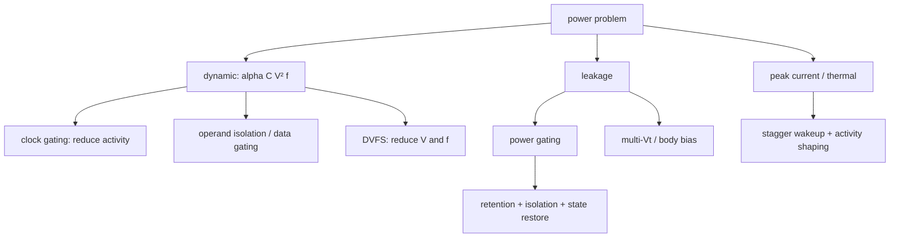
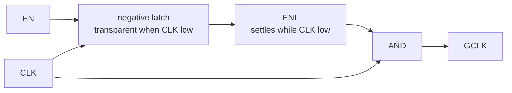
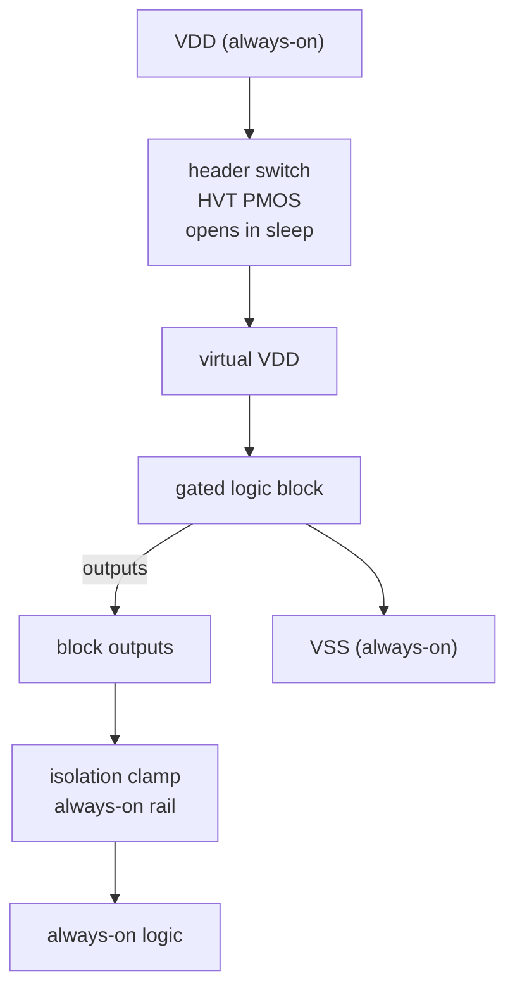

# Power Reduction Techniques — Matching the Lever to the Term



> **Prerequisites:** [Power Fundamentals](01_Power_Fundamentals.md) (the $P=\alpha C V_{DD}^2 f + V_{DD}I_{leak}$ equation, energy-per-op, and the leakage physics), [Low-Power Architecture](03_Low_Power_Architecture_and_Domain_Partitioning.md) (why the design has these power, voltage, and clock boundaries), [CMOS Fundamentals](../00_Fundamentals/01_CMOS_Fundamentals.md) (MOSFET operation, transmission gates, latch structures), [STA](../06_Signoff/01_STA.md) (setup/hold and time-borrowing).
> **Hands off to:** [UPF/CPF Power Intent](05_UPF_and_CPF_Power_Intent.md) (the language that *encodes* the domains, isolation, retention, and level-shifting this page *designs*), [Power Analysis and Signoff](06_Power_Analysis_and_Signoff.md) (measuring what these techniques claim to save), [Block Activity and Power](02_Block_Activity_and_Power.md) (where the activity factors come from).

---

## 0. Why this page exists

There is exactly one power equation, and every reduction technique ever invented is an attack on one of its terms:

$$P_{total} = \underbrace{\alpha \, C_L \, V_{DD}^2 \, f_{clk}}_{\text{dynamic}} \;+\; \underbrace{V_{DD}\, I_{leak}}_{\text{static}}$$

[Power Fundamentals](01_Power_Fundamentals.md) derives this and closes with a *reduction map* — a table from lever to term. **This page is that map, opened up.** Its organizing claim is that the low-power toolbox is not a grab-bag of tricks but a small set of levers, each of which kills a *specific* term, buys a *quantifiable* saving, and charges a *specific* price. The discipline is matching the lever to the term: clock gating does nothing for a leakage-dominated standby, power gating does nothing for a block busy every cycle, and multi-$V_t$ does nothing for the clock tree.

So for every technique this page asks the same five questions, in order, and refuses to describe a mechanism before it has answered the first two:

1. **Which term does it kill** — $\alpha$, $V_{DD}^2 f$, $C$, or $I_{leak}$?
2. **What is the mechanism**, derived from the term it must move?
3. **What does it cost** — area, timing, wake latency, state loss, verification, complexity?
4. **What is the quantitative saving**, and the theoretical model behind it?
5. **When is it worth it** — the break-even that decides whether to deploy it at all?

What this page deliberately does *not* do is teach you to instantiate an ICG cell or write a UPF file. The signal names, tool commands, and power-intent syntax live in the neighbour pages; here we build the *understanding* that tells you which lever to reach for and why real chips land where they do.

---

## 1. The reduction map: five terms, and the levers that move each

### 1.1 The one rule

Read the equation as five independent handles — $\alpha$, $C_L$, $V_{DD}$, $f$, $I_{leak}$ — and notice they are *not* symmetric. $V_{DD}$ appears squared *and* couples to $f$ (a lower voltage forces a lower frequency), so it is the master knob. $I_{leak}$ hides an exponential in $V_{th}$. $\alpha$ on the clock net is pinned at 1 by construction while everywhere else it is a few percent. A technique's power comes entirely from *which* handle it grabs and *how hard* that handle pulls — which is why the first thing to know about any technique is its term.

### 1.2 The map

Each row is a full section below. Read it as: this lever kills this term, by this mechanism, at this dominant cost, and is worth it under this condition.

| Lever | Term killed | Mechanism | Dominant cost | Worth it when… | § |
|---|---|---|---|---|---|
| **Clock gating** | $\alpha$ on the clock (the 30–50 % term) | stop the clock to idle flops/blocks | enable-detection logic, ICG area, tight enable timing | always — every synchronous design | 2 |
| **Operand isolation** | $\alpha$ of a datapath cloud | freeze inputs of an unused combinational block | one gate layer on a timing path | wide unit, low use duty cycle | 2.4 |
| **DVFS** | $V_{DD}^2 f$ (≈ cubic together) | scale supply + frequency with demand | µs–ms transition latency, signoff corners | workload intensity varies | 3 |
| **Voltage islands** | $V_{DD}^2$ per block | run each block at its own minimum supply | level shifters, extra rails, floorplan | blocks have different $V_{min}$ | 3.5 |
| **Power gating (MTCMOS)** | $V_{DD}I_{leak}$ in idle blocks | cut the rail with a sleep switch | state loss, wake latency, rush current, verification | block idle for ms+ | 4 |
| **Multi-$V_t$** | $I_{leak}$ (exponential in $V_{th}$) | HVT off-critical, LVT on-critical, per cell | speed↔leakage per path; corner count | always, in implementation | 5 |
| **Body biasing** | $I_{leak}$ / delay via $V_{th}$ | drive $V_{SB}$ to shift $V_{th}$ post-fab | triple-well, weak on FinFET | process spread; FD-SOI parts | 5.5 |
| **Memory sleep modes** | $C_L$ per access, $I_{leak}$ | bank activation; array retention voltages | wake latency, retention $V_{min}$ margin | memory is idle (usually) | 6 |
| **Bus encoding** | $\alpha$ / $C$ of wide buses | fewer transitions per transferred word | encode/decode logic, one extra wire | wide, high-traffic buses | 7 |

### 1.3 Two facts that shape every choice

**Leverage grows with abstraction.** The same equation can be attacked at any level, but the higher you apply the lever the more of the chip it moves:

| Level | Techniques | Typical impact |
|---|---|---|
| System / architecture | DVFS, power gating, accelerate-then-gate | 10–100× |
| Micro-architecture | clock gating, operand isolation, memory partitioning | 2–10× |
| RTL / logic | encoding, resource sharing, FSM idle conditions | 10–30 % |
| Gate | multi-$V_t$, sizing, buffer optimization | 10–30 % |
| Circuit | body biasing, custom cells, adiabatic | 5–20 % |

The practical reading: fight for power at architecture and micro-architecture first (where 2–100× lives), then let the implementation flow harvest the remaining tens of percent. You cannot multi-$V_t$ your way out of a bad architecture.

**The terms are not equal, and the clock is the fat one.** The clock network is 30–50 % of dynamic power because it is the one net with $\alpha = 1$ — a full charge/discharge *every* cycle, on every capacitance it touches — while datapath nodes toggle at $\alpha \approx 0.05\text{–}0.15$. That single asymmetry is why clock gating is the first technique, present in essentially every design ever taped out, and why we start there.

**They stack.** Because the terms multiply, the levers are orthogonal: a modern application-processor core is simultaneously clock-gated, DVFS-scaled, power-gated with retention, multi-$V_t$ optimized, and fed by mode-controlled SRAMs — each lever covering the operating regime the others miss (§8).

---

## 2. Attacking activity $\alpha$: clock gating and data gating

### 2.1 Why clock gating saves what it saves

A register that only sometimes captures new data can be written two ways. The obvious way recirculates the old value through a mux — *data* is held, but the clock toggles every cycle regardless. Clock gating instead blocks *the clock itself*: on idle cycles the clock pin, the local buffers, and the flop's internal clock inverters simply do not move.

```verilog
always @(posedge clk) q <= en ? d : q;  // mux on D: clock power spent every cycle
always @(posedge clk) if (en) q <= d;   // tool extracts en onto the clock (ICG)
```

The saving falls straight out of the equation. The clock net has $\alpha = 1$; gating removes a fraction $CGE$ (clock-gating efficiency — the fraction of cycles actually gated) of those transitions, dropping the *effective* activity from $1$ to $(1-CGE)$. For $N$ flops behind one gate:

$$P_{saved} = CGE \cdot N \cdot C_{clk/FF} \cdot V_{DD}^2 \cdot f_{clk}$$

where $C_{clk/FF}$ (≈ 5–18 fF; use 10 fF for planning) bundles everything the clock moves per flop — the flop's clock-pin capacitance, its share of clock wire, and its share of buffer drive. The limits check: $CGE=0$ saves nothing; $CGE=1$ removes the entire clock power of those flops. There is nothing subtle here — you are deleting the switching of the single most active net, prorated by how often it is idle.

### 2.2 The glitch-free requirement: why you cannot simply AND the clock

The mechanism is worth deriving because the *obvious* implementation is wrong in an instructive way. The function wanted is "pass the clock when enabled," so the naive circuit is one AND gate, $GCLK = CLK \wedge EN$. But $EN$ is an ordinary logic signal launched by a flop and rippled through logic, so it can change — and glitch — at *arbitrary* times within the cycle. An AND gate is transparent to $EN$ whenever $CLK=1$, so any change on $EN$ during the high phase passes straight to $GCLK$ as a runt or truncated pulse. Those are **clock glitches**: edges whose timing is set by a data path, not the clock source. They violate minimum pulse width (the flop can go metastable) and reference downstream setup/hold to an edge STA cannot bound.

Trace *why* it failed and the fix names itself: everything went wrong because the gating value changed *while $CLK$ was high*. During $CLK=0$ the AND output is forced low and $EN$ changes are harmless. So the requirement is a timing constraint on the gating value:

> The signal that actually gates the clock may change **only while $CLK=0$**. Any change arriving during $CLK=1$ must be held off until the clock falls.

An element that is transparent at one clock level and opaque at the other is, by definition, a **level-sensitive latch** — here transparent-low. Latch the enable on the low phase, then AND the *latched* enable with the clock, and every glitch is structurally impossible: when $EN$ changes during $CLK=1$ the latch is opaque and the change waits for the falling edge. That latch-plus-AND is the entire idea of the **Integrated Clock Gating (ICG)** cell; it is *integrated* (characterized as one glitch-free unit with a defined insertion delay and a scan-override input) precisely so the latch→AND net cannot pick up skew or crosstalk that a discrete pair would.

The cell is exactly those two elements — a transparent-low (negative) latch feeding one input of an AND gate:



A glitch on $EN$ during $CLK=1$ arrives at an *opaque* latch and waits for the falling edge, so $GCLK$ only ever sees an enable that settled while $CLK$ was low — the runt pulse is structurally unreachable, not merely improbable.

The cost of the cell is small but real: ~1–2× a minimum inverter in area, and — the subtle part — its *own* clock pin toggles every cycle upstream of the gate, so an ICG gating too few flops burns more than it saves. The enable timing is a setup to the *inactive* (falling) edge, giving the enable roughly a half-cycle to a full cycle to arrive; the precise STA semantics (hard requirement vs. margin house-rule, and time-borrowing through transparency) are the same as any latch path in [STA](../06_Signoff/01_STA.md).

### 2.3 Granularity and the clock-tree share: gating near the root

One ICG can gate a handful of flops or an entire subsystem, and the choice is a genuine trade-off, not a detail. Fine-grain gating (4–16 flops per ICG, auto-inserted by synthesis from `if (en)` patterns) captures idle cycles precisely but costs many cells (~5–8 % area, ~20–40 % power reduction typical). Coarse-grain gating (hundreds to thousands of flops, one module-level ICG driven by firmware) costs almost no area but only fires when the whole block is idle.

The decisive theoretical point is *where in the clock tree the ICG sits*. A leaf ICG stops only the flop clock pins below it — **the clock buffers above it still toggle every cycle.** Since those buffers are a large part of the 30–50 % clock power, moving real clock-tree power requires gating near the *root*. But root gating tightens the enable path: less clock-network insertion delay downstream of the ICG means less margin for the enable to arrive, so the enable must be computed earlier. That is the core tension CTS manages (cloning ICGs to control skew, pulling them up or down to balance enable timing against gated-buffer power). The right answer is a *hierarchy*: module-level gating for sleep modes, cluster-level for pipeline stages, fine-grain for the rest — each level catching idleness the others miss.

Beyond what single-cycle inference can see, **sequential (data-driven) gating** strengthens enables using multi-cycle behaviour: observability-don't-care gating stops a register whose output nobody will read for $N$ cycles; XOR self-gating fires the clock only when the data actually changes ($\text{en} = \lvert (d \oplus q)\rvert$), paying an OR-reduction tree to do it. Because these change cycle-by-cycle behaviour on don't-care cycles, they cannot be checked by combinational equivalence — they need *sequential* equivalence checking (SLEC). That verification cost is the price of the extra savings.

### 2.4 Operand isolation: the $\alpha$ of the datapath

Clock gating stops *registers* from toggling; a large share of dynamic power is burned *between* registers, in combinational clouds that compute whether or not anyone wants the answer. Consider a multiplier behind a result mux: when `sel` picks the other input the product is discarded, yet `a` and `b` keep changing every cycle (they are shared buses), and each change ripples through thousands of internal nodes — partial products, carry chains, and glitches re-converging along unbalanced paths. All of that is $\alpha C V^2 f$ spent to compute a value that is thrown away.

Operand isolation is the combinational counterpart of clock gating: force the block's inputs to a constant whenever its output is unused, driving $\alpha \to 0$ for the entire cloud (glitch power included — and multipliers glitch heavily, so this matters). The saving is the unit's dynamic power times its idle fraction:

$$P_{saved} \approx (1 - D_{active}) \cdot P_{unit}$$

where $D_{active}$ is the duty cycle of genuine use. The cost is one gating layer (AND gates forcing zeros, or a latch holding the last operand) that sits on the datapath's *timing* path — so `sel` must be valid early, and isolating a critical path is a timing bug waiting to happen. The break-even is a width-vs-activity rule: isolation pays on datapaths wider than ~16 bits with genuine-use activity below ~10–20 %; below that width or above that activity the gating layer's own area, delay, and switching eat the margin. And if the operands come *only* from registers already clock-gated during idle, isolation is free — frozen registers feed frozen operands; it earns its keep when the buses keep changing for *other* consumers.

---

## 3. Attacking the voltage term $V_{DD}^2 f$: DVFS

Voltage is the strongest dynamic knob for two compounding reasons. It enters the dynamic term *squared*, and — the part people forget — lowering it also lowers the achievable frequency, so scaling both together cuts power with roughly the *cube* of voltage. Equally fundamental: energy per operation is $E_{op} = P_{dyn}\,T_{cycle} \propto C_L V_{DD}^2$, **independent of frequency**. Running slower at the same voltage saves power but not energy; only lowering the voltage saves energy per unit of work. **DVFS** exploits this by moving the chip between characterized (voltage, frequency) operating points as demand varies.

### 3.1 The delay–voltage model, and why V and f scale together

Everything hangs on how gate delay depends on supply. A gate switches by moving charge $Q = C_L V_{DD}$ through its drive current, so $T_d \approx C_L V_{DD}/I_{drive}$; the short-channel drive current follows the Sakurai–Newton alpha-power law $I_{drive} \propto (V_{DD}-V_{th})^{\alpha}$. Combining:

$$T_d \propto \frac{C_L\,V_{DD}}{(V_{DD}-V_{th})^{\alpha}} \qquad\Longrightarrow\qquad f_{max} \propto \frac{(V_{DD}-V_{th})^{\alpha}}{V_{DD}}$$

where $V_{th}$ = threshold voltage, and $\alpha$ = velocity-saturation exponent (fitted: 2.0 long-channel, ≈ 1.3 for modern FinFET, valid for $V_{DD} \gtrsim V_{th}+0.15$ V). As $V_{DD}\to V_{th}$ the gate barely conducts and delay explodes; well above threshold, $T_d \propto 1/V_{DD}$.

How *hard* voltage pulls frequency depends on where you sit, captured by the logarithmic sensitivity:

$$\frac{d\ln f}{d\ln V_{DD}} = \frac{\alpha\,V_{DD}}{V_{DD}-V_{th}} - 1$$

- **Near nominal** ($V_{DD}=0.8$, $V_{th}=0.3$, $\alpha=1.3$): ≈ 1.08 — the classic rule of thumb that "voltage scales roughly with frequency."
- **High voltage** ($V_{DD}\gg V_{th}$): → $\alpha-1 \approx 0.3$, i.e. $V_{DD}\propto f^{3.3}$ — the top of the curve flattens brutally, so a 20 % frequency push costs $1.2^{3.3}\approx 1.8\times$ the voltage. This is why the last few hundred MHz of turbo burn enormous power.
- **Near threshold**: → ∞ — tiny voltage swings frequency wildly, and variation sensitivity explodes with it.

Substituting the achievable $f$ into $P_{dyn}=C V_{DD}^2 f$ gives $P_{dyn}\propto V_{DD}(V_{DD}-V_{th})^{\alpha} \to V_{DD}^{2.3}\text{–}V_{DD}^{3}$ — the famous near-cubic law. Concretely, a 20 % voltage cut (1.0 → 0.8 V, $V_{th}=0.3$) costs ~19 % frequency but saves ~48 % dynamic power. That asymmetry — small performance loss for large power win — is the whole case for DVFS.

### 3.2 Operating points: characterized, not derived

DVFS ships as a discrete table of **operating performance points (OPPs)**, each a (V, f) pair signed off as a timing-clean corner:

| OPP | $V_{DD}$ | Freq | Relative $P_{dyn}$ | Use case |
|---|---|---|---|---|
| Turbo | 0.95 V | 2.8 GHz | 1.97× | peak burst (throttles in seconds) |
| Nominal | 0.80 V | 2.0 GHz | 1.00× | sustained |
| SVS | 0.70 V | 1.4 GHz | 0.54× | light load |
| Low | 0.60 V | 0.8 GHz | 0.23× | background |
| Min | 0.50 V | 0.4 GHz | 0.08× | always-on sensor |

Relative power is $(V/V_{nom})^2 (f/f_{nom})$. Leakage also falls with voltage (via DIBL) but far less steeply than $V^2 f$. One caution worth internalizing: these tables are *characterized on silicon, not derived from the model*. Sustained points sit below the $f_{max}(V)$ curve (thermal and aging margin); turbo points sit near it; and effective $\alpha$/$V_{th}$ themselves drift with voltage and temperature. Use the alpha-power model for reasoning and sensitivities; use the characterized table for signoff.

### 3.3 The transition cost and the DVFS break-even

Moving between OPPs is not free, and the mechanism dictates a strict ordering rule. Voltage moves via a regulator (external PMIC, 10–50 µs; on-die LDO, sub-µs) and frequency via a PLL/divider (5–20 µs). At every instant, including mid-transition, the chip must satisfy $f \le f_{max}(V_{DD})$ — so **always move the knob that creates slack before the one that consumes it**: scaling *up*, raise voltage first (adds slack at the old frequency), then frequency; scaling *down*, drop frequency first, then voltage. The wrong order leaves gates too slow for the new period → setup violations → functional failure.

The transition itself burns energy, which sets a minimum residency. During a downward switch of duration $T_{trans}$ the chip runs near the old power instead of the new, wasting roughly

$$E_{trans} \approx \frac{P_{old}\,T_{trans}}{2}, \qquad\text{so dropping OPP pays only if}\quad T_{idle} > \frac{E_{trans}}{\Delta P}$$

where $\Delta P$ is the power saved at the lower point. Worked: for $P_{old}=1$ W, $T_{trans}=50$ µs, $\Delta P=0.5$ W, the transition wastes $E_{trans}\approx P_{old}T_{trans}/2 = 25$ µJ, so the low OPP pays back only after $T_{idle} > E_{trans}/\Delta P = 50$ µs. With margin, governors floor the interval at **1–10 ms between transitions** — the quantitative sense in which DVFS is a *millisecond* technique. This is the same amortization logic as the power-gating break-even (§4.4); the two differ only in the size of the round-trip cost.

### 3.4 Recovering the guardband: AVS, droop, adaptive clocking

A fixed OPP table must use one voltage per frequency sized for the *worst* chip at the worst condition, so every typical chip carries tens of millivolts of pure guardband. **Adaptive voltage scaling (AVS)** recovers it: on-die monitors (ring oscillators, critical-path replicas, or in-situ speed sensors) measure *this* chip's actual speed and trim the voltage per-chip and per-condition to just-enough, worth 50–100 mV on fast silicon. **AVFS** closes the loop around both V and f with distributed sensors. AVS handles the *slow* variation — process, temperature, aging (ms to years).

It cannot catch the *nanosecond* supply droop. A load step (a vector unit waking) demands a sudden current change that the PDN inductance converts to a droop $\Delta V = L\,di/dt$, resonant at ~50–300 MHz — within nanoseconds, far faster than any regulator (µs) or firmware loop (ms). The classical fix is a permanent voltage guardband, but its cost is paid *all the time*: to first order $\Delta P/P \approx 2\,\Delta V/V$, so a 60 mV guardband at 0.9 V costs ~13 % of dynamic power to protect against an event lasting tens of ns. The modern fix rides through instead of margining: an on-die droop detector senses the dip in ~1–5 ns and an adaptive clock module *stretches the period* by a few percent — gate delays grew because V dropped, so the cycle grows to match, preserving timing *through* the droop. Removing a 50 mV guardband recovers ~11 % dynamic power in exchange for a brief, rare frequency loss (AMD since Steamroller, IBM POWER9, Intel AVX license-based frequency).

### 3.5 Voltage domains and islands: V over space

DVFS varies one domain's voltage over *time*; **voltage islands** vary it over *space* — different blocks run at different fixed supplies, each at the minimum its own timing needs. The motivation is the same waste from a different angle: a single shared rail must satisfy the hungriest consumer, $V_{shared}=\max(V_{request})$, so one core running turbo forces every idle core to its voltage and each then burns $(V_{shared}/V_{needed})^2$ times its necessary dynamic power. Per-domain regulation (per-core digital LDOs in Intel Arrow Lake and AMD Zen) is what makes fine partitioning possible.

The cost is at the boundaries. Every signal crossing between domains needs a **level shifter**, and the two directions are not symmetric. Low-to-high is the hard one: a 0.8 V "1" arriving at a 1.8 V gate leaves the receiver's PMOS partly on alongside its NMOS — a DC crowbar path and an indeterminate output — so the standard cell is a differential cross-coupled PMOS latch that snaps to a full high-domain swing with no static current, and it needs *both* supplies routed to it. High-to-low is easy (the input over-drives the receiver; a rated buffer suffices). A useful sanity result on the regulators feeding these domains: a linear regulator (LDO) is a series pass device, so its efficiency is conservation of energy, $\eta_{LDO}=V_{out}/V_{in}$ — dropping 0.9 → 0.55 V is only 61 % efficient, which is why linear regulation is attractive only for small drops. Islands are declared as power domains with their own supply nets in [UPF](05_UPF_and_CPF_Power_Intent.md), which inserts and checks the shifters; asynchronous crossings between domains are a full CDC problem ([Async Design and CDC](../03_Frontend_RTL_and_Verification/06_Async_Design_and_CDC.md)).

---

## 4. Attacking idle leakage $V_{DD}I_{leak}$: power gating (MTCMOS)

Clock gating stops a block's *dynamic* power, but its leakage keeps flowing — $V_{DD}I_{leak}$ is paid every nanosecond the rail is up, busy or idle. Multi-$V_t$ (§5) shrinks $I_{leak}$ but never zeroes it. For a block that idles for milliseconds or longer, the strongest move is to remove $V_{DD}$ itself: insert a large series switch between the supply and the block and open it during sleep. The switch is a **high-$V_t$** device (lowest leakage), and that pairing of a high-$V_t$ sleep switch with ordinary logic is the origin of the name **MTCMOS** (multi-threshold CMOS).

### 4.1 One series switch, four consequences

Cutting a rail is conceptually trivial and practically invasive, because the single series device creates four new problems — and the entire rest of this section is those four consequences, each derived from the switch itself:

1. **When ON, it is a resistor** in series with the block's whole supply current — its IR drop steals voltage and therefore speed (§4.2).
2. **Turning ON is a transient** — a discharged domain is a huge uncharged capacitor, and the rush current to refill it disturbs the whole chip (§4.2).
3. **When OFF, the block's outputs float** — undefined values that poison always-on neighbours unless clamped (isolation, below).
4. **When OFF, all internal state is lost** — every flop must be saved somewhere still powered, or rebuilt at wake (§4.3).

Problem 3 forces **isolation cells**: a clamp gate at each domain output, *powered from the always-on rail*, that pins the output to a known safe value (AND-type clamps to 0, OR-type to 1) for the entire dead period. The floating alternative is not merely undefined logic — a mid-rail voltage drives a receiving always-on gate into partial conduction, a DC crowbar path burning static power while emitting garbage. The isolation enable must itself be generated *outside* the gated domain, or it dies exactly when it is needed.

The whole arrangement — one series switch, a *virtual* rail feeding the block, and always-on isolation on the outputs:



*Header* shown: a high-$V_t$ PMOS in series between true $V_{DD}$ and the block's *virtual* $V_{DD}$ — open it and the local rail collapses to zero. The *footer* variant is the mirror (an HVT NMOS between the block's virtual $V_{SS}$ and true $V_{SS}$): smaller for equal $R_{on}$, but it bounces the virtual ground, so headers dominate ASIC practice (§4.2). $SLEEP$ and the isolation enable both originate in the always-on controller and must be strictly sequenced (§4.5).

### 4.2 Sizing the switch: IR drop vs rush current

The switch network is squeezed between two opposing constraints. **Big enough** that the active current flows with negligible loss: with $I_{active}=P_{active}/V_{DD}$ and a drop budget $\Delta V_{drop}$ (typically 5–10 % of $V_{DD}$, since every lost millivolt is lost speed by the §3.1 delay model), the required on-resistance is $R_{sw}=\Delta V_{drop}/I_{active}$. A 100 mW block at 0.9 V draws 111 mA; a 45 mV budget demands $R_{sw}<0.41\,\Omega$, which at ~500 Ω·µm needs ~1235 µm of PMOS, distributed across ~165 switch cells. (Header/PMOS switches keep a clean chip-common ground but need ~2× the width of a footer/NMOS for equal $R_{on}$; footers are smaller but bounce the virtual ground — headers dominate ASIC practice.)

**Gentle enough** that refilling the dead domain does not wreck the parent rail. At turn-on the internal capacitance recharges from ~0 V, drawing $I_{rush}=C_{internal}\,dV/dt$, and the package inductance turns that slew into supply noise for *everyone else* ($\Delta V=L\,di/dt$). Supply-noise analysis hands down a hard $I_{rush}$ ceiling and therefore a slowest allowed ramp. The difference between managed and unmanaged is four orders of magnitude: a 10 nF domain ramped over 10 µs draws sub-mA, but slammed on in ~1 ns it draws ~8 A — catastrophic IR collapse and ground bounce that can spuriously reset neighbours. Since the event is over in nanoseconds, firmware cannot control it; the staging is built into the switch fabric as a **daisy chain** (enables ripple through delay cells so only one group charges at a time, limiting current to ~$I_{rush}/N_{stages}$), often with a weak "trickle" switch charging the rail before the strong switches engage.

### 4.3 State: retention vs reboot

Problem 4 has two answers. **Full power gating** loses all state and rebuilds it on wake — cheapest to build (~3–5 % area for switches and isolation only), slowest to wake (milliseconds of re-init), fit for peripherals and rarely-used IP. **State-retention power gating (SRPG)** parks selected state in a **retention register**: a small shadow ("balloon") latch on the always-on rail with SAVE/RESTORE plumbing that copies the bit out before power-down and back after power-up. The concept is simply "park the bit somewhere that stays powered," and the requirements follow — the shadow latch needs its own regenerative keeper to hold statically for an unbounded sleep, and SAVE/RESTORE must be driven from *outside* the domain and fire only while the clock is stopped.

Retention is not free. A retention flop is ~1.5× a standard flop (quoted variously as +30–50 % or up to 2× depending on style), and its shadow latch — ~4–6 transistors leaking a few nA each — is *the only thing that leaks* while the domain is gated (10 K retention flops ≈ 45 µW of always-on leakage). This is why retention is *selective*: keep architectural registers, interrupt and power-management state, security context; discard caches (re-fetch), pipeline state (flush and restart), debug registers (reinitialize). Selective retention cuts the retention-flop count by 80–90 %.

| | SRPG (with retention) | Full power gating |
|---|---|---|
| State | selected registers preserved | all lost |
| Area overhead | ~10–20 % | ~3–5 % |
| Always-on leakage | higher (shadow latches) | lower (isolation only) |
| Wake latency | fast (5–50 µs) | slow (ms: full boot) |
| Use case | CPU cores, DSPs | peripherals, rare IP |

### 4.4 The break-even residency — and the timescale ladder

Either flavour pays only if the block sleeps long enough, and this break-even is the central theoretical result of power gating. Entering and leaving sleep costs energy — the save/restore pulses and, above all, *recharging the domain capacitance at wake*, $E_{exit}\approx C_{internal}V_{DD}^2$. Sleeping saves the gated leakage for the idle duration. Sleep is worth it when the saving exceeds the round-trip cost:

$$T_{breakeven} = \frac{E_{overhead}}{P_{leak,saved}} = \frac{E_{enter}+E_{exit}}{P_{leak,saved}}, \qquad \text{sleep pays} \iff T_{idle} > T_{breakeven}$$

where $P_{leak,saved}$ = leakage eliminated while gated (W), and $E_{enter}, E_{exit}$ = enter/exit energies (J). This is the same shape as the DVFS transition break-even (§3.3), with a much larger round-trip cost — which is exactly why the two techniques target different timescales.

**Worked break-even (SRPG).** Take the §4.2 block — 100 mW active at 0.9 V, internal (decap + parasitic) capacitance $C_{internal}=10$ nF, leaking an assumed $P_{leak,saved}=5$ mW while powered. The round trip is dominated by *refilling the rail* at wake: $E_{exit}\approx C_{internal}V_{DD}^2 = 10\text{ nF}\times(0.9\text{ V})^2 = 8.1$ nJ. The SAVE/RESTORE pulses across on-die shadow latches are a fraction of a nJ, so the rush-current recharge *is* essentially the whole overhead, $E_{overhead}\approx 8$ nJ. Then

$$T_{breakeven}=\frac{E_{overhead}}{P_{leak,saved}}=\frac{8\ \text{nJ}}{5\ \text{mW}}\approx 1.6\ \mu\text{s}.$$

That ~µs is only the *energy* floor — sleep any shorter and refilling the rail burns more than the leakage it saved. The *binding* floor is latency: the idle window must also outlast the entry+exit sequence itself — drain, SAVE, isolate, power down; then power up, settle at the far corner, reset, RESTORE, de-isolate (§4.5) — with the recharge deliberately ramped over µs to keep rush current off the ~8 A slam of §4.2. That sequence runs 5–50 µs for SRPG (ms for a full reboot), and with margin it is what files power gating under "ms+" below, even though the energy alone breaks even far sooner. That extra round trip — rush-limited recharge, reset, state restore — is what DVFS's lighter V/f ramp never pays, and why the two levers own different timescales.

That produces the unifying picture of the whole activity/idle toolbox as a **residency ladder**, each lever owning the range its break-even carves out:

| Idle timescale | Lever | What it recovers | Round-trip cost |
|---|---|---|---|
| per cycle | clock gating, operand isolation | dynamic (clock / datapath $\alpha$) | ~a cycle |
| µs–ms (workload varies) | DVFS / AVS | dynamic $V^2 f$ | µs transition |
| ms+ (block idle) | power gating (MTCMOS) | idle leakage | µs–ms + rail recharge |
| always (even when busy) | multi-$V_t$, body bias | busy leakage | design-time only |

### 4.5 Sequencing and verification: the real complexity cost

The switches, isolation, and retention must fire in a strict order, and that choreography is a genuine cost of the technique — the reason power gating is the most flow-entangled lever on the page. Power-down drains the pipeline, gates clocks, SAVEs state, asserts isolation, *then* removes power — each step protecting the next (clocks stop so SAVE copies a stable value; isolation is up before the rail collapses so the outside never sees a float). Power-up reverses it with an extra subtlety: power on, wait for the rail to stabilize *at the farthest corner*, reset every flop to a known state, RESTORE the retained subset over the top, de-isolate, then release clocks.

Getting any edge wrong produces a specific, nasty silicon bug: isolation powered from the *switched* rail (dies with the domain), RESTORE fired before the rail is stable at the far corner (single-bit corruption, worse cold), rush current collapsing the parent rail (a *neighbour* resets randomly), or control signals sourced from the domain they control. These are caught by UPF-driven power-aware simulation and low-power static checks — the specification and verification of all this power intent is the subject of [UPF/CPF Power Intent](05_UPF_and_CPF_Power_Intent.md), and signing off the IR/rush/wake-latency is [Power Analysis and Signoff](06_Power_Analysis_and_Signoff.md). The point here is that this verification burden *is* the cost that the break-even must justify.

---

## 5. Attacking busy leakage $I_{leak}$ via $V_{th}$: multi-$V_t$ and body bias

Power gating zeroes the leakage of blocks that are *idle*. The last lever attacks the leakage of logic that is *busy*: choose, gate by gate, how leaky each transistor is allowed to be. It is the one major power technique invisible to RTL and architecture — it lives entirely in synthesis and place-and-route — which also makes it the most commonly *practiced* day-to-day power task in physical design.

### 5.1 Exponential leakage, polynomial delay: the whole game

The arbitrage that makes multi-$V_t$ work is an asymmetry in how leakage and speed respond to the threshold voltage. Subthreshold leakage is *exponential* in $V_{th}$:

$$I_{leak} = I_0\, e^{-V_{th}/(n V_T)} \;\Rightarrow\; \text{swing } S = n V_T \ln 10 \approx 70\text{–}100\ \text{mV/decade}$$

where $V_T = kT/q \approx 26$ mV (thermal voltage, *not* threshold), $n \approx 1.2\text{–}1.6$ (subthreshold slope factor), and $I_0$ a size/process prefactor. Every ~70–100 mV of *added* threshold buys a full 10× leakage reduction (the 60 mV/dec Boltzmann floor is unreachable by conventional MOSFETs). Speed, meanwhile, grows only *polynomially* as $V_{th}$ rises: $T_d \propto V_{DD}/(V_{DD}-V_{th})^{\alpha}$ (§3.1), so 100 mV more threshold costs tens of percent of speed while cutting leakage 10×. **Exponential benefit, polynomial cost — that is the entire economic basis of multi-$V_t$ design.**

Foundries ship each logic cell in several threshold flavours (different $V_{th0}$ baked in at fabrication — channel implant on planar nodes, work-function metal on FinFET, dipole engineering at GAA/nanosheet). The library, and the leakage-vs-performance curve it embodies:

| Flavour | $V_{th}$ | Rel. delay | Rel. leakage | Role |
|---|---|---|---|---|
| UHVT | ~400 mV | 1.50× | 0.05× | standby / deep-slack paths |
| HVT | ~350 mV | 1.20× | 0.20× | non-critical (the majority) |
| SVT | ~300 mV | 1.00× | 1.00× | moderate paths |
| LVT | ~250 mV | 0.80× | 5.0× | near-critical |
| ULVT | ~200 mV | 0.65× | 20.0× | most critical only |

Note the shape: each ~50 mV step of $V_{th}$ changes delay by a few percent but leakage by 3–5×. (These ratios are not constants — the delay advantage of a low $V_{th}$ grows as $V_{DD}$ falls and $V_{DD}-V_{th}$ shrinks, so re-check at the low-voltage corner.)

### 5.2 The assignment problem and the Pareto tail

Assignment is a constrained optimization: meet timing with the fewest, cheapest fast cells. The standard flow starts frugal — all cells HVT (minimum leakage) — and swaps *up* (HVT→SVT→LVT) only on the paths STA proves are violating, worst path first; then swaps *down* wherever slack came out positive (leakage recovery). Every swap is footprint-compatible (same outline and pins, only the implant/work-function layer differs), so it is timing-clean by construction with no placement change, which is what makes the loop affordable and makes it the bread-and-butter late-ECO knob.

The reason the discipline matters is that leakage lives in the *fast tail*. Total leakage is a population-weighted sum,

$$P_{leak} = V_{DD} \sum_{v} N_v \, I_{SVT} \, r_v$$

where $N_v$ = cell count of flavour $v$, $I_{SVT}$ = per-cell SVT reference leakage, and $r_v$ = that flavour's relative leakage. A small $N_v$ with a huge $r_v$ dominates: weighting a typical mix (60 % HVT, ~28 % SVT, ~10 % LVT, 1–3 % ULVT) by the 0.2/1/5/20× ratios puts the ~11 % of LVT+ULVT cells at roughly 55–65 % of total leakage. A few percent of ULVT cells can be a third of the budget. So the objective is never "minimum leakage" (that is all-HVT, which fails timing) but *minimum leakage subject to timing*, and the art is minimizing the LVT/ULVT count. A distribution far from ~60 % HVT is itself a diagnostic: too much LVT means optimistic constraints or a floorplan problem papered over with fast cells.

### 5.3 What multi-$V_t$ actually buys: voltage, not leakage

Here is the subtlety that catches people. Compare a multi-$V_t$ netlist against an all-SVT one *at the same voltage* and the multi-$V_t$ version can leak *more* — its LVT/ULVT critical-path cells add enormous leakage. That comparison is meaningless, because the two netlists close timing at *different performance points*. The honest comparison holds performance constant: to hit the same frequency, the slower all-SVT netlist must *raise its supply* until its gates catch up (say 0.85 V where the multi-$V_t$ netlist closes at 0.75 V, its LVT cells rescuing the critical paths). Now total power tells the real story: the multi-$V_t$ design's ~0.10 V lower supply saves dynamic power *quadratically* (~20–30 %), dwarfing its higher leakage.

So the deepest framing is: **multi-$V_t$ is not primarily a leakage-reduction technique — it is a technique for buying back voltage.** LVT on the critical paths lets you close timing at a lower $V_{DD}$, and the leakage discipline of §5.2 is what keeps the purchase price (the fast-tail leakage) down. It is the same currency — voltage headroom — that SRAM assists spend (§6).

### 5.4 $V_t$ swap vs cell upsizing

Swapping $V_t$ is not the only way to speed a slow cell; upsizing (X1→X2 drive) attacks the same delay from the *current* side. They price the same slack very differently because leakage is *linear* in transistor width but *exponential* in $V_{th}$: an upsize costs ~2× leakage (double the width), a $V_t$ swap 5–10× — so the swap is the leakier fix per unit delay. But the upsize is not free either: it doubles the input capacitance presented upstream (possibly just moving the violation one stage back) and burns extra *dynamic* power on every toggle, which a swap never does; and only the swap is footprint-compatible. Decision rules: prefer upsizing for minimal leakage impact on low-activity paths; prefer the swap on high-activity nets (its leakage cost does not scale with toggling) and in late, routing-frozen ECOs (no footprint change).

### 5.5 Body biasing: the same knob, after fabrication

Multi-$V_t$ freezes each transistor's $V_{th}$ in the mask set. Body biasing turns the *same* knob after fabrication, at runtime, by driving the fourth (body) terminal off the source rail. The mechanism sits in the threshold equation itself:

$$V_{th} = V_{th0} + \gamma\left(\sqrt{2\phi_F + V_{SB}} - \sqrt{2\phi_F}\right)$$

where $\gamma$ = body-effect coefficient ($\sqrt{\text{V}}$), $\phi_F$ = Fermi potential (V), and $V_{SB}$ = source-to-body voltage. Multi-$V_t$ sets $V_{th0}$; body bias drives $V_{SB}$. The sensitivity $dV_{th}/dV_{SB}=\gamma/(2\sqrt{2\phi_F+V_{SB}})$ is only ~100–250 mV of $V_{th}$ per volt of bias in planar bulk — a weak, sub-unity, diminishing lever (the square root flattens it as bias grows). **Forward bias (FBB)** lowers $V_{th}$ (10–25 % faster, 3–10× leakier) and is bounded by the body-source diode turn-on (~0.4–0.5 V max); **reverse bias (RBB)** raises it (3–30× less leakage, slower) and is a standby-mode knob, bounded at scaled nodes because deep RBB eventually grows GIDL faster than it cuts subthreshold. **Adaptive body bias (ABB)** closes a loop around process spread — and it is worth seeing its symmetry with AVS (§3.4): both measure the die's actual speed with a ring-oscillator/replica sensor and trim a knob until the measurement hits target — AVS trims $V_{DD}$, ABB trims $V_{th}$ via $V_{SB}$. Fast, leaky dies get RBB (reclaiming leakage margin); slow dies get FBB (instead of a yield-killing speed bin).

Why bother with a weak knob? Because it is the only one on this page that works on *finished silicon*. The catch is that it has been fading with scaling: on FinFET the gate wraps a thin fin with little body underneath, so $\gamma$ collapses and body bias gives only 5–15 % $V_{th}$ modulation (vs 20–40 % planar), and it needs a triple-well (a deep N-well isolating each domain's P-well) to bias NMOS bodies independently. The exception is **FD-SOI**, where the thin buried oxide makes the substrate a genuine back gate (~70–100 mV/V over a volt-scale range) — which is exactly why FD-SOI platforms market wide-range body bias as their signature ultra-low-power feature.

---

## 6. Memory: the densest, idlest, leakiest structure

Memory is 15–60 % of chip power, and it responds to levers random logic cannot use, because its structure is regular and its access pattern is known — so foundries ship the power modes *pre-packaged* in the macro. Every memory technique is still an attack on a Section-1 term.

**Banking attacks $C_L$ per access.** Split a large array into banks, decode the high address bits first, and activate only the accessed bank. In an 8-bank memory any access touches 1 bank and leaves 7 idle, so ≈ 87 % of the per-access array energy (word-line, bit-line, and sense-amp switching) is simply never spent — at the cost of bank-decode logic, duplicated periphery, and floorplan area. Hierarchical bit-lines attack the same term further (only the accessed local segment swings).

**Sleep modes attack $I_{leak}$**, as a ladder of increasing depth and wake latency — the memory equivalent of the drowsy/retention hierarchy:

| Mode | Array | Data | Wake | Leakage saved |
|---|---|---|---|---|
| Active | full $V_{DD}$ | valid | — | 0 % |
| Light sleep | full $V_{DD}$, periphery clock-gated | retained | 1–2 cycles | ~20–50 % |
| Deep sleep / retention | lowered to ~0.5–0.6 V | retained | 100s ns–µs | ~70–90 % |
| Shutdown | power removed | **lost** | µs + refill | ~95–100 % |

Deep-sleep retention is the key idea: hold the array just above its data-retention floor (a "drowsy" cache) rather than powering it fully or losing it. It needs a dual-rail macro (periphery $V_{DD}$ that scales with logic DVFS, plus a separate array $V_{DDM}$ held higher for bitcell stability), and its **retention $V_{min}$ has a margin problem** — the minimum voltage that safely holds a bit rises with process variation and temperature, so it is signed off by the memory vendor with Monte-Carlo analysis. Mapped to a cache hierarchy: L1 stays active or light-sleep (latency-critical), L2 uses per-way deep sleep, LLC does bank-level shutdown with dirty-line flush.

**Assists buy voltage headroom.** Negative bit-line write (briefly drive the low bit-line below $V_{SS}$) and word-line underdrive let the bitcell operate below its raw margins — and since every 100 mV of $V_{min}$ reduction is ~20–25 % dynamic energy by the $V^2$ law, assists spend the same currency as multi-$V_t$ (§5.3): voltage.

---

## 7. Attacking capacitance and bus activity: encoding

Long buses have a very large $C$, and if you cannot shorten the wire you can reduce its $\alpha$ by choosing how the data is *represented*. **Bus-invert coding** bounds the worst case: compare the new word with the word currently on the bus, and if more than half the bits would flip (Hamming distance $H > N/2$), transmit the *inverted* word (which flips only $N-H < N/2$ wires) and assert one extra invert-flag wire; the receiver XORs the flag back out. Worst-case transitions drop from $N$ to $N/2{+}1$, for ~20–30 % average bus-power reduction on wide random buses at the cost of one wire plus XOR/majority logic. **Gray coding** flips exactly one bit per increment (vs ~2 average and $N$ worst-case for a binary counter), so it pays on sequential addresses and counters — with the happy coincidence that asynchronous-FIFO pointers must be Gray-coded *anyway* for safe clock-domain crossing, so the power benefit comes free. Encoding must follow the traffic statistics: Gray offers nothing on genuinely random access.

**Adiabatic logic** attacks the $CV^2$ energy quantum itself. Conventional CMOS dissipates $CV_{DD}^2$ per cycle no matter how ideal the transistors, because charge is moved through a resistive switch under a *fixed* supply. Ramp the supply slowly instead, over time $T$, and the switch dissipation becomes

$$E_{diss} = I^2 R\, T = \left(\frac{C V_{DD}}{T}\right)^2 R\, T = \frac{RC}{T}\, C V_{DD}^2$$

so for $T \gg RC$ the loss approaches zero and the energy parked on $C$ is recovered by ramping back down (hence "energy recovery"); at $T\approx 2RC$ the formula degrades gracefully to the ordinary $\tfrac12 CV^2$-per-edge. It stays niche — multi-phase resonant clock generation is itself the hard problem, and performance is low by construction — surviving only where microwatts matter and kilohertz suffice (RFID tags, sensor nodes).

---

## 8. Putting it together: the residency spectrum, decisions, interactions

### 8.1 The timescale ladder

The single most useful mental model is that the activity/idle techniques line up along one axis — the *timescale of the idleness they exploit* — because each technique's break-even (§3.3, §4.4) carves out the range it owns: per-cycle idleness goes to clock gating and operand isolation; sub-millisecond workload swings go to DVFS/AVS; millisecond-plus block idle goes to power gating; and the leakage that is present *even when the block is busy* goes to multi-$V_t$ and body bias, which cost nothing at runtime. No single lever covers the whole axis, which is why a real core runs all of them at once, each catching the regime the others miss.

### 8.2 Decision tree

For one block, the choice is a triage on *how* it wastes energy:

- **Idle for ms+?** → power gating. Need fast wake (5–50 µs)? SRPG with retention. Can tolerate ms reboot? Full gating (simpler).
- **Workload intensity varies?** → DVFS; add AVS if demand or silicon is unpredictable.
- **Always synchronous?** → clock gating is the baseline (do it regardless; target CGE > 60 % per block).
- **Leakage-dominated even when active?** → multi-$V_t$ (target < 10 % LVT/ULVT); consider RBB for standby.
- **Datapath dynamic?** → operand isolation, bus encoding, memory banking.

Clock gating is not really a branch — every design does it; the tree decides what to add *beyond* that baseline.

### 8.3 Interactions that bite in production

Stacking is where the second-order problems live:

- **DVFS × multi-$V_t$:** the Vt mix must close timing at the *lowest* OPP, not nominal — HVT cells slow disproportionately as $V_{DD}\to V_{th}$ — and every voltage level multiplies the signoff corner count.
- **DVFS × power gating:** the retention voltage is a hard floor for any rail feeding retention flops or retentive SRAM; and an OPP transition must not overlap a wake (rush current stacking on a rail transition).
- **Clock gating × DFT:** scan shift must bypass all functional gating (the ICG's scan-enable override, [DFT](../06_Signoff/02_DFT_and_ATPG.md)).
- **Clock gating × CTS:** ICG depth trades enable timing against gated-buffer power, and CTS cloning silently changes the per-ICG CGE your power reports are built on.
- **AVS × signoff:** a per-chip trimmed voltage means the signoff voltage is a *window*, not a point — the minimum trimmed voltage is a real STA corner.

### 8.4 Where each technique enters the flow

The levers are not bolted on at the end; each enters at a specific step, and retrofitting later is between expensive and impossible. Decisions concentrate at the top (architecture/RTL), labour at the bottom (implementation/signoff).

| Flow step | Power work | § |
|---|---|---|
| Architecture | DVFS domains + OPP table; power-gated domains + retention strategy; memory/island plan | 3.2, 4.1, 6 |
| RTL | enable-conditioned writes (ICG-inferable); operand isolation; encoding; idle FSM conditions | 2, 7 |
| Power intent | domains, isolation/retention/level-shifter rules, power-state table → [UPF](05_UPF_and_CPF_Power_Intent.md) | 4.5, 3.5 |
| Synthesis | ICG insertion; initial multi-$V_t$ mapping; isolation/retention cell insertion | 2.1, 5.2 |
| Place & route | switch insertion + daisy-chaining; always-on routing; CTS through ICGs; $V_t$ re-optimization | 2.3, 4.2, 5.2 |
| Signoff | IR/rush/wake-latency; leakage-recovery ECO; enable-timing closure → [Power Signoff](06_Power_Analysis_and_Signoff.md) | 4.5, 5.2 |
| Post-silicon | AVS/AVFS and ABB trim; DVFS characterization; measured-CGE correlation | 3.4, 5.5 |

---

## Numbers to memorize

| Quantity | Value | Why it matters |
|---|---|---|
| Savings by abstraction level | arch 10–100× / µarch 2–10× / RTL & gate 10–30 % / circuit 5–20 % | optimize high in the stack first (§1.3) |
| Clock distribution power | 30–50 % of dynamic ($\alpha=1$) | clock gating's target — gate it first (§2) |
| ICG cell | ~1–2× a min inverter, ~5 µW each | overhead subtracted from savings (§2.2) |
| Fine-grain clock gating | ~5–8 % area → 20–40 % power | granularity vs savings (§2.3) |
| Clock-gating efficiency (CGE) | target **> 60 %** per block (> 95 % achievable) | the headline gating metric (§2.1) |
| DVFS power law | $P\propto V_{DD}^{2}f$, ≈ $V_{DD}^{2.3\text{–}3}$ with $f$ | 20 % $V$ cut → ~19 % slower → ~48 % dynamic saved (§3.1) |
| DVFS transition / break-even | 20–100 µs transition; floor **1–10 ms** between moves | why DVFS is a millisecond technique (§3.3) |
| Droop guardband cost | $\Delta P/P \approx 2\Delta V/V$ → 60 mV @ 0.9 V ≈ 13 % | why adaptive clocking beats margining (§3.4) |
| LDO efficiency | $\eta = V_{out}/V_{in}$ | linear regulation only for small drops (§3.5) |
| Operand isolation payoff | datapaths **> 16 bit**, activity **< 10–20 %** | when the gating layer pays for itself (§2.4) |
| Header vs footer switch | PMOS ~**2×** wider for equal $R_{on}$ | why headers are larger but preferred (§4.2) |
| Switch sizing | $R_{sw}=\Delta V_{drop}/I_{active}$; drop budget 5–10 % $V_{DD}$ | 111 mA, 45 mV → < 0.41 Ω → ~165 cells (§4.2) |
| Rush current | $I_{rush}=C_{internal}\,dV/dt$; µs controlled vs ~8 A slammed | daisy-chain the wake (§4.2) |
| Retention FF | ~1.5× area; shadow ~4–6 always-on transistors | the only thing that leaks when gated (§4.3) |
| Power-gating wake | SRPG + retention **5–50 µs** vs full PG **ms** | latency vs area (§4.3) |
| **Power-gating break-even** | $T_{idle} > (E_{enter}+E_{exit})/P_{leak,saved}$ | when sleep actually pays (§4.4) |
| Subthreshold slope | **60 mV/dec** floor (300 K), 70–100 practical → **10×/S** | multi-$V_t$ leverage is exponential (§5.1) |
| Leakage vs temperature | ~2× per 10 °C → ~**64×** from 25→85 °C | thermal-runaway driver; sign off hot |
| Multi-$V_t$ budget | target **< 10 % LVT/ULVT** (leakage in the fast tail) | multi-$V_t$ *buys back voltage* → 20–30 % total (§5.3) |
| Body bias | ~100–250 mV $V_{th}$/V (planar); **5–15 %** FinFET vs 20–40 % planar | the post-silicon knob (§5.5) |
| Memory | 15–60 % of chip power; banking saves 7/8 per access | densest, idlest, leakiest structure (§6) |
| Bus-invert / Gray | ~20–30 % / 1 bit-per-increment | wide buses / counters & addresses (§7) |

---

## Cross-references

- **Down the stack (the physics this page spends):** [Power Fundamentals](01_Power_Fundamentals.md) — derives the $\alpha C V^2 f + V I_{leak}$ equation, energy-per-op, the DVFS cube, and the leakage/$V_{th}$/temperature physics; its reduction-map section is what this page expands. [CMOS Fundamentals](../00_Fundamentals/01_CMOS_Fundamentals.md) — the MOSFET, transmission gates, and latch structures behind the ICG, retention, and level-shifter cells. [Block Activity and Power](02_Block_Activity_and_Power.md) — where the activity factor $\alpha$ (and glitch power) that clock gating and operand isolation attack actually comes from.
- **Up the stack (how these techniques get built and signed off):** [UPF/CPF Power Intent](05_UPF_and_CPF_Power_Intent.md) — the language that encodes the domains, isolation, retention, and level shifting that §4 and §3.5 design (the *how-to-specify*, not duplicated here). [Power Analysis and Signoff](06_Power_Analysis_and_Signoff.md) — measuring and signing off the IR, rush-current, wake-latency, and leakage these levers claim. [DFT and ATPG](../06_Signoff/02_DFT_and_ATPG.md) — the scan architecture behind the ICG/retention test hooks of §8.3.
- **Adjacent / prerequisite:** [STA](../06_Signoff/01_STA.md) — the setup/hold and time-borrowing semantics behind the ICG enable timing (§2.2) and the low-voltage-corner re-check (§5.1). [Async Design and CDC](../03_Frontend_RTL_and_Verification/06_Async_Design_and_CDC.md) — the clock-domain-crossing handshakes behind per-domain interfaces (§3.5) and Gray-coded FIFO pointers (§7). [RTL Design Methodology](../03_Frontend_RTL_and_Verification/01_RTL_Design_Methodology.md) — the coding-style rules (ICG-only clock gating among them) in context. [Power and Low-Power Interview Questions](../interview_prep/02_Power_and_Low_Power_Questions.md) — Q&A drills on this material.

---

## References

1. T. Sakurai and A. R. Newton, "Alpha-Power Law MOSFET Model and its Applications to CMOS Inverter Delay and Other Formulas," *IEEE JSSC*, 1990. The delay–voltage model of §3.1.
2. M. Keating, D. Flynn, R. Aitken, A. Gibbons, K. Shi, *Low Power Methodology Manual: For System-on-Chip Design*, Springer, 2007. The industry power-gating/UPF cookbook behind §4.
3. A. Chandrakasan, S. Sheng, and R. Brodersen, "Low-Power CMOS Digital Design," *IEEE JSSC*, 1992. The original architecture-level voltage-scaling argument behind §1.3 and §3.
4. J. Rabaey, A. Chandrakasan, and B. Nikolić, *Digital Integrated Circuits: A Design Perspective*, 2nd ed., Prentice Hall, 2003. Dynamic/leakage power physics and the multi-$V_t$ economics of §5.
5. N. Weste and D. Harris, *CMOS VLSI Design: A Circuits and Systems Perspective*, 4th ed., Addison-Wesley, 2010. Level shifters, latches, retention cells, and power-distribution circuits.
