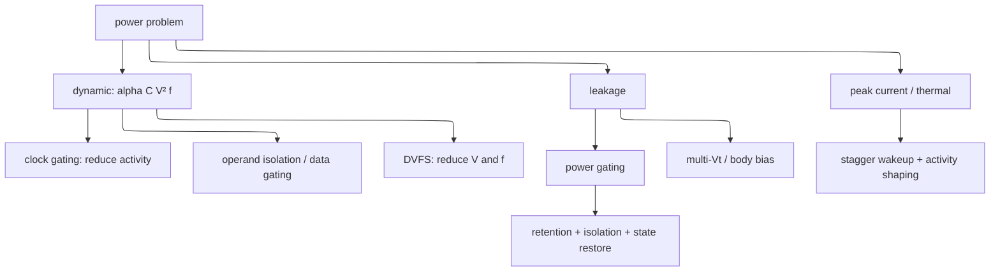
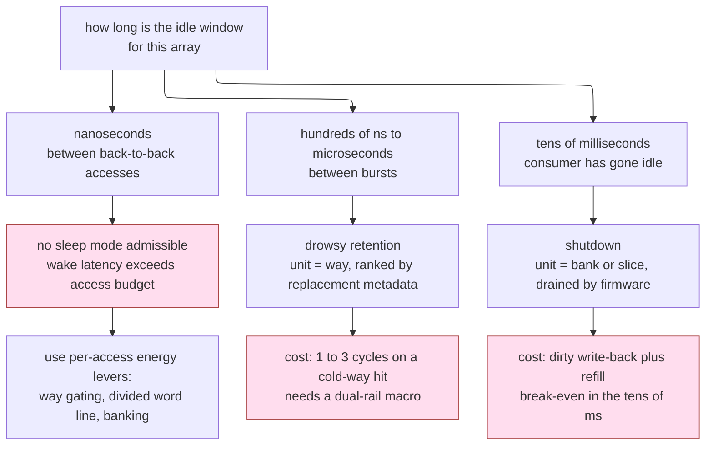

# Power Reduction Techniques — Matching the Lever to the Term


```mermaid
%%{init: {"flowchart": {"defaultRenderer": "elk", "nodeSpacing": 55, "rankSpacing": 55, "htmlLabels": false}}}%%
flowchart TD
    P["power problem"] --> DYN["dynamic: alpha C V² f"]
    P --> LEAK["leakage"]
    P --> PEAK["peak current / thermal"]
    DYN --> CG["clock gating: reduce activity"]
    DYN --> OI["operand isolation / data gating"]
    DYN --> DVFS["DVFS: reduce V and f"]
    LEAK --> PG["power gating"]
    LEAK --> MVT["multi-Vt / body bias"]
    PEAK --> SEQ["stagger wakeup + activity shaping"]
    PG --> RET["retention + isolation + state restore"]
```

> **Prerequisites:** [Power Fundamentals](01_Power_Fundamentals.md) (the master power equation, energy-per-op, the alpha-power delay model and the DVFS cube, and the leakage physics — this page *uses* all of it and re-derives none of it), [Low-Power Architecture](03_Low_Power_Architecture_and_Domain_Partitioning.md) (why the design has these power, voltage, and clock boundaries, and which regulator feeds each rail), [CMOS Fundamentals](../00_Fundamentals/01_CMOS_Fundamentals.md) (MOSFET operation, transmission gates, latch structures), [Memory Circuits and Technologies](../00_Fundamentals/06_Memory_Circuits_and_Technologies.md) (the 6T bitcell, static noise margin, bitline capacitance — §6 prices the power modes built on top of them), [static timing analysis (STA)](../06_Signoff/01_STA.md) (setup/hold and time-borrowing).
> **Hands off to:** [Power Gating, Retention and Wake Sequencing](07_Power_Gating_Retention_and_Wake_Sequencing.md) (the switch circuit, sizing, rush-current staging, retention and isolation cells, and the power-down/up sequence behind §4's lever-map entry), [Runtime Power Management and Adaptive V/F](08_Runtime_Power_Management_and_Adaptive_Voltage_Frequency.md) (the controller, governors, and AVS/AVFS loops that *decide* when to pull the levers of §3), [UPF/CPF Power Intent](05_UPF_and_CPF_Power_Intent.md) (the language that *encodes* the domains, isolation, retention, and level-shifting this page *designs*), [Power Analysis and Signoff](06_Power_Analysis_and_Signoff.md) (measuring what these techniques claim to save), [Block Activity and Power](02_Block_Activity_and_Power.md) (where the activity factors come from).

---

## 0. Why this page exists

There is exactly one power equation, and every reduction technique ever invented is an attack on one of its terms:

$$P_{total} = \underbrace{\alpha \, C_L \, V_{DD}^2 \, f_{clk}}_{\text{switching}} \;+\; \underbrace{P_{sc}}_{\text{short-circuit}} \;+\; \underbrace{V_{DD}\, I_{leak}}_{\text{static}}$$

The middle term deserves one paragraph before we set it aside, because pages that omit it silently are hiding something. **Short-circuit (crowbar) power** is burned during an input transition, while the input sits between the two thresholds and the pull-up and pull-down networks conduct *simultaneously*, briefly shorting $V_{DD}$ to ground through the cell. It is not an extra source of transitions — it is an extra cost *per* transition, and it scales with input slew: a gate driven by a sharp edge burns a few percent of its switching energy this way, a gate driven by a badly degraded edge can burn 20 %. It has no lever of its own on this page, because every lever that removes a transition or lowers the supply removes it too, and the one thing that fixes it specifically — repairing slew by resizing or buffering — is ordinary timing closure. So from here on, this page follows the planning convention and folds $P_{sc}$ into an *effective* switching capacitance ($C_L$ inflated by 5–15 %), leaving two terms to reason about. That is a bookkeeping convenience, stated so you know it happened, not a claim that the term is zero.

[Power Fundamentals](01_Power_Fundamentals.md) derives all three and closes with a *reduction map* — a table from lever to term. **This page is that map, opened up.** Its organizing claim is that the low-power toolbox is not a grab-bag of tricks but a small set of levers, each of which kills a *specific* term, buys a *quantifiable* saving, and charges a *specific* price. The discipline is matching the lever to the term: clock gating does nothing for a leakage-dominated standby, power gating does nothing for a block busy every cycle, and multi-$V_t$ does nothing for the clock tree.

So for every technique this page asks the same five questions, in order, and refuses to describe a mechanism before it has answered the first two:

1. **Which term does it kill** — $\alpha$, $V_{DD}^2 f$, $C$, or $I_{leak}$?
2. **What is the mechanism**, derived from the term it must move?
3. **What does it cost** — area, timing, wake latency, state loss, verification, complexity?
4. **What is the quantitative saving**, and the theoretical model behind it?
5. **When is it worth it** — the break-even that decides whether to deploy it at all?

What this page deliberately does *not* do is teach you to instantiate an ICG cell or write a UPF file. The signal names, tool commands, and power-intent syntax live in the neighbour pages; here we build the *understanding* that tells you which lever to reach for and why real chips land where they do.

---

## 1. The reduction map: five terms, and the levers that move each

### 1.1 The one rule

Read the equation as five independent handles — $\alpha$, $C_L$, $V_{DD}$, $f$, $I_{leak}$ — and notice they are *not* symmetric. $V_{DD}$ appears squared *and* couples to $f$ (a lower voltage forces a lower frequency), so it is the master knob. $I_{leak}$ hides an exponential in $V_{th}$. $\alpha$ on the clock net is pinned at 1 by construction while everywhere else it is a few percent. A technique's power comes entirely from *which* handle it grabs and *how hard* that handle pulls — which is why the first thing to know about any technique is its term.

### 1.2 The map

Each row is a full section below. Read it as: this lever kills this term, by this mechanism, at this dominant cost, and is worth it under this condition.

| Lever | Term killed | Mechanism | Dominant cost | Worth it when… | § |
|---|---|---|---|---|---|
| **Clock gating** | $\alpha$ on the clock (the 35–50 % clock-related term) | stop the clock to idle flops/blocks | enable-detection logic, integrated-clock-gating (ICG) cell area, tight enable timing | always — every synchronous design | 2 |
| **Operand isolation** | $\alpha$ of a datapath cloud | freeze inputs of an unused combinational block | one gate layer on a timing path | wide unit, low use duty cycle | 2.4 |
| **DVFS** (dynamic voltage and frequency scaling) | $V_{DD}^2 f$ (≈ cubic together) | scale supply + frequency with demand | µs–ms transition latency, signoff corners | workload intensity varies | 3 |
| **Voltage islands** | $V_{DD}^2$ per block | run each block at its own minimum supply | level shifters, extra rails, floorplan | blocks have different $V_{min}$ | 3.5 |
| **Power gating (MTCMOS)** | $V_{DD}I_{leak}$ in idle blocks | cut the rail with a sleep switch | state loss, wake latency, rush current, verification | block idle for ms+ | 4 |
| **Multi-$V_t$** (multi-threshold libraries) | $I_{leak}$ (exponential in $V_{th}$) | high-$V_t$ (HVT) off-critical, low-$V_t$ (LVT) on-critical, per cell | speed↔leakage per path; corner count | always, in implementation | 5 |
| **Body biasing** | $I_{leak}$ / delay via $V_{th}$ | drive $V_{SB}$ to shift $V_{th}$ post-fab | triple-well, weak on FinFET | process spread; FD-SOI parts | 5.5 |
| **Memory sleep modes** | $C_L$ per access, $I_{leak}$ | bank activation; array retention voltages | wake latency, retention $V_{min}$ margin | memory is idle (usually) | 6 |
| **Bus encoding** | $\alpha$ / $C$ of wide buses | fewer transitions per transferred word | encode/decode logic, one extra wire | wide, high-traffic buses | 7 |

### 1.3 Two facts that shape every choice

**Leverage grows with abstraction.** The same equation can be attacked at any level, but the higher you apply the lever the more of the chip it moves:

| Level | Techniques | Typical impact |
|---|---|---|
| System / architecture | DVFS, power gating, accelerate-then-gate | 10–100× |
| Micro-architecture | clock gating, operand isolation, memory partitioning | 2–10× |
| RTL / logic | encoding, resource sharing, FSM idle conditions | 10–30 % |
| Gate | multi-$V_t$, sizing, buffer optimization | 10–30 % |
| Circuit | body biasing, custom cells, adiabatic | 5–20 % |

That table is the page's framing claim, so it should not be taken on trust. Two worked examples, one at each end, show what the rows actually mean.

**What a 100× architectural change looks like: delete the instruction, keep the arithmetic.** Take a 16-tap finite-impulse-response (FIR) filter on 16-bit samples. Run it on a small in-order core: each tap needs roughly a coefficient fetch, a sample fetch, and a multiply-accumulate, so with loop overhead a sample costs on the order of 60 instructions. The *arithmetic* in one instruction is cheap — a 16-bit multiply is around 1 pJ and a 16-bit add around 0.05 pJ at a 45 nm-class node — but the *instruction* is not: fetching it from the instruction cache, decoding it, reading and writing the register file, and sequencing the pipeline costs roughly 70 pJ, dominated by the SRAM (static random-access memory) accesses and the control. So the software version costs about

$$60 \text{ instructions} \times 70\ \text{pJ} = 4.2\ \text{nJ per sample.}$$

Now build the same filter as a hardwired systolic chain: 16 multiply-accumulate stages, no fetch, no decode, no register file, no branch, coefficients hardwired or held in flops. The energy is the arithmetic plus the pipeline registers between stages:

$$16 \times (1.0 + 0.05)\ \text{pJ} + 16 \times \approx 0.6\ \text{pJ (pipeline flops)} \approx 26\ \text{pJ}, \text{ call it } 40\ \text{pJ with clocking and I/O.}$$

$4.2\ \text{nJ} / 40\ \text{pJ} \approx \mathbf{105\times}$. Nothing in that ratio came from a circuit trick. It came from noticing that a general-purpose core spends 95 %+ of its energy *deciding what to compute* rather than computing it, and from an architectural decision to stop paying for that flexibility on a workload that never needed it. That is what the "10–100×" row means, and it is why the first low-power question about any block is "should this be a core at all?"

**What a 20 % RTL change looks like: let the tool see the enable.** The lever is often the same one the micro-architecture row already listed — the RTL row is about whether the *implementation* of a decision the architect already made is visible to synthesis. Take a 512×32 register file built from flops (16,384 flops) inside a signal-processing block, written the natural way:

```systemverilog
always_ff @(posedge clk) mem[waddr] <= wdata;   // written every cycle, unconditionally
```

Even when `we` is low upstream, every one of those 16,384 flops is clocked every cycle. Suppose the block burns 100 mW dynamic, of which the clock-related term is 40 % (§1.3 below) = 40 mW, and this register file holds 60 % of the block's flops → 24 mW of clock power. Writes are genuinely needed on 20 % of cycles. Adding the enable:

```systemverilog
always_ff @(posedge clk) if (we) mem[waddr] <= wdata;   // synthesis extracts we onto an ICG
```

lets synthesis lift `we` onto integrated clock-gating cells, taking clock-gating efficiency from 0 to 80 % on that register file:

$$\Delta P = 0.80 \times 24\ \text{mW} = 19.2\ \text{mW} = \mathbf{19\%\ of\ block\ dynamic\ power},$$

for one keyword. That is the "10–30 %" row: not a clever transform, but the routine discipline of writing the *condition* the hardware already obeys instead of leaving the tool to guess it. The corollary is uncomfortable — an RTL author who does not write enables has not saved the tool any work, they have made the saving unreachable, because no downstream stage can recover an enable condition that was never expressed.

The practical reading: fight for power at architecture and micro-architecture first (where 2–100× lives), then let the implementation flow harvest the remaining tens of percent. You cannot multi-$V_t$ your way out of a bad architecture.

**The terms are not equal, and the clock is the fat one.** The clock network proper — buffers, clock wire, flop clock-pin load — is 20–35 % of dynamic power, and 35–50 % once the clock inverters *inside* every flip-flop are counted (the quantity clock gating actually kills). Either way it leads, because it is the one net with $\alpha = 1$ — a full charge/discharge *every* cycle, on every capacitance it touches — while datapath nodes toggle at $\alpha \approx 0.05\text{–}0.15$. That single asymmetry is why clock gating is the first technique, present in essentially every design ever taped out, and why we start there.

**They stack.** Because the terms multiply, the levers are orthogonal: a modern application-processor core is simultaneously clock-gated, DVFS-scaled, power-gated with retention, multi-$V_t$ optimized, and fed by mode-controlled SRAMs — each lever covering the operating regime the others miss (§8).

---

## 2. Attacking activity $\alpha$: clock gating and data gating

### 2.1 Why clock gating saves what it saves

A register that only sometimes captures new data can be written two ways. The obvious way recirculates the old value through a mux — *data* is held, but the clock toggles every cycle regardless. Clock gating instead blocks *the clock itself*: on idle cycles the clock pin, the local buffers, and the flop's internal clock inverters simply do not move.

```systemverilog
// (a) Data hold: functionally identical, but the clock toggles every cycle.
always_ff @(posedge clk or negedge rst_n) begin
  if (!rst_n) q <= '0;
  else        q <= en ? d : q;      // recirculating mux on D
end

// (b) Enable on the clock: synthesis extracts `en` onto an ICG cell.
always_ff @(posedge clk or negedge rst_n) begin
  if (!rst_n)     q <= '0;
  else if (en)    q <= d;
end
```

Both describe the same state machine, and formal equivalence checking cannot tell them apart. Only (b) gives the tool the enable *as a clock condition*; (a) has already spent the clock energy by the time the mux decides nothing changed.

The saving falls straight out of the equation. The clock net has $\alpha = 1$; gating removes a fraction $CGE$ (clock-gating efficiency — the fraction of cycles actually gated) of those transitions, dropping the *effective* activity from $1$ to $(1-CGE)$. For $N$ flops behind one gate:

$$P_{saved} = CGE \cdot N \cdot C_{clk/FF} \cdot V_{DD}^2 \cdot f_{clk}$$

where $C_{clk/FF}$ (≈ 5–18 fF; use 10 fF for planning) bundles everything the clock moves per flop — the flop's clock-pin capacitance, its share of clock wire, and its share of buffer drive. The limits check: $CGE=0$ saves nothing; $CGE=1$ removes the entire clock power of those flops. There is nothing subtle here — you are deleting the switching of the single most active net, prorated by how often it is idle.

### 2.2 The glitch-free requirement: why you cannot simply AND the clock

The mechanism is worth deriving because the *obvious* implementation is wrong in an instructive way. The function wanted is "pass the clock when enabled," so the naive circuit is one AND gate, $GCLK = CLK \wedge EN$. But $EN$ is an ordinary logic signal launched by a flop and rippled through logic, so it can change — and glitch — at *arbitrary* times within the cycle. An AND gate is transparent to $EN$ whenever $CLK=1$, so any change on $EN$ during the high phase passes straight to $GCLK$ as a runt or truncated pulse. Those are **clock glitches**: edges whose timing is set by a data path, not the clock source. They violate minimum pulse width (the flop can go metastable) and reference downstream setup/hold to an edge STA cannot bound.

Trace *why* it failed and the fix names itself: everything went wrong because the gating value changed *while $CLK$ was high*. During $CLK=0$ the AND output is forced low and $EN$ changes are harmless. So the requirement is a timing constraint on the gating value:

> The signal that actually gates the clock may change **only while $CLK=0$**. Any change arriving during $CLK=1$ must be held off until the clock falls.

An element that is transparent at one clock level and opaque at the other is, by definition, a **level-sensitive latch** — here transparent-low. Latch the enable on the low phase, then AND the *latched* enable with the clock, and every glitch is structurally impossible: when $EN$ changes during $CLK=1$ the latch is opaque and the change waits for the falling edge. That latch-plus-AND is the entire idea of the **Integrated Clock Gating (ICG)** cell; it is *integrated* (characterized as one glitch-free unit with a defined insertion delay and a scan-override input) precisely so the latch→AND net cannot pick up skew or crosstalk that a discrete pair would.

The cell is exactly those two elements — a transparent-low (negative) latch feeding one input of an AND gate:

```tikz
\begin{document}
\begin{circuitikz}[scale=1.0]
  % --- pass gate: conducts while CLK is low ---
  \draw (0,0) node[left]{EN} -- (1.0,0);
  \draw (1.0,-0.45) rectangle (2.2,0.45);
  \node at (1.6,0) {TG};
  \draw (1.6,0.45) -- (1.6,1.2) node[above]{CLK};
  \draw (2.2,0) -- (3.9,0);
  % --- storage node with keeper ---
  \draw (3.0,0) node[circ]{};
  \node at (3.0,0.42) {ENL};
  \draw (3.0,0) -- (3.0,-1.0);
  \draw (2.4,-1.0) rectangle (3.6,-1.8);
  \node at (3.0,-1.4) {keeper};
  % --- AND gate ---
  \node[and port, anchor=in 1] (a1) at (4.6,0) {};
  \draw (3.9,0) -- (a1.in 1);
  \draw (a1.in 2) -- ++(-0.7,0) node[left]{CLK};
  \draw (a1.out) -- ++(0.7,0) node[right]{GCLK};
\end{circuitikz}
\end{document}
```

The contract of that circuit is one sentence: **`ENL` can only change while `CLK` is low, therefore `GCLK` can only be a clean copy of `CLK` or a clean constant 0.** The transmission gate `TG` conducts when `CLK` is low, so `EN` flows through to the storage node `ENL`; when `CLK` rises the gate opens and the keeper (a cross-coupled inverter pair) holds `ENL` static for the whole high phase. The AND then combines a *static* enable with a live clock, and an AND with one static input cannot glitch. A glitch on `EN` during `CLK = 1` arrives at an opaque gate and simply waits for the falling edge — the runt pulse is structurally unreachable, not merely improbable. Trace the failure the other way and the same figure explains it: delete the `TG` and the keeper, wire `EN` straight to the AND, and every `EN` change during the high phase cuts `GCLK` short.

That is a cycle-accurate rule, so here it is on a cycle-accurate figure. Each tick below is a half clock phase; `EN` is deliberately made to rise in the *middle* of a high phase — the illegal moment:

```wavedrom
{ "signal": [
  { "name": "CLK",            "wave": "hhllhhllhh" },
  { "name": "EN",             "wave": "01........", "node": ".a........" },
  { "name": "GCLK naive AND", "wave": "010.1.0.1.", "node": ".b........" },
  { "name": "ENL latched",    "wave": "0.1......." },
  { "name": "GCLK from ICG",  "wave": "0...1.0.1." }
 ],
 "edge": ["a~>b runt pulse: half-width edge, violates minimum pulse width"],
 "head": {"text": "one tick = one half clock phase; EN changes mid-high-phase"}
}
```

Read the two `GCLK` rows against each other. The naive AND passes `EN`'s mid-phase rise straight through, producing a rising edge and then a falling edge inside a single high phase — an extra clock edge whose timing is set by a data path. Any flop below it may capture on that edge, may violate minimum pulse width and go metastable, and is in any case referenced to an edge that static timing analysis has no arc for. The ICG version holds `ENL` at 0 until the clock falls at tick 2, so the first gated pulse is the *whole* high phase at ticks 4–5: full width, full amplitude, aligned to the source clock. The cost of that guarantee is exactly one phase of latency on the enable — the enable takes effect at the next rising edge after the falling edge that latched it.

**What the cell costs, counted honestly.** Count what was just built rather than trusting the small schematic symbol: the transparent-low latch is a pass gate plus a cross-coupled keeper plus an output stage, ~8–12 transistors; the AND is 4–6; and the scan/test override that lets automatic test pattern generation (ATPG) force the clock on during shift adds another 4–6. That is **16–24 transistors, roughly 1–1.5× the area of a D flip-flop** — not a small gate, and an amount that matters when synthesis inserts thousands of them. Then the subtle part: the ICG's *own* clock pin toggles every cycle, upstream of the gate where nothing is gated, presenting roughly one to two flops' worth of clock load that is never recovered. Those two facts set a hard floor on granularity — an ICG whose input load is $\approx 2$ flops and whose gating efficiency is $CGE$ breaks even at $N \approx 2/CGE$ flops, so ~4 flops at $CGE=0.5$ but ~20 flops at $CGE=0.1$ (Worked problem 1). Gating three flops that are idle a tenth of the time is a net loss, and synthesis will do it anyway unless you set a minimum-fanout threshold.

The enable timing is a setup to the *inactive* (falling) edge, giving the enable roughly a half-cycle to a full cycle to arrive; the precise STA semantics (hard requirement vs. margin house-rule, and time-borrowing through transparency) are the same as any latch path in [STA](../06_Signoff/01_STA.md).

### 2.3 Granularity and the clock-tree share: gating near the root

One ICG can gate a handful of flops or an entire subsystem, and the choice is a genuine trade-off, not a detail. Fine-grain gating (4–16 flops per ICG, auto-inserted by synthesis from `if (en)` patterns) captures idle cycles precisely but costs many cells (~5–8 % area, ~20–40 % power reduction typical). Coarse-grain gating (hundreds to thousands of flops, one module-level ICG driven by firmware) costs almost no area but only fires when the whole block is idle.

The decisive theoretical point is *where in the clock tree the ICG sits*. A leaf ICG stops only the flop clock pins below it — **the clock buffers above it still toggle every cycle.** Since those buffers are a large part of the 20–35 % clock-*network* share (a leaf ICG only reaches the flop-internal remainder), moving real clock-tree power requires gating near the *root*. But root gating tightens the enable path: less clock-network insertion delay downstream of the ICG means less margin for the enable to arrive, so the enable must be computed earlier. That is the core tension **clock tree synthesis (CTS)** manages (cloning ICGs to control skew, pulling them up or down to balance enable timing against gated-buffer power). The right answer is a *hierarchy*: module-level gating for sleep modes, cluster-level for pipeline stages, fine-grain for the rest — each level catching idleness the others miss.

Beyond what single-cycle inference can see, **sequential (data-driven) gating** strengthens enables using multi-cycle behaviour: observability-don't-care gating stops a register whose output nobody will read for $N$ cycles; XOR self-gating fires the clock only when the data actually changes ($\text{en} = \lvert (d \oplus q)\rvert$), paying an OR-reduction tree to do it. Because these change cycle-by-cycle behaviour on don't-care cycles, they cannot be checked by combinational equivalence — they need **sequential logic equivalence checking (SLEC)**, which proves the two designs agree on *observable outputs over time* rather than cycle by cycle. That verification cost is the price of the extra savings.

### 2.4 Operand isolation: the $\alpha$ of the datapath

Clock gating stops *registers* from toggling; a large share of dynamic power is burned *between* registers, in combinational clouds that compute whether or not anyone wants the answer. Consider a multiplier behind a result mux: when `sel` picks the other input the product is discarded, yet `a` and `b` keep changing every cycle (they are shared buses), and each change ripples through thousands of internal nodes — partial products, carry chains, and glitches re-converging along unbalanced paths. All of that is $\alpha C V^2 f$ spent to compute a value that is thrown away.

Operand isolation is the combinational counterpart of clock gating: force the block's inputs to a constant whenever its output is unused, driving $\alpha \to 0$ for the entire cloud (glitch power included — and multipliers glitch heavily, so this matters). The saving is the unit's dynamic power times its idle fraction:

$$P_{saved} \approx (1 - D_{active}) \cdot P_{unit}$$

where $D_{active}$ is the duty cycle of genuine use. The cost is one gating layer (AND gates forcing zeros, or a latch holding the last operand) that sits on the datapath's *timing* path — so `sel` must be valid early, and isolating a critical path is a timing bug waiting to happen. The break-even is a width-vs-activity rule: isolation pays on datapaths wider than ~16 bits with genuine-use activity below ~10–20 %; below that width or above that activity the gating layer's own area, delay, and switching eat the margin. And if the operands come *only* from registers already clock-gated during idle, isolation is free — frozen registers feed frozen operands; it earns its keep when the buses keep changing for *other* consumers.

---

## 3. Attacking the voltage term $V_{DD}^2 f$: DVFS

Voltage is the strongest dynamic knob for two compounding reasons. It enters the dynamic term *squared*, and — the part people forget — lowering it also lowers the achievable frequency, so scaling both together cuts power with roughly the *cube* of voltage. **Dynamic voltage and frequency scaling (DVFS)** exploits this by moving the chip between characterized (voltage, frequency) operating points as demand varies.

### 3.1 Why V and f must move together

The underlying result is derived on [Power Fundamentals §3](01_Power_Fundamentals.md) and is used here without repeating it: gate delay under the alpha-power law is $T_d \propto V_{DD}/(V_{DD}-V_{th})^{\alpha}$ with $\alpha \approx 1.3$ on modern short-channel devices, so $f_{max}$ falls as the supply falls; substituting the achievable $f$ back into $P_{dyn} = \alpha C V_{DD}^2 f$ gives the near-cubic law $P_{dyn} \propto V_{DD}^{2.3\text{–}3}$. That page also carries the worked 1.0 → 0.8 V example and the caveat that the cube is an approximation good down to about 0.6 V and diverging below it. Read it there; three *consequences* are this page's business, because they decide how the lever gets used.

**1. The two knobs are not independent, and that dictates an ordering rule.** At every instant, including mid-transition, the design must satisfy $f \le f_{max}(V_{DD})$. So the two knobs are not two levers, they are one lever with a safety interlock (§3.3).

**2. Energy per operation is $E_{op} = P_{dyn} T_{cycle} \propto C_L V_{DD}^2$, independent of frequency.** Running slower at the same voltage saves *power* but not *energy* — the same joules, spread over more time, and if the workload has a deadline you have gained nothing and lost margin. Only lowering the voltage lowers the energy per unit of work. This is the single most misunderstood point in low-power design, and it is why "reduce the clock to save battery" is wrong unless the voltage follows.

**3. The pull is position-dependent.** Because $f_{max}$ depends on the *overdrive* $V_{DD}-V_{th}$ rather than on $V_{DD}$ itself, the exchange rate between volts and hertz changes with where you sit on the curve. Near nominal it is roughly one-for-one ("voltage scales with frequency"). Well above threshold the curve flattens, so the last 20 % of frequency costs close to $1.8\times$ the voltage — the reason turbo bins burn so disproportionately. Near threshold the sensitivity diverges, so a small voltage change swings frequency wildly and process variation swings it with them, which is why near-threshold operation needs adaptive control (§3.4) rather than a fixed table.

### 3.2 Operating points: characterized, not derived

DVFS ships as a discrete table of **operating performance points (OPPs)**, each a (V, f) pair signed off as a timing-clean corner:

| OPP | $V_{DD}$ | Freq | Relative $P_{dyn}$ | Use case |
|---|---|---|---|---|
| Turbo | 0.95 V | 2.8 GHz | 1.97× | peak burst (throttles in seconds) |
| Nominal | 0.80 V | 2.0 GHz | 1.00× | sustained |
| SVS (static voltage scaling) | 0.70 V | 1.4 GHz | 0.54× | light load |
| Low | 0.60 V | 0.8 GHz | 0.23× | background |
| Min | 0.50 V | 0.4 GHz | 0.08× | always-on sensor |

Relative power is $(V/V_{nom})^2 (f/f_{nom})$ — check one row: turbo is $(0.95/0.80)^2 \times (2.8/2.0) = 1.410 \times 1.4 = 1.97\times$, so the top bin costs double the power of nominal for 40 % more clock. Leakage also falls with voltage, through **drain-induced barrier lowering (DIBL)** — a lower drain-source voltage raises the effective threshold — but far less steeply than $V^2 f$, so the *fraction* of power that is leakage rises as you scale down, and at the bottom OPP a block can be leakage-dominated even while running. One caution worth internalizing: these tables are *characterized on silicon, not derived from the model*. Sustained points sit below the $f_{max}(V)$ curve (thermal and aging margin); turbo points sit near it; and effective $\alpha$/$V_{th}$ themselves drift with voltage and temperature. Use the alpha-power model for reasoning and sensitivities; use the characterized table for signoff.

### 3.3 The transition cost and the DVFS break-even

Moving between OPPs is not free, and the mechanism dictates a strict ordering rule. Voltage moves via a regulator (external **power-management integrated circuit (PMIC)**, 10–50 µs; on-die **low-dropout regulator (LDO)**, sub-µs) and frequency via a **phase-locked loop (PLL)** or divider (5–20 µs). At every instant, including mid-transition, the chip must satisfy $f \le f_{max}(V_{DD})$ — so **always move the knob that creates slack before the one that consumes it**: scaling *up*, raise voltage first (adds slack at the old frequency), then frequency; scaling *down*, drop frequency first, then voltage. The wrong order leaves gates too slow for the new period → setup violations → functional failure.

The transition itself burns energy, which sets a minimum residency — and this is the calculation most often gotten wrong, in a way that doubles the answer. During a downward switch of duration $T_{trans}$ the chip's power *glides* from the old point to the new one instead of arriving instantly at the new one. The overhead is only the shaded area between those two curves: the baseline $P_{new}$ that flows throughout is **useful work, not overhead**, and charging it to the transition bills the design for power it was going to spend anyway. For a roughly linear glide the area is a triangle:

$$E_{trans} \approx \tfrac{1}{2}\,\Delta P\,T_{trans}, \qquad\text{so dropping OPP pays only if}\quad T_{idle} > \frac{E_{trans}}{\Delta P} = \frac{T_{trans}}{2}$$

where $\Delta P = P_{old} - P_{new}$ is the power saved at the lower point. Worked: $\Delta P = 0.5$ W and $T_{trans} = 50$ µs give $E_{trans} = \tfrac12 \times 0.5\ \text{W} \times 50\ \mu\text{s} = 12.5\ \mu\text{J}$, so the low OPP pays back after $T_{idle} > 12.5\ \mu\text{J} / 0.5\ \text{W} = \mathbf{25\ \mu s}$. Notice that $\Delta P$ cancels: for a linear glide the break-even is simply *half the transition time*, independent of how much power the move saves. That is a useful result to carry — it means the question "is this OPP change worth it?" is really the question "is the idle window longer than half the regulator's settling time?"

There is a second, pessimistic reading and it is worth stating rather than hiding: if the design is **stalled** through the transition — clocks off during a PLL relock, no instructions retired — then no useful work happens for $T_{trans}$ and the entire interval is charged as overhead, roughly $\tfrac12 P_{old} T_{trans} = 25\ \mu\text{J}$ and a **50 µs** break-even, exactly double. Which number applies is a property of the implementation (a chip that switches to a bypass or reference clock and keeps executing pays the first; one that halts pays the second), so state the assumption whenever you quote a DVFS break-even. With margin on top of either figure, governors floor the interval at **1–10 ms between transitions** — the quantitative sense in which DVFS is a *millisecond* technique. This is the same amortization logic as the power-gating break-even (§4); the two differ only in the size of the round-trip cost.

### 3.4 Recovering the guardband: AVS and adaptive clocking (map entry)

A fixed OPP table must use one voltage per frequency sized for the *worst* die at the worst condition, so every typical part carries tens of millivolts of pure guardband — and by the $V^2$ law that guardband is dynamic power burned continuously to survive a condition that is usually not present. Two levers reclaim it, at two timescales that do not overlap:

- **Adaptive voltage scaling (AVS)** measures *this* die's actual speed with on-die monitors and trims the supply to just-enough, per chip and per condition — worth 50–100 mV on fast silicon. It tracks the *slow* variation: process, temperature, aging (milliseconds to years). **Adaptive voltage and frequency scaling (AVFS)** closes the loop around both knobs at once.
- **Adaptive clocking** handles what AVS structurally cannot. A load step converts, through the **power delivery network (PDN)** inductance, into a droop $\Delta V = L\,di/dt$ that lands in nanoseconds — orders of magnitude faster than a regulator (µs) or a firmware loop (ms) can answer. Rather than margining for it, a droop detector senses the dip in ~1–5 ns and stretches the clock period by a few percent: the gates got slower because $V$ fell, so the cycle grows to match and timing is preserved *through* the event.

The number worth memorizing is the price of the alternative. To first order $\Delta P/P \approx 2\,\Delta V/V$, so a 60 mV guardband at 0.9 V costs $2 \times 60/900 = 13\ \%$ of dynamic power **permanently**, to protect against an event lasting tens of nanoseconds; removing a 50 mV guardband recovers ~11 %. That ratio — continuous cost versus rare event — is why riding through beats margining on every high-performance part that can afford the detector.

That is this page's entry for the lever: which term it attacks ($V_{DD}^2$, by deleting margin rather than performance) and what it is worth. The sensor topologies and their calibration, the control loops and their stability, the droop-detector and adaptive-clock-module circuits, the governor policy that decides when to move between OPPs, the operating-system idle-state interface, and the signoff consequence of a voltage *window* instead of a voltage point all belong to [Runtime Power Management and Adaptive V/F](08_Runtime_Power_Management_and_Adaptive_Voltage_Frequency.md).

### 3.5 Voltage domains and islands: V over space

DVFS varies one domain's voltage over *time*; **voltage islands** vary it over *space* — different blocks run at different fixed supplies, each at the minimum its own timing needs. The motivation is the same waste from a different angle: a single shared rail must satisfy the hungriest consumer, $V_{shared}=\max(V_{request})$, so one core running turbo forces every idle core to its voltage and each then burns $(V_{shared}/V_{needed})^2$ times its necessary dynamic power. Per-domain regulation (per-core digital LDOs in Intel Arrow Lake and AMD Zen) is what makes fine partitioning possible.

The first cost is at the boundaries. Every signal crossing between domains needs a **level shifter**, and the two directions are not symmetric. Low-to-high is the hard one: a 0.8 V "1" arriving at a 1.8 V gate leaves the receiver's PMOS partly on alongside its NMOS — a DC crowbar path and an indeterminate output — so the standard cell is a differential cross-coupled PMOS latch that snaps to a full high-domain swing with no static current, and it needs *both* supplies routed to it. High-to-low is easy (the input over-drives the receiver; a rated buffer suffices).

The second cost is the one that gets forgotten in the architecture review: **every island needs something that generates its voltage, and that thing has an efficiency, an area, and a response time.** Three families, and the choice is a real trade:

| Regulator | Efficiency | Response | Integration | Where it fits |
|---|---|---|---|---|
| **LDO** (low-dropout linear) | $\eta = V_{out}/V_{in}$ | sub-µs | fully on-die, tiny | small drops, per-core fine rails |
| **Buck** (inductive switching) | 85–95 % | µs | needs an off-die or in-package inductor | main rails, large drops |
| **IVR** (integrated voltage regulator) / switched-capacitor | 70–90 % | sub-µs | on-die, needs capacitor or thin-film inductor area | per-block rails where µs is too slow |

The LDO row is the one to internalize because its efficiency is not an engineering figure of merit but conservation of energy: a linear regulator is a series pass device that drops the difference across itself, so $\eta_{LDO} = V_{out}/V_{in}$ exactly. Dropping 0.9 → 0.55 V is 61 % efficient, meaning **39 % of the delivered energy becomes heat in the pass device, on-die, right beside the block you were trying to cool.** That is why per-core LDOs are used for *small* trims (0.9 → 0.85 V, 94 % efficient) and never for deep drops, and why an island whose voltage is far from the parent rail wants its own buck or **integrated voltage regulator (IVR)** instead. So the honest accounting for a voltage island is: (island dynamic saving) − (conversion loss) − (level-shifter area and delay) − (regulator area, passives, and package pins). An island that saves 15 % of a block's power and is fed by a 61 %-efficient LDO has saved nothing. Selecting the regulator per rail, and the floorplan and package consequences of that choice, belong to [Low-Power Architecture and Domain Partitioning](03_Low_Power_Architecture_and_Domain_Partitioning.md).

Islands are declared as power domains with their own supply nets in [UPF](05_UPF_and_CPF_Power_Intent.md), which inserts and checks the shifters; asynchronous crossings between domains are a full clock-domain-crossing problem ([Async Design and CDC](../03_Frontend_RTL_and_Verification/06_Async_Design_and_CDC.md)).

---

## 4. Attacking idle leakage $V_{DD}I_{leak}$: power gating (MTCMOS)

> **Term killed:** $V_{DD}I_{leak}$, in blocks that are idle. **Mechanism:** take the supply away.
> **Depth lives elsewhere:** this section is the lever-map entry. The circuit is [Power Gating, Retention and Wake Sequencing](07_Power_Gating_Retention_and_Wake_Sequencing.md).

Clock gating stops a block's *dynamic* power, but its leakage keeps flowing — $V_{DD}I_{leak}$ is paid every nanosecond the rail is up, busy or idle. Multi-$V_t$ (§5) shrinks $I_{leak}$ but never zeroes it. For a block that idles for milliseconds or longer, the only lever that reaches zero is to remove $V_{DD}$ itself: put one large series switch between the always-on supply and the block, and open it during sleep. The switch is deliberately a **high-$V_t$** device, because a leaky switch defeats the purpose; that pairing of a high-threshold sleep device with ordinary-threshold logic is the origin of the name **MTCMOS (multi-threshold CMOS)**.

### 4.1 One series switch, four consequences

The mechanism is one sentence long. Everything else about power gating — and it is by a wide margin the most flow-entangled lever on this page — is a consequence of that one series device, in the order the consequences bite:

1. **On, it is a resistor** in series with the block's entire supply current, so its IR drop is voltage the logic does not get and therefore speed the logic does not have. Sizing is a budget: $R_{sw} = \Delta V_{drop}/I_{active}$, with the drop budget typically 5–10 % of $V_{DD}$.
2. **Turning on is a transient.** A collapsed domain is a large uncharged capacitance, and refilling it draws $I_{rush} = C\,dV/dt$. The canonical number: a 10 nF virtual rail brought to 0.9 V in 1 ns draws $10\ \text{nF} \times 0.9\ \text{V} / 1\ \text{ns} = \mathbf{9.0\ A}$ — enough to collapse the parent rail and spuriously reset a *neighbouring* block that was doing nothing wrong. The event is over in nanoseconds, so no firmware can manage it; the staging has to be built into the switch fabric itself.
3. **Off, the outputs float.** A floating output is worse than unknown: it settles mid-rail and drives the receiving always-on gate into partial conduction — a DC crowbar path burning static power while emitting garbage. **Isolation cells** clamp each crossing output to a known value, and must be powered from the always-on rail and enabled from outside the gated domain, or they die at exactly the moment they are needed.
4. **Off, all internal state is lost.** Either rebuild it at wake (**full power gating**: ~3–5 % area for switches and isolation, milliseconds of re-initialization) or park selected bits in **retention flops** whose shadow latch sits on the always-on rail (**state-retention power gating, SRPG**: ~10–20 % area, 5–50 µs wake). Retention is neither free nor total, and the leakage arithmetic is the reason: the shadow latch becomes the *only* thing that leaks while the domain is down, at roughly 5 transistors × 2 nA = 10 nA per retained flop, so

    $$10{,}000 \text{ retention flops} \times 10\ \text{nA} = 100\ \mu\text{A} \;\Rightarrow\; 100\ \mu\text{A} \times 0.9\ \text{V} \approx \mathbf{90\ \mu W}$$

    of always-on leakage that never goes away, with the plausible range across per-transistor assumptions running ~70–160 µW. That number is why retention is *selective*: keep architectural registers, interrupt and power-management state, and security context; discard caches (re-fetch), pipeline state (flush and restart), and debug registers (re-initialize). Selective retention typically cuts the retained flop count by 80–90 %, and with it that always-on floor.

### 4.2 The break-even framing, and where the lever sits on the residency ladder

Every one of those four consequences is a cost, so the lever only ever pays under a condition — and the shape of that condition is what this page owns. Entering and leaving sleep costs a round trip of energy: the save/restore pulses, and dominantly *refilling the domain capacitance at wake*, $E_{exit} \approx C_{internal}V_{DD}^2$. Sleeping buys back the gated leakage for the duration of the idle window. So:

$$T_{breakeven} = \frac{E_{enter}+E_{exit}}{P_{leak,saved}}, \qquad \text{sleep pays} \iff T_{idle} > T_{breakeven}$$

This is structurally the same statement as the DVFS break-even of §3.3 — an overhead energy divided by a saving rate — with a far larger numerator, which is precisely why the two levers own different regions of the same axis. For the running example (a 10 nF domain at 0.9 V leaking 5 mW while powered) the *energy* floor is $8.1\ \text{nJ}/5\ \text{mW} \approx 1.6\ \mu\text{s}$ (Worked problem 3).

The trap is stopping there, because the *binding* floor is latency, not energy. The idle window must also outlast the entry-and-exit sequence itself: drain the pipeline, stop clocks, save state, assert isolation, remove power; then restore power, wait for the rail to settle at the *farthest* process corner, reset, restore state, de-isolate, release clocks — with the recharge deliberately ramped over microseconds so that consequence 2's 9 A never happens. That sequence runs 5–50 µs with retention and milliseconds for a full reboot, so with governor margin the technique is filed under "ms+" even though its energy alone breaks even 3 orders of magnitude sooner. That gap between the energy break-even and the deployed threshold is the honest cost of the technique, and it is the number an architect should quote.

Which gives the unifying picture of the whole activity/idle toolbox as a **residency ladder**, each lever owning the range its break-even carves out:

| Idle timescale | Lever | What it recovers | Round-trip cost |
|---|---|---|---|
| per cycle | clock gating, operand isolation | dynamic (clock / datapath $\alpha$) | ~a cycle |
| µs–ms (workload varies) | DVFS / AVS | dynamic $V^2 f$ | µs transition |
| ms+ (block idle) | power gating (MTCMOS) | idle leakage | µs–ms + rail recharge |
| always (even when busy) | multi-$V_t$, body bias | busy leakage | design-time only |

### 4.3 Handed off

Everything below the framing above belongs to [Power Gating, Retention and Wake Sequencing](07_Power_Gating_Retention_and_Wake_Sequencing.md): header versus footer switch topology and the sizing arithmetic that turns a drop budget into a transistor width and a switch-cell count; the daisy-chained enable and trickle switch that shape the rush current of consequence 2; retention-flop topologies, their SAVE/RESTORE timing requirements, and the balloon-latch circuit; isolation-cell styles, clamp polarity, and where they are placed; and the full power-down and power-up sequence together with the specific silicon bug each ordering violation produces (isolation powered from the switched rail; restore fired before the rail is stable at the far corner; a neighbour resetting because the parent rail collapsed). The verification of that power intent is [UPF/CPF Power Intent](05_UPF_and_CPF_Power_Intent.md); signing off the IR drop, rush current, and wake latency is [Power Analysis and Signoff](06_Power_Analysis_and_Signoff.md).

The division of labour is worth stating once, because it recurs: this page's business is *which lever, against which term, at which residency*. That page's business is making the lever work without introducing a bug that only appears on cold silicon.

---

## 5. Attacking busy leakage $I_{leak}$ via $V_{th}$: multi-$V_t$ and body bias

Power gating zeroes the leakage of blocks that are *idle*. The last lever attacks the leakage of logic that is *busy*: choose, gate by gate, how leaky each transistor is allowed to be. It is the one major power technique invisible to RTL and architecture — it lives entirely in synthesis and place-and-route — which also makes it the most commonly *practiced* day-to-day power task in physical design.

### 5.1 Exponential leakage, polynomial delay: the whole game

The arbitrage that makes multi-$V_t$ work is an asymmetry in how leakage and speed respond to the threshold voltage. Subthreshold leakage is *exponential* in $V_{th}$:

$$I_{leak} = I_0\, e^{-V_{th}/(n V_T)} \;\Rightarrow\; \text{swing } S = n V_T \ln 10 \approx 70\text{–}100\ \text{mV/decade}$$

where $V_T = kT/q \approx 26$ mV (thermal voltage, *not* threshold), $n \approx 1.2\text{–}1.6$ (subthreshold slope factor), and $I_0$ a size/process prefactor. Every ~70–100 mV of *added* threshold buys a full 10× leakage reduction (the 60 mV/dec Boltzmann floor is unreachable by conventional MOSFETs). Speed, meanwhile, grows only *polynomially* as $V_{th}$ rises: $T_d \propto V_{DD}/(V_{DD}-V_{th})^{\alpha}$ (§3.1), so 100 mV more threshold costs tens of percent of speed while cutting leakage 10×. **Exponential benefit, polynomial cost — that is the entire economic basis of multi-$V_t$ design.**

Foundries ship each logic cell in several threshold flavours (different $V_{th0}$ baked in at fabrication — channel implant on planar nodes, work-function metal on FinFET, dipole engineering at GAA/nanosheet). The library, and the leakage-vs-performance curve it embodies:

| Flavour | $V_{th}$ | Rel. delay | Rel. leakage | Role |
|---|---|---|---|---|
| UHVT (ultra-high-$V_t$) | ~400 mV | 1.50× | 0.05× | standby / deep-slack paths |
| HVT (high-$V_t$) | ~350 mV | 1.20× | 0.20× | non-critical (the majority) |
| SVT (standard-$V_t$) | ~300 mV | 1.00× | 1.00× | moderate paths |
| LVT (low-$V_t$) | ~250 mV | 0.80× | 5.0× | near-critical |
| ULVT (ultra-low-$V_t$) | ~200 mV | 0.65× | 20.0× | most critical only |

Read the two right-hand columns *as an exchange rate*, one 50 mV step at a time, because this is the single number the whole technique trades on:

$$\underbrace{\frac{1.20-1.00}{1.20} = 16.7\ \%,\quad \frac{1.00-0.80}{1.00} = 20.0\ \%,\quad \frac{0.80-0.65}{0.80} = 18.8\ \%}_{\text{delay bought per step}} \qquad \underbrace{\frac{1.00}{0.20}=5\times,\ \frac{5.0}{1.00}=5\times,\ \frac{20.0}{5.0}=4\times}_{\text{leakage paid per step}}$$

So each ~50 mV step of $V_{th}$ is worth **15–20 % of delay** and costs **3–5× of leakage**. Both halves of that sentence matter. The delay side is *tens of percent, arithmetic* — a $V_t$ swap is one of the largest single-cell timing moves available, which is why it closes timing and why nobody should call it free. The leakage side is *multiplicative*, so it compounds across steps: SVT → ULVT is two steps, 35 % faster and 20× leakier. Exponential benefit against polynomial cost is the whole economic basis of multi-$V_t$, and it only reads as a bargain when the exponential is the thing you are buying (leakage) rather than the thing you are paying (delay). (These ratios are not constants — the delay advantage of a low $V_{th}$ grows as $V_{DD}$ falls and $V_{DD}-V_{th}$ shrinks, so re-check at the low-voltage corner.)

### 5.2 The assignment problem and the Pareto tail

Assignment is a constrained optimization: meet timing with the fewest, cheapest fast cells. The standard flow starts frugal — all cells HVT (minimum leakage) — and swaps *up* (HVT→SVT→LVT) only on the paths STA proves are violating, worst path first; then swaps *down* wherever slack came out positive (leakage recovery). Every swap is footprint-compatible (same outline and pins, only the implant/work-function layer differs), so it is timing-clean by construction with no placement change, which is what makes the loop affordable and makes it the bread-and-butter late-ECO knob.

The reason the discipline matters is that leakage lives in the *fast tail*. Total leakage is a population-weighted sum,

$$P_{leak} = V_{DD} \sum_{v} N_v \, I_{SVT} \, r_v$$

where $N_v$ = cell count of flavour $v$, $I_{SVT}$ = per-cell SVT reference leakage, and $r_v$ = that flavour's relative leakage. A small $N_v$ with a huge $r_v$ dominates, and the arithmetic is worth doing rather than asserting. Take a typical shipped mix — 60 % HVT, 28 % SVT, 10 % LVT, 2 % ULVT — and weight each population by its $r_v$ from §5.1:

$$0.60 \times 0.2 = 0.12, \quad 0.28 \times 1 = 0.28, \quad 0.10 \times 5 = 0.50, \quad 0.02 \times 20 = 0.40$$

The total is 1.30 arbitrary leakage units, of which LVT and ULVT together contribute $0.50 + 0.40 = 0.90$, i.e. **69 %**. Sweep the ULVT fraction across its realistic 1–3 % range (taking the difference out of HVT) and the answer moves from 63.5 % to 73.4 %:

| ULVT fraction | HVT / SVT / LVT / ULVT | weighted total | LVT+ULVT share |
|---|---|---|---|
| 1 % | 61 / 28 / 10 / 1 | 1.102 | **63.5 %** |
| 2 % | 60 / 28 / 10 / 2 | 1.300 | **69.2 %** |
| 3 % | 59 / 28 / 10 / 3 | 1.498 | **73.4 %** |

So the ~11 % of cells that are LVT or ULVT hold **65–75 % of the total leakage**, and at the top of that range the 3 % of cells that are ULVT hold 40 % of it *by themselves* ($0.60/1.498$). That is the whole reason the discipline is worth having: leakage does not live where the cells are, it lives in the fast tail, so a leakage problem is almost never solved by touching the majority of the design. The objective is never "minimum leakage" (that is all-HVT, which fails timing) but *minimum leakage subject to timing*, and the art is minimizing the LVT/ULVT count. A distribution far from ~60 % HVT is itself a diagnostic: too much LVT means optimistic constraints or a floorplan problem papered over with fast cells.

### 5.3 What multi-$V_t$ actually buys: voltage, not leakage

Here is the subtlety that catches people. Compare a multi-$V_t$ netlist against an all-SVT one *at the same voltage* and the multi-$V_t$ version can leak *more* — its LVT/ULVT critical-path cells add enormous leakage. That comparison is meaningless, because the two netlists close timing at *different performance points*. The honest comparison holds performance constant: to hit the same frequency, the slower all-SVT netlist must *raise its supply* until its gates catch up (say 0.85 V where the multi-$V_t$ netlist closes at 0.75 V, its LVT cells rescuing the critical paths). Now total power tells the real story: the multi-$V_t$ design's ~0.10 V lower supply saves dynamic power *quadratically* (~20–30 %), dwarfing its higher leakage.

So the deepest framing is: **multi-$V_t$ is not primarily a leakage-reduction technique — it is a technique for buying back voltage.** LVT on the critical paths lets you close timing at a lower $V_{DD}$, and the leakage discipline of §5.2 is what keeps the purchase price (the fast-tail leakage) down. It is the same currency — voltage headroom — that SRAM assists spend (§6).

### 5.4 $V_t$ swap vs cell upsizing

Swapping $V_t$ is not the only way to speed a slow cell; upsizing (X1→X2 drive) attacks the same delay from the *current* side. They price the same slack very differently because leakage is *linear* in transistor width but *exponential* in $V_{th}$: an upsize costs ~2× leakage (double the width), a $V_t$ swap 5–10× — so the swap is the leakier fix per unit delay. But the upsize is not free either: it doubles the input capacitance presented upstream (possibly just moving the violation one stage back) and burns extra *dynamic* power on every toggle, which a swap never does; and only the swap is footprint-compatible. Decision rules: prefer upsizing for minimal leakage impact on low-activity paths; prefer the swap on high-activity nets (its leakage cost does not scale with toggling) and in late, routing-frozen **engineering change orders (ECOs)**, where a footprint change would force a re-route.

### 5.5 Body biasing: the same knob, after fabrication

Multi-$V_t$ freezes each transistor's $V_{th}$ in the mask set. Body biasing turns the *same* knob after fabrication, at runtime, by driving the fourth (body) terminal off the source rail. The mechanism sits in the threshold equation itself:

$$V_{th} = V_{th0} + \gamma\left(\sqrt{2\phi_F + V_{SB}} - \sqrt{2\phi_F}\right)$$

where $\gamma$ = body-effect coefficient (units $\sqrt{\text{V}}$), $\phi_F$ = Fermi potential (V), and $V_{SB}$ = source-to-body voltage. Multi-$V_t$ sets $V_{th0}$; body bias drives $V_{SB}$. Differentiating gives the sensitivity,

$$\frac{dV_{th}}{dV_{SB}} = \frac{\gamma}{2\sqrt{2\phi_F + V_{SB}}}$$

and the only way to know whether that is a strong lever or a weak one is to put numbers in it. For a bulk planar process, $\gamma$ lands in **0.3–0.45 $\sqrt{\text{V}}$** and $2\phi_F \approx$ **0.8 V** (a doping-dependent quantity, ~0.7–0.9 V over the usual range). Evaluate at both ends:

$$\left.\frac{dV_{th}}{dV_{SB}}\right|_{V_{SB}=0} = \frac{0.45}{2\sqrt{0.8}} = \frac{0.45}{1.789} = 0.252\ \text{V/V} \;(\gamma = 0.45), \qquad \frac{0.30}{1.789} = 0.168\ \text{V/V} \;(\gamma = 0.30)$$

and at 1 V of reverse bias the square root has already flattened it to $0.45/(2\sqrt{1.8}) = 0.168$ V/V and $0.30/(2\sqrt{1.8}) = 0.112$ V/V respectively. That is the ~**100–250 mV of $V_{th}$ per volt of bias** the technique is quoted at, and now it is checkable. Integrating rather than differentiating gives the total: a full volt of reverse bias buys

$$\Delta V_{th} = \gamma\left(\sqrt{1.8}-\sqrt{0.8}\right) = \gamma \times 0.447 = \mathbf{201\ mV}\ (\gamma=0.45) \ \text{ or } \ \mathbf{134\ mV}\ (\gamma=0.30).$$

Two readings follow. First, the lever is genuinely useful — 200 mV of threshold is four 50 mV library steps, i.e. a leakage swing of order $4^4$ to $5^4$, obtained on finished silicon with no mask change. Second, it is *sub-unity and diminishing*: you spend a volt of bias to get a fifth of a volt of threshold, and the second volt buys less than the first, so the bias generator, its routing, and the well capacitance it must drive all scale worse than the benefit. **Forward bias (FBB)** lowers $V_{th}$ (10–25 % faster, 3–10× leakier) and is bounded by the body-source diode turn-on (~0.4–0.5 V max, beyond which the well starts injecting current and latch-up margin evaporates); **reverse bias (RBB)** raises it (3–30× less leakage, slower) and is a standby-mode knob, bounded at scaled nodes because deep reverse bias raises the field at the drain-gate overlap and eventually grows **gate-induced drain leakage (GIDL)** faster than it cuts subthreshold conduction — the mechanism, and the resulting U-shaped total-leakage-versus-bias curve, is derived in [Power Fundamentals](01_Power_Fundamentals.md) alongside the other leakage components. The practical consequence is that RBB has an *optimum*, not a maximum: sweep it, find the minimum of the U, and stop there. **Adaptive body bias (ABB)** closes a loop around process spread — and it is worth seeing its symmetry with AVS (§3.4): both measure the die's actual speed with a ring-oscillator/replica sensor and trim a knob until the measurement hits target — AVS trims $V_{DD}$, ABB trims $V_{th}$ via $V_{SB}$. Fast, leaky dies get RBB (reclaiming leakage margin); slow dies get FBB (instead of a yield-killing speed bin).

Why bother with a weak knob? Because it is the only one on this page that works on *finished silicon*. The catch is that it has been fading with scaling: on FinFET the gate wraps a thin fin with little body underneath, so $\gamma$ collapses and body bias gives only 5–15 % $V_{th}$ modulation (vs 20–40 % planar), and it needs a triple-well (a deep N-well isolating each domain's P-well) to bias NMOS bodies independently. The exception is **FD-SOI (fully depleted silicon-on-insulator)**, where the thin buried oxide makes the substrate a genuine back gate (~70–100 mV/V, but sustained *linearly* over a volt-scale range rather than dying under a square root, so the integrated swing over ±2 V is far larger than bulk's) — which is exactly why FD-SOI platforms market wide-range body bias as their signature ultra-low-power feature.

---

## 6. Memory: the densest, idlest, leakiest structure

This page sizes memory at 15–60 % of chip power (§1.2), which makes it the largest single lever here after the clock — and unlike the clock, it responds to techniques that random logic cannot use, because its structure is regular and its access pattern is *known one cycle in advance*. That is why foundries ship the power modes pre-packaged inside the macro rather than leaving them to the integrator.

Ownership, so nothing is derived twice: the 6T bitcell, the butterfly curve and static noise margin, Pelgrom mismatch, bitline capacitance, and the sense amplifier are [Memory Circuits and Technologies](../00_Fundamentals/06_Memory_Circuits_and_Technologies.md). This section owns the *power* consequences: where a read's energy goes, what banking is worth and where it stops, why "retained but not accessible" is a physically real mode, what each sleep mode costs to leave, and how those numbers derive the cache policy that gets asserted everywhere else.

### 6.1 Where a read's energy actually goes

Take a concrete macro: 32 KB, organized as 512 rows × 512 columns of bits, with an 8:1 column multiplexer giving a 64-bit word, at $V_{DD} = 0.8$ V. Walk one read and account for every joule.

**Bit lines.** This is the term that dominates and the one people underestimate. Raising a word line turns on the access transistors of *every cell in that row*, so **every one of the 512 columns discharges a bit line**, whether or not the column mux will select it. Each bit line is loaded by the drain junctions of all 512 cells on it plus the wire, call it $C_{BL} = 200$ fF, and it is deliberately allowed to swing only $\Delta V_{BL} \approx 100$ mV before the sense amplifier fires (the whole reason sense amps exist is to avoid paying $CV_{DD}$ here). The charge comes from the supply at $V_{DD}$:

$$E_{BL} = N_{col}\,C_{BL}\,\Delta V_{BL}\,V_{DD} = 512 \times 200\ \text{fF} \times 0.1\ \text{V} \times 0.8\ \text{V} = \mathbf{8.19\ pJ}$$

**Word line.** One word line, driving 512 columns' worth of access-transistor gates plus its own wire, at *full* swing: $C_{WL} \approx 250$ fF.

$$E_{WL} = C_{WL} V_{DD}^2 = 250\ \text{fF} \times (0.8)^2 = \mathbf{0.16\ pJ}$$

Full swing but one wire — two orders of magnitude below the bit lines, which is the opposite of most people's intuition.

**Sense amplifiers.** 64 of them, one per selected column after the mux, each a small regenerative latch resolving a 100 mV differential: ~15 fJ each.

$$E_{SA} = 64 \times 15\ \text{fJ} = \mathbf{0.96\ pJ}$$

**Periphery.** Row and column decoders (the predecode tree toggles even though only one word line moves), the self-timed replica path that fires the sense amps, output drivers, and control. Roughly $\mathbf{3\ pJ}$, and this is a per-*macro* cost, largely independent of how many bits came out.

$$E_{read} \approx 8.19 + 0.16 + 0.96 + 3.0 = \mathbf{12.3\ pJ\ per\ 64\text{-}bit\ read} = 0.19\ \text{pJ/bit}$$

Now read off the scaling laws, because they are the design rules:

| Term | Scales as | Consequence |
|---|---|---|
| Bit lines | $N_{col,enabled} \times N_{row\ per\ BL}$ | **quadratic in array shape** — a tall, wide array is doubly bad |
| Word line | $N_{col,enabled}$ | linear, and small |
| Sense amps | word width | fixed by the interface, not the shape |
| Periphery | ~constant per macro | favors *fewer, larger* macros — the opposite direction |

Two of those pull against each other, and that tension is the entire architecture of a memory array: the bit-line term wants small arrays, the periphery term wants few of them. Neither wins outright, and the resolution is to keep the macro count low while subdividing *inside* the macro.

### 6.2 Banking: the derivation, and the point where it stops

Subdividing has two independent axes, and each buys back one factor in the bit-line term.

**Row direction — shorten the bit line.** Split the 512 rows into 8 sub-arrays of 64 rows, each with its own local precharge and sense. $C_{BL}$ falls with the number of cells on it, $200 \to 25$ fF, so $E_{BL}$ falls 8× on its own.

**Column direction — divide the word line.** The reason all 512 columns discharged is that one physical word line spanned them. Break it into 8 segments driven by a segment decoder, so only the 64 columns containing the addressed word are enabled. $N_{col,enabled}$ falls $512 \to 64$: another 8×.

$$E_{BL}: \quad 512 \times 200\ \text{fF} \;\longrightarrow\; 64 \times 25\ \text{fF} \quad\Rightarrow\quad 8.19\ \text{pJ} \;\longrightarrow\; 0.128\ \text{pJ}$$

Total read energy goes from 12.3 pJ to $0.128 + 0.02 + 0.96 + \approx 3.5 = 4.6$ pJ — a **62 % reduction**, and the composition has completely changed: bit lines were 67 % of the access and are now 3 %, while the periphery, which grew slightly because each sub-array needs its own local drivers and sense, is now 76 % of the total. *That inversion is the stopping signal.* Once the periphery dominates, further subdivision costs more (more periphery) than it saves (less bit line).

**The area cost, which is what actually stops it.** Every split inserts a stripe of local precharge, sense, and drivers between the cell fields, plus the decode and the global routing to reach the new sub-arrays. As a rule of thumb each doubling of the bank count adds ~5–15 % of macro area, so 1 → 8 banks costs ~20–40 %. The hard floor is **array efficiency** — bitcell area divided by total macro area, typically 60–70 % for a well-shaped macro. Below roughly 32–64 rows per bit line the periphery stripe is physically larger than the cell field it serves, efficiency falls under 50 %, and you are now paying two dies' worth of silicon to save picojoules. That is the derived answer to "why not 64 banks": not a tool limit, an area-efficiency cliff. [Memory Circuits §4.4](../00_Fundamentals/06_Memory_Circuits_and_Technologies.md) reaches the same partitioning from the *access-time* side; both constraints point the same way, which is why compiler-generated macros land where they do.

### 6.3 The retention floor: why "retained but not accessible" is a real mode

Sleep modes need a floor: how far can the array supply drop before bits are lost? The answer comes from **static noise margin (SNM)** — the largest DC disturbance that can be injected at both storage nodes of the cross-coupled bitcell without flipping it, defined on the butterfly curve in [Memory Circuits §2.4](../00_Fundamentals/06_Memory_Circuits_and_Technologies.md). The load-bearing fact for power is that the *same cell has two different SNMs*:

- **Hold SNM** ($\approx 0.4\,V_{DD}$) — word line low, cell isolated, nothing but the cross-coupled pair holding the bit.
- **Read SNM** ($\approx 0.2\,V_{DD}$) — word line high, precharged bit lines pulling the storage-low node *up* through the access transistor. Always the smaller of the two, and always the binding constraint on an accessible array.

Both shrink roughly with $V_{DD}$ until the transistors approach threshold, at which point inverter gain falls toward 1, the eye of the butterfly closes, and SNM collapses super-linearly to zero. So there are **two different floor voltages, separated by roughly a factor of two**, and the gap between them is a supply band in which the array holds every bit perfectly and cannot be touched. That band is not a limitation to work around — it *is* retention mode. Drop into it and you keep the data; you simply may not read or write until you climb back out.

The second half of the mechanism is why the vendor's number is higher than the typical cell's. Bitcells use the smallest transistors on the die, so Pelgrom mismatch $\sigma_{V_{th}} = A_{VT}/\sqrt{WL}$ is at its worst there, and a macro must be correct for its *weakest* cell, not its average one. A 4 Mbit array has $4\times10^6$ chances to find the bad cell, so the design target is a $\sim 5.5\sigma$ tail rather than a corner (that argument, and the importance-sampling Monte Carlo it requires, is [Memory Circuits §2.3](../00_Fundamentals/06_Memory_Circuits_and_Technologies.md)). The consequence for this page is a number with a shape: the published **retention $V_{min}$** is the typical cell's hold floor *plus* the mismatch tail, *plus* margin for aging, temperature across the full box, and the ripple and IR drop on the retention rail itself — typically 100–200 mV of pure margin on top of the physics. So a macro whose read floor is ~0.65 V and whose typical hold floor is ~0.35 V will be datasheeted at a retention $V_{min}$ near 0.5 V. You do not get to argue with it, and you certainly do not get to measure one part and believe the result.

The practical shape of the macro follows directly: retention needs a **dual-rail** design, with a periphery supply that tracks the logic domain's DVFS and a separate array supply $V_{DDM}$ that can be held at retention voltage independently. A single-rail macro cannot offer the mode at all.

### 6.4 The mode ladder, priced honestly

Each mode must be quoted with four numbers, not one, because the mode that saves the most also costs the most to leave. Note especially the second row: clock-gating the periphery at full $V_{DD}$ saves *dynamic* power and **exactly zero leakage** — nothing has been powered down, and §0 of this page insists on the distinction. If you want leakage from a light mode, you must collapse a supply, which is the third row.

| Mode | Array rail | Periphery | Data | Wake latency | Wake energy | Dynamic saved | Leakage saved |
|---|---|---|---|---|---|---|---|
| Active | $V_{DD}$ | clocked | valid, accessible | — | — | 0 | 0 |
| Light sleep (clock-gated) | $V_{DD}$ | clock stopped, rail up | valid, accessible | 1–2 cycles | ~0 | periphery switching | **0 — nothing is powered down** |
| Periphery collapsed | $V_{DD}$ | rail off | valid, **not accessible** | tens of ns | ~1 pJ | all periphery | 30–50 % (periphery's share of macro leakage) |
| Deep sleep / retention | ~0.5–0.6 V | off | retained, **not accessible** | 100s ns – µs | ~40 pJ | all | 70–90 % |
| Shutdown | 0 V | off | **lost** | µs + reload from next level | ~100 pJ + refill traffic | all | ~95–100 % |

**Where the 70 % comes from**, so the row is not an assertion. Dropping the array rail 0.8 → 0.55 V cuts leakage two ways. Subthreshold current falls because DIBL raises the effective threshold as $V_{DS}$ falls: with a DIBL coefficient $\lambda \approx 0.1$ V/V, $\Delta V_{th} = 0.1 \times 0.25 = 25$ mV, and at a 90 mV/decade slope that is $10^{25/90} = 1.9\times$ less current. Gate leakage falls much faster, roughly 5× for that supply change, because it is exponential in oxide field. And the power itself carries the extra $V_{DD}$ factor, $0.55/0.80 = 0.6875$. Weighting subthreshold at 70 % and gate at 30 % of the total:

$$\frac{P_{retention}}{P_{active}} = 0.6875 \times \left(0.7 \times \tfrac{1}{1.9} + 0.3 \times \tfrac{1}{5}\right) = 0.6875 \times 0.428 = 0.295 \;\Rightarrow\; \mathbf{70\ \%\ saved}$$

Turn the periphery off as well and the number reaches the mid-80s; the last stretch to 95 %+ requires actually removing the rail and losing the data.

**Where the wake energy comes from.** Restoring the array rail means recharging it: with an array-rail capacitance of ~200 pF for this macro, $E_{wake} = C\,\Delta V\,V_{DD} = 200\ \text{pF} \times 0.25\ \text{V} \times 0.8\ \text{V} = 40$ pJ — about three reads' worth of energy, which is why the break-even is short (Worked problem 4: ~1.2 µs). The *latency*, however, is set by the deliberate current limiting on that ramp — exactly the rush-current problem of §4, in miniature — plus the time for the sense amplifiers' offsets to re-settle at the new supply. Hundreds of nanoseconds is not a tool artifact; it is the ramp you asked for.

### 6.5 Deriving the cache policy, instead of asserting it

"L1 stays awake, L2 goes drowsy per way, the last-level cache (LLC) is shut down per bank" is the standard answer, and it is standard because the three levels have different idle-window statistics, different latency budgets, and different costs for losing data. Run the break-even on each.

**L1 (32 KB, accessed most cycles, 2-cycle budget).** The idle windows between accesses are nanoseconds; the deep-sleep break-even is ~1.2 µs and its *wake latency alone* is hundreds of nanoseconds — a hundred times L1's entire access budget. No sleep mode is admissible. What L1 gets instead is banking applied per way, at zero cycle cost: in an 8-way cache a naive access reads tags and all 8 data ways in parallel, so enabling only the matching way's data array saves $7/8 = 87.5\ \%$ of the data-array read energy. The price is either +1 cycle (read tags first, then data) or a way predictor at 90–95 % accuracy costing 0.05–0.10 cycles of average misprediction penalty. That is a micro-architectural decision that is really a power decision, and it is the same $C_L$-per-access lever as §6.2 with the bank index supplied by the tag comparison instead of the address.

**L2 (512 KB–2 MB, accessed on L1 misses, 10–20 cycle budget).** Now the idle windows are hundreds of nanoseconds to microseconds — comparable to the break-even — and the latency budget can absorb a wake if the wake is rare. So drowsy retention becomes viable. The subtle question is the *unit*: why per way rather than per bank? Because the cache is set-associative and any set may be accessed at any time, so a bank (a range of sets) can go cold only if you can predict the address stream, which you cannot. A *way*, on the other hand, is exactly what the replacement policy already ranks: least-recently-used (LRU) ordering concentrates hits in the one or two most-recent ways, leaving 60–75 % of the ways genuinely cold nearly all the time. Put the cold ways at retention voltage and wake one on the rare hit, paying 1–3 extra cycles. **The policy is per-way because the replacement metadata is the only reliable idleness predictor available, and it is per-way granular.**

**LLC (8–64 MB, shared, 30–60 cycle budget).** Here the right unit flips back to the bank, for a different reason: LLC banks (or slices) map to *address ranges*, and an address range is something firmware can deliberately drain — flush the dirty lines, invalidate, and remove power entirely, which no drowsy mode can match. The cost is the write-back traffic. A 2 MB slice with 30 % dirty lines is 614 KB = 4.9 Mbit of DRAM writes at roughly 10 pJ/bit ≈ **49 µJ**. Scaling the §6.4 macro leakage by capacity, that slice leaks about 3.1 mW, so

$$T_{breakeven} = \frac{49\ \mu\text{J}}{3.1\ \text{mW}} \approx \mathbf{16\ ms}$$

— and that ignores the cost of re-fetching the working set afterwards, which can be several times larger. Sixteen milliseconds is a *core has gone idle* timescale, not a *miss burst just ended* timescale, which is exactly why LLC resizing is driven by the power controller and not by the cache itself. It also lands the memory lever squarely on the same residency ladder as §4: the deeper the mode, the longer the window it needs.


```mermaid
%%{init: {"flowchart": {"defaultRenderer": "elk", "nodeSpacing": 55, "rankSpacing": 55, "htmlLabels": false}}}%%
flowchart TD
    Q["how long is the idle window<br/>for this array"] --> A["nanoseconds<br/>between back-to-back accesses"]
    Q --> B["hundreds of ns to microseconds<br/>between bursts"]
    Q --> C["tens of milliseconds<br/>consumer has gone idle"]
    A --> A1["no sleep mode admissible<br/>wake latency exceeds access budget"]
    A1 --> A2["use per-access energy levers:<br/>way gating, divided word line, banking"]
    B --> B1["drowsy retention<br/>unit = way, ranked by replacement metadata"]
    B1 --> B2["cost: 1 to 3 cycles on a cold-way hit<br/>needs a dual-rail macro"]
    C --> C1["shutdown<br/>unit = bank or slice, drained by firmware"]
    C1 --> C2["cost: dirty write-back plus refill<br/>break-even in the tens of ms"]
    classDef warn fill:#fde,stroke:#a44
    class A1,B2,C2 warn
```

The figure is a decision procedure, not a taxonomy: the only input is the length of the idle window, and each branch terminates in the cost you must be willing to pay. Trace the L2 case — a burst of misses ends, a way goes untouched for 10 µs, the controller drops it to 0.55 V, and the next access to that way stalls 2 cycles while its rail comes back; net saving over the window is $33.6\ \mu\text{W} \times 10\ \mu\text{s} - 40\ \text{pJ} = 296$ pJ, positive by nearly an order of magnitude. Now trace the failure: the same policy applied to L1, where the window is 2 ns, would spend 40 pJ to save $33.6\ \mu\text{W} \times 2\ \text{ns} = 0.07$ pJ — a 600× loss on every transition, plus the stall. The mechanism is identical; only the residency changed.

### 6.6 Assists: buying $V_{min}$ back

Every floor in §6.3 is a *margin* floor, not a physics floor, so circuit assists that restore margin translate directly into supply reduction. **Negative bit-line write** briefly drives the low bit line below $V_{SS}$, over-driving the access transistor so a write succeeds against a strong pull-up. **Word-line underdrive** does the reverse for reads, weakening the access transistor so it disturbs the storage node less, buying read SNM at the cost of a slower bit-line discharge. **8T cells** solve it structurally by adding a separate read port so the read never touches the storage node at all — read SNM becomes equal to hold SNM ([Memory Circuits §5.2](../00_Fundamentals/06_Memory_Circuits_and_Technologies.md)) — at roughly 30 % more cell area, which is why register files and low-voltage caches use them and dense arrays do not.

The reason to group these with the rest of the page is that they are denominated in the same currency. Assists typically buy 50–150 mV of $V_{min}$, and by the $V^2$ law a 100 mV reduction from 0.8 V is worth $1 - (0.7/0.8)^2 = \mathbf{23\ \%}$ of the memory's dynamic energy — and, because $V_{min}$ on the memory often sets the floor for the *whole* voltage domain, frequently the same 23 % on the logic that shares the rail. That is precisely the trade of §5.3: multi-$V_t$ buys voltage headroom on the logic side, assists buy it on the memory side, and both are worth exactly what the $V^2$ law says they are.

---

## 7. Attacking capacitance and bus activity: encoding

Long buses have a very large $C$, and if you cannot shorten the wire you can reduce its $\alpha$ by choosing how the data is *represented*.

**Bus-invert coding** bounds the worst case. Compare the new word with the word currently on the bus, and if more than half the bits would flip (Hamming distance $H > N/2$), transmit the *inverted* word — which flips only $N - H < N/2$ wires — and assert one extra invert-flag wire; the receiver XORs the flag back out. Worst-case transitions drop from $N$ to $N/2 + 1$: a hard **50 % bound on peak $di/dt$**, which is often the real reason to deploy it, since peak simultaneous switching is what causes ground bounce.

The *average* saving is a different and much smaller number, and it repays computing because the intuition is not merely imprecise, it points the wrong way. For uniform random data $H \sim \text{Binomial}(N, \tfrac12)$; the coded bus makes $\min(H,\,N-H)$ data transitions, and the flag wire itself toggles whenever the invert decision changes, which for independent words happens with probability $2p(1-p)$ where $p = \Pr[H > N/2]$. The uncoded baseline is $N/2$. Evaluating exactly:

| Bus width $N$ | $E[\text{uncoded}]$ | $E[\min(H, N{-}H)]$ | flag toggles | $E[\text{coded, total}]$ | Average saving |
|---|---|---|---|---|---|
| 8 | 4.00 | 2.906 | 0.463 | 3.369 | **15.8 %** |
| 16 | 8.00 | 6.429 | 0.481 | 6.910 | **13.6 %** |
| 32 | 16.00 | 13.761 | 0.490 | 14.251 | **10.9 %** |
| 64 | 32.00 | 28.821 | 0.495 | 29.316 | **8.4 %** |

Read the last column downward. **The benefit falls as the bus gets wider** — the opposite of what "wide buses are where bus-invert pays" would suggest. The reason is the law of large numbers: $H$ concentrates around $N/2$ with standard deviation $\sqrt{N}/2$, so $E[\min(H, N-H)] = N/2 - \Theta(\sqrt{N})$. The saving is $\Theta(\sqrt{N})$ transitions measured against a baseline of $N/2$, a ratio that decays like $1/\sqrt{N}$. On a very wide bus almost every word is close to half-flipped, and there is simply nothing for the inverter to save.

**That falling trend is the entire reason partitioned bus-invert exists.** Split a 64-bit bus into eight independent 8-bit groups, each with its own majority voter and its own flag wire, and every group earns the 15.8 % of an 8-bit bus rather than the 8.4 % of a 64-bit one — roughly double the saving, *and* eight small 8-input majority voters are cheaper and faster than one 64-input voter. The cost is seven extra wires on a long, high-capacitance route (their switching is already counted in the 15.8 %, but their area and routing resource are not). The group width is the trade: narrower groups give a higher percentage but add flag wires, and in the limit of 1-bit groups the flag *is* the data and the saving is zero.

**Gray coding** flips exactly one bit per increment (vs ~2 average and $N$ worst-case for a binary counter), so it pays on sequential addresses and counters — with the happy coincidence that asynchronous-FIFO pointers must be Gray-coded *anyway* for safe clock-domain crossing, so the power benefit comes free. Encoding must follow the traffic statistics: Gray offers nothing on genuinely random access, and bus-invert offers nothing on a bus whose consecutive words are already similar.

**Adiabatic logic** attacks the $CV^2$ energy quantum itself. Conventional CMOS dissipates $CV_{DD}^2$ per cycle no matter how ideal the transistors, because charge is moved through a resistive switch under a *fixed* supply. Ramp the supply slowly instead, over time $T$, and the switch dissipation becomes

$$E_{diss} = I^2 R\, T = \left(\frac{C V_{DD}}{T}\right)^2 R\, T = \frac{RC}{T}\, C V_{DD}^2$$

so for $T \gg RC$ the loss approaches zero and the energy parked on $C$ is recovered by ramping back down (hence "energy recovery"); at $T\approx 2RC$ the formula degrades gracefully to the ordinary $\tfrac12 CV^2$-per-edge. It stays niche — multi-phase resonant clock generation is itself the hard problem, and performance is low by construction — surviving only where microwatts matter and kilohertz suffice (RFID tags, sensor nodes).

---

## 8. Putting it together: the residency spectrum, decisions, interactions

### 8.1 The timescale ladder

The single most useful mental model is that the activity/idle techniques line up along one axis — the *timescale of the idleness they exploit* — because each technique's break-even (§3.3, §4.2, §6.5) carves out the range it owns: per-cycle idleness goes to clock gating and operand isolation; sub-millisecond workload swings go to DVFS/AVS; millisecond-plus block idle goes to power gating; and the leakage that is present *even when the block is busy* goes to multi-$V_t$ and body bias, which cost nothing at runtime. No single lever covers the whole axis, which is why a real core runs all of them at once, each catching the regime the others miss.

### 8.2 Decision tree

For one block, the choice is a triage on *how* it wastes energy:

- **Idle for ms+?** → power gating (§4, circuit on [page 07](07_Power_Gating_Retention_and_Wake_Sequencing.md)). Need fast wake (5–50 µs)? SRPG with retention. Can tolerate ms reboot? Full gating (simpler).
- **Workload intensity varies?** → DVFS; add AVS if demand or silicon is unpredictable (policy on [page 08](08_Runtime_Power_Management_and_Adaptive_Voltage_Frequency.md)).
- **Always synchronous?** → clock gating is the baseline (do it regardless; target CGE > 60 % per block, minimum ~$2/CGE$ flops per ICG).
- **Leakage-dominated even when active?** → multi-$V_t$ (target < 10 % LVT/ULVT, since that tail holds 65–75 % of the leakage); consider RBB for standby.
- **Datapath dynamic?** → operand isolation, bus encoding, memory way/word-line division (§6.2).
- **Memory-dominated?** → match the mode to the idle window (§6.5), and check whether the memory's $V_{min}$ is what is holding the whole domain's voltage up (§6.6).

Clock gating is not really a branch — every design does it; the tree decides what to add *beyond* that baseline.

### 8.3 Interactions that bite in production

Stacking is where the second-order problems live:

- **DVFS × multi-$V_t$:** the Vt mix must close timing at the *lowest* OPP, not nominal — HVT cells slow disproportionately as $V_{DD}\to V_{th}$ — and every voltage level multiplies the signoff corner count.
- **DVFS × power gating:** the retention voltage is a hard floor for any rail feeding retention flops or retentive SRAM; and an OPP transition must not overlap a wake (rush current stacking on a rail transition).
- **DVFS × memory:** the array rail cannot follow the logic rail down past the memory's $V_{min}$ (§6.3), so either the bottom OPP is set by the SRAM rather than by the logic, or the macro must be dual-rail. Discovering this after the floorplan is frozen is a classic schedule loss.
- **Clock gating × DFT:** scan shift must bypass all functional gating (the ICG's scan-enable override, [design for test (DFT)](../06_Signoff/02_DFT_and_ATPG.md)).
- **Clock gating × CTS:** ICG depth trades enable timing against gated-buffer power, and CTS cloning silently changes the per-ICG CGE your power reports are built on.
- **AVS × signoff:** a per-chip trimmed voltage means the signoff voltage is a *window*, not a point — the minimum trimmed voltage is a real STA corner.

### 8.4 Where each technique enters the flow

The levers are not bolted on at the end; each enters at a specific step, and retrofitting later is between expensive and impossible. Decisions concentrate at the top (architecture/RTL), labour at the bottom (implementation/signoff).

| Flow step | Power work | Where |
|---|---|---|
| Architecture | DVFS domains + OPP table; power-gated domains + retention strategy; memory mode and island plan | §3.2, §4.1, §6.5 |
| RTL | enable-conditioned writes (ICG-inferable); operand isolation; encoding; idle FSM conditions | §1.3, §2, §7 |
| Power intent | domains, isolation/retention/level-shifter rules, power-state table | §3.5 → [UPF](05_UPF_and_CPF_Power_Intent.md) |
| Synthesis | ICG insertion; initial multi-$V_t$ mapping; isolation/retention cell insertion | §2.1, §5.2 |
| Place & route | switch insertion + daisy-chaining; always-on routing; CTS through ICGs; $V_t$ re-optimization | §2.3, §5.2 → [page 07](07_Power_Gating_Retention_and_Wake_Sequencing.md) |
| Signoff | IR/rush/wake-latency; leakage-recovery ECO; enable-timing closure | §5.2 → [Power Signoff](06_Power_Analysis_and_Signoff.md) |
| Post-silicon | AVS/AVFS and ABB trim; DVFS characterization; measured-CGE correlation | §5.5 → [page 08](08_Runtime_Power_Management_and_Adaptive_Voltage_Frequency.md) |

---

## Numbers to memorize

| Quantity | Value | Why it matters |
|---|---|---|
| Savings by abstraction level | arch 10–100× / µarch 2–10× / RTL & gate 10–30 % / circuit 5–20 % | optimize high in the stack first; 105× FIR example, 19 % one-keyword example (§1.3) |
| Instruction vs arithmetic energy | ~70 pJ per instruction vs ~1 pJ per 16-bit multiply | the general-purpose core spends 95 %+ deciding what to compute (§1.3) |
| Clock distribution power | network 20–35 % of dynamic; 35–50 % incl. flop-internal ($\alpha=1$) | clock gating's target is the larger figure — gate it first (§2) |
| ICG cell | 16–24 transistors ≈ **1–1.5× a D flip-flop**; input clock pin never gated | overhead subtracted from savings (§2.2) |
| ICG minimum fanout | breaks even at $N \approx 2/CGE$ flops (≈4 at $CGE{=}0.5$, ≈20 at 0.1) | an ICG on too few flops is a net loss (§2.2, WP1) |
| ICG own power | ~13 µW at 0.8 V, 1 GHz, for a 2-flop-equivalent clock input load | always quote $V_{DD}$, $f$, and the load with an ICG power number (§2.2) |
| Fine-grain clock gating | ~5–8 % area → 20–40 % power | granularity vs savings (§2.3) |
| Clock-gating efficiency (CGE) | target **> 60 %** per block (> 95 % achievable) | the headline gating metric (§2.1) |
| DVFS power law | $P\propto V_{DD}^{2}f$, ≈ $V_{DD}^{2.3\text{–}3}$ with $f$; cube valid to ~0.6 V | derivation and the 1.0→0.8 V case are on [page 01](01_Power_Fundamentals.md) (§3.1) |
| **DVFS transition break-even** | $E_{trans}=\tfrac12\Delta P\,T_{trans}$ → $T_{idle} > T_{trans}/2$ = **25 µs** for 50 µs | *not* $\tfrac12 P_{old}T_{trans}$; that is the stalled reading, 50 µs (§3.3) |
| DVFS deployed floor | **1–10 ms** between moves after governor margin | why DVFS is a millisecond technique (§3.3) |
| Droop guardband cost | $\Delta P/P \approx 2\Delta V/V$ → 60 mV @ 0.9 V ≈ 13 % | why adaptive clocking beats margining (§3.4) |
| Regulator efficiency | LDO $\eta = V_{out}/V_{in}$ (61 % for 0.9→0.55 V); buck 85–95 %; IVR 70–90 % | a voltage island is never free (§3.5) |
| Operand isolation payoff | datapaths **> 16 bit**, activity **< 10–20 %** | when the gating layer pays for itself (§2.4) |
| Rush current | $I_{rush}=C\,dV/dt$: 10 nF to 0.9 V in 1 ns = **9.0 A** | why the wake is staged, never slammed (§4.1) |
| Retention always-on leakage | 5 transistors × 2 nA × 10 K flops = 100 µA ≈ **90 µW at 0.9 V** | the shadow latch is the only thing that leaks when gated (§4.1) |
| Power-gating wake | SRPG + retention **5–50 µs** vs full PG **ms** | latency, not energy, is the binding floor (§4.2) |
| **Power-gating break-even** | $T_{idle} > (E_{enter}+E_{exit})/P_{leak,saved}$; ~1.6 µs energy vs ms deployed | when sleep actually pays (§4.2, WP3) |
| Subthreshold slope | **60 mV/dec** floor (300 K), 70–100 practical → **10×/S** | multi-$V_t$ leverage is exponential (§5.1) |
| **$V_t$ step, 50 mV** | delay **15–20 %**, leakage **3–5×** | the exchange rate the whole technique trades on (§5.1) |
| Leakage vs temperature | ~2× per 10 °C → ~**64×** from 25→85 °C | thermal-runaway driver; sign off hot |
| Multi-$V_t$ fast tail | ~11 % LVT+ULVT hold **65–75 %** of leakage; 3 % ULVT alone holds 40 % | target < 10 % LVT/ULVT; buys back voltage → 20–30 % total (§5.2, §5.3) |
| Body bias | $\gamma \approx 0.3\text{–}0.45\sqrt{\text{V}}$, $2\phi_F \approx 0.8$ V → **110–250 mV/V**; 1 V of RBB = 134–201 mV | the post-silicon knob; 5–15 % on FinFET vs 20–40 % planar (§5.5) |
| SRAM read energy | ~12 pJ per 64-bit read at 0.8 V; **bit lines are ~2/3 of it** | attack the bit lines first (§6.1) |
| SRAM banking | 8× rows and 8× word-line division → bit-line term 64× down, total −62 % | stops when periphery dominates and array efficiency < 50 % (§6.2) |
| SRAM SNM | hold $\approx 0.4V_{DD}$, read $\approx 0.2V_{DD}$, signed off at ~5.5σ | the 2× gap *is* retention mode: retained but not accessible (§6.3) |
| Memory mode ladder | light sleep saves **0 % leakage**; retention 70–90 %, wake ~40 pJ / 100s ns | clock gating at full $V_{DD}$ never saves leakage (§6.4) |
| Cache policy break-evens | L1 none; L2 per-way drowsy ~1.2 µs; LLC per-bank shutdown ~**16 ms** | the idle window picks the unit and the mode (§6.5) |
| Bus-invert | worst case 50 %; average **15.8 % at N=8 falling to 8.4 % at N=64** | benefit *falls* with width — hence partitioned bus-invert (§7) |
| Gray coding | 1 bit per increment vs ~2 average, $N$ worst case | counters and sequential addresses only (§7) |

---

## Worked problems

**1 — How many flops must an ICG gate before it pays?**
A standard-cell flop presents $C_{clk/FF} = 10$ fF of clock load (pin, wire share, buffer share). An integrated clock-gating cell presents about two flops' worth of load on its own clock input, and that input is *never* gated. The block runs at $V_{DD} = 0.8$ V and $f = 1$ GHz. (a) Derive the minimum flop count for an ICG at clock-gating efficiency $CGE$. (b) Evaluate the net saving for one ICG gating 32 flops at $CGE = 0.7$.

*(a)* Per cycle, the gated flops save $CGE \cdot N \cdot C_{clk/FF} V_{DD}^2$ and the ICG's own input spends $2\,C_{clk/FF}V_{DD}^2$ regardless. Setting saving equal to cost, the $C_{clk/FF}V_{DD}^2 f$ factor cancels entirely:

$$CGE \cdot N \cdot 10\ \text{fF} = 20\ \text{fF} \quad\Longrightarrow\quad N_{min} = \frac{2}{CGE}$$

So 4 flops at $CGE = 0.5$, 20 flops at $CGE = 0.1$, and — the useful direction — an ICG on 3 flops that are only idle 10 % of the time is a *net loss no matter what the technology is*, because the technology cancelled out.

*(b)* Ungated clock power of 32 flops: $32 \times 10\ \text{fF} \times (0.8)^2 \times 10^9 = 32 \times 6.4\ \mu\text{W} = 204.8\ \mu\text{W}$.
Gross saving: $0.7 \times 204.8 = 143.4\ \mu\text{W}$. ICG's own cost: $20\ \text{fF} \times 0.64 \times 10^9 = 12.8\ \mu\text{W}$.
Net: $143.4 - 12.8 = \mathbf{130.6\ \mu W}$, i.e. **63.8 %** of the flops' clock power rather than the 70 % the $CGE$ alone suggests. The 6-point gap is the overhead, and it grows as the group shrinks.

---

**2 — Where is the leakage, and what is the cheapest 15 % of it?**
A block has 100,000 cells in the mix of §5.2: 60 % HVT, 28 % SVT, 10 % LVT, 2 % ULVT, with relative leakages 0.2 / 1 / 5 / 20. The SVT reference cell leaks 20 nA at $V_{DD} = 0.9$ V, 85 °C. (a) Total leakage power. (b) The LVT+ULVT share. (c) Half the LVT cells turn out to have positive slack and are swapped to SVT — what does that buy? (d) What is the leakage at 25 °C?

*(a)* Weighted leakage factor $= 0.60(0.2) + 0.28(1) + 0.10(5) + 0.02(20) = 0.12 + 0.28 + 0.50 + 0.40 = 1.30$.

$$I_{leak} = 100{,}000 \times 20\ \text{nA} \times 1.30 = 2.6\ \text{mA} \quad\Rightarrow\quad P_{leak} = 2.6\ \text{mA} \times 0.9\ \text{V} = \mathbf{2.34\ mW}$$

*(b)* $(0.50 + 0.40)/1.30 = 0.692 = \mathbf{69.2\ \%}$, or 1.62 mW, held by 12 % of the cells.

*(c)* 5 % of cells move from $r=5$ to $r=1$: the weighted factor drops by $0.05 \times (5-1) = 0.20$, to 1.10.

$$\frac{0.20}{1.30} = \mathbf{15.4\ \%\ of\ block\ leakage}, \quad P_{leak}: 2.34 \to 1.98\ \text{mW}$$

Touching 5 % of the cells removed 15 % of the leakage, with no placement change and no re-route. That ratio — a leakage-recovery ECO's whole business case — exists only because leakage lives in the fast tail.

*(d)* Leakage doubles every 10 °C, so 60 °C of cooling is $2^6 = 64\times$: $2.34\ \text{mW}/64 = \mathbf{36.6\ \mu W}$. Sign leakage off hot; a room-temperature bench measurement understates it by a factor of 64.

---

**3 — Does power gating pay, and what actually limits it?**
A block occupies a domain with $C_{internal} = 10$ nF, runs at $V_{DD} = 0.9$ V, and leaks 5 mW while powered. The full entry-plus-exit sequence (drain, save, isolate, ramp down; ramp up at a rush-limited rate, settle, reset, restore, de-isolate) takes 30 µs. (a) The energy break-even. (b) The block has idle windows of 200 µs, arriving 1000 times per second — what is the actual saving, and how close is it to the ideal? (c) Why is the deployed threshold quoted in milliseconds?

*(a)* The round trip is dominated by refilling the rail: $E_{exit} \approx C_{internal}V_{DD}^2 = 10\ \text{nF} \times 0.81 = 8.1$ nJ, and the save/restore pulses across on-die shadow latches are a small fraction of a nanojoule. So

$$T_{breakeven} = \frac{8.1\ \text{nJ}}{5\ \text{mW}} = \mathbf{1.62\ \mu s}$$

*(b)* Of each 200 µs window, 30 µs is consumed by the sequence, leaving 170 µs actually gated:

$$E_{saved/event} = 5\ \text{mW} \times 170\ \mu\text{s} - 8.1\ \text{nJ} = 850\ \text{nJ} - 8.1\ \text{nJ} = 842\ \text{nJ}$$
$$P_{saved} = 842\ \text{nJ} \times 1000\ \text{s}^{-1} = \mathbf{842\ \mu W}$$

The ideal (instantaneous, free transitions) would be $0.20 \times 5\ \text{mW} = 1000\ \mu\text{W}$, so this captures **84 %**. Note *where* the 16 % went: the recharge energy cost 8.1 nJ out of 850 nJ, under 1 %; the remaining 15 % was pure sequence *latency*. The energy term is a rounding error and the latency term is the whole loss.

*(c)* Because (b) is the optimistic case where the idle window length is known in advance. A real controller must predict it, and a mispredicted entry pays the full 30 µs of latency *and* the wake energy for nothing — and worse, it may delay a real request by 30 µs, which is a performance bug rather than a power one. Governors therefore add hysteresis and a residency margin of roughly an order of magnitude over the latency floor, which lands the deployed threshold at milliseconds despite an energy break-even of 1.6 µs. Quoting the 1.6 µs figure as "the break-even" without the sequence latency is the standard way to over-promise power gating in a design review.

---

**4 — Is deep sleep worth it for this SRAM, and for which cache level?**
The 32 KB macro of §6: leaks 48 µW at 0.8 V, 85 °C; a read costs 12.3 pJ; retention at 0.55 V saves 70 % of leakage; the array rail presents 200 pF. (a) Wake energy and break-even. (b) Net saving for an L2 way idle for 10 µs. (c) Apply the same policy to an L1 whose idle windows are 2 ns.

*(a)* Restoring the rail draws $Q = C\Delta V$ from a supply at $V_{DD}$:

$$E_{wake} = 200\ \text{pF} \times (0.80-0.55)\ \text{V} \times 0.80\ \text{V} = \mathbf{40\ pJ} \approx 3.3\ \text{reads}$$
$$P_{saved} = 0.70 \times 48\ \mu\text{W} = 33.6\ \mu\text{W} \quad\Rightarrow\quad T_{breakeven} = \frac{40\ \text{pJ}}{33.6\ \mu\text{W}} = \mathbf{1.19\ \mu s}$$

*(b)* $33.6\ \mu\text{W} \times 10\ \mu\text{s} - 40\ \text{pJ} = 336 - 40 = \mathbf{296\ pJ}$ net saved, an 8× return on the transition. Comfortably worth it, and the 1–3 cycle wake stall is inside L2's latency budget.

*(c)* $33.6\ \mu\text{W} \times 2\ \text{ns} = 0.067$ pJ saved against 40 pJ spent — a **600× loss on every transition**, before counting the hundreds of nanoseconds of wake latency against a 2-cycle access budget. The mechanism is identical at both levels; only the residency changed, and residency is the only thing that decides. This is the same conclusion as problem 3 in a different unit, and it is the single most transferable result on the page.

---

**5 — Bus-invert on a real bus: is it worth the wires?**
A 64-bit on-chip data bus runs 3 mm of upper-layer metal at ~0.2 pF/mm, so 0.6 pF per wire, at 0.8 V and 500 M transfers/s with uniform random data. Compare uncoded, monolithic 64-bit bus-invert, and eight 8-bit partitions.

Energy per wire transition: $C V_{DD}^2 = 0.6\ \text{pF} \times 0.64 = 0.384$ pJ.

| Scheme | Transitions/transfer | Energy/transfer | Power | Saving |
|---|---|---|---|---|
| Uncoded | 32.00 | 12.29 pJ | 6.14 mW | — |
| Bus-invert, $N=64$ | 29.316 | 11.26 pJ | 5.63 mW | 0.52 mW (8.4 %) |
| Partitioned, 8 × ($N=8$) | $8 \times 3.369 = 26.95$ | 10.35 pJ | 5.17 mW | **0.97 mW (15.8 %)** |

Partitioning nearly doubles the saving. It also *reduces* the encoder cost — eight 8-input majority voters are smaller and much faster than one 64-input voter, which on a 64-bit bus would sit on the critical path of the transmitter. The only thing partitioning costs is seven extra wires (8 flags instead of 1) on a route where wire tracks are the scarce resource; their switching energy is already inside the 15.8 %. The engineering judgment is therefore about routing resource, not power: if the channel has the tracks, partition; if it does not, the monolithic code recovers barely 8 % and may not justify the voter at all.

---

## Cross-references

- **Down the stack (the physics this page spends):** [Power Fundamentals](01_Power_Fundamentals.md) — derives the three-term master equation, energy-per-op, the alpha-power delay model and the DVFS cube (including the 1.0 → 0.8 V worked example this page deliberately does not repeat), and the leakage/$V_{th}$/temperature/GIDL physics; its reduction-map section is what this page expands. [CMOS Fundamentals](../00_Fundamentals/01_CMOS_Fundamentals.md) — the MOSFET, transmission gates, and latch structures behind the ICG, retention, and level-shifter cells. [Memory Circuits and Technologies](../00_Fundamentals/06_Memory_Circuits_and_Technologies.md) — the 6T bitcell, the butterfly curve and SNM, Pelgrom mismatch, and bitline capacitance that §6's mode ladder is built on. [Block Activity and Power](02_Block_Activity_and_Power.md) — where the activity factor $\alpha$ (and glitch power) that clock gating and operand isolation attack actually comes from.
- **Up the stack (how these techniques get built and signed off):** [Power Gating, Retention and Wake Sequencing](07_Power_Gating_Retention_and_Wake_Sequencing.md) — the switch circuit, sizing arithmetic, rush-current staging, retention and isolation cells, and the power-down/up sequence behind §4's map entry. [Runtime Power Management and Adaptive V/F](08_Runtime_Power_Management_and_Adaptive_Voltage_Frequency.md) — the controller, power state machines, governors, and AVS/AVFS loops that decide *when* to pull the §3 levers. [Low-Power Architecture and Domain Partitioning](03_Low_Power_Architecture_and_Domain_Partitioning.md) — where the domain boundaries and the per-rail regulator selection of §3.5 are made. [UPF/CPF Power Intent](05_UPF_and_CPF_Power_Intent.md) — the language that encodes the domains, isolation, retention, and level shifting that §4 and §3.5 design (the *how-to-specify*, not duplicated here). [Power Analysis and Signoff](06_Power_Analysis_and_Signoff.md) — measuring and signing off the IR, rush-current, wake-latency, and leakage these levers claim. [DFT and ATPG](../06_Signoff/02_DFT_and_ATPG.md) — the scan architecture behind the ICG/retention test hooks of §8.3.
- **Adjacent / prerequisite:** [STA](../06_Signoff/01_STA.md) — the setup/hold and time-borrowing semantics behind the ICG enable timing (§2.2) and the low-voltage-corner re-check (§5.1). [Async Design and CDC](../03_Frontend_RTL_and_Verification/06_Async_Design_and_CDC.md) — the clock-domain-crossing handshakes behind per-domain interfaces (§3.5) and Gray-coded FIFO pointers (§7). [RTL Design Methodology](../03_Frontend_RTL_and_Verification/01_RTL_Design_Methodology.md) — the coding-style rules (ICG-only clock gating among them) in context. [Power and Low-Power Interview Questions](../interview_prep/02_Power_and_Low_Power_Questions.md) — Q&A drills on this material.

---

## References

1. T. Sakurai and A. R. Newton, "Alpha-Power Law MOSFET Model and its Applications to CMOS Inverter Delay and Other Formulas," *IEEE JSSC*, 1990. The delay–voltage model of §3.1.
2. M. Keating, D. Flynn, R. Aitken, A. Gibbons, K. Shi, *Low Power Methodology Manual: For System-on-Chip Design*, Springer, 2007. The industry power-gating/UPF cookbook behind §4.
3. A. Chandrakasan, S. Sheng, and R. Brodersen, "Low-Power CMOS Digital Design," *IEEE JSSC*, 1992. The original architecture-level voltage-scaling argument behind §1.3 and §3.
4. J. Rabaey, A. Chandrakasan, and B. Nikolić, *Digital Integrated Circuits: A Design Perspective*, 2nd ed., Prentice Hall, 2003. Dynamic/leakage power physics and the multi-$V_t$ economics of §5.
5. N. Weste and D. Harris, *CMOS VLSI Design: A Circuits and Systems Perspective*, 4th ed., Addison-Wesley, 2010. Level shifters, latches, retention cells, and power-distribution circuits.
6. M. Horowitz, "Computing's Energy Problem (and what we can do about it)," *ISSCC*, 2014. The per-operation and per-instruction energy figures behind the architectural-leverage example of §1.3.
7. M. R. Stan and W. P. Burleson, "Bus-Invert Coding for Low-Power I/O," *IEEE Transactions on VLSI Systems*, 1995. The original bus-invert construction, its worst-case bound, and the partitioned variant of §7.
8. K. Flautner, N. S. Kim, S. Martin, D. Blaauw, and T. Mudge, "Drowsy Caches: Simple Techniques for Reducing Leakage Power," *ISCA*, 2002. The per-way retention-voltage cache policy derived in §6.5.
9. E. Seevinck, F. J. List, and J. Lohstroh, "Static-Noise Margin Analysis of MOS SRAM Cells," *IEEE Journal of Solid-State Circuits*, 1987. The butterfly-curve SNM definition that sets the retention floor of §6.3.
10. M. Pelgrom, A. Duinmaijer, and A. Welbers, "Matching Properties of MOS Transistors," *IEEE Journal of Solid-State Circuits*, 1989. The $\sigma_{V_{th}} = A_{VT}/\sqrt{WL}$ mismatch law behind the 5.5σ retention-$V_{min}$ margin of §6.3.

---

⬅ prev [Low-Power Architecture](03_Low_Power_Architecture_and_Domain_Partitioning.md) · [Section Index](00_Index.md) · [Root Index](../Index.md) · next ➡ [UPF/CPF Power-Intent Flow](05_UPF_and_CPF_Power_Intent.md)
