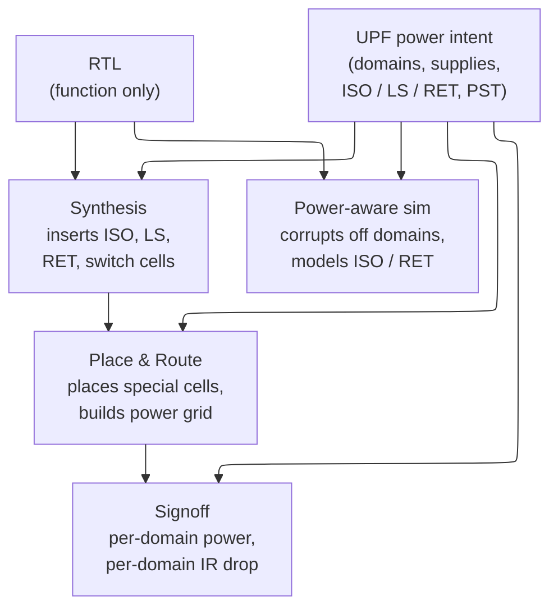

# UPF and Power Intent — Specifying Everything the RTL Leaves Unsaid

> **Prerequisites:** [Power_Fundamentals](01_Power_Fundamentals.md) (the three powers, and why leakage is the term power-gating exists to kill), [Power_Reduction_Techniques](03_Power_Reduction_Techniques.md) (the *mechanisms* — power switches, retention flops, isolation and clock-gating cells — that this page only specifies the *intent* for), [CMOS_Fundamentals](../00_Fundamentals/01_CMOS_Fundamentals.md) (why an unpowered node has no logic value, and why a sub-threshold "1" cannot switch a higher-rail gate).
> **Hands off to:** [Power_Analysis_and_Signoff](05_Power_Analysis_and_Signoff.md) (measuring per-domain power and closing the intent at signoff).

---

## 0. Why this page exists

RTL describes **function** and nothing else. `assign y = a & b;` says what `y` computes; it is completely silent on which supply drives that gate, whether the block can be switched off, what voltage it runs at, or what the wire means when the block on the other end is dark. Yet those are the questions that decide whether the chip meets its power budget — and none of them can be read off the netlist, because they are not properties of the *computation* at all. They are properties of the **physical power architecture** wrapped around it.

Power intent is the separate, formal answer to those questions. It is a specification — IEEE 1801 (UPF) — that names the power regions, the supplies, and, above all, **what must happen at the boundary between a region that is on and one that is off or at a different voltage.** The design decision that makes the whole methodology work is that this specification is kept *orthogonal to function*: it lives in its own file, it references the RTL by hierarchical name without touching it, and it is consumed identically by synthesis, place-and-route, simulation, and signoff. That orthogonality is not a convenience — it is what lets one RTL be retargeted to many power strategies, lets an IP block carry its power intent to any SoC, and makes power a **formally checkable property** rather than a pile of ad-hoc scripts.

This page derives the UPF constructs — power domains, supply sets, isolation, level shifters, retention, and the power state table — **from the boundary problem each one solves**, not as a command reference. For each we ask: what goes wrong in silicon if it is absent, what is the cheapest correct fix, where is the trade-off knee, and why real SoCs land where they do. By the end you should be able to reason about a power architecture — size a domain partition, choose a clamp value, decide what to retain — rather than recite `set_isolation` flags.

---

## 1. The core idea: function and power intent as orthogonal specifications

A power-managed chip is described by two specifications that must not be tangled:

- **The RTL** fixes the *logic* — the values every net computes, assuming every gate is powered and every level is valid.
- **The power intent** fixes the *physical power structure* — which cells share a supply, which supplies can be switched off or moved in voltage, and what protects the interfaces between them.

The RTL's silence is total and load-bearing: it *assumes* a world where every node always has a valid logic value. Power management breaks exactly that assumption — an off block's outputs have no value, a low-voltage "1" is not a "1" to high-voltage logic — so everything interesting in UPF happens at the **boundary** where a powered region meets one that is off or at another voltage. Four boundary facts the RTL never states, and the four constructs that repair each:

| Boundary fact the RTL never states | Why it corrupts silicon | UPF construct that repairs it |
|---|---|---|
| An off domain's outputs have **no logic value** (they float / read as X) | the X is captured by powered-on logic downstream and spreads | **isolation cells** (§3) |
| A logic "1" at 0.5 V is **not a "1"** to 0.9 V logic | the receiver can't resolve the level; its input stage can sit in crossover drawing crowbar current | **level shifters** (§4) |
| Switching a domain off **erases every flop** in it | state you cannot cheaply recompute (config, PC, mode) is gone at wake | **retention registers** (§5) |
| Of the $k^D$ domain-state combinations, **almost none are legal** | verifying the full cross-product is intractable | **power state table** (§6) |

Underneath all four sits the grouping construct — the **power domain** and its **supply set** (§2) — because you cannot say "these outputs must be isolated when this region goes off" without first having a name for "this region."

The organizing principle is that this file is the **single golden source of power truth**, and every tool reads the same one:



Note what the tools *do* with it: synthesis and P&R **insert** the physical cells UPF names — the designer writes intent, not gates. Change the UPF and the same RTL is re-implemented with a different power architecture; change the RTL and the same intent still applies. The flavor of the language is deliberately thin — you declare a region and hand it a supply:

```tcl
create_power_domain PD_CPU -elements {cpu_core}     ;# "this subtree is one power region"
associate_supply_set SS_CPU -handle PD_CPU.primary  ;# "...driven by this abstract supply"
```

Everything else in UPF is a variation on naming a region, naming a supply, or naming what happens where two regions meet.

---

## 2. Power domains and supply sets: naming what shares a power fate

**Why the construct must exist.** Power is switched and scaled at the granularity of *regions*, never individual gates — you gate a CPU cluster or a modem, not one flop, because a switch, its control, and its boundary protection have fixed overhead that only amortizes over a large block. So the first thing power intent needs is a name for "these instances live and die together, on the same rail, in the same power state." That name is the **power domain**. The rules follow directly from the definition: every cell belongs to *exactly one* domain (a cell cannot be simultaneously on and off), and a default top domain owns everything not carved out (nothing may be left with an undefined power fate).

**Supplies as an abstraction, derived from portability.** A domain needs a supply, but binding it to a physical net name too early destroys reuse. UPF therefore interposes the **supply set** — an abstract bundle of functions `{power, ground, nwell, pwell}` reached through a *handle* on the domain (`PD_CPU.primary`, `PD_CPU.retention`, `PD_CPU.isolation`). The handle is a promise ("this domain has a primary supply"); the physical net that fulfils it is bound later, and can be bound *differently* in different SoCs. This is what enables **successive refinement**: the same golden intent is written once at RTL (abstract handles, isolation/retention strategies), then *refined* — never rewritten — as synthesis maps handles to nets and P&R fixes the switch topology. An IP block ships its power intent in terms of its own handles; the integrator connects them to real rails without seeing inside. The abstraction *is* the portability.

**The real trade-off: coarse vs fine partitioning.** How many gateable domains should a chip have? Gating a region reclaims its leakage while it sleeps, but every domain boundary costs isolation cells, possibly level shifters, always-on buffering for control signals, a switch network, and — crucially — more states to verify (§6). The net benefit of making region $R$ its own gateable domain is

$$
\Delta P_{net}(R) \;\approx\; \underbrace{P_{leak}(R)\,\rho_{idle}(R)}_{\text{leakage reclaimed while off}} \;-\; \underbrace{P_{AO}(R)}_{\text{always-on boundary + switch-leakage overhead}}
$$

where $P_{leak}(R)$ = R's leakage when on, $\rho_{idle}(R)$ = fraction of time R is powered off, $P_{AO}(R)$ = standing cost of R's boundary (isolation/level-shift/always-on buffers + switch leakage). Leakage reclaimed scales with R's *area*; boundary cost scales with its *interface signal count*. Subdivide too finely and interface count stops falling as fast as area does, so the marginal reclaim per new boundary collapses — pure diminishing returns, on top of the verification-state blow-up. This is why designs gate at **coarse, architecturally meaningful cuts** — a CPU cluster, a GPU, a modem, a peripheral group — chosen for three properties together: large idle leakage, long idle residency ($\rho_{idle}$ high), and *few* interface signals. Mobile SoCs (Apple, Snapdragon-class) still end up with dozens of such domains because they have dozens of blocks that are genuinely idle for long stretches; a datacenter CPU has far fewer, because almost everything is busy almost all the time and the boundary cost buys little.

---

## 3. Isolation: clamping an output that has stopped meaning anything

**Why isolation must exist — the failure is physical, not stylistic.** When a domain's supply is removed, its output nets are driven by nothing. Electrically they float; to the powered-on logic reading them they resolve to **X** (unknown). That X is not inert: the always-on receiver latches it, propagates it through its own logic, and one dead block silently corrupts a live one — a false interrupt, a spurious bus grant, a wrong arbiter decision. An unpowered node *has no logic value*, so the only fix is to stop reading the dead net and instead **clamp** the boundary to a defined, safe value while the source is off. That clamp cell is the isolation cell, and it is the memory-corruption barrier of the power domain: nothing X may escape a gated region into an on one.

**The real trade-off: what is a "safe" value?** The clamp value is not free choice — it is dictated by what the signal *means* to its receiver, and getting it wrong substitutes a clean functional bug for the X:

- **Clamp-0 (AND-type isolation)** — hold the output low. Correct for request/valid strobes, active-high enables, data and address buses whose idle state is all-zeros. The default, because "0 = nothing happening" is the common convention.
- **Clamp-1 (OR-type isolation)** — hold the output high. Correct for **active-low** control (`reset_n`, `chip_select_n`, `enable_n`), where the *deasserted* (safe) state *is* logic 1. Clamp such a signal to 0 and you assert reset or select a memory while the domain is off — bus contention or a stuck reset, a bug with no X to flag it.
- **Hold-last (latch/feedthrough isolation)** — freeze the last valid value instead of forcing a constant. Needed when the receiver requires a *coherent* last value — a status word, a configuration output, a cross-domain feedback path where any fixed constant (0 or 1) drives the live logic into a wrong state or a hang. Costs ~1.5–2× a simple clamp because it is a transparent latch, so it is used only where a constant genuinely cannot serve.

Choosing the clamp is a per-signal semantic decision, which is why isolation is specified as a *strategy* over a domain's outputs, with exceptions for the signals whose safe value differs.

**Correctness as a formally checkable property.** Two properties fully capture isolation correctness, and both are machine-checkable:

- **Structural (static, no simulation):** *every* net crossing from a gateable domain to an on domain passes through an isolation cell, powered by an always-on supply (it must work while the source is dark — hence `PD.isolation` maps to an always-on set), driven by a real control signal. A checker proves this over the netlist; the classic bug it catches is the *forgotten* output — the designer isolates the data bus and forgets `data_valid`, `error`, `irq`, and those float. `-applies_to outputs` over the whole domain exists precisely so the safe default is "clamp them all."
- **Sequential (dynamic, power-aware sim):** isolation is **asserted before** the switch opens and **deasserted after** the supply is stable. Reverse either and there is a window where the output is both unpowered and unclamped — X leaks for a few nanoseconds and can cause a spurious write. UPF states the intent (which signal, which sense); the power-management FSM must produce the ordering, and the assertion `$fell(sleep) |-> iso_en` is what proves it.

Isolation is the memory-side twin of every "hold it until it is safe to release" mechanism in hardware: the boundary is defended by a barrier that only lowers when both sides agree the value is real.

---

## 4. Level shifting: a logic level is valid only relative to a rail

**Why the construct must exist.** A logic level is not an absolute voltage — it is defined *relative to the rail of the gate that reads it*. A domain running at $V_{DDL}=0.5$ V drives a clean "1" at 0.5 V; a domain at $V_{DDH}=0.9$ V expects a "1" near 0.9 V. Feed the 0.5 V "1" into the 0.9 V receiver and it may fall below that receiver's input-high threshold $V_{IH,H}$: the input is *unresolved*, and — worse than a wrong bit — the receiver's first inverter can sit with both transistors partly on, drawing continuous **crowbar (short-circuit) current**. A crossing needs a level shifter exactly when

$$
V_{OH}^{\text{src}} \;<\; V_{IH}^{\text{sink}} \quad\Longleftrightarrow\quad \text{the source's ``1'' is not a ``1'' to the sink}
$$

where $V_{OH}^{\text{src}}$ = source's output-high ($\approx V_{DDL}$), $V_{IH}^{\text{sink}}$ = sink's input-high threshold ($\approx V_{DDH}/2$ plus margin). This is a *checkable voltage condition per crossing*, which is why level-shifter insertion can be verified structurally: enumerate every net whose source and sink supplies differ, and require a shifter on it.

**Two directions, very different cost.** Stepping **up** (low→high) is the hard case — a weak low-rail signal must fully switch a high-rail gate, so the cell is a regenerative, cross-coupled pair (a small sense amplifier) with ~100–300 ps delay. Stepping **down** (high→low) is nearly free — the over-tall input easily switches a low-rail buffer, ~50–150 ps. The direction is not always static: under DVFS a domain can be *above or below* its neighbour at different operating points (turbo vs low-power), so many crossings must shift **both** ways, and forgetting this — "it only ever goes one direction" — is a classic escape, because during a DVFS transition either side can momentarily be higher.

**Trade-off and placement.** Each crossing costs a cell in area, delay (which must be carried in static timing), and a receiver that now needs both rails present. A 32-bit bus crossing a voltage boundary is 32 shifters *per direction* — non-trivial, and a reason to minimize the number of distinct voltage boundaries a bus crosses. Level shifting is **orthogonal to isolation**: a boundary can be cross-voltage but never gated (always both on, at different DVFS points → shifter, no clamp) or gated but same-voltage (→ clamp, no shifter). When a boundary is *both*, a **combined isolation-plus-level-shift cell** does both jobs in one cell, saving area over two in series — the only place the two concerns share hardware.

---

## 5. Retention: keeping only the state you cannot afford to rebuild

**Why the construct must exist.** Power-gating is the strongest leakage lever there is — it removes the supply, so the gated logic leaks essentially nothing (the mechanism, switch sizing, and rush-current staging live in [Power_Reduction_Techniques §4](03_Power_Reduction_Techniques.md)). But it is indiscriminate: it **erases every flop** in the domain. For state you can regenerate cheaply — pipeline registers, anything reloadable from memory — that is fine; you re-initialize on wake. For state that is *expensive or impossible to recompute* — the program counter, control/status registers, configuration, mode bits — erasure means the block cannot resume, only restart. Retention resolves the conflict: a **shadow latch on an always-on rail**, attached to selected flops, that *saves* their value before the domain goes off and *restores* it after it comes back, so the block wakes exactly where it slept.

**The central trade-off: retention granularity.** How many flops get a shadow latch? This is the real design knob, and it is a genuine optimization, not a default:

- **Retain-all** — every flop retains. Wake is instant and trivially correct ($E_{reinit}\to 0$), but every flop pays the shadow-latch area (**~30–50%** over a plain flop) *and* the always-on leakage of that latch during the entire sleep. Retaining everything partly defeats the purpose of gating — you are still leaking through all the shadow cells.
- **Retain-minimal** — retain only the architectural must-haves (~10% of flops is typical), and *re-derive* the rest on wake. Area and standing retention leakage drop by roughly the same fraction, but the wake sequence is longer and more complex (you must recompute or reload the dropped state).

The choice follows from an energy comparison. Retention beats "full off, then re-initialize" when

$$
\underbrace{E_{reinit} + \lambda\,T_{wake}}_{\text{cost of NOT retaining}} \;>\; \underbrace{E_{save} + E_{restore} + P_{ret}\,t_{sleep}}_{\text{cost of retaining}}
$$

where $E_{reinit}$ = energy to rebuild the dropped state on wake, $T_{wake}$ = added wake latency valued at $\lambda$ (energy per unit time), $E_{save},E_{restore}$ = one-time transfer energies, $P_{ret}$ = always-on leakage of the shadow latches, $t_{sleep}$ = sleep duration. Read off the design guidance directly: retain exactly the state whose $E_{reinit}$ is large or infinite (you *cannot* recompute a config register), drop the state whose $E_{reinit}$ is near zero (caches reload from DRAM anyway). That is why real cores retain ~10% and re-init the rest — it minimizes the standing $P_{ret}\,t_{sleep}$ term while keeping $E_{reinit}$ bounded. Note the $P_{ret}\,t_{sleep}$ term also sets a *ceiling* on useful sleep: for very long idle periods even the shadow leakage adds up, so ultra-low-power modes sometimes abandon retention entirely (full off, reload state from flash/DRAM on wake), while short idles skip gating and just clock-gate.

**The hidden cost — always-on plumbing.** Retention only works if the save, restore, clock, and isolation-control signals actually *reach* the retention flops while the domain around them is dark. Ordinary buffers in the gated domain are dead when it is off, so those signals must be carried by **always-on buffers/repeaters** threaded through the gated region on the always-on rail. This is a real, easily forgotten cost of the scheme (a whole class of "the clock never reached the retention flop" bugs), and it is why UPF has an explicit repeater strategy — the always-on network is part of the intent, not an afterthought.

**Sequencing.** Retention adds an ordering rule to the isolation rule of §3: **save before power-down, restore only after the supply is stable.** Restoring into an unstable, still-ramping rail transfers data at low voltage and silently corrupts it — the worst kind of bug, since the block wakes with wrong register values and produces wrong results without crashing. Real flows gate the restore on a voltage detector reaching ~90–95% of nominal.

---

## 6. The power state table: collapsing the state explosion into a verification contract

**Why the construct must exist.** With $D$ independently controllable supplies, each admitting $k$ states (on, off, retention, a few DVFS voltages), there are $\prod_i k_i \approx k^D$ *syntactic* combinations of power state. The number that are **physically legal and reachable** is tiny: a child domain cannot be on while its parent supply is off; some domains are mutually exclusive; most combinations are simply never entered from reset. Left implicit, that gap is a verification catastrophe — you would have to prove isolation, level-shifting, and retention correct across an exponential set of states, most of them impossible. The **power state table (PST)** is the fix: it *enumerates the legal combinations explicitly*, turning "is this power configuration allowed?" from an open question into a table lookup, and turning verification from exponential into linear.

**The theory: why enumeration is what makes verification tractable.** Let $\mathcal{L}$ be the set of legal power states (the PST rows) and $\mathcal{T}$ the legal transitions between them. Every power-correctness property — isolation present and clamped correctly on each active boundary, level shifter present on each active cross-voltage boundary, retention saved/restored in order — is discharged *per legal state* and *per legal transition*:

$$
\text{verification cost} \;=\; O\big(|\mathcal{L}| + |\mathcal{T}|\big) \;\ll\; O\big(k^{D}\big), \qquad |\mathcal{L}| \sim \text{a handful}
$$

The PST is, in other words, the **reachable-state manifold** of the power architecture, hand-declared. It is the contract at which power-management-FSM correctness meets physical-implementation correctness: the FSM designer promises the hardware only ever visits $\mathcal{L}$, and the implementation tools guarantee every state in $\mathcal{L}$ is protected. Nothing outside the table need be — or should be — checked, and any state the FSM can actually reach that is *missing* from the table is itself the bug. The flavor is just an enumeration of named combinations:

```tcl
create_pst SoC_PST -supplies {SS_TOP SS_CPU SS_PERI}
add_pst_state ALL_ON     -pst SoC_PST -state {TOP_ON CPU_ON  PERI_ON }
add_pst_state CPU_SLEEP  -pst SoC_PST -state {TOP_ON CPU_RET PERI_ON }
add_pst_state DEEP_SLEEP -pst SoC_PST -state {TOP_ON CPU_OFF PERI_OFF}
;# no row contains TOP_OFF: the always-on domain off is, by construction, illegal
```

**Trade-off: expressiveness vs verification cost.** A rich PST (many DVFS points, many independent sleep combinations) exposes more low-power operating modes — more chances to save energy — but every added row is a state to implement and verify, and every added *edge* is a transition sequence to design and prove. A coarse PST is cheap to verify but leaves energy on the table. Designs therefore keep exactly the states with a real duty-cycle justification (an idle mode the workload actually spends time in) and no more — the same "gate only where residency justifies the overhead" logic as §2, now applied to states instead of regions. The PST is where the abstract claim "UPF exists to make power verification tractable" becomes concrete: it is the artifact that bounds the problem.

---

## 7. Why the intent must stay orthogonal, and how the tools consume it

Everything above depends on power intent being a *separate, standardized* specification. The reasons are worth making explicit, because they are the reason UPF exists rather than power directives living in the RTL:

- **Separation of concerns / re-verification cost.** Function is verified once, against the logic. If power were baked into the RTL, every change of power strategy would perturb the functional description and force a full functional re-verification — and you could not hand the *same* verified IP to two SoCs with different power budgets. Keeping intent orthogonal means the logic proof and the power proof compose independently.
- **One golden source, many consumers.** The same UPF file drives synthesis (which *inserts* isolation, level-shifter, retention, and switch cells), P&R (which places those special cells and builds the multi-rail power grid), power-aware simulation (which corrupts off domains to X, models clamp values, and exercises save/restore), and signoff (per-domain power and IR-drop). Because it is *one* IEEE-1801 specification with defined semantics, all tools agree on what "off" and "isolated" mean. Before UPF, each tool had its own ad-hoc, mutually inconsistent mechanism — the source of a generation of power bugs.
- **Refinement, not rewrite.** Successive refinement (§2) lets the abstract RTL-level intent be sharpened at each stage — handles bound to nets, cell types chosen, switch topology fixed — without ever rewriting the golden description. IP-level UPF refines up into SoC-level UPF the same way.
- **Power correctness becomes a *static* property.** The biggest payoff of a formal intent: the central correctness claims are checkable *without simulation*. Static low-power checks prove that every gated output is isolated, every cross-voltage net is shifted, every domain has a legal supply, and the PST is self-consistent — a structural proof over the netlist. Dynamic power-aware simulation then covers only what is inherently temporal: X-propagation and save/restore/isolate *sequencing*. The static/dynamic split is exactly the split between "is the boundary hardware present and correct" (structural) and "is it operated in the right order" (behavioral), and having a formal intent is what moves the first, larger half off the simulator.

The special cells the tools insert are characterized in the Liberty (`.lib`) models — an isolation cell advertises `is_isolation_cell` and a `power_down_function`, a retention flop a `retention_cell` group and a backup supply pin, a level shifter its input/output voltage ranges, a switch its `switch_function`. UPF names the *intent* ("isolate these outputs, clamp 0"); Liberty describes the *cells* that realize it; the tool matches one to the other. That division — intent in UPF, implementation in Liberty, logic in RTL — is the whole methodology in one sentence.

*(Standards note: UPF is IEEE 1801. The competing CPF format (Si2/Cadence) covered the same ground with explicit net connections instead of supply-set abstraction; it has been largely superseded — use UPF for new designs, keep CPF only for legacy flows.)*

---

## 8. Worked example: is a domain worth gating, and should it retain?

A peripheral cluster leaks $P_{leak}=8$ mW when on and is idle $\rho_{idle}=70\%$ of the time. Its boundary (isolation on ~40 outputs, always-on control buffers, switch leakage) costs $P_{AO}=0.6$ mW standing.

**Gate it?** Net saving $\Delta P_{net}=P_{leak}\,\rho_{idle}-P_{AO}=8\times0.70-0.6=5.0$ mW — clearly worth a domain. Had the block been idle only 10% of the time, $\Delta P_{net}=8\times0.10-0.6=0.2$ mW, barely covering the boundary cost: gate only blocks with *both* high leakage and high idle residency (§2).

**Retain it?** The cluster has ~5,000 flops but only ~400 hold state that cannot be reloaded (config, a small FSM); the rest re-initialize from the bus in a few microseconds. Retain-all costs ~5,000 shadow latches of always-on leakage during every sleep; retain-minimal costs ~400 — an ~12× smaller standing retention-leakage term $P_{ret}\,t_{sleep}$ — while adding only a few µs of wake latency to reload the rest. With sleeps lasting milliseconds, the reload latency is negligible against the leakage saved, so **retain ~8% (the 400), re-init the rest** (§5). This is the standard shape: retention is spent only on state whose $E_{reinit}$ is large, never as a blanket policy.

Both answers come straight from the §2 and §5 models — which is the point of having them.

---

## Numbers to memorize

| Fact | Value / rule | Why it matters (section) |
|---|---|---|
| UPF standard | **IEEE 1801**; UPF 2.0 = **1801-2009** (added supply sets, power states, PST, successive refinement) | the constructs on this page mostly arrived at 2.0 (§2, §6) |
| UPF lineage | 3.0 = 1801-2015 (abstract IP models); **4.0 = 1801-2024**, pub. 2025 (VCM/tunnelling to arbitrary HDL types, virtual supply nets, refinable macros) | production flows in 2025–26 are mostly 2.x/3.x with 4.0 arriving feature-by-feature |
| Isolation clamp | AND-type → clamp **0** (active-high / data / valid); OR-type → clamp **1** (active-low `_n`); latch → **hold last** | wrong clamp turns an X-bug into a silent functional bug (§3) |
| Isolation supply | must be **always-on** (`PD.isolation`) | the clamp has to work while the source is dark (§3) |
| Level-shift condition | needed when $V_{OH}^{src} < V_{IH}^{sink}$; step-up **100–300 ps**, step-down **50–150 ps** | a checkable per-crossing property; DVFS ⇒ shift **both** ways (§4) |
| Retention flop overhead | **~30–50%** area over a plain flop; always-on shadow leaks during sleep | why retain-all is costly (§5) |
| Selective retention | retain ~**10%** of flops → save ~**90%** of retention area/leakage | the standard granularity knee (§5) |
| Power switch | **header** (PMOS, gates VDD) or **footer** (NMOS, gates VSS), daisy-chained to limit in-rush | mechanism in [03 §4](03_Power_Reduction_Techniques.md); UPF only names it |
| Sequencing rules | **isolate before** power-down; **restore after** supply stable (~90–95% $V_{nom}$) | the #1 and #2 power-sequencing bugs (§3, §5) |
| Isolation direction | almost always `-applies_to outputs` | the receiver is on and copes; the sender goes dark (§3) |
| PST | enumerates the **legal** state combinations, $|\mathcal{L}|\ll k^D$ | collapses verification from exponential to linear (§6) |

---

## Cross-references

- **Down the stack (what realizes this intent):** [Power_Reduction_Techniques](03_Power_Reduction_Techniques.md) — the actual circuits UPF only *names*: power-switch sizing and rush-current staging (§4), retention/balloon flops (§4.7), isolation-cell construction (§4.6), clock gating, and the power-down/up sequence and break-even that make gating pay. [CMOS_Fundamentals](../00_Fundamentals/01_CMOS_Fundamentals.md) — why an unpowered node has no logic value (the isolation motive), why a sub-threshold "1" cannot switch a higher-rail gate (the level-shift motive), and the leakage physics power-gating attacks.
- **Up the stack (what consumes this intent):** [Power_Analysis_and_Signoff](05_Power_Analysis_and_Signoff.md) — per-domain power and IR-drop signoff, and where UPF-driven static and power-aware checks close. [Power_Fundamentals](01_Power_Fundamentals.md) — the three-way power budget and the leakage term whose reclamation justifies the whole gating/retention apparatus.
- **Adjacent:** [Block_Activity_and_Power](02_Block_Activity_and_Power.md) — the per-block, per-mode activity/power estimates that tell you *which* blocks have the idle-leakage-×-residency product worth turning into a power domain (§2, §8).

---

## References

1. IEEE, *IEEE Standard for Design and Verification of Low-Power, Energy-Aware Electronic Systems*, IEEE 1801-2024 (UPF 4.0), 2024 (published 2025; available fee-free via the IEEE GET program). The current standard; supersedes 1801-2018/2015/2013/2009.
2. IEEE, *IEEE 1801-2009* (UPF 2.0), 2009. Introduced supply sets, supply-set handles, power states, the PST, and successive refinement — the abstraction model of §2 and §6.
3. Keating, M., Flynn, D., Aitken, R., Gibbons, A., Shi, K., *Low Power Methodology Manual for System-on-Chip Design*, Springer, 2007. The canonical treatment of isolation, level shifting, retention, and power-gating methodology behind §3–§5.
4. Bhasker, J. and Chadha, R., *Static Timing Analysis for Nanometer Designs*, Springer, 2009. Level-shifter and multi-voltage timing (the STA cost of §4).
