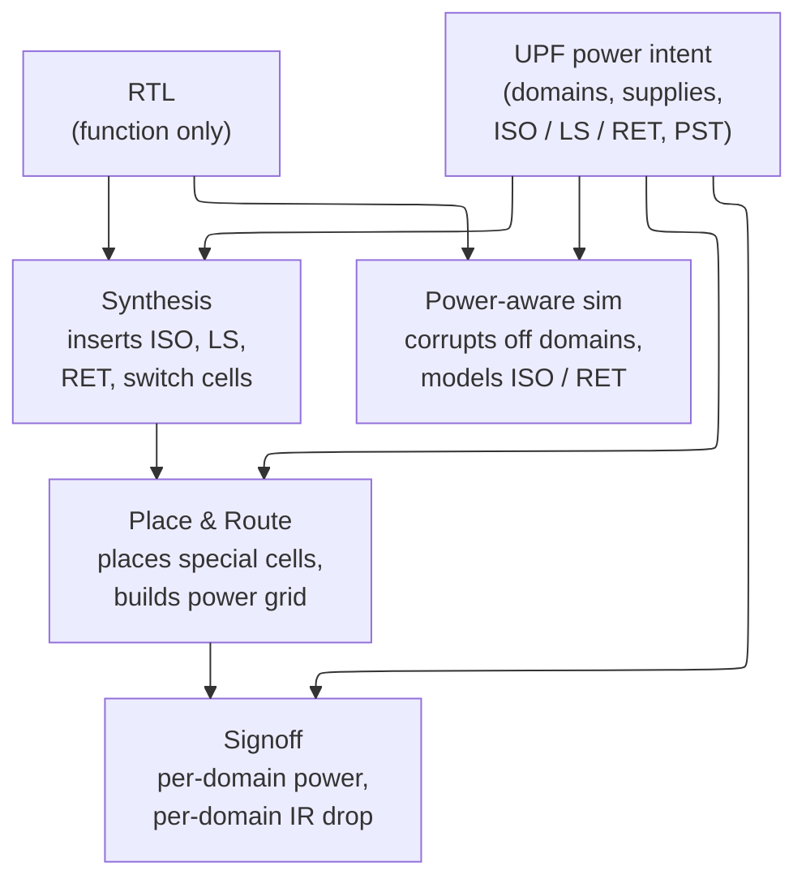
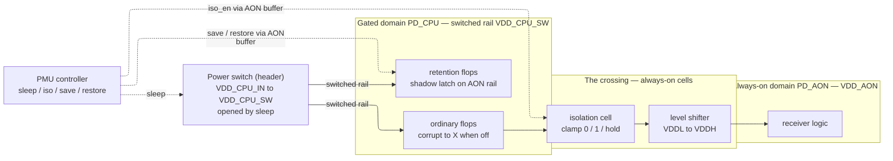
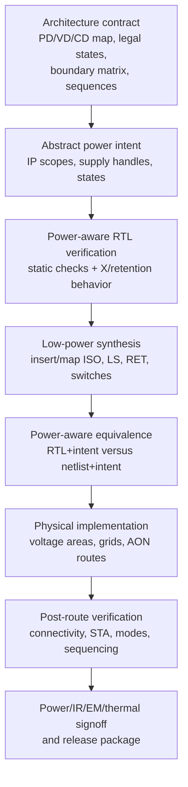
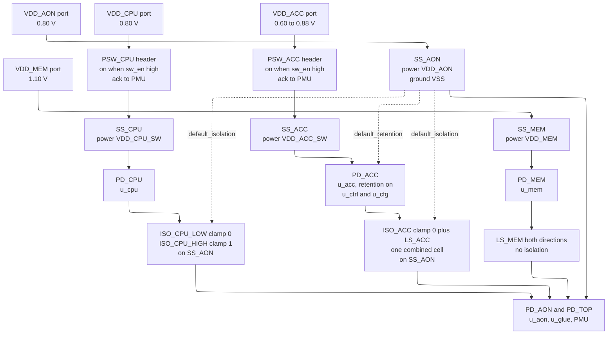

# UPF/CPF Power-Intent Flow — Specifying, Implementing, and Verifying What RTL Leaves Unsaid

> **First-time-reader orientation:** RTL says what logic computes while it is powered. A power-intent file separately says which logic may be off, which supplies and voltages are legal, what happens at domain boundaries, and which state survives. **UPF** (Unified Power Format, standardized as IEEE 1801) and **CPF** (Common Power Format, published by Si2) are two languages for carrying that intent through the design flow.
>
> **Abbreviation key — skim now and return as needed:** always-on (AON); Common Power Format (CPF); clock-domain crossing (CDC); electronic design automation (EDA); finite-state machine (FSM); intellectual property (IP); Liberty timing/power library (`.lib`); multi-mode/multi-corner (MMMC); place and route (P&R); power-management unit (PMU); power state table (PST); power, performance, and area (PPA); register-transfer level (RTL); static timing analysis (STA); Unified Power Format (UPF); voltage domain (VD).
>
> **Prerequisites:** [Low-Power Architecture](03_Low_Power_Architecture_and_Domain_Partitioning.md) (how power, voltage, clock, and reset domains are chosen), [Power Fundamentals](01_Power_Fundamentals.md) (the leakage and voltage terms the architecture is trying to reduce), [Power Reduction Techniques](04_Power_Reduction_Techniques.md) (the physical mechanisms this file requests), [CMOS Fundamentals](../00_Fundamentals/01_CMOS_Fundamentals.md) (why an unpowered node has no valid logic value and why voltage crossings need special cells).
> **Hands off to:** [Power_Analysis_and_Signoff](06_Power_Analysis_and_Signoff.md) (measuring per-domain power and closing the intent at signoff).

---

## 0. Why this page exists

RTL describes **function** and nothing else. `assign y = a & b;` says what `y` computes; it is completely silent on which supply drives that gate, whether the block can be switched off, what voltage it runs at, or what the wire means when the block on the other end is dark. Yet those are the questions that decide whether the chip meets its power budget — and none of them can be read off the netlist, because they are not properties of the *computation* at all. They are properties of the **physical power architecture** wrapped around it.

Power intent is the separate, formal answer to those questions. UPF and CPF name power regions, supplies, legal states, and—above all—**what must happen at the boundary between a region that is on and one that is off or at a different voltage.** The design decision that makes the methodology work is that this specification is kept *orthogonal to function*: it lives separately, references the design hierarchy without changing its functional behavior, and is consumed by simulation, synthesis, place-and-route, formal/static checking, and signoff. That orthogonality lets one RTL be retargeted to multiple power strategies, lets an IP block carry abstract intent into different SoCs, and makes power correctness checkable rather than a collection of unrelated scripts.

This page first derives the core constructs—power domains, supplies, isolation, level shifters, retention, and legal power states—from the boundary problem each solves. It then compares UPF and CPF and follows the intent through the **complete implementation and verification flow**. Domain sizing and partition trade-offs are developed separately in [Low-Power Architecture](03_Low_Power_Architecture_and_Domain_Partitioning.md); this page begins once that architectural contract exists.

---

## 1. The core idea: function and power intent as orthogonal specifications

A power-managed chip is described by two specifications that must not be tangled:

- **The RTL** fixes the *logic* — the values every net computes, assuming every gate is powered and every level is valid.
- **The power intent** fixes the *physical power structure* — which cells share a supply, which supplies can be switched off or moved in voltage, and what protects the interfaces between them.

The RTL's silence is total and load-bearing: it *assumes* a world where every node always has a valid logic value. Power management breaks exactly that assumption — an off block's outputs have no value, a low-voltage "1" is not a "1" to high-voltage logic — so everything interesting in UPF happens at the **boundary** where a powered region meets one that is off or at another voltage. Four boundary facts the RTL never states, and the four constructs that repair each:

| Boundary fact the RTL never states | Why it corrupts silicon | UPF construct that repairs it |
|---|---|---|
| An off domain's outputs have **no logic value** (they float / read as X) | the X is captured by powered-on logic downstream and spreads | **isolation cells** (§3) |
| A logic "1" at 0.5 V is **not a "1"** to 0.9 V logic | the receiver can't resolve the level; its input stage can sit in crossover drawing crowbar current | **level shifters** (§4) |
| Switching a domain off **erases every flop** in it | state you cannot cheaply recompute (config, PC, mode) is gone at wake | **retention registers** (§5) |
| Of the $k^D$ domain-state combinations, **almost none are legal** | verifying the full cross-product is intractable | **power state table** (§6) |

Underneath all four sits the grouping construct — the **power domain** and its **supply set** (§2) — because you cannot say "these outputs must be isolated when this region goes off" without first having a name for "this region."

The organizing principle is that this file is the **single golden source of power truth**, and every tool reads the same one:



Note what the tools *do* with it: synthesis and P&R **insert** the physical cells UPF names — the designer writes intent, not gates. Change the UPF and the same RTL is re-implemented with a different power architecture; change the RTL and the same intent still applies. The flavor of the language is deliberately thin — you declare a region and hand it a supply:

```tcl
create_power_domain PD_CPU -elements {cpu_core}     ;# "this subtree is one power region"
associate_supply_set SS_CPU -handle PD_CPU.primary  ;# "...driven by this abstract supply"
```

Everything else in UPF is a variation on naming a region, naming a supply, or naming what happens where two regions meet.

---

## 2. Power domains and supply sets: naming what shares a power fate

**Why the construct must exist.** Power is switched and scaled at the granularity of *regions*, never individual gates — you gate a CPU cluster or a modem, not one flop, because a switch, its control, and its boundary protection have fixed overhead that only amortizes over a large block. So the first thing power intent needs is a name for "these instances live and die together, on the same rail, in the same power state." That name is the **power domain**. The rules follow directly from the definition: every cell belongs to *exactly one* domain (a cell cannot be simultaneously on and off), and a default top domain owns everything not carved out (nothing may be left with an undefined power fate).

**Supplies as an abstraction, derived from portability.** A domain needs a supply, but binding it to a physical net name too early destroys reuse. UPF therefore interposes the **supply set** — an abstract bundle of functions `{power, ground, nwell, pwell}` reached through a *handle* on the domain (`PD_CPU.primary`, `PD_CPU.retention`, `PD_CPU.isolation`). The handle is a promise ("this domain has a primary supply"); the physical net that fulfils it is bound later, and can be bound *differently* in different SoCs. This is what enables **successive refinement**: the same golden intent is written once at RTL (abstract handles, isolation/retention strategies), then *refined* — never rewritten — as synthesis maps handles to nets and P&R fixes the switch topology. An IP block ships its power intent in terms of its own handles; the integrator connects them to real rails without seeing inside. The abstraction *is* the portability.

**The real trade-off: coarse vs fine partitioning.** How many gateable domains should a chip have? Gating a region reclaims its leakage while it sleeps, but every domain boundary costs isolation cells, possibly level shifters, always-on buffering for control signals, a switch network, and — crucially — more states to verify (§6). The net benefit of making region $R$ its own gateable domain is

$$
\Delta P_{net}(R) \;\approx\; \underbrace{P_{leak}(R)\,\rho_{idle}(R)}_{\text{leakage reclaimed while off}} \;-\; \underbrace{P_{AO}(R)}_{\text{always-on boundary + switch-leakage overhead}}
$$

where $P_{leak}(R)$ = R's leakage when on, $\rho_{idle}(R)$ = fraction of time R is powered off, $P_{AO}(R)$ = standing cost of R's boundary (isolation/level-shift/always-on buffers + switch leakage). Leakage reclaimed scales with R's *area*; boundary cost scales with its *interface signal count*. Subdivide too finely and interface count stops falling as fast as area does, so the marginal reclaim per new boundary collapses — pure diminishing returns, on top of the verification-state blow-up. This is why designs gate at **coarse, architecturally meaningful cuts** — a CPU cluster, a GPU, a modem, a peripheral group — chosen for three properties together: large idle leakage, long idle residency ($\rho_{idle}$ high), and *few* interface signals. Mobile SoCs (Apple, Snapdragon-class) still end up with dozens of such domains because they have dozens of blocks that are genuinely idle for long stretches; a datacenter CPU has far fewer, because almost everything is busy almost all the time and the boundary cost buys little.

---

## 3. Isolation: clamping an output that has stopped meaning anything

**What it is, in one line.** An isolation cell is a *shutoff valve on a domain's outputs*: while the upstream domain is off, control holds each output at a known safe position — low, high, or frozen-at-last — so the still-powered domain downstream reads a defined value instead of the floating garbage an unpowered driver leaves behind. Clamp an output whose driver lost power; do not let a dead block speak.

**Why isolation must exist — the failure is physical, not stylistic.** When a domain's supply is removed, its output nets are driven by nothing. Electrically they float; to the powered-on logic reading them they resolve to **X** (unknown). That X is not inert: the always-on receiver latches it, propagates it through its own logic, and one dead block silently corrupts a live one — a false interrupt, a spurious bus grant, a wrong arbiter decision. An unpowered node *has no logic value*, so the only fix is to stop reading the dead net and instead **clamp** the boundary to a defined, safe value while the source is off. That clamp cell is the isolation cell, and it is the memory-corruption barrier of the power domain: nothing X may escape a gated region into an on one.

**The real trade-off: what is a "safe" value?** The clamp value is not free choice — it is dictated by what the signal *means* to its receiver, and getting it wrong substitutes a clean functional bug for the X:

- **Clamp-0 (AND-type isolation)** — hold the output low. Correct for request/valid strobes, active-high enables, data and address buses whose idle state is all-zeros. The default, because "0 = nothing happening" is the common convention.
- **Clamp-1 (OR-type isolation)** — hold the output high. Correct for **active-low** control (`reset_n`, `chip_select_n`, `enable_n`), where the *deasserted* (safe) state *is* logic 1. Clamp such a signal to 0 and you assert reset or select a memory while the domain is off — bus contention or a stuck reset, a bug with no X to flag it.
- **Hold-last (latch/feedthrough isolation)** — freeze the last valid value instead of forcing a constant. Needed when the receiver requires a *coherent* last value — a status word, a configuration output, a cross-domain feedback path where any fixed constant (0 or 1) drives the live logic into a wrong state or a hang. Costs ~1.5–2× a simple clamp because it is a transparent latch, so it is used only where a constant genuinely cannot serve.

Choosing the clamp is a per-signal semantic decision, which is why isolation is specified as a *strategy* over a domain's outputs, with exceptions for the signals whose safe value differs.

**Correctness as a formally checkable property.** Two properties fully capture isolation correctness, and both are machine-checkable:

- **Structural (static, no simulation):** *every* net crossing from a gateable domain to an on domain passes through an isolation cell, powered by an always-on supply (it must work while the source is dark — hence `PD.isolation` maps to an always-on set), driven by a real control signal. A checker proves this over the netlist; the classic bug it catches is the *forgotten* output — the designer isolates the data bus and forgets `data_valid`, `error`, `irq`, and those float. `-applies_to outputs` over the whole domain exists precisely so the safe default is "clamp them all."
- **Sequential (dynamic, power-aware sim):** isolation is **asserted before** the switch opens and **deasserted after** the supply is stable. Reverse either and there is a window where the output is both unpowered and unclamped — X leaks for a few nanoseconds and can cause a spurious write. UPF states the intent (which signal, which sense); the power-management FSM must produce the ordering, and the assertion `$fell(sleep) |-> iso_en` is what proves it.

Isolation is the memory-side twin of every "hold it until it is safe to release" mechanism in hardware: the boundary is defended by a barrier that only lowers when both sides agree the value is real.

---

## 4. Level shifting: a logic level is valid only relative to a rail

**What it is, in one line.** A logic level is like a price quoted in a local currency: a "1" at a 0.5 V rail and a "1" at a 0.9 V rail are *different amounts*, and a value crossing between them must be converted at the border or the receiver reads the wrong figure. A level shifter is that currency exchange — it restates the source's "1" as a "1" the sink's rail can actually resolve. A logic level is meaningful only relative to a rail.

**Why the construct must exist.** A logic level is not an absolute voltage — it is defined *relative to the rail of the gate that reads it*. A domain running at $V_{DDL}=0.5$ V drives a clean "1" at 0.5 V; a domain at $V_{DDH}=0.9$ V expects a "1" near 0.9 V. Feed the 0.5 V "1" into the 0.9 V receiver and it may fall below that receiver's input-high threshold $V_{IH,H}$: the input is *unresolved*, and — worse than a wrong bit — the receiver's first inverter can sit with both transistors partly on, drawing continuous **crowbar (short-circuit) current**. A crossing needs a level shifter exactly when

$$
V_{OH}^{\text{src}} \;<\; V_{IH}^{\text{sink}} \quad\Longleftrightarrow\quad \text{the source's ``1'' is not a ``1'' to the sink}
$$

where $V_{OH}^{\text{src}}$ = source's output-high ($\approx V_{DDL}$), $V_{IH}^{\text{sink}}$ = sink's input-high threshold ($\approx V_{DDH}/2$ plus margin). This is a *checkable voltage condition per crossing*, which is why level-shifter insertion can be verified structurally: enumerate every net whose source and sink supplies differ, and require a shifter on it.

**Two directions, very different cost.** Stepping **up** (low→high) is the hard case — a weak low-rail signal must fully switch a high-rail gate, so the cell is a regenerative, cross-coupled pair (a small sense amplifier) with ~100–300 ps delay. Stepping **down** (high→low) is nearly free — the over-tall input easily switches a low-rail buffer, ~50–150 ps. The direction is not always static: under DVFS a domain can be *above or below* its neighbour at different operating points (turbo vs low-power), so many crossings must shift **both** ways, and forgetting this — "it only ever goes one direction" — is a classic escape, because during a DVFS transition either side can momentarily be higher.

**Trade-off and placement.** Each crossing costs a cell in area, delay (which must be carried in static timing), and a receiver that now needs both rails present. A 32-bit bus crossing a voltage boundary is 32 shifters *per direction* — non-trivial, and a reason to minimize the number of distinct voltage boundaries a bus crosses. Level shifting is **orthogonal to isolation**: a boundary can be cross-voltage but never gated (always both on, at different DVFS points → shifter, no clamp) or gated but same-voltage (→ clamp, no shifter). When a boundary is *both*, a **combined isolation-plus-level-shift cell** does both jobs in one cell, saving area over two in series — the only place the two concerns share hardware.

---

## 5. Retention: keeping only the state you cannot afford to rebuild

**What it is, in one line.** Retention is a *checkpoint taken before the lights go out*: a small always-on shadow latch copies only the register values you could not cheaply rebuild, holds them on a trickle rail through the sleep, and restores them on wake — so the block resumes exactly where it stopped instead of cold-starting. Keep only the state you cannot afford to rebuild; everything reconstructable is deliberately left out and reloaded later.

**Why the construct must exist.** Power-gating is the strongest leakage lever there is — it removes the supply, so the gated logic leaks essentially nothing (the mechanism, switch sizing, and rush-current staging live in [Power_Reduction_Techniques §4](04_Power_Reduction_Techniques.md)). But it is indiscriminate: it **erases every flop** in the domain. For state you can regenerate cheaply — pipeline registers, anything reloadable from memory — that is fine; you re-initialize on wake. For state that is *expensive or impossible to recompute* — the program counter, control/status registers, configuration, mode bits — erasure means the block cannot resume, only restart. Retention resolves the conflict: a **shadow latch on an always-on rail**, attached to selected flops, that *saves* their value before the domain goes off and *restores* it after it comes back, so the block wakes exactly where it slept.

**The central trade-off: retention granularity.** How many flops get a shadow latch? This is the real design knob, and it is a genuine optimization, not a default:

- **Retain-all** — every flop retains. Wake is instant and trivially correct ($E_{reinit}\to 0$), but every flop pays the shadow-latch area (**~30–50%** over a plain flop) *and* the always-on leakage of that latch during the entire sleep. Retaining everything partly defeats the purpose of gating — you are still leaking through all the shadow cells.
- **Retain-minimal** — retain only the architectural must-haves (~10% of flops is typical), and *re-derive* the rest on wake. Area and standing retention leakage drop by roughly the same fraction, but the wake sequence is longer and more complex (you must recompute or reload the dropped state).

The choice follows from an energy comparison. Retention beats "full off, then re-initialize" when

$$
\underbrace{E_{reinit} + \lambda\,T_{wake}}_{\text{cost of NOT retaining}} \;>\; \underbrace{E_{save} + E_{restore} + P_{ret}\,t_{sleep}}_{\text{cost of retaining}}
$$

where $E_{reinit}$ = energy to rebuild the dropped state on wake, $T_{wake}$ = added wake latency valued at $\lambda$ (energy per unit time), $E_{save},E_{restore}$ = one-time transfer energies, $P_{ret}$ = always-on leakage of the shadow latches, $t_{sleep}$ = sleep duration. Read off the design guidance directly: retain exactly the state whose $E_{reinit}$ is large or infinite (you *cannot* recompute a config register), drop the state whose $E_{reinit}$ is near zero (caches reload from DRAM anyway). That is why real cores retain ~10% and re-init the rest — it minimizes the standing $P_{ret}\,t_{sleep}$ term while keeping $E_{reinit}$ bounded. Note the $P_{ret}\,t_{sleep}$ term also sets a *ceiling* on useful sleep: for very long idle periods even the shadow leakage adds up, so ultra-low-power modes sometimes abandon retention entirely (full off, reload state from flash/DRAM on wake), while short idles skip gating and just clock-gate.

**The hidden cost — always-on plumbing.** Retention only works if the save, restore, clock, and isolation-control signals actually *reach* the retention flops while the domain around them is dark. Ordinary buffers in the gated domain are dead when it is off, so those signals must be carried by **always-on buffers/repeaters** threaded through the gated region on the always-on rail. This is a real, easily forgotten cost of the scheme (a whole class of "the clock never reached the retention flop" bugs), and it is why UPF has an explicit repeater strategy — the always-on network is part of the intent, not an afterthought.

**Sequencing.** Retention adds an ordering rule to the isolation rule of §3: **save before power-down, restore only after the supply is stable.** Restoring into an unstable, still-ramping rail transfers data at low voltage and silently corrupts it — the worst kind of bug, since the block wakes with wrong register values and produces wrong results without crashing. Real flows gate the restore on a voltage detector reaching ~90–95% of nominal.

**Where the three cells physically sit (one crossing).** §3–§5 each defined one boundary cell in isolation; here is how they occupy a *single* power-domain crossing together. The gated domain (`PD_CPU`) runs on a **switched rail** fed by a power switch; the receiver lives in an **always-on domain** (`PD_AON`). On the crossing itself sit the always-on cells: the isolation cell clamps the gated output — powered by AON so it still works while the source is dark — and, *only if the two sides differ in voltage*, a level shifter follows it (when a boundary is both gated and cross-voltage, one combined iso+LS cell does both jobs). Retention flops stay *inside* the gated domain but keep their shadow latch on the always-on rail. The cost the picture makes visible: every control signal — `sleep`, `iso_en`, `save`/`restore` — originates in the always-on PMU and must reach its target through **always-on buffers**, because ordinary buffers in the gated region die the instant it powers off.



---

## 6. The power state table: collapsing the state explosion into a verification contract

**Why the construct must exist.** With $D$ independently controllable supplies, each admitting $k$ states (on, off, retention, a few DVFS voltages), there are $\prod_i k_i \approx k^D$ *syntactic* combinations of power state. The number that are **physically legal and reachable** is tiny: a child domain cannot be on while its parent supply is off; some domains are mutually exclusive; most combinations are simply never entered from reset. Left implicit, that gap is a verification catastrophe — you would have to prove isolation, level-shifting, and retention correct across an exponential set of states, most of them impossible. The **power state table (PST)** is the fix: it *enumerates the legal combinations explicitly*, turning "is this power configuration allowed?" from an open question into a table lookup, and turning verification from exponential into linear.

**The theory: why enumeration is what makes verification tractable.** Let $\mathcal{L}$ be the set of legal power states (the PST rows) and $\mathcal{T}$ the legal transitions between them. Every power-correctness property — isolation present and clamped correctly on each active boundary, level shifter present on each active cross-voltage boundary, retention saved/restored in order — is discharged *per legal state* and *per legal transition*:

$$
\text{verification cost} \;=\; O\big(|\mathcal{L}| + |\mathcal{T}|\big) \;\ll\; O\big(k^{D}\big), \qquad |\mathcal{L}| \sim \text{a handful}
$$

The PST is, in other words, the **reachable-state manifold** of the power architecture, hand-declared. It is the contract at which power-management-FSM correctness meets physical-implementation correctness: the FSM designer promises the hardware only ever visits $\mathcal{L}$, and the implementation tools guarantee every state in $\mathcal{L}$ is protected. Nothing outside the table need be — or should be — checked, and any state the FSM can actually reach that is *missing* from the table is itself the bug. The flavor is just an enumeration of named combinations:

```tcl
create_pst SoC_PST -supplies {SS_TOP SS_CPU SS_PERI}
add_pst_state ALL_ON     -pst SoC_PST -state {TOP_ON CPU_ON  PERI_ON }
add_pst_state CPU_SLEEP  -pst SoC_PST -state {TOP_ON CPU_RET PERI_ON }
add_pst_state DEEP_SLEEP -pst SoC_PST -state {TOP_ON CPU_OFF PERI_OFF}
;# no row contains TOP_OFF: the always-on domain off is, by construction, illegal
```

**Tiny worked example — the collapse in numbers.** Take those three supplies, each nominally in one of on/ret/off: $k^{D} = 3^{3} = 27$ syntactic combinations. The physics prunes almost all of them:

- **TOP is always-on**, so `TOP` is pinned `ON` — its off/retention rows are illegal by construction: $27 \to 9$.
- **PERI has no retention hardware**, so `PERI_RET` is meaningless and `PERI` is just on/off: $9 \to 6$.
- **PERI powers off only together with a fully-off CPU** (the peripheral stays live to catch traffic while the CPU runs or merely retains, and no useful mode runs one dark while the other is up), so `PERI_OFF` occurs exactly when `CPU_OFF`: $6 \to 3$.

What survives is exactly the three rows declared above — `ALL_ON`, `CPU_SLEEP`, `DEEP_SLEEP`. A 27-state cross-product has collapsed to a 3-row contract, and every isolation, level-shift, and retention proof now runs over those 3 states, not 27.

**Trade-off: expressiveness vs verification cost.** A rich PST (many DVFS points, many independent sleep combinations) exposes more low-power operating modes — more chances to save energy — but every added row is a state to implement and verify, and every added *edge* is a transition sequence to design and prove. A coarse PST is cheap to verify but leaves energy on the table. Designs therefore keep exactly the states with a real duty-cycle justification (an idle mode the workload actually spends time in) and no more — the same "gate only where residency justifies the overhead" logic as §2, now applied to states instead of regions. The PST is where the abstract claim "UPF exists to make power verification tractable" becomes concrete: it is the artifact that bounds the problem.

---

## 7. Why the intent must stay orthogonal, and how the tools consume it

Everything above depends on power intent being a *separate, standardized* specification. The reasons are worth making explicit, because they are the reason UPF exists rather than power directives living in the RTL:

- **Separation of concerns / re-verification cost.** Function is verified once, against the logic. If power were baked into the RTL, every change of power strategy would perturb the functional description and force a full functional re-verification — and you could not hand the *same* verified IP to two SoCs with different power budgets. Keeping intent orthogonal means the logic proof and the power proof compose independently.
- **One golden source, many consumers.** The same UPF file drives synthesis (which *inserts* isolation, level-shifter, retention, and switch cells), P&R (which places those special cells and builds the multi-rail power grid), power-aware simulation (which corrupts off domains to X, models clamp values, and exercises save/restore), and signoff (per-domain power and IR-drop). Because it is *one* IEEE-1801 specification with defined semantics, all tools agree on what "off" and "isolated" mean. Before UPF, each tool had its own ad-hoc, mutually inconsistent mechanism — the source of a generation of power bugs.
- **Refinement, not rewrite.** Successive refinement (§2) lets the abstract RTL-level intent be sharpened at each stage — handles bound to nets, cell types chosen, switch topology fixed — without ever rewriting the golden description. IP-level UPF refines up into SoC-level UPF the same way.
- **Power correctness becomes a *static* property.** The biggest payoff of a formal intent: the central correctness claims are checkable *without simulation*. Static low-power checks prove that every gated output is isolated, every cross-voltage net is shifted, every domain has a legal supply, and the PST is self-consistent — a structural proof over the netlist. Dynamic power-aware simulation then covers only what is inherently temporal: X-propagation and save/restore/isolate *sequencing*. The static/dynamic split is exactly the split between "is the boundary hardware present and correct" (structural) and "is it operated in the right order" (behavioral), and having a formal intent is what moves the first, larger half off the simulator.

The special cells the tools insert are characterized in the Liberty (`.lib`) models — an isolation cell advertises `is_isolation_cell` and a `power_down_function`, a retention flop a `retention_cell` group and a backup supply pin, a level shifter its input/output voltage ranges, a switch its `switch_function`. UPF names the *intent* ("isolate these outputs, clamp 0"); Liberty describes the *cells* that realize it; the tool matches one to the other. That division — intent in UPF, implementation in Liberty, logic in RTL — is the whole methodology in one sentence.

*(Standards note: UPF is the active IEEE 1801 standard. CPF was standardized by the Silicon Integration Initiative (Si2); the Si2 Low Power Coalition and its CPF materials are now archived, but CPF remains supported in established flows. Select the format required by the project's IP, signoff methodology, and qualified tool chain—do not assume a file is interchangeable merely because both languages describe similar concepts.)*

---

## 8. UPF versus CPF: choose one governed source of truth

### 8.1 Standards position and practical choice

**UPF** is the Unified Power Format standardized by IEEE 1801. IEEE 1801-2024 is the current active edition. It supports power-intent specification, validation, implementation, verification, IP abstraction, and incremental refinement from an abstract IP view to concrete SoC implementation.

**CPF** is the Common Power Format developed through the Si2 Low Power Coalition. Si2's public archive includes CPF 2.1, an interoperability guide, and flow-oriented design material. CPF remains relevant where a company's qualified Cadence-centric or legacy methodology, delivered IP, and regression/signoff collateral use it.

The architecture should be format-neutral; the project flow should not be format-ambiguous. Decide using:

- the format and version accepted by every simulator, synthesis, implementation, equivalence, and signoff tool in the qualified flow;
- the format delivered with third-party IP and hard macros;
- foundry/reference-flow requirements;
- support for the specific power features the design uses;
- team expertise, validation scripts, and regression history;
- whether translation can be independently checked at every abstraction level.

For a new multi-vendor flow, UPF is normally the interoperability baseline because it is an active IEEE standard. That is a default, not permission to replace a proven CPF signoff flow without requalification.

### 8.2 Concept mapping, not line-by-line translation

| Architectural concept | UPF expression style | CPF expression style | Invariant that must survive |
|---|---|---|---|
| domain membership | power domains and element scopes | power domains and instance scopes | every instance has one intended power fate |
| supply topology | supply ports/nets/sets and domain handles | power nets and domain supply connections | the same rails feed the same cells and special cells |
| voltage states | supply-set power states / voltage expressions | nominal conditions and power modes | every legal voltage combination is preserved |
| power gating | power-switch definitions and control | power-switch rules/control | same switched rail, sense, and acknowledgement behavior |
| isolation | isolation strategy/control | isolation rules | same source/sink scope, clamp, location, and control polarity |
| level shifting | level-shifter strategies | level-shifter rules | same crossing directions and voltage ranges |
| retention | retention strategy/control | state-retention rules | same retained elements, backup supply, save/restore sense |
| legal chip modes | power states/PST and transition constraints | power modes | same reachable configurations and dependencies |

The invariant column is the important one. Translating syntax without proving those invariants can produce a file that parses successfully but describes a different chip.

### 8.3 Do not hand-maintain two golden files

If both formats are required, select one governed source and derive the other through a version-controlled translation step. Then compare:

1. domain membership reports;
2. supply connectivity and voltage-state reports;
3. isolation, level-shifter, retention, and switch counts/scopes;
4. legal power modes and transitions;
5. power-aware simulation behavior;
6. post-insertion low-power equivalence results.

Two independently edited “golden” files drift because intent changes are semantic, not textual. A diff cannot tell you that one file retained 412 registers while the other retained 409.

---

## 9. End-to-end UPF/CPF flow: architecture to signoff

### 9.1 The flow and its stage gates



Each arrow is a refinement boundary with an explicit pass/fail gate. The intent becomes more concrete, but no stage is allowed to silently change the architecture.

| Stage | Primary inputs | What the tool does | Required evidence before advancing |
|---|---|---|---|
| architecture | use cases, residency, IP/library limits | choose PD/VD/CD/RD, modes, boundary policy | approved domain/state/boundary/sequence documents |
| intent authoring | architecture + RTL hierarchy + IP intent | declare scopes, supplies, strategies, states | clean syntax/semantic lint; complete scope/connectivity reports |
| power-aware RTL | RTL + intent + PMU/testbench | corrupt off logic, model clamps/retention/states | transition tests, assertions, X checks, state/transition coverage |
| synthesis | RTL + intent + libraries + timing constraints | insert/map special cells and optimize logic | insertion reports, unmapped-strategy count = 0, netlist checks |
| equivalence | pre-insertion and post-insertion views | prove functional equivalence under legal power states | clean low-power-aware equivalence or reviewed exceptions |
| physical design | netlist + refined intent + floorplan/PDN | place voltage areas/cells, build rails/switch network/AON routes | legal placement, rail connectivity, switch/LS/ISO/RET/AON checks |
| post-route closure | extracted netlist/parasitics + all legal modes | run MMMC STA, power-aware gate simulation, physical checks | timing and low-power checks clean for every required mode |
| signoff | activity, extracted power grid, thermal/package models | calculate power, IR drop, electromigration, temperature | signed reports traceable to modes, vectors, corners, and intent version |

`ISO`, `LS`, and `RET` mean isolation, level shifting, and retention. `PDN` means **power-delivery network**. `EM` means **electromigration**.

### 9.2 Step 0 — freeze the architecture contract

The intent author must receive, not invent:

- instance-to-power/voltage/clock/reset-domain mapping;
- supply and regulator topology;
- named legal voltage states and system power modes;
- source/sink boundary matrix with clamp semantics;
- retained state list and reconstruction policy;
- switch, isolation, save/restore, reset, clock, and acknowledgement sequence;
- IP ownership and refinement boundaries;
- test, scan, debug, boot, brownout, and failure-recovery behavior.

If a UPF author discovers that a CPU and GPU cannot actually power off independently because a shared interrupt path has no AON route, the correct response is an architecture change review—not an undocumented exception in Tcl.

### 9.3 Step 1 — author an abstract, reviewable intent

Start with stable architectural names and hierarchy scopes. Keep logical intent separate from technology choices where the format and flow allow it. A compact UPF skeleton illustrates the order of thought; exact options vary by IEEE 1801 edition and tool:

```tcl
# 1. Name domains and their design scope.
create_power_domain PD_AON -elements {u_aon}
create_power_domain PD_CPU -elements {u_cpu}

# 2. Name supplies and connect the abstract architecture to design ports/nets.
create_supply_port VDD_AON
create_supply_port VDD_CPU_IN
create_supply_port VSS
create_supply_net  VDD_AON
create_supply_net  VDD_CPU_IN
create_supply_net  VSS
connect_supply_net VDD_AON    -ports {VDD_AON}
connect_supply_net VDD_CPU_IN -ports {VDD_CPU_IN}
connect_supply_net VSS        -ports {VSS}

# 3. Declare the switched CPU rail and its power switch/control.
create_supply_net VDD_CPU_SW -domain PD_CPU
create_power_switch PSW_CPU -domain PD_CPU \
    -input_supply_port  {vin  VDD_CPU_IN} \
    -output_supply_port {vout VDD_CPU_SW} \
    -control_port       {sleep pmu_cpu_off}

# 4. Associate abstract supply sets, then protect boundaries.
create_supply_set SS_AON -function {power VDD_AON}    -function {ground VSS}
create_supply_set SS_CPU -function {power VDD_CPU_SW} -function {ground VSS}
associate_supply_set SS_AON -handle PD_AON.primary
associate_supply_set SS_CPU -handle PD_CPU.primary

# Clamp values come from interface semantics, not signal width or naming alone.
set_isolation ISO_CPU_OUT -domain PD_CPU -applies_to outputs \
    -clamp_value 0 -isolation_supply_set SS_AON
set_isolation_control ISO_CPU_OUT -domain PD_CPU \
    -isolation_signal pmu_iso_cpu -isolation_sense high -location parent
set_level_shifter LS_CPU_OUT -domain PD_CPU -applies_to outputs -rule both

# 5. Retain only architecture-approved state on an available backup supply.
set_retention RET_CPU -domain PD_CPU -elements {u_cpu/u_ctrl/state_reg[*]} \
    -retention_supply_set SS_AON
set_retention_control RET_CPU -domain PD_CPU \
    -save_signal {pmu_save_cpu high} \
    -restore_signal {pmu_restore_cpu high}

# 6. Declare legal supply/domain states and compose legal system modes.
#    Command details differ across UPF editions; the reviewed mode table is golden.
```

This is deliberately not a copy-paste production file. A real file must also define ground, supply-set functions/handles, voltage values, isolation/retention supplies, cell/location policies, AON paths, IP refinement, and the project-specific power states.

For CPF, follow the same semantic order—domains, power nets and nominal conditions, power modes, power-switch/isolation/level-shifter/state-retention rules—using the CPF version qualified by the flow. Review generated domain/rule reports rather than assuming similar command names imply identical behavior.

### 9.4 Step 2 — lint and statically validate before simulation

Run checks as soon as the RTL hierarchy and intent load:

- every intended instance belongs to the correct domain;
- no scope is empty because a hierarchy name changed;
- supply nets/sets resolve and every domain has a valid primary supply;
- legal states use defined voltage conditions;
- every power-domain and voltage-domain crossing is classified;
- isolation/level-shifter strategies match actual crossing direction;
- isolation and retention supplies remain available when required;
- control signals originate from an available domain and reach their loads through AON paths;
- retained elements exist and are supported by the library/mapping plan;
- power modes respect parent/child and regulator dependencies.

Treat warnings about an empty element collection, unmatched rule, or unprotected crossing as functional defects. Waivers need an owner, exact object list, rationale, and revalidation rule.

### 9.5 Step 3 — power-aware RTL simulation verifies time and behavior

Ordinary RTL simulation assumes all logic remains powered. Power-aware simulation overlays supply state:

1. the testbench or PMU requests a transition;
2. the simulator evaluates the declared supply/domain state;
3. ordinary state in an off domain is corrupted to `X`;
4. retained state follows save/corrupt/restore semantics;
5. isolation replaces an invalid output with its declared clamp;
6. level-shifting and power-state semantics are applied according to the model;
7. assertions and scoreboards check the live system's behavior.

Minimum transition tests include every legal state and edge, repeated under traffic:

- shut down while the interface is idle;
- request shutdown with transactions outstanding and prove drain/backpressure;
- interrupt or wake arriving at each point in entry/exit;
- missing/late power-good or acknowledgement timeout;
- reset during retention and during power ramp;
- DVFS up/down while neighboring domains remain active;
- illegal PMU request rejected or driven to a safe recovery state;
- test/debug entry from each supported power state.

Useful assertions express ordering rather than fixed cycle counts. In plain language:

- isolation must be active before the source supply becomes unavailable;
- save must complete before destructive power-down;
- restore may occur only after power-good is stable;
- clocks may restart only at a voltage supporting their frequency;
- isolation may release only after restored/reset outputs are valid;
- no request is accepted unless the destination can eventually respond.

Coverage must count domain states, legal transitions, boundary directions, retention save/restore, clamp values, wake sources, failure paths, and crossings exercised with one side unavailable. “All tests passed” without transition coverage can mean the deepest state was never entered.

### 9.6 Step 4 — synthesis inserts and maps low-power cells

Low-power synthesis combines RTL, intent, Liberty models, and timing constraints. Depending on the flow, it inserts or maps:

- isolation and combined isolation/level-shifter cells;
- low-to-high, high-to-low, or bidirectional level shifters;
- state-retention registers;
- AON buffers/repeaters;
- power-switch control structures;
- clock-gating cells inferred or requested by the RTL/constraints.

Review counts by domain and rule, not only total count. A sudden reduction in isolation count may indicate optimization removed real crossings—or that a hierarchy/rule no longer matched. A sudden increase may reveal a partition change that dramatically enlarged the boundary.

The handoff report should show original strategy, matched crossings/elements, selected library cells, location policy, supply pins, controls, and every exception/unmapped object.

### 9.7 Step 5 — power-aware equivalence proves insertion did not change legal behavior

Ordinary equivalence can reject intentional low-power logic or ignore its state-dependent semantics. A low-power-aware proof compares the source view plus intent against the implemented netlist plus refined intent across legal power states. It must account for isolation clamps, retention behavior, level shifting, and power-state corruption.

Run the proof after synthesis and again after significant physical/netlist transformations. Classify failures:

- true functional change;
- incorrect or missing special-cell insertion;
- mismatch between source and implementation intent;
- wrong library characterization/power pins;
- hierarchy/name mapping error;
- an intentionally unsupported state that should be excluded by the legal-state model, not manually ignored.

### 9.8 Step 6 — physical design realizes electrical regions

P&R turns logical intent into geometry:

- create voltage areas/regions and place domain cells legally;
- design always-on and switched power grids;
- size and distribute header/footer switches for IR drop and in-rush limits;
- place isolation and level shifters where their required rails are available;
- route AON controls without ordinary buffers in switchable regions;
- connect retention backup supplies;
- build clock trees that obey power-state and DVFS assumptions;
- keep feed-through signals alive or route them around off regions;
- insert decoupling and stage wake-up to limit supply droop.

Physical checks must prove not just that a special cell exists, but that its power pins reach the correct available rails. An isolation cell powered only by the domain it is isolating is logically present and electrically useless.

### 9.9 Step 7 — post-route timing, power-state, and physical verification

MMMC analysis expands across legal power modes and voltage combinations. Check:

- source and sink at every legal OPP pair;
- level-shifter delay and constraints in both directions where DVFS reverses the voltage ordering;
- isolation enable timing relative to the power sequence;
- retention save/restore control timing;
- recovery/removal for resets leaving a low-power state;
- CDC/RDC assumptions when clocks stop, switch, or change frequency;
- AON paths at the slow/low-voltage corner;
- power-switch and rail IR drop under staged and simultaneous wake;
- scan shift/capture and debug modes with their supported supplies.

Repeat structural low-power checks on the final netlist because optimization, engineering-change orders (ECOs), clock-tree insertion, and routing feed-throughs can introduce new crossings after synthesis.

### 9.10 Step 8 — signoff, release, and silicon correlation

The release package must bind results to exact versions of RTL/netlist, UPF/CPF, libraries, parasitics, activity, mode, corner, floorplan, and tool settings. Include:

- domain and supply connectivity reports;
- strategy insertion/mapping and waiver reports;
- legal state/transition coverage;
- power-aware simulation and equivalence results;
- MMMC timing and low-power physical checks;
- per-mode dynamic/leakage power;
- static/dynamic IR drop, in-rush, electromigration, and thermal results;
- PMU firmware/register specification and measured sequencing limits;
- post-silicon telemetry plan for state residency, rail voltage/current, wake latency, and failures.

Silicon correlation closes the architecture loop: compare measured state residency, transition energy, regulator efficiency, wake time, and leakage with the assumptions that justified each domain. The next design should partition from those distributions, not from remembered averages.

---

## 10. The UPF language, as a working file

§1–§9 built the concepts. This section builds the artifact. Everything below is one file for one small SoC, written in the order a real file is written, and then walked command by command. The goal is that after reading it you can open a power-intent file you did not write, say what every line does, and predict what breaks if an argument is wrong.

Two conventions first, because they cause more confusion than any command. **UPF is Tcl.** Every "command" is a Tcl procedure the tool has registered; braces are Tcl's literal quoting, so `{power VDD_AON}` is a two-element list, not syntax. You can compute UPF — `foreach d $domains { create_power_domain PD_$d ... }` is legal and common — which is exactly why a UPF file can silently create zero domains when a variable is empty. And **UPF is scope-relative.** Every design object named in the file is resolved against the *current scope*, which starts at the design the tool loaded and moves with `set_scope`. A path that is correct in a block-level file is wrong in the SoC file that instantiates it, which is the entire reason §12's refinement layering exists.

### 10.1 The design this file describes

The RTL hierarchy under `soc_top`:

```text
soc_top
├── u_aon        always-on: PMU, RTC, wake logic, pad control, reset controller
│   └── u_pmu    drives every power-control signal in this file
├── u_cpu        CPU cluster: gateable, no retention, 0.80 V
├── u_acc        accelerator: gateable, retention on control/config state, 0.60-0.88 V DVFS
│   ├── u_ctrl   sequencer state that must survive sleep
│   ├── u_cfg    configuration registers written once at boot
│   └── u_dp     datapath: 41k flops, all reconstructable, none retained
├── u_mem        SRAM subsystem and peripheral bus, 1.10 V, never gated
└── u_glue       address decode and reset synchronizers, always on
```

Four domains, each present for a different reason — which is the point of the example:

| Domain | Elements | Rail | Voltage | Gated? | Retention? | Exists to exercise |
|---|---|---|---|---|---|---|
| `PD_TOP` | everything not claimed below | `VDD_AON` | 0.80 V | no | no | the default-domain rule |
| `PD_AON` | `u_aon` | `VDD_AON` | 0.80 V | no | no | the supply that isolation and retention borrow |
| `PD_CPU` | `u_cpu` | `VDD_CPU_SW` | 0.80 V | **yes** | no | gating with **no** voltage difference: isolation only |
| `PD_ACC` | `u_acc` | `VDD_ACC_SW` | 0.60/0.72/0.88 V | **yes** | **yes** | gating **and** a voltage difference **and** retention |
| `PD_MEM` | `u_mem` | `VDD_MEM` | 1.10 V | no | no | a pure voltage boundary: level shifting, **no** isolation |

`PD_CPU` and `PD_MEM` are the two clean single-variable cases; `PD_ACC` is the one where every mechanism in §3–§5 lands on the same boundary at once.

### 10.2 The complete file

```tcl
##############################################################################
# soc_top.upf  --  power intent for a four-domain SoC
#
#   PD_TOP   default  VDD_AON     0.80 V            glue, decode, sync
#   PD_AON   on       VDD_AON     0.80 V            PMU, RTC, wake, pads
#   PD_CPU   gated    VDD_CPU_SW  0.80 V            no retention
#   PD_ACC   gated    VDD_ACC_SW  0.60/0.72/0.88 V  retention on control state
#   PD_MEM   on       VDD_MEM     1.10 V            separate voltage domain
#
# VSS is a single global ground.  Every control signal originates in
# u_aon/u_pmu, which is in PD_AON and therefore alive in every legal state.
##############################################################################

upf_version 3.0
set_scope .

#--- 1. Domains --------------------------------------------------------------
create_power_domain PD_TOP -include_scope
create_power_domain PD_AON -elements {u_aon}
create_power_domain PD_CPU -elements {u_cpu}
create_power_domain PD_ACC -elements {u_acc}
create_power_domain PD_MEM -elements {u_mem}

#--- 2. Supply ports, nets, and their connection to the design ---------------
create_supply_port VDD_AON -direction in
create_supply_port VDD_CPU -direction in
create_supply_port VDD_ACC -direction in
create_supply_port VDD_MEM -direction in
create_supply_port VSS     -direction in

create_supply_net VDD_AON
create_supply_net VDD_CPU
create_supply_net VDD_ACC
create_supply_net VDD_MEM
create_supply_net VSS

connect_supply_net VDD_AON -ports {VDD_AON}
connect_supply_net VDD_CPU -ports {VDD_CPU}
connect_supply_net VDD_ACC -ports {VDD_ACC}
connect_supply_net VDD_MEM -ports {VDD_MEM}
connect_supply_net VSS     -ports {VSS}

# the switched rails: created here, driven by the power switches in part 4
create_supply_net VDD_CPU_SW -domain PD_CPU
create_supply_net VDD_ACC_SW -domain PD_ACC

#--- 3. Supply sets: the abstraction every later command speaks in -----------
create_supply_set SS_AON -function {power VDD_AON}    -function {ground VSS}
create_supply_set SS_CPU -function {power VDD_CPU_SW} -function {ground VSS}
create_supply_set SS_ACC -function {power VDD_ACC_SW} -function {ground VSS}
create_supply_set SS_MEM -function {power VDD_MEM}    -function {ground VSS}

associate_supply_set SS_AON -handle PD_TOP.primary
associate_supply_set SS_AON -handle PD_AON.primary
associate_supply_set SS_CPU -handle PD_CPU.primary
associate_supply_set SS_ACC -handle PD_ACC.primary
associate_supply_set SS_MEM -handle PD_MEM.primary

# the supplies that must survive a shutdown of the domain they serve
associate_supply_set SS_AON -handle PD_CPU.default_isolation
associate_supply_set SS_AON -handle PD_ACC.default_isolation
associate_supply_set SS_AON -handle PD_ACC.default_retention

#--- 4. Power switches -------------------------------------------------------
create_power_switch PSW_CPU \
    -domain             PD_CPU \
    -input_supply_port  {vin    VDD_CPU} \
    -output_supply_port {vout   VDD_CPU_SW} \
    -control_port       {sw_en  u_aon/u_pmu/cpu_pwr_en} \
    -ack_port           {sw_ack u_aon/u_pmu/cpu_pwr_ack} \
    -on_state           {cpu_on  vin {sw_en}} \
    -off_state          {cpu_off      {!sw_en}}

create_power_switch PSW_ACC \
    -domain             PD_ACC \
    -input_supply_port  {vin    VDD_ACC} \
    -output_supply_port {vout   VDD_ACC_SW} \
    -control_port       {sw_en  u_aon/u_pmu/acc_pwr_en} \
    -ack_port           {sw_ack u_aon/u_pmu/acc_pwr_ack} \
    -on_state           {acc_on  vin {sw_en}} \
    -off_state          {acc_off      {!sw_en}}

map_power_switch PSW_CPU -domain PD_CPU -lib_cells {HDR_LVT_X8}
map_power_switch PSW_ACC -domain PD_ACC -lib_cells {HDR_LVT_X8}

#--- 5. Power states ---------------------------------------------------------
add_power_state SS_AON \
    -state {AON_ON  -supply_expr {power == `{FULL_ON, 0.80}} -simstate NORMAL}
add_power_state SS_MEM \
    -state {MEM_ON  -supply_expr {power == `{FULL_ON, 1.10}} -simstate NORMAL}
add_power_state SS_CPU \
    -state {CPU_ON  -supply_expr {power == `{FULL_ON, 0.80}} -simstate NORMAL} \
    -state {CPU_OFF -supply_expr {power == `{OFF}}           -simstate CORRUPT}
add_power_state SS_ACC \
    -state {ACC_HI  -supply_expr {power == `{FULL_ON, 0.88}} -simstate NORMAL} \
    -state {ACC_NOM -supply_expr {power == `{FULL_ON, 0.72}} -simstate NORMAL} \
    -state {ACC_LO  -supply_expr {power == `{FULL_ON, 0.60}} -simstate NORMAL} \
    -state {ACC_OFF -supply_expr {power == `{OFF}}           -simstate CORRUPT}

# system states: named combinations, built as logic expressions over the above
add_power_state PD_TOP \
    -state {SYS_TURBO    -logic_expr {SS_CPU == CPU_ON  && SS_ACC == ACC_HI }} \
    -state {SYS_RUN      -logic_expr {SS_CPU == CPU_ON  && SS_ACC == ACC_NOM}} \
    -state {SYS_ECO      -logic_expr {SS_CPU == CPU_ON  && SS_ACC == ACC_LO }} \
    -state {SYS_CPU_ONLY -logic_expr {SS_CPU == CPU_ON  && SS_ACC == ACC_OFF}} \
    -state {SYS_SLEEP    -logic_expr {SS_CPU == CPU_OFF && SS_ACC == ACC_OFF}} \
    -state {SYS_ACC_ONLY -logic_expr {SS_CPU == CPU_OFF && SS_ACC != ACC_OFF} -illegal} \
    -complete

#--- 6. Isolation ------------------------------------------------------------
set_isolation ISO_CPU_LOW -domain PD_CPU \
    -applies_to           outputs \
    -clamp_value          0 \
    -isolation_signal     u_aon/u_pmu/cpu_iso_en \
    -isolation_sense      high \
    -location             parent \
    -isolation_supply_set SS_AON

# active-low outputs must clamp HIGH: their safe state is 1, not 0
set_isolation ISO_CPU_HIGH -domain PD_CPU \
    -elements             {u_cpu/cpu_mem_cs_n u_cpu/cpu_dbg_req_n} \
    -clamp_value          1 \
    -isolation_signal     u_aon/u_pmu/cpu_iso_en \
    -isolation_sense      high \
    -location             parent \
    -isolation_supply_set SS_AON

set_isolation ISO_ACC -domain PD_ACC \
    -applies_to           outputs \
    -clamp_value          0 \
    -isolation_signal     u_aon/u_pmu/acc_iso_en \
    -isolation_sense      high \
    -location             parent \
    -isolation_supply_set SS_AON

# the status word must present its last coherent value, not a constant
set_isolation ISO_ACC_HOLD -domain PD_ACC \
    -elements             {u_acc/acc_status} \
    -clamp_value          latch \
    -isolation_signal     u_aon/u_pmu/acc_iso_en \
    -isolation_sense      high \
    -location             parent \
    -isolation_supply_set SS_AON

#--- 7. Level shifters -------------------------------------------------------
set_level_shifter LS_ACC -domain PD_ACC \
    -applies_to both -rule both -threshold 0.04 -location parent

set_level_shifter LS_MEM -domain PD_MEM \
    -applies_to both -rule both -threshold 0.04 -location self

#--- 8. Retention ------------------------------------------------------------
set_retention RET_ACC -domain PD_ACC \
    -elements              {u_acc/u_ctrl u_acc/u_cfg} \
    -retention_supply_set  SS_AON \
    -save_signal           {u_aon/u_pmu/acc_save    posedge} \
    -restore_signal        {u_aon/u_pmu/acc_restore posedge} \
    -retention_condition   {!u_aon/u_pmu/acc_ret_disable}

map_retention_cell RET_ACC -domain PD_ACC \
    -lib_cells {SDFFRPQ_RET_X1 SDFFRPQ_RET_X2 SDFFRPQ_RET_X4}

#--- 9. Boundary specification ----------------------------------------------
# what drives / receives the accelerator's configuration port, so the tool can
# classify the crossing before any strategy is matched to it
set_port_attributes -ports {u_acc/cfg_addr u_acc/cfg_wdata u_acc/cfg_wr} \
    -driver_supply SS_AON
set_port_attributes -ports {u_acc/acc_irq u_acc/acc_status} \
    -receiver_supply SS_AON

# an input of a domain that may itself be off: state the value the *source*
# must present while the *sink* is dark, so no rail is driven through a dead gate
set_port_attributes -domains PD_ACC -applies_to inputs -sink_off_clamp 0

# a boot-strap pin that must never be isolated or optimized
set_design_attributes -elements {u_aon/u_por} -attribute {UPF_dont_touch TRUE}

#--- 10. Explicit interface-cell selection ----------------------------------
# the ACC boundary is both gated and cross-voltage: one combined cell, not two
use_interface_cell UIC_ACC_BOUNDARY -domain PD_ACC \
    -strategy  {ISO_ACC LS_ACC} \
    -lib_cells {ISOLS_AND_L2H_X4 ISOLS_AND_L2H_X8}

#--- 11. Always-on repeaters -------------------------------------------------
# any buffer the tool adds on these nets must be on SS_AON, because the nets
# run through a region whose own rail is gone exactly when they are needed
set_repeater RPT_ACC_CTRL -domain PD_ACC \
    -repeater_supply_set SS_AON \
    -elements {u_acc/acc_save u_acc/acc_restore u_acc/acc_iso_en u_acc/acc_rst_n}
```

That is a complete, self-consistent file for the design in §10.1. Every remaining subsection takes one part of it apart.

### 10.3 Header: `upf_version` and `set_scope`

`upf_version 3.0` declares the language edition the file is written to. It matters because command *semantics* changed between editions — most consequentially, `-elements` scoping and the precedence rules for overlapping strategies. A tool reading a 3.0 file in 1.0 compatibility mode does not error; it interprets the same text differently, which is the worst possible failure mode. Set it explicitly in every file.

`set_scope` moves the current scope, exactly like `cd`. `set_scope .` is the top of the loaded design. `set_scope u_acc` makes every subsequent path relative to the accelerator, and `set_scope ..` returns. Blocks are usually described by a file that assumes it is *inside* the block, and the integrator loads it with the instance path supplied from outside (`load_upf acc.upf -scope u_acc`), which is what makes a block's file reusable in two different SoCs.

**Wrong argument:** `set_scope u_ACC` when the instance is `u_acc`. **Classic error:** the tool reports an unresolvable scope and stops — this is the benign case. The malignant case is `set_scope` correct but never restored, so the next `create_power_domain` lands inside the block instead of at the top, and the "top" domain quietly contains only part of the chip.

### 10.4 `create_power_domain`, and what `-elements` actually means

```tcl
create_power_domain PD_ACC -elements {u_acc}
```

**What it means.** Create a named power domain and give it an **extent**: the set of design elements that live and die on its supply. `-elements` takes a list of *instances* (or, in later editions, other design elements) that are the roots of the extent. The extent is the subtree under each listed root — every descendant instance, every leaf cell, every net driven from inside — **minus** any subtree claimed by another power domain. That subtraction is the rule people get wrong: listing `u_acc` claims `u_acc/u_ctrl` too, unless a separate domain lists `u_acc/u_ctrl` explicitly, in which case the deeper claim wins and `PD_ACC` gets everything else.

`-include_scope` says "the extent includes the scope in which this domain is created." That is how `PD_TOP` above ends up owning `u_glue`, the top-level address decode, and anything the RTL team adds next month that nobody remembered to assign. **Every design element must belong to exactly one power domain**, so a default domain created with `-include_scope` is not optional; without it, unclaimed logic has no supply and the tool either errors or, worse, invents one.

Three further options worth knowing:

- `-scope <instance>` creates the domain as if the current scope were that instance — a way to declare a domain deep in the hierarchy from the top-level file without moving the global scope.
- `-supply {handle supply_set}` binds a supply set at creation instead of via a separate `associate_supply_set`; both forms are legal and the separate form reads better in a reviewable file.
- `-update` re-opens an existing domain to add elements or supplies. This is the mechanism of successive refinement (§12.1): the configuration file creates the domain, a later file adds to it, and nothing is rewritten.

**Wrong argument, and what it does.** `-elements {u_acc/*}` when you meant `{u_acc}` — a glob that matches the *children* of `u_acc` but not `u_acc` itself leaves the accelerator's own top-level nets and any glue instantiated directly in `u_acc` in `PD_TOP`, i.e. always on, i.e. never gated. Nothing errors. Leakage is higher than the model predicted and nobody finds out until silicon.

**The classic error.** `-elements` matching **zero** objects because a hierarchy name changed. `create_power_domain PD_ACC -elements {u_accel}` after the RTL renamed the instance to `u_acc` produces a domain that is syntactically valid, structurally empty, and completely inert: no isolation is inserted because there is no boundary, no switch is needed because there is nothing to switch, and every downstream report says "0 crossings, 0 strategies matched" — which reads like success. **Make the empty-element-collection warning a hard error in your run scripts.** This single check catches more real power bugs than any other lint rule.

### 10.5 Supplies: ports, nets, connections — and why supply sets replaced them

The older supply model is three commands and one binding:

```tcl
create_supply_port VDD_CPU -direction in       ;# a supply pin on the scope's boundary
create_supply_net  VDD_CPU                     ;# a supply wire inside the scope
connect_supply_net VDD_CPU -ports {VDD_CPU}    ;# tie the wire to the pin
set_domain_supply_net PD_CPU \
    -primary_power_net  VDD_CPU_SW \
    -primary_ground_net VSS                    ;# UPF 1.0: bind nets to the domain
```

**`create_supply_port`** declares a supply *port* — a power or ground pin on the boundary of the current scope. `-direction in|out` is relative to that scope; a block's file declares `in` ports that the SoC file drives. **`create_supply_net`** declares a supply *net* inside the scope. Ports and nets are different objects with, confusingly, usually the same name; `connect_supply_net` joins them. `-domain` on a net declares which domain's scope the net belongs to, which matters for a net that only exists inside a gated region. `-resolve` states what happens when several drivers reach one supply net — the default is that multiple drivers are an error, and the alternatives express "exactly one of these switches is on at a time" and "these are shorted in parallel." Getting `-resolve` wrong on a rail fed by two switches produces an unresolved-supply error at elaboration, which is the good outcome; getting it wrong in the permissive direction hides a genuine short.

**`connect_supply_net`** also takes `-pins` to attach a supply net to explicit power/ground pins of specific instances — necessary for hard macros whose supply pins are not inferable.

**`set_domain_supply_net`** is the UPF 1.0 way to say "this domain runs on these two nets." It works, it appears in a great deal of legacy code, and it is the reason older power intent does not port between SoCs. The problem is that it binds a domain to a *physical net name* at the moment the domain is declared. An IP block whose file contains `set_domain_supply_net PD_ACC -primary_power_net VDD_ACC_SW` has hard-coded the integrator's net naming into the vendor's deliverable.

**The supply set is the repair.** A supply set is an abstract bundle of supply *functions*:

```tcl
create_supply_set SS_ACC -function {power VDD_ACC_SW} -function {ground VSS}
```

The standard function names are `power`, `ground`, `nwell`, `pwell`, and — on processes with deep-well isolation — `deepnwell` and `deeppwell`. The last four exist because body bias is a supply decision: a domain that is forward- or reverse-biased has well rails that must be routed, switched, and modelled alongside its power rail, and a power state that changes bias without changing $V_{DD}$ is expressible only if the well is part of the supply set. `create_supply_set ... -update` adds functions later, so the well rails can be attached by the implementation file without touching the configuration file.

Every power domain automatically owns a small set of **supply set handles**: `PD_X.primary` (the rail the domain's logic runs on), `PD_X.default_isolation` (the rail its isolation cells run on), and `PD_X.default_retention` (the rail its retention shadow latches run on). A handle is a *promise* with no net behind it until `associate_supply_set` binds one:

```tcl
associate_supply_set SS_AON -handle PD_ACC.default_retention
```

Read that as "whatever supply set the SoC calls `SS_AON`, that is the accelerator's retention rail." The vendor's file names the handle; the integrator's file names the set. That indirection is the whole of UPF's portability story, and it is why the modern style supersedes `set_domain_supply_net` rather than merely improving on it.

**Wrong argument.** `associate_supply_set SS_ACC -handle PD_ACC.default_isolation` — binding a domain's *own* (switched) supply to its isolation handle. This is syntactically perfect and physically absurd: the isolation cells are powered by the rail that is being removed, so at the instant they are needed they are dead. The isolation cell is present in the netlist, present in the insertion report, counted in the review, and electrically useless. Static low-power checking catches it; a count-based review does not.

**Classic error.** A supply net created but never connected to a port, so the rail is floating at the top boundary. Simulation shows the domain permanently in an `UNDETERMINED` supply state, which corrupts everything and looks like a domain-partition bug rather than a missing `connect_supply_net`.

### 10.6 `create_power_switch`

```tcl
create_power_switch PSW_ACC \
    -domain             PD_ACC \
    -input_supply_port  {vin    VDD_ACC} \
    -output_supply_port {vout   VDD_ACC_SW} \
    -control_port       {sw_en  u_aon/u_pmu/acc_pwr_en} \
    -ack_port           {sw_ack u_aon/u_pmu/acc_pwr_ack} \
    -on_state           {acc_on  vin {sw_en}} \
    -off_state          {acc_off      {!sw_en}}
```

Every argument is a **two- or three-element list**, and each list is `{name_on_the_switch  thing_it_connects_to}`. That structure is the single most important thing to internalize: `vin`, `vout`, `sw_en`, and `sw_ack` are *ports of the abstract switch model*, and the second element is the design object each port attaches to. Rename `vin` to `in` and everything still works, as long as `-on_state` uses the same spelling.

- **`-input_supply_port {vin VDD_ACC}`** — the always-present rail feeding the switch. Multiple input ports are legal, which is how a rail selectable between two sources is modelled.
- **`-output_supply_port {vout VDD_ACC_SW}`** — the switched rail. This must be the same net the domain's primary supply set uses, or the domain is described as running on a rail nothing switches.
- **`-control_port {sw_en u_aon/u_pmu/acc_pwr_en}`** — binds a control port of the switch to a *logic* net in the design. Multiple control ports are legal (a two-stage switch with a weak "daisy" enable and a strong main enable has two).
- **`-on_state {acc_on vin {sw_en}}`** — three elements: the state's name, **which input supply feeds the output in this state**, and the Boolean condition over the control ports under which the state holds. This is the semantic core of the command. The middle element is why `-on_state` cannot be collapsed into `-off_state`: with two inputs, "on" is ambiguous until you say *from which one*.
- **`-off_state {acc_off {!sw_en}}`** — two elements: name and condition. No supply is named because none is connected.
- **`-ack_port {sw_ack u_aon/u_pmu/acc_pwr_ack}`** — the switch's acknowledge output, driven back to the PMU. An optional third element supplies the Boolean function that drives it; omit it and the implementation cell's own acknowledge pin does. The acknowledge exists because a coarse-grain switch network is a **daisy chain** of hundreds of switch cells whose enable ripples from one end to the other over tens to hundreds of nanoseconds, deliberately, to limit in-rush current ([Power_Reduction_Techniques](04_Power_Reduction_Techniques.md) §4). The acknowledge is the far end of that chain saying "the last switch closed."

`map_power_switch PSW_ACC -domain PD_ACC -lib_cells {HDR_LVT_X8}` binds the abstract switch to real library cells. Before mapping, the switch is a behavioral model; after, it is a specific header with a characterized on-resistance.

**Wrong argument.** `-on_state {acc_on vin {!sw_en}}` — inverted sense. The design now powers the accelerator when the PMU asks for it to be **off**. Power-aware simulation shows the domain awake during sleep and asleep during run; the RTL is blameless and the debug goes to the PMU for a day.

**Classic error.** The control net path is wrong — `u_aon/u_pmu/acc_pwr_en` when the signal is actually `u_aon/acc_pwr_en` after a wrapper was flattened. Depending on the tool, this is an error (good) or a silently created new logic net with no driver, which simulates as a constant and leaves the domain permanently in one state. The second-most-classic error is a design with **no acknowledge at all**: see failure 7 in §13.5.

### 10.7 `add_power_state`: naming the states, and the syntax caveat

```tcl
add_power_state SS_ACC \
    -state {ACC_NOM -supply_expr {power == `{FULL_ON, 0.72}} -simstate NORMAL} \
    -state {ACC_OFF -supply_expr {power == `{OFF}}           -simstate CORRUPT}
```

`add_power_state` attaches named states to a supply set, a power domain, or a group of objects. On a **supply set**, `-supply_expr` is a Boolean expression over the set's functions, where each function's value is a pair `{state, voltage}`; the four supply states are `OFF`, `UNDETERMINED`, `PARTIAL_ON`, and `FULL_ON`. On a **power domain**, `-logic_expr` builds a state as a Boolean expression over *other objects' named states*, which is how the six system states in the file above are assembled from supply-set states. `-simstate` is the simulation semantics of the state and is the whole subject of §11.

Two flags carry real verification weight:

- **`-illegal`** marks a state that must never occur. `SYS_ACC_ONLY` above is marked illegal because this SoC's accelerator cannot run without the CPU to feed it; declaring it illegal tells the tools not to implement or optimize for it, and tells verification to flag it if the PMU ever produces it.
- **`-complete`** declares the state list closed: any combination not named is illegal by omission. Without `-complete`, an unnamed combination is merely *undescribed*, and different tools take different views of what an undescribed state means. With it, the PST's collapse from $k^D$ to $|\mathcal{L}|$ (§6) becomes a checkable claim rather than a hope.

**Syntax caveat, stated honestly.** The supply-value literal is written in SystemVerilog assignment-pattern form — a backtick before the brace — and tools differ in how strictly they enforce it; some accept a plain brace list, and the older `create_pst` / `add_pst_state` form shown in §6 remains in wide use and is what many flows still consume. **Do not port a state table between tools by hand.** Regenerate it and diff the tool's own state report, which is textual and comparable.

**Wrong argument.** A voltage in the `-supply_expr` that disagrees with the operating condition the timing corners were built for — `0.72` in UPF, `0.75` in the corner definition. Nothing errors, because UPF's voltage and the STA corner's voltage are separate universes joined only by your discipline. The design closes timing at a voltage the silicon never sees.

**Classic error.** Omitting `-complete` and then omitting a state the PMU actually enters. §13.5, failure 9.

### 10.8 `set_isolation` and `set_isolation_control`

```tcl
set_isolation ISO_ACC -domain PD_ACC \
    -applies_to outputs -clamp_value 0 \
    -isolation_signal u_aon/u_pmu/acc_iso_en -isolation_sense high \
    -location parent -isolation_supply_set SS_AON
```

A **strategy**, not a cell. It says: over this set of ports, when this control is in this sense, present this value, using cells on this supply, placed here. The tool finds the ports, picks the cells, and inserts them.

- **`-applies_to inputs|outputs|both`** selects which side of the domain boundary the strategy covers. `outputs` is right almost always: the domain going dark is the *sender*. `inputs` matters in one specific physical case — when an always-on driver holds a signal high into a domain whose rail is at 0 V, the receiving gate's input is at $V_{DD}$ while its own supply is ground, which can turn on a conduction path or forward-bias a junction depending on the cell's construction. That is what `-sink_off_clamp` in §10.11 describes and what input isolation fixes.
- **`-elements`** replaces `-applies_to` with an explicit list of ports/pins. Use it for exceptions — the two active-low outputs above.
- **`-clamp_value`** is the value presented while isolation is active: `0` (AND-type), `1` (OR-type), `Z` (tri-state, for a bus that a live driver will take over), `latch` (hold the last value, using a transparent latch — the case in §3 where no constant is safe). Additional values exist in later editions for don't-care and for constants sourced elsewhere.
- **`-isolation_signal`** and **`-isolation_sense high|low`** name the control and its active level. These are separate arguments precisely so that an active-low enable does not require you to invert the signal in the RTL.
- **`-location`** is where the cell is placed *in the hierarchy*, and it is the argument most often wrong. `self` puts the cell inside the isolated domain; `parent` puts it in the parent scope, outside; `fanout` replicates one cell per destination; `automatic` lets the tool choose. For a **gated** domain, `self` is normally wrong on its face — a cell inside the region cannot be powered by that region's rail and still work, so `self` forces the tool to route the always-on rail into the switched region, which is legal but expensive and a common source of "always-on island inside a switchable area" placement violations. For a **cross-voltage but never-gated** boundary, `self` is fine and often preferred, because it keeps the cell with the block it belongs to.
- **`-isolation_supply_set`** is the rail the cells run on. It must be available in every state in which the strategy is active. This is the argument whose error is silent (§10.5).
- **`-source` / `-sink`** select ports by the supply on the other end rather than by direction — the way to write "isolate everything that crosses from this supply set to that one" without enumerating ports.
- **`-diff_supply_only TRUE`** restricts the strategy to crossings whose supplies actually differ, and **`-force_isolation`** overrides the tool's judgment that a crossing does not need protection. **`-no_isolation`** declares that a set of ports must *not* be isolated — a positive statement, not an absence, and therefore reviewable.
- **`-update`** re-opens the strategy to add or change options, which is how the implementation file adds `-location` and cell choices to a configuration file's strategy.

**The older two-command form** appears throughout legacy code and IP:

```tcl
set_isolation ISO_ACC -domain PD_ACC -applies_to outputs -clamp_value 0 \
    -isolation_power_net VDD_AON -isolation_ground_net VSS
set_isolation_control ISO_ACC -domain PD_ACC \
    -isolation_signal u_aon/u_pmu/acc_iso_en \
    -isolation_sense high -location parent
```

`set_isolation` declared *what*; `set_isolation_control` declared *when and where*. The split existed because UPF 1.0 had no supply sets, so the isolation rail had to be given as two explicit nets. The modern single command is not just shorter — it removes a whole failure mode, namely a strategy with no matching control command, which produced isolation cells with unconnected enables.

**Wrong argument.** `-isolation_sense low` on an active-high enable. The cells are inserted, wired, and counted; they clamp during *normal operation* and release during sleep. Simulation catches this immediately and dramatically, which is the one mercy.

**Classic error.** A strategy that matches zero ports because `-elements` names signals rather than ports, or because the port list changed. Same disease as §10.4, same cure: fail the run on a zero-match strategy.

### 10.9 `set_level_shifter`

```tcl
set_level_shifter LS_ACC -domain PD_ACC \
    -applies_to both -rule both -threshold 0.04 -location parent
```

- **`-rule low_to_high|high_to_low|both`** states which crossing directions require a shifter. `both` is the correct answer whenever DVFS can reverse the voltage ordering — the accelerator at 0.88 V is *above* the 0.80 V always-on domain, and at 0.60 V it is below. A design that writes `-rule low_to_high` because "the accelerator is the low-voltage one" is correct at nominal and wrong in turbo. This is the argument in §4's warning made concrete.
- **`-threshold <volts>`** is the minimum supply difference that requires a shifter. Below it, the tool leaves the crossing alone. 0.04 V here says a 40 mV difference is within the receiver's noise margin. Set it to 0 and you get shifters on crossings between two rails that are nominally identical but declared as separate supply sets — hundreds of pointless cells, each with delay. Set it too high and a real crossing goes unprotected.
- **`-applies_to`** and **`-location`** behave as for isolation. `-location self` is the usual choice on a non-gated voltage boundary; on a gated one it forces always-on routing inward.
- **`-no_shift`** exempts specific ports — needed for signals that go to a pad, or to an analog block, where the "crossing" is not a logic crossing at all.
- **`-input_supply_set` / `-output_supply_set`** name the rails explicitly when the tool cannot infer them, which happens at the edge of a hard macro whose internal supplies are not visible.

**Wrong argument.** `-rule low_to_high` where `both` is needed. Half the crossings get no cell. The design works at nominal in simulation, works in the lab at nominal, and fails intermittently at the turbo operating point — a bug that reaches silicon because the failing condition is a voltage combination that only a DVFS stress test visits.

**Classic error.** A level shifter whose *second* rail is not routed to it. The cell exists, is placed, is timed — and its high-side supply pin is connected to the wrong net or left on the default rail, so it shifts to the wrong level. This is a physical-verification finding, not a UPF finding: the intent was right and the implementation was not, which is why §12.3's post-route re-check exists.

### 10.10 `set_retention` and `map_retention_cell`

```tcl
set_retention RET_ACC -domain PD_ACC \
    -elements             {u_acc/u_ctrl u_acc/u_cfg} \
    -retention_supply_set SS_AON \
    -save_signal          {u_aon/u_pmu/acc_save    posedge} \
    -restore_signal       {u_aon/u_pmu/acc_restore posedge} \
    -retention_condition  {!u_aon/u_pmu/acc_ret_disable}
```

- **`-elements`** selects what retains. Listing an *instance* retains every sequential element under it; listing register names retains exactly those. The §5 arithmetic says list the smallest set that cannot be rebuilt — here two sub-blocks out of a design whose datapath holds 41,000 flops. `-exclude_elements` carves exceptions out of a listed subtree.
- **`-retention_supply_set`** is the shadow latch's rail. It must remain on in every state where retention is claimed, and it must be a *different* set from the domain's primary or nothing is retained.
- **`-save_signal {net edge_or_level}`** and **`-restore_signal {net edge_or_level}`** each take a **two-element list**: the control net and its sense, one of `posedge`, `negedge`, `high`, `low`. The distinction is not cosmetic. `posedge` takes a **snapshot** at one instant. `high` makes the shadow latch **transparent** while the signal is high, so it tracks the register and freezes on the falling edge — which means the value retained is whatever the register held at the *end* of the high window, not the beginning. Choosing `high` and then holding save asserted through the power-down ramp retains a value sampled during collapse. §11.5 walks the race.
- **`-retention_condition {expr}`** is a Boolean that must hold for retention to be *valid*. If it goes false while the domain is off, the retained state is corrupted, deliberately, so that simulation shows you the loss instead of hiding it. Use it to model the real dependency — a retention rail whose regulator can be disabled, a scan mode in which retention is not guaranteed. `-save_condition` and `-restore_condition` similarly qualify when the transfers may occur.
- **`-use_retention_as_primary`** describes a cell whose retention supply also powers the main storage — a different physical cell class with different modelling.
- **`-no_retention`** positively declares a subtree that must not retain.

**`map_retention_cell`** binds the strategy to real cells:

```tcl
map_retention_cell RET_ACC -domain PD_ACC \
    -lib_cells {SDFFRPQ_RET_X1 SDFFRPQ_RET_X2 SDFFRPQ_RET_X4}
```

`-lib_cells` gives the tool a list to choose from — several drive strengths of the same retention flop family. `-lib_cell_type` selects by a class name declared in Liberty rather than by explicit cell names, which survives a library revision better. `-lib_model_name` with `-port_map` handles the case where the retention cell's save/restore pin names do not match what the tool expects, mapping cell pins to UPF nets by hand. `-elements` narrows the mapping to part of the strategy — useful when the control state uses a balloon-latch cell and the configuration registers use a cheaper always-on-clock variant.

**Why `map_retention_cell` is a separate command.** `set_retention` is technology-independent and belongs in the configuration file; `map_retention_cell` names cells from one library at one node and belongs in the implementation file. Merging them would destroy the portability that §12.1 depends on.

**Wrong argument.** `-restore_signal {net negedge}` where the PMU pulses restore high for four cycles. Restore fires on the *trailing* edge — four cycles later than intended, and after isolation has already been released. The block briefly presents pre-restore garbage to a live bus.

**Classic error.** A retention strategy whose elements include registers the library's retention flop cannot implement — clock-gated register banks whose enable structure the retention cell does not support, or registers inside a hard macro. Synthesis reports "unmapped retention elements: 37" and the flow continues if nobody reads it. Those 37 registers are ordinary flops that lose state, and the block wakes with a corrupt sequencer once in every few thousand sleeps.

### 10.11 `set_port_attributes` and `set_design_attributes`

These two are the least-used and most-underrated commands in the language. They describe **the boundary itself** — facts about ports that are true regardless of which strategy is later applied.

```tcl
set_port_attributes -ports {u_acc/cfg_addr u_acc/cfg_wdata u_acc/cfg_wr} \
    -driver_supply SS_AON
set_port_attributes -ports {u_acc/acc_irq u_acc/acc_status} \
    -receiver_supply SS_AON
set_port_attributes -domains PD_ACC -applies_to inputs -sink_off_clamp 0
```

- **`-driver_supply` / `-receiver_supply`** state which supply set drives into, or receives from, a port whose other end the tool cannot see. At a block boundary this is essential: when only `u_acc` is loaded, the tool has no idea what supply feeds `cfg_wdata`, so it cannot classify the crossing, so it cannot decide whether a level shifter is required. These attributes supply the missing half of every boundary and are the backbone of the constraint UPF in §12.1.
- **`-clamp_value`** on a port states the value that port must present when *its own* domain is off — a per-port fact that any isolation strategy covering it must honor. **`-sink_off_clamp`** states the value a source must present when the *destination* is off; **`-source_off_clamp`** states what a destination must tolerate when the *source* is off. The three together let an IP vendor specify complete boundary semantics without knowing what the SoC will do.
- **`-attribute {name value}`** attaches a named attribute; predefined ones vary by edition, and vendors add their own. The one you will meet everywhere is `UPF_dont_touch`.
- Selection is by `-ports`, by `-domains` plus `-applies_to`, or by `-elements`, with `-exclude_ports` / `-exclude_elements` for carve-outs.

**`set_design_attributes`** applies the same attribute vocabulary to *design elements* — instances or models — rather than ports:

```tcl
set_design_attributes -elements {u_aon/u_por} -attribute {UPF_dont_touch TRUE}
```

Use it to mark a whole model as untouchable, to set a default driver/receiver supply for every port of a scope at once instead of listing them, and to flag models whose power behavior is described elsewhere. **Be careful with attribute names**: beyond `UPF_dont_touch` the predefined set differs between editions and tools extend it. Look the name up in the tool's attribute list rather than copying it from another project's file — an unrecognized attribute name is often accepted and ignored, which means your intent silently did not apply.

**Classic error.** Omitting `-driver_supply` on a block-level file's inputs. Every crossing is unclassified, so `set_level_shifter` matches nothing, so the block-level netlist has no shifters, and the shifters get inserted at the SoC level in the wrong scope — or not at all, because the SoC's strategy is written from the *SoC's* point of view and the block's internal boundary is invisible to it.

### 10.12 `use_interface_cell`

```tcl
use_interface_cell UIC_ACC_BOUNDARY -domain PD_ACC \
    -strategy  {ISO_ACC LS_ACC} \
    -lib_cells {ISOLS_AND_L2H_X4 ISOLS_AND_L2H_X8}
```

This is how you take cell selection away from the tool. `-strategy` names one or more strategies; `-lib_cells` gives the cells that implement them; `-domain` scopes it. Listing **two strategies together** is the important idiom: it tells the tool that the isolation strategy and the level-shifter strategy on this boundary are to be satisfied by **one combined cell**, not two cells in series. On a 64-bit interface that is 64 cells saved and one cell delay removed from every path — the concrete form of §4's remark that a combined iso-plus-shift cell is the only place isolation and level shifting share hardware.

A `-map` option binds specific pins of the chosen cell to specific supply or control nets when the automatic binding is ambiguous — typically a cell with two power pins where the tool cannot tell which is the input side. The exact nesting of the pin/net pair list differs slightly between tools; check the tool's documented form rather than copying it.

`use_interface_cell` supersedes the older `map_isolation_cell` and `map_level_shifter_cell` commands, which could not express the combined case.

**Wrong argument.** Naming a low-to-high cell for a boundary that also runs high-to-low. The tool either errors (good) or inserts the named cell on every crossing regardless of direction (bad), and the high-to-low crossings get a cell characterized for the wrong rail ordering. The design closes timing against a Liberty model that does not describe the silicon.

**Classic error.** Hard-coding cell names into the configuration UPF instead of the implementation UPF. The file stops porting to the next node, and the port becomes a search-and-replace exercise across hundreds of lines — precisely the coupling `map_retention_cell` and `use_interface_cell` exist to prevent.

### 10.13 `set_repeater`

```tcl
set_repeater RPT_ACC_CTRL -domain PD_ACC \
    -repeater_supply_set SS_AON \
    -elements {u_acc/acc_save u_acc/acc_restore u_acc/acc_iso_en u_acc/acc_rst_n}
```

A repeater strategy governs **buffers the tool inserts**. Its whole purpose is the problem §5 flagged: `acc_save` originates in the always-on PMU and must reach retention flops scattered through a region that is *about to lose its supply*. The path is long, so the tool will buffer it. If it buffers with an ordinary cell in `PD_ACC`, that buffer dies exactly when the signal matters, and the retention flops nearest the far end of the net never see the save pulse.

`-repeater_supply_set` says: any buffer on these nets must run on this set. `-applies_to` selects by direction instead of by explicit element list. `-name_prefix` / `-name_suffix` make the inserted cells findable in reports and in the layout — worth setting, because "which buffers are the always-on ones" is a question you will ask during physical debug.

The physical consequence is a real constraint on place-and-route: an always-on buffer inside a switchable voltage area needs the always-on rail brought into that area, which means either a dedicated always-on strap through the region or the buffers pushed to its edge. Both cost routing resources, and the second costs delay. This is why the always-on net list should be short and architecturally justified — a handful of control signals, not a bus.

**Wrong argument.** Omitting the strategy entirely and trusting the tool. Some flows infer always-on requirements from the fact that a net's source and sink are both in always-on domains while its route crosses a gated one; many do not, and inference is not a specification. Write the strategy.

**Classic error.** The repeater strategy exists, but the *reset* net was left off the element list. The block's retention flops come out of sleep and then take an ordinary reset through a dead buffer — no reset arrives, the sequencer starts in a state the restore did not define, and the failure is a rare hang after a specific sleep depth.

### 10.14 What the file describes, drawn



**Contract.** Solid arrows are supply flow and signal flow; dashed arrows are the *borrowed* supplies — the rails a domain uses for cells that must outlive its own. **Trace.** Follow `VDD_ACC`: it enters as a port, feeds `PSW_ACC`, emerges as `VDD_ACC_SW`, becomes the `power` function of `SS_ACC`, and is associated to `PD_ACC.primary`. Every gate in `u_acc` is on that path. Now follow the accelerator's output: it leaves `PD_ACC`, hits the combined isolation-plus-level-shift cell, and arrives in `PD_AON`. That cell is powered from `SS_AON` — the dashed arrow — because it must clamp while `VDD_ACC_SW` is at 0 V.

**The failure the picture makes visible.** Delete the dashed arrow into `B2` and re-read it: the boundary cell now hangs off `SS_ACC`, the same rail feeding `PDX`. Structurally the diagram is still connected and the cell still exists. Electrically, at the instant `PSW_ACC` opens, the clamp and the thing it is clamping lose power together, and `PD_AON` sees X. The dashed arrows are not decoration; they are the difference between a working boundary and a decorative one.

**The trade-off it illustrates.** Compare `PD_MEM` with `PD_ACC`. `PD_MEM` crosses a voltage boundary and gets shifters only — cheap, no control signal, no sequencing, nothing to get wrong in time. `PD_ACC` crosses a voltage boundary *and* gates, so it gets combined cells, an always-on rail routed to them, a control net that must be buffered on that rail, a retention rail, save/restore sequencing, and four extra rows in the state table. Gating multiplied the boundary cost of that interface by roughly a factor of five. That is the §2 partitioning arithmetic, seen from the intent file rather than from the leakage model.

### 10.15 The argument-error table

Every row is a legal file that describes the wrong chip.

| Command | Wrong argument | What actually happens | What catches it |
|---|---|---|---|
| `create_power_domain` | `-elements` matches nothing | domain is empty; no boundary, no strategies, all reports read "0" | make the empty-collection warning fatal |
| `create_power_domain` | default domain omitted | glue logic has no supply | elaboration error, or an invented supply |
| `create_supply_net` | never `connect_supply_net`'d | rail floats; domain sits in `UNDETERMINED` | supply connectivity report |
| `associate_supply_set` | domain's own set on `default_isolation` | clamps die with the thing they clamp | static low-power check |
| `create_power_switch` | `-on_state` condition inverted | domain on when it should be off | power-aware simulation, immediately |
| `create_power_switch` | no `-ack_port`, PMU does not wait | wake proceeds during rail ramp | sequence assertions; silicon marginality |
| `add_power_state` | `-complete` omitted, state missing | an entered state is undescribed | state/transition coverage |
| `add_power_state` | voltage disagrees with the STA corner | timing closed at a voltage that never occurs | cross-check UPF voltages against the MMMC setup |
| `set_isolation` | `-clamp_value 0` on an active-low output | reset or chip-select asserted while dark | boundary review against the interface spec |
| `set_isolation` | `-isolation_sense` inverted | clamps when running, releases when off | power-aware simulation |
| `set_isolation` | `-location self` on a gated domain | always-on island inside a switchable area | placement legality; physical checks |
| `set_level_shifter` | `-rule low_to_high` under DVFS | half the crossings unprotected at turbo | crossing report per legal state |
| `set_level_shifter` | `-threshold` too large | a real crossing is skipped | crossing report; per-state voltage diff |
| `set_retention` | `-save_signal` level instead of edge | value captured during rail collapse | §11.5 waveform; save/restore assertions |
| `set_retention` | elements the library cannot map | unmapped retention count is nonzero | read the synthesis mapping report |
| `set_repeater` | net omitted from `-elements` | one control signal dies mid-region | always-on connectivity check post-route |
| `use_interface_cell` | one-direction cell on a two-direction boundary | wrong Liberty model for half the paths | library/direction cross-check in STA |

---

## 11. Simulation semantics: what UPF actually does to your RTL

### 11.1 Why corruption is modelled at all

**Baseline.** Ordinary RTL simulation evaluates a process whenever its sensitivity list fires and stores the result in a variable. There is no supply anywhere in that model. A flop in a powered-off block holds its last value forever, and its output continues to drive downstream logic with a perfectly clean 1 or 0.

**Trace.** Take the accelerator of §10. The PMU deasserts `acc_pwr_en` at $t = 100$ µs. In plain RTL simulation, `u_acc/u_dp/result_reg` still holds `0x5A`, `acc_irq` still holds 0, and the always-on interrupt controller keeps reading a stable 0. The testbench passes. The design boots, runs, sleeps, wakes, and passes every regression.

**Failure.** In silicon, at $t = 100$ µs the accelerator's rail collapses. `result_reg` has no supply, so its output node discharges through whatever leakage path dominates and settles somewhere between 0 V and $V_{DD}$ over microseconds. `acc_irq` does the same. The always-on interrupt controller's input sits near mid-rail for a while — it may read 0, may read 1, may read differently on adjacent cycles, and may oscillate. If it reads 1 once, the SoC takes an interrupt from a block that is powered off, jumps to a handler, reads the accelerator's status register through a bus that also returns garbage, and hangs. Zero simulation cycles predicted this, because the simulation model had no concept of a node without a supply.

**Derived repair.** The simulator must be told that a design object's value is only meaningful when its supply is in an operating state, and must be given something to substitute when it is not. The only value in a four-state logic system that means "no defined value" is **X**. So: annotate every design object with the supply set that powers it (this is what the domain extent gives you), define a state machine over supply values (this is what `add_power_state` gives you), and attach to each state a rule for what happens to the objects in it. That rule is the **simstate**, and forcing objects to X is **corruption**.

**Cost.** Corruption makes simulation slower — the simulator must track domain membership for every variable and force values across potentially millions of objects at each transition — and it makes tests *fail* that used to pass, which is the point but is also a real schedule cost when it lands late. It also introduces X-propagation into a testbench that was never written to survive X, so scoreboards, coverage, and assertions all need auditing.

**Selection boundary.** Blocks that never lose power do not need any of this. A design with a single always-on domain gains nothing from power-aware simulation, and running it costs 10–30% throughput for no coverage. Turn corruption on exactly where a supply can leave its operating range.

### 11.2 The simstate lattice

`-simstate` on a power state names one of a small set of behaviors. The set is a lattice from "everything works" to "everything is destroyed," and the intermediate values exist because real supply states are not binary — a rail below the logic's operating minimum but above its data-retention voltage keeps the bits and destroys the ability to change them.

| Simstate | What happens to logic in the domain | Physical situation it models |
|---|---|---|
| `NORMAL` | nothing; full functional evaluation | supply within its specified operating range |
| `CORRUPT` | **everything** — every state element and every combinational output — is forced to X immediately and held | supply off, or so far out of range that nothing is trustworthy |
| `CORRUPT_ON_ACTIVITY` | any element is corrupted when **activity occurs on any of its inputs**; quiescent elements keep their values | a rail too low to switch reliably, but high enough to hold; any attempt to operate destroys data |
| `CORRUPT_ON_CHANGE` | any element is corrupted when its **output would change value**; elements whose output is stable survive | a rail where a transition cannot complete correctly but a held level is fine |
| `CORRUPT_STATE_ON_ACTIVITY` | only **sequential** elements are corrupted, and only on input activity; combinational logic evaluates normally | classic data-retention voltage: registers hold if untouched, clock or data activity ruins them |
| `CORRUPT_STATE_ON_CHANGE` | only sequential elements, and only when their stored value would change | a state-holding-only regime with a slightly weaker corruption rule |
| `NOT_NORMAL` | declares the state is outside normal operation **without** prescribing a corruption model; the behavior comes from the tool or from a supplied model | a state whose degradation is real but design-specific — a macro with its own power-aware model, a bias-only change |

Read the lattice as two independent axes. Axis one: **what** is corrupted — everything (`CORRUPT_*`) or only state (`CORRUPT_STATE_*`). Axis two: **when** — immediately (`CORRUPT`), on input activity (`*_ON_ACTIVITY`), or on output change (`*_ON_CHANGE`). `ON_ACTIVITY` is strictly more aggressive than `ON_CHANGE`: an input toggling without changing the output triggers the first and not the second. When you are unsure, the more aggressive choice is the safe one, because it surfaces bugs rather than hiding them.

**The state that matters most after `CORRUPT`.** A drowsy or data-retention-voltage mode — the rail dropped to 0.35 V, say, to cut leakage while keeping SRAM and flop contents — is exactly `CORRUPT_STATE_ON_ACTIVITY`. The bits survive. Any clock edge, any write, any asynchronous reset destroys them. Modelling that as `NORMAL` (because "the data is still there") produces a design whose firmware reads a register in drowsy mode and gets the right answer in simulation and garbage in silicon. Modelling it as `CORRUPT` produces a design that cannot use the mode at all.

### 11.3 How the simulator injects X

The mechanism, in the order it happens:

1. **Extent binding.** At elaboration, the simulator maps every design object — variables, nets, instance ports, memory arrays — to the power domain whose extent contains it, using the same resolution rules §10.4 described. Objects in `PD_ACC` are now tagged with `SS_ACC`.
2. **Supply-state evaluation.** The switch model drives the value of `VDD_ACC_SW` as a supply value — a `{state, voltage}` pair — from the `-on_state` / `-off_state` expressions. Each `-supply_expr` in `add_power_state` is evaluated against the current supply values; the state whose expression is true is the supply set's current state.
3. **Simstate application.** The current state's `-simstate` becomes the domain's corruption rule. On a transition from a `NORMAL` state to `CORRUPT`, the simulator forces every tagged object to X and **holds** the force, so a process that fires during the off period cannot write a clean value back.
4. **Release.** On the transition back to `NORMAL`, the force is released. The objects do not resume their old values — they are still X. They become defined only when something writes them: a reset, a restore, or normal operation overwriting them. **This is the correct model of silicon** and it is the source of most first-time power-aware simulation failures: engineers expect the block to come back the way it went away.

Four consequences worth knowing before you debug your first corrupted simulation:

- **Two-state types cannot hold X.** A `bit`, `int`, or `byte` variable, or a C model behind DPI, has no X value. Corruption of a two-state object is either impossible or is implemented as forcing 0, and either way the bug it should have exposed is hidden. **RTL intended for power-aware simulation should use four-state types on anything inside a gateable domain**, and testbench models of gateable IP need explicit power-aware wrappers.
- **Large memories are a performance cliff.** Corrupting a 4 Mb SRAM array modelled as an unpacked array is millions of individual value forces per transition. Tools offer options to corrupt memories lazily — on read rather than on entry — or to skip them, and the honest engineering answer is usually to give the memory its own power-aware model instead.
- **`set_simstate_behavior ENABLE|DISABLE`** turns corruption off for named models, instances, or library cells. Its legitimate use is a hard macro that ships its own power-aware behavioral model and would be corrupted twice. Its illegitimate use is silencing a failure, and it should appear in a review with an owner and a reason, exactly like a waiver.
- **Gate-level corruption comes from somewhere else.** In a gate-level netlist the corruption is driven by each cell's Liberty `power_down_function` rather than by a blanket domain rule — see §11.8.

### 11.4 What the state machine actually drives

The chain from a PMU register write to a corrupted flop is worth walking end to end, because every one of the failures in §13.5 breaks one link in it:

$$
\underbrace{\texttt{acc\_pwr\_en}}_{\text{logic net}}
\;\to\;
\underbrace{\texttt{PSW\_ACC -off\_state}}_{\text{switch model}}
\;\to\;
\underbrace{\texttt{VDD\_ACC\_SW} = \texttt{`\{OFF\}}}_{\text{supply value}}
\;\to\;
\underbrace{\texttt{SS\_ACC} = \texttt{ACC\_OFF}}_{\text{supply-set state}}
\;\to\;
\underbrace{\texttt{CORRUPT}}_{\text{simstate}}
\;\to\;
\underbrace{\text{X on every object in } \texttt{PD\_ACC}}_{\text{observable}}
$$

Every arrow is a place the intent can be wrong while the file still parses. The control net can be misnamed (§10.6). The `-off_state` expression can be inverted. The supply net can be one the domain does not actually use. The `-supply_expr` can fail to match any declared state, leaving the set in no state at all — which most tools report as an unknown or undetermined power state and which corrupts nothing, so the domain appears to keep working while off. And `-simstate NORMAL` on an off state, which people write by accident when copying a state block, produces a domain that is declared off and simulates as fully functional.

`-logic_expr` states on domains sit **above** this chain: they name combinations of supply-set states and are what coverage is collected against. A test plan that says "cover all legal power states" means "cover every `-logic_expr` state named in the file," and `-complete` is what makes the phrase "all" well defined.

### 11.5 Retention in simulation, and the save race

At the **save** event the simulator copies the current value of each retained variable into a shadow storage location associated with the retention strategy. At **restore** it writes the shadow value back. In between, the retained variable itself is corrupted like everything else in the domain — reading a retention flop's Q while its domain is off returns X, correctly, because the cell's main storage genuinely has no supply. The shadow is not part of the design's visible state; it is only observable through its effect at restore.

**The race, concretely.** Suppose the PMU asserts `acc_save` and the accelerator's clock is still running. The save is specified `posedge`, so the shadow is written at the instant `acc_save` rises. If `acc_save` rises in the same simulation time step as a `clk` posedge that updates `u_ctrl/state_reg`, the value copied into the shadow depends on the order the simulator happens to evaluate two events scheduled at the same time — the old state or the new one. The simulation is a genuine race in the language sense, and so is the silicon: the retention cell's save path has a setup requirement relative to the data it is capturing, and violating it captures metastable or stale data.

Three repairs, in increasing order of quality:

1. **Stop the clock before saving.** Gate the domain's clock, wait for the gate to take effect, then pulse save. Now nothing can update the register in the save window, and both the race and the setup violation disappear. This is why real power-down sequences clock-gate before they save.
2. **Specify the save sense to match the hardware.** If the cell's save is level-sensitive (`high` makes the shadow transparent), specifying `posedge` in UPF models a snapshot the hardware does not take. The simulation then disagrees with gate-level behavior in a way that is very hard to see.
3. **Assert the ordering.** `acc_save` rising must be preceded by the clock being gated and followed by the switch opening, with the save signal held stable across the whole window. Ordering assertions ([Assertions_and_Coverage](../03_Frontend_RTL_and_Verification/09_Assertions_and_Coverage.md)) express this without hard-coding cycle counts.

**The symmetric bug at restore.** Restore must occur *after* the rail is stable and *before* isolation releases. Restore too early and the shadow's value is written into storage that cannot hold it, at a voltage where the write is unreliable — the block wakes with plausible-looking wrong values, the worst failure signature in this whole page because there is no X to trace. Restore too late, after isolation drops, and the live side reads whatever the un-restored registers hold, which is X in simulation and garbage in silicon.

### 11.6 Isolation in simulation, and X propagation

When an isolation strategy is active, the simulator replaces the value on the isolated port with the strategy's `-clamp_value`, at the strategy's location, regardless of what the source is doing. Corruption and clamping therefore **compose**: the source is X, the clamp presents 0, and the receiver sees 0. That composition is the entire point — isolation is what stops corruption from being contagious.

The composition also tells you exactly what an unisolated crossing looks like. The moment the source domain enters `CORRUPT`, the crossing net goes X. The receiving flop captures X on its next clock edge. That flop's output feeds combinational logic, and here the X's behavior depends on the operator: `a & 1'bx` is X, but `a & 1'b0` is 0, so X propagation is *pruned* by any logic that is insensitive to the unknown input. This asymmetry produces the two characteristic debug frustrations of power-aware simulation:

- **X-optimism.** An `if (x)` in RTL takes the else branch, and a `case` with no `default` holds its previous value. RTL semantics resolve unknowns to a definite path that gate-level logic will not necessarily reproduce, so a real bug can vanish between RTL and gates. This is the same optimism analysed for reset in [Gate_Level_Sim_and_Emulation](../03_Frontend_RTL_and_Verification/13_Gate_Level_Sim_and_Emulation.md) §2, arriving here from a different direction.
- **X-pessimism.** The opposite: a gate-level model produces X where real silicon produces a definite value, because the model cannot see that two X's are the same X. This produces X floods in gate-level power-aware simulation that are artifacts, not bugs, and separating the two consumes real time.

The practical consequence: **do not rely on a test failing to detect a missing clamp.** Add explicit boundary monitors — an assertion on every always-on receiver that its input is never unknown while its own domain is on — so the X is caught at the crossing where it was born rather than a thousand cycles later at a scoreboard.

### 11.7 One power-down and power-up, cycle by cycle

```wavedrom
{ "signal": [
  { "name": "clk",             "wave": "p..................." },
  ["PMU in PD_AON",
    { "name": "sleep_req",     "wave": "0.1...............0." },
    { "name": "acc_save",      "wave": "0..10..............." , "node": "...c................"},
    { "name": "acc_iso_en",    "wave": "0....1............0." },
    { "name": "acc_pwr_en",    "wave": "1.....0......1......" },
    { "name": "acc_restore",   "wave": "0...............10.." , "node": "................e..."}
  ],
  ["Supply",
    { "name": "VDD_ACC_SW",    "wave": "=.....=0.....=.=....",
      "data": ["FULL_ON 0.72", "PARTIAL_ON", "PARTIAL_ON", "FULL_ON 0.72"] },
    { "name": "power_good",    "wave": "1......0.......1...." , "node": ".......a............"}
  ],
  ["Inside PD_ACC",
    { "name": "u_dp/result_q", "wave": "=......x...........=", "data": ["D0", "D1"] },
    { "name": "u_ctrl/state_q","wave": "=......x..........=.", "data": ["S7", "S7"] },
    { "name": "ret_shadow",    "wave": "x..=................", "data": ["S7"], "node": "...d................" }
  ],
  ["At the boundary",
    { "name": "acc_irq isolated",  "wave": "=....0.............=", "data": ["I0", "I1"] },
    { "name": "acc_irq unclamped", "wave": "=......x..........=.", "data": ["I0", "I1"],
      "node": ".......b............" }
  ]
 ],
 "edge": [
   "c~>d save copies state into the always-on shadow",
   "a~>b without a clamp the X escapes here",
   "e~>b restore reloads the shadow after power_good"
 ],
 "head": {"text": "PD_ACC power-down and power-up: corruption, clamping, retention"}
}
```

**Contract.** The figure must show that no X ever reaches an always-on receiver, and that the accelerator resumes in the state it left.

**Trace.** Cycle 2, the PMU asserts `sleep_req`. Cycle 3, `acc_save` pulses; the rising edge copies `u_ctrl/state_q` = `S7` into `ret_shadow`, which then holds `S7` on `SS_AON` for the rest of the sequence — note that the shadow is X *before* the save, because nothing has written it. Cycle 5, `acc_iso_en` rises and the boundary clamps: `acc_irq isolated` goes to 0 and stays there. Cycle 6, `acc_pwr_en` falls; the rail leaves `FULL_ON`, passes through `PARTIAL_ON`, and reaches 0 at cycle 7. Cycle 7 is where `power_good` drops and `SS_ACC` enters `ACC_OFF`, whose simstate is `CORRUPT`: `u_dp/result_q` and `u_ctrl/state_q` both go X and stay X. The always-on side sees the clamped 0 throughout. Cycle 13, `acc_pwr_en` rises; the rail ramps back through `PARTIAL_ON` and reaches `FULL_ON` at cycle 15, when `power_good` rises. Cycle 16, `acc_restore` pulses and writes `S7` back into `u_ctrl/state_q` — visible at cycle 18. Cycle 18, isolation releases; cycle 19, the datapath has recomputed and the real interrupt value reaches the always-on side.

**The failure the figure makes visible.** `acc_irq unclamped` is the same net if the isolation strategy did not match this port — a name change, a `-elements` typo, a strategy that only covered the data bus. It follows the domain into X at cycle 7, and stays X for eleven cycles. The always-on interrupt controller samples it on every one of them. In silicon there is no X: there is a floating node that some cycles reads 1, and the SoC takes an interrupt from a block that is powered off. **The gap between the `a` node and the `b` node is one missing line of UPF.**

**What the figure abstracts away.** The rail's real collapse and ramp are microseconds, not one cycle each — a coarse-grain switch chain is deliberately slow to limit in-rush. Real `power_good` comes from a comparator with hysteresis and its own delay. And the clock should be gated before cycle 3, not left running as drawn; §11.5 explains why, and the drawn version is the racy one.

**Cost and boundary.** Everything the figure shows is enforced by the always-on PMU, which must itself be correct and must be verified in its own right. The four control signals cost four always-on nets threaded through a switchable region, plus their repeaters (§10.13). A domain that sleeps for milliseconds amortizes that easily; one that sleeps for microseconds does not, which is the §2 residency argument arriving again as a sequencing cost.

### 11.8 UPF-aware RTL simulation versus gate-level simulation with real cells

They are different experiments and neither subsumes the other.

| | Power-aware RTL simulation | Gate-level simulation with real cells |
|---|---|---|
| Where corruption comes from | the domain's `-simstate`, applied by the simulator to RTL objects | each cell's Liberty `power_down_function`, evaluated per instance |
| Where the clamp comes from | the isolation **strategy** — no cell exists in the design | the inserted isolation **cell**, with its real enable pin and real supply pins |
| Where retention comes from | the retention strategy's shadow storage | the retention cell's own model and its backup supply pin |
| What it can prove | that the *intent* and the *sequences* are right | that the *implementation* of that intent is right |
| What it cannot see | a clamp wired to the wrong enable, a cell on the wrong rail, a missing always-on route | anything about a domain the netlist does not contain; and it is 100–1000× slower |
| Typical use | the whole power-management test plan, every legal transition, thousands of runs | a handful of directed sleep/wake sequences, post-synthesis and post-route |

The division of labor follows directly. RTL power-aware simulation is where you debug the **PMU sequence** — the order of clock gating, save, isolate, switch off, switch on, power-good, restore, isolate off, reset release. Gate-level power-aware simulation is where you catch the **wiring**: an isolation cell whose enable was connected to the wrong PMU output, a retention flop whose backup pin was tied to the switched rail, an always-on buffer that turned out not to be always on. Both are cheap insurance compared to the third option, which is finding out on a bring-up board that the chip does not wake ([Tapeout_and_Post_Silicon_Bringup](../07_Manufacturing_and_Bringup/03_Tapeout_and_Post_Silicon_Bringup.md)).

### 11.9 Reading an X back to the missing strategy

A repeatable procedure. Power-aware simulation failures are hard only until you have a method.

1. **Find the earliest X, not the reported one.** A scoreboard mismatch is a symptom thousands of cycles downstream. Trace the failing signal backward to the first cycle at which any input of the cone is unknown. Most simulators have an X-tracing or cause-analysis mode; use it before reading waveforms by hand.
2. **Ask which domain the X was born in.** Take the net where the X first appears and ask for its power domain. If the net is *inside* a domain that is currently off, the X is expected and correct — you are looking at corruption doing its job, and the bug is downstream. If the net is inside a domain that is **on**, the X arrived from elsewhere and you have found a real leak.
3. **Walk one level up the driver.** The driver of a leaked X is in a different, currently-off domain. You now have a specific crossing: source domain, sink domain, port name.
4. **Ask what strategy covers that port.** Every tool can report the strategies applied to a given port. Three answers, three different bugs:
   - **No strategy** — a missing crossing. Either the strategy's `-applies_to`/`-elements` did not match this port, or the port was added to the RTL after the UPF was written.
   - **A strategy, but not active** — the isolation enable is not asserted in this state. The bug is in the PMU sequence or in `-isolation_sense`, not in the intent's structure.
   - **A strategy, active, and the X still passes** — the clamp is at the wrong location, so the X is picked up *before* the cell, or the isolation supply is not available and the clamp itself is corrupted.
5. **Confirm with the state, not the waveform.** Print the current power state of both domains at the failing time. A surprising fraction of "missing isolation" reports turn out to be a domain in a state nobody meant it to be in, i.e. a PMU bug wearing an isolation costume.
6. **Fix the intent, then re-run the static check first.** Almost every dynamic finding in this procedure has a static analogue that would have found it without simulation. If a static low-power check did not flag it, ask why — either the check is not in the flow, or it was waived, or the strategy matched zero objects and the checker had nothing to complain about (§10.4 again). The static gap is usually the more valuable bug.

---

## 12. Successive refinement, the Liberty side, and per-stage behavior

### 12.1 Successive refinement: three files, three owners

**The problem it solves.** An IP vendor sells an accelerator to four SoC teams. The IP's power requirements are real and specific: these outputs must clamp to 0 and these two to 1, this state must be retained, this input must not be driven while the block is off, these two clock domains must stop before power-down. None of that depends on the SoC. But the vendor cannot write `associate_supply_set SS_AON -handle PD_ACC.default_isolation`, because `SS_AON` is the integrator's name for a rail the vendor has never heard of. And the vendor certainly cannot write `map_retention_cell ... -lib_cells {SDFFRPQ_RET_X1}`, because that cell exists in one foundry's library at one node.

So the specification has to be **layered by what each party knows**:

| Layer | Owner | Contains | Depends on |
|---|---|---|---|
| **Constraint UPF** | the IP designer | what the block *requires*: port clamp values, `-sink_off_clamp`/`-source_off_clamp`, driver/receiver supplies in terms of the block's own handles, which registers are retention candidates, which ports must never be isolated, the block's abstract power states | the RTL only |
| **Configuration UPF** | the SoC integrator / power architect | the power architecture: domains, supply sets, switches, isolation and level-shifter and retention *strategies*, the system power states | the RTL hierarchy and the SoC's supply plan; **not** the technology |
| **Implementation UPF** | the implementation team | technology binding: `map_retention_cell`, `use_interface_cell`, `map_power_switch`, `-location`, cell lists, name prefixes, repeater supplies | the library and the node |

The mechanism that makes the layering work rather than merely describing it is **`-update`**. The configuration file creates a strategy; the implementation file re-opens it and adds arguments. Nothing is rewritten, so a node port changes only the third file, and an IP revision changes only the first.

**The three files for `u_acc`.** First, what the vendor ships:

```tcl
# acc_constraint.upf  --  written by the IP owner, scope-relative to u_acc
# Contains no domains, no supply names, no cells: only requirements.
upf_version 3.0

# Every output must present a safe value while this block is unpowered.
set_port_attributes -ports {irq status_vld dma_req}       -clamp_value 0
set_port_attributes -ports {mem_cs_n dbg_halt_n}          -clamp_value 1
set_port_attributes -ports {status_word}                  -clamp_value latch

# Inputs must not be driven high into this block while it is dark.
set_port_attributes -applies_to inputs -sink_off_clamp 0

# The sequencer and configuration registers cannot be reconstructed.
set_retention_elements ACC_MUST_RETAIN -elements {u_ctrl u_cfg}

# The DMA hand-shake must survive a boundary the integrator has not designed yet:
# this signal is required to reach an always-on observer without a clamp.
set_port_attributes -ports {dma_drain_done} -attribute {UPF_dont_touch TRUE}
```

Second, what the integrator adds — the same power architecture as §10.2, quoting the block's requirements rather than re-deriving them:

```tcl
# soc_config.upf  --  written by the SoC power architect
create_power_domain PD_ACC -elements {u_acc}
create_supply_set   SS_ACC -function {power VDD_ACC_SW} -function {ground VSS}
associate_supply_set SS_ACC -handle PD_ACC.primary
associate_supply_set SS_AON -handle PD_ACC.default_isolation
associate_supply_set SS_AON -handle PD_ACC.default_retention

# The clamp values are NOT chosen here: they were stated in the constraint file.
set_isolation ISO_ACC -domain PD_ACC -applies_to outputs \
    -isolation_signal u_aon/u_pmu/acc_iso_en -isolation_sense high \
    -isolation_supply_set SS_AON

set_retention RET_ACC -domain PD_ACC -elements {u_acc/u_ctrl u_acc/u_cfg} \
    -retention_supply_set SS_AON \
    -save_signal    {u_aon/u_pmu/acc_save    posedge} \
    -restore_signal {u_aon/u_pmu/acc_restore posedge}

add_power_state SS_ACC \
    -state {ACC_NOM -supply_expr {power == `{FULL_ON, 0.72}} -simstate NORMAL} \
    -state {ACC_OFF -supply_expr {power == `{OFF}}           -simstate CORRUPT}
```

Third, what the implementation team adds — nothing above is repeated:

```tcl
# soc_impl.upf  --  written against one library at one node
set_isolation ISO_ACC -domain PD_ACC -update -location parent
set_level_shifter LS_ACC -domain PD_ACC -update -location parent

use_interface_cell UIC_ACC_BOUNDARY -domain PD_ACC \
    -strategy {ISO_ACC LS_ACC} -lib_cells {ISOLS_AND_L2H_X4 ISOLS_AND_L2H_X8}

map_retention_cell RET_ACC -domain PD_ACC \
    -lib_cells {SDFFRPQ_RET_X1 SDFFRPQ_RET_X2 SDFFRPQ_RET_X4}

map_power_switch PSW_ACC -domain PD_ACC -lib_cells {HDR_LVT_X8}

set_repeater RPT_ACC_CTRL -domain PD_ACC -repeater_supply_set SS_AON \
    -elements {u_acc/acc_save u_acc/acc_restore u_acc/acc_iso_en u_acc/acc_rst_n}
```

Note what the constraint file did *not* contain and could not: any domain, any supply name, any cell, any location. And note what the configuration file did not contain: any clamp value. The clamp values live in exactly one place, owned by the person who knows what the signals mean, and a static check verifies that every strategy the integrator wrote honors every port attribute the vendor stated. **That check is the actual product of successive refinement** — the ability to prove that the integration did not violate the IP's requirements, mechanically, rather than by reading a datasheet.

**The packaged form.** Later editions add an explicit container for an IP's power description: `begin_power_model` / `end_power_model` bracket a named model of a block's power behavior, and `apply_power_model` instantiates it onto one or more instances, with a supply-mapping argument that binds the model's abstract supplies to the SoC's real supply sets. This is the same layering with a name and a scope, and it is how a hard macro's power behavior travels with the macro instead of being retyped by every integrator.

**Loading order matters and is easy to get wrong.** The files must be sourced constraint → configuration → implementation, and a block's file must be loaded into its instance scope (`load_upf acc.upf -scope u_acc`). Load the implementation file first and its `-update` commands have nothing to update.

### 12.2 The Liberty side: the attributes without which none of this is implementable

UPF names intent. It never names a transistor. The bridge is Liberty ([Standard_Cell_Libraries_and_Characterization](../04_Synthesis/03_Standard_Cell_Libraries_and_Characterization.md)), and the bridge has specific planks. A library that is electrically perfect but missing these attributes **cannot be used in a power-managed design at all**, and discovering that during integration is one of the most common and most expensive low-power schedule failures.

**Power/ground pins.** Ordinary Liberty from the pre-multi-voltage era did not describe supplies at all — a cell had signal pins and an implied rail. A multi-supply flow needs the rails to be first-class objects:

```text
library (tech_std_cells) {
  voltage_map (VDD,  0.80) ;
  voltage_map (VDDB, 0.80) ;
  voltage_map (VSS,  0.00) ;
  ...
  cell (INV_X1) {
    pg_pin (VDD) { voltage_name : VDD ; pg_type : primary_power ; }
    pg_pin (VSS) { voltage_name : VSS ; pg_type : primary_ground ; }
    pin (A) { direction : input  ; related_power_pin : VDD ; related_ground_pin : VSS ; }
    pin (Y) { direction : output ; related_power_pin : VDD ; related_ground_pin : VSS ; }
  }
}
```

`voltage_map` at library level ties a rail *name* to a voltage. `pg_pin` declares each supply pin with a `pg_type` — `primary_power`, `primary_ground`, `backup_power`, `backup_ground`, `internal_power`, `internal_ground`, and the well types for biased processes. **`related_power_pin` and `related_ground_pin` on every signal pin** state which rails that pin's levels are referenced to. On a single-rail inverter this looks like pure ceremony. On a level shifter or a retention flop it is the whole information content: it is how the tool knows that pin `A` is a 0.60 V signal and pin `Y` is a 0.80 V signal, and therefore that this cell is a valid low-to-high shifter for this crossing. Related pin attributes on *ordinary* cells matter too, because they are what makes a multi-rail netlist checkable at all.

**What breaks without them.** Synthesis cannot determine which supply a cell runs on, so it cannot tell whether a net crosses a supply boundary, so `set_level_shifter` matches nothing and `set_isolation` cannot classify. The tool typically issues a warning per library and continues with a default assumption that everything is on one rail. The design then completes, cleanly, with zero boundary cells.

**The cell-class marks.** Each special cell announces what it is:

```text
cell (ISO_AND_X4) {
  is_isolation_cell : true ;
  pg_pin (VDD)  { voltage_name : VDD  ; pg_type : primary_power ; }
  pg_pin (VDDB) { voltage_name : VDDB ; pg_type : backup_power  ; }
  pin (EN) { direction : input ; isolation_cell_enable_pin : true ;
             related_power_pin : VDDB ; }
  pin (A)  { direction : input ; isolation_cell_data_pin : true ; }
  pin (Y)  { direction : output ; function : "A & EN" ;
             related_power_pin : VDDB ;
             power_down_function : "!VDDB + VSS" ; }
}
```

- **`is_isolation_cell`** makes the cell eligible for an isolation strategy. **`isolation_cell_enable_pin`** and **`isolation_cell_data_pin`** tell the tool which pin is the control and which is the data, so it does not have to guess from the function.
- **`power_down_function`** is a Boolean over the pg pin names that is true when the cell's outputs are invalid. `"!VDDB + VSS"` reads "backup power low, or ground high" — under either condition the output corrupts. This attribute is what drives corruption in gate-level power-aware simulation (§11.8), and it is also what proves the isolation cell is on the right rail: an isolation cell whose `power_down_function` references the *switched* rail is, by its own model, dead when needed.
- **`is_level_shifter`**, with **`level_shifter_type`** (`LH`, `HL`, or `HL_LH` for bidirectional) and **`input_voltage_range` / `output_voltage_range`**, describes which crossings a shifter is valid for. `level_shifter_enable_pin` marks the control pin on an enabled shifter (a combined isolation-plus-shift cell). Pin-level `input_signal_level` / `output_signal_level` name the rail each side's levels are referenced to when it differs from the cell's own related power pin.
- **`retention_cell`** marks a cell as a retention flop and names its class, so `map_retention_cell -lib_cell_type` can select by class instead of by name. Pin-level **`retention_pin`** identifies the save and restore pins and the disable value. The backup rail appears as a `pg_pin` with `pg_type : backup_power`. Timing arcs on the save and restore pins — setup of data to save, minimum pulse widths, restore-to-Q — are what STA checks in §12.3.
- **`switch_cell_type`** (`coarse_grain` or `fine_grain`) marks a power switch. Its switched output rail is declared as a `pg_pin` of type `internal_power` carrying a **`switch_function`** (the condition under which the switch conducts) and a **`pg_function`** naming the input rail it connects to; the control pin carries `switch_pin : true`. That is how a tool knows the header's `VVDD` pin is an output rail and not a second supply to be connected.
- **`always_on`** at cell level marks a cell that continues to function while the primary rail is down — the always-on buffers of §10.13. Such a cell has two power pins, and where a cell has several rails an attribute identifies which is the main one for placement and rail-alignment purposes. Placing a non-`always_on` buffer on an always-on net is exactly the failure in §13.5, item 11, and this attribute is what makes it checkable.

**What each tool reads.** Synthesis reads the class marks to answer "which cells satisfy this strategy," the related-pin attributes to answer "does this net cross a supply boundary," and the timing/power tables to optimize. Place-and-route reads the pg pins to know which rails to connect and reads LEF for where those rails physically are. Power-aware gate simulation reads `power_down_function`. STA reads the related-pin attributes to pick the right operating condition for each cell in a multi-voltage netlist, and the shifter's voltage ranges to know it is being used in range. **Physical verification** compares the pg pin connectivity against the layout, which is what catches a level shifter whose second rail was never routed.

**The integration failure, stated plainly.** Libraries arrive with the special-cell attributes missing or inconsistent more often than anyone expects — an isolation cell without `power_down_function`, a retention flop whose backup pin is typed `primary_power`, a level shifter with no voltage ranges, a switch cell missing `switch_function`. The symptom is never a clean error. It is a synthesis run that inserts zero isolation cells and reports success, or a gate-level simulation in which the powered-off domain keeps computing. **Validate the library before the first power-aware run**: check that every special cell carries its class mark, that every signal pin in every cell carries related power and ground pins, that `power_down_function` exists on every cell with a `backup_power` pin, and that the voltage ranges of the shifters actually cover the design's operating points.

### 12.3 The same UPF through every flow stage

The file is not a static input. Each stage reads it, uses part of it, and — for the stages that change the netlist — writes out a **refined** version that is the golden input to the next. That written-out file is what people mean by "the golden UPF," and the discipline that it, not the hand-written original, is what the next stage consumes is what keeps intent and implementation from drifting.

| Stage | What it reads from the UPF | What it does | UPF written out | Characteristic failure |
|---|---|---|---|---|
| RTL power-aware sim | domains, states, simstates, all strategies | corrupts, clamps, saves/restores per §11 | none | strategy matched 0 ports; nothing corrupts |
| Synthesis | everything, plus Liberty class marks | inserts and maps ISO/LS/RET/AON cells and switch instances | **golden UPF**: strategies annotated with the instances that realize them | unmapped strategy count ignored |
| DFT insertion | domains, states, always-on set | stitches chains respecting domain boundaries; adds test power states | scan-mode power state added; test control ports declared | chain crosses a gated boundary |
| Place and route | domains, switch topology, cell locations, repeater and isolation supplies | builds voltage areas, places switches/ISO/LS, routes always-on and secondary supplies | UPF with physical switch instances and final connectivity | isolation cell placed where its rail does not reach |
| STA | states, voltages, which domains are on together | builds one analysis view per legal state; times shifter and retention arcs | none | a legal state never timed |
| Power analysis | states, per-domain extents | per-domain, per-mode dynamic and leakage power | none | leakage reported for a domain that is off in that mode |
| Equivalence checking | states, strategies, corruption semantics | proves netlist + intent equals RTL + intent over legal states | none | proof run without power intent at all |

**RTL simulation** is §11 and needs nothing added here except the reminder that it is the only stage that exercises *time* in the power sequence.

**Synthesis** is where intent becomes hardware. It reads the strategies, finds the ports each matches, chooses cells from the Liberty candidates (constrained by `use_interface_cell` and `map_retention_cell` where given), inserts them, and connects their supply pins to the nets the supply sets resolve to. It also swaps ordinary flops for retention flops, inserts always-on repeaters, and instantiates the switch cells (or leaves them to P&R, depending on flow). **What changes in the file**: strategies gain the concrete instances that implement them, the supply network gains the switch instances' ports, and everything that was abstract becomes bound. The output UPF is *larger* and *less portable* than the input, and that is correct — it now describes one implementation of the intent, not the intent. The review that matters is the **insertion report**: strategy by strategy, how many ports matched, how many cells were inserted, which library cell was chosen, and — the line people skip — how many objects were left **unmapped**.

**DFT** collides with power intent in three ways, and all three are on the critical path of a low-power schedule ([DFT_and_ATPG](../06_Signoff/02_DFT_and_ATPG.md)). First, **a scan chain must not cross a gated boundary unless the domain is on in the test mode that uses the chain** — otherwise shifting through a dark domain shifts X into every pattern. The standard resolutions are to keep chains within a domain and stitch them together only through always-on segments, or to define a test power state in which all domains are on and constrain ATPG to it. Second, the **test control path must be always-on**: scan enable, test mode, and the reset that puts the PMU into a known test state all have to reach every domain regardless of power state, which means they join the repeater strategy's element list. Third, **retention itself must be tested**, and the pattern is specific: shift a known pattern into the retention registers, run the real power-down sequence, power up, restore, shift the pattern out, compare. Without that pattern a retention cell whose backup pin is misrouted passes every functional test — because functional tests never actually remove the supply on the tester.

**Place and route** turns logical domains into geography ([Floorplanning_and_Power_Planning](../05_Backend_Physical_Design/03_Floorplanning_and_Power_Planning.md), [Placement_Legalization_and_Optimization](../05_Backend_Physical_Design/04_Placement_Legalization_and_Optimization.md)). A power domain becomes a **voltage area** — a physical region where only cells on that rail may be placed. The switch cells go in as a ring around the area or as columns through it, daisy-chained so the enable ripples. Isolation and level-shifter cells must land where **both** their rails are available, which is why `-location` in the UPF has a physical consequence: `parent` puts them outside the voltage area where the always-on rail already runs; `self` requires the always-on rail to be brought inside. Always-on nets crossing a switchable area need always-on straps or a route around; a signal that merely passes *through* a gated region without interacting with it needs a **feedthrough** on a surviving rail, or a re-route. And the retention flops' backup pins need a **secondary supply** distributed through the switched region on the always-on rail — a second, sparser grid inside the first. **What changes in the file**: switch instances become real placed cells with real names, and the supply connectivity becomes exact.

**STA** multiplies by power state ([STA](../06_Signoff/01_STA.md)). Each legal state is a distinct set of supply voltages, so each is at least one analysis view, and the corner set multiplies against it. Three things are specific to power intent. **Level shifters must be timed at both rails**: a shifter's delay is a function of an ordered voltage *pair*, so a design with three voltages and bidirectional crossings needs the shifter characterized at up to six ordered pairs per process/temperature point. **Always-on paths must be timed at the corner where the always-on rail is slow while the domain it traverses is fast**, which is a voltage combination that does not arise for ordinary logic and is easy to leave out of the view list. And **the retention save/restore arcs are real timing checks** — setup of data to the save edge, minimum pulse width on save and restore, restore-to-Q — which means the PMU's control timing is a timed path, not a firmware detail. Add to that recovery/removal on the reset that releases a domain after wake, and the clock-tree implications of a clock that stops and restarts ([Clock_Tree_Synthesis](../05_Backend_Physical_Design/05_Clock_Tree_Synthesis.md)).

**Power analysis** consumes the same state list as its mode list: per-state dynamic and leakage numbers, with the extent of each domain deciding what is counted where ([Power_Analysis_and_Signoff](06_Power_Analysis_and_Signoff.md)). The check that finds real bugs here is trivial and rarely run: **in a state where a domain is off, its leakage should be essentially zero.** A nonzero number means the tool does not believe the domain is off — usually because the switch was not modelled, or the domain's extent does not include what you thought.

**Equivalence checking** compares RTL-plus-intent against netlist-plus-refined-intent over the legal states ([Formal_Verification](../03_Frontend_RTL_and_Verification/12_Formal_Verification.md)). It must understand that an isolation cell is *supposed* to change the function when its enable is active, that a retention flop has extra state, and that an off domain's outputs are don't-care. Run without power intent, an ordinary equivalence proof rejects every isolation cell as a functional change — so people disable the check, which is how an implementation error reaches tape-out. Run **with** intent, it is the strongest available proof that insertion did not break anything, and it must be re-run after every netlist-changing operation, including post-route ECOs.

**Why the golden UPF changes at every stage, in one sentence.** The input file describes a *set* of acceptable implementations; each stage picks one and records the choice, so the output file describes a strictly smaller set — and the last file, the one that comes out of routing, describes exactly one chip.

---

## 13. CPF, shown rather than named; and the failure catalogue

### 13.1 The same SoC in CPF

§8 compared UPF and CPF as governance choices without showing a line of CPF. Here is the §10 design, in Common Power Format, so the comparison is concrete. The differences are not cosmetic: CPF organizes power intent around **rules attached to crossings** and **modes attached to domains**, where UPF organizes it around **strategies attached to domains** and **states attached to supply sets**. That difference is visible in almost every command.

```tcl
##############################################################################
# soc_top.cpf  --  the four-domain SoC of section 10, in Common Power Format
##############################################################################
set_cpf_version 2.0
set_hierarchy_separator "/"

define_library_set -name LIB_SLOW -libraries {slow_0p72v_125c.lib slow_1p10v_125c.lib}
define_library_set -name LIB_FAST -libraries {fast_0p88v_m40c.lib fast_1p10v_m40c.lib}

set_design soc_top

#--- 1. Supply nets ----------------------------------------------------------
create_power_nets  -nets VDD_AON    -voltage 0.80
create_power_nets  -nets VDD_CPU    -voltage 0.80
create_power_nets  -nets VDD_ACC    -voltage {0.60 0.72 0.88}
create_power_nets  -nets VDD_MEM    -voltage 1.10
create_power_nets  -nets VDD_CPU_SW -internal -voltage 0.80
create_power_nets  -nets VDD_ACC_SW -internal -voltage {0.60 0.72 0.88}
create_ground_nets -nets VSS

#--- 2. Domains --------------------------------------------------------------
create_power_domain -name PD_AON -default
create_power_domain -name PD_CPU -instances u_cpu \
    -shutoff_condition {!u_aon/u_pmu/cpu_pwr_en}
create_power_domain -name PD_ACC -instances u_acc \
    -shutoff_condition {!u_aon/u_pmu/acc_pwr_en}
create_power_domain -name PD_MEM -instances u_mem

update_power_domain -name PD_AON -primary_power_net VDD_AON    -primary_ground_net VSS
update_power_domain -name PD_CPU -primary_power_net VDD_CPU_SW -primary_ground_net VSS
update_power_domain -name PD_ACC -primary_power_net VDD_ACC_SW -primary_ground_net VSS
update_power_domain -name PD_MEM -primary_power_net VDD_MEM    -primary_ground_net VSS

create_global_connection -domain PD_AON -net VDD_AON    -pins VDD
create_global_connection -domain PD_CPU -net VDD_CPU_SW -pins VDD
create_global_connection -domain PD_ACC -net VDD_ACC_SW -pins VDD
create_global_connection -domain PD_MEM -net VDD_MEM    -pins VDD
create_global_connection -domain PD_ACC -net VDD_AON    -pins VDDB
create_global_connection -domain *      -net VSS        -pins VSS

#--- 3. Nominal conditions and power modes ----------------------------------
create_nominal_condition -name nc_off     -voltage 0.00
create_nominal_condition -name nc_080     -voltage 0.80
create_nominal_condition -name nc_110     -voltage 1.10
create_nominal_condition -name nc_acc_lo  -voltage 0.60
create_nominal_condition -name nc_acc_nom -voltage 0.72
create_nominal_condition -name nc_acc_hi  -voltage 0.88

create_power_mode -name PM_RUN -default \
    -domain_conditions {PD_AON@nc_080 PD_CPU@nc_080 PD_ACC@nc_acc_nom PD_MEM@nc_110}
create_power_mode -name PM_TURBO \
    -domain_conditions {PD_AON@nc_080 PD_CPU@nc_080 PD_ACC@nc_acc_hi  PD_MEM@nc_110}
create_power_mode -name PM_ECO \
    -domain_conditions {PD_AON@nc_080 PD_CPU@nc_080 PD_ACC@nc_acc_lo  PD_MEM@nc_110}
create_power_mode -name PM_CPU_ONLY \
    -domain_conditions {PD_AON@nc_080 PD_CPU@nc_080 PD_ACC@nc_off     PD_MEM@nc_110}
create_power_mode -name PM_SLEEP \
    -domain_conditions {PD_AON@nc_080 PD_CPU@nc_off  PD_ACC@nc_off    PD_MEM@nc_110}

update_power_mode -name PM_RUN   -sdc_files {sdc/run.sdc}
update_power_mode -name PM_SLEEP -sdc_files {sdc/sleep.sdc}

create_mode_transition -name MT_RUN_SLEEP -from PM_RUN   -to PM_SLEEP \
    -start_condition {u_aon/u_pmu/sleep_req}
create_mode_transition -name MT_SLEEP_RUN -from PM_SLEEP -to PM_RUN \
    -start_condition {u_aon/u_pmu/wake_req}

#--- 4. Power switch rules ---------------------------------------------------
create_power_switch_rule -name PSR_CPU -domain PD_CPU -external_power_net VDD_CPU
update_power_switch_rule -name PSR_CPU -cells HDR_LVT_X8 -prefix PSW_CPU_ \
    -acknowledge_receiver u_aon/u_pmu/cpu_pwr_ack

create_power_switch_rule -name PSR_ACC -domain PD_ACC -external_power_net VDD_ACC
update_power_switch_rule -name PSR_ACC -cells HDR_LVT_X8 -prefix PSW_ACC_ \
    -acknowledge_receiver u_aon/u_pmu/acc_pwr_ack

#--- 5. Isolation rules ------------------------------------------------------
create_isolation_rule -name IR_CPU_LOW \
    -from PD_CPU -to {PD_AON PD_MEM} \
    -isolation_condition {u_aon/u_pmu/cpu_iso_en} \
    -isolation_output low
update_isolation_rules -names IR_CPU_LOW -location to -cells ISO_AND_X4 -prefix ISO_CPU_

create_isolation_rule -name IR_CPU_HIGH \
    -pins {u_cpu/cpu_mem_cs_n u_cpu/cpu_dbg_req_n} \
    -isolation_condition {u_aon/u_pmu/cpu_iso_en} \
    -isolation_output high
update_isolation_rules -names IR_CPU_HIGH -location to -cells ISO_OR_X4 -prefix ISO_CPUN_

create_isolation_rule -name IR_ACC \
    -from PD_ACC -to {PD_AON PD_MEM} \
    -isolation_condition {u_aon/u_pmu/acc_iso_en} \
    -isolation_output low
update_isolation_rules -names IR_ACC -location to -cells ISOLS_AND_L2H_X4 -prefix ISO_ACC_

#--- 6. Level shifter rules --------------------------------------------------
create_level_shifter_rule -name LSR_MEM_UP   -from PD_AON -to PD_MEM
create_level_shifter_rule -name LSR_MEM_DOWN -from PD_MEM -to PD_AON
update_level_shifter_rules -names {LSR_MEM_UP LSR_MEM_DOWN} -location to \
    -cells {LS_L2H_X4 LS_H2L_X4}

#--- 7. State retention rules ------------------------------------------------
create_state_retention_rule -name SRR_ACC -domain PD_ACC \
    -instances {u_acc/u_ctrl u_acc/u_cfg} \
    -save_edge    {u_aon/u_pmu/acc_save} \
    -restore_edge {u_aon/u_pmu/acc_restore} \
    -secondary_domain PD_AON
update_state_retention_rules -names SRR_ACC -cell_type SDFFRPQ_RET

#--- 8. Corners and analysis views -------------------------------------------
create_operating_corner -name OC_WC_080 -library_set LIB_SLOW \
    -process 1 -voltage 0.72 -temperature 125
create_operating_corner -name OC_WC_ACC -library_set LIB_SLOW \
    -process 1 -voltage 0.54 -temperature 125
create_operating_corner -name OC_WC_MEM -library_set LIB_SLOW \
    -process 1 -voltage 0.99 -temperature 125
create_operating_corner -name OC_BC_080 -library_set LIB_FAST \
    -process 1 -voltage 0.88 -temperature -40

create_analysis_view -name AV_RUN_WC -mode PM_RUN \
    -domain_corners {PD_AON@OC_WC_080 PD_CPU@OC_WC_080 PD_ACC@OC_WC_ACC PD_MEM@OC_WC_MEM}
create_analysis_view -name AV_SLEEP_WC -mode PM_SLEEP \
    -domain_corners {PD_AON@OC_WC_080 PD_MEM@OC_WC_MEM}

end_design
```

### 13.2 Walking the CPF file

**`set_cpf_version` / `set_hierarchy_separator` / `set_design` … `end_design`.** CPF brackets the design explicitly. Everything between `set_design soc_top` and `end_design` is scoped to that design, and a nested `set_design` describes a sub-block. UPF uses `set_scope` and has no closing command; CPF's bracketing is easier to read and harder to leave in the wrong state.

**`create_power_nets` / `create_ground_nets`.** CPF supply nets carry their **voltage** as an argument, and a net may carry a *list* of voltages for a DVFS rail. `-internal` marks a rail generated inside the design — the output of a switch. This is the first structural divergence from UPF: in UPF, a supply net has no voltage; voltage lives in the power *states* attached to supply sets. CPF's choice is more compact for a simple design and less expressive when a rail's voltage depends on which mode you are in and the tool needs to reason about the combination.

**`create_power_domain`.** `-instances` is CPF's `-elements`. `-default` marks the domain that catches everything unassigned, replacing UPF's `-include_scope`. And **`-shutoff_condition` is on the domain**, not on a switch: CPF says "this domain is off when this expression is true" and derives the switch requirement from it. UPF says "this switch produces this rail under this condition" and derives the domain's state from the rail. Both work; CPF's is more direct to write and UPF's separates the electrical structure from the control, which is what allows one rail to feed several domains.

**`update_power_domain`** binds the primary power and ground nets. Note that it is a *separate* command from `create_power_domain` — CPF's create/update split is pervasive and serves the same purpose as UPF's `-update`: the create command states architecture, the update command states implementation.

**`create_global_connection`** attaches a supply net to every pin of a given name within a domain — the mechanism for connecting cell power pins in bulk, including the retention cells' backup pin `VDDB` to `VDD_AON`, which is the CPF spelling of `associate_supply_set SS_AON -handle PD_ACC.default_retention`.

**`create_nominal_condition`** names a voltage. A shut-off state is expressed as a nominal condition at 0 V — there is no separate "off" concept, which is elegant and occasionally confusing. **`create_power_mode`** then names a legal chip state as an assignment of conditions to domains, with the `domain@condition` syntax. This is CPF's power state table, and it is a genuinely good design: a mode is one line, it is readable, and `-default` names the mode the design boots in. `update_power_mode` attaches the **SDC constraint file** for that mode, which is a capability UPF does not have — in a UPF flow the mode-to-SDC binding lives in the tool's MMMC setup instead.

**`create_mode_transition`** names a legal transition between modes with the condition that starts it. UPF's transition modelling is thinner; this is one place CPF is more expressive out of the box.

**`create_power_switch_rule` + `update_power_switch_rule`.** The create command says which domain gets a switch and what external rail feeds it; the update command names the cells, the instance-name prefix, and the net that receives the acknowledge. Compare UPF's single `create_power_switch` with explicit port lists: CPF describes the switch by *rule*, leaving the tool to build the network, while UPF describes a switch *model* with named ports. CPF's form is shorter; UPF's is what you need when the switch has two input rails or a non-trivial on-state expression.

**`create_isolation_rule`.** `-from` and `-to` name **domains**, so the rule is written on the crossing rather than on the domain, which is the cleanest expression of the actual requirement. `-isolation_condition` is a Boolean expression, so the *sense* is inside the expression rather than a separate `-isolation_sense` argument — write `{!en_n}` for an active-low control. `-isolation_output` takes `low`, `high`, `hold`, or `tristate`, mapping directly onto UPF's clamp values. `-pins` names specific pins for exceptions, as in the active-low rule above. `update_isolation_rules` then adds the cells, the prefix, and `-location from|to` — which side of the boundary the cell is physically placed on. A rule also carries `-isolation_target` to state which side's condition and supply govern; the target and the location are separate questions and CPF keeps them separate.

**`create_level_shifter_rule`** is likewise crossing-oriented, so the two directions across the `PD_AON`/`PD_MEM` boundary are two rules — which makes the bidirectional requirement of §4 explicit rather than an argument value. `update_level_shifter_rules` supplies cells and location.

**`create_state_retention_rule`.** `-instances` selects what retains, `-save_edge` and `-restore_edge` give the control expressions, and **`-secondary_domain`** names the domain whose supply powers the shadow latch — CPF's version of `-retention_supply_set`. Note that CPF names a *domain* where UPF names a *supply set*, which is exactly the abstraction difference §10.5 derived: CPF's binding is to a concrete power region, UPF's to an abstract bundle. `update_state_retention_rules -cell_type` selects the library cell class.

**`create_operating_corner` / `create_analysis_view` / `define_library_set`.** This is the largest structural difference and it is not about power at all. CPF absorbs **multi-mode multi-corner setup** into the power format: a corner is a named PVT plus a library set, and an analysis view binds one power mode to one corner per domain. In a UPF flow, none of this is in the UPF — MMMC view construction is done with the tool's own commands, and keeping the views consistent with the power states is the engineer's job. CPF's integration is real and useful; UPF's separation is why UPF ports between vendors and CPF does not.

### 13.3 CPF to UPF, construct by construct

| CPF construct | UPF equivalent | What does not map cleanly |
|---|---|---|
| `set_cpf_version` | `upf_version` | — |
| `set_design` … `end_design` | `set_scope` | UPF has no closing bracket; scope is stateful |
| `create_power_domain -instances` | `create_power_domain -elements` | direct |
| `create_power_domain -default` | `create_power_domain -include_scope` | direct |
| `create_power_domain -shutoff_condition` | `create_power_switch -off_state` | CPF puts the condition on the domain, UPF on the switch |
| `create_power_nets -voltage` | `create_supply_port` + `create_supply_net` + `connect_supply_net` | CPF nets carry voltage; UPF voltage lives in power states |
| `create_ground_nets` | a `ground` function in a supply set | UPF has no separate ground command |
| `create_global_connection` | `connect_supply_net -pins` / `associate_supply_set` on a handle | CPF binds by pin name, UPF by abstract handle |
| `update_power_domain -primary_power_net` | `associate_supply_set -handle PD.primary` | CPF binds a net, UPF an abstract set — the portability difference |
| `create_nominal_condition -voltage` | the voltage inside `-supply_expr` of `add_power_state` | CPF names voltages; UPF names states |
| `create_power_mode -domain_conditions` | `add_power_state -logic_expr`, or `create_pst` + `add_pst_state` | direct in meaning, different in shape |
| `create_power_mode -default` | the state the reset sequence establishes | UPF has no "default mode" marker |
| `update_power_mode -sdc_files` | **no UPF equivalent** — lives in the tool's MMMC setup | CPF binds constraints to modes; UPF does not |
| `create_mode_transition` | transition constraints, tool- and edition-dependent | UPF's transition modelling is thinner |
| `create_power_switch_rule` + `update_power_switch_rule` | `create_power_switch` + `map_power_switch` | CPF describes a rule, UPF a switch model with named ports |
| `-acknowledge_receiver` | `-ack_port` | direct |
| `create_isolation_rule -from -to` | `set_isolation -domain` with `-source`/`-sink` or `-applies_to` | CPF is crossing-oriented, UPF domain-oriented |
| `-isolation_condition {expr}` | `-isolation_signal` + `-isolation_sense` | CPF folds the sense into the expression |
| `-isolation_output low\|high\|hold\|tristate` | `-clamp_value 0\|1\|latch\|Z` | direct value mapping |
| `-isolation_target from\|to` | no single equivalent; implied by supply set and location | needs review, not translation |
| `update_isolation_rules -location from\|to` | `set_isolation -location self\|parent\|fanout` | **not** one-to-one; UPF's is hierarchical, CPF's is boundary-relative |
| `create_level_shifter_rule -from -to` | `set_level_shifter -domain -applies_to -rule` | CPF needs two rules for bidirectional; UPF uses `-rule both` |
| `create_state_retention_rule -instances` | `set_retention -elements` | direct |
| `-save_edge` / `-restore_edge` | `-save_signal {net posedge}` / `-restore_signal {net posedge}` | UPF's two-element list also expresses level sense |
| `-secondary_domain PD_AON` | `-retention_supply_set SS_AON` | CPF binds a domain, UPF a supply set |
| `update_state_retention_rules -cell_type` | `map_retention_cell -lib_cell_type` / `-lib_cells` | direct |
| `update_isolation_rules -cells` | `use_interface_cell -lib_cells` | UPF can bind two strategies to one combined cell; CPF's rules are separate |
| `define_library_set`, `create_operating_corner`, `create_analysis_view` | **no UPF equivalent** — the tool's MMMC commands | the single biggest structural difference |
| — | `set_port_attributes`, `set_design_attributes`, `set_retention_elements` | CPF has no comparable constraint layer for successive refinement |
| — | `-simstate` | CPF has no explicit simstate vocabulary |

Two rows deserve emphasis because they are where a mechanical translation goes wrong. **Location** is not a translation: CPF's `-location from|to` says which side of a boundary the cell sits on, while UPF's `-location self|parent|fanout` says where in the *hierarchy* it is instantiated. On a flat boundary they often coincide; across a hierarchy boundary with several destinations they do not, and `fanout` has no CPF spelling at all. And the **constraint layer** — `set_port_attributes` and friends — has no CPF counterpart, so a CPF-to-UPF conversion produces a configuration-level file with no constraint file behind it, which means the IP-requirement checking of §12.1 simply is not available.

### 13.4 What actually happened, and what it means for you

UPF won. IEEE 1801 is an active standard with a 2024 edition, it is what every major simulator, synthesis tool, implementation tool, and equivalence checker takes as the interoperability baseline, and it is what third-party IP ships with. CPF was a good format — the mode/corner/view integration in §13.2 is genuinely better engineering than leaving MMMC to each tool — but it was a single-vendor-aligned standard in a multi-vendor industry, and interoperability beat elegance. Si2's Low Power Coalition material, including CPF 2.1 and the CPF/UPF interoperability guide, is archived rather than actively developed.

What that means concretely, depending on the project you join:

- **A new design, any vendor mix.** Write UPF. There is no serious argument for anything else, and a CPF-only IP deliverable is now a procurement risk to raise before signing, not an implementation detail to solve later.
- **An existing CPF flow.** Do not convert on principle. A qualified CPF signoff flow has regression history, waiver files, and scripts that all encode CPF semantics, and requalifying that is months of work for a file-format change. The right time to convert is a tool migration or a node port that forces requalification anyway.
- **A mixed project** — CPF at the top, a UPF IP, or the reverse. This is the genuinely hard case and §8.3's rule applies without exception: **one governed source, the other derived by a version-controlled translation step, never two hand-maintained files.** Then compare the *reports*, not the files: domain membership, supply connectivity, strategy/rule counts by scope, legal mode lists, and post-insertion cell counts. A diff of two Tcl files tells you nothing about whether they describe the same chip.
- **Reading either language cold.** The vocabulary maps as in §13.3, and the concepts are the same concepts §2–§6 derived. What does not map is the *default behavior* when something is unspecified, and that is where translated files break. Assume nothing about an unstated argument; look it up in the version of the standard the flow actually uses.

### 13.5 The failure catalogue

Fifteen bugs, each with the mechanism that causes it and the check that finds it. They are ordered roughly by how often they occur, and every one of them has shipped in someone's silicon.

**1 — A crossing with no isolation.** *Mechanism:* a signal leaves a gateable domain and reaches always-on logic with no clamp; when the domain goes off, the net floats and the receiver samples an indeterminate level. Usually the strategy covered the data bus and missed a sideband — `valid`, `error`, `irq`, `done` — or a port added to the RTL after the UPF was written. *Symptom:* X propagation in power-aware simulation; in silicon, a spurious interrupt or bus request from a dark block. *Check:* the static low-power structural check that every domain-crossing net has a strategy; plus a hard failure on any strategy that matched zero ports (§10.4). Do not rely on simulation — X-optimism can hide it (§11.6).

**2 — Isolation with the wrong clamp value.** *Mechanism:* an active-low control — `cs_n`, `rst_n`, `req_n` — clamped to 0, which *asserts* it. The clamp works perfectly; the value is wrong. *Symptom:* no X anywhere. A memory is selected, or a block held in reset, for the entire duration of a sleep. This is a silent functional bug, strictly worse than the X it replaced. *Check:* review every clamp value against the interface specification, signal by signal — there is no automatic check, because only the interface semantics say what "safe" means. The reviewable artifact is the boundary matrix from §9.2; the mechanical helper is a naming-convention lint that flags any `_n` signal in a clamp-0 strategy.

**3 — Isolation on the wrong side of the boundary.** *Mechanism:* `-location self` on a gated domain places the clamp inside the region being powered down, so the cell needs the always-on rail brought into a switchable voltage area; if that rail is not routed there, the clamp dies with the source. Alternatively the clamp is placed correctly but the X is picked up by a *tap* on the net before the cell. *Symptom:* X leaks despite an isolation cell appearing in the netlist and in every count-based report. *Check:* physical verification of the isolation cells' power pin connectivity against the actual rails — not the cell count. The question to ask a report is never "how many isolation cells" but "which rail is each one on."

**4 — A level shifter missing, or in the wrong direction.** *Mechanism:* `-rule low_to_high` on a boundary that reverses under DVFS, or a `-threshold` set high enough to skip a real crossing, or a crossing the tool never classified because `-driver_supply` was not stated at a block boundary (§10.11). *Symptom:* works at nominal, fails at one operating point. The low-to-high case fails as a receiver that cannot resolve the level and draws crowbar current — a power anomaly before it is a functional one. *Check:* a per-legal-state crossing report that enumerates every net whose source and sink supply voltages differ in that state and confirms a shifter with the right `level_shifter_type` and voltage ranges. Run it in **every** state, not just nominal.

**5 — Retention with an unreachable restore.** *Mechanism:* the restore signal cannot reach the retention flops in the state where it is needed — routed through an ordinary buffer in the gated region (§10.13), or gated by logic that is itself powered down, or conditioned on a `-restore_condition` that cannot be true during wake. *Symptom:* the block wakes with un-restored state. Because the restore never happened, the registers hold whatever corruption left them with — X in simulation, arbitrary in silicon. *Check:* the always-on connectivity check post-route, tracing each control net from the PMU to its farthest load and confirming every cell on the path is `always_on`; plus a retention test pattern in DFT (§12.3) that actually removes the supply.

**6 — A save signal that toggles while the domain is powering down.** *Mechanism:* the save control is level-sensitive, or is left asserted while the switch opens, so the shadow latch is transparent during the rail collapse and captures a value sampled at a degraded voltage. Or save is pulsed while the domain's clock is still running, creating the §11.5 race. *Symptom:* retention "works" almost always and corrupts one sleep in thousands. The worst debug in this catalogue, because it is not reproducible and the corrupted value looks plausible. *Check:* an ordering assertion — clock gated before save asserts, save stable and complete before the switch opens, save deasserted before power-good falls — and matching the UPF's save sense (`posedge` versus `high`) to the library cell's actual behavior.

**7 — A power switch whose acknowledge is never waited on.** *Mechanism:* the PMU asserts the enable and proceeds after a fixed count instead of waiting for `sw_ack`. The switch daisy chain is deliberately slow to limit in-rush current, and its delay varies with process, voltage, temperature, and the size of the domain. A count tuned at nominal is too short at the slow corner. *Symptom:* clocks restart and restore fires while the rail is still ramping, so the block operates below its minimum voltage for a few microseconds. Intermittent, temperature-dependent, and usually blamed on the block rather than the sequence. *Check:* an assertion that no clock is released and no restore is issued until the acknowledge is high; STA of the acknowledge path at the slow corner; and, in the lab, a rail-voltage measurement during wake.

**8 — A supply net connected to the wrong domain.** *Mechanism:* `associate_supply_set` binds the wrong set to a handle, or `connect_supply_net` attaches a rail to the wrong pins. The most damaging variant is a domain's own switched supply bound to its `default_isolation` or `default_retention` handle (§10.5): the protection dies with the thing it protects. *Symptom:* for the isolation case, X leaks despite correct-looking intent; for the retention case, retention silently does nothing. *Check:* the supply connectivity report, read per *handle* rather than per net, plus the static check that an isolation or retention supply is available in every state where its strategy is active.

**9 — A power state table missing a legal state.** *Mechanism:* the PMU can enter a combination the intent never declared. Isolation, level shifting, and retention were all verified over the declared set, and this combination was in none of them. *Symptom:* whatever the unprotected boundary in that state does — usually X leakage or an unshifted crossing. Frequently found only in silicon, because neither simulation coverage nor formal checking covers a state nobody named. *Check:* `-complete` on the state list (§10.7), plus **state and transition coverage** collected from the PMU during regression and compared against the declared list. The comparison is the check; coverage alone just tells you which declared states were visited.

**10 — A PST containing an illegal state, which the tool then optimizes for.** *Mechanism:* the reverse error. A state that cannot occur is declared legal — a copy-paste artifact, or a cautious "let's list them all." Implementation now honors it: extra level shifters for a voltage combination that never happens, isolation for a boundary that is never live, STA closing a corner that does not exist. *Symptom:* area and leakage overhead nobody can explain, plus timing closure effort spent on impossible views. Occasionally worse: the tool *balances* a real path against a fictional constraint. *Check:* review the state list against the PMU's actual reachable states — ideally by extracting the reachable set from the PMU FSM formally ([Formal_Verification](../03_Frontend_RTL_and_Verification/12_Formal_Verification.md)) and diffing it against the UPF's declared set. Mark genuinely impossible combinations `-illegal` rather than omitting them, so the intent records the decision.

**11 — An always-on buffer that is not always on.** *Mechanism:* an ordinary buffer is placed on an always-on net inside a switchable voltage area, because the repeater strategy did not cover that net, or because a post-route optimization or ECO inserted a buffer without the always-on attribute. *Symptom:* the control signal dies partway across the region. The nearest retention flops save and restore correctly; the far ones do not. Position-dependent, which makes it look like a physical or timing problem. *Check:* a post-route physical check that every cell on a designated always-on net carries the `always_on` Liberty attribute and connects to the always-on rail — re-run after **every** ECO, because this bug is introduced by optimization as often as by intent.

**12 — A scan chain crossing a gated boundary.** *Mechanism:* chains were stitched in physical order without regard to power domains, so a chain enters a gateable domain and leaves it. *Symptom:* if the domain is off during shift, every bit downstream of the crossing is unknown, and the entire chain's patterns fail. If the domain is on during test but the test mode is not declared as a power state, ATPG produces patterns that assume a configuration the intent does not describe, and the tester result depends on how the tester happens to sequence power. *Check:* a DFT rule that chains do not cross power domain boundaries except through always-on segments, plus an explicit **test power state** in the intent that ATPG is constrained to. Test the retention path separately with the shift/power-cycle/compare pattern of §12.3.

**13 — A UPF that passes simulation and fails formal power-intent checking.** *Mechanism:* simulation only exercises the states and stimuli your tests reached. A crossing that is only live in a rarely-entered mode, an isolation cell whose supply is unavailable in one state out of six, a strategy whose element list overlaps another's — none of these show up unless a test drives them. Static checking enumerates *all* declared states structurally. *Symptom:* a clean regression and a checker report with real violations, which arrives late and is often disputed. *Check:* this one is the check — run static low-power verification **first**, before any power-aware simulation, and treat its findings as defects rather than as a second opinion. §7 made the general argument: the static half is the larger half, and moving it off the simulator is the main payoff of having a formal intent at all.

**14 — Golden UPF drifting from the RTL after an ECO.** *Mechanism:* a functional ECO adds a port, renames an instance, or moves logic between hierarchies. The netlist changes; the UPF does not. The renamed instance falls out of its domain's element list, so the domain silently shrinks; the new port has no strategy, so the new crossing has no clamp. *Symptom:* the classic late-project disaster — everything was verified, one small change was made, and a boundary quietly lost its protection after the last full check. *Check:* re-run domain membership and crossing reports after **every** netlist change and diff them against the previous run, mechanically. A UPF review is not a diff of the UPF file; it is a diff of the *reports the UPF produces against the current netlist*. Add power-intent checks to the ECO gate alongside timing and LEC ([Signoff_Orchestration_ECO_and_Tapeout_Readiness](../06_Signoff/04_Signoff_Orchestration_ECO_and_Tapeout_Readiness.md)).

**15 — A strategy that matched nothing, and nobody read the report.** *Mechanism:* the disease behind several of the above, promoted to its own entry because it is the single most common power-intent defect. A hierarchy rename, a wrapper added or removed, a glob that lost its match, a Tcl variable that expanded empty — and `-elements` selects zero objects. UPF has no notion of "this must match something," so the tool emits a warning among thousands and continues. *Symptom:* zero of everything. No cells inserted, no crossings reported, no corruption in simulation, and a design that looks like it has clean power intent because every count is a small number. *Check:* parse the tool log and **fail the run** on any empty element collection, any strategy with zero matched objects, and any unmapped strategy count greater than zero. This is a ten-line script and it is worth more than any other single item in this catalogue.

---

## 14. Worked example: is a domain worth gating, and should it retain?

A peripheral cluster leaks $P_{leak}=8$ mW when on and is idle $\rho_{idle}=70\%$ of the time. Its boundary (isolation on ~40 outputs, always-on control buffers, switch leakage) costs $P_{AO}=0.6$ mW standing.

**Gate it?** Net saving $\Delta P_{net}=P_{leak}\,\rho_{idle}-P_{AO}=8\times0.70-0.6=5.0$ mW — clearly worth a domain. Had the block been idle only 10% of the time, $\Delta P_{net}=8\times0.10-0.6=0.2$ mW, barely covering the boundary cost: gate only blocks with *both* high leakage and high idle residency (§2 and [Low-Power Architecture §3](03_Low_Power_Architecture_and_Domain_Partitioning.md)).

**Retain it?** The cluster has ~5,000 flops but only ~400 hold state that cannot be reloaded (config, a small FSM); the rest re-initialize from the bus in a few microseconds. Retain-all costs ~5,000 shadow latches of always-on leakage during every sleep; retain-minimal costs ~400 — an ~12× smaller standing retention-leakage term $P_{ret}\,t_{sleep}$ — while adding only a few µs of wake latency to reload the rest. With sleeps lasting milliseconds, the reload latency is negligible against the leakage saved, so **retain ~8% (the 400), re-init the rest** (§5). This is the standard shape: retention is spent only on state whose $E_{reinit}$ is large, never as a blanket policy.

Both answers come straight from the §2 and §5 models — which is the point of having them.

---

## Numbers to memorize

| Fact | Value / rule | Why it matters (section) |
|---|---|---|
| UPF standard | **IEEE 1801**; current active edition **1801-2024**, published 2025 | active, vendor-neutral standards baseline (§8) |
| CPF lineage | Si2 Low Power Coalition; public archive includes **CPF 2.1** and CPF/UPF interoperability guidance | established/legacy flows may still require it (§8) |
| UPF lineage | 3.0 = 1801-2015 (abstract IP models); **4.0 = 1801-2024**, pub. 2025 (VCM/tunnelling to arbitrary HDL types, virtual supply nets, refinable macros) | production flows in 2025–26 are mostly 2.x/3.x with 4.0 arriving feature-by-feature |
| Isolation clamp | AND-type → clamp **0** (active-high / data / valid); OR-type → clamp **1** (active-low `_n`); latch → **hold last** | wrong clamp turns an X-bug into a silent functional bug (§3) |
| Isolation supply | must be **always-on** (`PD.isolation`) | the clamp has to work while the source is dark (§3) |
| Level-shift condition | needed when $V_{OH}^{src} < V_{IH}^{sink}$; step-up **100–300 ps**, step-down **50–150 ps** | a checkable per-crossing property; DVFS ⇒ shift **both** ways (§4) |
| Retention flop overhead | **~30–50%** area over a plain flop; always-on shadow leaks during sleep | why retain-all is costly (§5) |
| Selective retention | retain ~**10%** of flops → save ~**90%** of retention area/leakage | the standard granularity knee (§5) |
| Power switch | **header** (PMOS, gates VDD) or **footer** (NMOS, gates VSS), daisy-chained to limit in-rush | mechanism in [04 §4](04_Power_Reduction_Techniques.md); UPF/CPF only names it |
| Sequencing rules | **isolate before** power-down; **restore after** supply stable (~90–95% $V_{nom}$) | the #1 and #2 power-sequencing bugs (§3, §5) |
| Isolation direction | almost always `-applies_to outputs` | the receiver is on and copes; the sender goes dark (§3) |
| PST | enumerates the **legal** state combinations, $|\mathcal{L}|\ll k^D$ | collapses verification from exponential to linear (§6) |
| Supply-set functions | `power`, `ground`, `nwell`, `pwell` — plus `deepnwell`/`deeppwell` on biased processes | body bias is a supply decision, so the wells belong to the set (§10.5) |
| Domain supply handles | `PD_X.primary`, `PD_X.default_isolation`, `PD_X.default_retention` | binding a domain's *own* switched set to the last two kills the protection (§10.5) |
| Supply net states | `OFF`, `UNDETERMINED`, `PARTIAL_ON`, `FULL_ON` | the four values a `-supply_expr` compares against (§10.7) |
| Simstates | `NORMAL`, `CORRUPT`, `CORRUPT_ON_ACTIVITY`, `CORRUPT_ON_CHANGE`, `CORRUPT_STATE_ON_ACTIVITY`, `CORRUPT_STATE_ON_CHANGE`, `NOT_NORMAL` | two axes: *what* corrupts and *when*; retention voltage is `CORRUPT_STATE_ON_ACTIVITY` (§11.2) |
| Save/restore sense | `posedge`/`negedge` = snapshot; `high`/`low` = transparent latch | the wrong one captures a value sampled during rail collapse (§10.10, §11.5) |
| Three-file refinement | **constraint** UPF (IP owner) → **configuration** UPF (integrator) → **implementation** UPF (technology), joined by `-update` | the clamp values live in exactly one file, and the join is checkable (§12.1) |
| Liberty minimum | `pg_pin` on every cell, `related_power_pin`/`related_ground_pin` on **every** signal pin, `power_down_function` on every cell with a backup rail | missing these, synthesis inserts **zero** boundary cells and reports success (§12.2) |
| Golden UPF | every netlist-changing stage writes a refined UPF; the next stage consumes *that*, not the hand-written original | each stage narrows the set of acceptable implementations to one (§12.3) |

---

## Cross-references

- **Before intent:** [Low-Power Architecture](03_Low_Power_Architecture_and_Domain_Partitioning.md) — partitions power, voltage, clock, and reset domains; supplies the legal-state graph and boundary matrix consumed here.
- **Down the stack (what realizes this intent):** [Power Reduction Techniques](04_Power_Reduction_Techniques.md) — the actual circuits UPF/CPF only *names*: power-switch sizing and rush-current staging (§4), retention/balloon flops (§4.3), isolation-cell construction (§4.3), clock gating, and the power-down/up sequence and break-even that make gating pay. [CMOS Fundamentals](../00_Fundamentals/01_CMOS_Fundamentals.md) — why an unpowered node has no logic value, why an under-voltage “1” can fail at a higher-rail receiver, and the leakage physics power gating attacks.
- **Up the stack (what consumes this intent):** [Power_Analysis_and_Signoff](06_Power_Analysis_and_Signoff.md) — per-domain power and IR-drop signoff, and where UPF-driven static and power-aware checks close. [Power_Fundamentals](01_Power_Fundamentals.md) — the three-way power budget and the leakage term whose reclamation justifies the whole gating/retention apparatus.
- **Adjacent:** [Block_Activity_and_Power](02_Block_Activity_and_Power.md) — the per-block, per-mode activity/power estimates that tell you *which* blocks have the idle-leakage-×-residency product worth turning into a power domain (§2, §8).
- **What makes the intent implementable:** [Standard_Cell_Libraries_and_Characterization](../04_Synthesis/03_Standard_Cell_Libraries_and_Characterization.md) — the Liberty side of §12.2: `pg_pin`, `related_power_pin`, `power_down_function`, and the special-cell class marks synthesis keys on. [Synthesis_Flow_and_QoR_Closure](../04_Synthesis/04_Synthesis_Flow_and_QoR_Closure.md) — where the strategies of §10 become inserted cells and the golden UPF is written out (§12.3).
- **Where the intent is realized physically:** [Floorplanning_and_Power_Planning](../05_Backend_Physical_Design/03_Floorplanning_and_Power_Planning.md) — voltage areas, switch networks, the always-on and secondary grids §12.3 requires. [Placement_Legalization_and_Optimization](../05_Backend_Physical_Design/04_Placement_Legalization_and_Optimization.md) — legal placement of isolation, level-shifter, and always-on cells. [Clock_Tree_Synthesis](../05_Backend_Physical_Design/05_Clock_Tree_Synthesis.md) — clocks that stop, restart, and change frequency across power states.
- **Where the intent is verified:** [Gate_Level_Sim_and_Emulation](../03_Frontend_RTL_and_Verification/13_Gate_Level_Sim_and_Emulation.md) — X semantics and the gate-level half of §11.8. [Assertions_and_Coverage](../03_Frontend_RTL_and_Verification/09_Assertions_and_Coverage.md) — the ordering assertions and state/transition coverage §11 and §13.5 depend on. [Formal_Verification](../03_Frontend_RTL_and_Verification/12_Formal_Verification.md) — power-aware equivalence and extracting the PMU's reachable state set (§13.5, failures 10 and 13). [STA](../06_Signoff/01_STA.md) — per-state analysis views, level-shifter voltage pairs, and save/restore arcs (§12.3). [DFT_and_ATPG](../06_Signoff/02_DFT_and_ATPG.md) — scan across gated boundaries, the always-on test path, and retention test patterns (§12.3, §13.5 failure 12). [Signoff_Orchestration_ECO_and_Tapeout_Readiness](../06_Signoff/04_Signoff_Orchestration_ECO_and_Tapeout_Readiness.md) — re-running power-intent checks after every ECO (§13.5 failures 11 and 14).
- **Who writes which file:** [IP_Reuse_Integration_and_Register_Automation](../08_Cross_Cutting_Engineering/04_IP_Reuse_Integration_and_Register_Automation.md) — the vendor/integrator split that makes the constraint/configuration/implementation layering of §12.1 necessary. [Tapeout_and_Post_Silicon_Bringup](../07_Manufacturing_and_Bringup/03_Tapeout_and_Post_Silicon_Bringup.md) — what a power-sequencing bug looks like when it reaches a bring-up board (§11.8).

---

## References

1. IEEE, *IEEE Standard for Design and Verification of Low-Power, Energy-Aware Electronic Systems*, IEEE 1801-2024 (UPF 4.0), 2024 (published 2025; available fee-free via the IEEE GET program). The current standard; supersedes 1801-2018/2015/2013/2009.
2. IEEE, *IEEE 1801-2009* (UPF 2.0), 2009. Introduced supply sets, supply-set handles, power states, the PST, and successive refinement — the abstraction model of §2 and §6.
3. Keating, M., Flynn, D., Aitken, R., Gibbons, A., Shi, K., *Low Power Methodology Manual for System-on-Chip Design*, Springer, 2007. The canonical treatment of isolation, level shifting, retention, and power-gating methodology behind §3–§5.
4. Bhasker, J. and Chadha, R., *Static Timing Analysis for Nanometer Designs*, Springer, 2009. Level-shifter and multi-voltage timing (the STA cost of §4).
5. Silicon Integration Initiative (Si2), *Low Power Coalition archive*. CPF 2.1, CPF/UPF Interoperability Guide V2.0, and power-closure design guides: https://si2.org/si2-openstandards/

---

⬅ prev [Power Reduction Techniques](04_Power_Reduction_Techniques.md) · [Section Index](00_Index.md) · [Root Index](../Index.md) · next ➡ [Power and Power-Integrity Signoff](06_Power_Analysis_and_Signoff.md)
