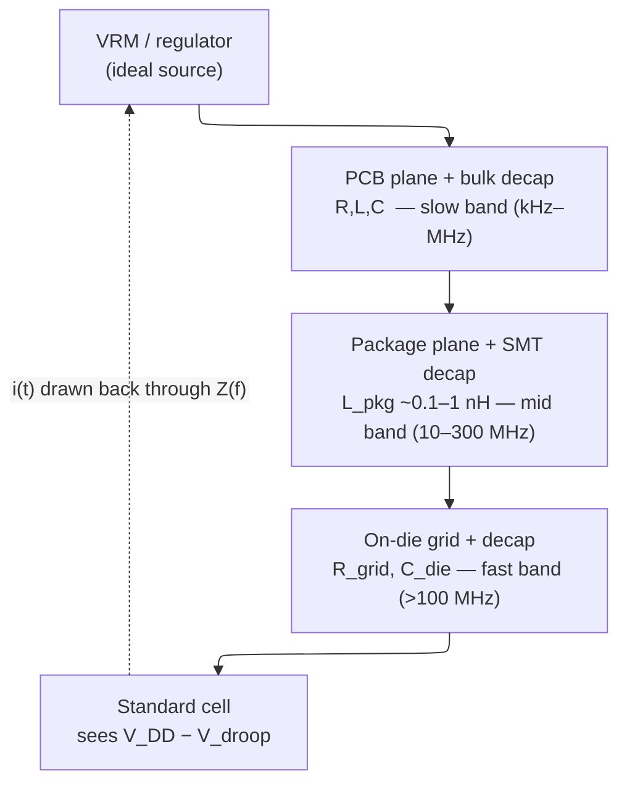

# Power and Power-Integrity Signoff — Proving Two Things Before Tapeout

> **Prerequisites:** [Power Fundamentals](01_Power_Fundamentals.md) (the total-power equation and the thermal/delivery/energy ceilings), [Block Activity and Power](02_Block_Activity_and_Power.md) (activity estimation, vectored versus vectorless analysis, and glitch power), [Low-Power Architecture](03_Low_Power_Architecture_and_Domain_Partitioning.md) (the modes, domains, and OPPs that define signoff views), [UPF/CPF Power Intent](05_UPF_and_CPF_Power_Intent.md) (the supplies, legal states, and special-cell strategies the final netlist must realize), [CMOS Fundamentals](../00_Fundamentals/01_CMOS_Fundamentals.md) §4 (switching energy and delay versus $V_{DD}$).
> **Hands off to:** [STA](../06_Signoff/01_STA.md) (owns timing; this page feeds it the IR-drop-derated voltage of §9), [Signal_Integrity_Reliability](../05_Backend_Physical_Design/02_Signal_Integrity_Reliability.md) (the PnR-side grid/decap/EM *models and fixing levers*; this page owns the *signoff criteria*), [Tapeout_and_Post_Silicon_Bringup](../07_Manufacturing_and_Bringup/03_Tapeout_and_Post_Silicon_Bringup.md) (the gate this page is the pass/fail for).

---

## 0. Why this page exists

Power signoff is the gate before tapeout, and it exists to **prove two independent claims about silicon you cannot yet measure**:

1. **Budget** — the chip's power fits its envelope. Average power must sit inside the thermal and battery budget; peak power must sit inside what the package and voltage regulator can source. This is a claim about *how much energy leaves the die*.
2. **Integrity** — the power-delivery network (PDN) actually delivers clean voltage to every transistor, all the time. This is a claim about *whether the volts arrive* — a spatial and temporal claim, not a scalar one.

These are genuinely different problems and they fail in different ways. A chip can be comfortably inside its power budget and still die because a single local voltage droop slowed one critical path past its clock. Conversely a chip with a flawless grid can cook itself because nobody summed the average watts against the cooling solution. Budget is answered by **power estimation** (§2–§3); integrity is answered by **IR-drop, decap, and electromigration analysis** (§4–§8). The whole page is organised around these two questions.

The two are coupled through one mechanism that makes power signoff inseparable from timing signoff: **a drooped $V_{DD}$ slows the cell it feeds**, so an integrity failure surfaces as a *timing* failure (§9). That coupling — current draw creates a voltage error, the voltage error creates a delay error — is the spine of this page. Everything else is how you quantify each link and where the design trade-offs sit: vectored vs vectorless activity (§2), grid density (§5), decap (§7), and how much guardband to stack (§10).

---

## 1. What signoff must prove, and why the accuracy ladder exists

Both proofs share a problem: they must be delivered *before* silicon exists, from a model whose fidelity improves as the design becomes more concrete. Every stage of the flow trades speed for accuracy, and the discipline is to run the *cheap, pessimistic* check early to catch gross problems and the *expensive, accurate* check at signoff to bless the real numbers.

| Stage | What is missing | Power error | Role |
|---|---|---|---|
| RTL estimation | no netlist, no wire capacitance, no glitch | ~20–30 % | early budgeting, architecture exploration |
| Gate-level (pre-route) | wire $C$ guessed from fanout (wireload) | ~10–15 % | post-synthesis power closure |
| Post-layout (signoff) | nothing — real extracted parasitics (SPEF) + real activity | ~3–5 % | the number you tape out on |

The accuracy jump from gate to post-layout is almost entirely **wire capacitance and real switching activity**: pre-route you are guessing the $C$ in $\alpha C V^2 f$ from fanout, and that guess can be 30–50 % off on long nets. Signoff runs on extracted parasitics and a representative activity trace precisely because those two unknowns dominate the error. The mechanics of *how the activity itself is obtained* — the probability algebra of vectorless propagation, the correlation that breaks it, glitch estimation — belong to [Block_Activity_and_Power](02_Block_Activity_and_Power.md); this page takes an activity file as input and asks what it lets you *prove*.

---

## 2. Estimating power for signoff: average vs peak, vectored vs vectorless

To bound the budget you need two different numbers, because the budget has two different ceilings.

**Average power answers the thermal and battery question.** Integrated over time it sets junction temperature ($T_j = T_a + P\,R_{th}$, §11) and drains the battery ($t_{batt}=E_{batt}/P_{avg}$). It is a time-*average*, so it can be computed from *aggregated* switching statistics — you never need to know *when* each toggle happened, only how many.

**Peak power answers the delivery question.** The worst instantaneous power over a short window sizes the regulator's current capability and, crucially, drives the *dynamic* IR-drop analysis of §6 — the worst-case droop happens at the worst-case current. Peak is a time-*resolved* quantity: it requires knowing the current waveform cycle by cycle.

That single distinction — aggregated vs time-resolved — is why the two activity formats exist and why you cannot substitute one for the other.

| Question | Metric | Activity input needed | Why |
|---|---|---|---|
| Thermal / battery | average power | **SAIF** (aggregated toggle counts) | only the total matters, not the timeline |
| Regulator / dynamic droop | peak power, power waveform | **VCD / FSDB** (per-transition, time-stamped) | droop is driven by $i(t)$ and $di/dt$ |

### 2.1 Vectored vs vectorless: the accuracy–coverage–effort triangle

The deeper choice is where the activity comes from at all, and it is a three-way trade between *accuracy*, *coverage of the input space*, and *effort*.

- **Vectored (simulation-driven).** Run a representative workload through simulation and record the real toggles — SAIF for average, VCD/FSDB for peak. **Accurate**, because it is measured, but only for *the workload you ran*, and gate-level simulation to get trustworthy glitch activity is slow and produces enormous traces. This is the signoff path.
- **Vectorless (probabilistic).** Assign a default toggle rate and static probability to the inputs and propagate them analytically through the netlist — no stimulus at all. **Fast and workload-independent**, so it covers the whole design cheaply and is ideal for early estimation and *pessimistic* worst-case bounding. But it is blind to everything data-dependent: it does not know an enable is usually off, that a state machine idles, or that a multiplier's operands are correlated, so it systematically *over*-estimates gated logic and mis-estimates datapaths.

The reconciling move is the **hybrid**: annotate real (vectored) activity on the blocks that matter — the CPU core, the busy datapaths, the clock-gating logic — and let vectorless defaults fill the rest, calibrating the default toggle rate against a few vector-based blocks first. This is standard signoff practice.

### 2.2 Annotation coverage: the quality metric that gates the watts

The single most important number attached to a power result is not the watts — it is the **annotation coverage**: the fraction of nets whose activity was actually back-annotated from simulation rather than defaulted or derived. A power number at 60 % coverage is a guess wearing a measurement's clothes, no matter how precise the SPEF and library data are. Signoff wants **> 80 %** coverage, and the reason it is a *concept* and not a checkbox is the **aggregate-coverage trap**: a headline 95 % overall can hide a 40 %-covered *critical* block, because the uncovered nets concentrate exactly where it hurts — a busy datapath, a renamed macro wrapper, the clock-gating cells whose power dominates dynamic. Never sign off on the top-level coverage alone; read it **per hierarchy**. The nets that most often go uncovered — scan/DFT logic held static in functional mode, generated/divided clocks not in the dumped scope, black-box IP with no RTL visibility, and RTL→gate name-mapping mismatches — are also the ones whose miscount swings the total most, because clock and clock-gating power is a large share of dynamic.

Test-mode (scan-shift) power is a *separate number entirely* — chains that look 0-activity in functional mode toggle massively during shift — and is signed off with its own vectors ([DFT_and_ATPG](../06_Signoff/02_DFT_and_ATPG.md)).

---

## 3. From estimate to budget: top-down allocation, bottom-up closure

Budgeting is a two-pass discipline. **Top-down**, the total power constraint (a mobile SoC's ~5 W TDP, a server's ~250 W) is allocated to subsystems from architectural estimates, leaving explicit margin:

| Subsystem | Budget | % of 5 W TDP |
|---|---|---|
| CPU cluster (4 cores) | 2.0 W | 40 % |
| GPU | 1.5 W | 30 % |
| Modem / memory / display / IO | 1.2 W | 24 % |
| Always-on + interconnect | 0.2 W | 4 % |
| Margin | 0.1 W | 2 % |

**Bottom-up**, once blocks exist you run §2's analysis per block and compare to the allocation; over-budget blocks trigger optimisation ([Power_Reduction_Techniques](04_Power_Reduction_Techniques.md)) and the budget is refined at each milestone (architecture → RTL → gate → post-layout). The subtlety signoff must respect is that the budget is **per power mode**, not a single number: active-max (gaming), active-typical, idle, and the sleep/retention states each have their own envelope and their own dominant term (dynamic when busy, leakage when idle). Battery life is then the mode-weighted integral, $t_{batt} = E_{batt}/\bar P$; a 19 Wh battery at 2 W typical gives ~9.5 h screen-on, at 50 mW light-sleep ~16 days standby. Composing per-block, per-mode power into a full chip with contention and DVFS layers is [Full_Chip_Modeling](../01_Architecture_and_PPA/04_SoC_and_Chiplet_Architecture/01_System_Modeling/01_Full_Chip_Modeling.md).

---

## 4. Power integrity as an impedance problem: the unifying model

Everything in §5–§8 is one idea seen at different frequencies. **The PDN is an impedance $Z(f)$ sitting between an ideal voltage source (the regulator) and the transistor.** Any current the chip draws, $i(t)$, develops a voltage error across that impedance, and the transistor sees $V_{DD}$ minus that error. Signoff's integrity job is to keep the error inside a budget at *every* frequency the chip can excite.

The voltage error has two physical terms, and which one dominates depends entirely on *how fast* the current changes:

$$
V_{droop} \;=\; \underbrace{I\,R}_{\text{resistive}} \;+\; \underbrace{L\,\dfrac{di}{dt}}_{\text{inductive}}
$$

where $I$ = current drawn (A), $R$ = PDN resistance ($\Omega$), $L$ = PDN loop inductance (H), $di/dt$ = rate of current change (A/s). The $IR$ term dominates slow/steady current — that is **static IR drop** (§5). The $L\,di/dt$ term dominates fast transients — the clock-edge surge that makes **dynamic IR drop** (§6) 2–3× worse than static.

### 4.1 The target-impedance formulation

Rather than chase droop, PDN design flips the problem: pick a **target impedance** the PDN must stay under across the whole band. If the worst current step is $I_{max}$ and the allowed ripple is a fraction of $V_{DD}$,

$$
Z_{target} \;=\; \frac{V_{DD}\cdot \text{ripple}\%}{I_{max}}
$$

where ripple% is the droop budget (typically 5–10 % of $V_{DD}$). For $V_{DD}=0.9$ V, 5 % ripple, $I_{max}=5$ A, $Z_{target} = 0.9\times0.05/5 = 9\ \text{m}\Omega$. The design intent is a **flat impedance profile**: keep $|Z(f)| < Z_{target}$ from DC up to the highest frequency the current can step at (the "knee," set by clock-edge and $di/dt$ event bandwidth, often ~ hundreds of MHz). Each stage of the PDN hierarchy — bulk PCB caps, package caps, on-die decap — is the piece that holds $Z$ down in one frequency band; the whole design is a staircase of decoupling stages, each taking over where the last runs out of bandwidth.

### 4.2 Why the profile is not flat: package–die anti-resonance

The catch is that the PDN is not a resistor — it is a ladder of $L$ and $C$ stages, and **every inductor–capacitor boundary is a resonant tank**. The package's series inductance $L_{pkg}$ resonating against the on-die decapacitance $C_{die}$ produces an *anti-resonant* impedance peak — the notorious **"first droop"**:

$$
f_{res} \;=\; \frac{1}{2\pi\sqrt{L_{pkg}\,C_{die}}}, \qquad |Z|_{peak}\approx \sqrt{\frac{L_{pkg}}{C_{die}}}\cdot\frac{1}{\zeta}
$$

where $\zeta$ is the damping ratio (low $\zeta$ = tall, sharp peak). With $L_{pkg}\sim0.1\text{–}1$ nH and $C_{die}\sim$ tens of nF this lands at **~50–300 MHz** — right in the band a burst of activity can excite. A current step whose frequency content hits $f_{res}$ rings the tank and produces a droop far larger than $I\!\cdot\!Z_{target}$ would predict. This is *why* $di/dt$ events (domain wake-up, a vector unit turning on, a large cluster clock-ungating, §11) are dangerous out of proportion to their average power: each is a load *step* that dumps energy straight into the resonance. The mitigations are the same two the whole page keeps returning to — **more/closer decap** to lower $|Z|_{peak}$ and raise/damp the resonance (§7), and **adaptive clocking / droop detectors** that stretch the clock when a droop is sensed. Below the package tank sit the slower board/VRM resonances (kHz–few MHz, the "third droop"); above it, the on-die response (the fast "first droop" proper). The droop budget is spent across all three:

$$
V_{guardband} \;\approx\; \underbrace{V_{static}}_{\sim3\text{–}5\%} + \underbrace{V_{dynamic}}_{\sim5\text{–}10\%} \;\Rightarrow\; \text{total } \sim10\text{–}15\%\ \text{of } V_{DD}
$$

---

## 5. Static IR drop: the resistive floor

Static IR drop is the $IR$ term alone, evaluated at **average** current — a pure DC resistive-network analysis. It answers "does the grid have enough copper to carry the steady current without dropping too much voltage?" Model the grid as a resistor mesh (top-metal rings feeding progressively finer stripes down to the M1 cell rails, via arrays at each layer transition), inject a current source at each cell location from average-power analysis, and solve the linear system

$$
G\,\mathbf{v} = \mathbf{i} \quad\Longrightarrow\quad \mathbf{v} = G^{-1}\mathbf{i}
$$

where $G$ = grid conductance matrix (sparse), $\mathbf{i}$ = per-node average current, $\mathbf{v}$ = per-node voltage. The signoff criterion is **static drop < 5 % of $V_{DD}$** (aggressive shops: < 3 %) — 45 mV (or 27 mV) on a 0.9 V supply.

### 5.1 The grid-density trade-off

The lever against static drop is grid metal: wider stripes and a denser pitch lower $R$ (parallel resistors) and simultaneously improve EM margin (lower current density, §8). But grid metal is *stolen from signal routing*, and this is the central power-integrity trade-off in the floorplan:

| Denser / wider power grid | |
|---|---|
| [+] lower $R$ → less IR drop; lower $J$ → better EM | |
| [−] fewer routing tracks for signals → congestion, longer wires, more coupling | |
| [−] diminishing returns once on-die $R$ falls below package + via $R$ | |

The knee is quantitative: adding stripe metal only helps while the **on-die grid resistance dominates** the path. Once $R_{grid}$ has been driven below the fixed $R_{package}+R_{via}$ upstream of it, halving $R_{grid}$ again barely moves the total drop, but it keeps costing routing tracks linearly. Real designs therefore dedicate ~5–10 % of each metal layer to power, put the bulk of the current-carrying metal on the top 2–3 (thickest, lowest-$R$) layers, and stop densifying the lower mesh once it is no longer the bottleneck. **Backside power delivery** (§11) is the structural escape: it moves the grid off the signal layers entirely, cutting IR drop ~30–50 % *and* freeing routing tracks at once — which is why leading nodes adopted it.

---

## 6. Dynamic IR drop: the transient that actually fails silicon

Passing static IR drop is necessary but not sufficient, because the current is not steady — it spikes. **At every clock edge, all the flip-flops in a region sample simultaneously**, creating a near-instantaneous current demand:

$$
I_{peak} \;=\; N_{sw}\cdot C_{FF}\cdot V_{DD}\cdot f_{local}
$$

where $N_{sw}$ = flops switching this edge, $C_{FF}$ = per-flop switched capacitance, $f_{local}$ = local toggle rate. A region of 10 K flops at 30 % activity, 20 fF each, switching in a 0.5 ns half-period draws ~**108 mA locally in one edge**. That current slams through the full PDN impedance, so the droop is the *complete* $V_{droop}=IR+L\,di/dt$ — and because the edge is fast, the $L\,di/dt$ term can be **2–3× the $IR$ term**, which is why dynamic droop (peaks of 100–150 mV, 15 %+) dwarfs static (30–40 mV). Worse, a burst that recurs near $f_{res}$ (§4.2) rings the package tank and stacks droop cycle over cycle.

The signoff criterion is **dynamic drop < 10 % of $V_{DD}$** (some high-performance parts < 8 %). Exceeding it fails silicon three ways, in order of severity: the drooped cells slow down and miss setup (**timing failure**, §9 — by far the common case), the drop crosses a noise margin and a value flips (**functional failure**), and the recovery overshoot stresses oxides (**reliability**). Because dynamic analysis is driven by $i(t)$, it *requires* time-resolved activity (VCD/FSDB) over a **worst-case window** — found either from emulation of a real workload or from a synthetic power-virus vector that maximises simultaneous switching.

---

## 7. Decap: the on-chip charge reservoir and its cost

Decoupling capacitance is the direct attack on dynamic droop and on the resonant peak of §4.2. The concept is a **local charge reservoir**: a capacitor placed next to the switching logic supplies the transient current *before* the slower, more inductive upstream PDN can respond, holding the local node up. In impedance terms decap is what pulls $|Z(f)|$ down in the high-frequency band and damps the package tank.

Sizing follows straight from charge conservation — the reservoir must supply the transient charge without drooping more than the budget:

$$
C_{decap} \;\ge\; \frac{I_{peak}\cdot \Delta t}{\Delta V}
$$

where $I_{peak}$ = transient current, $\Delta t$ = its duration before upstream PDN takes over, $\Delta V$ = allowed local droop. A 200 mA, 200 ps transient held to 50 mV needs $C = 200\text{m}\times200\text{p}/50\text{m} = 800$ pF; at an on-die density of ~1–5 nF/mm² that is ~0.2–0.4 mm² of silicon *for one region*. That area is the whole trade:

| Adding decap | |
|---|---|
| [+] suppresses dynamic droop; lowers and damps $|Z|_{peak}$ at $f_{res}$ | |
| [−] **area** — 5–15 % of cell count is routine, pure overhead | |
| [−] **leakage** — thin-oxide MOS-cap decap leaks through the gate; it burns standby power *forever* to buy droop margin you need only during transients |

The leakage cost makes decap a real optimisation, not a free filler: you place it **where the droop map is worst and next to known $di/dt$ aggressors**, not uniformly. The technology menu trades leakage against density — cheap MOS-cap (filler cells, leaky), MIM caps in upper metal (low leakage, moderate density), and deep-trench or backside caps (high density) — and each covers a frequency band alongside the package and PCB caps above it. The design target is the *minimum* decap that meets the droop budget across the resonance, because every extra farad is standing leakage.

---

## 8. Electromigration: the current-density reliability limit

EM is a different kind of failure from IR drop and must not be confused with it. IR drop asks *is the voltage right, right now*; EM asks *will this wire still be intact in ten years*. Under high current density, momentum transfer from conducting electrons physically drags metal atoms downstream, thinning the wire toward an open (or piling hillocks toward a short). It is a slow wear-out, and it is governed by **Black's equation**:

$$
MTTF \;=\; A\,J^{-n}\,\exp\!\left(\frac{E_a}{kT}\right)
$$

where MTTF = mean time to failure, $A$ = process constant, $J$ = current density (A/cm²), $n$ = current-density exponent (1–2; ~2 for bulk EM), $E_a$ = activation energy (0.7–0.9 eV for Cu), $k$ = Boltzmann's constant ($8.617\times10^{-5}$ eV/K), $T$ = absolute temperature. The equation is the whole design story: lifetime falls as a *power law* in current density and *exponentially* in temperature.

**The current-density design rule** falls straight out. Fix a maximum $J$ for the target lifetime and the minimum wire cross-section follows:

$$
w_{min} \;=\; \frac{I}{J_{max}\cdot t_{metal}}
$$

where $w_{min}$ = required width, $t_{metal}$ = metal thickness. A 10 mA average through a 400 nm-thick M5 stripe at $J_{max}=2$ MA/cm² needs ~1.25 mm of width — i.e. a single narrow stripe *cannot* legally carry it, forcing many parallel stripes. This is the same physics that rewards the wide top-metal power straps of §5, and it couples EM directly to the grid-density trade-off.

**Temperature is the sharp knob.** From the exponential, $MTTF(85°\text{C})/MTTF(105°\text{C}) \approx e^{E_a/k}(1/358-1/378) \approx 3.3\times$ for $E_a=0.7$ eV — a 20 °C rise roughly *halves* lifetime. This is why EM is signed off at the *hottest* junction corner, and why EM and thermal signoff (§11) are coupled: the self-heating of a high-current wire raises its own $T$ and accelerates its own failure. Signoff targets **> 10-year lifetime at 105 °C**, with the AC limit ~2× the DC limit (bidirectional current partially self-heals). At advanced nodes thinner wires push $J$ up and grain-boundary scattering pushes Cu resistivity up together, tightening the constraint — mitigated by cobalt caps, ruthenium liners, and again **backside power delivery**, which moves the highest-current wires off the congested signal stack.

---

## 9. Where integrity meets timing: voltage-aware STA

This is the section that fuses the two halves of the page into one loop, and the reason power signoff cannot be done in isolation from [STA](../06_Signoff/01_STA.md). A cell's delay rises as its supply falls, because a lower overdrive $(V_{DD}-V_{th})$ charges the load more slowly:

$$
\frac{dT_d}{dV_{DD}} \;\approx\; -\frac{T_d}{\,V_{DD}-V_{th}\,}
$$

where $T_d$ = cell delay. For $V_{DD}=0.9$ V, $V_{th}=0.3$ V, the sensitivity is $1/(900-300)=0.167\,\%/\text{mV}$: a **50 mV droop slows the cell ~8.3 %**, which on a 500 ps critical path is ~42 ps of extra delay — enough to blow a setup check outright. So an integrity problem (§6) *is* a timing problem, and the droop budget of §4.2 is really being spent to protect the timing margin.

There are two ways to account for it, and the choice is a direct **margin-vs-accuracy** trade:

- **Blanket voltage guardband.** Assume every cell sees the worst-case droop and sign off timing at that lowered $V_{DD}$. Simple, but pessimistic *everywhere*: the guardband voltage is dropped over the whole die even though only a few regions actually droop that far, and — since it forces a higher nominal $V_{DD}$ to compensate — it costs $\propto V^2$ dynamic power *always*.
- **IR-aware (voltage-aware) STA.** Run IR-drop analysis to get a *per-instance* voltage map, feed it back to the timer, and let each cell's delay be computed at the voltage it actually sees. The pessimism collapses to reality: only the genuinely drooped paths pay, and the recovered margin can be spent as frequency or lower nominal $V_{DD}$.

This closes the loop opened in §0: current → voltage error (§4–§6) → delay error (here) → timing signoff. The crosstalk/SI side of that delay error, and the mechanics of the timing check itself, live in [STA](../06_Signoff/01_STA.md); this page owns only the *voltage* that STA derates against.

---

## 10. Signoff corners, criteria, and the margin-vs-pessimism trade

Both proofs must hold across the PVT (process, voltage, temperature) corners, and different corners stress different checks — the skill is knowing which corner is the *worst case for each specific claim*, not running everything everywhere.

| Check | Worst-case corner | Why |
|---|---|---|
| Leakage / thermal runaway | FF, max $V$, 125 °C | leakage is exponential in $T$ and worst at fast/hot |
| Dynamic power / IR droop | high-activity vector, nominal $V$, hot | peak $\alpha$ and peak current |
| EM lifetime | hottest junction, real current | MTTF is exponential in $T$ (§8) |
| Timing under droop | slow, low $V$, with IR-derate | least overdrive → slowest cell (§9) |

The signoff criteria table is compact and load-bearing:

| Criterion | Spec |
|---|---|
| Static IR drop | < 5 % $V_{DD}$ |
| Dynamic IR drop | < 10 % $V_{DD}$ |
| EM lifetime | > 10 years at 105 °C |
| Average power | within per-domain and total budget |
| Peak power | within package / regulator source capability |

**The margin-vs-pessimism trade is itself a signoff decision.** Each guardband — worst-case activity, worst PVT corner, worst-case droop, on-chip-variation derate, aging — is individually defensible, but *stacking* them multiplies conservatism, and the product is silicon that is over-designed: it burns area on decap and grid it does not need, ships at a lower frequency than it could, or carries a higher nominal $V_{DD}$ than reality requires. Since dynamic power scales as $V^2$, roughly $dP/P \approx 2\,dV/V$ — **every 1 % of stacked voltage guardband is ~2 % of dynamic power burned everywhere, always**. The lever against it is *realism*: vector-based (not vectorless) activity so the droop input is not pessimistically high, IR-aware STA (§9) instead of a blanket guardband, and statistical rather than worst-case corner composition. The engineering judgement is exactly how much of that pessimism to buy back against the risk of a model that was optimistic — which is why signoff margin is negotiated, not fixed.

---

## 11. Thermal, di/dt events, and backside power at signoff

Three remaining signoff concerns round out the two proofs; each is treated compactly here because its physics lives elsewhere.

**Thermal — the envelope behind the average number.** Average power (§2) only matters because it becomes heat: $T_j = T_a + P\,R_{th,ja}$, where $R_{th,ja}$ (junction-to-ambient) runs ~30–60 °C/W bare-die down to ~0.5–2 °C/W liquid-cooled. This is why **peak power is not sustainable power** — a 5 W mobile part with $R_{th}=40$ °C/W at 45 °C ambient would reach 245 °C in steady state, so it must throttle to ~1.4 W sustained and spend its 5 W only in short thermal-transient bursts. Signoff must also confirm a **stable thermal operating point exists**: because leakage rises ~2× per 10 °C, the dissipation curve $P(T)$ is convex, and if it is steeper than the linear heat-removal $Q(T)=(T-T_a)/R_{th}$ at their intersection the loop runs away and destroys the chip. That stability check, and the DTM throttling policy (DVFS governor → OPP caps → emergency shutdown with hysteresis) that keeps the chip inside the envelope, is developed in [Power_Fundamentals](01_Power_Fundamentals.md) (the ceilings) with implementation-side thermal mapping in [Signal_Integrity_Reliability](../05_Backend_Physical_Design/02_Signal_Integrity_Reliability.md).

**$di/dt$ events — the peak that average-power signoff misses.** A domain waking (rush current), a vector unit turning on, or a large cluster clock-ungating is a *load step* that excites the ~50–300 MHz package resonance (§4.2). Signoff checks that the peak droop under each such step stays in budget *with* the mitigation modelled (decap + adaptive clocking), that the current ramp is within the PMIC's slew capability, and that the burst profile causes no EM overstress. The package-side PDN model these steps ring against belongs to [IC_Packaging](../07_Manufacturing_and_Bringup/02_IC_Packaging.md).

**Backside power delivery — what changes for the signoff engineer.** With power moved to the wafer backside (Intel 18A PowerVia in volume 2025; TSMC A16 Super Power Rail 2026), the IR-drop topology changes fundamentally: drop is now dominated by the short, fat backside vias and the nano-TSV interface rather than the M1–M3 weave, extraction needs new backside-metal tech files, and — because the silicon between devices and the backside grid is thinned — heat paths change and **thermal and IR signoff become more tightly coupled**. The delivery-ceiling motivation for the shift is in [Power_Fundamentals](01_Power_Fundamentals.md).

---

## Numbers to memorize

| Quantity | Value | Why it matters (section) |
|---|---|---|
| Dynamic power | $P=\alpha C V_{DD}^2 f$ | quadratic in $V$ — the guardband cost lever (§10) |
| Leakage power | $P=I_{leak}V_{DD}$, ~2×/10 °C | dominates idle; drives thermal runaway (§11) |
| PDN droop | $V_{droop}=IR + L\,di/dt$ | $L\,di/dt$ is 2–3× the $IR$ term on fast edges (§4, §6) |
| Target impedance | $Z_{target}=V_{DD}\cdot\text{ripple}\%/I_{max}$ | e.g. 9–10 mΩ; keep $|Z(f)|$ under it to the knee (§4) |
| First-droop resonance | $f_{res}=1/(2\pi\sqrt{L_{pkg}C_{die}})\approx$ 50–300 MHz | package–die anti-resonance $di/dt$ events excite (§4, §11) |
| Static IR-drop budget | < 5 % $V_{DD}$ (aggressive < 3 %) | average current; exceed → timing (§5) |
| Dynamic IR-drop budget | < 10 % $V_{DD}$ (some < 8 %) | clock-edge transient; fixed by decap (§6) |
| Total droop guardband | ~10–15 % $V_{DD}$ | static + dynamic split (§4.2) |
| Delay sensitivity to droop | ~0.167 %/mV → 50 mV ≈ 8 % slower | couples integrity to timing (§9) |
| Decap sizing | $C \ge I\,\Delta t/\Delta V$ | on-die ~1–5 nF/mm², 5–15 % of cells (§7) |
| Black's equation | $MTTF=A\,J^{-n}e^{E_a/kT}$, $n$=1–2, $E_a$=0.7–0.9 eV | power-law in $J$, exponential in $T$ (§8) |
| EM lifetime target | > 10 yr at 105 °C; AC limit ~2× DC | 20 °C rise ≈ halves life (§8) |
| Cu DC current-density limit | ~1–3 MA/cm² at 105 °C | sets minimum wire width (§8) |
| Annotation coverage for signoff | > 80 %, checked *per hierarchy* | a low-coverage watt is a guess (§2.2) |
| Estimation accuracy vs silicon | vectorless ±20–30 %, PTPX ±10–15 %, Voltus/RedHawk ±5–10 % | fidelity ladder (§1) |
| Clock power fraction | 30–50 % of dynamic | why clock nets dominate coverage risk (§2.2) |
| Typical TDP | mobile 2–15 W · desktop 65–250 W · AI accel 300–1000 W | sets total budget (§3) |
| Power-density ceiling | ~100 W/cm² air · ~300 W/cm² liquid | thermal envelope (§11) |
| Junction temperature | $T_j=T_a+P\,R_{th,ja}$ | peak ≠ sustainable → throttle (§11) |

---

## Cross-references

- **Down the stack (what signoff is built from):** [Power_Fundamentals](01_Power_Fundamentals.md) (the total-power equation and the thermal/delivery/energy ceilings §2–§3 and §11 check against), [Block_Activity_and_Power](02_Block_Activity_and_Power.md) (the vectored/vectorless activity and glitch estimation feeding §2 — the $\alpha$ this page consumes), [CMOS_Fundamentals](../00_Fundamentals/01_CMOS_Fundamentals.md) (the $\tfrac12CV^2$ per transition and the delay-vs-$V_{DD}$ physics behind §9), [Signal_Integrity_Reliability](../05_Backend_Physical_Design/02_Signal_Integrity_Reliability.md) (the PnR-side grid/decap/EM *models and fixing levers*; this page owns the *signoff criteria*).
- **Up the stack (what consumes signoff):** [STA](../06_Signoff/01_STA.md) (the timing side — takes §9's IR-derated per-instance voltage; owns crosstalk/OCV), [Physical_Design](../05_Backend_Physical_Design/01_Physical_Design.md) (implements the grid and decap decisions of §5/§7), [IC_Packaging](../07_Manufacturing_and_Bringup/02_IC_Packaging.md) (the package PDN and resonance of §4/§11), [Tapeout_and_Post_Silicon_Bringup](../07_Manufacturing_and_Bringup/03_Tapeout_and_Post_Silicon_Bringup.md) (the tapeout gate this page passes), [Full_Chip_Modeling](../01_Architecture_and_PPA/04_SoC_and_Chiplet_Architecture/01_System_Modeling/01_Full_Chip_Modeling.md) (composes the §3 budget across the chip).
- **Adjacent:** [Power_Reduction_Techniques](04_Power_Reduction_Techniques.md) (what you *do* when a check fails — clock gating, DVFS, multi-$V_t$), [UPF/CPF Power Intent](05_UPF_and_CPF_Power_Intent.md) (the power domains and states §10's multi-mode analysis exercises), [DFT_and_ATPG](../06_Signoff/02_DFT_and_ATPG.md) (scan-shift power — the separate test-mode number of §2.2).
