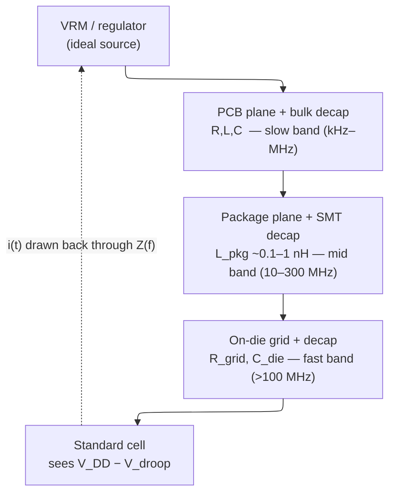
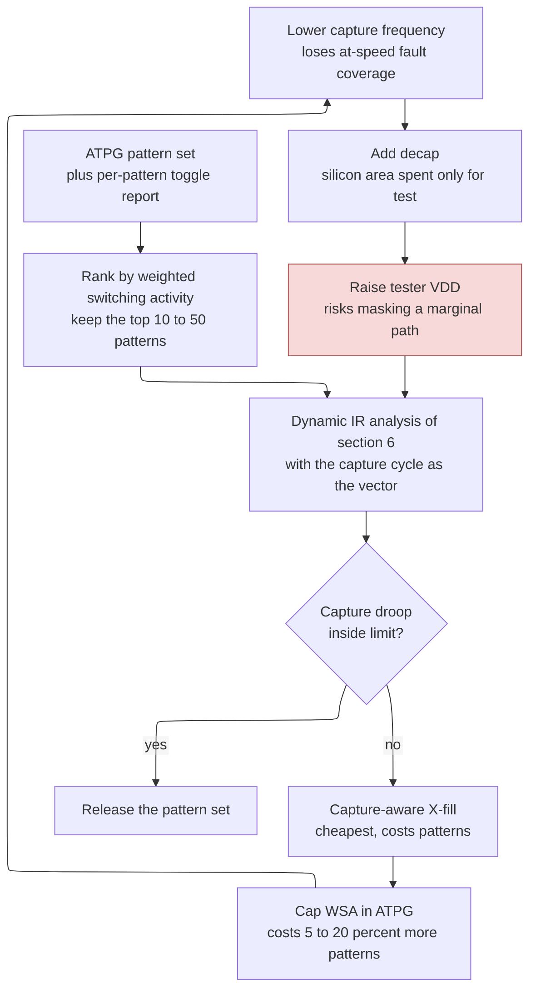

# Power and Power-Integrity Signoff — Proving Two Things Before Tapeout

> **Prerequisites:** [Power Fundamentals](01_Power_Fundamentals.md) (the total-power equation and the thermal/delivery/energy ceilings), [Block Activity and Power](02_Block_Activity_and_Power.md) (activity estimation, vectored versus vectorless analysis, and glitch power), [Low-Power Architecture](03_Low_Power_Architecture_and_Domain_Partitioning.md) (the modes, domains, operating performance points, and per-rail regulator choices that define signoff views), [UPF/CPF Power Intent](05_UPF_and_CPF_Power_Intent.md) (the supplies, legal states, and special-cell strategies the final netlist must realize), [CMOS Fundamentals](../00_Fundamentals/01_CMOS_Fundamentals.md) §4 (switching energy and delay versus $V_{DD}$).
> **Hands off to:** [STA](../06_Signoff/01_STA.md) (owns timing; this page feeds it the IR-drop-derated voltage of §9), [Signal_Integrity_Reliability](../05_Backend_Physical_Design/02_Signal_Integrity_Reliability.md) (the PnR-side grid/decap/EM *models and fixing levers*; this page owns the *signoff criteria*), [Runtime_Power_Management](08_Runtime_Power_Management_and_Adaptive_Voltage_Frequency.md) (takes §11's sustained-power and $T_{j,max}$ analysis and turns it into throttling *policy*), [DFT_and_ATPG](../06_Signoff/02_DFT_and_ATPG.md) (takes §12's shift and capture power limits as constraints on pattern generation), [Tapeout_and_Post_Silicon_Bringup](../07_Manufacturing_and_Bringup/03_Tapeout_and_Post_Silicon_Bringup.md) (the gate this page is the pass/fail for).

---

## 0. Why this page exists

Power signoff is the gate before tapeout, and it exists to **prove two independent claims about silicon you cannot yet measure**:

1. **Budget** — the chip's power fits its envelope. Average power must sit inside the thermal and battery budget; peak power must sit inside what the package and voltage regulator can source. This is a claim about *how much energy leaves the die*.
2. **Integrity** — the power-delivery network (PDN) actually delivers clean voltage to every transistor, all the time. This is a claim about *whether the volts arrive* — a spatial and temporal claim, not a scalar one.

These are genuinely different problems and they fail in different ways. A chip can be comfortably inside its power budget and still die because a single local voltage droop slowed one critical path past its clock. Conversely a chip with a flawless grid can cook itself because nobody summed the average watts against the cooling solution. Budget is answered by **power estimation** (§2–§3); integrity is answered by **IR-drop, decap, and electromigration analysis** (§4–§8). The whole page is organised around these two questions.

The two are coupled through one mechanism that makes power signoff inseparable from timing signoff: **a drooped $V_{DD}$ slows the cell it feeds**, so an integrity failure surfaces as a *timing* failure (§9). That coupling — current draw creates a voltage error, the voltage error creates a delay error — is the spine of this page. Everything else is how you quantify each link and where the design trade-offs sit: vectored vs vectorless activity (§2), grid density (§5), decap (§7), and how much guardband to stack (§10).

---

## 1. What signoff must prove, and why the accuracy ladder exists

Both proofs share a problem: they must be delivered *before* silicon exists, from a model whose fidelity improves as the design becomes more concrete. Every stage of the flow trades speed for accuracy, and the discipline is to run the *cheap, pessimistic* check early to catch gross problems and the *expensive, accurate* check at signoff to bless the real numbers.

**The ladder is keyed to design stage, not to tool.** This matters because tool vendors sell accuracy claims and it is tempting to write "tool X is ±10 %"; a tool is only as accurate as the stage's inputs allow. The same engine run pre-route and post-route gives two different accuracies, and two different engines run at the same stage give nearly the same one. Tool names below are *examples of a stage*, never a second axis.

| Stage | What is missing at this stage | Accuracy vs silicon | Role | Typical tools |
|---|---|---|---|---|
| Architectural / spreadsheet | everything — no RTL, activity from analogy to a previous chip | **±20–30 %** | is the product thermally possible at all | spreadsheet, in-house model |
| RTL, vectorless | no netlist, no wire $C$, no glitch; activity is propagated probability | **±15–25 %** | early budgeting, architecture exploration | RTL power estimators |
| RTL, vectored with good annotation | no netlist or wire $C$, but activity is measured | **±10–20 %** | catching a mis-budgeted block before synthesis | RTL power + SAIF/FSDB |
| Gate-level, pre-route | wire $C$ guessed from fanout (wireload model) | **±10–15 %** | post-synthesis power closure | PrimePower/PTPX-class |
| Post-layout signoff with extracted parasitics | nothing structural — real SPEF, real annotated activity | **±5–10 %** | the number you tape out on | Voltus / RedHawk-class |

The accuracy jump from gate to post-layout is almost entirely **wire capacitance and real switching activity**: pre-route you are guessing the $C$ in $\alpha C V^2 f$ from fanout, and that guess can be 30–50 % off on long nets. Signoff runs on extracted parasitics — delivered in **SPEF (Standard Parasitic Exchange Format)** — and a representative activity trace precisely because those two unknowns dominate the error. Note also what the ladder does *not* say: no stage claims ±3 %. The residual 5–10 % at signoff is silicon process spread plus the workload you did not run, and no amount of tool licence buys it back. The mechanics of *how the activity itself is obtained* — the probability algebra of vectorless propagation, the correlation that breaks it, glitch estimation — belong to [Block_Activity_and_Power](02_Block_Activity_and_Power.md); this page takes an activity file as input and asks what it lets you *prove*.

---

## 2. Estimating power for signoff: average vs peak, vectored vs vectorless

To bound the budget you need two different numbers, because the budget has two different ceilings.

**Average power answers the thermal and battery question.** Integrated over time it sets junction temperature ($T_j = T_a + P\,R_{th}$, §11) and drains the battery ($t_{batt}=E_{batt}/P_{avg}$). It is a time-*average*, so it can be computed from *aggregated* switching statistics — you never need to know *when* each toggle happened, only how many.

**Peak power answers the delivery question.** The worst instantaneous power over a short window sizes the regulator's current capability and, crucially, drives the *dynamic* IR-drop analysis of §6 — the worst-case droop happens at the worst-case current. Peak is a time-*resolved* quantity: it requires knowing the current waveform cycle by cycle.

That single distinction — aggregated vs time-resolved — is why the two activity formats exist and why you cannot substitute one for the other.

| Question | Metric | Activity input needed | Why |
|---|---|---|---|
| Thermal / battery | average power | **SAIF (Switching Activity Interchange Format)** — aggregated toggle counts | only the total matters, not the timeline |
| Regulator / dynamic droop | peak power, power waveform | **VCD (Value Change Dump)** or **FSDB (Fast Signal Database)** — per-transition, time-stamped | droop is driven by $i(t)$ and $di/dt$ |

### 2.1 Vectored vs vectorless: the accuracy–coverage–effort triangle

The deeper choice is where the activity comes from at all, and it is a three-way trade between *accuracy*, *coverage of the input space*, and *effort*.

- **Vectored (simulation-driven).** Run a representative workload through simulation and record the real toggles — SAIF for average, VCD/FSDB for peak. **Accurate**, because it is measured, but only for *the workload you ran*, and gate-level simulation to get trustworthy glitch activity is slow and produces enormous traces. This is the signoff path.
- **Vectorless (probabilistic).** Assign a default toggle rate and static probability to the inputs and propagate them analytically through the netlist — no stimulus at all. **Fast and workload-independent**, so it covers the whole design cheaply and is ideal for early estimation and *pessimistic* worst-case bounding. But it is blind to everything data-dependent: it does not know an enable is usually off, that a state machine idles, or that a multiplier's operands are correlated, so it systematically *over*-estimates gated logic and mis-estimates datapaths.

The reconciling move is the **hybrid**: annotate real (vectored) activity on the blocks that matter — the CPU core, the busy datapaths, the clock-gating logic — and let vectorless defaults fill the rest, calibrating the default toggle rate against a few vector-based blocks first. This is standard signoff practice.

### 2.2 Annotation coverage: the quality metric that gates the watts

The single most important number attached to a power result is not the watts — it is the **annotation coverage**: the fraction of nets whose activity was actually back-annotated from simulation rather than defaulted or derived. A power number at 60 % coverage is a guess wearing a measurement's clothes, no matter how precise the SPEF and library data are. Signoff wants **> 80 %** coverage, and the reason it is a *concept* and not a checkbox is the **aggregate-coverage trap**: a headline 95 % overall can hide a 40 %-covered *critical* block, because the uncovered nets concentrate exactly where it hurts — a busy datapath, a renamed macro wrapper, the clock-gating cells whose power dominates dynamic. Never sign off on the top-level coverage alone; read it **per hierarchy**. The nets that most often go uncovered — scan/DFT logic held static in functional mode, generated/divided clocks not in the dumped scope, black-box IP with no RTL visibility, and RTL→gate name-mapping mismatches — are also the ones whose miscount swings the total most, because clock and clock-gating power is a large share of dynamic.

Test-mode power is a *separate number entirely* — chains that look 0-activity in functional mode toggle massively during shift — with its own vectors, its own limits, and its own failure modes. It is not a footnote to functional signoff; it is §12.

---

## 3. From estimate to budget: top-down allocation, bottom-up closure

Budgeting is a two-pass discipline. **Top-down**, the total power constraint — a mobile SoC's ~5 W **TDP (thermal design power**, the sustained dissipation the cooling solution is built for), a server's ~250 W — is allocated to subsystems from architectural estimates, leaving explicit margin:

| Subsystem | Budget | % of 5 W TDP |
|---|---|---|
| CPU cluster (4 cores) | 2.0 W | 40 % |
| GPU | 1.5 W | 30 % |
| Modem / memory / display / IO | 1.2 W | 24 % |
| Always-on + interconnect | 0.2 W | 4 % |
| Margin | 0.1 W | 2 % |

**Bottom-up**, once blocks exist you run §2's analysis per block and compare to the allocation; over-budget blocks trigger optimisation ([Power_Reduction_Techniques](04_Power_Reduction_Techniques.md)) and the budget is refined at each milestone (architecture → RTL → gate → post-layout). The subtlety signoff must respect is that the budget is **per power mode**, not a single number: active-max (gaming), active-typical, idle, and the sleep/retention states each have their own envelope and their own dominant term (dynamic when busy, leakage when idle). Battery life is then the mode-weighted integral, $t_{batt} = E_{batt}/\bar P$; a 19 Wh battery at 2 W typical gives ~9.5 h screen-on, at 50 mW light-sleep ~16 days standby. Composing per-block, per-mode power into a full chip with contention and DVFS layers is [Full_Chip_Modeling](../01_Architecture_and_PPA/04_SoC_and_Chiplet_Architecture/01_System_Modeling/01_Full_Chip_Modeling.md).

### 3.1 The other ceiling: peak power, the simultaneous-switching factor, and regulator sizing

Everything above is averages, and averages answer only one of §2's two questions. §2 said peak power "sizes the regulator's current capability" — so produce the number. The budget table has no peak column and cannot get one until three things are defined: *which window* the peak is measured over, *what fraction of the block switches together* in that window, and *who is expected to supply* the resulting current.

**Start with the observation that makes peak non-trivial: charge is not delivered uniformly.** Average-power analysis takes the cycle's charge $Q_{cyc}$ and smears it over $T_{clk}$. The real current is a spike at each clock edge — every flop in the region samples at once — plus a decaying tail as the combinational cone settles. Define the **simultaneous-switching factor** $\sigma$ as the fraction of the cycle's charge drawn inside the edge window $\Delta t_{edge}$:

$$
\sigma \;=\; \frac{Q_{edge}}{Q_{cyc}}, \qquad
I_{avg} = \frac{Q_{cyc}}{T_{clk}}, \qquad
I_{peak} = \frac{\sigma\,Q_{cyc}}{\Delta t_{edge}}
$$

Divide the last two and the whole thing collapses to one dimensionless number, the **crest factor**:

$$
k \;\equiv\; \frac{I_{peak}}{I_{avg}} \;=\; \sigma\cdot\frac{T_{clk}}{\Delta t_{edge}}
$$

This is worth staring at. The crest factor is a product of *what fraction switches together* and *how much shorter the switching window is than the cycle*. Neither factor alone tells you anything: a block where everything switches together ($\sigma \to 1$) but does so lazily over the whole cycle has $k=1$; a block where 5 % switches together in a 1 % window has $k=5$.

**Work a concrete block.** A CPU core: 200 K flops, $C_{FF}=18$ fF each (clock pin plus internal nodes), sequential activity 0.25 per edge, $f_{clk}=1.2$ GHz so $T_{clk}=833$ ps, edge window $\Delta t_{edge}=120$ ps, $V_{DD}=0.9$ V. The combinational logic contributes 1.6× the sequential charge, spread across the rest of the cycle.

$$
Q_{edge} = 0.25\times200{,}000\times18\ \text{fF}\times0.9\ \text{V} = 50{,}000\times16.2\ \text{fC} = 810\ \text{pC}
$$
$$
Q_{cyc} = 810\ \text{pC}\times(1+1.6) = 2106\ \text{pC}
\;\Longrightarrow\;
\sigma = \frac{810}{2106} = 0.385
$$
$$
I_{avg} = 2106\ \text{pC}\times1.2\ \text{GHz} = 2.53\ \text{A},\qquad P_{avg}=0.9\times2.53 = \mathbf{2.27\ W}
$$
$$
I_{peak} = \frac{810\ \text{pC}}{120\ \text{ps}} = \mathbf{6.75\ A},\qquad P_{peak}=0.9\times6.75 = \mathbf{6.1\ W}
$$

Check against the closed form: $k = 0.385\times833/120 = 2.67$, and $6.75/2.53 = 2.67$. **The peak/average ratio is 2.67× and the peak power is 6.1 W against a 2.27 W average.** A budget table that lists 2.27 W and stops has hidden a 6.1 W event.

**Now the question the number exists to answer: who supplies 6.75 A?** Not the regulator — and this is the single most important idea in the section. A peak is meaningless without its window, and each window has a *different* supplier, because each supplier has a different response time (§4.3, §7.1):

| Window | What draws it | Who must actually source it | This core rail |
|---|---|---|---|
| 50–200 ps — one clock edge | simultaneous flop and clock-buffer switching | **on-die decap only** — nothing upstream can move this fast | 6.75 A, 2.67× the average |
| 10 ns – 1 µs — a burst of high-activity cycles | a workload phase, or a power virus | package decap, then the VRM | ~1.4× the workload average |
| 10 µs – ms — a mode change, all cores ungating | DVFS step, domain wake, thermal release | **the VRM's rated current** | the sustained maximum |

So the 6.75 A number does not size the regulator. It sizes the **decap** — and it does so through the reservoir equation of §7:

$$
C_{decap} \ge \frac{I_{peak}\,\Delta t_{edge}}{\Delta V} = \frac{6.75\ \text{A}\times120\ \text{ps}}{45\ \text{mV}} = \frac{810\ \text{pC}}{45\ \text{mV}} = \mathbf{18\ nF}
$$

which lands squarely inside the 10–50 nF $C_{die}$ range §4.2 assumed for the anti-resonance — the two sections were describing the same capacitor from opposite ends, and now they agree numerically.

**Size the regulator from the sustained number instead.** The relevant input is not the clock-edge spike but the highest current the rail can hold for longer than the decap hierarchy can cover. That is what a **power virus** — a synthetic stimulus constructed to maximize simultaneous switching for many consecutive cycles — is *for*; its construction (how you find or generate the vector) belongs to [Block_Activity_and_Power](02_Block_Activity_and_Power.md), and this page consumes the resulting current profile. A virus typically lands 1.3–1.6× above the highest realistic workload average, because real code stalls on memory and this does not:

$$
I_{virus} = 1.4 \times 2.53\ \text{A} = 3.54\ \text{A}
$$
$$
I_{VRM} \ge (1+m)\,I_{virus} = 1.2 \times 3.54 = 4.25\ \text{A}
\;\Longrightarrow\; \textbf{specify a 5 A rail}
$$

where $m$ = 20 % covers DC set-point tolerance, current-sense error, aging, and the difference between your model and silicon. And that 5 A is exactly the $I_{max}$ §4.1 fed into $Z_{target}=V_{DD}\times5\%/I_{max} = 9$ mΩ. The chain now closes: activity → charge → sustained current → regulator rating → target impedance → grid, decap, and droop budget. Before this subsection, §4.1's 5 A appeared from nowhere.

**Two costs the average-only budget never showed.** First, the **VRM's own dissipation**: a buck converter at $\eta=85\,\%$ delivering 3.2 W burns $3.2(1/0.85 - 1) = 0.56$ W in itself. On a 5 W platform TDP that is 11 %, and it is why a budget table must state whether its rows are die power or platform power — a mistake here silently over-commits the battery by a tenth. Regulator topology, efficiency-versus-load curves, and which rails deserve their own converter are [Low_Power_Architecture](03_Low_Power_Architecture_and_Domain_Partitioning.md)'s subject. Second, **crest factors do not simply add across blocks.** Two independent blocks each at $k=2.67$ do not give the chip $k=2.67$: their bursts land at uncorrelated times, so the aggregate crest factor falls roughly as $1+(k-1)/\sqrt{N}$ for $N$ similar blocks. The one thing that *does* correlate them is the clock edge — which is why deliberately skewing the clock arrival across regions (a few tens of picoseconds, well inside hold margin) is a genuine PDN lever: it de-aligns the edge currents without changing a single watt of average power. It reappears in §12.3 as scan-chain staggering, the same trick applied to test mode.

---

## 4. Power integrity as an impedance problem: the unifying model

Everything in §5–§8 is one idea seen at different frequencies. **The PDN (power-delivery network) is an impedance $Z(f)$ sitting between a voltage source — the VRM (voltage regulator module) — and the transistor.** Any current the chip draws, $i(t)$, develops a voltage error across that impedance, and the transistor sees $V_{DD}$ minus that error. Signoff's integrity job is to keep the error inside a budget at *every* frequency the chip can excite. The model below draws the VRM as ideal, which is a useful lie for one section only; §4.3 removes it.


```mermaid
%%{init: {"flowchart": {"defaultRenderer": "elk", "nodeSpacing": 50, "rankSpacing": 45, "htmlLabels": false}}}%%
flowchart TD
    VRM["VRM / regulator<br/>(ideal source)"]
    PCB["PCB plane + bulk decap<br/>R,L,C  — slow band (kHz–MHz)"]
    PKG["Package plane + SMT decap<br/>L_pkg ~0.1–1 nH — mid band (10–300 MHz)"]
    DIE["On-die grid + decap<br/>R_grid, C_die — fast band (>100 MHz)"]
    CELL["Standard cell<br/>sees V_DD − V_droop"]
    VRM --> PCB --> PKG --> DIE --> CELL
    CELL -.->|"i(t) drawn back through Z(f)"| VRM
```

The voltage error has two physical terms, and which one dominates depends entirely on *how fast* the current changes:

$$
V_{droop} \;=\; \underbrace{I\,R}_{\text{resistive}} \;+\; \underbrace{L\,\dfrac{di}{dt}}_{\text{inductive}}
$$

where $I$ = current drawn (A), $R$ = PDN resistance ($\Omega$), $L$ = PDN loop inductance (H), $di/dt$ = rate of current change (A/s). The $IR$ term dominates slow/steady current — that is **static IR drop** (§5). The $L\,di/dt$ term dominates fast transients — the clock-edge surge that makes **dynamic IR drop** (§6) 2–3× worse than static.

### 4.1 The target-impedance formulation

Rather than chase droop, PDN design flips the problem: pick a **target impedance** the PDN must stay under across the whole band. If the worst current step is $I_{max}$ and the allowed ripple is a fraction of $V_{DD}$,

$$
Z_{target} \;=\; \frac{V_{DD}\cdot \text{ripple}\%}{I_{max}}
$$

where ripple% is the droop budget (typically 5–10 % of $V_{DD}$). For $V_{DD}=0.9$ V, 5 % ripple, $I_{max}=5$ A, $Z_{target} = 0.9\times0.05/5 = 9\ \text{m}\Omega$. The design intent is a **flat impedance profile**: keep $|Z(f)| < Z_{target}$ from DC up to the highest frequency the current can step at (the "knee," set by clock-edge and $di/dt$ event bandwidth, often ~ hundreds of MHz). Each stage of the PDN hierarchy — bulk PCB caps, package caps, on-die decap — is the piece that holds $Z$ down in one frequency band; the whole design is a staircase of decoupling stages, each taking over where the last runs out of bandwidth.

### 4.2 Why the profile is not flat: package–die anti-resonance

The catch is that the PDN is not a resistor — it is a ladder of $L$ and $C$ stages, and **every inductor–capacitor boundary is a resonant tank**. Why a *peak* and not a dip? Seen from the die, the upstream package inductance is a *rising* impedance ($|Z_L|=2\pi fL$) while the on-die decap is a *falling* one ($|Z_C|=1/2\pi fC$); at the frequency where they cross ($|Z_L|=|Z_C|$, i.e. $f_{res}$ below) the die is looking into an inductor and a capacitor in *parallel*, and a parallel $LC$ tank *maximises* impedance at resonance — a series tank would dip. That parallel crossover is the "anti" in anti-resonance. The package's series inductance $L_{pkg}$ resonating against the on-die decapacitance $C_{die}$ produces exactly this *anti-resonant* impedance peak — the notorious **"first droop"**:

$$
f_{res} \;=\; \frac{1}{2\pi\sqrt{L_{pkg}\,C_{die}}}, \qquad
Z_0 \;=\; \sqrt{\frac{L_{pkg}}{C_{die}}}, \qquad
|Z|_{peak} \;=\; Q\,Z_0, \quad Q \;=\; \frac{Z_0}{R_{series}} \;=\; \frac{R_{parallel}}{Z_0} \;=\; \frac{1}{2\zeta}
$$

where $Z_0$ = the tank's **characteristic impedance** (what it would peak at if $Q$ were exactly 1), $Q$ = quality factor, $\zeta$ = damping ratio, and $R$ = the total damping resistance in the loop: bump and C4 resistance, package plane resistance, on-die grid resistance, and the equivalent series resistance of the decoupling capacitors themselves (§7.1). With $L_{pkg}\sim0.1\text{–}1$ nH and $C_{die}\sim$ 10–50 nF, $f_{res}$ lands at **22.5–159 MHz** — right in the band a burst of activity can excite. A current step whose frequency content hits $f_{res}$ rings the tank and produces a droop far larger than $I\!\cdot\!Z_{target}$ would predict. This is *why* $di/dt$ events (domain wake-up, a vector unit turning on, a large cluster clock-ungating, §11.2) are dangerous out of proportion to their average power: each is a load *step* that dumps energy straight into the resonance.

**Now put $Z_0$ next to $Z_{target}$, because the page's own numbers make the problem look unsolvable.** Over the same $L$, $C$ ranges:

$$
Z_0^{\min}=\sqrt{\frac{0.1\ \text{nH}}{50\ \text{nF}}}=\sqrt{2\times10^{-3}}=45\ \text{m}\Omega,
\qquad
Z_0^{\max}=\sqrt{\frac{1\ \text{nH}}{10\ \text{nF}}}=\sqrt{0.1}=316\ \text{m}\Omega
$$

That is **5× to 35× the 9 mΩ $Z_{target}$ of §4.1**, and a lightly damped tank ($Q>1$) peaks *higher* than $Z_0$, not lower. Damping alone cannot rescue this: to reach 9 mΩ from $Z_0=100$ mΩ you would need $Q=0.09$, which means burning 100 mΩ-scale resistance into the delivery path — resistance that would then show up as static IR drop (§5) on every ampere, all the time. **The only real lever is $Z_0$ itself, and $Z_0$ depends on $L$ and $C$ only through their ratio.**

Work that lever. The 0.1–1 nH figure is a *per-path* inductance — one bump, one package via, one plane segment. Put $N$ such paths in parallel and the effective loop inductance divides by roughly $N$:

$$
L_{pkg,eff}=\frac{L_{path}}{N} = \frac{0.3\ \text{nH}}{10} = 30\ \text{pH}
\quad\Longrightarrow\quad
Z_0=\sqrt{\frac{30\ \text{pH}}{30\ \text{nF}}} = 31.6\ \text{m}\Omega,
\quad f_{res}= 168\ \text{MHz}
$$

Ten parallel power-bump paths cut $Z_0$ from 100 mΩ to 32 mΩ. Add realistic damping — total effective $R_{parallel}\approx 24$ mΩ from bump, grid, and package-cap ESR — and $Q = 24/31.6 = 0.76$, so

$$
|Z|_{peak} = Q\,Z_0 = 0.76 \times 31.6\ \text{m}\Omega = \mathbf{24\ m\Omega} \;=\; 2.7\times Z_{target}
$$

**That is where the 24 mΩ peak in the profile below comes from**, and it is the honest end state: not under the target, but 2.7× over it rather than 35× over it. The residual is survivable for a second reason — a real burst's *spectral content at $f_{res}$* is only a fraction of its DC step. If ~35 % of the 5 A worst-case step has energy at 168 MHz, the droop contributed by the anti-resonance is $1.75\ \text{A}\times 24\ \text{m}\Omega = 42$ mV, or 4.7 % of $V_{DD}$: inside the 10 % dynamic budget of §6, but consuming half of it in one mechanism. Note also which way $f_{res}$ moved — down in $L$ means *up* in frequency, from 53 MHz toward 170 MHz, which helps twice over: it is further from the burst-repetition rates a workload naturally produces, and it is closer to the band on-die decap can actually serve (§7.1).

The profile every PDN designer keeps in their head is $|Z(f)|$ against frequency: a floor held down stage by stage, with the package–die peak poking through where no stage is in charge. Read it as a table of who owns which decade.

| Band | Who holds $\vert Z\vert$ down here | Element that sets the floor | $\vert Z\vert$ | vs $Z_{target}=9$ mΩ |
|---|---|---|---|---|
| DC – 200 kHz | VRM control loop (§4.3) | loop gain, DC set-point accuracy, load line | 2–4 mΩ | under |
| 200 kHz – 21 MHz | board bulk + ceramic bank, ~220 µF | bank ESR ~1 mΩ; gives out at its ESL, ~68 pH | 3–6 mΩ | under |
| 9 – 57 MHz | package die-side caps, ~1–2 µF | bank ESR ~1.5 mΩ; gives out at its ESL, ~25 pH | 4–8 mΩ | under |
| **57 – 590 MHz** | **nobody** — package is already inductive, on-die decap has run out of charge | $L_{pkg,eff}$ ringing against $C_{die}$ | **24 mΩ at $f_{res}\approx168$ MHz** | **2.7× over** |
| 590 MHz – 7 GHz | on-die decap, ~30 nF | grid + decap ESR ~3 mΩ | 3–9 mΩ | at / just under |
| > 7 GHz | cell-local parasitic $C$ only | distributed grid $R$ | rises again | out of band — no current has energy here |

Every row's frequency limits are derived, not asserted: a capacitor holds $|Z|$ below $Z_{target}$ only above $f_{low}=1/(2\pi Z_{target}C)$ (below that it does not have enough capacitance) and only below $f_{high}=Z_{target}/(2\pi\,\text{ESL})$ (above that its own series inductance dominates). §7.1 works those two formulas for each tier. The contract of the table is that **consecutive rows must overlap** — the package tier starting at 8.8 MHz while the board tier still holds to 21 MHz is what makes the handover continuous. The one place they do not overlap is row 4, and that gap is not an oversight: §7.2 shows that closing it from the on-die side needs 309 nF of decap (62–309 mm² of silicon) and from the package side needs 165 capacitors instead of 16. Neither is buildable, so the anti-resonance is a permanent structural feature of a two-level package-plus-die PDN, managed rather than removed.

The mitigations are the same two the whole page keeps returning to — **more/closer decap** to lower $|Z|_{peak}$ and raise/damp the resonance (§7), and **adaptive clocking / droop detectors** that stretch the clock when a droop is sensed ([Runtime_Power_Management](08_Runtime_Power_Management_and_Adaptive_Voltage_Frequency.md) owns those sensing loops; this page owns the droop they must survive). Below the package tank sit the slower board/VRM resonances (kHz–few MHz, the "third droop"); above it, the on-die response (the fast "first droop" proper). The droop budget is spent across all three:

$$
V_{guardband} \;\approx\; \underbrace{V_{static}}_{\sim3\text{–}5\%} + \underbrace{V_{dynamic}}_{\sim5\text{–}10\%} \;\Rightarrow\; \text{total } \sim8\text{–}15\%\ \text{of } V_{DD}
$$

### 4.3 The regulator is not an ideal source — response time and load line

§4 drew the VRM as a perfect voltage source at the left of the ladder. Delete that assumption now, because two of its consequences are signoff decisions rather than board-design decisions. Which converter to buy, how many phases, integrated versus discrete, and per-rail efficiency belong to [Low_Power_Architecture](03_Low_Power_Architecture_and_Domain_Partitioning.md); what follows is only what signoff must know.

**The regulator is roughly two orders of magnitude too slow to participate in the droop it is blamed for.** A VRM is a closed-loop controller: it senses output voltage, compares it to a reference, and adjusts duty cycle. Its correction cannot arrive faster than its loop bandwidth $f_c$ allows, so its response time is on the order of $1/(2\pi f_c)$ plus a switching period or two of transport lag.

| Regulator type | Switching frequency | Loop bandwidth $f_c$ | Response time | Can it see $f_{res}=168$ MHz? |
|---|---|---|---|---|
| Discrete multiphase buck on the board | 0.5–2 MHz | 0.1–0.3 MHz | 0.5–2 µs | no — 500–1000× too slow |
| High-frequency buck, on-package | 2–6 MHz | 0.3–1 MHz | 0.2–0.5 µs | no — ~200× too slow |
| **IVR (integrated voltage regulator)**, on-die | 50–200 MHz | 5–20 MHz | 10–30 ns | not really — still ~10–30× too slow |
| **LDO (low-dropout regulator)**, on-die per-domain | — | 10–50 MHz | 5–20 ns | marginally, at high quiescent-current cost |

Take the best case in the table. An IVR with $f_c = 20$ MHz begins correcting after ~8 ns; the first droop completes a full cycle in $1/168\ \text{MHz} = 6$ ns. **The droop is over before the loop has noticed it.** This is not a shortcoming to be engineered away — it is the *reason the decap hierarchy exists at all* (§7.1). Each capacitor tier is a passive, zero-latency supplier covering the band the active controller cannot reach. Stated as a rule: the regulator sets the DC operating point and handles the slow third droop (kHz–low MHz); everything faster is decap's job, and no amount of regulator specification buys you out of buying capacitance.

**Load line, or adaptive voltage positioning (AVP).** The obvious specification for a regulator is "hold $V_{out}$ at exactly $V_{nom}$ under all loads." AVP deliberately does not:

$$
V_{out} = V_{nom} - I_{load}\cdot R_{LL}
$$

where $R_{LL}$ = the **load-line resistance**, a droop programmed into the control loop. Why would anyone add error on purpose? Because timing signs off against the *minimum* voltage and reliability signs off against the *maximum*, and what AVP shrinks is the **window between them**.

Trace it on the worked rail. A 4 A load step into an effective transient impedance of ~9 mΩ produces $\Delta V = 36$ mV of undershoot, and the symmetric load release produces a comparable overshoot.

- **Without AVP.** The DC point is $V_{nom}$ at every load. The die sees $V_{nom}+36$ mV on release and $V_{nom}-36$ mV on the step. Window ≈ **72 mV**, centered on $V_{nom}$.
- **With AVP at $R_{LL} = 9$ mΩ.** At 4 A the DC point is already $V_{nom}-36$ mV; at 0 A it is $V_{nom}$. The transient now rides *within* that same span instead of extending past both ends of it, because the step moves the load toward a DC point that is already where the transient was going. Window ≈ **36 mV**.

Halving the window is worth real power. The floor is fixed — it is the voltage at which the slowest path fails — so if the window shrinks by 36 mV, the whole band can be re-centered 18 mV lower. On a 0.9 V rail that is 2.0 % of $V_{DD}$, and since dynamic power goes as $V^2$, $dP/P \approx 2\,dV/V = \mathbf{4\ \%}$ of dynamic power, recovered everywhere, always, for a control-loop setting.

**What AVP costs signoff is that it doubles the corner list in a way engineers forget.** Under a fixed regulator there is one nominal voltage. Under a load line there are two extremes and they stress *different* checks:

| Load condition | $V_{out}$ | Worst case for | Because |
|---|---|---|---|
| Heavy (4 A) | $V_{nom}-36$ mV, minus transient droop | **setup timing** (§9) | least overdrive → slowest cell |
| Light (0.2 A) | $V_{nom}$, plus release overshoot | **leakage, hold timing, oxide reliability** | highest field and highest $V$ on an idle, hot die |

An engineer who signs off only the heavy-load corner has left the light-load leakage and the overshoot-driven oxide stress unchecked — and the light-load case is the one that runs for most of a battery-powered part's life. So load line is a *signoff* choice, not just a regulator setting: choosing it commits you to a two-sided voltage corner set.

**Response time against the DVFS transition floor.** One number signoff must hand upward: the regulator's voltage-slew limit sets the floor under any DVFS transition time. A rail slewed at a controlled 10 mV/µs takes 20 µs to move 200 mV, and that 20 µs is irreducible by any amount of software cleverness — it bounds the break-even idle time in every DVFS energy calculation. Why slew is limited at all is $i = C_{rail}\,dV/dt$: on a 500 nF rail, 10 mV/µs draws only 5 mA, so the limit here is loop stability rather than inrush. The genuinely violent case — slamming a *power-gated* rail on through switches — is a different mechanism with a different number and belongs to [Power_Gating_Retention_and_Wake_Sequencing](07_Power_Gating_Retention_and_Wake_Sequencing.md). The governors and policies that decide *when* to spend those 20 µs are [Runtime_Power_Management](08_Runtime_Power_Management_and_Adaptive_Voltage_Frequency.md).

---

## 5. Static IR drop: the resistive floor

Static IR drop is the $IR$ term alone, evaluated at **average** current — a pure DC resistive-network analysis. It answers "does the grid have enough copper to carry the steady current without dropping too much voltage?" Model the grid as a resistor mesh (top-metal rings feeding progressively finer stripes down to the M1 cell rails, via arrays at each layer transition), inject a current source at each cell location from average-power analysis, and solve the linear system

$$
G\,\mathbf{v} = \mathbf{i} \quad\Longrightarrow\quad \mathbf{v} = G^{-1}\mathbf{i}
$$

where $G$ = grid conductance matrix (sparse), $\mathbf{i}$ = per-node average current, $\mathbf{v}$ = per-node voltage. The signoff criterion is **static drop < 5 % of $V_{DD}$** (aggressive shops: < 3 %) — 45 mV (or 27 mV) on a 0.9 V supply.

### 5.1 The grid-density trade-off

The lever against static drop is grid metal: wider stripes and a denser pitch lower $R$ (parallel resistors) and simultaneously improve **electromigration (EM)** margin by lowering current density (§8). But grid metal is *stolen from signal routing*, and this is the central power-integrity trade-off in the floorplan:

| Denser / wider power grid | |
|---|---|
| [+] lower $R$ → less IR drop; lower $J$ → better EM | |
| [−] fewer routing tracks for signals → congestion, longer wires, more coupling | |
| [−] diminishing returns once on-die $R$ falls below package + via $R$ | |

The knee is quantitative: adding stripe metal only helps while the **on-die grid resistance dominates** the path. Once $R_{grid}$ has been driven below the fixed $R_{package}+R_{via}$ upstream of it, halving $R_{grid}$ again barely moves the total drop, but it keeps costing routing tracks linearly. Real designs therefore dedicate ~5–10 % of each metal layer to power, put the bulk of the current-carrying metal on the top 2–3 (thickest, lowest-$R$) layers, and stop densifying the lower mesh once it is no longer the bottleneck. **Backside power delivery** (§11.4) is the structural escape: it moves the grid off the signal layers entirely, cutting IR drop ~30–50 % *and* freeing routing tracks at once — which is why leading nodes adopted it.

### 5.2 What the solver actually does: a three-node grid worked by hand

$G\mathbf{v}=\mathbf{i}$ is a compact way to write "Kirchhoff's current law at every node," and a matrix equation with a million rows is easy to nod at and never picture. Shrink it to three nodes and solve it by hand; every structural conclusion in §5.1 falls out of the arithmetic, including the one about diminishing returns that is otherwise just an assertion.

```tikz
\begin{document}
\begin{circuitikz}[scale=0.9, american]
  \draw (-3.5,-2.6) node[ground]{} to[battery1, l=$0.900$ V] (-3.5,0);
  \draw (-3.5,0) to[R=$R_p$] (0,0);
  \draw (0,0) node[circ]{} node[above left]{$n_1$};
  \draw (0,0) to[R=$R_{12}$] (3.5,0);
  \draw (3.5,0) node[circ]{} node[above]{$n_2$};
  \draw (3.5,0) to[R=$R_{23}$] (7,0);
  \draw (7,0) node[circ]{} node[above right]{$n_3$};
  \draw (0,0) -- (0,2) to[R=$R_{13}$] (7,2) -- (7,0);
  \draw (0,0) to[I=$i_1$] (0,-2.6) node[ground]{};
  \draw (3.5,0) to[I=$i_2$] (3.5,-2.6) node[ground]{};
  \draw (7,0) to[I=$i_3$] (7,-2.6) node[ground]{};
\end{circuitikz}
\end{document}
```

A single power bump feeds node $n_1$ through the package and via resistance $R_p = 5$ mΩ. Three cell regions sit on a mesh: $R_{12}=20$ mΩ, $R_{23}=20$ mΩ, and a longer, thinner bridging strap $R_{13}=30$ mΩ. The regions sink their average currents $i_1=1$ A, $i_2=2$ A, $i_3=1$ A. The contract of the figure is that it is topologically the same object as a real grid — a resistive mesh with one boundary condition (the pad) and a current source at every cell location — only with three nodes instead of $10^7$.

**Set it up in terms of the drop, not the voltage.** Let $d_k = 0.900 - v_k$. The pad becomes the reference at $d=0$, the load currents become the right-hand side, and the conductance matrix is built by the standard rule: each diagonal entry is the sum of conductances touching that node, each off-diagonal is minus the conductance between the pair. With $g = 1/R$, so $g_p = 200$ S, $g_{12}=g_{23}=50$ S, $g_{13}=33.33$ S:

$$
\underbrace{\begin{pmatrix}
g_p+g_{12}+g_{13} & -g_{12} & -g_{13}\\
-g_{12} & g_{12}+g_{23} & -g_{23}\\
-g_{13} & -g_{23} & g_{13}+g_{23}
\end{pmatrix}}_{G}
\begin{pmatrix}d_1\\ d_2\\ d_3\end{pmatrix}
=
\begin{pmatrix}
283.33 & -50 & -33.33\\
-50 & 100 & -50\\
-33.33 & -50 & 83.33
\end{pmatrix}
\begin{pmatrix}d_1\\ d_2\\ d_3\end{pmatrix}
=
\begin{pmatrix}1\\ 2\\ 1\end{pmatrix}
$$

**Solve it.** Row 2 gives $d_2 = 0.02 + 0.5\,d_1 + 0.5\,d_3$ directly. Substituting into rows 1 and 3:

$$
\text{row 1:}\quad 258.33\,d_1 - 58.33\,d_3 = 2, \qquad
\text{row 3:}\quad -58.33\,d_1 + 58.33\,d_3 = 2
$$

Adding them eliminates $d_3$ outright: $200\,d_1 = 4$, so $d_1 = 20$ mV. Row 3 then gives $d_3 = d_1 + 2/58.33 = 54.3$ mV, and back-substitution gives $d_2 = 0.02+0.010+0.0271 = 57.1$ mV.

| Node | Load current | Drop $d_k$ | $v_k$ | % of 0.9 V | vs 5 % budget |
|---|---|---|---|---|---|
| $n_1$ | 1 A | 20.0 mV | 0.880 V | 2.2 % | pass |
| $n_2$ | 2 A | **57.1 mV** | 0.843 V | **6.3 %** | **fail** |
| $n_3$ | 1 A | 54.3 mV | 0.846 V | 6.0 % | **fail** |

**Sanity-check the answer before trusting it**, exactly as you would a real solve. All 4 A must flow through $R_p$, so node $n_1$ must sit $4\ \text{A}\times5\ \text{m}\Omega = 20$ mV below the pad. It does. That check — total current times the pad resistance equals the drop at the first node — is the one you run on every real IR report to catch a mis-specified pad model.

**Three things the solver knows that intuition does not.**

*First, drop is a network property, not a local one.* Node $n_3$ draws half the current of $n_2$ and is almost as bad (54.3 versus 57.1 mV), because it hangs off the high-resistance 30 mΩ strap. You cannot rank nodes by their own current; a low-current cell behind a thin strap outranks a high-current cell on a fat one. This is why an IR report is a *map*, and why "which block draws the most power" is the wrong first question.

*Second, there is a floor you cannot reach with grid metal.* Twenty of the 57.1 mV at $n_2$ is the pad drop, identical at every node. Re-solve with every on-die conductance doubled — that is, twice as much grid metal, paid for in routing tracks — and then doubled again:

| Design change | $d_1$ | $d_2$ (worst) | $d_3$ | Improvement at $n_2$ | Routing-track cost |
|---|---|---|---|---|---|
| Baseline | 20.0 mV | 57.1 mV | 54.3 mV | — | — |
| 2× on-die grid metal | 20.0 mV | 38.6 mV | 37.1 mV | 32 % | 2× the power tracks |
| 4× on-die grid metal | 20.0 mV | 29.3 mV | 28.6 mV | 49 % | 4× the power tracks |
| **Second bump at $n_3$** | 10.0 mV | **30.0 mV** | 10.0 mV | **47 %** | **zero** |

Doubling the grid buys 32 %, not 50 %, and the arithmetic says exactly why: the on-die part of the drop is $57.1-20 = 37.1$ mV, halving it gives 18.6 mV, and adding back the untouchable 20 mV gives 38.6 mV. Each further doubling halves a shrinking remainder against a fixed floor, so the sequence converges to 20 mV — 2.2 % — no matter how much metal you spend. **§5.1's "diminishing returns once on-die $R$ falls below package + via $R$" is this asymptote, and it is now a number rather than a slogan.**

*Third, the correct fix is usually not metal.* Add a second power bump at $n_3$ — one more entry of 200 S on the third diagonal, nothing else changed — and the worst node drops to 30 mV, beating two doublings of grid metal while costing **zero routing tracks**. That is the ranking the solver produces and intuition does not: for a drop dominated by the pad path, bump count and bump *placement* beat stripe width, which is why power-bump planning is a floorplan-level decision made before routing exists ([Floorplanning_and_Power_Planning](../05_Backend_Physical_Design/03_Floorplanning_and_Power_Planning.md)). The same conclusion returns in §4.2 from the opposite direction: paralleling bump paths is what cut $L_{pkg,eff}$ from 300 pH to 30 pH and made the anti-resonance survivable. One physical change, two independent wins.

Scale the picture back up and nothing changes structurally. A real solve has $10^6$–$10^8$ nodes, $G$ is sparse (each node touches ~4–8 neighbors), the tool uses a preconditioned iterative or multigrid solver rather than elimination, and the current vector comes from per-instance average power. The interpretation is identical: read the map, find where the drop concentrates, and ask whether the cause is local metal, a distant strap, or the pad path — because the fix is different for each.

---

## 6. Dynamic IR drop: the transient that actually fails silicon

Passing static IR drop is necessary but not sufficient, because the current is not steady — it spikes. **At every clock edge, all the flip-flops in a region sample simultaneously**, creating a near-instantaneous current demand:

The reliable way to write this is **charge per edge, divided by the window that charge is drawn in**. It is one extra algebraic step and it removes the factor-of-two error that writing it as a "frequency" invites:

$$
Q_{edge} \;=\; N_{sw}\cdot C_{FF}\cdot V_{DD}, \qquad
I_{peak} \;=\; \frac{Q_{edge}}{\Delta t_{edge}} \;=\; N_{sw}\,C_{FF}\,V_{DD}\cdot\underbrace{\frac{1}{\Delta t_{edge}}}_{\displaystyle f_{local}}
$$

where $N_{sw}$ = flops switching on this edge, $C_{FF}$ = switched capacitance per flop (clock pin, internal nodes, and its local combinational cone), $\Delta t_{edge}$ = the window over which that charge is actually drawn, and $f_{local}\equiv 1/\Delta t_{edge}$. **$f_{local}$ is the reciprocal of the current-pulse width, not the clock frequency.** The two coincide only by accident.

Trace it. A region of 10 K flops at 30 % activity, $C_{FF}=20$ fF, $V_{DD}=0.9$ V:

$$
Q_{edge} = 0.30\times10{,}000 \times 20\ \text{fF} \times 0.9\ \text{V} = 3000 \times 18\ \text{fC} = 54\ \text{pC}
$$

Now divide by the window — and notice that the *same charge* gives three different currents, each the answer to a different question:

| Window $\Delta t_{edge}$ | $f_{local}=1/\Delta t_{edge}$ | Current | The question it answers |
|---|---|---|---|
| 1.0 ns — a whole cycle of a 1 GHz clock | 1 GHz | **54 mA** | cycle-*average* current; this is the number static IR analysis (§5) injects |
| 0.5 ns — the clock's half-period | 2 GHz | **108 mA** | current averaged over the active half-cycle; a mid-estimate |
| 0.1 ns — the real flop-launch pulse | 10 GHz | **540 mA** | the instantaneous demand the on-die decap must actually source (§7) |

A reader who substitutes "the clock frequency of a part with a 0.5 ns half-period" — 1 GHz — gets 54 mA and is wrong by 2× for the transient question, because 1 GHz is $1/T_{clk}$ while the charge landed inside $T_{clk}/2$. The **108 mA** this page quotes is $Q_{edge}/0.5\ \text{ns}$, i.e. $f_{local}=2$ GHz. Always name the window; a peak current without a window attached is not a number.

That current slams through the full PDN impedance, so the droop is the *complete* $V_{droop}=IR+L\,di/dt$ — and because the edge is fast, the $L\,di/dt$ term can be **2–3× the $IR$ term**, which is why dynamic droop (peaks of 100–150 mV, 15 %+) dwarfs static (30–40 mV). Worse, a burst that recurs near $f_{res}$ (§4.2) rings the package tank and stacks droop cycle over cycle.

The signoff criterion is **dynamic drop < 10 % of $V_{DD}$** (some high-performance parts < 8 %). Exceeding it fails silicon three ways, in order of severity: the drooped cells slow down and miss setup (**timing failure**, §9 — by far the common case), the drop crosses a noise margin and a value flips (**functional failure**), and the recovery overshoot stresses oxides (**reliability**). Because dynamic analysis is driven by $i(t)$, it *requires* time-resolved activity (VCD/FSDB) over a **worst-case window** — found either from emulation of a real workload or from a synthetic power-virus vector that maximises simultaneous switching.

---

## 7. Decap: the on-chip charge reservoir and its cost

Decoupling capacitance is the direct attack on dynamic droop and on the resonant peak of §4.2. The concept is a **local charge reservoir**: a capacitor placed next to the switching logic supplies the transient current *before* the slower, more inductive upstream PDN can respond, holding the local node up. In impedance terms decap is what pulls $|Z(f)|$ down in the high-frequency band and damps the package tank.

Sizing follows straight from charge conservation — the reservoir must supply the transient charge without drooping more than the budget:

$$
C_{decap} \;\ge\; \frac{I_{peak}\cdot \Delta t}{\Delta V}
$$

where $I_{peak}$ = transient current, $\Delta t$ = its duration before upstream PDN takes over, $\Delta V$ = allowed local droop. A 200 mA, 200 ps transient held to 50 mV needs $C = 200\text{m}\times200\text{p}/50\text{m} = 800$ pF; at an on-die density of ~1–5 nF/mm² that is ~0.16–0.8 mm² of silicon *for one region*. That area is the whole trade:

| Adding decap | What it buys or costs |
|---|---|
| [+] droop suppression | supplies the transient locally; lowers and damps $\vert Z\vert_{peak}$ at $f_{res}$ (§4.2) |
| [−] **area** | 5–15 % of cell count is routine, and it is pure overhead — no logic function |
| [−] **leakage** | thin-oxide MOS-cap decap leaks through the gate, burning standby power *forever* to buy droop margin you need only during transients |

The leakage cost makes decap a real optimisation, not a free filler: you place it **where the droop map is worst and next to known $di/dt$ aggressors**, not uniformly. The technology menu trades leakage against density — cheap MOS-cap (filler cells, leaky), MIM caps in upper metal (low leakage, moderate density), and deep-trench or backside caps (high density) — and each covers a frequency band alongside the package and PCB caps above it. The design target is the *minimum* decap that meets the droop budget across the resonance, because every extra farad is standing leakage.

### 7.1 The three tiers, and the two parasitics that decide which band each one owns

The page has named board, package, and on-die decap as if they were the same component at three sizes. They are not, and the reason is that **a real capacitor is not a capacitor** — it is a series chain of three elements, and the two parasitics decide everything about where it is useful:

- **ESR (equivalent series resistance)** — the resistance in series with the capacitance: plate and terminal resistance, dielectric loss, and for on-die MOS capacitors the channel resistance. ESR is a *floor* on impedance: no quantity of capacitance takes $|Z|$ below its own ESR.
- **ESL (equivalent series inductance)** — the loop inductance of the capacitor plus its pads, vias, and the return path. ESL is a *ceiling* on frequency: above its self-resonance the component behaves as an inductor and stops decoupling.

```tikz
\begin{document}
\begin{circuitikz}[scale=0.8, american]
  \draw (0,-4) node[ground]{} to[battery1, l=$V_{nom}$] (0,0);
  \draw (0,0) to[L=$L_{brd}$] (3.5,0);
  \draw (3.5,0) to[L=$L_{pkg}$] (7.5,0);
  \draw (7.5,0) to[R=$R_{grid}$] (11,0);
  \draw (3.5,0) to[C=$C_{brd}$] (3.5,-1.6) to[R=$R_{b}$] (3.5,-2.8) to[L=$L_{b}$] (3.5,-4) node[ground]{};
  \draw (7.5,0) to[C=$C_{pkg}$] (7.5,-1.6) to[R=$R_{p}$] (7.5,-2.8) to[L=$L_{p}$] (7.5,-4) node[ground]{};
  \draw (11,0) to[C=$C_{die}$] (11,-1.8) to[R=$R_{d}$] (11,-4) node[ground]{};
  \draw (11,0) -- (13,0);
  \draw (13,0) to[I=$i(t)$] (13,-4) node[ground]{};
\end{circuitikz}
\end{document}
```

Each shunt branch is one decoupling tier drawn as what it physically is: capacitance in series with its own ESR ($R_b$, $R_p$, $R_d$) and ESL ($L_b$, $L_p$; the on-die branch has no drawn inductor because its loop is microns long and its ESL is sub-picohenry). The series inductors $L_{brd}$ and $L_{pkg}$ are the interconnect *between* tiers, and they are what isolate each tier from the one downstream — which is simultaneously the reason each tier can only serve its own band and the reason $L_{pkg}$ against $C_{die}$ forms the tank of §4.2. Trace the current for a fast load step at $i(t)$: it comes first from $C_{die}$, which is on the near side of every series inductor; only after tens of nanoseconds, once $L_{pkg}$ has had time to build current, does $C_{pkg}$ contribute; $C_{brd}$ arrives later still. The failure the figure illustrates is what happens if you delete $C_{die}$: the step must be sourced through $L_{pkg}$, and $L\,di/dt$ makes that impossible at any acceptable voltage.

**The two crossover formulas.** A tier holds $|Z|$ below $Z_{target}$ only between the frequency at which it has enough capacitance and the frequency at which its own inductance takes over:

$$
f_{low} = \frac{1}{2\pi\,Z_{target}\,C} \quad\text{(capacitance-limited)}, \qquad
f_{high} = \frac{Z_{target}}{2\pi\,\text{ESL}} \quad\text{(inductance-limited)}
$$

Apply both to each tier with $Z_{target}=9$ mΩ. Note how ESL is reduced: $N$ capacitors in parallel divide the effective ESL by $N$, which is why decoupling is specified as "many small" rather than "one big."

| Tier | Capacitance | ESR (effective) | ESL (effective) | $f_{low}$ | $f_{high}$ | Band held under 9 mΩ |
|---|---|---|---|---|---|---|
| Board bulk + ceramic bank | 220 µF (22 × 10 µF) | ~1 mΩ | 1.5 nH each → **68 pH** | 80 Hz | 21.1 MHz | 80 Hz – 21 MHz |
| Package die-side caps | 2 µF (16 × 0201, 125 nF) | ~1.5 mΩ | 400 pH each → **25 pH** | 8.8 MHz | 57.3 MHz | 8.8 – 57 MHz |
| On-die decap | 30 nF | ~3 mΩ (grid + channel) | **< 1 pH** | 590 MHz | ~7 GHz | 590 MHz – 7 GHz |

Every number in the table is one substitution. Board: $f_{high} = 0.009/(2\pi\times68\ \text{pH}) = 21.1$ MHz. Package: $f_{low} = 1/(2\pi\times0.009\times2\ \mu\text{F}) = 8.8$ MHz, $f_{high} = 0.009/(2\pi\times25\ \text{pH}) = 57.3$ MHz. On-die: $f_{low} = 1/(2\pi\times0.009\times30\ \text{nF}) = 590$ MHz.

**The same physics in the time domain, which is the more intuitive statement.** For a load step $\Delta I$ with a droop budget $\Delta V$, a tier can begin delivering no faster than its ESL allows, and can keep delivering no longer than its charge lasts:

$$
t_{min} = \frac{\text{ESL}\cdot\Delta I}{\Delta V} \quad\text{(how soon it can start)}, \qquad
t_{max} = \frac{C\,\Delta V}{\Delta I} \quad\text{(how long it can last)}
$$

For $\Delta I = 2$ A and $\Delta V = 45$ mV:

| Tier | $t_{min}$ | $t_{max}$ | Serves transients lasting |
|---|---|---|---|
| Board bank | $2\ \text{nH}\cdot2/0.045 = 89$ ns | $220\ \mu\text{F}\cdot0.045/2 = 4.9$ ms | 89 ns – 5 ms |
| Package caps | $25\ \text{pH}\cdot2/0.045 = 1.1$ ns | $2\ \mu\text{F}\cdot0.045/2 = 45$ µs | 1.1 ns – 45 µs |
| On-die decap | $2\ \text{pH}\cdot2/0.045 = 89$ ps | $30\ \text{nF}\cdot0.045/2 = 675$ ps | 89 ps – 675 ps |
| VRM (§4.3) | ~0.3–2 µs (loop bandwidth) | unbounded | µs and slower |

Read the last column downward and the hierarchy stops being a list of components and becomes a **relay**: on-die decap carries the first 675 picoseconds, package decap picks up from ~1 ns and carries to tens of microseconds, the board bank carries from ~89 ns onward, and the regulator takes over the steady state. Each handover works only because the next tier's $t_{min}$ is shorter than the previous tier's $t_{max}$.

### 7.2 How much package decap, and why on-die decap cannot do that job

Now answer the two questions a designer actually has.

**How much package decap?** It is fixed by where the board tier gives up. The board bank is inductance-limited at 21.1 MHz, so package capacitance must be large enough to hold 9 mΩ from there upward:

$$
C_{pkg} \ge \frac{1}{2\pi\,Z_{target}\,f_{cross}} = \frac{1}{2\pi\times0.009\times21.1\ \text{MHz}} = 0.84\ \mu\text{F}
$$

**About 1 µF, specified as 2 µF for margin and for ESL averaging** — and that is why a large package carries a ring of small die-side capacitors rather than one big one: the count is set by the ESL requirement, the total value by this equation, and 16 × 125 nF satisfies both where 1 × 2 µF would satisfy only the second.

**Why can on-die decap not simply do it?** Because the requirement is *charge*, and charge on-die costs area. To make on-die decap cover the package tier's low end at 8.8 MHz you would need

$$
C = \frac{1}{2\pi\times0.009\times8.84\ \text{MHz}} = 2.0\ \mu\text{F}
$$

At the on-die density of 1–5 nF/mm² quoted in §7, 2 µF is **400–2000 mm² of silicon**. A large mobile SoC die is 100–150 mm². You are being asked to spend between three and twenty entire dies on capacitance, and that is before the leakage bill on 2 µF of thin-oxide MOS capacitor, which would exceed the chip's whole standby budget by orders of magnitude. On-die decap is not a smaller version of package decap; it is a fundamentally charge-poor, response-fast device, and the package tier is fundamentally charge-rich and response-slow.

**And the symmetric question — why can package decap not do the die's job?** Because the requirement there is *response time*, and response time on the package costs inductance you cannot remove. Ask the package to deliver the 2 A step in the 89 ps window on-die decap serves. Through 25 pH of effective ESL:

$$
\Delta V = \text{ESL}\cdot\frac{\Delta I}{\Delta t} = 25\ \text{pH}\times\frac{2\ \text{A}}{89\ \text{ps}} = 562\ \text{mV}
$$

**562 mV of inductive droop — 12× the entire 45 mV budget, from the capacitor's parasitics alone.** The package physically cannot start fast enough, no matter how much capacitance sits on it.

So the tiers are not redundant and not interchangeable: **each is the only device that can serve its window**, one bounded by charge and the other by inductance. That is the mechanism, and it also explains the gap of §4.2's impedance table. The package tier stops at 57 MHz; the on-die tier starts at 590 MHz; nothing covers the decade between, and $f_{res}\approx168$ MHz sits in the middle of it. Try to close the gap from either side and the arithmetic refuses:

| Closing move | What it requires | Verdict |
|---|---|---|
| More on-die decap, to pull $f_{low}$ from 590 MHz down to 57 MHz | $C = 1/(2\pi\times0.009\times57.3\ \text{MHz}) = 309$ nF → **62–309 mm²** | ~10× the decap area already spent; not buildable |
| Lower package ESL, to push $f_{high}$ from 57 MHz up to 590 MHz | ESL ≤ $0.009/(2\pi\times590\ \text{MHz}) = 2.4$ pH → **165 capacitors** at 400 pH each | 3–8× the realistic die-side cap count; even 60 caps only reaches 215 MHz |

Neither closes it. **The anti-resonance is therefore a structural property of a two-level package-plus-die PDN, not a design error**, and the engineering response is the three-part one §4.2 arrived at: shrink $Z_0$ by paralleling bump paths, damp what remains to ~24 mΩ, and limit the *excitation* at that frequency through $di/dt$ shaping and adaptive clocking. What is left after all three is bought as timing guardband in §9 — which is the honest end of every power-integrity argument on this page.

One consequence for where you put the on-die farads. Since on-die decap is charge-limited and its useful window is sub-nanosecond, the charge must be *local*: decap two millimetres away is behind enough grid resistance that its RC delay exceeds the window it was bought to serve. That is the real justification for the "place it where the droop map is worst, next to known $di/dt$ aggressors" rule of §7 — not that distant decap is wasteful, but that distant decap does not arrive in time.

---

## 8. Electromigration: the current-density reliability limit

EM is a different kind of failure from IR drop and must not be confused with it. IR drop asks *is the voltage right, right now*; EM asks *will this wire still be intact in ten years*. Under high current density, momentum transfer from conducting electrons physically drags metal atoms downstream, thinning the wire toward an open (or piling hillocks toward a short). It is a slow wear-out, and it is governed by **Black's equation**:

$$
MTTF \;=\; A\,J^{-n}\,\exp\!\left(\frac{E_a}{kT}\right)
$$

where MTTF = mean time to failure, $A$ = process constant, $J$ = current density (A/cm²), $n$ = current-density exponent (1–2; ~2 for bulk EM), $E_a$ = activation energy (0.7–0.9 eV for Cu), $k$ = Boltzmann's constant ($8.617\times10^{-5}$ eV/K), $T$ = absolute temperature. The equation is the whole design story: lifetime falls as a *power law* in current density and *exponentially* in temperature.

**The current-density design rule** falls straight out. Fix a maximum $J$ for the target lifetime and the minimum wire cross-section follows:

$$
w_{min} \;=\; \frac{I}{J_{max}\cdot t_{metal}}
$$

where $w_{min}$ = required width, $t_{metal}$ = metal thickness. A 10 mA average through a 400 nm-thick M5 stripe at $J_{max}=2$ MA/cm² needs ~1.25 µm of width ($w_{min}=I/(J_{max}t)=0.01/(2\times10^{6}\cdot4\times10^{-5})$ cm) — i.e. a single minimum-width stripe *cannot* legally carry it, forcing many parallel stripes. This is the same physics that rewards the wide top-metal power straps of §5, and it couples EM directly to the grid-density trade-off.

**Temperature is the sharp knob.** From the exponential, $MTTF(85°\text{C})/MTTF(105°\text{C}) \approx e^{(E_a/k)(1/358-1/378)} \approx 3.3\times$ for $E_a=0.7$ eV — a 20 °C rise cuts lifetime by more than $3\times$ (and a 10 °C rise roughly *halves* it, $\approx1.9\times$). This is why EM is signed off at the *hottest* junction corner, and why EM and thermal signoff (§11) are coupled: the self-heating of a high-current wire raises its own $T$ and accelerates its own failure. Signoff targets **> 10-year lifetime at 105 °C**, with a bidirectional-current limit roughly 2× the unidirectional one — but *which* current that ratio applies to is a question §8.3 has to answer before the rule is usable. At advanced nodes thinner wires push $J$ up and grain-boundary scattering pushes Cu resistivity up together, tightening the constraint — mitigated by cobalt caps, ruthenium liners, and again **backside power delivery**, which moves the highest-current wires off the congested signal stack.

### 8.1 Via-EM versus line-EM: the bottleneck is almost always the via

Black's equation describes a wire, but wires do not usually fail in the middle. **EM requires a flux divergence** — a place where the atomic flux arriving differs from the flux leaving — because in a perfectly uniform conductor every atom swept downstream is replaced by one arriving from upstream and nothing accumulates. Vias are the canonical divergence site for two independent reasons:

1. **The refractory barrier blocks atomic transport.** A copper damascene via is lined with a tantalum or tantalum-nitride barrier through which copper atoms cannot diffuse. Atoms leaving the cathode end of the via are therefore *not* replaced, and a void nucleates there. This is a property of the material stack, not of the current.
2. **The cross-section is smaller.** A via's area is fixed by the design rule and is typically narrower than the line it joins, so the same current is a higher $J$ — and $MTTF \propto J^{-n}$ with $n\approx2$ makes a 1.5× area reduction a 2.25× lifetime reduction on its own.

The practical consequence is that foundry rules state a **per-via current limit**, typically 0.1–0.5 mA DC at 105 °C on advanced nodes, separately from the per-width line limit. The §8 example carried 10 mA through an M5 strap that needed 1.25 µm of width; at 0.25 mA/via that same 10 mA needs **40 vias at every layer transition**. This is why power straps cross layers through large via arrays rather than single cuts, and why a "via array" is not merely redundancy against a manufacturing defect — it is a current-density requirement that would be there even with perfect yield.

Two further asymmetries appear in real decks. **Direction matters**: a via conducting electrons upward and one conducting downward have different limits, because the void forms on the cathode side and the cathode side is a different material interface in each case. And **redundant vias are not perfectly redundant**: current divides by resistance, not by count, so a via array on a corner of a wide strap carries more current in its nearest vias than its far ones. EM checkers extract the actual per-via current from the extracted netlist rather than dividing by $N$.

### 8.2 The Blech length: why most wires are exempt

If every net had to pass an EM check, EM signoff would be intractable and every design would fail. It does not, because of a real physical escape.

As electron wind drags atoms downstream, they *pile up* at the blocking boundary and deplete at the source. That mass redistribution creates a mechanical stress gradient along the wire, and the stress gradient drives a back-flux upstream. Below a critical length the back-flux exactly cancels the electron wind, atomic transport stops, and **the wire never fails no matter how long you run it**. The condition is not on length alone but on the product of current density and length:

$$
(J\cdot L)_{crit} \;\approx\; \frac{\Delta\sigma_{crit}\,\Omega}{Z^{*}e\,\rho}
$$

where $\Delta\sigma_{crit}$ = the stress the confining liner can sustain before voiding, $\Omega$ = atomic volume, $Z^{*}$ = effective valence, $e$ = electron charge, $\rho$ = resistivity. For copper in a damascene liner, $(J\!\cdot\!L)_{crit}$ is typically **2000–5000 A/cm**. Take 3000 A/cm and invert it:

$$
L_c = \frac{3000\ \text{A/cm}}{J}: \qquad
J = 2\ \text{MA/cm}^2 \Rightarrow L_c = 15\ \mu\text{m}, \qquad
J = 6\ \text{MA/cm}^2 \Rightarrow L_c = 5\ \mu\text{m}
$$

**A wire shorter than $L_c$ at its operating current density is EM-immune and is exempted by the deck.** Since the overwhelming majority of nets in a placed design are local interconnect a few microns long, the Blech exemption removes most of the netlist from consideration at a stroke and concentrates EM checking exactly where it belongs: long power straps, wide clock-tree spines, and the global nets that run millimetres. Two cautions that catch people. The exemption is on the *segment between flux-blocking boundaries*, not on the schematic net — a net routed through vias is a chain of short segments, which is part of why via-EM (§8.1) dominates. And $L_c$ shrinks as $J$ rises, so a wire that is exempt at nominal current can lose its exemption at a high-activity corner without changing a single geometry.

### 8.3 Signal-EM versus power-EM, and which current each limit governs

The clause "AC limit ~2× the DC limit" is incomplete until you say which current is being limited, because a foundry EM deck carries **three separate current limits and they are checked against three different quantities**:

| Limit | Quantity checked | Physical failure it prevents | Which nets it binds |
|---|---|---|---|
| $I_{avg}$ | time-averaged **signed** current | **EM wear-out** — Black's equation directly; net atomic transport | power/ground straps, and any net with a DC component |
| $I_{rms}$ | root-mean-square current | **Joule self-heating** — $P=I_{rms}^2R$ raises the wire's own $T$, which then accelerates EM exponentially | *every* net, including perfectly bidirectional ones |
| $I_{peak}$ | instantaneous maximum | short-duration thermal and thermomechanical stress; instantaneous $J$ limits | wide, fast drivers and IO |

**Power-EM** is the $I_{avg}$ case. A $V_{DD}$ strap carries strictly unidirectional current, the signed average equals the magnitude, and Black's equation applies with no discount. This is the binding case for the grid, and it is why §5.1's grid-density lever and §8's $w_{min}$ formula are the same conversation.

**Signal-EM** is the case where the discount comes from. A signal net's driver sources charge from $V_{DD}$ on every $0\!\to\!1$ and sinks it to ground on every $1\!\to\!0$. Over many cycles the *signed* average through the wire is near zero: atoms driven one way on the rising edge are driven back on the falling one, and the accumulated damage partially anneals. **That partial self-healing is what the "AC limit ~2× DC limit" factor is — and it applies to the $I_{avg}$ wear-out check only.** It does not apply to $I_{rms}$, because $I_{rms}$ does not care about sign: heating goes as $I^2$.

That distinction is exactly where clock nets fail. Take a clock buffer driving 100 fF at 1 GHz on a 0.9 V rail, with each transition delivering its charge in ~50 ps:

$$
Q = C V = 90\ \text{fC}, \qquad
I_{pulse} = \frac{90\ \text{fC}}{50\ \text{ps}} = 1.8\ \text{mA}, \qquad
D = \frac{2\times50\ \text{ps}}{1\ \text{ns}} = 0.10
$$
$$
|I_{avg,signed}| \approx 0, \qquad
I_{rms} = I_{pulse}\sqrt{D} = 1.8\ \text{mA}\times0.316 = \mathbf{0.57\ mA}
$$

The net sails through the wear-out check — its signed average is zero — and then confronts a self-heating limit of order 1 mA with only a 1.8× margin. Double the load, double the frequency, or add a hot corner and it fails. **Clock nets are the classic signal-EM failure precisely because they are the one signal class with a high $I_{rms}$ and a 100 % duty factor**, and because the self-heating they cause raises their own temperature, which feeds the exponential in Black's equation for every neighbor sharing that metal layer. An engineer who remembers only "AC is 2× easier" will apply that factor to the wrong check and pass a clock spine that will not survive.

---

## 9. Where integrity meets timing: voltage-aware STA

This is the section that fuses the two halves of the page into one loop, and the reason power signoff cannot be done in isolation from **static timing analysis (STA)** ([STA](../06_Signoff/01_STA.md)). A cell's delay rises as its supply falls, because a lower overdrive $(V_{DD}-V_{th})$ charges the load more slowly. The whole power track models that with the **alpha-power law**:

$$
T_d \;\propto\; \frac{V_{DD}}{\left(V_{DD}-V_{th}\right)^{\alpha}}, \qquad \alpha \approx 1.3
$$

where $T_d$ = cell delay, $V_{th}$ = threshold voltage, and $\alpha$ = the velocity-saturation exponent ([Power_Fundamentals](01_Power_Fundamentals.md) §3 derives this model and works the 1.0 → 0.8 V DVFS example on it; this page consumes the result). Two effects are in the expression at once and both matter: the numerator $V_{DD}$ is the *charge* that has to be moved, and the denominator $(V_{DD}-V_{th})^{\alpha}$ is the *drive current* available to move it. A droop shrinks both, which is why the delay penalty is smaller than an overdrive-only argument suggests. Differentiating the logarithm gives the local sensitivity:

$$
\frac{1}{T_d}\frac{dT_d}{dV_{DD}} \;=\; \frac{1}{V_{DD}} \;-\; \frac{\alpha}{V_{DD}-V_{th}}
$$

At $V_{DD}=0.9$ V, $V_{th}=0.3$ V, $\alpha=1.3$ this is $1/0.9 - 1.3/0.6 = 1.111 - 2.167 = -1.056$ per volt, i.e. **−0.106 %/mV**. Over a finite 50 mV droop the curvature is not negligible, so take the exact ratio rather than extrapolating the slope:

$$
\frac{T_d(0.85\,\text{V})}{T_d(0.90\,\text{V})} \;=\; \frac{0.85}{0.90}\cdot\left(\frac{0.60}{0.55}\right)^{1.3} \;=\; 0.9444 \times 1.1198 \;=\; 1.0576
$$

**A 50 mV droop slows the cell 5.8 %** — on a 500 ps critical path, **~29 ps** of extra delay, which blows a setup check on any path carrying less than 6 % margin. So an integrity problem (§6) *is* a timing problem, and the droop budget of §4.2 is really being spent to protect timing margin.

**The pessimistic bound, and why you must label it as one.** A widely used shortcut sets $\alpha=1$ *and* drops the $V_{DD}$ from the numerator, leaving $dT_d/dV_{DD}\approx -T_d/(V_{DD}-V_{th})$ — pure overdrive scaling. That gives $50/600 = 8.3\,\%$, i.e. ~42 ps on the same path. It is not *wrong* as a bound: by discarding the "less charge to move" term it can only ever over-state the slowdown, so a design that passes on it certainly passes. But it over-states by 1.45× here, and 1.45× of droop-derived margin is exactly the stacked conservatism §10 is about. Sign off on the alpha-power number; use the overdrive number only as a deliberate worst-case screen, and say in the same sentence which one you used.

| Droop from 0.9 V | Cell $V_{DD}$ | Alpha-power, $\alpha=1.3$ | Overdrive bound, $\alpha=1$ with no $V$ in numerator | Over-statement |
|---|---|---|---|---|
| 20 mV | 0.880 V | 2.2 % | 3.3 % | 1.53× |
| 50 mV | 0.850 V | **5.8 %** | 8.3 % | 1.45× |
| 100 mV | 0.800 V | 12.7 % | 16.7 % | 1.32× |
| 150 mV | 0.750 V | 21.1 % | 25.0 % | 1.18× |

The over-statement *shrinks* as the droop grows, because at large droop the overdrive term dominates the numerator term in both models. That is a trap: the bound is at its most misleading exactly in the small-droop regime where most of your paths live, and at its most honest in the large-droop regime you were never going to ship anyway.

There are two ways to account for it, and the choice is a direct **margin-vs-accuracy** trade:

- **Blanket voltage guardband.** Assume every cell sees the worst-case droop and sign off timing at that lowered $V_{DD}$. Simple, but pessimistic *everywhere*: the guardband voltage is dropped over the whole die even though only a few regions actually droop that far, and — since it forces a higher nominal $V_{DD}$ to compensate — it costs $\propto V^2$ dynamic power *always*.
- **IR-aware (voltage-aware) STA.** Run IR-drop analysis to get a *per-instance* voltage map, feed it back to the timer, and let each cell's delay be computed at the voltage it actually sees. The pessimism collapses to reality: only the genuinely drooped paths pay, and the recovered margin can be spent as frequency or lower nominal $V_{DD}$.

This closes the loop opened in §0: current → voltage error (§4–§6) → delay error (here) → timing signoff. The crosstalk/SI side of that delay error, and the mechanics of the timing check itself, live in [STA](../06_Signoff/01_STA.md); this page owns only the *voltage* that STA derates against.

---

## 10. Signoff corners, criteria, and the margin-vs-pessimism trade

Both proofs must hold across the PVT (process, voltage, temperature) corners, and different corners stress different checks — the skill is knowing which corner is the *worst case for each specific claim*, not running everything everywhere.

| Check | Worst-case corner | Why |
|---|---|---|
| Leakage / thermal runaway | FF, max $V$, 125 °C | leakage is exponential in $T$ and worst at fast/hot |
| Dynamic power / IR droop | high-activity vector, nominal $V$, hot | peak $\alpha$ and peak current |
| EM lifetime | hottest junction, real current | MTTF is exponential in $T$ (§8) |
| Timing under droop | slow, low $V$, with IR-derate | least overdrive → slowest cell (§9) |
| Oxide stress, hold timing | **light load**, max $V$, cold | load line puts the DC point at its highest when the rail is idle (§4.3) |
| Shift power | full-chip scan shift, max shift frequency, tester socket $R_{th}$ | worse cooling than the product, uniform activity everywhere (§12.1) |
| Capture droop | highest-WSA ATPG pattern, at-speed capture | uncorrelated state → 2–3× functional activity in one edge (§12.4) |

The signoff criteria table is compact and load-bearing:

| Criterion | Spec | Derived in |
|---|---|---|
| Static IR drop | < 5 % $V_{DD}$ (aggressive < 3 %) | §5 |
| Dynamic IR drop | < 10 % $V_{DD}$ (some parts < 8 %) | §6 |
| PDN impedance | $\vert Z(f)\vert < Z_{target}$ to the knee; anti-resonant peak ≤ ~3× $Z_{target}$ | §4.1, §4.2 |
| EM lifetime | > 10 years at 105 °C, checked against $I_{avg}$, $I_{rms}$ and $I_{peak}$ separately | §8.3 |
| Average power | within per-domain and total budget, per mode | §3 |
| Peak power | on-die decap covers the edge; VRM rating covers the sustained virus | §3.1 |
| Sustained power | $\le (T_{j,max}-T_a)/R_{th,ja}$, with the assumed $T_{j,max}$ written down | §11 |
| Test power | shift within socket thermal limit; capture droop within the dynamic budget | §12 |

**The margin-vs-pessimism trade is itself a signoff decision.** Each guardband — worst-case activity, worst PVT corner, worst-case droop, **OCV (on-chip variation)** derate, aging — is individually defensible, but *stacking* them multiplies conservatism, and the product is silicon that is over-designed: it burns area on decap and grid it does not need, ships at a lower frequency than it could, or carries a higher nominal $V_{DD}$ than reality requires. Since dynamic power scales as $V^2$, roughly $dP/P \approx 2\,dV/V$ — **every 1 % of stacked voltage guardband is ~2 % of dynamic power burned everywhere, always**. The lever against it is *realism*: vector-based (not vectorless) activity so the droop input is not pessimistically high, IR-aware STA (§9) instead of a blanket guardband, and statistical rather than worst-case corner composition. The engineering judgement is exactly how much of that pessimism to buy back against the risk of a model that was optimistic — which is why signoff margin is negotiated, not fixed.

---

## 11. Thermal, di/dt events, and backside power at signoff

Average power (§2) matters only because it becomes heat, and this page owns thermal **analysis**: the network, its time constants, what may legitimately be averaged over what window, and where on the die the number applies. Thermal **policy** — the **DTM (dynamic thermal management)** loop: how a governor throttles, which operating performance points (OPPs) it caps to, the hysteresis that keeps it from oscillating, and the emergency shutdown behind it — is [Runtime_Power_Management](08_Runtime_Power_Management_and_Adaptive_Voltage_Frequency.md)'s subject. The two must not be confused: analysis says the part reaches 245 °C at 5 W, policy decides what to do about it.

The scalar version is the one every engineer starts with: $T_j = T_a + P\,R_{th,ja}$, where $T_j$ = junction temperature, $T_a$ = ambient, and $R_{th,ja}$ (junction-to-ambient thermal resistance) runs ~30–60 °C/W bare-die down to ~0.5–2 °C/W liquid-cooled. It is why **peak power is not sustainable power**: a 5 W mobile part with $R_{th}=40$ °C/W at 45 °C ambient would reach $45 + 5\times40 = 245$ °C in steady state.

**State the temperature cap the throttle number assumes, because it is doing all the work.** The familiar "throttle to ~1.4 W sustained" is not an independent fact — it is $P_{sust} = (T_{j,max}-T_a)/R_{th,ja}$ solved backwards, and the value it implies is

$$
P_{sust} = \frac{T_{j,max}-45\ ^\circ\text{C}}{40\ ^\circ\text{C/W}} = 1.375\ \text{W}
\quad\Longrightarrow\quad
T_{j,max} = 45 + 1.375\times40 = \mathbf{100\ ^\circ C}
$$

Every sustained-power number on this page is a $T_{j,max}$ assumption in disguise. Change the cap and the answer moves linearly: at $T_{j,max}=85$ °C the part sustains 1.0 W, at 105 °C it sustains 1.5 W, at automotive grade-1 125 °C it sustains 2.0 W. The caps themselves are product decisions — consumer and mobile 85–100 °C (often set by skin temperature or by the battery next door rather than by the silicon), server 95–105 °C, automotive grade-1 125 °C and grade-0 150 °C. Note the mild inconsistency this page carries deliberately: **EM (§8) is signed off at 105 °C while this thermal cap is 100 °C**, because 105 °C is the standard reliability-qualification temperature and signing EM above the operating cap buys margin in the one check whose failure is invisible until year seven.

Signoff must also confirm a **stable thermal operating point exists**. Because leakage rises ~2× per 10 °C, the dissipation curve $P(T)$ is convex while heat removal $Q(T)=(T-T_a)/R_{th}$ is linear; if $P(T)$ is the steeper of the two at their intersection, the loop runs away and destroys the chip. Two subtleties that §11.3 makes concrete: the check must be run at the **hotspot**, not the die average, because that is where the exponential is largest; and it must be run at the **fast-leakage process corner and end-of-life**, because both shift $P(T)$ upward without touching $Q(T)$.

### 11.1 The thermal RC network and its time constants

A single $R_{th,ja}$ answers only the steady-state question. Everything transient needs the network, which is the direct thermal analogue of an electrical ladder: power is current, temperature rise is voltage, thermal resistance $R_{th}$ (°C/W) is resistance, and **thermal capacitance $C_{th}$ (J/°C) is capacitance** — the heat a mass absorbs per degree. Each stage has a time constant $\tau = R_{th}C_{th}$, and the constants span **seven orders of magnitude**, which is the single most important fact about thermal signoff.

| Stage | Physical mass | $R_{th}$ (°C/W) | $C_{th}$ (J/°C) | $\tau = R_{th}C_{th}$ |
|---|---|---|---|---|
| Hotspot → die average | the silicon within ~1 mm of the hot block | 2–8 | ~2 × 10⁻⁴ | **0.1–3 ms** |
| Die → package case | 100 mm² × 100 µm of Si ≈ 0.016 J/°C | 0.5–2 | 0.016–0.05 | **10–30 ms** |
| Case → spreader / chassis | package substrate, shield can, board copper | 2–10 | 0.5–5 | **1–20 s** |
| Chassis → ambient | ~50 g of aluminium and plastic | 25–35 | 20–50 | **10–30 min** |

The die and hotspot capacitances are computed, not quoted. Silicon has a volumetric heat capacity of $\rho c_p = 2330\ \text{kg/m}^3 \times 700\ \text{J/(kg·K)} = 1.63$ J/(cm³·°C), so a 100 mm² die thinned to 100 µm holds $0.01\ \text{cm}^3 \times 1.63 = 0.0163$ J/°C. The hotspot constant is easier to get from diffusion: silicon's thermal diffusivity is $\alpha_{th} = k/\rho c_p = 148/1.63\times10^6 = 0.91$ cm²/s, and heat spreads a distance $L$ in $\tau \approx L^2/\alpha_{th}$ — so 100 µm vertically takes ~110 µs and 0.5 mm laterally takes ~3 ms.

**The rule this table produces is about averaging, and it is the practical payoff.** A thermal solver may legitimately average power over any window *short* compared with the stage it is computing, and may not average over a window comparable to or longer than it:

- **Averaging over 1 ms is safe for the die and package nodes** ($\tau \ge$ 10 ms) — those stages cannot follow a 1 ms fluctuation, so their input is genuinely the mean.
- **Averaging over 10 ms destroys the hotspot answer** ($\tau \approx$ 0.1–3 ms) — the hotspot *does* follow millisecond structure, and averaging a bursty workload flat under-predicts its peak temperature.
- **Averaging is never valid for IR analysis at all**, whose timescale is nanoseconds. This is the cleanest statement of why §5's and §6's current inputs and §11's power inputs are different files derived from the same simulation: they are sampling the same activity at timescales six orders of magnitude apart.

### 11.2 Sizing a burst, and the $di/dt$ events that make one dangerous

The page has asserted that a 5 W part spends its 5 W "in short thermal-transient bursts" without ever saying how short. The time constants of §11.1 answer it two ways, and both are needed.

**The duty-cycle bound (from the slow poles).** Over any window long compared with the fast stages but short compared with the chassis constant, the *average* must respect the sustained cap:

$$
D\cdot P_{burst} + (1-D)\,P_{idle} \le P_{sust}
\;\Longrightarrow\;
D \le \frac{P_{sust}-P_{idle}}{P_{burst}-P_{idle}} = \frac{1.375-0.3}{5.0-0.3} = \mathbf{22.9\ \%}
$$

The part may spend at most 23 % of any thermally-long window at 5 W — about **14 seconds of every minute**. That is the constraint the throttling policy on page 08 has to enforce, and it is derived here.

**The single-burst bound (from the fast poles).** How long may one uninterrupted burst last? Starting from a warm operating point, the die node rises toward its new steady state with $\tau_{die}\approx20$ ms:

$$
\Delta T(t) = (P_{burst}-P_{sust})\,R_{die}\left(1-e^{-t/\tau_{die}}\right)
$$

With $R_{die}=5$ °C/W and a 3.6 W overshoot, the fast stage saturates at 18 °C after ~60 ms and then stops contributing — from there on, temperature climbs only as fast as the chassis absorbs heat, $dT/dt = P/C_{th,chassis} = 5/20 = 0.25$ °C/s. That two-regime behavior is exactly what a turbo policy exploits: **the first ~60 ms of a burst is nearly free thermally, and everything after it is charged against a 20 J/°C thermal battery that takes tens of minutes to recharge.** A 20 °C headroom therefore buys ~60 ms of fast-pole rise plus $20/0.25 = 80$ s of slow climb — which is why phones sustain a heavy load for a minute or two and then throttle, and why a benchmark shorter than the chassis constant measures a number the product cannot hold.

**$di/dt$ events are the electrical mirror of the same story, at the opposite end of the timescale.** A domain waking, a vector unit turning on, or a cluster clock-ungating is a *load step*: thermally negligible, electrically violent, because its frequency content lands in the 22.5–159 MHz package resonance of §4.2 where $|Z|$ peaks at 24 mΩ. Signoff checks three things for each such event — that peak droop stays in budget with the mitigation modelled (decap plus adaptive clocking), that the current ramp is within the slew capability of the **PMIC (power-management integrated circuit)** feeding the rail (§4.3), and that the burst profile causes no EM overstress against the $I_{peak}$ limit of §8.3. The staged wake sequences that shape these ramps deliberately are [Power_Gating_Retention_and_Wake_Sequencing](07_Power_Gating_Retention_and_Wake_Sequencing.md); the package-side model they ring against is [IC_Packaging](../07_Manufacturing_and_Bringup/02_IC_Packaging.md).

### 11.3 Hotspot versus average power, and what it costs the floorplan

Average power over a die is a number no transistor experiences. What matters is **power density**, $P/A$ locally, and the ceilings are set by the cooling class:

| Cooling | Sustainable power density |
|---|---|
| Laptop / passive air | ~30 W/cm² |
| Desktop air (heatsink + fan) | ~80 W/cm² |
| Liquid | ~200 W/cm² |

Silicon spreads heat well, which is why hotspot deltas are smaller than raw density ratios suggest — but not small enough to ignore. For a square source of area $A$ on a thick substrate, the spreading resistance is approximately $R_{spread}\approx 1/(4k r_{eq})$ with $r_{eq}=\sqrt{A/\pi}$. Take a 1 mm² vector unit dissipating 1.5 W — 150 W/cm², already twice the desktop-air ceiling locally — with $k_{Si}\approx120$ W/(m·°C) at temperature:

$$
r_{eq} = \sqrt{\frac{10^{-6}}{\pi}} = 0.564\ \text{mm}, \qquad
R_{spread} = \frac{1}{4\times120\times5.64\times10^{-4}} = 3.7\ ^\circ\text{C/W}
$$
$$
\Delta T_{hotspot} = 1.5\ \text{W}\times3.7\ ^\circ\text{C/W} = \mathbf{5.5\ ^\circ C}\ \text{above die average}
$$

**Five and a half degrees sounds harmless and is not**, because two exponentials sit downstream of it:

- **Leakage.** At 2× per 10 °C, $2^{0.55} = 1.46$ — that block leaks **46 % more** than the die-average model predicts, and the extra leakage is dissipated in the hotspot, which raises $\Delta T$ further. This is the local form of the runaway check, and it is why the stability test belongs at the hotspot.
- **Electromigration.** From §8's exponential with $E_a=0.7$ eV, 5.5 °C costs $\exp[(E_a/k)(1/378 - 1/383.5)] = 1.36$ — a **26 % lifetime loss** on every wire crossing that block. A design signed off for 10 years at the die-average temperature ships 7.4 years in its hottest corner.

Its time constant, from §11.1, is ~3.5 ms. So a burst shorter than about a millisecond never develops its full hotspot rise, and one longer than ten does — which is precisely why the vector-unit workloads that trip thermal limits are the sustained ones, not the bursty ones, even at identical average power.

**The floorplan consequences follow directly, and they are cheap if made early and impossible if made late:**

1. **Do not abut two high-density blocks.** Spreading resistance is superlinear in the combined area: two 1 mm² hot blocks placed adjacent behave thermally like one 2 mm² source, whose $r_{eq}$ is only $\sqrt2$ larger, so the $\Delta T$ of the pair exceeds either alone. Separating them by a few millimetres of cooler logic gives each its own spreading volume.
2. **Interleave rather than cluster.** A row of eight identical cores clustered in one quadrant produces a far worse peak than the same eight distributed, at identical total power — the average is the constraint the budget table sees, and the peak is the constraint silicon sees.
3. **Place the hottest block against the best thermal path**, under the heat-spreader contact rather than at a die edge or over a package cavity.
4. **Backside power delivery makes this harder, not easier.** Thinning the die to expose the backside grid removes exactly the silicon volume that was doing the spreading, so $R_{spread}$ rises and hotspot $\Delta T$ grows for the same power map — an IR-drop win bought partly with thermal margin.

The implementation-side thermal map — how the tool produces the per-tile power that this analysis consumes — is [Signal_Integrity_Reliability](../05_Backend_Physical_Design/02_Signal_Integrity_Reliability.md); the floorplan moves themselves are [Floorplanning_and_Power_Planning](../05_Backend_Physical_Design/03_Floorplanning_and_Power_Planning.md).

### 11.4 Backside power delivery: what changes for the signoff engineer

With power moved to the wafer backside (Intel 18A PowerVia in volume production from 2025; TSMC A16 Super Power Rail from 2026), the IR-drop topology changes fundamentally: drop is now dominated by the short, fat backside vias and the nano-TSV interface rather than the M1–M3 weave, extraction needs new backside-metal tech files, and — because the silicon between devices and the backside grid is thinned — heat paths change and **thermal and IR signoff become more tightly coupled** in the direction §11.3 described. The delivery-ceiling motivation for the shift is in [Power_Fundamentals](01_Power_Fundamentals.md).

---

## 12. Power-aware DFT: the two test-mode power numbers, and the one that costs yield

Everything so far has signed off *functional* mode. A chip spends a few seconds of its life on a tester and the rest running software, so it is tempting to treat test power as someone else's problem. It is not, for a blunt commercial reason: **a part that fails on the tester is scrapped whether or not it would have worked in a product.** Test-mode power failures do not produce field returns; they produce yield loss, which is the same money arriving sooner.

Test mode has two power numbers, they fail through completely different mechanisms, and confusing them is the standard mistake.

```wavedrom
{ "signal": [
  {"name": "clk",            "wave": "p.........."},
  {"name": "scan_enable",    "wave": "1.......0..", "node": "........a.."},
  {"name": "scan_in",        "wave": "x=.=.=.=.x.", "data": ["b0","b1","b2","b3"]},
  {"name": "launch_capture", "wave": "0........1.", "node": ".........b."},
  {"name": "I_VDD envelope", "wave": "x3.3.3.3.5.", "data": ["shift","shift","shift","shift","peak"]}
 ],
 "edge": ["a-|b mode switch"],
 "head": {"text": "shift: thousands of moderate cycles at a slow clock. capture: one at-speed edge at 2-3x functional activity."}
}
```

The waveform is the whole section in one picture. During shift, `scan_enable` is high and data ripples through the chains for as many cycles as the longest chain is deep — thousands of cycles of moderate, uniform current at a deliberately slow clock. Then `scan_enable` drops, one or two cycles are pulsed at *functional* speed to launch and capture, and the chip draws a single enormous edge. **Left of the boundary is an energy problem; right of it is a voltage problem.** The failure the figure illustrates is that a design optimized only for the left half — slow shift clock, modest average — can still be destroyed by the one cycle on the right.

### 12.1 Shift power: an energy problem that cooks the part in the socket

During scan shift, a bit pattern ripples down each chain one position per cycle. A flop toggles whenever its new bit differs from its old one, and for a pseudo-random pattern that is **50 % of shift cycles per flop**. Compare with functional mode, where the average net's activity factor is 0.05–0.15 in control logic and 0.15–0.35 in datapaths ([Block_Activity_and_Power](02_Block_Activity_and_Power.md) owns those populations). Shift activity is 3–5× functional *per flop*, it applies to **every flop on the die simultaneously** rather than to whichever block the workload happens to be exercising, and it is sustained for the entire shift-in.

Put numbers on a whole chip: 2 M scan flops, ~60 fF of effective switched capacitance per toggling flop including its clock pin and its combinational fanout cone, $V_{DD}=0.9$ V, shifting at 50 MHz with random fill:

$$
P_{shift} = 0.5 \times 2\times10^{6} \times 60\ \text{fF} \times (0.9)^2 \times 50\ \text{MHz} = \mathbf{2.43\ W}
$$

Against what limit? Not the product's 5 W TDP — **a device in a tester handler socket is cooled worse than it is in a product**, with no heat spreader, no chassis, and often no airflow. At $R_{th}=35$ °C/W, $T_a=30$ °C, and the $T_{j,max}=100$ °C of §11, the socket sustains $(100-30)/35 = 2.0$ W. **The 2.43 W shift power exceeds it by 22 %,** and it does so for the whole of a shift operation, which is far longer than any of §11.1's die or package time constants. The part heats to failure or, at best, drifts hot enough that the parametric measurements taken at the end are wrong.

Shift power is therefore a **thermal / average-power** problem, and every one of its levers targets energy per unit time:

| Lever | Mechanism | Cost |
|---|---|---|
| Slow the shift clock | $P \propto f_{shift}$ directly | test time, and test time is silicon cost per part |
| Adjacent (repeat) X-fill | fewer transitions per shift step (§12.2) | small coverage loss, more patterns |
| Shift chain groups sequentially | only $1/G$ of the chains toggle at once | test time up by ~$G\times$ |
| Gate clocks to blocks not under test | removes their clock-tree power | more test-mode clock control logic |

The first lever is why shift clocks run at 10–50 MHz on a part whose functional clock is 1–3 GHz. That is not a scan-path timing limitation — the chains are short combinational hops and could go far faster. **It is a power limit, and its price is test time.**

### 12.2 Low-power ATPG and X-fill: where the toggles actually come from

**ATPG (automatic test pattern generation)** computes, for each targeted fault, the small set of scan-cell values needed to sensitize it and propagate its effect to an observable point. The striking fact is how few bits that is: a typical pattern specifies **1–5 % of the scan cells** and leaves 95–99 % as don't-cares, written `X`. Those X bits must be filled with *something* before the pattern goes to the tester, and **the fill rule is the single largest power lever in test**, because it decides the toggle statistics of 97 % of the bits.

| X-fill strategy | Rule | Shift power | Capture power | Trade-off |
|---|---|---|---|---|
| Random fill | each X gets a random 0/1 | **highest** — 50 % adjacent-bit differences | highest | best *incidental* fault detection; the historical default |
| 0-fill / 1-fill | all X take one constant | low shift — long constant runs | can be poor; biases the combinational state into an unnatural corner | may lose incidental coverage |
| **Adjacent (repeat) fill** | each X copies the previous care bit | **lowest** — no transition anywhere inside a run of X | moderate | the standard shift-power default |
| Minimum-transition / capture-aware fill | solve for minimum toggling in the *capture* cone | moderate | **lowest** | most ATPG runtime; used when capture IR binds |

Adjacent fill's mechanism is worth seeing. In a 1000-bit chain with 2 % care bits, transitions can occur only at the ~20 care-bit boundaries rather than at ~500 random positions — a theoretical toggle rate of 2 % against 50 %, a 25× reduction. Reported reductions are smaller, typically **2–10×**, because care bits cluster and the loading pattern is not ideal. Take a conservative 5× on the worked chip: shift power falls from 2.43 W to **0.49 W**, comfortably inside the 2.0 W socket limit, at the cost of a few percent more patterns.

Alongside fill, ATPG can be constrained directly: **toggle-limited pattern generation** computes a weighted switching activity (WSA) per pattern and rejects or repairs any pattern exceeding a cap, expressed as a percentage of flops permitted to toggle. It works, and its cost is pattern-count inflation of roughly 5–20 % for the same fault coverage — again paid in test time and tester memory.

### 12.3 Scan-chain staggering: a $di/dt$ fix, not an energy fix

Shift power is uniform in space but sharply peaked in *time*: every chain shifts on the same clock edge, so the die's current is a train of large aligned spikes at the shift frequency. Skewing the shift clock across $G$ chain groups by a fraction of the shift period de-aligns those spikes:

$$
I_{edge} \to \frac{I_{edge}}{G}\ \text{approximately}, \qquad P_{avg}\ \text{unchanged}
$$

Four groups cut the aligned edge current about 4× while moving no energy at all. This is exactly the clock-skew trick of §3.1 applied to test mode, and it has the same character: it fixes the $L\,di/dt$ term without touching the $IR$ term. Its costs are a multi-phase shift clock (extra CTS complexity in a mode that already has its own clock structure) and a stagger that must stay inside the shift path's hold margin — stagger too far and you break the scan chain you were protecting.

### 12.4 Capture-window IR drop: the one that actually costs yield

This is the item that makes power-aware DFT a *signoff* topic rather than a DFT-team topic.

At the capture edge, the chip is pulsed at or near functional speed with a state that has **no functional correlation whatsoever** — it is whatever ATPG needed plus whatever the fill rule wrote. Real workloads have enormous internal correlation: adjacent datapath bits move together, control state machines idle, operands share sign bits. A random scan state has none of it, so the combinational activity in the capture cycle runs **2–3× the functional worst case**, and unlike shift it lands in a single edge.

Trace what that does. Suppose the functional worst case produces 8 % dynamic droop (72 mV) on top of 3 % static (27 mV). Capture at 2.5× the activity produces ~180 mV of dynamic droop, so the cell sees $0.900 - 0.027 - 0.180 = 0.693$ V. Feed that into §9's alpha-power model:

$$
\frac{T_d(0.693)}{T_d(0.900)} = \frac{0.693}{0.900}\left(\frac{0.600}{0.393}\right)^{1.3} = 0.770\times1.733 = 1.335
$$

**The paths being measured are 34 % slower than they will ever be in the product.** A transition-fault pattern timed against a functional-speed capture window fails on a path carrying anything less than 34 % margin — and essentially no path carries 34 % margin, because if it did the chip would be clocked faster. The die is good. The test droop failed it. This is the mechanism behind a whole class of yield loss that looks, from the fallout data, like a real speed problem.

The signoff flow is the same machinery as §6 pointed at a different vector set:


```mermaid
%%{init: {"flowchart": {"defaultRenderer": "elk", "nodeSpacing": 55, "rankSpacing": 55, "htmlLabels": false}}}%%
flowchart TD
    A["ATPG pattern set<br/>plus per-pattern toggle report"] --> B["Rank by weighted switching activity<br/>keep the top 10 to 50 patterns"]
    B --> C["Dynamic IR analysis of section 6<br/>with the capture cycle as the vector"]
    C --> D{"Capture droop<br/>inside limit?"}
    D -->|"yes"| E["Release the pattern set"]
    D -->|"no"| F["Capture-aware X-fill<br/>cheapest, costs patterns"]
    F --> G["Cap WSA in ATPG<br/>costs 5 to 20 percent more patterns"]
    G --> H["Lower capture frequency<br/>loses at-speed fault coverage"]
    H --> I["Add decap<br/>silicon area spent only for test"]
    I --> J["Raise tester VDD<br/>risks masking a marginal path"]
    J --> C
    classDef bad fill:#f7d9d9,stroke:#b05a5a
    class J bad
```

The flow's contract is that it reuses §6's analysis unchanged and only swaps the stimulus — a capture cycle is electrically indistinguishable from a functional cycle with unusually high activity. Trace one pass: rank 50 000 patterns by WSA, take the worst 20, find 180 mV of droop against a 90 mV limit, apply capture-aware fill to reach 108 mV, and re-run — at which point the delay ratio becomes $\frac{0.765}{0.900}(0.600/0.465)^{1.3} = 0.850\times1.393 = 1.18$, so paths with 20 % margin now pass and the fallout collapses. The trade-off the figure illustrates is the ordering of the ladder: each rung down costs more, and **the last rung is marked as the dangerous one on purpose.** Raising tester $V_{DD}$ to compensate for test droop is the cheapest fix and the one that can ship defects, because over-voltage testing speeds up marginal paths and can hide exactly the weak transistor the test existed to find. It is a business decision — trading a known yield loss against an unknown escape rate — and it belongs in a document with a signature on it, not in a tool script.

Two boundaries worth naming. Capture-window analysis assumes the **shift clock is off during capture** and vice versa; a design that overlaps them (some compression architectures do) must analyze the overlap explicitly. And a power domain that is *off* in the tested mode still has to prove its isolation and retention behavior, which is a power-intent question rather than a power-analysis one and belongs to [UPF/CPF Power Intent](05_UPF_and_CPF_Power_Intent.md). The pattern generation, compression architecture, and fault models this section takes as input are [DFT_and_ATPG](../06_Signoff/02_DFT_and_ATPG.md).

---

## Numbers to memorize

| Quantity | Value | Why it matters (section) |
|---|---|---|
| Dynamic power | $P=\alpha C V_{DD}^2 f$ | quadratic in $V$ — the guardband cost lever (§10) |
| Leakage power | $P=I_{leak}V_{DD}$, ~2×/10 °C | dominates idle; drives thermal runaway (§11) |
| PDN droop | $V_{droop}=IR + L\,di/dt$ | $L\,di/dt$ is 2–3× the $IR$ term on fast edges (§4, §6) |
| Target impedance | $Z_{target}=V_{DD}\cdot\text{ripple}\%/I_{max}$ | e.g. 9–10 mΩ; keep $|Z(f)|$ under it to the knee (§4) |
| First-droop resonance | $f_{res}=1/(2\pi\sqrt{L_{pkg}C_{die}})$ = **22.5–159 MHz** | package–die anti-resonance $di/dt$ events excite (§4.2, §11.2) |
| Tank characteristic impedance | $Z_0=\sqrt{L_{pkg}/C_{die}}$ = 45–316 mΩ, i.e. 5–35× $Z_{target}$ | the size of the anti-resonance problem before damping (§4.2) |
| Damped anti-resonant peak | $\vert Z\vert_{peak}=Q Z_0 \approx$ 24 mΩ ≈ 2.7× $Z_{target}$ | costs ~42 mV of the dynamic budget (§4.2) |
| Static IR-drop budget | < 5 % $V_{DD}$ (aggressive < 3 %) | average current; exceed → timing (§5) |
| Dynamic IR-drop budget | < 10 % $V_{DD}$ (some < 8 %) | clock-edge transient; fixed by decap (§6) |
| Total droop guardband | ~8–15 % $V_{DD}$ | static + dynamic split (§4.2) |
| Delay sensitivity to droop | alpha-power, $\alpha=1.3$: −0.106 %/mV → **50 mV ≈ 5.8 % slower** (overdrive-only bound: 8.3 %, 1.45× pessimistic) | couples integrity to timing; always say which model (§9) |
| Decap sizing | $C \ge I\,\Delta t/\Delta V$ | on-die ~1–5 nF/mm², 5–15 % of cells (§7) |
| Black's equation | $MTTF=A\,J^{-n}e^{E_a/kT}$, $n$=1–2, $E_a$=0.7–0.9 eV | power-law in $J$, exponential in $T$ (§8) |
| EM lifetime target | > 10 yr at 105 °C; AC limit ~2× DC | 10 °C rise ≈ halves life; 20 °C ≈ 3.3× (§8) |
| Cu DC current-density limit | ~1–3 MA/cm² at 105 °C | sets minimum wire width (§8) |
| Annotation coverage for signoff | > 80 %, checked *per hierarchy* | a low-coverage watt is a guess (§2.2) |
| Estimation accuracy vs silicon | architectural ±20–30 % · RTL vectorless ±15–25 % · RTL vectored ±10–20 % · gate pre-route ±10–15 % · post-layout signoff ±5–10 % | one ladder, keyed to *stage*; tools are examples of a stage (§1) |
| Clock power fraction | network 20–35 % of dynamic; 35–50 % incl. flop-internal | why clock nets dominate coverage risk (§2.2) |
| Typical TDP | mobile 2–15 W · desktop 65–250 W · AI accel 300–1000 W | sets total budget (§3) |
| Power-density ceiling | ~30 W/cm² laptop passive air · ~80 W/cm² desktop air · ~200 W/cm² liquid | thermal envelope; a block over the ceiling must be spread, not just budgeted (§11.3) |
| Junction temperature | $T_j=T_a+P\,R_{th,ja}$ | peak ≠ sustainable → throttle (§11) |
| $T_{j,max}$ | mobile/consumer 85–100 °C · server 95–105 °C · automotive grade-1 125 °C | the cap the §11 throttle number is derived *from* (§11) |
| Thermal time constants | hotspot ~0.1–3 ms · die ~10–30 ms · case ~1 s · chassis ~10–30 min | which one you may average power over (§11.1) |
| Crest factor (peak/average current) | $\sigma\,T_{clk}/\Delta t_{edge}$, typically **2–4×** at block level | sizes decap, not the regulator (§3.1) |
| Regulator sizing | $I_{VRM}\ge 1.2\times$ power-virus sustained current | 5 A on the worked core rail — the $I_{max}$ behind $Z_{target}$ (§3.1) |
| VRM loop bandwidth | 0.3–1 MHz discrete buck · 1–20 MHz integrated | ~100× too slow for the first droop — hence the decap tiers (§4.3) |
| Load line / AVP | $R_{LL}\approx Z_{target}$; halves the voltage *window* | buys ~2 % of nominal $V_{DD}$ ≈ 4 % dynamic power (§4.3) |
| Decap tier ESL (effective) | board ~68 pH · package ~25 pH · on-die < 1 pH | sets each tier's *upper* frequency limit (§7.1) |
| Decap tier coverage gap | ~57 MHz – 590 MHz uncovered; $f_{res}$ sits in it | why the anti-resonance is structural, not a bug (§7.2) |
| Package decap needed | ~1–2 µF; on-die equivalent would be 400–2000 mm² | why the tiers are not interchangeable (§7.2) |
| Blech product | $(J\!\cdot\!L)_{crit}\approx 2000$–5000 A/cm for Cu | short wires are EM-immune; concentrates checking on straps (§8.2) |
| Which EM current | $I_{avg}$ → wear-out · $I_{rms}$ → self-heating · $I_{peak}$ → instantaneous stress | the "AC ~2× DC" factor applies only to $I_{avg}$ (§8.3) |
| Scan shift vs functional toggle rate | shift ~0.5/flop/cycle vs functional $\alpha\approx0.1$–0.2 | shift is a *thermal* problem (§12.1) |
| Capture activity | 2–3× functional worst case, in one edge | capture-window IR drop fails good die (§12.4) |

---

## Worked problems

**1 — Does this path survive its droop budget, and by how much did the model choice matter?**

*A 0.9 V design has $V_{th}=0.3$ V and uses $\alpha=1.3$. Post-layout analysis reports 30 mV static and 70 mV dynamic IR drop at the worst instance on a critical path. That path measures 480 ps at nominal voltage and carries 25 ps of setup slack. (a) Does it pass? (b) What would the overdrive-only bound have said? (c) What total droop could this path actually tolerate?*

(a) Total droop is $30+70 = 100$ mV, so the cell operates at 0.800 V. From §9:

$$
\frac{T_d(0.800)}{T_d(0.900)} = \frac{0.800}{0.900}\left(\frac{0.600}{0.500}\right)^{1.3} = 0.8889\times1.2675 = 1.1266
$$

The path becomes $480\times1.1266 = 540.8$ ps, an increase of **60.8 ps** against 25 ps of slack. **It fails by 35.8 ps.**

(b) The overdrive-only bound gives $100/600 = 16.67\,\%$, so $480\times1.1667 = 560.0$ ps, an increase of 80.0 ps and a failure by 55.0 ps. The two models disagree about the *size of the violation* by 19.2 ps — 54 % more than the real number. On a design where the fixing ECO is sized from the reported violation, that difference is real buffers, real area, and real leakage bought for nothing.

(c) Solve for the voltage at which the increase is exactly 25 ps, i.e. a ratio of $1+25/480 = 1.0521$:

$$
\frac{V}{0.9}\left(\frac{0.6}{V-0.3}\right)^{1.3} = 1.0521 \;\Longrightarrow\; V = 0.854\ \text{V}
$$

**This path can absorb only 46 mV of total droop — about 5 % of $V_{DD}$.** The design's own guardband is 8–15 % (§4.2). The conclusion is sharper than "it fails": a path with 5 % timing margin *cannot* be covered by a standard droop budget at all, so the fix is not more decap but either a faster path or a lower frequency target. Recognizing which of those two answers a violation demands is most of what §9 is for.

---

**2 — Size the decap and the regulator for a block from its activity file.**

*A block has 200 K flops, $C_{FF}=18$ fF each, sequential activity 0.25 per edge, and combinational switching worth 1.6× the sequential charge. It runs at 1.2 GHz on a 0.9 V rail; the flop-launch current pulse is 120 ps wide. Find (a) average power, (b) peak current and the crest factor, (c) the on-die decap needed to hold 45 mV, (d) the regulator rating, and (e) the resulting $Z_{target}$.*

(a) Charge per edge and per cycle:

$$
Q_{edge} = 0.25\times200{,}000\times18\ \text{fF}\times0.9\ \text{V} = 810\ \text{pC},\qquad
Q_{cyc} = 810\times2.6 = 2106\ \text{pC}
$$
$$
I_{avg} = 2106\ \text{pC}\times1.2\ \text{GHz} = 2.53\ \text{A}, \qquad P_{avg} = 0.9\times2.53 = \mathbf{2.27\ W}
$$

(b) $I_{peak} = 810\ \text{pC}/120\ \text{ps} = \mathbf{6.75\ A}$, so $k = 6.75/2.53 = \mathbf{2.67}$. Cross-check against the closed form of §3.1: $\sigma = 810/2106 = 0.385$ and $T_{clk}=833$ ps, so $k = 0.385\times833/120 = 2.67$. ✔

(c) The regulator cannot act in 120 ps (§4.3), so on-die decap must supply the entire edge:

$$
C_{decap} \ge \frac{6.75\ \text{A}\times120\ \text{ps}}{45\ \text{mV}} = \frac{810\ \text{pC}}{45\ \text{mV}} = \mathbf{18\ nF}
$$

At 1–5 nF/mm², that is 3.6–18 mm² — real area, and it is why decap is budgeted at 5–15 % of cell count.

(d) The regulator is sized from the **sustained** current, not the edge. A power virus at 1.4× the workload average gives $1.4\times2.53 = 3.54$ A; adding 20 % for set-point tolerance, sense error, and model-to-silicon gives 4.25 A, so **specify a 5 A rail**.

(e) $Z_{target} = V_{DD}\times\text{ripple}\%/I_{max} = 0.9\times0.05/5 = \mathbf{9\ m\Omega}$ — which is §4.1's number, now derived rather than assumed.

The instructive part is (c) against (d): **the same block produces a 6.75 A number that sizes capacitors and a 3.54 A number that sizes a converter, and swapping them gives an over-specified regulator sitting next to an under-decoupled die.**

---

**3 — Why the anti-resonance cannot be designed away.**

*A PDN targets 9 mΩ. The board bank is 220 µF with 68 pH of effective ESL; the on-die decap is 30 nF with negligible ESL. Package die-side capacitors are 0201 parts with 400 pH of mounted loop inductance each. (a) Over what band does each existing tier hold 9 mΩ? (b) How much package capacitance is required? (c) Could more on-die decap close the remaining gap? (d) Could more package capacitors? (e) What droop does the residual cost?*

(a) Using $f_{low}=1/(2\pi Z_t C)$ and $f_{high}=Z_t/(2\pi\,\text{ESL})$:

- Board: $f_{high} = 0.009/(2\pi\times68\ \text{pH}) = 21.1$ MHz, so it holds from ~80 Hz to **21.1 MHz**.
- On-die: $f_{low} = 1/(2\pi\times0.009\times30\ \text{nF}) = $ **590 MHz**, upward.

(b) Package capacitance must take over where the board tier gives out:

$$
C_{pkg} \ge \frac{1}{2\pi\times0.009\times21.1\times10^{6}} = 0.84\ \mu\text{F} \;\Rightarrow\; \textbf{specify}\ \mathbf{2\ \mu F}
$$

With 16 capacitors, effective ESL is $400/16 = 25$ pH, so the package tier holds to $f_{high} = 0.009/(2\pi\times25\ \text{pH}) = 57.3$ MHz. **The uncovered band is 57 MHz to 590 MHz.**

(c) To pull the on-die $f_{low}$ down to 57.3 MHz:

$$
C = \frac{1}{2\pi\times0.009\times57.3\times10^{6}} = 309\ \text{nF} \;\Rightarrow\; \textbf{62–309 mm}^2\ \text{at 1–5 nF/mm}^2
$$

Ten times the decap area already spent, on a die of perhaps 100 mm². **No.**

(d) To push the package $f_{high}$ up to 590 MHz:

$$
\text{ESL} \le \frac{0.009}{2\pi\times590\times10^{6}} = 2.43\ \text{pH} \;\Rightarrow\; N \ge \frac{400\ \text{pH}}{2.43\ \text{pH}} = \mathbf{165\ capacitors}
$$

Even a generous 60 die-side capacitors gives 6.7 pH and reaches only 215 MHz. **No.**

(e) So the gap stands and the anti-resonance lives in it. With $L_{pkg,eff}=30$ pH against $C_{die}=30$ nF, $f_{res}=168$ MHz and $Z_0 = \sqrt{30\ \text{pH}/30\ \text{nF}} = 31.6$ mΩ; damped to $Q=0.76$ the peak is 24 mΩ. If ~35 % of the 5 A worst-case step has spectral content there, the droop is $1.75\ \text{A}\times24\ \text{m}\Omega = \mathbf{42\ mV}$ — 4.7 % of $V_{DD}$, inside the 10 % dynamic budget but consuming half of it. **The correct answer to "design out the anti-resonance" is that you cannot; you damp it, you avoid exciting it, and you pay the rest in timing guardband.**

---

**4 — An EM violation, a Blech exemption, and a hotspot.**

*An M5 power strap carries 12 mA DC. The rules give $J_{max}=2$ MA/cm² at 105 °C, M5 thickness 400 nm, and 0.25 mA per via. (a) Minimum strap width and via count? (b) A 6 µm stub off the strap is 0.2 µm wide and carries 3 mA — does it violate? (c) A hotspot puts the strap at 118 °C instead of 105 °C; with $E_a=0.8$ eV, what happens to the 10-year target, and what width fixes it?*

(a) From $w_{min} = I/(J_{max}t_{metal})$:

$$
w_{min} = \frac{0.012\ \text{A}}{2\times10^{6}\ \text{A/cm}^2 \times 4\times10^{-5}\ \text{cm}} = 1.5\times10^{-4}\ \text{cm} = \mathbf{1.5\ \mu m}
$$

Vias: $12\ \text{mA} / 0.25\ \text{mA} = \mathbf{48\ vias}$ at each layer transition — the via array, not the strap width, is usually the layout-limiting requirement (§8.1).

(b) The stub's current density:

$$
J = \frac{0.003}{(0.2\times10^{-4})(4\times10^{-5})} = 3.75\ \text{MA/cm}^2
$$

That is **1.9× over the limit** — and it is nevertheless legal, because of the Blech product (§8.2):

$$
J\cdot L = 3.75\times10^{6}\ \text{A/cm} \times 6\times10^{-4}\ \text{cm} = 2250\ \text{A/cm} \;<\; 3000\ \text{A/cm}
$$

**Below the critical product, so the wire is EM-immune and the deck exempts it.** Its critical length is $L_c = 3000/3.75\times10^6 = 8\ \mu\text{m}$ — extend the same stub to 9 µm and it violates, with no other change.

(c) From Black's exponential with $E_a/k = 0.8/8.617\times10^{-5} = 9284$ K:

$$
\frac{MTTF(105)}{MTTF(118)} = \exp\!\left[9284\left(\frac{1}{378}-\frac{1}{391}\right)\right] = e^{0.817} = 2.26
$$

The 10-year target becomes **4.4 years — a fail.** Since $MTTF \propto J^{-2} \propto w^{2}$ at fixed current, widening by $\sqrt{2.26} = 1.50\times$ recovers it exactly: **1.5 µm → 2.25 µm.** Note what this problem shows about coupling: a *thermal* result (§11.3) changed a *reliability* answer (§8) with no electrical change at all, which is why EM is signed off at the hottest junction corner rather than the nominal one.

---

**5 — Test power: passing shift and failing capture.**

*A part has 2 M scan flops, ~60 fF effective per toggling flop, $V_{DD}=0.9$ V, and shifts at 50 MHz. The handler socket has $R_{th}=35$ °C/W at $T_a=30$ °C with $T_{j,max}=100$ °C. Functional worst case gives 3 % static and 8 % dynamic droop. (a) Does random-fill shift power pass? (b) Does adjacent fill fix it? (c) The capture cycle runs 2.5× functional activity — what happens? (d) Rank the fixes.*

(a) Shift power at 50 % toggle probability:

$$
P_{shift} = 0.5\times 2\times10^{6}\times60\ \text{fF}\times(0.9)^2\times50\ \text{MHz} = 2.43\ \text{W}
$$

The socket sustains $(100-30)/35 = 2.0$ W. **Fails by 22 %** — and it fails thermally, over the whole shift-in, which is thousands of cycles and therefore far longer than the ~20 ms die time constant of §11.1. Shift is an *energy* failure.

(b) Adjacent fill at a conservative 5× reduction gives $2.43/5 = \mathbf{0.49\ W}$. **Passes with 4× margin**, at the cost of a few percent more patterns.

(c) Capture at 2.5× functional activity turns 8 % dynamic droop into ~20 %, so the cell sees $0.900 - 0.027 - 0.180 = 0.693$ V:

$$
\frac{T_d(0.693)}{T_d(0.900)} = \frac{0.693}{0.900}\left(\frac{0.600}{0.393}\right)^{1.3} = 0.770\times1.733 = \mathbf{1.335}
$$

**Every path is 34 % slower than it will ever be in the product**, so at-speed transition-fault patterns fail good die. Capture is a *voltage* failure, in one cycle, and it is invisible to any average-power check — including the one in (a) that the design just passed. That is the whole point of the section: (a) and (c) are different failures with different fixes, and passing one says nothing about the other.

(d) The ladder, cheapest first: **capture-aware X-fill** (droop to ~108 mV, delay ratio 1.18, so 20 %-margin paths pass; costs patterns), then **WSA-capped ATPG** (5–20 % more patterns), then **lower capture frequency** (loses at-speed coverage — you stop testing for the defects you built the at-speed test to find), then **more decap** (silicon spent for test only), and last **raise tester $V_{DD}$** — cheapest in dollars, and the only rung that can ship a defective part, because over-voltage speeds up exactly the marginal transistor the test existed to catch.

---

## Cross-references

- **Down the stack (what signoff is built from):** [Power_Fundamentals](01_Power_Fundamentals.md) (the total-power equation and the thermal/delivery/energy ceilings §2–§3 and §11 check against), [Block_Activity_and_Power](02_Block_Activity_and_Power.md) (the vectored/vectorless activity and glitch estimation feeding §2 — the $\alpha$ this page consumes), [CMOS_Fundamentals](../00_Fundamentals/01_CMOS_Fundamentals.md) (the $\tfrac12CV^2$ per transition and the delay-vs-$V_{DD}$ physics behind §9), [Signal_Integrity_Reliability](../05_Backend_Physical_Design/02_Signal_Integrity_Reliability.md) (the PnR-side grid/decap/EM *models and fixing levers*; this page owns the *signoff criteria*).
- **Up the stack (what consumes signoff):** [STA](../06_Signoff/01_STA.md) (the timing side — takes §9's IR-derated per-instance voltage; owns crosstalk and OCV), [Physical_Design](../05_Backend_Physical_Design/01_Physical_Design.md) (implements the grid and decap decisions of §5/§7), [Floorplanning_and_Power_Planning](../05_Backend_Physical_Design/03_Floorplanning_and_Power_Planning.md) (the bump placement and grid topology §5.2 shows to be the dominant lever, and the hot-block separation of §11.3), [IC_Packaging](../07_Manufacturing_and_Bringup/02_IC_Packaging.md) (the package PDN, ESL, and resonance of §4/§7.1/§11.2), [Runtime_Power_Management](08_Runtime_Power_Management_and_Adaptive_Voltage_Frequency.md) (turns §11's sustained-power limit and duty-cycle bound into throttling policy, and owns the droop-detector loops §4.2 assumes), [DFT_and_ATPG](../06_Signoff/02_DFT_and_ATPG.md) (takes §12's shift and capture power limits as pattern-generation constraints), [Tapeout_and_Post_Silicon_Bringup](../07_Manufacturing_and_Bringup/03_Tapeout_and_Post_Silicon_Bringup.md) (the tapeout gate this page passes), [Full_Chip_Modeling](../01_Architecture_and_PPA/04_SoC_and_Chiplet_Architecture/01_System_Modeling/01_Full_Chip_Modeling.md) (composes the §3 budget across the chip).
- **Adjacent:** [Power_Reduction_Techniques](04_Power_Reduction_Techniques.md) (what you *do* when a check fails — clock gating, DVFS, multi-$V_t$), [UPF/CPF Power Intent](05_UPF_and_CPF_Power_Intent.md) (the power domains and states §10's multi-mode analysis exercises, and the isolation/retention proof §12.4 defers), [Power_Gating_Retention_and_Wake_Sequencing](07_Power_Gating_Retention_and_Wake_Sequencing.md) (the rush current and staged wake ramps whose $di/dt$ profile §11.2 checks), [Low_Power_Architecture](03_Low_Power_Architecture_and_Domain_Partitioning.md) (regulator selection and per-rail partitioning — §4.3 covers only the signoff-facing half).

---

## References

1. T. Sakurai and A. R. Newton, "Alpha-Power Law MOSFET Model and its Applications to CMOS Inverter Delay and Other Formulas," *IEEE Journal of Solid-State Circuits*, 1990. The $\alpha=1.3$ delay–voltage model §9 uses to convert droop into timing margin, and the source of the numerator/denominator split that separates it from the overdrive-only bound.
2. J. R. Black, "Electromigration — A Brief Survey and Some Recent Results," *IEEE Transactions on Electron Devices*, 1969. The original $MTTF = A J^{-n}\exp(E_a/kT)$ formulation of §8, including the current-density exponent and the activation-energy term.
3. I. A. Blech, "Electromigration in thin aluminum films on titanium nitride," *Journal of Applied Physics*, 1976. The back-stress mechanism and the critical $J\!\cdot\!L$ product behind the short-wire EM immunity of §8.2.
4. L. D. Smith, R. E. Anderson, D. W. Forehand, T. J. Pelc, and T. Roy, "Power distribution system design methodology and capacitor selection for modern CMOS technology," *IEEE Transactions on Advanced Packaging*, 1999. The target-impedance formulation of §4.1 and the tier-by-tier capacitor-selection method §7.1 works through.
5. M. Popovich, A. V. Mezhiba, and E. G. Friedman, *Power Distribution Networks with On-Chip Decoupling Capacitors*, Springer, 2008. The package–die anti-resonance analysis of §4.2 and the on-die decap sizing and placement arguments of §7.
6. J. M. Rabaey, A. Chandrakasan, and B. Nikolić, *Digital Integrated Circuits: A Design Perspective*, 2nd ed., Prentice Hall, 2003. Switching and leakage power physics, and the interconnect/power-distribution chapter behind §5 and §6.
7. N. H. E. Weste and D. M. Harris, *CMOS VLSI Design: A Circuits and Systems Perspective*, 4th ed., Addison-Wesley, 2010. Power-distribution circuits, the resistive-mesh grid model of §5, and the on-die decap technology menu of §7.
8. P. Girard, N. Nicolici, and X. Wen (eds.), *Power-Aware Testing and Test Strategies for Low Power Devices*, Springer, 2010. Shift-versus-capture power, low-power ATPG, X-fill strategies, and capture-window IR drop — the whole of §12.
9. JEDEC Solid State Technology Association, **JESD51** family of standards, *Methodology for the Thermal Measurement of Component Packages*. The definitions of $\Theta_{JA}$ / $R_{th,ja}$ and $\Theta_{JC}$ that §11 uses, and the reason a quoted $R_{th}$ is meaningless without its board and airflow conditions.
10. IEEE **International Roadmap for Devices and Systems (IRDS)**, *More Moore* and *Interconnect* chapters. Interconnect current-density and resistivity scaling trends behind §8, and the backside-power-delivery transition discussed in §11.4.

---

⬅ prev [UPF/CPF Power-Intent Flow](05_UPF_and_CPF_Power_Intent.md) · [Section Index](00_Index.md) · [Root Index](../Index.md) · next ➡ [Power Gating, Retention, and Wake Sequencing](07_Power_Gating_Retention_and_Wake_Sequencing.md)
