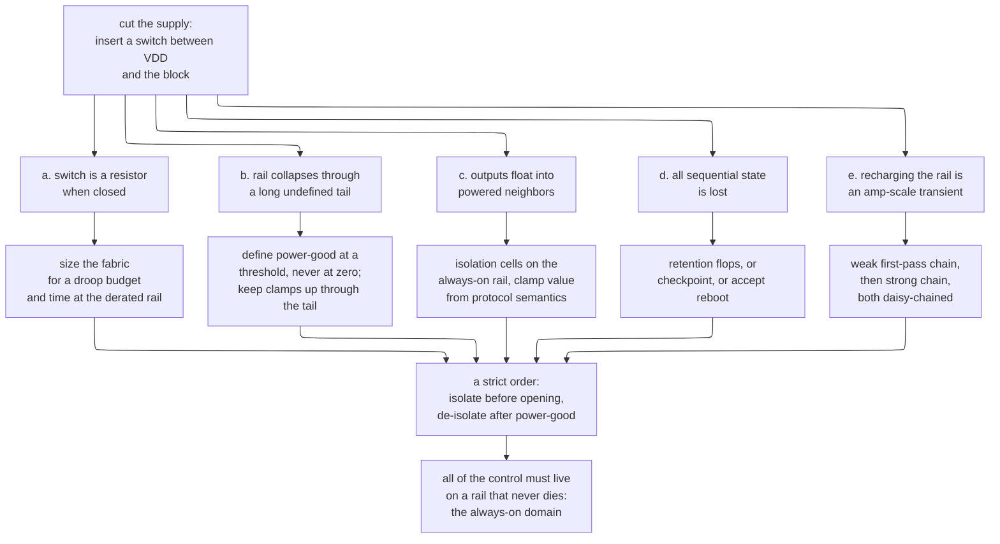
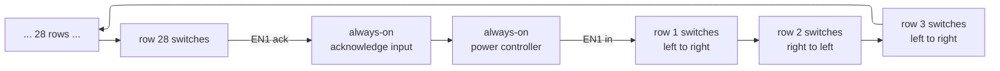
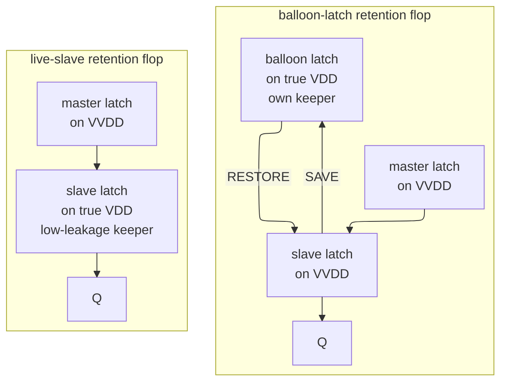
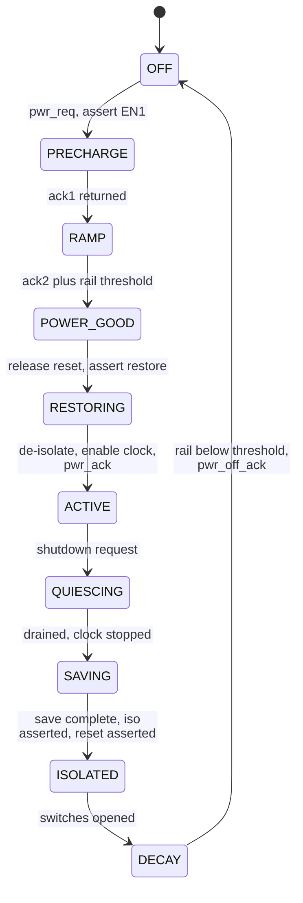

# Power Gating, Retention, and Wake Sequencing — Turning a Block Off and Getting It Back

> **First-time-reader orientation:** *power gating* means physically disconnecting a block from its supply rail with a large transistor, so that the block's leakage current stops flowing. Everything hard about it follows from four consequences of that one act: the switch is a resistor when closed, a huge transient when it closes, an undefined output when it is open, and a lost machine state for as long as it stays open. This page builds the switch, sizes it, places it, sequences it, and lists the ways it fails in silicon.
>
> **Abbreviation key — skim now and return as needed:** always-on (AON); automatic test pattern generation (ATPG); clock tree synthesis (CTS); design for test (DFT); electromigration (EM); electronic design automation (EDA); enable level shifter (ELS); high threshold voltage (HVT); current-resistance voltage drop (IR drop); multi-threshold CMOS (MTCMOS); on-chip variation (OCV); power delivery network (PDN); power-good (PG); power-management unit (PMU); power, performance, and area (PPA); power state table (PST); register-transfer level (RTL); static timing analysis (STA); state-retention power gating (SRPG); Unified Power Format (UPF); virtual $V_{DD}$ (VVDD); virtual $V_{SS}$ (VVSS).
>
> **Prerequisites:** [Power Fundamentals](01_Power_Fundamentals.md) (the $P=\alpha C V_{DD}^2 f + V_{DD}I_{leak}$ split, subthreshold leakage, and its temperature dependence); [CMOS Fundamentals](../00_Fundamentals/01_CMOS_Fundamentals.md) (MOSFET on-resistance, body effect, transmission gates, latch structures); [Low-Power Architecture](03_Low_Power_Architecture_and_Domain_Partitioning.md) (why a design has these power-domain boundaries at all); [Power Reduction Techniques](04_Power_Reduction_Techniques.md) §4 (power gating as one lever among many — this page is the mechanism behind that entry).
> **Hands off to:** [UPF/CPF Power Intent](05_UPF_and_CPF_Power_Intent.md) (the language that tells the tools to build everything on this page); [Power Analysis and Signoff](06_Power_Analysis_and_Signoff.md) (proving the droop, the inrush, and the electromigration limits); [Runtime Power Management and Adaptive Voltage-Frequency Control](08_Runtime_Power_Management_and_Adaptive_Voltage_Frequency.md) (the controller that decides *when* to run the sequence this page defines); [Floorplanning and Power Planning](../05_Backend_Physical_Design/03_Floorplanning_and_Power_Planning.md) (where the switch fabric physically goes).

---

## 0. Why this page exists

Every low-power survey states that power gating removes leakage, quotes an area overhead, and moves on. That is enough to *choose* power gating and nowhere near enough to *build* it. The gap is not conceptual — "put a switch in the supply" is a one-sentence idea. The gap is that the switch is a real device with a resistance, a capacitance downstream of it, a turn-on transient, an off-state leakage of its own, a placement problem, a routing problem, a characterization problem, and a sequencing problem, and every one of those has an arithmetic answer that a designer must produce. A block that is power-gated by a designer who has only read the survey will do one of a small number of specific, predictable things wrong: it will lose 12 % of its frequency to a switch that is too small, or it will brown out its neighbors every time it wakes, or it will come back with three flops holding the wrong value, or it will sit in "sleep" burning 40× the leakage it was supposed to save.

This page owns the circuit and the sequence. It starts from the naive act — cut the supply — and derives every mechanism in a modern power-gated block as a repair for a specific failure of that act. It sizes a switch fabric end to end for a concrete block and shows what the frequency costs when you make it half as big. It derives the inrush current from first principles, shows that a single simultaneous enable would demand 4.8 A from a rail designed for 240 mA, and derives the two-stage daisy-chained turn-on that fixes it — including the closed-form relationship between chain length and peak current, which is the design equation nobody writes down. It works the break-even residency and shows the surprising result that the *energy* floor is a fraction of a microsecond while the *latency* floor is tens of microseconds, and that the ratio between them changes by 8× between a hot die and a cold one. It builds the retention flop three ways, prices each, and turns "what should we retain" into arithmetic. Then it lays out the power-down and power-up sequences edge by edge, with the exact failure that each ordering constraint prevents.

Two boundaries. First, this page does not teach the *language*. `create_power_domain`, `set_isolation`, `set_retention`, the power state table, and the simulation corruption semantics all belong to [UPF/CPF Power Intent](05_UPF_and_CPF_Power_Intent.md), which is exhaustive on them; where this page needs to name a UPF construct it names it and links. Second, this page does not teach the *policy engine*. The power-management unit, the power state machine, the Q-Channel and P-Channel handshakes that quiesce an interface before shutdown, the operating-system interfaces, and the governors that decide a block has been idle long enough all belong to [Runtime Power Management](08_Runtime_Power_Management_and_Adaptive_Voltage_Frequency.md). The contract between the two pages is precise and stated in §12.4: the controller asserts a request and waits for an acknowledgment; this page defines what happens between them and how long it takes.

After this page you should be able to take a block specification — area, peak current, leakage, flop count, wake-latency budget — and produce a switch count, a chain length, a retention list, an isolation table with justified clamp values, a wake latency, a break-even residency, and a list of the checks that must pass before the design is signed off. You should also be able to review someone else's power-gated block and find the bug, because §14 is a catalogue of the ones that reach silicon.

**The running example.** Everything numeric on this page refers to one block, so that the numbers compose:

| Parameter | Symbol | Value |
|---|---|---|
| Nominal supply | $V_{DD}$ | 0.75 V |
| Block core area | $A$ | 1.0 mm² |
| Peak active current | $I_{peak}$ | 240 mA (180 mW) |
| Leakage when powered, 85 °C | $P_{leak}$ | 12 mW (16 mA) |
| Virtual-rail capacitance | $C_{virt}$ | 3 nF |
| Flop count | $N_{ff}$ | 60,000 |
| Clock frequency | $f$ | 1.25 GHz (800 ps cycle) |
| Boundary output nets | — | 520 |
| Technology class | — | 16 nm-class FinFET, $V_{th}\approx0.30$ V, $\alpha\approx1.3$ |

Treat it as one tile of an accelerator or a small CPU cluster. It is large enough that the interesting effects are visible and small enough that the arithmetic stays readable.

---

## 1. The baseline: remove the supply and watch what happens

### 1.1 The act, and the four things it breaks

The simplest thing that could work: put a large transistor between the chip's $V_{DD}$ and the block's supply pin, and turn it off when the block is idle. Leakage current has nowhere to flow, so $V_{DD}I_{leak}$ for that block goes to zero. That is the entire idea and it is correct as far as it goes.

Now run it on the block in the table. At $t=0^-$ the block is powered, idle, and leaking 12 mW. At $t=0$ the switch opens. Four things happen, and they are not independent nuisances — they are the four axes along which the rest of this page is organized.

**(a) The block's supply node is no longer a supply.** Before the switch existed, the block's $V_{DD}$ pin was connected to a low-impedance global grid backed by package decoupling capacitors and, ultimately, a voltage regulator. After the switch is inserted, the block sees $V_{DD}$ *through a resistor*. Call the node on the block side the **virtual rail** — virtual $V_{DD}$, written VVDD, for a switch in the supply, or virtual $V_{SS}$ (VVSS) for a switch in the ground return. When the switch is closed and the block draws its peak 240 mA, that current develops a voltage across the switch's on-resistance, and the block runs at less than 0.75 V. Less voltage is less speed (§3.1). The switch is therefore not free even when it is doing nothing.

**(b) The virtual rail is a large capacitor that is now discharging.** The block's 1 mm² of logic presents about 3 nF between VVDD and VVSS: gate capacitance of every transistor whose input is high, junction capacitance, the wire capacitance of the local power straps, and — usually the largest single term — the intentional decoupling capacitors that were placed to hold the rail steady during switching. With the switch open, that 3 nF discharges through the block's own leakage. At 16 mA it falls at $\mathrm{d}V/\mathrm{d}t = 16\ \mathrm{mA}/3\ \mathrm{nF} \approx 5.3$ mV/ns initially, but leakage itself falls steeply as the rail collapses (drain-induced barrier lowering weakens, and the devices leave the regime where the leakage model was fit), so the last hundred millivolts take microseconds. The rail does not "go to zero"; it decays with a long tail through a region where the logic is neither on nor off. Every gate in the block spends that interval at a supply too low to compute and too high to be safely called ground.

**(c) Every output of the block becomes an undefined voltage driven into powered neighbors.** This is the failure that surprises people, because it presents as a *power* bug rather than a functional one. The block's output driver is a CMOS inverter whose supply has collapsed; its output node is left floating, and leakage pulls it to some arbitrary mid-rail potential. The receiving gate in the always-on domain has that mid-rail voltage on its input. If the input sits between the NMOS threshold and $V_{DD}-|V_{thp}|$ — roughly 0.30 V to 0.45 V on a 0.75 V rail — *both* devices in the receiving inverter conduct, and there is a direct DC path from $V_{DD}$ to $V_{SS}$ through the receiver. This is **crowbar current** (also called short-circuit or contention current). A single small gate biased in this window burns 10–100 µA. Section 10 does the arithmetic across all 520 boundary nets and finds that unclamped outputs can burn *more* than the leakage the shutdown was supposed to save.

**(d) All state in the block is gone.** Sixty thousand flip-flops lose their contents. Some of that state is reconstructible — a pipeline can be flushed and refilled, a cache can be invalidated and refetched — and some of it is not: a configuration register written once at boot, an interrupt mask, a security context, the sequencer position of a partially completed job. If nothing is done, waking the block means rebooting it, which can take milliseconds and may require software involvement. Section 8 is entirely about the alternatives.

There is a fifth consequence that only appears on the way *back*:

**(e) Turning the switch on again is a current event, not a logic event.** Recharging 3 nF from 0 V to 0.75 V moves $Q = C V = 2.25$ nC of charge. If that charge is delivered in a nanosecond, the average current is 2.25 A and the peak is higher; §6 computes 4.8 A for the naive case. The block's own power delivery network was designed for 240 mA. The charge therefore comes from wherever it can — the neighbors' decoupling capacitance — and the neighbors' rail sags. This is **rush current** or **inrush**, and it is the reason a wake sequence has more than one step.

### 1.2 The repair map



**Contract of the figure.** Each of the five consequences of the naive act maps to exactly one repair, and the repairs are not independent: they impose an order on each other, and the order in turn requires that the signals implementing it survive the shutdown. Read it top to bottom and you have the page's structure.

**One concrete trace.** Follow branch (c). The block's `job_done` output floats to 0.38 V when the rail collapses. The receiving always-on interrupt controller's input inverter now conducts about 40 µA continuously, and its output is an indeterminate logic level that may or may not be interpreted as an interrupt. The repair — an isolation cell on the always-on rail clamping `job_done` to 0 — removes both problems at once, but only if the clamp is asserted *before* the rail collapses, which puts an edge in the sequence, which requires the isolation enable to be generated somewhere that is still powered, which is the always-on domain at the bottom of the figure. That chain of forced consequences, not the individual cells, is what makes power gating the most flow-entangled technique in low-power design.

**The trade-off it shows.** Every box in the right column costs area, leakage, or latency. A design that needs none of them is a design that never turns anything off; the whole page is the price of the one thing that stops leakage completely.

---

## 2. Switch topology: header, footer, and the virtual rail

### 2.1 The two places a switch can go

There are exactly two series positions in a block's supply path. A **header switch** sits between the true $V_{DD}$ and the block's supply node, and must be a PMOS: to pass a high voltage to the source of the block's own PMOS devices without a threshold drop, the switch's source must be at the higher potential, which is what a PMOS does. Its gate is driven *low* to turn it on. A **footer switch** sits between the block's ground node and the true $V_{SS}$, and must be an NMOS, driven *high* to turn on.

The device that gets used is always a **high-threshold (HVT)** variant. The switch is the one device that is off during the entire sleep interval, and its own subthreshold leakage sets the floor on how much the shutdown saves; a threshold 100 mV higher buys a full decade of leakage reduction at a speed cost that does not matter here, because the switch's "speed" is its on-resistance and that is set by width, not by threshold urgency. This pairing — an HVT switch gating ordinary (often low-threshold) logic — is why the technique's classical name is **MTCMOS**, multi-threshold CMOS, from Mutoh's 1995 paper.

```tikz
\usepackage{circuitikz}
\begin{document}
\begin{circuitikz}[american,thick,scale=0.82,transform shape]
  % true VDD rail
  \draw (-0.8,5.4) node[left]{$V_{DD}$} -- (7.6,5.4);
  % header switch
  \draw (1.6,5.4) node[pmos,anchor=S](H){};
  \draw (H.G) -- ++(-0.9,0) node[left]{$EN_H$};
  \draw (H.D) -- (1.6,3.6);
  \node[font=\small,anchor=west] at (2.1,4.6) {HVT PMOS header};
  % virtual VDD rail
  \draw (0.6,3.6) -- (2.2,3.6) to[R=$R_{sw}$] (3.9,3.6) -- (7.4,3.6);
  \draw (1.6,3.6) node[circ]{};
  \node[anchor=south east] at (7.3,3.7) {$VV_{DD}$};
  % block
  \draw (3.4,1.6) rectangle (5.6,2.8);
  \node at (4.5,2.2) {gated logic};
  \draw (4.5,2.8) -- (4.5,3.6);
  \draw (4.5,3.6) node[circ]{};
  \draw (4.5,1.6) -- (4.5,0.8);
  \draw (4.5,0.8) node[circ]{};
  % C_virt
  \draw (7.0,3.6) node[circ]{} to[C=$C_{virt}$] (7.0,0.8) node[circ]{};
  % virtual VSS rail
  \draw (0.6,0.8) -- (7.4,0.8);
  \node[anchor=north east] at (7.3,0.7) {$VV_{SS}$};
  % footer switch
  \draw (1.6,-0.8) node[nmos,anchor=S,yscale=-1](F){};
  \draw (F.D) -- (1.6,0.8);
  \draw (F.G) -- ++(-0.9,0) node[left]{$EN_F$};
  \node[font=\small,anchor=west] at (2.1,-0.1) {HVT NMOS footer};
  % true VSS rail
  \draw (-0.8,-0.8) node[left]{$V_{SS}$} -- (7.6,-0.8);
\end{circuitikz}
\end{document}
```

**Contract of the figure.** Both switch positions are drawn together so the symmetry is visible; a real design uses one, not both (§2.4 explains when both appear). $EN_H$ is active low, $EN_F$ active high. The resistor labeled $R_{sw}$ is not a separate component — it is the on-resistance of the header itself, drawn explicitly because §3 treats it as a circuit element with a budget. $C_{virt}$ is the total capacitance from VVDD to VVSS: device gate and junction capacitance, local strap capacitance, and intentional decap. The figure abstracts away the fact that $R_{sw}$ and $C_{virt}$ are both *distributed* — there are hundreds of switches and the capacitance is spread over a square millimeter — which §5 restores.

**One concrete trace.** With $EN_H$ low, the header conducts. The block draws 240 mA at peak; that current flows through $R_{sw}$ and develops $240\ \mathrm{mA}\times R_{sw}$ across it. VVDD sits below $V_{DD}$ by that amount, and every gate inside the block is slower for it. Drive $EN_H$ high: the header stops conducting, the block's 16 mA of leakage discharges $C_{virt}$, and VVDD decays toward VVSS. During that decay the block's outputs — which leave the rectangle and are not drawn — are floating.

**The trade-off it shows.** The figure is the entire cost structure of power gating in one picture. Make $R_{sw}$ smaller and the on-state drop shrinks but the device area and the turn-on transient grow. Make $C_{virt}$ smaller (less decap) and the wake transient is cheaper but the powered block has worse dynamic IR drop. There is no setting of either that is free.

### 2.2 Why headers dominate, despite NMOS being the better switch

Per unit of gate width an NMOS conducts roughly 2–3× as much as a PMOS, because electron mobility exceeds hole mobility. A footer therefore reaches the same on-resistance in a third to a half of the silicon area. On that argument alone footers should be universal. They are not: in mainstream bulk-CMOS ASIC practice headers dominate, and the reasons are all about the *system* the switch sits in rather than the device itself.

**The ground reference argument.** A footer moves the block's local ground away from the chip's true ground by $I R_{sw}$. Every signal that leaves the block is referenced to VVSS, and every signal that enters it is referenced to true $V_{SS}$. A 40 mV offset between the two is a 40 mV common-mode error injected into every boundary crossing, subtracted from the receiver's low-level noise margin in one direction and from the high-level margin in the other. It also moves with the block's instantaneous current, so it is not a static offset that could be characterized once — it is a noise source whose spectrum is the block's activity. A header has the same problem in principle, but the block's *ground* stays chip-common, and ground is the reference for far more than the supply is: substrate contacts, ESD paths, level-shifter references, analog and I/O returns, and the implicit assumption in every noise-margin calculation that "0 V is 0 V everywhere."

**The substrate and well argument.** In a bulk process the p-substrate is globally tied to $V_{SS}$. An NMOS footer's source is the block's VVSS, which floats above the substrate potential during sleep and bounces during operation. Source-to-body voltage $V_{SB} > 0$ raises the footer's own threshold through the body effect, $V_{th} = V_{th0} + \gamma(\sqrt{2\phi_F + V_{SB}} - \sqrt{2\phi_F})$, so the footer gets *weaker* exactly when it is passing current — a mild positive feedback into the droop. It also means every NMOS *inside* the gated block has its source on VVSS and its body on the true substrate, so the whole block acquires a body effect that varies with rail droop. A PMOS header lives in an n-well that can be tied to true $V_{DD}$ (the header's own source), which is a quiet node, and the gated logic's PMOS devices sit in a well that can be tied to VVDD or to true $V_{DD}$ by choice.

**The latch-up and ESD argument.** Cutting the ground return is more dangerous than cutting the supply. During an ESD event, or during power-up/power-down transitions of a partially powered die, current must find a path to ground; if the only path out of a block is through a switched NMOS that happens to be off, charge accumulates on the internal nodes and the resulting forward-biasing of parasitic junctions is a classic latch-up trigger. Foundry ESD rules for gated domains are consequently more permissive about interrupted supplies than interrupted grounds, and design-rule checking treats a floating well or a floating substrate region very differently.

**The counter-cases.** Footers do get used, and the pattern is legible. They appear where the area saving is decisive and the block is small and self-contained — SRAM peripheral circuitry, register-file bit cells, sub-blocks inside a custom macro — because the ground offset stays inside a boundary the designer controls entirely. They appear in fine-grain gating (§4), where the switch lives inside the cell and the "virtual ground" is a node a few hundred nanometers long shared by four transistors, not a rail spanning a millimeter. And they appear in ultra-low-voltage designs where the header's PMOS overdrive $|V_{GS}| - |V_{th}|$ has become so small that PMOS on-resistance is prohibitive: at $V_{DD}=0.5$ V with $|V_{th,HVT}|=0.4$ V a header has 100 mV of overdrive and its specific on-resistance explodes, while an NMOS footer with the same 100 mV overdrive is still 2–3× better and the block is small enough that ground offset is manageable.

### 2.3 The virtual rail is a circuit node, not a wire

The single most useful mental shift in this whole subject is to stop thinking of VVDD as "the supply, slightly worse" and start treating it as a node in an RC network with its own state.

It has **resistance** in two distinct places, which get confused constantly. There is $R_{sw}$, the parallel combination of all the switch devices' channel resistances plus the via stacks that connect them to the true grid — this is what §3 budgets. And there is $R_{grid}$, the resistance of the *virtual* distribution network itself, the straps and rails that carry current from each switch to the cells around it. These add in a distributed way: a cell 300 µm from the nearest switch sees $R_{sw}$ plus the strap resistance over 300 µm, and a cell adjacent to a switch sees almost only $R_{sw}$. Section 5 shows that this is precisely why switches are distributed rather than ringed — a distributed fabric makes $R_{grid}$ small by construction.

It has **capacitance** $C_{virt}$, which is the sum of every capacitance referenced to it. This is the term that sets the wake transient, and it is worth breaking down for the running block:

| Contribution to $C_{virt}$ | Estimate | Note |
|---|---|---|
| Intentional decap cells | 1.5 nF | placed to meet dynamic IR targets; typically 10–25 % of block area |
| Device gate + junction capacitance | 1.0 nF | only the fraction referenced VVDD-to-VVSS at a given state |
| Local strap and rail wire capacitance | 0.5 nF | M1/M2 cell rails plus M3/M4 virtual straps |
| **Total** | **3.0 nF** | ≈ 3 nF/mm², a defensible 16 nm-class figure |

Two consequences follow immediately and are worth stating before they are derived. First, decap and wake energy are in direct conflict: every picofarad added to steady the rail while the block runs is a picofarad that must be recharged every time the block wakes, at $CV^2$ per wake. Second, $C_{virt}$ is *state-dependent* — the gate capacitance term depends on how many inputs are high — so the wake transient is not perfectly repeatable, and signoff must use a bounding value rather than a nominal one.

It has a **defined voltage only when the switch is on**. When the switch is off, VVDD is a floating node whose potential is set by the ratio of the switch's off-state leakage (charging it up) to the block's leakage (discharging it down). It settles somewhere, usually within tens of millivolts of VVSS, but "usually" is not a specification. This is why every real power-gating scheme defines **power-good** at a *threshold* — typically 90–95 % of nominal on the way up — and never as "the rail equals $V_{DD}$", and why the OFF state in a power state table is a state with an undefined internal voltage, not a state with zero volts.

### 2.4 When both switches appear

A design that uses both a header and a footer on the same block is uncommon but not exotic. Two situations produce it. The first is **deep-sleep leakage reduction beyond what one switch gives**: two series switches in the leakage path multiply their off-state resistances, and because subthreshold current through a stack is superlinearly suppressed (the intermediate node self-biases, giving the upper device a negative $V_{GS}$ — the stack effect), a header-plus-footer arrangement can cut sleep leakage by 5–20× relative to one switch, at the cost of two on-resistances in series when awake. The second is **isolation of a block that must be electrically separated in both directions**, for example a block on a separate voltage that must not inject current through its ground return into a sensitive analog neighbor.

The cost is exactly what the figure predicts. Two switches in series means the droop budget must be split between them, so each must be sized for half the allowed drop and each therefore roughly doubles in width — the total switch silicon is about 4× that of a single-switch design for the same total droop. Both rails become virtual, so both the noise-margin problem of §2.2 and the sequencing problem of §12 apply twice, and the wake transient has two independent chains to stage. For nearly every digital block, the leakage saved by the second switch is smaller than the leakage of the extra switch width plus the frequency lost to the extra droop, and one switch — a header — is the answer.

---

## 3. Sizing the switch fabric

### 3.1 The constraint set

The switch is squeezed between three constraints that pull in different directions, and sizing is the act of finding the width that satisfies all three with the least silicon.

1. **On-state IR drop.** The droop across the switch when the block draws peak current must stay inside a budget, because droop is delay.
2. **Area and off-state leakage.** Total switch width is silicon, and it is also leakage: the switch's own subthreshold current in the off state is proportional to its width and is the floor on what shutdown can save.
3. **Turn-on inrush.** A wider switch conducts more current during the wake transient for the same rail voltage, so making the switch bigger makes the transient *worse*, not better. Section 6 handles this; here it enters as a reminder that the answer is not "make it enormous."

Only the first two are treated in this section, because the third is not solved by sizing — it is solved by staging.

### 3.2 From droop budget to on-resistance

Start from the delay model the notebook already uses. Gate delay follows the alpha-power law,

$$T_d \propto \frac{C_L V_{DD}}{(V_{DD} - V_{th})^{\alpha}}, \qquad \alpha \approx 1.3 \ \text{for FinFET}, \quad V_{th} \approx 0.30\ \mathrm{V},$$

derived and discussed in [Power Reduction Techniques](04_Power_Reduction_Techniques.md) §3.1. The logarithmic sensitivity of delay to supply is

$$\frac{\mathrm{d}\ln T_d}{\mathrm{d}\ln V_{DD}} = 1 - \frac{\alpha V_{DD}}{V_{DD} - V_{th}}.$$

At $V_{DD}=0.75$ V and $V_{th}=0.30$ V this is $1 - (1.3 \times 0.75)/0.45 = 1 - 2.167 = -1.167$. **Every 1 % of supply lost costs about 1.17 % of speed.** That single number converts a droop budget into a frequency budget and is the reason the droop budget is where sizing starts.

Choose a 5 % droop budget: $\Delta V = 0.05 \times 0.75 = 37.5$ mV, so the block runs at 0.7125 V. The linearized estimate says delay grows 5.8 %. The exact ratio, because the model is convex, is larger:

$$\frac{T_d(0.7125)}{T_d(0.75)} = \frac{0.7125 / (0.4125)^{1.3}}{0.75 / (0.45)^{1.3}} = \frac{0.7125/0.3162}{0.75/0.3542} = \frac{2.2534}{2.1174} = 1.064.$$

So **5 % droop costs 6.4 % delay**, and the linearization understates it by half a point. On an 800 ps cycle with a 760 ps critical path, 6.4 % is 48.6 ps, which turns a 40 ps-positive path into an 8.6 ps violation.

The crucial methodological point: this is *not* margin to be added after the fact. The gated block must be timed at 0.7125 V — the virtual rail's voltage is an operating condition, and modern STA supports a per-supply-net voltage precisely so that a gated domain can be timed at its derated rail while the always-on domain is timed at nominal. Treating the switch droop as "we will add 5 % margin at the end" fails in two directions at once: it is optimistic for paths inside the block (the tool never optimized them at the real voltage) and pessimistic for paths that never see the virtual rail.

Now the resistance. Ohm's law on the switch:

$$R_{sw,max} = \frac{\Delta V}{I_{peak}} = \frac{37.5\ \mathrm{mV}}{240\ \mathrm{mA}} = 0.15625\ \Omega \approx 156\ \mathrm{m}\Omega.$$

### 3.3 From on-resistance to a switch count

A MOSFET in the linear region has an on-resistance inversely proportional to its width, so the technology-independent parameter is **specific on-resistance** $\rho_{on} = R_{on} \cdot W$, in $\Omega\cdot\mu\mathrm{m}$. It is not a number you derive; it is a number you read out of the switch cell's characterization data at the relevant corner, and it varies from roughly 300 to 1500 $\Omega\cdot\mu\mathrm{m}$ across nodes, thresholds, and supply voltages. Take $\rho_{on} = 500\ \Omega\cdot\mu\mathrm{m}$ for an HVT PMOS at 0.75 V, consistent with the figure used elsewhere in this notebook.

$$W_{total} = \frac{\rho_{on}}{R_{sw,max}} = \frac{500\ \Omega\cdot\mu\mathrm{m}}{0.15625\ \Omega} = 3200\ \mu\mathrm{m}.$$

**3.2 mm of PMOS width** for a 1 mm² block. Convert to cells: a coarse-grain header cell in this library contributes $W_{cell} = 4\ \mu$m of switch device (the cell also contains the enable buffer and the acknowledge tap, so its footprint is wider than its active device).

$$N_{cells} = \frac{W_{total}}{W_{cell}} = \frac{3200}{4} = 800\ \text{switch cells}.$$

Equivalently, each cell contributes $R_{cell} = 500/4 = 125\ \Omega$, and 800 in parallel give $125/800 = 0.15625\ \Omega$. ✓

Sanity-check the current density: 240 mA through 3200 µm is 75 µA per micron of switch width. That is a modest linear current density for a device in the linear region with 450 mV of overdrive, which is the right answer — a switch operating at high current density would be dropping far more than 5 %.

**Area.** Each switch cell occupies about 3.5 µm × 0.9 µm ≈ 3.15 µm². Eight hundred of them is 2520 µm², which is **0.25 % of the block's 1 mm²**. This number deserves emphasis because it contradicts a widespread impression. The raw silicon of a coarse-grain switch fabric is well under 1 % of the block. The "3–5 % area overhead of power gating" quoted in surveys is the *whole* apparatus: switches, plus isolation cells on 520 boundary nets, plus retention adders on however many flops are retained, plus always-on cells and their routing, plus the placement blockage the switch columns create, plus the grid rework. Of those, retention is usually the largest by far (§8.4). **The switches are the cheapest part of power gating; do not economize on them.**

**Off-state leakage of the switch itself.** An HVT PMOS leaks roughly 1 nA/µm at 25 °C and 10 nA/µm at 85–125 °C. With 3200 µm:

$$I_{off,sw} = 3200\ \mu\mathrm{m} \times 10\ \mathrm{nA}/\mu\mathrm{m} = 32\ \mu\mathrm{A}, \qquad P_{off,sw} = 32\ \mu\mathrm{A}\times0.75\ \mathrm{V} = 24\ \mu\mathrm{W}.$$

Against 12 mW of block leakage eliminated, the switch's own leakage is 0.2 % — the valve is excellent. But note that it scales with $W_{total}$, so it is the term that eventually punishes oversizing, and note that it assumed the gate is driven to a *full* $V_{DD}$ in the off state. Section 14.6 works the case where it is not, and the answer is 75× worse.

### 3.4 Sensitivity: halve the width, and double it

The whole point of doing the arithmetic is to know the shape of the curve. Hold everything else fixed and vary $N_{cells}$.

| $N_{cells}$ | $W_{total}$ | $R_{sw}$ | Droop at 240 mA | VVDD | Delay vs nominal | Switch area | $P_{off,sw}$ (85 °C) |
|---|---|---|---|---|---|---|---|
| 400 | 1600 µm | 312.5 mΩ | 75 mV (10.0 %) | 0.6750 V | **+14.1 %** | 1260 µm² (0.13 %) | 12 µW |
| 800 | 3200 µm | 156.3 mΩ | 37.5 mV (5.0 %) | 0.7125 V | **+6.4 %** | 2520 µm² (0.25 %) | 24 µW |
| 1600 | 6400 µm | 78.1 mΩ | 18.8 mV (2.5 %) | 0.7313 V | **+3.1 %** | 5040 µm² (0.50 %) | 48 µW |
| 3200 | 12800 µm | 39.1 mΩ | 9.4 mV (1.25 %) | 0.7406 V | **+1.5 %** | 10080 µm² (1.01 %) | 96 µW |

The delay column, worked for the 400-cell row: $T_d(0.675)/T_d(0.75) = [0.675/(0.375)^{1.3}]/[0.75/(0.45)^{1.3}] = (0.675/0.2794)/2.1174 = 2.4159/2.1174 = 1.141$.

Three readings of this table.

**Halving the switch width is a catastrophe.** It saves 1260 µm², which is 0.13 % of the block — an amount of area that is lost in the noise of a single placement run — and it costs 14.1 % of delay instead of 6.4 %, a further 7.7 % of frequency. No block trades 7.7 % of frequency for 0.13 % of area. The penalty is *superlinear* in droop because the $(V_{DD}-V_{th})$ denominator shrinks as the supply falls: doubling the droop from 5 % to 10 % more than doubles the delay penalty. As the supply scales down toward the threshold in future nodes, this asymmetry gets worse, which is why droop budgets have tightened from the 10 % of older designs to 3–5 % today.

**Doubling the switch width is a good trade at first and then is not.** Going from 800 to 1600 cells buys 3.3 % of frequency for 0.25 % of area — plainly worth it in a frequency-limited block. Going from 1600 to 3200 buys another 1.6 % for another 0.5 % of area and doubles the switch's off-state leakage to 96 µW, and it makes the inrush problem harder because a wider fabric conducts more current at any given rail voltage during the ramp. There is a real optimum, and it sits in the 2–4 % droop region for most designs.

**The binding constraint is rarely the switch itself.** In the 3200-cell row the switch is 39 mΩ, at which point the resistance of the virtual *distribution* — the straps between the switches and the cells — dominates, and adding more switch devices no longer reduces the droop the cells actually see. Section 5 is where that ceiling comes from. Sizing beyond the point where $R_{sw} \approx R_{grid}$ is spending silicon on the wrong resistor.

### 3.5 What corner to size at

Three corners matter and they are different corners.

**Worst droop** occurs where $\rho_{on}$ is highest: the slow process corner at high temperature (mobility falls with temperature, so on-resistance rises) and at the *low* end of the supply tolerance (less overdrive). Size the fabric here. A switch sized at typical and checked at slow-hot will typically be 30–50 % short.

**Worst off-state leakage** occurs at the fast process corner at high temperature. Compute the sleep-current specification here, not at typical, or the silicon will miss its standby-current target by a factor of several.

**Worst inrush** occurs at the fast corner at low temperature, where $\rho_{on}$ is smallest and the switch conducts hardest during the ramp. This is the corner that makes the neighbors brown out, and it is the one most often forgotten, because "fast and cold" feels like the benign corner everywhere else in the flow.

---

## 4. Fine-grain versus coarse-grain gating

### 4.1 The two structures

**Fine-grain** gating puts a sleep device inside every standard cell. The library ships a parallel universe of cells — every function, every drive strength, every threshold flavor — each containing its own footer (usually) between the cell's internal ground node and the real $V_{SS}$, plus the sleep-enable pin. The "virtual ground" of any one cell is a node a few hundred nanometers long with a few femtofarads on it.

**Coarse-grain** gating puts a fabric of dedicated switch cells around or through a region and gates hundreds of thousands of ordinary cells at once. This is the structure §3 sized: 800 switch cells for 1 mm² of otherwise-unmodified logic.

### 4.2 Why coarse-grain won: the statistical averaging argument

The fine-grain advantage is real and worth stating first, because it is the argument that keeps the technique alive. A fine-grain cell's delay penalty is *inside its own characterization*: the cell was characterized with its sleep device in place, so its `.lib` timing is already correct and STA needs no notion of a virtual rail, no per-supply-net voltage, no droop budget as a separate concern. The sizing is per-cell and therefore automatically proportional to demand. There is no virtual rail to route. Wake is nearly instantaneous because there is no large capacitance to recharge.

The fine-grain disadvantage is a sizing argument, and it is decisive. A per-cell sleep device must be sized for *that cell's* peak current, because when that cell switches it needs its full drive. But in a coarse-grain fabric, the switch network is sized for the *block's* peak current, and the block's peak current is far less than the sum of every cell's peak current, because the cells do not all switch on the same edge. Let $\sigma$ be the simultaneous-switching factor: the fraction of the block's cells drawing peak current in the same short window. For random logic clocked at a common edge, $\sigma$ is typically 0.1–0.3 once the clock tree's skew spreads the edges out.

$$W_{fine} = \sum_i W_i^{peak}, \qquad W_{coarse} = \sigma \sum_i W_i^{peak} \quad \Longrightarrow \quad \frac{W_{fine}}{W_{coarse}} = \frac{1}{\sigma} \approx 3\text{–}10\times.$$

Coarse-grain gating gets to average over the block; fine-grain gating cannot average over anything. That factor of 3–10 in total switch width is the core of the argument, and it is made worse by three secondary effects:

- **Area quantization.** A standard cell's width is an integer number of contacted poly pitches. Adding a sleep device that "should" widen the cell by 1.3 pitches widens it by 2. Across a whole library the rounding loss is significant.
- **Library cost.** A fine-grain library is a full duplicate: every cell, every drive, every threshold, characterized at every corner, with the sleep pin's timing arcs and the cell's behavior at an intermediate virtual-ground voltage. That is a multi-month characterization program per node, described in [Standard Cell Libraries and Characterization](../04_Synthesis/03_Standard_Cell_Libraries_and_Characterization.md), and it must be maintained.
- **Enable fanout.** The sleep net reaches every cell in the block — hundreds of thousands of loads — so it needs its own buffer tree, which is itself always-on and which occupies routing resources everywhere. A coarse-grain enable reaches 800 cells and daisy-chains through them.

Empirically the area overhead lands around 2–5× coarse-grain's, which for the running block would move the switch cost from 0.25 % to somewhere between 5 % and 15 % of block area depending on how much of the library is affected. That is not a rounding error, and it is why coarse-grain is the default in every mainstream ASIC flow.

### 4.3 Where fine-grain still wins

The selection boundary is sharp and follows from what fine-grain uniquely has: *no rail to recharge*.

**Sub-microsecond and sub-100-nanosecond idle windows.** The whole of §6 and §7 exists because a coarse-grain domain has 3 nF to refill, costing 1.7 nJ and 250 ns. A fine-grain cell's virtual ground is femtofarads; wake is a gate delay and the energy is negligible. If a block's idle windows are hundreds of nanoseconds — a functional unit that is unused for a few dozen cycles at a time — coarse-grain gating can never pay and fine-grain can. This is the domain of "power gating at the instruction level," and it is why fine-grain appears in aggressive ultra-low-power microcontrollers and in research designs that gate execution units per instruction.

**Very small blocks.** For a block of a few thousand cells, the fixed costs of coarse-grain — a virtual rail, a distinct power domain, isolation on the boundary, an always-on control island, a UPF power domain and its verification — are disproportionate. A 10,000-cell block with 200 boundary nets pays more in isolation cells than a fine-grain scheme would pay in switches.

**Inside memory arrays and register files.** Gating a cache way, a register-file bank, or the periphery of an SRAM is naturally fine-grain: the "block" is a row or a column, the switch is inside the macro's own design, and the macro designer characterizes the whole thing as one cell. This is standard practice, described from the array side in [Memory Circuits and Technologies](../00_Fundamentals/06_Memory_Circuits_and_Technologies.md).

**Processes with a strong body-bias knob.** In FD-SOI, an alternative to switching the supply is to drive the back gate into deep reverse bias, which cuts leakage substantially with no rail collapse, no state loss, and nanosecond transitions. That is not fine-grain gating, but it competes for the same short-idle-window niche and often wins there.

A useful way to hold the distinction: **fine-grain trades area for latency and energy-to-wake; coarse-grain trades latency and energy-to-wake for area.** The residency ladder of §7.4 is what decides which trade the workload wants.

---

## 5. Placing the switch fabric

### 5.1 Ring versus distributed

Having decided on 800 switch cells, where do they go?

**Ring** places them around the block's perimeter. The true $V_{DD}$ grid touches the switches only at the boundary; the virtual rail is fed inward from the edge. This is simple, keeps the block's interior free for placement, and is the only option when the interior is not yours — a hard macro, or a third-party block delivered as a GDS with its own supply pin.

The problem is arithmetic. All 240 mA must travel from the perimeter to wherever the current is actually consumed, through the block's own virtual distribution. For a 1 mm² square fed from all four edges, current entering from the edge reaches the center after roughly 500 µm of strap. If the virtual strap network presents, say, 0.15 Ω from edge to center for the fraction of current going there, the center of the block sees $R_{sw} + R_{grid} \approx 0.156 + 0.15 = 0.31\ \Omega$ — the droop at the center has doubled, and §3.4's table says that doubles-plus the delay penalty. The block now has a *position-dependent* voltage, so the cells at the center are 14 % slower while the cells at the edge are 6.4 % slower, and STA either times everything at the worst case (pessimistic, costs frequency everywhere) or requires a voltage map from the IR tool fed back into timing.

**Distributed** — column, checkerboard, or grid style — places the switch cells throughout the block at a regular pitch, inserted as if they were filler. For 800 cells over 1 mm², a 28 × 28 array is a pitch of about 35 µm. Each switch now serves roughly $1000^2/800 = 1250\ \mu\mathrm{m}^2$ of logic drawing about $240\ \mathrm{mA}/800 = 300\ \mu$A. The current path from a cell to its nearest switch is at most ~18 µm of strap, and $R_{grid}$ becomes negligible against $R_{sw}$.

The principle underneath: **droop is local current times local resistance, so a fabric whose conductance is distributed in proportion to the current density has uniform droop.** A ring concentrates conductance where there is no current; a distributed fabric puts it where the current is. This is the same reason the true power grid is a mesh rather than a pair of edge rails, and it is why the switch fabric is inserted during power planning rather than during placement — it *is* power planning, for a second, switched grid. See [Floorplanning and Power Planning](../05_Backend_Physical_Design/03_Floorplanning_and_Power_Planning.md) for the grid it overlays.

The remaining case for a ring, beyond hard macros: a small block (under ~0.1 mm²) where edge-to-center is 150 µm and $R_{grid}$ is genuinely small, or a block whose current is concentrated near its boundary anyway (an I/O-dominated wrapper).

### 5.2 How the virtual rail is actually routed

This is where the abstraction "the block runs on VVDD" becomes a metal stackup question, and the answer is not what most people first guess.

The true $V_{DD}$ grid stays on the **upper metals** — the thick, low-resistance layers where the global mesh lives, fed from the package bumps. It runs *over* the gated block, unswitched, at full strength. The switch cell's source terminal taps that global mesh through a via stack down from the upper-layer straps. The switch cell's drain terminal drives the **local** distribution: the M1/M2 rails that run through the standard-cell rows and, usually, a dedicated set of intermediate-layer (M3/M4) virtual straps that tie the switch outputs together into a mesh of their own.

So the picture is: a full-strength always-on mesh above, a switched mesh below, and 800 vertical connections between them that can be opened. Three consequences follow.

- **The global grid is undisturbed.** You do not lose the low-resistance upper-layer mesh over the gated region; it is still there carrying current to whatever else needs it, and it still provides the package-to-die path. This is the main reason the switch is placed at the *bottom* of the stack rather than gating a top-level strap.
- **Always-on cells inside the gated region are possible.** Because true $V_{DD}$ is physically present above the block, a cell sitting inside the gated area can be given a secondary supply pin routed up to the always-on mesh. Section 9 needs this and it is only available because of where the switch sits.
- **The virtual mesh's own resistance is on thin metal.** M1/M2 rails are resistive. This is the $R_{grid}$ of §5.1, and it is why the distributed style is not optional at scale.

The switch cells themselves are ordinary standard-cell-height cells placed in rows, so a "switch column" is a vertical stripe of rows in which every row contains a switch cell at the same x-coordinate. The stripe becomes a partial placement obstruction, and — importantly — the tool must be told about it *before* placement, or the placer will fill the area with logic and the switch insertion step will have to rip cells out and legalize around them.

### 5.3 The daisy chain is a physical object

The enable that turns the switches on does not fan out to all 800 cells in parallel. It enters the first cell, is buffered by a small inverter pair inside that cell, and exits toward the next; §6 derives why. The consequence for placement is that **the chain order is geometric, not logical**. The netlist connects cell 1's `EN_OUT` to cell 2's `EN_IN`, and if cell 2 is on the other side of the block, the enable makes a 1 mm round trip and the "one buffer delay per stage" assumption becomes "one buffer delay plus 6 ns of wire" for that hop.



**Contract of the figure.** The enable snakes through the fabric in a boustrophedon (alternating-direction) order so that consecutive cells in the chain are physically adjacent, keeping the per-hop wire short and the per-hop delay uniform. The signal that returns to the controller is the *same* signal that left it, after propagating through every cell — which is what makes it a genuine acknowledgment rather than a timer: if it comes back, every gate in the chain was driven.

**One concrete trace.** The controller drives `EN1` low at $t=0$. Cell (1,1) sees it after the always-on routing delay, buffers it, and passes it to (1,2) roughly 100 ps later. After 28 cells the signal turns around at the end of row 1 and enters row 2. After 800 cells and 800 buffer delays, the enable emerges at row 28 and returns to the controller: 800 × 100 ps = 80 ns of ripple. The controller now knows, from a single wire, that all 800 switch gates are driven.

**The trade-off it shows.** The chain gives free sequencing and a free acknowledgment, and it costs wake latency proportional to the number of cells. A block with 3200 switch cells has a 320 ns ripple on each chain. Splitting into several parallel chains cuts the latency proportionally but multiplies the peak inrush by the number of chains and requires the controller to AND several acknowledgments — a real design choice, taken in §6.5.

### 5.4 Placement density and the practical insertion flow

A switch fabric interacts with placement in ways that show up as schedule risk rather than as a formula.

Switch cells are *not* movable by the placer once inserted — their positions are part of the power plan, and moving one changes both the local droop and the chain order. They are inserted with a `PLACED` or `FIXED` status. If the block's placement utilization is already high (say 80 %), removing 0.25 % of the area for switches is trivial, but removing the *routing tracks* over the switch columns is not: the switch cell's drain pin needs a via stack up to the M3/M4 virtual straps, and those vias block routing tracks over a taller portion of the stack than a normal cell does.

The insertion order in a working flow is: floorplan → global power grid (always-on, upper metals) → power-domain regions defined → **switch fabric inserted at pitch, chain ordered geometrically** → virtual straps built → always-on cell rows or secondary-pin routing set up → standard-cell placement → CTS → routing. Inserting switches after placement is possible and is what happens when a domain is added late; it produces an irregular fabric, a chain whose order is whatever the tool could manage, and a droop map with hot spots. It is one of the reliable predictors of a late-stage IR problem.

One more interaction worth naming: **decap placement**. Decoupling capacitor cells inside the gated region must connect to VVDD, not to true $V_{DD}$ — a decap tied to the always-on rail inside a gated region does nothing for the block's dynamic droop and adds nothing to $C_{virt}$, which sounds good until you realize it also fails to do its job. Conversely every VVDD decap you add is charge you pay for at every wake (§7). The right amount of decap in a gated domain is genuinely smaller than in an always-on block of the same size, and that is a real design decision rather than an oversight.

---

## 6. Rush current and the two-stage turn-on

This is the section the rest of the page is arranged around. It is where power gating stops being "a switch" and becomes a designed transient.

### 6.1 The naive turn-on, computed

The block is off. VVDD sits near 0 V. $C_{virt} = 3$ nF. Drive the enable on all 800 switch cells simultaneously.

At the instant the switches conduct, the full supply appears across the switch resistance:

$$I_{peak} = \frac{V_{DD}}{R_{sw}} = \frac{0.75\ \mathrm{V}}{0.15625\ \Omega} = \mathbf{4.8\ A}.$$

The charging is a simple RC with $\tau = R_{sw} C_{virt} = 0.15625\ \Omega \times 3\ \mathrm{nF} = 0.47$ ns, so the current decays to nothing within about 1.5 ns, having delivered $Q = C V = 3\ \mathrm{nF}\times0.75\ \mathrm{V} = 2.25$ nC.

Compare 4.8 A with the 240 mA the block's power delivery network was designed for: **20× the design current**. And consider the slew: the enable edge itself is perhaps 100 ps, so $\mathrm{d}i/\mathrm{d}t \approx 4.8\ \mathrm{A}/100\ \mathrm{ps} = 4.8\times10^{10}$ A/s. Applied to even 50 pH of effective package-plus-grid loop inductance, $L\,\mathrm{d}i/\mathrm{d}t = 50\ \mathrm{pH} \times 4.8\times10^{10} = 2.4$ V of inductive drop.

That last number is physically impossible on a 0.75 V rail, and understanding *why* is the point. The 4.8 A never happens. What actually happens is that the supply cannot deliver it, so the local always-on rail collapses instead, and the charge is sourced from wherever it is nearest: the on-die decoupling capacitance of the *neighboring* blocks. If the surrounding region has, say, 30 nF of decap, supplying 2.25 nC from it produces an immediate droop of

$$\Delta V_{neighbor} = \frac{Q}{C_{decap}} = \frac{2.25\ \mathrm{nC}}{30\ \mathrm{nF}} = 75\ \mathrm{mV} = 10\%\ \text{of}\ V_{DD},$$

before the package and the regulator can respond at all — they operate on nanosecond-to-microsecond timescales and this event is over in under 2 ns. A 10 % supply step on a block that was already running at its timing limit is a timing failure. On a smaller decap island — 1 nF locally — the arithmetic gives 2.25 V of demanded droop, meaning the local rail simply collapses to near zero and everything in the vicinity resets or corrupts.

**This is the failure mode: waking one block resets a different block.** It is hard to debug precisely because the symptom is not in the block that changed state, and it correlates only with wake events, which in a real system are scattered and workload-dependent. Two properties of this failure to internalize: it does not appear in functional simulation at all (no model of charge), and it does not appear in ordinary static IR analysis (which analyzes the powered steady state). It appears only in a dynamic IR simulation of the wake event, or in silicon.

### 6.2 The constraint, stated properly

What is the actual limit on inrush? Two formulations are used, and the practical one is the second.

The rigorous formulation is a **di/dt limit** derived from the power-delivery network's impedance profile: the supply network has a characteristic impedance $Z(f)$ with a resonant peak (the package–die anti-resonance, typically 50–200 MHz), and any current transient with energy at that frequency produces droop $\Delta V = I(f) Z(f)$. Bound $\Delta V$ to a fraction of $V_{DD}$ and you get a frequency-domain bound on the wake current. This is the correct analysis and it is what [Power Analysis and Signoff](06_Power_Analysis_and_Signoff.md) §4 does properly.

The practical formulation used for sizing the wake sequence is simpler and defensible: **bound the peak inrush to at most the block's own peak active current.** The rationale is that the PDN, the grid, the decap, and the EM rules were all designed for $I_{peak}$; a transient that stays at or below $I_{peak}$ is already covered by the analysis that was done. Many teams use half of $I_{peak}$ to leave room for the neighbors being at *their* peak simultaneously.

For the running block: **target $I_{rush} \le 240$ mA**, prefer $\le 120$ mA.

The naive turn-on misses this by a factor of 20 to 40. Something must change, and it cannot be the total switch size — §3 fixed that from the droop budget. What changes is *when* each switch turns on.

### 6.3 The first-pass switch: two devices in every cell

The repair has two halves. The first is a second, deliberately weak switch device.

Note the structure of the problem: the inrush is large because the *fully-sized* fabric is presented to a *fully-discharged* rail. Those two conditions have to coincide for the problem to exist. Break the coincidence by charging the rail with a much weaker device first, and only closing the strong fabric once the rail is nearly full.

```tikz
\usepackage{circuitikz}
\begin{document}
\begin{circuitikz}[american,thick,scale=0.82,transform shape]
  \draw (-0.8,3.6) node[left]{$V_{DD}$} -- (7.8,3.6);
  % weak first-pass device
  \draw (1.4,3.6) node[pmos,anchor=S](W){};
  \draw (W.G) -- ++(-0.7,0) node[left]{$EN_1$};
  \draw (W.D) -- (1.4,1.6);
  \node[font=\small,anchor=west] at (1.9,2.9) {$W_1 = W/40$};
  % strong device
  \draw (4.6,3.6) node[pmos,anchor=S](S){};
  \draw (S.G) -- ++(-0.7,0) node[left]{$EN_2$};
  \draw (S.D) -- (4.6,1.6);
  \node[font=\small,anchor=west] at (5.1,2.9) {$W_2 = W$};
  % virtual rail
  \draw (0.4,1.6) -- (7.6,1.6);
  \draw (1.4,1.6) node[circ]{};
  \draw (4.6,1.6) node[circ]{};
  \node[anchor=south east] at (7.5,1.7) {$VV_{DD}$};
  % load and decap
  \draw (6.2,1.6) node[circ]{} to[I=$I_{blk}$] (6.2,-0.5) node[ground]{};
  \draw (7.4,1.6) node[circ]{} to[C=$C_{virt}$] (7.4,-0.5) node[ground]{};
\end{circuitikz}
\end{document}
```

**Contract of the figure.** One switch cell contains two PMOS devices in parallel between the true rail and the virtual rail, with independent gate signals. $EN_1$ (active low) closes the weak, high-resistance first-pass device; $EN_2$ closes the strong device that carries the operating current. Both are HVT. In sleep both are open. $I_{blk}$ stands for the block's aggregate current draw and $C_{virt}$ for its aggregate capacitance, both drawn lumped although both are distributed across 800 such cells.

**One concrete trace.** With $W_1 = W_2/40 = 0.1\ \mu$m, the weak device's resistance is $500/0.1 = 5000\ \Omega$ per cell. All 800 weak devices in parallel present $5000/800 = 6.25\ \Omega$. Assert $EN_1$ on all cells at once: the peak current is $0.75/6.25 = 120$ mA — already inside the 240 mA limit and at the 120 mA preferred limit, versus 4.8 A for the strong fabric. The rail charges with $\tau_{weak} = 6.25\ \Omega \times 3\ \mathrm{nF} = 18.75$ ns; after $5\tau = 94$ ns it is within 0.7 % of full. *Now* assert $EN_2$: the remaining voltage across the strong fabric is only $0.007 \times 0.75 = 5$ mV, so the strong inrush is $5\ \mathrm{mV}/0.15625\ \Omega = 32$ mA. The dangerous event has been eliminated by ordering, not by sizing.

**The trade-off it shows.** The weak device costs 2.5 % more switch width (0.1 µm on top of 4 µm per cell) and one extra always-on enable net and its chain — very cheap. It costs about 100 ns of wake latency, which is the real price. And it introduces a new failure: if $EN_2$ is asserted too early, before the rail has charged, the strong fabric sees a large remaining voltage and the whole exercise was pointless (§14.5).

### 6.4 The daisy chain, and the closed form for peak current

The weak fabric's 120 mA is acceptable but it still arrives as a step: 800 gates driven within one buffer delay of each other, so $\mathrm{d}i/\mathrm{d}t$ is 120 mA over ~100 ps, or $1.2\times10^9$ A/s. Better to spread the turn-on in time, which is exactly what the daisy chain of §5.3 does for free: each cell's internal buffer delays the enable by $t_{cell}$, so the conductance ramps in rather than steps in.

Model it. Let $G_w$ be the total weak-fabric conductance ($1/6.25\ \Omega = 0.16$ S), $T$ the total ripple time across the chain ($T = N_{cells}\, t_{cell}$), and assume the conductance grows linearly with time as the enable propagates:

$$G(t) = G_w \frac{t}{T}, \qquad 0 \le t \le T.$$

The rail obeys $C\,\dfrac{\mathrm{d}V}{\mathrm{d}t} = G(t)\,(V_{DD} - V)$. With $u = 1 - V/V_{DD}$ and $k \equiv G_w/(C\,T)$:

$$\frac{\mathrm{d}u}{\mathrm{d}t} = -k\,t\,u \quad\Longrightarrow\quad u(t) = e^{-kt^2/2}, \qquad V(t) = V_{DD}\left(1 - e^{-kt^2/2}\right).$$

The supply current is $I(t) = G(t)(V_{DD}-V) = G_w V_{DD}\dfrac{t}{T}e^{-kt^2/2}$. Differentiate: $\mathrm{d}I/\mathrm{d}t \propto (1 - k t^2)$, so the maximum is at

$$t^\star = \frac{1}{\sqrt{k}} = \sqrt{\frac{C\,T}{G_w}} = \sqrt{\tau_{weak}\,T}, \qquad \tau_{weak} \equiv \frac{C}{G_w}.$$

Two regimes, depending on whether $t^\star$ falls inside the ripple window:

$$\boxed{\;I_{peak} = \begin{cases} G_w V_{DD}\, e^{-T/(2\tau_{weak})}, & T \le \tau_{weak} \quad \text{(peak at the end of the ripple)}\\[6pt] V_{DD}\sqrt{\dfrac{G_w C}{T}}\; e^{-1/2}, & T \ge \tau_{weak} \quad \text{(peak at } t^\star\text{)}\end{cases}}$$

The second branch is the useful one and it is worth reading carefully: **peak inrush falls as the inverse square root of the ripple time.** Not inversely — inverse square root. Doubling the chain length buys only a 29 % reduction in peak current. That is the fundamental limitation of staging by delay, and it is why the weak device (which reduces $G_w$ *linearly*) does the heavy lifting and the chain does the fine trimming.

Numbers for the running block, $\tau_{weak} = 3\ \mathrm{nF}/0.16\ \mathrm{S} = 18.75$ ns:

| Ripple time $T$ | Regime | $I_{peak}$ | Rail at $t=T$ | Note |
|---|---|---|---|---|
| 0 (simultaneous, weak only) | — | 120 mA | 0 % | step at $t=0$ |
| 16 ns ($t_{cell}=20$ ps) | $T<\tau$ | $0.16\times0.75\times e^{-0.427}=78$ mA | 34.5 % | peak at end of ripple |
| 80 ns ($t_{cell}=100$ ps) | $T>\tau$ | $0.75\sqrt{0.16\times3\mathrm{n}/80\mathrm{n}}\,e^{-0.5}=35$ mA | 88.2 % | the practical design point |
| 160 ns ($t_{cell}=200$ ps) | $T>\tau$ | 25 mA | 97.6 % | 2× the latency for 29 % less current |
| 0 (simultaneous, strong) | — | **4800 mA** | 0 % | the failure of §6.1 |

Check the 80 ns row explicitly. $k = G_w/(CT) = 0.16/(3\times10^{-9}\times80\times10^{-9}) = 6.67\times10^{14}\ \mathrm{s}^{-2}$; $t^\star = 1/\sqrt{k} = 38.7$ ns, which is less than $T=80$ ns so the second branch applies. $I_{peak} = 0.75\times\sqrt{(0.16\times3\times10^{-9})/(80\times10^{-9})}\times0.6065 = 0.75\times\sqrt{0.006}\times0.6065 = 0.75\times0.0775\times0.6065 = 35.2$ mA. At $t=T$: $kT^2/2 = 6.67\times10^{14}\times6.4\times10^{-15}/2 = 2.13$, so $u = e^{-2.13} = 0.119$ and the rail is at 88.1 % of $V_{DD}$ when the last weak switch turns on.

**35 mA of peak inrush on a rail designed for 240 mA.** The transient is now smaller than the block's ordinary operation, which means it is covered by every analysis already done.

### 6.5 Assembling the full turn-on, with timing

After the weak chain finishes rippling at $T = 80$ ns, the rail is at 88.1 % and the conductance is fully $G_w$; from there it is a plain exponential with $\tau_{weak} = 18.75$ ns. Time to reach 99 %:

$$t = \tau_{weak}\ln\!\left(\frac{0.119}{0.010}\right) = 18.75 \times \ln(11.9) = 18.75\times2.476 = 46\ \mathrm{ns}.$$

So the weak phase is 80 + 46 = **126 ns**. Then the strong chain is enabled, ripples through its own 800 cells in another 80 ns, and contributes a peak of at most $(0.01\times0.75)/0.15625 = 48$ mA at the start (less, because it too is staged). Total from first enable to a settled full-strength rail: **about 210 ns**, plus the always-on routing delay of the enables and the acknowledge return. Budget **250 ns to power-good**.

Design levers, and what each costs:

- **Weak-device ratio.** $W_1/W_2 = 1/40$ gives $G_w = 0.16$ S. A ratio of 1/20 doubles $G_w$, halves $\tau_{weak}$ to 9.4 ns and the settling time with it, but raises $I_{peak}$ by $\sqrt{2}$ to 50 mA. A ratio of 1/80 halves the current to 25 mA and doubles the phase to 250 ns. This is the primary knob and it trades wake latency against inrush directly.
- **Number of parallel chains.** Splitting the 800 cells into 4 chains of 200 cuts the ripple time from 80 ns to 20 ns, but 20 ns is now shorter than $\tau_{weak}$, so the first branch applies: $I_{peak} = 0.16\times0.75\times e^{-20/37.5} = 0.12\times0.587 = 70$ mA. Twice the current, a quarter of the ripple. The controller must AND four acknowledgments. Useful when the block is large and the chain latency would otherwise dominate.
- **$C_{virt}$.** Halving the decap halves the charge, cuts $\tau_{weak}$ in half and the peak current by $\sqrt{2}$ — but doubles the block's dynamic IR drop when running. Do not solve a wake problem by breaking the operating-state power integrity.

### 6.6 Chain too fast, chain too slow

Both ends of the knob are real failures with distinct signatures.

**Too fast.** A design that skips the weak stage, or sets $t_{cell}$ too small, or splits into too many parallel chains, produces a rush current the PDN cannot supply. The signature: an unrelated block near the waking domain glitches, a PLL loses lock, a state machine in a neighboring always-on region takes a spurious transition, or the whole die trips a brownout detector. It is intermittent because it depends on what the neighbors were doing at that instant. It gets *worse at the fast-cold corner*, where the switch resistance is lowest — the opposite of the corner where most people look for problems. It is found by dynamic IR simulation of the wake event with the neighbors modeled at their own peak activity, and by nothing else in the standard flow.

A subtler variant: the chain is fine but the *first* group is too large. If the enable enters the fabric and fans out to 60 cells before the first buffer, that group of 60 turns on together into a fully discharged rail. With weak devices that is $60/5000 = 0.012$ S, giving 9 mA — harmless. With strong devices, if the enables were accidentally merged, it is $60\times4/500 = 0.48$ S, giving 360 mA in one step. Chain-entry fanout is a real design rule.

**Too slow.** Pushing $t_{cell}$ up or the weak device down eventually makes the wake latency exceed the system's budget. Two things break. First, the residency requirement (§7) rises: a longer wake means a longer minimum idle window for the shutdown to be worth doing, so the block sleeps less often and saves less energy overall. Second, and more sharply, a latency-sensitive requestor times out. If a bus master issues a transaction to a sleeping block and the interconnect's wake-on-demand path must power the block before responding, the wake latency lands directly in the transaction's response time; a fabric with a 1 µs timeout and a 2 µs wake produces bus errors. Section 12.4 and [Runtime Power Management](08_Runtime_Power_Management_and_Adaptive_Voltage_Frequency.md) own that contract, but the number in it comes from this section.

There is also a floor set by the acknowledge itself. The chain's round trip is the *measurement* of the turn-on, so the wake cannot be declared complete faster than the chain propagates, regardless of how fast the rail actually charged. Designs that need sub-100 ns wake use parallel chains plus a rail comparator (an always-on analog comparator watching VVDD against a reference) rather than a longer chain, accepting the comparator's area and calibration cost.

---

## 7. Break-even residency

### 7.1 The two floors

Power gating pays only if the block stays off long enough. There are two independent minimum durations and they differ by two orders of magnitude, which is the single most useful thing to know about the subject.

The **energy floor** $T_{BE}$ is where the energy spent entering and leaving sleep equals the leakage energy saved while asleep:

$$T_{BE} = \frac{E_{enter} + E_{exit}}{P_{leak,saved}}.$$

The **latency floor** $T_{seq}$ is simply the wall-clock duration of the entry sequence plus the exit sequence. Sleeping for less time than that is not merely unprofitable, it is impossible.

The operative rule is $T_{idle} > \max(T_{BE},\ T_{seq})$, plus a margin because the idle duration is predicted, not known. For coarse-grain gating the latency floor almost always dominates.

### 7.2 Working the energy floor

**Exit energy — charging the rail.** The supply delivers charge $Q = C_{virt}V_{DD}$ at potential $V_{DD}$, so it spends $E = C_{virt}V_{DD}^2$; half is stored in the capacitance and half is dissipated in the switch resistance, but both came out of the battery.

$$E_{rail} = C_{virt}V_{DD}^2 = 3\ \mathrm{nF}\times(0.75\ \mathrm{V})^2 = 1.69\ \mathrm{nJ}.$$

Note this is independent of how slowly you ramp: staging the turn-on changes the peak current, not the energy. That is worth stating because it is counterintuitive — the two-stage scheme of §6 costs latency but not energy.

**Retention save and restore.** With $N_{ret}$ retention flops, each save/restore round trip toggles a handful of internal nodes plus that flop's share of the control net. Take 40 fJ per flop per round trip — a reasonable figure for a shadow latch plus its access devices at 0.75 V. For $N_{ret} = 20{,}000$:

$$E_{ret} = 20{,}000 \times 40\ \mathrm{fJ} = 0.80\ \mathrm{nJ}.$$

**Sequencing and control.** Isolation enable toggling across 520 cells, the switch enable chains toggling 1600 buffers twice, the controller's own state machine: on the order of 0.1 nJ.

$$E_{overhead} = 1.69 + 0.80 + 0.10 = \mathbf{2.6\ nJ}.$$

**Leakage saved.** The block leaks 12 mW at 85 °C when powered. Not all of that goes away: the retained state, the switch, and the isolation cells keep leaking.

| Residual leakage while gated | Value |
|---|---|
| 20,000 retention flops @ 4.5 nW each | 90 µW |
| Switch fabric off-state (§3.3) | 24 µW |
| 520 isolation cells @ ~20 nW | 10 µW |
| **Total residual** | **124 µW** |

$$P_{saved} = 12{,}000 - 124 = 11{,}876\ \mu\mathrm{W} \approx 11.9\ \mathrm{mW}.$$

$$T_{BE} = \frac{2.6\ \mathrm{nJ}}{11.9\ \mathrm{mW}} = 219\ \mathrm{ns}.$$

**The energy floor is 0.22 µs.** That is remarkably short, and it is the correct answer: a modern block's leakage is large enough that the energy of one rail recharge is paid back in a couple of hundred nanoseconds.

### 7.3 Working the latency floor, and why it dominates

Now count the sequence. Entry: quiesce the interfaces (10–100 cycles of handshake, plus however long an in-flight transaction takes to complete — potentially a full memory latency), drain and flush (tens to thousands of cycles depending on whether caches must be cleaned), stop the clock (a few cycles), assert save and wait the characterized save time (2–5 cycles), assert isolation (1–2 cycles), open the switches (the chain ripple, ~80 ns). Call entry 0.5–5 µs for a block with no cache flush, and much longer if there is one.

Exit: the 250 ns of §6.5 to power-good, plus reset release, plus the restore pulse and its characterized time, plus de-isolation, plus restarting the clock. If the domain's clock source was also gated off — and it usually is, because a running PLL is itself milliwatts — add the PLL relock time, which is 10–100 µs. That single term dominates everything else on the page.

$$T_{seq} \approx 1\ \mu\mathrm{s}\ \text{(entry)} + 0.3\ \mu\mathrm{s}\ \text{(exit, clock kept alive)} \approx 1.3\ \mu\mathrm{s},$$
$$T_{seq} \approx 1\ \mu\mathrm{s} + 30\ \mu\mathrm{s}\ \text{(exit with PLL relock)} \approx 31\ \mu\mathrm{s}.$$

So the practical residency threshold is **1–5 µs if the clock source stays up, and 20–50 µs if it does not** — 10× to 200× the energy floor of 0.22 µs. This is the structural fact about coarse-grain power gating: *it is latency-limited, not energy-limited.* A design that shortens the wake sequence gains far more usable sleep opportunity than a design that shrinks $C_{virt}$.

### 7.4 The residency ladder

Placing the answer among its neighbors:

| Idle window | Lever that fits | Why the others do not |
|---|---|---|
| 1 cycle – ~10 ns | clock gating, operand isolation | zero transition cost; nothing else can turn around this fast |
| ~10 ns – ~1 µs | fine-grain gating; body bias (FD-SOI) | no rail to recharge, so wake is a gate delay (§4.3) |
| ~1 µs – ~1 ms | **coarse-grain power gating with retention** | energy floor 0.2 µs, latency floor 1–30 µs; state survives |
| ~1 ms and beyond | full shutdown, no retention; checkpoint to DRAM | reboot cost (ms) amortizes; removes retention leakage entirely |
| always, powered or not | multi-$V_t$, channel engineering | design-time, no transition at all |

The rung boundaries move with the block. A block with a huge $C_{virt}$ and a slow PLL sits further right; a small block whose clock stays alive sits further left.

### 7.5 What moves the break-even

The reason to derive $T_{BE}$ rather than memorize it is that its inputs move, and the direction of each is a design or policy decision.

**Temperature — the big one.** Subthreshold leakage falls roughly 10× from 125 °C to 25 °C. Redo the calculation with a cold die: $P_{leak}$ drops from 12 mW to about 1.5 mW, residual drops to perhaps 20 µW, so $P_{saved} \approx 1.48$ mW, and

$$T_{BE,cold} = \frac{2.6\ \mathrm{nJ}}{1.48\ \mathrm{mW}} = 1.76\ \mu\mathrm{s},$$

**8× the hot-die figure.** A firmware residency threshold tuned on hot silicon is 8× too aggressive when the part is cold, and the block will be entering sleep windows that lose energy. Since the mechanism to fix this is a temperature-aware policy in the power controller, this is a direct handoff to [Runtime Power Management](08_Runtime_Power_Management_and_Adaptive_Voltage_Frequency.md) — and it is a good example of why the controller cannot use a constant.

**Decap.** $E_{rail} = C_{virt}V_{DD}^2$ is linear in capacitance. Doubling decap to 6 nF gives $E_{overhead} = 3.38+0.80+0.10 = 4.3$ nJ and $T_{BE} = 360$ ns. Not decisive at the energy floor, but it also doubles $\tau_{weak}$, lengthening the wake and pushing the *latency* floor out — which is decisive.

**Supply voltage.** Quadratic in $V_{DD}$ through the rail energy, and leakage falls with $V_{DD}$ too (via DIBL), so a block at a low DVFS operating point has both a smaller overhead and a smaller saving. The net effect is usually a longer break-even at low voltage.

**Retention scope.** More retained flops means more $E_{ret}$ (linear) and more residual leakage (linear), both of which push $T_{BE}$ up. Retaining all 60,000 flops instead of 20,000 gives $E_{ret} = 2.4$ nJ and residual 270 µW, so $E_{overhead}=4.2$ nJ and $P_{saved}=11.7$ mW: $T_{BE} = 359$ ns. Still small; retention is not what makes power gating expensive in *energy*. It is what makes it expensive in *area* (§8.4).

**Process corner.** A fast-corner die leaks several times more than a typical one, so its break-even is several times shorter and gating pays on shorter windows. A slow-corner die may barely benefit. This is a genuine source of part-to-part behavior difference in the field.

---

## 8. Retention

### 8.1 The problem, and the three answers

When the rail collapses, 60,000 flip-flops lose their contents. The block's options are: rebuild the state at wake, keep the state in something that stays powered, or copy the state somewhere before shutting down. Each is a different point on an area/leakage/latency/energy surface, and choosing between them is an architecture decision that has to be made before the UPF is written, because it determines which cells the flow must insert.

The middle option — keeping the state in something that stays powered — is implemented by a **retention register** (also called a state-retention flop, or the whole scheme, **state-retention power gating**, SRPG). A retention flop is an ordinary flop plus a small amount of storage on the always-on rail, plus control to move the bit between them.

### 8.2 The topologies



**Contract of the figure.** Both structures store the retained bit on a node whose supply survives the shutdown; they differ in whether that node is *in* the functional path. In the balloon style the functional master–slave pair is entirely on the switched rail and a third, separate latch — the "balloon" — is written on SAVE and read back on RESTORE. In the live-slave style the flop's own slave latch is moved to the always-on rail and simply never loses its value; there is no separate storage and no copy operation in the data sense.

**One concrete trace.** A balloon flop holding a 1. The controller asserts SAVE with the clock stopped; the transfer gate from the slave's output into the balloon opens and the balloon's cross-coupled inverters latch a 1, held by their own keeper against an unbounded sleep. The rail collapses; the master and slave nodes go to whatever the decay leaves them at. On wake, the rail comes back, both functional latches power up in an arbitrary state, RESTORE is asserted, the reverse transfer gate drives the balloon's stored 1 back into the slave, which regenerates and presents 1 at Q. The clock then starts, and the first active edge behaves exactly as it would have if the block had never slept.

**The trade-off it shows.** The balloon adds storage but keeps it out of the functional path, so the flop's clock-to-Q is barely affected and the balloon's devices can be tiny and high-threshold, minimizing its sleep leakage. The live slave adds no storage but puts an always-on supply into the functional path, so every flop needs the always-on rail routed to it and the slave cannot be freely optimized for speed; in exchange the area adder is smaller and there is no explicit copy to sequence.

A third arrangement, **master–slave (dual) retention**, keeps both latches alive on the always-on rail and gates only the combinational logic. It is the simplest to reason about and the most expensive: every flop is effectively always-on, so the retention leakage is the full flop leakage, and the saving is limited to the combinational cloud. It appears where the flop count is small relative to the logic and the wake must be immediate.

| Style | Area vs base flop | AON routing burden | Sleep leakage per bit | Functional-path impact |
|---|---|---|---|---|
| Balloon (separate shadow) | 1.6–2.0× | AON supply + SAVE + RESTORE to every retained flop | lowest (~3–6 nW): tiny HVT keeper only | small: one extra load on the slave output |
| Live-slave | 1.3–1.6× | AON supply + one control pin | low–medium (~5–10 nW): the real slave latch leaks | slave is on a different rail; CK→Q typically 5–15 % slower |
| Master–slave (both alive) | 1.2–1.4× | AON supply to both latches | highest (~15–30 nW): a whole flop leaks | none |
| No retention | 1.0× | none | zero | none |

The numbers vary substantially by vendor and node; treat the *ordering* as robust and the magnitudes as needing confirmation from the library you actually have.

### 8.3 Single-pin versus dual-pin control

Two control styles are standard, and the difference is not cosmetic.

**Dual-pin** retention flops have separate `SAVE` and `RESTORE` inputs. Save on one edge, restore on the other, with arbitrary time between them and arbitrary ordering relative to everything else. This gives the sequencer complete freedom: it can save early and open the switch much later, it can restore, check something, and restore again, and it can build a sequence where the save window is aligned to one clock relationship and the restore window to another.

**Single-pin** flops have one control, usually called `RET`, `NRETAIN`, or `RETN`. Asserting it performs the save; de-asserting it performs the restore. One always-on net instead of two, which halves the always-on routing to every retained flop — and with 20,000 retained flops that is a real saving in a congested block.

The cost of the single pin is expressive: save and restore are now the two edges of one signal, so they cannot be independently placed in time relative to other events, and "restore without a preceding save" is not expressible. That matters in one specific case: the first wake after reset, where nothing was ever saved, and the flop restores whatever its shadow latch powered up holding. With dual-pin control the sequencer can simply not assert RESTORE on the first wake and let reset define the state; with single-pin control the de-assertion of `RET` is unavoidable if it was ever asserted, so the boot sequence must either avoid asserting it or must apply reset *after* the restore on the first wake only — a special case that is easy to get wrong. Most flows solve it by ensuring the first power-up out of cold reset never enters the retention path at all.

There is also a subtle electrical requirement on the single-pin style: because one net drives both operations, and because it must be valid while the domain's rail is collapsing and again while it is rising, it must be driven by an always-on cell with full-rail levels and it must be *glitch-free*. A glitch on `RET` during the rail transition performs a spurious save (capturing garbage from a collapsing domain) or a spurious restore. This is a genuine reason some teams prefer dual-pin: two signals with clean, widely separated pulses are easier to guarantee than one signal that must be monotonic across a rail transition.

### 8.4 The area arithmetic, and why retention is the expensive part

Take a base scan flop at 3.5 µm² and a retention adder of 50 % (1.75 µm²/flop, the live-slave figure).

| Policy | Retained flops | Area adder | % of 1 mm² block | Residual sleep leakage |
|---|---|---|---|---|
| Retain everything | 60,000 | 105,000 µm² | **10.5 %** | 270 µW |
| Retain architectural subset | 20,000 | 35,000 µm² | 3.5 % | 90 µW |
| Retain minimum control state | 8,000 | 14,000 µm² | 1.4 % | 36 µW |
| No retention | 0 | 0 | 0 % | 0 µW |

Set this beside §3.3's finding that the switch fabric costs 0.25 %. **Retention is 6–40× the area cost of the switches.** When a project says power gating costs 3–5 % of area, that number is dominated by the retention policy, and the retention policy is therefore where the area conversation belongs.

The selection is not about how much state exists but about how much state is *irreproducible*:

- **Retain:** configuration registers written once at boot; interrupt masks and pending status; security context and key state; the position of a partially completed job (a DMA descriptor pointer, a sequencer program counter); anything whose loss would require software to notice and re-establish.
- **Do not retain, reinitialize:** pipeline registers (flushed before shutdown anyway — the block was quiesced); performance counters (unless the software contract says otherwise); debug state; anything that is a function of state you are retaining.
- **Do not retain, refetch:** cache contents (clean them before shutdown and refill on demand), branch predictor state, prefetcher tables, TLB entries. Losing these costs performance on wake, not correctness — an important distinction that makes them the first thing to drop.

There is a correctness trap in partial retention that deserves its own name. **The retained subset must be closed under the block's invariants.** Retaining a FIFO's read and write pointers while discarding the FIFO's storage array produces a block that wakes up believing it has 12 valid entries in a RAM full of garbage. Retaining a state machine's current state without retaining the counters that state depends on produces a machine that resumes in `WAIT_FOR_DONE` with the done-counter at zero. The rule that catches these: for each retained register, ask what other state its value is a claim *about*, and either retain that too or force the state machine into a state that makes no claims before saving. This is an RTL-level obligation, and it is checked by review and by power-aware simulation that actually powers down mid-operation, not by any automated tool.

### 8.5 The alternative: checkpointing

Instead of shadow storage per flop, copy the state out to a memory that stays powered. Two variants, both with instructive arithmetic.

**Checkpoint to an always-on SRAM.** Suppose 8,000 bits of essential state. A 1 kB always-on SRAM costs perhaps 2,000 µm² including periphery (0.2 % of the block) and leaks around 5 µW in retention — far better than 8,000 retention flops at 1.4 % area and 36 µW. So the storage is cheaper. The cost is the *transfer*. The usual mechanism is the scan chain: reuse the DFT infrastructure to shift state out and in. With 32 chains of 250 flops, a full save is 250 shift cycles and a restore another 250, so at 1.25 GHz the transfer is 200 ns each way — acceptable. The energy is not:

$$E_{scan} \approx (\text{chains})\times(\text{length})\times(\text{cycles})\times\tfrac{1}{2}\times E_{toggle} = 32\times250\times250\times0.5\times5\ \mathrm{fJ} \approx 5.0\ \mathrm{nJ}$$

per direction, so about 10 nJ round trip against the 1.7 nJ of rail recharge. **Scan-based checkpointing costs several times more energy than the entire rest of the power-gating round trip**, because shifting a bit through 250 flops toggles 250 flops. It moves the energy break-even from 0.22 µs to roughly $(10+1.7+0.1)/11.9 = 1.0\ \mu$s. That is still short compared with the latency floor, which is why the technique is viable — but it explains why it is chosen for area reasons, never for energy reasons.

**Checkpoint to DRAM.** Now the state goes off-chip. At roughly 10–20 pJ per bit for a write plus a read including the controller and the PHY, 8,000 bits round trip is 80–160 nJ — two orders of magnitude above the rail recharge. The break-even becomes $\approx 165\ \mathrm{nJ}/11.9\ \mathrm{mW} = 14\ \mu$s on energy alone, and the latency includes the DRAM's own state (if the DRAM is in self-refresh it must be woken, adding tens of microseconds). This is exclusively a deep-sleep technique: it is how a system suspends for milliseconds or seconds, and it buys the removal of *all* retention leakage and *all* retention area, which is what makes it right at that timescale.

| Option | Area cost | Sleep leakage | Round-trip energy | Round-trip latency | Right when |
|---|---|---|---|---|---|
| Full retention (60 k) | 10.5 % | 270 µW | 2.4 nJ | ~10 ns | wake must be immediate; area is available |
| Partial retention (20 k) | 3.5 % | 90 µW | 0.8 nJ | ~10 ns | the default for a CPU or accelerator tile |
| Minimal retention (8 k) | 1.4 % | 36 µW | 0.3 nJ | ~10 ns + reinit | most state is reproducible |
| Scan checkpoint to AON SRAM | 0.2 % | 5 µW | ~10 nJ | ~400 ns | area-critical; sleeps are long |
| Checkpoint to DRAM | ~0 | 0 | ~165 nJ | ~50 µs | deep sleep, ms and beyond |
| No state kept (reboot) | 0 | 0 | boot energy | ms | peripherals, rarely used IP |

### 8.6 Timing obligations of a retention cell

A retention flop is not a drop-in replacement. Three timing facts must reach STA or they will not be checked:

1. **The functional path is slower.** The retention adder loads the internal nodes and, in the live-slave style, changes the slave's supply. Expect 5–15 % on clock-to-Q. If retention is inserted *after* timing closure — which happens, when a late review adds registers to the retained list — those paths must be re-timed.
2. **SAVE/RESTORE have setup and hold constraints against the clock.** The save must be asserted with the clock stably low (or high, per the cell) and must not violate a minimum pulse width; the restore must complete before the first active clock edge. These are real arcs in the Liberty model and require constraints in the SDC to be checked. The single most common omission in the whole flow is that nobody constrains `RESTORE` against `CLK`, so the tool never checks the race, and §14.3 is the result.
3. **The control signals cross from the always-on domain into the gated domain.** They are launched by always-on logic on the always-on rail and received by cells whose functional supply is the virtual rail. The path crosses a voltage boundary (nominal vs droop-derated) and a variation boundary. Timing it requires the tool to know both supplies, which is why the retention control constraint is written against the always-on clock, not the domain clock.

---

## 9. The always-on domain and always-on routing

### 9.1 What must never lose power

The rule is mechanical: **any signal that controls, observes, or sequences a domain's shutdown must be powered by something that does not shut down with it.** Enumerate for the running block:

| Signal or function | Why it must be always-on | Failure if it is not |
|---|---|---|
| Switch enable chain ($EN_1$, $EN_2$) and its buffers | it must drive the switch gates while the domain is dark | switch gates float; partial conduction, or the domain never wakes |
| Chain acknowledge return | it is the evidence the enable propagated | acknowledge never returns; controller times out |
| Isolation enable | it must be asserted exactly when the domain is off | clamps release as the rail collapses — the failure they exist to prevent |
| Retention control (SAVE/RESTORE or RET) | it holds the shadow latch's control through the sleep | shadow latch's transfer gate floats; retained value corrupts |
| The domain's clock gate (the ICG that stops the clock) | it must hold the clock off across the transition | clock toggles into a collapsing rail |
| Reset generation for the domain | reset must be valid before and through the ramp | domain wakes with X in every non-retained flop |
| Wake-event detection (interrupt, timer, bus request) | it is what decides to wake | the block can never be woken except by a full reset |
| The power controller / sequencer itself | it runs the sequence | no sequence |
| Any pass-through signal that merely crosses the region | it belongs to someone else | a third block's signal dies when this one sleeps |

That last row is the one that gets missed, and it is worth stating separately: **a net that only passes over the gated block is still a net that must be always-on if it is buffered inside the region.** Physical synthesis will happily insert a repeater in the middle of a long wire; if that wire crosses a gated area, the repeater lands in a switched row and the net dies with the domain. UPF has an explicit construct for this (`set_repeater` with a designated supply), covered in [UPF/CPF Power Intent](05_UPF_and_CPF_Power_Intent.md) §10.13, and the reason it exists is exactly this failure.

### 9.2 What an always-on cell actually is

Two physical arrangements, and the difference matters for both routing and design rules.

**A dedicated always-on region.** A rectangular area whose rows are connected to the true $V_{DD}$ rail rather than to VVDD. Ordinary cells placed there are always-on by virtue of where they sit. This is clean, checkable (the region is a geometric object), and it is what a floorplan usually shows as the "AON island." Its drawback is distance: if a signal needs an always-on buffer in the middle of the gated block, the island is 500 µm away and the buffer cannot go there.

**Always-on cells with a secondary power pin.** A special library cell — most importantly the always-on buffer and the always-on inverter — that has *two* supply pins: it sits in a switched row, so its abutting rail is VVDD, but its logic is powered from a second pin routed to true $V_{DD}$. The router must connect that secondary pin explicitly; it is not satisfied by abutment. These cells are physically larger than their ordinary counterparts (they need the second supply routed internally and often need their own well tie, because the n-well of a cell in a switched row may be tied to VVDD and an always-on PMOS cannot live in that well). Expect 1.5–2.5× the area of a plain buffer and a routing pin that is a genuine congestion contributor when there are hundreds of them.

Design-rule and verification consequences of the secondary pin: physical verification must recognize that this cell's power comes from somewhere other than its abutting rail (an LVS deck that assumes rail abutment will report the cell as unpowered); the well of the always-on cell must be isolated or tied correctly, sometimes requiring a minimum spacing from switched-well regions; and the secondary supply's own IR drop must be analyzed, because the always-on mesh over a gated region may be sparser than elsewhere.

### 9.3 The classic failure

**A signal that had to be always-on was synthesized in the gated domain.**

It has a dozen entry points and one shape. The RTL designer writes the enable-generation logic inside the module that happens to be inside the power domain. The synthesis tool, given no power intent for that net, maps it to ordinary cells. Or the power intent is correct but a physical-synthesis buffering pass adds a repeater on an always-on net and picks a normal buffer because none of the always-on buffers were in the target library subset. Or an engineering change order late in the flow adds a gate to the isolation enable, and the ECO tool places it in the nearest free site, which is inside the gated area.

The symptom depends on which net was hit:

- **Enable chain**: when the domain powers down, the buffer at the break point dies, so the enable downstream of it floats. Half the switch fabric has undefined gate voltages. Some of those switches sit partially on — the gate drifts to some mid-rail value — so the domain leaks heavily instead of not at all, *and* the acknowledgment never returns on the next wake because the enable cannot propagate past the dead buffer. The block hangs in "waking."
- **Isolation enable**: the clamps release the moment the domain's rail sags far enough for the dead buffer's output to become indeterminate — which is the exact window they were inserted to cover. Crowbar current in the neighbors, and spurious transitions on the boundary.
- **Retention control**: the shadow latch's transfer gate control floats. In the best case the latch holds anyway; in the common case the transfer gate leaks the stored node away over milliseconds, so short sleeps retain correctly and long sleeps do not — a duration-dependent corruption that is close to undebuggable from silicon symptoms.

It is caught by three checks, and a project should run all three: a **static low-power rule check** that every net in an always-on set is driven and buffered only by cells with an always-on supply; a **physical check** that every always-on cell's secondary pin is actually connected to the always-on net (not merely present); and **gate-level power-aware simulation with the real cells**, which is the only one of the three that will reproduce the hang.

---

## 10. Isolation

### 10.1 A floating output is a power bug

Section 1.1(c) named the mechanism; here is the arithmetic that makes it a priority rather than a footnote.

A CMOS gate's input at an intermediate voltage turns on both the NMOS and the PMOS. The DC current through the resulting path peaks near mid-rail and is roughly the gate's short-circuit current at maximum overlap — 10–100 µA for a small gate at 0.75 V, more for large drive strengths. A floating node does not sit at a chosen voltage; it sits wherever the ratio of leakage currents into and out of it puts it, and it drifts on a timescale of microseconds to milliseconds. Some floating nets will land safely near a rail. Some will land in the crowbar window and stay there.

The running block has 520 outputs. Suppose each drives an average of 2.5 always-on receiving gates, and suppose (a deliberately conservative estimate) that 30 % of the floating nets land in the conducting window at an average of 30 µA per receiver:

$$I_{crowbar} = 520 \times 0.30 \times 2.5 \times 30\ \mu\mathrm{A} = 11.7\ \mathrm{mA}, \qquad P = 11.7\ \mathrm{mA}\times0.75\ \mathrm{V} = 8.8\ \mathrm{mW}.$$

Against 11.9 mW of leakage saved. **Missing isolation can consume three-quarters of the benefit of shutting the block down**, and a worse distribution of floating voltages consumes all of it and more. This is why isolation is not optional and why "the outputs are don't-care while the block is off" is a false statement: they are don't-care *functionally*, and they are very much care *electrically*.

Two secondary effects compound it. First, the floating value is not stable, so its receivers may toggle slowly, adding dynamic power and — worse — propagating transitions into always-on state machines. Second, prolonged mid-rail bias on a gate input is a reliability concern (bias temperature instability is worst at partial bias), so a design that spends most of its life in sleep with floating boundary nets ages differently than one that does not.

### 10.2 Clamp value is a protocol decision

An isolation cell is a two-input gate on the boundary net: an AND-type clamps to 0 when enabled, an OR-type clamps to 1, and a latch-type holds the last value. Choosing among them is not a matter of preference; it is determined by what the *receiver* does with the signal.

The governing question: **what value of this signal, held indefinitely, is safe for everyone who reads it?**

| Signal class | Example | Clamp | Reason |
|---|---|---|---|
| Request / valid / enable, active high | `req`, `tvalid`, `irq` | **0** | a stuck-high request enqueues garbage forever or storms the interrupt controller |
| Request / valid, active low | `req_n`, `cs_n` | **1** | same reason, inverted polarity — the clamp is "inactive", not "low" |
| Reset outputs, active low | `sub_rst_n` | **1** | clamping low holds a downstream block in reset for the whole sleep |
| Ready / grant / accept | `tready`, `gnt` | **see §10.3** | neither value is obviously safe |
| Data buses accompanied by a valid | `tdata` | **0** | irrelevant once `tvalid` is clamped inactive; choose 0 because AND-type isolation is the smaller cell |
| Data buses sampled unconditionally | a status word read by a monitor | **latch** | a constant is a lie; the last coherent value is not |
| Status / configuration outputs read by software | `state[3:0]` | **latch** or a defined encoding | 0 may be a legal state meaning something false |
| Error / fault indications | `err` | **0**, with care | clamping to 1 asserts a permanent fault; clamping to 0 may hide a fault latched just before shutdown — usually the fault is captured in always-on logic instead |

The latch-type clamp deserves its cost stated plainly: it is a latch on the always-on rail, so it is bigger than a gate, it leaks continuously, and it needs a defined capture event before the domain goes down (the value it holds is whatever was present when isolation asserted, which is only meaningful if the block was quiesced first). Use it where a constant genuinely produces a wrong answer, not by default.

### 10.3 The `ready` problem

The hardest clamp decision, and the one that produces deadlocks, is a handshake signal flowing *out* of the sleeping block toward an always-on requester.

Suppose an always-on bus master issues a transaction to the gated block, and the block's `ready` is clamped. Clamp it **low** and the master waits forever: the transaction never completes, the master's outstanding-transaction counter never drains, and eventually the interconnect or the CPU hangs. Clamp it **high** and the master believes the transaction was accepted by a block that is not there: for a write, the data is silently discarded; for a read, the master waits for response data that never arrives, or accepts clamped garbage as a read result.

Neither clamp value is correct because the question is malformed. The correct answer is architectural, and there are exactly three legitimate versions of it:

1. **Quiesce the interface before shutting down.** Before the domain powers off, the interface is negotiated into a state where no transaction is in flight and no new transaction will be issued — this is what the AMBA Q-Channel and P-Channel low-power handshakes are for. Once the interface is quiesced, the clamp value only has to be safe *for the quiescent state*, and clamping `ready` low is fine because nobody is asking. This is the standard solution and it belongs to [Runtime Power Management](08_Runtime_Power_Management_and_Adaptive_Voltage_Frequency.md); the protocol signals themselves are described in [AMBA Family Signals and Low-Power Interfaces](../01_Architecture_and_PPA/04_SoC_and_Chiplet_Architecture/03_Transaction_Protocols/02_AMBA_Family_Signals_and_Low_Power_Interfaces.md).
2. **Put an error responder in the always-on domain.** The address decode for the sleeping block is redirected, while it is asleep, to a small always-on slave that accepts transactions and returns an error response. The clamp on the real block's `ready` is then irrelevant because the master is not talking to it. This is what a system does when it cannot guarantee that nobody will address a sleeping block.
3. **Wake on demand.** The interconnect detects a transaction to a sleeping block, stalls it, requests a wake from the controller, and releases it when the block is ready. This turns the wake latency (§6.5, §7.3) into transaction latency, which is why the numbers in those sections have to fit inside the fabric's timeout.

The design rule that follows: **isolation clamp values are reviewed against the interface protocol, one signal at a time, and any signal whose safe clamp value cannot be named is a signal whose interface has not been quiesced.** That review is the single highest-yield activity in a power-gating design review.

### 10.4 Where the cells go, physically

The electrical requirement is precise and slightly narrower than people assume: **the isolation cell must be the first powered gate the net reaches, and its own supply must not be the switched rail.**

The first half means a floating wire is harmless as wire. A net leaving the gated domain can run 200 µm through always-on territory without doing damage — there is no crowbar until it reaches a transistor gate. What must not happen is that the net reaches an *ordinary* always-on gate before it reaches the clamp.

The second half is the real constraint and it admits two placements:

- **Isolation inside the gated domain**, using cells with an always-on secondary power pin (§9.2). This keeps the boundary tidy, but it requires always-on routing to every isolation cell — 520 secondary pins scattered around the block's periphery — and those cells are larger.
- **Isolation outside, in the parent or always-on region.** Simple always-on cells, no secondary pin routing, but the gated domain's outputs must physically reach the parent region before being clamped, and every one of those nets is a net that must not be buffered on the way (a repeater in the unclamped segment is an ordinary gate, and it will burn crowbar current — the very failure being prevented). In practice this means the unclamped segment must be short and marked as no-buffer.

A third option exists at the boundary of a *hard macro* or an IP block delivered with its own isolation: the isolation is inside the delivered block and the integrator must supply the enable and the always-on rail. That shifts the obligation to the integration checklist rather than removing it.

Inputs matter too, and are often forgotten. A signal going *into* a domain that is off does no harm on the receiving side (the receiving gates are unpowered), but it can do harm on the *driving* side: driving a high level into an unpowered gate's input can forward-bias the input protection structure and sink current from the always-on driver through the dark domain's rail. Whether this matters is a library and process question, and the answer is expressed as a required input clamp on some signals. UPF expresses it as a source-side value that the *driver* must present while the sink is dark; see [UPF/CPF Power Intent](05_UPF_and_CPF_Power_Intent.md) §10.11.

### 10.5 The ordering rule

Two edges, and both are absolute:

**Isolation must be asserted before the switch opens.** In the interval between clamp assertion and rail collapse the outputs are still driven by the domain and the clamps merely override them — harmless. In the interval between rail collapse and clamp assertion, if the order were reversed, every boundary net is floating into a powered receiver: the crowbar current of §10.1, plus arbitrary transitions on control signals into always-on state machines. There is no acceptable width for that window. In practice a few clock cycles of margin are inserted, and a power-aware assertion checks that the switch enable never changes while isolation is de-asserted.

**Isolation must be released after power is good, and after retention has been restored.** Between "switch closed" and "rail settled" the domain's gates are operating at a rail below their timing corner; whatever they compute is not trustworthy, and if the clamps were open, the neighbors would see it. Between "rail settled" and "restore complete" the domain's flops hold reset values or arbitrary powered-up values, not the architectural state; releasing the clamps there presents the outside world with a momentarily wrong version of the block's state — a `valid` that should be 0 reading 1 for three cycles, an interrupt that fires spuriously, a status word that reads as `IDLE` when the block is in fact about to resume a job.

Section 12 puts these edges into the full sequence, and §12.3 states them again as the two constraints most often violated in figures and in RTL.

---

## 11. Level shifters at gated boundaries

A level shifter is needed only where the *voltage* differs, which is orthogonal to whether the power is gated — a gated domain at the same voltage as its neighbor needs isolation and no shifting; a domain at a different voltage that never turns off needs shifting and no isolation. The two coincide often enough that the combined cell exists.

**Why the low-to-high direction needs a real circuit.** A signal driven to 0.6 V arriving at a gate on a 0.9 V rail presents $|V_{GS}| = 0.3$ V to that gate's PMOS. If $|V_{th,p}| = 0.35$ V, the PMOS is nearly off, which is fine; if $|V_{th,p}| = 0.25$ V, it conducts while the NMOS also conducts, and the receiving gate burns static crowbar current on every logic-1 — the same mechanism as an unclamped floating net, now permanent and by construction. A low-to-high shifter is therefore an active circuit, typically a cross-coupled (differential cascode voltage switch) structure with both supplies present, that regenerates the level rather than passing it.

**Why high-to-low can sometimes be a buffer.** A 0.9 V logic 1 arriving at a 0.6 V-rail gate fully turns on the NMOS and fully turns off the PMOS, so there is no crowbar. Libraries still provide a characterized down-shifter for two reasons: the overdriven input causes a skewed, non-symmetric transition that the ordinary cell was not characterized for, and applying 0.9 V to a gate oxide designed for 0.6 V is a reliability question the foundry has an opinion about.

**The combined enable-plus-shift cell (ELS).** At a boundary that is both a voltage boundary and a power boundary, two cells in series cost two delays, two sets of always-on routing, two library characterizations, and an ordering question (does isolation come before or after shifting?). One combined cell — isolation and level shifting in a single library element — resolves all of it. Three details that decide whether it works:

- **Which rail powers the enable.** The enable must be at the level of the rail that survives and must be interpreted by circuitry on that rail, so the combined cell's enable is referenced to the *always-on* (destination) supply. If it were referenced to the gated input rail, the enable would collapse with the domain it controls — the §9.3 failure in cell form.
- **Input-rail tolerance.** The cell's input side must be specified as tolerant of its input supply being at 0 V or floating. That is a library attribute, not an assumption; a shifter that is only characterized with both rails valid may draw current through its input stage when one rail is gone.
- **Direction.** An ELS is directional. Using an up-shifter where the boundary needs down-shifting is a functional bug that synthesis will not catch if the intent file says only "insert an isolation-and-shift cell here."

**Cost.** An ELS occupies roughly 2–4× a plain buffer, adds 50–150 ps depending on the voltage ratio and load, and adds signoff corners: the cell must be timed at every combination of its two rails' voltages, so a domain with three DVFS operating points against a fixed always-on rail triples that boundary's corner count. That corner multiplication, described in [Power Analysis and Signoff](06_Power_Analysis_and_Signoff.md) §10, is usually a bigger cost than the cells themselves. The syntax for requesting these cells (`set_level_shifter`, `use_interface_cell`) is in [UPF/CPF Power Intent](05_UPF_and_CPF_Power_Intent.md) §§10.9 and 10.12.

---

## 12. The complete sequences

### 12.1 Power-down, step by step

Each step exists because of what happens without it. The "if omitted or misordered" column is the reason the step is where it is.

| # | Step | Owner | If omitted or misordered |
|---|---|---|---|
| 1 | Controller requests shutdown; interface negotiates quiescence (Q-Channel deny/accept or equivalent) | PMU + block | in-flight transaction lost; the requester hangs waiting for a response from a dead slave (§10.3) |
| 2 | Drain: complete outstanding transactions, flush write buffers, clean dirty cache lines that are not retained | block | silent memory corruption — dirty data disappears with the rail |
| 3 | Stop the domain clock at an always-on integrated clock gate | AON | the save in step 4 captures a value that is still changing; also the clock keeps toggling into a rail that is about to collapse, burning short-circuit current in every buffer |
| 4 | Assert SAVE (or assert RET) and wait the characterized save time, clock stopped | AON | the shadow latch captures a mid-transition value, or does not capture at all |
| 5 | Assert isolation enable | AON | on collapse, 520 outputs float into powered receivers: crowbar current plus arbitrary control transitions (§10.1) |
| 6 | Assert the domain reset and hold it through the off state | AON | non-retained flops power up as X on the next wake, and X propagates into the retained state through combinational paths before restore |
| 7 | De-assert the strong switch enable ($EN_2$), then the weak enable ($EN_1$) | AON | little breaks here; the order matters mainly so the acknowledge chain has an unambiguous final state |
| 8 | Rail decays; controller waits the characterized decay time, then marks the domain OFF | AON | declaring OFF too early means the next wake starts from a partially charged rail with an unknown $C_{virt}$ state; declaring it from a rail comparator at a defined threshold is the robust version |

Two notes on step 6, because it is the subtle one. Reset is asserted *after* the save so that it cannot disturb the value being saved, and it is held through the entire off state so that when the rail returns, every non-retained flop settles to its reset value rather than to a random powered-up value. This requires a library property: **the retention cell's stored value must be immune to the domain reset.** In balloon-style cells this is automatic (the balloon is a separate latch on a separate rail with no reset input); in some live-slave cells it is not, and the datasheet must be read. If the property does not hold, reset cannot be asserted between save and restore at all, and the sequence must instead reset only the non-retained flops through a separately gated reset — more logic, and a partition that DFT must respect.

```wavedrom
{ "signal": [
  { "name": "clk (domain)",     "wave": "p.....0............." },
  { "name": "q_req (to block)", "wave": "01.................." },
  { "name": "q_accept",         "wave": "0..1................" },
  { "name": "drain_done",       "wave": "0....1.............." },
  { "name": "save",             "wave": "0......1.0.........." },
  { "name": "iso_en",           "wave": "0.........1........." },
  { "name": "rst_n",            "wave": "1..........0........" },
  { "name": "sw_en2 (strong)",  "wave": "1...........0......." },
  { "name": "sw_en1 (weak)",    "wave": "1............0......" },
  { "name": "VVDD",             "wave": "4.............5...6.", "data": ["0.75 V","decay","0 V"] },
  { "name": "pwr_off_ack",      "wave": "0..................1" }
 ],
 "head": {"text": "power-down: quiesce, drain, stop clock, save, isolate, reset, open switches"}
}
```

**Contract of the figure.** Time runs left to right in arbitrary units, not clock cycles — the intervals between these edges range from one cycle (isolation assertion) to hundreds of nanoseconds (rail decay). The ordering constraints, not the spacings, are what the figure asserts. `save` is drawn as a dual-pin pulse; a single-pin design would show `ret` rising at the same point and staying high until the restore in §12.2.

**One concrete trace.** The controller raises `q_req`. The block finishes its current transaction and raises `q_accept`, then completes its drain and raises `drain_done`. The always-on clock gate stops `clk` on the next falling edge. Two units later, with the clock definitively stopped, `save` pulses; every retained flop's shadow latch captures. `iso_en` rises, clamping all 520 outputs. `rst_n` falls. `sw_en2` and then `sw_en1` de-assert, and VVDD begins its decay — the long tail of §1.1(b), during which the block's outputs are already clamped and therefore harmless. When the rail is below threshold, `pwr_off_ack` tells the controller the domain is off.

**The trade-off it shows.** Every step between `q_req` and `pwr_off_ack` is time in which the block is doing no work and still burning leakage. Making the entry sequence shorter directly lowers the residency threshold of §7 and therefore increases how often shutdown is profitable — which is why the drain step (step 2) is the one architects fight over: a block that must clean a cache before sleeping has an entry sequence measured in microseconds and a much worse residency story than one that does not.

### 12.2 Power-up, step by step

| # | Step | Owner | If omitted or misordered |
|---|---|---|---|
| 1 | Controller asserts the power request. Isolation is asserted, reset is asserted, clock is off, retention is holding | PMU | — |
| 2 | Assert $EN_1$ (weak chain); it ripples through the fabric; VVDD precharges | AON | skipping it means the strong fabric faces a discharged rail: 4.8 A, and the neighbors brown out (§6.1) |
| 3 | Weak-chain acknowledge returns | AON | without it the controller is timing the ramp open-loop, which is wrong at every corner but one |
| 4 | Assert $EN_2$ (strong chain); it ripples; the rail reaches full strength | AON | asserting it before the weak phase completes reintroduces the inrush in proportion to the remaining rail voltage |
| 5 | Strong-chain acknowledge plus (optionally) a rail comparator produce **power-good** | AON | operating below the timing corner voltage: setup failures that look like random data corruption, worst at the slow corner |
| 6 | Release reset | AON | non-retained flops keep reset values, which is safe but wrong; more importantly, reset asserted *after* restore destroys the retained state |
| 7 | Assert RESTORE (or de-assert RET) with the clock still stopped; wait the characterized restore time | AON | before power-good: the restore drives an unsettled rail and may not latch — single-bit corruption, worse cold. With the clock running: the first clock edge overwrites the restored value with whatever D presents (§14.3) |
| 8 | Release isolation | AON | before power-good or before restore: neighbors see reset values or X — a spurious `valid`, a spurious interrupt, a bus transaction begun with garbage (§10.5) |
| 9 | Enable the domain clock | AON | before restore, see step 7; before de-isolation it is harmless but pointless |
| 10 | Complete the handshake to the controller; interfaces resume | PMU + block | the requester never learns the block is available |

```wavedrom
{ "signal": [
  { "name": "pwr_req",         "wave": "0.1...................", "node": "..................." },
  { "name": "sw_en1 (weak)",   "wave": "0..1..................", "node": "...a.................." },
  { "name": "VVDD",            "wave": "2..3.......4..........", "data": ["0 V","precharge via weak chain","0.75 V, strong chain closed"] },
  { "name": "ack1 (weak)",     "wave": "0........1............", "node": ".........b............" },
  { "name": "sw_en2 (strong)", "wave": "0.........1..........." },
  { "name": "pg (power good)", "wave": "0............1........", "node": ".............c........" },
  { "name": "rst_n",           "wave": "0.............1......." },
  { "name": "restore",         "wave": "0..............1.0....", "node": "...............e......" },
  { "name": "iso_en",          "wave": "1.................0...", "node": "..................d..." },
  { "name": "clk (domain)",    "wave": "0..................p..", "node": "...................f.." },
  { "name": "pwr_ack",         "wave": "0....................1" }
 ],
 "edge": ["a~>b weak chain ripple, about 80 ns",
          "c~>d isolation released only after power-good",
          "e~>f restore completes before the first clock edge"],
 "head": {"text": "power-up: precharge, strong chain, power-good, release reset, restore, de-isolate, clock"}
}
```

**Contract of the figure.** The three edges named in the `edge` list are the three ordering constraints that matter most, and the figure is drawn to satisfy them: `iso_en` falls at position 18, well after `pg` rises at 13; `restore` pulses at 15–17, after `pg` and before the clock starts at 19; `rst_n` is released at 14, after power-good and *before* the restore, so no reset event can occur after the retained values are reloaded. As in §12.1 the horizontal spacings are not to scale — the interval from `sw_en1` to `pg` is about 250 ns while the interval from `rst_n` to `restore` is a couple of cycles.

**One concrete trace.** The controller asserts `pwr_req`. One unit later `sw_en1` goes active and VVDD begins its precharge; over the next 126 ns of real time (§6.5) it rises from 0 V to about 99 % of nominal while the peak supply current stays near 35 mA. `ack1` returns, proving the weak enable reached every one of the 800 cells. `sw_en2` asserts and ripples; the strong fabric closes onto a nearly full rail, contributing at most 48 mA. `pg` asserts. `rst_n` releases; the 40,000 non-retained flops now hold their reset values instead of X. `restore` pulses for two units with the clock still stopped, and the 20,000 retained flops reload from their shadow latches. `iso_en` falls; the always-on world now sees the block's real, architecturally correct outputs for the first time since the shutdown. `clk` starts. `pwr_ack` completes the handshake.

**The trade-off it shows.** The figure is 22 units wide and the block does no useful work in any of them. Compressing it is the whole business of wake-latency optimization, and the compressible parts are limited: the chain ripple (shorten by using parallel chains, at the cost of inrush), the precharge settling (shorten by a larger weak device, at the cost of inrush), and the restore (fixed by the cell). The incompressible part, if the clock source was gated, is PLL relock — which is why the biggest single wake-latency decision is whether to keep the clock generator alive, and that decision is made in [Runtime Power Management](08_Runtime_Power_Management_and_Adaptive_Voltage_Frequency.md).

### 12.3 The two edges people get wrong

Stated separately because an audit of low-power documentation reliably finds them violated in figures that are teaching this exact discipline:

1. **Isolation is released strictly after power-good, never before.** In the figure above, `pg` at 13 and `iso_en` falling at 18. A waveform that shows isolation releasing during the ramp is teaching a bug. The rationale is not conservatism: between the switch closing and the rail settling, the domain's gates are computing at a voltage below their characterized corner, and their outputs are not merely late, they are wrong.
2. **Restore happens after power-good and before the first clock edge, and no reset occurs after restore.** In the figure, `pg` at 13, `rst_n` released at 14, `restore` at 15–17, `clk` starting at 19. Any waveform in which a clock edge falls inside the restore window, or in which reset asserts after the restore, is showing a design that will lose retained state.

Both are checkable mechanically: an assertion that `iso_en` cannot fall while `pg` is low, and an assertion that no clock edge and no reset assertion occurs in the window from `restore` rising to `restore` falling plus the cell's characterized restore time. Writing those two assertions costs an hour and catches a class of silicon bug.

### 12.4 The contract with the controller

This page owns the sequence; the controller owns the decision. The interface between them is deliberately narrow:

- **Inputs to this page's logic:** a power-down request and a power-up request from the always-on controller, plus a test-mode override that forces the switches on.
- **Outputs from this page's logic:** `pwr_off_ack` and `pwr_ack`, each meaning that the corresponding sequence has completed and the domain is in the stated state.
- **Numbers this page hands the controller:** the entry latency, the exit latency (with and without clock-source restart), the energy break-even $T_{BE}$ and its temperature dependence, the peak wake current, and the minimum interval between consecutive wakes (set by how long the always-on rail takes to recover from the previous inrush).
- **What the controller adds and this page does not model:** the power state machine over multiple domains, legal state combinations and the power state table, the interface quiescence protocols, the operating-system-visible idle states, the residency predictors that guess how long the idle will last, and the thermal considerations that change the answer.

Everything in that last bullet is [Runtime Power Management and Adaptive Voltage-Frequency Control](08_Runtime_Power_Management_and_Adaptive_Voltage_Frequency.md).



**Contract of the figure.** Every transition is triggered by an acknowledgment or a measured condition, not by a fixed delay — that is the design principle the state machine encodes. The only state a fixed timer is acceptable in is DECAY, and even there a rail comparator is better.

**One concrete trace.** From ACTIVE, a shutdown request moves to QUIESCING. If the interface refuses to quiesce (a Q-Channel denial), the machine returns to ACTIVE rather than proceeding — an arc not drawn, and one that must exist, because a controller that cannot take "no" for an answer will shut down a block mid-transaction.

**The trade-off it shows.** Handshake-driven transitions cost latency (each acknowledgment is a round trip through always-on routing) and buy robustness across corners. Timer-driven transitions are faster and are correct at exactly one corner. Real designs use handshakes for everything except the decay, and size the timers, where they exist, at the slow-cold corner with margin.

---

## 13. What power gating does to the rest of the flow

### 13.1 Characterizing the switch cell

The switch cell is not a logic cell and its library model reflects that. What must be in it:

- **A `switch_cell_type` declaration** (`coarse_grain` or `fine_grain`) so the tools recognize it as a switch rather than as a buffer with a strange pin list.
- **Power/ground pin definitions with types.** The source pin is `primary_power`; the drain pin is `internal_power` (it is a supply output, not a signal output) — this is what lets the tool understand that the cell *creates* a supply net rather than consuming one.
- **The enable pin's timing arc to the acknowledge pin.** This is the per-cell chain delay $t_{cell}$ of §6.4, and it must be characterized across corners because the ripple time — and therefore the inrush — depends on it.
- **Leakage in both states**, which is the number §3.3 used and §7.2 charged to the residual.
- **No signal arc from source to drain.** There is no logic function; a tool that models the switch as a buffer will try to time through the supply and will produce nonsense.

Critically, the on-resistance is *not* in the Liberty model in a form STA can use. It is consumed by the IR/EM analysis tool, which needs either a resistance value in its technology data or a SPICE subcircuit for the switch. **Two different tools need two different models of the same cell**, and the numbers in them must agree. A common integration bug is a switch whose Liberty leakage was updated for a new corner while the IR tool's resistance table was not, producing an IR signoff that passes against a resistance the silicon does not have. Characterization mechanics generally are in [Standard Cell Libraries and Characterization](../04_Synthesis/03_Standard_Cell_Libraries_and_Characterization.md).

### 13.2 STA across the virtual rail and the boundary

Three distinct timing problems appear.

**Timing the gated domain itself.** The cells inside run on VVDD, which is $V_{DD}$ minus the droop of §3.2. Modern STA supports per-supply-net voltages, so the flow declares the virtual supply net at its derated voltage and times the domain there. Getting this wrong in the optimistic direction (timing the gated domain at nominal) is a 6 %-of-frequency error that appears at silicon; getting it wrong in the pessimistic direction (derating everything, including the always-on logic) costs area and power everywhere.

**Timing paths that cross the boundary.** A path launched by an always-on flop at 0.75 V and captured by a gated flop at 0.7125 V crosses two supply domains with different voltages, different on-chip variation derates, and possibly different temperature assumptions. The tool needs both supplies declared and the path analyzed with each cell at its own supply. If a level shifter is in the path, its two-rail characterization must be present. See [STA](../06_Signoff/01_STA.md) for the underlying analysis.

**Constraining the power control signals.** The isolation enable, the retention control, and the switch enables all have real timing requirements, and they are the requirements most often left unconstrained:

- Isolation enable must be stable before the switch enable changes — a relationship between two always-on signals, checkable as a max-delay or an assertion.
- `SAVE`/`RESTORE` must meet setup and hold against the domain clock, and the restore must complete before the first clock edge. This is the constraint whose absence produces §14.3.
- The switch chain's total ripple delay is a *design* number, not a constraint, but it must be reported and compared against the assumption used in the inrush analysis. A chain that was assumed to ripple in 80 ns and actually ripples in 25 ns (because the buffers got upsized during optimization) has 1.8× the peak inrush.

### 13.3 Clock tree synthesis into a gated domain

The clock enters the domain from an always-on root and fans out inside on the virtual rail. Consequences:

- **The in-domain tree's insertion delay tracks VVDD.** Droop slows the gated portion of the tree but not the always-on portion, so the skew between an always-on capture flop and a gated launch flop varies with the block's own current draw. This is ordinary voltage-dependent skew, but it is larger here because the droop is larger and load-dependent.
- **A shared clock branch that feeds both always-on and gated leaves must have its shared portion always-on.** If the tool balances the tree by inserting a buffer in a shared branch and that buffer lands in a switched row, the always-on leaves lose their clock when the domain sleeps. This is §9.3 in clock form and it is worse, because a dead clock is silent rather than glitchy.
- **The clock must be stopped by a glitch-free integrated clock gate in the always-on domain**, not by a plain AND gate and not by a gate inside the domain. Stopping the clock is a step in the power-down sequence; a gate that dies with the domain cannot participate in that sequence.
- **Useful skew and CTS optimization must respect the domain boundary**, which means the CTS constraints have to name it. [Clock Tree Synthesis](../05_Backend_Physical_Design/05_Clock_Tree_Synthesis.md) covers the tree construction; the power-gating-specific addition is that the boundary is a hard constraint on where buffers may live.

### 13.4 IR and EM signoff of the switch

The switch fabric concentrates the block's entire current through a specific set of devices and via stacks, which makes it the natural electromigration hot spot.

**EM on the drain via stack.** Each of the 800 cells carries about 300 µA in steady state — modest. But the via stack from the switch's drain up to the virtual strap layer is short and narrow, and the current density in it can exceed the density anywhere else in the block. EM rules apply both to the average current (which drives the classic Black's-equation lifetime) and to the peak (which drives the short-duration limit). The wake transient's 35 mA spread over 800 cells is 44 µA per cell — below steady state, which is a good check that the staging in §6 also solved the EM version of the inrush problem. An *unstaged* wake at 4.8 A would be 6 mA per cell, twenty times steady state, and would be an EM violation on top of everything else.

**IR on the switch.** The static analysis must model the switch as a resistor at the worst corner for resistance (slow, hot), and the dynamic analysis must include the wake event as a stimulus. The wake event is not in a normal activity file — it is not a functional vector — so it must be constructed deliberately. A dynamic IR run that only covers "the block computing at peak activity" will never see the transient this page spent a whole section on. See [Power Analysis and Signoff](06_Power_Analysis_and_Signoff.md) §§5–8 for the analyses themselves and [Signal Integrity and Reliability](../05_Backend_Physical_Design/02_Signal_Integrity_Reliability.md) for the EM physics.

**One more IR subtlety.** The always-on grid *over* the gated region carries the wake transient into the region. Its own IR drop during the wake must be checked, and it is often sparser than the grid elsewhere because the region "does not need" always-on current — right up until the moment it needs 35 mA of it.

### 13.5 DFT: scanning a domain that can be off

Test does not respect power domains, and three accommodations are required.

**Force the switches on in test mode.** A test-enable signal, generated in the always-on domain and ORed into the switch enable, must close the fabric regardless of the functional power state. Without it, scan cannot reach the domain at all. This override is itself a security and safety concern (it is a way to defeat power management from the test interface) and is usually gated behind the same protections as the rest of the test infrastructure.

**Force isolation transparent.** Scan chains cross the domain boundary, and an asserted clamp breaks the chain. Isolation must be de-asserted in scan mode — again from always-on control.

**Retention cells need their own test.** The shadow latch is off the functional scan path, so an ordinary stuck-at pattern set never observes it: a broken balloon latch is a fault that passes production test and fails in the field after the first sleep. The fix is a dedicated **retention test mode**: scan in a pattern, pulse SAVE, scan in the complement, pulse RESTORE, scan out and compare against the first pattern. This exercises both directions of the transfer and both polarities of the storage node, and it must be in the pattern set. Its absence is a real and recurring gap. Additional patterns exercise the sequence itself (does the block come up correctly after a simulated power cycle in test mode?), which requires the tester to be able to drive the power controller.

**ATPG must model the switch cell.** It is not a logic gate. Either it is a black box with its enable tied to the test value, or it is modeled as a buffer on the supply — the choice depends on the tool, but leaving it unmodeled produces either unroutable patterns or patterns that assume the domain is off.

**IDDQ becomes a power-gating test.** Measuring quiescent current with the domain gated off directly measures the residual leakage of §7.2. A part that measures 40× the expected sleep current has a switch that did not turn off (§14.6) or an isolation problem — this is one of the few production tests that directly validates a power-gating structure, and it is worth defining the limit deliberately rather than inheriting a generic one. [DFT and ATPG](../06_Signoff/02_DFT_and_ATPG.md) covers the surrounding methodology.

### 13.6 Verification obligations

Five distinct activities, none of which substitutes for another:

1. **UPF-driven power-aware RTL simulation.** The simulator corrupts the gated domain's values according to the declared simstate, models isolation clamps and retention, and lets the testbench actually power the block down and up. This finds missing isolation (an X propagates where a clamp should have been) and missing retention (a register comes back corrupted). Semantics in [UPF/CPF Power Intent](05_UPF_and_CPF_Power_Intent.md) §11.
2. **Static low-power checks.** Structural rules run on the netlist plus intent: every net crossing a domain boundary has a strategy; every always-on net is driven only by always-on cells; every retention cell's control comes from an always-on source; every isolation cell's supply is always-on; the enable chain is connected end to end. These run in seconds and catch the majority of structural bugs.
3. **Gate-level power-aware simulation with real cells.** Slower and harder to set up, and the only thing that reproduces failures involving actual cell behavior — the always-on buffer that is not always-on, the restore that races the clock, the acknowledge that never returns. See [Gate-Level Simulation and Emulation](../03_Frontend_RTL_and_Verification/13_Gate_Level_Sim_and_Emulation.md).
4. **Power-aware equivalence checking.** Proving the netlist with isolation, retention, and level-shifter cells inserted is equivalent to the RTL under the "everything on" condition, so that the low-power insertion did not change functional behavior.
5. **Sequence assertions.** The two from §12.3, plus: the switch enable never changes while isolation is de-asserted; no clock edge during the restore window; the acknowledge always returns within a bounded time; the domain is never addressed by a transaction while it is off (or if it is, the error responder handles it).

---

## 14. Failure catalogue

These are the bugs that reach silicon. Each entry gives the symptom first, because that is what you will actually be handed.

### 14.1 Missing isolation on one bit of a bus

**Symptom.** Sleep current is elevated by a few milliwatts — not enough to fail a spec by an order of magnitude, just enough to miss it. Occasionally, one bit of a status word read after a wake is wrong.

**Root cause.** A bus declared in the intent file with a range that does not match the RTL (`[31:0]` in UPF against `[32:0]` in RTL), or a signal added to the boundary after the intent file was written and never added to the isolation strategy. The unclamped bit floats, burns crowbar current in its receivers, and occasionally causes a downstream latch to capture the wrong value during the sleep interval.

**Why it survives to silicon.** RTL power-aware simulation *does* catch this if the test actually powers the domain down while that bit matters — but a single bit of a wide bus is easy to miss in coverage, and an X on a data bit often propagates into a value nobody checks.

**The check that catches it.** An automated boundary report that enumerates every net crossing the domain boundary with its assigned strategy, compared against the module's port list. Count-based checking is what finds an off-by-one range.

### 14.2 An always-on signal routed through the gated domain

Covered in §9.3; repeated here because it is the highest-frequency structural bug in power gating. **Symptom:** the wake never completes (the acknowledge chain hangs), or the domain leaks in sleep, or the clamps release too early. **Check:** static rule that no ordinary buffer appears on an always-on net, plus a physical check that every always-on cell's secondary supply pin is connected.

### 14.3 A retention flop whose restore races the clock

**Symptom.** A small number of flops — often just one or two, and not always the same ones — come back holding the pre-save value, the reset value, or the value computed from the reset state, instead of the retained value. The failure rate depends on temperature and voltage and is worse at the fast-cold corner. In a system it presents as a rare, unreproducible hang or a state machine in an impossible state after a sleep cycle.

**Root cause.** The restore pulse and the clock restart overlap. The retention cell drives the restored value into the slave latch through a transfer gate; if a clock edge arrives while that is happening, the master's current contents (which are whatever the powered-up rail left there, or the reset value) win the race for a subset of the flops — whichever ones happened to have the shorter restore path or the earlier clock arrival.

**Why it survives to silicon.** Nobody constrained `RESTORE` against `CLK` (§13.2), so STA never checked it; RTL power-aware simulation models restore as instantaneous, so the race does not exist there; and the gate-level test that would show it requires a power cycle in a gate-level run, which is slow and often skipped.

**The check that catches it.** An SDC constraint on the restore-to-clock relationship, plus an assertion that no clock edge occurs in the window from restore assertion to restore assertion plus the characterized restore time. Both are cheap.

### 14.4 An acknowledge chain that never completes

**Symptom.** The domain powers up, the rail is measurably good, and the controller reports a timeout. Sometimes it works and sometimes it does not, depending on which part was fabricated.

**Root causes, in order of frequency.** A switch cell was deleted or displaced by a late physical ECO and the chain was reconnected in netlist order rather than physical order, adding a long wire — or was not reconnected at all. The chain's last acknowledge output was tied off rather than routed (an easy mistake, since an unconnected output looks like something that should be tied). The chain was split into parallel segments for latency and the controller ANDs only some of the acknowledgments. Or the chain is intact but its total delay at the slow-cold corner exceeds the controller's timeout, which was set from a typical-corner simulation.

**The check that catches it.** A formal connectivity check that the acknowledge is reachable from the enable through exactly $N$ switch cells; a physical check on chain ordering (consecutive cells within a distance bound); and a timeout margin computed at the slow corner, not at typical.

### 14.5 Brownout on wake

**Symptom.** An *unrelated* block glitches, resets, or loses PLL lock, correlated with wake events of this domain. Often first observed as an unexplained system instability whose only pattern is that it happens more under bursty workloads.

**Root causes.** The weak first-pass stage was omitted or was defeated (an ECO that merged $EN_1$ and $EN_2$, or a controller that asserts both together to "save time"); the chain was made too fast by an optimization pass that upsized the in-cell buffers; the fabric was split into too many parallel chains; or the wake happens to coincide with the neighbors' own peak activity, which the analysis assumed idle.

**Why it survives to silicon.** Functional simulation has no model of charge. Static IR analysis examines steady states. The only analysis that sees it is a dynamic IR simulation of the wake transient with the neighbors modeled at peak — a run that has to be deliberately constructed, because the stimulus is not a functional vector.

**The check that catches it.** That run. Plus a design rule on chain-entry fanout (§6.6) and a report of the actual post-route chain ripple delay compared against the value assumed in the inrush analysis.

### 14.6 A domain that leaks because a switch never fully turned off

**Symptom.** Everything works. Sleep current is 10–100× the prediction. IDDQ fails, or the product misses its standby battery-life specification and nobody can find a functional problem.

**Root cause, worked.** The switch enable is driven by an always-on buffer whose supply is a *lower* always-on rail than the switch's source. Suppose the always-on domain runs at 0.60 V while the gated domain's source is 0.75 V. To turn the header off, the gate must be pulled to 0.75 V; the 0.60 V buffer can only reach 0.60 V, leaving

$$|V_{GS}| = 0.75 - 0.60 = 0.15\ \mathrm{V}$$

on a device with $|V_{th}| = 0.45$ V. That is 300 mV below threshold rather than the 450 mV that full turn-off would give. With a subthreshold swing of 80 mV/decade, the residual leakage is

$$10^{0.15/0.08} = 10^{1.875} \approx 75\times$$

the fully-off leakage. The switch fabric's 24 µW becomes 1.8 mW, and the "off" domain leaks 15 % of what it did when powered.

**Other versions of the same bug.** The enable is left floating for part of the fabric (§14.2). A subset of switch cells has its enable stuck at the on level because of a shorted net that LVS accepted. The gated domain's source is boosted for a turbo operating point while the always-on rail is not, creating the voltage mismatch only at the top DVFS point — so the leakage failure appears only on parts that were run in turbo, which is a spectacular debug experience.

**The check that catches it.** A static rule that the driving rail of every switch enable is at least the switch's source voltage at *every* operating point in the power state table, with a level shifter inserted where it is not. Plus the IDDQ limit of §13.5, which turns this from a field failure into a test failure.

### 14.7 A clamp value that deadlocks

**Symptom.** The system hangs the first time a particular block sleeps while another master has an outstanding transaction to it. Reproducible but rare, because it requires a specific overlap.

**Root cause.** A `ready`-class signal clamped to a value that either stalls the requester forever or accepts transactions into a dead block, without a quiescence protocol or an always-on error responder (§10.3).

**The check that catches it.** The clamp-value review of §10.2 conducted signal by signal against the interface protocol — plus a directed test that issues a transaction to the block during its power-down sequence, which is exactly the test nobody writes because it feels illegal.

### 14.8 A retained subset that is not self-consistent

**Symptom.** The block wakes and behaves incorrectly in a way that looks like a functional bug in logic that was never touched: a FIFO reports entries that are garbage, a state machine resumes waiting for an event that already happened, a DMA continues from a descriptor whose buffer contents are gone.

**Root cause.** Partial retention that broke an invariant (§8.4). The retained registers make claims about state that was not retained.

**Why it survives to silicon.** The retention list is usually reviewed as a list of register *names*, which makes it easy to check that the important-sounding ones are present and impossible to see that a pointer was retained while its array was not.

**The check that catches it.** A power-aware simulation that powers the domain down *mid-operation* rather than only at a clean idle point, plus a review question asked per retained register: "what other state is this value a claim about?" If the answer names something not retained, either retain it or force the machine into a claim-free state before saving.

### 14.9 A quick-reference table

| # | Symptom | Likely cause | Found by |
|---|---|---|---|
| 1 | sleep current slightly high; one bad bit | isolation missing on one net | boundary enumeration vs port list |
| 2 | wake hangs; or clamps release early | always-on net buffered in the gated domain | AON static rule + gate-level power-aware sim |
| 3 | rare wrong value after wake, corner-dependent | restore races the clock | restore-to-clock SDC constraint + assertion |
| 4 | controller times out on wake | chain broken, mis-ordered, or too slow at corner | connectivity check + slow-corner ripple report |
| 5 | a *different* block resets on wake | inrush; weak stage missing or chain too fast | dynamic IR of the wake with neighbors at peak |
| 6 | sleep current 10–100× predicted, functionally fine | switch not fully off (enable rail too low) | enable-rail rule across all power states + IDDQ |
| 7 | system hangs when the block sleeps mid-transaction | clamp value on a `ready`-class signal | clamp review vs protocol + directed test |
| 8 | block wakes into an impossible state | retained subset not closed under invariants | power-down mid-operation in simulation |

---

## Numbers to memorize

| Quantity | Value | Why it matters |
|---|---|---|
| Delay sensitivity to supply, $\mathrm{d}\ln T/\mathrm{d}\ln V$ | ≈ $-1.17$ at 0.75 V, $V_{th}$ = 0.3 V | converts a droop budget directly into a frequency cost (§3.2) |
| Droop budget across the switch | 3–5 % of $V_{DD}$ | 5 % costs 6.4 % of delay; 10 % costs 14.1 % (§3.4) |
| Specific on-resistance of an HVT switch | 300–1500 $\Omega\cdot\mu$m; use 500 as a placeholder | converts a resistance target into switch width (§3.3) |
| Switch width for the running block | 3200 µm = 800 cells | 1 mm², 240 mA, 5 % droop (§3.3) |
| Raw switch-fabric area | 0.2–1 % of block area | the switches are the cheap part; do not undersize them (§3.3) |
| Total "power gating overhead" | 3–5 % of block area | dominated by retention, not by switches (§8.4) |
| Virtual-rail capacitance density | ~3 nF/mm² | sets the wake transient and the wake energy (§2.3) |
| Naive simultaneous inrush | $V_{DD}/R_{sw}$ = 4.8 A for the running block | 20× the block's design current (§6.1) |
| Inrush target | ≤ $I_{peak,active}$, preferably ≤ 0.5× | the PDN was designed for $I_{peak}$ (§6.2) |
| Weak-device ratio | $W_1/W_2 \approx 1/20$ to $1/40$ | reduces inrush *linearly*, unlike the chain (§6.3) |
| Chain scaling law | $I_{peak}\propto T_{ripple}^{-1/2}$ | doubling the chain buys only 29 % less current (§6.4) |
| Staged wake time to power-good | ~250 ns for 3 nF and 800 cells | the exit-latency floor before PLL relock (§6.5) |
| Rail recharge energy | $C_{virt}V_{DD}^2$ = 1.7 nJ | independent of how slowly you ramp (§7.2) |
| Energy break-even $T_{BE}$ | ~0.22 µs hot, ~1.8 µs cold | 8× temperature swing; policy must be temperature-aware (§7.5) |
| Latency floor $T_{seq}$ | 1–5 µs (clock alive), 20–50 µs (PLL relock) | this, not energy, is what limits power gating (§7.3) |
| Retention flop area adder | +30–60 % (live-slave), +60–100 % (balloon) | retaining 60 k flops costs 10.5 % of block area (§8.2, §8.4) |
| Retention leakage per flop | 3–10 nW | 20 k flops = 90 µW of always-on leakage (§7.2) |
| Enable-rail mismatch penalty | 75× leakage for 150 mV of missing gate drive | the mechanism behind a 40× sleep-current miss (§14.6) |
| Crowbar current per unclamped receiver | 10–100 µA | 520 floating outputs can burn most of the saving (§10.1) |

---

## Worked problems

**1 — Size a switch fabric and price the frequency.**
A block occupies 0.6 mm², runs at 0.8 V, draws 150 mA at peak, and must close timing at 2.0 GHz. The library's HVT header cell provides 5 µm of device at $\rho_{on} = 600\ \Omega\cdot\mu$m at the slow-hot corner. Take $V_{th} = 0.32$ V, $\alpha = 1.3$. (a) Size the fabric for a 4 % droop budget. (b) What is the delay penalty? (c) The block misses timing by 3 % and someone proposes doubling the switch fabric. Does that recover it?

*(a)* $\Delta V = 0.04\times0.8 = 32$ mV. $R_{sw,max} = 32\ \mathrm{mV}/150\ \mathrm{mA} = 0.2133\ \Omega$. $W_{total} = 600/0.2133 = 2813\ \mu$m. $N_{cells} = 2813/5 = 563$; round up to **570 cells**, giving $R_{sw} = 600/(570\times5) = 0.2105\ \Omega$ and a droop of 31.6 mV.

*(b)* VVDD $= 0.8 - 0.0316 = 0.7684$ V.
$T(0.7684)/T(0.8) = [0.7684/(0.4484)^{1.3}]/[0.8/(0.48)^{1.3}]$.
$(0.4484)^{1.3}$: $\ln 0.4484 = -0.8020$, $\times1.3 = -1.0426$, $e^{-1.0426}=0.3525$. $(0.48)^{1.3}$: $\ln 0.48 = -0.7340$, $\times1.3=-0.9542$, $e^{-0.9542}=0.3851$.
Ratio $= (0.7684/0.3525)/(0.8/0.3851) = 2.1799/2.0774 = 1.0493$. **+4.9 % delay.**

*(c)* Doubling to 1140 cells halves the droop to 15.8 mV, so VVDD $=0.7842$ V. $(0.4642)^{1.3}$: $\ln = -0.7674$, $\times 1.3 = -0.9976$, $e^{-0.9976} = 0.3687$. Ratio $=(0.7842/0.3687)/2.0774 = 2.1269/2.0774 = 1.0238$. Delay penalty falls from 4.9 % to 2.4 %, **recovering 2.5 % of the 3 % gap** at a cost of 570 more switch cells (about 1800 µm², or 0.3 % of the block) and double the switch off-state leakage. Worth doing; the remaining 0.5 % must come from elsewhere. Note the diminishing return: a *second* doubling would recover only another 1.2 %.

**2 — Choose a chain length to meet an inrush limit.**
A domain has $C_{virt} = 8$ nF, $V_{DD} = 0.9$ V, 2000 switch cells whose strong devices total $R_{sw} = 0.1\ \Omega$, and a weak first-pass device in each cell sized at 1/30 of the strong device. The inrush limit is 150 mA. (a) What is the unstaged strong-fabric peak? (b) What is the weak fabric's conductance and $\tau_{weak}$? (c) What per-cell buffer delay meets the limit, and what is the resulting weak-phase duration?

*(a)* $0.9/0.1 = \mathbf{9\ A}$.

*(b)* Weak resistance is 30× strong: $R_w = 3.0\ \Omega$, so $G_w = 0.3333$ S. $\tau_{weak} = C/G_w = 8\ \mathrm{nF}/0.3333 = 24$ ns.

*(c)* Unstaged weak peak is $0.9\times0.3333 = 300$ mA — twice the limit, so the chain is required. Assume $T \ge \tau_{weak}$ and use the second branch:
$$I_{peak} = V_{DD}\sqrt{\frac{G_w C}{T}}e^{-1/2} \le 0.15 \Longrightarrow \sqrt{\frac{0.3333\times8\times10^{-9}}{T}} \le \frac{0.15}{0.9\times0.6065} = 0.2748.$$
$$\frac{2.667\times10^{-9}}{T} \le 0.07551 \Longrightarrow T \ge 35.3\ \mathrm{ns}.$$
Check the regime: $T = 35.3$ ns $>$ $\tau_{weak} = 24$ ns ✓. With 2000 cells, $t_{cell} \ge 35.3\ \mathrm{ns}/2000 = 17.7$ ps — easily met by any real buffer, so take $t_{cell} = 40$ ps, giving $T = 80$ ns and $I_{peak} = 0.9\sqrt{2.667\times10^{-9}/80\times10^{-9}}\times0.6065 = 0.9\times0.1826\times0.6065 = 99.7$ mA, comfortably inside the limit.
Weak-phase duration: at $t=T$, $kT^2/2$ where $k = G_w/(CT) = 0.3333/(8\mathrm{n}\times80\mathrm{n}) = 5.208\times10^{14}$; $kT^2/2 = 5.208\times10^{14}\times6.4\times10^{-15}/2 = 1.667$, so $u = e^{-1.667} = 0.189$ (rail at 81 %). Settling to 1 %: $24\times\ln(18.9) = 24\times2.939 = 70.5$ ns. **Weak phase ≈ 150 ns**, plus the strong chain's own 80 ns ripple.

**3 — Break-even across temperature.**
A block leaks 20 mW at 105 °C and 2.5 mW at 25 °C. $C_{virt} = 5$ nF at 0.8 V. It retains 30,000 flops at 40 fJ per save/restore round trip and 5 nW each of residual leakage. Sequencing overhead is 0.15 nJ. (a) Find $T_{BE}$ at both temperatures. (b) A governor uses a fixed 2 µs residency threshold. Is it correct at either temperature? (c) The design team proposes halving $C_{virt}$. How much does that help?

*(a)* $E_{rail} = 5\ \mathrm{nF}\times0.64 = 3.2$ nJ. $E_{ret} = 30{,}000\times40\ \mathrm{fJ} = 1.2$ nJ. $E_{overhead} = 3.2+1.2+0.15 = 4.55$ nJ.
Residual = $30{,}000\times5\ \mathrm{nW} = 150\ \mu$W (hot); take ~20 µW cold (leakage scales with temperature).
Hot: $P_{saved} = 20 - 0.15 = 19.85$ mW; $T_{BE} = 4.55\ \mathrm{nJ}/19.85\ \mathrm{mW} = \mathbf{229\ ns}$.
Cold: $P_{saved} = 2.5 - 0.02 = 2.48$ mW; $T_{BE} = 4.55/2.48 = \mathbf{1.83\ \mu s}$.

*(b)* At 105 °C, 2 µs is 8.7× the energy break-even — conservative, so every sleep it takes is profitable, but it is skipping profitable sleeps between 0.23 µs and 2 µs. At 25 °C, 2 µs is only 1.09× the break-even, so a sleep of exactly 2 µs saves almost nothing, and any error in the residency *prediction* on the short side loses energy. **The fixed threshold is too conservative when hot and marginal when cold** — the argument for a temperature-scaled threshold in the controller.

*(c)* Halving $C_{virt}$ to 2.5 nF gives $E_{rail} = 1.6$ nJ and $E_{overhead} = 2.95$ nJ, so $T_{BE}$ falls to 149 ns hot and 1.19 µs cold — a 35 % improvement in the energy floor. But the *latency* floor is unchanged except for the $\tau$ reduction (about 100 ns saved on the ramp), and the latency floor is 1–30 µs. **The change improves the number that was not binding.** Meanwhile halving the decap doubles the block's dynamic droop while running. Reject it.

**4 — Retention policy for a fixed area budget.**
A block has 45,000 flops (base flop 3.0 µm², retention adder 55 %) and an area budget that allows 2 % of its 0.8 mm² for retention — that is 16,000 µm². Essential state is 9,000 flops; another 12,000 flops hold state that is expensive but not impossible to reconstruct (reconstruction takes 40 µs of software work). (a) How many flops fit the budget? (b) Should the 12,000 be retained, checkpointed, or reconstructed, if the block sleeps once per millisecond and the wake-latency budget is 20 µs?

*(a)* Adder per flop $= 3.0\times0.55 = 1.65\ \mu$m². Budget allows $16{,}000/1.65 = \mathbf{9697\ flops}$. The 9,000 essential flops fit with 697 to spare; the additional 12,000 do not.

*(b)* Reconstruction costs 40 µs, which exceeds the 20 µs wake budget outright — so pure reconstruction is disqualified on latency, not on energy. Retention is disqualified on area. That leaves checkpointing. Sizing it: 12,000 bits into an always-on SRAM is 1.5 kB, costing roughly 3,000 µm² (0.4 % of the block, well inside what remains) and perhaps 6 µW of retention leakage. Transfer via scan: with 48 chains of 250 flops, 250 shift cycles each way; at 1 GHz that is 250 ns per direction, comfortably inside the 20 µs budget. Energy: $48\times250\times250\times0.5\times5\ \mathrm{fJ}\approx 7.5$ nJ per direction, 15 nJ round trip. With the block sleeping once per millisecond, that is $15\ \mathrm{nJ}/1\ \mathrm{ms} = 15\ \mu$W of average power — compare against the leakage the retention would have cost ($12{,}000\times5\ \mathrm{nW} = 60\ \mu$W continuous while asleep). **Checkpoint the 12,000, retain the 9,000.** The decision was forced by area, and the checkpoint turned out to be cheaper in leakage too; it would flip if the sleep rate were 10× higher, since the transfer energy scales with wake frequency while retention leakage does not.

**5 — Diagnose a sleep-current miss.**
Silicon measures 2.1 mW of sleep current in a domain predicted to draw 95 µW. Functionality is perfect. The domain uses 600 switch cells (2400 µm total), 15,000 retention flops, 300 isolation cells, and the always-on rail is 0.65 V while the gated domain's source is 0.85 V. Diagnose.

Predicted: switch $2400\ \mu\mathrm{m}\times10\ \mathrm{nA}/\mu\mathrm{m}\times0.85\ \mathrm{V} = 20\ \mu$W; retention $15{,}000\times4.5\ \mathrm{nW}=68\ \mu$W; isolation $300\times20\ \mathrm{nW}=6\ \mu$W. Total 94 µW ✓ consistent with the prediction. The excess is 2.0 mW, which is 100× the switch's predicted contribution and cannot come from the retention flops (they would have to leak 130 nA each, which no shadow latch does).

Look at the rails. The switch enable is driven from a 0.65 V always-on domain, but turning the header *off* requires pulling its gate to the 0.85 V source. Residual $|V_{GS}| = 0.85 - 0.65 = 0.20$ V. With $|V_{th}| = 0.45$ V, the device is 0.25 V below threshold instead of 0.45 V. At 80 mV/decade the leakage multiplier is $10^{0.20/0.08} = 10^{2.5} = 316\times$. Applied to the switch's 20 µW: $20\ \mu\mathrm{W}\times316 = 6.3$ mW — larger than the observed excess, so the real swing is somewhat less than the idealized model (a subthreshold swing of 100 mV/dec gives $10^{2.0}=100\times$, or 2.0 mW, matching almost exactly).

**Diagnosis: the switch enable is missing a level shifter.** The fix is an always-on level shifter from 0.65 V to 0.85 V on both enable chains, which must itself be an always-on cell with both rails present. The check that should have caught it: a static rule comparing the enable's driving rail voltage against the switch's source voltage in every entry of the power state table.

---

## Cross-references

- **Down the stack (what this consumes):** [Power Fundamentals](01_Power_Fundamentals.md) (the leakage physics and its temperature dependence that set $P_{saved}$); [CMOS Fundamentals](../00_Fundamentals/01_CMOS_Fundamentals.md) (on-resistance, body effect, latch structures behind the retention cell); [Power Reduction Techniques](04_Power_Reduction_Techniques.md) (the alpha-power delay model of §3.2, and power gating's position among the other levers); [Low-Power Architecture](03_Low_Power_Architecture_and_Domain_Partitioning.md) (where the domain boundaries came from).
- **Up the stack (what consumes this):** [UPF/CPF Power Intent](05_UPF_and_CPF_Power_Intent.md) (expresses every structure on this page as machine-readable intent: `create_power_switch`, `set_isolation`, `set_retention`, `set_repeater`, and the power state table); [Power Analysis and Signoff](06_Power_Analysis_and_Signoff.md) (proves the droop, the wake transient, and the electromigration limits derived here); [Runtime Power Management](08_Runtime_Power_Management_and_Adaptive_Voltage_Frequency.md) (the controller that decides when to run these sequences, using the latencies and break-even numbers computed here).
- **Adjacent (implementation and signoff):** [Floorplanning and Power Planning](../05_Backend_Physical_Design/03_Floorplanning_and_Power_Planning.md) (the always-on mesh the switch fabric taps and the virtual mesh it drives); [Standard Cell Libraries and Characterization](../04_Synthesis/03_Standard_Cell_Libraries_and_Characterization.md) (how the switch, isolation, retention, and level-shifter cells get characterized); [Clock Tree Synthesis](../05_Backend_Physical_Design/05_Clock_Tree_Synthesis.md) (building a tree into a domain that can vanish); [STA](../06_Signoff/01_STA.md) (timing across the virtual rail and the domain boundary); [DFT and ATPG](../06_Signoff/02_DFT_and_ATPG.md) (scanning and testing a domain that can be off); [Gate-Level Simulation and Emulation](../03_Frontend_RTL_and_Verification/13_Gate_Level_Sim_and_Emulation.md) (the only place several of §14's failures reproduce); [Signal Integrity and Reliability](../05_Backend_Physical_Design/02_Signal_Integrity_Reliability.md) (electromigration on the switch's via stack); [AMBA Family Signals and Low-Power Interfaces](../01_Architecture_and_PPA/04_SoC_and_Chiplet_Architecture/03_Transaction_Protocols/02_AMBA_Family_Signals_and_Low_Power_Interfaces.md) (the quiescence handshakes that make the `ready` clamp question answerable); [Memory Circuits and Technologies](../00_Fundamentals/06_Memory_Circuits_and_Technologies.md) (array-level gating and always-on SRAM for checkpointing).
- **Section index:** [00_Index](00_Index.md).

---

## References

1. M. Keating, D. Flynn, R. Aitken, A. Gibbons, K. Shi, *Low Power Methodology Manual: For System-on-Chip Design*, Springer, 2007. The canonical practitioner treatment of switch fabrics, retention registers, isolation strategy, and the power-up/power-down sequences; the ordering rules of §12 follow its methodology.
2. S. Mutoh, T. Douseki, Y. Matsuya, T. Aoki, S. Shigematsu, J. Yamada, "1-V Power Supply High-Speed Digital Circuit Technology with Multithreshold-Voltage CMOS," *IEEE Journal of Solid-State Circuits*, vol. 30, no. 8, 1995. The original MTCMOS paper and the source of the high-$V_t$ switch idea of §2.1.
3. S. Kim, S. V. Kosonocky, D. R. Knebel, "Understanding and Minimizing Ground Bounce During Mode Transition of Power Gating Structures," *Proc. International Symposium on Low Power Electronics and Design (ISLPED)*, 2003. The rush-current and staged-turn-on analysis underlying §6.
4. J. M. Rabaey, *Low Power Design Essentials*, Springer, 2009. Chapters on leakage control and power gating; used for the sizing trade-off framing of §3 and the residency ladder of §7.4.
5. J. M. Rabaey, A. Chandrakasan, B. Nikolić, *Digital Integrated Circuits: A Design Perspective*, 2nd ed., Prentice Hall, 2003. Device on-resistance, the alpha-power delay model, and short-circuit/crowbar current mechanisms used in §§3 and 10.
6. N. Weste, D. Harris, *CMOS VLSI Design: A Circuits and Systems Perspective*, 4th ed., Addison-Wesley, 2010. Standard-cell-level treatment of sleep transistors, virtual rails, and retention latch topologies.
7. K. Roy, S. Prasad, *Low-Power CMOS VLSI Circuit Design*, Wiley, 2000. Leakage mechanisms, the stack effect used in §2.4, and subthreshold conduction modeling behind §14.6.
8. IEEE Std 1801, *IEEE Standard for Design and Verification of Low-Power, Energy-Aware Electronic Systems* (Unified Power Format). The normative definition of power switches, isolation, retention, repeaters, and power states; the language side is covered in this notebook's UPF/CPF page.
9. Arm Ltd., *AMBA Low Power Interface Specification: Q-Channel and P-Channel Interfaces*. The interface-quiescence handshakes that make the clamp-value decision of §10.3 tractable.
10. S. Shigematsu, S. Mutoh, Y. Matsuya, Y. Tanabe, J. Yamada, "A 1-V High-Speed MTCMOS Circuit Scheme for Power-Down Application Circuits," *IEEE Journal of Solid-State Circuits*, 1997. Early treatment of state retention across an MTCMOS power-down, the ancestor of the balloon-latch structure in §8.2.

---

⬅ prev [Power Analysis and Signoff](06_Power_Analysis_and_Signoff.md) · [Section Index](00_Index.md) · [Root Index](../Index.md) · next ➡ [Runtime Power Management and Adaptive Voltage-Frequency Control](08_Runtime_Power_Management_and_Adaptive_Voltage_Frequency.md)
