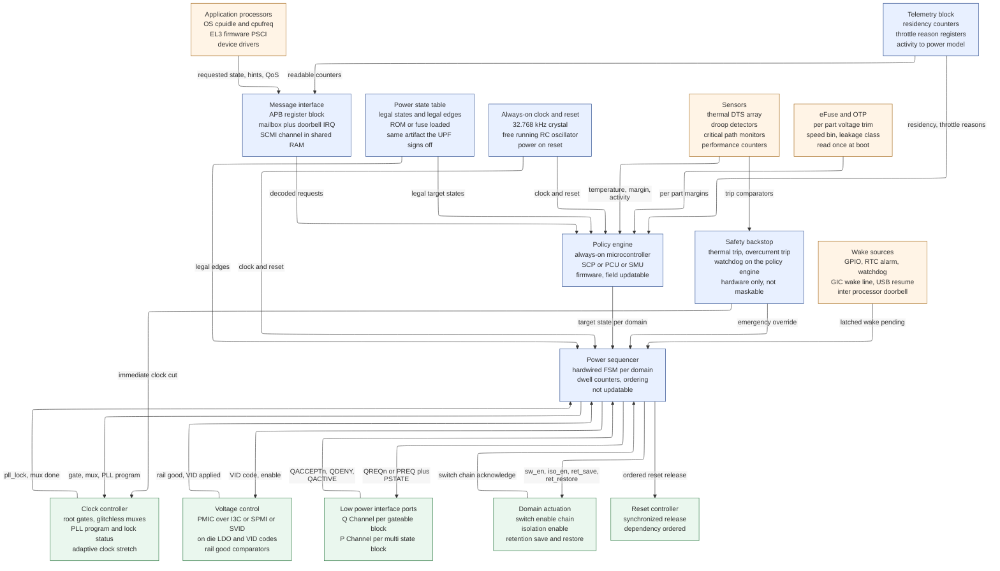
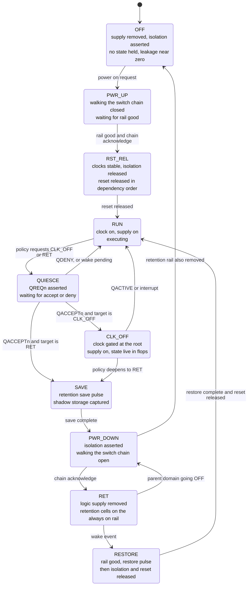

# Runtime Power Management — The Controller That Decides When to Turn Things Off

> **First-time-reader orientation:** every other page in this folder describes a *mechanism* — a clock gate, a power switch, an isolation cell, a table of voltage/frequency operating points. A mechanism is inert. Something must decide, at 3:47 PM on a Tuesday while a user scrolls a web page, that core 5 has been idle long enough to be worth powering off, assert the signals that do it in the right order, and get the core back before the next interrupt is late. That something is a **closed control loop** — sense, decide, actuate — implemented partly in hardware and partly in firmware, and it is the subject of this page.
>
> **Abbreviation key — skim now and return as needed:** Advanced Configuration and Power Interface (ACPI); always-on (AON); adaptive voltage scaling (AVS); adaptive voltage and frequency scaling (AVFS); clock-domain crossing (CDC); critical-path monitor (CPM); digital frequency-locked loop (DFLL); dynamic thermal management (DTM); digital thermal sensor (DTS); dynamic voltage and frequency scaling (DVFS); exponentially weighted moving average (EWMA); finite-state machine (FSM); generic interrupt controller (GIC); hart state management (HSM); hardware-controlled performance states (HWP); integrated clock gating cell (ICG); low-dropout regulator (LDO); low-power interface (LPI); operating performance point (OPP); one-time-programmable memory (OTP); phase-locked loop (PLL); power-management integrated circuit (PMIC); **power-management unit (PMU)** — note the collision with **performance-monitoring unit (PMU)**, disambiguated explicitly everywhere below; power-on reset (POR); Power State Coordination Interface (PSCI); power state machine (PSM); power state table (PST); quality of service (QoS); Running Average Power Limit (RAPL); supervisor binary interface (SBI); System Control and Management Interface (SCMI); system control processor (SCP); System Power Management Interface (SPMI); serial voltage identification (SVID); thermal interface material (TIM); Unified Power Format (UPF); voltage identification code (VID); wait-for-interrupt (WFI).
>
> **Prerequisites:** [Power Fundamentals](01_Power_Fundamentals.md) — you need the $P_{dyn}=\alpha C V_{DD}^2 f$ relation, the near-cubic $P \propto f^3$ DVFS law, and the minimum-energy point, because every control decision on this page is arithmetic on those. [Low-Power Architecture and Domain Partitioning](03_Low_Power_Architecture_and_Domain_Partitioning.md) — you need to know what a power domain, a voltage domain, and an always-on island *are*, because this page's controller lives in one and operates the others. [Power Reduction Techniques](04_Power_Reduction_Techniques.md) §3 — the survey of DVFS as a lever; this page is the loop that pulls it.
> **Hands off to:** [Power Gating, Retention, and Wake Sequencing](07_Power_Gating_Retention_and_Wake_Sequencing.md) — the switch circuit, switch sizing, rush-current limiting, the daisy-chained enable, retention-flop topology, and the physical power-down/up sequence this page's controller *drives*. [UPF/CPF Power Intent](05_UPF_and_CPF_Power_Intent.md) — the machine-readable declaration of the state table this page's FSM must stay inside. [Power Analysis and Signoff](06_Power_Analysis_and_Signoff.md) — the impedance and thermal models that set the limits this page's loops respect.

---

## 0. Why this page exists

Read the rest of this folder and you will know how to *build* every low-power mechanism a modern chip contains. You will know that clock gating removes the $f$ term for an idle block, that power gating removes the leakage term, that DVFS moves you along a near-cubic power curve, that isolation cells prevent a floating output from corrupting a live receiver, and that retention flops cost about 30 % extra area on the flops you apply them to. What you will not know is **who pulls any of these levers, on what evidence, in what order, and what happens when the evidence is wrong.**

That gap is not academic. It is where a startling fraction of real silicon bugs live. A missing isolation cell is caught by a UPF linter in five minutes. A power controller that services a wake request arriving in cycle 7 of a 14-cycle shutdown sequence by aborting into a state where the isolation is released but the supply has not recovered is caught, if you are lucky, by a formal property somebody thought to write, and if you are unlucky, by a customer whose phone fails to wake from sleep once every four days. The mechanisms are local and checkable. The controller is global, stateful, concurrent, spans hardware and firmware, and interacts with analog components whose behavior is not in any RTL model.

The framing of the page is a control loop. **Sense** — what does the chip know about its own demand, temperature, supply, and margin, and how accurately? **Decide** — what policy converts that evidence into a target state, and is that policy stable? **Actuate** — what sequence of signal assertions realizes the target state, how long does it take, and what invariant must hold at every instant during it? Every section below is one of those three, plus the properties the loop must have — latency bounds, stability, safety, and verifiability — that no single mechanism has on its own.

By the end you should be able to: draw the block diagram of a power-management unit and name every one of its interfaces; derive the four-signal quiescence handshake from first principles and say exactly what a device that refuses is promising; compute, for a given platform, whether finishing fast and sleeping beats running slowly, and get an answer that is neither of those two but the interior optimum between them; compute how many millivolts of guardband an adaptive-voltage loop recovers and how many watts that is worth; explain why a chip inside its power budget still throttles; and write the five formal properties that catch the bug classes simulation will not.

---

## 1. The baseline controller, and the five ways it fails

Follow the house method: build the simplest thing that could work, run a concrete trace through it, break it, and let each repair be forced by a specific failure rather than announced.

### 1.1 Baseline — a register bit and a wire

The simplest runtime power manager is a memory-mapped register. Software decides a block is idle and writes a bit; the bit drives the block's power-switch enable and its clock enable.

```c
/* The entire "power manager." */
#define PWRCTL_BASE   0x40010000u
#define PWRCTL_DOMAIN_USB   (1u << 3)

static inline void domain_off(unsigned mask) {
    *(volatile uint32_t *)(PWRCTL_BASE) &= ~mask;
}
static inline void domain_on(unsigned mask) {
    *(volatile uint32_t *)(PWRCTL_BASE) |=  mask;
}
```

```systemverilog
// The entire hardware side.
always_ff @(posedge clk or negedge rst_n) begin
  if (!rst_n) pwrctl_q <= '1;          // everything on out of reset
  else if (apb_write) pwrctl_q <= apb_wdata;
end

assign usb_sw_en  = pwrctl_q[3];       // drives the power switch enable
assign usb_clk_en = pwrctl_q[3];       // and the clock gate
```

**Trace it.** The USB controller has finished enumeration, gone idle, and the USB driver's runtime-PM callback fires. It writes `0` to bit 3. The clock gate closes, the switch chain opens, and the domain's 40 mW of leakage plus 15 mW of residual clock-tree power goes away. On a phone that spends 22 hours a day with no USB cable attached, this saves roughly $55\text{ mW}\times22\text{ h} = 1.21$ Wh per day, about 8 % of a 15 Wh battery. The scheme works, and for a small microcontroller with one processor, no fabric, and no concurrency, it is genuinely all you need. Hold on to that — it is the selection boundary we will return to in §1.7.

Now scale it to a chip with a coherent interconnect, eight cores, a GPU, three requesters per resource, and a thermal budget.

### 1.2 Failure 1 — a transaction in flight when the domain drops

The USB controller issued an AXI read to DRAM 200 ns before software wrote the register. The read address has been accepted; the read data has not returned. Software's view of "idle" came from an interrupt status bit that says the *descriptor* completed, not that every bus transaction it spawned has retired.

The clock stops. The USB controller's `RREADY` is now frozen at whatever value it held. The subordinate holds `RVALID` asserted forever waiting for a handshake that requires a clock edge that will never occur. In AXI the read-data channel of a given ID is ordered, so every subsequent response behind it is stuck; the interconnect's read-data buffer fills; the arbiter backpressures the other masters sharing that path; within a few microseconds the display controller misses its line buffer refill and the screen tears, and shortly after that the whole SoC is wedged with a perfectly protocol-legal transaction that simply never completes.

The structural fault: **software cannot see inside the block.** No amount of waiting fixes it, because there is no idle duration that *guarantees* quiescence — a block can be idle for 10 ms and acquire an outstanding transaction 1 ns later. The repair must let the block itself answer, and answer authoritatively. That is the handshake of §4.

### 1.3 Failure 2 — a wake request arriving mid-shutdown

Now suppose we fixed failure 1 and the block accepted quiescence. The shutdown is not instantaneous: gate the clock, wait, assert isolation, wait, pulse retention save, wait, walk the switch chain open over 64 cycles of the always-on clock to limit rush current. Call it 14 sequencer states and ~30 µs.

At sequencer state 7 — isolation asserted, retention saved, switch chain half open — a GPIO interrupt arrives. The domain must come back.

With a register bit and a wire, software writes `1`. What happens is undefined. The switch enable reverses direction mid-walk, so some switch segments are opening while others are closing, and the domain's internal rail sits at an intermediate voltage where the logic is neither functional nor safely off. Isolation is still asserted, so the block's outputs are clamped, so anything downstream that was waiting on it stays waiting. If the isolation control itself was (incorrectly) placed in the gated domain, it is now driven by a rail at 0.3 V and is producing a level that is neither a valid 0 nor a valid 1 into a live receiver, and the receiver's input stage burns crowbar current.

The structural fault: **the transition is not atomic and there is no place to put the fact that a wake is pending.** The repair is a sequencer with the property that once a transition starts it runs to a *stable* state, and a latched pending bit that is serviced from that stable state. That is §3.

### 1.4 Failure 3 — two requesters disagreeing

Core 0 and core 1 share a cluster with a shared L2. Core 0 enters idle and its idle driver decides the cluster can go to retention. Core 1, on a different physical core, took an interrupt 300 ns ago and is running. Both write the cluster's power register.

A register is last-writer-wins. Whichever store retires second determines the outcome, and the loser's requirement is silently discarded. If core 0's write lands last, core 1's L2 goes to retention underneath it and core 1's next cache miss returns garbage. The bug is a data-dependent, timing-dependent, once-per-hour memory corruption on a machine that passes every functional test.

The structural fault: **a register holds a *state*, but the callers are expressing *requirements*, and requirements from independent agents must be aggregated, not overwritten.** The repair is a vote/reference-count model with an order-independent aggregation function. That is §12.

### 1.5 Failure 4 — the controller lives in the domain it is gating

The most instructive failure. Software is running on the application processor. The last step of a system suspend removes the supply from the application processor's own domain.

```
str  w0, [x1]        // write PWRCTL = 0, removing this core's supply
ldr  w2, [x3]        // <-- this instruction is never fetched
```

The store retires, the switch chain opens, the core's rails collapse mid-pipeline. Nothing is left running. The register that would turn it back on is itself in a domain that was gated with everything else, so its content is gone; on the next power-on it resets to whatever the reset value is. If the reset value is "off," the chip is a brick until someone pulls the battery. If it is "on," the chip immediately powers back up and re-executes the suspend path, oscillating.

There is a subtler version that bites even when the register is correctly placed in an always-on domain: **the store may still be in the core's write buffer when the supply goes.** The core saw the store retire architecturally; the bus saw nothing. The domain never turns off, software believes it did, and the system's power accounting silently drifts.

The structural fault: **the agent performing the sequence cannot be inside the thing being sequenced.** The repair is an always-on island containing the controller, its registers, its clock source, and its reset. That is §2.

### 1.6 Failure 5 — nobody owns the timing

Even with all four repairs, one thing is missing from the register-and-wire model: it has no notion of *time*. How long after asserting isolation may you open the switch? How long after closing the switch is the rail good enough to release isolation? How long after that may you release reset?

These are not software questions. The switch-chain settling time is set by the switch sizing and the domain's capacitance ([Power Gating, Retention, and Wake Sequencing](07_Power_Gating_Retention_and_Wake_Sequencing.md) derives it); it is tens of microseconds and it must be enforced with a hardware counter, not a `for` loop whose duration changes when the compiler is upgraded. Getting it wrong in the safe direction wastes latency; getting it wrong in the unsafe direction releases isolation into a rail that has not yet reached its final value, and the domain's first few hundred cycles execute at a voltage where its timing does not close. The failure signature is a corrupted state machine in the block, once in a few thousand wakes, at cold temperature only.

The repair is a hardware sequencer with programmable dwell counters, characterized against silicon, and — critically — with a *handshake* from the physical layer (a rail comparator, an end-of-chain acknowledge) rather than a pure open-loop delay wherever one is available.

### 1.7 The repair map, and when the baseline is still right

| Failure | What breaks | Repair | Section |
|---|---|---|---|
| Transaction in flight | fabric deadlock | request/accept/deny handshake with the block | §4 |
| Wake mid-shutdown | domain in an electrically undefined state | atomic sequencer states plus a latched wake-pending bit | §3, §5 |
| Requesters disagree | one requirement silently lost, memory corruption | vote aggregation over a lattice, reference counting | §12 |
| Controller inside its own domain | brick or oscillation | always-on island with its own clock and reset | §2 |
| No timing ownership | isolation released into an unsettled rail | hardware dwell counters plus physical acknowledges | §2, §5 |

**Selection boundary.** All five failures require concurrency, a fabric, or multiple agents. A single-core Cortex-M0 microcontroller with an AHB-Lite bus, one master, no cache, no DVFS, and a peripheral set that is quiesced by the same code that gates it does not have any of them. For that part, a register bit and a wire is not a simplification — it is the correct design, and adding a Q-Channel to every peripheral would be pure cost. The threshold at which the baseline stops working is roughly: *more than one agent can request a state, or more than one transaction can be in flight when you stop the clock.* Almost every chip above a few hundred thousand gates crosses it.

---

## 2. The power-management unit as hardware

### 2.1 Where it lives, and why that is forced

Failure 4 forces the conclusion: the controller must be in a domain that is never removed. Concretely, a power-management unit (PMU — the *power* one; §2.6 disambiguates) occupies an **always-on (AON) island** with four properties, each of which is a direct consequence of a failure it prevents:

1. **Its own supply rail, never switched.** Fed either from a separate always-on regulator output or from the main rail through a path with no header switch. Consequence of failure 4: the last agent standing must still be standing.
2. **Its own clock source that does not depend on a PLL.** Typically a 32.768 kHz crystal (for real-time-clock alarms and long dwell timers) plus a free-running on-die RC oscillator in the 10–100 MHz range (for sequencing, where 30 µs of granularity from the 32 kHz clock would be absurd). Consequence: PLLs are among the things being turned off, so the sequencer cannot be clocked by one.
3. **Its own reset, released first.** The AON island comes out of power-on reset (POR) before anything else and stays out; every other reset in the chip is *generated by* the PMU. Consequence: something must exist to release the others.
4. **Physical separation in the floorplan.** The AON island is a placement region with its own rail, its own well ties, and level shifters on every boundary crossing. Consequence: it is a real voltage area, not a logical grouping.

The AON island is deliberately tiny — tens of thousands of gates against a die of billions — because everything in it leaks 24 hours a day at the deepest sleep state, and that leakage sets the chip's floor power. A phone in standby draws single-digit milliwatts; a badly scoped AON island can be half of it. There is constant pressure to move logic *out* of AON, and constant discovery that a piece of logic had to be there after all. The discipline is: AON contains the sequencer, the state registers, the wake logic, the timers, and nothing else. Policy, telemetry accumulation, and anything with a lookup table go in a domain that can itself be retained.

### 2.2 The block diagram



**Contract of the figure.** Blue is the always-on island; orange is evidence flowing in; green is actuation flowing out. Every blue block survives every power state except the chip being unplugged. The single arrow from `POL` to `SEQ` is the whole hardware/firmware boundary: firmware names a *target state*, hardware realizes it. Firmware never touches `PHY`, `CGU`, or `VREG` directly, and that restriction is what makes the sequencing verifiable — there is exactly one agent that asserts `iso_en`, and it is an FSM you can hand to a formal tool.

**One concrete trace.** The Linux `cpuidle` governor on core 5 selects a state whose PSCI encoding means "power down, affinity level 0." The kernel executes an `SMC` instruction; EL3 firmware saves the core's architectural state, then writes a message into the SCMI channel in shared RAM and rings the doorbell. `MB` raises an interrupt in `POL`. `POL` looks up the request against `PST`, sees that "core 5 off, cluster on" is a legal row, and hands `SEQ` a two-field command: domain = `CPU5`, target = `OFF`. `SEQ` asserts `QREQn` to core 5's Q-Channel port, waits for `QACCEPTn`, gates the clock through `CGU`, asserts `iso_en` and then `ret_save` through `PHY`, waits four AON ticks, walks the switch chain open over 64 ticks, and waits for the chain acknowledge. Total: about 30 µs of AON-clock time. Meanwhile `TEL` starts a residency counter that the OS will read later to check whether the governor's prediction was any good.

**The trade-off it shows.** Look at how many return arrows there are. Every one is a place where the sequencer *waits for a physical acknowledge* rather than counting a fixed delay, and every one costs a synchronizer, a timeout, and a defined behavior on timeout. An open-loop sequencer with pure counters is simpler and smaller, and it is what small parts ship — at the price of margining every counter for the worst corner, which makes every transition slower for every part. The closed-loop version is faster on typical silicon and has five more ways to hang.

### 2.3 What the PMU owns, interface by interface

| Interface | Direction | Physical form | What it carries | Failure if absent |
|---|---|---|---|---|
| Register block | in/out | APB or APB5 target, always-on | state requests, status, telemetry readback | no software control at all |
| Mailbox and doorbell | in/out | shared SRAM plus interrupt pair | SCMI or vendor messages, asynchronous notifications | polling wakes the thing you are measuring |
| Wake inputs | in | asynchronous levels/pulses into AON, double-synchronized | GPIO, RTC alarm, GIC wake, USB resume, doorbell | a sleeping chip that cannot wake |
| Low-power interface | out/in | Q-Channel or P-Channel per block | quiescence request, accept, deny, activity hint | §1.2 fabric deadlock |
| Clock control | out/in | gate enables, glitchless mux selects, PLL config, lock status | which clock, what frequency, is it stable | §5.1 glitch on the clock tree |
| Voltage control | out/in | I3C, SPMI, SVID, or PWM to the PMIC; direct VID to on-die LDOs | target rail voltage, rail-good confirmation | §7.4 voltage/frequency ordering violation |
| Domain actuation | out/in | switch enable chain, isolation enable, retention save/restore, chain ack | the physical power-down sequence | §1.5 undefined rail state |
| Reset control | out | per-domain reset, synchronized release, dependency ordered | who comes out of reset when | §5.4 inconsistent state after wake |
| Sensor inputs | in | DTS digital readouts, droop-detector flags, CPM tap counts, counter reads | temperature, margin, droop events, activity | blind control loop |
| Fuse/OTP | in | serial read at boot into AON shadow registers | per-part voltage trim, speed bin, leakage class | one voltage table for every part; §9 guardband |
| Safety backstop | out | direct clock-cut and shutdown paths, bypassing firmware | thermal trip, overcurrent trip, watchdog expiry | a hung policy engine destroys the chip |

The last row deserves emphasis. Everything else in the table is a normal design interface. The backstop is a **safety mechanism** in the functional-safety sense: it must operate correctly when the rest of the system, including the firmware that normally manages power, has failed. It is therefore hardwired, non-maskable, tested at every boot, and diagnosed for stuck-at faults. The argument structure — hazard, safety goal, safety mechanism, diagnostic coverage — is developed in [Functional Safety and Reliability Engineering](../08_Cross_Cutting_Engineering/02_Functional_Safety_and_Reliability_Engineering.md); here, note only that a thermal trip whose comparator is stuck low provides zero protection and that this is exactly the kind of latent fault a periodic self-test exists to find.

### 2.4 Why a hardware state machine, not firmware alone

The temptation is strong: put a small processor in the AON island and write the whole thing in C. Firmware is easier to write, easier to debug, and fixable after tape-out. Four arguments say no, and each is quantitative.

**1. The last step removes the supply from whatever executes it.** This is failure 4 restated. Somewhere at the bottom of a system-suspend sequence, the very last agent has to open a switch under its own feet. If that agent is a processor, it must first put itself in a state where it does not need to execute again — which means the actual final step is performed by something else. You cannot escape needing a hardware last step; you can only choose how much of the sequence it covers.

**2. Timing granularity and determinism.** The isolation-to-switch delay is a handful of nanoseconds to a few microseconds and must be *repeatable*. A firmware loop on a 32.768 kHz clock has 30.5 µs of granularity; a loop on a 50 MHz RC oscillator has 20 ns of granularity but is subject to interrupt latency, cache misses (if there is a cache), and whatever else the policy engine is doing. Hardware counters give you exactly the delay you characterized, every time, with jitter measured in single AON-clock cycles.

**3. Wake latency.** The published exit latency of a deep idle state is a contract the OS depends on (§6.5). A hardware sequencer restores a domain in tens of microseconds. A firmware path that must first wake the policy engine, run its interrupt handler, dispatch, look up a table, and issue commands adds hundreds of microseconds to milliseconds — enough to push a state past the point where the OS will ever choose it. Consider: if hardware wake is 40 µs and firmware wake is 400 µs, and the break-even residency scales with the round-trip cost, the firmware version's target residency is ten times longer, which means the state is entered in a small fraction of the idle windows the hardware version captures. **The controller's own latency directly determines how much of the available idle a chip can monetize.**

**4. It cannot be wrong at runtime.** A hardwired sequencer is a fixed function. It can be wrong *by construction* — that is a tape-out bug — but it cannot be corrupted by a stack overflow in an unrelated firmware feature, and it cannot be changed by a field update that was tested on a different board. For the ordering constraints where getting it wrong damages hardware (voltage before frequency; isolation before switch), that immutability is the point.

### 2.5 The split: sequencer versus policy

The line is drawn on a single question: **does this decision depend on information available only at runtime, and would we ever want to change it after tape-out?**

| Belongs in the hardware sequencer | Belongs in policy firmware |
|---|---|
| Ordering of `iso_en`, `ret_save`, `sw_en`, reset | *Which* domains to power down and *when* |
| Dwell counters between steps | Idle-duration prediction and governor heuristics |
| Q-Channel protocol compliance | Retry policy after a `QDENY` |
| Voltage-before-frequency invariant | Which OPP to target |
| Wake-pending latching and servicing | Which wake sources to arm for a given sleep depth |
| Emergency thermal and current trips | Throttling curve shape, hysteresis, per-product tuning |
| Refusing an edge that is not in the PST | Choosing among the edges that are |

The right mental model is that the sequencer implements a small set of **safe primitives** — "take domain D from state A to state B, correctly, in bounded time, or report why you could not" — and firmware composes them into a policy. The primitives are proven once, formally (§14.2). The policy is heuristic, tuned per product, changed in field updates, and allowed to be merely *good* rather than correct, because no policy choice can violate a safety invariant: the sequencer will refuse an illegal edge and the backstop will act regardless of what firmware wants.

This split has a name in every real SoC. On Arm platforms the policy engine is the **SCP** (system control processor), typically a Cortex-M class core running firmware from the Arm SCP-firmware project, talking to the OS over **SCMI**. On Intel it is the **PCU** (power control unit) running microcode-like "pcode." On AMD it is the **SMU** (system management unit). Qualcomm ships an **RPM/RPMh** (resource power manager) whose entire abstraction is exactly the vote aggregation of §12. Different names, same architecture, because the same five failures force it.

### 2.6 A note on the acronym collision

**PMU** means two unrelated things in this material and you will meet both in the same sentence eventually.

- **Power-management unit** — the subject of this page. An always-on hardware block plus firmware that sequences power states.
- **Performance-monitoring unit** — the per-core block of programmable counters that counts instructions retired, cycles, cache misses, and stall reasons. It is a *sensor* for the power-management unit (§7.1) and appears in the architecture manual next to the other privileged control registers; see [Privileged Architecture, CSRs, and Traps](../01_Architecture_and_PPA/01_CPU_Architecture/01_Core_Foundations/04_Privileged_Architecture_CSRs_and_Traps.md).

Below, "PMU" without qualification means the power one, and the performance one is always written out.

---

## 3. Power state machines and the power state table

### 3.1 The states of one domain, and why the transient ones matter

A power domain is usually described as having three or four states — on, clock-gated, retained, off. That description is what a *specification* contains. What the controller implements has roughly three times as many states, because every edge between the stable states is itself a multi-step sequence that can be interrupted, and an interrupted sequence must be in a named state or failure 2 (§1.3) returns.



**Contract of the figure.** Rounded reading: four stable states (`OFF`, `RUN`, `CLK_OFF`, `RET`) and six transient ones. The rule that makes this machine safe is that **transient states are non-preemptible**: once `SAVE` is entered, the sequence runs to `RET` regardless of what arrives, and a wake that lands during it is *latched* and serviced from `RET`. There is exactly one exception, and it is deliberate: `QUIESCE` may return directly to `RUN`, because in `QUIESCE` nothing physical has happened yet — no clock stopped, no isolation asserted, no charge moved. It is the only state where an abort is free.

**One concrete trace.** Core 5 is in `RUN`. Policy requests `RET`. `QUIESCE`: `QREQn` asserted, core drains its store buffer and its outstanding loads, asserts `QACCEPTn` after 90 core cycles. `SAVE`: the retention save pulse captures the flop shadow storage, 3 AON ticks. `PWR_DOWN`: `iso_en` asserted, 4 ticks of settle, switch chain walked open over 64 ticks, chain acknowledge returns. `RET`: the core is now costing about 0.8 mW of retention-cell leakage instead of 150 mW. 8.4 ms later a timer interrupt targets core 5. `RESTORE`: chain walked closed over 64 ticks, rail-good comparator trips at tick 71, restore pulse, isolation released, reset released for the non-retained logic, clock ungated. The core resumes at the instruction after the `WFI`. Total round trip about 62 µs of AON time.

**The trade-off it shows.** Count the transient states: six of ten. Each is a place the machine can sit, so each needs a timeout, a defined behavior on timeout, and a formal property. The alternative — collapsing the sequence into "one cycle, do everything" — is what the register-and-wire baseline did, and it is why it failed. **The transient states are not overhead; they are the sequence made observable and therefore verifiable.** The cost is that the state register is 4 bits instead of 2, and the verification obligation is proportional to states plus edges, not states alone.

### 3.2 Why a wake during a transient state must be latched, not acted on

Consider the alternative designs for handling a wake in `PWR_DOWN`.

**Design A — abort immediately.** Reverse direction: stop walking the chain open, walk it back closed, release isolation, resume. Latency is minimal. But the domain's rail is at an arbitrary intermediate voltage; the switch chain has segments in both states; retention cells were pulsed for save but the logic they shadow may or may not have been quiesced; and the abort path is a *new* edge into `RESTORE` from a state with no well-defined electrical precondition. Every one of those is a place a corner bug lives, and the abort path is exercised only under a race that is hard to hit in simulation and impossible to hit deterministically.

**Design B — latch and finish.** A single always-on flop:

```systemverilog
// Wake pending: set by any wake source, cleared only when the sequencer
// has actually returned the domain to RUN. Lives in the AON island and is
// clocked by the AON oscillator, so it is valid while the domain is dark.
always_ff @(posedge clk_aon or negedge rst_aon_n) begin
  if (!rst_aon_n)                       wake_pend_q <= 1'b0;
  else if (state_q == S_RUN)            wake_pend_q <= 1'b0;   // serviced
  else if (|wake_src_sync)              wake_pend_q <= 1'b1;   // sticky
end
```

The shutdown completes into `RET`. The `RET` state's very first action is to test `wake_pend_q` and, if set, immediately begin `RESTORE`. The worst-case cost is the remaining duration of the shutdown plus a full restore — for the numbers above, about 30 µs of shutdown plus 32 µs of restore, so a wake arriving one tick into `PWR_DOWN` costs roughly 62 µs instead of the ~10 µs an abort would have cost.

**Design B is what real controllers do**, and the reason is not conservatism but verifiability. Design B has *no new edges*: the wake path is exactly the normal wake path, exercised on every ordinary wake, and therefore exercised billions of times in emulation and in the field. Design A has an abort edge per transient state, each electrically distinct, each exercised only by a race. The 50 µs of extra worst-case latency buys the elimination of an entire bug class. When a design genuinely cannot afford it — a real-time controller with a hard 20 µs wake deadline — the correct response is not to add aborts but to *make the state shallower*, so the shutdown that could be interrupted is short enough that finishing it is cheap.

Note the one detail that makes the sticky flop work: `wake_pend_q` is set from a *synchronized* version of the wake sources and lives on the always-on clock. A pending bit clocked by the domain's own (stopped) clock is failure 2 with extra steps — the event arrives, and no edge ever occurs to register it. §5.2 generalizes this.

### 3.3 Composing domains: the parent/child rule and the last-man-standing race

One domain's machine is simple. The interesting behavior is compositional.

**The containment rule.** If domain $C$'s supply is derived from domain $P$'s (a child voltage area inside a parent, or a cluster inside an SoC power island), then $P$ off implies $C$ off. This is a physical fact, not a policy, and it produces two obligations: the PST must not contain a row with $P$ off and $C$ on, and the sequencer must refuse the edge that would create one. Concretely, the cluster cannot enter `OFF` while any core in it is in `RUN`, `CLK_OFF`, or `RET` — retention is still a supplied state.

**The last-man-standing race.** Cores 0 and 1 are the only cores in a cluster. Both execute `WFI` within 200 ns of each other. Both idle drivers evaluate "am I the last core down, and if so should the cluster power down too?" Both read a count of active cores, both see 1 (themselves), both conclude they are last, both request cluster power-down. Now two agents are running a cluster shutdown sequence concurrently.

The consequences range from harmless (the sequencer serializes the requests and the second is a no-op) to fatal (core 1 decides the cluster is going down, so it flushes the L2 and disables coherency, while core 0's request is still in flight and core 0 has not yet flushed — core 0's dirty lines are dropped).

The repair has three parts and all three are needed:

1. **An atomic decrement with the decision fused to it.** The "am I last?" test and the "mark myself down" action must be a single atomic operation on a variable in memory that is still accessible (which, on the way down, is a moving target — this is why the count lives in always-on SRAM or in a PMU register with atomic semantics, not in a cache line that is about to be flushed).
2. **A hardware lock in the always-on domain**, or a software mutual-exclusion algorithm that does not depend on coherency — the standard implementations use a Lamport bakery-style lock precisely because it works with plain loads and stores after coherency has been disabled. Arm Trusted Firmware's PSCI implementation contains exactly this, for exactly this reason.
3. **An abort check after the point of no return.** Between "I decided I am last" and "the cluster's supply is removed," another core may be woken by an interrupt. The last core down must re-check, with the lock held, immediately before committing, and the sequencer must have a defined behavior if the check fails — which is the `QUIESCE → RUN` edge in §3.1, and is the reason that edge exists.

**A composition table** for a two-core cluster makes the legal space concrete:

| Core 0 | Core 1 | L2 / cluster | SoC | Legal? | Why |
|---|---|---|---|---|---|
| RUN | RUN | ON | ON | yes | full performance |
| RUN | RET | ON | ON | yes | per-core gating, the common case |
| RET | RET | ON | ON | yes | cluster kept up for snoop response latency |
| RET | RET | RET | ON | yes | cluster L2 retained, deeper |
| OFF | OFF | OFF | ON | yes | cluster fully off, all state saved to DRAM |
| RUN | OFF | OFF | ON | **no** | containment: a running core needs its cluster |
| OFF | OFF | OFF | OFF | yes | system suspend, DRAM in self-refresh |
| RET | RET | OFF | ON | **no** | retention needs the cluster's retention rail |

Eight of the $4^2\times3\times2 = 96$ syntactic combinations are shown; the legal set is roughly a dozen. That collapse is the point of the next subsection.

### 3.4 The power state table as the shared contract

The PST is the enumerated list of legal combinations. [UPF/CPF Power Intent](05_UPF_and_CPF_Power_Intent.md) §6 owns the syntax — `create_pst`, `add_pst_state`, the supply-set naming, and the argument that enumeration collapses verification from $O(k^D)$ to $O(|\mathcal{L}|+|\mathcal{T}|)$. Read it there; it is not repeated here.

What this page owns is the **two-way obligation** that makes the PST a contract rather than a document.

**Obligation 1 — the controller's reachable set must be a subset of the PST rows.** Every state the power state machine can actually reach, from any reset state, under any sequence of legal inputs, must correspond to a row in the table. This is a reachability property, and it is *exactly* what a formal model checker computes for free. If the FSM can reach a combination the table does not list, the bug may be in either artifact — perhaps the table is missing a legal mode, perhaps the FSM has an edge it should not — but there is definitely a bug, and it is found by a tool in minutes rather than by a customer in months.

**Obligation 2 — the implementation must protect every PST row.** For each row, the synthesis and physical tools must guarantee that every boundary crossing between a powered and an unpowered supply has an isolation cell clamped to a safe value, every crossing between different voltages has a level shifter, and every retained element has its retention control valid in that state. This is what the UPF-driven flow checks.

The two obligations meet at the table and nowhere else. The FSM designer never reads the physical database; the physical implementer never reads the FSM. That decoupling is only sound if the table is *the same table* — one file, one owner, referenced by both — which in practice means the PST is generated from a single machine-readable source and consumed by the UPF file, the RTL parameter package, the formal property set, and the firmware's legal-state check. When a design maintains two hand-written copies, they diverge, and the divergence is discovered when a state the firmware thinks is legal turns out to have no isolation on one boundary.

**A worked collapse.** Take the two-core cluster: cores at 4 states each (`RUN`, `CLK_OFF`, `RET`, `OFF`), cluster at 3 (`ON`, `RET`, `OFF`), SoC at 2 (`ON`, `OFF`). Syntactically $4\times4\times3\times2=96$. Prune:

- SoC `OFF` forces everything below it off: that is 1 row, not 48. $96 \to 48+1 = 49$.
- Cluster `OFF` forces both cores `OFF`: of the 16 core combinations, 1 survives. $49 \to 49-16+1 = 34$.
- Cluster `RET` requires no core above `RET`: cores restricted to `{RET, OFF}`, so 4 of 16. $34 \to 34-16+4 = 22$.
- `CLK_OFF` is a transient convenience state that policy never composes with a cluster state change, so it is folded into `RUN` for PST purposes: cores drop to 3 states, cluster `ON` rows go from 16 to 9. $22 \to 22-16+9 = 15$.

Fifteen rows. Fifteen sets of isolation, level-shifter, and retention proofs, and fifteen nodes in the FSM's reachability graph, instead of ninety-six. Every additional row is a real mode that policy must be able to reach and firmware must be able to request; if there is no workload that spends measurable time in it, it should not be in the table, because it costs design effort, verification effort, and a place for a bug to hide, and returns nothing.

---

## 4. The quiescence handshake, derived

### 4.1 The requirement, restated precisely

From §1.2: a controller outside a block cannot determine whether the block is safe to stop, because safety depends on state only the block can observe — outstanding bus transactions, partially received serial frames, a refresh due in 2 µs, a pipeline with three instructions still in flight. Waiting longer does not help, because idleness is not a monotone property: a block idle for 10 ms can be busy 1 ns later.

Two consequences follow immediately, and they are the whole protocol.

**Consequence A — the controller must ask, not tell.** The decision is delegated to the only agent with the information. The controller issues a *request*; the block returns an *answer*; the answer is authoritative.

**Consequence B — the block must be able to refuse.** If the only possible answer is "yes, eventually," then a block that cannot become quiescent has to withhold its answer indefinitely. That stalls the controller (which, being a sequencer walking a list of domains, now cannot service any of them), makes the wait unbounded, blocks emergency requests behind a request the block will never answer, and destroys information — "still draining, ask again in 20 cycles" and "streaming at line rate, ask again in a millisecond" look identical from outside. A refusal that *terminates* the transaction fixes all four.

A third requirement is not a consequence of the first two but is forced by what happens *after* a successful quiescence: the block's clock is stopped, so the block cannot initiate anything. It needs an out-of-band way to say "I have work." Otherwise wake-up must come from software (which needs a running processor: microseconds to milliseconds) or from the controller polling (which means periodically restarting every stopped clock, spending exactly the energy the stopping was meant to save).

So: **request**, **accept**, **deny**, **activity hint**. Four signals, each forced by a specific failure. That is the AMBA Q-Channel, and it is not a coincidence — any protocol satisfying the three requirements above ends up isomorphic to it.

### 4.2 Mapping to AMBA Q-Channel

The four wires are `QREQn` (controller → device, active low, "please become quiescent"), `QACCEPTn` (device → controller, active low, "I am and will remain quiescent"), `QDENY` (device → controller, active high, "I cannot"), and `QACTIVE` (device → controller, active high, "I have or expect activity"). The complete signal table, the six-state encoding, the active-low polarity rationale, the reset relationship, and a synthesizable device-side implementation are in [AMBA Family Signals and Low-Power Interfaces](../01_Architecture_and_PPA/04_SoC_and_Chiplet_Architecture/03_Transaction_Protocols/02_AMBA_Family_Signals_and_Low_Power_Interfaces.md) §8. Read that section for the device side; this page is the controller side.

Two protocol rules matter enormously to the controller and are worth restating because they constrain the sequencer's design:

- **Once `QREQn` is asserted, the controller may not withdraw it until the device answers.** There is no edge from "requested" back to "running." This is what makes the protocol race-free — without it, the controller could withdraw in the same cycle the device accepted, and the two sides would disagree about whether the clock may stop. The cost lands on the sequencer: a controller that changes its mind (a wake arrives, a thermal emergency fires) must first wait for the device's answer. That is the `QUIESCE → RUN` edge in §3.1, and it is why `QUIESCE` has a timeout.
- **`QACTIVE` is advisory.** The controller is free to ignore it — a thermal cap or a forced low-power mode may keep a block gated despite its request. The device must remain correct while gated regardless.

### 4.3 The accepted sequence, from the controller's side

```wavedrom
{ "signal": [
  { "name": "aon_clk",   "wave": "p.............." },
  { "name": "QACTIVE",   "wave": "10............." },
  { "name": "QREQn",     "wave": "1.0............" },
  { "name": "QACCEPTn",  "wave": "1.....0........" },
  { "name": "QDENY",     "wave": "0.............." },
  { "name": "clk_en",    "wave": "1......0......." },
  { "name": "iso_en",    "wave": "0........1....." },
  { "name": "ret_save",  "wave": "0.........10..." },
  { "name": "sw_en",     "wave": "1...........0.." },
  { "name": "pmu_state", "wave": "3.4...5.6.7.8..", "data": ["RUN","QUIESCE","GATE_CLK","ISOLATE","SAVE","PWR_DOWN"] }
 ],
 "head": { "text": "Accepted quiescence: the device drains, accepts, and the sequencer walks the physical shutdown" }
}
```

**Contract.** Each tick is one always-on clock cycle; in a real design the dwell between `ISOLATE` and `SAVE` is a programmed counter of several ticks and the switch-chain walk in `PWR_DOWN` is 32–128 ticks, compressed here to keep the figure readable. The invariant the figure encodes: **no physical action precedes the accept.** `clk_en` does not fall until `QACCEPTn` is low; `iso_en` does not rise until `clk_en` has fallen; `ret_save` does not pulse until isolation is stable; `sw_en` does not fall until the save has completed. Each arrow of causality is one sequencer state, which is why there are five of them for what a specification calls "turn the block off."

**One concrete trace.** `QACTIVE` falls at cycle 1 — the block has gone idle and is hinting that now is a good time. The sequencer asserts `QREQn` at cycle 2. The block checks: transmit FIFO empty, no outstanding AXI transactions, no partially received frame. It takes cycles 2–5 to confirm — four cycles, because the check is a reduction over several internal status bits and the block registers the result rather than answering combinationally. `QACCEPTn` falls at cycle 6. The sequencer gates the clock at cycle 7, asserts isolation at cycle 9, pulses retention save at cycle 10, and begins opening the switch chain at cycle 12. The domain is dark at cycle 12 plus the chain walk.

**The trade-off it shows.** Look at cycles 2 through 6: four cycles in which the sequencer is committed and can do nothing else. A block that answers combinationally eliminates them but then cannot drain, so it must deny far more often. A block with a deep pipeline may take hundreds of cycles to drain, during which the sequencer holds the channel and — if it is a single shared sequencer walking a list of domains — cannot service any other domain. The design responses are a per-domain sequencer (area, but full parallelism), a sequencer that issues `QREQn` to several domains and collects answers out of order (complexity), or accepting the serialization and sizing the timeout so one slow block cannot starve the rest. Most SoCs pick the third for peripherals and the first for CPU cores, where wake latency is a published number.

### 4.4 The denied sequence, and exactly what the denier guarantees

```wavedrom
{ "signal": [
  { "name": "aon_clk",   "wave": "p.........." },
  { "name": "QACTIVE",   "wave": "1.........." },
  { "name": "QREQn",     "wave": "1.0...1...." },
  { "name": "QACCEPTn",  "wave": "1.........." },
  { "name": "QDENY",     "wave": "0...1...0.." },
  { "name": "clk_en",    "wave": "1.........." },
  { "name": "iso_en",    "wave": "0.........." },
  { "name": "sw_en",     "wave": "1.........." },
  { "name": "pmu_state", "wave": "3.4.5.6.3..", "data": ["RUN","QUIESCE","DENIED","BACKOFF","RUN"] },
  { "name": "retry_tmr", "wave": "2...2.....2", "data": ["idle","load 4 ms","expire"] }
 ],
 "head": { "text": "Denied quiescence: nothing physical happens, and the controller must decide when to ask again" }
}
```

**Contract.** A deny is a **complete, terminated transaction** — not an error, not a retry, not a fault. Note what does *not* move in this figure: `clk_en`, `iso_en`, and `sw_en` are flat. The controller took no physical action and none is unwound. The channel returns to `RUN` and the controller may ask again whenever it likes.

**One concrete trace.** `QREQn` asserts at cycle 2. The DRAM controller has a refresh scheduled in 1.4 µs and a write burst in its queue; it asserts `QDENY` at cycle 4. The controller is *obliged* to deassert `QREQn` — the denied state has no self-loop, so leaving the request asserted is a protocol violation — and does so at cycle 6. `QDENY` clears at cycle 8. The controller enters `BACKOFF`, loads a 4 ms retry timer, and moves to the next domain in its list. Four cycles of channel activity produced nothing but the information that this block is busy.

**Exactly what the denier must guarantee.** This is the part that is usually left implicit and is the source of the nastiest integration bugs. A device that asserts `QDENY` is making five promises:

1. **It is fully operational and will remain so.** It has taken no partial quiescence action. It has not drained its FIFOs, not stopped accepting new transactions, not entered a mode where its behavior differs from `RUN`. The deny path must be *side-effect free*, and this is easy to get wrong: a block that begins draining on `QREQn` and then discovers it cannot finish must be able to un-drain, or it must not begin.
2. **The answer is prompt and bounded.** A deny is only useful because it terminates the transaction quickly. A device that takes 10,000 cycles to decide to deny has reintroduced the unbounded wait the deny was invented to remove. The specification should carry a maximum decide latency, and it should be an assertion.
3. **`QDENY` deasserts in bounded time after `QREQn` deasserts.** Otherwise the channel is stuck in `Q_CONTINUE` and the controller can never issue another request. This is a liveness property and it is checkable formally.
4. **The condition causing the deny cannot persist indefinitely under any legal system input.** This is the liveness obligation that the four wires do *not* enforce. A device that denies forever is protocol-legal and functionally useless: the platform never reaches its idle state, the battery drains, and nothing in any simulation flags it. This must be an explicit, reviewed requirement in the device's specification — *state the exact conditions under which the device denies, and demonstrate that those conditions terminate* — with a corresponding assertion in the device's own testbench. The classic violation is a device that denies while any AXI transaction is outstanding, connected to a fabric that keeps a speculative prefetch permanently outstanding.
5. **A deny carries no reason and no suggested retry time.** The protocol deliberately says nothing about when to retry, because that is policy, not protocol. The controller must supply it.

**The retry policy is the controller's problem, and it is a real one.** Fixed-interval polling wastes energy: every retry costs a few cycles of channel activity and, more importantly, keeps the policy engine awake to run the timer. Exponential backoff is better but adds latency to the eventual success. The right answer is usually **event-driven**: rather than retrying on a timer, wait for `QACTIVE` to fall — the device is telling you it went idle — and issue `QREQn` then. That converts a poll loop into an interrupt and is why `QACTIVE` deassertion is as informative as its assertion. Fall back to a long timer only as a backstop for devices whose `QACTIVE` is pessimistic.

### 4.5 P-Channel: when two states are not enough

Q-Channel is binary — running or quiescent. That is exactly right for a clock gate, and wrong for anything with more than two power states.

Consider a CPU core with `RUN`, `CLK_OFF`, `RET`, and `OFF`. With Q-Channel the controller can only ask "become quiescent," and the device's accept means "I am quiescent" without any statement about which depth. The controller then chooses a depth, but the *device* is the agent that knows how expensive each depth is for it right now — a core with a dirty L1 can accept `CLK_OFF` cheaply and `OFF` only after a flush, and it may be willing to do one and not the other. Q-Channel cannot express "I accept `CLK_OFF` but deny `OFF`."

**P-Channel** extends the handshake with a state bus: `PSTATE` (controller → device, the requested state, encoded), `PREQ`, `PACCEPT`, `PDENY`, and `PACTIVE` (a vector, so the device can hint at several activity levels rather than one bit). The controller names the *target state* rather than just "stop," and the device accepts or denies that specific target. The signal table, the state machine, the `PSTATE` encodings, and the legal-state-sequence obligation are in [AMBA Family Signals and Low-Power Interfaces](../01_Architecture_and_PPA/04_SoC_and_Chiplet_Architecture/03_Transaction_Protocols/02_AMBA_Family_Signals_and_Low_Power_Interfaces.md) §9.

The one property worth pulling forward here, because it is the controller's obligation rather than the device's: **P-Channel requires the controller to respect the device's declared legal state sequence.** A device is not obliged to accept every transition between every pair of states; it declares which sequences are legal (typically: you may not jump from `RUN` straight to `OFF`, you must pass through an intermediate that lets the device save state). The controller's sequencer must therefore encode not just "what state do I want" but "what path gets there," and that path is exactly the edge list of §3.1. When a controller issues an illegal `PSTATE` sequence, the device's behavior is unspecified — which in practice means it denies, hangs, or corrupts, depending on how carefully its designer handled a case the specification told them could not occur.

**Selection boundary.** Use Q-Channel where the block has one quiescent state (peripherals, bridges, most clock gates). Use P-Channel where the block has a state ladder whose steps have different costs (CPU cores, GPUs, memory controllers, large accelerators). Using P-Channel everywhere costs a wider bus, a wider device-side FSM, and the legal-sequence obligation, for no benefit on a two-state block. Using Q-Channel where P-Channel is needed forces the controller to guess at costs it cannot see, which shows up as either overly conservative depth selection (energy left on the table) or a device that denies more than it should.

---

## 5. Clock and reset inside a power transition

The handshake tells you *when* it is safe to stop. This section is about *how* to stop, and the two things that go wrong: a clock that stops badly, and a reset that starts badly.

### 5.1 Stopping a clock without generating a glitch

A clock enable that is a plain AND gate is a bug. If `clk_en` changes while `clk` is high, the output produces a **runt pulse** — a short high period that may be long enough to be seen as an edge by some flops on the tree and not others, leaving the domain in a state where half its registers advanced. There is no recovery from that; the block's state is simply wrong, and the failure is intermittent because it depends on the phase relationship at the moment of gating.

The fix is the **integrated clock gating cell (ICG)**: a level-sensitive latch that samples the enable while the clock is *low*, so the enable presented to the AND gate can only change during the low phase. The clock therefore always stops low and always restarts with a clean full-width first pulse. The cell exists in every standard-cell library, synthesis infers it, and [Power Reduction Techniques](04_Power_Reduction_Techniques.md) covers its structure and its insertion. What the power controller must know:

- **Gate the root, not the leaves.** The purpose here is not activity reduction but *stopping the domain*, so the gate goes at the root of that domain's clock tree, where one cell controls everything. A domain gated only at its leaves still burns the tree's own switching power, which on a large block is 20–40 % of its clock power.
- **The enable itself must be timed.** The ICG's enable is a setup-timed signal like any other, and it comes from the always-on domain across a clock-domain boundary. It must be synchronized into the domain's clock — which means the domain's clock must still be running when you assert the gate request. Obvious in hindsight, and a classic bug in the reverse direction: an ungate request synchronized *by the gated clock* can never take effect.
- **The order relative to the handshake is fixed.** `QACCEPTn` first, then gate. Never the reverse, and never concurrently.

### 5.2 What a stopped clock does to every crossing that touches the domain

This is the part that surprises people. Stopping a clock is not merely "the block pauses." It changes the correctness argument of every clock-domain crossing (CDC) into or out of that domain, because every standard CDC structure assumes the destination clock keeps running.

**A two-flop synchronizer needs destination edges to resolve.** The structure works because a metastable first-stage output has a full destination clock period to settle before the second stage samples it. If the destination clock stops while the first stage is metastable, the metastable node holds — possibly at an intermediate voltage — for as long as the clock is stopped, which may be milliseconds. When the clock restarts, the second stage samples whatever it has become. The mean-time-between-failure calculation, which assumes a resolution window of one period, is invalid.

**Pulse synchronizers lose events outright.** A pulse synchronizer converts a one-cycle source pulse into a one-cycle destination pulse by toggling a level and edge-detecting it in the destination. If the destination clock is stopped when the toggle arrives, the toggle is still *there* when the clock restarts — a toggle-based pulse synchronizer survives. A naive design that instead widens the source pulse to "at least three destination cycles" does not, because three destination cycles never elapse. **Rule: any event crossing into a domain whose clock may stop must be encoded as a level or a toggle that persists until acknowledged, never as a pulse of bounded width.** This is the same reason the wake-pending flop in §3.2 lives on the always-on clock.

**Asynchronous FIFOs freeze safely but propagate stalls.** The gray-coded read pointer stops advancing, so the write side sees the FIFO gradually fill and then report full forever. That is *safe* — the flags are conservative in the right direction — but it is precisely the fabric backpressure of failure 1, arriving through a different door. It is why the Q-Channel exists on the fabric-facing side of a block and why a block's quiescence check must include "my FIFOs are empty," not merely "I have no outstanding transactions."

**Multi-bit vectors need a stability guarantee that outlives the stop.** A vector crossing into a stopped domain is captured on the first edges after restart. If the source changes it during the stop, the destination may capture a mix of old and new bits. The standard requirement — "hold the vector stable until the destination has acknowledged" — is unchanged in form but much longer in duration, and any source-side timeout that assumed a bounded destination response will fire spuriously.

**The general repair.** Treat "domain clock stopped" as a first-class case in the CDC review, not an afterthought. For each crossing, answer: does the source still change while the destination is stopped, and if so, is the encoding one that survives an arbitrarily long gap? The crossings that survive are toggles, levels held until acknowledged, and gray-coded pointers. The ones that do not are pulses, multi-cycle-path timing assumptions, and anything with a destination-side timeout.

### 5.3 Restarting the clock

Restart has its own ordering. The clock must be running and stable *before* anything downstream needs an edge:

1. **Rail good first.** Ungating a clock into a domain whose supply has not settled runs the logic at a voltage where its timing does not close. If the rail is at 0.55 V and the clock is at the 0.9 V frequency, every path with less than ~40 % slack fails. Wait for the rail-good comparator (or the characterized dwell counter, if there is no comparator).
2. **Then the clock source.** If the domain's clock comes from a PLL that was also stopped, the PLL must relock first — 10–50 µs, dominated by the loop bandwidth. During relock the PLL output is not merely the wrong frequency; it is sweeping, and feeding a sweeping clock into logic is a setup violation on every path at the moment the frequency overshoots. Either hold the domain's gate closed until `pll_lock` asserts, or run the domain from a slow always-on reference and glitchlessly switch after lock. The latter is how a core boots before its PLL is up.
3. **Then release isolation**, so the domain's outputs stop being clamped and start carrying real values.
4. **Then release reset** (§5.4).
5. **Then release the low-power interface** — deassert `QREQn`, wait for `QACCEPTn` to deassert, and only then consider the domain live.

Getting steps 3 and 4 backwards is a specific, common bug: releasing reset while isolation is still clamping means the block's first cycles out of reset see clamped inputs, which for a bus interface means it samples an idle bus that is not actually idle, and for a control input means it may latch a spurious command.

### 5.4 Reset release, and why it must be synchronous

Reset assertion may be asynchronous — that is the point of asynchronous reset, it works with no clock. **Release must be synchronous to the destination clock**, and the reason is a race.

Consider a reset tree spanning 50,000 flops in a domain. The tree has skew: flops near the driver see the release edge perhaps 400 ps before flops at the far end. If the release is asynchronous, it lands at an arbitrary point relative to the clock edge. Flops that see it 400 ps early may capture their first post-reset value on the *same* clock edge that flops seeing it late are still being held reset through. The result: a state machine whose state bits come out of reset in different cycles, landing in an encoding that is not its reset state and possibly not any legal state. On a one-hot encoded FSM, that is two hot bits or none; on a gray-coded FIFO pointer, it is a pointer that is not gray-adjacent to anything.

The standard repair is the **reset synchronizer**: assert asynchronously, release synchronously.

```systemverilog
// Reset synchronizer, one per clock domain. Asserts asynchronously with the
// incoming reset; releases only on a rising edge of the domain's own clock,
// two cycles after the incoming reset deasserts.
module reset_sync (
  input  logic clk,          // the destination domain's clock
  input  logic arst_n,       // asynchronous reset from the PMU, active low
  output logic rst_n         // synchronized reset to the domain
);
  logic [1:0] sync_q;

  always_ff @(posedge clk or negedge arst_n) begin
    if (!arst_n) sync_q <= 2'b00;
    else         sync_q <= {sync_q[0], 1'b1};
  end

  assign rst_n = sync_q[1];
endmodule
```

Two consequences for the power controller, both easy to get wrong:

**The domain's clock must be running before the reset synchronizer can release.** The synchronizer needs two rising edges. A sequencer that deasserts `arst_n` while the domain's clock is still gated leaves `rst_n` asserted indefinitely, and the domain never starts. Symptom: a peripheral that works when the debugger has been attached (because the debugger left its clock ungated) and hangs otherwise.

**Reset release must be ordered across domains by dependency.** A subordinate must be out of reset before any master can send it a transaction; the interconnect must be out of reset before either. So the release order on a full wake is: always-on and clock/reset infrastructure → interconnect → memory controller → subordinates → masters → processors. Release a master first and its boot code issues a transaction into a fabric that is still in reset, which either drops it silently (no response, master hangs on the read) or returns a decode error the boot code does not expect. This ordering is a table in the PMU, and it is one of the things the sequencer owns rather than firmware.

**Retention interacts with reset in a way that is easy to invert.** A retained flop's shadow storage holds state across the power-down. If reset is released to the *retained* logic on wake, the reset wipes the state that retention just spent 30 µs and a milliwatt-hour restoring. The correct sequence is: rail good → restore pulse → release reset **only to the non-retained logic**, with retained flops either excluded from the reset tree or held in a mode where reset does not affect the shadow. The flop topology that makes this possible — and the trade-off in area and the save/restore timing — is [Power Gating, Retention, and Wake Sequencing](07_Power_Gating_Retention_and_Wake_Sequencing.md)'s subject. The controller's obligation is only the ordering: restore before reset release, and reset the right subset.

---

## 6. The software interface: what the OS is allowed to know

Everything so far has been hardware. But the agent with the best information about future demand is the operating system — it knows which timers are armed, which threads are runnable, and which device drivers have latency requirements. The interface between that knowledge and the hardware sequencer is a set of standardized abstractions, and the abstraction is always the same shape: **hardware publishes a menu with prices; software picks an item.**

### 6.1 ACPI C-states: the idle menu

The Advanced Configuration and Power Interface (ACPI) defines **C-states**, the processor idle states. `C0` is executing. Everything above it is a depth of idleness, and the numbering is only loosely standardized above `C1` — what matters is the two numbers attached to each entry.

| State | What is removed | Exit latency | Target residency | Core power, order of magnitude |
|---|---|---|---|---|
| C0 | nothing, executing | — | — | 200–3000 mW |
| C1 (`HLT` / `WFI`) | core clock gated | ~1 µs | ~2 µs | ~50 mW |
| C1E | plus voltage dropped to the minimum operational point | ~10 µs | ~20 µs | ~25 mW |
| C6 | core supply removed, architectural state saved to an always-on SRAM | 50–150 µs | 300–600 µs | ~1 mW |
| PC2 (package) | ring interconnect partly idle, LLC still coherent | ~100 µs | ~500 µs | — |
| PC6 | last-level cache flushed, uncore powered down | 0.5–3 ms | 3–10 ms | — |
| PC8–PC10 | plus PLLs off, voltage regulator in low-quiescent mode | 1–5 ms | 10–50 ms | — |

Values are representative orders of magnitude, not a datasheet; the exact numbers are per-part and are what the platform publishes to the OS in the ACPI tables (`_CST` objects) or, on Arm platforms, in the device tree or via SCMI.

**Why exit latency is published.** Because it is a *promise the OS budgets against*. An audio driver with a 1 ms DMA period cannot tolerate a 3 ms wake; if it did not know the number it would have to assume the worst and forbid all deep states, or assume the best and produce audible dropouts. Publishing turns a hidden hazard into a constraint the OS can arbitrate (§6.5).

**Why target residency is published.** Because entering a state costs energy, and the state only pays if you stay long enough to amortize it. Target residency is the break-even, and it is derived, not measured:

$$T_{residency} = \frac{E_{entry} + E_{exit}}{P_{shallow} - P_{deep}}$$

Work it for C6 against C1 on the numbers above. The round-trip energy is dominated not by the sequence itself but by **cache re-warming**: entering C6 flushes L1 and L2, so on wake the core refetches its working set. Take a 64 KB working set at roughly 15 pJ per bit delivered from DRAM through the fabric: $64\times1024\times8 \times 15\text{ pJ} = 7.9$ µJ, plus tag and fabric overhead, plus about 5 µJ for the save/restore sequence and the regulator's response — call it 20 µJ round trip. The power difference is $50 - 1 = 49$ mW. Then

$$T_{residency} = \frac{20\ \mu\text{J}}{49\ \text{mW}} = 408\ \mu\text{s}$$

which lands squarely in the 300–600 µs range real parts publish. Notice what dominates: **the sequence is cheap, the cache is expensive.** That is why deeper package states, which flush the last-level cache, have residencies in milliseconds rather than microseconds — flushing and refilling 8 MB of LLC is roughly two orders of magnitude more energy than flushing 64 KB.

### 6.2 P-states and S-states

**P-states** are performance states *within* `C0` — the DVFS operating points of §7, exposed as an ordered list with `P0` the fastest. Historically the OS picked one and wrote a register. Two things changed that. First, the OS's sampling interval (10 ms) is thousands of times longer than the interesting timescale of a workload's phase changes. Second, the hardware knows things the OS cannot see: the current thermal headroom, whether other cores are drawing power from a shared budget, whether this core is memory-stalled. So modern parts moved P-state selection into hardware — Intel calls it HWP (hardware-controlled performance states, marketed as Speed Shift) — and the OS's role degraded to a *hint*: an energy-performance preference from 0 (maximum performance) to 255 (maximum efficiency), plus optional minimum and maximum bounds. Arm's equivalent flows through SCMI's performance protocol to the SCP.

This is a general pattern worth naming. **As a control loop's interesting timescale drops below the OS's scheduling granularity, the loop migrates into hardware and the OS interface becomes a constraint rather than a command.** The same migration happened for idle-state selection on some parts, and for thermal throttling on all of them.

**S-states** are system sleep states, and they are qualitatively different because they involve the whole platform, not the processor.

| State | What survives | Resume time | Typical platform power |
|---|---|---|---|
| S0 | everything, working | — | 2–20 W |
| S0ix / modern standby | DRAM in self-refresh, SoC in a deep package state, network wake armed | 0.1–1 s | 5–50 mW |
| S3 (suspend to RAM) | DRAM contents only, in self-refresh; everything else unpowered | 0.5–2 s | 5–30 mW |
| S4 (hibernate) | nothing; DRAM image written to non-volatile storage | 5–30 s | ~0 |
| S5 (soft off) | nothing; a full boot on resume | 20–60 s | ~0 |

The interesting engineering is in `S0ix`, because it is not really a sleep state — the platform remains in `S0` and the OS remains running. It works only if *every* device in the system independently reaches its own idle state, which means one misbehaving driver that holds a device awake defeats it entirely. That is failure 3 (§1.4) at platform scale, and it is why Windows and Linux both ship tooling whose entire purpose is to name the component that blocked the deep state.

### 6.3 PSCI: the firmware ABI

On Arm platforms the OS does not touch the power hardware. It calls into EL3 firmware through the **Power State Coordination Interface (PSCI)**, a function-call ABI invoked with an `SMC` instruction. The argument for the indirection is threefold: the sequence needs privilege the OS should not have; the sequence is platform-specific and would otherwise be duplicated in every OS; and a hypervisor can intercept the calls to virtualize power management for guests that believe they own the hardware.

The core functions:

| Function | Meaning | Return behavior |
|---|---|---|
| `CPU_SUSPEND(power_state, entry_point, context_id)` | enter a low-power state | returns normally if the state was standby; resumes at `entry_point` if it was a power-down |
| `CPU_OFF()` | power this core down until someone calls `CPU_ON` for it | never returns |
| `CPU_ON(target, entry_point, context_id)` | another core powers this one up | returns to the caller |
| `SYSTEM_SUSPEND(entry_point, context_id)` | suspend the whole system; only legal when all other cores are off | resumes at `entry_point` |
| `AFFINITY_INFO(target, level)` | is this core or cluster on, off, or in transition | queried during the last-man-standing check |
| `SYSTEM_OFF`, `SYSTEM_RESET` | platform shutdown and reboot | never return |

The `power_state` parameter carries a **state ID** (which platform-defined depth), a **state type** bit distinguishing *standby* (context preserved, the call returns) from *power-down* (context lost, resume at the entry point), and an **affinity level** naming the scope — core, cluster, or system.

Two mechanisms in PSCI are worth understanding because they are where the interesting bugs live.

**Last-man-standing coordination.** Cluster power-down requires every core in the cluster to be down. §3.3 covered the race; PSCI is where it is implemented, with a lock in memory that is accessible after coherency has been disabled, an atomic decrement fused to the "am I last?" test, and a re-check immediately before commit.

**Platform-coordinated versus OS-initiated mode.** In **platform-coordinated (PC)** mode, each core requests only its own state, and firmware infers the cluster and system states from the aggregate. Simple, and the OS needs no knowledge of the topology. But firmware must guess: it knows core 3 is going down, and it does not know that core 3's next timer fires in 200 µs while core 1's fires in 40 ms. In **OS-initiated (OSI)** mode, the OS explicitly requests the composite state — "core 3 down, and also the cluster, and also the L2" — because the OS *does* know every core's next wake deadline and can compute the deepest state whose exit latency fits the earliest of them. OSI produces better decisions and moves the correctness burden to the OS: the OS must now guarantee it never requests a cluster power-down while a sibling core is up, which reintroduces the last-man-standing race in software. Most production Arm platforms ship PC mode for exactly that reason, and enable OSI where the residency data justifies the risk.

### 6.4 SBI: the same ABI, one rung lower on the privilege ladder

RISC-V reaches the same structure as PSCI, on a differently shaped privilege stack. Its three modes are **M (machine)**, **S (supervisor)**, and **U (user)**; M is the most privileged, and [Privileged Architecture, CSRs, and Traps §2](../01_Architecture_and_PPA/01_CPU_Architecture/01_Core_Foundations/04_Privileged_Architecture_CSRs_and_Traps.md) draws it *beneath* the operating system rather than above it, because what lives there is firmware and a security monitor that must be isolated **from** the kernel. The S-mode kernel therefore calls *down* into M-mode firmware through the **Supervisor Binary Interface (SBI)**, a function-call ABI invoked with an `ECALL` instruction: `a7` names the extension, `a6` the function inside it, `a0`–`a5` carry arguments, and the return is an error/value pair. **OpenSBI** is the reference implementation and what most platforms ship. The comparison is the point: **PSCI is an ABI to EL3 firmware reached by `SMC`; SBI is an ABI to M-mode firmware reached by `ECALL` — same shape, same three justifications for the indirection, opposite end of the privilege ladder.**

Power management lives in the **HSM (hart state management) extension**, where a **hart** (hardware thread) is RISC-V's name for the unit PSCI calls a core.

| Function | Meaning | Return behavior |
|---|---|---|
| `sbi_hart_start(hartid, start_addr, opaque)` | bring a stopped hart up | returns to the caller; the target enters S-mode at `start_addr` |
| `sbi_hart_stop()` | park this hart until another hart starts it | never returns |
| `sbi_hart_suspend(suspend_type, resume_addr, opaque)` | enter a low-power state | returns normally if retentive; resumes at `resume_addr` if non-retentive |
| `sbi_hart_get_status(hartid)` | which state that hart is in | returns the state code |
| `sbi_system_suspend(sleep_type, resume_addr, opaque)` (SUSP extension) | suspend the whole system to RAM | resumes at `resume_addr`; refuses unless every other hart is `STOPPED` |
| `sbi_system_reset(reset_type, reset_reason)` (SRST extension) | shutdown, cold reboot, or warm reboot | never returns |

Those calls move a hart around a seven-state machine: `STARTED`, `STOPPED`, and `SUSPENDED`, plus four transient states — `START_PENDING`, `STOP_PENDING`, `SUSPEND_PENDING`, `RESUME_PENDING` — architected for exactly the reason §3.1 gives in hardware: a state that takes time to reach must be observable *while* it is being reached, or a second requester cannot tell "already there" from "on the way."

**The retentive/non-retentive split is one bit.** `suspend_type` is a 32-bit value whose **top bit** selects the class. Clear is *retentive*: architectural state survives and the call returns to the next instruction, so `resume_addr` is never used. Set is *non-retentive*: state is lost and the hart resumes at `resume_addr` with `a0 = hartid` and `a1 = opaque`, indistinguishable from a fresh start. `0x0000_0000` and `0x8000_0000` are the two defaults, with platform-defined depths occupying ranges on either side of the same line. That bit is [Power Gating, Retention, and Wake Sequencing](07_Power_Gating_Retention_and_Wake_Sequencing.md) §7.4 and §8 turned into an ABI field: below it, state sits on the always-on rail in retention flops and the wake pays a restore sequence in the 1–30 µs band; above it, the rail collapses fully, retention leakage goes to zero, and the wake pays a rebuild. One bit of a firmware argument picks a rung on that residency ladder.

**The honest difference: SBI has no mode negotiation.** PSCI's platform-coordinated versus OS-initiated split exists because `CPU_SUSPEND` carries an *affinity level*, so the OS can name a composite core/cluster/system state. `sbi_hart_suspend` has no such parameter and `sbi_hart_get_status` reports one hart rather than a cluster, so there is nothing to request above hart scope: every RISC-V platform is effectively platform-coordinated, with M-mode firmware doing its own last-hart determination from the per-hart states it already tracks. The OS's knowledge of wake deadlines re-enters out of band — Linux's `cpuidle-riscv-sbi` driver reads a per-state `riscv,sbi-suspend-param` from the device tree, so a platform-defined `suspend_type` value *is* the depth request, with its meaning supplied by the platform description instead of an architected encoding. At system scope the §3.3 race changes character: `sbi_system_suspend` states as an entry criterion that every other hart already be `STOPPED`, and firmware that finds otherwise returns an error rather than racing. A precondition and an error code replace a race — cheaper to implement and far cheaper to verify, paid for by requiring the OS to genuinely stop every other hart instead of letting them idle deeply.

The retentive idle primitive underneath all of it is `WFI` (wait for interrupt), whose semantics — a *hint* an implementation may legally treat as a `NOP`, waking on $\texttt{mip} \wedge \texttt{mie}$ whether or not the interrupt is taken — are derived in [Privileged Architecture, CSRs, and Traps §9.4](../01_Architecture_and_PPA/01_CPU_Architecture/01_Core_Foundations/04_Privileged_Architecture_CSRs_and_Traps.md) and not repeated here. On a platform with nothing deeper to offer, a default retentive `sbi_hart_suspend` is permitted to be precisely a `WFI`.

### 6.5 The `cpuidle` contract and the prediction problem

Linux's `cpuidle` framework is the concrete instance of "hardware publishes a menu, software picks." A driver (`intel_idle`, `psci`, `acpi_idle`) registers a table of states, each with `exit_latency_ns`, `target_residency_ns`, and an enter function. A **governor** picks one. The selection rule is:

```c
/* Simplified idle-state selection. The real governors add history-based
   correction and per-state hit/miss statistics; the constraint structure
   is exactly this. */
int select_idle_state(struct cpuidle_driver *drv,
                      u64 predicted_idle_ns,
                      u64 latency_limit_ns)
{
    int chosen = 0;                       /* index 0 is always the shallowest */

    for (int i = 1; i < drv->state_count; i++) {
        /* Hard constraint: a registered QoS requirement forbids this state. */
        if (drv->states[i].exit_latency_ns > latency_limit_ns)
            break;
        /* Economic constraint: we do not expect to stay long enough to pay
           back the entry cost, so entering it loses energy. */
        if (drv->states[i].target_residency_ns > predicted_idle_ns)
            break;
        chosen = i;
    }
    return chosen;
}
```

Two constraints, and they are different in kind. The latency limit is a **safety constraint** supplied by PM QoS: any driver or userspace process may register a maximum tolerable wake latency (`/dev/cpu_dma_latency` in Linux), and the governor may never choose a state that violates it. The residency check is an **economic constraint**: violating it is not incorrect, only wasteful.

Everything therefore depends on `predicted_idle_ns`, and that prediction is genuinely hard. It has two components:

- **The next timer expiry** is known *exactly*. The kernel knows when the next armed timer fires. This is an upper bound on the idle duration, and it is why "tickless idle" mattered so much: a periodic 1 ms scheduler tick guarantees the predicted idle is never more than 1 ms, which structurally forbids every state with a longer residency.
- **Non-timer wakeups** — an interrupt from a network card, a disk completion, a user's finger — are not known and must be predicted from history. The `menu` governor took the timer bound and multiplied it by a correction factor learned from how often past idles were cut short. The `teo` (timer events oriented) governor, which replaced it as the default, keeps histogram bins of recent idle durations and estimates the probability that the actual idle will be shorter than the timer says.

**What happens when the prediction is wrong, in each direction.**

**Over-prediction (predicted long, actual short; picked too deep a state).** The core enters C6, and 80 µs later an interrupt arrives. Two costs. *Energy:* the 20 µs of entry and exit sequence plus the cache re-warm — the full 20 µJ — bought only 80 µs at 1 mW instead of 80 µs at 50 mW, saving $49\text{ mW}\times80\ \mu\text{s} = 3.9$ µJ. Net loss: $20 - 3.9 = 16.1$ µJ, per occurrence. *Latency:* the wake took 50–150 µs longer than it would have from C1. On an interactive workload that latency is the visible cost — it shows up as input-to-photon jitter, and on a workload with a chain of dependent wakeups (interrupt → thread → another thread) it multiplies.

**Under-prediction (predicted short, actual long; picked too shallow a state).** The core sits in C1 for 5 ms when it could have been in C6. Cost: $(50-1)\text{ mW}\times5\text{ ms} = 245$ µJ of pure waste, minus the 20 µJ it would have spent entering C6, so 225 µJ lost. There is no latency cost and no correctness cost.

**The asymmetry is the whole design problem.** Over-prediction has a *visible* cost (latency, jitter, a user complaining that the phone feels slow) and a small energy cost. Under-prediction has a large energy cost that is completely *invisible* — nothing misbehaves, nothing is slow, the battery just drains faster and nobody can point at a cause. Governors are therefore tuned conservatively, biased toward shallower states, and the resulting energy loss is real and large. On the numbers above, under-predicting one 5 ms idle costs 14 times more energy than over-predicting one 80 µs idle. The only way to see it is telemetry: a per-state residency histogram compared against the distribution of actual idle durations, which is §13's subject and which is why that section exists.

---

## 7. DVFS as a control loop

[Power Reduction Techniques](04_Power_Reduction_Techniques.md) §3 establishes DVFS as a lever: the near-cubic $P \propto f^3$ relation, the characterized OPP table, and the ordering rule. This section is the loop that pulls it — what it senses, how it decides, how long the actuation takes, and why a naive version oscillates.

### 7.1 Sensing: four signals, in increasing order of usefulness

**Utilization.** The fraction of wall-clock time the core was not idle. Trivially available, and misleading in a specific and important way: a core that is 100 % busy executing a pointer-chasing loop is *stalled*, not compute-bound. Its instructions-per-cycle might be 0.1. Doubling its frequency doubles the number of cycles it spends waiting for DRAM and delivers almost no additional work, because DRAM latency is fixed in nanoseconds and does not scale with the core clock. You have paid $2^3 = 8\times$ the power for perhaps 5 % more throughput. This failure mode is not rare — it is the common case for database, graph, and pointer-heavy workloads.

**Performance-monitoring-unit counters.** The repair. Every modern core exposes counters for instructions retired, cycles, and stall cycles attributed by reason (front-end, back-end, memory). A memory-boundedness ratio — say, cycles stalled on outstanding last-level-cache misses divided by total cycles — separates the two cases. A governor that scales frequency in proportion to $(1 - \text{stall fraction})$ rather than to raw utilization stops paying cubic power for memory latency. The cost is that the counters must be read, which is a privileged access costing tens to hundreds of cycles, so the sampling rate is bounded.

**Queue occupancy.** For a throughput engine — a GPU, a video decoder, a network accelerator — the depth of its command or descriptor queue is a *direct* measure of demand, and a far better one than utilization. A queue that is growing means the engine is under-provisioned; a queue that drains to empty and stays there means it is over-provisioned. This is the classic setting for a proportional controller with an integral term on queue depth, and it is what device-frequency governors (`devfreq` in Linux) use.

**Scheduler-supplied utilization.** The best signal for a CPU, because it comes from the agent that knows what is runnable. Linux's per-entity load tracking maintains a decayed running average of each task's demand; the `schedutil` governor consumes it directly and updates the frequency *at scheduling events* rather than on a sampling timer. That eliminates an entire term from the loop's delay — the up-to-10-ms wait for the next sample in the older `ondemand` design — and it means a task waking up can raise the frequency in the same microsecond it becomes runnable.

### 7.2 Deciding: the governors, and what each one is actually a controller for

| Governor | Control law | Right answer when |
|---|---|---|
| `performance` | $f = f_{max}$, constant | benchmarking; hard real-time where determinism beats watts; a machine plugged into a wall with a thermal budget to spare |
| `powersave` | $f = f_{min}$, constant | a background node whose completion time nobody measures |
| `ondemand` | sample every $T_s$; if $u > u_{up}$ jump to $f_{max}$, else $f \propto u$ | legacy; superseded but still the clearest illustration of the oscillation failure |
| `conservative` | like `ondemand` but steps up one OPP at a time | thermally constrained parts where a jump to max causes a droop or a thermal excursion |
| `schedutil` | $f = C \cdot f_{max}\cdot u_{inv}$, updated at scheduling events, $C=1.25$ | the modern default on Linux for CPUs |
| hardware (HWP, SCP) | proprietary, microsecond-scale, with visibility into thermal and current headroom | anything where the interesting timescale is below the OS's |

**The 1.25 headroom factor, derived.** Suppose you use frequency-invariant utilization $u_{inv}$ — a measure of *work* rather than *time*, normalized so that $u_{inv}=1$ means the task needs the full capacity of the fastest OPP. The naive law is $f = f_{max}\cdot u_{inv}$: give it exactly the capacity it used. Now trace it. At that frequency the core is exactly 100 % busy. There is no slack. If the task's demand grows by 1 %, the core cannot absorb it; the extra work queues, and the governor only learns about it *after* a deadline has already slipped. Worse, at 100 % busy the measured utilization saturates and carries no information about how much more demand there is.

Setting $f = 1.25\,f_{max}\,u_{inv}$ targets $1/1.25 = 80\,\%$ busy at the chosen frequency, reserving 25 % of headroom to absorb growth between updates. That is a deliberate energy-for-responsiveness trade: running 25 % faster than strictly needed costs roughly $1.25^3 - 1 \approx 95\,\%$ more power than the minimum-energy choice *for the duration of the work*, in exchange for never being caught flat-footed by a demand increase. Products tune $C$; a value near 1.25 is the shipped default because below about 1.1 the system feels sluggish under bursty load and above about 1.4 the energy cost stops buying measurable responsiveness.

### 7.3 Actuating: what the transition physically costs

| Step | Mechanism | Typical time | Why |
|---|---|---|---|
| Voltage command | I3C or SPMI write to an external PMIC | 3–8 µs | serial bus transaction plus the PMIC's own internal latency |
| Voltage command | SVID to a server VRM, or a direct VID to an on-die LDO | 0.2–2 µs | parallel or fast-serial, no external bus |
| Voltage slew | buck converter output ramp | 5–20 mV/µs | limited by inductor current ramp and output capacitance |
| Voltage slew | on-die LDO | 50–500 mV/µs | no inductor; efficiency is $V_{out}/V_{in}$ |
| Settle and confirm | rail-good comparator, or a characterized dwell | 2–10 µs | overshoot must decay below the timing margin |
| Frequency, PLL relock | reprogram feedback divider and wait for lock | 10–50 µs | set by the PLL loop bandwidth |
| Frequency, post-PLL divider | change divide ratio through a glitchless mux | 1–4 cycles | no relock; only reaches $f_{PLL}/N$ |
| Frequency, ping-pong PLL | bring a second PLL to the target while running on the first, then mux | 0.1–0.5 µs at the switch | the relock is hidden behind normal execution |

**The transition is dominated by voltage on the way up and by nothing in particular on the way down.** A 250 mV ramp at 10 mV/µs is 25 µs; a divider change is 2 ns. This asymmetry is why the ordering rule (§7.4) costs what it costs.

The frequency mechanisms deserve a note on selection. A single PLL with a relock is the cheapest silicon and the worst latency; it is fine for a peripheral clock that changes once a second and unacceptable for a CPU whose governor runs at 1 kHz. A post-PLL divider is nearly free and covers the common case — most OPP tables can be built as $f_{PLL}/1, /2, /3, /4$ over a useful range — but the divider only goes down, so reaching a *higher* frequency than the PLL's current setting still needs a relock. The ping-pong arrangement (two PLLs, one live, one being retuned) costs a second PLL's area and power and delivers sub-microsecond changes across the full range; it is what performance CPUs use.

### 7.4 Voltage before frequency, derived

The rule is usually stated as a recipe. It is a consequence of a safety invariant, and stating it as an invariant makes the reason unmistakable.

At every instant $t$, including every instant *during* a transition, the logic must satisfy

$$f(t) \;\le\; f_{max}\big(V(t)\big)$$

where $f_{max}(V)$ is the characterized maximum frequency at supply $V$ — the alpha-power relation from [Power Fundamentals](01_Power_Fundamentals.md) §3.1. This is not a design guideline; it is the definition of timing closure. Violate it for one clock cycle and every path with less slack than the violation captures the wrong value. There is no error signal, no exception, no retry: the flops simply latch stale data and the machine's state is corrupt from that cycle onward.

Now consider a transition from $(V_{lo}, f_{lo})$ to $(V_{hi}, f_{hi})$, where $f_{hi} > f_{max}(V_{lo})$ — which is true by construction, or the higher OPP would not need the higher voltage.

**Frequency first:** at the instant $f$ becomes $f_{hi}$, the supply is still $V_{lo}$, and $f_{hi} > f_{max}(V_{lo})$. The invariant is violated for the entire duration of the voltage ramp — 25 µs, or roughly 60,000 clock cycles at 2.4 GHz. Every one of them is a potential setup failure.

**Voltage first:** at the instant $V$ becomes $V_{hi}$, the frequency is still $f_{lo}$, and $f_{lo} \le f_{max}(V_{lo}) \le f_{max}(V_{hi})$ because $f_{max}$ is monotone increasing in $V$. The invariant holds throughout. The chip runs at the old frequency on the new voltage — wasteful, but correct.

By the identical argument in reverse, going down: **frequency first** (which only adds slack, since $f_{lo} \le f_{hi} \le f_{max}(V_{hi})$), then voltage.

**The general statement:** *always move the knob that creates slack before the knob that consumes it.* Raising voltage creates slack; raising frequency consumes it. Lowering frequency creates slack; lowering voltage consumes it.

**And the cost of obeying it, quantified.** Both orderings spend the entire transition at the *higher-power* combination of the two operating points. Going up, you run at $V_{hi}$ and $f_{lo}$; going down, you run at $V_{hi}$ and $f_{lo}$ again. Take $C_{eff}=391$ pF per cycle, $V_{lo}=0.65$ V, $V_{hi}=0.90$ V, $f_{lo}=1.2$ GHz, $f_{hi}=2.4$ GHz:

- Correct-order power during the ramp: $391\text{ pF}\times0.90^2\times1.2\text{ GHz} = 380$ mW.
- What you would have paid at the old point: $391\times0.65^2\times1.2 = 198$ mW.
- Excess: 182 mW, for 25 µs of ramp $= 4.6$ µJ per up-transition.

Add the same on the way down and a round trip costs roughly 9 µJ from the ordering rule alone, before counting any PLL blackout. That number feeds directly into §7.6.

### 7.5 The transition, drawn

```wavedrom
{ "signal": [
  { "name": "ref_clk",    "wave": "p............." },
  { "name": "opp_req",    "wave": "0.1..........." },
  { "name": "pmu_state",  "wave": "3.4...5.6...7.", "data": ["RUN_LO","V_RAMP","V_OK","PLL_LOCK","RUN_HI"] },
  { "name": "vid_cmd",    "wave": "0.10.........." },
  { "name": "vdd_rail",   "wave": "2.3...4.......", "data": ["0.65 V","ramping","0.90 V"] },
  { "name": "rail_good",  "wave": "0.....1......." },
  { "name": "pll_prog",   "wave": "0.....10......" },
  { "name": "pll_lock",   "wave": "1.....0.....1." },
  { "name": "clk_sel",    "wave": "2...........3.", "data": ["1.2 GHz","2.4 GHz"] }
 ],
 "head": { "text": "Up-transition: voltage first. Each tick is roughly 4 us of always-on clock time." }
}
```

```wavedrom
{ "signal": [
  { "name": "ref_clk",    "wave": "p........." },
  { "name": "opp_req",    "wave": "0.1......." },
  { "name": "pmu_state",  "wave": "3.4.5.6.7.", "data": ["RUN_HI","F_DOWN","F_OK","V_RAMP","RUN_LO"] },
  { "name": "clk_sel",    "wave": "2...3.....", "data": ["2.4 GHz","1.2 GHz"] },
  { "name": "vid_cmd",    "wave": "0.....10.." },
  { "name": "vdd_rail",   "wave": "2.....3.4.", "data": ["0.90 V","ramping","0.65 V"] },
  { "name": "rail_good",  "wave": "0.......1." }
 ],
 "head": { "text": "Down-transition: frequency first. The two orderings are mirror images." }
}
```

**Contract.** The two figures encode the same invariant with the actuation order reversed. In the up-transition, `clk_sel` — the glitchless mux select that actually changes the core's clock — moves only after `pll_lock` reasserts, which itself only happens after `rail_good`. In the down-transition, `vid_cmd` is not issued until `clk_sel` has already moved. In neither figure do the two ever move together, and that is the point: a controller that issues both commands in the same state and lets them race has no invariant at all.

**One concrete trace, up.** The governor requests the high OPP at tick 2. The sequencer writes the VID code over I3C at tick 2 (one tick of bus transaction). The PMIC begins ramping; the rail crosses 0.65 → 0.90 V over ticks 3–6 at about 10 mV/µs. The rail-good comparator trips at tick 6. Only then does the sequencer reprogram the PLL divider; the PLL loses lock at tick 6 and reacquires at tick 12. The glitchless mux switches the core clock from the 1.2 GHz source to the 2.4 GHz source at tick 12. Total: about 50 µs. Throughout ticks 3–12 the core is executing at 1.2 GHz on 0.90 V, burning 380 mW where it would have burned 198 mW — the 4.6 µJ of §7.4.

**The trade-off it shows.** The up-transition is twice as long as the down-transition, entirely because of the PLL relock. That asymmetry drives a real design choice: if the down-transition is cheap and the up-transition is expensive, the governor should be **eager to go up and reluctant to come down**, because the cost of being caught at a low OPP when demand arrives is the full 50 µs of latency added to a user-visible operation. Ping-pong PLLs remove the asymmetry at the cost of a second PLL. Which choice is right depends on how often the workload's demand changes, and that is a product question, not a circuit question.

### 7.6 Minimum dwell time: the arithmetic that sets the rate limit

A transition costs energy and delivers no additional performance while it happens. Therefore an OPP change only pays if you stay at the new point long enough to recover the cost. This is the same amortization logic as the idle-state target residency (§6.1), applied to a different mechanism.

**Cost of a round trip, itemized** (using the numbers of §7.3–7.5, a 250 mV / 1.2 GHz step):

| Component | Value | Source |
|---|---|---|
| Ordering excess, up | 4.6 µJ | 182 mW for 25 µs (§7.4) |
| Ordering excess, down | 4.6 µJ | same, mirrored |
| PLL blackout, up | 9.5 µJ | 25 µs of relock during which no useful work is done, at 380 mW |
| PLL blackout, down | 0 | the divider change is instant |
| Regulator inefficiency during the ramp | ~2 µJ | the buck runs outside its optimal duty ratio while slewing |
| Fabric and telemetry overhead | ~2 µJ | the SCMI message, the sequencer, the counters |
| **Round-trip total** | **≈ 23 µJ** | |

**Benefit of being at the low point:**

- High OPP: $391\text{ pF}\times0.90^2\times2.4\text{ GHz} = 760$ mW dynamic, plus ~150 mW leakage $= 910$ mW.
- Low OPP: $391\times0.65^2\times1.2 = 198$ mW dynamic, plus ~60 mW leakage $= 258$ mW.
- $\Delta P = 652$ mW.

**Break-even dwell:**

$$T_{dwell,min} = \frac{E_{round\ trip}}{\Delta P} = \frac{23\ \mu\text{J}}{652\ \text{mW}} = 35\ \mu\text{s}$$

Thirty-five microseconds is the *energy* break-even. Real governors use rate limits of **500 µs to 2 ms**, a factor of 15–60 higher. The gap is not sloppiness; it is three additional costs the energy arithmetic does not capture:

1. **Prediction error.** The governor does not know how long the new demand will last. If it guesses wrong, it pays the transition twice and gets nothing. A margin factor absorbs mispredictions without turning them into net losses.
2. **Latency risk.** Each down-transition is a bet that demand will stay low. Losing the bet costs 50 µs of up-transition latency added to whatever operation triggered the demand, and that latency is user-visible in a way the energy is not (the §6.5 asymmetry again).
3. **Oscillation.** Without a rate limit, a marginal workload can flip between OPPs at the sampling rate, which is §7.7.

### 7.7 The oscillation failure, and the two repairs

**Setup.** A periodic task needs 6 ms of work at 2.4 GHz in every 10 ms period. The governor is `ondemand`-style, sampling raw utilization every 10 ms, with an up threshold of 80 % and a down threshold of 60 %.

**Trace.**

- At 2.4 GHz, the task takes 6 ms of the 10 ms period. Raw utilization $= 60\,\%$. That is at the down threshold, so the governor drops to 1.2 GHz.
- At 1.2 GHz, the same work needs 12 ms — more than the period. Raw utilization $= 100\,\%$, the task misses its deadline, and the governor jumps back to 2.4 GHz.
- At 2.4 GHz, utilization is 60 % again. Drop.
- Period of oscillation: two sampling intervals, 20 ms. Fifty round trips per second.

Cost: $50 \times 23\ \mu\text{J} = 1.15$ mW of pure transition energy — small. The real damage is that the task misses its deadline in every other period, and the observed latency alternates between 6 ms and 12 ms. On an audio pipeline that is an audible artifact; on a display pipeline it is a dropped frame every 20 ms.

**Repair 1 — frequency-invariant utilization.** The root cause is that the *measurement* changes when the *actuation* changes. Raw utilization is a fraction of wall time, so lowering the frequency raises it even though the underlying demand is constant. The signal and the control are coupled, and that coupling is what closes the positive-feedback path.

Report instead a measure of *work*, normalized to the maximum capacity:

$$u_{inv} \;=\; u_{raw}\times\frac{f_{current}}{f_{max}}$$

Trace it again. At 2.4 GHz: $u_{inv}=0.60\times1.00=0.60$. At 1.2 GHz: $u_{inv}=1.00\times0.50=0.50$. The signal barely moves — it is measuring the same 14.4 Mcycles of work either way, and only fails to be exactly constant because at 1.2 GHz the work does not fit and part of it spills into the next period.

Now apply `schedutil`'s law: $f = 1.25\times f_{max}\times u_{inv} = 1.25\times 2.4\times 0.60 = 1.8$ GHz. Check the fixed point: at 1.8 GHz, 14.4 Mcycles takes 8 ms of a 10 ms period, so $u_{raw}=0.80$ and $u_{inv}=0.80\times(1.8/2.4)=0.60$. The signal is unchanged, so the governor requests 1.8 GHz again. **The loop converges in one step to a stable point at exactly the 80 % target the headroom factor was designed for.** No oscillation, no threshold tuning, and the chosen frequency is the lowest one that leaves the intended margin.

This is why frequency invariance is the actual cure and thresholds are a band-aid. On x86 the invariance is computed from the `APERF`/`MPERF` counter pair (actual versus reference cycles); on Arm it comes from an architected counter pair or from the SCP's report of the delivered frequency. Without it — and note this carefully — **a thermally throttled core looks 100 % busy at a frequency it never actually received**, so the governor asks for more frequency it cannot get, and the loop is not just oscillatory but blind.

**Repair 2 — rate limiting, asymmetric.** Even with invariance, a workload with genuine step changes at the sampling boundary can flip. A minimum dwell (`up_rate_limit_us`, `down_rate_limit_us`) caps the transition rate. It should be **asymmetric**: fast up, slow down. The cost of being too slow to raise frequency is user-visible latency; the cost of being too slow to lower it is a little energy. Typical shipped values are on the order of 200–500 µs up and 1–2 ms down, and both are floored by the §7.6 break-even.

**Repair 3 — a dead band.** Round the requested frequency to the OPP table and require the request to cross a full OPP step plus a margin before acting. This costs nothing and eliminates chatter between adjacent points, which is the residual after the first two repairs.

---

## 8. Race to idle versus crawl to deadline

This is the single most useful piece of quantitative reasoning a runtime power engineer carries, and it is the one most often gotten wrong by repeating a slogan. Two slogans are in circulation and they contradict each other:

- **"Crawl to the deadline."** Energy per operation is $\propto V^2$ and independent of frequency, so run as slowly as the deadline permits, at the lowest voltage that supports it. This is the classical DVFS result and it is what the 1990s literature says.
- **"Race to idle."** Finish the work as fast as possible and get to a deep sleep state, because everything that is not the core's dynamic energy is proportional to *time spent awake*, and the fastest way to reduce awake time is to go fast.

Both are correct, in different regimes, and the regime boundary is computable. Derive it.

### 8.1 The energy model

Let a fixed work quantum of $W$ cycles arrive every $T_D$ seconds. Choose an operating point $(V,f)$, run for $T_{run}=W/f$, then enter an idle state for the remainder. Total energy over one period:

$$
E \;=\; \underbrace{W\,C_{eff}V^2}_{\text{dynamic}} \;+\; \underbrace{P_{fixed}\,\frac{W}{f}}_{\text{active-time tax}} \;+\; \underbrace{E_{oh}}_{\text{idle entry/exit}} \;+\; \underbrace{P_{sleep}\Big(T_D-\frac{W}{f}\Big)}_{\text{idle}}
$$

The four terms, and why each is shaped the way it is:

- **Dynamic energy** is $C_{eff}V^2$ per cycle times $W$ cycles. It depends on $V$ and **not on $f$** — running slower at the same voltage takes longer but does the same charging and discharging. This is the fact that makes crawling attractive and it is derived in [Power Fundamentals](01_Power_Fundamentals.md) §3.
- **The active-time tax** $P_{fixed}$ is everything that costs power at a roughly constant rate for as long as the machine is awake and is not the core's dynamic power: core leakage, the last-level cache, the coherent interconnect, the memory controller, DRAM held out of self-refresh, the PLLs, the regulators running in their high-power mode, and on a phone the display pipeline and the always-on sensor hub if they are kept up on the CPU's account. This term is proportional to $1/f$, so it *rewards* going fast.
- **Idle overhead** $E_{oh}$ is the round-trip cost of entering and leaving the sleep state, from §6.1.
- **Idle energy** is small but not zero.

Two of these terms — $E_{oh}$ and the $P_{sleep}T_D$ part — are constants with respect to the choice of $(V,f)$, provided you sleep at all. So minimizing $E$ means minimizing

$$g(f) \;=\; W\,C_{eff}\,V(f)^2 \;+\; \frac{\big(P_{fixed}-P_{sleep}\big)\,W}{f} \;=\; W\,C_{eff}\,V(f)^2 \;+\; \frac{P_{net}\,W}{f}$$

with $P_{net} \equiv P_{fixed}-P_{sleep}$, the *net* rate at which staying awake costs you.

### 8.2 The two pure strategies, with real numbers

Fix a platform. These are representative of a 2020s mobile application processor and the arithmetic works identically for any other numbers you substitute.

| Parameter | Value | Note |
|---|---|---|
| $C_{eff}$ per cycle | 391 pF | so that $E_{cyc}=250$ pJ at 0.80 V |
| $f_{max}$ / $V$ at $f_{max}$ | 2.0 GHz / 0.80 V | top sustained OPP |
| OPP floor | 0.6 GHz / 0.55 V | below this the table ends |
| Core leakage at 0.80 V, 70 °C | 150 mW | scales roughly as $V^{3.5}$ over this range |
| Uncore + platform while awake | 400 mW | fabric, LLC, PLLs, DRAM active-idle, regulators |
| Deep idle total | 16.5 mW | core gated, package idle, DRAM in self-refresh |
| Idle entry/exit round trip | 80 µJ, 250 µs | package-level state, not just core C6 |
| Work quantum $W$ | $2\times10^6$ cycles | |
| Period $T_D$ | 20 ms | a 50 Hz periodic wakeup |

Note $P_{dyn}$ at the top point: $250\text{ pJ}\times2\times10^9 = 0.50$ W.

**Strategy A — race at 2.0 GHz / 0.80 V.**

- $T_{run} = 2\times10^6 / 2\times10^9 = 1.00$ ms
- Dynamic: $2\times10^6 \times 250\text{ pJ} = 500$ µJ
- Leakage: $150\text{ mW}\times1.00\text{ ms} = 150$ µJ
- Platform: $400\text{ mW}\times1.00\text{ ms} = 400$ µJ
- Idle: $19.0\text{ ms}\times16.5\text{ mW} = 313$ µJ; entry/exit 80 µJ
- **Total: 1443 µJ**

**Strategy B — crawl at the OPP floor, 0.6 GHz / 0.55 V.**

- $E_{cyc} = 391\text{ pF}\times0.55^2 = 118.3$ pJ
- $T_{run} = 2\times10^6/0.6\times10^9 = 3.33$ ms
- Dynamic: $2\times10^6\times118.3\text{ pJ} = 237$ µJ — **less than half of racing's**
- Leakage at 0.55 V: $150\times(0.55/0.80)^{3.5} \approx 52$ mW, for 3.33 ms $= 173$ µJ
- Platform: $400\text{ mW}\times3.33\text{ ms} = 1333$ µJ — **more than three times racing's**
- Idle: $16.67\text{ ms}\times16.5\text{ mW} = 275$ µJ; entry/exit 80 µJ
- **Total: 2098 µJ**

Racing wins by 31 %, and the arithmetic says exactly why. Crawling cut the dynamic term by 263 µJ, which is what the $V^2$ law promised. It then paid 933 µJ *more* platform tax, because the platform does not care what voltage the core is at — it cares how long the core keeps it awake. **The dominant term in the crawl case is not the core at all.**

### 8.3 The critical frequency: the answer is neither

Neither pure strategy is optimal, and the optimum is computable. Use the empirical DVFS proportionality $V \approx k f$ from [Power Fundamentals](01_Power_Fundamentals.md) §3.1 (valid over the usable OPP range; the general case with $V=kf^{\gamma}$ follows the same steps):

$$g(f) \;=\; W C_{eff}k^2 f^{2} \;+\; \frac{P_{net}W}{f}$$

$$\frac{dg}{df} \;=\; 2WC_{eff}k^2 f \;-\; \frac{P_{net}W}{f^{2}} \;=\; 0$$

$$\boxed{\; f_{crit} \;=\; \left(\frac{P_{net}}{2\,C_{eff}\,k^{2}}\right)^{1/3} \;=\; f_{max}\left(\frac{P_{net}}{2\,P_{dyn}(f_{max})}\right)^{1/3} \;}$$

Three things about this result are worth dwelling on.

**It is an interior optimum.** $g(f)$ is convex — a rising $f^2$ term and a falling $1/f$ term — so there is a genuine minimum strictly between $f_{min}$ and $\infty$. "Race" and "crawl" are the two boundary cases of a single optimization, obtained when $f_{crit}$ falls outside the OPP table on one side or the other.

**It does not depend on $W$ or $T_D$.** The critical frequency is a property of the *platform*, not the workload — it depends only on the ratio of the active-time tax to the dynamic power coefficient. That is enormously convenient: you characterize it once per product rather than per application. (The workload does determine whether you can sleep at all, which is §8.5.)

**Race to idle is optimal exactly when $f_{crit}\ge f_{max}$**, i.e. when

$$P_{net} \;\ge\; 2\,P_{dyn}(f_{max})$$

**Race to idle beats every slower operating point when the power you pay merely for being awake is at least twice the dynamic power you would burn at full speed.** With the general $V=kf^\gamma$, the factor becomes $2\gamma$, and since $\gamma = d\ln V/d\ln f$ falls below 1 at the flat top of the V/f curve, the real threshold at high frequency is slightly *lower* than $2\times$.

**Evaluate it for the platform above.**

$$P_{net} = 150 + 400 - 16.5 = 533.5\ \text{mW}, \qquad P_{dyn}(f_{max}) = 500\ \text{mW}$$

$$f_{crit} = 2.0\ \text{GHz}\times\left(\frac{533.5}{1000}\right)^{1/3} = 2.0\times0.811 = 1.62\ \text{GHz}$$

So the optimum is 1.6 GHz, not 2.0 and not 0.6. Check it directly, using the nearest OPP (1.6 GHz / 0.64 V):

**Strategy C — run at $f_{crit}$, 1.6 GHz / 0.64 V.**

- $E_{cyc} = 391\times0.64^2 = 160.2$ pJ
- $T_{run} = 2\times10^6/1.6\times10^9 = 1.25$ ms
- Dynamic: $320$ µJ
- Leakage at 0.64 V: $150\times(0.64/0.80)^{3.5}\approx 80$ mW, for 1.25 ms $= 100$ µJ
- Platform: $400\text{ mW}\times1.25\text{ ms} = 500$ µJ
- Idle: $18.75\text{ ms}\times16.5\text{ mW} = 309$ µJ; entry/exit 80 µJ
- **Total: 1309 µJ**

| Strategy | Frequency | Energy per period | vs. best |
|---|---|---|---|
| B — crawl to the OPP floor | 0.6 GHz | 2098 µJ | +60 % |
| A — race to idle | 2.0 GHz | 1443 µJ | +10 % |
| **C — run at $f_{crit}$** | **1.6 GHz** | **1309 µJ** | **best** |

Racing is only 10 % off optimal; crawling is 60 % off. That asymmetry is why "race to idle" became the industry slogan: on a modern platform it is a *much* better approximation to the truth than the classical advice, even though it is not the truth.

### 8.4 Why the regime moved, and where modern SoCs sit

Run the same formula on a platform with the power balance of the mid-1990s, when the crawl-to-deadline literature was written: leakage was a rounding error, there was no last-level cache worth mentioning, the memory controller was on a separate chip, and "uncore" was not a word.

$$P_{leak}=15\ \text{mW},\quad P_{plat}=40\ \text{mW},\quad P_{sleep}=5\ \text{mW}\;\Longrightarrow\; P_{net}=50\ \text{mW}$$

$$f_{crit} = 2.0\ \text{GHz}\times\left(\frac{50}{1000}\right)^{1/3} = 2.0\times0.368 = 0.74\ \text{GHz}$$

Deep crawling is optimal, and the classical advice was *right for its platform*. What changed is not the physics but the ratio. Three shifts moved $P_{net}$ up by an order of magnitude while $P_{dyn}$ stayed flat or fell:

1. **Leakage became a first-class term.** Sub-threshold and gate leakage grew with each node until leakage is 20–40 % of active power at hot corners.
2. **Uncore grew.** A modern SoC's shared caches, coherent interconnect, memory controllers, and always-on blocks are a large fraction of the die and cost real power whenever the machine is awake. On many parts the uncore is comparable to or larger than one core's dynamic power.
3. **Sleep got much better.** $P_{sleep}$ fell from tens of milliwatts to single-digit milliwatts as power gating, DRAM self-refresh, and low-quiescent-current regulator modes matured. That does not change $P_{fixed}$, but it raises $P_{net}=P_{fixed}-P_{sleep}$ toward $P_{fixed}$ and — more importantly — it makes *creating* idle time worth far more than it used to be.

There is a fourth, structural reason modern SoCs behave as if they race even when $f_{crit}<f_{max}$: **the OPP table's floor is usually above the crawl optimum anyway.** Voltage cannot go below the SRAM read-margin and noise-margin floors, so the lowest OPP on a phone is around 0.55 V, and in strategy B that floor was 0.6 GHz — a point that is *worse* than both alternatives. There is often simply no available operating point in the crawl regime, so the practical choice is between $f_{crit}$ and $f_{max}$, and those two differ by only 10 %.

Note also the sensitivity: $f_{crit} \propto P_{net}^{1/3}$. It takes an $8\times$ change in the active-time tax to double the critical frequency. The regime is therefore stable, and a per-platform characterization holds across a product's life.

### 8.5 Four ways this analysis is wrong in practice, and what to do about each

**1. There may be no idle to race to.** Everything above assumed the machine sleeps for $T_D - T_{run}$. A server at 60 % utilization has no 19 ms window; its idle is fragmented into microsecond gaps too short to reach any deep state. Then $E_{oh}$ is never amortized, $P_{sleep}$ is never reached, and the whole "idle" branch of the model disappears. The correct policy becomes: **sit at the efficiency point and do not try to create idle.** This is exactly why server power management looks different from phone power management — servers run frequency-moderate, C-state-averse policies, and phones race and sleep hard. The workload's idle *structure*, not just its average demand, selects the strategy.

**2. Racing may trigger a limit that changes the price.** The model assumes $f_{max}$ is available. If the burst pushes the part into a current limit or a short-term power limit, the delivered frequency is lower than requested, $T_{run}$ is longer than predicted, and the energy calculation was done for an operating point the chip never reached. Worse, a racing burst that raises the die temperature by 8 °C raises leakage for the *next* several milliseconds (§11), so racing has a delayed cost the single-period model does not see.

**3. Latency has value the energy model does not price.** A user-visible task should finish fast regardless of the joules. Modern schedulers encode this explicitly: Linux's `uclamp` lets a task declare a minimum performance level that overrides the governor's energy-optimal choice, and interactive frameworks boost frequency on touch input. The energy model tells you the cost of that decision; it does not tell you whether the decision is right.

**4. On a heterogeneous system, the question is not only "how fast" but "where."** A big.LITTLE or performance/efficiency-core system has two different $(C_{eff}, P_{leak}, f_{max})$ triples. A little core at its own $f_{crit}$ may complete the work for less energy than a big core at *its* $f_{crit}$, even though it takes longer — because $C_{eff}$ for a narrow in-order core is several times smaller. This is what Linux's Energy Aware Scheduler computes: for each candidate CPU, estimate the energy of placing the task there using a per-cluster energy model, and pick the minimum, subject to the task fitting. The critical-frequency arithmetic above is the per-core part of that computation.

**The practical recipe.** Characterize $P_{fixed}$ and $P_{sleep}$ on the real platform with the real DRAM and the real regulators. Compute $f_{crit}$. Compare it to the OPP table. If $f_{crit}$ is above the top OPP, race. If it is inside the table, pin the governor's default target near it and let boost handle latency-sensitive work. If it is below the floor, you have a platform whose uncore is unusually cheap, and you should check the measurement, because that is rare on modern silicon.

---

## 9. AVS and AVFS: closing the loop on the guardband

### 9.1 Where the guardband comes from, term by term

Signoff chooses one voltage per frequency such that the *worst* chip, at the *worst* condition, at the *end* of its life, still meets timing. Every chip that is not the worst chip, at every condition that is not the worst condition, for every day before the end of its life, runs at a voltage higher than it needs. That excess is the **guardband**, and because $P_{dyn}\propto V^2$ it is expensive.

Decompose it for a representative 0.80 V nominal part:

| Margin term | Delay impact | Voltage equivalent | Removable at runtime? |
|---|---|---|---|
| Global process, slow corner vs. typical | 6–10 % | 40–60 mV | **Yes** — a fixed property of this die, measurable once |
| Local random variation, within-die | 2–4 % | 15–25 mV | Partly — only in-situ monitors see it |
| Temperature, full range | 3–5 % | 20–30 mV | **Yes** — measurable now |
| Static IR drop | 2–4 % | 20–40 mV | Partly — depends on current activity |
| Dynamic droop | 4–9 % | 30–80 mV | **No** — too fast for any voltage loop (§10) |
| Aging: bias-temperature instability and hot-carrier | 5–10 % | 30–60 mV | **Yes** — zero at time zero, grows over years |
| Model, extraction, and library uncertainty | 2–3 % | 15–25 mV | No — it is uncertainty, not margin |

For a typical die at a typical temperature on its first day, roughly **100–150 mV of an 800 mV supply** is margin this particular chip does not currently need. That is 12–19 % of the supply, and by the $2\Delta V/V$ rule it is 25–37 % of the dynamic power.

**Adaptive voltage scaling (AVS)** is the control loop that recovers the removable part: measure this chip's actual speed under this chip's actual conditions, and set the voltage to what timing actually requires plus a small residual margin.

### 9.2 Three ways to measure the real margin

**Ring-oscillator replica.** A ring of inverters (or a mixed-cell ring) placed in each region of the die; its oscillation frequency is a proxy for local speed. Cheapest possible monitor: a few hundred gates, no timing constraints of its own, readable in test mode and at runtime. Its weakness is correlation. A ring of inverters does not have the voltage and temperature sensitivity of a real critical path, which contains complex gates with stacked devices, long wires whose RC does not scale with $V$, and a mix of threshold flavors. Typical correlation error 3–5 %, which means you must keep 3–5 % of margin *just to cover the monitor's own error* — you claim maybe half the available guardband.

**Critical-path monitor (CPM).** A replica deliberately constructed to match the composition of the real critical paths: the same proportion of complex gates, a matched wire load, sometimes several paths of different character summed. It feeds a tunable delay line and a phase comparator that reports *how many delay taps of margin remain* — a direct margin readout, not a frequency proxy. IBM shipped these on POWER from POWER6 onward and published detailed results. Correlation improves to 1–2 %, at the cost of a much larger monitor (thousands of gates), a characterization program to build the replica, and careful placement near the real hot spots. It is still a replica: it does not see the actual failing path, and if the real critical path moves (a late ECO, a different workload exercising a different path) the correlation degrades silently.

**In-situ detection.** Put the monitor *on the real endpoint*. A shadow latch clocked by a delayed version of the clock captures the same data; a comparator flags any transition arriving inside the delayed window. Two flavors with very different risk profiles:

- **Razor-style error detection** (Ernst et al., 2003) detects an actual timing *error* — data arriving after the main flop has captured — and triggers architectural recovery: replay the instruction, or push the correct value forward through a counterflow path. Because errors are *tolerated*, the voltage can be tuned into the error regime, past the point of first failure, to the point where the recovery rate costs more performance than the voltage saves. This claims the most margin of any technique. The costs are severe: a microarchitectural recovery mechanism, a hold-time constraint on every monitored path (short paths must be padded so they cannot corrupt the shadow latch), metastability handling on the error signal, and the uncomfortable property that the chip is deliberately operated where it sometimes computes the wrong answer.
- **Canary / in-situ slack monitors** put the same shadow structure on real endpoints but size the delay so the monitor fires *before* a real error — a warning, not a failure. No recovery mechanism is needed; the response is simply to raise the voltage. Much lower risk and much easier to sign off, at the cost of keeping the warning window as permanent margin. This is what most commercial in-situ timing sensor products implement, and it is what ships in volume.

### 9.3 Converting millivolts into watts

Two sensitivities. At **constant frequency** (which is what AVS does — same OPP, less voltage):

$$\frac{\Delta P_{dyn}}{P_{dyn}} = 2\,\frac{\Delta V}{V}, \qquad \frac{\Delta P_{leak}}{P_{leak}} \approx 3.5\,\frac{\Delta V}{V}$$

The dynamic sensitivity is exact from $P=CV^2f$. The leakage sensitivity combines the explicit $V$ factor in $P=V I_{leak}$ with drain-induced barrier lowering's exponential effect on $I_{leak}$; over a small range it fits a power law with an exponent of roughly 3–4.

**Worked.** A compute domain drawing 12 W at 0.85 V, split 9 W dynamic and 3 W leakage. Closed-loop AVS with CPMs recovers 70 mV, so $V: 0.85 \to 0.78$ V, a ratio of 0.9176.

- Dynamic: $9\ \text{W}\times\big(1-0.9176^{2}\big) = 9\times(1-0.8420) = 1.42$ W
- Leakage: $3\ \text{W}\times\big(1-0.9176^{3.5}\big) = 3\times(1-0.7402) = 0.78$ W
- **Total saved: 2.20 W of 12 W, or 18.3 %**

Scale it. On a phone, 18 % of the compute domain's power is directly visible in screen-on battery life. On a 100 W server socket, it is 18 W; across a 40-socket rack, 720 W; across a 10,000-socket fleet at $0.10/kWh, roughly $158,000 per year in electricity plus the cooling multiplier. This is why AVS is not optional on any part where power matters.

**How much each technique recovers, roughly:**

| Technique | Terms attacked | Typical recovery |
|---|---|---|
| Static per-part trim from an efuse | global process only | 30–70 mV |
| Closed-loop AVS with ring oscillators | process + temperature | 40–80 mV |
| Closed-loop AVS with CPMs | process + temperature + aging | 50–100 mV |
| In-situ canary monitors | plus part of local variation | +20–40 mV over CPM |
| Razor-style with recovery | plus part of the droop margin | +20–50 mV over canary |

### 9.4 The loop, and what makes it a safety problem

The AVS control loop is simple: read the margin monitors, compare to a target margin, adjust the VID code by one step, wait, repeat. It runs slowly — on the order of once per millisecond to once per hundred milliseconds — because the phenomena it tracks (temperature, aging) are slow, and because each step costs a regulator transition.

What makes it interesting is that **a bug in this loop destroys the chip's function silently.** If the loop walks the voltage too low, the chip does not report an error; it computes wrong answers. Five defenses, all of which real implementations have:

1. **A hard floor in hardware.** A minimum VID code the loop physically cannot go below, set from the efuse trim plus a fixed margin. Not a firmware constant — a comparator.
2. **Rate limiting and a maximum step.** One VID step (typically 5–12.5 mV) per control interval, so a corrupt monitor reading moves the voltage by one step, not to the floor.
3. **Monitor redundancy and plausibility checking.** Multiple monitors per domain, with the loop responding to the *worst* (least margin) reading, plus a check that no monitor reports a margin wildly inconsistent with the others or with the efuse-recorded speed bin. A monitor stuck at "plenty of margin" is the dangerous failure, and it is only detectable by comparison.
4. **A conservative-by-construction monitor.** The monitor must be designed so that its failure modes report *less* margin than reality, not more. A CPM whose delay line loses a tap should read as if margin is short.
5. **Periodic self-test.** Inject a known delay and confirm the monitor reports the expected change, at every boot and periodically at runtime.

The structure — a hazard (silent computational error), a safety goal (voltage never below the functional minimum), safety mechanisms (floor, rate limit, redundancy), and diagnostic coverage (self-test) — is exactly the functional-safety argument, and on an automotive or industrial part it must be documented as such. See [Functional Safety and Reliability Engineering](../08_Cross_Cutting_Engineering/02_Functional_Safety_and_Reliability_Engineering.md) for the framework.

### 9.5 AVFS, and what AVS cannot do

**AVFS (adaptive voltage and frequency scaling)** closes the loop around both knobs. The monitor reports the frequency achievable at the current voltage; you may then either lower $V$ at fixed $f$ (that is AVS) or raise $f$ at fixed $V$ (opportunistic per-part turbo). The second is how a chip in the fast tail of the process distribution is allowed to exceed its bin frequency when thermal and current headroom permit — the same measurement, spent on performance instead of power. Which way to spend it is a product decision, and modern parts do both: AVS in sustained operation, AVFS-style boost when a latency-sensitive burst arrives.

**What no voltage loop can do is respond to droop.** The AVS loop's bandwidth is set by the regulator (microseconds at best) and by the monitor's measurement interval (typically milliseconds). Supply droop from a workload step happens in nanoseconds. The droop margin in §9.1's table — 30–80 mV, the single largest removable term — is therefore untouched by AVS and needs an entirely different mechanism. That is §10.

---

## 10. Droop and adaptive clocking

### 10.1 The event

A compiled loop enters its vector section. Eight cores simultaneously ungate their fused-multiply-add units and begin issuing wide operations. The domain's current goes from 12 A to 40 A in about 2 ns.

The power delivery network between the die and the nearest charge reservoir has inductance. Take an effective 15 pH from the switching devices to the nearest on-die decoupling capacitance:

$$\Delta V = L\,\frac{di}{dt} = 15\times10^{-12}\ \text{H}\times\frac{28\ \text{A}}{2\times10^{-9}\ \text{s}} = 15\times10^{-12}\times1.4\times10^{10} = 0.21\ \text{V}$$

Two hundred and ten millivolts of droop on an 800 mV supply. The chip would not survive a single such event without either enormous permanent margin or a mechanism that responds in nanoseconds. The impedance model that makes this quantitative — the target-impedance formulation, the package–die anti-resonance, and how decoupling capacitance is sized against it — is [Power Analysis and Signoff](06_Power_Analysis_and_Signoff.md) §4 and §6, and is not restated here.

### 10.2 Why the regulator cannot help

A buck converter's control loop bandwidth is limited to roughly $f_{sw}/10$ to $f_{sw}/5$ for stability reasons. At a switching frequency of 2 MHz that is 200–400 kHz, corresponding to a response time of **2.5–5 µs**. The droop event lasts a few nanoseconds. There are three orders of magnitude between them. Even an on-die low-dropout regulator with a 100 MHz loop bandwidth responds in about 10 ns, which is still slower than the first droop and, in any case, an LDO cannot source charge it does not have — it can only pass current from a rail that is itself behind the same inductance.

The regulator is not the wrong component; it is the right component for a different timescale. The correct framing is a **hierarchy of timescales, each owned by a different mechanism**, and a design that leaves any level unowned fails at that level.

### 10.3 The timescale hierarchy

| Droop | Timescale | Frequency | Physical origin | Owner |
|---|---|---|---|---|
| **First** | 0.5–5 ns | 50–300 MHz | on-die capacitance ringing against the die-to-package inductance | **on-die decap** and **adaptive clocking** |
| **Second** | 10–100 ns | 1–20 MHz | package inductance against package and land-side capacitance | **package decap** — land-side capacitors, in-package MLCCs, deep-trench capacitors |
| **Third** | 1–100 µs | 10 kHz–1 MHz | the VRM control loop's own finite response, bulk capacitance | **the regulator loop**, bulk capacitors, and **load-line positioning** |

Above 100 µs the phenomena stop being droop and become the AVS domain (§9); above 10 ms they become thermal (§11). The full stack of control loops on a modern chip therefore spans **ten orders of magnitude in time**, from 1 ns to 10 s, with a different mechanism owning each decade or two. That framing is worth internalizing: when someone asks "why doesn't the voltage regulator just handle it," the answer is always that they are naming a mechanism from the wrong decade.

### 10.4 The permanent guardband, and why it is the wrong answer

The classical response to droop is margin: raise the nominal voltage by the worst-case droop so that even at the bottom of the dip the logic still meets timing. It is simple, it is provably safe, and it is very expensive, because **the margin is paid continuously to protect against an event that is rare and brief.**

Quantify. A 60 mV droop guardband at 0.90 V, at constant frequency:

$$\frac{\Delta P_{dyn}}{P_{dyn}} = 2\,\frac{\Delta V}{V} = 2\times\frac{0.060}{0.900} = 13.3\,\%$$

Thirteen percent of dynamic power, every cycle of every day, to survive an event that lasts perhaps 10 ns and occurs on maybe $10^{-4}$ of cycles. Expressed as a duty-cycle argument: you are paying a 13 % tax with 100 % duty cycle to handle a hazard with a 0.01 % duty cycle. That ratio is what makes an active mechanism worth its complexity.

### 10.5 Adaptive clocking: ride through instead of margining

The insight is that the *reason* droop is dangerous is that gate delay grew while the clock period did not. From the alpha-power model, delay scales roughly as $V/(V-V_{th})^{\alpha}$; a 5 % supply dip stretches gate delay by roughly 6–8 % at typical overdrive. If the clock period grew by the same amount at the same instant, timing margin would be preserved *through* the droop and no margin would be needed at all.

That is what adaptive clocking does:

1. **A droop detector** — typically a delay line whose propagation time is compared against a reference, or a replica path with a phase comparator — senses the supply falling. Detection latency is 1–3 ns, which is why it must be a purely local analog/digital circuit and not anything involving a bus or a controller.
2. **The clock generator immediately lengthens the period** by a programmed percentage. This must be a generator that can change frequency *in a cycle*: a digital frequency-locked loop (DFLL), a digitally controlled ring oscillator, or a phase interpolator. **A PLL cannot do this** — its whole purpose is to resist instantaneous frequency change — which is why adaptive-clocking designs feed the core from a DFLL rather than directly from the PLL.
3. **The clock recovers** over the following hundreds of cycles as the supply recovers, tracking it back up.

**Why stretching is safe by construction.** Lengthening a clock period moves the *next* edge later. It never moves an edge earlier. Setup margin therefore only improves relative to the un-stretched case, and **hold margin is completely unaffected**, because hold is a same-edge relationship that does not involve the period at all. This is a rare case where the mitigation has no new failure mode of its own — contrast it with lowering voltage, which trades one margin for another.

**What it recovers, and what it costs.** Removing a 50 mV droop guardband at 0.90 V recovers $2\times50/900 = 11\,\%$ of dynamic power permanently. The cost:

- **A droop detector per region.** Droop is not uniform across a large die — the core that just ungated its vector unit droops far more than a core across the die — so detectors are regional and there may be dozens.
- **A DFLL-class clock generator per adaptive region**, with its own area, its own power, and jitter characteristics worse than a good PLL.
- **Tolerance for a suddenly-slower clock at every boundary.** Anything synchronous to the adapted clock is fine. Anything crossing to a different clock must already be an asynchronous or mesochronous crossing, because the frequency relationship is no longer fixed. Designs that assumed a rational ratio between two clocks break.
- **Average performance loss** of a few tenths of a percent, which is the actual price: you occasionally run slower, in exchange for never running at an unnecessarily high voltage.

Shipping examples make the case concrete: AMD has used adaptive clocking with droop detection since the Steamroller generation and describes it in the Zen-family SoC papers; IBM's POWER7 and later actively manage the timing guardband with critical-path monitors and clock adjustment; Intel published a resilient-core prototype using in-situ error detection with clock stretching. Different implementations, same mechanism.

### 10.6 The other two repairs

Adaptive clocking is reactive. Two complementary techniques are worth knowing because they attack the problem from the other end.

**Feedforward load-step limiting.** The PMU frequently *knows the current step is coming, because it authorized it.* That converts a feedback problem into a feedforward one, which is always easier. Concrete mechanisms:

- **Staggered wake.** When a domain powers up, walk the switch chain in segments rather than closing all switches at once, so the inrush is spread over tens of microseconds. This is the daisy-chained enable, and its sizing is [Power Gating, Retention, and Wake Sequencing](07_Power_Gating_Retention_and_Wake_Sequencing.md)'s subject.
- **Gradual unit ungating.** Bring a vector unit's clock up over several cycles by enabling sub-blocks in sequence, so $di/dt$ is divided by the number of steps.
- **Pre-emptive frequency reduction.** Intel's wide-vector "license" behavior is exactly this: before allowing sustained 256- or 512-bit vector execution, the part *first* lowers the frequency, because it knows the current draw is about to jump. The performance is paid up front and deterministically, rather than as an unpredictable droop-induced stretch.
- **Interconnect credit throttling.** Limit how many outstanding transactions may be issued simultaneously after a wake, so the fabric and memory controller do not all light up in the same nanosecond.

**Load-line / adaptive voltage positioning.** Deliberately design the regulator so its output falls linearly with load current: $V_{out} = V_{set} - I\cdot R_{LL}$. This seems perverse — you are *adding* droop — but it centers the transient response. Without a load line, a light-load chip sits at the top of its voltage window and a load step must fit entirely in the downward budget. With a load line, the operating voltage already tracks current, so the transient excursion is roughly halved and the no-load voltage can be set lower. Server VRM specifications define load lines explicitly for this reason, and the value of $R_{LL}$ is a signoff parameter co-owned by the power-integrity and the power-management teams.

---

## 11. Thermal management

Power becomes heat. Heat raises temperature. Temperature is bounded by reliability and by what a human can hold. The loop that keeps a chip inside that bound is the slowest of the control loops on this page and the one whose plant is hardest to model.

### 11.1 The thermal RC model and its time constants

Heat flow through a stack of materials is, to first order, an RC ladder. For a single lump:

$$T_j(t) = T_a + P\,R_{th}\Big(1 - e^{-t/\tau}\Big), \qquad \tau = R_{th}C_{th}$$

where $T_j$ is junction temperature, $T_a$ ambient, $R_{th}$ the thermal resistance in °C/W, and $C_{th}$ the thermal capacitance in J/°C. Steady state is $T_j = T_a + P R_{th}$ — a purely algebraic relation, which is why the "will it melt" question is easy and the "when will it throttle" question is not.

The real stack has several lumps in series, and their time constants span **six orders of magnitude**:

| Stage | Mass involved | $\tau$ | What it governs |
|---|---|---|---|
| Local hotspot in silicon | a 0.1–1 mm² block, ~0.3 mm of silicon | 10–100 µs | whether a microsecond burst creates a local excursion |
| Die average | the whole die's silicon through the TIM | 1–10 ms | whether a millisecond workload phase moves temperature |
| Package, lid, spreader | copper heat spreader | 0.1–1 s | phone skin temperature; laptop chassis |
| Heat sink, chassis, enclosure | aluminum fins, air, or the phone's body | 10–600 s | **sustained** performance; the benchmark that scores well for 30 s |

**Why this matters for the controller:** each loop must be tuned for the time constant it is controlling, and a controller that measures at 10 ms and acts on a plant with an 8 s time constant will, if it is tuned aggressively, oscillate.

### 11.2 The step response, worked

A laptop-class part. $R_{th,ja}=1.5$ °C/W total (junction to case 0.2, case to ambient 1.3), ambient inside the chassis $T_a=35$ °C, heat-sink time constant $\tau=8$ s. It has been running a 15 W sustained load.

**Starting point:** $T_j = 35 + 15\times1.5 = 57.5$ °C.

**The workload steps to 45 W.** Steady state *would* be:

$$T_{j,\infty} = 35 + 45\times1.5 = 102.5\ ^\circ\text{C}$$

If $T_{j,max}=100$ °C, that steady state is not reachable. The **sustainable power** is:

$$P_{sustained} = \frac{T_{j,max}-T_a}{R_{th,ja}} = \frac{100-35}{1.5} = 43.3\ \text{W}$$

**But 45 W is available transiently**, because the thermal mass has to charge first:

$$T_j(t) = T_{j,\infty} - \big(T_{j,\infty}-T_{j,0}\big)e^{-t/\tau} = 102.5 - 45\,e^{-t/8}$$

Set $T_j(t)=100$:

$$45\,e^{-t/8} = 2.5 \;\Longrightarrow\; e^{-t/8}=0.0556 \;\Longrightarrow\; t = 8\ln(18) = 8\times2.890 = \mathbf{23.1\ s}$$

**Twenty-three seconds of 45 W before the part must throttle to 43.3 W.** That number *is* the turbo budget, and it is why every vendor's boost mechanism is specified as a power limit plus a time constant rather than as a frequency. Intel expresses it as **PL1** (the sustainable limit, ≈43 W here), **PL2** (the short-term limit, 45 W), and **Tau** (the averaging time constant, typically 8–56 s), with the control law being that the exponentially weighted moving average of power must stay below PL1. **PL4** is a separate, much faster limit — an instantaneous power or current clamp with no averaging, acting in microseconds, whose job is to protect the voltage regulator rather than the die. AMD's PPT/TDC/EDC triple and Arm platforms' SCMI power-cap protocol express the same structure.

**Sanity check the direction of the trade.** If the part had a better heat sink at $R_{th,ja}=1.0$ °C/W, $P_{sustained}=65$ W and 45 W would never throttle at all. If it had a worse one at 2.5 °C/W, $P_{sustained}=26$ W and the 45 W burst would last $t = \tau\ln\big((112.5-72.5)/(112.5-100)\big)$ — recompute with $T_{j,0}=35+15\times2.5=72.5$, $T_{j,\infty}=35+45\times2.5=147.5$: $t = 8\ln(75/47.5)=8\times0.457=3.7$ s. **The same silicon delivers 23 s or 3.7 s of boost depending entirely on the cooling solution**, which is why "how long does it turbo" has no answer without naming the chassis.

### 11.3 The leakage–temperature feedback, and the stability condition

Leakage roughly doubles per 10 °C, so $P_{leak}(T) = P_0\,2^{(T-T_0)/10}$ and

$$\frac{dP_{leak}}{dT} = \frac{\ln 2}{10}P_{leak} = 0.0693\,P_{leak}$$

That derivative closes a positive feedback loop: hotter → more leakage → hotter. Solving the linearized loop, the *effective* thermal resistance seen by any additional watt is inflated:

$$R_{th,eff} = \frac{R_{th}}{1 - R_{th}\,\dfrac{dP_{leak}}{dT}}$$

**Worked.** $P_{leak}=1.2$ W at the operating point, so $dP/dT = 0.083$ W/°C. With $R_{th}=1.5$ °C/W:

$$R_{th,eff} = \frac{1.5}{1-1.5\times0.083} = \frac{1.5}{0.875} = 1.71\ ^\circ\text{C/W}$$

A 14 % inflation — the chip runs hotter than the naive calculation says, and the inflation grows as it gets hotter. **Runaway occurs when $R_{th}\,dP_{leak}/dT \ge 1$**, i.e. when

$$P_{leak} \ge \frac{1}{0.0693\,R_{th}} = \frac{14.4}{R_{th}}\ \text{W}$$

For $R_{th}=1.5$, that is 9.6 W of leakage. A 15 W part with 1.2 W of leakage is comfortably stable; a part with 10 W of leakage on the same heat sink is not, and it will destroy itself if the throttling loop fails. Signoff must confirm a stable operating point exists at the worst corner ([Power Analysis and Signoff](06_Power_Analysis_and_Signoff.md) §11); the runtime controller must have a hardware backstop for the case where it does not.

### 11.4 Sensors: the placement and accuracy problem

**What they are.** On-die thermal sensors are typically a bandgap-referenced circuit or a forward-biased diode whose voltage has a known temperature coefficient, digitized locally. Post-calibration accuracy is **±1 to ±3 °C**; uncalibrated it is ±5 °C or worse, because the bandgap and the ADC both have process spread. Calibration costs test time: a two-point calibration (at two known temperatures) is accurate and expensive, a one-point calibration with a modeled slope is cheaper and less accurate.

**The placement problem.** A large die may have thousands of potential hotspots and can afford tens of sensors. Sensors go where the design *predicted* a hotspot, based on a power map generated from an estimated activity profile. The real hotspot depends on the workload, and workloads change after tape-out. A sensor 200 µm from the real hot spot reads several degrees low.

Quantify the local excess. Take a 0.25 mm² fused-multiply-add cluster dissipating 1.5 W — a power density of 6 W/mm² against a die average of 0.35 W/mm², seventeen times the average. The *excess* power flowing through the local spreading path is $(6-0.35)\times0.25 = 1.41$ W. Heat spreads at roughly 45° in silicon, so from a 0.5 mm × 0.5 mm source through 0.3 mm of thinned silicon the area grows to about $(0.5+0.6)^2 = 1.21$ mm²; using the geometric-mean area $\sqrt{0.25\times1.21}=0.55$ mm² and silicon conductivity ≈100 W/m·K at operating temperature:

$$R_{spread} = \frac{t}{k A} = \frac{0.3\times10^{-3}}{100\times0.55\times10^{-6}} = 5.5\ ^\circ\text{C/W}$$

$$\Delta T_{local} = 1.41\ \text{W}\times5.5\ ^\circ\text{C/W} = 7.8\ ^\circ\text{C}$$

That is the silicon contribution alone. The thermal interface material above it has a conductivity of 3–5 W/m·K, two orders of magnitude worse than silicon, so it contributes considerably more before the heat has spread wide enough for the lid to take over. Measured hotspot-to-die-average deltas of **15–25 °C** are typical. If your sensor is not in the hot spot, your trip point must be lowered by that much — and lowering the trip point costs performance on every workload, including the ones that do not create the hotspot.

**Four repairs, and what each costs:**

1. **More sensors.** Modern parts ship 10–30 per die, some considerably more. Each costs area, a readout path, and calibration test time.
2. **Virtual sensors.** A thermal model driven by activity counters, calibrated against the physical sensors, interpolating between them. This is what turns 20 physical sensors into a per-block temperature estimate. It is only as good as its calibration and it lags reality by the model's own filter.
3. **Sensor fusion.** Take the maximum of measured and modeled. Conservative by construction, which is the right direction.
4. **Plausibility checking and fail-safe.** A sensor reading −40 °C in a warm chassis is broken. A broken thermal sensor must **fail hot** — report a high temperature and force throttling — because failing cold means no protection at all. This is a diagnostic requirement, not an optimization.

**The latency problem, which is the one people miss.** Digitizing a sensor takes 10–100 µs, and the firmware loop reads the sensor array every 1–10 ms. Compare that to the local hotspot time constant of 10–100 µs. **The measurement loop is slower than the fastest thermal transient it is responsible for.** A microsecond-scale power burst can raise a local hotspot by 10 °C and be gone before the sensor is read. That is why every part also has a **hardware-only emergency trip** — a comparator on the sensor output that cuts the clock or removes the supply in microseconds, latched, not maskable by firmware, and requiring a full power cycle to clear.

### 11.5 The throttling control loop

The plant is an RC network with a large lag. The actuator is the OPP table. The sensor is slow and noisy. This is a textbook control problem with a textbook set of failure modes.

**Bang-bang.** Throttle to the minimum OPP above the trip point; release below trip minus hysteresis. Trivially simple and trivially stable in the sense of not running away. Its failure is *user-visible sawtoothing*: temperature oscillates between the two trip points with a period set by the thermal time constant, and performance oscillates with it. On a phone with a 0.5 s package time constant, that is a visible stutter every half second.

**Proportional-integral.** Output an OPP cap proportional to the temperature error, with an integral term to eliminate steady-state offset. Gives smooth degradation instead of a cliff. Its failure is *overshoot and ringing* if the integral gain is tuned without respect for the plant's lag — the controller keeps integrating error while the temperature has not yet responded, over-corrects, and rings. Tune for the dominant time constant, and note there are several (§11.1), so there are several loops.

**Feedforward from measured power.** The strongest addition. You know the power *now* from RAPL-class telemetry (§13), and you know the temperature it will produce in steady state from $T_a + P R_{th}$, before the temperature has moved at all. Acting on predicted temperature instead of measured temperature removes the plant's lag from the loop entirely for step changes. This is why modern parts throttle on a *power* limit with a thermal-time-constant average (PL1/Tau) rather than purely on measured temperature: it is a feedforward controller wearing a power-limit costume.

**The hierarchy of last resorts**, in the order they engage:

1. **DVFS cap** — reduce the maximum OPP the governor may request. Efficient, because it moves down the cubic curve. Latency: one OPP transition, tens of microseconds.
2. **Clock throttling (T-states)** — duty-cycle the clock, running for $N$ of every $M$ cycles. Crude and inefficient (it reduces $f$ but not $V$, so it moves down a *linear* curve rather than a cubic one), but it acts in single cycles and works even when the voltage cannot be changed. Used when DVFS is too slow or has already bottomed out.
3. **Core offlining or task migration** — move work to cooler cores or shut cores down entirely, which addresses the *spatial* problem that neither of the first two can.
4. **Emergency shutdown** — the hardware trip. Latched, requires a power cycle. This is a failure, not a control action, and every occurrence should be logged and investigated.

**Multi-loop arbitration.** These loops coexist and can conflict: a fast junction-temperature loop (ms), a slow skin-temperature loop (seconds to minutes), a current/PL4 loop (µs), a battery-discharge-rate loop on a phone, and the ordinary DVFS performance governor. Each produces a frequency ceiling; the applied ceiling is the **minimum** across all of them. That aggregation is §12's subject and it must be a true minimum, computed in one place, with each contributor's identity retained so that telemetry can report *which* loop is limiting.

### 11.6 Within budget and still throttling: five reasons

A recurring and legitimate complaint: "the part is drawing 12 W of its 15 W budget and it is throttling." All five reasons are real.

1. **Spatial non-uniformity.** The budget is an average; the trip is a local maximum. §11.4's 15–25 °C hotspot delta means a die averaging well below its limit can have a block at the limit. A workload that concentrates activity — a dense matrix kernel hammering one vector unit — throttles at a lower total power than a workload that spreads it.
2. **The thermal resistance is not what the budget assumed.** The 15 W budget was derived for $T_a=35$ °C with a clean heat sink. A dusty sink, a blocked vent, a laptop on a duvet, or a 45 °C ambient all change $R_{th}$ or $T_a$, and $P_{sustained}=(T_{max}-T_a)/R_{th}$ moves proportionally.
3. **Thermal history.** The sustainable-power calculation assumes you start from thermal equilibrium at a lower power. A part that just finished a 30 s burst starts the next workload at 95 °C, so its available headroom is a fraction of nominal until the mass cools — which takes $3\tau$, potentially half a minute.
4. **Adjacent heat sources.** On a phone the SoC shares a thermal enclosure with the modem, the display driver, the camera, and a battery that may be charging at 20 W. The **skin temperature** limit — typically 40–43 °C on the outer case, set by burn-safety standards — is a *platform* budget the SoC contributes to but does not own. A chip inside its own budget can be throttled by the charger.
5. **Leakage feedback.** §11.3's $R_{th,eff}$ inflation means the last few degrees cost more power than the first few, so the approach to the trip point is faster than linear extrapolation predicts.

The practical consequence for a power-management engineer: **thermal capability is a property of the system, not the chip**, and any performance claim without a named ambient, chassis, and duration is meaningless. It is also why telemetry must record the throttle *reason* (§13) — without it, "the part is slow" is undebuggable.

---

## 12. Granularity and the multi-agent problem

### 12.1 The granularity ladder

| Granularity | What can turn off independently | Switch/control overhead | Idle capture | Wake latency |
|---|---|---|---|---|
| Per-core | one core's logic and L1 | highest: switch set, isolation, retention, PSM, and Q-Channel per core | highest: any single core's idle is capturable | lowest: 30–60 µs |
| Per-cluster | all cores plus the shared L2 | one set per cluster | only when **every** core is idle | medium: 100–300 µs, plus L2 flush if not retained |
| Per-domain (peripheral) | a UART, a USB controller, an ISP | one set per peripheral | very high duty cycle: off for hours | high: milliseconds, plus firmware reload and retraining |
| Whole-SoC | everything except always-on | one set | only in true system idle | highest: 0.5–2 s |

The trade is between **how much idle you can capture** and **how much it costs to be able to capture it**. Finer granularity captures more idle, because idle windows on different cores rarely align — but each independently gateable region needs its own switch array (which costs area and adds a series resistance in the power path), its own isolation on every boundary, its own retention decision, its own state machine, its own Q-Channel, and its own row in the PST. On a chip with 8 cores, per-core gating means 8× the sequencer states and, roughly, 8× the power-sequence verification.

### 12.2 The alignment argument, quantified

The strongest quantitative reason for per-core granularity is not obvious and is worth deriving, because it explains why per-cluster-only designs disappointed.

Model each of $n$ cores as independently alternating between busy and idle, with idle periods exponentially distributed with mean $\mu$. A per-cluster scheme can only power down when **all** cores are simultaneously idle.

- **Probability all idle**, with each idle a fraction $p$ of the time: $p^n$. At $p=0.7$ and $n=4$: $0.7^4 = 24\,\%$. Already a large reduction from 70 %.
- **Duration of a common idle window.** This is the number that matters, because target residency is a duration threshold. Given all $n$ cores are currently idle, the window ends when *any* one of them wakes. For independent exponential idle periods with rate $1/\mu$ each, the time to the first wake is exponential with rate $n/\mu$, so the **mean common idle window is $\mu/n$**.

With $\mu = 2$ ms and $n=4$, the mean all-idle window is **0.5 ms**. If the cluster's target residency is 1 ms — entirely reasonable given an L2 flush — then the fraction of common idle windows long enough to be worth entering is $e^{-1/0.5} = e^{-2} = 13.5\,\%$ of an already-reduced 24 % of the time. The per-cluster scheme captures almost nothing, while a per-core scheme with a 400 µs residency captures $e^{-0.4/2}=82\,\%$ of each core's individual 2 ms windows.

**This is why the software has to help.** Two OS techniques exist specifically to fix the alignment problem:

- **Task packing / consolidation.** Deliberately schedule work onto fewer cores so that the remaining cores get long, uninterrupted idle windows, instead of spreading work evenly (which minimizes latency but destroys alignment). Linux's Energy Aware Scheduler does this explicitly.
- **Timer coalescing and tickless idle.** Round timer expiries to a common grid so that wakeups on different cores happen at the same instant rather than being scattered. A system with 500 independently-scheduled 10 ms timers wakes something every 20 µs on average; the same 500 timers coalesced onto a 10 ms grid wake everything once per 10 ms and leave 9.9 ms of aligned idle. The cost is up to one grid period of timer imprecision, which almost nothing cares about.

**Selection boundary.** Per-core gating is worth its cost when cores idle independently on timescales comparable to the target residency — which is every general-purpose multicore. Per-cluster-only is right when the cores are used as a unit (a lockstep safety pair, a SIMD array, a fixed-function pipeline) or when the die area for per-core switches genuinely does not exist. Peripheral domains almost always want the coarsest granularity that matches their usage: a USB controller has no interesting sub-blocks that idle separately.

### 12.3 The multi-agent problem

Several independent agents want conflicting states for the same resource, and none of them has the whole picture. Real examples:

- Core 0's idle path wants the cluster powered down; core 1 just took an interrupt and needs it up.
- The DVFS governor wants 2.4 GHz; the thermal loop wants a 1.2 GHz cap; an audio driver has registered a PM QoS latency requirement that forbids any state with an exit latency over 500 µs.
- The GPU wants the memory bus at maximum frequency; the CPU governor wants it low; the display controller has a **hard** bandwidth floor below which the screen tears.

**Baseline: a register, last writer wins.** This is §1.4 and it silently discards requirements. The failure is not a performance issue; it is memory corruption or a torn display frame.

**Repair 1 — votes aggregated over a lattice.** Each agent holds a *vote*, not a state. The resource's state is a function of the current vote set, and the function must be chosen so that the result **does not depend on the order the votes arrived**. That means it must be an associative, commutative, idempotent operation — a lattice meet or join:

| Resource attribute | Aggregation | Implementation |
|---|---|---|
| on/off | logical OR of "needs on" | reference count with atomic increment/decrement |
| frequency floor | maximum over all requested floors | max-reduction, or a sorted multiset |
| frequency ceiling / thermal cap | minimum over all caps | min-reduction |
| latency tolerance | minimum over all tolerances | min-reduction |
| bandwidth floor | sum, or max, depending on whether the demands are concurrent | sum for concurrent traffic |

Order independence is what makes the scheme race-free without a global lock over the whole decision: agent A and agent B may add their votes in either order and the aggregate is the same. A reference count implements the OR case with a single atomic operation; the max/min cases need either a sorted structure or, more commonly, a fixed table of per-agent requests with a combinational reduction, which is what a hardware resource-power-manager block does.

**Repair 2 — separate requirements from preferences.** Not all votes are equal, and treating them as equal produces the wrong answer. A **requirement** must be satisfied: a real-time driver's latency ceiling, a display controller's bandwidth floor, a thermal cap. A **preference** is a hint: a governor's performance request, an energy-performance bias. The correct evaluation order is: aggregate all requirements conservatively to produce a *feasible region*, then apply preferences to pick a point inside it. A preference can never move the result outside the region. If the requirements are jointly infeasible — the thermal cap says 1.2 GHz and the real-time requirement needs 1.8 GHz to meet its deadline — the system must **fail loudly**, because silently violating one of them produces either a burnt chip or a missed deadline and the operator needs to know which one they got.

**Repair 3 — release on death.** A vote is state held on behalf of an agent, and agents crash. A driver that registers a "no deep C-states" requirement and then panics has pinned the platform at high idle power forever, and the symptom is a laptop whose battery drains overnight with nothing running. Every vote must be owned by an identifiable requester, and there must be a supervisor that reaps votes when the requester dies — a process exit hook, a file-descriptor close (which is exactly why Linux's PM QoS interface is a *device file*: closing the descriptor, including on process death, releases the constraint), or a heartbeat with a timeout.

**Repair 4 — one arbitration point.** All of the above only works if there is exactly one place where votes are combined. $N$ governors writing hardware registers directly cannot be made consistent no matter how careful each one is. This is the architectural argument for the PMU/SCP as a single agent, and it is why the industry standardized message protocols to reach it: **SCMI** on Arm platforms gives every agent — the OS, the hypervisor, the secure world, a companion microcontroller — a message channel to the SCP, and the SCP arbitrates. Qualcomm's RPM/RPMh is the same idea with the vote aggregation exposed as the primary abstraction: agents publish resource *requests*, the RPM computes the aggregate, and nobody writes a clock or a rail directly.

**A worked conflict.** Thermal wants a 1.2 GHz cap. A real-time audio thread has a PM QoS latency requirement of 200 µs, which forbids C6 (150 µs exit latency is within budget but the *package* state behind it is not). Those two interact: forbidding deep idle raises idle power by ~50 mW per core, which raises die temperature, which tightens the thermal cap, which slows the audio thread, which raises its utilization, which raises power. A naive implementation with the two loops unaware of each other converges to a bad place or oscillates. The correct handling: give the thermal cap absolute priority (it is a hardware-protection requirement, and the alternative is damage), make the latency requirement's infeasibility visible to the audio subsystem so it can increase its buffer depth instead of missing deadlines, and — the design-level fix — notice during architecture that a latency requirement and a thermal cap are coupled through idle power and provide a state whose exit latency fits under 200 µs so the conflict does not arise.

---

## 13. Telemetry: closing the loop backward and forward

A control loop with no measurement of its own output is an open loop wearing a disguise. Everything on this page depends on the chip measuring what actually happened.

### 13.1 What a real chip measures

| Counter class | What it is | Why the loop needs it |
|---|---|---|
| **Residency counters** | cycles spent in each C-state, per core and per package | ground truth for whether the idle governor's predictions landed |
| **Delivered frequency** | actual vs. reference cycle counters (`APERF`/`MPERF` on x86, architected equivalents on Arm) | frequency-invariant utilization (§7.7); without it a throttled core looks 100 % busy |
| **Throttle-reason registers** | which limiter fired: PL1, PL2, thermal, current, VR thermal, platform | distinguishes "slow because throttled" from "slow because the governor chose to" |
| **Power estimate** | RAPL-class per-domain energy accumulators | the input to the PL1 exponentially weighted average and every power-cap loop |
| **Voltage and droop** | minimum-voltage capture, droop-event counters, adaptive-clock stretch cycle counters | measures how much margin the droop mitigation is actually spending |
| **Margin monitors** | CPM readouts in delay taps, per region | the AVS loop's sensor (§9) |
| **Thermal** | instantaneous per-sensor, maximum-since-reset, time-above-threshold accumulators | the throttling loop's sensor, plus a reliability history |
| **Performance counters** | instructions, cycles, stalls by reason, LLC misses | the DVFS loop's demand signal (§7.1) |

**On-die power estimation deserves a paragraph, because it is almost always misunderstood.** RAPL and its equivalents are usually **not current meters**. They are *models*: a weighted sum of activity counters — issue slots used, cache accesses, vector-unit activity, memory transactions, I/O activity — with coefficients fitted during characterization against real measurements, plus a leakage term computed from the temperature sensor and the per-part leakage class recorded in fuses at test. Accuracy against a real power measurement is typically 5–15 %, and it is considerably better on *relative* changes than on absolute values, which is exactly what a control loop needs. Some parts also expose true current sensing — a sense device in an on-die LDO, or the external regulator's own telemetry over SVID or PMBus — which is more accurate but coarser in time and available per rail rather than per block. The construction of the activity-to-power model is [Block Activity and Power](02_Block_Activity_and_Power.md)'s subject.

### 13.2 Closing the loop backward, to the governor

- **Residency histograms** feed the idle governor's prediction directly. The `teo` governor keeps histogram bins of observed idle durations and uses them to estimate the probability that the next idle is shorter than the next timer. The loop is literally closed: predict, act, measure the actual duration, update the histogram.
- **Delivered frequency** feeds frequency invariance. This is the single most important telemetry-to-control path in the DVFS loop, and §7.7 showed what breaks without it.
- **Throttle reasons** feed arbitration. A governor that knows it is thermally capped stops asking for frequency it will not receive, which stops it from generating pointless OPP requests and from mis-interpreting the resulting utilization.
- **Power estimates** feed the power-limit loop as a feedforward term (§11.5).

### 13.3 Closing the loop forward, to the next design

This is the part that is easy to skip and expensive to skip.

- **Field residency data answers whether a state was worth building.** A common and uncomfortable finding: a design spends die area on retention flops and months of verification on a deep idle state, and field telemetry shows it is entered in under 1 % of idle windows because its target residency exceeds almost every real idle duration. That is area and schedule that should have gone somewhere else, and it is only discoverable by measuring.
- **Throttle-reason histograms tell you what limits the part.** If 80 % of throttling events are thermal, the next generation needs a better package, not a faster core. If they are current-limit events, the VRM or the load-line needs work. If they are PL1, the sustained budget was set wrong. These lead to completely different design responses and are indistinguishable without the register.
- **Adaptive-clock stretch counters calibrate the droop margin.** Near-zero stretch events means the design over-decoupled or over-margined and left power on the table. Frequent, long stretch events mean the decoupling capacitance is short and the performance cost of riding through droop has become material.
- **Per-part AVS voltage distributions recalibrate the guardband.** The distribution of final AVS voltages across a production population is a direct measurement of the real process spread at the real operating conditions — much better information than the corner models used at signoff, and it feeds back into the next product's margin decisions.

### 13.4 Three hazards of telemetry

**The observer effect.** Reading counters costs cycles, and reading them from a core that is idle *wakes that core*. A monitoring daemon sampling every core's residency at 1 kHz prevents exactly the deep idle it is trying to measure. The repairs: sample from a core that is awake anyway, use hardware accumulators that can be read after the fact rather than sampled continuously, aggregate in the always-on domain, and make the sampling interval much longer than the residency you care about.

**Counter overflow and rollover.** Residency and energy counters are finite. A 32-bit energy counter with a fine unit wraps in seconds; software must sample often enough to detect wraps, which conflicts with the previous point. The design answer is wide counters or a wrap-count companion register.

**Power telemetry is a side channel.** Fine-grained power measurements correlate with the data being processed. The PLATYPUS work demonstrated recovering cryptographic keys from unprivileged RAPL readings. The mitigations that shipped in response — restricting the interface to privileged access, quantizing the readings, or adding noise — are now standard, and they are a genuine constraint on how much telemetry resolution a product can expose to unprivileged software. Design telemetry with an explicit answer to "who can read this, and at what resolution."

---

## 14. Verifying power sequences

Power sequences fail differently from ordinary logic. The bugs are concurrent, span hardware and firmware, involve analog settling, and manifest as low-rate hangs rather than deterministic mismatches. Each verification method below catches a different class, and the classes barely overlap — which is why the list is long.

### 14.1 UPF-aware RTL simulation

The simulator applies power-intent semantics to the RTL: signals in an unpowered domain corrupt to X, isolation cells clamp, retention cells save and restore, and level shifters are modeled. The mechanics are [UPF/CPF Power Intent](05_UPF_and_CPF_Power_Intent.md) §11's subject.

**What it catches:** reading a corrupted value across a boundary that has no isolation; a retention restore that happens before the supply is stable; an isolation control signal that is itself in the domain being isolated; a control path from a powered-down domain into a live state machine.

**What it does not catch:** anything about real timing, real cell delays, real analog settling, or firmware. It also has an optimism problem in the other direction — the corruption model is a modeling choice, and a design can pass UPF simulation while the real gate-level behavior differs.

### 14.2 Formal verification of the state machine

This is the highest-value method on the list, for a specific reason: **the power state machine is small (tens of states) and the properties are exactly the kind formal proves completely.** The bug class — a wake arriving in cycle 7 of a 14-cycle shutdown — is precisely what random simulation misses and what a model checker finds in seconds.

```systemverilog
// The five properties every power sequencer must discharge.
// Written against the always-on clock and the always-on reset.

// 1. No illegal state. The reachable set is a subset of the PST rows.
p_legal_state: assert property (@(posedge clk_aon) disable iff (!rst_aon_n)
    state_q inside {LEGAL_STATES});

// 2. No illegal transition. Every state change is on the declared edge list.
p_legal_edge:  assert property (@(posedge clk_aon) disable iff (!rst_aon_n)
    (state_q != $past(state_q)) |-> edge_is_legal($past(state_q), state_q));

// 3. The handshake terminates. A request always gets an answer.
//    Requires a fairness assumption on the device, discharged separately.
p_hs_live:     assert property (@(posedge clk_aon) disable iff (!rst_aon_n)
    $fell(qreqn) |-> ##[1:QMAX] (!qacceptn || qdeny));

// 4. Wake always terminates. From any state, a wake reaches RUN in bounded time.
p_wake_live:   assert property (@(posedge clk_aon) disable iff (!rst_aon_n)
    wake_pulse |-> ##[1:WAKE_MAX] (state_q == S_RUN));

// 5. Isolation covers every unpowered instant, with the required lead time.
p_iso_safe:    assert property (@(posedge clk_aon) disable iff (!rst_aon_n)
    !rail_good |-> iso_en);
p_iso_lead:    assert property (@(posedge clk_aon) disable iff (!rst_aon_n)
    $fell(sw_en) |-> $past(iso_en, ISO_LEAD));
```

Notes on each, because the subtleties are where they get written wrong:

- **Property 1** is a pure reachability check and it is the one that connects the FSM to the PST (§3.4). It is cheap, complete, and catches "the machine can get somewhere the table does not describe."
- **Property 3** is a *liveness* property, and liveness proofs need assumptions. The device is assumed to answer within `QMAX`. That assumption must be discharged by the device's own proof, and the classic escape route for bugs is that nobody checks the two halves against each other — the controller assumes 64 cycles, the device's specification says 200. Write the assumption in one place and make both sides reference it.
- **Property 4** stated as an unbounded eventuality (`##[1:$]`) is what you *mean*; stated with a concrete `WAKE_MAX` it is strictly stronger and far more useful, because the bound *is* the published exit latency of §6.1. Proving the bounded version proves the datasheet number. Choose the bounded form.
- **Property 5's** two halves are different: `p_iso_safe` is a safety invariant over states, and `p_iso_lead` is an ordering constraint with a concrete lead time. Both are needed; the first alone permits isolation asserted in the same cycle the switch opens, which does not give the isolation cell time to take effect.

Add to these: reset behavior (from any state, reset reaches a legal state in one cycle, and that state is the *safe* one — all isolation asserted, all domains in their reset-default power state), and mutual exclusion between conflicting actuations (never assert `ret_save` and `ret_restore` together).

### 14.3 Emulation with real firmware

The interesting bugs at the hardware/firmware boundary cannot be found without the real firmware: registers written in the wrong order, a polling loop with a timeout shorter than the hardware's worst-case response, a firmware assumption that a delay is 10 µs when the hardware characterization says 14 µs, a PSCI implementation that mishandles the last-man-standing race under a specific interleaving.

Emulation runs the real RTL at megahertz speeds — fast enough to boot a real OS, run the real cpuidle driver, and execute **millions of suspend/resume cycles**. That volume is what finds the "1 in 100,000 suspends hangs" class, which is invisible in a simulation that can afford a few hundred cycles of the sequence.

What it does not find: analog settling, real regulator behavior, real thermal behavior, and anything that depends on silicon parametrics.

### 14.4 The rest of the pre-silicon stack

- **Mixed-signal co-simulation** for the regulator handshake, the PLL relock, and the droop response. Slow and narrow — you will run a handful of transitions, not millions — but it is the only pre-silicon way to check the voltage-before-frequency ordering against a real regulator model with its real slew rate and overshoot, and the only way to see whether the rail-good comparator trips at a voltage that actually closes timing.
- **Gate-level simulation with real cells and back-annotated delays** for at least one complete power-down and power-up per domain. This is where X-propagation that RTL's optimistic modeling hid becomes visible, where retention cell save and restore timing is real, and where isolation cell enable timing is checked against the actual cell.
- **Power-aware equivalence checking** to prove the netlist — now containing inserted isolation, level shifter, and retention cells — is equivalent to the RTL under the declared power intent.
- **A coverage model for the sequences.** The cross that matters is (state × transition × wake source × pending-request combination), plus the negative cases. Directed and exhaustive beats random here: for a 14-cycle shutdown sequence and 6 wake sources, injecting a wake at every cycle from every source is 84 tests, trivially generated, and essentially never written by hand. Add a stuck `QACCEPTn`, an unexpected `QDENY`, a `QDENY` that never clears, and a switch-chain acknowledge that never returns.

### 14.5 What only post-silicon finds

Accept in advance that this list exists and design for it.

- **Real regulator and PMIC interaction.** The PMIC has its own firmware and its own state machine. Two state machines that were each verified independently can deadlock against each other, and no pre-silicon model of the PMIC is faithful enough to show it.
- **Real droop magnitude and the adaptive clock's actual response**, because both depend on the real package, the real board, and the real decoupling.
- **Parametric outliers.** The fast and slow tails of the process distribution behave differently at the voltage floor. A retention SRAM's data-retention voltage on outlier bits shows up as a 1-in-$10^6$ suspend/resume corruption, found only by shmooing voltage and temperature across a population.
- **Real wake latency in the real system**, including DRAM retraining time, PLL relock under real supply conditions, and firmware execution from real flash.
- **Real thermal behavior** of the real package in the real chassis (§11.6).
- **Long-tail interactions.** A wake source that only misbehaves when it fires during a specific USB event while the part is in a specific thermal state. These are found by fleets, not by test benches.

**Design for debug, or you will not find any of it.** A suspend hang is the least debuggable failure in a chip, because by definition almost everything is powered off, the debugger's connection is gone, and there is no state left to read. Three features are mandatory and must be designed in from the start:

1. **An always-on trace buffer** recording the last $N$ PMU state transitions, wake sources, handshake responses, and timestamps, readable after a hang or after a forced reset. Without it, "it did not wake" is the entire bug report.
2. **Force and inhibit controls** for every state and every domain, so an engineer can bisect: hold this domain on, force that one off, and see which combination reproduces.
3. **A global "disable all power management" mode** that keeps everything on and every clock running. This is the first thing tried on any new failure, and if the failure disappears, the bug is in power management; if it persists, it is not. That single bit saves weeks.

---

## Numbers to memorize

| Quantity | Value | Why it matters |
|---|---|---|
| Always-on clock sources | 32.768 kHz crystal plus a 10–100 MHz RC oscillator | the sequencer's time base; 32 kHz alone gives 30 µs granularity (§2.1) |
| C1 exit latency / residency | ~1 µs / ~2 µs | the shallowest useful idle state (§6.1) |
| C6 exit latency / residency | 50–150 µs / 300–600 µs | dominated by cache re-warm, not by the sequence (§6.1) |
| Package-deep exit latency | 0.5–3 ms | flushing and refilling the last-level cache (§6.1) |
| Idle break-even formula | $T_{res} = (E_{entry}+E_{exit})/(P_{shallow}-P_{deep})$ | derives every published target residency (§6.1) |
| DVFS voltage slew, buck | 5–20 mV/µs | 250 mV takes 12–50 µs (§7.3) |
| PLL relock | 10–50 µs | why post-PLL dividers and ping-pong PLLs exist (§7.3) |
| DVFS round-trip energy | ~23 µJ for a 250 mV / 1.2 GHz step | sets the 35 µs energy break-even (§7.6) |
| Governor rate limit | 0.5–2 ms | 15–60× the energy break-even, to cover prediction error (§7.6) |
| schedutil headroom factor | $C = 1.25$, targeting 80 % busy | the fixed point that removes oscillation (§7.2, §7.7) |
| Critical frequency | $f_{crit}=f_{max}\big(P_{net}/2P_{dyn,max}\big)^{1/3}$ | the interior optimum between race and crawl (§8.3) |
| Race-to-idle condition | $P_{net} \ge 2\,P_{dyn}(f_{max})$ | race wins when the awake tax is twice the top-speed dynamic power (§8.3) |
| Total guardband at nominal | 100–150 mV of 800 mV | 12–19 % of supply, 25–37 % of dynamic power (§9.1) |
| AVS recovery, closed loop with CPMs | 50–100 mV | plus 20–50 mV more for in-situ or Razor-class (§9.2) |
| Voltage-to-power sensitivity | $\Delta P/P = 2\,\Delta V/V$ dynamic, $\approx 3.5\,\Delta V/V$ leakage | 70 mV on a 12 W domain is 2.2 W (§9.3) |
| Droop timescales | first 0.5–5 ns, second 10–100 ns, third 1–100 µs | each decade has a different owner (§10.3) |
| Adaptive clock detect-to-stretch | 1–3 ns | the only mechanism fast enough for first droop (§10.5) |
| Thermal time constants | hotspot 10–100 µs, die 1–10 ms, package 0.1–1 s, sink 10–600 s | six orders of magnitude, four loops (§11.1) |
| Steady-state temperature | $T_j = T_a + P\,R_{th,ja}$ | $P_{sustained}=(T_{max}-T_a)/R_{th}$ (§11.2) |
| Leakage thermal feedback | $R_{th,eff}=R_{th}/(1-R_{th}\,dP/dT)$, $dP/dT=0.069\,P_{leak}$ | runaway when $P_{leak}\ge 14.4/R_{th}$ W (§11.3) |
| Thermal sensor accuracy | ±1–3 °C calibrated; hotspot delta 15–25 °C | why the trip point is conservative (§11.4) |
| Common idle window, $n$ cores | mean $\mu/n$ | why per-cluster-only gating captures almost nothing (§12.2) |
| On-die power model accuracy | 5–15 % absolute, better on deltas | good enough for a control loop, not for a datasheet (§13.1) |

---

## Worked problems

**1 — Choosing an idle state under a latency constraint.**

*Problem.* A core offers three idle states: C1 (exit 1 µs, residency 2 µs, 50 mW), C4 (exit 30 µs, residency 150 µs, 8 mW), C6 (exit 120 µs, residency 500 µs, 1 mW). Running power is 900 mW. An audio driver has registered a PM QoS latency requirement of 100 µs. The governor predicts a 2 ms idle. (a) Which state does it pick? (b) What is the energy cost of that constraint, per idle? (c) The actual idle turns out to be 60 µs. What did the choice cost, and what would the unconstrained choice have cost?

*Solution.*

(a) Apply the two constraints in order. The latency limit is 100 µs: C6's exit latency of 120 µs exceeds it, so C6 is forbidden regardless of anything else. C4's 30 µs passes. The residency check: predicted idle 2 ms exceeds C4's 150 µs residency, so C4 is economically justified. **Pick C4.**

(b) Over a 2 ms idle, C4 costs $8\text{ mW}\times2\text{ ms}=16$ µJ; C6 would have cost $1\text{ mW}\times2\text{ ms}=2$ µJ. Assume C6's entry/exit is 20 µJ and C4's is 4 µJ. Totals: C4 $=16+4=20$ µJ; C6 $=2+20=22$ µJ. **The latency constraint costs nothing here — C6 is actually worse over 2 ms**, because its entry cost is not yet amortized. Break-even for C6 over C4 is $(20-4)\ \mu\text{J}/(8-1)\ \text{mW} = 2.29$ ms, just above the predicted idle. This is a useful reminder that the deepest permitted state is not always the best one; the residency check is doing real work.

(c) Actual idle 60 µs. C4 was chosen: energy $= 8\text{ mW}\times60\ \mu\text{s} + 4\ \mu\text{J} = 0.48 + 4 = 4.48$ µJ. C1 would have cost $50\text{ mW}\times60\ \mu\text{s} + 0.1\ \mu\text{J} = 3.0+0.1 = 3.1$ µJ. So the over-prediction cost $4.48-3.1 = 1.38$ µJ of energy **plus 29 µs of extra wake latency**. Note the shape: the energy penalty for over-predicting is small; the latency penalty is what hurts, and it is why governors are biased shallow (§6.5).

---

**2 — Minimum dwell time for a DVFS transition.**

*Problem.* A domain moves between OPP-A (0.95 V, 2.6 GHz) and OPP-B (0.70 V, 1.4 GHz). $C_{eff}=300$ pF/cycle. Leakage is 180 mW at 0.95 V and scales as $V^{3.5}$. The PMIC command takes 6 µs, the rail slews at 12 mV/µs, settling adds 4 µs, and the PLL relocks in 30 µs on the way up only. Compute (a) the power at each OPP, (b) the round-trip transition energy, (c) the minimum dwell time, and (d) the rate limit you would ship.

*Solution.*

(a) Dynamic power: OPP-A $= 300\text{ pF}\times0.95^2\times2.6\text{ GHz} = 300\times0.9025\times2.6 = 704$ mW. OPP-B $= 300\times0.49\times1.4 = 206$ mW. Leakage: 180 mW at 0.95 V; at 0.70 V, $180\times(0.70/0.95)^{3.5} = 180\times e^{3.5\ln 0.7368} = 180\times e^{-1.0688} = 180\times0.3435 = 62$ mW. Totals: **A = 884 mW, B = 268 mW**, so $\Delta P = 616$ mW.

(b) Voltage ramp: 250 mV at 12 mV/µs $= 20.8$ µs. Up-transition duration $= 6 + 20.8 + 4 = 30.8$ µs of ramp, plus 30 µs of PLL relock.
- *Ordering excess, up:* during the 30.8 µs of ramp the core runs at 0.95 V and 1.4 GHz. Dynamic $= 300\times0.9025\times1.4 = 379$ mW versus 206 mW at OPP-B. Excess $= 173\text{ mW}\times30.8\ \mu\text{s} = 5.3$ µJ.
- *PLL blackout, up:* 30 µs during which no work is delivered at roughly $704+180 = 884$ mW $= 26.5$ µJ.
- *Ordering excess, down:* frequency drops first, so for the 30.8 µs of the down ramp the core is at 0.95 V and 1.4 GHz again: another 5.3 µJ.
- *Round trip:* $5.3+26.5+5.3 \approx$ **37 µJ**, plus a few µJ of regulator and messaging overhead — call it 40 µJ.

(c) $T_{dwell,min} = 40\ \mu\text{J} / 616\ \text{mW} = \mathbf{65\ \mu s}$.

(d) 65 µs is the point of energy indifference, not a safe operating rule. Multiply by 10–20 to absorb prediction error, and account for the fact that a wrong down-transition costs 60 µs of up-latency on the next demand burst. **Ship a down rate limit of about 1 ms and an up rate limit of about 250 µs** — asymmetric, because being slow to speed up is user-visible and being slow to slow down is not.

---

**3 — Race, crawl, or neither.**

*Problem.* A vision accelerator processes one frame every 33 ms. A frame is $6\times10^6$ cycles. Its OPP table runs from 0.4 GHz / 0.50 V to 1.2 GHz / 0.80 V; $C_{eff}=800$ pF/cycle. Leakage is 90 mW at 0.80 V and scales as $V^{3.5}$. While the accelerator is awake it holds DRAM out of self-refresh and keeps the fabric up: 250 mW. Deep idle is 8 mW, with a 40 µJ round trip. Find the optimal operating point and compare it to racing.

*Solution.*

Top-point dynamic power: $E_{cyc}=800\text{ pF}\times0.64 = 512$ pJ, so $P_{dyn}(f_{max}) = 512\text{ pJ}\times1.2\text{ GHz} = 614$ mW.

Active-time tax: $P_{fixed} = 90 + 250 = 340$ mW, so $P_{net} = 340-8 = 332$ mW.

$$f_{crit} = 1.2\ \text{GHz}\times\left(\frac{332}{2\times614}\right)^{1/3} = 1.2\times(0.2704)^{1/3} = 1.2\times0.6464 = 0.78\ \text{GHz}$$

The critical frequency is **0.78 GHz**, comfortably inside the table — so neither pure strategy is right. Take the nearest OPP at 0.8 GHz, which by $V\approx kf$ sits near $0.80\times(0.8/1.2)=0.53$ V; use the table's 0.55 V to be realistic.

- **At 1.2 GHz / 0.80 V (race):** $T_{run}=5.0$ ms. Dynamic $=6\times10^6\times512\text{ pJ}=3072$ µJ. Leakage $=90\text{ mW}\times5\text{ ms}=450$ µJ. Platform $=250\times5=1250$ µJ. Idle $=28\text{ ms}\times8\text{ mW}=224$ µJ. Entry 40 µJ. **Total 5036 µJ.**
- **At 0.8 GHz / 0.55 V (near $f_{crit}$):** $E_{cyc}=800\times0.3025=242$ pJ. $T_{run}=7.5$ ms. Dynamic $=1452$ µJ. Leakage $=90\times(0.55/0.80)^{3.5}=90\times0.271=24$ mW, $\times7.5$ ms $=180$ µJ. Platform $=250\times7.5=1875$ µJ. Idle $=25.5\times8=204$ µJ. Entry 40 µJ. **Total 3751 µJ.**
- **At 0.4 GHz / 0.50 V (crawl):** $E_{cyc}=800\times0.25=200$ pJ. $T_{run}=15$ ms. Dynamic $=1200$ µJ. Leakage $=90\times(0.5/0.8)^{3.5}=90\times0.193=17$ mW $\times15$ ms $=261$ µJ. Platform $=250\times15=3750$ µJ. Idle $=18\times8=144$ µJ. Entry 40 µJ. **Total 5395 µJ.**

**Running at $f_{crit}$ beats racing by 26 % and beats crawling by 30 %.** Note that the crawl case is now the *worst* of the three, entirely because of the platform term: crawling tripled the time DRAM was held awake. The single most important sentence in the analysis: at 0.4 GHz, 69 % of the total energy is spent on things that are not the accelerator.

---

**4 — Converting recovered margin into a product decision.**

*Problem.* A 6 W GPU domain at 0.78 V is split 4.2 W dynamic and 1.8 W leakage. A proposal adds 240 critical-path monitors and an AVS control loop, costing 0.9 mm² on a 90 mm² die and one extra characterization corner. Silicon data says the loop recovers 65 mV on a median part. (a) What power does it save? (b) The die costs $0.14/mm² and the part sells into a phone where 1 W of SoC power costs 45 minutes of screen-on time out of 9 hours. Is it worth it?

*Solution.*

(a) $V: 0.78 \to 0.715$ V, ratio 0.9167.
- Dynamic: $4.2\times(1-0.9167^2) = 4.2\times(1-0.8403) = 4.2\times0.1597 = 0.67$ W.
- Leakage: $1.8\times(1-0.9167^{3.5}) = 1.8\times(1-e^{3.5\times(-0.08701)}) = 1.8\times(1-0.7377) = 1.8\times0.2623 = 0.47$ W.
- **Total 1.14 W of 6 W, or 19 %.**

(b) Cost: $0.9\text{ mm}^2\times\$0.14 = \$0.126$ per die, or about 1 % of the die area. Benefit: 1.14 W is, by the stated conversion, $1.14\times45 = 51$ minutes of additional screen-on time when the GPU is the dominant load — nearly 10 % of the battery life figure that appears on the box. **The decision is not close.** The real cost is not silicon area but the second-order obligations: the characterization program to establish CPM-to-real-path correlation across corners, the safety argument for the loop (§9.4), and the fact that every future ECO that changes the critical path composition invalidates part of that correlation. Budget engineering time, not area.

---

**5 — Turbo budget from the thermal model.**

*Problem.* A part has $R_{th,jc}=0.15$ °C/W and a cooler with $R_{th,ca}=0.95$ °C/W. $T_{j,max}=105$ °C, ambient 30 °C, sink time constant 12 s. It idles at 5 W. Find (a) sustainable power, (b) how long it can hold 60 W from idle, (c) how long from a 35 W steady state, and (d) what changes if the leakage feedback is included with $P_{leak}=4$ W at the operating point.

*Solution.*

$R_{th,ja}=0.15+0.95=1.10$ °C/W.

(a) $P_{sustained} = (105-30)/1.10 = \mathbf{68.2\ W}$. Sixty watts is sustainable indefinitely — **there is no turbo budget question at 60 W with this cooler.** Recompute for a worse cooler to make the problem interesting: take $R_{th,ca}=1.85$, so $R_{th,ja}=2.0$ °C/W and $P_{sustained}=(105-30)/2.0=37.5$ W.

(b) From idle: $T_{j,0}=30+5\times2.0=40$ °C. $T_{j,\infty}=30+60\times2.0=150$ °C. Solve $105 = 150-(150-40)e^{-t/12}$: $110\,e^{-t/12}=45$, $e^{-t/12}=0.409$, $t=12\ln(2.444)=12\times0.894=\mathbf{10.7\ s}$.

(c) From a 35 W steady state: $T_{j,0}=30+70=100$ °C. $105 = 150-50\,e^{-t/12}$: $50\,e^{-t/12}=45$, $e^{-t/12}=0.90$, $t=12\times0.1054=\mathbf{1.26\ s}$. **Thermal history costs 88 % of the boost budget.** This is §11.6's reason 3 in numbers, and it is why a benchmark's second run scores lower than its first.

(d) $dP_{leak}/dT = 0.0693\times4 = 0.277$ W/°C. $R_{th,eff}=2.0/(1-2.0\times0.277)=2.0/0.446=4.48$ °C/W. That more than doubles the effective resistance: $P_{sustained}$ falls to $(105-30)/4.48 = 16.7$ W, and the runaway threshold is $P_{leak}\ge 14.4/2.0 = 7.2$ W — the part is at 4 W and therefore only a factor of 1.8 from instability. **A design in this regime is fragile**: a hotter ambient or a degraded cooler pushes $R_{th}$ up, which raises temperature, which raises leakage toward the threshold. The hardware thermal trip is not a formality here; it is the thing standing between the part and destruction.

---

**6 — Sizing a wake-latency budget against a formal bound.**

*Problem.* A cluster's published C-state exit latency is 90 µs. The sequence is: rail-good wait (switch chain 64 AON ticks, comparator trip), retention restore (3 ticks), isolation release (2 ticks), reset release (4 ticks), PLL relock (30 µs), Q-Channel release (3 ticks). The AON oscillator is 25 MHz nominal with ±20 % tolerance. Does the design meet its published number, and what should the formal property's `WAKE_MAX` be?

*Solution.*

Worst-case AON period is $1/(25\times0.8) = 1/20$ MHz $= 50$ ns. Tick counts: $64+3+2+4+3 = 76$ ticks $\times 50$ ns $= 3.8$ µs. PLL relock 30 µs is independent of the AON clock. Sub-total 33.8 µs.

But the switch-chain wait is *not* a fixed 64 ticks in the worst case — it is 64 ticks *or until the rail-good comparator trips, whichever is later*, and the rail settling depends on the domain capacitance and the switch resistance at the slow corner. If characterization says the slow-corner rail settle is 45 µs, the sequence is $\max(3.2\ \mu\text{s}, 45\ \mu\text{s}) + 0.6\ \mu\text{s} + 30\ \mu\text{s} = 75.6$ µs.

Add the wake-source synchronization (2 AON ticks, 0.1 µs) and the sequencer's own decode (2 ticks). **Total worst case ≈ 76 µs against a 90 µs published number: 15 % margin.** That is tight but shippable, and the margin is being consumed almost entirely by the rail settle and the PLL, neither of which is under the sequencer's control.

`WAKE_MAX` for property 4 in §14.2 must be expressed in AON ticks and must cover the worst case: $76\ \mu\text{s}/50\ \text{ns} = 1520$ ticks. Set it there, not at the typical value — a formal proof with `WAKE_MAX` set to the typical case will fail spuriously and be "fixed" by loosening it, which defeats the purpose. And note what the bounded property is really proving: **it proves the datasheet number.** If the proof passes at 1520 ticks, the published 90 µs is a theorem about the RTL rather than a measurement someone took once.

---

## Cross-references

- **Down the stack (what this consumes):** [Power Fundamentals](01_Power_Fundamentals.md) — the $P=\alpha CV^2f$ relation, the near-cubic DVFS law, and the minimum-energy point that bound every control decision here. [Block Activity and Power](02_Block_Activity_and_Power.md) — the activity-to-power models that on-die power estimation (§13) is built from. [Low-Power Architecture and Domain Partitioning](03_Low_Power_Architecture_and_Domain_Partitioning.md) — the domain boundaries this controller operates, and the always-on island it lives in. [Power Reduction Techniques](04_Power_Reduction_Techniques.md) — the mechanisms this page's loop actuates, including the ICG cell and the OPP table. [Power Gating, Retention, and Wake Sequencing](07_Power_Gating_Retention_and_Wake_Sequencing.md) — the switch circuit, switch sizing, rush current, the daisy-chained enable, retention topologies, and the physical sequence whose *ordering* this page owns. [AMBA Family Signals and Low-Power Interfaces](../01_Architecture_and_PPA/04_SoC_and_Chiplet_Architecture/03_Transaction_Protocols/02_AMBA_Family_Signals_and_Low_Power_Interfaces.md) §§8–9 — the Q-Channel and P-Channel signal tables and device-side state machines. [Power Analysis and Signoff](06_Power_Analysis_and_Signoff.md) — the PDN impedance model behind §10 and the thermal stability check behind §11.
- **Up the stack (what consumes this):** [UPF/CPF Power Intent](05_UPF_and_CPF_Power_Intent.md) — the power state table this page's FSM must stay inside, and the UPF-aware simulation that discharges half of §14. [Privileged Architecture, CSRs, and Traps](../01_Architecture_and_PPA/01_CPU_Architecture/01_Core_Foundations/04_Privileged_Architecture_CSRs_and_Traps.md) — the privileged interface through which `WFI`, `SMC`/PSCI calls, and performance-counter reads reach the hardware described here. [Functional Safety and Reliability Engineering](../08_Cross_Cutting_Engineering/02_Functional_Safety_and_Reliability_Engineering.md) — the safety-argument framework for the AVS loop's voltage floor (§9.4) and the thermal backstop (§11.5).
- **Section index:** [00_Index](00_Index.md).

---

## References

1. J. Rabaey, *Low Power Design Essentials*, Springer, 2009. General treatment of runtime power management, adaptive voltage scaling, and the variability-margin argument of §9.
2. S. Kaxiras and M. Martonosi, *Computer Architecture Techniques for Power-Efficiency*, Synthesis Lectures on Computer Architecture, Morgan & Claypool, 2008. Architectural framing of DVFS control, idle-state selection, and the race-versus-crawl question.
3. UEFI Forum, *Advanced Configuration and Power Interface (ACPI) Specification*, version 6.x. Normative definitions of C-states, P-states, S-states, and the `_CST` latency/residency reporting used in §6.
4. Arm Limited, *Power State Coordination Interface (PSCI)*, document DEN 0022. The `CPU_SUSPEND`/`CPU_OFF`/`SYSTEM_SUSPEND` ABI, the power-state parameter encoding, and platform-coordinated versus OS-initiated modes (§6.3).
5. RISC-V International, *RISC-V Supervisor Binary Interface Specification*. The `ECALL`-based calling convention, the hart-state-management (HSM) functions and their state machine, the retentive/non-retentive `suspend_type` encoding, and the SUSP and SRST extensions (§6.4).
6. Arm Limited, *AMBA Low Power Interface Specification: Q-Channel and P-Channel*, document IHI 0068. The normative handshake this page derives from first principles in §4.
7. Arm Limited, *System Control and Management Interface (SCMI)*, document DEN 0056. The message protocol by which OS, hypervisor, and secure-world agents submit power, performance, clock, and sensor requests to a system control processor (§2.5, §12.3).
8. IEEE Std 1801, *Standard for Design and Verification of Low-Power, Energy-Aware Electronic Systems* (Unified Power Format). The power state table and the power-intent semantics referenced throughout §3.4 and §14.1.
9. D. Ernst, N. S. Kim, S. Das, et al., "Razor: A Low-Power Pipeline Based on Circuit-Level Timing Speculation," *Proceedings of MICRO-36*, 2003. The in-situ error-detection technique and the "better than worst case" argument of §9.2.
10. C. R. Lefurgy, A. J. Drake, M. S. Floyd, et al., "Active Management of Timing Guardband to Save Energy in POWER7," *Proceedings of MICRO-44*, 2011. Critical-path monitors driving a runtime voltage and frequency loop on a shipping processor; the quantitative basis for §9.3's recovery figures.
11. K. A. Bowman, J. W. Tschanz, N. S. Kim, et al., "A 45 nm Resilient Microprocessor Core for Dynamic Variation Tolerance," *IEEE Journal of Solid-State Circuits*, vol. 46, no. 1, 2011. Error-detection sequential circuits with clock stretching; the mechanism of §10.5.
12. R. Jejurikar, C. Pereira, and R. Gupta, "Leakage Aware Dynamic Voltage Scaling for Real-Time Embedded Systems," *Proceedings of DAC*, 2004. The critical-speed result that §8.3 rederives in the form used by modern platform characterization.
13. M. Weiser, B. Welch, A. Demers, and S. Shenker, "Scheduling for Reduced CPU Energy," *Proceedings of OSDI*, 1994. The original crawl-to-deadline formulation, useful as the contrast case in §8.4.
14. Linux kernel documentation, `Documentation/admin-guide/pm/cpuidle.rst`, `cpufreq.rst`, and `intel_pstate.rst`. The `menu`/`teo` governors, the `schedutil` control law and its headroom factor, PM QoS, and frequency-invariant utilization (§6.5, §7.2, §7.7).
15. Intel Corporation, *Intel 64 and IA-32 Architectures Software Developer's Manual*, Volume 3B, chapters on power and thermal management. RAPL domains and semantics, `APERF`/`MPERF`, `IA32_THERM_STATUS`, performance-limit-reason reporting, and the PL1/PL2/Tau control law (§11.2, §13.1).
16. M. Lipp, A. Kogler, D. Oswald, et al., "PLATYPUS: Software-based Power Side-Channel Attacks on x86," *IEEE Symposium on Security and Privacy*, 2021. Why fine-grained power telemetry is now access-restricted and quantized (§13.4).

---

⬅ prev [Power Gating, Retention, and Wake Sequencing](07_Power_Gating_Retention_and_Wake_Sequencing.md) · [Section Index](00_Index.md) · [Root Index](../Index.md)
