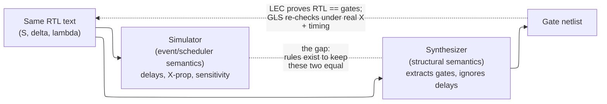

# RTL Design Methodology — RTL as a Contract with the Synthesis Tool

> **Stage:** 03 · Frontend RTL (register-transfer level). The *principles* that turn a microarchitecture spec into synthesizable, verifiable, timing-clean RTL — the *why* behind the rules, not the language mechanics.
> **Prerequisites:** [Logic_Building_Blocks](../00_Fundamentals/02_Logic_Building_Blocks.md) (the flip-flop, latch, and mux this page *infers*), [Performance_Modeling_and_DSE](../01_Architecture_and_PPA/05_Architecture_Foundations_and_Methods/02_Performance_Analysis/01_Performance_Modeling_and_DSE.md) (the spec), SystemVerilog basics ([Data_Types_and_Basics](02_Data_Types_and_Basics.md), [Procedural_Processes_and_IPC](03_Procedural_Processes_and_IPC.md)).
> **Hands off to:** [Synthesis_and_Optimization](../04_Synthesis/01_Synthesis_and_Optimization.md), [Async_Design_and_CDC](06_Async_Design_and_CDC.md), [Lint_CDC_RDC_Signoff](07_Lint_CDC_RDC_Signoff.md).

---

## 0. Why this page exists

RTL is not a program. It is a **contract with the synthesis tool**: you describe behavior at the register-transfer level, and a *synthesizable subset* of that description is **deterministically mapped to gates and flip-flops**. Everything a methodology tells you to do — default every combinational output, put `<=` in the clocked block, synchronize reset de-assertion, never drive a net from two places — is a *consequence* of that contract. Each rule exists because breaking it makes the tool infer hardware you did not mean, or makes the hardware disagree with the simulation that "passed."

So the useful mental model is not "here are the rules" but **"here is what each line of RTL turns into, and the discipline follows."** This page derives the discipline from the inference model: what a clocked process builds, why an incompletely-specified combinational block *accidentally builds a latch*, why most of the language is not hardware at all, and why code can simulate perfectly yet synthesize wrong. Then it works the real trade-offs — synchronous vs asynchronous reset, one- vs two- vs three-process FSMs, RTL vs gate vs behavioral modeling — as cost models, not preferences. Finish this page and you should be able to look at any `always` block and *see the gates*, and know which rule you would be violating and what silicon it would cost.

---

## 1. What "register-transfer level" abstracts — and the contract it fixes

"Register-transfer level" names exactly two things and abstracts away everything between them:

- **Registers** — the state, sampled at clock edges. These are the *boundaries*.
- **Transfers** — the combinational functions computed on the values *between* one edge and the next.

Formally, an RTL block is a **synchronous finite-state transducer**:

$$
S[n{+}1] \;=\; \delta\big(S[n],\, I[n]\big), \qquad O[n] \;=\; \lambda\big(S[n],\, I[n]\big)
$$

where $S$ = register state (the flip-flops), $I$ = inputs sampled this cycle, $O$ = outputs, $\delta$ = next-state function, $\lambda$ = output function. Both $\delta$ and $\lambda$ are **pure combinational** — memoryless functions of their arguments. RTL pins down the triple $(S, \delta, \lambda)$ **bit-exactly, cycle-by-cycle**. That triple *is* the contract.

What RTL **abstracts away** is everything that is not in $(S,\delta,\lambda)$: continuous time collapses to the tick of the clock, gate structure and transistor counts are left for synthesis to choose, and physical delays are deferred to timing analysis. What it **does not** abstract away is the value at every register boundary on every cycle — that is the specification the silicon must reproduce.

This is why the mapping to gates is **deterministic in behavior but free in structure**: synthesis may emit *any* gate netlist that realizes the same $(\delta,\lambda)$ — balance the mux tree, factor the logic, retime across flops — and formal equivalence checking (LEC) proves the netlist still computes the same functions ([Synthesis_and_Optimization](../04_Synthesis/01_Synthesis_and_Optimization.md)). The *behavior* is contractually fixed; the *implementation* is the tool's to optimize. That single distinction explains most classes of RTL bug, because each is a way the contract stops being well-formed:

- An **accidental latch** = $\delta$ or $\lambda$ references a value of $S$ you never declared — extra, unintended state (§2).
- A **multiply-driven net** = $\delta$ is not single-valued — not a function at all (§7).
- A **combinational loop** = $\lambda/\delta$ has no fixed point — undefined (§7).

Hold the transducer picture and the rest of the page is bookkeeping about keeping $(S,\delta,\lambda)$ well-defined and identical across the two tools that read your text.

---

## 2. The clocked-process model: how flops, muxes, and latches get inferred

Silicon between reset and the next reset is only ever two kinds of thing: **state** (flip-flops that sample on an edge) and **function** (combinational cones that settle before the edge). RTL mirrors that split with two process idioms, and the split is not stylistic — it is how you tell the tool *which kind of hardware to build*.

- A **clocked process** (`always_ff @(posedge clk)`) is the register $S$. Any variable assigned inside it that must survive to the next edge becomes a **D flip-flop**: the edge in the sensitivity list is literally the clock pin, and a reset term becomes the clear.
- A **combinational process** (`always_comb`) is $\delta$ and $\lambda$. An `if`/`case` that fully specifies its output becomes a **mux**: a `case` maps to a balanced mux tree, a nested `if` maps to a *priority* mux chain (why `unique`/`priority` matter — they promise mutual exclusivity so the tool builds the cheaper, faster balanced tree). The circuits themselves live in [Logic_Building_Blocks](../00_Fundamentals/02_Logic_Building_Blocks.md); here we only care *which* gets inferred and *why*.

```verilog
// Clocked process -> flip-flops. The reset FORM decides the reset hardware:
always_ff @(posedge clk or negedge rst_n)   // rst_n in the list -> async clear pin
    if (!rst_n) q <= '0;                     //   asserted off-clock, no data-path mux
    else if (en) q <= d;                     // 'en' absent -> q holds: a correct, INTENDED flop

always_ff @(posedge clk)                      // rst_n NOT in the list -> sync reset
    if (!rst_n) q <= '0;                      //   sampled like data -> a mux into q's cone
    else if (en) q <= d;
```

### 2.1 The inferred latch — the classic bug, derived

In a **combinational** process, $\lambda$ must be memoryless: for every input combination the output must be *assigned*. Suppose it is not — some path through the logic leaves output `o` untouched. Then the described behavior on that path is "`o` keeps its previous value," i.e. $o[n] = o[n{-}1]$. That is *memory*, and the only way to hold a value at an arbitrary time (no clock edge here) is a **level-sensitive latch**. So the tool is forced to insert one: the "combinational" block secretly acquired state, and $\lambda$ is no longer a function of $(S,I)$ alone.

```verilog
always_comb begin
    // BUG: no assignment to y when sel==2'b11 -> y must "hold" -> inferred latch
    case (sel)
        2'b00: y = a;
        2'b01: y = b;
        2'b10: y = c;
    endcase
end
```

The fix falls straight out of the mechanism — leave **no path unassigned**, so nothing has to hold:

```verilog
always_comb begin
    y = a;                 // default assignment: every path now writes y
    case (sel)
        2'b01: y = b;
        2'b10: y = c;
        default: y = a;    // (or 'unique case' to assert full/non-overlapping)
    endcase
end
```

The deep point for §6: the *same* missing assignment produces **opposite** hardware depending on the process. In a **clocked** process "hold the old value" is exactly what a flip-flop does — correct and intended. In a **combinational** process it is an accidental latch — a bug. This is why `always_comb` exists: it makes the tool *check* that no storage was inferred and error if it was, closing the most common methodology hole by construction rather than by review.

---

## 3. The synthesizable subset: why most of the language is not hardware

A construct is **synthesizable** iff it denotes a *bounded, static* pile of gates and flops whose behavior is a deterministic function of inputs and clocked state — i.e. iff it contributes to a well-defined $(S,\delta,\lambda)$. Most of the language fails that test, and the reasons are all the same reason:

| Non-synthesizable construct | Why no hardware corresponds |
|---|---|
| `#delay`, `wait(time)`, event timing | Continuous time is abstracted away; a delay names no gate. Simulation-only. |
| `initial` blocks for state | Silicon powers up **unknown (X)**; there is no "initial." *Reset* is the only defined start (§5). (FPGAs are the exception — the bitstream loads flop init values.) |
| Unbounded loops / recursion / dynamic allocation | Hardware is a *fixed* gate count; only statically-bounded, unrollable structure maps. |
| Dynamic types, classes, mailboxes, strings | Testbench machinery ([OOP_and_Randomization](08_OOP_and_Randomization.md)), no structural meaning. |
| `real`, most system tasks | Model or diagnostic constructs, not gates. |

So the synthesizable subset is the **intersection** of "the language" and "things that are a static pile of gates + flops." Methodology is, at bottom, the set of habits that keep you inside that intersection — which is why so many rules read as prohibitions ("no `#delay` in RTL," "no `initial` for reset," "no unbounded loops"). They are not taste; they are the boundary of what the contract can even express.

---

## 4. The simulation–synthesis semantic gap

Here is the subtlety that makes RTL hard: **two tools read the same text under two different semantics.**

- The **simulator** runs the *event/scheduler* semantics of the language — regions, blocking vs non-blocking updates, sensitivity ([Procedural_Processes_and_IPC](03_Procedural_Processes_and_IPC.md) has the actual scheduler). It is faithful to the LRM, delays and X-propagation and all.
- The **synthesizer** runs a *structural* interpretation — it extracts $(S,\delta,\lambda)$ and *ignores* everything with no structural meaning (delays, initial values, the exact way X propagates).

The **gap** is the set of programs where these two disagree. It has two directions, and every classic methodology rule exists to close one of them.

**Simulates right, synthesizes wrong.** The RTL passes in the simulator but the gates behave differently:

- *Incomplete sensitivity list.* Old-style `always @(a)` that also reads `b` re-evaluates only when `a` changes, so sim shows stale-but-plausible values — while synthesis reads the whole logic cone and builds the full function of `a` **and** `b`. The gate toggles where the sim did not. Fix: `always_comb` (or `@*`) derives the sensitivity list from the cone, so sim matches gates by construction.
- *Inferred latch (§2).* Often simulates fine because the stimulus happens to always hit an assigned branch; synthesis still builds the latch, which then misbehaves in silicon.
- *`full_case`/`parallel_case` pragmas.* They tell synthesis to drop "impossible" branches, but the simulator still models them — so the two diverge exactly on the inputs you swore could not occur. Prefer `unique`/`priority`, which constrain *both* tools identically.

**Synthesizes right, simulates misleadingly.** The gates are fine but RTL simulation lies — usually about **X**:

- *X-optimism.* An `if (c)`/`?:` in RTL picks one branch even when `c` is X, so a real uninitialized-state bug can be *hidden* — sim shows a clean 0/1 where the gate would propagate the ambiguity.
- *X-pessimism.* Conversely a mux model can smear X across an output the *gate* would have resolved to a definite value, flagging a "bug" that is not real.
- *Init-by-accident.* A signal that got a defined value from a 2-state type or an `initial` in sim starts at **X** in silicon; code that "worked" only because of that phantom initial value fails at power-on.

This is why gate-level simulation (§8) exists at all: it re-checks the design under the *structural* semantics with real X-handling and timing, catching exactly the second class ([Gate_Level_Sim_and_Emulation](13_Gate_Level_Sim_and_Emulation.md)). And it is why the coding rules are not arbitrary: `always_comb`, `<=` in clocked blocks and `=` in combinational blocks (mechanics in [Procedural_Processes_and_IPC](03_Procedural_Processes_and_IPC.md)), no `initial` for reset, `unique`/`priority` over `full_case` — **each rule forces the two semantics to agree**, so that a passing simulation actually predicts the silicon.



---

## 5. Reset: the boundary condition of the clocked model

Because silicon powers up with every flop at **X**, the *only* thing that makes "cycle 0" meaningful is reset. Reset is the boundary condition of the entire transducer $S[0]$ — without it $\delta$ iterates from garbage. That framing immediately answers *which* flops need reset: only those whose initial value the logic actually depends on — FSM state, valid bits, counters. Datapath pipeline flops can boot at X **provided a `valid` qualifier gates their use downstream**, and leaving them un-reset saves real area and a large reset-tree route. "Reset only what needs it" is not thrift for its own sake; it is a direct reading of which entries of $S[0]$ the contract constrains.

The genuine engineering choice is **how** reset reaches those flops. It is a four-way trade across timing, area, robustness, and testability:

| Scheme | Assert | De-assert | Cost / robustness / DFT |
|---|---|---|---|
| **Synchronous** | on clk edge | on clk edge | Reset is just another data input → a **mux into every reset flop's cone** (area + a little delay on the *functional* path). No special timing arcs; filters sub-cycle glitches; clean for cycle-based STA and scan. But **needs a running clock** — useless at power-on before the PLL locks — and a reset pulse narrower than a clock period can be *missed*. |
| **Asynchronous** | immediately | immediately | Uses the flop's dedicated **async clear pin** → *zero* cost on the functional data path, and resets with **no clock** (works at power-on). But de-assertion is off-clock, so releasing reset inside a flop's recovery/removal window risks **metastability**, and different flops can leave reset on different cycles → inconsistent $S[0]$. The reset net is a huge async wire that can itself glitch straight onto state. Harder for ATPG (an extra asynchronous set/reset the tester must control). |
| **Async-assert, sync-de-assert** *(the standard)* | immediately | synchronized | Keep async's clock-free, power-on-safe assertion; remove its one real hazard by passing the *release* through a 2-flop **reset synchronizer** per clock domain. Cost: one synchronizer per domain + recovery/removal STA on its last flop. |

The metastability hazard is exactly setup/hold, transposed onto the reset-release edge: the release must clear a **recovery** window before, and a **removal** window after, the active clock edge,

$$
t_\text{recovery} \le t_\text{rst\_release \to clk\_edge}, \qquad t_\text{removal} \le t_\text{clk\_edge \to rst\_release}
$$

Violate it and the flop can go metastable on the way *out* of reset — which is why the de-assertion must be synchronized while the assertion, being unconditional, need not be. The synchronizer mechanics and the MTBF math live in [Async_Design_and_CDC](06_Async_Design_and_CDC.md); here the point is *why* the standard scheme is the standard: it is the only one that is simultaneously power-on-safe (async assert), metastability-safe (sync release), and DFT-friendly. Crossing a **reset domain** demands the same discipline as a clock-domain crossing — plan it, don't let it happen. Scan and ATPG add the final constraint (hold reset inactive during shift, make async resets test-controllable), which is why many test methodologies lean toward synchronous or explicitly testable async reset ([DFT_and_ATPG](../06_Signoff/02_DFT_and_ATPG.md)).

---

## 6. FSM coding styles: one vs two vs three processes

An FSM is nothing but the transducer of §1 made explicit: a state register (flops), a next-state function $\delta$ (combinational), and an output function $\lambda$ (combinational, Moore if of state only, Mealy if of state and inputs). *How you partition those across processes* is a pure trade of three things — **latch risk, output timing, readability** — and it follows directly from §2's inference model.

| Style | Partition | Latch risk | Output timing | Readability |
|---|---|---|---|---|
| **One-process** | $S$, $\delta$, and outputs all in one `always_ff` | **None** — a clocked process holds by construction; a missing assignment is a *flop*, not a latch (§2) | **Registered** → glitch-free, clean launch boundary, but **one cycle late** (Moore only) | Poorest for complex $\delta$ — transition logic is buried among registered assignments |
| **Two-process** *(default)* | $S$ in `always_ff`; $\delta$ **and** outputs in one `always_comb` | Real — the comb block is the classic latch site; disciplined by `always_comb` + defaults | **Combinational** (Mealy) → same-cycle, but glitchy and its path length adds to whatever it feeds | Good — the textbook shape |
| **Three-process** | $S$ in `always_ff`; $\delta$ in `always_comb`; outputs in their own block | Two comb blocks = **two** latch sites to discipline | Chosen independently — outputs can be registered *or* combinational | Best for large, frequently-edited machines |

The timing distinction is concrete. A **registered** (one-process / Moore) output launches from a flop, so its arrival is a clean $t_{cq}$ and it drives the next stage with a full cycle of budget:

$$
t_\text{clk} \;\ge\; t_{cq} + t_{\lambda} + t_\text{setup}
$$

A **Mealy** (two-process) output is a combinational function of state *and* current inputs, so it is produced mid-cycle, can glitch, and its cone $t_\lambda$ stacks onto the logic it feeds within the *same* cycle — cheaper in latency, worse for timing closure and for driving anything wide or off-chip.

Where real designs land follows from that table: **two-process for most control** (clean, one comb block to watch); **one-process / registered outputs when the output sits on a critical path or drives a chip boundary or wide fanout** (you *want* it registered and glitch-free, and you design for the extra cycle); **three-process for large FSMs under active change**, where readability and independent output registering pay for the extra block. The one-process style's total latch-immunity is worth internalizing as the cleanest illustration of §2: *same missing assignment, opposite hardware, decided entirely by which kind of process it lives in.*

---

## 7. Structural discipline as consequences, not a checklist

Every remaining "rule" is one more reading of "what hardware does this text infer?" None needs memorizing once you see the inference.

- **One clock per register; nothing combinational on the clock net.** The clock is STA's sampling reference. Put an AND-gate on it (crude gating) or derive a clock from data, and you create a *second, untimed* timing reference whose glitches look like edges → flops sample garbage. Consequence: gate clocks **only through an ICG cell** (glitch-free, latch-based enable), or better, use a **clock enable** — `if (en) q <= d;` — which is one clock with the enable in the *data* path, trivially timed. The trade is power vs simplicity: true clock gating kills the toggle and saves dynamic power ([Power_Reduction_Techniques](../02_Power_and_Low_Power/03_Power_Reduction_Techniques.md)) but must go through the ICG; enables are STA-trivial but leave the clock tree toggling. Minimize clock domains for the same reason — every asynchronous clock is a CDC metastability liability ([Async_Design_and_CDC](06_Async_Design_and_CDC.md)); generated/divided clocks belong in one small reviewed block ([Clock_Division_and_Switching](04_Clock_Division_and_Switching.md)).
- **No combinational loops.** A comb cone that feeds itself has no fixed point in the timing graph — $\delta$ is ill-defined (§1) and the hardware either oscillates or latches. Feedback must pass **through a flop**, which is precisely why state exists: the clock breaks the loop into well-defined per-cycle steps.
- **No multiply-driven nets.** A net is the output of *exactly one* gate. Two processes assigning the same signal wires two gate outputs together — a short (bus contention), not a value — so $\delta$ stops being single-valued and synthesis cannot pick a driver. Rule: **one signal, one owning `always` block** (true tri-state buses are the sole, explicit exception).
- **Datapath / control separation.** Not aesthetics — *verifiability* and *inference quality*. The **datapath** (registers, ALUs, muxes, FIFOs) is wide, regular, arithmetic; written with operators the synthesizer maps to library [adders/multipliers](../00_Fundamentals/03_Adders_and_Multipliers.md), it should be exercised with directed/random *data*. The **control** (the FSMs) is a small state space you can cover exhaustively or formally. Tangle them and you get RTL that is *neither*: the control space explodes past exhaustive coverage and the arithmetic stops synthesizing as clean regular structure. Separation lets each half be checked by the method that fits it.
- **Register block outputs; pipeline to hit frequency.** Registering a block's outputs presents a clean setup boundary, so integration STA is not a thicket of cross-block combinational paths. If a cone is too long for the target period, cut it with a pipeline register and manage the added latency with `valid`/back-pressure — the standard latency-for-frequency trade.

**What "done" means.** RTL is not finished when it simulates — under §4 a passing sim does not even guarantee the *gates* match. It is done when it is provably inside the contract: **lint-clean** (no inferred latches, no incomplete sensitivity, no multiple drivers), **CDC/RDC-clean**, **coverage-closed** ([Verification_Planning_and_Coverage_Closure](11_Verification_Planning_and_Coverage_Closure.md)), and **synthesizable within the timing/area budget** ([Lint_CDC_RDC_Signoff](07_Lint_CDC_RDC_Signoff.md)). That bundle is the handoff to [synthesis](../04_Synthesis/01_Synthesis_and_Optimization.md).

---

## 8. RTL vs gate vs behavioral: the abstraction trade

RTL is one rung on a ladder of modeling detail, and the choice of rung is a trade of **simulation speed vs synthesizability vs accuracy**. The same property that makes RTL the design entry point — highest abstraction that still maps deterministically to gates — is why it is also the *contract*.

| Level | Describes | Synthesizable? | Sim speed (rel.) | Accuracy |
|---|---|---|---|---|
| **Behavioral / TLM** | *What* — an algorithm, often untimed or transaction-level | No (unbounded constructs, no cycle structure) | Fastest (~10–1000× RTL) | Functional only; no timing |
| **RTL** | Cycle-by-cycle register transfers $(S,\delta,\lambda)$ | **Yes — deterministically** | Fast (whole-SoC feasible) | **Cycle-accurate at register boundaries** |
| **Gate netlist** | Real library cells; post-layout, real delays | It *is* the synthesis output | ~10–100× slower than RTL | Highest — true X-resolution + setup/hold |

Each rung down multiplies detail and divides simulation throughput by roughly an order of magnitude, while raising fidelity by about the same (behavioral → RTL → gate → SPICE spans many decades of both). That is why you *live* at RTL: **behavioral** models are for testbenches, reference models, and architectural exploration ([Performance_Modeling_and_DSE](../01_Architecture_and_PPA/05_Architecture_Foundations_and_Methods/02_Performance_Analysis/01_Performance_Modeling_and_DSE.md)) but are not buildable; **gate-level** is the truth but is *generated*, not written, and simulates far too slowly to run application-scale workloads ([Gate_Level_Sim_and_Emulation](13_Gate_Level_Sim_and_Emulation.md) covers GLS and the emulation/FPGA escape hatch for that speed wall). RTL is the unique level that is simultaneously fast enough to simulate a full chip, precise enough to be the golden specification, and structured enough to map to gates *deterministically* — which is exactly the set of properties the "contract" framing of §0 requires.

---

## 9. Numbers / rules to memorize

Each rule is a one-line consequence of the inference model — the "why" column points at the section that derives it.

| Rule | Why (the hardware it controls) |
|---|---|
| `always_comb` + **default-assign every output** | an unassigned path must *hold* → inferred latch (§2) |
| `<=` in `always_ff`, `=` in `always_comb` | forces sim and synth semantics to agree (§4) |
| No `initial` for reset; **reset defines $S[0]$** | silicon boots at X; reset is the only defined start (§3, §5) |
| **async-assert, sync-de-assert** reset | power-on-safe assert + metastability-safe release (§5) |
| 1 reset synchronizer **per clock domain** | de-assertion must be locally synchronous (§5) |
| Reset only FSM/valid/counter flops | only those entries of $S[0]$ are constrained (§5) |
| Gate clocks **only via ICG** (or use enables) | logic on the clock = a second, untimed, glitchy reference (§7) |
| **One signal, one driver** | a net is one gate's output; two = a short, $\delta$ ill-defined (§7) |
| Feedback only **through a flop** | comb loop = no fixed point (§1, §7) |
| Register block outputs | clean setup boundary → modular timing closure (§7) |
| `unique`/`priority`, not `full/parallel_case` | constrains sim and synth identically (§4) |
| RTL is done at **lint+CDC+cov+timing**, not at "it simulates" | a passing sim need not match the gates (§4, §7) |

---

## Cross-references

- **Down the stack (what this infers):** [Logic_Building_Blocks](../00_Fundamentals/02_Logic_Building_Blocks.md) (the flip-flop, latch, mux, and setup/hold this page turns RTL into), [Adders_and_Multipliers](../00_Fundamentals/03_Adders_and_Multipliers.md) (the datapath arithmetic operators map to), [STA](../06_Signoff/01_STA.md) (the setup/hold and recovery/removal signoff the synchronous contract promises).
- **Language mechanics (siblings):** [Data_Types_and_Basics](02_Data_Types_and_Basics.md) (2- vs 4-state, X/Z — the substrate of the §4 gap), [Procedural_Processes_and_IPC](03_Procedural_Processes_and_IPC.md) (the scheduler, blocking vs non-blocking — the *sim* half of §4), [OOP_and_Randomization](08_OOP_and_Randomization.md) (the non-synthesizable testbench side of §3).
- **Up / adjacent gates:** [Async_Design_and_CDC](06_Async_Design_and_CDC.md) (reset synchronizer + MTBF for §5, clock-domain crossings), [Lint_CDC_RDC_Signoff](07_Lint_CDC_RDC_Signoff.md) & [Verification_Planning_and_Coverage_Closure](11_Verification_Planning_and_Coverage_Closure.md) (the §7 "done" gates), [Clock_Division_and_Switching](04_Clock_Division_and_Switching.md) (generated/divided clocks).
- **Downstream:** [Synthesis_and_Optimization](../04_Synthesis/01_Synthesis_and_Optimization.md) (what the tool does with the contract — LEC, optimization, retiming), [DFT_and_ATPG](../06_Signoff/02_DFT_and_ATPG.md) (the scan/reset constraint of §5), [Gate_Level_Sim_and_Emulation](13_Gate_Level_Sim_and_Emulation.md) (the gate rung of §8), low-power [UPF_Power_Intent](../02_Power_and_Low_Power/04_UPF_Power_Intent.md) and [Power_Reduction_Techniques](../02_Power_and_Low_Power/03_Power_Reduction_Techniques.md) (clock-gating power side of §7).
- **Drills:** [RTL_Coding_Questions](../interview_prep/08_RTL_Coding_Questions.md).

---

## References

1. Cummings, C.E., "Synthesizable Finite State Machine Design Techniques Using the New SystemVerilog 3.0 Enhancements," SNUG 2003. One/two/three-process FSM styles and latch avoidance (§2, §6).
2. Cummings, C.E., "Nonblocking Assignments in Verilog Synthesis, Coding Styles That Kill!," SNUG 2000. The blocking/non-blocking half of the sim–synth gap (§4).
3. Cummings, C.E., "`full_case parallel_case`, the Evil Twins of Verilog Synthesis," SNUG 1999. Why pragmas diverge sim from synth (§4).
4. Sutherland, S. and Mills, D., "Standard Gotchas: Subtleties in the Verilog and SystemVerilog Standards," SNUG. X-optimism/pessimism and inference surprises (§4).
5. IEEE Std 1800-2017, *SystemVerilog LRM*, and IEEE Std 1364.1 (RTL synthesis subset). The synthesizable subset of §3.
6. Keating, M. and Bricaud, P., *Reuse Methodology Manual for System-on-a-Chip Designs*, 3rd ed., Springer, 2002. Reset, clocking, and datapath/control discipline (§5, §7).
