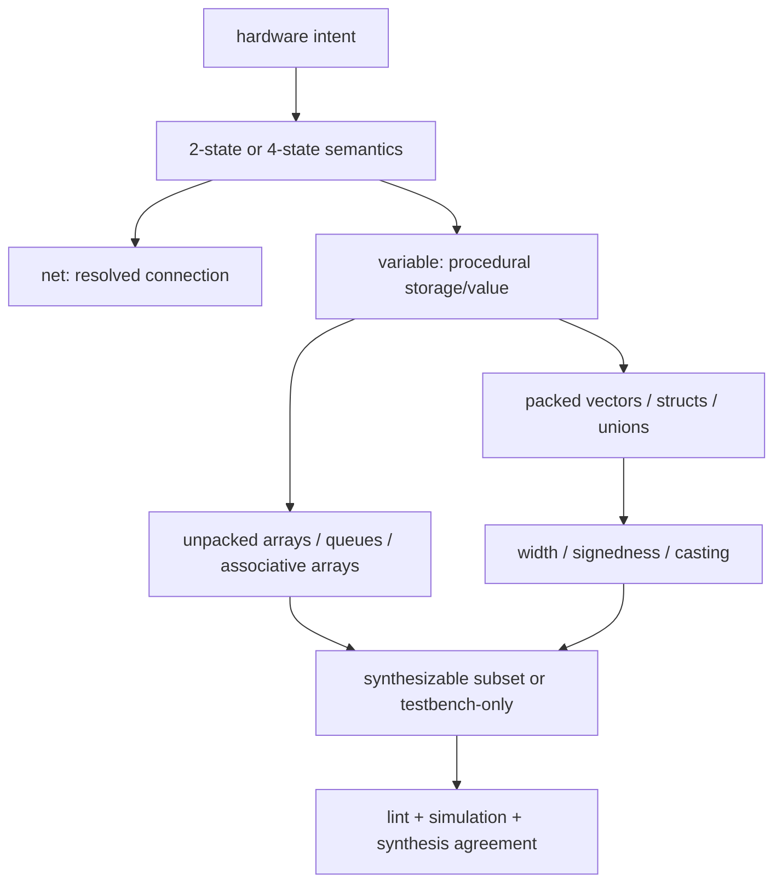

# SystemVerilog Data Types — Modeling the Wire and the Unknown



> **Stage:** 03 · Frontend RTL (register-transfer level). The language's *type system* — not a syntax reference, but *why* a hardware description language needs value and storage abstractions a software type system never does, and how getting them wrong turns into silicon bugs.
> **Prerequisites:** [CMOS_Fundamentals](../00_Fundamentals/01_CMOS_Fundamentals.md) (the transmission gate; a driven vs floating node), [Logic_Building_Blocks](../00_Fundamentals/02_Logic_Building_Blocks.md) (mux, latch inference). **Hands off to:** [RTL_Design_Methodology](01_RTL_Design_Methodology.md) (the discipline of using these types), [Procedural_Processes_and_IPC](03_Procedural_Processes_and_IPC.md) (the scheduler that assigns them), [OOP_and_Randomization](08_OOP_and_Randomization.md) (class types).

---

## 0. Why this page exists

A software type system describes *values in memory*: an `int` is 32 bits, always exactly one of $2^{32}$ values, written by exactly one assignment, and never anything else. A hardware description language cannot get away with that, because it must describe a **physical circuit being simulated before it exists**, and that forces it to model two things software never has to:

1. **The physical wire.** A hardware value is a *node voltage*, and a node can be driven high, driven low, driven by **nobody** (floating / high-impedance), or driven by **two sources at once** (contention). "What is on this wire?" has more than two answers, and some of them are electrical faults.
2. **The gap between what is known and what is not.** During simulation a bit may simply be **unknown** — a flop that reset never reached, an output of a bus nobody is driving yet. That is not a value the silicon will ever hold; it is the simulator's confession that it cannot prove the bit is 0 or 1.

Every distinctive feature of the SystemVerilog type system is derived from one of these two facts. The **four-state value set** (0/1/X/Z) exists to represent them (§2–§3). The **net vs variable** split exists because "who drives this wire" is a real electrical question (§4). **2-state vs 4-state** is the trade between simulating fast and keeping the unknown visible (§5). **Packed vs unpacked** is whether a collection of bits is one number on a bus or a memory of separate things (§6). **Signedness and width** are deterministic inference rules whose whole purpose is *correctness* — the classic truncation bugs (§7). And **enums / structs / unions** encode design *intent* into a type the tool can check, at zero silicon cost (§8). Everything else in the language — queues, dynamic arrays, strings — is a software data structure for the testbench, and belongs to the verification half (§9). Understand the two forces and the type system stops being a list to memorize and becomes a set of consequences.

---

## 1. Two axes a hardware type must span

Fix one signal and ask the two questions software never asks. They are **orthogonal**, and together they organize the whole type system:

- **Value axis — what logic level is on it?** Not two answers but four: $\{0, 1, X, Z\}$ (§2). A software `bool` lives on a one-dimensional value axis; a hardware bit lives on this four-point one.
- **Drive/storage axis — where does its value come from?** A **net** takes its value from whatever structurally *drives* it, recomputed continuously; a **variable** *holds* the last value written to it by a process (§4). Software has only the second kind (a memory cell); hardware needs the first to model a wire.

$$
\text{signal} \;=\; \underbrace{(\,\text{value} \in \{0,1,X,Z\}\,)}_{\text{§2–§3: the wire's level}} \;\times\; \underbrace{(\,\text{net} \mid \text{variable}\,)}_{\text{§4: who owns the value}}
$$

Read every type name in the language as a point in this grid: `wire` is *net × 4-state*, `logic` is *variable × 4-state*, `bit` is *variable × 2-state*, and there is deliberately no *net × 2-state* in common use because an undriven net's whole reason to exist is to be able to say Z. Hold the grid and the rest of the page is filling it in.

---

## 2. The four-state value lattice: why X and Z exist

The two "extra" values are not decoration; each answers a question a 2-valued type physically cannot.

### 2.1 Z — the undriven wire

**Z is high-impedance: a node that nothing is currently driving.** It is not a logic level, it is the *absence* of a drive. The physical picture is exactly the transmission gate of [CMOS_Fundamentals](../00_Fundamentals/01_CMOS_Fundamentals.md) §5.2: turn the pass gate off and the downstream node is disconnected from every rail — it floats, holding only its parasitic charge, until some driver reconnects. Z exists so the type system can model **tri-state buses**: several drivers share one wire, all but one park in Z, and the one that is enabled wins. Without a value meaning "I am letting go of this wire," a shared bus could not be described at all.

Z is a *drive* state, not an unknown: the simulator knows *exactly* that the wire is undriven. When a floating net is *read* by logic, though, the reader cannot tell what level the float sits at, so Z entering a gate is treated as X — the undriven-input-read-as-unknown rule.

### 2.2 X — the unknown metavalue

**X is not a voltage; it is "I cannot prove this bit is 0 or 1."** It is a property of the *simulation's knowledge*, not of the silicon — real silicon nodes are always at some voltage. X is born two ways, and both are diagnostics:

- **Uninitialized 4-state storage.** A 4-state variable powers up X. If reset does not reach it, the X persists and *propagates* — which is the point: X is your alarm that a flop starts life undefined (§5, the reset story).
- **Contention / ambiguity.** Two drivers force a wire to 0 and 1 at once — an electrical short. The net's resolution function cannot pick a winner, so it reports X. Likewise a Z read into logic, or a `case` with no matching branch, yields X.

So X is a **debugging signal, not a real value**. Its purpose is to make "the design has not defined this bit" visible on a waveform instead of silently reading as some plausible number.

### 2.3 The value lattice and the net resolution function

Order the four values by **how much the simulator knows** about the wire. The three definite drive states — $0$, $1$, and the definite-undriven $Z$ — are fully known; $X$ sits above them as "could be either logic level":

$$
Z \;\sqsubset\; \{0, 1\}, \qquad 0 \;\sqsubset\; X, \quad 1 \;\sqsubset\; X
$$

where $a \sqsubset b$ means "$b$ is less determined than $a$." A **net with multiple drivers** resolves them through a function that respects this order, and the whole $4\times4$ table collapses to three rules:

1. **Z is the identity** — any real driver beats a floater: $\text{res}(v, Z) = v$. This is what makes a tri-state bus work.
2. **0 against 1 is contention** — two disagreeing hard drivers give $\text{res}(0,1) = X$.
3. **X is absorbing** — once a bit is unknown, resolving it against anything keeps it at least that unknown.

That is the entire semantics of a wire: a driver overrides a float, disagreement is unknown, and unknown is sticky. (Real nets also carry *strength* — `supply`/`strong`/`weak`/`pull` — so a weak pull-up can lose to a strong driver; strengths refine rule 1 but change none of the concepts, and pure RTL rarely needs them.)

---

## 3. X-propagation: why pessimism *and* optimism both mislead

The deepest idea on this page is that X is a **three-valued abstraction of a two-valued reality**, and *no single propagation rule for it is both safe and precise*. This is why X is simultaneously your best bug-catcher and a notorious source of both false alarms and hidden bugs.

### 3.1 The formal picture

Interpret each bit's value as the **set of concrete logic values it might really be**: $0 \mapsto \{0\}$, $1 \mapsto \{1\}$, and $X \mapsto \{0,1\}$. The *true* behavior of a gate $g$ over uncertainty is the image of that set,

$$
\hat{g}(A, B) \;=\; \{\, g(a,b) \;:\; a \in A,\ b \in B \,\}
$$

and the honest answer is "the output is unknown **iff** $\hat g$ can produce both 0 and 1." A simulator, however, stores one metavalue per bit, not a set — so it must collapse $\{0,1\}$ back to $X$ after *every* operation, and that collapse throws away **correlation between bits**.

### 3.2 X-pessimism: sound but imprecise (cries wolf)

In **data** logic the simulator over-approximates. Some gates recover precision — $0 \,\&\, X = 0$ and $1 \,|\, X = 1$ are computed correctly, because the controlling input decides the output regardless of the unknown. But reconvergent unknowns lose:

$$
a \oplus a \;\text{ with } a = X:\quad \underbrace{\{0{\oplus}0,\, 1{\oplus}1\} = \{0\}}_{\text{true: always 0}} \;\neq\; \underbrace{X \oplus X = X}_{\text{simulator}}
$$

The simulator, having already forgotten that the two operands are the *same* $a$, reports $X$ where the silicon is deterministically 0. This is **X-pessimism**: the sim value is a *superset* of the truth ($\text{sim} \supseteq \text{true}$). It is **sound** — it never hides a genuine unknown — but **imprecise**, so it raises false alarms that cost real debug time (a spurious X blooming through a datapath from one reconvergent don't-care).

### 3.3 X-optimism: precise but unsound (hides bugs)

In **control** logic the simulator does the opposite and it is far more dangerous. An `if`/`case` is *procedural selection*: the simulator evaluates the condition to a single branch, and an $X$ condition is treated as false, so it takes the `else`/`default`:

```verilog
logic sel, a, b, y;
always_comb
    if (sel) y = a;   // sel === X  -> simulator takes the ELSE path
    else     y = b;   // ...silently commits to y = b, a definite value
```

The sim **under-approximates**: it commits to *one* concrete outcome ($\text{sim} \subseteq \text{true}$) when the honest answer is "$y$ could be $a$ or $b$, unknown which." It is **precise-looking but unsound** — the waveform shows a clean, plausible $y$, so a real bug (an undriven `sel`) is **invisible**. Meanwhile the *synthesized* circuit is a continuous mux: put X on its select and X propagates to the output. So RTL simulation (optimistic) and gate-level simulation (pessimistic) **disagree exactly on X through control**, which is precisely the X-discrepancy that [Gate_Level_Sim_and_Emulation](13_Gate_Level_Sim_and_Emulation.md) exists to expose.

### 3.4 The consequence

| Regime | Direction of error | Failure mode | Sound? |
|---|---|---|---|
| **Pessimism** (data paths) | $\text{sim} \supseteq \text{true}$ | false X alarms, spurious unknown spread | yes — never misses a real X |
| **Optimism** (if/case control) | $\text{sim} \subseteq \text{true}$ | hides a real unknown behind a plausible value | **no** — can mask a bug |

Because neither default is trustworthy alone, real methodology does not *rely* on X-propagation — it **forces the issue**: X-assertions and `unique`/`priority` on case statements to flag illegal X selects ([Assertions_and_Coverage](09_Assertions_and_Coverage.md)), dedicated X-propagation / X-optimism-pessimism analysis tools, and formal methods that reason about the true set instead of the collapsed metavalue ([Formal_Verification](12_Formal_Verification.md)). The takeaway is conceptual: **X is an abstraction, and you must know which way it lies to you in each context.**

---

## 4. Nets vs variables: driven by structure vs assigned by a process

The second axis is *where a value comes from*, and the language **enforces** the distinction because it encodes a real electrical fact.

- A **net** (`wire`, `tri`, `wand`, …) has **no memory of its own.** Its value is a pure function of its drivers, recomputed by the resolution function of §2.3 whenever any driver changes. It models a *wire*: stop driving it and it goes to Z. A net *must* be driven continuously — by a `assign`, a port connection, or a primitive.
- A **variable** (`logic`, `reg`, `bit`, `int`, …) **holds the last value written to it** until the next write. It models *state* (a flop's contents) or simply a named intermediate a process computes. A variable *must* be written procedurally, and by **one** process.

### 4.1 Why the language enforces "one owner"

The rule that a variable may have only a **single** driving process — while a net may have **many** — is not bureaucracy; it maps to who is electrically responsible for the value:

- **Two processes writing one variable** is a race the scheduler cannot resolve deterministically — the result depends on evaluation order, which is exactly the nondeterminism [Procedural_Processes_and_IPC](03_Procedural_Processes_and_IPC.md) is about eliminating. The language forbids it (or makes it a compile error) so the race becomes a *diagnostic* instead of a silicon surprise.
- **Two structures driving one net** is a *bus*, which is legal precisely because a net *has* a resolution function to combine drivers (and a strength model to say which wins). The value is defined; it is just defined by electrical resolution, not by a single writer.

So "net vs variable" is really "resolved by hardware vs owned by a process," and the single-driver rule on variables is a *feature*: accidental double-drive turns into an error you find at elaboration rather than an X you chase at 2 a.m.

### 4.2 `logic` vs explicit nets: the everyday trade

Classic Verilog forced the choice on you: `reg` for anything written in an `always` block, `wire` for anything from `assign` — and `reg` did **not** mean a register, which confused every beginner. SystemVerilog's `logic` collapses that: it is a 4-state *variable* legal in **both** procedural and continuous-assignment contexts, with exactly one restriction — a single driver.

```verilog
logic [7:0] d;
always_comb d = a & b;   // procedural driver  -- OK
assign      d = a & b;   // OR one continuous driver -- OK
// two drivers on `logic` d  -> ELABORATION ERROR (this is the point)
```

The design rule that falls out: **use `logic` for essentially every signal** (one driver, 4-state so X stays visible), and reach for `wire`/`tri` **only** where you genuinely need multiple resolved drivers — a real tri-state bus or a wired-AND. The single-driver enforcement on `logic` catches the most common structural bug (an accidental second driver) for free.

---

## 5. 2-state vs 4-state: the speed / observability trade

Having X and Z costs simulation performance, so the language lets you drop them. This is the trade the brief cares most about, and it is a genuine engineering decision, not a style preference.

### 5.1 Why 4-state is ~2× slower

Four values need two bits to encode, so simulators store every 4-state signal as **two bit-planes** — a value plane and an is-unknown plane (the classic *aval/bval* scheme):

$$
(a,b): \quad (0,0)=0,\;\; (1,0)=1,\;\; (0,1)=Z,\;\; (1,1)=X
$$

A 32-bit `logic` therefore occupies **64 bits** of simulator memory, and every operation (`&`, `|`, `+`) must compute on *both* planes and apply an X-fixup. A 2-state type (`bit`, `int`, `byte`, `longint`) is **one** plane — a native machine word, one instruction per op:

$$
M_{\text{4-state}} = 2\,M_{\text{2-state}}, \qquad \text{throughput}_{\text{4-state}} \approx \tfrac{1}{2}\,\text{throughput}_{\text{2-state}}
$$

On a scoreboard holding thousands of transactions, that 1.5–2× is the difference between a regression that finishes overnight and one that does not.

### 5.2 Why 4-state is safer: the X-through-reset bug

The saving in 5.1 buys speed by **erasing the unknown**, and the unknown was doing a job. A 4-state variable powers up X; a 2-state variable powers up **0** — a perfectly plausible number. So a missing reset or an unwritten path is *loud* in 4-state and *silent* in 2-state:

```verilog
always_comb begin
    if (sel) internal = a;   // no else branch: `internal` keeps its old value
    y = internal;            // 4-state: y = X on the waveform  -> bug is obvious
end                          // 2-state: y = 0 (plausible)      -> bug is HIDDEN
```

In 4-state the un-driven `internal` reads X, the X reaches `y`, and the engineer *sees* it and finds the inferred-latch bug ([Logic_Building_Blocks](../00_Fundamentals/02_Logic_Building_Blocks.md) §5 on latch inference). In 2-state the same code reads a clean `0` and passes the test vectors that happen not to exercise the gap. This is why **RTL init and reset discipline are a correctness concern**, developed as methodology in [RTL_Design_Methodology](01_RTL_Design_Methodology.md).

### 5.3 The rule real projects land on

$$
\boxed{\text{4-state for DUT / RTL signals} \quad\mid\quad \text{2-state for testbench data}}
$$

RTL and the design-under-test use `logic` because you **want** the X alarm — an uninitialized flop must be visible, not masked. Testbench scaffolding — scoreboards, counters, loop indices, transaction fields — uses `bit`/`int` because that data is initialized by *your* code, so X-detection buys nothing and the 2× speed is free. The boundary between the two is the boundary between "modeling hardware" and "writing software about hardware," and it is the single most consequential type choice in a verification environment.

---

## 6. Packed vs unpacked: a bit-vector vs a memory

SystemVerilog has two kinds of array because hardware has two kinds of collection, and they map to *different physical structures*.

- A **packed** array is a single contiguous **bit-vector**. Its dimensions are just a *view* over one integer: you can do arithmetic on the whole thing, slice arbitrary bit ranges, and hand it across a port as one bundle of parallel wires. `logic [3:0][7:0] x` is 32 bits you can also read as four bytes.
- An **unpacked** array is a collection of **independent elements**, like a **memory**. Each element is addressed separately; there is no arithmetic "across" elements, and the simulator may pad between them. `logic [7:0] mem [256]` is 256 addressable bytes.

### 6.1 Why the hardware mapping differs

This is the whole point, and it is a *synthesis* distinction, not a cosmetic one:

- A **packed** array flattens to **N parallel signals** — a wire bundle or the width of a flop. It *is* a bus; it can cross a module port and feed an ALU. Pack when the bits share one numeric or positional meaning.
- An **unpacked** array maps to **addressed storage** — synthesis infers a RAM/register-file, read and written one element per access through a port, not exposed as a flat bundle. Model when the elements are separate things you index into.

So "packed vs unpacked" reads as **"bus vs memory."** Get it backwards and you pay: pack a 4 KB memory and you demand a 32768-bit-wide flat vector (and the flop/mux forest to match); unpack a data word and you lose the ability to do vector arithmetic on it or connect it to a port as one signal.

```verilog
logic [3:0][7:0] packed_w;      // packed: ONE 32-bit vector (a bus)
logic [31:0]     flat = packed_w;   // OK — flatten/arithmetic on the whole thing

logic [7:0]      mem [256];      // unpacked: a MEMORY of 256 bytes
// logic [2047:0] bad = mem;     // ERROR — a memory is not one vector

logic [1:0][7:0] ram [256];     // packed dims LEFT of name, unpacked RIGHT:
                                //   256 entries (memory), each a 16-bit word (bus)
```

The ordering rule is the mnemonic for the concept: **packed dimensions sit to the left of the name (the word's internal shape), unpacked to the right (how many words).** Packed also maps cleanly onto a C integer across DPI, while an unpacked array needs open-array handles — a direct consequence of one being a flat vector and the other a strided memory.

---

## 7. Signedness, width, and extension: the deterministic rules as a correctness concern

In software, integer promotion mostly "just works" and you rarely think about it. In SystemVerilog the **width and signedness of every subexpression are inferred by fixed rules *before* evaluation**, and a wrong inference silently truncates or zero-extends — one of the top sources of RTL bugs that pass in simulation and fail in silicon. These rules are worth understanding as a *mechanism*, because they are fully deterministic.

### 7.1 The two rules

**Width — context propagates two ways.** An expression first gets a *self-determined* width (roughly the max of its operand widths); then an assignment or other context imposes a width top-down. The subtle failure is a **self-determined context that is not widened** — inside a concatenation, or a shift amount, or an argument — where an intermediate overflows *before* the wide LHS ever sees it.

**Sign — one unsigned operand poisons the whole expression.** A result is signed **iff every operand is signed**; a single unsigned operand makes the entire expression unsigned. **Concatenation `{}` and replication `{{}}` are *always* unsigned**, regardless of what goes into them.

### 7.2 Extension: the one formula that explains the bugs

When a value of width $n$ and signedness $S$ lands in a context of width $W \ge n$, the fill bits are determined entirely by $S$:

$$
v_{\text{ext}}[i] =
\begin{cases}
v[i], & 0 \le i < n \\[2pt]
S \cdot v[n-1], & n \le i < W
\end{cases}
\qquad
S = \begin{cases} 1 & \text{value is signed (fill with sign bit)} \\ 0 & \text{value is unsigned (fill with 0)} \end{cases}
$$

Every "classic" sign bug is this formula with $S$ forced to 0 when you wanted 1:

```verilog
logic signed [7:0] x = -1;      // 8'hFF
logic       [15:0] y = x;       // y = 16'h00FF = 255  -- LHS unsigned => S=0, ZERO-extended
logic signed [15:0] z = x;      // z = 16'hFFFF = -1   -- LHS signed   => S=1, sign-extended
logic       [8:0]  c = {1'b0, x}; // concat is ALWAYS unsigned: prepends a 0 bit, sign lost
```

The reasoning is the same each time: the *context's* signedness ($S$), not the source's, chooses the fill. `y` is unsigned so $x$ is zero-extended; the concatenation is unsigned by rule so `{1'b0, x}` is just a 9-bit number with a leading 0. The explicit tools to *force* the intent are the **static casts** — `signed'(v)`, `unsigned'(v)`, `int'(v)`, `W'(v)` — which are nothing more than a way to set $S$ and $W$ on a subexpression deliberately (`$signed({1'b0,x})` re-signs the concat; `int'(3.14)` truncates a real to 32-bit). A mixed signed/unsigned **comparison** is the same trap in disguise: the signed operand is converted to unsigned first, so `-1 > 0u` is *true*.

---

## 8. Enums, structs, unions: encoding intent the compiler can check

A raw `logic [2:0] state` carries **no information about what it means** — which of the eight codes are legal, what they stand for, or that adding two of them is nonsense. Enums, structs, and unions are **zero-silicon-cost** abstractions: they synthesize to the exact same wires, but they lift design *intent* into the type so the tool checks it and the waveform reads it.

- **Enum — a named, closed set of legal values** over a base vector. The payoff is checkable intent: illegal-value assignments flag, `.name()` prints `IDLE` instead of `3'b001` in the waveform, and `.next()/.prev()` walk an FSM. Crucially the **base type re-invokes §5**: `enum logic` starts **X** (an uninitialized FSM is visible), while `enum bit` starts at the **first label** (hidden). Choose the 4-state base for RTL state so a lost reset shows up.
- **Struct — a named partition of bits.** A **packed** struct is a **register field-map** that still flattens to a vector: you get named fields *and* an exact, contiguous bit layout you can assign to/from a raw word. This is the clean way to model a hardware register without giving up bit-for-bit control. An **unpacked** struct is a software record and may be padded.
- **Union — two views of the same bits.** A packed union reinterprets one vector as several layouts; a **tagged** union adds a discriminant the compiler tracks, turning "which member is valid?" from a hand-tracked footgun into a checked variant.

```verilog
typedef enum logic [1:0] {IDLE, RUN, DONE} state_e;  // logic base => X on reset if unwritten

typedef struct packed {          // a 32-bit control register, named but bit-exact
    logic        enable;         // [31]
    logic [1:0]  mode;           // [30:29]
    logic [28:0] reserved;       // [28:0]
} ctrl_reg_t;

ctrl_reg_t ctrl;
ctrl = 32'h8000_0000;            // assign from a raw word (it IS a 32-bit vector)
if (ctrl.mode == 2'b01) ...      // ...and read it by name
```

The trade-off is almost entirely upside: intent-encoding costs **nothing** in gates (same bits) and buys compile-time checking plus readable waves. The only caution is not to over-abstract — a synthesis, DFT, or bring-up engineer must still see the actual bit layout, which is exactly why **packed** structs (explicit layout) dominate RTL over opaque containers. Reserve tagged unions and deep type nesting for the testbench, where the checking matters more than the layout.

---

## 9. The software half: container types (used, not synthesized)

SystemVerilog is really **two languages sharing a syntax**: the synthesizable subset of §§1–8 that models wires and state, and a full software language for writing the *testbench*. The remaining "types" — **dynamic arrays, queues, associative arrays, strings**, and the array-manipulation methods (`find`, `sort`, `sum`, …) — belong to the second. They never synthesize; they exist because the same language builds the verification environment, and they are chosen by **access pattern**, exactly as in any software:

| Need | Type | Why |
|---|---|---|
| Fixed-width value / bus / register field | **packed** vector or struct (§6, §8) | one number, maps to wires |
| Addressed memory, size known | **unpacked** array (§6) | infers RAM |
| Dense collection sized at **runtime** | **dynamic array** `[]` | contiguous, `O(1)` index, resize copies |
| **FIFO** — push/pop at the ends | **queue** `[$]` | `O(1)` push/pop, natural transaction order |
| **Sparse** or non-integer key | **associative array** `[key]` | hash/tree, allocates only used keys (4 GB model, few entries) |
| Text | **string** | dynamic, software |

The one load-bearing fact worth carrying: a **queue** gives `O(1)` push/pop at both ends while a **dynamic array** pays `O(n)` to grow (allocate + copy), which is why UVM scoreboards — transactions arriving and draining one at a time — are built on queues. The APIs themselves (allocation, iteration, `find_index`/`sort`/`reduce`, `$cast` for class downcasts, packages and namespaces) are testbench mechanics: they live with the processes that drive them ([Procedural_Processes_and_IPC](03_Procedural_Processes_and_IPC.md)) and the class/UVM layer that uses them ([OOP_and_Randomization](08_OOP_and_Randomization.md), [UVM_Methodology](10_UVM_Methodology.md)). This page stops at the boundary: **if it models a wire or a bit of state, it is here; if it is a data structure holding transactions, it is there.**

---

## Numbers to memorize

| Fact | Value | Why (section) |
|---|---|---|
| Value set | 4-state $\{0,1,X,Z\}$ vs 2-state $\{0,1\}$ | model the wire + the unknown (§2) |
| 4-state variable default | **X** | uninitialized alarm (§2.2, §5.2) |
| 2-state variable default | **0** | fast, but hides missing init (§5.2) |
| Net (`wire`) default | **Z** | undriven = high-impedance (§2.1) |
| 4-state sim cost | **2× memory, ~0.5× speed** | two bit-planes per bit (§5.1) |
| Multiple drivers | nets resolve; **variables: one driver** | ownership is electrical (§4.1) |
| `if (X)` / `case (X)` | takes **else / default** | X-optimism — hides bugs (§3.3) |
| Expression is signed | **iff *all* operands signed** | one unsigned operand poisons it (§7.1) |
| Concatenation / replication | **always unsigned** | prepending bits ≠ sign-extension (§7.2) |
| Packed struct width | **exact bit-sum, no padding** | it is a bus / field-map (§8) |
| Unpacked struct/array | implementation **padding** allowed | it is a memory/record (§6, §8) |
| `enum logic` vs `enum bit` init | **X** vs **first label** | see the uninitialized FSM (§5, §8) |
| Queue vs dynamic array grow | `O(1)` vs `O(n)` push | FIFO scoreboards use queues (§9) |

---

## Worked problems

**1 — Trace the sign-extension bug.** `logic signed [7:0] x = -1;` then `logic [15:0] y = x;`. What is `y`? The LHS is *unsigned*, so by §7.2 the fill bit $S = 0$: `x` is zero-extended, giving `y = 16'h00FF = 255`, **not** −1. To preserve the value, make the context signed (`logic signed [15:0] z = x;` → `16'hFFFF`) or cast (`$signed(...)`). The rule to internalize: **the context's signedness, never the source's, chooses the fill** — which is why wrapping a signed value in a concatenation (always unsigned) silently drops its sign.

**2 — Which simulator hides the bug, which cries wolf?** A design has (a) an `always_comb` that assigns a variable only in the `if` branch, and (b) a datapath computing `p ^ p` where `p` is momentarily uninitialized. In **4-state** sim: (a) the un-assigned variable reads **X**, propagates, and you *see* the inferred-latch bug — the alarm works. (b) `X ^ X = X` by §3.2, so a *false* X blooms even though silicon would give 0 — pessimism cries wolf. In **2-state** sim both read **0**: (a) the real latch bug is **hidden** (§3.3-style masking via a plausible value), and (b) the false alarm vanishes. The lesson: 4-state trades occasional false alarms (pessimism) for never masking a real unknown — the right trade for RTL, the wrong one for a scoreboard.

---

## Cross-references

- **Down the stack (the physics these types model):** [CMOS_Fundamentals](../00_Fundamentals/01_CMOS_Fundamentals.md) (the transmission gate and floating node behind Z, §5.2), [Logic_Building_Blocks](../00_Fundamentals/02_Logic_Building_Blocks.md) (the mux X-propagates through, the latch that X exposes), [CPU PPA and Physical Implementation](../01_Architecture_and_PPA/01_CPU_Architecture/00_Design_Methodology/02_CPU_PPA_and_Physical_Implementation.md) (how typed storage becomes banked/ported arrays in a CPU).
- **Up the stack (what builds on these types):** [RTL_Design_Methodology](01_RTL_Design_Methodology.md) (reset/init discipline that makes the §5.2 X-alarm actionable, latch-free coding), [Procedural_Processes_and_IPC](03_Procedural_Processes_and_IPC.md) (the scheduler that writes variables and the races the one-driver rule of §4 prevents), [Assertions_and_Coverage](09_Assertions_and_Coverage.md) & [Formal_Verification](12_Formal_Verification.md) (X-checking that replaces trusting X-propagation, §3.4), [Gate_Level_Sim_and_Emulation](13_Gate_Level_Sim_and_Emulation.md) (the RTL-vs-gate X-discrepancy of §3.3).
- **Adjacent / testbench:** [OOP_and_Randomization](08_OOP_and_Randomization.md) (class types and `$cast`), [UVM_Methodology](10_UVM_Methodology.md) (where the §9 container types live), [RTL_Coding_Questions](../interview_prep/08_RTL_Coding_Questions.md) (drills on width/sign and X).

---

## References

1. IEEE Std 1800-2017, *IEEE Standard for SystemVerilog*. Clause 6 (data types), Clause 11.6–11.8 (expression width and sign rules), Clause 28 (net resolution and strengths).
2. Sutherland, S., Davidmann, S., and Flake, P., *SystemVerilog for Design*, 2nd ed., Springer, 2006. 2-state/4-state modeling and packed/unpacked arrays.
3. Cummings, C.E., "SystemVerilog's priority & unique — A Solution to Verilog's full_case & parallel_case Evil Twins," SNUG, 2005. The X-optimism / case-branch hazard of §3.3.
4. Turpin, M., "The Dangers of Living with an X," Synopsys/ARM, 2003. RTL-vs-gate X-optimism vs X-pessimism, the basis of §3.
5. Spear, C. and Tumbush, G., *SystemVerilog for Verification*, 3rd ed., Springer, 2012. Queues, dynamic/associative arrays, and the testbench type system of §9.
