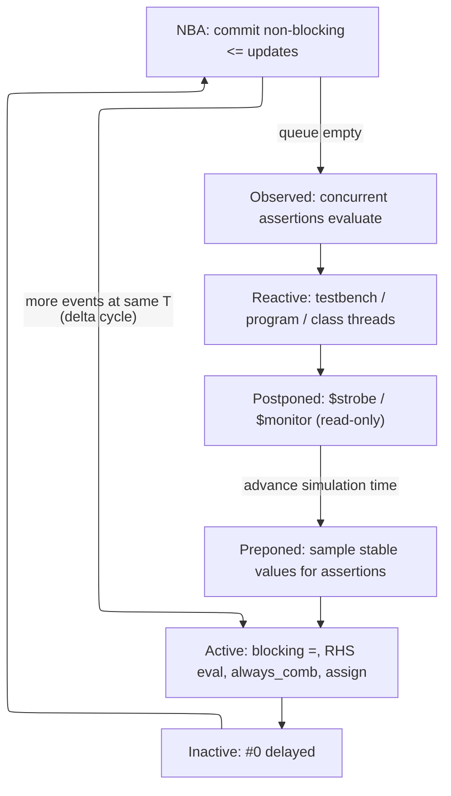

# SystemVerilog Procedural Code, Processes, and IPC — Deriving the Rules from the Event Scheduler

> **Stage:** 03 · Frontend RTL (register-transfer level). The *language mechanics* of concurrent behaviour — processes, assignments, and inter-process communication — derived from the one thing that governs them all: the simulation **event scheduler**. Distinct from the synchronous *discipline* ([RTL_Design_Methodology](01_RTL_Design_Methodology.md)) and the data model ([Data_Types_and_Basics](02_Data_Types_and_Basics.md)).
> **Prerequisites:** [Data_Types_and_Basics](02_Data_Types_and_Basics.md) (variables vs nets, 2/4-state, automatic vs static storage). **Hands off to:** [RTL_Design_Methodology](01_RTL_Design_Methodology.md) (inference, reset, coding rules), [Async_Design_and_CDC](06_Async_Design_and_CDC.md) (multi-clock races the scheduler cannot resolve), [OOP_and_Randomization](08_OOP_and_Randomization.md) & [UVM_Methodology](10_UVM_Methodology.md) (class-based testbench threads), [Assertions_and_Coverage](09_Assertions_and_Coverage.md) (the Observed/Reactive regions in use).

---

## 0. Why this page exists

Hardware is *spatially concurrent*: a million gates settle at once, in continuous time, with no notion of "which one goes first." A simulator is the opposite — a single sequential machine that does one thing at a time. To run concurrent hardware on a sequential CPU, SystemVerilog defines an **event-scheduling model**: it discretises time into slots, iterates zero-delay updates to a fixed point within each slot (the *delta cycle*), and — crucially — stratifies the work inside a slot into an *ordered set of regions* so the result does not depend on the arbitrary order the simulator happens to run your processes.

That scheduler is not background trivia; it is the **axiom from which almost every rule on this page is a theorem.** Blocking (`=`) vs non-blocking (`<=`) — the single most consequential choice in RTL — is not a style preference but a forced consequence of modelling a clock edge deterministically on a sequential machine. Why combinational logic uses one and sequential the other, why an event can be silently missed, why `#0` is a code smell, why a race survives even "correct" code — all fall out of the region model. So this page leads with the scheduler and *derives* the rest, instead of cataloguing signal names and method signatures. By the end you should be able to look at two processes and **predict whether the simulator's answer is even defined**, not merely recall that flops "use `<=`."

---

## 1. The problem: concurrency on a sequential machine

Real hardware has no execution order — every gate is a continuous analog process evolving in parallel. A software simulator cannot do that; it must serialise. The event-driven abstraction is the compromise that makes serialisation faithful:

- **Nothing happens unless a value changes.** A change on a signal is an *event*; an event *schedules* the re-evaluation of every process sensitive to that signal. Idle logic costs nothing — this is why a billion-gate netlist that is 99 % quiescent simulates cheaply (§8).
- **Time is discrete and advances only when the current instant is exhausted.** The simulator drains all work scheduled *now* before moving the clock forward. "Now" is therefore not one computation but potentially many — the delta cycles of §2.
- **The answer must be deterministic.** If the value the simulator computed depended on the order it happened to pick among same-time processes, the same RTL would behave differently run-to-run and tool-to-tool, and verification would be meaningless. Determinism is the hard requirement, and it is what forces the *stratified* queue rather than a single unordered "do everything now" bag.

Hold onto that third point. Every structural feature below — the regions, the deferred NBA update, the single-driver rules baked into `always_comb`/`always_ff` — exists to buy determinism back from a machine that is free to reorder.

---

## 2. The stratified event queue and the delta cycle

Within one simulation time $T$, the scheduler does not run processes in a free-for-all. It sorts every pending action into a **fixed total order of regions** and executes region by region. The conceptual order (not the exhaustive LRM list) is:



**Why regions exist — the derivation.** Two updates in the same instant, written in any order across separate processes, must still resolve deterministically. A total order over *classes* of action does exactly that: no matter which process the simulator picks first, a blocking write always lands before a non-blocking commit, which always lands before an assertion reads, which always lands before the testbench reacts. The regions quotient out the scheduler's freedom. The two that carry the whole page are **Active** (compute-now: blocking assigns, RHS evaluation, combinational settling) and **NBA** (commit-later: the deferred left-hand side of every `<=`).

**The delta cycle — the theoretical core.** A time slot at $T$ is not one instant of computation but a sequence of delta cycles $\delta_0,\delta_1,\dots$. Signal values are a function $v(s,T,\delta)$. At fixed $T$ the simulator runs the Active set; any resulting scheduled updates (Inactive `#0`, then NBA) open a *new* delta at the *same* $T$; it iterates until a delta produces no new events — a **fixed point**:

$$
v(s,T,\delta_{k+1}) = v(s,T,\delta_k)\quad \forall s \;\Longrightarrow\; \text{advance } T
$$

where $s$ ranges over signals, $T$ = simulation time, $\delta_k$ = delta index within the slot. Zero-delay logic thus consumes zero *simulation time* but a nonzero number of *deltas*. A combinational loop that never reaches this fixed point is precisely the "zero-delay oscillation" a simulator reports as a hang — the network has no stable assignment to converge to.

---

## 3. Blocking vs non-blocking: the central theorem

This is the concept the whole page is built to explain, and it is a direct consequence of §2 — not a convention to memorise.

**What a clock edge must do.** In real silicon every flip-flop samples its `D` input at the *same instant* (the value that was stable *before* the edge) and drives its `Q` *together* an instant later. There is no ordering among flops: a shift register shifts; it does not collapse. To be faithful, the simulator must reproduce "sample all, then update all" — even though it can only touch one process at a time.

**Why blocking breaks it (the read-after-write hazard).** With blocking `=`, the left side is updated *immediately*, in the Active region, before the next statement or process runs. So if the simulator happens to evaluate stage 1 before stage 2, stage 2 reads the value stage 1 just wrote — a read-after-write hazard — and the pipeline collapses into a single stage. Worse, whether it collapses *depends on the order the simulator chose*, which the language does not fix: it is a genuine race.

```verilog
// Two pipeline flops. The RHS must read the OLD value to model a real edge.
always_ff @(posedge clk) begin
    stage2 <= stage1;   // RHS sampled in Active (old stage1); LHS committed in NBA
    stage1 <= d;        // committed in NBA too -> stage2 gets OLD stage1, not d
end
// Correct 2-deep shift. Swap <= for =, and stage2 = stage1 = d in ONE edge:
// the pipeline collapses to a single stage, and the result depends on line order.
```

**Why non-blocking fixes it.** `<=` splits the assignment across regions exactly as the hardware does: the **RHS is evaluated in Active** (reading the pre-edge values), but the **LHS update is deferred to NBA**. Because every clocked process samples in Active *before* any of them commits in NBA, no flop can observe another flop's new value within the same edge. The order the simulator picks becomes unobservable — determinism restored, clock edge modelled. The same mechanism makes a same-edge *swap* (`a<=b; b<=a;`) exchange the two values instead of copying one over the other.

**The determinism guarantee, stated.** *Confluence theorem (informal):* if (1) every variable has a single driving process and (2) state is written with `<=` while pure combinational logic is written with `=` reading only settled inputs, then the values latched at each edge are **independent of the intra-region execution order.** Sketch: NBA gathers all state writes into one later region whose inputs were sampled in Active before any commit, so no state write can feed another state read within the slot — the schedule cannot be observed.

**Why combinational logic wants blocking.** Inside a combinational block you *want* immediate, sequential data flow: compute an intermediate with `=`, use it in the next line, and let the block settle in a single Active pass. Using `<=` there forces an extra delta cycle to converge, and — because the update lands after the block finishes — invites missed-sensitivity and sim/synth mismatch. Blocking is not just allowed for combinational logic; it is the faithful and faster choice.

**What determinism does *not* cover — the residual race.** The scheduler still leaves two things undefined, and discipline (not the language) must close them:

- **Multiple drivers of one variable in the same region** — two `=` (or two `<=`) to the same signal resolve in arbitrary order. `always_comb`/`always_ff` forbid multiple drivers precisely to make this unrepresentable.
- **Sharing a variable between a clocked and a combinational process** — the reader may see the old or new value depending on order.

One rule removes all of it: **one driver per signal · `<=` for state · `=` for pure combinational · never share a variable across a clocked and a combinational process.**

---

## 4. Blocking vs non-blocking as a correctness trade-off

Because the choice is derived, not stylistic, its "trade-off" is about *correctness*, with a small real performance tail — never preference:

| Logic | `=` (blocking) | `<=` (non-blocking) |
|---|---|---|
| **Sequential** (`always_ff`) | RAW hazard across flops → shift-register collapse; **order-dependent = race** | sample-old / commit-together → models the edge; **deterministic** ✅ |
| **Combinational** (`always_comb`) | one-pass settle, natural data flow → **correct and fast** ✅ | needs an extra delta to settle; sensitivity/order pitfalls, sim/synth-mismatch risk → **avoid** |

The only cost `<=` carries is scheduler overhead: each non-blocking assignment schedules a deferred NBA event, so NBA-heavy code touches the event queue more than pure blocking code (§8). That cost is negligible against the correctness it buys for state, and it is exactly the wrong economy to make for combinational logic, where the extra delta buys nothing. The decision is therefore mechanical: **state → `<=`, combinational → `=`**, every time.

---

## 5. Processes as declarations of intent

`always` is the raw looping process; `initial` runs once from time 0; `final` runs once at end of simulation (both testbench-only — no hardware to map to, §11). The `always_*` variants add **nothing to the scheduler** — they are *contracts* that let the tool check your intent statically and infer sensitivity for you. Each solves a specific silent bug that the legacy forms miss.

**`always_comb` over `always @(*)`.** Two differences are real bugs, not pedantry, and both trace to sensitivity:

```verilog
logic [7:0] lut [256];
function logic [7:0] lookup(logic [7:0] i); return lut[i]; endfunction

always_comb  r1 = lookup(addr);  // sensitive to addr AND lut[] (reads inside the call);
                                 // also evaluates once at time 0
always @(*)  r2 = lookup(addr);  // sensitive to addr ONLY, and never fires at time 0
// If lut[] changes but addr does not, r2 is STALE. If addr never changes, r2 is X forever.
```

`always_comb` derives sensitivity from everything *read* (including inside called functions), fires once at $T{=}0$ to establish outputs, and enforces a single driver. `always @(*)` builds its list only from signals textually read in the block and skips $T{=}0$ — the two omissions are how stale-output and stuck-at-X bugs slip through.

**`always_ff`.** Declares "this is a register": one clock/reset event expression, and the tool infers a flop from the sensitivity list (`@(posedge clk)` → sync; `@(posedge clk or negedge rst_n)` → async-reset flop). The LRM does not *mandate* `<=` inside it (§9.2.2.4 only requires a single event expression), but every synthesis tool warns on blocking assignments there — because §3 makes them a latent race. Treat the warning as an error.

**`always_latch`.** Declares an intentional level-sensitive latch (an `if` with no `else`), which silences the accidental-latch lint that `always_comb` would raise for the same code. Its value is purely the *stated intent*.

**Sensitivity semantics.** `@(posedge/negedge sig)` is edge-triggered (a flop/synchroniser); `@(*)` and `always_comb` are level-sensitive (combinational). Detailed inference — what maps to a flop, a latch, a mux — lives in [RTL_Design_Methodology](01_RTL_Design_Methodology.md); here the point is only that the process *keyword* is a machine-checkable promise about which region behaviour and which hardware you intend.

---

## 6. Concurrency: fork/join and process control

A testbench is itself concurrent — a driver, a monitor, a scoreboard, and several timeout watchers all live at once. `fork` spawns its statements as independent child processes into the scheduler; the **`join` variant is the synchronisation barrier**, and choosing it is a pure sync-cost-vs-parallelism trade:

| Construct | Parent resumes when | Sync cost | Canonical use |
|---|---|---|---|
| `join` | **all** children finish | full barrier | run N independent stimuli, wait for completion |
| `join_any` | **first** child finishes | partial | timeout: race a transaction against a deadline |
| `join_none` | **immediately** | none | launch background monitors/daemons that outlive the spawn |

**The classic fork-in-a-loop race — a scheduler consequence.** With `join_none`, the children do not run until the parent next blocks; by then the loop has advanced. If they capture the loop *variable* rather than a *value*, all of them read its final value:

```verilog
for (int i = 0; i < 4; i++)
    fork automatic int j = i; begin #1 $display(j); end join_none  // prints 0 1 2 3
//  ^ without 'automatic int j = i', every child shares one i and prints 4 4 4 4
```

The fix is an `automatic` copy per iteration — a per-activation variable so each child snapshots the value (storage-class background: [Data_Types_and_Basics](02_Data_Types_and_Basics.md), §9 below). This is not a fork bug; it is closure-over-mutable-state meeting deferred scheduling.

**Process control.** `disable fork` kills *all* child processes of the **current** process — including background monitors spawned earlier in the same scope, which is usually too much. Wrapping the region to isolate (`fork begin … disable fork; end join`) creates a fresh parent whose only children are the ones you mean to reap. A `process` handle (`process::self()`) is the reflective control — `status()`, `suspend()`, `kill()` — used to build watchdogs and timeouts; the class-thread patterns that use it belong to [OOP_and_Randomization](08_OOP_and_Randomization.md) and [UVM_Methodology](10_UVM_Methodology.md).

---

## 7. Inter-process communication: one need, one primitive

Once threads are concurrent they need three *orthogonal* services, and SystemVerilog gives one primitive to each. Read the table as a derivation — the need dictates the shape:

| Need | Primitive | Carries data? | Capacity | Blocking behaviour |
|---|---|---|---|---|
| **Synchronisation** ("it happened") | **event** | no | none (a pulse) | `@`/`wait` block until triggered |
| **Data hand-off + flow control** | **mailbox** | yes (typed) | unbounded, or bounded `N` | `put`/`get` block on full/empty |
| **Resource arbitration** | **semaphore** | no (keys) | `N` interchangeable keys | `get` blocks until keys free |

**Event — pure synchronisation, and its scheduler race.** An event has no data and no memory, so *when* it fires relative to the waiter matters. `->` triggers in the Active region; a plain `@(ev)` only catches a trigger that happens *after* the wait suspends. Same-instant, `->` can run first and the pulse is lost:

```verilog
fork
    begin #10; -> ev;             end   // trigger in Active
    begin #10; @(ev); /*missed*/  end   // wait registered after the trigger -> lost
join
```

Two fixes, both region-based: `wait(ev.triggered)` reads a flag that persists for the whole slot (order-independent within $T$); `->>` schedules the trigger in **NBA**, after every `@` has had a chance to arm. This race is the event primitive's defining hazard and the reason `.triggered`/`->>` exist.

**Mailbox — typed hand-off with back-pressure.** A parameterised `mailbox #(T)` is a type-safe queue. Unbounded (`new()`) never blocks on `put`; bounded (`new(N)`) blocks `put` when full and `get` when empty — and that blocking *is* flow control: a fast producer is throttled to the consumer's rate with no extra handshake logic. (`try_put`/`try_get`/`peek` are the non-blocking probes.) Prefer the parameterised form; the unparameterised mailbox accepts any type and defers the mismatch to a runtime error.

**Semaphore — arbitration over interchangeable resources.** `new(N)` holds `N` keys; `get(k)` blocks until `k` are free, `put(k)` returns them. `N=1` is a mutex; `N>1` is a resource pool (e.g. two shared bus slots among four agents). The failure mode is not the primitive but the *protocol*: acquiring two semaphores in opposite orders in two threads deadlocks. The standard prevention is a global lock order — always acquire `A` before `B` — which no primitive can enforce for you.

**Choosing between them.** Need to know an instant occurred, with no payload → **event**. Need to move data and rate-match producer to consumer → **mailbox** (its bounded blocking subsumes an event's "ready" signalling *and* carries the data). Need to cap concurrent access to `k` identical resources → **semaphore**. A mailbox can emulate an event (put a token) or a semaphore (pre-fill `N` tokens), but the purpose-built primitive states intent and avoids reinventing back-pressure or key accounting.

---

## 8. The simulation-performance cost of fine-grained processes

Because the scheduler is event-driven, wall-clock simulation time tracks *events processed*, not gates:

$$
T_{sim}\;\propto\;\sum_{\text{slots}} N_{events}\;\approx\;N_{sig}\times\alpha\times\bar{F}\times\bar{D}
$$

where $N_{sig}$ = signals, $\alpha$ = activity factor (fraction toggling per slot), $\bar{F}$ = mean fanout (processes woken per toggle), $\bar{D}$ = mean delta iterations to settle. A mostly-idle billion-gate netlist is cheap; a small oscillating combinational loop ($\bar{D}\to\infty$) is ruinous. This makes coding style a genuine performance lever:

- **Coarse over fine processes.** One vector `always_comb` over `[31:0]` costs one wakeup per change; thirty-two per-bit blocks cost up to thirty-two. Fewer, wider processes shrink $\bar{F}$.
- **2-state where X-accuracy is not needed** halves storage and event work ([Data_Types_and_Basics](02_Data_Types_and_Basics.md)).
- **Avoid gratuitous `#0` and NBA churn**, which add deltas ($\bar{D}$) without modelling anything.
- **Reap your forks.** Spawning one never-joined `join_none` child per transaction lets the process population — and the event queue it feeds — grow without bound.

This is the concrete meaning of "fine-grained processes are expensive": each is fixed scheduler bookkeeping multiplied by activity.

---

## 9. Tasks vs functions, automatic vs static — time and reentrancy

Two rules here are pure scheduler consequences, worth keeping when the rest is trimmed.

**Function = zero time; task = may consume time.** A `function` cannot contain anything that suspends the process — no `#delay`, `@event`, `wait`, or `fork…join` — because it must return within the *same* region it was called from; it therefore may be called from `always_comb`. A `task` may consume time and so may only be called from a time-consuming context. A `void function` is still a function (zero-time), not a task in disguise. This is why combinational logic can call helper functions but never tasks.

**Automatic vs static = reentrancy under concurrency.** Module-level tasks/functions default to **static** — one shared copy of their locals. Two concurrent activations (two `fork` calls, or a task called each clock) then *collide* on those locals, corrupting each other's state. Declaring them `automatic` gives each activation its own stack frame. Class methods are automatic by default (each object call is independent); program-block subprograms too. The rule: **anything that can be active in more than one process at once must be `automatic`** — the same reason the fork-loop copy in §6 must be `automatic`.

---

## 10. Building on the regions: clocking blocks and reactive code

Two testbench constructs are best understood as *applications* of §2's regions, not new mechanisms:

- **Clocking block** — bundles DUT signals under a clock with explicit *skews* so the testbench samples and drives in defined regions rather than racing RTL. `input #1step` samples in the **Preponed** region — the stable pre-edge value, modelling setup time exactly as real hardware sees it — and `output #0` drives at the edge. It is a race-avoidance wrapper whose whole job is to pin testbench I/O to safe regions.
- **Reactive-region code** — the (now largely legacy) `program` block ran stimulus in the **Reactive** region, after all RTL Active/NBA and assertion Observed work had settled, so the testbench saw stable values. UVM replaced it: class-based components schedule their own threads into the Reactive region and use clocking blocks plus disciplined coding for the same race freedom, without the program block's one-shot `$finish` and OOP limitations. The detail lives in [UVM_Methodology](10_UVM_Methodology.md).

The takeaway is uniform: every "how do I avoid a testbench/RTL race" answer is "drive and sample in the right region," which is why the region model (§2) is the prerequisite for all of it.

---

## 11. Which constructs have hardware, and which are scheduler-only

The scheduler runs both the design and its testbench, but only a subset of constructs has a gate mapping — the rest exist purely as simulation behaviour (and are the $\alpha$/$\bar F$ terms of §8). Keeping the split straight is what stops testbench idioms from leaking into RTL:

| Maps to hardware (RTL) | Scheduler-only (no hardware) |
|---|---|
| `always_ff` / `always_comb` / `always_latch`, `assign` | `initial` / `final`, `fork…join{,_any,_none}` |
| static-bound `for`, `generate` | `#delay`, `wait`, untimed `forever`, `@event` as control |
| zero-time combinational `function` | `$display`/`$strobe`/`$finish`, `mailbox`/`semaphore`/`event`, classes |
| module/cell instantiation | `#1step`/`#0`, clocking blocks, `program`/reactive code |

One line: **the tool maps register-transfer structure to gates; time-consuming and object-based constructs have no hardware to map to.** A `for` bound or `generate` range must be static precisely because synthesis unrolls it into fixed structure instead of executing it over time. Coding-construct choices that live on the *synthesis* side of this line — `case`/`casez`/`casex` (and the `unique`/`priority` qualifiers), latch avoidance, full/parallel semantics — are the province of [RTL_Design_Methodology](01_RTL_Design_Methodology.md) and [Lint_CDC_RDC_Signoff](07_Lint_CDC_RDC_Signoff.md); the one trap worth carrying across is that `casex` treats an `x` on the selector as a wildcard, silently *masking* a real bug, so it is banned in RTL.

---

## Numbers to memorize

| Fact | Value / rule | Why (section) |
|---|---|---|
| Region order in a slot | Preponed → Active → (Inactive) → NBA → Observed → Reactive → Postponed | determinism via stratification (§2) |
| Delta cycle | zero sim-time, ≥1 delta; loops Active↔NBA to a fixed point | zero-delay convergence (§2) |
| Sequential logic assignment | **`<=`** (sample-old in Active, commit in NBA) | models a clock edge deterministically (§3) |
| Combinational logic assignment | **`=`** (settles in one Active pass) | immediate data flow, no extra delta (§3–4) |
| Blocking in `always_ff` | tool warning; latent race | RAW hazard across flops (§3) |
| `always_comb` vs `@(*)` | fires at $T{=}0$; sensitive to called-function reads | catches stale-output / stuck-X bugs (§5) |
| `fork…join` variants | all / first / none complete before parent resumes | sync-cost vs parallelism (§6) |
| Fork-in-loop capture | needs `automatic` per-iteration copy | closure + deferred scheduling (§6) |
| Event same-slot race | `->` may beat `@`; use `wait(ev.triggered)` or `->>` | Active vs NBA trigger timing (§7) |
| Mailbox `new()` vs `new(N)` | unbounded (never blocks put) vs bounded (back-pressure) | flow control from blocking (§7) |
| Semaphore `new(N)` | `N` keys; `N=1` mutex, `N>1` pool; deadlock on lock-order | resource arbitration (§7) |
| function vs task | function = 0 time (callable from `always_comb`); task = may consume time | region-return constraint (§9) |
| module subprogram default | **static** (shared locals) → make `automatic` for concurrency | reentrancy (§9) |
| Clocking-block skews | `input #1step` (Preponed sample), `output #0` (drive at edge) | testbench/RTL race avoidance (§10) |

---

## Worked problems

**1 — Is this deterministic?** Two clocked processes, `always_ff @(posedge clk) q1 = d;` and `always_ff @(posedge clk) q2 = q1;`, both blocking. *Answer:* no. If the simulator runs the first block before the second, `q2` gets the *new* `q1` (a one-cycle collapse); the other order gives the old `q1`. The language fixes no order among same-region processes, so this is a race. Switching both to `<=` moves the commits to NBA, so `q2` always samples the old `q1` in Active — deterministic two-flop behaviour (§3).

**2 — Why does the pulse get lost?** A generator does `#10; -> ev;` while a checker does `#10; @(ev);`. At $T{=}10$ the trigger executes in Active; if it runs before the checker suspends on `@`, the checker waits forever. *Fix:* `wait(ev.triggered)` reads a slot-persistent flag, or the generator uses `->>` to fire in NBA after the checker has armed (§7).

**3 — Sizing back-pressure.** A producer emits every ~12 ns; a consumer takes ~20 ns each. With an *unbounded* mailbox the queue grows without bound (arrivals outrun service) and memory/event load climbs (§8). A *bounded* `new(N)` blocks the producer on full, pinning throughput to the 20 ns service rate and capping in-flight items at `N` — the blocking `put` *is* the flow-control loop, no extra handshake needed (§7).

---

## Cross-references

- **Down the stack (what this is built on):** [Data_Types_and_Basics](02_Data_Types_and_Basics.md) (variables vs nets, 2/4-state cost in §8, automatic/static storage behind §6 and §9).
- **Up the stack (what builds on it):** [RTL_Design_Methodology](01_RTL_Design_Methodology.md) (turns §3–§5 into the synchronous coding discipline: inference, reset, latch avoidance, case qualifiers), [Assertions_and_Coverage](09_Assertions_and_Coverage.md) (lives in the Preponed/Observed/Reactive regions of §2), [OOP_and_Randomization](08_OOP_and_Randomization.md) & [UVM_Methodology](10_UVM_Methodology.md) (class-based testbench threads, IPC, and clocking blocks of §6–§10 at scale).
- **Adjacent:** [Async_Design_and_CDC](06_Async_Design_and_CDC.md) (a multi-clock crossing is a race *no* scheduler can make deterministic — metastability, not a coding rule — which is exactly why it needs synchronisers), [Lint_CDC_RDC_Signoff](07_Lint_CDC_RDC_Signoff.md) (static rules that flag the §3 blocking-in-`always_ff` and §11 `casex` hazards before simulation).

---

## References

1. IEEE Std 1800-2017, *SystemVerilog LRM*. Clause 4 (scheduling semantics / regions), Clause 9 (processes), Clause 15 (events, mailboxes, semaphores).
2. Cummings, C.E., "Nonblocking Assignments in Verilog Synthesis, Coding Styles That Kill!," SNUG 2000. The blocking/non-blocking derivation of §3.
3. Cummings, C.E., "SystemVerilog Event Regions, Race Avoidance & Guidelines," SNUG 2006. The stratified regions and delta-cycle model of §2.
4. Spear, C. and Tumbush, G., *SystemVerilog for Verification*, 3rd ed., Springer, 2012. Processes, fork/join, and IPC primitives of §6–§7.
