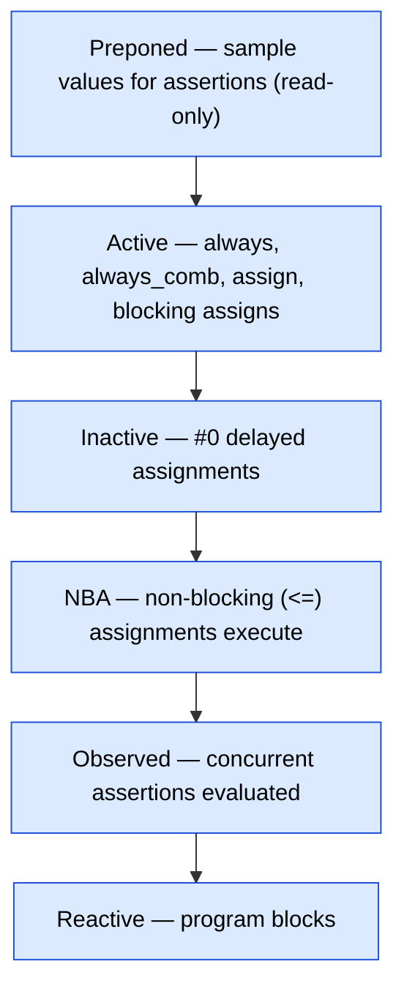

# SystemVerilog Procedural Blocks, Processes, and IPC -- Senior Engineer Deep Dive

---

## SystemVerilog Scheduling Semantics

Understanding the simulation scheduler is non-negotiable for senior verification engineers.
Race conditions, assertion failures, and testbench/RTL interaction bugs all trace back to
which region executes when.

### The Simulation Time Slot Regions

Each simulation time step is divided into these ordered regions:



Within Active/Reactive, events iterate until no more are pending (delta cycle convergence).

### How This Matters in Practice

```verilog
module scheduler_demo;
    logic clk = 0;
    logic [7:0] a, b, c;

    always #5 clk = ~clk;

    // Active region: combinational logic evaluates
    always_comb c = a + b;

    // Active region: blocking assignment in always block
    always @(posedge clk) begin
        a = 8'h10;   // Executes in Active region
    end

    // NBA region: non-blocking assignment
    always @(posedge clk) begin
        b <= 8'h20;  // Scheduled to NBA region
    end

    // Observed region: assertion checks sampled values from Preponed
    property p_sum;
        @(posedge clk) (c == a + b);
    endproperty
    assert property (p_sum);

    // Reactive region: program block testbench code
    // (If using program block -- deprecated in modern UVM)
endmodule
```

### Why Non-Blocking Assignments Use NBA Region

The NBA region exists to prevent race conditions in sequential logic. All RHS values are
captured in Active, then all LHS updates happen together in NBA. This ensures:

```verilog
always @(posedge clk) begin
    a <= b;   // Captures b's current value
    b <= a;   // Captures a's current value (not the one just assigned!)
end
// Result: a and b SWAP correctly. With blocking (=), order matters and one value is lost.
```

---

## always_comb vs always @(*)

### The TWO Critical Differences

**Difference 1: always_comb triggers at time 0**

```verilog
module time_zero_demo;
    logic [7:0] a = 8'hFF;
    logic [7:0] y1, y2;

    // always_comb: evaluates at time 0, y1 = 8'hFF immediately
    always_comb y1 = a;

    // always @(*): does NOT trigger at time 0, y2 is X until a changes
    always @(*) y2 = a;

    initial begin
        #0;
        $display("y1=%h y2=%h", y1, y2);  // y1=FF, y2=xx
        // y2 only updates when 'a' changes -- but a never changes!
        // This is a REAL BUG that always_comb catches
    end
endmodule
```

**Difference 2: always_comb is sensitive to function contents**

```verilog
logic [7:0] lut [256];    // Lookup table
logic [7:0] addr, result1, result2;

function logic [7:0] lookup(logic [7:0] idx);
    return lut[idx];       // Reads from lut[] internally
endfunction

// always_comb: sensitive to addr AND lut (reads inside lookup)
always_comb result1 = lookup(addr);
// If lut[x] changes, result1 re-evaluates

// always @(*): sensitive to addr ONLY (doesn't analyze function body)
always @(*) result2 = lookup(addr);
// If lut[x] changes but addr doesn't, result2 is STALE -- BUG
```

### Other always_comb Restrictions

```verilog
always_comb begin
    // These are all ILLEGAL in always_comb:
    // #10 y = a;            // No delays
    // @(posedge clk) y = a; // No event controls
    // wait (enable) y = a;  // No waits
    // fork ... join         // No fork
end

// always_comb also enforces: variable assigned in always_comb
// cannot be assigned by any other process
logic y;
always_comb y = a & b;
// assign y = c;  // ERROR: y already driven by always_comb
```

---

## always_ff

### Single-Clock Enforcement

```verilog
// CORRECT: single clock edge, optional async reset
always_ff @(posedge clk or negedge rst_n) begin
    if (!rst_n)
        q <= '0;
    else
        q <= d;
end

// GOTCHA: multiple clock edges -- some tools allow, some flag as error
always_ff @(posedge clk or posedge clk2) begin  // Questionable
    // Which clock drives this register? Ambiguous for synthesis
end

// Note: always_ff does NOT enforce non-blocking assignments per the LRM.
// The LRM (1800-2017 §9.2.2.4) only mandates a single event expression.
// However, most synthesis tools will warn/error on blocking assignments
// in always_ff as a best-practice check (tool-specific enforcement).
always_ff @(posedge clk) begin
    q = d;    // WARNING in most synthesis tools, but technically legal per LRM
end
```

### Synthesis Mapping

`always_ff` tells synthesis tools this is a register. The sensitivity list determines:
- `@(posedge clk)` -> flip-flop with synchronous behavior only
- `@(posedge clk or negedge rst_n)` -> flip-flop with async active-low reset
- `@(posedge clk or posedge rst)` -> flip-flop with async active-high reset

---

## always_latch

```verilog
always_latch begin
    if (enable)
        q <= d;
    // No else: intentional latch behavior
end

// This is equivalent to always_comb for latches, but makes intent explicit
// Tools won't warn about latch inference (they would with always_comb)
```

---

## Fork-Join Deep Dive

### Three Variants

```verilog
// fork-join: waits for ALL child processes to complete
fork
    begin task_A(); end   // Process 1
    begin task_B(); end   // Process 2
    begin task_C(); end   // Process 3
join                      // Blocks until ALL three finish

// fork-join_any: waits for ANY ONE child to complete
fork
    begin task_A(); end
    begin task_B(); end
    begin task_C(); end
join_any                  // Blocks until FIRST one finishes
// Other two still running in background!

// fork-join_none: doesn't wait at all, spawns and continues
fork
    begin task_A(); end
    begin task_B(); end
join_none                 // Returns immediately, tasks run in background
// Parent continues executing here while tasks run concurrently
```

### Timing Diagram Example

```text
Time:    0   10   20   30   40   50
Task A:  |=========|                   (finishes at t=20)
Task B:  |==================|          (finishes at t=30)
Task C:  |===========================| (finishes at t=50)

fork-join      : parent resumes at t=50
fork-join_any  : parent resumes at t=20 (A finishes first)
fork-join_none : parent resumes at t=0  (immediate)
```

### THE CLASSIC BUG: For-Loop + Fork

This is one of the most common interview questions and real-world bugs.

```verilog
// BUG: All spawned processes see the SAME variable i
initial begin
    for (int i = 0; i < 4; i++) begin
        fork
            begin
                #10;
                $display("i = %0d", i);  // ALL print "i = 4"!
            end
        join_none
    end
    wait fork;
end
// Output: i = 4, i = 4, i = 4, i = 4
// WHY: fork captures the VARIABLE i, not its VALUE.
// By the time #10 passes, the for loop is done and i == 4.
```

```verilog
// FIX 1: Automatic variable captures a copy
initial begin
    for (int i = 0; i < 4; i++) begin
        automatic int j = i;  // j gets a COPY of i at each iteration
        fork
            begin
                #10;
                $display("j = %0d", j);  // Prints 0, 1, 2, 3
            end
        join_none
    end
    wait fork;
end

// FIX 2: Extra begin-end with automatic (more idiomatic)
initial begin
    for (int i = 0; i < 4; i++) begin
        fork
            begin
                automatic int k = i;
                #10;
                $display("k = %0d", k);  // Prints 0, 1, 2, 3
            end
        join_none
    end
    wait fork;
end
```

---

## Disable Fork: Scope and the Isolation Wrapper

### The Problem: disable fork Kills TOO Much

```verilog
initial begin
    fork
        begin  // Background monitor -- should run forever
            forever @(posedge clk) check_protocol();
        end
    join_none

    // Later, run a transaction with timeout
    fork
        begin drive_transaction(); end
        begin #1000 $display("Timeout!"); end
    join_any
    disable fork;  // KILLS EVERYTHING -- including the background monitor!
end
```

### The Fix: Isolation Wrapper Pattern

```verilog
initial begin
    fork
        begin  // Background monitor
            forever @(posedge clk) check_protocol();
        end
    join_none

    // Isolate the disable fork scope
    fork begin  // <-- This begin creates a NEW child process scope
        fork
            begin drive_transaction(); end
            begin #1000 $display("Timeout!"); end
        join_any
        disable fork;  // Only kills processes within THIS begin-end
    end join  // <-- join waits for the isolating process

    // Background monitor is still alive!
end
```

The key insight: `disable fork` disables all child processes of the **current** process.
By wrapping in `fork begin...end join`, you create a new process whose children are only
the timeout and the transaction -- not the background monitor.

---

## Process Class (IEEE 1800)

### Complete Watchdog Timer Using process::self()

```verilog
class watchdog;
    process proc_handle;
    int timeout_ns;

    function new(int timeout = 10000);
        this.timeout_ns = timeout;
    endfunction

    task start();
        fork begin
            proc_handle = process::self();
            #(timeout_ns * 1ns);
            `uvm_fatal("WATCHDOG", $sformatf("Timeout after %0d ns", timeout_ns))
        end join_none
    endtask

    task stop();
        if (proc_handle != null) begin
            if (proc_handle.status() != process::FINISHED &&
                proc_handle.status() != process::KILLED) begin
                proc_handle.kill();
                $display("Watchdog stopped");
            end
        end
    endtask

    function bit is_running();
        if (proc_handle == null) return 0;
        return (proc_handle.status() == process::RUNNING ||
                proc_handle.status() == process::WAITING);
    endfunction
endclass

// Usage in a test:
task run_phase(uvm_phase phase);
    watchdog wd = new(50000);  // 50us timeout
    phase.raise_objection(this);

    wd.start();
    run_all_sequences();
    wd.stop();

    phase.drop_objection(this);
endtask
```

### process::status() Values

| Status | Meaning |
|---|---|
| `process::FINISHED` | Process completed normally |
| `process::RUNNING` | Currently executing |
| `process::WAITING` | Blocked on event/delay/wait |
| `process::SUSPENDED` | Explicitly suspended |
| `process::KILLED` | Killed by kill() or disable |

---

## Inter-Process Communication: Mailbox

Processes spawned with fork need to synchronize and exchange data. SystemVerilog provides three IPC primitives: mailboxes (typed queues), semaphores (key pools), and events (triggers).

### Bounded vs Unbounded with Blocking Behavior

```verilog
mailbox #(Transaction) mbx_unbounded = new();   // Unbounded: never blocks on put
mailbox #(Transaction) mbx_bounded = new(4);    // Bounded: blocks put when 4 items stored

// put():  blocks if bounded mailbox is full (waits for space)
// get():  blocks if mailbox is empty (waits for item)
// try_put(): non-blocking put, returns 0 if full
// try_get(): non-blocking get, returns 0 if empty
// peek(): blocks until item available, copies without removing
// try_peek(): non-blocking peek, returns 0 if empty
// num(): returns current number of items (never blocks)
```

### Producer-Consumer with Timing

```verilog
class producer;
    mailbox #(Transaction) mbx;
    
    task run();
        for (int i = 0; i < 10; i++) begin
            Transaction txn = new();
            txn.randomize();
            txn.id = i;
            #($urandom_range(5, 20));  // Variable production rate
            mbx.put(txn);  // Blocks if bounded and full
            $display("T=%0t: Producer put txn %0d", $time, i);
        end
    endtask
endclass

class consumer;
    mailbox #(Transaction) mbx;
    
    task run();
        Transaction txn;
        forever begin
            mbx.get(txn);  // Blocks until item available
            $display("T=%0t: Consumer got txn %0d", $time, txn.id);
            #10;  // Processing time
        end
    endtask
endclass

// Wiring:
initial begin
    mailbox #(Transaction) mbx = new(4);  // Bounded: max 4
    producer prod = new();
    consumer cons = new();
    prod.mbx = mbx;
    cons.mbx = mbx;
    fork
        prod.run();
        cons.run();
    join_any
end
// When bounded mailbox is full, producer blocks on put()
// When empty, consumer blocks on get()
// This naturally provides back-pressure flow control
```

### Type Safety

```verilog
// Parameterized mailbox ensures type safety at compile time
mailbox #(Transaction) txn_mbx = new();
mailbox #(int) int_mbx = new();

Transaction t = new();
txn_mbx.put(t);    // OK
// int_mbx.put(t);  // COMPILE ERROR: wrong type

// Unparameterized mailbox accepts any type (like void*)
mailbox generic_mbx = new();
generic_mbx.put(t);         // OK
generic_mbx.put(42);        // Also OK -- dangerous!
// You must cast when getting:
Transaction t2;
generic_mbx.get(t2);        // Runtime error if item isn't a Transaction
```

---

## Semaphore

### Counting Semaphore -- Not Just a Mutex

```verilog
// Semaphore with N keys = counting semaphore
// N=1: binary semaphore (mutex)
// N>1: resource pool

semaphore bus_slots = new(2);  // 2 available bus slots

// 4 agents competing for 2 bus slots:
task automatic agent_task(int id);
    repeat (5) begin
        bus_slots.get(1);  // Acquire 1 slot (blocks if none available)
        $display("T=%0t: Agent %0d acquired bus slot", $time, id);
        #($urandom_range(10, 50));  // Use the bus
        bus_slots.put(1);  // Release 1 slot
        $display("T=%0t: Agent %0d released bus slot", $time, id);
        #5;  // Idle time
    end
endtask

initial begin
    fork
        agent_task(0);
        agent_task(1);
        agent_task(2);
        agent_task(3);
    join
end
// At most 2 agents use the bus simultaneously
// Others block on get() until a slot is released
```

### Semaphore Methods

```verilog
semaphore sem = new(3);  // 3 keys initially

sem.get(2);     // Acquire 2 keys. Blocks if < 2 available.
sem.put(1);     // Return 1 key. Never blocks.
sem.try_get(1); // Non-blocking: returns 1 if success, 0 if not enough keys.

// GOTCHA: put() can add MORE keys than initially created!
semaphore s = new(1);
s.put(1);       // Now 2 keys available (no upper bound enforced)
s.put(100);     // Now 102 keys -- probably a bug
```

### Deadlock Scenario and Prevention

```verilog
semaphore sem_a = new(1);
semaphore sem_b = new(1);

// DEADLOCK: two processes acquire semaphores in opposite order
task automatic process_1();
    sem_a.get(1);  // Gets A
    #10;           // Window for deadlock
    sem_b.get(1);  // Waits for B (held by process_2) -- DEADLOCK
    // ... work ...
    sem_b.put(1);
    sem_a.put(1);
endtask

task automatic process_2();
    sem_b.get(1);  // Gets B
    #10;           // Window for deadlock
    sem_a.get(1);  // Waits for A (held by process_1) -- DEADLOCK
    // ... work ...
    sem_a.put(1);
    sem_b.put(1);
endtask

// PREVENTION: always acquire in the same order
task automatic process_1_fixed();
    sem_a.get(1);  // Always acquire A first
    sem_b.get(1);  // Then B
    // ... work ...
    sem_b.put(1);
    sem_a.put(1);
endtask

task automatic process_2_fixed();
    sem_a.get(1);  // Same order: A first
    sem_b.get(1);  // Then B
    // ... work ...
    sem_b.put(1);
    sem_a.put(1);
endtask
```

---

## Events

### The Race Between -> and @

```verilog
event done;

// RACE: if trigger and wait happen in the same time step
initial begin
    fork
        begin
            #10;
            -> done;         // Trigger at T=10
        end
        begin
            #10;
            @(done);         // Wait at T=10 -- MAY MISS the trigger!
            // The @ was evaluated before the -> in this time step
        end
    join
end

// FIX 1: use .triggered (persistent within the time step)
initial begin
    fork
        begin #10; -> done; end
        begin
            #10;
            wait (done.triggered);  // Catches same-time-step trigger
        end
    join
end

// FIX 2: use nonblocking trigger ->>
initial begin
    fork
        begin #10; ->> done; end  // Trigger in NBA region
        begin
            #10;
            @(done);              // Now safely catches it
        end
    join
end
```

### wait_order: Event Sequence Checking

```verilog
event e1, e2, e3;

// Block until e1, e2, e3 fire in that exact order
initial begin
    wait_order(e1, e2, e3)
        $display("Events fired in correct order");
    else
        $error("Events fired out of order");
end
```

---

## Task vs Function

### Fundamental Rule

- **Functions** cannot consume simulation time. No `#delay`, `@event`, `wait`, `fork-join`.
  They execute in zero time and return a value.
- **Tasks** can consume time. They can have delays, waits, event controls, fork-join.
  They do not return values (use output/inout arguments instead).

```verilog
// Function: zero-time computation
function logic [7:0] compute_crc(logic [31:0] data);
    // Cannot have: #10, @(posedge clk), wait(signal), fork-join
    logic [7:0] crc = 0;
    for (int i = 0; i < 32; i++)
        crc = crc ^ data[i];
    return crc;
endfunction

// Task: can consume time
task drive_data(input logic [31:0] data);
    @(posedge clk);        // Wait for clock edge
    valid <= 1'b1;
    bus_data <= data;
    @(posedge clk);
    wait (ready);           // Wait for handshake
    valid <= 1'b0;
endtask

// Calling context restrictions:
always_comb begin
    crc = compute_crc(data);   // OK -- function is zero-time
    // drive_data(data);        // ERROR -- cannot call task from always_comb
end
```

### Void Functions: Not Syntactic Sugar for Tasks

A `void function` returns nothing but is still a FUNCTION -- zero time, no delays. It is NOT
equivalent to a task. You can call void functions from always_comb; you cannot call tasks.

```verilog
function void log_event(string msg);  // No return value, but zero-time
    $display("T=%0t: %s", $time, msg);
endfunction

always_comb begin
    log_event("Combinational block evaluated");  // OK
end
```

### Functions Can Call Functions, Tasks Can Call Both

```text
Function -> Function : OK
Function -> Task     : ERROR (task may consume time)
Task     -> Function : OK
Task     -> Task     : OK
```

---

## Automatic vs Static

### The Default Is DANGEROUS

- **Module-level** tasks/functions default to **static** (shared variables)
- **Class methods** are always **automatic** (each call gets its own copy)
- **Program block** tasks/functions default to **automatic**

### The Critical Bug With Static Tasks

```verilog
module static_bug;
    task count(input int id);  // DEFAULT: static!
        int local_var;          // Shared across all concurrent calls!
        local_var = 0;
        repeat (3) begin
            #10;
            local_var++;
            $display("T=%0t ID=%0d count=%0d", $time, id, local_var);
        end
    endtask

    initial begin
        fork
            count(1);  // Both calls share the SAME local_var!
            count(2);
        join
    end
endmodule

// Output (WRONG -- variables collide):
// T=10 ID=1 count=1
// T=10 ID=2 count=2   <- Expected 1, got 2!
// T=20 ID=1 count=3   <- Expected 2, got 3!
// T=20 ID=2 count=4   <- Expected 2, got 4!
```

```verilog
// FIX: declare as automatic
module fixed;
    task automatic count(input int id);
        int local_var;  // Each call gets its OWN copy
        local_var = 0;
        repeat (3) begin
            #10;
            local_var++;
            $display("T=%0t ID=%0d count=%0d", $time, id, local_var);
        end
    endtask
endmodule

// Output (CORRECT):
// T=10 ID=1 count=1
// T=10 ID=2 count=1
// T=20 ID=1 count=2
// T=20 ID=2 count=2
```

### Making an Entire Module Automatic

```verilog
module automatic my_module;  // ALL tasks/functions in this module are automatic
    // ...
endmodule
```

---

## Clocking Blocks

### Purpose: Model Setup/Hold Timing Relationships

Clocking blocks define the timing relationship between testbench and DUT signals, abstracting
away clock edges and skew. `input #1step` samples in the Preponed region — i.e., at the
current time slot *before* the Active region evaluates, capturing DUT state as it was
immediately before the clock edge. `output #0` drives at the exact clock edge (Re-Nba region).

```verilog
interface bus_if (input logic clk);
    logic [7:0] data;
    logic       valid;
    logic       ready;

    clocking driver_cb @(posedge clk);
        default input #1step output #0;
        output data;
        output valid;
        input  ready;   // Sampled 1step before posedge clk
    endclocking

    clocking monitor_cb @(posedge clk);
        default input #1step output #0;
        input data;
        input valid;
        input ready;
    endclocking

    modport driver_mp (clocking driver_cb);
    modport monitor_mp (clocking monitor_cb);
endinterface
```

### Using Clocking Blocks in a Testbench

```verilog
class driver;
    virtual bus_if.driver_mp vif;

    task drive_transaction(Transaction txn);
        // Wait for clock edge using clocking block
        @(vif.driver_cb);

        // Drive outputs through clocking block (automatically clocked)
        vif.driver_cb.data  <= txn.data;
        vif.driver_cb.valid <= 1'b1;

        // Wait for ready (sampled at previous 1step)
        while (!vif.driver_cb.ready)
            @(vif.driver_cb);

        @(vif.driver_cb);
        vif.driver_cb.valid <= 1'b0;
    endtask
endclass
```

### Why #1step and #0 Specifically?

`#1step` is the smallest representable time unit in the simulator -- it samples in the
Preponed region, BEFORE any Active-region logic executes. This models setup time: the
testbench sees values that were stable before the clock edge, exactly as real hardware would.

`#0` output drives at the clock edge itself, in the same time slot. Since RTL evaluates in
Active region and testbench drives in Reactive region (via program blocks) or the same Active
region with clocking block scheduling, this ensures proper ordering.

---

## Program Block

### Why It Exists: Race-Free Testbench Execution

```verilog
program automatic test (bus_if.driver_mp drv_if);
    initial begin
        // This executes in the REACTIVE region
        // All RTL (Active region) and assertions (Observed) are done
        // So testbench sees stable, settled values -- no races
        @(drv_if.driver_cb);
        drv_if.driver_cb.data <= 8'hFF;
    end
endprogram
```

### Why UVM Deprecated Program Blocks

1. **OOP incompatibility**: program blocks don't support class-based component hierarchies well
2. **Implicit $finish**: program blocks call `$finish` when all initial blocks complete, which
   can terminate simulation prematurely when using phase-based UVM control
3. **Limited fork-join**: some simulators restrict concurrent processes in program blocks
4. **One-shot execution**: program blocks run once; UVM needs phases that can re-execute
5. **Modern alternative**: UVM uses `uvm_test` with phase mechanism for simulation control,
   and clocking blocks + careful coding practices to avoid races

---

## Wait Statements and Event Control

```verilog
// Edge-triggered wait
@(posedge clk);           // Wait for rising edge of clk
@(negedge rst_n);         // Wait for falling edge of rst_n
@(posedge clk or negedge rst_n);  // Wait for either

// Level-sensitive wait
wait (ready == 1);         // Block until ready is 1
// GOTCHA: if ready is already 1, wait returns immediately (no blocking)

// Named event
event done;
-> done;                   // Trigger the event (Active region)
@(done);                   // Wait for trigger

// RACE CONDITION: if -> and @ happen in same time step
// The @ might miss the trigger (it was registered before the ->)
// Fix: use .triggered
wait (done.triggered);     // Catches same-time-step triggers

// Nonblocking event trigger
->> done;                  // Trigger in NBA region (avoids some races)
```

---

## Disable Statement

```verilog
// Disable a named block
begin : my_block
    forever begin
        @(posedge clk);
        if (condition) disable my_block;  // Exits the named block
    end
end

// Disable a task (all instances!)
task automatic long_task();
    // ...
endtask

initial begin
    fork
        long_task();   // Instance 1
        long_task();   // Instance 2
    join_none

    #100;
    disable long_task;  // Disables ALL active instances of long_task!
end
```

---

## RTL Coding Constructs and Synthesizability

### case vs casez vs casex

All three pick a branch by comparing the selector against each case-item, **bit by bit**. They differ only in how `x`/`z` bits are treated during that compare:

- **`case`** — exact 4-state compare. Every bit must match literally, including `x` and `z`. There is **no wildcard**: an item bit written as `?` is just `z` and is matched literally (see trap below).
- **`casez`** — `z` (and its shorthand `?`) bits are **don't-care** wildcards, on *either* the selector or the item. This is the idiom for priority / one-hot decoders: list patterns like `4'b1???`, or use the reverse-case form `case (1'b1)` with the conditions as items.
- **`casex`** — **both** `x` and `z` are wildcards. This is **dangerous**: a propagated `x` on the selector silently matches some item, so a real bug (uninitialized/contended signal) is masked instead of producing `x`. Avoid in RTL; lint rules flag every `casex`.

**Trap:** in plain `case`, `?` is **not** a wildcard — it is `z`, matched literally. Writing `casez`-style patterns such as `4'b1?_??` inside a plain `case` is a classic bug: those items only match if the selector actually carries `z` bits, so the branch never fires for normal `0/1` inputs.

Per-bit match table (selector bit value down, statement across — does the item wildcard bit match it?):

| selector bit | `case` (item `?`=`z`) | `casez` (item `?`/`z`) | `casex` (item `?`/`z`/`x`) |
|--------------|-----------------------|------------------------|----------------------------|
| `0`          | no (item `z` ≠ `0`)   | **yes**                | **yes**                    |
| `1`          | no (item `z` ≠ `1`)   | **yes**                | **yes**                    |
| `x`          | no                    | no (only `z` wild)     | **yes**                    |
| `z`          | yes (literal `z`=`z`) | **yes**                | **yes**                    |

**Qualifiers.** Prefix the keyword with `unique` / `unique0` / `priority` to state intent: `unique` asserts the items are mutually exclusive and (for `unique`) fully cover the selector — the tool both checks this in simulation and uses it to drop priority/default logic; `priority` asserts at least one item matches and preserves top-to-bottom precedence. Prefer these over the legacy `// synopsys full_case parallel_case` pragmas, which assert the same facts to **synthesis only** — if the assertion is false, the gates and the simulation disagree (a sim/synth mismatch that the qualifiers would have caught in sim). See the Synthesis/Lint notes elsewhere in `03_Frontend_RTL_and_Verification` for how these are enforced.

### Synthesizable vs Non-Synthesizable Constructs

Think of an abstraction ladder, and the synthesis tool as a mapper that only understands the lower rungs:

- **Behavioral / algorithmic** — describes *what* to compute, possibly untimed. May be non-synthesizable.
- **RTL (register-transfer)** — clocked registers + combinational logic between them. This is the synthesizable contract: the tool maps it to gates and flops.
- **Gate / structural** — explicit primitives or instantiated cells.

| Synthesizable (maps to hardware) | Non-synthesizable (simulation / testbench only) |
|----------------------------------|-------------------------------------------------|
| `always` / `always_ff` / `always_comb` / `always_latch` | `initial` blocks |
| `assign`, `if`/`case` (see above) | `fork…join` / `join_any` / `join_none` (see [Fork-Join Deep Dive](#fork-join-deep-dive)) |
| statically-bound `for` loops, `generate` | `#delay`, `wait`, untimed `forever`, `@event` as control |
| combinational `function` (zero-time, no time controls) | `$display` / `$monitor` / `$finish` / `$strobe` |
| module / cell instantiation | `real`, `time`; classes, `mailbox`, `semaphore` |
| parameters, constants | `===` / `!==` (4-state compare — usually TB only) |

One line to remember: **the tool maps RTL to gates; testbench constructs have no hardware to map to.** A loop bound or `generate` range must be static (resolvable at elaboration) precisely because the tool must unroll it into fixed structure rather than execute it over time.

---

