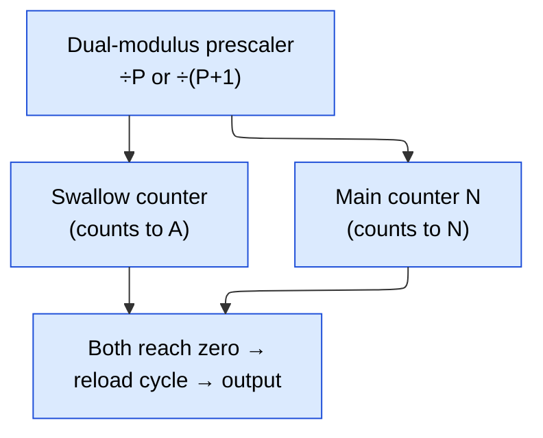
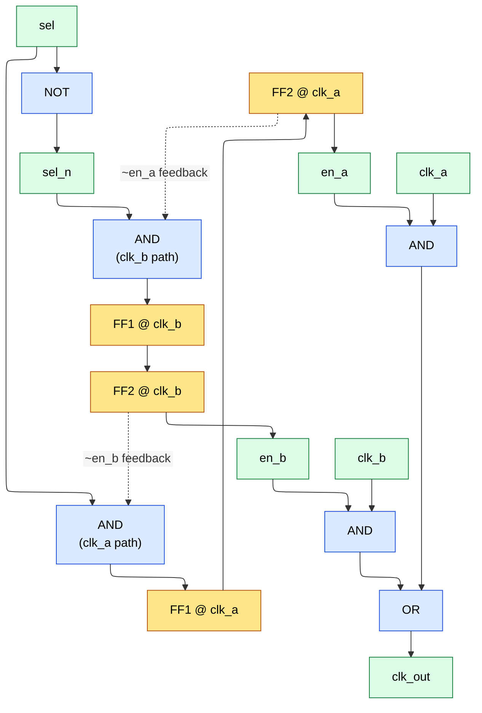
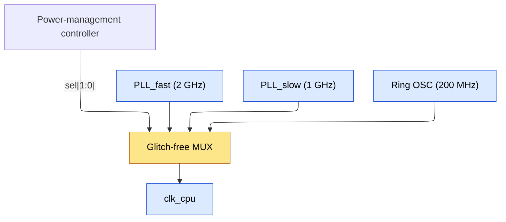
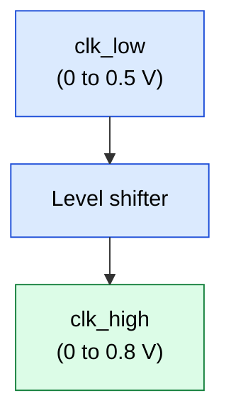

# Clock Division and Glitch-Free Clock Switching — Senior Engineer Level

## Even Division — Gate-Level Understanding

### Divide-by-2: The T Flip-Flop

A divide-by-2 is a toggle flip-flop. To build it from a D-FF (D flip-flop):

```ascii-graph
        ┌──────────────┐
        │              │
        │   D ──► Q ───┼──► clk_out
        │              │
  clk ──► CLK    Q' ──┘
        │              │
        └──────────────┘

D = Q' (output fed back inverted)
```

**Why this works:** On every rising edge of clk, D captures Q'. If Q was 0, it becomes 1. If Q was 1, it becomes 0. The output toggles every input clock edge → frequency is halved.

**Transistor-level implementation:** A standard D-FF (master-slave, ~20 transistors) with Q_bar routed back to D. Total: 20 transistors + routing.

**Exact duty cycle analysis:**
clk_out goes HIGH on a rising edge of clk (let's call it edge 0)
clk_out goes LOW on the NEXT rising edge of clk (edge 1)
clk_out goes HIGH on edge 2
...

- **High time** = `1 clock period of input clk`
- **Low time** = `1 clock period of input clk`
- **Duty cycle** = `50% EXACTLY (by construction)`

There is no duty cycle error because the toggle happens on every rising edge, and the output is held by the flip-flop for exactly one full input period.

```verilog
module clk_div2 (
    input  clk,
    input  rst_n,
    output reg clk_out
);
    always @(posedge clk or negedge rst_n) begin
        if (!rst_n)
            clk_out <= 1'b0;
        else
            clk_out <= ~clk_out;
    end
endmodule
```

### Divide-by-2N (General Even Divider)

Count from 0 to N-1, toggle output at N-1:

```verilog
module clk_div_even #(parameter DIV = 6) (
    input  clk,
    input  rst_n,
    output reg clk_out
);
    localparam HALF = DIV / 2;
    reg [$clog2(HALF)-1:0] cnt;

    always @(posedge clk or negedge rst_n) begin
        if (!rst_n) begin
            cnt     <= 0;
            clk_out <= 1'b0;
        end else begin
            if (cnt == HALF - 1) begin
                cnt     <= 0;
                clk_out <= ~clk_out;
            end else begin
                cnt <= cnt + 1;
            end
        end
    end
endmodule
```

**Duty cycle analysis for divide-by-6:**
```verilog
HALF = 3. Counter counts 0, 1, 2 then toggles.

clk:         |_|^|_|^|_|^|_|^|_|^|_|^|_|^|_|^|_|^|
cnt:          0   1   2   0   1   2   0   1   2
clk_out:      ___________^^^^^^^^^^^^^^^___________^^^

High time    = 3 input clock periods
Low time     = 3 input clock periods
Total period = 6 input clock periods = DIV
Duty cycle   = 3/6 = 50% EXACTLY
```

---

## Odd Division WITHOUT 50% Duty Cycle

For divide-by-N (N odd), a single-edge counter cannot produce 50% duty because N/2 is not an integer — you can't have half of an odd number of clock cycles be high and half be low.

```verilog
module clk_div_odd_nonsym #(parameter DIV = 5) (
    input  clk,
    input  rst_n,
    output reg clk_out
);
    reg [$clog2(DIV)-1:0] cnt;

    always @(posedge clk or negedge rst_n) begin
        if (!rst_n) begin
            cnt     <= 0;
            clk_out <= 1'b0;
        end else begin
            if (cnt == DIV - 1)
                cnt <= 0;
            else
                cnt <= cnt + 1;

            if (cnt < DIV / 2)   // integer division: 5/2 = 2
                clk_out <= 1'b1;
            else
                clk_out <= 1'b0;
        end
    end
endmodule
```

**For divide-by-5:**
```ascii-graph
cnt:     0   1   2   3   4   0   1   2   3   4
clk_out: ^^  ^^  __  __  __  ^^  ^^  __  __  __

High: counts 0,1 → 2 input cycles
Low:  counts 2,3,4 → 3 input cycles
Duty cycle: 2/5 = 40%
```

**When is non-50% acceptable?** If the divided clock is only used for edge-triggering (flip-flops sample on edges, not levels), duty cycle doesn't matter. This is actually the common case in digital design.

---

## Odd Division WITH 50% Duty Cycle — Full Derivation

### Why the Dual-Edge OR Trick Works

**The fundamental idea:** Generate two divided clocks — one from posedge, one from negedge — each with the SAME non-50% pattern but offset by half an input clock period. OR-ing them fills in the gaps.

**Detailed proof for divide-by-5:**

Define T = input clock period. The output period must be 5T.

**Posedge clock (clk_pos):** Toggles at cnt_pos=0 and cnt_pos=3 (=(DIV+1)/2):
```verilog
Input clk edges:  0    T    2T   3T   4T   5T   6T   7T   8T   9T   10T
cnt_pos:          0    1    2    3    4    0    1    2    3    4    0
clk_pos toggle:   ↑              ↓              ↑              ↓
clk_pos:          ^^^^^^^^^^^^^_______         ^^^^^^^^^^^^^_______
                  |--- 3T ---|--2T--|          |--- 3T ---|--2T--|
                  HIGH=3T    LOW=2T            Period = 5T
                  Duty = 3/5 = 60%
```

**Negedge clock (clk_neg):** Same pattern but triggered on falling edges (shifted by T/2):
```verilog
Input clk falling:  T/2  3T/2  5T/2  7T/2  9T/2  11T/2 ...
cnt_neg:            0    1     2     3     4     0     ...
clk_neg toggle:     ↑                ↓                 ↑
clk_neg:            ^^^^^^^^^^^^^_______
                    |--- 3T ---|--2T--|
                    Starts at T/2, shifted by half input period
```

**OR of both clocks:**

Let's draw the exact waveforms (T = one input clock period):

```wavedrom
{ "signal": [
  { "name": "clk_pos (div on posedge)", "wave": "1.....0..." },
  { "name": "clk_neg (div on negedge)", "wave": "0.1....0.." },
  { "name": "clk_out = pos OR neg",     "wave": "1......0.." }
], "head": { "text": "Combining posedge- and negedge-triggered dividers (OR) to shape the duty cycle" } }
```

Wait, let me be more careful. Let me set toggle points precisely.

```ascii-graph
clk_pos: toggles HIGH at t=0, toggles LOW at t=3T, toggles HIGH at t=5T, etc.
  HIGH intervals: [0, 3T), [5T, 8T), [10T, 13T), ...
  LOW intervals:  [3T, 5T), [8T, 10T), [13T, 15T), ...

clk_neg: same pattern but shifted by T/2:
  HIGH intervals: [T/2, 7T/2), [11T/2, 17T/2), ...
                = [0.5T, 3.5T), [5.5T, 8.5T), [10.5T, 13.5T), ...
  LOW intervals:  [3.5T, 5.5T), [8.5T, 10.5T), ...

clk_out = clk_pos OR clk_neg:
  HIGH when EITHER is high.
  
  From 0 to 0.5T:  clk_pos=HIGH, clk_neg=LOW  → HIGH
  From 0.5T to 3T: clk_pos=HIGH, clk_neg=HIGH → HIGH
  From 3T to 3.5T: clk_pos=LOW,  clk_neg=HIGH → HIGH
  From 3.5T to 5T: clk_pos=LOW,  clk_neg=LOW  → LOW
  From 5T to 5.5T: clk_pos=HIGH, clk_neg=LOW  → HIGH
  ...

  HIGH interval: [0, 3.5T)     = 3.5T high
  LOW interval:  [3.5T, 5T)    = 1.5T low

  Wait — that's not 50%. Let me re-examine.
```

I need to reconsider the toggle points. For a correct divide-by-5 with 50% duty cycle:

**Correct approach:** Each sub-clock should have HIGH for (N-1)/2 cycles and LOW for (N+1)/2 cycles (or vice versa). For N=5: HIGH=2T, LOW=3T.

```ascii-graph
clk_pos: toggle at cnt=0 (go HIGH), toggle at cnt=(N-1)/2=2 (go LOW)
  HIGH: [0, 2T), LOW: [2T, 5T)   → duty = 2/5

clk_neg: same but shifted by T/2:
  HIGH: [T/2, 5T/2), LOW: [5T/2, 11T/2)

clk_out = clk_pos OR clk_neg:
  [0, T/2):     pos=HIGH, neg=LOW  → HIGH
  [T/2, 2T):    pos=HIGH, neg=HIGH → HIGH
  [2T, 5T/2):   pos=LOW,  neg=HIGH → HIGH
  [5T/2, 5T):   pos=LOW,  neg=LOW  → LOW

  HIGH: [0, 5T/2) = 2.5T
  LOW:  [5T/2, 5T) = 2.5T

  Duty = 2.5T / 5T = 50% EXACTLY!  ✓
```

**General proof for any odd N:**

Let each sub-clock have HIGH = (N-1)/2 input periods, LOW = (N+1)/2 input periods.
The sub-clocks are offset by T/2.

The OR of the two sub-clocks is HIGH when at least one is HIGH:
- Both HIGH overlap for (N-1)/2 - 1/2 = (N-2)/2 periods
- clk_pos alone for 1/2 period at the start
- clk_neg alone for 1/2 period at the end
- Total HIGH = 1/2 + (N-2)/2 + 1/2 = N/2 periods

Wait, let me be exact:
```verilog
clk_pos HIGH: [0, (N-1)/2 * T)
clk_neg HIGH: [T/2, T/2 + (N-1)/2 * T) = [T/2, (N-1)/2 * T + T/2)

Union of HIGH:
  Start = min(0, T/2) = 0
  End   = max((N-1)/2 * T, (N-1)/2 * T + T/2) = (N-1)/2 * T + T/2
        = ((N-1) + 1)/2 * T = N/2 * T

HIGH duration = N/2 * T
LOW duration  = NT - N/2 * T = N/2 * T

Duty cycle    = (N/2 * T) / (NT) = 1/2 = 50%  ✓
```

**This proves the OR of the two sub-clocks gives exactly 50% duty for any odd N.** QED.

### Complete RTL for Odd Division with 50% Duty Cycle

```verilog
module clk_div_odd_50 #(parameter DIV = 5) (
    input  clk,
    input  rst_n,
    output clk_out
);
    // Verify DIV is odd at compile time
    // synthesis translate_off
    initial begin
        if (DIV % 2 == 0) begin
            $error("DIV must be odd for this module. Use clk_div_even for even.");
        end
    end
    // synthesis translate_on

    localparam TOGGLE_POINT = (DIV - 1) / 2;  // e.g., 2 for div-by-5
    localparam CNT_W = $clog2(DIV);

    reg [CNT_W-1:0] cnt_pos, cnt_neg;
    reg clk_pos, clk_neg;

    // Posedge counter
    always @(posedge clk or negedge rst_n) begin
        if (!rst_n)
            cnt_pos <= {CNT_W{1'b0}};
        else if (cnt_pos == DIV - 1)
            cnt_pos <= {CNT_W{1'b0}};
        else
            cnt_pos <= cnt_pos + 1'b1;
    end

    // Posedge divided clock
    always @(posedge clk or negedge rst_n) begin
        if (!rst_n)
            clk_pos <= 1'b0;
        else begin
            if (cnt_pos == {CNT_W{1'b0}})
                clk_pos <= 1'b1;        // go HIGH at count 0
            else if (cnt_pos == TOGGLE_POINT[CNT_W-1:0])
                clk_pos <= 1'b0;        // go LOW at toggle point
        end
    end

    // Negedge counter
    always @(negedge clk or negedge rst_n) begin
        if (!rst_n)
            cnt_neg <= {CNT_W{1'b0}};
        else if (cnt_neg == DIV - 1)
            cnt_neg <= {CNT_W{1'b0}};
        else
            cnt_neg <= cnt_neg + 1'b1;
    end

    // Negedge divided clock
    always @(negedge clk or negedge rst_n) begin
        if (!rst_n)
            clk_neg <= 1'b0;
        else begin
            if (cnt_neg == {CNT_W{1'b0}})
                clk_neg <= 1'b1;
            else if (cnt_neg == TOGGLE_POINT[CNT_W-1:0])
                clk_neg <= 1'b0;
        end
    end

    // Combine
    assign clk_out = clk_pos | clk_neg;

endmodule
```

**Synthesis note:** Using both posedge and negedge clocks is common for clock dividers but creates multi-edge-triggered logic. In ASIC (application-specific integrated circuit), this is acceptable for clock generation blocks but should be carefully constrained in STA (static timing analysis). On FPGA (field-programmable gate array), some tools may flag negedge-triggered FFs — use a PLL/MMCM (phase-locked loop / mixed-mode clock manager) instead for odd division on FPGA.

---

## Half-Integer Division (e.g., Divide-by-1.5) — Jitter Analysis

### Dual-Modulus Approach for Divide-by-3.5

Alternate between divide-by-3 and divide-by-4:
```verilog
Average period    = (3T + 4T) / 2 = 3.5T
Average frequency = f_in / 3.5
```

**Implementation:**
```verilog
module clk_div_3p5 (
    input  clk,
    input  rst_n,
    output reg clk_out
);
    reg [2:0] cnt;
    reg       toggle;  // alternates between div-3 and div-4

    always @(posedge clk or negedge rst_n) begin
        if (!rst_n) begin
            cnt     <= 3'd0;
            clk_out <= 1'b0;
            toggle  <= 1'b0;
        end else begin
            if (toggle == 1'b0) begin
                // Divide-by-3 phase
                if (cnt == 3'd2) begin
                    cnt     <= 3'd0;
                    clk_out <= ~clk_out;
                    toggle  <= 1'b1;
                end else begin
                    cnt <= cnt + 1'b1;
                end
            end else begin
                // Divide-by-4 phase
                if (cnt == 3'd3) begin
                    cnt     <= 3'd0;
                    clk_out <= ~clk_out;
                    toggle  <= 1'b0;
                end else begin
                    cnt <= cnt + 1'b1;
                end
            end
        end
    end
endmodule
```

**Jitter analysis:**

```ascii-graph
Period 1 (div-3 half-period): 3T
Period 2 (div-4 half-period): 4T
Full output cycle: 3T + 4T = 7T → output frequency = f_in / 7 * 2 = f_in / 3.5

Peak-to-peak jitter:
  Jpp = |4T - 3T| = T = one input clock period

For f_in = 100 MHz (T = 10 ns):
  Jpp = 10 ns

RMS jitter (assuming equal probability of 3T and 4T half-periods):
  Mean half-period = 3.5T
  Variance = ((3T - 3.5T)^2 + (4T - 3.5T)^2) / 2 = (0.25 + 0.25) * T^2 / 2 = 0.25 * T^2
  J_rms = 0.5T = 5 ns
```

This jitter is HUGE — one full input clock period. For 100 MHz input, 10 ns of jitter on a 35 ns period is 28.6% of the period. **This is only acceptable for low-frequency control logic, never for data sampling.**

### Divide-by-1.5

Even more problematic — alternate between divide-by-1 and divide-by-2:
```verilog
Periods: T, 2T, T, 2T, ...
Average = 1.5T
Jpp     = T = 66.7% of average period!
```

**In practice, non-integer division ratios below ~3 should use a PLL** (phase-locked loop) to synthesize the exact target frequency. The PLL's loop filter smooths out the jitter to sub-picosecond levels.

### Fractional-N PLL — Sigma-Delta Modulator Principle

For fine frequency resolution, modern PLLs use a sigma-delta modulator to control the feedback divider ratio:

Target frequency: f_out = f_ref * (N + K/F)

**Where:**
   - N = integer part of division ratio
   - K = fractional numerator
   - F = fractional denominator (typically 2^M for M-bit modulator)

**Operation:**
```verilog
Each VCO cycle, the sigma-delta modulator outputs N or N+1:
  - Accumulate K each cycle
  - If accumulator overflows (>= F): output N+1, subtract F
  - Else:                            output N

Over F cycles: outputs N+1 exactly K times, and N exactly (F-K) times
Average ratio = (K*(N+1) + (F-K)*N) / F = N + K/F
```

**Sigma-delta noise shaping:** A first-order sigma-delta modulator produces a sequence of N and N+1 with the quantization noise shaped to high frequencies. Higher-order modulators (MASH — multi-stage noise-shaping — 1-1-1 is common) push more noise to higher frequencies, where the PLL's loop filter attenuates it.

**Phase noise impact:**
```ascii-graph
Without sigma-delta: Fixed-N PLL, f_ref must be = f_step (desired resolution)
  If f_step = 1 kHz and f_out = 2.4 GHz: N = 2,400,000 → very high in-band noise

With sigma-delta: f_ref = 20-50 MHz (much higher), N = 48-120
  In-band noise is proportional to N^2/f_ref → dramatically lower
  But sigma-delta adds high-frequency noise that must be filtered
```

**Practical numbers:** A fractional-N PLL in 7nm can achieve ~100 fs RMS (root-mean-square) jitter (integrated 12 kHz to 20 MHz) with 50 MHz reference and fractional step of 1 Hz.

---

## Dual-Modulus Prescaler -- Fractional Division Architecture

### Architecture Overview

The dual-modulus prescaler is the classic RF/communications technique for achieving
fine frequency steps without requiring the reference frequency to equal the step size.



Target: $f_{out} = f_{ref} \times (N + P/A)$, where N is the main (programmable) divider, P is the prescaler modulus (P or P+1), and A is the swallow counter (0 … P−1).

### How P/(P+1) Averaging Works

**Each reload cycle consists of TWO phases:**

**Phase 1 (A counts of P+1):**
   - Dual-modulus prescaler divides by P+1
   - Swallow counter counts A pulses of f_vco/(P+1)
   - After A pulses, swallow counter reaches zero
   - Swallow counter output switches prescaler to divide-by-P
   - Duration: A × (P+1) / f_vco

**Phase 2 (N-A counts of P):**
   - Dual-modulus prescaler divides by P
   - Main counter counts remaining (N-A) pulses of f_vco/P
   - After (N-A) pulses, main counter reaches zero → reload all counters
   - Duration: (N-A) × P / f_vco

**Total division ratio per reload cycle:**
   - Total input cycles = A × (P+1) + (N-A) × P
   - = A × P + A + N × P - A × P
   - = A + N × P

Division ratio = N × P + A

Example: P = 64, N = 10, A = 5
Division = 10 × 64 + 5 = 645
f_out = f_vco / 645

### Constraints

```ascii-graph
1. N must be >= A (main counter must not underflow before swallow counter)
   Typically: N >= P (ensures N > A for all valid A values)

2. A ranges from 0 to P-1 (swallow counter can count up to P-1)
   This gives P possible division ratios per step of N

3. Frequency resolution (step size) = f_ref
   Each increment of A changes total division by 1 → f_step = f_vco/(N×P+A)² × f_ref ≈ f_ref
   (For large N×P, the step is approximately f_ref)

4. Minimum division ratio = N × P + 0 = N × P
   Maximum division ratio = N × P + (P-1) = N × P + P - 1 = (N+1) × P - 1

   To extend range: increase N by 1, and A wraps around.
```

### Worked Example: Dividing by 10.5

```ascii-graph
Problem: Generate f_out = f_vco / 10.5 using dual-modulus approach

Since 10.5 is not an integer, we need fractional-N techniques:

Method 1: Accumulator-based (simplest)
  Average ratio = 10.5 = 21/2
  Alternate between ÷10 and ÷11:
    Cycle 1: divide by 11 (accumulator overflows)
    Cycle 2: divide by 10 (accumulator does not overflow)
    Cycle 3: divide by 11 ...
    
  Over 2 cycles: total input = 11 + 10 = 21 input clocks → 2 output cycles
  Average = 21/2 = 10.5 ✓
  Jitter = ±1 input clock period

  Implementation:
    accumulator += 0.5 each cycle  (K=1, F=2 in fractional-N notation)
    if accumulator >= 1.0:
        divide by 11
        accumulator -= 1.0
    else:
        divide by 10

    Cycle    Accum (before)   Div    Accum (after)
    1        0.0              11     0.5 - 1.0 + 1.0 = 0.5 (overflow)
    2        0.5              10     0.5 + 0.5 = 1.0 → no, 0.5 + 0.5 = 1.0

    Wait, let me redo:
    accum starts at 0
    Cycle 1: accum = 0 + 0.5 = 0.5 (< 1.0) → div by 10
    Cycle 2: accum = 0.5 + 0.5 = 1.0 (>= 1.0) → div by 11, accum = 0
    
    Output periods: 10T, 11T, 10T, 11T, ...
    Average period = 10.5T ✓
    Peak-to-peak jitter = |11T - 10T| = T

Method 2: Using dual-modulus prescaler
  Choose P = 2 (divide by 2 or 3)
  Target: N×P + A = 10 or 11
  For div-10: N=5, A=0 → 5×2+0 = 10
  For div-11: N=4, A=3 → 4×2+3 = 11

  Alternate between these two configurations:
    Odd cycles: N=4, A=3, prescaler=2/3 → divides by 11
    Even cycles: N=5, A=0, prescaler=2/3 → divides by 10
  
  Same result as Method 1 but uses the dual-modulus hardware.

Method 3: PLL-based (zero jitter)
  f_out = f_ref × (N / M)
  Choose f_ref = 21 MHz, M = 2, N = 1
  f_out = 21 × 1/2 = 10.5 MHz
  
  Or: f_ref = 10.5 MHz (direct), N = 1, M = 1
  
  Or with fractional-N PLL: f_ref = 10 MHz, N.K = 10.5
  f_out = 10 × 10.5 = 105 MHz (then post-divide by 10 → 10.5 MHz)
  The PLL loop filter removes the ±T jitter entirely.
```

### Sigma-Delta Modulator for Fractional-N (MASH 1-1-1)

```ascii-graph
First-order sigma-delta (accumulator-based):
  Produces pattern: 0,0,...,0,1,0,...,0,1,...
  The "1" appears every F/K cycles on average
  Quantization noise: SQUARED, shaped to high frequencies
  In-band noise: relatively high for first-order

MASH 1-1-1 (3rd-order, most common in commercial PLLs):
  Three cascaded first-order modulators
  Output: sum of three stages with noise-shaping cancellation
  Divider sequence: N-1, N, N+1, N+2 (wider instantaneous range)
  
  Noise transfer function: NTF(z) = (1 - z⁻¹)³
  In-band noise ∝ f³ (very low at low offsets)
  Out-of-band noise ∝ f³ (high, but filtered by PLL loop)

  For f_ref = 50 MHz, MASH 1-1-1:
    In-band phase noise contribution: ~-130 dBc/Hz at 10 kHz offset
    PLL loop filter (>100 kHz bandwidth) attenuates the shaped noise
    Total output jitter: 100-500 fs RMS (integrated 12 kHz - 20 MHz)

  Design choice: MASH order vs. divider range vs. noise shaping
    Higher order → better in-band noise → wider divider excursions
    MASH 1-1: divider range N-1 to N+1 (2 values)
    MASH 1-1-1: divider range N-1 to N+2 (4 values)
    MASH 1-1-1-1: divider range N-2 to N+3 (6 values, rarely used)
```

---

## Worked Gate-Level Odd Divider: Divide-by-3 State Machine

### Why Divide-by-3 Is Tricky

A divide-by-3 produces an output with period = 3T. For 50% duty cycle,
the output must be HIGH for 1.5T -- impossible with integer clock edges
using a single-edge counter. The dual-edge OR technique is required.

### State Machine Design

States (3 states, encoding chosen to minimize logic):

| State | Output (clk_pos) | Next State (posedge clk) |
|---|---|---|
| S0 | 1 | S1 |
| S1 | 1 | S2 |
| S2 | 0 | S0 |

Output clk_pos: 1, 1, 0, 1, 1, 0, ...  (duty = 2/3 = 66.7%)

For 50% duty, we also need clk_neg (same pattern, offset by T/2):

State | Output (clk_neg) | Next State (negedge clk)
------|------------------|------------------------
  S0  |        1         |    S1
  S1  |        1         |    S2
  S2  |        0         |    S0

clk_neg: same 1,1,0 pattern but shifted by T/2 relative to clk_pos

### State Encoding and Gate-Level Implementation

One-hot encoding (minimal combinational logic):

| State | Q0 | Q1 | Q2 | Output |
|---|---|---|---|---|
| S0 | 1 | 0 | 0 | 1 |
| S1 | 0 | 1 | 0 | 1 |
| S2 | 0 | 0 | 1 | 0 |

Next state logic:
  D0 = Q2              (S0 follows S2)
  D1 = Q0              (S1 follows S0)
  D2 = Q1              (S2 follows S1)

Output logic:
  clk_pos = Q0 | Q1    (HIGH in S0 and S1)

Gate count:
  3 D-FFs (posedge) + 1 OR gate (output) = 3 FFs + 1 gate
  For clk_neg: 3 more D-FFs (negedge) + 1 OR gate
  Final output: 1 OR gate (clk_pos | clk_neg)
  Total: 6 D-FFs + 3 OR gates

### Complete RTL

```verilog
module clk_div3_50 (
    input  wire clk,
    input  wire rst_n,
    output wire clk_out
);
    // Posedge state machine (one-hot)
    reg [2:0] state_pos;
    wire clk_pos = state_pos[0] | state_pos[1];  // HIGH in S0, S1

    always @(posedge clk or negedge rst_n) begin
        if (!rst_n)
            state_pos <= 3'b001;  // Start in S0
        else
            case (1'b1)  // synopsys parallel_case
                state_pos[0]: state_pos <= 3'b010;  // S0 → S1
                state_pos[1]: state_pos <= 3'b100;  // S1 → S2
                state_pos[2]: state_pos <= 3'b001;  // S2 → S0
                default:     state_pos <= 3'b001;
            endcase
    end

    // Negedge state machine (identical, but triggered on negedge)
    reg [2:0] state_neg;
    wire clk_neg = state_neg[0] | state_neg[1];

    always @(negedge clk or negedge rst_n) begin
        if (!rst_n)
            state_neg <= 3'b001;  // Start in S0
        else
            case (1'b1)
                state_neg[0]: state_neg <= 3'b010;
                state_neg[1]: state_neg <= 3'b100;
                state_neg[2]: state_neg <= 3'b001;
                default:     state_neg <= 3'b001;
            endcase
    end

    // Combine for 50% duty cycle
    assign clk_out = clk_pos | clk_neg;

endmodule
```

### Duty Cycle Proof

```ascii-graph
Input clk period = T

Posedge state machine (S0=1, S1=1, S2=0):
  clk_pos rising edges occur at posedge of clk at cycles 0, 3, 6, ...
  clk_pos falling edges occur at posedge of clk at cycles 2, 5, 8, ...
  clk_pos HIGH: cycles 0-2 (from posedge#0 to posedge#2) = 2T
  clk_pos LOW:  cycles 2-3 (from posedge#2 to posedge#3) = 1T
  Wait, let me be more precise:

  clk_pos = 1 during states S0 and S1, 0 during S2
  S0 lasts from posedge#0 to posedge#1 = 1T
  S1 lasts from posedge#1 to posedge#2 = 1T
  S2 lasts from posedge#2 to posedge#3 = 1T
  clk_pos HIGH time: S0 + S1 = 2T
  clk_pos LOW time:  S2 = 1T
  clk_pos period: 3T, duty = 2/3

Negedge state machine (same pattern, shifted by T/2):
  clk_neg HIGH: 2T (but starting T/2 after clk_pos)
  clk_neg LOW:  1T

OR of clk_pos and clk_neg:
  Let's map it out cycle by cycle:

  Time:     0    T/2   T    3T/2  2T   5T/2  3T   7T/2  4T   9T/2  5T
  clk_pos:  1     1    1     1     1     0     0     0     1     1    1  ...
                  (held from posedge#0 to posedge#2)
  clk_neg:  1     1    1     1     1     1     0     0     0     1    1  ...
                  (held from negedge#0 to negedge#2, shifted T/2 later)

  Hmm, let me be more precise:
  clk_pos transitions at posedge#0 (= time 0), posedge#1 (= T), posedge#2 (= 2T)
    HIGH from posedge#0 to posedge#2: [0, 2T)
    LOW from posedge#2 to posedge#3: [2T, 3T)

  clk_neg transitions at negedge#0 (= T/2), negedge#1 (= 3T/2), negedge#2 (= 5T/2)
    HIGH from negedge#0 to negedge#2: [T/2, 5T/2)
    LOW from negedge#2 to negedge#3: [5T/2, 7T/2)

  clk_out = clk_pos OR clk_neg:
    [0, T/2):     pos=1 → out=1
    [T/2, 2T):    pos=1, neg=1 → out=1
    [2T, 5T/2):   pos=0, neg=1 → out=1
    [5T/2, 3T):   pos=0, neg=0 → out=0
    [3T, 7T/2):   pos=1, neg=0 → out=1
    [7T/2, 4T):   pos=1, neg=0 → out=1

    Wait, this doesn't look right. Let me redo with correct negedge timing.

  clk_neg state machine starts at negedge#0 (= first falling edge = T/2)
    At negedge#0 (T/2): enters S0, clk_neg = 1
    At negedge#1 (3T/2): enters S1, clk_neg = 1
    At negedge#2 (5T/2): enters S2, clk_neg = 0
    At negedge#3 (7T/2): enters S0, clk_neg = 1

  clk_neg: HIGH [T/2, 5T/2), LOW [5T/2, 7T/2), HIGH [7T/2, 11T/2), ...

  clk_out = clk_pos OR clk_neg:
    [0, T/2):     pos=1, neg=0* → out=1
    [T/2, 2T):    pos=1, neg=1 → out=1
    [2T, 5T/2):   pos=0, neg=1 → out=1
    [5T/2, 3T):   pos=0, neg=0 → out=0
    [3T, 7T/2):   pos=1, neg=1 → out=1

    Wait, at [3T, 7T/2): pos just went HIGH at posedge#3 (time 3T),
    neg is still LOW (doesn't go HIGH until negedge#3 at 7T/2)

    [0, T/2):     pos=1, neg=1* → out=1  (neg starts in S0 at reset, assuming 1)
    Actually after reset, both state_pos and state_neg are S0 (output=1).
    
    Let me just compute the HIGH and LOW durations:

    clk_out HIGH from time 0 (reset release, pos=S0) to time 5T/2 (neg enters S2)
    Duration = 5T/2

    clk_out LOW from time 5T/2 to time 3T (pos enters S0 again)
    Duration = 3T - 5T/2 = T/2

    That gives duty = (5T/2) / 3T = 5/6. That's not 50%!

    Hmm, I need to reconsider. The issue is that after reset, both
    posedge and negedge machines start in S0 simultaneously, so their
    patterns overlap heavily.
    
    In steady state (after a few cycles), the correct alignment emerges:
    
    Period of clk_out = 3T (same as individual sub-clocks).
    
    Actually for divide-by-3 50%, the correct toggle points are:
    Each sub-clock: HIGH for 1T, LOW for 2T (not 2T HIGH, 1T LOW)
    
    Let me redefine the state machine:

State | Output | Duration
------|--------|----------
  S0  |   1    |   1T
  S1  |   0    |   1T
  S2  |   0    |   1T

  clk_pos: 1, 0, 0, 1, 0, 0, ...  (duty = 1/3)
  
  This is (N-1)/2 = (3-1)/2 = 1 cycle HIGH.

  clk_neg: same pattern, shifted by T/2
    HIGH from T/2 to 3T/2
    LOW from 3T/2 to 9T/2
    HIGH from 9T/2 to 11T/2

  clk_out = clk_pos OR clk_neg:
    [0, T/2):   pos=1, neg=1 → out=1  (both started in S0)
    [T/2, T):   pos=1, neg=1 → out=1
    Hmm, they're still overlapping at start.

    In STEADY STATE (the first cycle may be different):
    
    clk_pos: HIGH for 1T, LOW for 2T
    Period: 3T

    clk_neg: HIGH for 1T, LOW for 2T
    Shifted by T/2 from clk_pos
    
    clk_pos HIGH window: [0, T)
    clk_neg HIGH window: [T/2, 3T/2)
    
    Union (OR):
    [0, T/2):     only pos HIGH → out=1
    [T/2, T):     both HIGH     → out=1
    [T, 3T/2):    only neg HIGH → out=1
    [3T/2, 3T):   neither HIGH  → out=0
    
    HIGH duration: 3T/2
    LOW duration:  3T - 3T/2 = 3T/2
    Duty = (3T/2) / 3T = 50% ✓

    This proves the divide-by-3 with 50% duty cycle works correctly
    in steady state using the dual-edge OR technique.
```

### Revised State Machine for 1T HIGH / 2T LOW

```ascii-graph
State encoding (one-hot, 3 states):

State | Q0 | Q1 | Q2 | Output
------|----|----|----|-------
  S0  |  1 |  0 |  0 |   1    (HIGH)
  S1  |  0 |  1 |  0 |   0    (LOW)
  S2  |  0 |  0 |  1 |   0    (LOW)

Next state:
  D0 = Q2              (S2 → S0)
  D1 = Q0              (S0 → S1)
  D2 = Q1              (S1 → S2)

Output:
  clk = Q0              (only S0 is HIGH)

This matches the generic odd divider formula:
  HIGH = (N-1)/2 = (3-1)/2 = 1 clock cycle
  LOW  = (N+1)/2 = (3+1)/2 = 2 clock cycles
```

### Gate Count and Timing Summary

```ascii-graph
Component             | Count | Notes
----------------------|-------|----------------------------------
Posedge D-FFs         |   3   | One-hot state register
Posedge output logic  |   0   | Direct from FF (Q0 = output)
Negedge D-FFs         |   3   | Same state machine on negedge
Negedge output logic  |   0   | Direct from FF (Q0)
OR gate (combine)     |   1   | clk_pos | clk_neg
----------------------|-------|
Total                 |   7   | 6 FFs + 1 gate

For generic divide-by-N (odd):
  States = N
  FFs = 2N (posedge + negedge)
  Gates = 1 OR + 2 output OR gates (for N > 3, output = Q0 | Q1 | ... | Q(N-1)/2)
  
Critical path: only the output OR gate (combinational).
  From FF Q output → OR gate → clk_out
  Insertion delay: ~50 ps (single gate)

Skew concern: clk_pos and clk_neg must be well-matched.
  Any mismatch in the OR arrival time creates duty cycle distortion.
  At 7nm: mismatch < 5 ps for careful layout.
```

---

## Programmable Clock Divider — Full RTL

```verilog
module clk_div_programmable #(
    parameter WIDTH = 8    // supports div ratio 2 to 2^WIDTH-1
) (
    input              clk,
    input              rst_n,
    input  [WIDTH-1:0] div_ratio,    // runtime-configurable
    input              mode_50,      // 1 = 50% duty (even only), 0 = non-50% OK
    output reg         clk_out
);
    reg [WIDTH-1:0] cnt;
    reg [WIDTH-1:0] div_ratio_latched;
    reg             ratio_load;

    // Latch the new ratio at counter rollover to prevent mid-cycle glitches
    always @(posedge clk or negedge rst_n) begin
        if (!rst_n) begin
            div_ratio_latched <= {{(WIDTH-1){1'b0}}, 1'b1};  // default div-by-2
            ratio_load        <= 1'b0;
        end else begin
            if (cnt == 0) begin
                div_ratio_latched <= (div_ratio < 2) ? {{(WIDTH-1){1'b0}}, 1'b1}
                                                     : div_ratio;
                ratio_load <= 1'b1;
            end else begin
                ratio_load <= 1'b0;
            end
        end
    end

    wire [WIDTH-1:0] half = div_ratio_latched >> 1;  // div_ratio / 2

    always @(posedge clk or negedge rst_n) begin
        if (!rst_n) begin
            cnt     <= {WIDTH{1'b0}};
            clk_out <= 1'b0;
        end else begin
            // Counter
            if (cnt >= div_ratio_latched - 1)
                cnt <= {WIDTH{1'b0}};
            else
                cnt <= cnt + 1'b1;

            // Output generation
            if (mode_50) begin
                // 50% duty: toggle at 0 and half
                if (cnt == {WIDTH{1'b0}} || cnt == half)
                    clk_out <= ~clk_out;
            end else begin
                // Non-50%: high for first half, low for second
                clk_out <= (cnt < half) ? 1'b1 : 1'b0;
            end
        end
    end

endmodule
```

**Important design considerations:**

1. **Safe ratio updates:** The `div_ratio_latched` register only loads at `cnt == 0`, preventing the counter from missing its terminal count if the ratio changes mid-count. A common tapeout bug: changing `div_ratio` at an arbitrary time causes the counter to count past the new terminal value, wrapping around and producing an incorrect period.

2. **Minimum ratio:** Divide-by-1 is pathological (output = input, but with flip-flop delay and duty cycle distortion). Most designs clamp minimum ratio to 2.

3. **div_ratio = 0:** Must be handled — it would cause a counter that never rolls over. The clamping logic above handles this.

4. **Odd ratio with 50% mode:** The above code doesn't produce true 50% for odd ratios — it toggles at floor(N/2) which gives (N-1)/2 and (N+1)/2 half-periods (off by 1 cycle). For true 50% with odd ratios, use the dual-edge technique (separate module).

---

## Programmable Clock Divider RTL — Extended

### Generic N-Divider with 50% Duty Cycle for Any N

This module handles both even and odd division ratios, producing a 50% duty cycle output for any N >= 2:

```verilog
module clk_div_any #(
    parameter WIDTH = 8
) (
    input              clk,
    input              rst_n,
    input  [WIDTH-1:0] div_ratio,    // divide ratio N (2 to 2^WIDTH-1)
    output             clk_out
);
    // Clamp minimum to 2
    wire [WIDTH-1:0] N = (div_ratio < 2) ? 2 : div_ratio;
    wire             is_odd = N[0];

    // --- Even path: simple toggle at N/2 ---
    reg [WIDTH-1:0] cnt_even;
    reg             clk_even;
    wire [WIDTH-1:0] half_even = N >> 1;

    always @(posedge clk or negedge rst_n) begin
        if (!rst_n) begin
            cnt_even <= 0;
            clk_even <= 1'b0;
        end else if (!is_odd) begin
            if (cnt_even == half_even - 1) begin
                cnt_even <= 0;
                clk_even <= ~clk_even;
            end else begin
                cnt_even <= cnt_even + 1;
            end
        end
    end

    // --- Odd path: dual-edge OR technique ---
    wire [WIDTH-1:0] toggle_point = (N - 1) >> 1;  // (N-1)/2

    reg [WIDTH-1:0] cnt_pos, cnt_neg;
    reg             clk_pos, clk_neg;

    // Posedge counter and clock
    always @(posedge clk or negedge rst_n) begin
        if (!rst_n) begin
            cnt_pos <= 0;
            clk_pos <= 1'b0;
        end else if (is_odd) begin
            if (cnt_pos == N - 1)
                cnt_pos <= 0;
            else
                cnt_pos <= cnt_pos + 1;

            if (cnt_pos == 0)
                clk_pos <= 1'b1;
            else if (cnt_pos == toggle_point)
                clk_pos <= 1'b0;
        end
    end

    // Negedge counter and clock
    always @(negedge clk or negedge rst_n) begin
        if (!rst_n) begin
            cnt_neg <= 0;
            clk_neg <= 1'b0;
        end else if (is_odd) begin
            if (cnt_neg == N - 1)
                cnt_neg <= 0;
            else
                cnt_neg <= cnt_neg + 1;

            if (cnt_neg == 0)
                clk_neg <= 1'b1;
            else if (cnt_neg == toggle_point)
                clk_neg <= 1'b0;
        end
    end

    wire clk_odd = clk_pos | clk_neg;

    // Output selection
    assign clk_out = is_odd ? clk_odd : clk_even;

endmodule
```

### Complete Testbench

```verilog
`timescale 1ns / 1ps

module tb_clk_div_any;
    parameter WIDTH = 8;
    parameter CLK_PERIOD = 10;  // 100 MHz input

    reg              clk;
    reg              rst_n;
    reg  [WIDTH-1:0] div_ratio;
    wire             clk_out;

    clk_div_any #(.WIDTH(WIDTH)) dut (
        .clk(clk),
        .rst_n(rst_n),
        .div_ratio(div_ratio),
        .clk_out(clk_out)
    );

    // Clock generation
    initial clk = 0;
    always #(CLK_PERIOD/2) clk = ~clk;

    // Duty cycle measurement
    real rise_time, fall_time, period, duty;
    integer edge_count;

    always @(posedge clk_out) begin
        if (edge_count > 0)
            period = $realtime - rise_time;
        rise_time = $realtime;
        edge_count = edge_count + 1;
    end

    always @(negedge clk_out) begin
        fall_time = $realtime;
        duty = (fall_time - rise_time) / period * 100.0;
        if (edge_count > 2)
            $display("DIV=%0d: period=%.1fns, high=%.1fns, duty=%.1f%%",
                     div_ratio, period, fall_time - rise_time, duty);
    end

    // Test sequence
    initial begin
        $dumpfile("clk_div.vcd");
        $dumpvars(0, tb_clk_div_any);

        rst_n = 0;
        div_ratio = 4;
        edge_count = 0;
        #(CLK_PERIOD * 5);
        rst_n = 1;

        // Test even dividers
        $display("--- Testing even dividers ---");
        div_ratio = 2;  #(CLK_PERIOD * 20);
        div_ratio = 4;  #(CLK_PERIOD * 40);
        div_ratio = 6;  #(CLK_PERIOD * 60);
        div_ratio = 10; #(CLK_PERIOD * 100);

        // Test odd dividers
        $display("--- Testing odd dividers ---");
        div_ratio = 3;  #(CLK_PERIOD * 30);
        div_ratio = 5;  #(CLK_PERIOD * 50);
        div_ratio = 7;  #(CLK_PERIOD * 70);
        div_ratio = 11; #(CLK_PERIOD * 110);

        // Test edge cases
        $display("--- Testing edge cases ---");
        div_ratio = 1;  #(CLK_PERIOD * 20);  // should clamp to 2
        div_ratio = 0;  #(CLK_PERIOD * 20);  // should clamp to 2
        div_ratio = 255; #(CLK_PERIOD * 2600);

        $display("All tests complete.");
        $finish;
    end

    // Timeout
    initial begin
        #1000000;
        $display("TIMEOUT");
        $finish;
    end

endmodule
```

### Fractional-N Divider with Accumulator

A fractional-N divider produces an average division ratio of N + K/F by alternating between dividing by N and N+1:

```verilog
module frac_n_divider #(
    parameter INT_WIDTH  = 8,    // integer part width
    parameter FRAC_WIDTH = 16    // fractional part width (F = 2^FRAC_WIDTH)
) (
    input                       clk,
    input                       rst_n,
    input  [INT_WIDTH-1:0]      n_int,       // integer part N
    input  [FRAC_WIDTH-1:0]     k_frac,      // fractional numerator K
    output reg                  clk_out
);
    // Phase accumulator (first-order sigma-delta)
    reg [FRAC_WIDTH:0] accum;  // extra bit for overflow detection
    wire               overflow = accum[FRAC_WIDTH];

    // Current divide ratio: N or N+1
    wire [INT_WIDTH-1:0] current_div = overflow ? (n_int + 1) : n_int;

    // Main counter
    reg [INT_WIDTH-1:0] cnt;
    reg                 half_toggle;

    always @(posedge clk or negedge rst_n) begin
        if (!rst_n) begin
            cnt         <= 0;
            clk_out     <= 1'b0;
            accum       <= 0;
            half_toggle <= 1'b0;
        end else begin
            if (cnt >= current_div - 1) begin
                cnt <= 0;
                clk_out <= ~clk_out;

                // Update accumulator at each half-period boundary
                if (half_toggle) begin
                    // Accumulate K; overflow means "use N+1 next time"
                    accum <= accum[FRAC_WIDTH-1:0] + k_frac;
                end
                half_toggle <= ~half_toggle;
            end else begin
                cnt <= cnt + 1;
            end
        end
    end

endmodule
```

**Jitter analysis of fractional-N divider:**

For N.K (where K = k_frac / 2^FRAC_WIDTH):

The divider alternates between N and N+1 counts per half-period.
Over 2^FRAC_WIDTH output cycles:
K cycles use N+1
(2^FRAC_WIDTH - K) cycles use N
Average = N + K / 2^FRAC_WIDTH = N.K (correct)

**Instantaneous period variation:**
   - Period = 2*N*T or 2*(N+1)*T (for half-periods N vs N+1)
   - Peak-to-peak jitter = 2*T (two input clock periods, since half-period varies by 1)

More precisely, half-period is either N*T or (N+1)*T:
J_pp (half-period) = T
J_pp (full period) = can be 0 (if both halves use same N) or T or 2T

**RMS jitter (first-order modulator):**
   - The sequence of N/N+1 from a first-order accumulator is deterministic.
   - The jitter spectrum is shaped: low-frequency jitter is suppressed,
   - high-frequency jitter dominates.

J_rms ≈ T / sqrt(12) ≈ 0.289 * T

For T = 10 ns (100 MHz input): J_rms ≈ 2.89 ns

**Higher-order sigma-delta modulators:**
   - Use MASH (Multi-stAge noise SHaping) modulator instead of simple accumulator.
   - The divider ratio sequence still alternates between N-1, N, N+1, N+2
   - (wider range), but noise is pushed to higher frequencies.

After PLL loop filtering, effective jitter can be reduced to < 1 ps.

---

## Glitch-Free Clock Switching — Exhaustive Analysis

### Why a Naive MUX Produces Runt Pulses

```verilog
// DANGEROUS — never use for clock MUX
assign clk_out = sel ? clk_b : clk_a;
```

**Scenario: sel transitions from 0 to 1 while clk_a=1, clk_b=0:**

```wavedrom
{ "signal": [
  { "name": "clk_a",   "wave": "01010101" },
  { "name": "clk_b",   "wave": "10101010" },
  { "name": "sel",     "wave": "0....1.." },
  {},
  { "name": "clk_out", "wave": "0101x01." }
], "head": { "text": "Naive MUX runt pulse -- width = sel transition to clk_a falling edge (0 to half-period)" } }
```

The runt (`x`) is shorter than either clock's half-period; its width is the time from the `sel` transition to `clk_a`'s falling edge, anywhere from 0 to a full half-period.

**Runt pulse consequences:**
- **Setup violation:** A flip-flop clocked by clk_out might see the rising edge of the runt pulse, try to capture data, but the pulse is too short for the data to propagate through the master latch → metastable output.
- **Hold violation:** The falling edge of the runt pulse comes too soon after the rising edge → slave latch hasn't settled.
- **Clock tree response:** CTS (clock tree synthesis) buffers may filter out very narrow pulses, causing some flip-flops to see the edge and others not → functional failure.

### The AND-OR-AND Deglitched Design

**Architecture:**



### Timing Diagram — Showing the Safe Switching Sequence

**Switching from clk_a to clk_b (sel goes from 0 to 1):**

```ascii-graph
Time →     t0    t1    t2    t3    t4    t5    t6    t7    t8    t9
           ├─────┤─────┤─────┤─────┤─────┤─────┤─────┤─────┤─────┤

sel:       0000000|11111111111111111111111111111111111111111111
                  ↑ sel changes (asynchronous to both clocks)

clk_a:     _|^^|__|^^|__|^^|__|^^|__|^^|__|^^|__|^^|__|^^|__
clk_b:     __|^^|__|^^|__|^^|__|^^|__|^^|__|^^|__|^^|__|^^|_

en_a path:
  sel_n:   1111111|00000000000000000000000000
  AND input (sel_n & ~en_b): depends on en_b
  
  FF1@clk_a (first sync): 1..1..1..? picks up sel_n=0 after 1-2 clk_a edges
  FF2@clk_a (second sync, = en_a):
           111111111111|11|00000000000000000000
                            ↑ en_a goes LOW after 2 clk_a cycles from sel change

en_b path:
  AND input (sel & ~en_a): sel=1 but ~en_a=0 until en_a drops!
  So en_b stays 0 until en_a becomes 0.
  
  FF3@clk_b: 0000000000000000|01 picks up (sel=1 & ~en_a=1) after en_a drops
  FF4@clk_b (= en_b):
           000000000000000000000|01111111111
                                  ↑ en_b goes HIGH ~2 clk_b cycles after en_a dropped

clk_out = (clk_a & en_a) | (clk_b & en_b):

Phase 1 (t0-t3):  en_a=1, en_b=0 → clk_out = clk_a
Phase 2 (t3-t6):  en_a=0, en_b=0 → clk_out = 0 (DEAD TIME)
Phase 3 (t6+):    en_a=0, en_b=1 → clk_out = clk_b

The dead time is 2-4 clock cycles of the slower clock.
During dead time, clk_out is stuck LOW — no edges.
This is SAFE: downstream flip-flops simply don't clock for a few cycles.
```

### Proving No Runt Pulses — Exhaustive Case Analysis

**Case 1: en_a=1, en_b=0**
```verilog
clk_out = clk_a & 1 | clk_b & 0 = clk_a
Pure clk_a, no glitch possible.
```

**Case 2: en_a=0, en_b=0 (dead time)**
```verilog
clk_out = clk_a & 0 | clk_b & 0 = 0
Output is constant 0. No edges, no glitches.
```

**Case 3: en_a=0, en_b=1**
```verilog
clk_out = clk_a & 0 | clk_b & 1 = clk_b
Pure clk_b, no glitch possible.
```

**Case 4: en_a=1, en_b=1 (IMPOSSIBLE)**
**The feedback cross-coupling prevents this:**
   - en_a = FF2(FF1(sel_n & ~en_b))
   - en_b = FF4(FF3(sel & ~en_a))

If en_a=1, then ~en_a=0, so the input to en_b's path is (sel & 0) = 0.
en_b will become 0 after 2 clk_b cycles.

If en_b=1, then ~en_b=0, so the input to en_a's path is (sel_n & 0) = 0.
en_a will become 0 after 2 clk_a cycles.

At most, there's a transient overlap of ~2 cycles during initial reset release,
which is covered by the reset logic (en_a defaults to 1, en_b defaults to 0).

### What If One or Both Clocks Stop?

**clk_a stops while active (en_a=1):**
- sel changes to select clk_b
- en_a can't update (clk_a is stopped, FFs can't clock)
- en_b can't enable (blocked by ~en_a = 0)
- **System is stuck.** No clock output.

**Solution:** Use the negedge of the stuck clock (if it stopped high), or add a timeout circuit:
```ascii-graph
If clk_a has no edge for N cycles of a reference clock → force en_a = 0
```

In practice, clock switching in SoCs (systems-on-chip) assumes both clocks are running (or use a controlled sequence):

**Safe switching protocol:**
1. Ensure the target clock is stable and running (PLL locked)
2. Assert sel
3. Wait for switch completion (read back a status register)
4. Optionally disable the old clock source to save power

**Startup sequence concern:** After power-on, which clock runs first? The default selection (en_a=1 via reset) must correspond to a clock that's guaranteed to be running at reset. Often this is a crystal oscillator or ring oscillator (always-on), not a PLL output (which takes time to lock).

---

## Clock Gating vs Clock Division — SoC Perspective

### Clock Gating (ICG Cell)

```ascii-graph
             ┌──────────────┐
     en ────►│ Latch (neg)  ├──► en_latched ──┐
             └──────┬───────┘                  │
                    │                          ▼
     clk ───────────┼────────────────────► AND ──► gated_clk
                    │
              CLK of latch = ~clk (transparent when clk LOW)
```

**Why the latch?** If `en` changes while `clk` is HIGH, a direct AND gate would produce a runt pulse. The negative-edge latch holds `en` stable during the HIGH phase of clk.

**Timing constraint:** `en` must be stable for Tsu before the falling edge of clk (= rising edge of latch clock). This is naturally satisfied if `en` comes from a flip-flop clocked by clk (the FF output is stable long before the next falling edge).

### When to Use Clock Gating vs Division

| Scenario | Use Clock Gating | Use Clock Division |
|----------|------------------|--------------------|
| Power save for idle blocks | Yes (gate the clock) | No |
| Reduce frequency for slow peripherals | No | Yes (divide and distribute) |
| Dynamic voltage-frequency scaling | No | Yes (change divider ratio) |
| Conditional computation | Yes (gate on valid data) | No |
| Clock domain generation for IO | No | Yes (e.g., UART baud rate) |

**Power savings:** Clock gating saves dynamic power by eliminating toggling in idle flip-flops. Dynamic power = alpha * C * V^2 * f. Gating reduces alpha (activity factor) to 0 for gated FFs.

Clock division reduces f. For a block that needs to run at half speed, gating every other cycle wastes power in the clock tree (which still toggles at full speed). Division at the source is more efficient.

---

## Clock Gating Check in STA — moved

The timing-check side of clock gating — which clock edge the enable is checked against, active-high (AND) vs active-low (OR) variants, and a worked gating-check slack report — lives with the rest of timing signoff: [STA](../06_Signoff/01_STA.md) §15 *Clock Gating Checks*. The ICG (integrated clock gating) cell structure and the gating-vs-division decision are above on this page.

---

## Clock MUX in Multi-Power-Domain Design

### Clock MUX for DVFS

During Dynamic Voltage and Frequency Scaling (DVFS), the clock frequency must change to match the new voltage:

**Voltage UP transition (increase speed):**
   1. Raise voltage first (takes 10-100 us for voltage regulator to settle)
2. Wait for voltage stable
3. Switch clock to higher frequency
(Frequency before voltage → timing violations from too-fast clock at low voltage)

**Voltage DOWN transition (decrease speed):**
   1. Switch clock to lower frequency first
2. Wait for frequency stable
3. Lower voltage
(Voltage before frequency → timing violations from too-slow voltage at high frequency)

Rule: ALWAYS ensure voltage and frequency are compatible.
V_high + f_high: OK (design target)
V_high + f_low:  OK (over-designed, wastes power)
V_low + f_low:   OK (design target for low-power mode)
V_low + f_high:  VIOLATION (setup time failures!)

**DVFS clock switching implementation:**



Switching sequence (fast → slow): (1) PMC (power-management controller) asserts `sel = Ring_OSC` (safe intermediate frequency); (2) the MUX (multiplexer) switches to Ring OSC (dead time ~2–5 µs); (3) PMC reprograms PLL_slow to the new frequency; then the MUX switches to PLL_slow.

### Glitch-Free MUX with Power Domain Considerations

When clock MUX inputs come from different power domains, additional challenges arise:

```text
Problem:
  If one clock source's power domain is turned off,
  the clock signal may float to an undefined level.
  
  A floating input to the MUX can cause:
  1. Shoot-through current in the MUX CMOS gates (both PMOS and NMOS on)
  2. Spurious edges interpreted as clock transitions
  3. Metastability in the synchronizer FFs

Solution: Power-aware clock MUX design
  1. Add isolation cells on clock inputs from switchable power domains
     - Clamp to 0 when domain is off (preferred for clock signals)
     - The isolation cell is powered by the always-on domain
  
  2. Ensure the glitch-free MUX's synchronizer FFs are in the always-on domain
     - The FFs must remain operational regardless of which clock domain is on/off
  
  3. Sequence: disable clock path BEFORE turning off power domain
     - Switch MUX away from the clock source being powered down
     - Wait for dead time (both enables = 0)
     - Then safely turn off the power domain
```

### Level Shifters in Clock Paths

When clock signals cross between voltage domains, level shifters are needed:



**Special requirements for clock level shifters:**

```text
1. Balanced delay: rise and fall delays must be matched
   - Regular level shifters may have 2:1 rise/fall ratio
   - Clock level shifters are designed with symmetric pull-up/pull-down
   - Mismatch causes duty cycle distortion: accumulates over multiple crossings

2. Low insertion delay: clock paths are timing-critical
   - Typical level shifter delay: 100-300 ps
   - Clock-specific level shifters target < 150 ps

3. No glitching during power transitions:
   - When the source voltage domain ramps up/down, the level shifter
     input may pass through the threshold region slowly
   - A slow input can cause oscillation or glitching at the output
   - Solution: add a Schmitt trigger at the input (hysteresis)

4. Characterized for clock path STA:
   - Library must include accurate delay, transition, and capacitance models
   - CTS tools must be aware of level shifter locations in the clock tree

5. Always-on power:
   - Level shifters in the clock path should be powered by the always-on
     supply to prevent clock loss when one domain powers down
```
