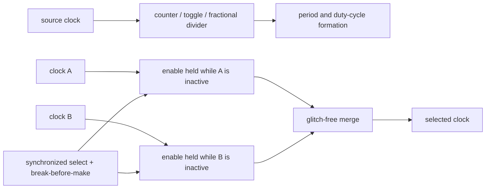

# Clock Division and Glitch-Free Clock Switching



```wavedrom
{ "signal": [
  { "name": "clk_in",  "wave": "p........." },
  { "name": "div2",    "wave": "0.1.0.1.0." },
  { "name": "select_B", "wave": "0....1...." },
  { "name": "clk_out", "wave": "p....0.p..." }
], "head": { "text": "Divider and glitch-free switch: selection changes only through an inactive interval" } }
```

> **Prerequisites:** [Logic_Building_Blocks](../00_Fundamentals/02_Logic_Building_Blocks.md) (the flip-flop and its setup/hold/clk-to-Q §4.2, metastability §4.4, and *why a combinational clock mux glitches* §2.3), [CMOS_Fundamentals](../00_Fundamentals/01_CMOS_Fundamentals.md) (the buffer as a real, band-limited gate).
> **Hands off to:** [PLL_DLL_and_Clock_Distribution](05_PLL_DLL_and_Clock_Distribution.md) (how clean clocks are *generated* and *distributed* — the PLL alternative to dividers), [Async_Design_and_CDC](06_Async_Design_and_CDC.md) (metastability and the two-FF synchronizer this page reuses), [STA](../06_Signoff/01_STA.md) (`create_generated_clock`, min-pulse-width and clock-gating checks that sign off everything here).

---

## 0. Why this page exists

Every flip-flop in a domain obeys exactly one net: its clock. A *data* net can carry a hazard — a momentary wrong value — and the machine survives, because the receiving flop only inspects that net inside a narrow setup/hold window and the hazard has settled by then. The *clock* net has no such immunity. **A clock net is not sampled; it is obeyed.** Every transition on it is taken as a command to capture. So a spurious edge, a runt pulse, or a pulse too narrow to meet a flip-flop's minimum width does not average out — it double-clocks, half-clocks, or drives the domain metastable, and it does so to *every* flop at once.

That single asymmetry is the organizing idea of this whole page. We *generate* clocks (division) and we *switch* between them (muxing); in both cases the only requirement that is actually hard — the thing every structure here exists to guarantee — is **never emit a malformed edge.** Producing the right *average* frequency is trivial; a combinational gate can do it. Producing *only clean, full-width edges while the frequency or the source changes* is the whole problem, and it is what forces dividers to be flop chains, muxes to carry synchronizers and a dead time, and gaters to hide a latch. Derive each structure from that one constraint and the topic stops being a catalogue of circuits.

§1 makes the enemy precise. §2–§5 generate clocks (integer, odd, fractional) without malforming an edge and account for them to the timing tool. §6–§7 switch between clocks under the same rule. §8 gates a clock off and on under the same rule.

---

## 1. The malformed edge: why the clock net is unforgiving

Name the failure precisely first, because all of it is one failure wearing four masks.

**A flip-flop needs a *shape*, not merely an edge.** The master–slave flop (Logic_Building_Blocks §4) captures on the active edge, but it needs the clock to *stay* in each phase long enough for the internal latches to fully transfer and regenerate. Vendors characterise this as a **minimum pulse width** — a floor on *both* the high time and the low time — checked in signoff as `min_pulse_width_high/low`. A pulse narrower than that violates the flop exactly as a setup or hold violation does: the captured node never reaches a rail and the output goes **metastable** (Logic_Building_Blocks §4.4), resolving to a random value an unbounded time later. Min-pulse-width is therefore not a nuisance DRC — it *is* the metastability threshold for the clock itself.

The four masks of the same failure:

| Malformation | What produces it | Why the domain breaks |
|---|---|---|
| **Glitch / spurious edge** | combinational logic in the clock path settling through an intermediate value (a hazard, Logic_Building_Blocks §8) | an extra rising edge is an extra, unplanned clock — the domain advances state once too often |
| **Runt pulse** | two asynchronous clocks briefly OR-ed or muxed together (§6) | width 0…½-period, below min-pulse-width → metastability |
| **Narrow high/low** | odd or fractional division done carelessly (§4–§5) | one phase shorter than min-pulse-width even though the *average* period is correct |
| **Double-clock** | any of the above landing near a real edge | two captures where the RTL assumed one — data races two stages ahead in one "cycle" |

Two properties make this uniquely dangerous — and both are *why the rest of the page is careful rather than clever*:

1. **Fan-out amplifies it.** The clock is the highest-fanout net in the design; a malformed edge reaches thousands of flops at once, so one bad edge is a whole-domain event, never a local one.
2. **The clock tree can *disagree* about it.** A runt narrow enough to sit near a buffer's switching threshold may be *filtered* by some clock-tree buffers and *passed* by others (a buffer is a finite-bandwidth, finite-gain element). Then half the domain sees the edge and half does not — a state no RTL simulation can reach. This split-brain outcome is worse than a uniform double-clock, and it is the deepest reason "just AND the enable into the clock" (§6, §8) is forbidden.

Everything below is one argument: how to move the frequency or the source **without ever letting one of these four appear on the output net.**

---

## 2. Integer division: borrowing the source's clean edges

Impose the §1 constraint and the divider designs itself. We need an output at $f_{in}/N$ whose *every* edge is clean. There are only two ways to make an edge:

- **Manufacture it** with combinational logic (gates, delay lines). Every manufactured edge is a candidate glitch and its timing drifts with PVT. Forbidden by §1.
- **Inherit it.** A flip-flop's output can change only *just after* a clean edge of its own clock, changes exactly once, and moves monotonically (clk-to-Q). So if the divided clock comes straight off a flip-flop clocked by the source, **every output edge is a source edge passed through one clk-to-Q** — clean and glitch-free by construction.

That is the entire reason clock dividers are **flip-flop chains, not gates**: a divider does not *compute* a waveform, it *sub-samples the source's own edges*.

**Divide-by-2 is the atom.** One flop with $D=\overline{Q}$ toggles on each source rising edge:

$$
Q[n] = \overline{Q[n-1]} \;\;\Rightarrow\;\; f_{out}=\frac{f_{in}}{2}, \quad \text{duty}=50\%\ \text{exactly.}
$$

The 50% duty is exact *and PVT-independent*: the output holds each level for one full input period because it can only change on a rising edge, and rising edges are one period apart. The source's own period *is* the reference — nothing to trim or match. This is precisely the property a delay-line or combinational divider can never achieve, and it is why the toggle flop is the canonical divider primitive.

**Divide-by-2N** is the same idea behind a modulo-$N$ counter: count source edges $0\ldots N{-}1$ and toggle the output flop at the wrap. The output still changes only on source edges (still glitch-free), and because it is high for $N$ input periods and low for $N$, the duty is again **50% exactly** for *any* even ratio. The counter is just a programmable "every $N$-th edge" gate in front of the same toggle atom.

The load-bearing points, not the RTL:

- The output flop's clk-to-Q launders every edge. Keep the output coming *directly off a flop* — never off a combinational decode of the counter bits, because that decode glitches as several bits change together, and the glitch lands straight on the clock net.
- Even division gets 50% duty for free because "high $N$, low $N$" is symmetric. Odd division cannot (§4); that broken symmetry is the whole difficulty of odd and fractional division.

*Essential state: a $\lceil\log_2 N\rceil$-bit counter plus one output flop. Everything else in a production divider macro is reset, enable, and the ratio register.*

---

## 3. A divided clock is a *generated* clock — what that means to the tools

Here is the point the signal-level view misses entirely. The moment a flop's *output* becomes the clock of downstream flops, you have created a **new clock** that the timing tool does not know about. The source was *defined* (a `create_clock` whose period STA propagates); the divided clock is *derived*, and STA must be **told** it exists with `create_generated_clock`, naming its master and division factor (see [STA](../06_Signoff/01_STA.md) §10.2 for the SDC). Three consequences follow — all conceptual, not syntactic:

1. **Period and edges are inherited.** A generated clock takes its period from the master ($N\times$) and its launch/capture edges from the master's edges. Omit the declaration and the tool either treats the divider output as a static data net — timing *nothing* downstream, a silent hole in coverage — or propagates the *source* period onto it and over-constrains everything by $N\times$.
2. **The divider straddles two clocks.** The flop that *generates* the clock is timed on the source; the flops that *consume* it are timed on the generated clock. STA has to relate the two, or the very first transfer out of the divider is mistimed. This is exactly why a generated clock is defined *at the divider's Q pin*, the boundary between the two.
3. **It gets its own tree.** A generated clock rides its own branch of the clock tree with its own insertion delay and skew; CTS must balance it separately, rooted at the divider flop.

The concept to carry away: **generating a clock in RTL is cheap; accounting for it in timing is not.** A divider is one flop and a counter; the generated-clock constraint, the extra tree branch, and the master-to-generated timing arcs are the real cost — and they are why teams prefer to generate a handful of clocks centrally (near the PLL) rather than scatter dividers through the logic. Where clocks actually come from and how they are distributed is [PLL_DLL_and_Clock_Distribution](05_PLL_DLL_and_Clock_Distribution.md); here we only note that *every divider silently signs the design up for another timed clock.*

---

## 4. Odd division and the duty-cycle tax

Odd $N$ breaks the symmetry that made even division's 50% duty free. Count $N$ source edges and toggle on one of them, and the output is high for $\frac{N-1}{2}$ periods and low for $\frac{N+1}{2}$ (or the reverse) — because an odd number of whole input periods cannot split into two equal integer halves:

$$
\text{single-edge duty} = \frac{\lfloor N/2\rfloor}{N}, \qquad N=5 \Rightarrow \tfrac{2}{5}=40\%.
$$

**The first question a senior engineer asks is whether the duty even matters — and usually it does not.** A flip-flop captures on *one* edge; if the divided clock only ever clocks edge-triggered logic, a 40/60 split is completely fine *as long as both phases clear min-pulse-width* (§1). Non-50% duty is the common, correct case for divided clocks. Duty becomes a hard requirement only when the clock drives something level- or dual-edge-sensitive: DDR I/O, a transparent latch, a half-cycle path, or a *downstream* divider that will toggle on the falling edge. Spending hardware for 50% duty when nothing consumes it is the classic over-design.

**When you genuinely need 50% from an odd ratio**, the mechanism is worth understanding mostly because it exposes its own cost. Build the same $\frac{N-1}{2}$-high divider *twice* — once on the source's rising edge, once on its falling edge — and OR them. The negedge copy is identical but shifted by half an input period ($T/2$), and that shift is exactly the "half cycle" odd division could not represent with rising edges alone. The union fills it in:

$$
\underbrace{\Big[0,\tfrac{N-1}{2}T\Big)}_{\text{posedge high}} \;\cup\; \underbrace{\Big[\tfrac{T}{2},\,\tfrac{N-1}{2}T+\tfrac{T}{2}\Big)}_{\text{negedge high}} \;=\; \Big[0,\tfrac{N}{2}T\Big) \;\Rightarrow\; \text{high}=\tfrac{N}{2}T,\ \ \text{duty}=\tfrac12 .
$$

The high time becomes exactly $N/2$ input periods, so the duty is 50% for any odd $N$. That single identity *is* the trick — not a page of hand-traced waveforms.

But read the cost, because it is why the trick is used sparingly:

| Cost of the dual-edge 50% divider | Why it hurts |
|---|---|
| **Doubles the sequential logic** (a second counter + output flop on the negedge) | area and power spent for a cosmetic property |
| **Clocks flops on the falling edge** | negedge logic is a second timing personality — STA must constrain both, and the two paths' insertion delays must match |
| **Merges two clocks in a combinational OR** | if the pos- and neg-edge sub-clocks ever transition together (skew between them), the OR emits a sliver — the §1 runt sneaking back in *through the fix*; the halves must be skew-matched to a few ps |
| **Duty rides on rise/fall matching** | any pull-up/pull-down asymmetry in the OR and following buffers pulls the duty off 50% |

So the honest answer to "how do I get an odd divide with 50% duty" is often **don't**: either tolerate the non-50% duty (usually fine), or generate the clean 50% clock in the **PLL/MMCM**, where a real phase relationship is available ([PLL_DLL_and_Clock_Distribution](05_PLL_DLL_and_Clock_Distribution.md)), rather than bolting a negedge divider and an OR gate onto the clock net. Many FPGA flows discourage the negedge divider for exactly this reason.

---

## 5. Fractional division: trading exactness for jitter

Non-integer ratios force a deeper compromise. You cannot count a fractional number of edges, so a fractional divider *cannot* produce a uniform period at all — it can only hit the target period *on average* by **alternating between two integer divisions.** Divide-by-3.5 alternates ÷3 and ÷4; divide-by-10.5 alternates ÷10 and ÷11. An accumulator (a first-order sigma-delta) chooses each cycle: add the fraction every output period, divide by $N{+}1$ on the cycles it overflows and by $N$ otherwise. Over $F$ cycles it selects $N{+}1$ exactly $K$ times, giving mean ratio $N+K/F$.

The average is exact. **The instantaneous period is never right**, and that — not any implementation flaw — is the fundamental cost:

$$
J_{pp} = \big|(N{+}1)T - N T\big| = T,
$$

one whole input period of deterministic **peak-to-peak jitter**, because the output edge is physically one input period early or late every time the divisor flips. For a first-order accumulator the cycle-to-cycle error is roughly uniform across that $T$, so

$$
J_{rms} \approx \frac{T}{\sqrt{12}} \approx 0.29\,T .
$$

At 100 MHz ($T=10$ ns) that is ~2.9 ns RMS — enormous. It is worse at low ratios: divide-by-1.5 (alternating ÷1/÷2) puts $J_{pp}=T$ on a $1.5T$ period — **67% of a period of jitter.** A clock like this may drive only slow, edge-triggered control logic that re-synchronises downstream; it must never sample data or fan out as a system clock.

This is the **divider-vs-PLL knee**, the real decision the numbers force:

| | Integer / fractional divider | PLL-generated clock |
|---|---|---|
| Hardware | a counter + a flop (tiny, all-digital) | VCO, loop filter, charge pump (analog hard-IP macro) |
| Ratios | integer clean; fractional only *on average* | any ratio, incl. fine fractional via a ΣΔ feedback divider |
| **Jitter** | **±1 input period ($\approx 0.29T$ RMS), deterministic** | **sub-picosecond — the loop filter integrates the ΣΔ jitter out** |
| Time to a new frequency | immediate (next edge) | µs-scale relock |
| Best for | integer sub-clocks, coarse ratios, non-critical timing | data-path clocks, exact / fine frequencies, jitter-sensitive loads |

The rule the numbers dictate: **use a divider for integer sub-clocks of an already-clean source; reach for a PLL the moment you need a non-integer ratio at data-path quality.** The fractional accumulator is not useless — it is *exactly* the ΣΔ feedback divider inside a fractional-N PLL — but standing alone in the clock net its jitter goes straight to the flops, whereas inside the PLL loop the filter shapes and integrates it away. The full ΣΔ / MASH noise-shaping treatment and the dual-modulus prescaler that implements the feedback divider belong to the generation page: [PLL_DLL_and_Clock_Distribution](05_PLL_DLL_and_Clock_Distribution.md).

---

## 6. Glitch-free clock muxing: changing source without a runt

Selecting between two clocks looks like a one-line mux. It is the single most dangerous line in clock design.

### 6.1 Why the combinational mux is forbidden — derive the runt

`clk_out = sel ? clk_b : clk_a` glitches because **`sel` is asynchronous to both clocks** — it comes from control logic in some *third* domain and can change at any instant. Suppose the mux is passing `clk_a` (currently high) and `sel` flips to select `clk_b` (currently low) partway through `clk_a`'s high phase. The output is yanked low the instant `sel` changes, cutting `clk_a`'s high phase short and manufacturing a pulse whose width is "time from `sel` change until now" — **anywhere from 0 to a full half-period:**

```text
clk_a    ‾‾|__|‾‾|__|‾‾|__
sel      __________|‾‾‾‾‾‾‾   ← async, flips mid-high-phase
clk_out  ‾‾|__|‾|________     ← RUNT: high phase chopped to 0…½ period
```

That runt (§1) is delivered to the whole domain, and on the next edge of `clk_b` it may stitch onto a partial `clk_b` pulse and double-clock. The mux did nothing *logically* wrong — it faithfully selected — but "faithfully select, instantly" is precisely what a clock net cannot survive. (Logic_Building_Blocks §2.3 shows the same glitch from the mux's side.)

State the root cause as a principle, because it generates the entire fix: **you may change what drives the clock net only at a moment when the change cannot alter a pulse in flight** — i.e. while the outgoing clock is in its *inactive* (low) phase and the incoming clock is also low, so the output net is quiescent. A combinational mux has no way to wait for that moment. The glitch-free structure exists only to *make it wait.*

### 6.2 The glitch-free mux: re-time each enable on its own clock, cross-gate, switch only when both are low

Three ideas, each forced directly by §6.1:

1. **Gate, don't select.** Replace the mux with two ANDs and an OR: `clk_out = (clk_a & en_a) | (clk_b & en_b)`. Switching now means turning one enable off and the other on — and if an enable only ever *changes while its own clock is low*, that AND's output cannot chop a high phase (it is already low), so no runt originates there.
2. **Re-time each enable onto its own clock.** To guarantee "`en_a` changes only while `clk_a` is low," pass the raw select through a **two-flop synchronizer clocked by `clk_a`** (and the other through one clocked by `clk_b`). This does double duty: it aligns each enable's change to that clock's edges *and* resolves the metastability of sampling the asynchronous `sel` — the same two-FF synchronizer as [Async_Design_and_CDC](06_Async_Design_and_CDC.md). Pinning the enable change into the inactive phase (sampling toward the falling edge) is what keeps the AND quiet.
3. **Cross-gate so both enables can never be high at once.** Feed each clock's enable logic the *inverse of the other clock's enable*: `en_a` can arm only while `en_b` is off, and vice-versa. This is a hardware interlock — a mutual exclusion that makes the "both clocks live on the OR" state *unreachable*, so the OR never merges two running clocks.

The emergent behaviour is a **break-before-make** handoff with a deliberate **dead time**:

```text
en_a=1, en_b=0   →  clk_out = clk_a     (running on A)
en_a=0, en_b=0   →  clk_out = 0         (DEAD TIME: A released, B not yet armed)
en_a=0, en_b=1   →  clk_out = clk_b     (running on B)
```

During the dead time the output simply holds low — **no edges, which is always safe:** downstream flops just don't clock for a few cycles. The mux never emits a short pulse because it never changes an enable except while that clock is low, and never has both enables live together. That is the whole correctness argument; the exact gate count is incidental.

---

## 7. The cost of safety: latency, dead time, and the stopped-clock trap

The glitch-free mux buys safety with three real costs, and a senior engineer is expected to know all three.

**1. The switch is slow — several cycles of *each* clock.** The handoff must propagate `sel` through two flops of the outgoing clock (to drop `en_a`) and *then* two flops of the incoming clock (to raise `en_b`), in that order, because the cross-gate forces `en_b` to wait for `en_a` to fall. Latency is therefore about

$$
t_{switch} \approx 2\,T_a + 2\,T_b \ (+\ \text{dead time}),
$$

a handful of cycles of *both* clocks. Switching to a slow clock can be long in absolute time. That is acceptable — clock switching is a rare control-plane event — but it means switching is a **request-then-poll** operation, never a per-cycle or instantaneous change.

**2. Both clocks must actually be running.** This is the sharp edge. The handshake advances only on edges of the clocks it synchronises to. If the outgoing clock has **stopped**, `en_a` can never be clocked low; the cross-gate then holds `en_b` off forever; **the output freezes and the mux deadlocks.** So the mux carries a hard precondition — *switch only away from a clock that is still toggling, and only toward a clock that is already toggling.* Its corollaries:

- To power down a clock source, **switch away first, confirm the switch, then stop it** — never stop the clock you are standing on.
- At reset the default-selected clock (set by the enables' reset values) must be one **guaranteed live at reset** — a crystal or always-on ring oscillator, not a PLL output that needs microseconds to lock.
- Robust muxes add a **timeout/watchdog** that force-clears an enable if its clock shows no edge for $N$ reference cycles, so a genuinely dead source cannot wedge the mux.

**3. The dead time is a functional gap.** For a few cycles the domain receives *no* clock. Anything that must not miss cycles (a free-running counter, a real-time timestamp) has to tolerate the pause or be handled outside the switch.

These three costs shape how real SoCs sequence a frequency change such as DVFS. Because you cannot switch onto a not-yet-locked PLL and cannot sit in dead time indefinitely, the pattern is **park on a safe always-on clock, retune the PLL, then switch back:**

```text
 fast PLL ─┐
 slow PLL ─┼─►  glitch-free MUX  ─►  clk_cpu
 ring osc ─┘          ▲
                 power-mgmt controller (sel)
```

Switching fast→slow: (1) glitch-free-switch the CPU onto the ring oscillator (a safe intermediate, always running); (2) with the fast PLL now idle, reprogram and relock it to the new frequency; (3) glitch-free-switch back. The voltage/frequency ordering is fixed by which combination is *safe to occupy*: raising speed, raise **voltage first** then frequency; lowering speed, drop **frequency first** then voltage — because $V_{low}+f_{high}$ is a setup-violating corner and the transition must never pass through it. (DVFS control policy and the $V$–$f$ operating points live in [Power_Reduction_Techniques](../02_Power_and_Low_Power/04_Power_Reduction_Techniques.md).)

---

## 8. Clock gating: turning a clock off under the same discipline

Gating a clock off to save power — dynamic power $\propto \alpha C V^2 f$, and gating drives the activity factor $\alpha\to 0$ for the idle flops *and their local clock tree* — is the muxing problem reduced to one input: change what drives the clock net **only while the clock is low.**

The naive version, `gated = clk & en`, has the identical §6.1 disease. If `en` (out of some flop) changes while `clk` is **high**, the AND chops the high phase into a runt. The fix is the synchronizer idea, made cheaper because `en` already lives in this clock's domain: latch `en` in a **level-sensitive latch that is transparent while `clk` is low** (a negative-level latch), then AND the *latched* enable with the clock. Because the latch is opaque during the high phase, `en` cannot move the AND's output mid-pulse; any enable change is absorbed while the clock is low and only takes effect at the next low→high edge. This latch-plus-AND is the **integrated clock-gating (ICG) cell** — one characterised standard cell, not something to assemble from RTL.

**Why the ICG cell rather than ad-hoc gating** — the trade-off in three parts:

- The ICG is **characterised for the clock-gating check** in STA: the enable's setup/hold is verified against the clock's *inactive* edge (see [STA](../06_Signoff/01_STA.md) §15). A hand-built `clk & en` is not, so the tool cannot prove it runt-free and CTS will not treat it as a clock element.
- The ICG's latch is laid out to **balance the clock arc** through it and keep insertion delay predictable; ad-hoc gates inject uncharacterised skew into the tree.
- One cell drives a whole bank of flops, so the enable is generated once and the runt-free guarantee is *structural* rather than reproved per instance.

**Gating vs division — match the lever to the need** (they are not interchangeable):

| Need | Lever | Why |
|---|---|---|
| Idle block should burn no dynamic power | **Gate** (ICG) | stops the local clock *and its tree* toggling; a divider still toggles the tree at full rate |
| Block must run *continuously but slower* | **Divide** | a genuine lower frequency; gating every other cycle leaves the tree toggling at full speed, wasting most of the saving |
| DVFS frequency step | **Divide / switch** (§7) | changes $f$, not just activity |
| Skip work on invalid-data cycles | **Gate** | the enable is a per-cycle data-valid condition |

The clean division of labour: **gating removes cycles (activity $\alpha$); division and muxing change the rate ($f$).** Power *policy* — where enables come from, retention, isolating gated or powered-off domains — is developed in [Power_Reduction_Techniques](../02_Power_and_Low_Power/04_Power_Reduction_Techniques.md); the point here is only that the ICG cell obeys the same "switch while low" law as everything else on this page. (A related hazard: a clock-mux input from a *powered-off* domain floats and can inject exactly the spurious edges of §1, so such inputs are clamped by isolation cells fed from the always-on supply — a power-intent detail deferred to that same page.)

---

## Numbers to memorize

| Quantity | Value | Why / where |
|---|---|---|
| Divide-by-2 duty | **50% exact, PVT-independent** | one toggle flop; edges one period apart (§2) |
| Even divide-by-2N duty | **50% exact** | high $N$, low $N$ — symmetric (§2) |
| Odd divide-by-N, single-edge duty | $\lfloor N/2\rfloor / N$ (5→40%, 3→33%) | can't halve an odd period count (§4) |
| Odd divide-by-N, 50% duty | pos+neg-edge dividers OR-ed, offset $T/2$ | costs 2× flops + a negedge domain (§4) |
| Fractional divide jitter (1st-order) | $J_{pp}=T$ (one input period), $J_{rms}\approx 0.29\,T$ | period alternates $N$/$N{+}1$ (§5) |
| Divide-by-1.5 jitter | $J_{pp}=T=67\%$ of period | why low fractional ratios need a PLL (§5) |
| PLL-generated clock jitter | **sub-ps** (loop filter integrates ΣΔ) | why data clocks come from PLLs, not dividers (§5) |
| Glitch-free mux switch latency | $\sim 2T_a + 2T_b$ + dead time | two-FF synchronizer on each side (§7) |
| Glitch-free mux dead time | a few cycles of the slower clock, output held low | break-before-make (§6–§7) |
| Stopped-clock rule | never switch *off of* a stopped clock | handshake needs edges → deadlock (§7) |
| Min pulse width | vendor floor on clock high *and* low time | `min_pulse_width_high/low`; the clock's metastability threshold (§1) |
| ICG enable timing | enable stable before the **inactive** clock edge | clock-gating check (§8, STA §15) |
| DVFS $V$–$f$ ordering | up: $V$ then $f$; down: $f$ then $V$ | never occupy the $V_{low}+f_{high}$ setup-violating corner (§7) |

---

## Cross-references

- **Down the stack (what this is built from):** [Logic_Building_Blocks](../00_Fundamentals/02_Logic_Building_Blocks.md) — the flip-flop and its setup/hold/clk-to-Q (§4.2), metastability (§4.4), *why a combinational clock mux glitches* (§2.3), and the combinational hazards (§8) that §1 turns into the enemy; [CMOS_Fundamentals](../00_Fundamentals/01_CMOS_Fundamentals.md) — the buffer as a band-limited element that may filter *or* pass a runt (§1).
- **Up / adjacent (what completes or consumes this):** [PLL_DLL_and_Clock_Distribution](05_PLL_DLL_and_Clock_Distribution.md) — where clean clocks are *generated* (the PLL alternative to the dividers of §5) and *distributed*; [Async_Design_and_CDC](06_Async_Design_and_CDC.md) — metastability and the two-FF synchronizer the glitch-free mux reuses (§6); [Power_Reduction_Techniques](../02_Power_and_Low_Power/04_Power_Reduction_Techniques.md) — clock-gating *policy*, DVFS operating points, and isolation of off domains (§7–§8).
- **Signoff:** [STA](../06_Signoff/01_STA.md) — `create_generated_clock` for every divider (§3, STA §10.2), min-pulse-width checks (§1), and clock-gating checks on the ICG enable (§8, STA §15).

---

## References

1. Cummings, C.E., "Clock Domain Crossing (CDC) Design & Verification Techniques Using SystemVerilog," SNUG, 2008. The glitch-free clock multiplexer and the two-flop enable synchronizer of §6.
2. Weste, N. and Harris, D., *CMOS VLSI Design: A Circuits and Systems Perspective*, 4th ed., Addison-Wesley, 2011. Clock generation, dividers, gating, and minimum pulse width.
3. Rabaey, J.M., Chandrakasan, A., and Nikolić, B., *Digital Integrated Circuits*, 2nd ed., Prentice Hall, 2003. The master–slave flip-flop, timing, and clocking discipline behind §1.
4. Synopsys, *PrimeTime / SDC Reference* — `create_generated_clock`, `set_min_pulse_width`, and clock-gating checks used in §3, §1, and §8.
