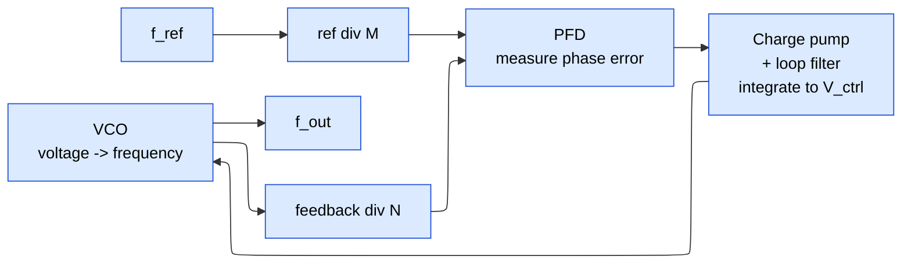
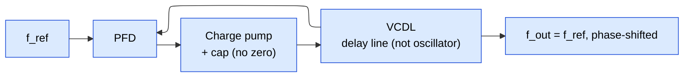

# Clock Generation and Distribution — PLL, DLL, and the Clock Network

> **Prerequisites:** [CMOS_Fundamentals](../00_Fundamentals/01_CMOS_Fundamentals.md) (inverter/delay-cell physics, the FO4 unit, dynamic power $\alpha C V_{DD}^2 f$, why a VCO's frequency tracks its supply), [Clock_Division_and_Switching](04_Clock_Division_and_Switching.md) (the $\div N$ dividers the feedback path is built from, fractional-N prescalers, glitch-free switching).
> **Hands off to:** [Async_Design_and_CDC](06_Async_Design_and_CDC.md) (many PLLs → many domains → crossing between them), [STA](../06_Signoff/01_STA.md) (how the clock network is *timed*: skew in setup/hold, OCV/CRPR, gating checks), [Physical_Design](../05_Backend_Physical_Design/01_Physical_Design.md) §4 (clock-tree synthesis, the physical build).

---

## 0. Why this page exists

A synchronous chip does exactly one thing on every clock edge: it lets a few hundred million flip-flops sample their inputs *at the same instant*. Everything the clock subsystem does serves that one sentence. But the clock the chip is *handed* is nothing like the clock it *needs*. What arrives at the package is a **crystal reference** — a few tens of MHz, spectrally clean and accurate to parts-per-million, but far too slow and present at exactly one pin. What the logic needs is a **multi-GHz** clock, phase-aligned to something (data, a bus, a neighbouring die), and present *simultaneously* at millions of endpoints spread across a die centimetres wide.

Closing that gap is two problems, and this page is organised around them:

1. **Synthesise a fast, clean clock from a slow one** (§1–§6). You cannot filter a 40 MHz crystal up to 3 GHz; you must *build* a 3 GHz oscillator and then *discipline* it against the crystal so it inherits the crystal's accuracy without inheriting its frequency. That discipline is a **feedback control loop** — the PLL — and the whole block diagram falls out of asking what a loop that multiplies frequency must contain. The DLL is the same idea with the oscillator removed, which is exactly why it can deskew but not multiply.
2. **Deliver that clock everywhere at once** (§7). A perfect 3 GHz clock is worthless if it reaches one corner of the die 40 ps before another: that 40 ps is subtracted directly from every timing path between the two. Distribution is the problem of spending power to buy **skew** down toward zero, and it is why the clock network is the single largest power consumer and the most variation-sensitive net on the chip.

Two derivations carry the page. The PLL is derived as a **linear feedback loop** whose loop bandwidth is *one knob controlling three things at once* — lock speed, reference-noise rejection, and VCO-noise suppression — so they cannot be optimised independently; the jitter budget is literally a high-pass/low-pass split set by where that bandwidth sits. The clock network is derived from **skew and on-chip variation**, which is why real designs pay mesh power to average variation away. By the end you should read a PLL as a control system and a clock tree as a variation-averaging network — not memorise the pinout of a phase detector.

---

## 1. The PLL as a feedback control loop

Start from the requirement and let the structure fall out: *make a fast on-die oscillator track a slow, clean reference so its output equals a rational multiple of the reference, with the reference's long-term accuracy.* A feedback loop that does this needs, of necessity, five things — a way to **measure** how far off it is, a way to **remember and smooth** that measurement, a way to **act** on it by changing frequency, and a way to **scale** the comparison so the answer is a *multiple*, not a copy.

| The loop must… | …so it needs | Block |
|---|---|---|
| measure the error between reference and output | a detector that outputs a signal proportional to *phase* difference | **Phase-frequency detector (PFD)** (§1.2) |
| turn that error into a persistent, smooth command | something that integrates and low-pass-filters the error | **Charge pump + loop filter** (§1.3) |
| act on the command by changing frequency | a voltage-to-frequency converter | **Voltage-controlled oscillator (VCO)** (§1.3, §4) |
| make the output a *multiple* of the reference, not a copy | scale the output down before comparing | **Feedback divider $\div N$** (§1.4) |

### 1.1 What "locked" means

The loop is a negative-feedback servo on **phase**. It drives the phase error between the divided-down reference and the divided-down output to zero and holds it there; when the phase difference is constant (zero), the two frequencies are, by definition, identical. So *phase* is the controlled variable and *frequency* equality is a free consequence — which is why the detector is a phase detector, not a frequency counter.

### 1.2 The detector: measuring phase error

The PFD compares the reference edge against the feedback edge and emits two pulses — **UP** (output lags, speed up) and **DOWN** (output leads, slow down) — whose *width difference* encodes the phase error and whose *presence-of-one-before-the-other* encodes the frequency error. That second property matters: a plain XOR phase detector cannot tell "behind" from "far behind by more than half a cycle," so it can lock to the wrong frequency; a PFD's edge-triggered, three-state behaviour (idle → up-only or down-only → reset when both seen) gives it **infinite frequency pull-in range** and unambiguous sign. That is the whole reason the frontend of a synthesiser is a PFD and not a mixer.

Two non-idealities of the detector shape the output spectrum and are worth carrying as *concepts*, not schematics:

- **Dead zone.** Near perfect lock the UP/DOWN pulses shrink toward zero width. Below the charge pump's switching time the pump simply cannot respond, so the loop goes *blind* in a band around zero error — a flat spot in the detector characteristic that shows up as excess jitter. The fix is to force a **minimum pulse width** (a delay in the reset path) so UP and DOWN always overlap briefly and their charge-pump currents cancel: the detector stays live at zero error.
- **Charge-pump mismatch → static offset → reference spurs.** The pump's up-current source (PMOS) and down-current sink (NMOS) never match exactly, so even in lock a small net charge is injected *once per reference cycle*. The loop absorbs the DC part as a fixed **static phase offset**, but the periodic disturbance at $f_{ref}$ modulates the VCO and produces **reference spurs** — discrete tones at $f_{out}\pm k\,f_{ref}$, typically −40 to −80 dBc. Matched/cascoded current sources and a *narrower* loop bandwidth suppress them (§3.4).

### 1.3 The action path, and the fact that shapes everything: the VCO is an integrator

The charge pump turns UP/DOWN into a current pumped into the loop filter's capacitor; the capacitor **integrates** that current into the control voltage $V_{ctrl}$, and its series resistor/extra cap shape the loop's dynamics (§2). The VCO then converts voltage to frequency:

$$\omega_{out}(t) = \omega_0 + K_{vco}\,V_{ctrl}(t)$$

where $\omega_0$ = free-running frequency (rad/s), $K_{vco}$ = VCO gain (rad/s/V), $V_{ctrl}$ = control voltage. But phase is the time-integral of frequency, so the VCO's *excess phase* is

$$\phi_{out}(s) = \frac{K_{vco}}{s}\,V_{ctrl}(s)$$

The $1/s$ is a **pure integrator** — a pole at the origin. This single fact drives three later results: (a) a constant $V_{ctrl}$ produces an ever-*ramping* phase, i.e. infinite DC phase gain, which is what lets the loop force the *static* phase error to exactly zero (a "type-II" loop); (b) combined with the loop-filter integrator it makes the loop at least second-order and therefore in need of a stabilising zero (§2.1); and (c) it is the mechanism by which VCO noise **accumulates** (§3.2). Hold onto "the VCO integrates" — the DLL's entire advantage is that it does not (§5).

### 1.4 Where the multiplication comes from

Put a $\div N$ divider in the feedback path and (optionally) a $\div M$ predivider on the reference. The PFD now equalises $f_{ref}/M$ against $f_{out}/N$, so at lock

$$\boxed{\,f_{out} = \frac{N}{M}\,f_{ref}\,}$$

where $N$ = feedback divide, $M$ = reference divide. The output is a *rational multiple* of the crystal: change $N$ and you retune the whole chip (this is the frequency knob DVFS turns). Fractional values of $N$ (needed for fine frequency steps and for spread-spectrum) come from dithering the divider between two integers with a delta-sigma modulator — a **fractional-N** synthesiser, whose divider construction (dual-modulus prescaler) lives in [Clock_Division_and_Switching](04_Clock_Division_and_Switching.md). The cost of multiplying by $N$ is paid in noise: §3.3 shows the reference's phase noise reaches the output amplified by $N^2$ in power.

---

## 2. Loop dynamics: the second-order loop, bandwidth, and damping

The block list is necessary but not sufficient — the *values* of the filter set whether the loop locks crisply, rings, or oscillates. Linearise around lock and the PLL is a classic control system; its behaviour is captured by two numbers, natural frequency and damping.

### 2.1 Why two integrators demand a zero

The forward path has two poles at the origin: the loop-filter capacitor ($1/sC_1$) and the VCO ($K_{vco}/s$). Two integrators contribute a fixed $-180^\circ$ of phase, and a loop with $-180^\circ$ at its unity-gain frequency is **marginally stable** — it rings or oscillates. The cure is the loop filter's series **resistor $R_1$**, which adds a **zero** at $\omega_z = 1/(R_1 C_1)$ contributing up to $+90^\circ$ of phase lead near crossover, restoring positive phase margin. This is *why* the charge-pump loop filter is $R_1$ in series with $C_1$ (plus a small shunt $C_2$ to swallow the ripple the resistor would otherwise inject onto $V_{ctrl}$): the capacitor makes the loop type-II (zero static phase error), the resistor makes it stable. Everything else is third-order polish.

### 2.2 Natural frequency, damping, bandwidth

Ignoring $C_2$, the open-loop gain is

$$G_0(s) = \underbrace{\frac{I_{cp}}{2\pi}}_{\text{PFD+CP}}\cdot\underbrace{\frac{1+sR_1C_1}{sC_1}}_{\text{filter}}\cdot\underbrace{\frac{K_{vco}}{s}}_{\text{VCO}}\cdot\underbrace{\frac{1}{N}}_{\text{divider}}$$

Matching the closed loop to the canonical $\omega_n^2/(s^2+2\zeta\omega_n s+\omega_n^2)$ form gives

$$\omega_n=\sqrt{\frac{I_{cp}\,K_{vco}}{2\pi N C_1}},\qquad \zeta=\frac{R_1 C_1\,\omega_n}{2}$$

where $I_{cp}$ = charge-pump current, $K_{vco}$ = VCO gain (rad/s/V), $N$ = feedback divide, $R_1,C_1$ = loop-filter zero, $\omega_n$ = natural frequency, $\zeta$ = damping factor. Design targets $\zeta\approx0.7$–$1.0$ (crisp settling, little overshoot). The $-3$ dB **loop bandwidth** is $\omega_{bw}\approx 2\zeta\omega_n$ for $\zeta\gtrsim0.7$, with the useful engineering shorthand $\omega_{bw}\approx I_{cp}K_{vco}R_1/(2\pi N)$. Note $\omega_n\propto1/\sqrt{N}$: a large multiply ratio *lowers* the loop bandwidth for fixed hardware, coupling the frequency plan to the noise trade-off of §3.3.

### 2.3 Lock time

Lock time is a settling time and scales inversely with bandwidth:

$$t_{lock}\approx\frac{1}{\zeta\omega_n}\,\ln\!\frac{\Delta f_{initial}}{f_{tol}}\;\sim\;\frac{\text{a few}}{f_{bw}}$$

where $\Delta f_{initial}$ = starting frequency error, $f_{tol}$ = tolerance band. A wider loop locks faster — the first term in the loop-bandwidth trade-off (§3.3).

### 2.4 The sampling limit: why $f_{bw}<f_{ref}/10$

The continuous-time analysis above is an approximation: a charge-pump PLL is really a **discrete-time** system that updates once per reference cycle. As $f_{bw}$ climbs toward $f_{ref}$ the sampled loop accumulates extra phase lag and destabilises (Gardner's stability limit, $f_{bw}\lesssim f_{ref}/\pi$). The safe engineering rule is therefore $f_{bw}\approx f_{ref}/10$ to $f_{ref}/20$ — narrow enough for the continuous model to hold, wide enough to lock in reasonable time. This ceiling, not filtering preference, is why high-$N$ synthesisers (low $f_{ref}$ for a given $f_{out}$) are forced to narrow loops.

---

## 3. The jitter budget: phase noise and the transfer-function split

Jitter is the whole reason a PLL is hard: multiplying frequency is trivial; multiplying it *without wrecking the edges* is the craft. The key result is that the output jitter is a **high-pass/low-pass split** between two noise sources, and the loop bandwidth is the crossover — so the bandwidth you chose for lock time (§2) is the same one that fixes the jitter.

### 3.1 Three ways to measure the same edge wander

| Metric | Definition | What it stresses |
|---|---|---|
| **Period jitter** $J_{per}$ | $T_n - T_{ideal}$ | whether *one* cycle meets timing |
| **Cycle-to-cycle** $J_{cc}$ | $T_{n+1}-T_n$ | a single-cycle path (high-pass view, fast/VCO noise) |
| **Accumulated (long-term)** $J_{acc}(N)$ | $\sum_{i=1}^{N}(T_i-T_{ideal})$ | alignment to something far in time (SerDes eye, ADC aperture) |

**Phase noise** $\mathcal{L}(f)$ [dBc/Hz] is the frequency-domain twin — the single-sideband power at offset $f$ from the carrier. It is the same physics in another language; RMS jitter is phase noise integrated over the band of interest:

$$\sigma_t = \frac{1}{2\pi f_{out}}\sqrt{2\int_{f_1}^{f_2}\mathcal{L}(f)\,df}$$

where $\mathcal{L}(f)$ = SSB phase-noise PSD, $[f_1,f_2]$ = integration band, $f_{out}$ = carrier. Timing engineers quote the integral (picoseconds); RF engineers keep the spectrum (dBc/Hz).

### 3.2 Why VCO noise accumulates and reference noise does not

Model the VCO's intrinsic disturbance as white *frequency* noise (thermal and flicker noise modulating the oscillation rate). Because phase is the integral of frequency (§1.3), white frequency noise integrates into a **random walk in phase**: the variance grows *linearly* with time, so RMS accumulated jitter grows as the square root of the cycle count,

$$\sigma_{\phi,\text{acc}}(N)\propto\sqrt{N}$$

In the spectrum this random walk is the $1/f^2$ ($-20$ dB/decade) close-in phase-noise skirt every free-running oscillator shows. The **reference does not do this**: a crystal is a high-Q mechanical resonator, its phase noise is bounded, and its jitter does not random-walk. This asymmetry is the entire reason the feedback exists — left alone the VCO wanders off without limit; the loop measures that wander against the bounded reference and drags it back. But it can only correct wander *slower than its own bandwidth*, which is the split below.

### 3.3 The high-pass/low-pass split and the optimal bandwidth

Linearise around lock; each noise source sees its own transfer function to the output.

- **Reference / divider / PFD-CP noise** enters at the loop *input*. Its transfer is **low-pass** with DC gain $N$:

$$H_{ref}(s)=\frac{\phi_{out}}{\phi_{ref}}=N\cdot\frac{G_0(s)}{1+G_0(s)}\;\xrightarrow{\,s\to0\,}\;N$$

Inside the loop bandwidth the output *tracks* the reference, so reference phase noise passes through — amplified by $N$ in amplitude, $N^2$ in power (the multiplication penalty of §1.4). Above the bandwidth the loop cannot follow and reference noise is filtered out.

- **VCO noise** enters at the *output* of the forward path. Its transfer is **high-pass**:

$$H_{vco}(s)=\frac{\phi_{out}}{\phi_{vco}}=\frac{1}{1+G_0(s)}\;\xrightarrow{\,s\to0\,}\;0$$

Inside the bandwidth the high loop gain actively cancels VCO wander; above it the VCO free-runs and its noise appears unattenuated.

The two cross at $f_{bw}$, so the output spectrum is **low-passed reference noise ($\times N^2$) plus high-passed VCO noise**:

$$S_{out}(f)=\underbrace{N^2\,S_{ref}(f)\,|H_{LP}(f)|^2}_{\text{dominates below }f_{bw}}+\underbrace{S_{vco}(f)\,|H_{HP}(f)|^2}_{\text{dominates above }f_{bw}}$$

The **optimal bandwidth** sets these equal — place $f_{bw}$ at the offset where $N^2 S_{ref}=S_{vco}$. Push it higher and you admit more of the $N^2$-amplified reference noise (and spurs); push it lower and you expose more VCO random-walk. This is the whole jitter design in one number, and it drives every other choice on the page:

| Raising loop bandwidth $f_{bw}$ | Effect | Because |
|---|---|---|
| Lock / settling time | shorter | wider band settles faster (§2.3) |
| Reference & divider jitter at output | **worse** | more $N^2$-amplified input passes (§3.3) |
| Reference spurs | **worse** | less filtering of the $f_{ref}$ disturbance (§1.2) |
| VCO phase noise at output | **better** (suppressed) | loop corrects VCO wander out to $f_{bw}$ (§3.2) |
| Stability | approaches the $f_{ref}/10$ limit | discrete-time loop (§2.4) |

So a **noisy VCO wants a wide loop** (lean on the clean crystal, suppress the VCO); a **clean VCO wants a narrow loop** (lean on the VCO, reject reference and divider noise). That single sentence explains the ring-vs-LC pairing next.

---

## 4. The VCO: ring vs LC, and the $K_{vco}$ trade-off

The oscillator is where the two families of PLL diverge, and the choice is governed by §3.3: how noisy the VCO is decides how wide the loop must be, which decides how much reference noise you inherit.

| | **Ring** (current-starved / DCO) | **LC** (varactor tank) |
|---|---|---|
| Phase noise @1 MHz offset | −80 to −100 dBc/Hz | −110 to −130 dBc/Hz |
| $K_{vco}$ | 0.5–5 GHz/V (high) | 0.1–0.5 GHz/V (low) |
| Tuning range | wide ($\ge 2{:}1$) | narrow (10–20%) |
| Area | small (just inverters) | large (on-die inductor, ~200×200 µm) |
| Supply-noise → jitter | high | low |
| Preferred loop bandwidth | wide (suppress the VCO) | narrow (reject the reference) |
| Typical use | SoC clocking, digital/ADPLL, USB, PCIe | RF, SerDes, jitter-critical clocking |

The lever tying it together is **$K_{vco}$**. A high $K_{vco}$ (ring) buys a wide tuning range but couples supply noise straight into frequency: jitter from supply ripple scales as $\propto K_{vco}\,\delta V_{supply}$, so a ring is doubly noisy (its own thermal noise *and* its supply sensitivity). A low $K_{vco}$ (LC) is quiet but covers little range. The standard escape is **coarse switched-capacitor band selection** (a digital word picks the tank/delay band) plus a **fine varactor** with deliberately low $K_{vco}$ near the target — wide range and low sensitivity at once. Modern SoCs increasingly go **all-digital (ADPLL/DCO)**: a time-to-digital converter replaces the PFD/charge pump and a digitally controlled oscillator replaces the analog VCO, trading some quantisation noise for full digital portability. The physics of the delay cell, varactor, and supply sensitivity live in [CMOS_Fundamentals](../00_Fundamentals/01_CMOS_Fundamentals.md).

---

## 5. The DLL: phase alignment without an oscillator

The DLL answers a narrower question — *align a clock's phase to a reference* — and answers it by deleting the one block that causes the PLL all its trouble. Replace the VCO with a **voltage-controlled delay line (VCDL)**: instead of turning voltage into frequency, it imposes a controlled *delay* on edges that already exist.

### 5.1 Remove the integrator → first-order, unconditionally stable

A delay line maps control voltage to *delay*, and delay maps to phase by $\phi=\omega\,t_d$ — a **static gain**, not an integrator. There is no $1/s$ from the VCDL, so the only integrator left in the loop is the filter capacitor: the DLL is a **first-order** system. A first-order loop reaches at most $-90^\circ$ of phase and therefore *can never* hit the $-180^\circ$ that causes oscillation. It is **unconditionally stable at any bandwidth**, needs no stabilising zero (a bare capacitor filter suffices — cheaper, smaller), and poses no phase-margin question to analyse. That is the structural dividend of discarding the oscillator.

### 5.2 Why a delay line cannot accumulate jitter

The deeper dividend comes from the same missing integrator. In a PLL the VCO *generates* each edge from its own noisy, integrating phase state, so noise random-walks (§3.2). In a DLL every output edge is a *delayed copy of a reference edge*: output edge $n$ is input edge $n$ plus $t_d$. Delay-line noise perturbs the position of that one edge by one pass of delay-cell noise — and then it is **gone**, because the next output edge is re-derived from a fresh, clean reference edge, not from the previous output edge. No state integrates error across cycles, so jitter is bounded rather than accumulating:

$$\sigma_{DLL}\approx\sqrt{\sigma_{ref}^2+\sigma_{line}^2}\ \ (\text{bounded}),\qquad \sigma_{PLL,\text{acc}}\propto\sqrt{N}\ \ (\text{grows until the loop corrects})$$

where $\sigma_{ref}$ = reference jitter, $\sigma_{line}$ = one-pass delay-line jitter. A DLL inherits the reference's jitter plus one delay pass, and no more — which is exactly why phase-alignment jobs that care about *accumulated* jitter (DDR strobe centring, source-synchronous deskew) reach for a DLL.

### 5.3 What it gives up, and how it breaks

Because the delay line has no oscillator, its output frequency *is* its input frequency — it can move edges in time, never make them faster. The consequences are hard limits:

- **No frequency multiplication or synthesis.** $f_{out}=f_{ref}$, always. Building 3 GHz from a 40 MHz crystal is a PLL's job; a DLL cannot do it.
- **A hard delay-range constraint.** To align phase the VCDL must realise a specific delay (commonly one full period $T_{ref}$ for 360° deskew). If process/voltage/temperature push the achievable delay range off $T_{ref}$, the loop simply cannot lock. A PLL has no analogue — a VCO covers its whole frequency range continuously.
- **Harmonic (false) lock.** The detector is satisfied by *any* delay that is an integer multiple of $T_{ref}$, so the loop can settle at $t_d=k\,T_{ref}$ — right phase, wrong (and jitter-worse) operating point. Start-up circuitry constrains the initial delay to break it.

---

## 6. PLL vs DLL: the trade-off

Every row below is a restatement of "the DLL removed the VCO integrator" (§1.3, §5).

| | **DLL** | **PLL** |
|---|---|---|
| Frequency multiply / synthesise | no — $f_{out}=f_{ref}$ | **yes** — $f_{out}=(N/M)f_{ref}$ |
| Loop order / stability | 1st-order, unconditionally stable | ≥2nd-order, needs zero + phase-margin design |
| Jitter accumulation | **none** — bounded (§5.2) | VCO random-walk, $\propto\sqrt{N}$ within the loop |
| Loop filter | bare capacitor | $R$–$C$ zero + ripple cap |
| Failure modes | delay-range miss, harmonic lock | loss of lock, instability, reference spurs |
| Best at | deskew, phase align, evenly-spaced multiphase taps, DDR strobe | clock synthesis, DVFS retune, SerDes CDR, any frequency change |

The decision rule is one question: **does the job change the frequency?** If yes (synthesis, DVFS, CDR) it must be a PLL. If it is pure phase alignment at the same frequency and accumulated jitter matters (DDR capture, chip-to-chip deskew, multiphase generation), a DLL is simpler, unconditionally stable, and quieter. Many interfaces use both — a PLL to synthesise the bit clock, a DLL to centre the strobe.

---

## 7. Clock distribution: near-zero skew to millions of endpoints

A clean synthesised clock is only half the job. It now has to arrive at every flip-flop across a die at (nearly) the same instant, and the enemy is not delay but *difference* in delay.

### 7.1 Insertion delay is (almost) free; skew is not

Two quantities:

- **Insertion delay (clock latency):** source-to-endpoint delay. It can be hundreds of ps to over a nanosecond, and that is **fine if it is matched** — a delay common to all endpoints just shifts the whole clock and cancels out of every register-to-register path.
- **Skew:** the *difference* in arrival between two endpoints. This is the killer, because it lands directly in the timing budget. For a launch→capture register pair with skew $\delta=t_{capture}-t_{launch}$:

$$T_{clk}\ge t_{cq}+t_{comb}+t_{setup}-\delta,\qquad t_{hold}\le t_{cq}+t_{comb,\min}-\delta$$

where $t_{cq}$ = clock-to-Q, $t_{comb}$ = logic delay, and $\delta$ has an uncertain sign per path. Positive skew relaxes setup but tightens hold; negative does the reverse. Because the sign is not guaranteed, *unbudgeted skew is stolen straight from the cycle* — which is why clock-tree synthesis exists to drive $|\delta|$ toward zero (or place it deliberately as *useful skew* to borrow time). The full setup/hold derivation is in [STA](../06_Signoff/01_STA.md) §3 — this page only needs the fact that skew eats margin.

### 7.2 Topologies: H-tree, spine, mesh

- **H-tree.** Recursively branch in H shapes so every leaf is geometrically equidistant from the root: matched wire length → matched delay → near-zero *nominal* skew *by construction*. It is deterministic and analysable, but it assumes a regular, symmetric sink distribution (real placement is not), consumes routing area, and — the catch — matched *nominal* delay does not survive on-chip variation (§7.3).
- **Spine / fishbone.** A driven trunk with ribs tapping off; what automated CTS naturally builds. Skew depends on where ribs land, so it is *balanced by the tool*, not by geometry. The workhorse of ASIC flows.
- **Mesh / grid.** Short every region's clock together with a grid driven from many points. Because each endpoint is fed by *many parallel paths*, local delay variations **average out** — the mesh has the lowest skew and, more importantly, the lowest *sensitivity to OCV* of any topology. The price is brutal: the grid is enormous continuous metal that switches every cycle, so its capacitance — and thus its power (§7.4) and metal usage — dwarfs a tree's.

| | **H-tree / spine** | **Mesh / grid** |
|---|---|---|
| Nominal skew | low (balanced) | lowest |
| OCV sensitivity | high (long divergent paths) | **low** (parallel paths average) |
| Power | lower | **high** (huge switched $C$) |
| Metal / routing area | moderate | high |
| Predictability | deterministic (tree) / tool-balanced (spine) | statistical averaging |
| Typical use | most ASICs, automated CTS | top-bin CPUs (IBM POWER, server x86) |

Because a mesh trades power for OCV immunity, the highest-performance parts use a **hybrid**: a global mesh fed by an H-tree, with local trees hanging off the mesh — buying the mesh's skew and variation-averaging where it matters while keeping most of the network a cheaper tree.

### 7.3 On-chip variation: why even a balanced tree has skew, and CPPR

A geometrically perfect H-tree still shows *runtime* skew, because the buffers along two branches are different physical devices seeing different local process, IR-drop voltage, and temperature — the "same" 20 ps buffer is 18 ps here and 22 ps there. STA models this by **derating** the launch and capture clock paths in opposite directions (OCV/AOCV/POCV) to bound the worst case. The subtlety unique to clocking: the *common* segment shared by launch and capture before they diverge gets derated in opposite directions even though it is one physical set of cells — impossible, and therefore **false pessimism**. **Clock-reconvergence pessimism removal (CRPR/CPPR)** credits that common path back, recovering 50–200 ps; it is mandatory in modern flows (without it a large fraction of paths show phantom violations). This is *why* a mesh — which minimises the divergent, non-common clock length — is intrinsically less OCV-sensitive. The derating and CRPR mechanics live in [STA](../06_Signoff/01_STA.md) §6–§7; the statistical-transistor model behind them is in [CMOS_Fundamentals](../00_Fundamentals/01_CMOS_Fundamentals.md) §9.

### 7.4 Why the clock network dominates the power budget

The clock is the one net guaranteed to switch, at the highest frequency, with the largest fanout and total capacitance in the design. Its dynamic power is

$$P_{clk}=\alpha\,C_{clk}\,V_{DD}^2\,f$$

and for the clock **$\alpha=1$** (it toggles every cycle by definition — nothing else does), $f$ is the maximum in its domain, and $C_{clk}$ — every clock buffer, every metre of balanced route, every flip-flop's clock-pin load — is the largest single capacitance on the die. The product routinely makes the clock network **20–45% of total dynamic power**; a mesh sits at the top of that range. Two consequences: (1) the first-order low-power lever is **clock gating** — kill $\alpha$ on idle subtrees, ideally near the root so a whole branch stops toggling (see [Power_Reduction_Techniques](../02_Power_and_Low_Power/03_Power_Reduction_Techniques.md) §2); (2) topology is a *power* decision as much as a skew decision, which is the real tension behind tree-vs-mesh.

### 7.5 The CTS objective

Clock-tree synthesis is the physical step that, given placed flip-flops, builds the buffered network to hit a **skew target** and **insertion-delay / transition targets** at **minimum power and area**, then hands STA a network it can sign off with OCV/CRPR. Its objective function is exactly the three quantities this section derived — skew (correctness), insertion delay and transition (signoff), power/area (cost). The algorithmic detail (deferred-merge embedding, buffer sizing, useful-skew scheduling) belongs to [Physical_Design](../05_Backend_Physical_Design/01_Physical_Design.md) §4; what STA *assumes* about the result is in [STA](../06_Signoff/01_STA.md) §11.

---

## 8. Numbers to memorize

| Quantity | Typical | Range | Why / section |
|---|---|---|---|
| Reference crystal | 25–50 MHz | 10–100 MHz | clean, ppm-accurate, but slow (§0) |
| PLL output | 1–5 GHz | 0.1–8 GHz | logic / SerDes clock (§1) |
| Multiply ratio $N$ | 20–100 | 4–500 | $f_{out}=(N/M)f_{ref}$ (§1.4) |
| Loop bandwidth $f_{bw}$ | $f_{ref}/10$–$f_{ref}/20$ | — | sampling-stability limit (§2.4) |
| Damping $\zeta$ | 0.7–1.0 | 0.5–1.5 | settling vs overshoot (§2.2) |
| Lock time | 5–50 µs | 1–100 µs | $\sim$ few $/f_{bw}$ (§2.3) |
| Ring $K_{vco}$ | 0.5–5 GHz/V | — | wide range, noisy (§4) |
| LC $K_{vco}$ | 0.1–0.5 GHz/V | — | narrow, clean (§4) |
| Ring phase noise @1 MHz | −90 dBc/Hz | −80 to −100 | (§4) |
| LC phase noise @1 MHz | −120 dBc/Hz | −110 to −130 | (§4) |
| Period jitter (RMS) | 1–20 ps | — | (§3.1) |
| Accumulated jitter | $\propto\sqrt{N}$ (PLL) / bounded (DLL) | — | integrator vs none (§3.2, §5.2) |
| Reference spurs | −60 dBc | −40 to −80 | charge-pump mismatch (§1.2) |
| DLL deskew range | one $T_{ref}$ (360°) | — | delay-range limit (§5.3) |
| Global clock skew | <5% of period | 20–100 ps | CTS target (§7.1) |
| Insertion delay | 100 ps–1 ns+ | — | harmless if matched (§7.1) |
| Clock-network power | 20–45% of dynamic | — | $\alpha{=}1$, max $f$, biggest $C$ (§7.4) |
| CPPR recovery | 50–200 ps | — | common-path pessimism (§7.3) |

**One-line intuition ladder:** crystal is *clean but slow* → PLL *multiplies* it (and inherits $N^2\times$ its noise) → loop bandwidth splits *reference (low-pass) vs VCO (high-pass)* noise → DLL *deskews* without multiplying and *cannot accumulate* jitter → distribution spends *power* to buy *skew* down against *OCV*.

---

## 9. Worked problems

**1 — Frequency plan and which noise dominates.** A 50 MHz crystal feeds a ring-VCO SoC PLL to make 2.5 GHz, so $M=1$, $N=50$. In-band the reference phase noise reaches the output amplified by $20\log_{10}N = 34$ dB. A good crystal floor of $-140$ dBc/Hz becomes $-140+34=-106$ dBc/Hz referred to the output; the ring VCO's free-running noise at 1 MHz offset is $\approx-95$ dBc/Hz. Since the in-band reference-limited floor ($-106$) is *lower* (better) than the VCO's out-of-band level ($-95$), you want the loop to suppress the VCO as far out as stability allows — choose $f_{bw}$ near the ceiling, $f_{ref}/10 = 5$ MHz. This is the quantitative form of "noisy VCO → wide loop" (§3.3): the loop bandwidth follows from comparing the two curves, not from taste.

**2 — Skew eats the cycle.** A 3 GHz path ($T=333$ ps) budgets $t_{cq}=40$, $t_{comb}=250$, $t_{setup}=25$ ps → 315 ps used, 18 ps slack. A CTS skew of $\delta=-25$ ps (capture *earlier* than launch) turns the setup bound into $T\ge315+25=340>333$ — a 7 ps violation created purely by clock delivery. This is why the skew target is a few percent of the period and why CTS, not logic optimisation, closes many high-frequency designs (§7.1).

**3 — Jitter accumulation, PLL vs DLL.** A free-running VCO contributes 0.5 ps RMS of random per-cycle jitter. Over a 100-cycle burst its accumulated jitter is $0.5\sqrt{100}=5$ ps (until the loop corrects at its bandwidth). A DLL fed the same reference adds only *one* delay-line pass, so its output holds at $\sqrt{\sigma_{ref}^2+\sigma_{line}^2}$ regardless of burst length. For a DDR strobe that must stay centred across a long read burst, the DLL's bounded jitter is the deciding factor (§5.2) — the same reason it, not a PLL, sits in the DDR PHY deskew path.

---

## Cross-references

- **Down the stack (what this is built from):** [CMOS_Fundamentals](../00_Fundamentals/01_CMOS_Fundamentals.md) (the current-starved inverter delay cell and varactor behind the VCO/VCDL, the FO4 unit, dynamic power $\alpha C V_{DD}^2 f$ of §7.4, and the statistical-transistor model of §9 that becomes OCV); [Clock_Division_and_Switching](04_Clock_Division_and_Switching.md) (the $\div N$/$\div M$ dividers in the loop, dual-modulus prescalers for fractional-N of §1.4, and glitch-free clock MUXing for DVFS).
- **Up the stack (what builds on it):** [Async_Design_and_CDC](06_Async_Design_and_CDC.md) (multiple PLLs mean multiple clock domains, so every domain boundary needs synchronisers/metastability handling); [STA](../06_Signoff/01_STA.md) (how the clock network is *timed*: skew in the setup/hold derivation §3, OCV/AOCV/POCV §7, CRPR/CPPR §6, CTS assumptions §11, clock-gating checks §15); [Physical_Design](../05_Backend_Physical_Design/01_Physical_Design.md) §4 (the CTS build — DME, buffering, skew balancing); [Power_Reduction_Techniques](../02_Power_and_Low_Power/03_Power_Reduction_Techniques.md) §2–§3 (clock gating to cut the clock's power share, and per-PLL DVFS retune).
- **Adjacent / constraints:** [Constraints_SDC](../04_Synthesis/02_Constraints_SDC.md) (`create_clock`, jitter and skew declared as clock *uncertainty*, and generated clocks for divided/PLL outputs).

---

## References

1. Gardner, F.M., "Charge-Pump Phase-Lock Loops," *IEEE Trans. Communications*, 28(11), 1980. The charge-pump PLL model and the $f_{bw}<f_{ref}/\pi$ sampling-stability limit of §2.4.
2. Best, R.E., *Phase-Locked Loops: Design, Simulation, and Applications*, 6th ed., McGraw-Hill, 2007. Loop dynamics, $\omega_n$/$\zeta$, lock time.
3. Razavi, B., *Design of CMOS Phase-Locked Loops*, Cambridge, 2020. VCO phase noise, ring vs LC, charge-pump non-idealities and spurs.
4. Leeson, D.B., "A Simple Model of Feedback Oscillator Noise Spectrum," *Proc. IEEE*, 54(2), 1966. The $1/f^2$ close-in phase-noise skirt of §3.2.
5. Maneatis, J.G., "Low-Jitter Process-Independent DLL and PLL Based on Self-Biased Techniques," *IEEE JSSC*, 31(11), 1996. DLL loop design and self-biasing.
6. Restle, P.J. et al., "A Clock Distribution Network for Microprocessors," *IEEE JSSC*, 36(5), 2001. Grid/mesh distribution and variation averaging (§7.2–§7.3).
7. Friedman, E.G., "Clock Distribution Networks in Synchronous Digital Integrated Circuits," *Proc. IEEE*, 89(5), 2001. Skew, insertion delay, and topology trade-offs.
