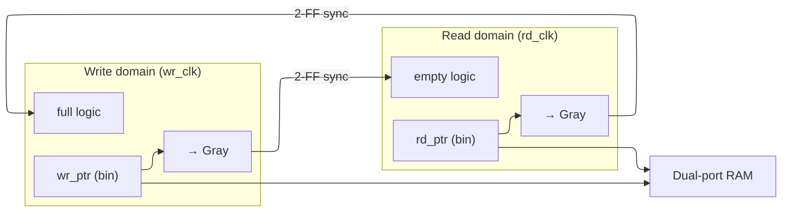

# Asynchronous Design and Clock-Domain Crossing

> **Prerequisites:** [Logic building blocks](../00_Fundamentals/02_Logic_Building_Blocks.md) (the cross-coupled pair as an unstable third equilibrium, the device-level MTBF law §4.4, and Gray-code encoding §7), [Data types and basics](02_Data_Types_and_Basics.md) (flops and `always` blocks).
> **Hands off to:** [Lint, CDC, and RDC signoff](07_Lint_CDC_RDC_Signoff.md) (proving every crossing in a real design is correct), [Clock division and switching](04_Clock_Division_and_Switching.md) (glitch-free clock muxing — a cousin problem), [PLL, DLL, and clock distribution](05_PLL_DLL_and_Clock_Distribution.md) (where the independent clocks come from).

---

## 0. Why this page exists

Clock-domain crossing rests on a single uncomfortable fact: **when a signal generated by one clock is sampled by another, unrelated clock, the receiving flip-flop's setup/hold window will eventually be violated — and there is nothing you can do to prevent it.** The two clocks drift in phase; over enough sampling opportunities the capturing edge is guaranteed to land inside the flop's aperture. The flop then enters *metastability*: it hangs at an invalid voltage for an unbounded, random time before falling to 0 or 1.

Because the violation cannot be prevented, the entire discipline reorients from *avoidance* to *guarantee*. Every CDC structure on this page exists to provide one of exactly **two** guarantees:

1. **Time to resolve.** Metastability decays exponentially, so given enough time it becomes astronomically unlikely to still be pending. Synchronizers buy that time; the MTBF model quantifies how much.
2. **Data coherency.** A synchronizer resolves *one bit*. A multi-bit value whose bits each cross independently can be captured as a word that never existed at the source. Gray code, handshakes, and async FIFOs guarantee the captured value is real.

This page derives every technique — the 2-FF synchronizer, Gray-coded pointers, req/ack handshakes, the async FIFO, reset synchronizers, pulse synchronizers — from *which of those two guarantees it provides and why it is the cheapest way to provide it*. You should finish able to size a synchronizer from a target MTBF, explain why one extra flop multiplies safety exponentially, prove why Gray code cannot produce garbage, and choose between a handshake and a FIFO on throughput grounds — not recite port lists.

---

## 1. The core idea: one unavoidable violation, two guarantees

A synchronous timing closure rests on a *fixed* phase relationship between launch and capture clocks, so static timing analysis can prove the data is stable across the aperture. Two **asynchronous** clocks have no fixed phase: their relative offset walks through every value over time. Model the capture edge's position within the data period as effectively uniform; each sampling opportunity then lands in the setup+hold aperture $T_a$ with probability $\approx T_a/T_{clk}$. It is not *whether* but *how often* — which is why the governing metric is a **mean time between failures**, not a pass/fail slack.

When the aperture is hit, the capturing flop is a cross-coupled inverter pair pushed to its unstable equilibrium — the same third equilibrium derived at the device level in [Logic building blocks §4.4](../00_Fundamentals/02_Logic_Building_Blocks.md). It resolves in a random time. That single mechanism forks into the two problems the rest of the page solves:

| The unavoidable fact | Why it cannot be prevented | Guarantee CDC must provide | Mechanism |
|---|---|---|---|
| The capture edge eventually lands in the receiver's setup/hold aperture → metastability | Asynchronous clocks sweep every phase relationship; the aperture is nonzero | Give the metastable node **time to resolve** before its value is used | Synchronizer (§3), sized by MTBF (§2) |
| A resolved bit is still only **one** bit; a bus's bits resolve on *different* cycles | Each bit is an independent flop with independent metastability | Guarantee the captured word is a value that **actually existed** at the source | Gray code (§5), handshake (§6), async FIFO (§7) |

Everything else is composition. A pulse synchronizer (§8) is the single-event case of guarantee 1; a reset synchronizer (§9) applies guarantee 1 to the reset net; the async FIFO (§7) composes Gray pointers (guarantee 2) with 2-FF synchronizers (guarantee 1). The decision of *which* structure to reach for reduces to what is crossing:

| What crosses | Correct structure | Why |
|---|---|---|
| One level signal (a flag, a mode bit) | 2-FF synchronizer (§3) | one bit → resolution time is the only concern |
| One event / pulse | Toggle (pulse) synchronizer (§8) | a pulse can fall between slow edges; a *level* survives |
| A monotonic counter (FIFO pointer, address) | Gray-code the counter, then 2-FF (§5) | only one bit changes per step → coherent by construction |
| An arbitrary multi-bit bus, occasional transfers | Req/ack handshake with data hold (§6) | freeze the bus, cross only 1-bit control |
| An arbitrary multi-bit *stream* | Asynchronous FIFO (§7) | one transfer per clock, sustained |

---

## 2. Metastability and the MTBF model

Metastability is the flop's third equilibrium. A latch is two inverters in a loop; its two stable states (0 and 1) are separated by an unstable midpoint $V_m \approx V_{DD}/2$. A setup/hold violation leaves the internal node *near* $V_m$, and the loop's small-signal dynamics carry it away exponentially:

$$
\frac{dV}{dt} = \frac{V - V_m}{\tau} \;\;\Rightarrow\;\; V(t) = V_m + (V_0 - V_m)\,e^{\,t/\tau}
$$

where $V_0$ = initial node voltage at the sampling instant, $\tau$ = regeneration time constant of the cross-coupled pair (set by its small-signal gain–bandwidth; a few ps in modern nodes). The device-level derivation of this equation lives in [Logic building blocks §4.4](../00_Fundamentals/02_Logic_Building_Blocks.md); here we take it as given and build the *system* consequence.

**Resolution time is logarithmic in the perturbation.** The node is "resolved" once it swings a fixed $\Delta V_{logic}$ away from $V_m$:

$$
t_r = \tau \ln\!\left(\frac{\Delta V_{logic}}{|V_0 - V_m|}\right)
$$

The nearer the sample landed to $V_m$, the smaller $|V_0-V_m|$, and the longer resolution takes — with no upper bound. You cannot guarantee resolution by *any* fixed deadline; you can only make missing the deadline exponentially rare.

**The MTBF law.** A failure is a sample that is *still unresolved* after the time $t_r$ you allotted it. The effective input aperture that leads to such a failure shrinks exponentially with the resolution budget, $T_a(t_r) = T_0\,e^{-t_r/\tau}$. Multiplying by how often you sample and how often the source presents a violating edge gives the failure rate, and its reciprocal is the mean time between failures:

$$
\boxed{\;\text{MTBF} = \frac{e^{\,t_r/\tau}}{f_c\,f_d\,T_0}\;}
$$

where
- $t_r$ = resolution time budgeted before the value is used (s),
- $\tau$ = regeneration time constant of the synchronizer flop (s),
- $T_0$ = intrinsic metastability window — a technology constant (~fs) capturing the aperture width per $\tau$ of resolution,
- $f_c$ = destination (capture) clock frequency — how often you roll the dice,
- $f_d$ = rate of asynchronous transitions on the crossing signal — how often a violating edge is offered.

The load-bearing feature is the shape: MTBF is **exponential in $t_r$** and only *linear* in the frequencies and the window. You cannot meaningfully improve safety by slowing the clock or the data (linear), but you can buy enormous safety by adding resolution time (exponential) — which is exactly what a synchronizer does, and why §3 is the whole ballgame.

---

## 3. The synchronizer: buying resolution time exponentially

The MTBF law leaves the designer one cheap knob: $t_r$, the time a possibly-metastable value is left alone before anything reads it. A **2-FF synchronizer** is the minimal machine that maximizes $t_r$ — two flops in series in the destination domain, the first sacrificial, the second clean:

```verilog
// The entire concept: FF1 may go metastable; it is given a full
// destination period to resolve before FF2 samples it. Nothing reads
// meta except FF2, so no metastable value fans out into logic.
always @(posedge clk_dst or negedge rst_n)
    if (!rst_n) sync <= 2'b0;
    else        sync <= {sync[0], data_async};   // data_sync = sync[1]
```

```wavedrom
{ "signal": [
  { "name": "clk_dst",    "wave": "p........." },
  { "name": "data_async", "wave": "0.1....0.." },
  { "name": "ff1_q",      "wave": "0..x.1...0" },
  { "name": "ff2_q",      "wave": "0.....1..." }
], "head": { "text": "Two-flop synchronizer: only FF1 may enter the unresolved interval" } }
```

The `x` interval is conceptual, not a promise that digital simulation will reproduce analog metastability. The architectural rule is that no functional logic observes `ff1_q`; `ff2_q` exposes a settled value after the added destination-clock latency.

The first flop absorbs the violation and drives *nothing but the second flop*. That isolation is the point: it hands FF1 an almost-full period to settle, and it prevents a metastable node from fanning out into combinational logic where it could be interpreted differently by different gates. The `ASYNC_REG`/`dont_touch` attributes real tools require simply forbid the optimizer from inserting logic or distance between the two flops.

**Why each added flop multiplies MTBF by $e^{T_{clk}/\tau}$.** For an $N$-stage synchronizer the resolution budget is

$$
t_r(N) = (N-1)\,T_{clk} - t_{c2q} - t_{su}
$$

where $T_{clk}$ = destination period, $t_{c2q}$ = clock-to-Q of a synchronizer flop, $t_{su}$ = setup of the next flop. Substituting into the MTBF law, the ratio between consecutive depths is

$$
\frac{\text{MTBF}(N{+}1)}{\text{MTBF}(N)} = e^{\,T_{clk}/\tau}
$$

**One extra flop buys a multiplicative $e^{T_{clk}/\tau}$ in MTBF for one extra cycle of latency** — an exponential return for a linear price. This is why synchronizers are both cheap and decisive, and why the *trade-off is latency vs MTBF*: you add stages until MTBF dwarfs the product lifetime with margin, and no further, because each stage also adds a destination cycle of crossing delay.

**When 2 stages stop being enough.** The exponent is $t_r/\tau \approx (N-1)T_{clk}/\tau$. As $T_{clk}$ falls (higher $f_c$) or $\tau$ rises (older nodes, high-$V_t$ cells), the per-stage exponent shrinks and depth must grow. A concrete 28 nm sweep ($\tau=50$ ps, $T_0=100$ fs) makes the cliff vivid:

| Scenario | $t_r$ (2-FF) | MTBF (2-FF) | Depth for $10^9$ yr |
|---|---|---|---|
| 200 MHz capture, 50 MHz data | 4.86 ns | $\sim10^{33}$ yr | 2 (huge margin) |
| **2 GHz** capture, 1 GHz data | 0.36 ns | **~7 ms** | **7** |

At 2 GHz a 2-FF synchronizer fails every few *milliseconds*; reaching a $10^9$-year target needs seven stages, because each stage now contributes only $e^{500\text{ps}/50\text{ps}}=e^{10}$ instead of $e^{97}$. This is why high-frequency CDC at relaxed nodes is genuinely hard, and why 3-FF synchronizers are standard for $f_c>2$ GHz, ASIL-D/aerospace safety margins, or libraries with poor $\tau$. Rule of thumb: if the worst-corner 2-FF MTBF is below ~1000 years, add a stage.

**Physical constraints (the essential few).** Resolution time is stolen by anything that eats the period between FF1 and FF2, so: place the two flops adjacent on the *same* clock-tree leaf (zero inter-stage skew), never insert combinational logic between them (it both burns $t_r$ and can present a glitch as a real edge), and prefer low-$V_t$ cells (smaller $\tau$). Many libraries ship a characterized `SYNC2` cell that bakes these in.

---

## 4. The coherency problem: why one synchronizer cannot carry a bus

A synchronizer delivers guarantee 1 — a resolved bit — and *only* a bit. Wire an independent 2-FF synchronizer onto each line of a bus and the guarantee collapses, because the bits are now independent random variables.

Let the source advance a 4-bit value `0111 → 1000` (all four bits toggle at once). Each bit crosses through its own pair of flops; on the destination edge that catches the transition, some bits may have already advanced and others not, and any that go metastable resolve *either way independently*. The destination can therefore latch `1111`, `0000`, `1010` — any of the $2^4$ combinations of old-or-new per bit — **none of which the source ever drove.** Every synchronizer worked perfectly (each output is a clean, resolved 0 or 1); the failure is *coherency across bits*, an orthogonal problem. (This is the single most common real CDC bug: a data bus and its `valid` each synchronized independently, so `valid` arrives while the bus is a half-updated mixture. It corrupts silicon, not simulation, because sim resolves every bit deterministically — see §10.)

Guarantee 2 therefore needs its own mechanisms, and there are exactly three, distinguished by *what* is allowed to cross:

- **Constrain the data so only one bit ever moves** → Gray code, for counters/pointers (§5).
- **Freeze the data and cross only a 1-bit control** → handshake, for arbitrary occasional transfers (§6).
- **Buffer the data and cross only the (Gray) pointers** → async FIFO, for streams (§7).

---

## 5. Gray code: coherency by construction

If consecutive values are constrained to differ in **exactly one bit** (Hamming distance 1), the coherency problem disappears at the source. When such a value is sampled mid-change, at most one bit is in flight; that lone bit resolves to either its old or its new state, so the captured word is **either the old value or the new value — never a third pattern.** No structure is needed on the destination side beyond an ordinary per-bit 2-FF synchronizer, because there is no incoherent combination to produce.

Gray code is the encoding that gives every counter this property. With `gray = bin ^ (bin >> 1)` (so `gray[MSB] = bin[MSB]`), one increment flips one Gray bit:

```verilog
gray = bin ^ (bin >> 1);   // binary→Gray: adjacent counts differ in 1 bit
```

**Proof (one increment ⇒ one Gray-bit change).** Let $k$ be the position of the least-significant `0` in binary value $B$. Then $B\!+\!1$ flips bits $0..k$: bits $0..k{-}1$ go `1→0`, bit $k$ goes `0→1`, bits above $k$ are unchanged. Since $\text{gray}[i]=\text{bin}[i]\oplus\text{bin}[i{+}1]$:
- $i>k$: both operands unchanged ⇒ $\text{gray}[i]$ unchanged.
- $i=k$: $\text{bin}[k]$ flips, $\text{bin}[k{+}1]$ unchanged ⇒ $\text{gray}[k]$ **flips**.
- $i<k$: *both* $\text{bin}[i]$ and $\text{bin}[i{+}1]$ flip ($1\!\to\!0$) ⇒ $\text{gray}[i]=1\!\oplus\!1=0$ before and $0\!\oplus\!0=0$ after ⇒ unchanged.

Only $\text{gray}[k]$ changes. ∎ (This encoding is developed further, with the FSM-encoding view, in [Logic building blocks §7](../00_Fundamentals/02_Logic_Building_Blocks.md).)

**The scope limit is the trade-off.** Gray code is free coherency, but *only* for values that advance by $\pm1$ in sequence — counters, pointers, addresses. You cannot Gray-encode an arbitrary data bus (successive data words are not Hamming-1 neighbours), and you cannot Gray-code a non-power-of-2 wrap: at the wrap point multiple bits change and the guarantee is lost (a classic FIFO bug — §7 rounds depth up to a power of two precisely to preserve it). For arbitrary data the coherency guarantee must come from *holding the bus still* instead — the handshake.

---

## 6. Handshake: coherency by holding data still

The second route to guarantee 2 is to ensure the bus is not moving while the receiver samples it. The sender writes the data into a holding register and leaves it there; it then raises a **request** — a *single* bit, so it crosses safely through a 2-FF synchronizer. The receiver, seeing the synchronized `req`, knows the bus has been stable for at least the synchronizer latency and captures it directly (no bus synchronizer needed — the same insight as a MUX-recirculation scheme: a synchronized control bit gates the capture of a guaranteed-stable bus). The receiver then raises **acknowledge**, which crosses back the same way; the sender drops `req`; the receiver drops `ack`. Only the two 1-bit control signals ever cross a domain.

```verilog
// Coherency by construction: data_hold is frozen before req is raised,
// so when the destination sees req_sync it may sample data_hold directly.
if (start) begin data_hold <= data_in; req <= 1'b1; end   // src: freeze, request
// ... req --2FF--> req_sync (dst) ; ack --2FF--> ack_sync (src)
if (req_sync) begin data_out <= data_hold; ack <= 1'b1; end // dst: capture, ack
```

**4-phase (return-to-zero) vs 2-phase (toggle).** The version above is 4-phase: `req`↑, `ack`↑, `req`↓, `ack`↓ — four crossings, each ~2 destination cycles, so **~8–12 cycles per transfer**, but it is level-based and resets to a trivially safe all-zero state. The 2-phase variant encodes each transfer as an *edge* (toggle) of `req` and `ack`, halving crossings to two and roughly doubling throughput, at the cost of edge-detect logic on each side and no natural reset level.

**The trade-off is safety/simplicity vs throughput.** A handshake is the safest and lowest-area way to move an arbitrary word across domains, and it needs no memory. But it is fundamentally *serial*: the sender cannot launch word $n{+}1$ until the round trip for word $n$ completes, so throughput is one transfer per full req→ack→release latency — a few tens of megatransfers/s at GHz clocks regardless of how fast either domain runs. When the data is a *stream* rather than an occasional message, that round-trip latency is intolerable, and the answer is to stop paying it per word — the async FIFO.

---

## 7. The asynchronous FIFO: coherency at full throughput

A handshake pays a round trip *per word*. A stream wants one transfer *per cycle*. The async FIFO achieves that by decoupling the two domains through a **dual-port RAM**: the writer stores into `mem[wr_ptr]` on `wr_clk`, the reader loads from `mem[rd_ptr]` on `rd_clk`, and *no per-word control crosses at all*. The only thing that must cross a domain is **occupancy** — how full the buffer is — so each side can decide `full`/`empty`. Occupancy is encoded entirely in the two pointers, and pointers are monotonic counters, so §5 applies: **Gray-code each pointer and cross it with a plain 2-FF synchronizer.** The FIFO is thus the direct composition of guarantee 2 (Gray, for the pointers) with guarantee 1 (synchronizer, per pointer bit).



**Pointer width = $\text{ADDR\_W}+1$.** The extra MSB is a *wrap bit* that distinguishes full from empty. A FIFO of $2^{\text{ADDR\_W}}$ entries is full and empty at the *same address*; with one extra bit, full and empty differ in whether the writer has lapped the reader.

**Empty (read domain).** Gray coding is a bijection, so equality of Gray words is equality of the underlying counts. The buffer is empty exactly when the reader has caught the writer:

$$
\text{empty} = \big(\text{rd\_gray} == \text{wr\_gray\_sync}\big)
$$

Because `wr_gray_sync` lags the true write pointer by the synchronizer latency, `empty` can only *over*-report (assert briefly when a word has just arrived) — it never claims data exists when it does not. The error is in the **safe** direction.

**Full (write domain).** The buffer is full when the writer is exactly one lap ahead: same low address bits, opposite wrap bit. In binary that is $\text{wr\_bin}[\text{MSB}]\neq\text{rd\_bin}[\text{MSB}]$ with all lower bits equal. Converting to Gray with the standard `gray[MSB]=bin[MSB]` convention makes the condition fall out as **the top two Gray bits inverted, all lower bits equal**:

$$
\text{full} = \big(\text{wr\_gray}[N{-}1{:}N{-}2] \neq \text{rd\_gray\_sync}[N{-}1{:}N{-}2]\big)\ \wedge\ \big(\text{wr\_gray}[N{-}3{:}0] == \text{rd\_gray\_sync}[N{-}3{:}0]\big)
$$

*Why the top two bits.* With opposite MSB but identical lower binary bits: $\text{gray}[N{-}1]=\text{bin}[N{-}1]$ differs (the wrap bit itself); $\text{gray}[N{-}2]=\text{bin}[N{-}2]\oplus\text{bin}[N{-}1]$ also flips because only $\text{bin}[N{-}1]$ changed; every $\text{gray}[i\le N{-}3]$ combines two *unchanged* lower bits and so is equal. Two bits differ, the rest match. (The commonly-cited "top two MSBs differ" is exactly this — provided you use `gray[MSB]=bin[MSB]`; deriving it with the wrong convention is what makes textbook proofs go in circles.) Like `empty`, `full` uses the lagged `rd_gray_sync`, so it can only *falsely assert* full, never falsely clear it — again the safe direction.

**Depth is a rate/burst problem, not a safety one.** Correctness never depends on depth; *throughput* does. If the writer bursts $B$ words at rate $f_{wr}$ into a reader draining at $f_{rd}<f_{wr}$, the occupancy climbs and the minimum depth to avoid stalling is

$$
D \;\gtrsim\; B\left(1 - \frac{f_{rd}}{f_{wr}}\right) + D_{sync}
$$

where $B$ = burst length (words), $f_{wr},f_{rd}$ = write/read throughputs, and $D_{sync}$ = the few entries of slack lost because the synchronized pointers lag by ~2–3 cycles each way (so `full`/`empty` react late). For sustained streams with matched average rates, depth covers only jitter and the synchronizer lag; for bursty producers it covers the burst. Round the result **up to a power of two** so the Gray wrap stays Hamming-1 (§5) — the reason a "depth = 12" custom Gray FIFO corrupts at its wrap point and a depth-16 one does not.

**The trade-off is throughput/decoupling vs area.** The FIFO sustains one transfer per clock in each domain with no handshake latency, and it tolerates arbitrary frequency and phase relationships — but it costs a dual-port RAM plus two Gray+synchronizer pointer paths (and Gray→binary converters if you want a numeric fill level). Reach for it when data streams; reach for the handshake (§6) when transfers are occasional and area matters.

---

## 8. Pulse and toggle synchronizers

A 2-FF synchronizer transports a *level*. It cannot reliably transport a *pulse*: a single-cycle strobe in a fast source domain may be narrower than the destination period and fall entirely between two capture edges — sampled as a constant 0, the event silently lost. The fix is to convert the event into something a synchronizer *can* carry, a level, and regenerate the pulse on the far side:

```verilog
// src: each pulse flips a level (a toggle) that a synchronizer can carry
if (pulse_in) toggle <= ~toggle;
// dst: 2-FF sync the toggle, then edge-detect to regenerate a 1-cycle pulse
pulse_out = toggle_sync ^ toggle_sync_d;   // XOR of sync'd toggle vs its delay
```

The toggle level persists until the next event, so the destination cannot miss it; XOR-ing the synchronized toggle against a one-cycle-delayed copy emits exactly one destination-domain pulse per source event.

**The limitation is throughput, and it is a round-trip again.** Between two source events the toggle must fully propagate through the synchronizer, so events must be spaced by roughly one source period plus the synchronizer latency (~3 destination cycles). Fire faster — the classic *fast-to-slow* case, back-to-back source pulses — and edges are coalesced and lost. When events can arrive faster than the destination can absorb them, a single toggle is not enough: you need the buffering of a FIFO or the back-pressure of a handshake. The toggle synchronizer is the right tool only for sparse events.

---

## 9. Reset-domain crossing and the reset synchronizer

Reset is a CDC signal too, and it fails in a way that is invisible until silicon: an asynchronous reset release that violates a flop's recovery/removal window drives it *metastable coming out of reset*, and if different flops in a domain then leave reset on different cycles, the state machine boots into an inconsistent state and hangs. (A real 1-in-1000 boot hang traced to a reset crossing with no synchronizer — §10.) The canonical answer is **assert asynchronously, deassert synchronously**:

```verilog
// Async assert (works even with a dead/unstable clock); sync deassert
// (all flops leave reset on the SAME edge → no recovery/removal race)
always @(posedge clk or negedge async_rst_n)
    if (!async_rst_n) rst_pipe <= 2'b0;          // immediate assert
    else              rst_pipe <= {rst_pipe[0], 1'b1};  // clean release, 2 cyc later
// sync_rst_n = rst_pipe[MSB]
```

- **Assert must be async** so reset takes effect even at power-on when the clock has not yet started — a synchronous-only reset could never be captured with a dead clock.
- **Deassert must be sync** so every flop in the domain exits reset on one common edge, eliminating the recovery/removal race and the metastable-exit it causes.

**Reset-domain crossing (RDC)** is then the discipline of giving *each* clock domain its own reset synchronizer off the common async source, so assertion is simultaneous but each domain's *release* is aligned to its own clock. When one domain must come out of reset before another (producer before consumer), chain the synchronizers so release order is guaranteed. The exhaustive static checking of these crossings belongs to [Lint, CDC, and RDC signoff §4](07_Lint_CDC_RDC_Signoff.md).

---

## 10. Special crossings: voltage domains and verification

**Voltage-domain crossing (level shifters).** A signal leaving a low-$V_{DD}$ island for a high-$V_{DD}$ one needs its swing translated or the receiver never sees a valid high. Low→high is the easy direction (a cross-coupled-PMOS shifter latches the boosted level); high→low needs current-limiting to protect thin-oxide devices; an *enable* level shifter doubles as an isolation cell, clamping the output to a safe value when a power-gated source is off. The one rule that interacts with CDC: **if a crossing changes both voltage and clock, shift first, then synchronize** — order is source FF → level shifter → 2-FF synchronizer → destination logic, so metastability is resolved at the correct, final voltage.

**Why CDC cannot be signed off by simulation.** A logic simulator resolves every flop to a deterministic 0 or 1 — it *cannot* model a metastable node hanging at $V_m$, nor bits of a bus resolving on different cycles, nor a glitch through pre-synchronizer logic. The one failure mode CDC exists to control is therefore invisible to sim, and no amount of random-clock-phase testing changes that (the metastable subspace has measure ~0 in any finite run). CDC correctness is instead proven **structurally and formally**: every crossing must pass through a recognized synchronizer, with no combinational logic before it, no reconvergence of separately-synchronized copies, and proper Gray/handshake/FIFO encoding on every multi-bit crossing. That methodology — the tool checks, the waiver discipline, the signoff checklist — is owned by [Lint, CDC, and RDC signoff](07_Lint_CDC_RDC_Signoff.md); this page owns the *design* that makes those checks pass. Simulation still earns its keep verifying the *functional* correctness of the CDC logic itself (does the FIFO actually move data?), just not the absence of metastability failures.

---

## Numbers to memorize

| Quantity | Typical | Note / driver |
|---|---|---|
| MTBF law | $e^{t_r/\tau}/(f_c f_d T_0)$ | exponential in $t_r$, linear in everything else (§2) |
| Regeneration $\tau$ | 8–12 ps (N5) · ~50 ps (28 nm) | sets per-stage MTBF exponent (§3) |
| Intrinsic window $T_0$ | ~10–100 fs | technology constant, from characterization |
| Per-flop MTBF gain | $\times\,e^{T_{clk}/\tau}$ | one stage, one cycle latency, exponential safety (§3) |
| Synchronizer depth | 2 | 3+ if $f_c>2$ GHz, safety-critical, or worst-corner MTBF < 1000 yr (§3) |
| Synchronizer latency | 2–3 dest cycles | the price of resolution time (§3) |
| 2-FF MTBF (sub-GHz, modern node) | $\gg 10^9$ yr | adequate for nearly all CDC (§3) |
| Handshake throughput | 1 per ~8–12 cyc (4-phase) · ~4–6 (2-phase) | round-trip bound; safe, low area (§6) |
| Async FIFO throughput | ~1 word/cycle sustained | decoupled; costs a dual-port RAM (§7) |
| FIFO pointer width | $\lceil\log_2 \text{depth}\rceil + 1$ | extra MSB distinguishes full from empty (§7) |
| FIFO depth | power of two | preserves Gray wrap; sized by burst, not safety (§7) |
| Reset discipline | async assert / sync deassert | avoids recovery/removal metastable-exit (§9) |
| Level-shifter delay | 20–80 ps | must sit in the STA path; shift *before* sync (§10) |

---

## Worked problems

**1 — Choosing synchronizer depth from a target MTBF.** A crossing runs at $f_c=2$ GHz ($T_{clk}=500$ ps), $f_d=1$ GHz, in a 28 nm library ($\tau=50$ ps, $T_0=100$ fs); target MTBF $=10^9$ yr $\approx 3.15\times10^{16}$ s. Required exponent: $e^{t_r/\tau}\ge 3.15\times10^{16}\cdot f_c f_d T_0 = 3.15\times10^{16}\cdot(2\times10^9)(10^9)(10^{-13})\approx 6.3\times10^{21}$, i.e. $t_r/\tau \ge \ln(6.3\times10^{21})\approx 50.3$, so $t_r\ge 2.5$ ns. With $t_r(N)=(N{-}1)\cdot500 - t_{c2q}-t_{su}\approx (N{-}1)\cdot500 - 140$ ps, you need $(N{-}1)\ge 5.3$, i.e. $N{-}1=6$ → **$N=7$ stages** (a 2-FF here fails every few milliseconds). The same crossing at $f_c=200$ MHz meets the target with $N=2$ by a $10^{20}\times$ margin — the takeaway is that depth is set by $T_{clk}/\tau$, and high frequency at a coarse node is what forces deep synchronizers.

**2 — Sizing an async FIFO for a burst.** A camera source bursts $B=256$ pixels at $f_{wr}=600$ MHz into a processing domain that drains at $f_{rd}=400$ MHz. Minimum depth to avoid overflow: $D\gtrsim B(1-f_{rd}/f_{wr}) + D_{sync}=256(1-0.667)+ \sim4 \approx 89$. Round up to the next power of two → **depth 128** (pointer width $\lceil\log_2 128\rceil+1=8$). Note depth protects *throughput*, not correctness: a depth-64 FIFO would drop pixels under this burst but would never corrupt a word, because the Gray pointers keep every crossing coherent regardless of depth.

**3 — Handshake vs FIFO on a stream.** A 32-bit result is produced every cycle at 1 GHz and consumed at 800 MHz. A 4-phase handshake moves one word per ~10 cycles → ~100 Mword/s, a **10×** deficit against the 800 Mword/s the consumer can accept: the handshake's round-trip latency, not the domains, is the bottleneck. An async FIFO sustains ~800 Mword/s (reader-limited) at the cost of a small dual-port RAM. This is precisely the throughput knee that sends streaming crossings to FIFOs and leaves handshakes for occasional control messages.

---

## Cross-references

- **Down the stack (what CDC is built from):** [Logic building blocks](../00_Fundamentals/02_Logic_Building_Blocks.md) — the cross-coupled pair as an unstable equilibrium and the device-level MTBF law (§4.4), and Gray-code encoding (§7), both of which this page applies rather than re-derives; [CMOS fundamentals](../00_Fundamentals/01_CMOS_Fundamentals.md) — the transistor behaviour behind $\tau$ and level shifters.
- **Up the stack (what builds on it):** [Lint, CDC, and RDC signoff](07_Lint_CDC_RDC_Signoff.md) — the static/formal proof that every crossing in a design uses these structures correctly (owns verification; this page owns the design); [Clock division and switching](04_Clock_Division_and_Switching.md) — glitch-free clock muxing, the same "unrelated edges" hazard in the clock rather than the data path; [PLL, DLL, and clock distribution](05_PLL_DLL_and_Clock_Distribution.md) — the origin of the independent clocks and the skew that sets $t_r$.
- **Adjacent:** [Data types and basics](02_Data_Types_and_Basics.md) — the RTL flop/`always` semantics used in every fragment here.

---

## References

1. Ginosar, R., "Metastability and Synchronizers: A Tutorial," *IEEE Design & Test of Computers*, 28(5), 2011. The MTBF derivation and synchronizer-depth analysis of §2–§3.
2. Cummings, C.E., "Simulation and Synthesis Techniques for Asynchronous FIFO Design," *SNUG*, 2002. The Gray-pointer async FIFO and full/empty derivation of §7.
3. Cummings, C.E., "Clock Domain Crossing (CDC) Design & Verification Techniques Using SystemVerilog," *SNUG*, 2008. The bus-coherency, handshake, and MUX-recirculation techniques of §4–§6.
4. Kinniment, D.J., *Synchronization and Arbitration in Digital Systems*, Wiley, 2007. Metastability physics and multi-stage synchronizers.
5. Dally, W.J. and Poulton, J.W., *Digital Systems Engineering*, Cambridge University Press, 1998. Ch. on synchronization and the resolution-time model.
