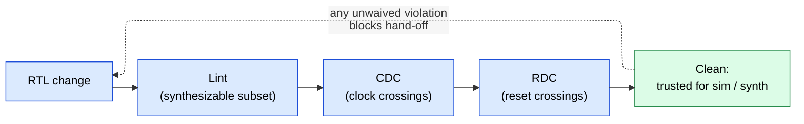

# Lint, CDC, and RDC Signoff — Proving Structural Bug Classes Absent Without Simulation

> **Prerequisites:** [RTL_Design_Methodology](01_RTL_Design_Methodology.md) (RTL-as-a-contract, the inferred-latch derivation), [Async_Design_and_CDC](06_Async_Design_and_CDC.md) (the metastability / MTBF / synchronizer *physics* this page proves you applied).
> **Hands off to:** [Assertions_and_Coverage](09_Assertions_and_Coverage.md) (SVA for CDC protocol checks), [Formal_Verification](12_Formal_Verification.md) (formal CDC), and dynamic verification ([UVM_Methodology](10_UVM_Methodology.md), [Gate_Level_Sim_and_Emulation](13_Gate_Level_Sim_and_Emulation.md)).

---

## 0. Why this page exists

Dynamic verification is a **search**: a test finds a bug only if the stimulus happens to drive the input that exposes it, and only if the simulator's semantics even *model* the failure. Two whole categories of hardware bug slip through both filters at once:

- **Failures whose physics simulation does not model.** A missing two-flop synchronizer on one of 400 clock crossings passes *every* RTL test, because RTL simulation treats an asynchronous crossing as a zero-delay clean wire — metastability simply does not exist in the model. The design then fails intermittently in silicon, on a mean-time-between-failures measured in hours-to-years. There is no stimulus that reproduces it in the testbench.
- **Structural defects no test happens to exercise.** An inferred latch that holds only on an un-assigned code path, a bus bit that is silently truncated, a net with two drivers — these are legal, compilable RTL. Simulation catches them only if a test drives the exact combination that reveals them, which coverage almost never guarantees.

**Static signoff** attacks both by abandoning stimulus entirely. It analyzes the *structure* of the RTL — the elaborated graph, the clocks, the reset domains — and **proves a property over all inputs and all paths at once**: lint proves the RTL falls inside the safe synthesizable subset, CDC proves every clock crossing is correctly synchronized, RDC proves every reset crossing is safe. Because these classes are un-searchable, static proof is not a cheaper alternative to simulation — for these bugs it is the *only sound* method, and it is a hard gate to tape-out. This page is the theory of why that is true and the methodology for discharging it; the underlying metastability physics lives in [Async_Design_and_CDC](06_Async_Design_and_CDC.md) and is not re-derived here.

---

## 1. The theory: proof over all inputs vs search with tests

The organizing idea of the whole page is one distinction from verification theory.

**Simulation can only refute, never prove.** Let $P$ = "no defect of class $C$ exists in this RTL." A simulation run drives a stimulus set $S$ and observes outputs; a pass means only "$P$ was not refuted on $S$" — absence of evidence, not evidence of absence. It proves $P$ only if $S$ is exhaustive, which is astronomically infeasible. Coverage is the fraction $|S|/|S_{\text{total}}|$ sampled, and undetected bugs of class $C$ live precisely in the unsampled remainder. This is Dijkstra's dictum made operational: *testing shows the presence of bugs, never their absence.*

**Static analysis proves over the structure without stimulus.** It computes an over-approximation of *all* reachable behaviors directly from the elaborated netlist graph and checks $P$ against all of them simultaneously, returning "proved" or a counterexample structure. No stimulus, no coverage question — the quantifier is $\forall$ inputs by construction.

The price of that quantifier is a fundamental trade between two error types:

$$
\text{false negative (miss): a real defect not reported} \qquad \text{false positive (false alarm): a safe structure reported as a defect}
$$

- A **sound** defect analysis has **zero false negatives**: it reports *every* real defect of its class. This is what signoff requires — *you cannot fix, nor even waive, a bug you were never shown.* A missed crossing tapes out.
- A **complete** analysis has **zero false positives**: it reports *only* real defects.

By Rice's theorem, exact detection of nontrivial semantic properties is undecidable, so no terminating tool can be simultaneously sound, complete, and general. Signoff tools deliberately **choose soundness and sacrifice completeness**: they over-approximate, never miss a real crossing, and pay with false positives. That single choice explains the entire methodology downstream — the tool is *loud on purpose*, and the resulting waiver list (§6) is the price of never missing.

**Why "prove absence" strictly dominates "search with tests" for the metastability class.** The event that triggers a metastable capture is not a digital input at all — it is an analog timing coincidence with a per-cycle probability so small that the MTBF is *years* (model in [Async_Design_and_CDC](06_Async_Design_and_CDC.md) §2). No finite simulation samples a years-mean continuous-time event, and the event is not in the RTL model to begin with. For this class, search is not merely incomplete — it is **structurally blind**: *no* stimulus makes an unsynchronized crossing fail in RTL simulation. The only sound signoff is to prove, structurally, that the synchronizer is present. Hold this one idea and the rest of the page is its consequences.

---

## 2. Lint — proving a class of RTL defects absent at the source

The RTL-to-hardware mapping is many-to-one and lossy: the *same* legal SystemVerilog can synthesize to a flop, a latch, or a wire depending on subtle completeness properties of the code ([RTL_Design_Methodology](01_RTL_Design_Methodology.md)). A whole bug class is therefore "the hardware you inferred is not the hardware you meant," and its defining feature is that each instance is **decidable from the code's structure alone** — you never need to run it. Lint is the static proof that the RTL stays inside the safe synthesizable subset. Read the categories not as a style checklist but as *properties being proved*:

- **Inferred latch** → proves *complete assignment*: every output of a combinational process is assigned on every branch. A latch is inferred exactly when some path leaves a variable unassigned; that is a structural property of the code (the derivation is in [RTL_Design_Methodology](01_RTL_Design_Methodology.md) §2.1). Simulation misses it because the latch only misbehaves when a test both hits the un-assigned path *and* the stale value differs from the intended one — a conjunction no test is guaranteed to drive.
- **Incomplete sensitivity list / case** → proves *semantic agreement*: the process's read-set equals its sensitivity list, so simulated (event-driven) behavior matches synthesized behavior. A mismatch is a silent sim-vs-silicon divergence, detectable by comparing two sets in the parse tree. (`always_comb`/`always_ff` exist to make this property syntactic.)
- **Width mismatch / truncation** → proves *bit-width consistency* across each assignment. A dropped high bit is a silent functional bug and a purely static property of the expression.
- **Multiple drivers / multiply-driven net** → proves *single-driver* on every net. Two structural drivers build shorted or undefined hardware; it is a fan-in property of the connectivity graph.
- **Unreachable / undriven / floating logic** → proves *reachability and drive*: dead logic wastes area and an undriven net is an $X$ source. Both are reachability queries over the netlist graph.

Every one of these is provable in seconds over the *entire* module, for *all* inputs, at RTL — which is the point. Catching them here is orders of magnitude cheaper than downstream, by the shift-left cost model of §7: an RTL fix is minutes, while the same defect at gate sim, emulation, or bring-up costs $\sim 10^k\times$ more because you must first *hit* it with stimulus and then localize it through layers of transformed netlist.

**Methodology, trimmed to essentials.** Running *all* available rules drowns real defects in noise — that is the false-positive problem of §1 in miniature, so real flows run a **curated ruleset** tuned to the project. The deliverable is **lint-clean with a reviewed waiver list**: every violation either fixed or explicitly waived with justification. "Lint-clean" is part of the RTL hand-off contract ([RTL_Design_Methodology](01_RTL_Design_Methodology.md)).

---

## 3. CDC static verification — proving every crossing safe over all inputs

Clock-domain crossings are the paradigm case of §1's un-searchable bug. The proof obligation decomposes into four steps of increasing difficulty; each is something simulation *cannot* deliver.

### 3.1 Find EVERY crossing — the enumeration-completeness problem

You cannot prove crossings safe if you cannot enumerate them, and a *missed* crossing is a false negative that tapes out. A CDC exists wherever a signal launched by clock $A$ is captured by clock $B$ with $A,B$ asynchronous. To enumerate them soundly the tool must (a) know the clock of *every* flop, and (b) trace the structural fan-in/fan-out graph to find every launch→capture pair. Requirement (a) is why CDC needs a **clock-domain specification** — clock definitions, which clock groups are asynchronous vs synchronous, false paths, and quasi-static signals. That specification is the correctness contract (§5): miss a generated-clock definition and the tool either misses real crossings or floods you with phantom ones. Enumeration is where "static is expensive to set up" comes from, and it is unavoidable.

### 3.2 Prove each crossing is synchronized — structural CDC

Given the crossing set, structural CDC proves each single-bit control crossing terminates in a **recognized synchronizer** — canonically a 2-FF (two destination-clock flops back-to-back) with **no combinational logic between the two flops**. The adjacency requirement is not stylistic: the first flop's output may be metastable, and it needs a *full* destination clock period to resolve before the second flop samples it; logic in between steals that resolution time and can fan a still-settling value into a reconvergent glitch. This is a pure topology match on the graph, quantified over all paths, with no stimulus — exactly the property simulation cannot establish (§1). The **#1 structural CDC bug** is precisely combinational logic sitting between the synchronizer flops.

### 3.3 The harder properties — reconvergence, gray-coding, protocol stability

Synchronizers present is necessary, not sufficient. Correctness needs *functional* properties that structural topology alone does not capture.

**Reconvergence correlation — the #1 functional CDC bug, and why correctness is not compositional.** Take an $n$-bit bus crossed through $n$ *independent* 2-FF synchronizers. When the source value changes, each destination synchronizer resolves its bit to old-or-new independently, because the metastable resolutions are independent Bernoulli events. Model the per-bit destination skew as $\Delta_i \in \{0,1\}$ cycles, i.i.d. across bits. During that $\pm1$-cycle window the destination can momentarily observe **up to $2^n$** distinct combinations — including values the source *never emitted*:

$$
\text{observed}(k) \;=\; \{\, b_i^{\text{old}} \text{ or } b_i^{\text{new}} : i = 1..n \,\}, \qquad \left|\text{reachable}\right| \le 2^{n}
$$

If that bus reconverges into a comparator, decoder, or state transition, the logic glitches on a phantom value. The theoretical crux: safety is **not compositional** —

$$
\bigwedge_{i} \big(\text{bit } i \text{ correctly synchronized}\big) \;\not\Rightarrow\; \big(\text{bus correctly synchronized}\big)
$$

— because the resolutions are *uncorrelated* random variables. No amount of per-bit checking proves the bus safe. The fixes eliminate the *multiplicity*, not the metastability: **gray code** makes only one bit change per source step (Hamming distance 1), so at most one bit is ambiguous and the observed value collapses to old-or-new; a **handshake/MCP** holds all $n$ data bits stable and synchronizes a single `req` bit, so only that one bit ever crosses. Both collapse the $2^n$ corner set back to two. This is the rigorous reason for the rule *never independently 2-FF a bus*.

**Gray-coding of bused crossings.** For counters that cross (async-FIFO read/write pointers), the tool must prove the bus is gray-encoded (or handshake/FIFO-protected): Hamming-1 successors guarantee a mid-transition sample yields the old or the new value, never a spurious third — coherency by construction. The gray-code derivation lives in [Async_Design_and_CDC](06_Async_Design_and_CDC.md) §5; here it is a property to *prove*, structural-plus-functional.

**Data stability / handshake correctness.** For MCP and handshake crossings, correctness is a *temporal* property: the source must hold the data word stable from the moment `req` launches until the destination has captured it. "Data stable while the control bit crosses, on all inputs" is exactly the kind of $\forall$-time property that needs assertions plus formal to discharge — simulation can check that *one* trace obeyed the protocol but cannot prove *all* traces do ([Assertions_and_Coverage](09_Assertions_and_Coverage.md), [Formal_Verification](12_Formal_Verification.md) §6).

### 3.4 Structural CDC vs metastability-injection simulation — the real dynamic complement

RTL simulation is zero-delay and models a crossing as a clean wire, so it *always passes* a missing synchronizer — stated once, sharply, because it is the whole reason this page exists. The nearest dynamic technique is **metastability-injection simulation** (CDC-aware sim): the flow instruments synchronizer outputs to randomly inject a one-cycle delay or an $X$, *emulating* a possible metastable resolution, then runs the functional testbench to see whether the design still behaves.

The two are complementary, and the trade is the soundness/coverage axis of §1:

- **Structural/formal CDC** proves, over *all* crossings and inputs, that each is synchronized and each protocol is correct. It is sound; it cannot validate that surrounding functional logic actually *tolerates* the legal $\pm1$-cycle skew.
- **Metastability-injection sim** validates exactly that functional tolerance — does my handshake FSM really survive the delayed `req`? — but it inherits simulation's coverage limit: it only injects on paths the tests drive and only the random corner it picks, so it is a *search* again, sound only for what it covers. It can neither enumerate missing crossings nor prove the general case.

So real flows use structural/formal CDC to *prove the property* and injection sim to *stress the functional fallout* on covered scenarios — not one or the other.

### 3.5 Structural vs formal CDC — over-approximation and false positives

Within static analysis the soundness/completeness trade of §1 reappears. **Structural CDC** is fast and sound-for-topology but over-approximates functional intent: it does not know that two enables are mutually exclusive, or that a config bit is quasi-static, so it flags reconvergence that can never actually occur — false positives that become waiver load (§6). **Formal CDC** model-checks the functional properties (stability, protocol, gray-ness) precisely, discharging many of those false positives at the cost of setup and convergence effort ([Formal_Verification](12_Formal_Verification.md) §6). The choice between them *is* a completeness-for-effort trade: pay formal's setup to shrink $F$, or pay the waiver review instead.

The signoff deliverable is a report classifying every crossing as *synchronized / waived / violation*, and the gate is **zero unwaived violations**.

---

## 4. RDC — the same proof obligation, in the reset dimension

Reset-domain crossing (RDC) is CDC's structural twin, and the insight is that **an asynchronous reset assertion is itself an asynchronous edge**. When reset $A$ asserts, every flop it resets drives its output low *mid-cycle*, asynchronously to any running clock. If a flop reset by $A$ feeds a flop that is *not* currently in reset, the destination samples an asynchronous transition and can go metastable — the exact CDC failure mode, but launched by a *reset event* rather than a clock edge.

The reason RDC is a *separate* signoff, invisible to CDC, is sharp: the two flops may share the *same clock*, so CDC sees no clock crossing at all. The crossing lives in the **reset** dimension, not the clock dimension.

**Why it is newly important.** A classic chip had one global reset — no reset domains, no RDC problem. Modern SoCs have many *independently asserted* resets: power-gated blocks that reset on power-up ([UPF/CPF Power Intent](../02_Power_and_Low_Power/05_UPF_and_CPF_Power_Intent.md)), partial/warm resets, per-cluster resets, and functional-safety islands that must reset without disturbing neighbors. Reset-domain crossings proliferate exactly as clock domains did, so RDC has become its own tape-out gate in low-power SoCs.

The proof obligation has the *same shape* as CDC: a **reset-domain specification** declares which resets are independent; the tool enumerates every source-reset → destination-different-reset pair over the graph; and it proves each is protected — reset the destination too, sequence the resets so both are in reset together, or insert an isolation cell / reset-aware synchronizer. Same soundness argument, same constraint contract (§5), same waiver structure (§6). The reset-synchronizer physics is in [Async_Design_and_CDC](06_Async_Design_and_CDC.md) §9.

---

## 5. The constraint specification as the correctness contract

Static CDC/RDC proves "every crossing is synchronized" only **relative to** the clocks, domains, and exceptions you declared. The constraint file — clock definitions, asynchronous groups, false paths, quasi-static/pin constraints, and waivers — *is the specification against which soundness is defined.* Garbage in, and the proof is vacuous. This is not paperwork; it is the theory (§1) meeting reality, and it fails in two dangerous ways:

- **Under-specification** — forget an asynchronous clock, or leave a generated clock undefined, and the tool either misses real crossings (**a false negative injected by the setup itself** — the worst outcome, because signoff then "passes" while blind) or floods you with false crossings that bury the real ones.
- **Over-waiving** — declare a genuinely dynamic crossing "quasi-static" or "false" to silence it, and you have **assumed the bug away**: the proof still reports clean, but it is unsound with respect to the actual silicon. A legitimate quasi-static waiver (e.g., a config bit written once at boot and never toggled during operation) is safe *only if the assumption is truly true* — and the tool trusts you on that.

Every constraint and every waiver is therefore an *assumption you are asserting*, and the tool discharges its proof *on top of* those assumptions — structurally identical to the assume/assert duality in formal verification, where an over-constraint silently hides real bugs ([Formal_Verification](12_Formal_Verification.md) §5.2). The consequence for practice: **reviewing the constraint and waiver set is as load-bearing as reviewing the violations**, because that set defines what "proved" even means.

---

## 6. The false-positive / waiver economy — the central operational trade-off

Because signoff tools are sound-but-incomplete by design (§1), they *must* over-report. The dominant cost of static signoff is therefore not tool runtime — it is the **human triage of false positives**, and that cost is also where real bugs escape.

Model a run as producing $V = T + F$ violations, $T$ true and $F$ false, with $F \gg T$ typical — an initial CDC run on a real SoC yields $10^2$–$10^4$ raw violations, most of them false. The gate is *zero unwaived* violations, so every one of the $F$ falses must be dispositioned by a human at review cost $t_w$, a direct engineering cost of roughly $F\,t_w$.

The subtler cost is the safety one. Each disposition carries a misclassification probability that *grows with fatigue* as the list lengthens — call it $p_{\text{miswaive}} = g(F)$, monotonically increasing in $F$. The expected number of *real* bugs waived as if false is then

$$
E[\text{escapes}] \;\approx\; T \cdot p_{\text{miswaive}}(F), \qquad g'(F) > 0
$$

where $T$ = true violations present, $F$ = false-positive count, $g(F)$ = per-item miswaive probability under a length-$F$ waiver list. The conclusion is the important, counterintuitive one: **a noisier tool is not merely slower, it is less safe**, because the false positives camouflage the true ones and drive $g(F)$ up. This is the quantitative justification for paying the §5 setup cost and the §3.5 formal-CDC cost: precise constraints, curated rulesets, and formal discharge of false positives all push $F$ *down*, which cuts engineering time ($F\,t_w$) *and* escaped-bug risk ($T\,g(F)$) at once.

**Waiver hygiene, trimmed to the concept:** each waiver must be justified, reviewed, **scoped narrowly** (a broad waiver silences every future real bug in its scope), version-controlled, and re-validated when the RTL changes. No waiver-file syntax is worth memorizing; the discipline is what matters.

---

## 7. Where static signoff sits in the flow — shift-left and its cost model

Static checks run on RTL, before and alongside simulation, and re-run on every change.

The placement is dictated by the cost of finding each bug class later. Model the fix cost by stage:

$$
C_k \;=\; C_0 \cdot r^{\,k}, \qquad r \approx 10
$$

where $C_0$ = cost to fix at RTL, $r$ = per-stage escalation factor, $k$ = stages downstream (RTL → gate sim → emulation → bring-up → field). A CDC escape found in bring-up ($k \approx 4$) costs $\sim 10^4\times$ the RTL fix — and worse than the multiplier, it surfaces *intermittently* (metastability MTBF), so localizing it through a fabricated, transformed netlist can take weeks. Static signoff is the cheapest place to catch its classes because the defect is structural and localizable in un-transformed RTL, and because the only downstream alternative for the metastability class is finding an un-reproducible field failure. That is why "zero unwaived violations" is a hard gate, not a recommendation — cheaper than [gate-level sim](13_Gate_Level_Sim_and_Emulation.md), far cheaper than [bring-up](../07_Manufacturing_and_Bringup/03_Tapeout_and_Post_Silicon_Bringup.md), and effectively un-findable in plain RTL simulation.

---

## 8. Numbers / facts to memorize

| Fact | Value / why |
|---|---|
| Synchronizer depth | 2 FF typical, 3 FF for high-freq/high-reliability — each added flop multiplies MTBF (physics in [Async](06_Async_Design_and_CDC.md) §2–3) |
| Multi-bit CDC | gray-code, handshake/MCP, or async FIFO — **never** parallel 2-FF (reconvergence) |
| #1 structural CDC bug | combinational logic *between* the two synchronizer flops (steals resolution time) |
| #1 functional CDC bug | reconvergence of independently-synchronized bits ($2^n$ phantom corner states) |
| RDC trigger | independent **reset assertion**, not a clock edge; can occur on the *same* clock |
| Signoff gate | **zero unwaived** lint / CDC / RDC violations |
| Why sim can't sign it off | RTL models a crossing as a zero-delay clean wire; MTBF is years — structurally unsampleable |
| Soundness choice | static signoff is **sound** (misses no crossing) but **incomplete** (false positives) — the waiver burden is the price |
| Raw violations, first CDC run | $10^2$–$10^4$ on a real SoC, mostly false → precise constraints/formal cut this by orders |
| Cost escalation | $\approx 10\times$ per stage downstream; a CDC escape to bring-up $\approx 10^4\times$ RTL fix, and intermittent |
| Quasi-static waiver | config/mode bit stable during operation → legitimately waivable *iff* it truly never toggles live |

---

## Cross-references

- **Down the stack (the physics and inputs this proof rests on):** [Async_Design_and_CDC](06_Async_Design_and_CDC.md) (metastability, MTBF, and the synchronizer / gray-code / handshake / async-FIFO / reset-synchronizer designs this page proves you applied), [RTL_Design_Methodology](01_RTL_Design_Methodology.md) (RTL-as-a-contract, the inferred-latch derivation §2.1, the synthesizable subset lint proves).
- **Up the stack (what discharges or consumes a clean signoff):** [Formal_Verification](12_Formal_Verification.md) §6 (formal CDC — proves precisely the functional properties structural CDC over-approximates), [Assertions_and_Coverage](09_Assertions_and_Coverage.md) (SVA for CDC data-stability/protocol checks and metastability-injection assertions), [Verification_Planning_and_Coverage_Closure](11_Verification_Planning_and_Coverage_Closure.md) (where these gates sit in the plan), [UVM_Methodology](10_UVM_Methodology.md) & [Gate_Level_Sim_and_Emulation](13_Gate_Level_Sim_and_Emulation.md) (the dynamic verification this gate precedes; metastability-injection sim).
- **Adjacent:** [UPF/CPF Power Intent](../02_Power_and_Low_Power/05_UPF_and_CPF_Power_Intent.md) (the power/reset domains that create RDCs), [Tapeout_and_Post_Silicon_Bringup](../07_Manufacturing_and_Bringup/03_Tapeout_and_Post_Silicon_Bringup.md) (where an escaped metastability bug surfaces — intermittently, at $\sim 10^4\times$ the RTL cost).

---

## References

1. Dijkstra, E.W., *Notes on Structured Programming*, 1970 — "testing shows the presence, not the absence, of bugs" (§1).
2. Cummings, C.E., "Clock Domain Crossing (CDC) Design & Verification Techniques Using SystemVerilog," SNUG, 2008 — gray-code pointers, async FIFO, and MCP handshake (§3.3).
3. Litterick, M., "Pragmatic Simulation-Based Verification of Clock Domain Crossing Signals and Jitter using SystemVerilog Assertions," DVCon, 2006 — metastability-injection simulation (§3.4).
4. Ginosar, R., "Metastability and Synchronizers: A Tutorial," *IEEE Design & Test*, 28(5), 2011 — the MTBF model cross-referenced from [Async_Design_and_CDC](06_Async_Design_and_CDC.md).
5. Rice, H.G., "Classes of Recursively Enumerable Sets and Their Decision Problems," *Trans. AMS*, 1953 — undecidability of nontrivial semantic properties, the reason static analysis trades soundness against completeness (§1).
