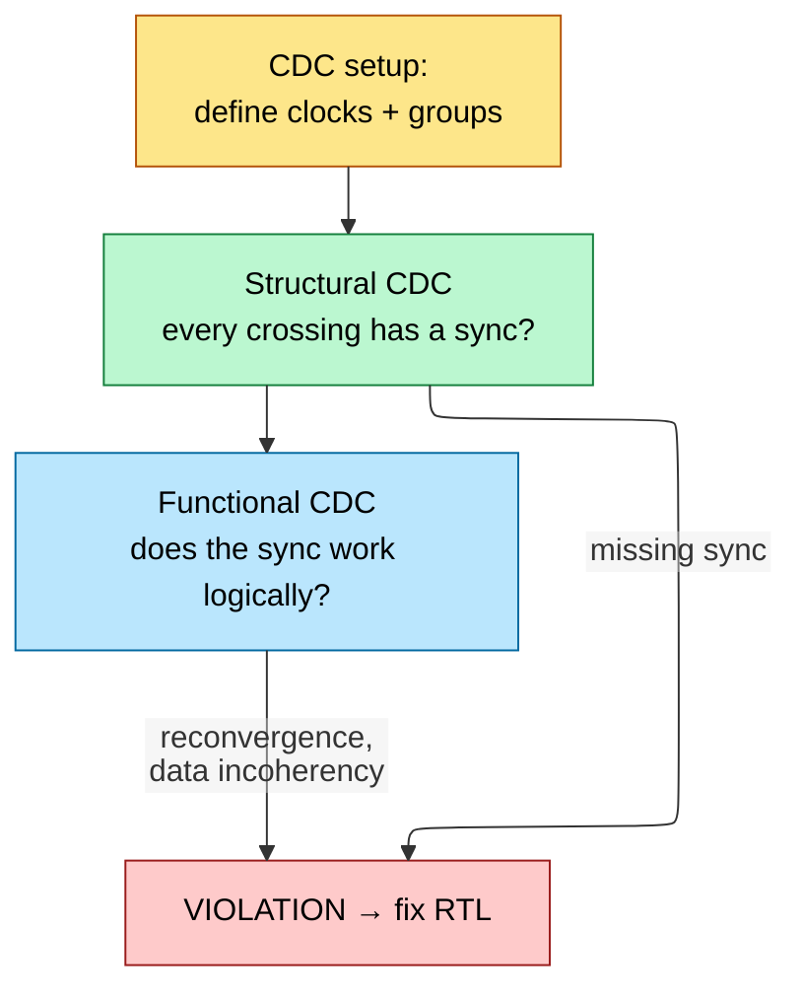
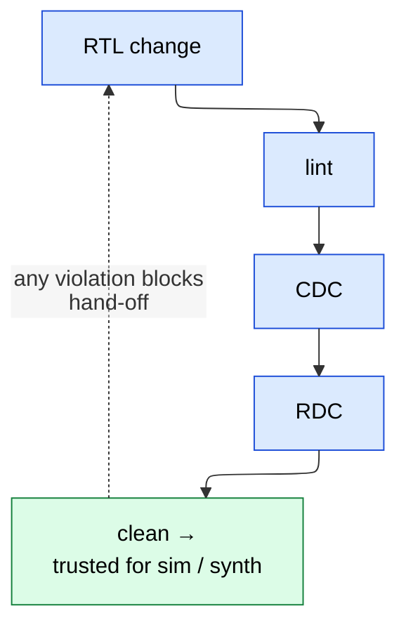

# Lint, CDC, and RDC Signoff — Static Frontend Checks

> **Stage:** 03 · Verification. The **static** (no-simulation) gate that RTL must pass before it's trusted: structural lint, clock-domain-crossing (CDC), and reset-domain-crossing (RDC) signoff.
> **Prerequisites:** [RTL_Design_Methodology](01_RTL_Design_Methodology.md), [Async_Design_and_CDC](06_Async_Design_and_CDC.md) (the CDC *physics*). **Hands off to:** dynamic verification ([UVM_Methodology](10_UVM_Methodology.md), [Gate_Level_Sim_and_Emulation](13_Gate_Level_Sim_and_Emulation.md)).

---

## 0. Why this page exists

Some classes of bug are invisible to simulation. A two-flop synchronizer that's missing on one of 400 CDC paths will pass every RTL test (RTL sim treats the crossing as a clean wire) and then fail intermittently in silicon as metastability — the worst kind of bug to debug. **Static signoff** finds these by analyzing structure, not behavior: lint catches synthesizability/style defects, CDC verifies every clock crossing is synchronized, RDC verifies every reset crossing is safe. These run before and alongside dynamic verification and are a hard gate to tape-out. [Async_Design_and_CDC](06_Async_Design_and_CDC.md) explains *why* metastability happens; this page is the *methodology* for proving you handled all of it.

---

## 1. Lint — structural cleanliness

Lint statically scans RTL for defects that compile but mean trouble. Categories:

| Class | Examples | Why it matters |
|---|---|---|
| **Synthesis** | inferred latch, incomplete sensitivity list, combinational loop, multiple drivers | builds wrong/untimeable hardware |
| **Simulation/synth mismatch** | blocking-assign in seq logic, `casex` with don't-cares | sim ≠ silicon |
| **Connectivity** | unconnected port, width mismatch, undriven/floating net | silent functional bug |
| **Reset/init** | un-reset state flop used before write, X-propagation source | unknown power-up state |
| **Style/maintainability** | naming, magic numbers, deep nesting | review/reuse cost |

Real flows run a **curated ruleset** (e.g., a subset of Spyglass/AscentLint rules) — running *all* rules drowns you in noise. The goal is **lint-clean with a reviewed waiver list**: every violation either fixed or explicitly waived with justification. "Lint-clean" is part of the [RTL hand-off contract](01_RTL_Design_Methodology.md#6-the-frontend-quality-gates-what-done-means-before-hand-off).

---

## 2. CDC — clock-domain-crossing signoff

A CDC exists wherever a signal launched by one clock is captured by an asynchronously-related clock. Each one risks **metastability** (capture flop sampled mid-transition) and, for buses, **data incoherency** (bits cross on different cycles).

### 2.1 The required structures (what CDC checks for)

| Crossing type | Correct structure | What CDC verifies |
|---|---|---|
| Single control bit | **2-FF synchronizer** | a synchronizer exists on the path, no combinational logic between crossing flops |
| Multi-bit bus | **Gray-code** (counters) or **handshake/MCP** or **async FIFO** | bus bits are *not* independently 2-FF'd (that's the classic bug) |
| Slow→fast pulse | pulse stretched/handshaked | pulse can't be missed |
| Fast→slow pulse | handshake or toggle-sync | pulse isn't dropped |

### 2.2 The two halves of CDC signoff

- **Structural CDC** — does every crossing have a recognized synchronizer? Catches the missing-sync and "combinational logic between synchronizer flops" bugs. Pure topology.
- **Functional CDC** — even with synchronizers present, is the *protocol* correct? Catches **reconvergence** (two synchronized signals that recombine and glitch because they settled on different cycles), **data incoherency** (multi-bit bus not gray/handshake-protected), and missing enable-gating. Often needs assertions + formal.

CDC signoff produces a report classifying every crossing as *synchronized / waived / violation*, and **zero unwaived violations** is the gate. Waivers (e.g., a quasi-static config bit that never changes during operation) must be justified.

---

## 3. RDC — reset-domain-crossing signoff

The under-appreciated sibling of CDC. An RDC exists when a flop reset by **reset A** drives a flop reset by **reset B**, and the two resets can assert independently. The hazard: when reset A asserts, its flop's output changes *asynchronously* (mid-cycle); if the destination (not in reset) captures that transition, it can go **metastable** — exactly the CDC failure mode, but triggered by reset assertion instead of a clock crossing.

- RDC matters in designs with **multiple, independently-asserted reset domains** — power-gated blocks ([UPF_Power_Intent](../02_Power_and_Low_Power/04_UPF_Power_Intent.md)), partial resets, functional-safety islands.
- The fix is the same family: isolate the crossing (isolation cell / reset-aware synchronizer), or sequence the resets so the destination is also in reset when the source resets.
- Static RDC tools enumerate every reset-domain crossing and check for protection — analogous to CDC, and increasingly a separate signoff in low-power SoCs.

---

## 4. Where static signoff sits in the flow

Static checks are **shift-left**: they run on RTL, before/alongside simulation, and re-run on every change.

This is cheaper than finding the same bug in [gate-level sim](13_Gate_Level_Sim_and_Emulation.md), far cheaper than in [bring-up](../07_Manufacturing_and_Bringup/03_Tapeout_and_Post_Silicon_Bringup.md), and effectively un-findable in plain RTL simulation.

---

## 5. Numbers / facts to memorize

| Fact | Value/why |
|---|---|
| Synchronizer depth | 2 FF typical (3 for high-freq/high-reliability) — raises MTBF ([Async](06_Async_Design_and_CDC.md)) |
| Multi-bit CDC | gray-code, handshake/MCP, or async FIFO — **never** parallel 2-FF |
| #1 structural CDC bug | combinational logic between the two synchronizer flops |
| #1 functional CDC bug | reconvergence of independently-synchronized signals |
| RDC trigger | independent reset assertion, not clock |
| Signoff gate | **zero unwaived** lint/CDC/RDC violations |
| Why not sim? | RTL sim models a crossing as a clean wire — metastability is invisible |

---

## Cross-references
- CDC physics & synchronizer/FIFO design: [Async_Design_and_CDC](06_Async_Design_and_CDC.md).
- Produced by: [RTL_Design_Methodology](01_RTL_Design_Methodology.md). Complements: [Formal_Verification](12_Formal_Verification.md) (formal CDC), [Verification_Planning_and_Coverage_Closure](11_Verification_Planning_and_Coverage_Closure.md).
- Low-power reset/isolation: [UPF_Power_Intent](../02_Power_and_Low_Power/04_UPF_Power_Intent.md).
