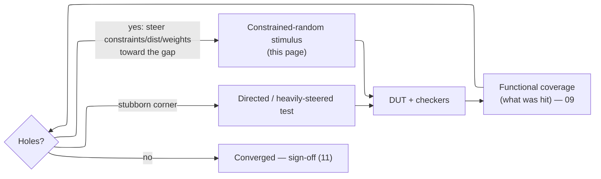

# OOP and Constrained Randomization — Machine-Generating Stimulus for an Unenumerable State Space

> **Stage:** 03 · Verification. Two answers to one pressure — a modern design's input state space is astronomically larger than any hand-written test suite can enumerate: **constrained-random** stimulus to machine-sample the *legal* subspace, and **object orientation** to build the layered, reusable, randomizable testbench that generates it. This is not a language tour: every feature below is derived from the reuse/extensibility or state-space-coverage need it answers.
> **Prerequisites:** [Data_Types_and_Basics](02_Data_Types_and_Basics.md) (class types, dynamic arrays, queues), [Procedural_Processes_and_IPC](03_Procedural_Processes_and_IPC.md) (the processes and fork/join the generator–driver pipeline runs on). **Hands off to:** [Assertions_and_Coverage](09_Assertions_and_Coverage.md) (functional coverage — the measurement half of the loop), [UVM_Methodology](10_UVM_Methodology.md) (the full methodology these primitives are built into), [Verification_Planning_and_Coverage_Closure](11_Verification_Planning_and_Coverage_Closure.md) (coverage closure).

---

## 0. Why this page exists

A modern block has more reachable behaviors than anyone can list. The input-plus-state space is exponential in bits, so the interesting scenarios live at deep cross-products of conditions no engineer can enumerate by hand — and the bugs live in exactly the interactions nobody thought to write a test for. Two ideas answer that single pressure, and this page derives both from it rather than cataloguing SystemVerilog syntax:

- **Constrained randomization** — let the machine *sample* the space instead of a human *enumerating* it. Constraints declare the legal subset as a set of relations; a solver draws legal-but-diverse points from it; reach then grows with *compute*, not with engineer-hours.
- **Object orientation** — a testbench is long-lived, shared across derivatives, and must be *extended* (new protocol, error injection, new test) without rewriting what already works. Encapsulation, inheritance, polymorphism, and the factory are the exact tools for "extend without editing the base," and each is derived here from that reuse need.

The two meet in the **coverage-driven loop** (§5): random stimulus reaches, functional coverage measures what was reached, and the constraints are the steering wheel between them. By the end you should be able to argue *why* random beats directed asymptotically, see the constraint solver as a sampler over a solution set, and reason about where each OOP abstraction earns its complexity — not recite which method disables which knob.

---

## 1. The state-space problem: why directed tests lose asymptotically

### 1.1 The counting argument

Treat a block's behavior as a walk through its state space. If $b$ bits of design-plus-input state matter, the reachable space has up to

$$
|S| \;\le\; 2^{b}
$$

Even a small block — a few 32-bit registers and a control word — reaches $b \sim 100\text{–}200$, so $|S|$ is $10^{30}\text{–}10^{60}$. A long regression runs perhaps $N_{cyc} \sim 10^{9}\text{–}10^{12}$ cycles, so the fraction of states you can *possibly* visit,

$$
\frac{N_{cyc}}{|S|} \;\approx\; 0
$$

is effectively zero no matter how long you run. Covering the *raw* state space is hopeless, so verification never targets it: it targets a much smaller, hand-built set of **interesting behaviors** — the functional-coverage model of §5 — and asks stimulus to *reach* those. The problem shifts from "visit every state" (impossible) to "reach every interesting behavior" (hard, because those behaviors sit at cross-products a human cannot list).

### 1.2 Directed vs constrained-random: reach grows with effort, or with compute

Model a methodology by the set of interesting behaviors it reaches.

- **Directed.** An engineer writes one scenario per test, so reach $R_d = k\,E$ is linear in engineer-effort $E$ (tests written), $k = O(1)$. Every new corner costs human time.
- **Constrained-random.** One generator, many machine-drawn points. After $n$ independent draws, a reachable behavior $i$ with per-draw probability $p_i > 0$ is still unhit with probability

$$
\Pr[\text{behavior } i \text{ unhit after } n] \;=\; (1-p_i)^{n} \;\approx\; e^{-n\,p_i}
$$

so the expected draws to hit it is $1/p_i$ (geometric), and total reach after $n$ draws covers every behavior with $p_i \gtrsim 1/n$. Crucially reach grows with $n$ — with **compute** — at *fixed* human effort: you write the generator once and buy coverage with machine time.

| Axis | Directed | Constrained-random | Coverage-driven (CR + §5) |
|---|---|---|---|
| Effort per corner | high (one test each) | ~zero (machine draws) | low bulk + targeted tail |
| Reach ceiling | engineer's imagination (§1.3) | any legal behavior with $p_i>0$ | legal space, steered to holes |
| Debuggability | high (test names the intent) | needs **seed replay** (§6) | same, plus coverage names the gap |
| Determinism | inherent | per-seed (§6) | per-seed |
| Best when | a *specific* corner, a smoke test | large legal space, unknown interactions | sign-off closure |

### 1.3 Why random wins asymptotically — the imagination bound

Directed tests can only cover behaviors the engineer *conceived*. Let the interesting set be $B$ and let a fraction $\theta < 1$ be imagined; directed coverage saturates at $\theta\,|B|$, and the escaped bugs live in the $(1-\theta)\,|B|$ nobody enumerated — the unanticipated interactions. Random stimulus draws from the whole legal space, reaching any behavior with $p_i > 0$ *whether or not anyone imagined it*:

$$
\lim_{n\to\infty} \text{Cov}_{CR}(n) \;=\; |B_{\text{reachable}}| \;\;>\;\; \theta\,|B| \;=\; \lim_{E\to\infty} \text{Cov}_{directed}(E)
$$

So random wins asymptotically not because it is smarter per test — it is *dumber* — but because its reach is bounded by **compute and $\min_i p_i$**, not by human foresight. The crossover comes almost immediately for any nontrivial cross, because a human cannot enumerate a cross-product faster than a solver can sample it. That asymmetry — machine reach vs human reach — is the entire justification for the rest of this page.

---

## 2. Constrained randomization: sampling the legal subspace

Raw randomness is almost never *legal*. A uniformly random 32-bit "AXI control word" violates alignment, hits reserved encodings, and breaks burst rules — the legal subset is a vanishing fraction of $2^{32}$. Illegal stimulus is worse than useless: it either trips the checker on inputs the spec forbids (false failures that burn debug time) or is silently dropped by the DUT (a wasted cycle). So the draw must be *confined to the legal region*.

A **constraint** is a relation the draw must satisfy. The set of constraints defines a region of the variable space, and `randomize()` returns a point sampled from it:

$$
\mathcal{S} \;=\; \Big\{\, x \in \textstyle\prod_v \text{dom}(v) \;:\; \bigwedge_j c_j(x) \,\Big\}
$$

where $x$ = the vector of `rand`/`randc` variables, $\text{dom}(v)$ = each variable's declared range, and $c_j$ = the $j$-th constraint. `randomize()` returns 1 and writes a point $x \in \mathcal{S}$, or returns **0** when $\mathcal{S} = \emptyset$ — *always check the return*, because an unchecked failure silently leaves the object un-randomized. This is the inverse of directed testing: there you state the *points*; here you state what *legal* means and let the solver find points.

```verilog
class packet;
  rand  bit [7:0]  addr;
  rand  bit [3:0]  len;
  rand  bit        is_write;

  constraint legal {
    addr inside {[8'h00:8'h3F], [8'hC0:8'hFF]};   // legal address windows
    len  inside {[1:8]};                          // 1..8 beats
    is_write -> addr[1:0] == 2'b00;               // writes are word-aligned
  }
endclass
// if (!p.randomize()) fatal("no legal solution");  <-- never skip this
```

### 2.1 The controls are levers on the *distribution*, not on legality

Legality is one question (is $x \in \mathcal{S}$); *which* $x \in \mathcal{S}$ you get is another. Most randomization controls exist for the second — they move probability mass around inside $\mathcal{S}$:

- **`rand` vs `randc`** — a memoryless draw vs a draw *without replacement* (a fresh permutation of the domain, every value once per cycle). §2.2.
- **`dist` weighting** — bias toward corners: `val := w` gives weight $w$ to a value; `val :/ w` splits $w$ across a range.
- **`soft` constraints** — defaults that *yield* to any hard or inline constraint that contradicts them. Precedence: **hard > inline `with` > soft**, and a later soft overrides an earlier one.
- **inline `randomize() with {…}`** — per-call constraints a test adds *without editing the class*, the everyday extensibility hook.
- **`solve a before b`** — orders the variables the solver picks, which reshapes the marginal distribution (§3) without changing $\mathcal{S}$.
- **`rand_mode()` / `constraint_mode()`** — turn a variable's randomization or a whole constraint on/off at run time; **`pre_randomize`/`post_randomize`** hook the solve to set up state before and derive fields (checksums, sequence numbers) after.

```verilog
constraint c_addr { soft addr inside {[0:63]}; }         // default: low window
// ...a specific test overrides the default without touching the class:
if (!txn.randomize() with { addr inside {[200:255]}; })  // hard beats soft
  $fatal(1, "randomize failed");
// addr now in [200:255]; any *un*-overridden soft defaults still hold.
```

### 2.2 rand vs randc: the cost of "no repeats"

`rand` is memoryless, so seeing *every* value of a $w$-bit field ($R = 2^{w}$ values) takes, by coupon-collector (§5), about $R\ln R$ draws, and any particular value may be missed for a long time ($\Pr[\text{miss in } n] = (1-1/R)^{n}$). `randc` guarantees each value exactly once per $R$ draws — a full sweep, zero repeats — which is what you want for arbiter channels, decode selects, and small opcode fields. The price is memory: `randc` must *remember* which values it has already emitted this cycle, so it carries

$$
\text{state}\big(\texttt{randc bit}[w]\big) \;=\; \Theta(2^{w})
$$

`randc bit[7:0]` is 256 states (fine); `randc bit[31:0]` is $4\times10^{9}$ states (impossible). `randc` is therefore a *small-field* tool, roughly $w \lesssim 8\text{–}16$ bits; wide fields use `rand` plus a `dist` or coverage feedback to get spread without the bookkeeping.

---

## 3. The constraint solver as a theoretical object

Constraint satisfaction is the right frame: find $x$ with $\bigwedge_j c_j(x)$. Boolean constraint satisfaction (SAT) is **NP-complete**, so worst-case solve time is exponential in the number of *interacting* variables. Production solvers take one of two routes:

- **BDD-based** — build a decision diagram representing the *whole* solution set, then sample from it. Exact and naturally uniform, but memory blows up on complex sets.
- **SAT/SMT-based** — search for satisfying assignments. Scales to large problems, but needs extra machinery to sample *fairly* rather than returning the same corner repeatedly.

### 3.1 The marginal law — why distribution shaping exists

Ideal uniform sampling over $\mathcal{S}$ gives each variable a marginal proportional to its number of legal *completions*:

$$
\Pr[x_v = k] \;=\; \frac{\big|\{\,x \in \mathcal{S} : x_v = k\,\}\big|}{|\mathcal{S}|}
$$

A value that participates in few legal completions is drawn rarely *by construction* — even if it is the most bug-prone corner. This is the deep reason `dist`, weighting, and `solve…before` exist: they override the solver's combinatorial bias and move mass to where verification value lives. Concretely, `solve a before b` makes the solver choose $a$ uniformly *first* and only then draw $b \mid a$, so $a$'s marginal becomes uniform instead of completion-weighted. Example: if $a{=}1$ admits 56 legal values of $b$ and $a{=}0$ admits only 10, plain solving draws $a{=}1$ about $56/66 \approx 85\%$ of the time; `solve a before b` restores 50/50. It changes the *distribution*, never the legal set.

### 3.2 Solver-friendly constraints

Some relations explode the search and can make a regression **solver-bound rather than DUT-bound**, because the solver runs on *every* `randomize()` call:

- **multiply / divide / modulo** (`a*b == c`) couple all bits nonlinearly — very hard;
- **large `unique{}`** over $k$ variables — up to $k!$ orderings to consider;
- **`size` + per-element** constraints on big arrays — the solver reasons about every element jointly.

Friendly rewrites keep each call cheap: range the operands, `solve` the pivot variable first to linearize a chain, replace a *computed* constraint with a precomputed legal-value set, or partition one huge `randomize` into staged ones.

### 3.3 The central correctness knob: over- vs under-constraining

The size of $\mathcal{S}$ relative to the true legal space is where constrained-random goes wrong:

- **Over-constrain** ($\mathcal{S}$ smaller than legal) → legal-but-interesting stimulus is never generated → bugs missed, coverage silently plateaus, and in the limit $\mathcal{S} = \emptyset$ so `randomize()` fails.
- **Under-constrain** ($\mathcal{S}$ larger than legal) → the DUT sees spec-illegal inputs → false failures that waste debug, or checker confusion that *masks* real bugs.

The target is $\mathcal{S} =$ exactly the legal space. The constraint set is therefore a *model of legality* to be reviewed with the same care as the checker — not boilerplate. Getting it wrong fails quietly in one direction (missed coverage) and loudly in the other (false fails).

---

## 4. Why OOP for the testbench: reuse and extensibility under change

A testbench is not throwaway code. It outlives the project, is shared across derivatives and teams, and must be *extended* — a new protocol variant, error injection, a new test — without rewriting the parts that already work. That is a software-engineering problem, and each OOP feature below is derived from "extend without editing the base," not presented as language trivia.

### 4.1 Objects and handles: the transaction data model

Stimulus and observed traffic are modeled as **transactions** — dynamic objects created and destroyed per item, handed *by reference* along a pipeline (generator → driver → DUT → monitor → scoreboard). That per-item lifetime is why they are class objects (dynamically allocated, garbage-collected) rather than static module signals, and why they travel as **handles**, not copies. The hazard to internalize: a handle is a reference, so `p2 = p1` aliases *one* object — two names, one memory.

```verilog
Packet p1 = new(1);
Packet p2 = p1;      // alias: p2 and p1 are the SAME object
p2.id = 99;          // p1.id is now 99 too
```

Because a scoreboard must keep an *independent* snapshot to compare later, copying matters — and forces a choice. A **shallow copy** duplicates the top object but *shares* its sub-object handles (e.g. a payload array), so mutating the copy corrupts the original; a **deep copy** recursively clones the sub-objects. This is a *data-model* decision (reference vs value semantics), not a language quirk — the reason UVM standardizes `copy`/`clone` at all.

### 4.2 Inheritance + polymorphism: specialize without touching the base

Build the transaction (or component) once as a base; a variant *extends* it — adds an error field, overrides a compare — without re-touching the proven base. That is reuse by extension. But it only pays if the environment, written against the *base* type, actually runs the *derived* behavior at run time. That requires dynamic dispatch: a **`virtual`** method resolves by the **object's** real type, not the **handle's** declared type.

```verilog
Animal a = Dog::new();     // base handle, derived object
a.speak_static();          // NON-virtual → handle type → base version (WRONG)
a.speak_virtual();         // virtual     → object type → Dog version  (RIGHT)
```

This is the load-bearing mechanic of the whole methodology: the environment holds `base_txn` / `base_driver` handles but must invoke `error_txn::compare` / `my_driver::drive`. Forget `virtual` and dispatch falls back to the handle type — the base version runs and the specialization is *silently ignored*, one of the most common testbench bugs.

### 4.3 The factory: making construction itself overridable

Polymorphism routes *calls* to the right override, but *someone* still has to `new` the right type — and that `new` lives *inside* the reusable component you must not edit. A driver hard-coding `txn = new()` always builds a `base_txn`; to inject an `error_txn` you would have to modify VIP source, exactly what reuse forbids. The **factory** breaks this: components construct through a registry, and a test *registers an override* from the outside.

```verilog
// inside the reusable driver — never edited:
txn = base_txn::type_id::create("txn");        // ask the factory, don't 'new'
// inside the test — freely edited:
base_txn::type_id::set_type_override(error_txn::get_type());  // now create() yields error_txn
```

So the last mile of extensibility — object *creation* — becomes configurable without touching the environment. That single indirection is why UVM is factory-centric (see [UVM_Methodology](10_UVM_Methodology.md)).

### 4.4 Trade-off: abstraction vs simplicity

The layering is not free. Indirection makes control flow harder to follow; factory-created types resolve at run time (a whole class of "why did I get the base type?" bugs); a newcomer pays a real ramp cost; parameterized/abstract base classes multiply the surface to learn. The judgment is about the **reuse horizon**:

- Heavy OOP + factory **pays** when the testbench is reused — many derivatives, many tests, a shared VIP with a stable base and swappable specializations. This is the UVM case, and the indirection is what lets a test change behavior without a VIP edit.
- The same machinery is **overhead** for a one-off 200-line block test that will never be extended; a flat, lightly-randomized testbench is the correct, cheaper choice.

Match the abstraction to how many times the code will be reused and re-specialized — not to methodology fashion.

---

## 5. The coverage-driven loop: closing the feedback

Random stimulus *reaches*, but a run that reaches a corner tells you nothing unless you *measure* that it did. **Functional coverage** is that measurement: a hand-built model of interesting scenarios — values, ranges, transitions, and (where the bugs hide) *crosses* of conditions — sampled during simulation. Randomization and coverage are the two halves of one method, and the constraints are the steering wheel between them:



This page owns only the *generate* half. The coverage-model mechanics (covergroups, coverpoints, bins, crosses) live in [Assertions_and_Coverage](09_Assertions_and_Coverage.md); the closure *methodology* (vplan → model → regress → triage → sign-off) lives in [Verification_Planning_and_Coverage_Closure](11_Verification_Planning_and_Coverage_Closure.md). Cross-link, don't duplicate.

### 5.1 Coupon-collector: why the tail dominates closure

Suppose the model has $C$ coverage bins and pure-random stimulus hits each with equal probability $1/C$ per draw. Expected draws to fill *all* $C$ is the coupon-collector number:

$$
E[n] \;=\; C\,H_C \;\approx\; C(\ln C + \gamma), \qquad \gamma \approx 0.577
$$

where $H_C = \sum_{i=1}^{C} 1/i$ is the $C$-th harmonic number. The sting is the *tail*: when one bin remains, each draw hits it with probability $1/C$, so the *last* bin alone costs $C$ draws on average — the familiar "90% of coverage in a day, the last 10% in a month" curve. Real bins are not equiprobable, and then the **rarest** bin dominates:

$$
E[n] \;\gtrsim\; \frac{1}{p_{\min}}
$$

and $p_{\min}$ for a deep cross of low-probability conditions is a *product* of small numbers — exponentially small. This is exactly why pure random asymptotes short of 100%, and why closure switches to **steering** (weight / `dist` / `solve` toward the hole) and finally to **directed** tests for the last handful of bins: you stop paying $1/p_{\min}$ per hole and pay $O(1)$ by *constructing* it. The coverage-driven method is the discipline of spending cheap random draws on the bulk and scarce human effort only on the tail they cannot reach.

---

## 6. Reproducibility: what makes constrained-random debuggable

Constrained-random has one apparent weakness — a failure surfaces on a *random* draw — and determinism answers it. From a single **root seed**, the tool's hierarchical seeding makes every draw reproducible, so a failing regression is replayed bit-exact by re-running its seed. Two SystemVerilog guarantees keep this stable under everyday code churn:

- **Thread stability** — each process (`initial`, `always`, each `fork` branch) has its own RNG, so adding or removing code in one thread does not shift another thread's sequence.
- **Object / type stability** — each object and each class type draws from independent RNG state, so creating more objects of one class does not perturb another's sequence.

Reproducibility is what makes constrained-random *debuggable at all* — it is the answer to the debuggability column of the §1 trade-off, and the reason "save the seed" is the first rule of any random regression. (`get_randstate`/`set_randstate` and per-object `srandom` give finer control when you need to replay a single object.)

---

## Numbers to memorize

| Fact | Rule / value | Why (section) |
|---|---|---|
| `randomize()` failure | returns **0**; unchecked = silent no-randomization | §2 |
| Solve complexity | constraint satisfaction is **NP-complete** (worst case exponential) | §3 |
| `dist` weights | `:=` weight *per value*; `:/` weight *split across a range* | §2.1 |
| Constraint precedence | **hard > inline `with` > soft**; later soft overrides earlier soft | §2.1 |
| `randc` cost | $\Theta(2^{w})$ state → practical only for $w \lesssim 8\text{–}16$ bits | §2.2 |
| `rand` full sweep | coupon-collector $\approx R\ln R$ draws to see all $R=2^w$ values | §2.2 |
| Marginal law | uniform-over-solutions ⇒ $\Pr[v{=}k] \propto$ #completions; `solve…before` re-shapes it | §3.1 |
| Solver blowup | multiply/mod, large `unique` ($k!$), `size`+element on big arrays | §3.2 |
| Constraint sizing | over-constrain ⇒ miss bugs; under-constrain ⇒ illegal stimulus | §3.3 |
| `virtual` dispatch | virtual = object type (correct override); non-virtual = handle type (base runs) | §4.2 |
| Factory | `type_id::create()` + `set_type_override` ⇒ swap types without editing VIP | §4.3 |
| Coverage closure | coupon-collector $C\ln C$; rarest bin $\sim 1/p_{\min}$ dominates the tail | §5.1 |
| Reproducibility | one root seed ⇒ deterministic replay; thread + type stability | §6 |
| `pre/post_randomize` | hooks around the solve: set state before, derive fields (checksums) after | §2.1 |

---

## Cross-references

- **Down the stack (what this is built from):** [Data_Types_and_Basics](02_Data_Types_and_Basics.md) (class types, dynamic arrays and queues the transaction model uses), [Procedural_Processes_and_IPC](03_Procedural_Processes_and_IPC.md) (the processes and fork/join the generator–driver pipeline runs on).
- **Up the stack (what builds on it):** [UVM_Methodology](10_UVM_Methodology.md) (the factory, phasing, and sequences built on these primitives — the "factory = polymorphism + registry" of §4.3), [Assertions_and_Coverage](09_Assertions_and_Coverage.md) (functional coverage — the measurement half of the §5 loop), [Verification_Planning_and_Coverage_Closure](11_Verification_Planning_and_Coverage_Closure.md) (the closure methodology that drives constraints toward holes).
- **Adjacent:** [RTL_Design_Methodology](01_RTL_Design_Methodology.md) (the design this stimulus exercises), [Formal_Verification](12_Formal_Verification.md) (the complement — formal *proves* over the whole legal space where constrained-random only *samples* it, and takes over exactly where §5.1's rare-bin tail defeats sampling).

---

## References

1. IEEE Std 1800-2023, *IEEE Standard for SystemVerilog — Unified Hardware Design, Specification, and Verification Language*. Clause 18 (constrained random) and Clause 8 (classes).
2. Spear, C. and Tumbush, G., *SystemVerilog for Verification*, 3rd ed., Springer, 2012. Classes, randomization, and the coverage-driven flow.
3. Yuan, J., Pixley, C., and Aziz, A., *Constraint-Based Verification*, Springer, 2006. The constraint-solving view of stimulus generation.
4. Kitchen, N. and Kuehlmann, A., "Stimulus generation for constrained random simulation," *ICCAD*, 2007. Uniform sampling of a constraint solution set (§3.1).
5. Piziali, A., *Functional Verification Coverage Measurement and Analysis*, Springer, 2004. Coverage models and closure (§5).
6. Accellera / IEEE Std 1800.2-2020, *Universal Verification Methodology (UVM)*. The methodology built on the OOP and randomization primitives of this page.
