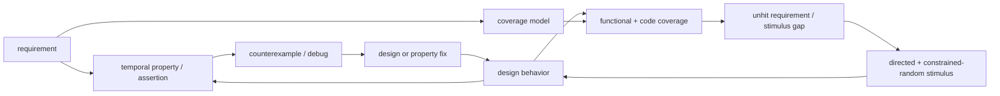

# SystemVerilog Assertions and Coverage — Observability and Completeness



> **Prerequisites:** [Data_Types_and_Basics](02_Data_Types_and_Basics.md) and [Procedural_Processes_and_IPC](03_Procedural_Processes_and_IPC.md) (the language, the 4-state `x`, and the event scheduler these mechanisms sample), [OOP_and_Randomization](08_OOP_and_Randomization.md) (the constrained-random stimulus that fills functional coverage).
> **Hands off to:** [UVM_Methodology](10_UVM_Methodology.md) (the testbench that orchestrates checkers and collectors), [Verification_Planning_and_Coverage_Closure](11_Verification_Planning_and_Coverage_Closure.md) (the closure loop that consumes coverage), [Formal_Verification](12_Formal_Verification.md) (where an assertion becomes a proof target instead of a monitor).

---

## 0. Why this page exists

A directed test that passes tells you almost nothing. It says *one* stimulus produced *no error you happened to be watching for* — and both halves of that sentence are blind spots. This page is about the two mechanisms that close them, and it treats them as duals, not as a list of syntax:

- **A bug's effect appears far from its cause — in time and in space.** A control FSM takes a wrong branch at cycle 4,000; the symptom is a corrupted packet at an output port 3,000 cycles later, if it surfaces at all. Watching outputs, you see the wreck, not the collision. **Assertions** embed the design's intent as always-on temporal checks that fire *at the cycle and the signal of the violation*, collapsing debug from a backward trace over thousands of cycles to a single named event. This is an **observability** problem, and assertions are observation points placed where bugs are born.

- **Passing tests say nothing about what you did *not* exercise.** A green regression is silent about the FIFO-full-during-reset corner you never hit. **Coverage** measures which behaviors the stimulus actually reached, converting "the tests pass" into the far stronger "we know what we tested." This is a **completeness** problem, and coverage is the map of where the stimulus has and has not been.

Everything below is derived from those two purposes. The old version of this page was a signal-and-operator reference — every repetition operator, every `$past` gating form, three full protocol-checker modules, a 170-line AXI4 dump. That content is *lookup*, not understanding; the operator table belongs in the LRM, and the mechanical closure loop belongs in [Verification_Planning](11_Verification_Planning_and_Coverage_Closure.md). Here we build the concepts a senior engineer reasons *with*: why an assertion localizes a bug, why it is simultaneously a spec and a formal target, why 100% code coverage is necessary but not sufficient, and why coverage closure is a coupon-collector problem that random simulation cannot finish on its own.

---

## 1. The two blind spots: observability and completeness

Verification asks two independent questions about a design under test (DUT), and they do not answer each other:

1. **When it ran, was it correct?** — the *checking* question. Answered by assertions, scoreboards, and reference models.
2. **Did it run enough?** — the *completeness* question. Answered by coverage.

You need both because they fail in opposite directions. A testbench with perfect checkers but thin stimulus is *correct on a tiny corner* — it never lies, but it barely looked. A testbench with exhaustive stimulus but no checkers *looked everywhere and saw nothing* — it exercises the whole design and verifies none of it. Real confidence is the intersection: broad stimulus (high coverage) run against always-on checks (assertions). This page's two halves are those two axes.

### 1.1 Detection = controllability × observability

The theoretical spine, borrowed from test/ATPG, is that catching a bug requires two things at once:

- **Controllability** — the stimulus must *activate* the bug (drive the DUT into the state where the fault manifests). This is what coverage measures and constrained-random ([08](08_OOP_and_Randomization.md)) tries to maximize.
- **Observability** — the activated fault's effect must *propagate to a point you are checking*. Primary outputs are few, far, and lossy; an effect can be masked (overwritten, `AND`ed with 0, dropped by a full FIFO) before it ever reaches one.

$$
\text{detected} \;=\; \text{activated} \;\wedge\; \text{propagated-to-a-checked-point}
$$

Output-only checking maximizes the *distance* the effect must survive. Model a corruption born at internal node $n$ at cycle $t_0$; suppose its effect needs $\Delta$ cycles and passage through a logic cone of $F$ nodes to reach an observed output. Output checking detects it — *if it survives masking at all* — at $t_0+\Delta$, and diagnosis is a backward trace over that $\Delta\times F$ cone. An assertion on $n$'s invariant is an observation point *at the birthplace*: it fires at $t_0$, at $n$, naming the violated rule.

$$
\text{debug effort:}\quad \underbrace{O(\Delta \cdot F)}_{\text{output trace}} \;\longrightarrow\; \underbrace{O(1)}_{\text{assertion}}
$$

That is the whole value proposition of assertion-based verification in one line: **assertions raise observability**, turning bugs that were activated-but-not-propagated (invisible to output checking) into immediate, localized failures.

---

## 2. Assertions as executable intent

### 2.1 What an assertion fundamentally is

An assertion is a **machine-checkable statement of a design invariant that is always on**. Not a print, not a test case — a fragment of the specification, written in a form the simulator (or a formal tool) evaluates every place it is bound and every cycle it is active. "One-hot grant," "a full FIFO is never written," "every `req` is answered within 10 cycles" are sentences in English and assertions in SVA; the assertion is the version that *runs*.

Because it is always on, an assertion is checked under *every* stimulus the regression happens to drive — not just the scenario whose author was thinking about it. A one-hot check written for the arbiter test also fires during the DMA test, the reset test, and the random soak. This is why assertions are written *at* the design (bound near the RTL) rather than *in* individual tests: intent stated once, checked everywhere.

### 2.2 Immediate vs concurrent — two evaluation models

There are exactly two kinds, and the split is *when the check is evaluated*:

| | Immediate | Concurrent |
|---|---|---|
| Nature | procedural statement, like a software `assert()` | a **temporal property** over a clock |
| Evaluates | *now*, when control reaches it | every clock edge, across cycles |
| Sees | current simulation values (glitch-prone in combinational code) | **sampled** values (stable, race-free) |
| Expresses | "this condition holds at this instant" | "this pattern holds *over time*" |
| Typical use | argument/state sanity inside a process | protocol, handshake, latency, sequencing |

Immediate assertions answer a point-in-time question and are subject to the same delta-cycle glitches as any combinational read — which is why the *deferred* forms (`assert #0`, `assert final`) exist: they postpone the check until values have settled, so a transient mid-cycle value cannot raise a false failure. Keep that as the one rule worth memorizing about immediate assertions; everything interesting lives in the concurrent form.

The concurrent form needs a race-free notion of "the value." SystemVerilog resolves the race between *the checker reading a signal* and *the RTL updating it* by defining that a concurrent assertion evaluates on **sampled** values — the value as of just before the clock edge (the Preponed region), not the value being computed at the edge. So an assertion always sees the pre-edge, stable image of the design, and can never race the assignment it is checking:

```systemverilog
// Sees data's value from BEFORE this edge's non-blocking update — deterministic.
property p_hold; @(posedge clk) (valid && !ready) |-> ##1 (data == $past(data)); endproperty
```

That is the entire reason "sampled values / preponed region" exists; the region-by-region scheduler walk in the old page was mechanism without motive.

### 2.3 The temporal property: antecedent implies consequent, across time

Almost every useful concurrent assertion has one shape:

$$
@(\text{clk})\quad \underbrace{\text{antecedent}}_{\text{when this pattern occurs}} \;\; |\!\!\rightarrow \;\; \underbrace{\text{consequent}}_{\text{this must follow}}
$$

Two ideas compose to fill it:

- **Sequences** describe a *pattern over cycles*: "`req` now, then within 1–5 cycles `ack`." The temporal glue is delay (`##N`, `##[M:N]`) and repetition (a signal held or recurring for several cycles). You do not need the operator zoo to reason about assertions — you need the intuition that a sequence is a *timed pattern*, matched against the waveform as time advances.
- **Implication** (`|->` overlapping, `|=>` next-cycle) turns a pattern into a *conditional obligation*: "**whenever** the antecedent matches, the consequent is **required** to follow." `|=>` is just `|-> ##1`. The antecedent is a trigger; the consequent is the promise.

```systemverilog
// "Every request is acknowledged within 1 to 5 cycles."
property p_req_ack; @(posedge clk) req |-> ##[1:5] ack; endproperty
```

This is where temporal reach comes from: the antecedent can be cycles wide, the consequent can span a window, and the single sentence constrains *behavior across time*, which no combinational check can. It is also where the localization of §1.1 becomes concrete — if `ack` is missing, the assertion fails at the deadline cycle, on the `ack` signal, in this handshake, not 3,000 cycles downstream at a starved consumer.

**Vacuity — the subtlety that couples assertions to coverage.** If the antecedent *never matches*, the implication is **vacuously true**: it passes without ever checking the consequent. An assertion guarding a case your stimulus never triggers is green and worthless, and it looks identical to one that is genuinely holding. The only defense is to *measure* that the antecedent fired — a `cover` on the trigger:

```systemverilog
cover property (@(posedge clk) req);   // if this never hits, p_req_ack is passing vacuously
```

Note what just happened: an *assertion's* trustworthiness is established by *coverage*. The two mechanisms are not separate chapters; they are two ends of one contract (§5).

### 2.4 Safety vs liveness: assertions are bounded-safety properties

Temporal logic sorts properties into two classes, and the distinction explains a practical rule that otherwise looks arbitrary:

- **Safety** — "nothing bad *ever* happens" ($G\,\neg\text{bad}$). Violated by a *finite* trace: once the bad thing occurs, a finite prefix is a complete counterexample. One-hot grant, no-overflow, valid-stable are safety.
- **Liveness** — "something good *eventually* happens" ($F\,\text{good}$). Violated only by an *infinite* trace in which the good thing never comes. "Every request is eventually granted" is liveness.

Simulation runs *finite* traces. It can therefore **falsify** a safety property (exhibit the finite bad prefix) but can never **confirm** a liveness one (it cannot run forever to prove "eventually" fails). So real, simulatable "liveness" assertions are always **bounded** — a deadline turns eventuality into safety:

$$
\underbrace{F\,\text{ack}}_{\text{true liveness, unsimulatable}} \;\;\longrightarrow\;\; \underbrace{F_{\le N}\,\text{ack}}_{\text{bounded safety, a timeout}} \;\equiv\; \text{req} \; |\!\!\rightarrow\; \text{\#\#[1:N] ack}
$$

This is *why* you write `##[1:N]` and not `##[1:$]` in a simulation assertion: the bounded window is a safety property with a finite counterexample (the deadline passes), which a finite run can catch. Unbounded liveness ($F$, `##[1:$]`) is the province of **formal** model checking ([12](12_Formal_Verification.md) §3), which reasons about all infinite behaviors symbolically rather than by running them. The choice of bound $N$ is a real design decision — too tight and legal slow paths false-fail; too loose and a genuine hang runs for $N$ cycles before the assertion notices.

### 2.5 Three lives of one assertion: spec, monitor, proof target

The same property text serves three roles, and this is the deepest reason to invest in assertions:

1. **As specification.** `full |-> !wr_en` is an unambiguous, executable statement of a rule that a prose spec would render as a sentence someone can misread. Assertions are the spec that cannot drift from the check, because they *are* the check.
2. **As a simulation monitor.** Bound to the DUT, the assertion watches every regression run and fires on violation — the observability mechanism of §1.1. Its limitation is inherited from simulation: it only checks the paths your stimulus actually drives (hence coverage, hence vacuity guards).
3. **As a formal proof target.** Handed to a model checker, the *same* assertion is proven to hold on **all** legal inputs, or a counterexample trace is produced ([12](12_Formal_Verification.md) §3). This is why assertions are called "formal-ready": no rewrite is needed to escalate a monitored property to a proved one. Simulation says "not violated in the runs I did"; formal says "cannot be violated." Control-intensive blocks (arbiters, FIFOs, protocol bridges) are routinely *closed by formal* on their assertions, retiring the coverage burden for those properties entirely.

The **bind** construct is the plumbing that makes all three practical without touching the design: it attaches an assertion module to RTL from the outside, so encrypted IP or synthesis-clean RTL gets checked without editing its source.

```systemverilog
bind fifo_rtl fifo_assertions u_chk (.*);   // checker instantiated inside every fifo_rtl, source untouched
```

---

## 3. Where assertions pay — the trade-off

Assertions are not free and not always the right tool. The cost model:

- **Authoring effort.** Every assertion is hand-written intent. Temporal properties are subtle (vacuity, off-by-one in `|->` vs `|=>`, reset gating via `disable iff`), and a subtly wrong assertion is worse than none: a false *failure* wastes debug time, and a false *pass* (an assertion that encodes the wrong intent, or is vacuous) gives unearned confidence — a green light on an unchecked road. **An assertion is only as correct as the spec it encodes.**
- **Runtime cost.** A windowed antecedent like `##[1:100]` spawns an evaluation thread per possible match; complex sequences can multiply threads. `first_match` and bounded windows are the pruning levers — concept enough; the point is that assertion density trades against simulation speed.

Against that, the payoff is bug localization (§1.1) plus formal-readiness (§2.5). The decision is *where the invariant is local, temporal, high-value, and clearly specified* — which is exactly the profile of control and interface logic:

| Assertions pay most on… | Because the invariant is… | Canonical checks |
|---|---|---|
| **Interfaces / protocols** (AXI, APB, handshakes) | a published, temporal contract many blocks must obey | `valid` stable until `ready`; payload stable while stalled; no `valid`↔`ready` deadlock |
| **FIFOs / queues** | a small set of always-true structural rules | never write when `full`, never read when `empty`, count consistency |
| **Arbiters** | mutual-exclusion + fairness, both temporal | at-most-one grant (one-hot), grant only if requested, no starvation (bounded) |
| **One-hot / X-freedom** | a per-cycle sanity invariant | `$onehot(state)`, `!$isunknown(bus)` on qualified cycles |

```systemverilog
property p_mutex;     @(posedge clk) disable iff(!rst_n) |grant |-> $onehot(grant); endproperty   // arbiter
property p_no_ovf;    @(posedge clk) disable iff(!rst_n) full  |-> !wr_en;          endproperty   // FIFO
property p_vld_stbl;  @(posedge clk) disable iff(!rst_n) (vld && !rdy) |=> vld;      endproperty   // handshake
```

(The `disable iff(!rst_n)` clause exempts reset — a standard reset gate; the AXI valid/ready contract these encode lives in [AHB_AXI_APB](../01_Architecture_and_PPA/04_SoC_and_Chiplet_Architecture/03_Transaction_Protocols/01_AHB_AXI_APB.md).)

Where assertions **do not** pay: deep *datapath* correctness — "did this 3,000-cycle DSP pipeline compute the right transform?" is not a local temporal invariant, and forcing it into SVA is painful. That is a **scoreboard / reference-model** job: mirror the DUT in behavioral code and compare results (the FIFO data-integrity check is the small end of this — a `queue` reference model comparing read data against expected). Assertions check *rules*; reference models check *values*. Knowing which a property is keeps you from abusing either.

**Assertion density heuristic.** Industry rules of thumb: on the order of **1 assertion per 2–5 lines of control RTL**, or **tens of assertions per standardized interface** (a full AXI checker is dozens). Density is highest on control/interface logic and near-zero on pure datapath. The metric to distrust is raw count; the metric that matters is whether the *invariants that would localize a real bug* are the ones asserted.

---

## 4. Coverage: turning "tests pass" into "we know what we tested"

### 4.1 The coverage-space model

Model the design as able to exhibit a set $\mathcal{B}$ of *interesting behaviors* — the things a spec-literate engineer would list as "must be exercised." A test run visits a subset $\mathcal{V}\subseteq\mathcal{B}$. Coverage is the fraction of the interesting space the stimulus reached:

$$
\text{Coverage} \;=\; \frac{|\mathcal{V} \cap \mathcal{B}|}{|\mathcal{B}|}
$$

The entire subtlety is *what you put in $\mathcal{B}$*, and that splits coverage into two orthogonal kinds along one axis: **structural** (did the *code* execute) vs **functional** (did the *intended scenario* happen). They are complementary, and neither implies the other.

### 4.2 Code coverage: structural, automatic, necessary — not sufficient

Code coverage takes $\mathcal{B}$ to be structural events the tool extracts *for free* from the RTL:

- **Line** — each statement executed.
- **Branch / condition** — each `if`/`case` arm, and each sub-condition's true/false, taken.
- **Toggle** — each bit observed at both 0 and 1 (catches stuck / never-driven nets).
- **FSM** — each state entered and each defined transition taken.

Its virtue is that it is automatic and objective: no one writes it, and it directly measures whether stimulus *reached* the RTL. A block with 60% branch coverage has 40% of its logic that *no test has ever activated* — an unarguable gap. So high code coverage is **necessary**.

It is not **sufficient**, for two structural reasons:

1. **Execution ≠ verification.** A line can run under the condition that *hides* its bug and never under the one that reveals it. `assign y = a + b;` reaches 100% line coverage on the first vector; an off-by-one that only bites when `a+b` overflows is fully "covered" and fully unverified. Coverage says the line *ran*, not that it ran *under the input that matters* — and it certainly doesn't confirm the result was *checked* (that's the assertion/scoreboard's job; §5).
2. **It cannot cover what isn't there.** Code coverage measures the RTL that *exists*. A missing `case` item, a forgotten corner, an unhandled request type — a behavior the spec requires but the RTL omits — has *no line to leave uncovered*. Structural coverage is blind to sins of omission by construction.

$$
\text{100\% code coverage} \;\Rightarrow\; \text{every written line ran} \;\;\not\Rightarrow\;\; \text{every required behavior is correct}
$$

That gap — bugs of omission and of unchecked execution — is exactly what functional coverage exists to fill.

### 4.3 Functional coverage: intent, hand-written, the design-scenario question

Functional coverage makes $\mathcal{B}$ the set of **design-intent scenarios**, written by hand from the spec, independent of how the RTL is coded:

- **Coverpoint** — sample a variable and bin its values (`opcode`, `burst_len`, `addr` region), including transitions (`IDLE => ACTIVE => DONE`).
- **Covergroup** — a bundle of coverpoints sampled together at a meaningful event (a transaction complete, a clock edge).
- **Cross** — the *combination* space: did we see every (opcode × size), every (state × interrupt)? Crosses are where the real corners hide, and where the *explosion* lives.

```systemverilog
covergroup cg_txn @(txn_done);
  cp_op:   coverpoint txn.opcode { bins rd = {[0:1]}; bins wr = {[2:3]}; }
  cp_size: coverpoint txn.size   { bins s[] = {1,2,4,8}; }
  x_os:    cross cp_op, cp_size;                    // did every op meet every size?
endgroup
```

The trade against code coverage is the mirror image: functional coverage **captures intent that structure cannot** (a scenario absent from the RTL still has a bin, so omissions show up as holes) — but it is **only as complete as the engineer's imagination**. There is no tool to tell you a bin is *missing*; an un-modeled corner is invisible to functional coverage exactly as an un-coded corner is invisible to code coverage. This is why the two are run together and why a **verification plan** ([11](11_Verification_Planning_and_Coverage_Closure.md) §1) — the enumerated list of what $\mathcal{B}$ should contain — is the real deliverable, not the covergroup code.

| | Code (structural) coverage | Functional coverage |
|---|---|---|
| $\mathcal{B}$ defined by | the RTL, automatically | the engineer, from the spec |
| Effort | ~zero (tool-instrumented) | high (hand-written model) |
| Catches | unexercised *code* | unexercised *scenarios*, incl. omissions |
| Blind to | bugs of omission; unchecked execution | corners you forgot to model |
| Sign-off role | necessary hygiene (≈100%) | the completeness gate |

**Coverage overhead vs signal.** Coverage is not free: instrumentation slows simulation (typically a few to ~20%), and every covergroup sample and cross is stored and merged across thousands of runs. Over-sampling — crossing uncorrelated points, binning every value of a wide bus — produces a bin count that is both *slow to collect* and *impossible to close* (unreachable combinations that no stimulus can hit) while burying the signal. So functional coverage is *curated*, not maximal: sample at transaction boundaries, cross only correlated points, cap bins with `option.auto_bin_max`, and require `option.at_least` hits before a bin counts (a single fluke hit is noise, not evidence). The skill is choosing a small $\mathcal{B}$ that is *dense in real risk*.

**Reachable, not total.** The goal is **100% of *reachable* bins, not 100% of bins.** Impossibility is encoded *in the model*: `illegal_bins` (error if ever hit — a spec violation, e.g. a reserved encoding) and `ignore_bins` (excluded from the score — a genuine don't-care), each with a documented justification. An excluded bin without a rationale is a hidden hole.

### 4.4 Why closure is a coupon-collector problem

Constrained-random stimulus ([08](08_OOP_and_Randomization.md)) samples the coverage space: each run hits some bins, and the union grows as runs accumulate. The growth is fast, then agonizingly slow, and the reason is exactly the **coupon-collector** phenomenon.

If each run hit one of $N$ bins uniformly at random, the expected number of runs to collect *all* $N$ is

$$
E[\text{runs}] \;=\; N\,H_N \;\approx\; N(\ln N + \gamma), \qquad H_N = \textstyle\sum_{k=1}^{N}\tfrac1k,\;\; \gamma \approx 0.577
$$

and the punchline is the *tail*: collecting the **last** bin alone takes on average $N$ runs, as much as the first $\sim\!63\%$ combined. Real bins are far from uniform — a corner reached with probability $p$ needs about $1/p$ runs, and deep corners (FIFO full *during* reset *while* a back-to-back burst retires) have astronomically small $p$:

$$
E[\text{runs to hit a bin}] \;\approx\; \frac{1}{p}, \qquad p_{\text{corner}} \to 0 \;\Rightarrow\; E \to \infty
$$

This is the mathematical reason **random simulation saturates**: coverage climbs to ~90% quickly and then crawls, because what remains are the low-$p$ bins that more of the *same* random stimulus will essentially never reach. Getting from 90% to 100% can cost more cycles than 0→90% — and often *cannot* be bought with cycles at all.

The escape is the **cover-hole → new-test loop**, the heart of coverage-driven verification:

$$
\text{run random} \;\to\; \text{measure coverage} \;\to\; \text{find holes} \;\to\; \underbrace{\text{tighten constraints / add directed test}}_{\text{raise }p\text{ for that bin}} \;\to\; \text{repeat}
$$

Each hole is diagnosed (is it *reachable*? if not, `ignore_bins` it with justification; if so, what stimulus reaches it?) and closed by *raising the probability* of the missing behavior — biasing constraints toward it, or writing a directed test that hits it deterministically ($p=1$). That is how verification *ends*: not when random runs stop failing, but when the curated, reachable coverage model is full. The full triage decision tree and sign-off criteria are the subject of [Verification_Planning_and_Coverage_Closure](11_Verification_Planning_and_Coverage_Closure.md) §3, §5; the concept to carry there is that closure is a *sampling* problem with a heavy tail, which is why it needs directed intervention and cannot be brute-forced.

---

## 5. The contract: check what happens, measure what you reached

Assertions and coverage are duals, and neither is sufficient alone:

- **Coverage without checkers** = you drove the design everywhere and verified nothing. Every bin is hit; no one asked whether the outputs were right.
- **Assertions without coverage** = you checked rigorously on a sliver of behavior and don't know how small the sliver is — and can't even tell which assertions ran (vacuity, §2.3).

The two close each other's loop. The clean statement:

$$
\text{confidence} \;=\; \underbrace{\text{coverage}}_{\text{did I reach the behavior?}} \;\wedge\; \underbrace{\text{assertions/checkers}}_{\text{was it correct when I did?}}
$$

Two coverage constructs correspond to the two assertion styles, closing the symmetry:

- **`cover property`** measures that a *temporal* scenario occurred (a handshake completed, a back-to-back burst happened) — the coverage dual of a concurrent assertion, and the tool for killing vacuity.
- **`covergroup`** measures that a *value/state* scenario occurred (this opcode, this cross) — the sampled, data-oriented axis.

```systemverilog
cover property (@(posedge clk) (vld && rdy) ##1 (vld && rdy));   // back-to-back beats actually happened
```

A property with an assertion *and* a cover on its antecedent is the fully-formed unit: it is checked when it applies, and you can prove it applied. That pairing — not any single operator — is what "assertion-based, coverage-driven verification" means.

---

## 6. Numbers to memorize

| Concept | Value / rule | Why (section) |
|---|---|---|
| Immediate vs concurrent | procedural *now* vs temporal *over a clock* | the two evaluation models (§2.2) |
| Deferred immediate | `assert #0` / `assert final` | glitch-free combinational check (§2.2) |
| Sampled values | Preponed (pre-edge) region | race-free vs RTL updates (§2.2) |
| Implication | `\|->` same cycle · `\|=>` next cycle (`= \|-> ##1`) | conditional obligation (§2.3) |
| Vacuous pass | antecedent never fires ⇒ trivially true | guard with a `cover` on the antecedent (§2.3) |
| Reset gating | `disable iff (!rst_n)` | exempt reset from the check (§3) |
| Bounded liveness | `##[1:N]`, never `##[1:$]` in sim | safety has a finite counterexample (§2.4) |
| Assertion density | ~1 per 2–5 lines of control RTL; tens per interface | control/interface, not datapath (§3) |
| Code coverage | line / branch / toggle / FSM; target ≈100% | necessary, automatic, not sufficient (§4.2) |
| Functional coverage | covergroups / coverpoints / crosses; **100% of reachable bins** | the completeness gate (§4.3) |
| Bin hygiene | `illegal_bins` (error), `ignore_bins` (excluded), `at_least ≥ N` | reachable-not-total; noise rejection (§4.3) |
| Coverage overhead | ~few–20% sim slowdown | curate, don't maximize $\mathcal{B}$ (§4.3) |
| Coupon collector | $E \approx N\ln N$; last bin alone $\approx N$ runs | random saturates ~90% (§4.4) |
| Corner cost | $E[\text{runs}] \approx 1/p$ | why directed tests exist (§4.4) |

---

## Cross-references

- **Down the stack (what these mechanisms observe and are built from):** [RTL_Design_Methodology](01_RTL_Design_Methodology.md) (the DUT whose invariants become assertions), [Data_Types_and_Basics](02_Data_Types_and_Basics.md) (the 4-state `x` that `$isunknown` checks), [Procedural_Processes_and_IPC](03_Procedural_Processes_and_IPC.md) (the event scheduler and regions that define *sampled* semantics), [AHB_AXI_APB](../01_Architecture_and_PPA/04_SoC_and_Chiplet_Architecture/03_Transaction_Protocols/01_AHB_AXI_APB.md) (the valid/ready protocol contract the interface assertions of §3 encode).
- **Up the stack (what builds on this):** [OOP_and_Randomization](08_OOP_and_Randomization.md) (the constrained-random stimulus that fills the coverage model of §4), [UVM_Methodology](10_UVM_Methodology.md) (the components — subscribers, scoreboards — that orchestrate checkers and collectors), [Verification_Planning_and_Coverage_Closure](11_Verification_Planning_and_Coverage_Closure.md) (the vplan and the closure loop of §4.4), [Formal_Verification](12_Formal_Verification.md) (the same assertions proven exhaustively, and true unbounded liveness, §2.4–2.5).
- **Adjacent / prerequisite:** [Async_Design_and_CDC](06_Async_Design_and_CDC.md) (the metastability physics behind CDC checks — assert in the *destination* domain, after the synchronizer, never on the metastable crossing net), [Lint_CDC_RDC_Signoff](07_Lint_CDC_RDC_Signoff.md) (static structural checking, the complement to these dynamic assertions), [Gate_Level_Sim_and_Emulation](13_Gate_Level_Sim_and_Emulation.md) (where a subset of assertions carries into gate-level and emulation runs).

---

## References

1. Foster, H., Krolnik, A., and Lacey, D., *Assertion-Based Design*, 2nd ed., Springer, 2004. The observability/localization argument of §1.1 and the spec/monitor/proof-target roles of §2.5.
2. IEEE Std 1800-2017, *SystemVerilog LRM*. Clause 16 (assertions, sampled-value semantics) and Clause 19 (functional coverage) — the operator/option reference this page deliberately does not reproduce.
3. Cohen, B., Venkataramanan, S., Kumari, A., and Piper, L., *SystemVerilog Assertions Handbook*, 4th ed., 2016. Temporal-property idioms and vacuity.
4. Piziali, A., *Functional Verification Coverage Measurement and Analysis*, Springer, 2004. The coverage-space model of §4.1 and the code-vs-functional distinction.
5. Manna, Z. and Pnueli, A., *The Temporal Logic of Reactive and Concurrent Systems: Specification*, Springer, 1992. Safety vs liveness (§2.4).
6. Motwani, R. and Raghavan, P., *Randomized Algorithms*, Cambridge, 1995. The coupon-collector result and its heavy tail (§4.4).
