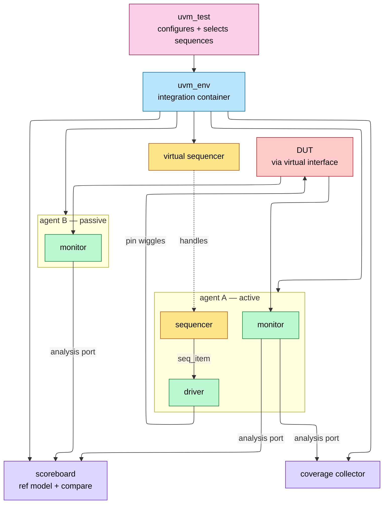
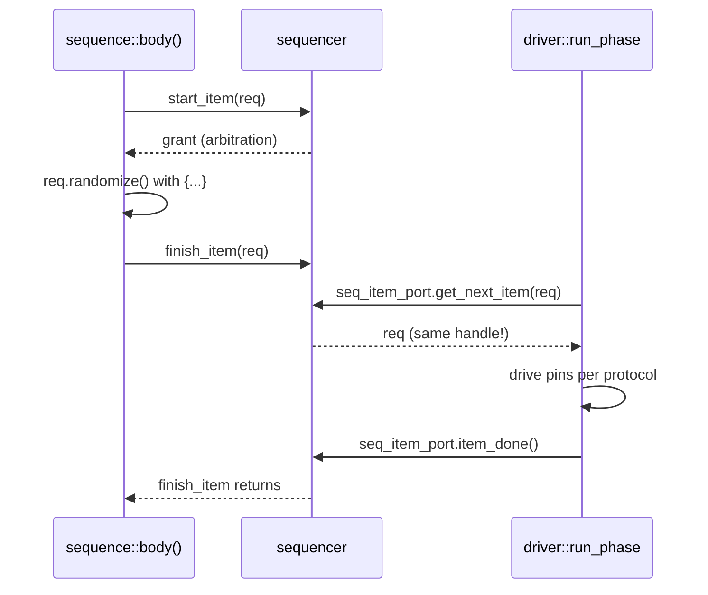
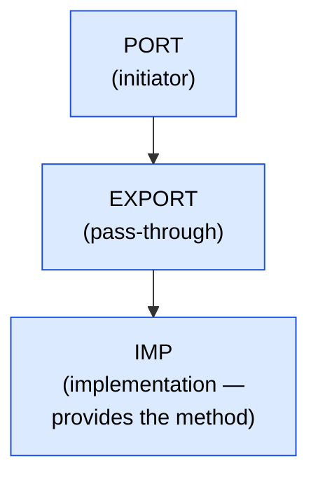
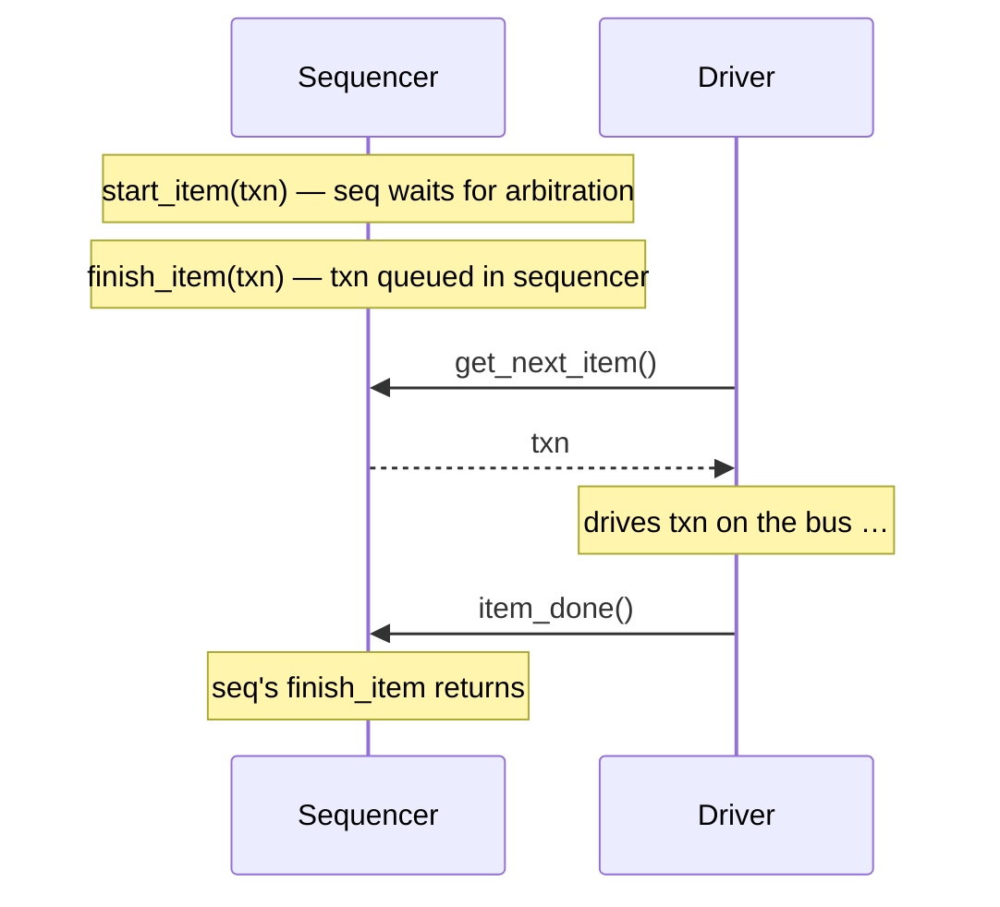
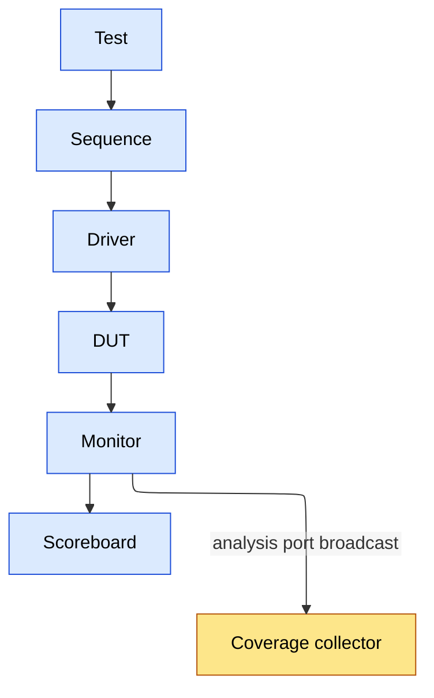

# UVM Methodology — Components, Phasing, Sequences, Factory, RAL

> Prerequisites: [OOP_and_Randomization](08_OOP_and_Randomization.md) (classes, polymorphism, constraints), [Procedural_Processes_and_IPC](03_Procedural_Processes_and_IPC.md) (fork/join, mailboxes/events and the pre-UVM testbench), [Assertions_and_Coverage](09_Assertions_and_Coverage.md) (the checking layer UVM orchestrates).

---

## 0. Why this page exists

UVM (Universal Verification Methodology, IEEE 1800.2) is the industry-standard class library for constrained-random, coverage-driven verification — essentially every digital verification interview assumes it. The library itself is large, but interviews concentrate on five mechanisms: the **component hierarchy and phasing**, the **sequence/driver handshake**, the **factory** (and why `create()` instead of `new()`), **uvm_config_db**, and **RAL**. This page covers each mechanism's *why*, the canonical code skeletons, and the failure modes (objection hangs, missing `item_done`, config-db typos) that interviewers use as debugging questions.

---

## 1. Canonical testbench architecture



Separation of concerns: **stimulus generation** (sequences — *what* to send) is decoupled from **protocol driving** (driver — *how* to send it), from **observation** (monitor — never drives), from **checking** (scoreboard) and **coverage**. An agent encapsulates one interface's sequencer+driver+monitor; `is_active = UVM_PASSIVE` strips it to monitor-only for system-level reuse.

---

## 2. Class hierarchy — object vs component

```ascii-graph
uvm_void
└── uvm_object                  // transient data; no hierarchy, no phases
    ├── uvm_transaction → uvm_sequence_item     // the stimulus payload
    ├── uvm_sequence #(REQ,RSP)                 // stimulus procedure
    └── uvm_component           // quasi-static; hierarchy + phases
        ├── uvm_driver #(REQ)   ├── uvm_monitor
        ├── uvm_sequencer #(REQ)├── uvm_agent
        ├── uvm_scoreboard      ├── uvm_env
        └── uvm_test
```

The split that matters: **components** are built once at time 0, form a parent-child tree (`new(name, parent)`), and participate in phases. **Objects** (items, sequences) are created throughout the run, have no parent, and travel through TLM ports. Sequences are *objects*, not components — they run *on* a sequencer, they don't live in the tree.

---

## 3. Phasing

| Phase | Type | Direction | Purpose |
|---|---|---|---|
| `build_phase` | function | **top-down** | construct children via factory, get config |
| `connect_phase` | function | bottom-up | connect TLM ports, pass virtual interfaces down |
| `end_of_elaboration` | function | bottom-up | final topology tweaks, print hierarchy |
| `start_of_simulation` | function | bottom-up | banners, initial config display |
| **`run_phase`** | **task** | parallel | all time-consuming activity |
| `extract / check / report` | function | bottom-up | collect results, final checks, summary |
| `final_phase` | function | top-down | cleanup |

Build must be top-down — a parent constructs its children before they can build *their* children. Run-phase termination is governed by **objections**: simulation's run phase ends when all raised objections drop.

```verilog
task run_phase(uvm_phase phase);
  phase.raise_objection(this, "main stimulus");
  seq.start(env.agt.sqr);          // blocks until sequence completes
  phase.drop_objection(this, "done");
endtask
```

Classic hangs: (1) a component raises and never drops (test never ends → watchdog `+UVM_TIMEOUT`); (2) nobody raises (test ends at 0 ns). Rule of style: **only the test (or top-level virtual sequence) manages objections**; drivers/monitors never do.

(UVM also defines twelve finer run-time phases — `reset_phase`, `main_phase`, etc. Most production environments skip them and use `run_phase` + explicit sequencing; say that in interviews, it's the experienced answer.)

`run_phase` runs *in parallel with* the sub-phases — use one or the other, not both:

```verilog
// Simple approach: just use run_phase
task run_phase(uvm_phase phase);
    phase.raise_objection(this);
    // All verification activity here
    phase.drop_objection(this);
endtask

// Advanced approach: use sub-phases for sequential stimulus stages
task reset_phase(uvm_phase phase);
    phase.raise_objection(this);
    apply_reset();
    phase.drop_objection(this);
endtask

task main_phase(uvm_phase phase);
    phase.raise_objection(this);
    run_test_sequences();
    phase.drop_objection(this);
endtask
```

---

## 4. Sequences and the driver handshake

### 4.1 The protocol



Key facts interviewers probe:

- **Late randomization**: randomize *between* `start_item` and `finish_item` — the item is randomized at the moment the driver is ready, so reactive stimulus can read DUT state as late as possible.
- The driver receives the **same object handle** — no copy. Mutating it in the driver is visible to the sequence (used deliberately for responses; a bug if accidental).
- Forgetting **`item_done()`** deadlocks the sequencer: `finish_item` never returns. The #1 UVM beginner hang.
- `get_next_item` blocks; a driver loop is `forever begin get_next_item; drive; item_done; end`.
- Responses: `item_done(rsp)` or separate `rsp_port` + sequence `get_response()`; mind the response-queue overflow if the sequence never collects.

### 4.2 Sequence composition and arbitration

Sequences nest: a parent sequence `start()`s children (`` `uvm_do ``-style macros or explicit). The sequencer arbitrates among concurrent sequences (`SEQ_ARB_FIFO` default; priority/weighted/user modes); `lock()/grab()` give exclusive access (grab jumps the queue — atomic multi-item protocol bursts).

### 4.3 Virtual sequences

Multi-interface coordination: a **virtual sequence** runs on a virtual sequencer holding handles to real sequencers, starting sub-sequences on each (`axi_wr_seq.start(vsqr.axi_sqr)` in parallel with `eth_rx_seq.start(vsqr.eth_sqr)`). This is *the* mechanism for scenario-level stimulus ("DMA while config writes while traffic"). The virtual sequencer drives nothing itself — it's a handle rack.

---

## 5. The factory — why `create()` not `new()`

```verilog
class axi_item extends uvm_sequence_item;
  `uvm_object_utils(axi_item)            // registers with factory
  ...
endclass

// construction via factory:
req = axi_item::type_id::create("req");
```

Registration macros (`` `uvm_object_utils ``/`` `uvm_component_utils ``) put the type in a global registry. `create()` looks up the registry and returns *whatever type is currently overriding* the requested one:

```verilog
// in an error-injection test, no env code changes:
axi_item::type_id::set_type_override(bad_parity_axi_item::get_type());
// or per-instance:
set_inst_override_by_type("env.agt.sqr.*",
        axi_item::get_type(), bad_parity_axi_item::get_type());
```

This is **test-controlled polymorphic substitution**: derived items/drivers/scoreboards swap in without touching the environment — the mechanism that makes a UVM env a reusable product. Anything `new()`ed directly is invisible to overrides; hence the rule *factory-create everything that might ever be extended*. Overrides must be set **before** the corresponding `create` executes (practically: in the test's `build_phase`, which runs before children build).

**Complete override example** (error injection into a reusable VIP without touching it):

```verilog
// Base transaction (in reusable VIP)
class apb_txn extends uvm_sequence_item;
    `uvm_object_utils(apb_txn)
    rand bit [31:0] addr;
    rand bit [31:0] data;
    rand bit        write;
endclass

// Extended transaction (in project-specific test)
class apb_error_txn extends apb_txn;
    `uvm_object_utils(apb_error_txn)
    rand bit parity_error;
    constraint c_error { parity_error dist {0 := 95, 1 := 5}; }
endclass

class my_test extends uvm_test;
    function void build_phase(uvm_phase phase);
        super.build_phase(phase);

        // TYPE override: ALL apb_txn becomes apb_error_txn globally
        apb_txn::type_id::set_type_override(apb_error_txn::get_type());

        // INSTANCE override: only specific path affected
        // factory.set_inst_override_by_type(
        //     apb_txn::get_type(),
        //     apb_error_txn::get_type(),
        //     {get_full_name(), ".env.agent.*"});
    endfunction
endclass

// Now when VIP does: apb_txn::type_id::create("txn")
// It gets an apb_error_txn object (with parity_error field)
```

---

## 6. uvm_config_db — hierarchical configuration

```verilog
// at tb_top (setting a virtual interface):
uvm_config_db#(virtual axi_if)::set(null, "uvm_test_top.env.agt.*", "vif", axi_vif);
// in the driver's build_phase:
if (!uvm_config_db#(virtual axi_if)::get(this, "", "vif", vif))
  `uvm_fatal("NOVIF", "axi_if not found")
```

Semantics to know cold:

- Lookup key = (context, instance path with wildcards, field name, **exact parameter type**). A `int` set is invisible to an `int unsigned` get — silent typo-class failures; always `uvm_fatal` on a failed mandatory get.
- **Precedence**: higher in the hierarchy wins (test's set beats env's set), later set wins at equal depth — deliberate, so tests can override defaults.
- Sets targeting `build_phase` consumers must happen *before* that consumer builds (top-down order makes parent build-phase sets to children safe).
- The virtual interface plumb (HW `interface` in the module world → class world) is config_db's most common job.
- For whole-agent knobs prefer a **config object** (one `uvm_object` with all settings, one db entry) over dozens of scalar entries.

**Set/get in practice:**

```verilog
// SET: parent sets config for children
class my_test extends uvm_test;
    function void build_phase(uvm_phase phase);
        // Set virtual interface for all components under env.agent
        uvm_config_db #(virtual bus_if)::set(
            this,           // context (who's setting)
            "env.agent.*",  // scope glob pattern
            "vif",          // field name
            bus_if_inst     // value
        );

        // Set agent mode
        uvm_config_db #(uvm_active_passive_enum)::set(
            this, "env.agent", "is_active", UVM_ACTIVE);

        // Set sequence count
        uvm_config_db #(int)::set(
            this, "env.agent.sequencer", "num_txns", 100);
    endfunction
endclass

// GET: child retrieves config
class my_driver extends uvm_driver #(my_txn);
    virtual bus_if vif;

    function void build_phase(uvm_phase phase);
        if (!uvm_config_db #(virtual bus_if)::get(this, "", "vif", vif))
            `uvm_fatal("DRV", "No virtual interface found in config_db")
    endfunction
endclass
```

**Scope matching worked through:**

``` text
Syntax:
  - set(context, inst_path, field, value)
  - get(context, inst_path, field, variable)

Path Resolution:
  - Full path = context.get_full_name() + "." + inst_path
  - Matching  : get's full path must be a prefix of set's scope

Example:
  set(this, "env.agent.*", "vif", ...)         // this = "uvm_test_top"
  -> Effective scope: "uvm_test_top.env.agent.*"

  get(this, "", "vif", vif)                    // this = "uvm_test_top.env.agent.driver"
  -> Effective path: "uvm_test_top.env.agent.driver"
  -> Matches "uvm_test_top.env.agent.*" (SUCCESS)

Precedence (Higher Wins):
  1. Instance path specificity (more specific wins)
  2. Later set() calls override earlier ones at same specificity
```

---

## 7. TLM — how components talk

| Construct | Cardinality | Blocking? | Canonical use |
|---|---|---|---|
| `uvm_seq_item_pull_port` | 1:1 | yes | driver ← sequencer |
| `uvm_blocking_put/get_port` | 1:1 | yes | pipelined model handoff |
| **`uvm_analysis_port`** | **1:N (0..N)** | no (`write()`) | monitor → scoreboard + coverage + … |
| `uvm_tlm_analysis_fifo` | port→fifo | get blocks | decouple monitor rate from checker rate |

Monitors **broadcast** on analysis ports precisely because they must not care who listens (zero subscribers is legal — passive reuse). Scoreboards typically terminate analysis traffic in `uvm_tlm_analysis_fifo`s and `get()` from them in `run_phase`, or implement `write()` via `uvm_analysis_imp` (+ `` `uvm_analysis_imp_decl(_exp) `` when one scoreboard has several imps).

**Scoreboard patterns:** in-order compare (queue per stream, compare on arrival) when the DUT preserves order; out-of-order (associative array keyed by ID/address) for OoO DUTs — eviction on match, end-of-test check that the array is empty (`check_phase`). Reference model: transaction-level predictor fed by the *input* monitor.

---

## 8. RAL — the register abstraction layer

The register model mirrors the spec's register map as classes (`uvm_reg_field` → `uvm_reg` → `uvm_reg_block` with one or more `uvm_reg_map`s), almost always generated from IP-XACT/SystemRDL/CSV.

- **Frontdoor** access: `rg.write(status, value)` → the map's **adapter** converts a generic `uvm_reg_bus_op` into a bus seq_item on the right sequencer → real bus traffic, real RTL decode exercised.
- **Backdoor** access: `rg.poke/peek` via hdl_path — zero simulation time, no bus; for setup, and for verifying frontdoor independently.
- **Mirror/desired values**: the model tracks what the register *should* hold. `predict` updates it — either auto-predict on model-initiated access or, properly, an **explicit predictor** subscribed to the bus monitor so even firmware-style raw accesses update the mirror.
- `mirror(status, UVM_CHECK)` reads and compares against the mirror — the workhorse of register checking. Built-in sequences (`uvm_reg_hw_reset_seq`, bit-bash, access policies) give day-one coverage of W1C/RO/RW behaviors.

Interview one-liner: *RAL decouples "which register/field am I touching" from "which bus carries it"* — the same test runs on APB today and AXI tomorrow by swapping the adapter ([AHB_AXI_APB](../01_Architecture_and_PPA/11_AHB_AXI_APB.md)).

---

## 9. Minimal complete skeleton (memorize the shape)

```verilog
class axi_item extends uvm_sequence_item;
  rand bit [31:0] addr, data;  rand bit write;
  constraint c_align { addr[1:0] == 0; }
  `uvm_object_utils_begin(axi_item)
    `uvm_field_int(addr, UVM_ALL_ON)   // or hand-write do_copy/do_compare (faster)
  `uvm_object_utils_end
  function new(string name="axi_item"); super.new(name); endfunction
endclass

class axi_rand_seq extends uvm_sequence #(axi_item);
  `uvm_object_utils(axi_rand_seq)
  rand int n = 20;
  task body();
    repeat (n) begin
      req = axi_item::type_id::create("req");
      start_item(req);
      if (!req.randomize()) `uvm_error("RAND","failed")
      finish_item(req);
    end
  endtask
endclass

class axi_driver extends uvm_driver #(axi_item);
  `uvm_component_utils(axi_driver)
  virtual axi_if vif;
  function void build_phase(uvm_phase phase);
    if (!uvm_config_db#(virtual axi_if)::get(this,"","vif",vif))
      `uvm_fatal("NOVIF","")
  endfunction
  task run_phase(uvm_phase phase);
    forever begin
      seq_item_port.get_next_item(req);
      drive_one(req);                  // protocol timing lives here
      seq_item_port.item_done();
    end
  endtask
endclass

class axi_agent extends uvm_agent;
  `uvm_component_utils(axi_agent)
  axi_driver drv;  uvm_sequencer #(axi_item) sqr;  axi_monitor mon;
  function void build_phase(uvm_phase phase);
    mon = axi_monitor::type_id::create("mon", this);
    if (get_is_active() == UVM_ACTIVE) begin
      drv = axi_driver::type_id::create("drv", this);
      sqr = uvm_sequencer#(axi_item)::type_id::create("sqr", this);
    end
  endfunction
  function void connect_phase(uvm_phase phase);
    if (get_is_active() == UVM_ACTIVE)
      drv.seq_item_port.connect(sqr.seq_item_export);
  endfunction
endclass

class base_test extends uvm_test;
  `uvm_component_utils(base_test)
  axi_env env;
  function void build_phase(uvm_phase phase);
    env = axi_env::type_id::create("env", this);
  endfunction
  task run_phase(uvm_phase phase);
    axi_rand_seq seq = axi_rand_seq::type_id::create("seq");
    phase.raise_objection(this);
    seq.start(env.agt.sqr);
    phase.drop_objection(this);
  endtask
endclass
// run:  +UVM_TESTNAME=base_test  → run_test() in tb_top initial block
```

(`uvm_field_*` automation macros are convenient but slow and occasionally surprising in compare semantics; production teams often hand-implement `do_copy/do_compare/convert2string`. Knowing *that* tradeoff is itself an interview point.)

---

*Sections 10–16 are the deep-dive reference (merged from the retired IPC & Verification deep-dive page): production-grade expansions of §4–§8 with complete, runnable code. The raw mailbox/semaphore/event primitives that UVM's TLM replaces now live in [Procedural_Processes_and_IPC](03_Procedural_Processes_and_IPC.md).*

---

## 10. TLM deep dive — ports, exports, imps, analysis, FIFOs

### TLM 1.0: Ports, Exports, Imps



A producer calls `port.put(txn)`, which routes through the export to `imp.put(txn) { … }`, where the actual code runs.

**Blocking vs Non-Blocking:**
- Blocking (`put`, `get`): task-based, can consume time, suspends caller until complete
- Non-blocking (`try_put`, `try_get`): function-based, returns immediately, returns 0 on failure

```verilog
// Producer (driver) has a PORT -- it INITIATES communication
class my_producer extends uvm_component;
    uvm_blocking_put_port #(my_txn) put_port;

    function void build_phase(uvm_phase phase);
        put_port = new("put_port", this);
    endfunction

    task run_phase(uvm_phase phase);
        my_txn txn = my_txn::type_id::create("txn");
        txn.randomize();
        put_port.put(txn);  // Calls through to imp's put() method
    endtask
endclass

// Consumer (scoreboard) has an IMP -- it IMPLEMENTS the method
class my_consumer extends uvm_component;
    uvm_blocking_put_imp #(my_txn, my_consumer) put_imp;

    function void build_phase(uvm_phase phase);
        put_imp = new("put_imp", this);
    endfunction

    task put(my_txn txn);  // This is the ACTUAL implementation
        // Process the transaction
        $display("Received txn: addr=%h", txn.addr);
    endtask
endclass

// Connection in env's connect_phase:
function void connect_phase(uvm_phase phase);
    producer.put_port.connect(consumer.put_imp);
endfunction
```

### Analysis Port: One-to-Many Broadcast

```verilog
// Monitor broadcasts to ALL subscribers (scoreboard, coverage, etc.)
class my_monitor extends uvm_monitor;
    uvm_analysis_port #(my_txn) ap;  // Broadcast port

    function void build_phase(uvm_phase phase);
        ap = new("ap", this);
    endfunction

    task run_phase(uvm_phase phase);
        forever begin
            my_txn txn = my_txn::type_id::create("txn");
            // ... observe DUT signals, populate txn ...
            ap.write(txn);  // Broadcast to ALL connected subscribers
        end
    endtask
endclass

// Scoreboard subscribes via analysis imp
class my_scoreboard extends uvm_scoreboard;
    uvm_analysis_imp #(my_txn, my_scoreboard) analysis_imp;

    function void build_phase(uvm_phase phase);
        analysis_imp = new("analysis_imp", this);
    endfunction

    function void write(my_txn txn);  // Called by analysis port
        // Process transaction for checking
    endfunction
endclass

// Connection: monitor.ap connects to multiple subscribers
function void connect_phase(uvm_phase phase);
    monitor.ap.connect(scoreboard.analysis_imp);
    monitor.ap.connect(coverage.analysis_export);  // Multiple connections OK
endfunction
```

### TLM FIFO: Decoupling Producer and Consumer

```verilog
// Without TLM FIFO: producer and consumer must synchronize directly
// With TLM FIFO: producer puts, consumer gets at its own pace

class my_env extends uvm_env;
    uvm_tlm_analysis_fifo #(my_txn) analysis_fifo;
    my_monitor monitor;
    my_checker checker;

    function void build_phase(uvm_phase phase);
        analysis_fifo = new("analysis_fifo", this);
        monitor = my_monitor::type_id::create("monitor", this);
        checker = my_checker::type_id::create("checker", this);
    endfunction

    function void connect_phase(uvm_phase phase);
        monitor.ap.connect(analysis_fifo.analysis_export);
        checker.get_port.connect(analysis_fifo.blocking_get_export);
    endfunction
endclass

// Checker gets items at its own pace:
class my_checker extends uvm_component;
    uvm_blocking_get_port #(my_txn) get_port;

    task run_phase(uvm_phase phase);
        my_txn txn;
        forever begin
            get_port.get(txn);  // Blocks until FIFO has data
            check_transaction(txn);
        end
    endtask
endclass
```

---

## 11. Sequence mechanism — complete code

### Complete Sequence with body() Task

```verilog
class my_sequence extends uvm_sequence #(my_txn);
    `uvm_object_utils(my_sequence)

    rand int num_txns;
    constraint c_num { num_txns inside {[5:20]}; }

    function new(string name = "my_sequence");
        super.new(name);
    endfunction

    task body();
        my_txn txn;
        for (int i = 0; i < num_txns; i++) begin
            txn = my_txn::type_id::create($sformatf("txn_%0d", i));

            start_item(txn);      // Request sequencer arbitration
            if (!txn.randomize() with {
                addr inside {[0:255]};
            })
                `uvm_fatal("SEQ", "Randomization failed")
            finish_item(txn);     // Send to driver, wait for item_done

            // Optional: get response
            // get_response(rsp);
        end
    endtask
endclass

// Starting a sequence on a sequencer:
task run_phase(uvm_phase phase);
    my_sequence seq = my_sequence::type_id::create("seq");
    phase.raise_objection(this);
    seq.start(env.agent.sequencer);  // Blocks until body() completes
    phase.drop_objection(this);
endtask
```

### Sequencer Arbitration Modes

```verilog
// Set arbitration mode on sequencer:
env.agent.sequencer.set_arbitration(UVM_SEQ_ARB_FIFO);

// UVM_SEQ_ARB_FIFO:           First-come first-served (default)
// UVM_SEQ_ARB_WEIGHTED:       Random weighted by sequence priority
// UVM_SEQ_ARB_RANDOM:         Random among ready sequences
// UVM_SEQ_ARB_STRICT_FIFO:    By priority, FIFO within same priority
// UVM_SEQ_ARB_STRICT_RANDOM:  By priority, random within same priority
// UVM_SEQ_ARB_USER:           User-defined arbitration
```

### Virtual Sequence for Multi-Agent Coordination

```verilog
class virtual_sequence extends uvm_sequence #(uvm_sequence_item);
    `uvm_object_utils(virtual_sequence)

    // Sequencer handles for each agent
    my_sequencer cpu_sqr;
    my_sequencer dma_sqr;
    my_sequencer periph_sqr;

    task body();
        my_sequence cpu_seq   = my_sequence::type_id::create("cpu_seq");
        my_sequence dma_seq   = my_sequence::type_id::create("dma_seq");
        my_sequence periph_seq = my_sequence::type_id::create("periph_seq");

        // Run sequences in parallel on different agents
        fork
            cpu_seq.start(cpu_sqr);
            dma_seq.start(dma_sqr);
        join_none

        // Then run peripheral sequence
        periph_seq.start(periph_sqr);

        // Wait for all to complete
        wait fork;
    endtask
endclass

// In test's run_phase:
task run_phase(uvm_phase phase);
    virtual_sequence vseq = virtual_sequence::type_id::create("vseq");
    phase.raise_objection(this);

    // Connect virtual sequence to actual sequencers
    vseq.cpu_sqr    = env.cpu_agent.sequencer;
    vseq.dma_sqr    = env.dma_agent.sequencer;
    vseq.periph_sqr = env.periph_agent.sequencer;

    vseq.start(null);  // No sequencer for virtual sequence itself
    phase.drop_objection(this);
endtask
```

---

## 12. Driver–sequencer handshake — complete code

### get_next_item / item_done Flow



### Complete Driver with Reset Handling

```verilog
class my_driver extends uvm_driver #(my_txn);
    `uvm_component_utils(my_driver)

    virtual bus_if vif;

    function new(string name, uvm_component parent);
        super.new(name, parent);
    endfunction

    function void build_phase(uvm_phase phase);
        super.build_phase(phase);
        if (!uvm_config_db #(virtual bus_if)::get(this, "", "vif", vif))
            `uvm_fatal("DRV", "Failed to get virtual interface")
    endfunction

    task run_phase(uvm_phase phase);
        // Initialize interface signals
        vif.valid <= 0;
        vif.data  <= 0;
        vif.addr  <= 0;

        forever begin
            // Handle reset
            fork
                begin : drive_thread
                    forever begin
                        my_txn txn;
                        seq_item_port.get_next_item(txn);
                        drive_transaction(txn);
                        seq_item_port.item_done();
                    end
                end

                begin : reset_thread
                    @(negedge vif.rst_n);
                    `uvm_info("DRV", "Reset detected", UVM_MEDIUM)
                end
            join_any
            disable fork;

            // Reset cleanup
            vif.valid <= 0;
            vif.data  <= 0;
            @(posedge vif.rst_n);  // Wait for reset deassert
            repeat (2) @(posedge vif.clk);  // Post-reset delay
        end
    endtask

    task drive_transaction(my_txn txn);
        @(posedge vif.clk);
        vif.valid <= 1;
        vif.addr  <= txn.addr;
        vif.data  <= txn.data;
        @(posedge vif.clk);
        while (!vif.ready) @(posedge vif.clk);  // Wait for handshake
        vif.valid <= 0;
        `uvm_info("DRV", $sformatf("Drove txn: addr=%h data=%h",
                  txn.addr, txn.data), UVM_HIGH)
    endtask
endclass
```

### Pipelining with get/put (Advanced)

```verilog
// For pipelined protocols where you want to overlap address and data phases:
task run_phase(uvm_phase phase);
    fork
        get_and_drive();   // Request phase
        collect_responses(); // Response phase
    join
endtask

task get_and_drive();
    forever begin
        my_txn txn;
        seq_item_port.get(txn);  // get() instead of get_next_item()
        // No item_done() needed -- get() handles it
        drive_address_phase(txn);
    end
endtask
```

---

## 13. Register model (RAL) deep dive

### Structure

```ascii-graph
uvm_reg_block (my_reg_block)
  |
  +-- uvm_reg (ctrl_reg)
  |     +-- uvm_reg_field (enable)    [1 bit, RW]
  |     +-- uvm_reg_field (mode)      [2 bits, RW]
  |     +-- uvm_reg_field (status)    [4 bits, RO]
  |     +-- uvm_reg_field (reserved)  [25 bits, RsvdZ]
  |
  +-- uvm_reg (status_reg)
  |     +-- uvm_reg_field (...)
  |
  +-- uvm_mem (data_mem)
  |     [1024 x 32-bit memory]
  |
  +-- uvm_reg_map (default_map)
        [address mapping for frontdoor access]
```

### Register Definition

```verilog
class ctrl_reg extends uvm_reg;
    `uvm_object_utils(ctrl_reg)

    rand uvm_reg_field enable;
    rand uvm_reg_field mode;
    rand uvm_reg_field status;

    function new(string name = "ctrl_reg");
        super.new(name, 32, UVM_NO_COVERAGE);  // 32-bit register
    endfunction

    function void build();
        enable = uvm_reg_field::type_id::create("enable");
        enable.configure(this, 1, 0, "RW", 0, 1'b0, 1, 1, 0);
        //                     bits, lsb, access, volatile, reset, has_reset, is_rand, individually_accessible

        mode = uvm_reg_field::type_id::create("mode");
        mode.configure(this, 2, 1, "RW", 0, 2'b00, 1, 1, 0);

        status = uvm_reg_field::type_id::create("status");
        status.configure(this, 4, 3, "RO", 1, 4'b0000, 1, 0, 0);
    endfunction
endclass

class my_reg_block extends uvm_reg_block;
    `uvm_object_utils(my_reg_block)

    rand ctrl_reg   ctrl;
    rand uvm_reg    status;

    uvm_reg_map default_map;

    function new(string name = "my_reg_block");
        super.new(name, UVM_NO_COVERAGE);
    endfunction

    function void build();
        ctrl = ctrl_reg::type_id::create("ctrl");
        ctrl.build();
        ctrl.configure(this);

        default_map = create_map("default_map", 0, 4, UVM_LITTLE_ENDIAN);
        default_map.add_reg(ctrl, 'h0000, "RW");
        // default_map.add_reg(status, 'h0004, "RO");
    endfunction
endclass
```

### Frontdoor vs Backdoor Access

```verilog
// FRONTDOOR: goes through the bus (driver/sequencer/monitor)
//   Exercises the actual bus protocol -- realistic
//   Slower (bus cycles)
task test_frontdoor();
    uvm_status_e status;
    uvm_reg_data_t data;

    // Write via bus
    reg_model.ctrl.write(status, 32'h0000_0003);  // Generates bus transaction

    // Read via bus
    reg_model.ctrl.read(status, data);  // Generates bus transaction
endtask

// BACKDOOR: direct memory access (hdl_path), bypasses bus
//   Fast (no bus cycles)
//   Doesn't exercise bus protocol
//   Useful for initialization, debug, and large register blocks
task test_backdoor();
    uvm_status_e status;
    uvm_reg_data_t data;

    reg_model.ctrl.write(status, 32'h0000_0003, .path(UVM_BACKDOOR));
    reg_model.ctrl.read(status, data, .path(UVM_BACKDOOR));
endtask
```

### Mirror, Desired, and Actual Values

``` text
Three Values Tracked Per Register:
  - DESIRED: What the testbench intends the register to contain
  - MIRROR:  What the model thinks the HW register contains
  - ACTUAL:  What the HW register really contains (in RTL)

Methods:
  - reg.write()              : Updates DESIRED and MIRROR, sends frontdoor write
  - reg.set()                : Updates only DESIRED (no bus transaction)
  - reg.update()             : Writes DESIRED to HW if DESIRED != MIRROR
  - reg.read()               : Reads from HW, updates MIRROR
  - reg.mirror()             : Reads from HW, checks against MIRROR prediction
  - reg.predict()            : Updates MIRROR without bus transaction
  - reg.get()                : Returns DESIRED value (no bus transaction)
  - reg.get_mirrored_value() : Returns MIRROR value (no bus transaction)
```

### Built-in Register Test Sequences

```verilog
// Hardware reset test: verify all registers have correct reset values
class my_test extends uvm_test;
    task run_phase(uvm_phase phase);
        uvm_reg_hw_reset_seq rst_seq = uvm_reg_hw_reset_seq::type_id::create("rst_seq");
        phase.raise_objection(this);
        rst_seq.model = env.reg_model;
        rst_seq.start(env.agent.sequencer);
        phase.drop_objection(this);
    endtask
endclass

// Bit bash test: write walking 1s/0s to each RW field
// uvm_reg_bit_bash_seq

// Register access test: verify read/write access for each field
// uvm_reg_access_seq
```

---

## 14. Objection mechanism — code

```verilog
// Objections prevent simulation from ending while work is in progress

class my_test extends uvm_test;
    task run_phase(uvm_phase phase);
        phase.raise_objection(this, "Starting test");
        // Simulation will NOT end while this objection is raised

        my_sequence seq = my_sequence::type_id::create("seq");
        seq.start(env.agent.sequencer);

        #100;  // Drain time
        phase.drop_objection(this, "Test complete");
        // When ALL objections are dropped, run_phase ends
    endtask
endclass

// Common pattern in sequences:
class my_sequence extends uvm_sequence #(my_txn);
    task body();
        // Raise objection via the sequencer's parent
        uvm_phase phase = get_starting_phase();
        if (phase != null)
            phase.raise_objection(this);

        // ... do sequence work ...

        if (phase != null)
            phase.drop_objection(this);
    endtask
endclass

// TIMEOUT: if objections are never dropped, simulation hangs
// Set a timeout:
// In test: uvm_top.set_timeout(1ms);
// Or on command line: +UVM_TIMEOUT=1000000
```

---

## 15. Complete UVM testbench example

This shows all components wired together for a simple register-based DUT.

```verilog
//============================================================
// Transaction
//============================================================
class reg_txn extends uvm_sequence_item;
    `uvm_object_utils(reg_txn)

    rand bit [7:0]  addr;
    rand bit [31:0] data;
    rand bit        write;     // 1=write, 0=read
    bit [31:0]      read_data; // Response from DUT

    constraint c_addr_align { addr[1:0] == 2'b00; }  // 4-byte aligned

    function new(string name = "reg_txn");
        super.new(name);
    endfunction

    function string convert2string();
        return $sformatf("%s addr=%02h data=%08h",
                         write ? "WR" : "RD", addr, write ? data : read_data);
    endfunction

    function void do_copy(uvm_object rhs);
        reg_txn rhs_txn;
        super.do_copy(rhs);
        $cast(rhs_txn, rhs);
        addr      = rhs_txn.addr;
        data      = rhs_txn.data;
        write     = rhs_txn.write;
        read_data = rhs_txn.read_data;
    endfunction

    function bit do_compare(uvm_object rhs, uvm_comparer comparer);
        reg_txn rhs_txn;
        if (!$cast(rhs_txn, rhs)) return 0;
        return (addr == rhs_txn.addr && data == rhs_txn.data && write == rhs_txn.write);
    endfunction
endclass

//============================================================
// Interface
//============================================================
interface reg_if (input logic clk, input logic rst_n);
    logic [7:0]  addr;
    logic [31:0] wdata;
    logic [31:0] rdata;
    logic        wen;
    logic        ren;
    logic        ready;

    clocking driver_cb @(posedge clk);
        default input #1step output #0;
        output addr, wdata, wen, ren;
        input  rdata, ready;
    endclocking

    clocking monitor_cb @(posedge clk);
        default input #1step output #0;
        input addr, wdata, rdata, wen, ren, ready;
    endclocking

    modport driver_mp  (clocking driver_cb, input rst_n);
    modport monitor_mp (clocking monitor_cb, input rst_n);
endinterface

//============================================================
// Driver
//============================================================
class reg_driver extends uvm_driver #(reg_txn);
    `uvm_component_utils(reg_driver)

    virtual reg_if.driver_mp vif;

    function new(string name, uvm_component parent);
        super.new(name, parent);
    endfunction

    function void build_phase(uvm_phase phase);
        super.build_phase(phase);
        if (!uvm_config_db #(virtual reg_if.driver_mp)::get(this, "", "vif", vif))
            `uvm_fatal("DRV", "No vif")
    endfunction

    task run_phase(uvm_phase phase);
        vif.driver_cb.wen  <= 0;
        vif.driver_cb.ren  <= 0;
        @(posedge vif.rst_n);
        @(vif.driver_cb);

        forever begin
            reg_txn txn;
            seq_item_port.get_next_item(txn);
            drive(txn);
            seq_item_port.item_done();
        end
    endtask

    task drive(reg_txn txn);
        @(vif.driver_cb);
        vif.driver_cb.addr <= txn.addr;
        if (txn.write) begin
            vif.driver_cb.wdata <= txn.data;
            vif.driver_cb.wen   <= 1;
        end else begin
            vif.driver_cb.ren <= 1;
        end
        @(vif.driver_cb);
        while (!vif.driver_cb.ready) @(vif.driver_cb);
        if (!txn.write)
            txn.read_data = vif.driver_cb.rdata;
        vif.driver_cb.wen <= 0;
        vif.driver_cb.ren <= 0;
        `uvm_info("DRV", txn.convert2string(), UVM_HIGH)
    endtask
endclass

//============================================================
// Monitor
//============================================================
class reg_monitor extends uvm_monitor;
    `uvm_component_utils(reg_monitor)

    virtual reg_if.monitor_mp vif;
    uvm_analysis_port #(reg_txn) ap;

    function new(string name, uvm_component parent);
        super.new(name, parent);
    endfunction

    function void build_phase(uvm_phase phase);
        super.build_phase(phase);
        ap = new("ap", this);
        if (!uvm_config_db #(virtual reg_if.monitor_mp)::get(this, "", "vif", vif))
            `uvm_fatal("MON", "No vif")
    endfunction

    task run_phase(uvm_phase phase);
        forever begin
            reg_txn txn = reg_txn::type_id::create("txn");
            @(vif.monitor_cb);
            if (vif.monitor_cb.wen || vif.monitor_cb.ren) begin
                txn.addr  = vif.monitor_cb.addr;
                txn.write = vif.monitor_cb.wen;
                if (txn.write)
                    txn.data = vif.monitor_cb.wdata;
                while (!vif.monitor_cb.ready) @(vif.monitor_cb);
                if (!txn.write)
                    txn.read_data = vif.monitor_cb.rdata;
                `uvm_info("MON", txn.convert2string(), UVM_HIGH)
                ap.write(txn);
            end
        end
    endtask
endclass

//============================================================
// Agent
//============================================================
class reg_agent extends uvm_agent;
    `uvm_component_utils(reg_agent)

    reg_driver    driver;
    reg_monitor   monitor;
    uvm_sequencer #(reg_txn) sequencer;

    function new(string name, uvm_component parent);
        super.new(name, parent);
    endfunction

    function void build_phase(uvm_phase phase);
        super.build_phase(phase);
        monitor = reg_monitor::type_id::create("monitor", this);
        if (get_is_active() == UVM_ACTIVE) begin
            driver    = reg_driver::type_id::create("driver", this);
            sequencer = uvm_sequencer #(reg_txn)::type_id::create("sequencer", this);
        end
    endfunction

    function void connect_phase(uvm_phase phase);
        if (get_is_active() == UVM_ACTIVE)
            driver.seq_item_port.connect(sequencer.seq_item_export);
    endfunction
endclass

//============================================================
// Scoreboard
//============================================================
class reg_scoreboard extends uvm_scoreboard;
    `uvm_component_utils(reg_scoreboard)

    uvm_analysis_imp #(reg_txn, reg_scoreboard) analysis_imp;
    bit [31:0] ref_mem [bit [7:0]];  // Reference memory model
    int pass_count, fail_count;

    function new(string name, uvm_component parent);
        super.new(name, parent);
    endfunction

    function void build_phase(uvm_phase phase);
        super.build_phase(phase);
        analysis_imp = new("analysis_imp", this);
    endfunction

    function void write(reg_txn txn);
        if (txn.write) begin
            ref_mem[txn.addr] = txn.data;
            `uvm_info("SCB", $sformatf("Stored: addr=%02h data=%08h",
                      txn.addr, txn.data), UVM_HIGH)
        end else begin
            bit [31:0] expected = ref_mem.exists(txn.addr) ? ref_mem[txn.addr] : 0;
            if (txn.read_data == expected) begin
                pass_count++;
                `uvm_info("SCB", $sformatf("PASS: addr=%02h exp=%08h got=%08h",
                          txn.addr, expected, txn.read_data), UVM_HIGH)
            end else begin
                fail_count++;
                `uvm_error("SCB", $sformatf("FAIL: addr=%02h exp=%08h got=%08h",
                           txn.addr, expected, txn.read_data))
            end
        end
    endfunction

    function void report_phase(uvm_phase phase);
        `uvm_info("SCB", $sformatf("Results: %0d PASS, %0d FAIL",
                  pass_count, fail_count), UVM_LOW)
    endfunction
endclass

//============================================================
// Coverage
//============================================================
class reg_coverage extends uvm_subscriber #(reg_txn);
    `uvm_component_utils(reg_coverage)

    reg_txn txn;

    covergroup cg_reg;
        cp_addr: coverpoint txn.addr {
            bins low  = {[8'h00:8'h3F]};
            bins mid  = {[8'h40:8'hBF]};
            bins high = {[8'hC0:8'hFF]};
        }
        cp_op: coverpoint txn.write {
            bins read  = {0};
            bins write = {1};
        }
        cx_addr_op: cross cp_addr, cp_op;
    endgroup

    function new(string name, uvm_component parent);
        super.new(name, parent);
        cg_reg = new();
    endfunction

    function void write(reg_txn t);
        txn = t;
        cg_reg.sample();
    endfunction
endclass

//============================================================
// Environment
//============================================================
class reg_env extends uvm_env;
    `uvm_component_utils(reg_env)

    reg_agent       agent;
    reg_scoreboard  scoreboard;
    reg_coverage    coverage;

    function new(string name, uvm_component parent);
        super.new(name, parent);
    endfunction

    function void build_phase(uvm_phase phase);
        super.build_phase(phase);
        agent      = reg_agent::type_id::create("agent", this);
        scoreboard = reg_scoreboard::type_id::create("scoreboard", this);
        coverage   = reg_coverage::type_id::create("coverage", this);
    endfunction

    function void connect_phase(uvm_phase phase);
        agent.monitor.ap.connect(scoreboard.analysis_imp);
        agent.monitor.ap.connect(coverage.analysis_export);
    endfunction
endclass

//============================================================
// Sequences
//============================================================
class write_read_seq extends uvm_sequence #(reg_txn);
    `uvm_object_utils(write_read_seq)

    rand int num_txns;
    constraint c_num { num_txns inside {[10:50]}; }

    function new(string name = "write_read_seq");
        super.new(name);
    endfunction

    task body();
        reg_txn txn;

        // Phase 1: Write to random addresses
        for (int i = 0; i < num_txns; i++) begin
            txn = reg_txn::type_id::create("wr_txn");
            start_item(txn);
            assert(txn.randomize() with { write == 1; });
            finish_item(txn);
        end

        // Phase 2: Read back and check
        for (int i = 0; i < num_txns; i++) begin
            txn = reg_txn::type_id::create("rd_txn");
            start_item(txn);
            assert(txn.randomize() with { write == 0; });
            finish_item(txn);
        end
    endtask
endclass

//============================================================
// Test
//============================================================
class base_test extends uvm_test;
    `uvm_component_utils(base_test)

    reg_env env;

    function new(string name, uvm_component parent);
        super.new(name, parent);
    endfunction

    function void build_phase(uvm_phase phase);
        super.build_phase(phase);
        env = reg_env::type_id::create("env", this);

        // Set virtual interface (assumes tb_top sets it in config_db)
    endfunction

    task run_phase(uvm_phase phase);
        write_read_seq seq = write_read_seq::type_id::create("seq");
        phase.raise_objection(this);
        seq.start(env.agent.sequencer);
        #100;  // Drain time
        phase.drop_objection(this);
    endtask
endclass

//============================================================
// Testbench Top (module, not class)
//============================================================
module tb_top;
    logic clk = 0;
    logic rst_n = 0;

    always #5 clk = ~clk;

    reg_if intf (clk, rst_n);

    // DUT instantiation
    register_file dut (
        .clk    (clk),
        .rst_n  (rst_n),
        .addr   (intf.addr),
        .wdata  (intf.wdata),
        .rdata  (intf.rdata),
        .wen    (intf.wen),
        .ren    (intf.ren),
        .ready  (intf.ready)
    );

    initial begin
        // Set virtual interface in config_db
        uvm_config_db #(virtual reg_if.driver_mp)::set(
            null, "uvm_test_top.env.agent.driver", "vif", intf);
        uvm_config_db #(virtual reg_if.monitor_mp)::set(
            null, "uvm_test_top.env.agent.monitor", "vif", intf);

        // Reset sequence
        rst_n = 0;
        #100;
        rst_n = 1;
    end

    initial begin
        run_test("base_test");  // Start UVM
    end
endmodule
```

---

## 16. Worked example — AXI4-Lite slave testbench

### DUT Specification

32-bit AXI4-Lite slave with 16 registers at addresses `0x00`--`0x3C` (stride 4). Supports read and write. Returns `SLVERR` for addresses outside `0x00`--`0x3C`. No bursting -- AXI4-Lite has fixed-length transfers.

### Testbench Architecture



### Transaction Class

```verilog
class axi_lite_txn extends uvm_sequence_item;
    `uvm_object_utils(axi_lite_txn)

    rand bit [31:0] addr;
    rand bit [31:0] data;
    rand bit        rw;       // 1=write, 0=read
    rand bit        back2back; // No idle cycles before next txn

    bit [31:0]      rdata;    // Response
    bit [1:0]       resp;     // 00=OKAY, 10=SLVERR

    constraint c_addr_align { addr[1:0] == 2'b00; }
    constraint c_legal_addr { addr inside {['h00:'h3C]}; }

    // Factory override in error tests removes c_legal_addr
    function new(string name = "axi_lite_txn");
        super.new(name);
    endfunction
endclass
```

### Sequence Library

```verilog
// Sequential write-then-read for every register
class rw_all_regs_seq extends uvm_sequence #(axi_lite_txn);
    `uvm_object_utils(rw_all_regs_seq)
    task body();
        for (int i = 0; i < 16; i++) begin
            // Write
            req = axi_lite_txn::type_id::create("wr");
            start_item(req); req.randomize() with {rw==1; addr==i*4;}; finish_item(req);
            // Read back
            req = axi_lite_txn::type_id::create("rd");
            start_item(req); req.randomize() with {rw==0; addr==i*4;}; finish_item(req);
        end
    endtask
endclass

// Random read-write mix -- core of CR verification
class random_rw_seq extends uvm_sequence #(axi_lite_txn);
    `uvm_object_utils(random_rw_seq)
    rand int n;
    constraint c_n { n inside {[50:200]}; }
    task body();
        for (int i = 0; i < n; i++) begin
            req = axi_lite_txn::type_id::create("txn");
            start_item(req);
            req.randomize();   // c_legal_addr keeps it in range
            finish_item(req);
        end
    endtask
endclass
```

### Coverage Model with Cross Coverage

```verilog
class axi_coverage extends uvm_subscriber #(axi_lite_txn);
    `uvm_component_utils(axi_coverage)

    axi_lite_txn txn;
    covergroup cg_axi;
        cp_addr: coverpoint txn.addr {
            bins reg_00 = {'h00}; bins reg_04 = {'h04}; bins reg_08 = {'h08};
            bins reg_0C = {'h0C}; bins reg_10 = {'h10}; bins reg_14 = {'h14};
            bins reg_18 = {'h18}; bins reg_1C = {'h1C};
            bins reg_20 = {'h20}; bins reg_24 = {'h24}; bins reg_28 = {'h28};
            bins reg_2C = {'h2C}; bins reg_30 = {'h30}; bins reg_34 = {'h34};
            bins reg_38 = {'h38}; bins reg_3C = {'h3C};
        }
        cp_rw: coverpoint txn.rw { bins rd = {0}; bins wr = {1}; }
        cp_resp: coverpoint txn.resp { bins okay = {0}; bins slverr = {2}; }
        cx_addr_rw: cross cp_addr, cp_rw;        // Every register read AND written
        cx_rw_resp:  cross cp_rw,  cp_resp;       // Write+OKAY, Read+OKAY, SLVERR
    endgroup

    function new(string name, uvm_component parent);
        super.new(name, parent);
        cg_axi = new();
    endfunction

    function void write(axi_lite_txn t);
        txn = t; cg_axi.sample();
    endfunction
endclass
```

### Scoreboard Checking Logic

```verilog
class axi_scoreboard extends uvm_scoreboard;
    `uvm_component_utils(axi_scoreboard)

    uvm_analysis_imp #(axi_lite_txn, axi_scoreboard) imp;
    bit [31:0] reg_file [bit[31:0]];   // Reference model: addr -> data
    int errors;

    function void write(axi_lite_txn txn);
        if (txn.addr > 'h3C) begin
            // Illegal address -- expect SLVERR
            if (txn.resp != 2'b10)
                `uvm_error("SCB", $sformatf("Missing SLVERR for addr=%0h", txn.addr))
            return;
        end
        if (txn.rw) begin
            reg_file[txn.addr] = txn.data;
        end else begin
            bit [31:0] exp = reg_file.exists(txn.addr) ? reg_file[txn.addr] : '0;
            if (txn.rdata !== exp) begin
                errors++;
                `uvm_error("SCB", $sformatf("Mismatch addr=%0h exp=%h got=%h",
                          txn.addr, exp, txn.rdata))
            end
        end
    endfunction
endclass
```

### Results Interpretation

100% functional coverage proves every register was read and written, every response type occurred, and every cross combination fired. It does **not** prove:

- **Timing compliance** -- AXI handshake timing (AVALID to AWREADY latency) is not captured by functional coverage; protocol checkers (SVA assertions) are needed.
- **Multi-cycle path correctness** -- cross-clock-domain paths require separate CDC verification.
- **Analog effects** -- signal integrity, power droop, clock jitter are outside simulation scope.

Functional coverage closure is necessary but not sufficient. Full sign-off requires: functional coverage + code coverage + formal property verification + gate-level timing simulation + silicon validation.

---

## 17. Facts to memorize

| Fact | Value |
|---|---|
| Standard | IEEE 1800.2 (UVM 1.2 / 2017+ library) |
| build_phase direction | top-down (only one); connect is bottom-up |
| Time-consuming phase | `run_phase` (task); all others functions |
| Run-phase end | all objections dropped |
| Driver handshake | `get_next_item` → drive → `item_done` (forget → hang) |
| Late randomization point | between `start_item` and `finish_item` |
| Factory construction | `type_id::create()`; overrides set before create, in test build |
| config_db match | context+path(wildcards)+name+**exact type**; nearer-top set wins |
| Analysis port fan-out | 0..N subscribers, non-blocking `write()` |
| Agent modes | UVM_ACTIVE (sqr+drv+mon) / UVM_PASSIVE (mon only) |
| RAL access | frontdoor (bus, time) vs backdoor (hdl_path, 0-time); explicit predictor keeps mirror honest |
| Sequencer arbitration default | SEQ_ARB_FIFO; `grab()` preempts, `lock()` queues |

---

## Cross-references

- Language mechanics underneath: [OOP_and_Randomization](08_OOP_and_Randomization.md) (factory = polymorphism + registry; constraints), [Procedural_Processes_and_IPC](03_Procedural_Processes_and_IPC.md) (raw mailboxes/events vs TLM).
- Checking layer: [Assertions_and_Coverage](09_Assertions_and_Coverage.md) (SVA in interfaces, covergroups in subscribers).
- Bus knowledge for agents: [AHB_AXI_APB](../01_Architecture_and_PPA/11_AHB_AXI_APB.md), [ACE_and_CHI](../01_Architecture_and_PPA/12_ACE_and_CHI.md).
- Formal complement: [Formal_Verification](12_Formal_Verification.md) (what UVM shouldn't be used for).
