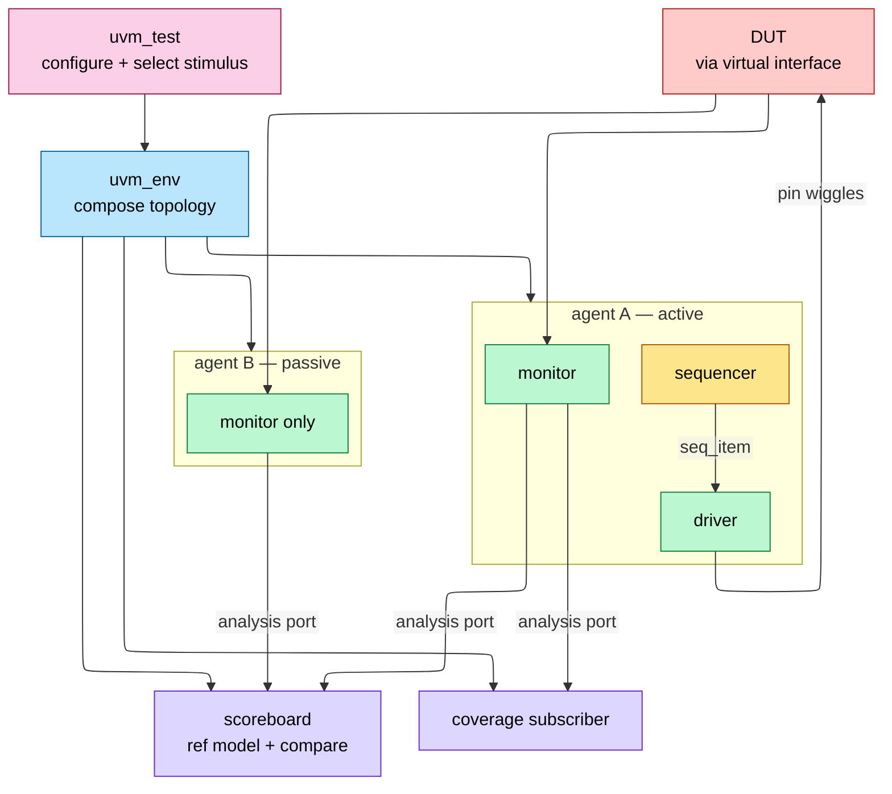
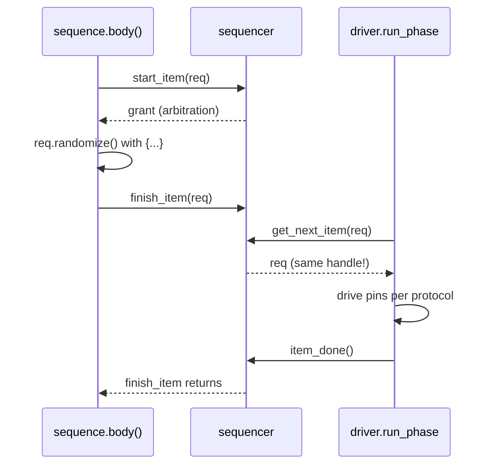

# UVM Methodology — Standardizing the Reusable Testbench

> **Prerequisites:** [OOP_and_Randomization](08_OOP_and_Randomization.md) (classes, polymorphism, constraints, and the *reuse-under-change* argument UVM operationalizes), [Procedural_Processes_and_IPC](03_Procedural_Processes_and_IPC.md) (fork/join, mailboxes, events — the raw IPC UVM's TLM and phasing wrap and hide), [Assertions_and_Coverage](09_Assertions_and_Coverage.md) (the checking and completeness layer UVM orchestrates).
> **Hands off to:** [Verification_Planning_and_Coverage_Closure](11_Verification_Planning_and_Coverage_Closure.md) (where the coverage these components collect drives closure and sign-off).

---

## 0. Why this page exists

UVM (Universal Verification Methodology, IEEE 1800.2) is not an algorithm — it is a **standard architecture**. Once verification became constrained-random and coverage-driven ([08](08_OOP_and_Randomization.md), [09](09_Assertions_and_Coverage.md)), every team discovered it was building the *same testbench every time*: something to generate abstract stimulus, something to turn that stimulus into pin wiggles, something to watch the pins and reconstruct what happened, something to check, something to measure coverage, and a way to configure and wire it all together. Build that skeleton ad hoc and it is a throwaway welded to one project; build it to a shared standard and it becomes verification IP that moves between blocks, projects, and companies.

This page derives UVM from that **reuse problem** rather than touring its class library. For each mechanism — the component split, the phases, the factory, the config DB, the TLM ports, sequences, RAL — we ask the same question: *what must a testbench architecture be so that its pieces are independently replaceable and reusable?* The recurring answer, and the thesis of the page, is that UVM's value is **standardization, not cleverness**. Anything it does, a mailbox and a `fork` can do ([03](03_Procedural_Processes_and_IPC.md)); what it adds is a convention adopted widely enough that independently written pieces interoperate without negotiation.

---

## 1. The reuse problem: everyone rebuilds the same testbench

Constrained-random, coverage-driven verification fixes *what* a testbench must do but says nothing about *how to structure it*. Every environment, for every DUT, must do six jobs:

1. **generate** abstract stimulus (transactions, not wiggles),
2. **drive** it onto the DUT's pins with correct protocol timing,
3. **observe** the pins and reconstruct transactions,
4. **check** behaviour against a reference,
5. **sample** functional coverage,
6. **configure and compose** all of the above, per test.

Six jobs, every block, every project, every company. Structure them ad hoc and two things go wrong:

- **No portability.** An AXI environment written for chip A cannot be lifted into chip B if its stimulus, driving, and checking are tangled together — the bus-protocol knowledge that *should* be reusable is fused to project-specific scaffolding.
- **No interoperability.** Third-party or sister-team VIP cannot plug into your environment if it assumes a different skeleton, a different connection style, or a different configuration mechanism.

UVM's claim is that the **architecture itself** — not merely a library of helper classes — must be standardized, so that a piece built once (a bus agent, a scoreboard, a sequence library) amortizes across many uses.

### 1.1 The reuse economics — when standardization pays

Model the lifetime cost of one piece of verification IP:

$$
C_{\text{eff}} \;=\; \frac{C_{\text{build}}}{N_{\text{reuse}}} \;+\; C_{\text{integrate}}
$$

where $C_{\text{build}}$ = one-time cost to build it, $N_{\text{reuse}}$ = number of blocks/projects it is reused in, $C_{\text{integrate}}$ = per-use cost to instantiate and configure it. Ad-hoc VIP has low $C_{\text{build}}$ but $N_{\text{reuse}}=1$ and a high $C_{\text{integrate}}$ every time it is force-fit. Standardized VIP raises $C_{\text{build}}$ (you build to a spec) but drives $N_{\text{reuse}}$ up and $C_{\text{integrate}}$ down. Setting $C_{\text{eff}}^{\text{UVM}} < C_{\text{eff}}^{\text{adhoc}}$ gives the break-even:

$$
\boxed{\,N_{\text{reuse}} \;\gtrsim\; \frac{C_{\text{build}}^{\text{UVM}} - C_{\text{build}}^{\text{adhoc}}}{C_{\text{integrate}}^{\text{adhoc}} - C_{\text{integrate}}^{\text{UVM}}}\,}
$$

The whole "is UVM worth it" question is this one inequality: UVM pays once a piece is reused often enough that its cheaper, standardized integration repays the up-front conformance overhead (§9 puts numbers on it). The corollary is the deeper point about *why standardization beats cleverness*: the value of a convention grows with the size of the ecosystem that shares it. A UVM agent is worth more than an equally good bespoke one because the rest of the world already knows how to connect to it — the payoff is a network effect, not an implementation trick.

---

## 2. Separation of concerns: deriving the component architecture

The entire component set follows from **one principle**: *put a boundary wherever two things change for different reasons, so each can be replaced without touching the other.* Apply it to the six jobs and the standard UVM components fall out — not as a class catalogue but as a set of **reuse seams**.

| Concern | Changes when… | UVM piece | Deliberately does **not** know |
|---|---|---|---|
| *what* stimulus to send | the test scenario changes | **sequence** on a **sequencer** | pin timing; who drives it |
| *how* to send it (pins, timing) | the bus protocol changes | **driver** | which scenario produced the transaction |
| observe pins → transactions | the bus protocol changes | **monitor** | who consumes what it sees |
| check against a reference | the DUT spec changes | **scoreboard** | how transactions were driven/observed |
| measure coverage | the coverage plan changes | **subscriber** (coverage collector) | anything but the transaction stream |
| bundle one interface | — (the unit of reuse) | **agent** | the rest of the system |
| compose + configure | the DUT topology / test changes | **env** and **test** | protocol internals |

Reading the seams as consequences of the principle:

- **Sequence ↔ driver is the deepest split.** Stimulus is *what* — an address, a burst length: abstract and timeless. Driving is *how* — assert `AWVALID`, wait for `AWREADY`. They change for different reasons: a new corner case touches only the sequence; a protocol timing fix touches only the driver. The seam is a transaction object passed across a handshake (§7), and it is what lets one driver serve thousands of sequences and one sequence library retarget to a new driver.
- **The monitor is separate from the driver, and never drives.** Observation must work even when an interface is watched but not stimulated — the system-level case where the DUT itself drives the bus. So the monitor reconstructs transactions from pins only, and `is_active = UVM_PASSIVE` strips an agent to monitor-only for that reuse. A monitor that borrowed the driver's knowledge could not exist without a driver present.
- **Checking and coverage hang off the monitor, not inside it.** *What is legal* (scoreboard) tracks the spec; *what was exercised* (coverage) tracks the plan; neither tracks the bus. Both therefore subscribe to the monitor's broadcast (§6) and can be added, removed, or swapped without touching observation.
- **The agent is the per-interface unit of reuse.** Bundling sequencer + driver + monitor for one protocol into one configurable block is exactly the granularity shipped as VIP (an "AXI agent," a "PCIe agent").
- **Env vs test is composition vs policy.** The env wires a fixed topology of agents and scoreboards, reused across a whole project; the test configures that env and selects stimulus, varying per run. Keeping them apart is why one env supports hundreds of tests.



### 2.1 Why separation is the *organizing* idea, not a style preference

Separation of concerns here is worth a derivation, because it is where the reuse payoff comes from. Model a testbench as $k$ concerns that each vary independently. Coupled into one monolith, a change to any concern risks all $k$, and every *combination* of variants must be rebuilt from scratch — the reusable surface is $O(1)$ and the maintenance blast radius is $O(k)$. Separated at clean seams, each concern has $v_i$ interchangeable variants and they **compose multiplicatively**:

$$
N_{\text{scenarios}} \;=\; \prod_{i=1}^{k} v_i \qquad\text{built from}\qquad \sum_{i=1}^{k} v_i \ \text{independently written parts}
$$

So $\sum v_i$ pieces of VIP cover $\prod v_i$ verification scenarios — the combinatorial return that makes the split an architecture rather than a convention. Everything else on this page (phasing, factory, config DB, TLM) is machinery to keep these seams clean under configuration and reuse. The single rule that encodes it: **the monitor never drives, the driver never randomizes, the scoreboard never sees pins.**

---

## 3. Objects vs components: the static skeleton and the transient payload

The architecture contains two kinds of thing, and UVM gives them two base classes because they have two *lifetimes*:

- **Components** (`uvm_component`) are the **skeleton** — driver, monitor, agent, env, test. Constructed once at time 0 with `new(name, parent)`, they form a parent→child tree and participate in phases. The tree is the reusable structure; it is quasi-static.
- **Objects** (`uvm_object`) are the **payload** — sequence items and sequences. Created and discarded throughout the run, they have no fixed place in the tree and travel through TLM ports.

```text
uvm_object      (transient: no hierarchy, no phases; flows through ports)
  └─ uvm_sequence_item        the stimulus payload
  └─ uvm_sequence #(REQ,RSP)  a stimulus procedure — runs ON a sequencer
uvm_component   (quasi-static: parent-child tree + phases)
  └─ driver / monitor / sequencer / agent / scoreboard / env / test
```

The load-bearing consequence: **sequences are objects, not components.** A sequence runs *on* a sequencer; it does not live *in* the hierarchy. That is exactly what lets you write a new scenario (a new object) and run it on an *unchanged* structural tree (the components) — the static/dynamic split is the separation-of-concerns move of §2 applied to lifetime, and it is why one built environment absorbs an open-ended library of tests.

---

## 4. Phasing: an ordering forced by dependencies

The phases are not a stylistic convention; the ordering is **forced by construction dependencies**. You cannot connect two components before both exist, and you cannot run a driver before it is wired to its sequencer. Formally there is a partial order on every component,

$$
\text{build} \;\prec\; \text{connect} \;\prec\; \text{run}
$$

and the phase mechanism is just its topological schedule, synchronized across the whole tree so that no component runs while another is still connecting.

| Phase | Kind | Traversal | Why that direction |
|---|---|---|---|
| `build_phase` | function | **top-down** | a parent must construct before its children can be constructed under it; config is read here (§5) so a parent can shape children before they build |
| `connect_phase` | function | **bottom-up** | every component must already exist before any port is wired; leaves are ready before a parent reaches across them |
| `run_phase` | **task** | parallel | the only time-consuming phase — all stimulus and checking, concurrently |
| `extract`/`check`/`report`/`final` | function | bottom-up / top-down | drain and summarize results after time stops |

One compact example anchors the whole tree-construction pattern — factory build (top-down), active/passive separation, and connect-after-build all at once:

```verilog
class axi_agent extends uvm_agent;
  `uvm_component_utils(axi_agent)
  axi_driver drv;  uvm_sequencer #(axi_item) sqr;  axi_monitor mon;
  function void build_phase(uvm_phase phase);          // top-down: construct children
    mon = axi_monitor::type_id::create("mon", this);   // factory-create, always present
    if (get_is_active() == UVM_ACTIVE) begin           // passive reuse => monitor only
      drv = axi_driver ::type_id::create("drv", this);
      sqr = uvm_sequencer#(axi_item)::type_id::create("sqr", this);
    end
  endfunction
  function void connect_phase(uvm_phase phase);         // after all builds: wire ports
    if (get_is_active() == UVM_ACTIVE)
      drv.seq_item_port.connect(sqr.seq_item_export);   // TLM pull connection (§6)
  endfunction
endclass
```

### 4.1 Objections as distributed termination detection

The run phase is concurrent and time-consuming, so "when is it done?" is a **distributed-termination** problem: it ends when no participant still has outstanding work. UVM solves it with **objections** — a shared counter each participant may raise and drop. The run phase ends exactly when

$$
\sum_i r_i(t) \;=\; 0
$$

where $r_i(t)$ = objections raised by component $i$ still outstanding at time $t$. The two classic interview traps are the two ways this counter misbehaves: someone raises and **never drops** → the sum never returns to zero → the test hangs (caught only by the `+UVM_TIMEOUT` watchdog); or **nobody raises** → the sum is zero at $t=0$ → the test ends immediately at time 0. The discipline that keeps the condition analyzable: **only the test (or a top-level virtual sequence) manages objections**; drivers and monitors never do.

```verilog
task run_phase(uvm_phase phase);
  phase.raise_objection(this, "main stimulus"); // keep run alive
  seq.start(env.agt.sqr);                        // blocks until the sequence completes
  phase.drop_objection(this, "done");            // sum -> 0 releases the phase
endtask
```

(UVM also defines twelve finer run-time sub-phases — `reset_phase`, `main_phase`, etc. — that run in parallel with `run_phase`. Most production environments skip them in favour of `run_phase` plus explicit sequencing; saying so is the experienced answer.)

---

## 5. The factory and config DB: decoupling type and configuration from construction

Sections 2–4 give a reusable *structure*. Two more mechanisms make that structure **reconfigurable from the outside** — the levers that turn a fixed env into a product a test can reshape *without editing it*. Both are the same idea: one level of indirection between *deciding* something and *constructing* it.

### 5.1 The factory — construct by name so a test can substitute types

If the env `new()`s a concrete class, the type is frozen at the construction site: injecting an error variant would mean editing the env. The factory breaks that coupling. Components and objects register their type in a global table and are built by lookup, so `create` returns *whatever type currently overrides* the requested one:

```verilog
req = axi_item::type_id::create("req");        // registered + built by name, never new()
// a test substitutes a derived type EVERYWHERE, without touching the env:
axi_item::type_id::set_type_override(bad_parity_axi_item::get_type());
```

This is **test-controlled polymorphic substitution**: a derived transaction, driver, or scoreboard swaps in by configuration. It is precisely the OOP "reuse under change" lever from [OOP_and_Randomization](08_OOP_and_Randomization.md) — polymorphism — with the *choice of subtype* lifted out of the code and into the test. Two rules follow directly from the mechanism: anything `new()`ed directly is invisible to overrides (hence *factory-create everything that might ever be extended*), and an override must be set **before** the `create` it targets executes — in practice in the test's `build_phase`, which the top-down ordering of §4 guarantees runs before any child builds.

### 5.2 The config DB — set high, get deep, without threading constructors

A virtual interface known only at the top module, or a mode flag chosen by the test, is often needed by a driver several levels down. Passing it through every intermediate constructor couples every one of them to data it does not use. The config DB is a hierarchical key-value store: a setter deposits a value against a wildcarded path, and a deep consumer retrieves it.

```verilog
// top module: publish the virtual interface for every driver under the agent
uvm_config_db#(virtual axi_if)::set(null, "uvm_test_top.env.agt.*", "vif", axi_vif);
// driver build_phase: claim it, and FATAL if it is missing
if (!uvm_config_db#(virtual axi_if)::get(this, "", "vif", vif))
  `uvm_fatal("NOVIF", "axi_if not found")
```

The lookup key is (context, wildcarded path, name, **exact parameter type**). A silent-failure class is the type mismatch — an `int` set is invisible to an `int unsigned` get — which is why a mandatory get must `uvm_fatal` rather than proceed with a null handle. Precedence is **higher-in-the-tree wins** (and later-set wins at equal depth), deliberately, so a test's setting overrides an env default: the same "outer scope reconfigures inner" lever as the factory. Plumbing the virtual interface from the module world (the HW `interface`) into the class world is its single most common job; for many knobs at once, prefer one **config object** over dozens of scalar entries.

### 5.3 The trade-off both mechanisms make

Factory and config DB are the textbook *one level of indirection*: they convert a hard-wired decision (which type / which value) into a late-bound lookup. The **benefit** is a reuse seam — the decision moves to the outermost scope (the test) that has the context to make it, and the env never has to change. The **cost** is locality of reasoning: you can no longer see which type will be built or where a value came from by reading the env alone; it now depends on run-time overrides and config sets scattered up the tree. That indirection is worth it precisely for what *varies across reuse* — types you will extend, interfaces, modes, agent counts — and is pure overhead for genuinely fixed internals. Wrapping the fixed parts in factory/config machinery just because it exists is the most common over-engineering of a UVM env (§9).

---

## 6. TLM: connecting by interface, not by wire

If components named each other directly, none would be replaceable. TLM (transaction-level modeling) makes them talk through **ports** that expose an abstract *method* interface: a component depends only on "something that implements `put`/`get`/`write`," never on its peer's identity — so the peer is swappable. Three shapes cover the whole testbench:

| Port | Cardinality | Blocking? | Canonical use |
|---|---|---|---|
| `uvm_seq_item_pull_port` | 1:1 | yes | driver ← sequencer (§7) |
| `uvm_blocking_put`/`get_port` | 1:1 | yes | pipelined model handoff |
| **`uvm_analysis_port`** (`write()`) | **1:N, N ≥ 0** | no | monitor → scoreboard + coverage + … |
| `uvm_tlm_analysis_fifo` | port→fifo | get blocks | rate-decouple a fast monitor from a slow checker |

The **analysis port** is the load-bearing one, and its 1:N-with-N-possibly-zero shape falls straight out of separation of concerns: the monitor must not know who consumes what it sees (§2), so it *broadcasts* with a non-blocking `write()` and lets scoreboard, coverage, and anyone else subscribe. **Zero subscribers is legal** — exactly what lets a passive monitor drop into a system where nothing is checking that interface. A consumer either implements `write()` through a `uvm_analysis_imp` (or `` `uvm_analysis_imp_decl `` when one component needs several distinct imps), or buffers through a `uvm_tlm_analysis_fifo` and `get()`s at its own pace. Connecting *interfaces* rather than *signals* is what lets a scoreboard written against "a stream of `axi_item`" work regardless of how those items were produced or observed. (Scoreboards come in two shapes — an in-order queue-per-stream compare when the DUT preserves order, an associative array keyed by ID/address with an end-of-test empty check when it does not — but that is a checking concern, [Assertions_and_Coverage](09_Assertions_and_Coverage.md).)

---

## 7. Sequences and the driver handshake: layering stimulus

Because stimulus is an *object* on a clean seam (§2–§3), it can be **layered**: a low-level sequence emits one transaction, a higher-level sequence calls lower ones, and a *virtual* sequence coordinates several interfaces at once — all without the driver knowing. That layering is the composition lever behind the $\prod v_i$ scenario space of §2.1 (e.g. "DMA while config-writes while background traffic").

The sequence↔driver handshake exists to move one transaction across the seam with two deliberate properties:

- **The same object handle crosses — no copy.** The driver can write a response back into it (used on purpose; a bug if accidental).
- **Late randomization.** The item is randomized *between* `start_item` and `finish_item`, i.e. at the instant the driver is ready for it, so reactive stimulus can read DUT state as late as possible.



The driver side is a single loop, and its shape is the whole contract — the one place protocol timing is allowed to live:

```verilog
forever begin
  seq_item_port.get_next_item(req);  // blocks until a sequence offers a transaction
  drive_pins(req);                   // the ONLY place protocol timing lives
  seq_item_port.item_done();         // release the sequence's finish_item
end
```

Forget `item_done()` and `finish_item` never returns — the sequencer deadlocks. That is the single most common UVM beginner hang. The sequencer arbitrates among concurrent sequences (`SEQ_ARB_FIFO` by default; priority/weighted/random modes; `lock()/grab()` give exclusive access for atomic multi-item bursts). A **virtual sequence** runs on a *virtual sequencer* that holds handles to the real sequencers and starts sub-sequences on each — it drives nothing itself, it is a coordination layer, and it is *the* mechanism for scenario-level stimulus across interfaces.

---

## 8. RAL: naming registers independently of the bus

A register test wants to say "set the enable bit," not "AXI-write `0x4` = `0x1`." The register abstraction layer (RAL) models the spec's register map as classes (`uvm_reg_field` → `uvm_reg` → `uvm_reg_block` with one or more `uvm_reg_map`s, almost always generated from IP-XACT/SystemRDL), and its whole purpose is to separate *which register/field* from *which bus carries it*:

- **Frontdoor:** `reg.write(status, val)` → the map's **adapter** turns the generic access into a real bus transaction on the real sequencer — exercises the actual RTL address decode, costs bus time.
- **Backdoor:** `reg.poke/peek` via `hdl_path` — zero simulation time, no bus; for setup, and for checking the frontdoor independently.
- **Mirror + predict:** the model tracks what the register *should* hold. An **explicit predictor** subscribed to the bus monitor keeps that mirror honest even when firmware-style raw accesses (not model-initiated) change the register; `mirror(UVM_CHECK)` reads HW and compares against the mirror — the workhorse register check.

The payoff is the decoupling seen everywhere else on this page: *which register* is stable, *which bus* is swappable, so the identical register test runs on APB today and AXI tomorrow by changing only the adapter ([AHB_AXI_APB](../01_Architecture_and_PPA/04_SoC_and_Chiplet_Architecture/03_Transaction_Protocols/01_AHB_AXI_APB.md)). Built-in sequences (`uvm_reg_hw_reset_seq`, bit-bash, access) give day-one coverage of RO/RW/W1C policies from the model alone — reuse of *checks*, not just structure.

---

## 9. Trade-offs: when UVM, and how much of it

UVM is a large fixed cost bought for a reuse return. Every decision on this page is the same shape — indirection and standardization traded against directness and simplicity — so the engineering question is never "UVM: yes or no" but "how much of it, here."

### 9.1 UVM vs an ad-hoc testbench

The cost is real: a UVM environment is roughly **2–5× the line count** of a directed SystemVerilog testbench for the same small DUT, and the methodology has a weeks-to-months learning curve — phases, factory, config DB, and TLM are all indirection a newcomer must internalize before the first check runs. The benefit is the amortization of §1 and the combinatorial reuse of §2.1. Resolve it with the break-even inequality: UVM pays when a piece of the environment is reused enough — across tests, blocks, or projects — that cheaper standardized integration repays the conformance overhead.

- **Overkill:** a small one-off block (a glue FSM, a leaf module) verified by one engineer with a handful of directed tests. $N_{\text{reuse}}\approx 1$, so the fixed cost dominates and a plain testbench ([03](03_Procedural_Processes_and_IPC.md)) closes faster.
- **Essential:** any interface with a reusable protocol (AXI, PCIe, Ethernet), any IP shipped to multiple SoCs, any environment a team extends for a year. $N_{\text{reuse}}$ is large, the agent/VIP is built once and integrated many times, and interoperability with external VIP matters.

### 9.2 Factory / config-DB indirection vs directness

The lever of §5, priced in §5.3: the override/reconfigure seam costs locality of reasoning. Rule of thumb — factory-create and config-DB the things that *vary across reuse* (transaction types, interfaces, modes, agent counts); leave genuinely fixed internals direct. Indirection you never exercise is pure tax, and it is the most common way a UVM env is over-built.

### 9.3 Layered / virtual sequences vs simple stimulus

Flat directed sequences are transparent and fast to write; layered and virtual sequences compose multi-interface scenarios and randomize at scale but add a scheduling and arbitration mental model. Use flat sequences for bring-up and single-interface corner cases; reach for virtual sequences only when scenarios genuinely span interfaces — the $\prod v_i$ payoff of §2.1 is what justifies the extra layer.

### 9.4 `uvm_field_*` automation vs hand-written methods

The `` `uvm_field_int `` family auto-generates `copy`/`compare`/`print`/`pack` by generic introspection — convenient, but slow and occasionally surprising in compare semantics. Production teams hand-write `do_copy`/`do_compare`/`convert2string` on hot transactions; knowing *that* trade-off (correctness/perf vs boilerplate) is itself an interview signal.

### 9.5 Why standardization, not cleverness, is the point

Every mechanism above can be reproduced with mailboxes, events, and fork/join ([03](03_Procedural_Processes_and_IPC.md)). UVM's contribution is not a faster or more elegant primitive — it is a **Schelling point**: a convention adopted widely enough that a bus agent from one vendor, a scoreboard from another team, and your own sequences interoperate without negotiation. Its value scales with the ecosystem, not the code — which is why a merely-adequate standard displaced every clever in-house methodology before it (VMM, OVM, eRM), and why "knows UVM" is a hiring line item rather than a nice-to-have.

---

## Numbers to memorize

| Fact / knob | Value | Why it is this way (section) |
|---|---|---|
| Standard | IEEE 1800.2 (UVM 1.2 / 2017+ library) | the convention itself (§0) |
| `build_phase` | **top-down** function | a parent constructs its children (§4) |
| `connect_phase` | **bottom-up** function | ports exist before they are wired (§4) |
| `run_phase` | parallel **task** (only time-consuming phase) | concurrent stimulus + checking (§4) |
| Run-phase end | all objections dropped, $\sum_i r_i=0$ | distributed termination (§4.1) |
| Objection discipline | only test/vseq raises; forget-drop → hang, none → ends at 0 ns | keeps termination analyzable (§4.1) |
| Factory construction | `type_id::create()`; overrides set **before** create, in test `build_phase` | type-substitution seam (§5.1) |
| config_db key | context + wildcard path + name + **exact type**; higher-in-tree wins | configuration seam (§5.2) |
| Driver handshake | `get_next_item` → drive → `item_done` (forget → deadlock) | the sequence↔driver seam (§7) |
| Late randomization point | between `start_item` and `finish_item` | reactive stimulus (§7) |
| Same handle to driver | no copy (response path; bug if accidental) | zero-copy seam (§7) |
| Analysis port fan-out | 1:N, N ≥ 0 subscribers, non-blocking `write()` | monitor knows no consumer (§6) |
| Agent modes | UVM_ACTIVE (sqr+drv+mon) / UVM_PASSIVE (mon only) | system-level reuse (§2) |
| RAL access | frontdoor (bus, costs time) vs backdoor (`hdl_path`, 0-time); explicit predictor keeps mirror honest | register↔bus decouple (§8) |
| Sequencer arbitration | `SEQ_ARB_FIFO` default; `grab()` preempts, `lock()` queues | (§7) |
| UVM vs directed size | ~2–5× line count; weeks–months ramp | fixed cost of standardization (§9.1) |
| Reuse break-even | $N_{\text{reuse}} \gtrsim \Delta C_{\text{build}} / \Delta C_{\text{integrate}}$ | when UVM pays (§1.1, §9.1) |

---

## Cross-references

- **Down the stack (what UVM is built from):** [OOP_and_Randomization](08_OOP_and_Randomization.md) (classes and polymorphism = the factory's substitution; constraints = sequence randomization; the reuse-under-change argument UVM operationalizes), [Procedural_Processes_and_IPC](03_Procedural_Processes_and_IPC.md) (fork/join, mailboxes, events — the raw IPC that TLM and phasing wrap and hide).
- **Up the stack (what builds on it):** [Verification_Planning_and_Coverage_Closure](11_Verification_Planning_and_Coverage_Closure.md) (the coverage these subscribers collect feeds the closure and sign-off loop), [Assertions_and_Coverage](09_Assertions_and_Coverage.md) (SVA in interfaces and covergroups in subscribers — the checking UVM orchestrates).
- **Adjacent / applied:** [AHB_AXI_APB](../01_Architecture_and_PPA/04_SoC_and_Chiplet_Architecture/03_Transaction_Protocols/01_AHB_AXI_APB.md) & [ACE_and_CHI](../01_Architecture_and_PPA/01_CPU_Architecture/06_Coherence_and_Consistency/03_ACE_and_CHI.md) (the bus protocols agents and RAL adapters target), [Formal_Verification](12_Formal_Verification.md) (the complement — what constrained-random UVM is *not* the right tool for).

---

## References

1. IEEE Std 1800.2-2020, *Universal Verification Methodology (UVM) Language Reference Manual*.
2. Accellera Systems Initiative, *Universal Verification Methodology (UVM) 1.2 User's Guide*, 2015.
3. Spear, C. and Tumbush, G., *SystemVerilog for Verification*, 3rd ed., Springer, 2012. Chs. on the testbench architecture UVM standardizes.
