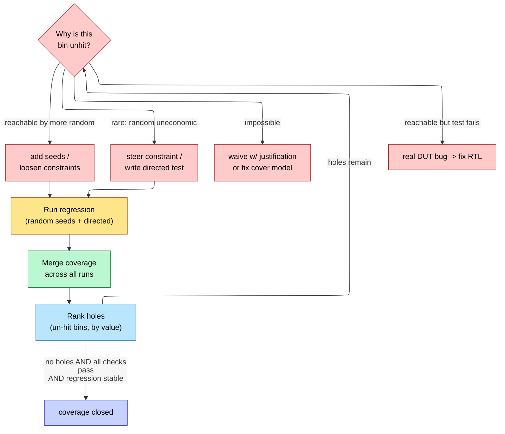

# Verification Planning and Coverage Closure

> **Prerequisites:** [UVM_Methodology](10_UVM_Methodology.md) (the testbench that runs the tests), [Assertions_and_Coverage](09_Assertions_and_Coverage.md) (how a cover point or assertion is written and sampled), [OOP_and_Randomization](08_OOP_and_Randomization.md) (constrained-random generation and steering).
> **Hands off to:** sign-off / tape-out readiness; [Formal_Verification](12_Formal_Verification.md) and [Gate_Level_Sim_and_Emulation](13_Gate_Level_Sim_and_Emulation.md) for the properties simulation alone cannot close.
>
> This page is the **management layer**: how you decide *what* to verify, *measure* progress, and declare *done*. The mechanics of writing a `covergroup`, an assertion, or a randomized sequence live in the sibling pages above; here we reason about the flow that wraps them.

---

## 0. Why this page exists

Verification has no natural end. A block with $F$ state flip-flops has up to $2^F$ reachable states and vastly more *sequences* through them; any simulation budget samples an astronomically small fraction. So functional verification is not a proof of correctness — that is what [formal](12_Formal_Verification.md) is for, on the narrow slice it can reach — it is **bounded sampling of an unbounded space**, and you can always run one more test that *might* find one more bug.

That single fact reframes the whole discipline. The hard problem is not writing a test; it is **defining "done"** and **measuring how close you are to it**. Three artifacts answer those two questions, and this page is about how they interlock:

- The **verification plan (vplan)** *defines the target*: the finite set of features and scenarios that must be exercised, each bound to a measurable coverage object. It is the map of the territory you commit to charting.
- **Coverage** *measures progress* against that target: what fraction of the planned scenarios stimulus has actually reached.
- **Closure** is the *feedback loop* that drives measured coverage up to the target while the rate of new-bug discovery decays toward zero.

The organizing idea of the page is the tension buried in that last clause. Coverage is **a map you drew** — it can only report holes in territory you thought to chart, so 100 % coverage is 100 % of *your model*, never of the design. That is why "done" needs **two orthogonal signals**, not one: coverage completeness (did I sample everywhere I planned?) *and* the bug-discovery-rate curve (is the sampling still turning up defects?). Neither alone is sufficient, and §5 shows exactly why. Everything in between — how the plan is built, why coverage saturates, how the last holes fall — derives from treating verification as a *sampling process with a cost model* and asking where the marginal test stops paying.

---

## 1. The verification plan: drawing the map

The vplan exists because of a structural asymmetry in how coverage works. **Code** coverage is instrumented automatically — the tool watches every line and toggle whether you asked or not. **Functional** coverage does not exist until an engineer writes a cover bin, so it measures exactly one thing: *"did stimulus hit the scenarios I thought to model?"* A scenario nobody modeled contributes nothing to the coverage denominator, so it can **never appear as a hole**. Functional coverage is therefore structurally incapable of reporting its own blind spots. The map cannot show you the parts of the territory you failed to survey.

That is the whole reason planning precedes stimulus. *What to model* is the load-bearing intellectual decision, and it must be made deliberately from the specification, before a single test is written — because whatever the plan omits, no amount of simulation will ever flag. The vplan is the executable definition of "done," and its completeness caps what coverage can ever tell you.

### 1.1 What the vplan must contain — derived from its job

The vplan has to do three things: translate the spec into a checkable list, bind each item to something *measurable*, and *prioritize* so finite effort lands on the features that matter. Read the contents of a vplan row as the consequences of those three obligations, not as a form to fill in:

1. **A feature to exercise** — one entry per spec behavior (every mode, every legal and illegal transaction, every corner named in the µarch spec). This is the translation of prose into a list.
2. **A stimulus method** — directed, constrained-random, or sequence — because *how* the feature is reached determines whether closure is cheap (random breadth) or must be hand-built (§4).
3. **A check** — scoreboard, reference model, or assertion — because a scenario that runs with nothing watching proves nothing; coverage without checking is theater.
4. **A coverage binding** — the specific cover point / cross / assertion that fires *if and only if* the feature was exercised. This is what makes the plan **executable**: modern tools annotate each row with its live coverage number, so an unlinked row is a visibly un-verified feature.
5. **A priority / risk weight** — because not all features are equal, and the whole point of §5's stopping rule is to spend the last, most expensive effort where an escaped bug would cost the most.

Everything else in a real vplan spreadsheet (owner, status %, test names) is bookkeeping around these five. The feature-to-coverage binding is the essential part: it is the contract that makes a coverage percentage *mean* "this fraction of planned behavior was reached" rather than "this fraction of some numbers went up."

### 1.2 Over- vs under-planning

Plan granularity is itself an optimization, and both extremes fail:

- **Under-planning** (too few, too-coarse bins) makes coverage close fast and cheap — but 100 % of a sparse map means little, because the gaps *between* bins are exactly where escapes hide. The metric becomes a comfortable lie.
- **Over-planning** (thousands of redundant or unreachable bins) makes coverage never close: effort drains into triaging and waiving bins that can never fire, and every bin costs simulation and analysis time. The metric becomes noise.

The right granularity puts a bin wherever a *miss* would correspond to a plausible bug class — fine enough that coverage is a faithful proxy for correctness, coarse enough that closure is not bin-triage busywork. Getting this wrong is the most expensive mistake on the page, because it is baked in before any test runs.

---

## 2. Coverage as sampling the target space

Once the map is drawn, coverage is the measurement of how much of it stimulus has visited. It comes in flavors because each is blind to what the others catch, and the differences are best read as *what each metric can and cannot logically tell you.*

**Code coverage** (line, statement, branch, toggle, FSM state+transition) is automatic and its value is entirely in its *contrapositive*. Covered code is not proven correct — you executed the line with, perhaps, the wrong check watching. But **un-covered code is definitely un-tested**: no stimulus reached it, full stop. So code coverage is a *sound necessary condition* only —

$$
\lnot\,\text{covered} \;\Rightarrow\; \lnot\,\text{tested}, \qquad\text{but}\qquad \text{covered} \;\not\Rightarrow\; \text{correct}
$$

— which is why a high code-coverage number alone proves nothing about correctness, yet a *low* one is an unarguable red flag. Use it to find dead spots, never to declare success.

**Functional coverage** (hand-written `covergroup`s) measures whether the *scenarios* you modeled were hit — the FIFO going full, every opcode, every burst length. It is the metric bound to the vplan, and its power is in **cross coverage**: the combinations. A single 4-bit field has 16 bins; crossed with a 3-way mode and a back-pressure flag it has $16\times3\times2 = 96$, and *bugs concentrate in the crosses* because designers handle each factor alone and miss the interaction (full FIFO **and** back-pressure **and** error injection, all at once). The catch is that you cannot cross everything — the bin count explodes multiplicatively — so choosing *which* crosses to write is a direct extension of the §1 planning judgment.

**Assertion coverage** asks whether each [SVA](09_Assertions_and_Coverage.md) property actually *fired* on a real antecedent rather than passing **vacuously** (true only because its precondition never occurred). A property that never triggers is a check that was never a check; assertion coverage is what unmasks it.

### 2.1 Why the coverage curve saturates — non-uniform sampling

Treat constrained-random simulation as drawing scenarios from a distribution: each transaction hits cover bin $i$ with some probability $p_i$ per draw, set by the constraints and the design's reachability. After $N$ independent draws, the probability that bin $i$ is *still* uncovered is

$$
\Pr[\text{bin } i \text{ unhit after } N] \;=\; (1-p_i)^N \;\approx\; e^{-p_i N}
$$

so the expected number of uncovered bins, and the coverage fraction, are

$$
\mathbb{E}[\text{holes}] \;=\; \sum_i e^{-p_i N}, \qquad
C(N) \;=\; 1 - \frac{1}{n}\sum_{i} e^{-p_i N}
$$

where $n$ = total planned bins, $p_i$ = per-transaction hit probability of bin $i$, $N$ = transactions simulated. This is the entire shape of every coverage-vs-effort curve you will ever see. Early on, the common bins ($p_i$ large) fall almost immediately and coverage shoots up. What remains after that first knee are exactly the **rare bins** ($p_i$ small), and the sum is then dominated by its slowest-decaying term — the *rarest* bin $p_{\min}$. The curve flattens not because stimulus stopped working but because the only bins left are the ones random almost never reaches. Coverage saturation is a property of the *distribution*, not of the testbench.

To make the wall quantitative: to hit a bin of probability $p$ with a miss chance of at most $\delta$ requires

$$
e^{-pN} \le \delta \;\Longrightarrow\; N \;\ge\; \frac{\ln(1/\delta)}{p}
$$

so the run length to close the tail scales as $1/p_{\min}$. Halving the rarest bin's probability *doubles* the simulation needed for the same confidence. A bin a random run reaches with probability $10^{-6}$ per transaction needs on the order of $10^{6}$ transactions just to have a fair chance — this is the precise meaning of "economically unreachable by random," and it is the hinge of the directed-vs-random decision in §4.

---

## 3. The closure loop and its long tail

Closure is the feedback controller that drives measured coverage to the vplan target. Each turn of the loop runs a regression, *merges* coverage across every seed and test (a bin hit by any run is covered), finds the remaining holes, and acts to close them:

The triage on each hole is the intellectual core of the loop, and its four branches map one-to-one onto §2.1's cost model: **more random** if the bin's $p_i$ is merely moderate (cheap); **directed or steered** if $p_i$ is so small that $1/p_i$ transactions is uneconomic (§4); **waive** if $p_i = 0$ because the bin is genuinely unreachable (dead code or an impossible cross — a *model* bug, not a stimulus gap); **fix RTL** if stimulus reaches the bin but the check fails there — the loop just found a real bug. Skipping this triage and blindly chasing 100 % is the classic failure: effort pours into unreachable bins that can never fire while real stimulus gaps go unexamined.

### 3.1 The coupon-collector tail

The long tail of §2.1 has a clean closed form in the uniform case. With $n$ equally-likely bins, the expected number of random draws to collect *all* of them is the coupon-collector result

$$
\mathbb{E}[T_{\text{all}}] \;=\; n H_n \;\approx\; n\,(\ln n + \gamma)
$$

where $H_n = \sum_{k=1}^{n} 1/k$ is the $n$-th harmonic number and $\gamma \approx 0.577$ is the Euler–Mascheroni constant. The revealing part is the *decomposition*: collecting the bin that takes you from $n{-}1$ to $n$ has per-draw success probability $1/n$, so it alone costs $\mathbb{E} = n$ draws — **the last single bin costs as much as the first ~63 % of all bins combined**. Real distributions are non-uniform (§2.1), which makes the tail worse, not better: the wall is $1/p_{\min}$ rather than $n$. Either way the lesson is the same and it is the defining economics of closure — *the last few percent of coverage consume the majority of the random-simulation budget*, so the last few percent is where you stop relying on random and switch tools (§4).

### 3.2 Ranking as a set-cover problem

A mature regression accumulates thousands of seeds, most of them redundant — many tests cover overlapping bins. The question "what is the smallest set of tests that still covers everything?" is exactly the **set-cover** problem: bins are the universe, each test covers a subset, find the minimum sub-collection whose union is the whole. It is NP-hard, but the coverage function

$$
f(S) \;=\; \Big|\,\bigcup_{t \in S}\text{bins}(t)\,\Big|
$$

is *monotone submodular* — adding a test to a larger set helps no more than adding it to a smaller one (diminishing returns is a theorem here, not a metaphor). Submodularity is what makes the **greedy** algorithm near-optimal: repeatedly pick the test contributing the most *new* bins. Greedy set cover lands within a factor $H_n \approx \ln n$ of optimal (and by Feige that is the best any polynomial algorithm can do), while for the "best $k$ tests" version greedy guarantees $\ge (1 - 1/e) \approx 63\%$ of the optimum.

This *is* what commercial **test grading / ranking** does: sort seeds by marginal new coverage, keep the front of the list, drop the redundant tail. A 10 000-seed nightly that closes coverage collapses to a few hundred graded tests hitting the same bins — because the marginal coverage $\Delta C_k$ of the $k$-th ranked test falls off monotonically and you truncate at the knee. That directly sets the **compute-cost vs turnaround** trade: the graded suite runs the same coverage in a fraction of the CPU-hours, which is why regressions are *tiered* — a tiny **smoke** suite (highest-marginal-value tests) for per-commit CI turnaround, the **full** seed pool nightly for coverage, and **coverage-focused** runs that execute only tests targeting the currently-open holes. Because seeds are independent, wall-clock turnaround is compute divided by farm size; grading shrinks the compute so a fixed farm answers faster.

---

## 4. Directed vs constrained-random: closing the last holes

The two stimulus styles have opposite cost structures, and §2.1 tells you exactly where each wins. Let $c_{\text{sim}}$ be the cost of one simulated transaction and $c_d$ the cost of a directed test (engineer time to author *and* maintain it). Hitting a bin of probability $p_i$ by random takes $\approx 1/p_i$ transactions, so

$$
C_{\text{random}}(i) \;=\; \frac{c_{\text{sim}}}{p_i}, \qquad
C_{\text{directed}}(i) \;=\; c_d \quad(\text{independent of } p_i)
$$

Random is cheapest for common bins and its cost *explodes as $1/p_i$* down the tail; directed pays a flat authoring cost no matter how rare the corner. Prefer directed exactly when

$$
\frac{c_{\text{sim}}}{p_i} > c_d \;\Longleftrightarrow\; p_i < \frac{c_{\text{sim}}}{c_d}
$$

With a directed test worth hours of engineer time (thousands to millions of sim-transactions-equivalent) and $c_{\text{sim}}$ tiny, the crossover sits somewhere around $p_i \sim 10^{-4}$–$10^{-5}$: above it, let random find the bin; below it, write the test. This is the rigorous form of the folk rule *"random for breadth, directed for the stubborn corners"* — random covers the fat head of the distribution for free, directed buys the rare tail at fixed cost, and there is a genuine crossover between them, not a matter of taste.

**Steering** is the Pareto middle. Rather than hand-author the whole scenario, bias the constraints (or use coverage-driven generation that automatically weights toward un-hit bins) to *raise* $p_i$ for the target corner — moving it left of the crossover so random reaches it economically again, at the cost of some constraint-authoring rather than a full directed test. The mechanics of constraints, distributions, and coverage-driven steering live in [OOP_and_Randomization](08_OOP_and_Randomization.md); the point here is *why* you reach for it — it converts a rare bin into a likely one for far less than the price of a bespoke test. Directed tests still earn their keep outright for reset/init sequences, known-hard corners, and fast smoke tests, where scripting the exact scenario is simply cheaper and more repeatable than coaxing a randomizer toward it.

---

## 5. Signoff: two orthogonal signals and when to stop

Here the page's organizing idea pays off. "Done" is a *joint* condition on two signals that measure different things, and the discipline is understanding why you need both.

**Signal 1 — coverage completeness.** Every vplan-linked functional bin hit (or waived with justification), code coverage at target, assertions non-vacuous. This answers *"did I sample everywhere on the map I drew?"*

**Signal 2 — the bug-discovery-rate curve.** Plot cumulative bugs found against cumulative test effort and it follows a saturating **reliability-growth** law (Goel–Okumoto and kin):

$$
\mu(t) \;=\; a\big(1 - e^{-b t}\big), \qquad
\frac{d\mu}{dt} \;=\; a\,b\,e^{-b t}
$$

where $\mu(t)$ = cumulative defects found by effort $t$, $a$ = total latent defects, $b$ = per-defect detection rate. The *instantaneous discovery rate* $d\mu/dt$ decays exponentially, and its decay is the real "done" signal: you stop when new bugs have become rare enough that the expected time to the next one exceeds your remaining schedule. This answers *"is the sampling still turning up defects?"*

### 5.1 Why both — the orthogonality

The two signals are orthogonal because each has a failure mode the other catches, and the two failure modes are precisely the two ways "done" goes wrong:

- **100 % coverage, bugs still surfacing.** Coverage is complete on the map, but the map was too coarse — bugs live in the gaps *between* bins and in scenarios the vplan never modeled (§1's blind spot). High coverage with a bug curve that has not flattened means *your coverage model is under-resolved*, not that you are done. Coverage completeness is necessary, never sufficient.
- **Flat bug curve, coverage holes remain.** No bugs found lately — but only because the stimulus that would reach the open bins has *not been run*. No stimulus, no bug, no coverage: the quiet is absence of *evidence*, not evidence of absence. A flat curve over a region you never exercised says nothing.

Only when **both** hold — the map is fully sampled *and* the sampling has stopped yielding defects — does the joint evidence support signoff. This is also why Signal 2 is indispensable and cannot be replaced by more coverage: a random test can wander into an *unmodeled* corner and trip the scoreboard even though no cover bin exists there, so the bug curve is the one instrument that can detect defects in the very territory the coverage map omits. It is the reality check on the plan itself.

### 5.2 Risk-based stopping

Because the space is unbounded, "all bugs found" is never provable; signoff is an economic decision. The marginal value of one more unit of verification effort is the reduction it buys in escape probability times the cost of an escape:

$$
\text{stop when}\quad \underbrace{-\frac{dP_{\text{esc}}}{dt}\cdot C_{\text{esc}}}_{\text{marginal benefit of more verification}} \;<\; \underbrace{c_{\text{verify}}}_{\text{marginal cost of continuing}}
$$

where $P_{\text{esc}}$ = probability of an escaped bug, $C_{\text{esc}}$ = cost of one (a mask respin is millions of dollars and months; a field failure can be far worse), $c_{\text{verify}}$ = cost per unit of continued effort. Both signals feed $P_{\text{esc}}$: residual risk is highest exactly where coverage is still open (unsampled) **and** where the bug curve has not flattened (defect-dense). Risk-based signoff therefore steers the *last*, most expensive effort toward the highest-residual-risk features rather than spreading it uniformly — and it is why a low-risk block may tape out with a waived corner while a safety-critical one chases every bin.

### 5.3 The operational gate

Signoff encodes the two signals plus the work that belongs to other engines. A block is verification-signed-off when:

- **Functional coverage = 100 %** of vplan-linked bins, or every gap waived with written justification (Signal 1).
- **Code coverage ≥ target** — commonly ~95–100 % line/branch, ~90 %+ toggle — with remaining gaps reviewed, not blindly waived.
- **All assertions pass and are proven non-vacuous**, and **all scoreboards/checks pass** — coverage at 100 % with a failing check is *not* closed.
- **Regression is green and stable** across a clean, reproducible seed set (no flakiness), and the bug-discovery rate has decayed (Signal 2). A sudden coverage *drop* between nightlies is almost always a stimulus-generation regression, not a design change — investigate before trusting the number.
- **Complementary engines have discharged what they own:** [formal](12_Formal_Verification.md) for control logic, CDC/connectivity, and unbounded properties; [lint/CDC/RDC](07_Lint_CDC_RDC_Signoff.md) for structural sign-off; [gate-level sim](13_Gate_Level_Sim_and_Emulation.md) for reset and timing-aware sanity that RTL simulation cannot see.

---

## 6. Numbers to memorize

| Quantity | Value | Why (section) |
|---|---|---|
| Verification share of effort | ~60–70 % of project | the dominant cost; "done" is the hard question (§0) |
| Cost to hit a bin of prob. $p$ by random | $\sim 1/p$ transactions | non-uniform sampling wall (§2.1) |
| Last coupon (uniform, $n$ bins) | $\sim n$ draws alone | the long tail of closure (§3.1) |
| Greedy test-ranking optimality | within $\ln n$ (set cover) / $\ge 63\%$ (max-$k$) | why grading works (§3.2) |
| Directed-vs-random crossover | $p_i \lesssim c_{\text{sim}}/c_d \sim 10^{-4}$–$10^{-5}$ | when to stop trusting random (§4) |
| Bug-discovery rate | decays $\propto e^{-bt}$ | the real "done" signal (§5) |
| Code coverage target | ~95–100 % line/branch, ~90 %+ toggle | un-covered = definitely un-tested (§2) |
| Functional coverage target | 100 % of vplan bins | the spec-linked metric (§1, §5) |
| Code vs functional | necessary vs (partial) sufficient | need both; neither alone (§2, §5) |
| Where bugs hide | **cross** bins & unmodeled scenarios | combinations, not singles (§2, §5.1) |
| Vacuous assertion | passes with no antecedent | assertion coverage catches it (§2) |
| Closure = | 100 % cov **and** all checks pass **and** stable regression **and** decayed bug rate | not just a coverage number (§5) |

---

## 7. Worked problems

**1 — Sizing the random tail (non-uniform sampling).** A regression has closed every bin except one rare corner that constrained-random reaches with probability $p = 2\times10^{-6}$ per transaction. To be 99 % sure of hitting it ($\delta = 0.01$) needs $N \ge \ln(100)/p = 4.6/(2\times10^{-6}) \approx 2.3\times10^{6}$ transactions. If a directed test costs the equivalent of $\sim10^{5}$ transactions to author and maintain, the crossover $p < c_{\text{sim}}/c_d = 10^{-5}$ is satisfied ($2\times10^{-6} < 10^{-5}$), so **write the directed test** — it is ~20× cheaper than waiting for random. This is §2.1 and §4 in one calculation.

**2 — The value of grading.** A nightly runs 8 000 seeds and closes coverage; a ranking tool reports that 240 seeds already cover every reachable bin (the rest are redundant by submodularity, §3.2). Regrading to those 240 cuts nightly compute ~33×, so on a fixed 100-machine farm the coverage answer returns in minutes instead of hours — the same closure at a fraction of the turnaround. The dropped 7 760 seeds contributed *zero* marginal bins, which is why greedy ranking loses nothing.

**3 — Reading the two signals (why 100 % isn't done).** Block A: functional coverage 100 %, but the weekly bug count is 6, 5, 7, 6 — flat and *nonzero*. Signal 1 is satisfied, Signal 2 is not: bugs are surfacing in scenarios the vplan under-modeled (§5.1), so the coverage model is too coarse — **not done**; refine bins around the failing scenarios. Block B: bug count 4, 1, 0, 0 (decayed), but functional coverage is stuck at 88 % with 200 open bins. Signal 2 looks satisfied, Signal 1 is not: the quiet is because the stimulus for those bins never ran — **not done**; the flat curve is meaningless over unexercised territory. Only a block with *both* 100 % coverage *and* a decayed bug curve clears §5.

**4 — Risk-based stop.** Two blocks each have one open low-probability corner. Block X is a debug register with escape cost $C_{\text{esc}} \approx$ one patch; Block Y is a cache-coherence path with $C_{\text{esc}} \approx$ a full respin. The marginal-benefit test $-\frac{dP_{\text{esc}}}{dt}C_{\text{esc}} < c_{\text{verify}}$ (§5.2) fires for X far sooner: waive X's corner and spend the remaining directed-test budget forcing Y's, because equal probabilities carry wildly unequal risk. Uniform effort would be the wrong allocation.

---

## Cross-references

- **Down the stack (the mechanics this flow orchestrates):** [Assertions_and_Coverage](09_Assertions_and_Coverage.md) (how a cover point, cross, or SVA property is written and sampled — the objects §2 measures), [OOP_and_Randomization](08_OOP_and_Randomization.md) (constrained-random generation, distributions, and coverage-driven steering — the stimulus engine of §3–§4), [UVM_Methodology](10_UVM_Methodology.md) (the testbench that runs the plan and collects the coverage).
- **Up / adjacent (complementary sign-off engines):** [Formal_Verification](12_Formal_Verification.md) (discharges the unbounded and control-dominated properties simulation samples but cannot prove — the other half of §5), [Lint_CDC_RDC_Signoff](07_Lint_CDC_RDC_Signoff.md) (structural sign-off feeding the §5.3 gate), [Gate_Level_Sim_and_Emulation](13_Gate_Level_Sim_and_Emulation.md) (timing-aware and reset sanity beyond RTL coverage).

---

## References

1. Piziali, A., *Functional Verification Coverage Measurement and Analysis*, Springer, 2004. The vplan, coverage model, and closure methodology of §1–§3.
2. Goel, A.L. and Okumoto, K., "Time-Dependent Error-Detection Rate Model for Software Reliability and Other Performance Measures," *IEEE Trans. Reliability*, R-28(3), 1979. The reliability-growth curve of §5.
3. Motwani, R. and Raghavan, P., *Randomized Algorithms*, Cambridge Univ. Press, 1995. Coupon-collector analysis behind §2.1 and §3.1.
4. Feige, U., "A Threshold of ln n for Approximating Set Cover," *Journal of the ACM*, 45(4), 1998. The greedy-ranking bound of §3.2.
5. Spear, C. and Tumbush, G., *SystemVerilog for Verification*, 3rd ed., Springer, 2012. Constrained-random + coverage-driven closure in practice.
6. Accellera, *Universal Verification Methodology (UVM) User's Guide*, 2020. The CDV loop the flow is built around.
