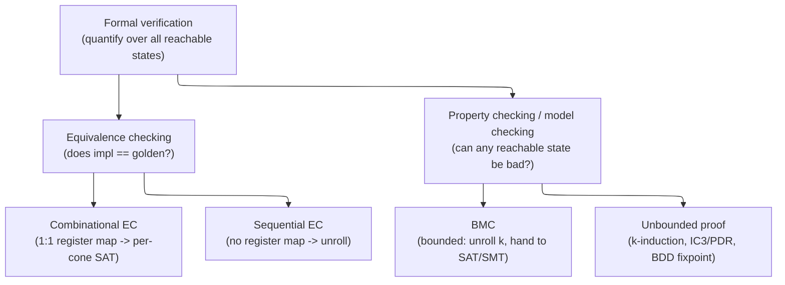
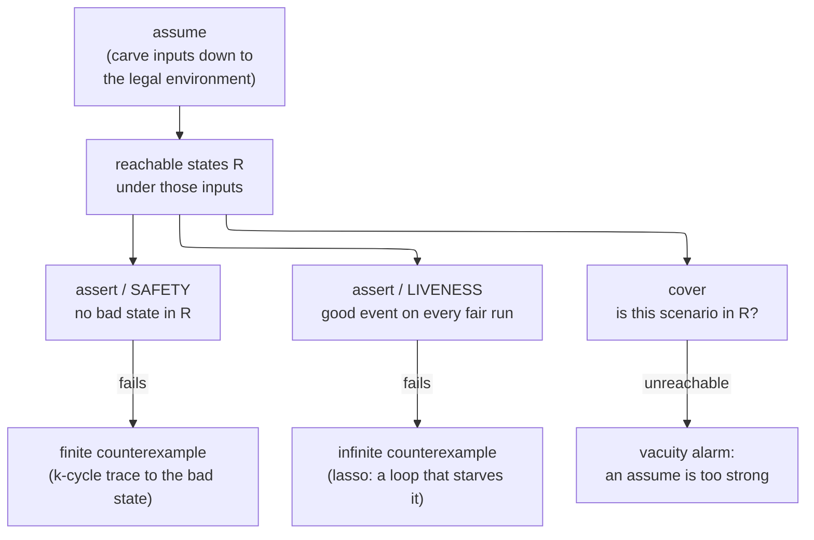
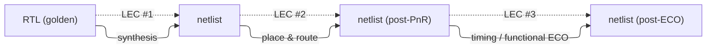

# Formal Verification — Proving Absence Instead of Sampling for Presence

> **Prerequisites:** [Assertions_and_Coverage](09_Assertions_and_Coverage.md) (SVA — the properties formal turns into proof obligations, and the assume/assert/cover triad), [OOP_and_Randomization](08_OOP_and_Randomization.md) (constrained-random simulation — the *sampling* method formal is the exhaustive counterpart to).
> **Hands off to:** [Lint_CDC_RDC_Signoff](07_Lint_CDC_RDC_Signoff.md) (the same prove-over-all-inputs idea aimed at structural bug *classes* — CDC/RDC/lint), [Verification_Planning_and_Coverage_Closure](11_Verification_Planning_and_Coverage_Closure.md) (how a proof counts toward signoff), and [Synthesis_and_Optimization](../04_Synthesis/01_Synthesis_and_Optimization.md) (the RTL→netlist transform that equivalence checking certifies).

---

## 0. Why this page exists

Every dynamic verification method — directed tests, constrained-random, emulation — is a **sampler**. It drives some finite set of input trajectories through the design and watches for a violation. A pass therefore means one thing only: *the bug you are looking for did not appear on the trajectories you happened to run.* This is Dijkstra's dictum made mechanical — **testing shows the presence of bugs, never their absence.**

Formal verification is the one method that inverts the quantifier. Instead of running trajectories, it reasons about the **set of all reachable states at once** and asks whether *any* of them can violate the property. The answer is a genuine theorem — "no reachable state violates $P$, for all inputs, for all time" — or a **concrete counterexample trace** that violates it. That exhaustiveness is the entire value of formal, and it has exactly one cost, from which every strength and every limitation of the field descends: to quantify over all reachable states you must somehow represent or search a set whose size is exponential in the number of state bits. That is **state explosion**, and it is the whole reason formal is a scalpel for control logic rather than a hammer for datapaths.

This page derives the field from that one tension. The old version of this page was a reference dump — a 170-line CDCL trace, four BDD worked examples, TCL command listings, and page after page of copy-paste SVA for AXI, FIFOs, tensor cores, NoCs, and GPUs. That is *lookup*, not understanding; the SVA belongs in [09](09_Assertions_and_Coverage.md), the CDC formal in [07](07_Lint_CDC_RDC_Signoff.md), and the solver internals in a SAT textbook. Here we build the concepts a senior engineer reasons *with*: why a bounded proof and a full proof guarantee different things, why a proof is only as strong as its assumptions, why equivalence checking scales to 50M gates while a 32-bit multiplier proof does not, and why — even though finite hardware is *decidable* — state explosion, not undecidability, is the wall you actually hit.

---

## 1. The one idea: sampling a space vs quantifying over it

Model a synchronous design as a finite-state machine $(S, I, T)$:

$$
S = \{0,1\}^{n}, \qquad I \subseteq S, \qquad T \subseteq S \times S
$$

where $n$ = number of state bits (flip-flops), $S$ = the state space, $I$ = the set of initial (post-reset) states, and $T(s, s')$ = the transition relation, true when input drives state $s$ to $s'$ in one clock. The **reachable set** $R$ is the least fixed point of forward image starting from $I$:

$$
R_0 = I, \qquad R_{i+1} = R_i \cup \operatorname{Image}(R_i, T), \qquad R = \bigcup_i R_i
$$

where $\operatorname{Image}(X, T) = \{\,s' \mid \exists s \in X.\; T(s, s')\,\}$ = the set of states one step from $X$. A **safety property** $P$ partitions $S$ into good and bad states; the design is correct iff no bad state is reachable, $R \cap \neg P = \varnothing$.

The two verification paradigms attack this set membership question from opposite ends:

- **Simulation samples $R$.** A run is *one* path $s_0 \to s_1 \to \dots$ through $R$. Passing means "no state on this path was bad." Coverage is the fraction of $R$ (or of a hand-built interesting subset) the samples touched; undetected bugs live in the unsampled remainder. Simulation can exhibit a bad state (a failing trace) but can never certify $\neg P \cap R = \varnothing$ short of enumerating all of $R$.
- **Formal quantifies over $R$.** It represents $R$ (or an over-approximation of it) *symbolically* — as a Boolean formula, a BDD, or implicitly by unrolling $T$ — and decides $R \cap \neg P \overset{?}{=} \varnothing$ in one shot. If empty: **PROVEN**. If not: it extracts a witness path from $I$ to the bad state — a **counterexample** that is as concrete and waveform-inspectable as any simulation failure.

The asymmetry is the whole point. Simulation is a one-sided test (can refute, cannot prove absence); formal is two-sided (proves absence *or* produces presence). And because $R$ is a set, not a sequence, formal's cost is set-representation, not trajectory-count — which is why it is **complementary** to simulation, not a rival: exhaustive over a small space versus sampled over a large one.



The rest of the page is these two branches — property checking (§3) and equivalence checking (§5) — plus the two things that govern both: the state-explosion budget that decides what is tractable (§2), and the environment model that decides whether a proof means anything (§4).

---

## 2. State explosion: the one fact that decides what formal can do

Everything formal is good at and everything it is bad at follows from a single inequality. The reachable set to be represented has size

$$
|R| \;\le\; |S| \;=\; 2^{\,n}
$$

where $n$ = state bits. **The cost of formal scales with $n$ (sequential state), not with logic depth or gate count.** This is the exact opposite of a human's intuition that "complicated" means "hard to verify," and it explains the entire good-at / bad-at split:

| Formal is **good** at | Why (state-space argument) |
|---|---|
| Control logic: FSMs, arbiters, schedulers | Few state bits ($n$ small), but deep, corner-case-rich sequential behavior — exactly where sampling misses and $2^n$ stays tractable |
| FIFOs, credit counters, queues | Small $n$; the interesting bugs (overflow, underflow, ordering) are rare deep interleavings a testbench rarely hits |
| Protocol compliance (AXI/CHI handshakes) | Temporal rules over a handful of control signals — natural safety/liveness properties, small state |
| Cache-coherence corner cases | Narrow but deep: few agents, but a combinatorial blowup of *interleavings* that only exhaustive search covers |
| Equivalence (RTL vs netlist) | Factors into millions of tiny independent combinational proofs (§5) — never builds the $2^n$ product |
| Formal is **bad** at | Why |
| Wide datapaths, 32/64-bit multipliers | Inputs alone span $2^{64}$–$2^{128}$; the transition relation over wide arithmetic explodes the symbolic representation |
| Large memories / register files | $n$ grows by one bit per storage bit; a 1 KB RAM adds 8192 state bits — $2^{8192}$ |
| Floating-point units | Wide operands + deep algorithms; the mantissa datapath is the multiplier problem with rounding on top |
| Deep pipelines end-to-end | Need to unroll >100 cycles; the depth $\times$ width product overwhelms the solver |

The lesson is a *partitioning* one: point formal at the **control** (small $n$, deep behavior) and simulation or word-level/SMT methods at the **datapath** (large $n$, shallow-but-wide behavior). A 32-bit multiplier is not "too complex" for formal — it has trivial control — it is too *wide*: its state and its input space are what explode. Conversely a 12-state arbiter with a subtle two-deep livelock is trivially small yet nearly impossible to hit by sampling. Recognizing which side of this line a block sits on is the single most valuable judgment in deploying formal, and it is why the datapath circuits themselves ([Adders_and_Multipliers](../00_Fundamentals/03_Adders_and_Multipliers.md)) are verified by other means.

---

## 3. Property checking: an assertion as a proof target

In simulation an assertion is a **monitor** — it fires only if the stimulus happens to drive the violating scenario ([09](09_Assertions_and_Coverage.md)). In formal the *same* assertion becomes a **proof obligation**: the tool treats $\neg P$ as the bad-state predicate and searches all of $R$ for a state that satisfies it. Nothing about the SVA changes; what changes is that reaching the violation is now the tool's job, discharged exhaustively, not the testbench's job, discharged by luck.

Two families of property matter, and they need different machinery:

- **Safety** — "nothing bad ever happens" (`$onehot0(grant)`, `count <= DEPTH`). Violated by a *finite* trace to a bad state. This is the bread and butter of formal.
- **Liveness** — "something good eventually happens" (`$rose(req) |-> s_eventually ack`). Violated only by an *infinite* trace (a loop that starves the good event forever). Needs fairness constraints and lasso-shaped counterexamples; more expensive and more fragile, so used sparingly for the properties that genuinely require it (no deadlock, no starvation).

The symbolic solution to safety is the reachability fixpoint of §1: iterate $R_{i+1} = R_i \cup \operatorname{Image}(R_i, T)$ until $R_{i+1} = R_i$, then test $R \cap \neg P$. Done with BDDs this is *symbolic model checking* — exact, canonical, but it dies when the BDD for $R$ blows up (below). The modern engines avoid ever building $R$ explicitly.

**The three safety engines, conclusion-first — same question ("can any reachable state be bad?"), different reach:**

- **BMC (§3.1)** — *unroll the design $k$ cycles and SAT-check for a violation within those $k$.* Finds shallow bugs fast; proves nothing beyond depth $k$.
- **k-induction (§3.2)** — *bolt an inductive step onto that same unrolling so a bounded check becomes an all-time proof.* Can prove unbounded safety — when the property is $k$-inductive.
- **IC3 / PDR (§3.3)** — *prove the same all-time safety without unrolling at all,* by discovering an inductive invariant incrementally.

The next three subsections are exactly these, in order; §3.4 then pins down what "bounded" versus "full" each one buys.

### 3.1 BMC: unroll the transition relation and hand it to SAT

Bounded model checking asks the strictly easier question "is there a bad state reachable **within $k$ cycles**?" and encodes it directly as one satisfiability problem by unrolling $T$:

$$
\underbrace{I(s_0)}_{\text{start reachable}} \;\wedge\; \underbrace{\bigwedge_{i=0}^{k-1} T(s_i, s_{i+1})}_{\text{$k$ legal steps}} \;\wedge\; \underbrace{\Big(\bigvee_{i=0}^{k} \neg P(s_i)\Big)}_{\text{some step is bad}}
$$

where $s_0,\dots,s_k$ are fresh copies of the state variables, one per cycle. Hand this CNF to a SAT solver (or an SMT solver, when the design has word-level structure worth exploiting):

- **SAT** → the satisfying assignment *is* a counterexample: a concrete $k$-cycle waveform from reset to the violation. BMC is therefore a superb **bug hunter** — it finds the shortest failing trace and does it fast.
- **UNSAT** → the property holds for **all** inputs for the first $k$ cycles. Note what this is: a real theorem, exhaustive over the whole input space to depth $k$ — categorically stronger than any simulation sample of the same depth.

The engine underneath is a modern CDCL SAT solver, whose one trick worth knowing is **conflict-driven clause learning**: on each contradiction it derives a new clause that forbids the *class* of assignments that caused it, pruning an exponential subtree so the same conflict never recurs. That single mechanism is why solvers dispatch instances with millions of variables in seconds where naive backtracking would run past the age of the universe — but it is an implementation detail, not a concept you reason with. What you reason with is the shape of the formula above.

BMC's limitation is in its name: UNSAT at depth $k$ says nothing about cycle $k{+}1$. A bug hiding one cycle past your bound is invisible. To turn a bounded result into a full proof you either reach the **completeness threshold** (the reachability diameter — the longest shortest path in the state graph, beyond which no new states appear) or, far more commonly, switch to an inductive engine.

### 3.2 From bounded to unbounded: k-induction, and why naive induction fails

Induction over *time* promotes a bounded check into a proof for all time. It has two obligations:

$$
\textbf{Base:}\quad I(s_0) \wedge \textstyle\bigwedge_{i=0}^{k-1} T(s_i,s_{i+1}) \;\wedge\; \bigvee_{i=0}^{k}\neg P(s_i) \quad\text{is UNSAT}
$$

$$
\textbf{Step:}\quad \underbrace{\textstyle\bigwedge_{i=0}^{k-1} P(s_i)}_{k \text{ good states}} \wedge \textstyle\bigwedge_{i=0}^{k-1} T(s_i,s_{i+1}) \;\wedge\; \neg P(s_k) \quad\text{is UNSAT}
$$

The base case (identical to BMC) says no violation occurs in the first $k$ steps from reset. The inductive step says: from *any* run of $k$ consecutive good states, the next state is also good. Both UNSAT ⇒ $P$ holds on all of $R$ forever.

The subtlety — the thing worth internalizing — is **why $k=1$ so often fails**. The inductive step lets $s_0$ be *any* state satisfying $P$, **not only a reachable one**. If some *unreachable* state $s_0$ happens to satisfy $P$ yet has a transition into $\neg P$, the step is SAT and induction fails — even though the property is actually true, because that $s_0$ can never occur. This spurious witness is a **counterexample to induction (CTI)**, and it is an artifact of the gap $\{s : P(s)\} \supsetneq R$: you are inducting over a superset of the reachable states. Two fixes:

1. **Increase $k$.** Requiring $k$ consecutive $P$-states with real transitions between them rules out many unreachable $s_0$, because no path of length $k$ actually leads into them. Most real properties are $k$-inductive for small $k$ (typically 1–20; needing $k>50$ is a strong signal the property really needs strengthening instead).
2. **Strengthen the invariant.** Prove $P \wedge \varphi$ instead of $P$, where $\varphi$ is an auxiliary invariant that excludes the offending unreachable states — tightening $\{s : P \wedge \varphi\}$ down toward $R$ until it is *inductive*. Finding $\varphi$ by hand (extra assertions that "help" the proof) is the real intellectual labor of formal signoff.

### 3.3 IC3/PDR: learning the strengthening automatically

The state-of-the-art unbounded engine, IC3 / property-directed reachability (Bradley, 2011), removes the hand-written-invariant burden. It maintains a sequence of **frames** $F_0 = I,\ F_1,\ F_2,\dots$, each an over-approximation of the states reachable in at most $i$ steps, represented as a growing conjunction of learned clauses. When it finds a state in $F_N$ that can reach $\neg P$, it tries to prove that state unreachable by recursively **blocking** it — learning a clause, *relatively inductive* to the current frame, that excludes it — and either traces the obligation back to $I$ (a real counterexample) or converges when two adjacent frames coincide, $F_i = F_{i+1}$ (that frame *is* an inductive invariant → PROVEN). It never unrolls to the diameter and never builds the $2^n$ product; it discovers the strengthening $\varphi$ of §3.2 incrementally, the same way CDCL discovers clauses. This is why IC3/PDR routinely proves control-heavy designs that defeat both BDD fixpoints and plain k-induction, and why it is the default engine behind JasperGold and VC Formal.

### 3.4 Bounded proof vs full proof: what each guarantees, and when each is enough

The single most important distinction to state cleanly at a review:

| | **Bounded proof (BMC to depth $k$)** | **Full proof (unbounded: k-induction / IC3)** |
|---|---|---|
| Guarantee | No violation in the first $k$ cycles, over **all** inputs | No violation **ever**, over all inputs and all time |
| Silent about | Anything at cycle $k{+}1$ and beyond | Nothing |
| Best at | Finding bugs fast; shallow properties | Signoff; safety invariants |
| Fails by | Bug just past the bound | Non-convergence (needs strengthening/abstraction) |

The design decision is **bug-hunting formal vs full-proof signoff**, and it has a clean cost model. Empirically bug depth is front-loaded — most real bugs manifest within a few transactions of reset — so the probability that BMC to depth $k$ catches a given bug rises steeply with $k$ and then saturates, while SAT solve time grows with the unrolled formula size $\propto k\cdot|T|$, usually super-linearly. So in *bug-hunting mode* you push $k$ until either the property converts to an unbounded proof or solve time explodes, and you accept the bounded result: a bounded proof to a depth of (reset depth + a few times the deepest transaction) catches essentially every real bug, which is why BMC alone is a huge net even before any full proof. In *signoff mode* you spend the extra effort — strengthening invariants, abstraction — to convert the properties that actually gate tape-out into unbounded proofs, and you argue explicitly for any property left bounded (tool reports "PROVEN at depth 42" for unbounded vs "bounded to 100" for the rest). "Always aim for unbounded, budget for bounded" is the whole policy.

### 3.5 One property wrapper: what the formal tool actually consumes

Everything above is machinery for *discharging* properties; here is what a property *is*. Three keywords carry the entire formal vocabulary and do three different jobs — define them plainly before reading any wrapper:

- **`assert`** — a **proof obligation**. The tool must show it holds on *every* reachable state (safety) or *every* fair infinite run (liveness), or hand back a counterexample. This is the thing being proven.
- **`assume`** — a **constraint on the tool**, not a check on the DUT. It restricts the inputs to the legal environment (§4); the tool takes it as given. A wrong `assume` silently weakens every `assert` in the run.
- **`cover`** — a **question**, not a claim: "is this scenario reachable at all?" Reachable is the *good* answer (the space is alive, non-vacuous); unreachable means the assumes strangled it (§4).

A safety `assert` and a liveness `assert` differ only in the *shape of the counterexample* the tool returns — a finite trace to a bad state versus an infinite lasso that starves the good event forever (§3):



Concretely, all four kinds land in one small wrapper bound to an $N$-way arbiter — the canonical small-$n$, deep-corner block of §2. This is *what the tool reads*: no stimulus, no clock generator, just the environment model plus the obligations.

```systemverilog
// fv_arbiter.sv -- formal property wrapper for an N-way arbiter.
// Bind to the DUT; the formal tool consumes the assume/assert/cover below.
// The concurrent properties are FORMAL-tool-only: Icarus is a simulator
// front end and does not implement concurrent_assertion_item, so they sit
// behind `ifdef FORMAL (the same idiom riscv-formal/picorv32 use) and the
// bare skeleton still compiles with
//   iverilog -g2012 -o /dev/null fv_arbiter.sv
module fv_arbiter #(parameter int N = 4) (
    input logic         clk,
    input logic         rst_n,
    input logic [N-1:0] req,     // one bit per requester
    input logic [N-1:0] grant    // grant vector from the arbiter
);

`ifdef FORMAL
    // ASSUME: input constraint the tool MAY take for granted.
    // A requester holds req until granted (no glitch-and-drop).
    m_req_stable: assume property (@(posedge clk) disable iff (!rst_n)
        (req[0] && !grant[0]) |=> req[0]);

    // SAFETY: mutual exclusion -- at most one grant. Finite counterexample.
    a_onehot: assert property (@(posedge clk) disable iff (!rst_n)
        $onehot0(grant));

    // SAFETY: never grant an idle channel.
    a_no_spurious: assert property (@(posedge clk) disable iff (!rst_n)
        (grant & ~req) == '0);

    // LIVENESS: a held request is eventually granted (no starvation).
    // Counterexample is an infinite lasso trace; needs a fairness constraint.
    a_no_starve: assert property (@(posedge clk) disable iff (!rst_n)
        req[0] |-> s_eventually grant[0]);

    // COVER: reachability / vacuity guard -- can the top channel ever win?
    c_grant_hi: cover property (@(posedge clk) disable iff (!rst_n)
        grant[N-1]);
`endif

endmodule
```

Read it as the page in miniature: `m_req_stable` is the environment model of §4 — drop it and `a_no_starve` gets a trivial "the request just vanished" counterexample, an *under-constrained* false CEX; `a_onehot` / `a_no_spurious` are the §3 safety bread-and-butter a BMC run refutes with a one-cycle trace; `a_no_starve` is the expensive §3 liveness property whose proof needs fairness and a lasso search; and `c_grant_hi` is the §4 vacuity guard — if it returns unreachable, an `assume` is too strong and the green asserts mean nothing. **Compile status:** the module skeleton compiles clean under `iverilog -g2012 -o /dev/null fv_arbiter.sv` (exit 0); the four concurrent properties are syntactically faithful SVA that a real formal tool (JasperGold, VC Formal, SymbiYosys) consumes but Icarus — a simulator front end — does not, which is exactly why they sit behind the `ifdef FORMAL` guard.

---

## 4. Assumptions: a proof is only as good as its environment

A DUT is an **open system** — its primary inputs are driven by an environment you are not verifying. Formal must model that environment, and it does so with **assumptions** (`assume property`) that carve out the legal input space. Every result is conditional on them:

$$
\text{the tool proves}\quad \Big(\bigwedge \text{Assumptions}\Big) \;\Rightarrow\; \text{Assertion}
$$

This conditional is a knife-edge with a failure mode on each side, and getting it wrong is the most common way a "green" formal run is worthless:

- **Under-constrained** → **false counterexamples.** Too few assumptions leave the tool free to drive inputs the real environment never would (an AXI master that drops `awvalid` mid-handshake, a bus that violates its own protocol). The tool dutifully finds a "bug" that cannot occur in the system. Each spurious CEX costs engineer time to diagnose and dismiss, and the temptation is to over-correct.
- **Over-constrained** → **vacuous / false proof.** Too many (or too strong) assumptions shrink the legal input space until the property becomes trivially or vacuously true — you proved something about a subspace the design never actually operates in, possibly the empty set. The assertion is green and *meaningless*. This is the dangerous failure, because it is silent: an over-constrained proof looks exactly like a real one.

The formal guard against vacuity is the third member of the triad — **cover properties**. A `cover` is a reachability check ("can this scenario happen at all under the assumptions?"). If a cover you *expect* to be reachable comes back unreachable, your assumptions have strangled the input space — the environment is over-constrained. Every serious formal run therefore pairs assertions with a battery of covers whose job is to prove the assumptions did not accidentally rule out legal behavior. The minimal shape:

```systemverilog
// environment model: legal inputs only (too many of these -> vacuous proof)
assume property (@(posedge clk) disable iff (!rst_n)
    awvalid && !awready |=> awvalid);            // master holds AW until accepted

// obligation on the DUT (an assertion == the proof target)
assert property (@(posedge clk) disable iff (!rst_n)
    bvalid |-> bresp inside {OKAY, SLVERR});     // slave never emits an illegal response

// vacuity guard: prove the interesting case is still reachable
cover  property (@(posedge clk)
    awvalid && awready && awlen == 8'hFF);        // can a max-length burst even happen?
```

**Assume-guarantee** reasoning is how the same idea scales past state explosion. Instead of composing two blocks A and B into one machine (whose $n$ is the sum, blowing up $2^n$), you verify A *assuming* B's outputs obey B's specification, then verify B *assuming* A's, and compose the two proofs. Each sub-proof sees a small state space; the *guarantee* one block proves becomes the *assumption* the other relies on. The soundness obligation is that the reasoning is not viciously circular — either the dependency is acyclic, or the circular case is discharged by an induction over time (each block's guarantee at cycle $t$ depends only on the other's up to $t{-}1$). This is the decomposition that lets formal touch subsystems it could never verify monolithically, and it is why interface specifications are written as reusable assume/guarantee pairs.

---

## 5. Equivalence checking (LEC): the formal workhorse

Logic equivalence checking answers a different question from property checking — not "is this design correct?" but "does **this** design compute the same function as **that** one?" It is the most-used formal method in the industry by a wide margin, because every RTL-to-GDSII flow transforms the design many times and each transform must be certified functionally identical:



Re-simulating equivalence is hopeless for the same $2^{64}$ reason a 32-bit adder is (§0): you would need every input vector. LEC instead **proves** golden ≡ revised over all inputs with no vectors, via a **miter**: drive identical inputs into both designs, XOR each pair of corresponding outputs, OR the XORs into one *difference* signal, and prove that signal is unsatisfiable (0 for every input). Equivalent iff the miter is UNSAT.

### 5.1 Combinational EC — why it scales to 50M gates

The workhorse case assumes the two designs share a **1:1 register mapping** — synthesis kept the flops, only the combinational logic between them changed (gate substitution, De Morgan, constant propagation, tech mapping). Then the sequential problem *factors*: cut the design at every register boundary, and each register data input and primary output becomes a **compare point** whose combinational fan-in is a **cone of logic**. Prove each cone pair equivalent independently:

$$
\forall\,\text{inputs}:\quad \text{cone}^{\text{golden}}_j(\text{inputs}) \;\equiv\; \text{cone}^{\text{revised}}_j(\text{inputs}) \qquad \text{for each compare point } j
$$

An $N$-gate design with $M$ registers becomes $M$ small, *independent* SAT/BDD checks instead of one $2^n$ sequential problem — the state never has to be enumerated at all. This factorization is the entire reason LEC handles 50M+ gate designs in minutes-to-hours: it converts one intractable sequential proof into millions of tractable combinational ones. When cones differ only in *how* they compute (AND-OR vs NAND-INV, a re-associated adder tree), the SAT/BDD proof still shows them functionally identical. BDDs shine at this specific step because equivalence of two BDDs is an $O(1)$ pointer comparison once built — though the build itself can blow up on multiplier-like cones with a bad variable ordering, which is where SAT and datapath-aware engines take over.

### 5.2 Sequential EC — when the register map is gone

Some transforms deliberately change the state encoding: **retiming** moves logic across flops, **FSM re-encoding** renumbers states, **clock-gating** insertion and **high-level (C-to-RTL)** synthesis break the 1:1 map entirely. Now there is no compare-point-to-compare-point correspondence to exploit, and combinational EC does not apply. **Sequential equivalence checking (SEC)** proves the weaker-but-sufficient claim that the two designs produce identical output *sequences* for identical input *sequences*, cycle by cycle — reasoning across time by bounded unrolling or by finding an inductive relation between the two state spaces. It is far more expensive (it is essentially model checking a product machine) and is reserved for exactly the transforms that broke the map. The practical rule: combinational EC on every ordinary synthesis/PnR/ECO step (cheap, run constantly), SEC only when retiming or re-encoding forces it.

The reason LEC is the method every shop runs — even shops that do zero property checking — is that it is **push-button relative to model checking**: no assertions to write, no environment to constrain, no invariants to strengthen. The property is fixed ("compute the same function") and the compare-point structure is derived automatically. Its failures are almost always *setup* issues, not real bugs — an unmapped point from a name change, a constant the tool did not know was tied off, a merged multibit flop — which is why the debug loop is "reconcile the mapping against the synthesis log," not "find the design error."

---

## 6. The trade-offs: formal vs simulation, and the knobs inside formal

### 6.1 Exhaustive-but-small vs sampled-but-scalable

The top-level choice is not formal *or* simulation — it is which method owns which block, and the deciding variable is again the state-space size $n$ of §2.

| | **Formal** | **Simulation** |
|---|---|---|
| Guarantee | Exhaustive: absence of bugs for the property | Sampled: presence only; coverage is a fraction |
| Scales with | Small $n$ (control); dies on large $n$ (datapath) | Any $n$, but reach grows only with cycles run |
| Setup cost | High: assumptions, invariants, expertise | Moderate: stimulus, checkers, coverage model |
| Best block | Arbiters, FIFOs, protocol, coherence, control FSMs | Wide datapaths, full-chip integration, system scenarios |
| Best mode | Corner cases sampling never hits | Bulk functional coverage, realistic workloads |

They are complements: formal nails the deep, narrow control corners that random stimulus ([08](08_OOP_and_Randomization.md)) would need astronomically many cycles to hit, and simulation carries the wide datapaths and full-system scenarios where $2^n$ puts formal out of reach. The crossover is roughly where a block's *control* state is small enough to prove but its *datapath* state is too wide — which is why the standard pattern is "formal the controller, simulate the datapath, and let the two coverage stories add up" in the plan ([11](11_Verification_Planning_and_Coverage_Closure.md)).

### 6.2 Abstraction vs precision — fighting state explosion on purpose

When a proof will not converge because $n$ is too large, you shrink $n$ by **abstraction**, replacing the design $D$ with an over-approximation $\hat D$ that has *more* behaviors ($\hat D \supseteq D$). Abstraction is sound *for proving*: if $P$ holds on $\hat D$ it holds on the smaller $D$. The price is precision — $\hat D$'s extra behaviors can yield a **spurious counterexample** on abstract-only behavior, which you must check against the concrete design and, if spurious, use to *refine* the abstraction (the CEGAR loop). The menu, from lossless to lossy:

- **Cone-of-influence (COI) reduction** — delete every signal outside the property's fan-in. **Exact and free**: those signals provably cannot affect the property, so removing them changes nothing. Always on.
- **Black-boxing** — replace a memory or datapath sub-block with a free input (reads return any value). Cheap, large $n$ reduction; may mask bugs inside the box.
- **Data / width abstraction** — prove at 4-bit datapath, argue structurally up to 32-bit. Turns an intractable width into a tractable one; needs a soundness argument to lift.
- **Counter / symmetry abstraction** — model a counter as {zero, nonzero, max}; verify one instance of a symmetric array and extend by argument.

The trade is always the same: each abstraction buys tractability with a risk of false counterexamples (never false proofs — over-approximation is sound in the safe direction). COI is the free lunch; everything below it trades precision for reach.

### 6.3 Effort and expertise vs coverage; the two operating modes

Formal's dominant cost is **engineer expertise**, not compute. Writing the right assumptions (§4), inventing the strengthening invariants that make a property inductive (§3.2), and choosing abstractions (§6.2) is skilled, iterative labor — the reason formal is deployed selectively rather than everywhere. The ROI split is:

- **Bug-hunting formal** — light setup, run BMC, accept bounded proofs, harvest deep bugs simulation missed. High return per hour, low ceiling. Appropriate for most blocks as a supplement to a simulation plan.
- **Full-proof signoff** — heavy setup, unbounded proofs, exhaustive assumption review, vacuity/cover checks. High assurance, high cost. Reserved for blocks where a proof *replaces* simulation as the signoff argument — small, critical, control-dominated IP (arbiters, coherence, security-critical access control).

The signoff bar itself is qualitatively unlike simulation's: there is no "percentage covered." A property is PROVEN (unbounded) or BOUNDED to a justified depth or it is not signed off; every cover must be reachable (no vacuity); and every assumption must be reviewed as a real environmental constraint, not a proof crutch. Coverage in formal is binary per property — which is exactly the exhaustiveness of §0 cashed out as a signoff criterion.

---

## 7. Theoretical limits: decidable but intractable, and why bounded proofs still matter

It is worth being precise about *what kind* of hard formal verification is, because the folklore ("verification is undecidable") is only half right:

- **Finite-state hardware is decidable.** With $n$ flops the reachable set $R$ is finite and computable, so model checking a fixed RTL block *always terminates* with PROVEN or a counterexample. This is the sharp difference from general **software** verification, which is undecidable — Rice's theorem says no algorithm decides nontrivial semantic properties of arbitrary programs, a direct descendant of the halting problem. Hardware escapes this because it has no unbounded memory or unbounded loops: the state is finite by construction.
- **Decidable is not tractable.** Reachability/model-checking is **PSPACE-complete** in the size of the machine description, and the state graph is $2^n$. So the wall you actually hit is not undecidability but the **exponential** — state explosion (§2). The problem is solvable in principle and often intractable in practice; all the engineering (BDDs, BMC, IC3, abstraction) is about dodging the $2^n$, not about dodging undecidability.
- **The undecidability flavor returns with unboundedness.** The moment the thing you verify has an *unbounded* parameter — arbitrary memory depth, a parameterized $N$-agent protocol proved for *all* $N$, or a software/ISA model with unbounded data — you leave the finite-state world and lose the termination guarantee. Then you are back to induction and abstraction with no completeness promise, exactly as in software proof.

This is why **bounded results still matter**, and matter a great deal. Even when a full proof is out of reach, a BMC run to depth $k$ is a genuine theorem — *no violation for any input for $k$ cycles* — which is categorically stronger than a simulation sample of the same depth, because it is exhaustive over the input space rather than a handful of trajectories through it. Three facts make bounded formal indispensable rather than a consolation prize: (1) if $k$ reaches the completeness threshold (the diameter), the bounded proof *is* a full proof; (2) real bugs are overwhelmingly shallow, so modest $k$ catches what directed simulation never would; and (3) a bounded proof composes cleanly with a coverage argument to bound residual risk in the plan. Exhaustive-to-depth-$k$ beats sampled-to-depth-$k$ every time — which is the whole thesis of this page, restated at its theoretical floor.

---

## 8. Where formal actually ships (and where its details live)

Formal is not one tool but a family of **apps**, each a specialization of §3–§5 aimed at a bug class. To keep this page concept-first, the mechanics of the two biggest apps live on their own pages; the rest are one-liners you should recognize:

- **Assertion-based property checking (FPV)** — the general model checking of §3–§4, applied to designer- or protocol-supplied SVA. The property *language* and the observability/completeness theory of assertions is [Assertions_and_Coverage](09_Assertions_and_Coverage.md); this page is what happens when those assertions become proof targets.
- **CDC / RDC formal** — proves synchronizer *stability* and no-metastability-propagation across a clock or reset crossing exhaustively, catching functional CDC bugs structural lint cannot. This is a formal app but it belongs to the static-signoff story: see [Lint_CDC_RDC_Signoff](07_Lint_CDC_RDC_Signoff.md), with the metastability/MTBF physics in [Async_Design_and_CDC](06_Async_Design_and_CDC.md). Not re-derived here.
- **Connectivity formal** — auto-generates thousands of "source pin $\equiv$ destination pin" properties from an SoC spreadsheet and proves the routing at integration, before any simulation. A trivial property class ($n$ tiny per net) that would be maddening to test by hand.
- **X-propagation formal** — proves that after reset every flop is $\in \{0,1\}$ and that no `X` from an uninitialized register can reach control logic, closing the well-known gap between optimistic and pessimistic `X` semantics in simulation.
- **Domain sweet spots** worth naming, all instances of "small control / deep corners": **cache-coherence** protocols ([Cache_Microarchitecture](../01_Architecture_and_PPA/01_CPU_Architecture/04_Cache_Hierarchy/01_Cache_Microarchitecture.md), [ACE_and_CHI](../01_Architecture_and_PPA/01_CPU_Architecture/06_Coherence_and_Consistency/03_ACE_and_CHI.md)), **NoC deadlock/livelock freedom** ([Network_on_Chip](../01_Architecture_and_PPA/04_SoC_and_Chiplet_Architecture/04_On_Chip_Networks/01_Network_on_Chip.md)), and **ISA compliance** via the open riscv-formal framework ([RISC_V_ISA](../01_Architecture_and_PPA/01_CPU_Architecture/01_Core_Foundations/02_RISC_V_ISA.md)). For wide accelerator datapaths (tensor cores, GEMM arrays) formal is used only *with* datapath abstraction (§6.2) — prove a 4-bit tile, argue up — with the wide arithmetic left to simulation.

---

## 9. Numbers to memorize

Order-of-magnitude values a senior engineer should carry; the *why* is in the cited section.

| Quantity | Typical | Range | Why / note (section) |
|---|---|---|---|
| Exhaustive-sim cost, 32-bit adder | infeasible | $2^{64}$ vectors ≈ 584 yr @ 1 GHz | Motivates proof over sampling (§0) |
| SAT solver capacity | ~1M vars | 1M–100M+ vars, 5M–500M+ clauses | CDCL + clause learning (§3.1) |
| BDD practical limit | — | $10^{6}$–$10^{8}$ reachable states | Blows up on bad ordering / multipliers (§3, §5.1) |
| BMC depth (bug hunting) | 10–100 cyc | up to 1000+ w/ abstraction | Bounded proof; front-loaded bug depth (§3.1, §3.4) |
| Completeness threshold | design-specific | 20–200 cyc | Diameter → bounded becomes full (§3.1, §7) |
| k-induction depth $k$ | 1–20 | 1 (most props) to <50 | $k>50$ ⇒ needs strengthening (§3.2) |
| LEC design capacity | 50M+ gates | 100K–50M+ per block | Cone factorization (§5.1) |
| LEC compare points | — | 10K–1M+ per run | One per register/output cone (§5.1) |
| LEC first-pass rate | >99% | — | Failures are setup, not bugs (§5.2) |
| Properties per block | — | 50–200 (FIFO/arbiter) to 1K–10K (CPU) | Complexity-driven (§3, §8) |
| Property mix | — | safety 70–80%, liveness 10–20%, cover 10–15% | Safety dominates (§3) |
| Assumptions | — | 20–50% of assertion count | Environment model (§4) |

Memory-hierarchy and metastability MTBF numbers that used to live here belong with the physics: MTBF and the $\tau$/$W$ synchronizer model are in [Async_Design_and_CDC](06_Async_Design_and_CDC.md); the CDC signoff numbers are in [07](07_Lint_CDC_RDC_Signoff.md).

---

## 10. Worked reasoning

**1 — Why a bounded proof beats a directed test of equal depth.** A control FSM has a livelock reachable only by a specific 6-cycle input interleaving. A directed/random suite samples, say, $10^6$ 6-cycle windows out of a legal input space of $2^{6\cdot w}$ (with $w$ input bits/cycle); the chance of hitting the exact interleaving is vanishing. BMC to $k=6$ encodes $I(s_0)\wedge\bigwedge T \wedge \bigvee \neg P$ over *all* inputs and returns the interleaving as its SAT witness on the first solve. Same depth; exhaustive vs sampled — the entire value proposition (§0, §7).

**2 — Diagnosing an over-constrained proof.** An AXI slave's response-legality assertion (§4) proves instantly. Suspicious. The `cover` for `bresp == SLVERR` comes back **unreachable** — meaning an assumption forbade every error scenario, so the assertion held vacuously over a subspace with no errors in it. Fix: relax the offending assumption until the cover is reachable, then re-prove. Without the cover, the green assertion was worthless (§4).

**3 — Choosing LEC mode after synthesis.** Ordinary tech-mapping and constant propagation preserve the flop map → **combinational EC**: factor into per-cone SAT, minutes on 20M gates. But the synthesis log reports "retimed register `cnt_reg[3]`" → the map is broken for that region → **sequential EC** on the affected partition only, accepting the higher cost precisely where retiming forced it (§5.1–5.2).

**4 — When to stop pushing $k$.** A pipeline property is not 1-inductive (a CTI from an unreachable state, §3.2). Rather than hand-write an invariant, raise $k$: at $k=4$ the inductive step goes UNSAT because no real 4-cycle path enters the offending state. Cost paid: a $4\times$ larger unroll for a full proof — cheaper than the invariant-hunting it replaced (§3.2, §3.4).

---

## Cross-references

- **Down the stack (what formal is built on / points at):** [Assertions_and_Coverage](09_Assertions_and_Coverage.md) (the SVA properties and the observability theory that make an assertion a proof target), [Adders_and_Multipliers](../00_Fundamentals/03_Adders_and_Multipliers.md) (the wide datapaths §2 says formal *cannot* absorb, handled by other means / word-level SMT).
- **Up the stack (what consumes formal):** [Lint_CDC_RDC_Signoff](07_Lint_CDC_RDC_Signoff.md) (formal CDC/RDC as a static-signoff app; the prove-over-all-inputs idea specialized to structural bug classes), [Verification_Planning_and_Coverage_Closure](11_Verification_Planning_and_Coverage_Closure.md) (how proven/bounded properties combine with simulation coverage into a signoff argument), [Synthesis_and_Optimization](../04_Synthesis/01_Synthesis_and_Optimization.md) (the transforms LEC §5 certifies).
- **Adjacent / complementary:** [OOP_and_Randomization](08_OOP_and_Randomization.md) (constrained-random — the sampling method formal is the exhaustive complement of; §1, §6.1), [UVM_Methodology](10_UVM_Methodology.md) & [Gate_Level_Sim_and_Emulation](13_Gate_Level_Sim_and_Emulation.md) (the dynamic flow that carries the wide datapaths), [Async_Design_and_CDC](06_Async_Design_and_CDC.md) (metastability/MTBF physics behind CDC formal).
- **Formal sweet-spot domains:** [Cache_Microarchitecture](../01_Architecture_and_PPA/01_CPU_Architecture/04_Cache_Hierarchy/01_Cache_Microarchitecture.md) & [ACE_and_CHI](../01_Architecture_and_PPA/01_CPU_Architecture/06_Coherence_and_Consistency/03_ACE_and_CHI.md) (coherence corner cases), [Network_on_Chip](../01_Architecture_and_PPA/04_SoC_and_Chiplet_Architecture/04_On_Chip_Networks/01_Network_on_Chip.md) (deadlock freedom), [RISC_V_ISA](../01_Architecture_and_PPA/01_CPU_Architecture/01_Core_Foundations/02_RISC_V_ISA.md) (ISA-compliance formal), [OoO_Execution](../01_Architecture_and_PPA/01_CPU_Architecture/03_Out_of_Order_Backend/01_OoO_Execution.md) (control-heavy precise-exception logic).

---

## References

1. Clarke, E.M., Grumberg, O., and Peled, D., *Model Checking*, MIT Press, 1999. The reachability fixpoint, temporal logic, and symbolic model checking of §1, §3.
2. Biere, A., Cimatti, A., Clarke, E., and Zhu, Y., "Symbolic Model Checking without BDDs," *TACAS*, 1999. The BMC unrolling of §3.1.
3. Sheeran, M., Singh, S., and Stålmarck, G., "Checking Safety Properties Using Induction and a SAT-Solver," *FMCAD*, 2000. k-induction and the CTI/strengthening problem of §3.2.
4. Bradley, A.R., "SAT-Based Model Checking without Unrolling," *VMCAI*, 2011. IC3/PDR of §3.3.
5. Silva, J.P.M. and Sakallah, K.A., "GRASP: A Search Algorithm for Propositional Satisfiability," *IEEE Trans. Computers*, 48(5), 1999. Conflict-driven clause learning behind §3.1.
6. Bryant, R.E., "Graph-Based Algorithms for Boolean Function Manipulation," *IEEE Trans. Computers*, C-35(8), 1986. ROBDDs, canonicity, and the ordering-blowup of §3, §5.1.
7. Kuehlmann, A. and Krohm, F., "Equivalence Checking Using Cuts and Heaps," *DAC*, 1997. The compare-point/cone methodology of combinational LEC (§5.1).
8. Clarke, E., Grumberg, O., Jha, S., Lu, Y., and Veith, H., "Counterexample-Guided Abstraction Refinement," *CAV*, 2000. The CEGAR loop of §6.2.
9. Rice, H.G., "Classes of Recursively Enumerable Sets and Their Decision Problems," *Trans. AMS*, 74, 1953. The undecidability boundary of §7.
