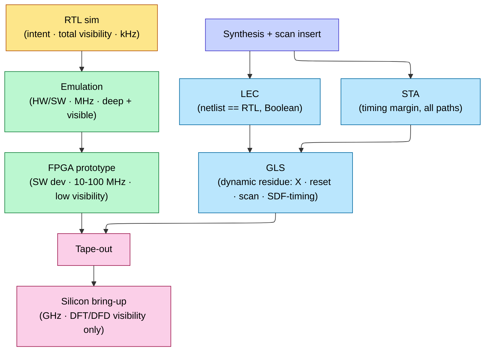

# Gate-Level Simulation and Emulation — closing the two gaps RTL sim leaves

> **Stage:** 03 · Verification — the two checks that bracket the RTL (register-transfer level) simulation regression.
> **Prerequisites:** [Data_Types_and_Basics](02_Data_Types_and_Basics.md) (four-state logic, `X`), [UVM_Methodology](10_UVM_Methodology.md), [Synthesis_and_Optimization](../04_Synthesis/01_Synthesis_and_Optimization.md), [STA](../06_Signoff/01_STA.md).
> **Hands off to:** [DFT_and_ATPG](../06_Signoff/02_DFT_and_ATPG.md), [Tapeout_and_Post_Silicon_Bringup](../07_Manufacturing_and_Bringup/03_Tapeout_and_Post_Silicon_Bringup.md).

---

## 0. Why this page exists

RTL simulation is the workhorse of functional verification, and it is **abstract by design**: it runs a zero-delay, often two-state, conveniently-initialized model of the designer's *intent*. That abstraction is exactly what makes it fast and debuggable — and exactly why it leaves two classes of confidence it cannot give you.

**Gap 1 — fidelity (abstraction).** What tapes out is not the RTL; it is a **gate netlist** produced by synthesis and then modified by scan/DFT (design-for-test) insertion. Does that netlist still compute the same function once you put **real gate and wire delays** and **real power-up indeterminacy** into it? RTL sim structurally cannot answer this — it never modeled delay, never modeled the netlist, and papered over the unknown-state (`X`) behavior that dominates power-up. **Gate-level simulation (GLS)** closes this gap by running the actual timed, four-state netlist.

**Gap 2 — depth (throughput).** A software simulator advances the design at kHz–low-MHz effective clock. The interesting system bugs live *billions* of cycles deep — booting an OS, running real firmware, warming a cache, hitting a congestion or thermal loop. At sim speed those states are years away. **Emulation** and **FPGA (field-programmable gate array) prototyping** trade visibility and bring-up effort for two-to-five orders of magnitude more throughput, putting those deep states in reach.

The organizing insight for the whole page is a **division of labor**. Three tools each cover what the others structurally miss:

$$
\underbrace{\text{LEC}}_{\text{Boolean equivalence, exhaustive}} \;+\; \underbrace{\text{STA}}_{\text{timing margins, all paths, static}} \;+\; \underbrace{\text{GLS}}_{\text{dynamic residue: X, init, timing-as-function, scan}}
$$

Get this decomposition right and GLS stops being "slow RTL sim" and becomes a *targeted* tool aimed at precisely the residue LEC and STA cannot reach (§1). The page derives each tool from the gap it closes, prices the trade-offs, and shows why real flows run a *focused* GLS suite (§5) and climb the sim → emulation → FPGA → silicon ladder (§6) rather than picking one.

---

## 1. What RTL simulation structurally cannot prove

Before asking what GLS *does*, ask what confidence is *missing* after a clean RTL regression. Three things, each a direct consequence of an abstraction RTL sim makes for speed:

1. **It never modeled the shipped netlist.** RTL is behavioral; the netlist is structural gates after synthesis and scan insertion. Their equivalence is an *assumption* until checked.
2. **It never modeled delay.** RTL evaluates in zero-delay delta cycles. Glitches, races, and asynchronous-path behavior — anything that depends on *when* a signal arrives — are invisible.
3. **It papered over the unknown state.** RTL is routinely two-state or optimistically initialized; real flops power up unknown. The `X` behavior that governs reset correctness is the least faithful part of the model.

Now the crucial move: **do not point GLS at all three**, because two of them have better tools.

- **Netlist equivalence is LEC's job, not GLS's.** Logic Equivalence Checking ([formal](12_Formal_Verification.md); part of the [synthesis](../04_Synthesis/01_Synthesis_and_Optimization.md) signoff flow) matches state points between RTL and netlist and *proves* the combinational cones between them are Boolean-equivalent — a SAT/BDD problem that is **exhaustive and fast**, covering all input vectors at once. Simulation only ever samples vectors, so re-checking function in GLS is both slower and weaker. **If LEC passes, RTL↔gate function is already proven** — GLS must not spend cycles re-verifying it.
- **Timing margin is STA's job, not GLS's.** [Static timing analysis](../06_Signoff/01_STA.md) checks setup/hold on *every* path across corners with no stimulus at all. It is exhaustive over paths where GLS is not.

What is left — the **dynamic residue** — is exactly what neither tool can see: behavior that requires *running functional stimulus* on a netlist that is simultaneously **four-state** (so `X` propagates realistically) and **timed** (so delay matters). That residue is GLS's entire reason to exist:

- **X-propagation and power-up/reset** — LEC assumes a defined state; it has no notion of an `X`-flood from un-reset flops (§2).
- **Timing-dependent *function*** — STA checks margins, not the functional consequence of a glitch, a race, or a wrongly-declared false/multicycle path (§3).
- **Post-scan-insertion dynamic behavior** — scan shift, test-mode muxing, clock-gating in both modes: structure that does not exist in the RTL at all (§4).

This is why GLS is **targeted**: it owns a small, well-defined set of bug classes — the ones that are neither pure-Boolean (LEC) nor pure-static-margin (STA) — and hands everything else to the tool that covers it exhaustively.

---

## 2. `X` and power-up: the residue RTL models worst

The most valuable thing GLS proves is that **the chip reaches a defined state from a random power-up** — because that is the one scenario RTL sim is *least* equipped to model. The root cause is that `X` means different things in the two models.

### 2.1 Optimism vs. pessimism — why neither model is silicon

`X` is not a hardware value. Silicon signals are always 0 or 1; `X` is a *simulator token* meaning "unknown which." (The four-state value system itself lives in [Data_Types_and_Basics](02_Data_Types_and_Basics.md); here we care about how it *differs* RTL↔gate.) The two models mishandle the token in **opposite** directions:

- **RTL X-optimism — the dangerous one.** Ordinary RTL constructs *converge* an unknown input to a definite output, hiding indeterminacy the hardware would not resolve:

```verilog
if (sel) q <= a; else q <= b;              // sel === X takes the else: q = b, a definite value
case (sel) 1'b0: ...; 1'b1: ...; endcase   // sel === X matches nothing -> default, a definite value
```

  The real 2:1 mux driven by an unknown select produces an *unknown* output; the RTL model picks a branch. So an un-reset control bit can leave RTL **looking correct** while silicon is genuinely indeterminate — a bug that passes every RTL test and fails at power-up.

- **Gate X-pessimism — the painful one.** The synthesized gate propagates `X` wherever it *cannot prove* a definite output, even when the real circuit would resolve it: a mux with `sel === X` but both data inputs equal to 1 emits `X`, though silicon outputs 1. Safe, but *over*-conservative — it produces **X-floods** that swamp debug and correspond to no real failure. This is the "X-debug pain" that makes GLS bring-up slow.

The lesson is conceptual, not a semantics argument: **neither model is silicon.** RTL optimism *hides* real unknowns; gate pessimism *invents* unknowns that are not there. You do not pick the "right" one — you **eliminate the source of `X`** (reset discipline, §2.2) so both models converge on the same defined behavior, and you lean on tooling (X-propagation-aware or formal X-analysis) rather than eyeballing waveforms.

### 2.2 Reset coverage as an X-flood reachability check

Why RTL hides reset bugs: simulators may run two-state (every bit starts 0), `initial`/variable initializers seed known values, and testbenches force-assert reset — all conveniences absent from silicon, where every flop without an explicit reset powers up unknown. An under-reset design can therefore pass RTL for years.

Put that same netlist in **four-state GLS with no initialization and a real reset sequence**, and the missing resets announce themselves: un-reset flops start `X`, and (by gate X-pessimism, §2.1) the `X` floods forward until a genuine reset stops it. Reading *where the flood halts* is precisely how you find flops that should have been on the reset tree but were not, reset **deassertion** races and reset that does not reach every domain, and state machines that can power into an illegal or deadlocked encoding.

The deep point: GLS turns X-pessimism from a nuisance into a **tool**. The pessimistic flood is a conservative reachability check for "*can an unknown reach something that matters before reset cleans it?*" A clean power-up GLS is a proof of reset coverage that neither LEC (no `X` model) nor STA (no function) can give.

---

## 3. Real-delay GLS: what STA cannot see because it is static

STA checks that every path *has margin*; it says nothing about what the circuit *does* when signals actually move. Full-timing GLS back-annotates real delays — from **SDF (Standard Delay Format)**, the min/typ/max cell and interconnect delays that [STA](../06_Signoff/01_STA.md) also consumes — and runs functional stimulus through them. That catches the class of bug that is timing-dependent *in function*:

- **Glitches and hazards** on combinational paths that settle before a clock edge (STA sees a met path; GLS sees the transient and where it latches).
- **Asynchronous-path behavior** — async resets, clock-domain crossings — where the *functional* effect of skew and delay matters, not just the margin.
- **Wrong timing exceptions** — a path a designer declared **false** or **multicycle** so STA would ignore it. If that declaration is *wrong*, STA is silent by construction (it was told not to look); timed GLS runs the real stimulus and exposes the functional failure.

The complementarity worth memorizing: **STA is exhaustive over paths but blind to function; GLS sees function but is exhaustive over neither.** So you run STA for margin on all paths and a *handful* of timed GLS tests to sanity-check exactly the paths STA was told to ignore or cannot model dynamically.

### 3.1 Delay fidelity is a dial, not a switch

GLS is not one thing; the delay model is a knob trading fidelity against speed and setup:

| Mode | Delay model | Finds | Cost |
|---|---|---|---|
| **Zero-delay** | none (delta cycles, like RTL) | netlist connectivity, `X`/reset propagation, scan shift, DFT | cheapest; but zero-delay *races* need care |
| **Unit-delay** | 1 time-unit per gate | above, plus gross ordering/glitch and race resolution, without SDF | middle |
| **Full-timing (SDF)** | back-annotated min/typ/max | real glitches, races, async paths, false/MCP validation, post-route sanity | slowest, most setup; one or two corners only |

The rule of thumb falls straight out: run the **bulk** of GLS (reset, `X`, scan) in zero/unit-delay where it is cheapest and most robust, and reserve **full-timing SDF** for the small set of async- and timing-sensitive sanity tests that actually need it. Fidelity up ⇒ bug-class coverage up, but throughput and bring-up down — so buy the expensive fidelity only where the cheap modes are blind.

---

## 4. Scan, DFT, and post-scan-insertion correctness

Scan insertion rebuilds every flop as a scan flop (functional data muxed with a scan-in) and stitches them into shift chains ([DFT_and_ATPG](../06_Signoff/02_DFT_and_ATPG.md)). This structure **does not exist in the RTL**, so it is unverifiable there by definition — and it is critical, because a broken scan chain means an untestable chip. GLS is where the netlist-only, *dynamic* checks live:

- **Scan chains actually shift** — chain order and connectivity; what shifts in appears at shift-out after $N$ cycles.
- **Test-mode muxing** — the functional/test select works, and functional behavior is unchanged when test mode is off.
- **Clock-gating and reset behave under scan** — gating cells must be transparent/controllable while shifting.
- **ATPG pattern validation** — the vectors [ATPG](../06_Signoff/02_DFT_and_ATPG.md) generates are re-simulated on the timed netlist to confirm they apply and capture correctly *before* they reach the tester.

LEC can be told about test structures with constraints, but the *dynamic* act of shifting and capturing is a simulation check — another slice of the residue only GLS covers.

---

## 5. Why GLS is slow — the event-count explosion — and why it stays targeted

GLS costs orders of magnitude more wall-clock than RTL sim, and the reason is structural, not incidental. An **event-driven** simulator's runtime is proportional to the number of signal-transition events it evaluates:

$$
T_{sim} \;\propto\; N_{events} \;=\; N_{nodes}\times \bar{a}\times c_{evt}
$$

where $N_{nodes}$ = evaluated nodes, $\bar{a}$ = mean transitions per node per DUT cycle (activity), $c_{evt}$ = host cost per event. Going RTL → gate multiplies **all three at once**:

$$
\frac{T_{gate}}{T_{rtl}} \;\approx\; \underbrace{\frac{N_{gate}}{N_{rtl}}}_{10\text{–}100\times}\;\cdot\; \underbrace{\frac{\bar{a}_{gate}}{\bar{a}_{rtl}}}_{>1:\ \text{glitches, time wheel}}\;\cdot\; \underbrace{\frac{c_{gate}}{c_{rtl}}}_{2\text{–}5\times:\ \text{4-state, timing checks}}
$$

- **Node blow-up.** One RTL operator (a 32-bit `a + b`) becomes hundreds of gates; the structural netlist has 10–100× the evaluated nodes of the behavioral model.
- **Activity blow-up.** Zero-delay RTL collapses a settling signal to its *final* value in delta cycles; timed gates schedule **every intermediate transition** (glitch) on a fine time wheel. Each glitch that was free in RTL is now events.
- **Per-event blow-up.** Four-state evaluation and `$setup`/`$hold` timing-check processing cost more per event than two-state RTL.

Multiply them: GLS lands ~10–100× slower zero-delay, and 100–1000× slower with full SDF timing. That is a *quantitative* reason, not a vibe — and it is why the flow runs a **focused GLS suite**, never the full regression: a targeted set of reset/power-up sequences, a few functional sanity tests, and the DFT/scan patterns, sized so total GLS cost stays bounded while still covering every bug class in §2–§4. Everything GLS *could* check but LEC/STA already cover exhaustively is *deliberately* left to them (§1). GLS's cost — slowness plus X-debug pain (§2.1) — is justified only by the unique residue it owns; spend it nowhere else.

---

## 6. Verification throughput is reaching state depth

Everything past here closes **Gap 2**. A design's interesting behavior is a function of **cycles executed**, so the wall-clock to reach a state at depth $N_{cycles}$ is simply

$$
t_{wall} \;=\; \frac{N_{cycles}}{f_{eff}}
$$

where $f_{eff}$ = the platform's effective DUT clock. The numbers are brutal. Booting an OS is $N_{cycles}\sim 10^{10}\text{–}10^{11}$ cycles; a serious firmware or benchmark run is more. At a full-chip RTL-sim rate of $f_{eff}\sim 10^{3}$ Hz, a boot is $10^{7}\text{–}10^{8}$ s ≈ **months to years**. No amount of debug convenience helps if the bug is a year away.

Invert the equation and the ladder becomes a *requirement*, not a menu. To reach $10^{10}$ cycles in a tolerable $t_{wall}\sim 10^{3}$ s (~17 minutes):

$$
f_{eff} \;\ge\; \frac{N_{cycles}}{t_{wall}} \;=\; \frac{10^{10}}{10^{3}} \;=\; 10^{7}\ \text{Hz} \;=\; 10\ \text{MHz}
$$

which is *FPGA-prototype* territory and physically unreachable by software simulation. **The ladder exists because there is a throughput wall, not because engineers like options.** Each rung — RTL sim → emulation → FPGA prototype → silicon — buys ~1–2 orders of magnitude of $f_{eff}$, and each order unlocks a class of state depth the rung below could never reach.

---

## 7. The fundamental tension: throughput vs. visibility vs. capacity vs. bring-up

Throughput is not free; every rung pays for its speed in the same currencies. The central law of hardware-assisted verification is that **visibility costs throughput**, and it is nearly information-theoretic. To observe $V$ internal signals every cycle you must move

$$
B \;=\; V\times f_{eff}\times w \quad\text{bits/s of capture bandwidth},
$$

and the platform's trace memory or I/O caps $B$, so $V\cdot f_{eff}\le B_{max}/w$: **on a given platform you trade how much you see against how fast you run.** Silicon is the limit case — it runs at GHz precisely because it observes essentially *nothing* internally (only what DFT/DFD hooks expose). Simulation sits at the opposite extreme: every node, at kHz.

The full ladder trades four quantities at once:

| Platform | Effective speed | Visibility | Capacity | Bring-up / iterate | Cost |
|---|---|---|---|---|---|
| **RTL simulation** | ~1–100 kHz | total (every signal, force/release) | unlimited | minutes (recompile) | software licenses |
| **Emulation** (Palladium/Veloce/ZeBu) | ~0.5–5 MHz | high (deep trace, logic-analyzer-like) | **billions of gates** | hours–days compile | very high capex (shared) |
| **FPGA prototype** | ~10–100 MHz | **low** (only routed probes, shallow) | tens–hundreds of M gates | **weeks** (partition + timing close) | cheaper, proliferable |
| **Silicon** | GHz | ~none (DFT/DFD only) | — | months + full respin | a tapeout |

Two consequences fall out of the table.

**Why an emulator is not just a big FPGA board.** They sit at different points of the *same* speed/visibility trade. An emulator spends hardware to keep **visibility and capacity high and compile fast** — automatic partitioning across a purpose-built fabric, deep trace on *every* signal, often save/restore — at the price of raw speed (sub-5 MHz). An FPGA prototype spends everything on **speed** (native FPGA logic, minimal instrumentation) and pays with visibility (only signals you routed out, shallowly) and bring-up (manual multi-FPGA partition and per-FPGA timing closure — weeks; moving one probe can force a recompile). That is why *verification* teams live on emulators (depth **and** visibility, to co-verify firmware/drivers against real RTL) while *software/system* teams take FPGA prototypes (near-real-time app development, in-system with real peripherals, demos).

**Debug productivity — not raw speed — decides the shallow cases.** A debug iteration costs $t_{iter}=t_{compile}+t_{run\text{-}to\text{-}bug}$. Simulation's run is slow but it already holds every signal, so one pass suffices — minutes. An FPGA prototype's run is tiny, but if the signal you need was not routed out you pay a place-and-route recompile (hours–days) *per iteration*. So the fast platform is *less* productive for shallow bugs and only wins where sim cannot reach the state at all. This is the quantitative reason the tools are complementary rather than ranked.

Both emulation and FPGA prototypes reach the outside world through **transactors / speed bridges** — a model of PCIe/USB/Ethernet/DRAM split into a fast in-box (synthesizable) side and a host-software side that talk at the transaction level, absorbing the MHz-DUT-to-real-world rate mismatch. That is what lets the DUT run *real* firmware and drivers against modeled or physical peripherals.

---

## 8. Where each tool sits — matching the tool to the bug

The map follows from §1 (the fidelity residue) and §6–§7 (depth vs. visibility): put each check on the cheapest platform that can both *see* it and *reach* it.



- **RTL simulation** — the default and the vast majority of cycles: block-to-cluster functional, directed + constrained-random ([UVM](10_UVM_Methodology.md)), coverage closure ([planning](11_Verification_Planning_and_Coverage_Closure.md)). Best debug productivity, unlimited instances; bounded by the throughput wall (§6).
- **GLS** — the *targeted* post-synthesis/post-scan residue (§1): reset/power-up/`X`, DFT/scan-pattern validation, and a few SDF async/timing-function sanity tests. Never the full regression (§5).
- **Emulation** — full-chip functional + **HW/SW co-verification** (boot the OS, run firmware/drivers against real RTL), long regressions, and early **performance validation** on real workloads that confirms the relevant [architecture-owned model](../01_Architecture_and_PPA/00_Index.md). Depth *with* visibility.
- **FPGA prototype** — pre-silicon **software development** at near-real-time, system/peripheral-in-the-loop, and demos. Speed over visibility.
- **Silicon bring-up** — the last rung, where visibility collapses to DFT/DFD hooks — which is *why* the scan and trace structure GLS validated (§4) matters so much ([bring-up](../07_Manufacturing_and_Bringup/03_Tapeout_and_Post_Silicon_Bringup.md)).

The same throughput-vs-visibility logic governs why power signoff leans on [emulation-based activity](../02_Power_and_Low_Power/02_Block_Activity_and_Power.md): real workloads are the only honest activity source, and only emulation reaches them.

---

## Numbers to memorize

| Quantity | Value | Why |
|---|---|---|
| RTL sim speed | ~1–100 kHz | total visibility; below the boot/benchmark throughput wall (§6) |
| Emulator speed | ~0.5–5 MHz | full-chip HW/SW co-verify with visibility + capacity (§7) |
| FPGA prototype speed | ~10–100 MHz | software-team near-real-time; visibility sacrificed (§7) |
| Silicon | GHz | full speed, ~zero internal visibility (§7) |
| GLS vs. RTL sim | ~10–100× slower (zero-delay), 100–1000× (SDF) | event-count explosion (§5) → run a focused suite |
| GLS unique value | `X`/reset · scan/DFT · SDF-timing *function* | the dynamic residue LEC and STA structurally miss (§1) |
| LEC vs. GLS | LEC = Boolean equivalence (exhaustive); GLS = dynamic `X`/timing | different jobs; LEC *scopes GLS down* (§1) |
| Emulator capacity | billions of gates | why it is not just a big FPGA board (§7) |
| OS-boot depth | ~10¹⁰–10¹¹ cycles | the state depth that forces the emulation/FPGA ladder (§6) |

---

## Cross-references

- **Down the stack (what GLS/emulation run on):** [Synthesis_and_Optimization](../04_Synthesis/01_Synthesis_and_Optimization.md) (produces the netlist; hosts LEC in the signoff flow), [DFT_and_ATPG](../06_Signoff/02_DFT_and_ATPG.md) (the scan/test structure GLS validates and the ATPG patterns it re-simulates), [Data_Types_and_Basics](02_Data_Types_and_Basics.md) (the four-state/`X` system behind §2).
- **Up / alongside (what scopes or consumes GLS):** [Formal_Verification](12_Formal_Verification.md) (LEC proves the equivalence that lets GLS skip re-checking function, §1), [STA](../06_Signoff/01_STA.md) (timing margins plus the SDF that GLS back-annotates, §3), [UVM_Methodology](10_UVM_Methodology.md) & [Verification_Planning_and_Coverage_Closure](11_Verification_Planning_and_Coverage_Closure.md) (the RTL-sim regression this page brackets).
- **Downstream:** [Tapeout_and_Post_Silicon_Bringup](../07_Manufacturing_and_Bringup/03_Tapeout_and_Post_Silicon_Bringup.md) (silicon, where visibility collapses to the DFT hooks GLS checked), [architecture-owned methodology](../01_Architecture_and_PPA/00_Index.md) (the CPU/GPU/NPU/SoC model emulation validates), [Block_Activity_and_Power](../02_Power_and_Low_Power/02_Block_Activity_and_Power.md) (emulation-driven activity for power).

---

## References

1. IEEE Std 1800, *SystemVerilog LRM* — four-state logic and event/delta-cycle simulation semantics (`X`/`Z`), behind §2 and §5.
2. IEEE Std 1497, *Standard Delay Format (SDF)* — the back-annotated delay model behind timed GLS, §3.
3. Bening, L. and Foster, H., *Principles of Verifiable RTL Design*, 2nd ed., Kluwer, 2001 — X-optimism/pessimism and reset methodology (§2).
4. Mishchenko, A. et al., "Improvements to Combinational Equivalence Checking," *ICCAD*, 2006 — the LEC engines that scope GLS (§1).
