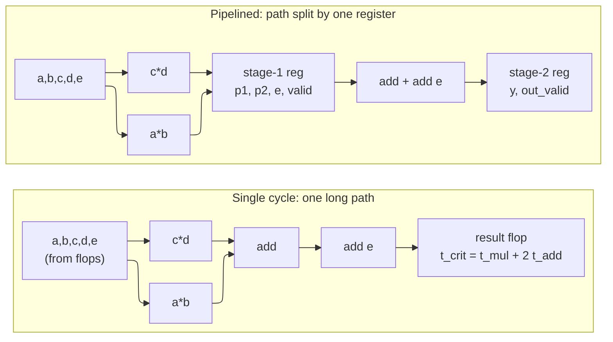
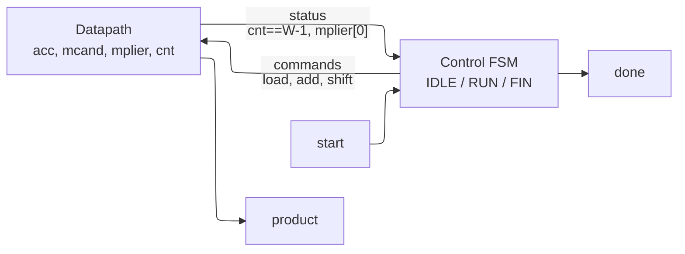
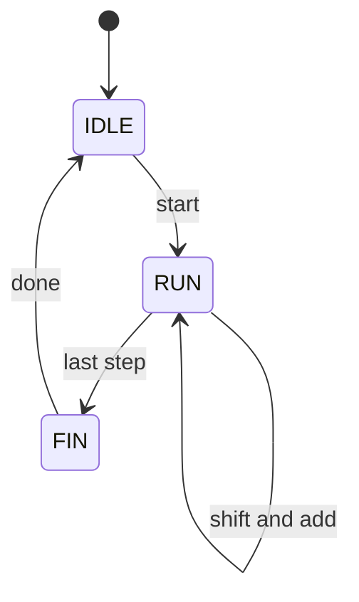
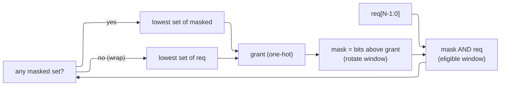

# RTL Design Patterns — Structuring Synthesizable, Timing-Closing RTL

> **Stage:** 03 · Frontend RTL (register-transfer level). The recurring *structural* idioms — pipelining, FSMD, parameterization, case coding, interfaces, and a cookbook of primitives — that turn correct-but-slow RTL into RTL that both synthesizes cleanly and *closes timing*. This is the design-side page you copy from.
> **Prerequisites:** [Logic_Building_Blocks](../00_Fundamentals/02_Logic_Building_Blocks.md) (the flop, mux, adder, and encoder these patterns wire together), [RTL_Design_Methodology](01_RTL_Design_Methodology.md) (the inference model and latch-free discipline every module here obeys), and [Data_Types_and_Basics](02_Data_Types_and_Basics.md) (`logic`, packed/unpacked, `enum`, width/sign rules).
> **Hands off to:** [STA](../06_Signoff/01_STA.md) (the timing analysis that *scores* whether a pipeline cut was deep enough), [Flow_Control_and_FIFOs](15_Flow_Control_and_FIFOs.md) (valid/ready backpressure and the queues that decouple the stages this page builds).

---

## 0. Why this page exists

Methodology tells you *which hardware each line infers*; this page tells you *how to arrange that hardware* so a design meets its clock. Almost every real RTL problem is one of a small set of shapes — a combinational path too long for the period (pipeline it), a computation that needs a controller and a datapath (FSMD), a block that must exist at many widths (parameterize it), a decode that must not build a latch (case coding), a bundle of signals crossing a module boundary (interface), or one of a dozen textbook primitives (counter, shift register, LFSR, encoder, arbiter). Learn the shapes and their timing/area consequences and most RTL becomes assembly of known-good parts. Every module below is complete and was compiled with `iverilog -g2012`; the tricky ones were also simulated for functional correctness.

---

## 1. Pipelining and retiming — breaking a long combinational path

**Pipelining is inserting registers into a long combinational path so that no single clock period has to absorb the whole delay — you trade added latency (more cycles from input to output) for a shorter critical path (a faster clock).** It is the single most important timing-closure move in RTL.

Take one arithmetic expression, $y = a\cdot b + c\cdot d + e$. As one combinational cloud between an input flop and an output flop, the signal must ripple through *two multipliers in parallel, then two adder delays in series* before the next edge. The critical path is

$$
t_{crit} \;=\; t_{mul} + 2\,t_{add} + t_{setup} + t_{skew}, \qquad f_{max} = \frac{1}{t_{crit}}.
$$

If $t_{mul}+2\,t_{add}$ already exceeds the target period, **no amount of gate-level optimization saves it** — the logic depth is the wall. Here is that single-cycle cloud:

```systemverilog
module mac_comb #(
    parameter int W = 8
) (
    input  logic [W-1:0]  a, b, c, d, e,
    output logic [2*W:0]  y            // wide enough for a*b + c*d + e
);
    // One long combinational path: two multiplies feed a two-input adder tree.
    always_comb
        y = (a * b) + (c * d) + e;
endmodule
```

Now **insert one pipeline register** that cuts the path in two: stage 1 does the expensive multiplies and *registers* the two products (plus `e`), stage 2 does the final add. Because a result now takes two edges to emerge, downstream must know *which cycle the answer is real* — so a **`valid` bit rides alongside the data**, launched when the operands are presented and delayed by exactly the same number of registers. The single-cycle design (registered input, one cloud, registered output) had latency 1; adding one interior register makes it latency 2 — the **+1 latency** you pay for the shorter path:

```systemverilog
module mac_pipe #(
    parameter int W = 8
) (
    input  logic          clk,
    input  logic          rst_n,
    input  logic          in_valid,
    input  logic [W-1:0]  a, b, c, d, e,
    output logic [2*W:0]  y,
    output logic          out_valid
);
    // Stage 1: the two multiplies (the expensive cone). Carry e and valid along.
    logic [2*W-1:0] p1_q, p2_q;
    logic [W-1:0]   e_q;
    logic           v1_q;

    always_ff @(posedge clk or negedge rst_n)
        if (!rst_n) begin
            p1_q <= '0; p2_q <= '0; e_q <= '0; v1_q <= 1'b0;
        end else begin
            p1_q <= a * b;
            p2_q <= c * d;
            e_q  <= e;
            v1_q <= in_valid;          // valid travels alongside the data
        end

    // Stage 2: the final add, then register result + valid.
    always_ff @(posedge clk or negedge rst_n)
        if (!rst_n) begin
            y <= '0; out_valid <= 1'b0;
        end else begin
            y         <= p1_q + p2_q + e_q;
            out_valid <= v1_q;         // latency = 2 cycles
        end
endmodule
```

The critical path drops to $\max(t_{mul},\ t_{add}) + t_{setup} + t_{skew}$ — roughly halved — while **throughput stays one result per cycle** once the pipe is full. The `valid` bit is not optional bookkeeping: without it, downstream cannot distinguish a real result from the garbage present during fill/flush, and any control that keys off the result must itself be delayed by the same +1.



**Retiming** is the *tool's* dual of pipelining: **retiming moves existing flops backward or forward across combinational logic to balance the delay between stages, without changing the number of flops on any input-to-output path — so latency is fixed and only the stage boundaries shift.** You *pipeline* (you add flops, you change the latency, you rewrite the RTL and its `valid` bookkeeping); the *tool retimes* (it relocates the flops you already placed to even out slack, and equivalence checking proves the cycle-by-cycle behavior is unchanged). Practically: if you drop two register layers somewhere in a block and let synthesis retime, you often get better balance than hand-placing every flop — but retiming can only *balance* the flops you gave it, never invent the extra latency, so the architectural decision to spend cycles is still yours.

One line of SDC intent goes with these moves: a path you deliberately let span several cycles is declared with `set_multicycle_path` so STA does not flag it, and a path that is real logic but never timing-relevant (e.g. a quasi-static config bit) is cut with `set_false_path` ([STA](../06_Signoff/01_STA.md)).

---

## 2. Datapath vs control — the FSM + datapath (FSMD) pattern

**An FSMD splits a computation into a datapath (the registers and arithmetic that hold and transform the data) and a control FSM (the state machine that, cycle by cycle, tells the datapath what to do) — the FSM issues commands and reads back status, the datapath does the work.** This is the canonical way to build any multi-cycle operation: sequential multiply/divide, CORDIC, memory-walking engines, protocol controllers.

The contract is a clean interface between the two halves. The FSM emits **commands** (load, add, shift, enable) as a function of state and start; the datapath emits **status** (a done-count reached, a sign bit) that steers the FSM. Below is a classic shift-and-add sequential multiplier: `IDLE` loads operands, `RUN` conditionally adds the shifted multiplicand for each multiplier bit over $W$ cycles, `FIN` pulses `done`.

```systemverilog
module seq_mult #(
    parameter int W = 8
) (
    input  logic           clk,
    input  logic           rst_n,
    input  logic           start,
    input  logic [W-1:0]   a,          // multiplicand
    input  logic [W-1:0]   b,          // multiplier
    output logic [2*W-1:0] product,
    output logic           done
);
    typedef enum logic [1:0] {IDLE, RUN, FIN} state_t;
    state_t state, nstate;

    // Datapath registers
    logic [2*W-1:0]         acc;        // running partial product
    logic [W-1:0]           mplier;     // shifts right each step
    logic [2*W-1:0]         mcand;      // shifts left each step
    logic [$clog2(W+1)-1:0] cnt;        // step counter

    // Control: next-state function (pure combinational)
    always_comb begin
        nstate = state;
        unique case (state)
            IDLE: if (start)      nstate = RUN;
            RUN : if (cnt == W-1) nstate = FIN;
            FIN :                 nstate = IDLE;
        endcase
    end

    // Control: state register
    always_ff @(posedge clk or negedge rst_n)
        if (!rst_n) state <= IDLE;
        else        state <= nstate;

    // Datapath: steered by the FSM state
    always_ff @(posedge clk or negedge rst_n)
        if (!rst_n) begin
            acc <= '0; mplier <= '0; mcand <= '0; cnt <= '0;
        end else begin
            unique case (state)
                IDLE: if (start) begin
                    acc    <= '0;
                    mplier <= b;
                    mcand  <= {{W{1'b0}}, a};
                    cnt    <= '0;
                end
                RUN: begin
                    if (mplier[0]) acc <= acc + mcand;   // add on a 1 bit
                    mcand  <= mcand  << 1;
                    mplier <= mplier >> 1;
                    cnt    <= cnt + 1'b1;
                end
                default: ; // FIN: hold
            endcase
        end

    assign product = acc;
    assign done    = (state == FIN);
endmodule
```

The FSMD trades **area for time**: one adder reused over $W$ cycles instead of $W$ adders in a combinational tree. That is the opposite trade to §1's pipeline — pick FSMD when the operation is infrequent or the operand is wide enough that a flat datapath would blow the area or the path; pick a pipeline when you need a result every cycle.





---

## 3. Parameterization and generate — one source, many instances

**Parameterization makes a module's width, depth, and structure into compile-time constants (`parameter` for the knobs a parent overrides, `localparam` for values derived from them), and `generate`/`genvar` replicates or conditionally includes hardware — so a single reviewed source produces every size you need.** This is how you ship one FIFO, one ALU, one crossbar that fits a 4-bit test and a 64-bit product.

A `parameter` is set at instantiation (`module #(.W(16)) u (...)`); a `localparam` is computed from parameters and cannot be overridden, so it is the right home for anything that *must* stay consistent (a mask, a max value, a derived width). Here a width-parameterized saturating adder uses both:

```systemverilog
module sat_adder #(
    parameter int W = 12
) (
    input  logic [W-1:0] a, b,
    output logic [W-1:0] sum          // saturates instead of wrapping
);
    localparam logic [W-1:0] MAXVAL = '1;   // all-ones ceiling (derived from W)
    logic [W:0] wide;                        // one extra bit catches carry-out
    always_comb begin
        wide = {1'b0, a} + {1'b0, b};
        sum  = wide[W] ? MAXVAL : wide[W-1:0];
    end
endmodule
```

`generate for` with a `genvar` builds *structural* replication — N instances wired into a regular pattern. The textbook case is a ripple-carry adder assembled from single-bit full adders, the carry threaded cell to cell:

```systemverilog
module full_adder (
    input  logic a, b, cin,
    output logic sum, cout
);
    assign sum  = a ^ b ^ cin;
    assign cout = (a & b) | (a & cin) | (b & cin);
endmodule

module ripple_adder #(
    parameter int W = 8
) (
    input  logic [W-1:0] a, b,
    input  logic         cin,
    output logic [W-1:0] sum,
    output logic         cout
);
    logic [W:0] carry;
    assign carry[0] = cin;

    genvar i;
    generate
        for (i = 0; i < W; i++) begin : g_fa
            full_adder u_fa (
                .a    (a[i]),
                .b    (b[i]),
                .cin  (carry[i]),
                .sum  (sum[i]),
                .cout (carry[i+1])
            );
        end
    endgenerate

    assign cout = carry[W];
endmodule
```

`generate` also replicates *sequential* logic — a per-lane register bank is just a loop of `always_ff`, each with its own write enable:

```systemverilog
module reg_bank #(
    parameter int W = 8,
    parameter int N = 4
) (
    input  logic         clk,
    input  logic         rst_n,
    input  logic [N-1:0] we,          // per-register write enable
    input  logic [W-1:0] wdata,
    output logic [W-1:0] rdata [N]    // unpacked array of read ports
);
    genvar k;
    generate
        for (k = 0; k < N; k++) begin : g_reg
            always_ff @(posedge clk or negedge rst_n)
                if (!rst_n)     rdata[k] <= '0;
                else if (we[k]) rdata[k] <= wdata;
        end
    endgenerate
endmodule
```

The synthesis consequence: parameters and generate are resolved *before* logic synthesis, so they cost nothing at runtime — but they change the hardware structurally, and the named generate block (`g_fa`, `g_reg`) becomes part of the hierarchical instance path, which is exactly how timing and DFT tools will refer to each replicated cell. A ripple adder's carry chain is $O(W)$ deep, so at wide $W$ you would swap this structural pattern for a carry-lookahead or the tool's `+` (which infers a fast adder) — parameterization is what lets you make that swap in one place.

---

## 4. Case-statement coding — decode without latches or priority you did not mean

**A `case` becomes a mux; `unique` promises the branches are mutually exclusive and fully cover the selector (so the tool builds a fast balanced mux and lint checks the promise), while `priority` promises first-match-wins ordering (a priority chain) — and a `default` or full coverage is what keeps a combinational `case` from inferring a latch.** Getting this right is the difference between the cheap balanced tree you intended and an accidental priority chain or a latch.

`unique case` is the correct tool for a **one-hot decoder**: the 3-bit selector fully covers all eight patterns, so the branches are exhaustive and non-overlapping, and because every path assigns the output there is no latch:

```systemverilog
module dec3to8 (
    input  logic [2:0] sel,
    input  logic       en,
    output logic [7:0] y
);
    logic [7:0] d;
    always_comb begin
        unique case (sel)          // all 8 patterns present -> full and parallel
            3'd0: d = 8'b0000_0001;
            3'd1: d = 8'b0000_0010;
            3'd2: d = 8'b0000_0100;
            3'd3: d = 8'b0000_1000;
            3'd4: d = 8'b0001_0000;
            3'd5: d = 8'b0010_0000;
            3'd6: d = 8'b0100_0000;
            3'd7: d = 8'b1000_0000;
        endcase
        y = en ? d : 8'b0;         // enable gates the one-hot output
    end
endmodule
```

`priority casez` is the tool for a **priority mux / arbiter-style select**, where `casez` lets `?` match don't-cares and `priority` fixes that the *first* matching branch wins — here the lowest set request bit takes the output, and the `default` covers "no request" so nothing has to hold:

```systemverilog
module prio_mux #(
    parameter int W = 8
) (
    input  logic [3:0]   sel,               // priority vector, bit 0 highest
    input  logic [W-1:0] d0, d1, d2, d3,
    output logic [W-1:0] y
);
    always_comb begin
        priority casez (sel)                // lowest set bit wins
            4'b???1: y = d0;                // sel[0] set -> highest priority
            4'b??10: y = d1;
            4'b?100: y = d2;
            4'b1000: y = d3;
            default: y = '0;                // nothing requested
        endcase
    end
endmodule
```

The timing consequence is direct: a plain `case` on a fully-decoded selector already synthesizes to a balanced mux, but `unique` *documents and lint-checks* the full/parallel property so a later edit that breaks exclusivity is caught, and it lets the tool skip priority-encoding logic. `priority` deliberately builds the longer priority chain — use it only when you *want* ordering. The historical `full_case`/`parallel_case` pragmas did the same thing invisibly and could make gates disagree with simulation on unlisted selector values; `unique`/`priority` are the modern, checkable replacement (see Cummings below).

---

## 5. SystemVerilog interfaces and modports — bundle the signals that travel together

**An `interface` gathers a related group of signals (a bus, a handshake) into one named bundle so a connection is one port instead of a dozen, and a `modport` gives each side a named view with per-signal directions (`input`/`output`) so producer and consumer cannot mis-wire the bundle.** It is the standard way to keep wide standard buses (AXI, a valid/ready channel) from sprawling across every port list.

Declare the signals once in the interface; declare a `modport` per role naming which direction each signal has *from that role's viewpoint*. A module then takes a single `interface.modport` port and drives only the signals its modport declares as outputs.

```systemverilog
interface simple_bus #(
    parameter int W = 8
) (
    input logic clk
);
    logic         valid;
    logic         ready;
    logic [W-1:0] data;

    modport producer (output valid, output data, input  ready, input clk);
    modport consumer (input  valid, input  data, output ready, input clk);
endinterface
```

A module consumes the bundle through its modport, and a top wires the interface instance into both sides:

```systemverilog
module consumer_dut #(
    parameter int W = 8
) (
    simple_bus.consumer  bus,               // consumed through a modport
    output logic [W-1:0] last
);
    always_ff @(posedge bus.clk) begin
        bus.ready <= 1'b1;                   // toy: always ready
        if (bus.valid && bus.ready)
            last <= bus.data;                // accept a beat
    end
endmodule

module iface_top (
    input  logic       clk,
    input  logic       vin,
    input  logic [7:0] din,
    output logic [7:0] last
);
    simple_bus #(.W(8)) bus (.clk(clk));
    assign bus.valid = vin;
    assign bus.data  = din;
    consumer_dut #(.W(8)) u_c (.bus(bus.consumer), .last(last));
endmodule
```

For the testbench, the same interface is reached through a **virtual interface** (`virtual simple_bus`) — a class handle to a real interface instance — which is how a UVM driver, living in the class world, pokes DUT pins ([UVM_Methodology](10_UVM_Methodology.md)). The synthesis consequence: an interface is pure structural sugar — it elaborates to exactly the same flattened nets and modport directions become ordinary port directions, so there is *no* hardware cost, only a wiring-error and readability win. (Tooling note: some open simulators, including Icarus Verilog 12, do not implement interface *ports* even though they accept the `interface`/`modport` declaration; the pattern above is standard IEEE 1800 and compiles on Verilator and the commercial simulators.)

---

## 6. Cookbook primitives — the parts you assemble from

**These are the small, reusable, latch-free building blocks that show up in nearly every design; keep a compile-clean copy of each and stop rewriting them.** Every module below was compiled with `iverilog -g2012` and the sequential ones were simulated.

**Up/down counter with load** — load takes priority over count; a single `up` bit picks direction. The pattern (reset, then a priority chain of `load` over `en`) is the template for every enabled register:

```systemverilog
module updn_counter #(
    parameter int W = 8
) (
    input  logic         clk,
    input  logic         rst_n,
    input  logic         load,
    input  logic         en,
    input  logic         up,          // 1 = count up, 0 = count down
    input  logic [W-1:0] d,
    output logic [W-1:0] q
);
    always_ff @(posedge clk or negedge rst_n)
        if (!rst_n)    q <= '0;
        else if (load) q <= d;                     // load wins over count
        else if (en)   q <= up ? q + 1'b1 : q - 1'b1;
endmodule
```

**Shift register** — serial-in, parallel-out, with the serial output tapped from the MSB. Concatenation `{q[W-2:0], sin}` is the idiom for a left shift:

```systemverilog
module shift_reg #(
    parameter int W = 8
) (
    input  logic         clk,
    input  logic         rst_n,
    input  logic         en,
    input  logic         sin,         // serial in
    output logic [W-1:0] q,
    output logic         sout         // serial out
);
    always_ff @(posedge clk or negedge rst_n)
        if (!rst_n)  q <= '0;
        else if (en) q <= {q[W-2:0], sin};         // shift left, sin into LSB
    assign sout = q[W-1];
endmodule
```

**LFSR** — a shift register whose serial input is an XOR of named *tap* bits; the tap set is a primitive polynomial, so the state cycles through all $2^n-1$ non-zero values (maximal length). The all-zero state is a lock state, so the reset seed must be non-zero. This one uses $x^8 + x^6 + x^5 + x^4 + 1$ (verified in simulation to have period 255):

```systemverilog
module lfsr8 (
    input  logic       clk,
    input  logic       rst_n,
    input  logic       en,
    output logic [7:0] q
);
    // Maximal-length (period 255) Fibonacci LFSR.
    // Polynomial: x^8 + x^6 + x^5 + x^4 + 1  ->  taps at bits 8,6,5,4.
    localparam logic [7:0] SEED = 8'hFF;           // any non-zero seed
    logic fb;
    assign fb = q[7] ^ q[5] ^ q[4] ^ q[3];         // XOR of the tapped stages

    always_ff @(posedge clk or negedge rst_n)
        if (!rst_n)  q <= SEED;                    // 0 is the lock state; avoid it
        else if (en) q <= {q[6:0], fb};            // shift left, feedback into LSB
endmodule
```

**Priority encoder** — returns the index of the lowest set request bit and a `valid` flag; the `!valid` guard makes the loop keep the *first* hit, giving clean LSB priority and no latch (both outputs are defaulted):

```systemverilog
module prio_encoder #(
    parameter int W = 8
) (
    input  logic [W-1:0]         req,
    output logic [$clog2(W)-1:0] idx,
    output logic                 valid
);
    always_comb begin
        idx   = '0;
        valid = 1'b0;
        for (int i = 0; i < W; i++)
            if (req[i] && !valid) begin            // first set bit from LSB wins
                idx   = i[$clog2(W)-1:0];
                valid = 1'b1;
            end
    end
endmodule
```

**One-hot to/from binary** — binary-to-one-hot is a single indexed write against an all-zero default (a decoder); one-hot-to-binary scans for the set bit (assuming a valid one-hot input):

```systemverilog
module bin2onehot #(
    parameter int N = 3
) (
    input  logic [N-1:0]      bin,
    output logic [(1<<N)-1:0] onehot
);
    always_comb begin
        onehot      = '0;                 // default clears all bits (no latch)
        onehot[bin] = 1'b1;               // indexed write -> a decoder
    end
endmodule

module onehot2bin #(
    parameter int OH = 8,
    parameter int N  = $clog2(OH)
) (
    input  logic [OH-1:0] onehot,
    output logic [N-1:0]  bin
);
    always_comb begin
        bin = '0;
        for (int i = 0; i < OH; i++)
            if (onehot[i]) bin = i[N-1:0];         // assumes a valid one-hot input
    end
endmodule
```

**Round-robin arbiter** — grants one requester per cycle and rotates priority so no requester starves. A `mask` marks the eligible window; the arbiter picks the lowest set bit of `req & mask`, or wraps to the lowest set of the full `req` when the masked window is empty; after each grant the mask is updated to the bits strictly above the one just served (simulated to give exactly fair 2/2/2/2 service to four steady requesters):

```systemverilog
module rr_arbiter #(
    parameter int N = 4
) (
    input  logic         clk,
    input  logic         rst_n,
    input  logic [N-1:0] req,
    output logic [N-1:0] grant
);
    logic [N-1:0] mask;                    // rotating eligibility window
    logic [N-1:0] masked_req;
    logic [N-1:0] gr_masked, gr_full;

    // Lowest-index set bit -> a one-hot pick (fixed priority).
    function automatic logic [N-1:0] lowest_set (input logic [N-1:0] v);
        logic [N-1:0] r;
        logic         hit;
        r = '0; hit = 1'b0;
        for (int i = 0; i < N; i++)
            if (v[i] && !hit) begin r[i] = 1'b1; hit = 1'b1; end
        return r;
    endfunction

    assign masked_req = req & mask;
    assign gr_masked  = lowest_set(masked_req);
    assign gr_full    = lowest_set(req);

    // Prefer the masked window; if empty, wrap to the full request set.
    always_comb
        grant = (|masked_req) ? gr_masked : gr_full;

    // After granting position p, next window = bits strictly above p.
    always_ff @(posedge clk or negedge rst_n)
        if (!rst_n)      mask <= '1;
        else if (|grant) mask <= ~((grant - 1'b1) | grant);
endmodule
```



The synthesis consequence across the cookbook: each is intentionally *shallow* logic — a mux, an incrementer, an XOR tap, a scan loop — so none is a timing risk on its own. The arbiter's `lowest_set` scan and the encoder loop are $O(N)$ combinational and are the parts to watch as $N$ grows wide; at large $N$ you would pipeline the pick (§1) or build a tree arbiter.

---

## Numbers to memorize

| Fact | Value | Why (section) |
|---|---|---|
| Pipeline register cut | shortens critical path, adds **+1 cycle latency** per stage | throughput stays 1/cycle (§1) |
| Clock ceiling | $f_{max} = 1/(t_{crit} + t_{setup} + t_{skew})$ | logic depth sets $t_{crit}$ (§1) |
| Pipeline vs retiming | **you** add flops (latency changes); **tool** moves flops (latency fixed) | who owns the cycle (§1) |
| FSMD trade | 1 adder over $W$ cycles vs $W$ adders in one | area-for-time (§2) |
| `parameter` vs `localparam` | overridable knob vs derived constant | consistency (§3) |
| Ripple-carry depth | carry chain is $O(W)$ | swap for CLA when wide (§3) |
| `unique` case | full + parallel -> balanced mux, lint-checked | vs accidental latch/priority (§4) |
| Combinational `case` no latch | needs `default` or full coverage | every path must assign (§4) |
| Interface / modport cost | **zero hardware**; flattens to nets | wiring-error + readability win (§5) |
| LFSR maximal period | $2^n - 1$ (seed must be non-zero) | primitive polynomial taps (§6) |
| Round-robin fairness | one grant/cycle, no starvation | rotate the mask past the grant (§6) |

---

## Cross-references

- **Down the stack (what these patterns infer):** [Logic_Building_Blocks](../00_Fundamentals/02_Logic_Building_Blocks.md) (the flop, mux, adder, priority cell every module here wires up), [Data_Types_and_Basics](02_Data_Types_and_Basics.md) (packed/unpacked, `enum`, width/sign behind the code).
- **The discipline these obey:** [RTL_Design_Methodology](01_RTL_Design_Methodology.md) (why `always_comb` defaults kill the §4 latch, why `<=` in clocked blocks), [Procedural_Processes_and_IPC](03_Procedural_Processes_and_IPC.md) (the scheduler semantics under `always_ff`/`always_comb`).
- **Up / adjacent (what scores and consumes them):** [STA](../06_Signoff/01_STA.md) (the timing that judges a §1 pipeline cut; `set_multicycle_path`/`set_false_path`), [Flow_Control_and_FIFOs](15_Flow_Control_and_FIFOs.md) (valid/ready backpressure and queues that decouple pipeline/FSMD stages), [Synthesis_and_Optimization](../04_Synthesis/01_Synthesis_and_Optimization.md) (retiming, resource sharing, the mux/adder mapping), [UVM_Methodology](10_UVM_Methodology.md) (virtual interfaces driving the §5 bundle).

---

## References

1. Harris, D. M. and Harris, S. L., *Digital Design and Computer Architecture*, 2nd ed., Morgan Kaufmann, 2012. Pipelining, datapath/control partitioning, FSM and arithmetic building blocks (§§1-3, 6).
2. Cummings, C. E., "Synthesizable Finite State Machine Design Techniques Using the New SystemVerilog 3.0 Enhancements," SNUG, 2003. FSM/FSMD coding styles and enum-based state (§2).
3. Cummings, C. E., "SystemVerilog's priority & unique — A Solution to Verilog's full_case & parallel_case Evil Twins," SNUG, 2005. `unique`/`priority` case semantics vs the old pragmas (§4).
4. Sutherland, S., Davidmann, S., and Flake, P., *SystemVerilog for Design*, 2nd ed., Springer, 2006. Parameterization, `generate`, interfaces and modports (§§3, 5).

---

⬅ prev [Gate-Level Simulation and Emulation](13_Gate_Level_Sim_and_Emulation.md) · [Section Index](00_Index.md) · [Root Index](../Index.md) · next ➡ [Flow Control and FIFOs](15_Flow_Control_and_FIFOs.md)
