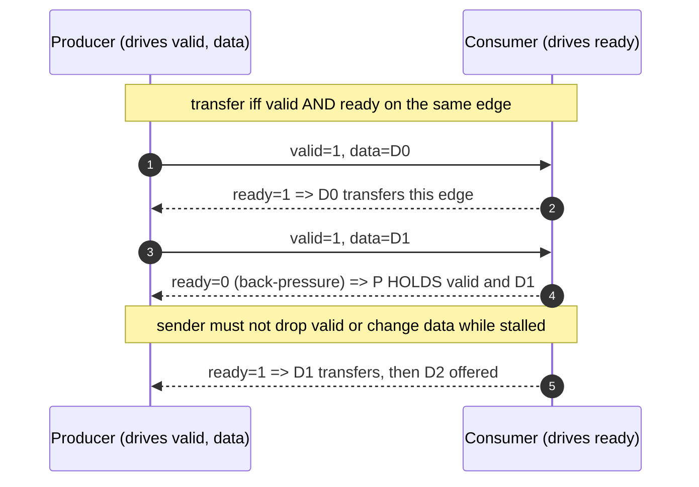
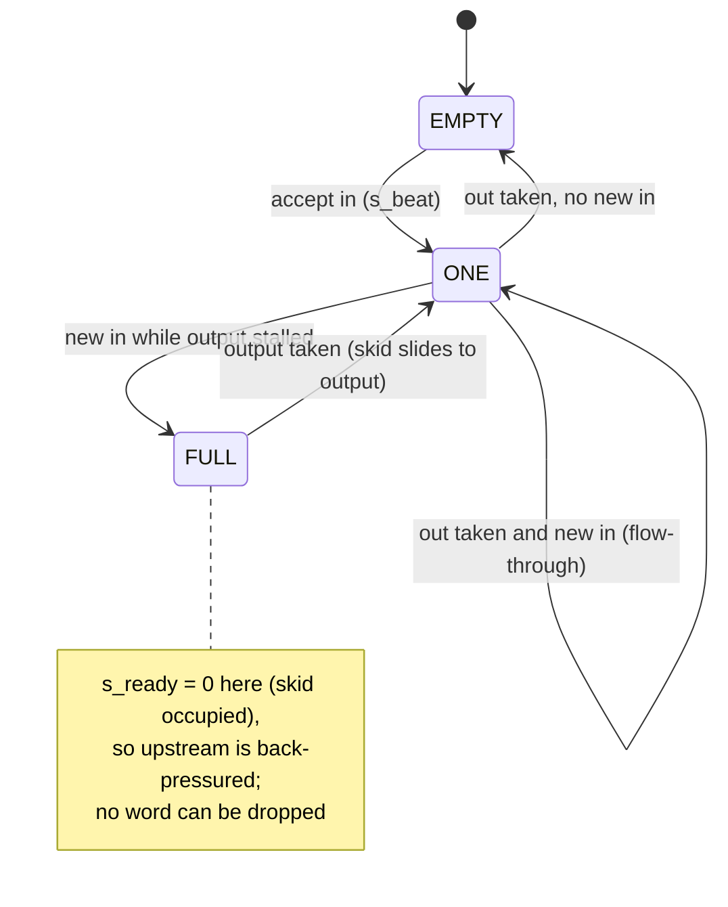
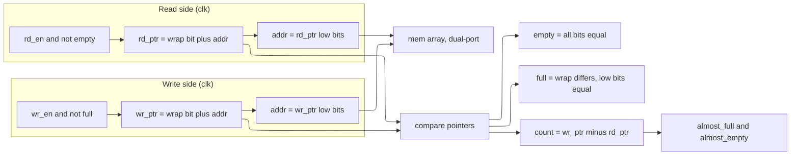
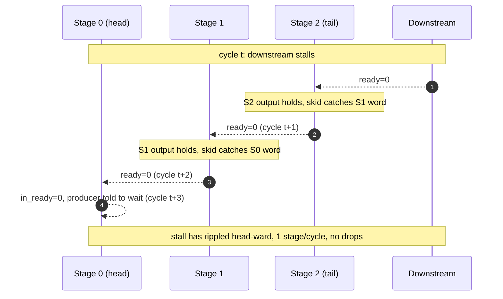

# Flow Control and FIFOs — Valid/Ready, Skid Buffers, and Queues

> **Stage:** 03 · Frontend RTL (register-transfer level). The *elastic* discipline that lets two blocks exchange data without agreeing on a fixed cycle-by-cycle schedule — the handshake, the buffers that pipeline it, and the queues that decouple rate. This is the RTL that *implements* the flow-control primitive the protocol pages assume.
> **Prerequisites:** [RTL_Design_Patterns](14_RTL_Design_Patterns.md) (FSM and datapath patterns this composes), [Logic_Building_Blocks](../00_Fundamentals/02_Logic_Building_Blocks.md) (the flip-flop, register, counter, and memory array these queues are built from).
> **Hands off to:** [Async_Design_and_CDC](06_Async_Design_and_CDC.md) (the *two-clock* FIFO — Gray pointers and synchronizers live there), [AHB_AXI_APB](../01_Architecture_and_PPA/04_SoC_and_Chiplet_Architecture/03_Transaction_Protocols/01_AHB_AXI_APB.md) (the same valid/ready handshake raised to a five-channel bus protocol).

---

## 0. Why this page exists

Two blocks that produce and consume data almost never run at the same instantaneous rate: one stalls for a cache miss, the other bursts, a pipeline hiccups. If they were wired together with a fixed "block B reads exactly one word every cycle" contract, the first rate mismatch corrupts or drops data. The entire subject of this page is the one alternative: **decouple *whether* a transfer happens from *when* it happens.** A transfer occurs only when both sides agree in the same cycle; either side may stall the other; and buffers absorb the slack so stalling costs throughput but never correctness.

Everything here is built from a single primitive — the **valid/ready handshake** (§1) — and three things you do with it:

| Pressure | Structure | What it buys | Section |
|---|---|---|---|
| Two blocks must agree per-transfer, either may stall | valid/ready handshake | correctness under arbitrary rate mismatch | §1 |
| The `ready` (back-pressure) wire fails timing across a block | skid buffer / register slice | register `ready` **without** losing throughput | §2 |
| Producer and consumer rates differ over time (same clock) | synchronous FIFO | absorb bursts, decouple rates, hold data | §3 |
| Producer and consumer on **different** clocks | asynchronous FIFO | rate decoupling *across* a clock boundary | §4 → [06](06_Async_Design_and_CDC.md) |
| The round-trip `ready` latency over a long link is too slow | credit-based flow control | stream over a pipelined link with no per-word round trip | §5 |
| A whole pipeline must stall coherently | valid/ready + skid buffers composed | stalls ripple one stage per cycle, no drops | §6 |

Every module below is complete and compiles under `iverilog -g2012`; the skid buffer, both FIFO read styles, the credit link, and the pipeline are each simulated under random back-pressure and shown to lose no data. Synthesizable style throughout — registered outputs, no combinational feedback loops, no simulation-only constructs in the RTL.

---

## 1. The valid/ready handshake

**Plainly: a transfer happens on exactly the cycles where `valid` AND `ready` are both high on the same clock edge.** `valid` is driven by the sender ("I have a word for you"); `ready` is driven by the receiver ("I can take a word"). Neither alone moves data — the transfer predicate is their conjunction, sampled synchronously:

$$
\text{transfer on edge } k \iff \text{valid}_k \wedge \text{ready}_k .
$$

Two facts are privately owned — only the sender knows it has data, only the receiver knows it has room — so flow control needs two wires, one driven by each party. That is the whole mechanism, and it is the same primitive AXI, AXI-Stream, and most on-chip streaming interfaces raise to a full protocol ([AHB_AXI_APB §2](../01_Architecture_and_PPA/04_SoC_and_Chiplet_Architecture/03_Transaction_Protocols/01_AHB_AXI_APB.md)).

**The two-sided contract** — three rules that make it composable:

1. **Sender holds until accepted.** Once `valid` is asserted, the sender must keep `valid` high and hold `data` *unchanged* until a cycle where `ready` is also high. Dropping or mutating an offered word is the classic data-loss bug.
2. **Receiver may stall freely.** `ready` can deassert at any time; a deasserted `ready` while `valid` is high is *back-pressure*, and the sender simply waits. No word is lost because rule 1 keeps it on the wires.
3. **For full throughput, `valid` must not depend combinationally on `ready` (and vice-versa).** If the sender only raises `valid` after seeing `ready`, and the receiver only raises `ready` after seeing `valid`, neither ever starts — a **combinational deadlock**. Even short of deadlock, a `valid`-from-`ready` path forms a long cross-block combinational loop that destroys timing. Both outputs must be *registered* functions of local state.



The complete producer and consumer below obey all three rules. The producer's `valid` is a register that never looks at `ready` within the cycle; it loads its next word only *after* the current one is accepted, so an offered word is held stable across any number of stall cycles. The consumer's `ready` is a registered throttle (here a 1-in-2 toggle standing in for real downstream back-pressure), never a combinational function of `valid`.

```systemverilog
// ---------------------------------------------------------------------------
// Valid/ready producer. Presents an incrementing payload and HOLDS valid+data
// until the transfer is accepted. valid is a registered output and never
// depends combinationally on ready -> full throughput (one word/cycle) is
// possible when the consumer keeps ready high.
// ---------------------------------------------------------------------------
module vr_producer #(
    parameter int WIDTH = 8
) (
    input  logic             clk,
    input  logic             rst_n,
    output logic             valid,
    output logic [WIDTH-1:0] data,
    input  logic             ready
);
    logic [WIDTH-1:0] count;
    wire accept = valid & ready;              // transfer happens this cycle

    always_ff @(posedge clk or negedge rst_n)
        if (!rst_n) begin
            valid <= 1'b0;
            data  <= '0;
            count <= '0;
        end else if (!valid || accept) begin
            // load the next word only when the current one is (or was) taken;
            // otherwise hold valid+data stable -> the two-sided contract.
            valid <= 1'b1;                     // producer always has work here
            data  <= count;
            count <= count + 1'b1;
        end
endmodule

// ---------------------------------------------------------------------------
// Valid/ready consumer. Asserts ready from a registered throttle (never a
// combinational function of valid) and captures data on an accepted beat.
// ready toggling models downstream back-pressure.
// ---------------------------------------------------------------------------
module vr_consumer #(
    parameter int WIDTH = 8
) (
    input  logic             clk,
    input  logic             rst_n,
    input  logic             valid,
    input  logic [WIDTH-1:0] data,
    output logic             ready,
    output logic [WIDTH-1:0] rx_data,
    output logic             rx_valid
);
    logic throttle;
    assign ready = throttle;                  // registered ready, no comb path

    always_ff @(posedge clk or negedge rst_n)
        if (!rst_n) begin
            throttle <= 1'b1;
            rx_data  <= '0;
            rx_valid <= 1'b0;
        end else begin
            throttle <= ~throttle;            // 1-in-2 back-pressure
            rx_valid <= valid & ready;        // a beat occurred
            if (valid & ready) rx_data <= data;
        end
endmodule
```

Wiring the two together and checking the received stream: a self-checking testbench confirms the consumer receives `0,1,2,...` **in order with no gaps** under the 1-in-2 back-pressure — the held-until-accepted rule is what prevents the dropped word each time `ready` is low.

**The deadlock/back-pressure bug to memorize.** The single most common flow-control failure is a `ready` that is combinationally `valid & (space available)` *and* a `valid` that is combinationally `ready & (data available)`. Each waits for the other; nothing ever transfers, and it often passes a lazy directed test (where one side is hard-tied high) only to hang in integration. The fix is rule 3: at least one direction must be broken by a register. When registering `ready` then *also* costs you throughput, you have arrived at the skid buffer.

---

## 2. Skid buffer / register slice

**Plainly: a skid buffer is a 2-entry elastic buffer that lets you register the `ready` back-pressure signal without dropping throughput.** You need it because a combinational `ready` path threaded across a large block fails timing, but the obvious fix — a single pipeline register on the stream — bubbles every other cycle under back-pressure. The skid buffer's *second* slot catches the one word that would otherwise be lost in the cycle the output stalls, so it registers both directions and still sustains one transfer per cycle.

**Why one register is not enough.** Put a single register between producer and consumer and register `ready` as "accept only when my slot is empty." Now in any cycle the slot holds a word, it must refuse new input; it accepts on one cycle and emits on the next, so under sustained flow it transfers **at most one word every two cycles — 50% throughput**, even with the consumer always ready. The lost cycle is the one where a new word arrives at the same instant the held word departs: a single slot cannot both emit and accept, so the arriving word is dropped and must be re-offered next cycle.

**The repair is a second slot.** Keep an output register (what the downstream sees) *and* a "skid" register that catches exactly the word arriving during a stalled, full output. Back-pressure to the upstream is `s_ready = ~skid_valid` — a pure register bit, no combinational path from `m_ready`. When the output drains, the skid word slides into it; the buffer is momentarily 2-deep, which is what covers the emit-and-accept-same-cycle case that defeated the single register.



```systemverilog
// ---------------------------------------------------------------------------
// Skid buffer / register slice (2 entries). Registers BOTH the forward path
// (m_valid/m_data) and the back-pressure (s_ready), so no combinational path
// runs from m_ready to s_ready across the block -- yet it still sustains one
// transfer per cycle. The second (skid) slot catches the word that arrives in
// the same cycle the output stalls, which is exactly the word a single
// register would drop.
// ---------------------------------------------------------------------------
module skid_buffer #(
    parameter int WIDTH = 8
) (
    input  logic             clk,
    input  logic             rst_n,
    // upstream (this block is the sink)
    input  logic             s_valid,
    input  logic [WIDTH-1:0] s_data,
    output logic             s_ready,
    // downstream (this block is the source)
    output logic             m_valid,
    output logic [WIDTH-1:0] m_data,
    input  logic             m_ready
);
    logic             skid_valid;             // 2nd (spill) slot occupied?
    logic [WIDTH-1:0] skid_data;
    logic             m_valid_r;              // output-register slot
    logic [WIDTH-1:0] m_data_r;

    assign s_ready = ~skid_valid;             // registered: ready iff spill empty
    assign m_valid = m_valid_r;
    assign m_data  = m_data_r;

    wire s_beat = s_valid & s_ready;          // upstream word accepted

    always_ff @(posedge clk or negedge rst_n)
        if (!rst_n) begin
            skid_valid <= 1'b0; skid_data <= '0;
            m_valid_r  <= 1'b0; m_data_r  <= '0;
        end else begin
            // output register: reload when it is empty or draining this cycle,
            // preferring the older (skid) word over the incoming word.
            if (!m_valid_r || m_ready) begin
                if (skid_valid) begin
                    m_valid_r <= 1'b1;   m_data_r <= skid_data;
                end else begin
                    m_valid_r <= s_beat; m_data_r <= s_data;
                end
            end
            // spill slot: fill it when a word arrives into a full, stalled
            // output; free it once its content moves into the output register.
            if (s_beat && m_valid_r && !m_ready && !skid_valid) begin
                skid_valid <= 1'b1; skid_data <= s_data;
            end else if (skid_valid && (!m_valid_r || m_ready)) begin
                skid_valid <= 1'b0;
            end
        end
endmodule
```

The naive single register, shown here only as the contrast, registers `ready` the cheap way and pays for it in throughput:

```systemverilog
// ---------------------------------------------------------------------------
// Plain single-entry register slice -- the WRONG fix. It also registers ready
// (s_ready = ~m_valid_r, no comb path), but with only ONE slot it must refuse
// a new word in any cycle it still holds one. Under sustained flow it accepts
// on one cycle and emits on the next: at most one transfer every TWO cycles,
// i.e. 50% throughput. The skid buffer's second slot is exactly what removes
// this bubble.
// ---------------------------------------------------------------------------
module reg_slice #(
    parameter int WIDTH = 8
) (
    input  logic             clk,
    input  logic             rst_n,
    input  logic             s_valid,
    input  logic [WIDTH-1:0] s_data,
    output logic             s_ready,
    output logic             m_valid,
    output logic [WIDTH-1:0] m_data,
    input  logic             m_ready
);
    logic             m_valid_r;
    logic [WIDTH-1:0] m_data_r;

    assign m_valid = m_valid_r;
    assign m_data  = m_data_r;
    assign s_ready = ~m_valid_r;              // accept only when empty

    always_ff @(posedge clk or negedge rst_n)
        if (!rst_n) begin
            m_valid_r <= 1'b0; m_data_r <= '0;
        end else if (s_valid & s_ready) begin
            m_valid_r <= 1'b1; m_data_r <= s_data;   // fill
        end else if (m_valid_r & m_ready) begin
            m_valid_r <= 1'b0;                        // emit, go empty
        end
endmodule
```

**Simulation result.** Streaming an incrementing counter through the skid buffer under random ~50% back-pressure on *both* sides, a self-checking scoreboard confirms the output is the exact input sequence — **no loss, reorder, or duplication** — with at most 2 words in flight. Holding both sides fully asserted, the skid buffer measures **99% throughput** (the 1% is the one-cycle fill latency), against **50%** for `reg_slice` under the identical stimulus. That gap *is* the reason skid buffers exist: they are the standard way to pipeline a valid/ready stream — cut a long `ready` path, or cross a floorplan boundary — at no throughput cost. (A subtle but real lesson from bringing this up: the reset must be *deasserted cleanly*, away from the sampling edge — a testbench that releases reset on the same edge it applies stimulus manufactures a phantom first-word duplication that looks like an RTL bug but is not. Real silicon deasserts reset through a synchronizer, [06 §9](06_Async_Design_and_CDC.md).)

---

## 3. Synchronous FIFO

**Plainly: a synchronous FIFO is a single-clock queue that decouples a producer and consumer whose instantaneous rates differ.** Both sides share one clock, so there is no metastability to manage (that is §4); the FIFO's only job is to *store* words the consumer is not yet ready for and hand them back in order, turning a rate mismatch into a depth requirement instead of a dropped word.

The structure is a memory array plus two pointers. The write side stores `wr_data` at `mem[wr_ptr]` and advances `wr_ptr`; the read side returns `mem[rd_ptr]` and advances `rd_ptr`. Correctness rests on two flags:

- **`empty`** = pointers equal (reader has caught the writer) — block reads.
- **`full`**  = writer has lapped the reader — block writes.

To distinguish full from empty (which both make the low address bits equal) each pointer carries **one extra MSB, a wrap bit**: pointer width is $\lceil\log_2 \text{DEPTH}\rceil + 1$. Equal pointers *including* the wrap bit means empty; equal low bits but *opposite* wrap bit means full. Occupancy is the pointer difference, $\text{count}=\text{wr\_ptr}-\text{rd\_ptr}$, which also drives the **almost-full / almost-empty** threshold flags that let control logic react a few entries early (deassert an upstream request before the FIFO truly fills, prefetch before it truly drains). `DEPTH` is a power of two so the pointers wrap naturally.



```systemverilog
// ---------------------------------------------------------------------------
// Single-clock (synchronous) FIFO. Decouples a producer and consumer that run
// on the SAME clock but at different instantaneous rates. DEPTH is a power of
// two; pointers carry one extra wrap bit so full and empty are distinguishable
// at the same address. Threshold flags almost_full / almost_empty let control
// logic react a few entries early.
//
// The FWFT parameter selects the read style -- this is the ONLY difference
// between first-word-fall-through and a standard registered-read FIFO:
//   FWFT=1 : rd_data is combinational, so the head word is already on rd_data
//            the cycle empty falls (pop = "advance", data was already valid).
//   FWFT=0 : rd_data is registered, so it appears one clock AFTER rd_en
//            (pop = "request", data valid next cycle).
// ---------------------------------------------------------------------------
module sync_fifo #(
    parameter int WIDTH     = 8,
    parameter int DEPTH     = 16,          // power of two
    parameter bit FWFT      = 1'b0,        // 1 = first-word-fall-through
    parameter int AF_THRESH = DEPTH - 2,   // almost_full  at occupancy >= this
    parameter int AE_THRESH = 2            // almost_empty at occupancy <= this
) (
    input  logic             clk,
    input  logic             rst_n,
    // write side
    input  logic             wr_en,
    input  logic [WIDTH-1:0] wr_data,
    output logic             full,
    output logic             almost_full,
    // read side
    input  logic             rd_en,
    output logic [WIDTH-1:0] rd_data,
    output logic             empty,
    output logic             almost_empty
);
    localparam int AW = $clog2(DEPTH);

    logic [WIDTH-1:0] mem [0:DEPTH-1];
    logic [AW:0]      wr_ptr, rd_ptr;      // AW+1 bits: extra MSB = wrap bit
    logic [AW:0]      count;               // live occupancy 0..DEPTH

    wire do_wr = wr_en & ~full;            // gated: never write when full
    wire do_rd = rd_en & ~empty;           // gated: never read when empty

    always_ff @(posedge clk or negedge rst_n)
        if (!rst_n) begin
            wr_ptr <= '0;
            rd_ptr <= '0;
        end else begin
            if (do_wr) begin
                mem[wr_ptr[AW-1:0]] <= wr_data;
                wr_ptr <= wr_ptr + 1'b1;
            end
            if (do_rd)
                rd_ptr <= rd_ptr + 1'b1;
        end

    assign count = wr_ptr - rd_ptr;                        // modulo 2^(AW+1)
    assign empty = (wr_ptr == rd_ptr);                     // all bits equal
    assign full  = (wr_ptr[AW] != rd_ptr[AW]) &&           // wrap bit differs...
                   (wr_ptr[AW-1:0] == rd_ptr[AW-1:0]);     // ...low bits equal
    assign almost_full  = (count >= AF_THRESH[AW:0]);
    assign almost_empty = (count <= AE_THRESH[AW:0]);

    // ---- the read-path selector: the whole FWFT-vs-registered contrast ----
    generate
        if (FWFT) begin : g_fwft
            assign rd_data = mem[rd_ptr[AW-1:0]];          // valid the cycle empty falls
        end else begin : g_reg
            logic [WIDTH-1:0] rd_data_q;
            always_ff @(posedge clk)
                if (do_rd) rd_data_q <= mem[rd_ptr[AW-1:0]];
            assign rd_data = rd_data_q;                    // valid one cycle after rd_en
        end
    endgenerate
endmodule
```

**FWFT vs registered read — the small change, and why it matters.** The two read styles differ in *one* branch of the `generate`:

- **Registered / standard read (`FWFT=0`).** `rd_data` is a register loaded from `mem[rd_ptr]` on a pop. You assert `rd_en` this cycle; the data appears **the next** cycle. This is the natural output of an inferred single-port/registered RAM and the lowest-effort timing (no combinational RAM-read on the output). The consumer must treat `rd_en` as a *request* and use the data one cycle later.
- **First-word-fall-through (`FWFT=1`).** `rd_data` is a combinational read of `mem[rd_ptr]`, so the head word is **already present** on `rd_data` the moment `empty` falls; `rd_en` becomes an *acknowledge* ("I took the word you were already showing") rather than a request. This is exactly the valid/ready semantics of §1 — `rd_data`/`~empty` are `data`/`valid`, `rd_en` is `ready` — which is why FWFT FIFOs drop straight into a valid/ready fabric. The cost is a combinational path from the RAM through to `rd_data`.

**Simulation result.** Under random `wr_en`/`rd_en` (each ~50%), both configurations preserve strict FIFO order with **no data loss**, and the `full`/`empty` flags are never simultaneously asserted (no illegal state, no over/underflow) — the registered build checked one cycle after each pop, the FWFT build checked in-cycle with the pop.

---

## 4. Asynchronous FIFO (two clocks)

**Plainly: the asynchronous FIFO is the two-clock version of §3 — write side on `wr_clk`, read side on `rd_clk` — and it is the correct structure for streaming a bus across a clock-domain crossing.** It keeps the same memory-plus-pointers skeleton, but because the pointers now cross between unrelated clocks it must **Gray-code each pointer and synchronize it with a 2-flop synchronizer**, so a pointer sampled mid-increment can only read as its old or new value (never a corrupt mixture), and `full`/`empty` err only in the safe direction.

That machinery — metastability, the MTBF law, Gray-code coherency, the full/empty pointer comparison, and the complete multi-module RTL — is developed in depth in **[Async_Design_and_CDC §7](06_Async_Design_and_CDC.md)** and is not duplicated here. Reach for the async FIFO when the producer and consumer are on different clocks and data *streams*; reach for a handshake ([06 §6](06_Async_Design_and_CDC.md)) when crossings are occasional and area matters.

---

## 5. Credit-based flow control

**Plainly: in credit-based flow control the sender holds a counter of free slots in the receiver's buffer, sends only while that counter is positive, decrements on each send, and increments when the receiver returns a credit as it drains.** It replaces the *backward* `ready` wire with a returned-credit stream, which is the right trade when the link between sender and receiver is long or pipelined and a valid/ready round trip is simply too slow.

**Why valid/ready stalls on a long link.** Valid/ready is a *per-cycle* agreement: the sender must see `ready` in the same cycle it drives `valid`. Register that `ready` a few times to cross a long wire or a pipelined interconnect and the sender can no longer react in one cycle — worst case it must idle for the full `valid`→`ready` round-trip latency between words, collapsing throughput exactly as a request/acknowledge handshake does ([06 §6](06_Async_Design_and_CDC.md)). Credits break the dependency: the sender is pre-authorized for up to *N* outstanding words (the receiver's buffer depth), so it streams back-to-back and only *replenishment* — not per-word permission — travels the slow return path. Size the initial credit to at least cover the round-trip latency and the link never bubbles.

The invariant is $\text{credits} + \text{outstanding} = \text{buffer depth}$, where *outstanding* is words sent but not yet drained. Since the sender transmits only while $\text{credits}>0$, outstanding can never exceed the depth, so **the receiver buffer cannot overflow** — no backward per-word signal required.

```systemverilog
// ---------------------------------------------------------------------------
// Credit-based sender. Holds a running count of FREE slots in the far
// receiver's buffer. It sends only while credits>0, decrements on each send,
// and increments when the receiver returns a credit. Because no per-word
// ready travels back, the scheme tolerates an arbitrarily long / pipelined
// link: the round-trip latency only sets how much buffering (initial credit)
// you need, not whether you can stream.
// ---------------------------------------------------------------------------
module credit_sender #(
    parameter int WIDTH   = 8,
    parameter int MAX_CRD = 8                 // = depth of the receiver buffer
) (
    input  logic             clk,
    input  logic             rst_n,
    // local producer handshake
    input  logic             data_valid,
    input  logic [WIDTH-1:0] data_in,
    output logic             data_accept,
    // registered link out (no ready wire -- credits replace it)
    output logic             tx_valid,
    output logic [WIDTH-1:0] tx_data,
    // one pulse per slot the receiver has freed
    input  logic             credit_return
);
    localparam int CW = $clog2(MAX_CRD + 1);
    logic [CW-1:0] credits;

    wire can_send = data_valid & (credits != '0);
    assign data_accept = can_send;

    always_ff @(posedge clk or negedge rst_n)
        if (!rst_n) begin
            credits  <= MAX_CRD[CW-1:0];      // start with a full credit pool
            tx_valid <= 1'b0;
            tx_data  <= '0;
        end else begin
            tx_valid <= can_send;
            if (can_send) tx_data <= data_in;
            // net credit change: -1 send only, +1 return only, 0 if both/neither
            case ({can_send, credit_return})
                2'b10:   credits <= credits - 1'b1;
                2'b01:   credits <= credits + 1'b1;
                default: credits <= credits;
            endcase
        end
endmodule

// ---------------------------------------------------------------------------
// Credit receiver. Accepts every tx beat into its buffer (the sender's credit
// accounting guarantees a slot exists) and returns exactly one credit each
// time the local consumer drains an entry -- i.e. each time a slot is freed.
// ---------------------------------------------------------------------------
module credit_receiver #(
    parameter int WIDTH = 8,
    parameter int DEPTH = 8
) (
    input  logic             clk,
    input  logic             rst_n,
    // link in
    input  logic             tx_valid,
    input  logic [WIDTH-1:0] tx_data,
    // local consumer side
    input  logic             consume,
    output logic [WIDTH-1:0] rx_data,
    output logic             rx_valid,
    // credit back to the sender
    output logic             credit_return
);
    localparam int AW = $clog2(DEPTH);
    logic [WIDTH-1:0] buff [0:DEPTH-1];
    logic [AW:0]      wptr, rptr;
    wire  buf_empty = (wptr == rptr);
    wire  do_rd     = consume & ~buf_empty;

    always_ff @(posedge clk or negedge rst_n)
        if (!rst_n) begin
            wptr <= '0; rptr <= '0;
            rx_valid <= 1'b0; rx_data <= '0;
            credit_return <= 1'b0;
        end else begin
            if (tx_valid) begin               // sender only sends with credit
                buff[wptr[AW-1:0]] <= tx_data;
                wptr <= wptr + 1'b1;
            end
            rx_valid <= do_rd;
            if (do_rd) begin
                rx_data <= buff[rptr[AW-1:0]];
                rptr <= rptr + 1'b1;
            end
            credit_return <= do_rd;           // one freed slot -> one credit back
        end
endmodule
```

**Simulation result.** With the sender's `credit_return` looped back from the receiver, a producer always offering data, and a random-draining consumer, a scoreboard confirms the received stream is `0,1,2,...` in order and — the load-bearing check — the receiver buffer occupancy **never exceeds its depth**: credits alone, with no backward per-word wire, hold the sender off. This is the flow control used inside NoCs, PCIe, and CXL link layers, where the sender and receiver are many pipeline stages apart.

---

## 6. Back-pressure through a pipeline

**Plainly: to stall a whole pipeline coherently, put a skid buffer at each stage boundary and let valid/ready compose — a downstream stall then ripples upstream one stage per cycle, and no in-flight word is dropped.** Because each stage's `ready`-out is the registered `~skid_valid` of §2, the back-pressure signal is *broken at every boundary*: no single combinational `ready` path spans the pipeline, which is exactly what lets a deep pipe close timing while still stalling correctly.

The composition rule is local and identical at every stage: a stage may advance its output only on a `m_valid & m_ready` beat; when its downstream deasserts `ready`, the stage's output register holds, its skid slot catches the word its *own* upstream was mid-delivering, and only then does it deassert `ready` to that upstream. So a stall at the tail does not teleport to the head — it *propagates*, one stage per cycle, each stage buying one more cycle of slack from its skid slot. When the stall clears, `ready` re-asserts and the bubble drains back out the same way.



```systemverilog
// ---------------------------------------------------------------------------
// Elastic pipeline: STAGES combinational stages separated by skid buffers, so
// a downstream stall RIPPLES upstream one stage per cycle (not combinationally
// across the whole pipe) and no in-flight word is ever dropped. Each stage's
// ready-out is registered (~skid_valid), so the back-pressure chain is broken
// at every stage boundary -- the composition property that lets a long
// pipeline still close timing. The per-stage "+1" stands in for real logic.
// ---------------------------------------------------------------------------
module vr_pipeline #(
    parameter int WIDTH  = 8,
    parameter int STAGES = 3
) (
    input  logic             clk,
    input  logic             rst_n,
    input  logic             in_valid,
    input  logic [WIDTH-1:0] in_data,
    output logic             in_ready,
    output logic             out_valid,
    output logic [WIDTH-1:0] out_data,
    input  logic             out_ready
);
    // handshake wires at the STAGES+1 stage boundaries
    logic             v [0:STAGES];
    logic [WIDTH-1:0] d [0:STAGES];
    logic             r [0:STAGES];

    assign v[0]      = in_valid;
    assign d[0]      = in_data;
    assign in_ready  = r[0];
    assign out_valid = v[STAGES];
    assign out_data  = d[STAGES];
    assign r[STAGES] = out_ready;

    genvar i;
    generate
        for (i = 0; i < STAGES; i++) begin : g_stage
            logic             skid_valid;
            logic [WIDTH-1:0] skid_data;
            logic             m_valid_r;
            logic [WIDTH-1:0] m_data_r;

            assign r[i]   = ~skid_valid;                 // registered ready to prev stage
            assign v[i+1] = m_valid_r;
            assign d[i+1] = m_data_r;

            wire s_beat = v[i] & r[i];
            wire [WIDTH-1:0] s_comp = d[i] + 1'b1;       // stand-in combinational stage

            always_ff @(posedge clk or negedge rst_n)
                if (!rst_n) begin
                    skid_valid <= 1'b0; skid_data <= '0;
                    m_valid_r  <= 1'b0; m_data_r  <= '0;
                end else begin
                    if (!m_valid_r || r[i+1]) begin
                        if (skid_valid) begin
                            m_valid_r <= 1'b1;   m_data_r <= skid_data;
                        end else begin
                            m_valid_r <= s_beat; m_data_r <= s_comp;
                        end
                    end
                    if (s_beat && m_valid_r && !r[i+1] && !skid_valid) begin
                        skid_valid <= 1'b1; skid_data <= s_comp;
                    end else if (skid_valid && (!m_valid_r || r[i+1])) begin
                        skid_valid <= 1'b0;
                    end
                end
        end
    endgenerate
endmodule
```

**Simulation result.** A 3-stage instance under random back-pressure on both ends (each stage adding 1 to model real logic) delivers every input word exactly once, in order, with the expected `+STAGES` offset — **no loss and no reorder** as the stall ripples in and drains out. This is how real elastic pipelines are built: drop a skid buffer wherever a stage boundary crosses a timing-critical `ready` path, and the valid/ready contract guarantees the whole pipe stalls and resumes as one.

---

## Numbers to memorize

| Quantity | Value | Note / driver |
|---|---|---|
| Transfer condition | `valid && ready` on one edge | the entire handshake (§1) |
| Sender obligation | hold `valid`+`data` until accepted | dropping it = data loss (§1) |
| Full-throughput rule | `valid` not combinational in `ready` | else deadlock / broken timing (§1) |
| Skid buffer depth | 2 entries | registers `ready`, keeps 100% throughput (§2) |
| Skid vs naive register | ~99% vs 50% throughput | measured, continuous flow (§2) |
| FIFO pointer width | $\lceil\log_2 \text{DEPTH}\rceil + 1$ | extra MSB = wrap bit, full vs empty (§3) |
| FIFO `empty` | pointers equal (all bits) | reader caught writer (§3) |
| FIFO `full` | low bits equal, wrap bit differs | writer lapped reader (§3) |
| Read latency: registered | 1 cycle after `rd_en` | pop = request (§3) |
| Read latency: FWFT | 0 cycles (data pre-shown) | pop = acknowledge; valid/ready-native (§3) |
| Async FIFO | Gray pointers + 2-FF sync | two clocks — see [06 §7](06_Async_Design_and_CDC.md) (§4) |
| Credit invariant | credits + outstanding = depth | receiver can never overflow (§5) |
| Initial credit | $\ge$ round-trip latency in words | keeps a long link from bubbling (§5) |
| Pipeline stall ripple | 1 stage per cycle | skid at each boundary breaks the `ready` path (§6) |

---

## Cross-references

- **Down the stack (what this is built from):** [Logic_Building_Blocks](../00_Fundamentals/02_Logic_Building_Blocks.md) — the flip-flop, register, counter, and memory array every buffer and queue here instances; [RTL_Design_Patterns](14_RTL_Design_Patterns.md) — the FSM/datapath and parameterization patterns these modules compose.
- **Up / across the stack (what builds on it):** [Async_Design_and_CDC](06_Async_Design_and_CDC.md) — the two-clock FIFO, Gray-code pointer coherency, and synchronizers (§4 defers its entire mechanism here); [AHB_AXI_APB](../01_Architecture_and_PPA/04_SoC_and_Chiplet_Architecture/03_Transaction_Protocols/01_AHB_AXI_APB.md) — the same valid/ready handshake elaborated into AXI's five independent, outstanding, back-pressured channels, and the credit-like flow control of on-chip fabrics.

---

## References

1. Cummings, C.E., "Simulation and Synthesis Techniques for Asynchronous FIFO Design," *SNUG* San Jose, 2002. The canonical Gray-pointer FIFO; the wrap-bit full/empty derivation this page uses for the synchronous case and defers to §4 for the asynchronous one.
2. Cummings, C.E. and Alfke, P., "Simulation and Synthesis Techniques for Asynchronous FIFO Design with Asynchronous Pointer Comparisons," *SNUG* San Jose, 2002. The companion paper on pointer comparison and thresholds.
3. ARM, *AMBA AXI and ACE Protocol Specification* (IHI 0022). The VALID/READY handshake as a bus contract, including the dependency rules that forbid combinational `VALID`-from-`READY` loops (§1).
4. Harris, D.M. and Harris, S.L., *Digital Design and Computer Architecture*, 2nd ed., Morgan Kaufmann, 2012. FIFOs, pipelining, and handshaking fundamentals underlying §§1–3, 6.
5. ARM, *AMBA 4 AXI4-Stream Protocol Specification* (IHI 0051). The minimal valid/ready streaming interface the skid buffer and FWFT FIFO here plug into directly.

---

⬅ prev [RTL Design Patterns](14_RTL_Design_Patterns.md) · [Section Index](00_Index.md) · [Root Index](../Index.md) · next ➡ [Arithmetic and Memory RTL](16_Arithmetic_and_Memory_RTL.md)
