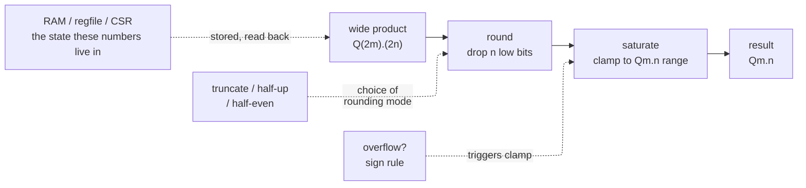
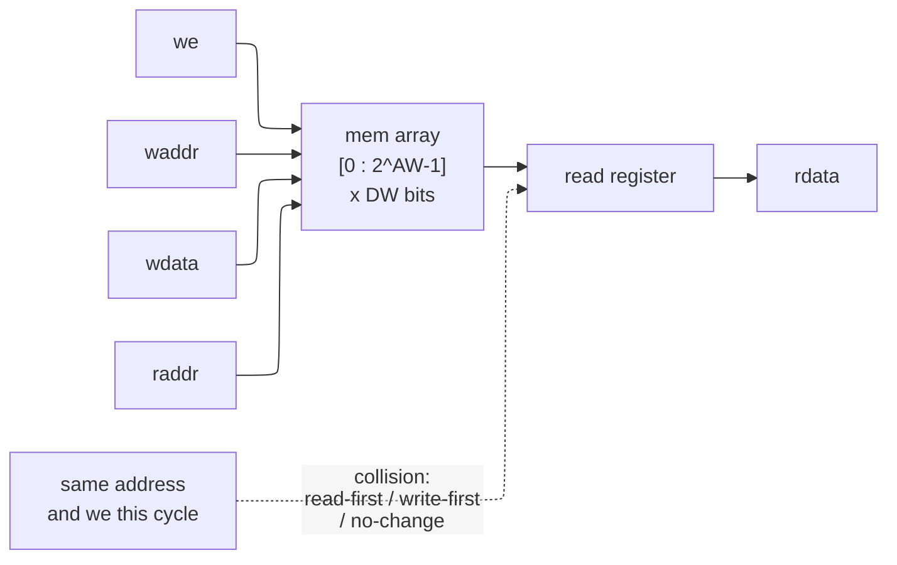
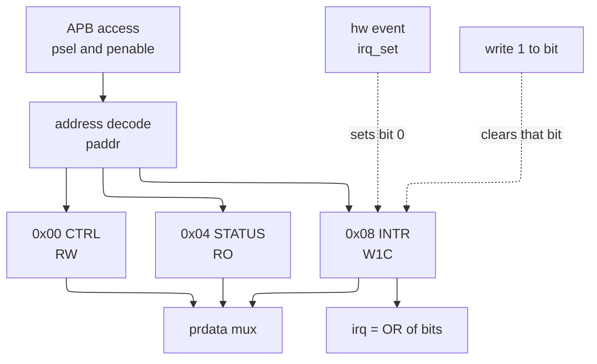

# Arithmetic and Memory RTL — Fixed-Point, Saturation, Rounding, RAM, and CSRs



> **Stage:** 03 · Frontend RTL (register-transfer level). The numeric and storage primitives every datapath is built from: how a design *interprets* a bus as a scaled number, keeps that number from wrapping or drifting when bits are dropped, and lays out the arrays and registers that hold it. Not a math course — the RTL patterns a synthesis tool must recognize.
> **Prerequisites:** [Adders_and_Multipliers](../00_Fundamentals/03_Adders_and_Multipliers.md) (the two's-complement carry-chain and partial-product tree these modules wrap), [Floating_Point](../00_Fundamentals/04_Floating_Point.md) (rounding modes and the bias argument, seen there for the mantissa). **Hands off to:** [Data_Types_and_Basics](02_Data_Types_and_Basics.md) (packed vs unpacked, signedness — the type rules every module here leans on), [RTL_Design_Patterns](14_RTL_Design_Patterns.md) (where these blocks become pipelined stages and shared resources).

---

## 0. Why this page exists

A synthesis tool does not *invent* an adder, a rounder, or a RAM — it **recognizes** a template you wrote and maps it to a hard macro or a standard-cell structure. Get the template subtly wrong and you do not get a syntax error; you get a *different circuit* that still simulates, or a circuit whose simulation and silicon disagree. This page is the catalog of those templates for the two things a datapath is made of:

1. **Numbers that are not integers.** Hardware has no floating point unless you pay for it, so real signals — an audio sample, a filter coefficient, a sensor reading — are carried as **integers with an agreed scale** (fixed-point, §1). Every operation on them then raises the same three questions: the bits grew, so where is the binary point now (§1)? The value grew past the range, so do we wrap or clamp (§2, §4)? We must drop low bits, so which way do we round (§3)? Answer these wrong and a filter goes unstable, an audio peak wraps to a loud click, or a DC offset creeps in over a million samples.
2. **State that must be stored densely.** A handful of flops is free-form; a kilobyte of memory or a 32-entry register file must map to a **compiled array** (block RAM, register file macro) with a rigid access template (§5, §6). And the programmer's view of a block — its control and status **registers** — is a third template again: an addressed slave with per-field behavior (§7).

The through-line: **every block below is a shape the tool pattern-matches.** The prose leads with what the block *is* in one sentence, then shows the exact synthesizable shape, compile-checked. Where simulation and silicon can legally disagree — the read-during-write hazard of §5 is the classic — the page says so explicitly, because that gap is where working RTL turns into a broken chip.

Every `systemverilog` block on this page was written to a file and compiled with `iverilog -g2012 -Wall` with **zero warnings**; the saturation and rounding blocks were also simulated, and their results are quoted inline.

---

## 1. Fixed-point and Q-format

**Plainly: a Qm.n number is an ordinary $m+n$-bit integer that everyone agrees to read as scaled by $2^{-n}$. The binary point is a *convention in your head*, not a bit in the hardware — the adder and multiplier are the same two's-complement cells as for plain integers; only your interpretation of the result differs.**

Write the stored integer as $\text{raw}$. Then the value it *represents* is

$$
\text{value} \;=\; \text{raw}\cdot 2^{-n}, \qquad \text{raw}\in\big[-2^{m+n-1},\,2^{m+n-1}-1\big]\ \text{(signed)}
$$

so a Q4.4 byte `8'sd24` is $24\cdot 2^{-4} = 1.5$, and its range is $[-8, +7.9375]$ in steps of $2^{-4}=0.0625$. The **$n$** sets *precision* (the step size), the **$m$** sets *range* (the largest magnitude); the total width $m+n$ is what actually costs wires and flops.

**Alignment is the whole game.** Because the point is only a convention, the hardware will happily add two operands whose points are in different places and give you nonsense. Two rules keep it honest:

- **Add / subtract:** operands must share the same $n$. Line up the binary points (shift the one with fewer fractional bits left), then add. The result needs **one extra integer bit** — $\text{Q}m.n + \text{Q}m.n \to \text{Q}(m{+}1).n$ — or it can overflow (§2).
- **Multiply:** points need *not* be pre-aligned; the point of the product is simply the **sum of the operand points**. Multiplying $\text{Q}m.n \times \text{Q}m.n$ gives a $2(m{+}n)$-bit product interpreted as

$$
\text{Q}m.n \times \text{Q}m.n \;=\; \text{Q}(2m).(2n).
$$

To store that product back in a $\text{Q}m.n$ word you must **requantize**: drop the extra $n$ low bits (that is the *rounding* step, §3) and drop the extra $m$ high bits (that is the *saturation* step, §2). The opening diagram is exactly this pipeline — **multiply, then round, then saturate** — and §2–§3 fill in the two lossy stages.

The helper below is two synthesizable pieces: `qmul_rescale` does a signed multiply and rescales the product back to $\text{Q}m.n$ by an **arithmetic** right shift (sign-preserving, truncating toward $-\infty$); `q_add_align` adds two operands given in *different* Q-formats by shifting each up to a common fractional width first.

```systemverilog
// Q(M.N): raw integer interpreted as raw*2^-N. Product of two QM.N is Q(2M).(2N).
module qmul_rescale #(parameter int M = 4, parameter int N = 4) (
    input  logic signed [M+N-1:0] a,      // QM.N
    input  logic signed [M+N-1:0] b,      // QM.N
    output logic signed [M+N-1:0] y       // QM.N (rescaled, truncated; may overflow)
);
    localparam int W = M + N;
    logic signed [2*W-1:0] full;          // Q(2M).(2N)
    always_comb begin
        full = a * b;                     // signed*signed, exact
        y    = W'(full >>> N);            // drop N frac bits -> QM.N (truncate toward -inf)
    end
endmodule

// Align two operands given in DIFFERENT Q-formats, then add at the result scale.
module q_add_align #(
    parameter int WA = 8, parameter int NA = 4,   // A is Q(WA-NA).NA
    parameter int WB = 8, parameter int NB = 2,   // B is Q(WB-NB).NB
    parameter int WY = 12, parameter int NY = 4   // Y frac bits = NY (>= NA, NB)
)(
    input  logic signed [WA-1:0] a,
    input  logic signed [WB-1:0] b,
    output logic signed [WY-1:0] y
);
    logic signed [WY-1:0] aa, bb;
    always_comb begin
        aa = WY'(a) <<< (NY - NA);        // shift A up to NY fractional bits
        bb = WY'(b) <<< (NY - NB);        // shift B up to NY fractional bits
        y  = aa + bb;                     // now points aligned
    end
endmodule
```

Simulated to pin the interpretation down: `qmul_rescale` in Q4.4 with $24\,(1.5)\times 32\,(2.0)$ returns raw `48` $= 3.0$, and $-24\,(-1.5)\times 32\,(2.0)$ returns raw `-48` $=-3.0$ — the signed multiply and the arithmetic shift both behave. `q_add_align` adding $1.5$ (Q4.4, raw 24) to $2.0$ (Q6.2, raw 8) returns raw `56` $=3.5$: B was shifted left by $NY-NB=2$ to line the points up before the add. The load-bearing subtlety is `>>>` versus `>>`: on a *signed* value the arithmetic shift replicates the sign bit, so truncation lands toward $-\infty$; a logical `>>` would inject zeros at the top and turn a negative product into a large positive one.

---

## 2. Saturating arithmetic

**Plainly: saturating arithmetic replaces two's-complement *wraparound* with *clamping* — when a result exceeds the largest representable value it is pinned to that maximum (and likewise to the minimum on the low side), instead of rolling over to the opposite sign.**

Plain two's-complement `127 + 1` in a signed byte is `-128`: a peak becomes a trough. That is catastrophic in exactly the places fixed-point lives — a **DSP** accumulator, an **audio** sample, a **pixel** — because a single overflow does not add a small error, it flips the sign and injects a full-scale discontinuity (an audible click, a bright speck, a filter that momentarily drives the wrong way). Saturation trades a *bounded* error (you lose the magnitude above full-scale) for eliminating the *catastrophic* one (you never invert the sign). It is the hardware analog of "the meter pegs at 100%."

The template computes the sum **one bit wider than the operands** — a *guard bit* — so the true sum is always exact and representable, then compares against the signed limits and clamps:

```systemverilog
// Saturating signed add: on overflow, clamp to max/min representable (no wrap).
module sat_add #(parameter int WIDTH = 8) (
    input  logic signed [WIDTH-1:0] a,
    input  logic signed [WIDTH-1:0] b,
    output logic signed [WIDTH-1:0] y,
    output logic                    sat     // 1 when the result was clamped
);
    localparam signed [WIDTH-1:0] SMAX =  (1 <<< (WIDTH-1)) - 1;   // 0111..1
    localparam signed [WIDTH-1:0] SMIN = -(1 <<< (WIDTH-1));       // 1000..0
    logic signed [WIDTH:0] sum;                                     // 1 guard bit = exact
    always_comb begin
        sum = (WIDTH+1)'(a) + (WIDTH+1)'(b);   // sign-extend both, exact sum
        if      (sum > SMAX) begin y = SMAX;        sat = 1'b1; end
        else if (sum < SMIN) begin y = SMIN;        sat = 1'b1; end
        else                 begin y = WIDTH'(sum); sat = 1'b0; end
    end
endmodule
```

Simulated at `WIDTH=8`:

| `a` | `b` | true sum | `y` | `sat` |
|---|---|---|---|---|
| 100 | 50 | 150 | **127** | 1 |
| −100 | −50 | −150 | **−128** | 1 |
| 10 | 20 | 30 | 30 | 0 |
| 127 | 1 | 128 | **127** | 1 |

The clamp fires exactly at the two limits and passes in-range sums through untouched; `sat` is the sticky flag DSP blocks fan out to a status register so firmware can see that headroom was exceeded. Two design notes. First, the guard bit is essential: comparing against `SMAX`/`SMIN` only works if `sum` can *hold* the out-of-range value to be compared — do the compare in `WIDTH` bits and the overflow has already wrapped, defeating the test. Second, saturation is **not associative** ($\text{sat}(\text{sat}(a+b)+c)\neq \text{sat}(a+\text{sat}(b+c))$ in general), so a multi-term sum should accumulate in a wide guard-banded accumulator and saturate **once** at the end, not after every add.

---

## 3. Rounding modes

**Plainly: rounding is the rule for *which representable value you land on* when you throw away low bits. The choices differ only in how they break the tie exactly halfway between two representable values — and that tie-breaking rule sets the long-run statistical bias of a datapath.**

Dropping $n$ low bits maps every input to one of the survivors. Three rules matter in RTL, and the right mental model is "what does the average error do over many samples":

- **Truncation** — just delete the low bits. Cheapest (no adder, just wires). For a signed value the arithmetic-shift truncation always moves **toward $-\infty$**, so it injects a *negative* mean error of about $-\tfrac12$ LSB. A biased offset that a downstream integrator or long accumulation will accumulate into visible DC drift.
- **Round-half-up** — add half an LSB ($2^{n-1}$) and then truncate. Rounds to nearest, but breaks every exact-half tie **upward**, so ties contribute a small *positive* bias. Cheap (one add) and fine when ties are rare, but the bias is real if half-ties are common (e.g. multiplying by exact 0.5).
- **Round-half-to-even (convergent / banker's rounding)** — round to nearest, and on an exact tie round to whichever neighbor has an **even** LSB. Ties then split half-up and half-down, so the mean tie error is **zero**: unbiased. This is the IEEE-754 default (see [Floating_Point](../00_Fundamentals/04_Floating_Point.md)) for the same reason — it is the only one of the three that does not slowly poison a long sum.

The bias contrast in one line: **truncation leans toward $-\infty$; round-half-up leans up on ties; round-half-even has no lean.** One parameterized module covers all three (`MODE` selects), using only bitwise tests so there are no fragile part-selects — `half` is the $2^{n-1}$ tie bit, the sticky term is the OR of the bits below it, and `lsb` is the surviving low bit that decides even/odd:

```systemverilog
// Requantize by dropping DROP low bits. MODE: 0=truncate, 1=round-half-up, 2=round-half-even.
module rounder #(
    parameter int WIN  = 6,     // signed input width
    parameter int DROP = 1,     // number of LSBs removed
    parameter int MODE = 2      // 0 trunc / 1 half-up / 2 half-even (convergent)
)(
    input  logic signed [WIN-1:0]      din,
    output logic signed [WIN-DROP-1:0] dout
);
    logic signed [WIN-1:0] rnd, half, low, lsb;
    logic addhalf;
    always_comb begin
        half    = (WIN'(1) <<< (DROP-1));   // value 2^(DROP-1) = the 0.5 bit
        low     = half - 1;                 // mask of bits strictly below 0.5
        lsb     = (half <<< 1);             // the kept LSB (bit index DROP)
        addhalf = 1'b0;
        case (MODE)
            0: addhalf = 1'b0;                                  // truncate
            1: addhalf = |(din & half);                         // half-up: add if 0.5 bit set
            2: addhalf = |(din & half) & (|(din & low) | |(din & lsb)); // tie -> to even
            default: addhalf = 1'b0;
        endcase
        rnd  = din + (addhalf ? half : '0);
        dout = (WIN-DROP)'(rnd >>> DROP);   // arithmetic shift truncates toward -inf
    end
endmodule
```

Simulated with `DROP=1` (rounding a $\text{Q}?.1$ value to an integer) so the ties are the half-integers:

| raw | value | truncate | half-up | half-even |
|---|---|---|---|---|
| 1 | 0.5 | 0 | 1 | **0** |
| 3 | 1.5 | 1 | 2 | **2** |
| 5 | 2.5 | 2 | 3 | **2** |
| 7 | 3.5 | 3 | 4 | **4** |

The half-even column lands on `0, 2, 2, 4` — **every tie resolves to an even number**, confirming the unbiased rule; truncation gives `0,1,2,3` (always down) and half-up gives `1,2,3,4` (always up). Read the columns as three bias signatures: down, up, and none. For a filter or a long accumulator, pay the extra logic and use half-even; for a one-shot display value where a fraction of an LSB never matters, truncate.

---

## 4. Overflow detection

**Plainly: a signed addition overflowed exactly when the carry *into* the sign bit differs from the carry *out* of it — equivalently, when both operands had the same sign but the result came out with the opposite sign. Two positives can only make a positive; if the sum reads negative, the magnitude escaped the range.**

The two formulations are identical; the sign-rule version is the one to reach for in RTL because it needs no access to internal carries — just the three MSBs:

$$
\text{ovf} \;=\; c_{\text{in},\,\text{MSB}} \oplus c_{\text{out},\,\text{MSB}} \;=\; \big(a_{\text{MSB}} = b_{\text{MSB}}\big)\ \wedge\ \big(s_{\text{MSB}} \neq a_{\text{MSB}}\big).
$$

Note what does **not** signal signed overflow: the carry-out of the top bit alone. That flag is the *unsigned* overflow (carry) indicator; signed overflow is the *XOR* of the top two carries. Mixing the two is a classic bug — a status register that reports `carry` when firmware expected `V`.

```systemverilog
// Signed overflow: operands share a sign but the result's sign differs
// (equivalently carry-in != carry-out of the MSB).
module add_ovf #(parameter int W = 8)(
    input  logic signed [W-1:0] a, b,
    output logic signed [W-1:0] s,
    output logic                ovf
);
    assign s   = a + b;                                     // 2's-complement wrap
    assign ovf = (a[W-1] == b[W-1]) && (s[W-1] != a[W-1]);  // sign rule
endmodule
```

Simulated at `W=8`: `100+50` wraps to `-106` with `ovf=1`; `-100+-50` wraps to `106` with `ovf=1`; `10+20 = 30` with `ovf=0`; and `-100+50 = -50` with `ovf=0` — opposite-sign operands *cannot* overflow, so the rule correctly stays quiet. This `ovf` is precisely the condition the saturating adder of §2 acts on; there, instead of merely flagging it, the guard-bit sum lets it *choose the clamp direction* (positive overflow to `SMAX`, negative to `SMIN`).

---

## 5. RAM inference

**Plainly: an unpacked register array written on a clock edge and read through a clocked (or, for the read, sometimes combinational) access infers a hardware RAM — a block RAM on an FPGA, a compiled SRAM macro in an ASIC — rather than a field of individual flip-flops. The array shape plus the access template is what the tool pattern-matches; deviate from the template and you either lose the macro (it degrades to flops, blowing up area) or you get a macro whose collision behavior does not match your simulation.**

The canonical building blocks. A **single-port** RAM shares one address between read and write (one access per cycle). A **simple dual-port** RAM has one write port and one *independent* read port (the workhorse for FIFOs and line buffers). Both are just an unpacked array with a synchronous write; the read is registered so the tool can map the output flop into the macro:

```systemverilog
// Single-port RAM: unpacked array + synchronous write + clocked read -> block RAM.
module sp_ram #(parameter int AW = 8, parameter int DW = 32)(
    input  logic          clk,
    input  logic          we,
    input  logic [AW-1:0] addr,
    input  logic [DW-1:0] wdata,
    output logic [DW-1:0] rdata
);
    logic [DW-1:0] mem [0:(1<<AW)-1];   // unpacked -> inferred RAM
    always_ff @(posedge clk) begin
        if (we) mem[addr] <= wdata;     // synchronous write
        rdata <= mem[addr];             // registered (clocked) read
    end
endmodule

// Simple dual-port: one write port, one independent read port.
module simple_dp_ram #(parameter int AW = 8, parameter int DW = 32)(
    input  logic          clk,
    input  logic          we,
    input  logic [AW-1:0] waddr,
    input  logic [DW-1:0] wdata,
    input  logic [AW-1:0] raddr,
    output logic [DW-1:0] rdata
);
    logic [DW-1:0] mem [0:(1<<AW)-1];
    always_ff @(posedge clk) begin
        if (we) mem[waddr] <= wdata;
        rdata <= mem[raddr];
    end
endmodule
```



### 5.1 The read-during-write hazard

The dangerous case is a **read and a write to the same address on the same clock edge**. There is no universally "correct" answer — the hardware macro has to pick one of three behaviors, and *your RTL template silently chooses which one you get*:

- **Read-first (read-before-write):** the read returns the **old** contents; the new data lands after. Infer it by doing the write and the read as separate non-blocking assignments — the read's right-hand side samples `mem` *before* the write commits.
- **Write-first (read-through / write-before-read):** the read returns the **new** data being written this cycle. Infer it by forwarding `wdata` to the read register on a same-address write.
- **No-change:** on a write cycle the read output simply **holds** its previous value (lowest power — the output register does not toggle during writes). Infer it by only updating the read register in the `else` of the write.

```systemverilog
// Read-during-write to the SAME address: three inferable behaviors.
module ram_read_first #(parameter int AW = 8, parameter int DW = 32)(
    input logic clk, we, input logic [AW-1:0] addr, input logic [DW-1:0] wdata,
    output logic [DW-1:0] rdata);
    logic [DW-1:0] mem [0:(1<<AW)-1];
    always_ff @(posedge clk) begin
        if (we) mem[addr] <= wdata;     // NBA: read below sees OLD contents
        rdata <= mem[addr];             // READ-FIRST: returns pre-write data
    end
endmodule

module ram_write_first #(parameter int AW = 8, parameter int DW = 32)(
    input logic clk, we, input logic [AW-1:0] addr, input logic [DW-1:0] wdata,
    output logic [DW-1:0] rdata);
    logic [DW-1:0] mem [0:(1<<AW)-1];
    always_ff @(posedge clk) begin
        if (we) begin
            mem[addr] <= wdata;
            rdata     <= wdata;         // WRITE-FIRST: forward NEW data (read-through)
        end else
            rdata     <= mem[addr];
    end
endmodule

module ram_no_change #(parameter int AW = 8, parameter int DW = 32)(
    input logic clk, we, input logic [AW-1:0] addr, input logic [DW-1:0] wdata,
    output logic [DW-1:0] rdata);
    logic [DW-1:0] mem [0:(1<<AW)-1];
    always_ff @(posedge clk) begin
        if (we) mem[addr] <= wdata;
        else    rdata     <= mem[addr]; // NO-CHANGE: output held during a write
    end
endmodule
```

**The sim-vs-silicon trap.** Behavioral RTL with non-blocking assignments *always* simulates as read-first (the NBA read samples the old array value), because that is what the SystemVerilog scheduler does. But the physical macro you get after synthesis has whatever collision mode the vendor primitive was configured for — and on some primitives a same-address read-during-write is **undefined** (the macro may return `X`, garbage, or the old/new value depending on the exact silicon). So a design that *relies* on read-first can pass RTL simulation and then fail in gate-level sim or on the board. Two defenses: match the template to the collision mode the target macro actually supports (the three modules above are the vendor-blessed shapes), and where the protocol allows a same-address collision, add an explicit external **bypass** (compare `waddr==raddr` and mux `wdata` onto `rdata`) so the behavior is in *your* RTL, not hidden in the macro's configuration.

---

## 6. Register file inference

**Plainly: a register file is a small, heavily *ported* RAM — a few words, but read from several places at once and written from one. A 2R1W file (two read ports, one write port) is the canonical datapath operand store; it infers not as a block RAM (too small, too many ports) but as a bank of flops with read multiplexers, or a dedicated register-file macro.**

The port count is the reason it is a distinct pattern from §5: block RAMs top out at one or two ports, but a CPU needs to read two source operands *and* write a result every cycle. The write stays synchronous (one write port, one clocked assignment); the reads here are **combinational** so a consumer in the same cycle sees the file's current contents without a cycle of latency:

```systemverilog
// 2R1W register file: synchronous write, asynchronous reads, write-first bypass.
module regfile #(parameter int AW = 5, parameter int DW = 32)(
    input  logic          clk,
    input  logic          we,
    input  logic [AW-1:0] waddr,
    input  logic [DW-1:0] wdata,
    input  logic [AW-1:0] raddr0, raddr1,
    output logic [DW-1:0] rdata0, rdata1
);
    logic [DW-1:0] rf [0:(1<<AW)-1];
    always_ff @(posedge clk)
        if (we) rf[waddr] <= wdata;              // single write port
    // Combinational reads; bypass so a same-cycle read sees the write being made.
    always_comb begin
        rdata0 = (we && raddr0 == waddr) ? wdata : rf[raddr0];
        rdata1 = (we && raddr1 == waddr) ? wdata : rf[raddr1];
    end
endmodule
```

**The write-first bypass** is the `(we && raddr == waddr) ? wdata : ...` mux, and it is the register-file echo of §5.1's collision problem. Without it, reading the same register you are writing this cycle returns the *old* value — which in a pipelined CPU is a read-after-write hazard the bypass hides in one line: an instruction reading a register that the instruction one stage ahead is writing gets the fresh value instead of a stale one. (In a real CPU, `x0`-style hardwired-zero registers and multi-stage forwarding add more cases; this is the primitive they build on.) The cost is a comparator and a mux per read port — cheap, and far cheaper than a pipeline stall.

---

## 7. Memory-mapped CSR register block

**Plainly: a CSR (control/status register) block is an addressable slave on a bus — a small decode that maps bus addresses to hardware registers, where each register field has a defined access behavior. It is the seam between firmware and hardware: software writes control bits and reads status bits through ordinary loads and stores, and the block enforces what each bit is *allowed* to do.**

Three field behaviors cover most of a real block, and each is a different flop update rule:

- **RW (read-write):** software owns it. Write sets it, read returns it. A control bit — an enable, a mode select, a divider setting.
- **RO (read-only status):** hardware owns it. Read returns a live hardware signal; writes are ignored. A FIFO level, a busy flag, a version number.
- **W1C (write-1-to-clear):** *shared* ownership, and the subtle one. Hardware **sets** the bit on an event (an interrupt fired); software **clears** it by writing a **1** to that bit position (writing 0 leaves it alone). This is the standard interrupt-status idiom: it lets firmware clear exactly the interrupts it has handled in a single write, without a read-modify-write race against new interrupts arriving.

The block below is APB-lite (`psel`/`penable`/`pwrite`, zero-wait-state `pready`). The address decode is a `case`; the W1C register is the one worth studying — it is built as $\text{intr} \leftarrow (\text{intr}\ \&\ \sim\!\text{clr})\ |\ \text{set}$, and the ordering makes a **coincident hardware-set and software-clear resolve in favor of the set**, so an interrupt that arrives in the very cycle firmware clears the old one is never lost:

```systemverilog
// APB-lite CSR block: address-decoded slave with RW, RO, and W1C fields.
module csr_block #(parameter int AW = 8, parameter int DW = 32)(
    input  logic          pclk,
    input  logic          presetn,
    input  logic          psel,
    input  logic          penable,
    input  logic          pwrite,
    input  logic [AW-1:0] paddr,
    input  logic [DW-1:0] pwdata,
    output logic [DW-1:0] prdata,
    output logic          pready,
    // hardware side
    output logic [DW-1:0] ctrl,          // RW  -> to datapath
    input  logic [DW-1:0] status_in,     // RO  <- from datapath
    input  logic          irq_set,       // hw pulse: raise interrupt (bit 0)
    output logic          irq            // level; software clears via W1C
);
    localparam logic [AW-1:0] A_CTRL = 8'h00;   // RW
    localparam logic [AW-1:0] A_STAT = 8'h04;   // RO
    localparam logic [AW-1:0] A_INTR = 8'h08;   // W1C

    logic [DW-1:0] ctrl_r, intr_r;
    logic [DW-1:0] set_mask, clr_mask;
    logic          wr;

    assign wr     = psel & penable & pwrite;   // APB access (2nd) phase, write
    assign pready = 1'b1;                       // zero-wait-state
    assign ctrl   = ctrl_r;
    assign irq    = |intr_r;

    always_comb begin
        set_mask    = '0;
        set_mask[0] = irq_set;                                   // hw sets bit 0
        clr_mask    = (wr && paddr == A_INTR) ? pwdata : '0;     // write-1-to-clear
    end

    always_ff @(posedge pclk or negedge presetn) begin
        if (!presetn) begin
            ctrl_r <= '0;
            intr_r <= '0;
        end else begin
            if (wr && paddr == A_CTRL) ctrl_r <= pwdata;         // RW
            intr_r <= (intr_r & ~clr_mask) | set_mask;           // set wins on tie
        end
    end

    always_comb begin
        case (paddr)
            A_CTRL:  prdata = ctrl_r;
            A_STAT:  prdata = status_in;    // RO: reads hw status, writes ignored
            A_INTR:  prdata = intr_r;
            default: prdata = '0;
        endcase
    end
endmodule
```



Notice the access asymmetry the decode enforces: a write to `A_STAT` does nothing (there is no `ctrl_r`-style flop behind it — the read simply muxes in the live `status_in`), and a write to `A_CTRL` updates a flop but a *read* of `A_INTR` never clears it (only a write of 1 does). That per-address, per-direction behavior *is* the CSR contract; a real generator (from an IP-XACT or RDL description) emits exactly this shape at scale, with dozens of fields, but every field is one of these three rules or a close cousin (W1S set-on-write, RC clear-on-read, RW with a hardware-writable shadow).

---

## Numbers to memorize

| Fact | Value / rule | Why (section) |
|---|---|---|
| Qm.n value | $\text{raw}\cdot 2^{-n}$, width $m+n$ | point is a convention, not a bit (§1) |
| Signed Qm.n range | $[-2^{m-1},\, 2^{m-1}-2^{-n}]$ | $m$ sets range, $n$ sets precision (§1) |
| Product format | $\text{Q}m.n \times \text{Q}m.n = \text{Q}(2m).(2n)$ | width doubles; points add (§1) |
| Rescale product to Qm.n | arithmetic `>>>` by $n$ | sign-preserving, truncates to $-\infty$ (§1) |
| Add / sub | align to common $n$; integer part $+1$ bit | else overflow (§1, §2) |
| Saturate on overflow | clamp to `SMAX`/`SMIN`, do **not** wrap | bounds a click/spike (§2) |
| Guard bit | $+1$ bit before compare/round | keeps intermediate exact (§2, §3) |
| Truncation bias | $\approx -\tfrac12$ LSB (toward $-\infty$) | biased down (§3) |
| Round-half-up | add $2^{n-1}$, then truncate | ties biased up (§3) |
| Round-half-even | add half only on tie if LSB odd | **unbiased**; IEEE-754 default (§3) |
| Signed overflow | $(a_{\text{msb}}{=}b_{\text{msb}}) \wedge (s_{\text{msb}}{\neq}a_{\text{msb}})$ | = carry-in XOR carry-out of MSB (§4) |
| Signed overflow $\neq$ carry | carry-out alone = *unsigned* flag | do not confuse V with C (§4) |
| RAM template | unpacked array + sync write + clocked read | infers block RAM / SRAM (§5) |
| Read-during-write | read-first / write-first / no-change | RTL NBA sims as read-first (§5.1) |
| Regfile read | combinational + write-first bypass | hides same-cycle RAW hazard (§6) |
| W1C update | $\text{intr}\leftarrow(\text{intr}\ \&\ \sim\!\text{clr})\ |\ \text{set}$ | set wins tie; no lost interrupt (§7) |
| APB access phase | `psel & penable` | commit read/write here (§7) |

---

## Cross-references

- **Down the stack (the cells these modules wrap):** [Adders_and_Multipliers](../00_Fundamentals/03_Adders_and_Multipliers.md) (the carry chain whose top-two-carry XOR is §4's overflow, and the partial-product tree behind §1's multiply), [Floating_Point](../00_Fundamentals/04_Floating_Point.md) (round-to-even and the bias argument of §3, applied to the mantissa; fixed-point is the point-is-fixed special case), [Logic_Building_Blocks](../00_Fundamentals/02_Logic_Building_Blocks.md) (the read-mux and the flop bank a register file becomes).
- **Beside it (the type and coding rules every module leans on):** [Data_Types_and_Basics](02_Data_Types_and_Basics.md) (signedness, `>>>` vs `>>`, packed vs unpacked — the array shape of §5–§6 and the sign rules of §1–§4), [RTL_Design_Methodology](01_RTL_Design_Methodology.md) (`always_ff`/`always_comb` discipline, reset style behind the CSR block), [Procedural_Processes_and_IPC](03_Procedural_Processes_and_IPC.md) (why the §5.1 NBA read samples the *old* array value).
- **Up the stack (where these become a system):** [RTL_Design_Patterns](14_RTL_Design_Patterns.md) (pipelining the requantize datapath, sharing a multiplier, FIFOs on the dual-port RAM), [Assertions_and_Coverage](09_Assertions_and_Coverage.md) (asserting no overflow, checking CSR access rules), [Gate_Level_Sim_and_Emulation](13_Gate_Level_Sim_and_Emulation.md) (where the §5.1 read-during-write sim-vs-silicon gap is caught).

---

## References

1. Harris, D.M. and Harris, S.L., *Digital Design and Computer Architecture: RISC-V Edition*, Morgan Kaufmann, 2021. Ch. 5 (arithmetic circuits, overflow), Ch. 5 HDL examples and Ch. 8 (memory arrays, register files, and their HDL inference templates).
2. Parhami, B., *Computer Arithmetic: Algorithms and Hardware Designs*, 2nd ed., Oxford University Press, 2010. Two's-complement overflow (§2), saturating arithmetic, and the rounding schemes of §3.
3. Ercegovac, M.D. and Lang, T., *Digital Arithmetic*, Morgan Kaufmann, 2004. Rounding modes, round-to-nearest-even, and the error/bias analysis behind §3.
4. Yates, R., "Fixed-Point Arithmetic: An Introduction," Digital Signal Labs, tech. ref. rev. 2013. Q-format, scaling, alignment, and requantization for DSP (§1).
5. Oberstar, E.L., "Fixed-Point Representation and Fractional Math," rev. 1.2, 2007. Worked Q-format multiply/round examples paralleling §1 and §3.
6. AMD/Xilinx UG901, *Vivado Design Suite User Guide: Synthesis*, and Intel *Quartus Prime HDL Coding Styles* — RAM/register-file inference templates and the read-during-write (read-first / write-first / no-change) modes of §5.1.
7. Arm, *AMBA APB Protocol Specification* (IHI 0024). The setup/access-phase handshake behind the §7 CSR slave.
