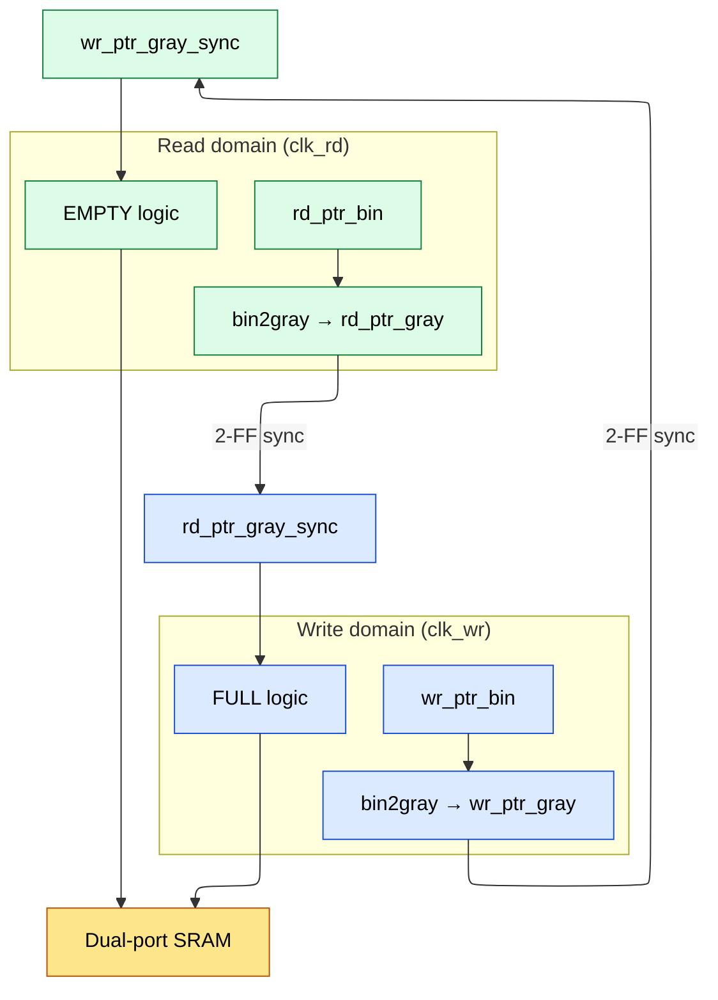

# Asynchronous Circuit Design and Clock Domain Crossing -- The Complete CDC Bible

## Table of Contents
1. Metastability -- Physics and MTBF Derivation
2. Two-FF Synchronizer -- Design and Analysis
3. Pulse Synchronizer
4. Multi-Bit Bus Synchronization Strategies
5. Asynchronous FIFO -- Production-Quality Design
6. Reset Synchronization
7. Level Shifters for Multi-Voltage Designs
8. Handshake Protocols (2-Phase and 4-Phase)
9. CDC Verification Methodology
10. Real CDC Bugs from Tapeout Experience

---

## 1. Metastability -- Physics and MTBF Derivation

### 1.1 The Bistable Element Differential Equation

A cross-coupled inverter pair (the core of any latch/FF) is a bistable element. In the metastable region, the circuit behavior is governed by:

- **Let V** = `voltage at the internal node (between the two inverters)`
- **Let Vm** = `metastable equilibrium point (midpoint, ~VDD/2)`

**Small-signal model near metastable point:**
   - dV/dt = (V - Vm) / tau

- **where tau** = `time constant of the regenerative latch`
   - tau = C_node / (gm1 + gm2 - 1/R_load)
   - gm1, gm2 = transconductance of the inverter transistors at Vm
   - C_node = parasitic capacitance at the internal node

**Solution:**
   - V(t) = Vm + (V_initial - Vm) * exp(t / tau)

The voltage exponentially diverges from Vm. The closer V_initial is to Vm (smaller perturbation), the longer it takes to resolve.

### 1.2 Resolution Time Derivation

For the output to be considered resolved, V(t) must reach a threshold V_logic (a valid logic level, say Vm + VDD/4):

```verilog
V_logic = Vm + Delta_V_resolved

V(t_resolve) = Vm + (V_initial - Vm) * exp(t_resolve / tau) = V_logic

Solving for t_resolve:
  t_resolve = tau * ln(Delta_V_resolved / |V_initial - Vm|)
  t_resolve = tau * ln(Delta_V / Delta_V0)

where:
  Delta_V  = voltage swing needed for resolution (e.g., VDD/4)
  Delta_V0 = initial perturbation from metastable point
```

**Key insight:** Resolution time is LOGARITHMIC in the initial perturbation. Even a tiny perturbation eventually resolves -- but it can take arbitrarily long.

### 1.3 MTBF (Mean Time Between Failures) Derivation

The probability that the FF enters a metastable state within a clock period depends on the "metastability window" T_w:

- **P(metastable)** = `T_w * f_data`

where f_data = rate of data transitions at the FF input

The metastability window is NOT fixed -- it depends on how much resolution
time is available:

T_w(t_r) = T_0 * exp(-t_r / tau)

where:
T_0  = intrinsic metastability window (related to setup + hold time)
t_r  = resolution time available before the next FF samples
tau  = metastability time constant

For a single FF: t_r = T_clk - T_c2q - T_setup_next
For a 2-FF synchronizer: t_r = T_clk - T_c2q  (full period to resolve)

**MTBF = 1 / (failure rate):**

```verilog
Failure rate = f_clk * f_data * T_w(t_r)
             = f_clk * f_data * T_0 * exp(-t_r / tau)

MTBF = 1 / (f_clk * f_data * T_0 * exp(-t_r / tau))
     = exp(t_r / tau) / (f_clk * f_data * T_0)
```

### 1.4 Numerical Example: MTBF Calculation for 7nm Technology

```verilog
Technology parameters (7nm FinFET):
  tau = 18 ps  (metastability time constant)
  T_0 = 40 fs  (intrinsic window, from characterization)

Design parameters:
  f_clk  = 1 GHz (destination clock)
  f_data = 500 MHz (source data rate)

2-FF synchronizer:
  T_clk = 1 ns
  t_c2q = 30 ps
  t_setup = 25 ps
  t_r = T_clk - t_c2q - t_setup = 1000 - 30 - 25 = 945 ps

  MTBF = exp(945e-12 / 18e-12) / (1e9 * 500e6 * 40e-15)
       = exp(52.5) / (1e9 * 5e8 * 4e-14)
       = exp(52.5) / (2e4)

  exp(52.5) ~ 5.9 * 10^22

  MTBF = 5.9e22 / 2e4 = 2.95e18 seconds = ~93 BILLION years

  This is astronomically safe!

1-FF "synchronizer" (no synchronizer -- just sample directly):
  t_r = 0 (no extra time to resolve, must be valid in same cycle)
  Actually, t_r = T_clk - t_c2q - t_setup - t_comb_next = very small

  Say t_r = 100 ps (some combinational slack after the FF):
  MTBF = exp(100/18) / (1e9 * 5e8 * 4e-14)
       = exp(5.56) / 2e4
       = 260 / 2e4 = 0.013 seconds

  Failure every 13 MILLISECONDS! Completely unacceptable.

3-FF synchronizer (for safety-critical):
  t_r = 2 * T_clk - t_c2q - t_setup = 2000 - 30 - 25 = 1945 ps
  MTBF = exp(1945/18) / 2e4 = exp(108) / 2e4 ~ 10^43 years
```

### 1.5 MTBF Worked Calculation for 28nm (Interview-Ready Numbers)

```ascii-graph
Technology parameters (28nm CMOS):
  tau  = 50 ps    (metastability time constant, characterized by foundry)
  T_0  = 100 fs   (intrinsic metastability window)

Design scenario:
  f_clk  = 200 MHz (destination domain, e.g., AHB bus)
  f_data = 50 MHz  (source domain, e.g., peripheral clock)
  T_clk  = 5 ns

2-FF synchronizer:
  t_c2q   = 80 ps (first FF, typical at 28nm)
  t_setup = 60 ps (second FF)
  t_r = T_clk - t_c2q - t_setup = 5000 - 80 - 60 = 4860 ps

  MTBF = exp(t_r / tau) / (f_clk * f_data * T_0)
       = exp(4860 / 50) / (200e6 * 50e6 * 100e-15)
       = exp(97.2) / (1e15 * 1e-13)
       = exp(97.2) / 100

  exp(97.2) ~ 3.5 * 10^42

  MTBF = 3.5e42 / 100 = 3.5e40 seconds ~ 1.1 * 10^33 years

  This is extremely safe -- a 2-FF synchronizer at 200 MHz in 28nm is
  more than adequate for any practical application.

What if we need to determine synchronizer stages for a TARGET MTBF?
  Target MTBF = 10^9 years = 3.15 * 10^16 seconds

  For N-stage synchronizer: t_r = (N-1) * T_clk - t_c2q - t_setup

  Required: exp(t_r / tau) / (f_clk * f_data * T_0) >= 3.15e16
  exp(t_r / tau) >= 3.15e16 * f_clk * f_data * T_0
  exp(t_r / tau) >= 3.15e16 * 200e6 * 50e6 * 100e-15
  exp(t_r / tau) >= 3.15e16 * 1000 = 3.15e19

  t_r / tau >= ln(3.15e19) = 44.98
  t_r >= 44.98 * 50 ps = 2249 ps

  With 2-FF: t_r = 4860 ps >> 2249 ps → 2 stages sufficient (by huge margin)

  More interesting scenario: f_clk = 2 GHz, f_data = 1 GHz (28nm)
    T_clk = 500 ps
    t_r = 500 - 80 - 60 = 360 ps
    MTBF = exp(360/50) / (2e9 * 1e9 * 100e-15)
         = exp(7.2) / (200)
         = 1339 / 200 = 6.7 seconds!

    At 2 GHz, 2-FF is completely inadequate.
    Need 3-FF: t_r = 2*500 - 80 - 60 = 860 ps
    MTBF = exp(860/50) / 200 = exp(17.2) / 200 = 2.95e7 / 200 = 1.47e5 seconds
    Still only ~1.7 days. Need 4-FF!

    4-FF: t_r = 3*500 - 80 - 60 = 1360 ps
    MTBF = exp(1360/50) / 200 = exp(27.2) / 200 = 6.5e11 / 200 = 3.25e9 seconds
    3.25e9 seconds ~ 103 years. Meets the 10^9 year target? No.
    
    5-FF: t_r = 4*500 - 80 - 60 = 1860 ps
    MTBF = exp(1860/50) / 200 = exp(37.2) / 200 = 1.5e16 / 200 = 7.5e13 seconds
    7.5e13 seconds ~ 2.4 million years. PASS!

  Conclusion: At 2 GHz with tau=50ps (28nm), you need 5 FF stages
  to meet 10^9 year MTBF. This is why high-frequency CDC is hard
  at older nodes with larger tau.
```

### 1.6 When to Use 3-FF Synchronizers

3-FF needed when:
- Very high clock frequencies (f_clk > 2 GHz, reduces t_r per stage)
   - Safety-critical applications (automotive ASIL-D, aerospace)
   - MTBF target > 10^9 years with 2-FF is marginal
   - Technology with poor tau (older nodes, high-Vt cells)

**Practical guideline:**
   - If 2-FF MTBF < 1000 years at worst-case corner -> use 3-FF
   - If 2-FF MTBF > 10^6 years -> 2-FF is fine

### 1.6 Layout Considerations for Synchronizers

```verilog
1. Place both FFs physically close (within 10-20 um)
   - Minimizes wire delay between stages (maximizes t_r)
   - Ensures both FFs are on the same clock tree leaf

2. Use the SAME clock tree leaf buffer
   - Zero skew between synchronizer stages
   - If skew exists, it reduces t_r

3. Use low-Vt cells for synchronizer FFs
   - Lower tau -> faster resolution
   - The leakage cost of 2 LVT FFs is negligible

4. Do NOT place combinational logic between synchronizer stages
   - Logic adds delay, reducing t_r
   - Logic can generate glitches that the second FF captures

5. In the .lib, synchronizer FFs may have special "sync" cells
   - Characterized for metastability parameters
   - Some libraries offer SYNC2 cells (integrated 2-FF synchronizer)
```

---

## 2. Two-FF Synchronizer -- Design and Analysis

### 2.1 Complete Parameterized Verilog

```verilog
module sync_2ff #(
    parameter STAGES  = 2,          // Number of synchronizer stages
    parameter INIT    = 1'b0        // Reset value
)(
    input  wire clk_dst,            // Destination clock
    input  wire rst_dst_n,          // Destination reset (async assert, sync deassert)
    input  wire data_async,         // Asynchronous input from source domain
    output wire data_sync           // Synchronized output in destination domain
);

    (* ASYNC_REG = "TRUE" *)        // Xilinx: don't optimize, place close together
    (* dont_touch = "true" *)       // Synopsys: don't optimize
    reg [STAGES-1:0] sync_pipe;

    always @(posedge clk_dst or negedge rst_dst_n) begin
        if (!rst_dst_n)
            sync_pipe <= {STAGES{INIT}};
        else
            sync_pipe <= {sync_pipe[STAGES-2:0], data_async};
    end

    assign data_sync = sync_pipe[STAGES-1];

endmodule
```

### 2.2 Signal Stability Requirements

For the 2-FF synchronizer to work correctly, the asynchronous input must meet a **minimum pulse width** requirement:

```verilog
Minimum pulse width > 1 destination clock period + setup time of first FF

Why? The signal must be stable long enough for at least ONE destination
clock edge to sample it. If the pulse is shorter than one destination
clock period, it may fall entirely between two sampling edges and be missed.

For a level signal (not a pulse): must be held stable for at least
  1 source_clk_period + 1 dest_clk_period
to guarantee capture.
```

### 2.3 Synchronizer Latency

```verilog
A 2-FF synchronizer introduces 2 destination clock cycles of latency:
  Cycle 1: First FF samples (may go metastable)
  Cycle 2: Second FF samples (resolved value)

Worst-case latency: 2 dest_clk periods + 1 additional cycle if the
input changes just after the first FF's sampling edge:
  Total worst-case = 3 dest_clk periods (if just missed the edge)
  Typical average = 1.5 to 2.5 dest_clk periods
```

---

## 3. Pulse Synchronizer

### 3.1 Toggle-Based Pulse Synchronizer -- Complete Design

```verilog
module pulse_sync (
    input  wire clk_src,
    input  wire rst_src_n,
    input  wire clk_dst,
    input  wire rst_dst_n,
    input  wire pulse_in,       // Single-cycle pulse in source domain
    output wire pulse_out       // Single-cycle pulse in destination domain
);

    //----------------------------------------------------------
    // Source domain: convert pulse to toggle
    //----------------------------------------------------------
    reg toggle_src;

    always @(posedge clk_src or negedge rst_src_n) begin
        if (!rst_src_n)
            toggle_src <= 1'b0;
        else if (pulse_in)
            toggle_src <= ~toggle_src;
    end

    //----------------------------------------------------------
    // Destination domain: synchronize toggle, detect edge
    //----------------------------------------------------------
    wire toggle_dst;

    sync_2ff #(.STAGES(2), .INIT(1'b0)) u_sync (
        .clk_dst    (clk_dst),
        .rst_dst_n  (rst_dst_n),
        .data_async (toggle_src),
        .data_sync  (toggle_dst)
    );

    // Edge detector: one additional FF to create a delayed version
    reg toggle_dst_d;

    always @(posedge clk_dst or negedge rst_dst_n) begin
        if (!rst_dst_n)
            toggle_dst_d <= 1'b0;
        else
            toggle_dst_d <= toggle_dst;
    end

    assign pulse_out = toggle_dst ^ toggle_dst_d;

endmodule
```

### 3.2 Timing Diagram

```wavedrom
{ "signal": [
  { "name": "clk_src",          "wave": "p........" },
  { "name": "pulse_in",         "wave": "0.10....." },
  { "name": "toggle_src",       "wave": "0.1......" },
  {},
  { "name": "clk_dst (slower)", "wave": "0.101010." },
  { "name": "sync_ff1",         "wave": "0...1...." },
  { "name": "toggle_dst",       "wave": "0....1..." },
  { "name": "toggle_d (+1clk)", "wave": "0.....1.." },
  { "name": "pulse_out (XOR)",  "wave": "0....10.." }
], "head": { "text": "Pulse synchronizer: src pulse flips a toggle, 2-FF sync in dst, XOR of toggle vs its delay regenerates a 1-cycle pulse" } }
```

### 3.3 Edge Cases and Limitations

**What if pulse_in fires again before the previous toggle is synchronized?**

```verilog
Source sends two pulses P1 and P2:
  P1: toggle 0->1
  P2: toggle 1->0

If P2 arrives before the synchronizer captures toggle=1:
  The synchronizer sees toggle go to 1 then back to 0
  If the 0->1 transition is missed (too narrow), P1 is LOST

Minimum spacing between pulses:
  >= 2 destination clock cycles + synchronizer latency
  Approximately: >= 1 source_clk + 3 dest_clk periods

If source clock is much faster than destination:
  Must guarantee minimum spacing (use a feedback acknowledge or rate limiting)
```

**Fast-to-slow crossing:**

```verilog
If f_src >> f_dst (e.g., 10x faster), a single-cycle source pulse
is much narrower than the destination clock period. The toggle approach
handles this correctly because the toggle level persists until the next pulse.
But back-to-back source pulses WILL be lost. Use a FIFO or handshake
for reliable fast-to-slow transfers.
```

---

## 4. Multi-Bit Bus Synchronization Strategies

### 4.1 Why You CANNOT Use Individual 2-FF Synchronizers on a Bus

```verilog
Source domain launches a 4-bit bus: 0111 -> 1000 (all 4 bits change)

With individual synchronizers, each bit may resolve at a different cycle:

  Cycle N:   bit[3] sees 0, bit[2] sees 1, bit[1] sees 1, bit[0] sees 1  -> 0111
  Cycle N+1: bit[3] sees 1, bit[2] sees 0, bit[1] sees 0, bit[0] sees 0  -> 1000

  But some bits might resolve one cycle early:
  Cycle N:   bit[3] sees 1, bit[2] sees 1, bit[1] sees 1, bit[0] sees 1  -> 1111 !!
  Or:        bit[3] sees 0, bit[2] sees 0, bit[1] sees 0, bit[0] sees 0  -> 0000 !!

  Any combination of old and new bit values is possible.
  This produces INCORRECT intermediate values that never existed in the source.
```

### 4.2 Strategy 1: MUX-Recirculation Synchronizer

Synchronize a single control bit (valid/enable), then use it to capture the bus.

```verilog
module mux_sync #(
    parameter WIDTH = 8
)(
    input  wire             clk_src,
    input  wire             rst_src_n,
    input  wire             clk_dst,
    input  wire             rst_dst_n,
    input  wire [WIDTH-1:0] data_src,       // Bus from source domain
    input  wire             valid_src,       // Pulse: new data available
    output reg  [WIDTH-1:0] data_dst,       // Captured bus in dest domain
    output wire             valid_dst        // Pulse: data captured
);

    //----------------------------------------------------------
    // Source domain: hold data stable, send toggle
    //----------------------------------------------------------
    reg [WIDTH-1:0] data_hold;
    reg toggle_src;

    always @(posedge clk_src or negedge rst_src_n) begin
        if (!rst_src_n) begin
            data_hold  <= {WIDTH{1'b0}};
            toggle_src <= 1'b0;
        end else if (valid_src) begin
            data_hold  <= data_src;
            toggle_src <= ~toggle_src;
        end
    end

    //----------------------------------------------------------
    // Destination domain: synchronize toggle, detect edge, capture bus
    //----------------------------------------------------------
    wire toggle_dst;

    sync_2ff #(.STAGES(2), .INIT(1'b0)) u_sync (
        .clk_dst    (clk_dst),
        .rst_dst_n  (rst_dst_n),
        .data_async (toggle_src),
        .data_sync  (toggle_dst)
    );

    reg toggle_dst_d;
    always @(posedge clk_dst or negedge rst_dst_n) begin
        if (!rst_dst_n)
            toggle_dst_d <= 1'b0;
        else
            toggle_dst_d <= toggle_dst;
    end

    wire capture = toggle_dst ^ toggle_dst_d;

    // When capture fires, data_hold has been stable for >= 2 dest_clk cycles
    // (because the toggle took 2 cycles to synchronize)
    // So it's safe to sample data_hold directly (no synchronizer needed on bus!)
    always @(posedge clk_dst or negedge rst_dst_n) begin
        if (!rst_dst_n)
            data_dst <= {WIDTH{1'b0}};
        else if (capture)
            data_dst <= data_hold;
    end

    assign valid_dst = capture;

endmodule
```

**Key insight:** The bus data does NOT need synchronizers because it is guaranteed stable by the time the synchronized control signal arrives (the 2-FF synchronizer latency provides the stability window).

### 4.3 Strategy 2: Four-Phase Handshake with Full RTL

```verilog
module handshake_cdc #(
    parameter WIDTH = 32
)(
    // Source domain
    input  wire             clk_src,
    input  wire             rst_src_n,
    input  wire [WIDTH-1:0] data_in,
    input  wire             valid_in,
    output wire             ready_out,     // Backpressure to source

    // Destination domain
    input  wire             clk_dst,
    input  wire             rst_dst_n,
    output reg  [WIDTH-1:0] data_out,
    output reg              valid_out,
    input  wire             ready_in       // Destination consumed data
);

    //----------------------------------------------------------
    // Source domain
    //----------------------------------------------------------
    reg [WIDTH-1:0] data_hold;
    reg req_src;
    wire ack_synced;   // ack synchronized back to source domain

    localparam S_IDLE      = 2'b00;
    localparam S_WAIT_ACK  = 2'b01;
    localparam S_WAIT_ACKL = 2'b10;

    reg [1:0] src_state;

    always @(posedge clk_src or negedge rst_src_n) begin
        if (!rst_src_n) begin
            src_state <= S_IDLE;
            req_src   <= 1'b0;
            data_hold <= {WIDTH{1'b0}};
        end else begin
            case (src_state)
                S_IDLE: begin
                    if (valid_in && ready_out) begin
                        data_hold <= data_in;
                        req_src   <= 1'b1;       // Phase 1: assert req
                        src_state <= S_WAIT_ACK;
                    end
                end
                S_WAIT_ACK: begin
                    if (ack_synced) begin
                        req_src   <= 1'b0;       // Phase 3: deassert req
                        src_state <= S_WAIT_ACKL;
                    end
                end
                S_WAIT_ACKL: begin
                    if (!ack_synced) begin        // Phase 4: ack deasserted
                        src_state <= S_IDLE;
                    end
                end
            endcase
        end
    end

    assign ready_out = (src_state == S_IDLE);

    //----------------------------------------------------------
    // Destination domain
    //----------------------------------------------------------
    wire req_synced;   // req synchronized to destination domain
    reg  ack_dst;

    localparam D_IDLE     = 2'b00;
    localparam D_CAPTURE  = 2'b01;
    localparam D_WAIT_REQ = 2'b10;

    reg [1:0] dst_state;

    always @(posedge clk_dst or negedge rst_dst_n) begin
        if (!rst_dst_n) begin
            dst_state <= D_IDLE;
            ack_dst   <= 1'b0;
            data_out  <= {WIDTH{1'b0}};
            valid_out <= 1'b0;
        end else begin
            case (dst_state)
                D_IDLE: begin
                    valid_out <= 1'b0;
                    if (req_synced) begin
                        data_out  <= data_hold;    // Safe: data stable since req
                        valid_out <= 1'b1;
                        ack_dst   <= 1'b1;          // Phase 2: assert ack
                        dst_state <= D_CAPTURE;
                    end
                end
                D_CAPTURE: begin
                    if (ready_in) begin
                        valid_out <= 1'b0;          // Data consumed
                    end
                    if (!req_synced) begin
                        ack_dst   <= 1'b0;          // Phase 4: deassert ack
                        dst_state <= D_WAIT_REQ;
                    end
                end
                D_WAIT_REQ: begin
                    dst_state <= D_IDLE;
                end
            endcase
        end
    end

    //----------------------------------------------------------
    // Synchronizers
    //----------------------------------------------------------
    sync_2ff #(.STAGES(2)) u_sync_req (
        .clk_dst    (clk_dst),
        .rst_dst_n  (rst_dst_n),
        .data_async (req_src),
        .data_sync  (req_synced)
    );

    sync_2ff #(.STAGES(2)) u_sync_ack (
        .clk_dst    (clk_src),
        .rst_dst_n  (rst_src_n),
        .data_async (ack_dst),
        .data_sync  (ack_synced)
    );

endmodule
```

### 4.4 Handshake Waveform (4-Phase)

```wavedrom
{ "signal": [
  { "name": "clk_src",    "wave": "p........." },
  { "name": "data_hold",  "wave": "x=.......x", "data": ["DATA A"] },
  { "name": "req_src",    "wave": "0.1....0.." },
  { "name": "ack_synced", "wave": "0.....1.0." },
  {},
  { "name": "clk_dst",    "wave": "p........." },
  { "name": "req_synced", "wave": "0..1....0." },
  { "name": "ack_dst",    "wave": "0...1...0." },
  { "name": "data_out",   "wave": "x...=...x.", "data": ["DATA A"] }
], "head": { "text": "4-phase req/ack handshake with data hold — P1 req=1, P2 ack=1, P3 req=0, P4 ack=0" } }
```

**Throughput:** 1 transfer per ~8-12 clock cycles (4 synchronization crossings).

### 4.5 Strategy 3: Gray-Coded Bus (for Counters/Pointers Only)

Only 1 bit changes per increment, so individual 2-FF synchronizers are safe:

```verilog
Binary:  0000 -> 0001 -> 0010 -> 0011 -> 0100  (multiple bits change)
Gray:    0000 -> 0001 -> 0011 -> 0010 -> 0110  (one bit changes)
```

**Limitation:** Gray code only works for sequential counters (pointers, addresses). You cannot Gray-encode arbitrary data buses.

---

## 5. Asynchronous FIFO -- Production-Quality Design

### 5.1 Architecture



### 5.2 Binary-to-Gray Conversion (Proof)

```verilog
Gray code property: adjacent codes differ in exactly 1 bit.

Conversion formula: gray[i] = bin[i] ^ bin[i+1], gray[MSB] = bin[MSB]
Compact:            gray = bin ^ (bin >> 1)

Proof that only 1 bit changes per increment:

  Consider bin = B and bin+1 = B+1.
  Let k be the position of the least significant 0 in B.
  Then B+1 differs from B in bits 0 through k:
    bits 0..k-1:  were 1 in B, become 0 in B+1
    bit k:        was 0 in B, becomes 1 in B+1
    bits k+1..N:  unchanged

  In Gray code:
    gray[i] = bin[i] ^ bin[i+1]

  For i > k:   bin[i] and bin[i+1] are unchanged -> gray[i] unchanged
  For i = k:   bin[k] changes (0->1), bin[k+1] unchanged -> gray[k] changes
  For i < k:   bin[i] changes (1->0), bin[i+1] changes (1->0) ->
               gray[i] = 1^1 = 0 (before) and 0^0 = 0 (after) -> UNCHANGED!
  For i = k-1: bin[k-1] changes (1->0), bin[k] changes (0->1) ->
               gray[k-1] = 1^0 = 1 (before) and 0^1 = 1 (after) -> UNCHANGED!

  Only gray[k] changes! QED.
```

### 5.3 Gray-to-Binary Conversion

```verilog
binary[MSB] = gray[MSB]
binary[i]   = binary[i+1] ^ gray[i]    for i = MSB-1 down to 0

Or equivalently:
binary[i]   = gray[MSB] ^ gray[MSB-1] ^ ... ^ gray[i]
            = XOR of gray[MSB:i]
```

```verilog
function [PTR_W-1:0] gray2bin;
    input [PTR_W-1:0] gray;
    integer i;
    begin
        gray2bin[PTR_W-1] = gray[PTR_W-1];
        for (i = PTR_W-2; i >= 0; i = i - 1)
            gray2bin[i] = gray2bin[i+1] ^ gray[i];
    end
endfunction
```

### 5.4 Full and Empty Detection (Proof of Correctness)

**Pointer width:** ADDR_W + 1 bits (extra MSB for wrap-around detection).
For a FIFO with 2^ADDR_W entries, the pointers count from 0 to 2^(ADDR_W+1) - 1.

**Empty condition (in read clock domain):**

```verilog
EMPTY when wr_ptr_gray_synced == rd_ptr_gray

Proof: If the write pointer (as seen by the read domain) equals the read
pointer, there is nothing to read. Since the synchronized write pointer
may be slightly BEHIND the actual write pointer (due to synchronization
latency), the empty flag may be asserted even when data exists. This is
CONSERVATIVE (safe): it may falsely report empty for 1-2 cycles but will
never falsely report "not empty" when it is truly empty.
```

**Full condition (in write clock domain):**

```text
In BINARY: full when wr_ptr_bin[MSB] != rd_ptr_bin[MSB] AND
                      wr_ptr_bin[MSB-1:0] == rd_ptr_bin[MSB-1:0]
           (write pointer has wrapped once more than read pointer)

In GRAY CODE: full when
  wr_ptr_gray[MSB]   != rd_ptr_gray_sync[MSB]    AND
  wr_ptr_gray[MSB-1] != rd_ptr_gray_sync[MSB-1]  AND
  wr_ptr_gray[MSB-2:0] == rd_ptr_gray_sync[MSB-2:0]

Proof of the Gray code full condition:

  When binary pointers satisfy the full condition:
    wr_bin = {1, b_{N-2}, ..., b_0}
    rd_bin = {0, b_{N-2}, ..., b_0}  (same lower bits, MSB differs)

  Convert to Gray:
    wr_gray = wr_bin ^ (wr_bin >> 1)
    rd_gray = rd_bin ^ (rd_bin >> 1)

    wr_gray[MSB]   = 1 ^ b_{N-2} = ~b_{N-2} (if b_{N-2}=0 -> 1, if 1 -> 0)
    rd_gray[MSB]   = 0 ^ b_{N-2} = b_{N-2}
    -> wr_gray[MSB] != rd_gray[MSB]  (they are complementary)

    wr_gray[MSB-1] = b_{N-2} ^ b_{N-3}
    rd_gray[MSB-1] = b_{N-2} ^ b_{N-3}

    Wait -- that's the SAME! So how does the "top 2 MSBs differ" work?

  Let me redo this carefully:
    wr_bin = {1, a_{N-2}, ..., a_0}    (wr has wrapped)
    rd_bin = {0, a_{N-2}, ..., a_0}    (rd has NOT wrapped, same address)

    wr_gray[N-1] = wr_bin[N-1] ^ wr_bin[N-2] = 1 ^ a_{N-2}
    rd_gray[N-1] = rd_bin[N-1] ^ rd_bin[N-2] = 0 ^ a_{N-2} = a_{N-2}

    So wr_gray[N-1] = ~a_{N-2}, rd_gray[N-1] = a_{N-2}
    -> DIFFER (complement of each other)

    wr_gray[N-2] = wr_bin[N-2] ^ wr_bin[N-3] = a_{N-2} ^ a_{N-3}
    rd_gray[N-2] = rd_bin[N-2] ^ rd_bin[N-3] = a_{N-2} ^ a_{N-3}
    -> SAME!

    All lower bits also SAME.

  So the actual Gray-code full condition is:
    wr_gray[N-1]   != rd_gray[N-1]    (MSB differs)
    wr_gray[N-2]   == rd_gray[N-2]    (second MSB SAME -- NOT different!)
    wr_gray[N-3:0] == rd_gray[N-3:0]  (rest same)

  Wait, this contradicts the commonly cited "top 2 MSBs differ."
  Let me re-derive more carefully.

  Actually, the issue is that Gray code wrapping is different from binary.
  After 2^N increments, the Gray code pattern repeats. The full condition
  in many references uses:

    full = (wr_gray == {~rd_gray_sync[MSB:MSB-1], rd_gray_sync[MSB-2:0]})

  This means: MSB and MSB-1 are INVERTED, rest are EQUAL.

  This comes from the fact that at the halfway point of the Gray code
  sequence (when the binary MSB flips), the Gray code MSB and MSB-1
  both invert. Let me verify with a 3-bit example:

  Binary  Gray
  000     000
  001     001
  010     011
  011     010
  100     110    <- MSB flipped in binary; in Gray: 010 -> 110 (bits 2,1 changed)
  101     111
  110     101
  111     100

  Full condition: wr_bin = 100, rd_bin = 000 (wr wrapped, same address)
    wr_gray = 110, rd_gray = 000
    MSB:   1 != 0  -> differ (correct)
    MSB-1: 1 != 0  -> differ (correct!)
    LSB:   0 == 0  -> same (correct)

  Another example: wr_bin = 110, rd_bin = 010
    wr_gray = 101, rd_gray = 011
    MSB:   1 != 0  -> differ
    MSB-1: 0 != 1  -> differ
    LSB:   1 == 1  -> same

  So the "top 2 MSBs differ" IS correct for 3-bit pointers.
  The proof works because at the binary midpoint, both gray MSB and MSB-1 flip.

FULL = (wr_gray[N-1:N-2] != rd_gray_sync[N-1:N-2]) &&
       (wr_gray[N-3:0]   == rd_gray_sync[N-3:0])

This is CONSERVATIVE: may falsely report full (because rd_gray_sync
may be behind actual rd_gray), but never falsely report not-full.
```

### 5.5 Complete Production-Quality Async FIFO

```verilog
module async_fifo #(
    parameter DATA_W = 8,
    parameter ADDR_W = 4             // Depth = 2^ADDR_W = 16
)(
    // Write interface
    input  wire              wr_clk,
    input  wire              wr_rst_n,
    input  wire              wr_en,
    input  wire [DATA_W-1:0] wr_data,
    output wire              full,
    output wire              almost_full,  // Programmable threshold

    // Read interface
    input  wire              rd_clk,
    input  wire              rd_rst_n,
    input  wire              rd_en,
    output wire [DATA_W-1:0] rd_data,
    output wire              empty,
    output wire              almost_empty  // Programmable threshold
);

    localparam DEPTH = 1 << ADDR_W;
    localparam PTR_W = ADDR_W + 1;     // Extra MSB for wrap detection

    // ============================================================
    // Dual-Port RAM
    // ============================================================
    reg [DATA_W-1:0] mem [0:DEPTH-1];

    // Write port
    always @(posedge wr_clk) begin
        if (wr_en && !full)
            mem[wr_ptr_bin[ADDR_W-1:0]] <= wr_data;
    end

    // Read port (asynchronous read for simplicity; use registered for FPGA)
    assign rd_data = mem[rd_ptr_bin[ADDR_W-1:0]];

    // ============================================================
    // Write Pointer (binary and Gray)
    // ============================================================
    reg  [PTR_W-1:0] wr_ptr_bin;
    wire [PTR_W-1:0] wr_ptr_gray;
    wire [PTR_W-1:0] wr_ptr_bin_next;
    wire [PTR_W-1:0] wr_ptr_gray_next;

    assign wr_ptr_bin_next  = wr_ptr_bin + (wr_en & ~full);
    assign wr_ptr_gray      = wr_ptr_bin ^ (wr_ptr_bin >> 1);
    assign wr_ptr_gray_next = wr_ptr_bin_next ^ (wr_ptr_bin_next >> 1);

    always @(posedge wr_clk or negedge wr_rst_n) begin
        if (!wr_rst_n)
            wr_ptr_bin <= {PTR_W{1'b0}};
        else
            wr_ptr_bin <= wr_ptr_bin_next;
    end

    // ============================================================
    // Read Pointer (binary and Gray)
    // ============================================================
    reg  [PTR_W-1:0] rd_ptr_bin;
    wire [PTR_W-1:0] rd_ptr_gray;
    wire [PTR_W-1:0] rd_ptr_bin_next;
    wire [PTR_W-1:0] rd_ptr_gray_next;

    assign rd_ptr_bin_next  = rd_ptr_bin + (rd_en & ~empty);
    assign rd_ptr_gray      = rd_ptr_bin ^ (rd_ptr_bin >> 1);
    assign rd_ptr_gray_next = rd_ptr_bin_next ^ (rd_ptr_bin_next >> 1);

    always @(posedge rd_clk or negedge rd_rst_n) begin
        if (!rd_rst_n)
            rd_ptr_bin <= {PTR_W{1'b0}};
        else
            rd_ptr_bin <= rd_ptr_bin_next;
    end

    // ============================================================
    // Synchronize write pointer Gray code to read domain
    // ============================================================
    reg [PTR_W-1:0] wr_gray_sync1, wr_gray_sync2;

    always @(posedge rd_clk or negedge rd_rst_n) begin
        if (!rd_rst_n) begin
            wr_gray_sync1 <= {PTR_W{1'b0}};
            wr_gray_sync2 <= {PTR_W{1'b0}};
        end else begin
            wr_gray_sync1 <= wr_ptr_gray;
            wr_gray_sync2 <= wr_gray_sync1;
        end
    end

    // ============================================================
    // Synchronize read pointer Gray code to write domain
    // ============================================================
    reg [PTR_W-1:0] rd_gray_sync1, rd_gray_sync2;

    always @(posedge wr_clk or negedge wr_rst_n) begin
        if (!wr_rst_n) begin
            rd_gray_sync1 <= {PTR_W{1'b0}};
            rd_gray_sync2 <= {PTR_W{1'b0}};
        end else begin
            rd_gray_sync1 <= rd_ptr_gray;
            rd_gray_sync2 <= rd_gray_sync1;
        end
    end

    // ============================================================
    // Full flag (in write clock domain)
    // ============================================================
    assign full = (wr_ptr_gray_next[PTR_W-1]   != rd_gray_sync2[PTR_W-1]) &&
                  (wr_ptr_gray_next[PTR_W-2]   != rd_gray_sync2[PTR_W-2]) &&
                  (wr_ptr_gray_next[PTR_W-3:0] == rd_gray_sync2[PTR_W-3:0]);

    // ============================================================
    // Empty flag (in read clock domain)
    // ============================================================
    assign empty = (rd_ptr_gray_next == wr_gray_sync2);

    // ============================================================
    // Almost-full and almost-empty (using binary pointer comparison)
    // ============================================================
    // Convert synchronized Gray pointers back to binary for level calc
    wire [PTR_W-1:0] rd_bin_in_wrclk;  // rd pointer as binary in write domain
    wire [PTR_W-1:0] wr_bin_in_rdclk;  // wr pointer as binary in read domain

    // Gray-to-binary conversion
    genvar gi;
    generate
        // In write domain: convert rd_gray_sync2 to binary
        for (gi = 0; gi < PTR_W; gi = gi + 1) begin : g2b_wr
            if (gi == PTR_W - 1)
                assign rd_bin_in_wrclk[gi] = rd_gray_sync2[gi];
            else
                assign rd_bin_in_wrclk[gi] = rd_bin_in_wrclk[gi+1] ^ rd_gray_sync2[gi];
        end
        // In read domain: convert wr_gray_sync2 to binary
        for (gi = 0; gi < PTR_W; gi = gi + 1) begin : g2b_rd
            if (gi == PTR_W - 1)
                assign wr_bin_in_rdclk[gi] = wr_gray_sync2[gi];
            else
                assign wr_bin_in_rdclk[gi] = wr_bin_in_rdclk[gi+1] ^ wr_gray_sync2[gi];
        end
    endgenerate

    wire [PTR_W-1:0] fill_level_wr = wr_ptr_bin - rd_bin_in_wrclk;
    wire [PTR_W-1:0] fill_level_rd = wr_bin_in_rdclk - rd_ptr_bin;

    localparam ALMOST_FULL_THRESH  = DEPTH - 2;  // 2 entries from full
    localparam ALMOST_EMPTY_THRESH = 2;           // 2 entries from empty

    assign almost_full  = (fill_level_wr >= ALMOST_FULL_THRESH);
    assign almost_empty = (fill_level_rd <= ALMOST_EMPTY_THRESH);

endmodule
```

### 5.6 Depth=8 FIFO Worked Example: All Pointer States

```ascii-graph
FIFO configuration:
  DATA_W = 8 (8-bit data)
  ADDR_W = 3  (depth = 2^3 = 8 entries)
  PTR_W  = 4  (ADDR_W + 1 = 4-bit pointers with wrap bit)

  Memory indices: 0..7 (3-bit address)
  Pointers range: 0..15 (4-bit, wrap at 16)

  Full Gray code table for 4-bit pointers (0..15):
  ┌───────┬──────────┬─────────────────────────────────────────┐
  │ Binary│  Gray    │  Note                                   │
  ├───────┼──────────┼─────────────────────────────────────────┤
  │ 0000  │  0000    │  Empty (initial state)                   │
  │ 0001  │  0001    │  1 entry written                         │
  │ 0010  │  0011    │  2 entries                               │
  │ 0011  │  0010    │  3 entries                               │
  │ 0100  │  0110    │  4 entries (half full)                   │
  │ 0101  │  0111    │  5 entries                               │
  │ 0110  │  0101    │  6 entries                               │
  │ 0111  │  0100    │  7 entries                               │
  │ 1000  │  1100    │  8 entries = FULL (wrapped)              │
  │ 1001  │  1101    │  7 entries (read 1)                      │
  │ 1010  │  1111    │  6 entries                               │
  │ 1011  │  1110    │  5 entries                               │
  │ 1100  │  1010    │  4 entries                               │
  │ 1101  │  1011    │  3 entries                               │
  │ 1110  │  1001    │  2 entries                               │
  │ 1111  │  1000    │  1 entry (read 7 of 8)                   │
  │ 0000  │  0000    │  EMPTY again (full wrap)                 │
  └───────┴──────────┴─────────────────────────────────────────┘

  FULL detection (in write domain):
    wr_gray[3:2] != rd_gray_sync[3:2]  AND  wr_gray[1:0] == rd_gray_sync[1:0]
    Check: top 2 bits differ, bottom 2 bits same.

  EMPTY detection (in read domain):
    rd_gray_next == wr_gray_sync

  Fill level (approximate, in write domain):
    fill = wr_bin - rd_bin_in_wrclk (mod 16)
    Range: 0 (empty) to 8 (full). Values 9-15 indicate wrap + partial.

  Step-by-step walkthrough (8 writes, 3 reads, 2 writes):
  ──────────────────────────────────────────────────────────────

  State 0: EMPTY
    wr_bin=0000, wr_gray=0000, rd_bin=0000, rd_gray=0000
    rd_gray_sync(wr clk) = 0000
    Full check: 0000 vs 0000 -> top 2 same -> NOT full
    Empty check: 0000 == 0000 -> EMPTY!

  State 1: Write A (addr 0)
    wr_bin=0001, wr_gray=0001
    rd unchanged: rd_gray=0000
    Full check: 0001 vs 0000 -> bit3:0!=0, bit2:0!=0 -> same top2 -> NOT full
    Empty check: 0001 != 0000 -> NOT empty
    mem[0] = A, fill = 1

  State 2: Write B (addr 1)
    wr_bin=0010, wr_gray=0011
    Full check: 0011 vs 0000 -> bit3:0==0, bit2:0==0 -> NOT full
    mem[1] = B, fill = 2

  State 3: Write C (addr 2)
    wr_bin=0011, wr_gray=0010
    mem[2] = C, fill = 3

  State 4: Write D (addr 3)
    wr_bin=0100, wr_gray=0110
    mem[3] = D, fill = 4

  State 5: Write E (addr 4)
    wr_bin=0101, wr_gray=0111
    mem[4] = E, fill = 5

  State 6: Write F (addr 5)
    wr_bin=0110, wr_gray=0101
    mem[5] = F, fill = 6

  State 7: Write G (addr 6)
    wr_bin=0111, wr_gray=0100
    mem[6] = G, fill = 7

  State 8: Write H (addr 7) -> FULL
    wr_bin=1000, wr_gray=1100
    rd_gray_sync = 0000 (no reads)
    Full check: 1100 vs 0000
      bit3: 1 != 0 ✓   bit2: 1 != 0 ✓   (top 2 differ)
      bit1: 0 == 0 ✓   bit0: 0 == 0 ✓   (bottom 2 same)
    -> FULL! Correct.
    mem[7] = H, fill = 8

  State 9: Read A (rd reads mem[0])
    rd_bin=0001, rd_gray=0001
    After sync (2 wr_clk cycles): rd_gray_sync(wr) = 0001
    Full check in wr domain: 1100 vs 0001
      bit3: 1 != 0 ✓   bit2: 1 != 0 ✓
      bit1: 0 == 0 ✓   bit0: 0 != 1 ✗ (bottom bits differ)
    -> NOT full. fill = 7

  State 10: Read B
    rd_bin=0010, rd_gray=0011
    Full check: 1100 vs 0011 -> bottom 2: 00 != 11 -> NOT full. fill = 6

  State 11: Read C
    rd_bin=0011, rd_gray=0010
    Full check: 1100 vs 0010 -> bottom 2: 00 != 10 -> NOT full. fill = 5

  State 12: Write I (addr 0, wraps to beginning)
    wr_bin=1001, wr_gray=1101
    rd_gray_sync = 0010
    Full check: 1101 vs 0010
      bit3: 1 != 0 ✓   bit2: 1 != 0 ✓
      bit1: 0 != 1 ✗  -> NOT full. fill = 6

  State 13: Write J (addr 1)
    wr_bin=1010, wr_gray=1111
    rd_gray_sync = 0010
    Full check: 1111 vs 0010
      bit3: 1 != 0 ✓   bit2: 1 != 0 ✓
      bit1: 1 != 1 ✗  -> NOT full. fill = 7

  Pointer width calculation for any depth:
    PTR_W = ceil(log2(DEPTH)) + 1
    For DEPTH=8:   PTR_W = 3 + 1 = 4 bits
    For DEPTH=16:  PTR_W = 4 + 1 = 5 bits
    For DEPTH=32:  PTR_W = 5 + 1 = 6 bits
    For DEPTH=64:  PTR_W = 6 + 1 = 7 bits

    The extra bit is MANDATORY -- without it, the full and empty
    conditions would be indistinguishable (both pointers equal).
```

### 5.7 Reset Handling in Async FIFO

Critical issue: write and read resets are in DIFFERENT clock domains.
Both must reset pointers to 0, but the resets may deassert at different times.

**Solution:**
   1. Use async-assert, sync-deassert reset synchronizers in EACH domain.
2. Both synchronizers are driven by the SAME async reset source.
3. Gray code pointers reset to 0 (Gray 0 = binary 0, this is safe).
4. After reset deasserts in both domains, the FIFO is in a known empty state.

Potential issue: if write-side deasserts first and starts writing before
read-side deasserts, the write pointer advances while read pointer is still 0.
This is OKAY -- the empty flag will be asserted (correctly) in the read domain
until its reset deasserts, preventing reads of partially-reset state.

### 5.8 Non-Power-of-2 FIFO Depth

Gray code requires power-of-2 counts. For non-power-of-2 depth, options:

```verilog
1. Round up to next power-of-2 (waste some entries but safe)
2. Use a handshake-based FIFO (no Gray code requirement)
3. Use Johnson counter (for very small depths, 2*N states for N FFs)

DO NOT try to use Gray code with a non-power-of-2 wrap point!
At the wrap point, the Gray code property breaks (more than 1 bit changes).
```

---

## 6. Reset Synchronization

### 6.1 Async Assert, Sync Deassert -- Full Analysis

```verilog
module reset_sync #(
    parameter STAGES = 2,
    parameter INIT   = 1'b0    // Reset polarity (0 = active low output)
)(
    input  wire clk,
    input  wire async_rst_n,    // Active-low async reset input
    output wire sync_rst_n      // Synchronized reset output (active-low)
);

    (* ASYNC_REG = "TRUE" *)
    reg [STAGES-1:0] rst_pipe;

    always @(posedge clk or negedge async_rst_n) begin
        if (!async_rst_n)
            rst_pipe <= {STAGES{1'b0}};         // Async ASSERT (immediate)
        else
            rst_pipe <= {rst_pipe[STAGES-2:0], 1'b1};  // Sync DEASSERT
    end

    assign sync_rst_n = rst_pipe[STAGES-1];

endmodule
```

### 6.2 Why Both Edges Matter

**Assertion must be asynchronous:**
- If the clock is dead or unstable during reset (common at power-on), a synchronous-only reset would never be captured.
- Emergency reset must work regardless of clock state.
- The async assertion immediately forces all FFs to their reset state.

**Deassertion must be synchronous:**
- If reset releases asynchronously, some FFs may see the deassertion before the clock edge and others after.
- This creates a race condition: some FFs exit reset on cycle N, others on cycle N+1.
- State machines may start in inconsistent states.
- The sync deassertion ensures ALL FFs see the reset release on the SAME clock edge.
- This also prevents recovery/removal timing violations on the FF async reset pin.

### 6.3 Reset Domain Crossing

```ascii-graph
                        ┌── reset_sync (clk_a) ──> rst_a_n
  async_rst_n ──────────┤
                        ├── reset_sync (clk_b) ──> rst_b_n
                        │
                        └── reset_sync (clk_c) ──> rst_c_n

Each domain gets its own reset synchronizer.
Reset assertion is simultaneous (async), but deassertion may differ
by a few clock cycles between domains. This is acceptable as long as
CDC logic handles the difference correctly.

Ordered reset release:
  Sometimes you need domain A to come out of reset BEFORE domain B
  (e.g., A produces data that B consumes, A must be ready first).

  Solution: chain the reset synchronizers:
    async_rst_n -> reset_sync(clk_a) -> rst_a_n -> reset_sync(clk_b) -> rst_b_n

  This guarantees A deasserts reset before B (with some CDC latency).
```

### 6.4 Reset Tree Considerations in Physical Design

- Reset fanout can be enormous (every FF in a domain)
- Reset net must meet timing (recovery and removal checks)
- CTS tools can build a "reset tree" similar to a clock tree
- Or: use a hierarchical reset buffer tree with balanced fanout
- Reset must NOT be clock-gated (it must reach all FFs even when clock is gated)
- In scan mode, reset may need to be controllable (via DFT MUX)

---

## 7. Level Shifters for Multi-Voltage Designs

### 7.1 Low-to-High Level Shifter

The simpler case: input swings 0 to VDD_low, output must swing 0 to VDD_high.

```verilog
        VDD_HIGH
        |      |
      [P1]   [P2]     <- Cross-coupled PMOS (powered by VDD_HIGH)
        |      |
    out_n    out
        |      |
      [N1]   [N2]     <- NMOS pull-down (driven by VDD_LOW input)
        |      |
       GND   GND

  N1 gate = IN (0 to VDD_LOW swing)
  N2 gate = IN_bar (inverted input)

  When IN = VDD_LOW:
    N1 ON, pulls out_n low
    P2 turns ON (gate = out_n = low), pulls out to VDD_HIGH
    Output = VDD_HIGH (correct high level)

  When IN = 0:
    N2 ON (IN_bar = VDD_LOW), pulls out low
    P1 turns ON, pulls out_n to VDD_HIGH
    Output = 0 (correct low level)
```

This works because the NMOS N1 only needs to pull down to ~0V, which is well below the PMOS threshold -- the VDD_LOW swing is sufficient to turn the NMOS on/off.

### 7.2 High-to-Low Level Shifter

Input swings 0 to VDD_high, output must swing 0 to VDD_low. Problem: VDD_high input can forward-bias the ESD protection diodes or damage thin-oxide transistors in the low-voltage domain.

```ascii-graph
Solution: Current-limiting resistor + level clamp

  VDD_HIGH domain        VDD_LOW domain
       |                      |
    [Driver] --- [R_limit] ---+--- [Clamp to VDD_LOW] --- [Buffer] --> OUT
                              |
                        [Diode clamp]
                              |
                             GND

Or use a dedicated high-to-low level shifter cell that internally
limits the voltage seen by the low-voltage transistors.
```

### 7.3 Enable Level Shifter (for Isolation)

Used at the boundary of power-gated domains. When the source domain is off, the level shifter's enable pin forces the output to a known value.

```ascii-graph
                ┌──────────────────┐
  IN (from OFF  │  Level Shifter    │
   domain) ────>│  with ENABLE     ├──> OUT (to ON domain)
                │                  │
  ENABLE ──────>│  When !ENABLE:   │
                │  OUT = clamp_val │
                └──────────────────┘
```

This combines the functions of a level shifter and an isolation cell, saving area.

### 7.4 Level Shifter Placement Rules

```verilog
1. Place level shifters at the voltage domain boundary
2. Signal direction determines which supply powers the LS:
   - Low-to-High: LS powered by HIGH supply (destination)
   - High-to-Low: LS powered by LOW supply (destination)
   - Enable LS: powered by ALWAYS-ON supply

3. If BOTH voltage and clock domains differ:
   Order: Source FF -> Level Shifter -> 2-FF Synchronizer -> Dest logic
   The LS converts voltage FIRST, then the synchronizer resolves metastability
   at the correct voltage level.

4. Level shifters add delay (20-80ps typical) -- must be in STA path.
```

---

## 8. Handshake Protocols -- Deep Dive

### 8.1 Two-Phase (Non-Return-to-Zero) Handshake

```ascii-graph
Uses transitions (edges) instead of levels:
  REQ toggle = new data available
  ACK toggle = data consumed

Sender                  Receiver
  |--- req toggles ------->|     New data on bus
  |                        |
  |<------ ack toggles ----|     Data consumed, bus free

Only 2 transitions per transfer (vs 4 for 4-phase).
Higher throughput but more complex (edge detection logic).
```

**Detailed 2-Phase (Toggle) Signaling Waveform:**

```wavedrom
{ "signal": [
  { "name": "CLK_src",      "wave": "p........." },
  { "name": "DATA",         "wave": "x=..=..=..", "data": ["D0","D1","D2"] },
  { "name": "REQ (toggle)", "wave": "01..0..1.." },
  {},
  { "name": "CLK_dst",      "wave": "p........." },
  { "name": "REQ_sync",     "wave": "0.1..0..1." },
  { "name": "ACK (toggle)", "wave": "0..1..0..1" }
], "head": { "text": "2-phase (toggle) handshake -- each REQ/ACK edge marks one transfer" } }
```

**Detailed 4-Phase (Return-to-Zero) Signaling Waveform:**

```wavedrom
{ "signal": [
  { "name": "CLK_src",  "wave": "p........." },
  { "name": "DATA",     "wave": "x=....=...", "data": ["D0","D1"] },
  { "name": "REQ",      "wave": "0.1..0.1.0" },
  {},
  { "name": "CLK_dst",  "wave": "p........." },
  { "name": "REQ_sync", "wave": "0..1..0.1." },
  { "name": "ACK",      "wave": "0...1.0..1" }
], "head": { "text": "4-phase handshake -- P1 assert REQ (data valid), P2 assert ACK, P3 deassert REQ, P4 deassert ACK" } }
```

**Comparison Table:**

```ascii-graph
  ┌───────────────────┬───────────────────────┬───────────────────────┐
  │ Property           │ 2-Phase (Toggle)      │ 4-Phase (RTZ)         │
  ├───────────────────┼───────────────────────┼───────────────────────┤
  │ Transfers/protocol │ 2 signal transitions  │ 4 signal transitions  │
  │ Sync crossings     │ 2 per transfer        │ 4 per transfer        │
  │ Throughput         │ ~2x higher            │ Baseline              │
  │ Latency            │ Lower                 │ Higher                │
  │ Implementation     │ Edge detection (XOR)  │ Level detection       │
  │                    │ More complex           │ Simpler               │
  │ Bus stability      │ Data must be stable   │ Data stable from      │
  │                    │ from REQ toggle until  │ REQ assert to ACK     │
  │                    │ ACK toggle received    │ deassert              │
  │ Reset behavior     │ Must initialize both  │ Both signals at 0,    │
  │                    │ sides to same level    │ naturally safe        │
  │ When to use        │ High-throughput CDC    │ Most CDC applications,│
  │                    │ where latency matters  │ simpler verification, │
  │                    │ (e.g., high-speed      │ general-purpose       │
  │                    │  interconnect)         │ (e.g., peripheral     │
  │                    │                        │  bus crossings)       │
  └───────────────────┴───────────────────────┴───────────────────────┘

  Throughput at f_src = f_dst = 500 MHz:
    4-phase: ~4 sync crossings * 2 cycles each = ~8 cycles/transfer
             Throughput ≈ 500 MHz / 8 = 62.5 M transfers/sec
    2-phase: ~2 sync crossings * 2 cycles each = ~4 cycles/transfer
             Throughput ≈ 500 MHz / 4 = 125 M transfers/sec
    Async FIFO: 1 transfer per write cycle (sustained)
             Throughput = 500 M transfers/sec (8x better than 4-phase)
```

```verilog
4-phase handshake:
  4 synchronization crossings per transfer
  Each crossing: 2 dest_clk cycles
  Total: ~8-12 destination clock cycles per transfer

2-phase handshake:
  2 synchronization crossings per transfer
  Total: ~4-6 destination clock cycles per transfer

Async FIFO:
  1 write per wr_clk, 1 read per rd_clk (after initial latency)
  Throughput: min(f_wr, f_rd) words per second
  Latency: 2-3 cycles for first word

Comparison at f_src = f_dst = 1 GHz:
  4-phase: ~100-125 Mtransfers/sec
  2-phase: ~166-250 Mtransfers/sec
  Async FIFO: ~1 Gtransfers/sec (1 per cycle, sustained)
```

---

## 9. CDC Verification Methodology

### 9.1 Structural Checks (SpyGlass CDC / Meridian CDC)

```verilog
Check 1: Missing synchronizer
  Every signal crossing a clock domain boundary must pass through
  a recognized synchronization structure (2-FF, FIFO, handshake).
  Tool traverses the netlist from source-domain FFs to dest-domain FFs,
  checking for synchronizer cells on every crossing path.

Check 2: Combinational logic before synchronizer
  No logic gates between the source FF and the first synchronizer FF.
  Combinational logic can generate glitches that the synchronizer captures.
  Allowed: an inverter (treated as a buffer by most tools).
  Not allowed: AND, OR, MUX, XOR, etc.

Check 3: Multi-bit CDC without proper encoding
  If multiple signals from the same source domain arrive at the same
  destination-domain logic, the tool flags a potential coherency issue.
  Must use FIFO, handshake, Gray code, or MUX synchronization.

Check 4: Reconvergence after synchronizer
  If a signal is synchronized via two different paths and then
  reconverges at a gate in the destination domain, the values may
  be from different cycles.

  Example:
    sig_src -> sync_A -> logic -> gate_X
    sig_src -> sync_B -> logic -> gate_X
  Even though both sync_A and sync_B synchronize the same signal,
  they may resolve to different values on the same cycle.

Check 5: Gray code verification
  For FIFO pointers crossing domains, verify that the counter uses
  proper Gray encoding (only 1 bit changes per increment).
```

### 9.2 Protocol Checks

```verilog
Check 6: Handshake protocol correctness
  Verify REQ/ACK follow the expected 4-phase or 2-phase protocol.
  REQ must not toggle while waiting for ACK.
  Data bus must be stable between REQ assertion and ACK assertion.

Check 7: FIFO pointer protocol
  Verify Gray code conversion is correct.
  Verify full/empty logic compares the correct bits.
  Verify almost-full/almost-empty thresholds are consistent.

Check 8: Data stability
  For MUX-based synchronization, verify that the data bus is stable
  for at least 1 source_clk + 2 dest_clk cycles when the control
  signal (synchronized enable) fires.
```

### 9.3 Formal CDC Verification

SpyGlass CDC and similar tools use **formal methods** (model checking, property checking) to exhaustively verify CDC correctness:

1. Build a formal model of the design with clock domain annotations
2. Insert assertions at every CDC crossing:
   - Synchronizer present
   - No glitch paths
   - Data stability requirements met
   - Protocol compliance
3. Use formal engines (BMC, k-induction) to prove/disprove assertions
4. Generate waivers for known-safe crossings (e.g., static config registers)

Formal CDC catches bugs that simulation CANNOT:
   - Race conditions that require precise clock alignment (rare in sim)
   - Reconvergence issues that depend on metastable resolution direction
   - Protocol violations that only occur under specific timing relationships

### 9.4 What Simulation Alone Cannot Catch

```ascii-graph
CDC bugs that are invisible to simulation:

1. Low-probability metastability events
   - Simulation models resolve to deterministic values (0 or 1)
   - Real metastable FFs can resolve to ANY value, or stay
     metastable long enough to propagate through multiple gates
   - MTBF calculations show failure rates of once per years/centuries
   - A sim running at 1 kHz effective rate for 1 hour covers 3.6M cycles
     Real chip at 1 GHz covers 3.6M cycles in 3.6 ms
   - Sim coverage of metastability space: essentially 0%

2. Precise clock edge alignment
   - Two async clocks may produce a specific phase relationship only
     once every 10^6 cycles (depending on frequency ratio)
   - Sim with integer clock ratios NEVER explores all phase alignments
   - Irrational frequency ratios (e.g., f1/f2 = sqrt(2)) help but
     still don't cover the worst-case metastability window

3. Multi-bit CDC coherency under metastability
   - When a bus is sampled across a CDC boundary, sim sees
     clean transitions (all bits switch together)
   - In silicon, individual bits may resolve at different cycles
   - This produces intermediate values that NEVER occur in sim

4. Glitch propagation through combinational logic before synchronizer
   - Sim computes Boolean logic cleanly -- no hazards
   - In silicon, different path delays through a gate can produce
     narrow glitches that the synchronizer captures as valid transitions
   - Example: a AND b where a transitions 0→1 while b transitions
     1→0 with different delays can produce a glitch spike on the AND output

5. Voltage/temperature-induced timing shifts
   - Sim assumes a single PVT corner
   - Silicon varies across the die (OCV), across temperature cycles,
     and across voltage droop events (IR drop)
   - A synchronizer path that meets timing at TT may fail at SS

This is why formal CDC tools (SpyGlass, Meridian) are MANDATORY for
tapeout signoff -- they provide exhaustive proof that no CDC protocol
violation exists, regardless of timing alignment or probability.
Simulation complements formal by verifying functional correctness of
the CDC logic (does the FIFO actually transfer data correctly?) but
cannot prove the absence of metastability-related failures.

CDC Verification Checklist (mandatory for tapeout):
  1. Formal CDC analysis clean (0 errors, all waivers justified)
  2. Structural CDC checks clean (synchronizers on all crossings)
  3. Protocol checks clean (handshake/FIFO protocol compliance)
  4. CDC-aware simulation with randomized clock phases (functional test)
  5. STA clean on all synchronizer-internal paths (FF1→FF2 timing met)
  6. SDC correctly declares all async clock relationships
  7. Review all waivers: every waived crossing must have a documented
     reason (e.g., "static config register, only written at boot")
```

### 9.4 CDC Sign-Off Checklist

1. All structural CDC violations resolved or waived with justification
2. All multi-bit crossings use FIFO, handshake, or MUX synchronization
3. All reconvergence paths verified (no data coherency issues)
4. All reset crossings properly synchronized
5. All level shifters inserted (for multi-voltage crossings)
6. Formal CDC run clean with 0 errors
7. CDC-aware simulation run with constrained-random clock ratios
8. FIFO depths verified for all rate/burst scenarios
9. SDC correctly declares all async clock relationships
10. STA clean on all synchronizer FF-to-FF paths (within each domain)

---

## 10. Real CDC Bugs from Tapeout Experience

### 10.1 Bug: Data Coherency Failure

```verilog
Symptom: Occasional corrupted data on AXI bus after CDC crossing.

Root cause: A 32-bit data bus and a valid signal were synchronized
independently. The valid signal used a 2-FF synchronizer, and the
data bus used individual 2-FF synchronizers per bit. The data bus
bits resolved at different clock edges, so when valid arrived in
the destination domain, some data bits were from the old value
and others from the new value.

Fix: Use a MUX-recirculation scheme: hold data stable in source
domain, synchronize only the valid signal, then capture data with
the synchronized valid in the destination domain.

Lesson: NEVER use individual 2-FF synchronizers on a multi-bit bus.
```

### 10.2 Bug: Reset Domain Crossing

```verilog
Symptom: System hangs after reset on approximately 1 in 1000 boots.

Root cause: Reset signal crossed from the power management unit (PMU)
clock domain to the CPU clock domain without a reset synchronizer.
The reset deassertion occasionally violated recovery/removal timing
on some CPU FFs, causing them to exit reset in metastable states.
State machines started in invalid states, causing a deadlock.

Fix: Added async-assert/sync-deassert reset synchronizers in every
clock domain. Recovery/removal checks now pass at all signoff corners.

Lesson: Reset is a CDC signal too! It must be synchronized.
```

### 10.3 Bug: Clock Gating CDC Interaction

```verilog
Symptom: Intermittent data loss in a sensor data path.

Root cause: A clock gating cell's enable signal crossed from the control
domain (slow clock) to the data domain (fast clock). The enable was
synchronized, but the synchronized output was connected directly to
an ICG cell. Occasionally, the synchronized enable arrived just before
the ICG's latch transparency window, causing a glitch on the gated clock.
The glitch created a false clock edge that captured garbage data.

Fix: Ensured the synchronized enable met setup timing at the ICG cell
with sufficient margin. Added an additional register stage after the
synchronizer to align the enable to the correct clock phase.

Lesson: CDC signals driving clock gating cells need extra timing care.
```

### 10.4 Bug: Gray Code Pointer Overflow with Non-Power-of-2 Depth

```verilog
Symptom: Async FIFO occasionally loses data or reports full when not full.

Root cause: Designer specified FIFO depth = 12 (not power of 2) and
implemented a custom Gray code that wraps at 12. At the wrap point
(11 -> 0 in binary, which is 1110 -> 0000 in custom Gray), multiple
bits change simultaneously. The synchronized pointer in the other
domain captured an invalid intermediate value, corrupting the
full/empty detection.

Fix: Changed FIFO depth to 16 (next power of 2). Wasted 4 entries
but guaranteed correct Gray code operation.

Lesson: Gray code ONLY works with power-of-2 counts. For non-power-of-2,
use handshake-based FIFO or round up.
```

### 10.5 Bug: Quasi-Static Signal Misconception

```verilog
Symptom: Configuration register value occasionally read incorrectly
after dynamic reconfiguration (not just at boot).

Root cause: Configuration registers were marked as false_path in SDC
(assumed static). But a firmware update changed them dynamically at
runtime without synchronization. The register bits crossed the clock
domain without synchronizers and were captured at different cycles.

Fix: Added proper synchronization for dynamically-writable config
registers. Retained false_path only for truly static (boot-time-only)
registers.

Lesson: "Quasi-static" is only safe if you can GUARANTEE the signal
never changes during operation. If firmware can write it, it's not static.
```

---

