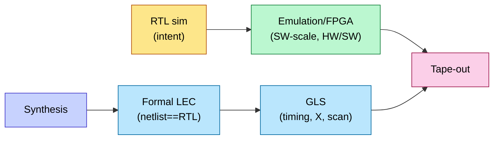

# Gate-Level Simulation and Emulation

> **Stage:** 03 · Verification. Two dynamic-verification tools that bracket RTL sim: **GLS** (verify the *post-synthesis netlist* with real timing) and **emulation/FPGA prototyping** (run *software-scale* workloads on the design).
> **Prerequisites:** [UVM_Methodology](UVM_Methodology.md), [Synthesis_and_Optimization](../04_Synthesis/Synthesis_and_Optimization.md), [STA](../06_Signoff/STA.md). **Hands off to:** [signoff](../06_Signoff/STA.md), [bring-up](../07_Manufacturing_and_Bringup/Tapeout_and_Post_Silicon_Bringup.md).

---

## 0. Why this page exists

RTL simulation proves the *design intent* is correct, but two gaps remain. First, synthesis transforms RTL into a gate netlist (and DFT inserts scan) — does the *netlist* still match, and does it work with **real gate/wire delays**? That is **gate-level simulation (GLS)**. Second, RTL sim is far too slow to boot an OS or run a benchmark (KHz–MHz effective), so you can't validate the hardware/software system — that is what **emulation and FPGA prototyping** do, at MHz–tens-of-MHz. Both catch bugs that pure RTL sim structurally cannot.

---

## 1. Gate-level simulation (GLS)

### 1.1 Two modes
| Mode | Delays | Finds |
|---|---|---|
| **Zero-delay (unit-delay) GLS** | none | netlist logical equivalence in practice, **reset/X-propagation**, DFT/scan connectivity, initialization |
| **SDF-annotated (timing) GLS** | back-annotated from **SDF** (Standard Delay Format) | real-delay issues: glitches, async-path timing, **post-route** behavior, clock-gating/MCP corner cases |

### 1.2 What GLS catches that RTL sim can't
- **X-propagation / reset bugs.** RTL often optimistically treats `X` (e.g., `if (en)` ignores X on `en`); gates propagate X pessimistically. Un-reset flops that "worked" in RTL show up as X floods in GLS — exactly the power-up indeterminacy you must fix.
- **Synthesis/scan correctness.** GLS runs the actual netlist after [synthesis](../04_Synthesis/Synthesis_and_Optimization.md) and [scan insertion](../06_Signoff/DFT_and_ATPG.md): it confirms scan chains shift, test-mode muxing works, and clock-gating cells behave.
- **Timing-dependent behavior** (SDF mode): glitches on combinational paths, races on asynchronous paths, and behavior that [STA](../06_Signoff/STA.md) can't see because STA is *static* (it checks margins, not functional waveforms).

### 1.3 The catch — GLS is slow and painful
GLS runs orders of magnitude slower than RTL sim (millions of gates, fine-grained events) and is hard to bring up (X-pessimism, initialization). So flows run a **focused GLS suite** — reset/power-up sequences, a few functional sanity tests, and DFT patterns — not the full regression. **Formal equivalence ([LEC](Formal_Verification.md))** proves netlist == RTL *logically* far faster than GLS, so GLS focuses on what LEC can't prove: timing, X, and initialization.

---

## 2. Emulation and FPGA prototyping

### 2.1 The speed problem
| Platform | Effective speed | Capacity | Bring-up | Use |
|---|---|---|---|---|
| RTL simulation | ~1–100 KHz | unlimited | minutes | block-level functional |
| **Emulator** (Palladium/Veloce/ZeBu) | ~0.5–5 MHz | billions of gates | hours–days | full-chip, HW/SW, regressions |
| **FPGA prototype** | ~10–100 MHz | tens–hundreds of M gates | weeks | software dev, demos, in-system |
| Silicon | GHz | — | — | the real thing |

Booting Linux on an RTL sim could take *years*; on an emulator, minutes. That gap is why emulation exists.

### 2.2 Emulation vs FPGA prototyping
- **Emulation** maps the design onto a purpose-built array of FPGAs/processors with **full visibility** (every signal probeable, like a giant logic analyzer) and fast compile. Used by *verification* to run long, hard-to-reach scenarios and to **co-verify firmware/drivers** against the actual RTL before silicon.
- **FPGA prototyping** maps the design onto standard FPGA boards: **faster** (closer to real-time, enough for software teams to develop and demo) but **less visible** and slower to compile/partition. Used by *software/system* teams for early app bring-up.
- Both connect to the outside world via **speed bridges / transactors** (a fast model of PCIe/USB/Ethernet/DRAM) so the DUT talks to real or modeled peripherals.

### 2.3 What they find
- **HW/SW integration bugs** — driver/firmware against real RTL: the bugs that only appear when software actually exercises the hardware.
- **Long-sequence/corner bugs** — anything needing millions–billions of cycles (boot, cache-warming, congestion, thermal-throttle loops) that sim can't reach.
- **Performance validation** — real workloads at MHz give early IPC/throughput numbers to confirm the [performance model](../01_Architecture_and_PPA/Performance_Modeling_and_DSE.md).

(This is the hardware analogue of why AI infra uses [emulation-based power](../02_Power_and_Low_Power/Block_Activity_and_Power.md) and software-scale validation.)

---

## 3. Where they sit in the flow

---

## 4. Numbers to memorize

| Quantity | Value | Why |
|---|---|---|
| RTL sim speed | ~1–100 KHz | too slow for boot/benchmarks |
| Emulator speed | ~0.5–5 MHz | full-chip HW/SW co-verify |
| FPGA prototype speed | ~10–100 MHz | software-team real-time-ish |
| GLS vs RTL sim | orders of magnitude slower | run a focused suite only |
| GLS unique value | X/reset, scan, SDF-timing | invisible to RTL sim & STA |
| LEC vs GLS | LEC proves logic; GLS proves timing/X | use both, for different things |
| Emulator capacity | billions of gates | why it's not just a big FPGA board |

---

## 5. Interview Q&A

**Q: Why run GLS if you already ran RTL sim and STA?** RTL sim doesn't run the actual netlist (misses synthesis/scan bugs and X-pessimism); STA is static (checks timing margins, not functional waveforms, and can't see glitches or async races). SDF GLS runs the real netlist with real delays and catches reset/X-propagation, scan-chain, and timing-dependent functional bugs neither can.

**Q: Emulation vs FPGA prototype — when each?** Emulation: verification wants full signal visibility, fast compile, and HW/SW co-verification of long scenarios — accept ~MHz speed. FPGA prototype: software/system teams want near-real-time to develop apps and demo — accept lower visibility and slow compile. Same design, different consumer.

**Q: How do you cut GLS pain?** Prove logical equivalence with formal LEC (fast), reserve GLS for what LEC can't do (X/reset, SDF timing, DFT), and run a focused suite (power-up + sanity + ATPG patterns) rather than the full regression.

---

## Cross-references
- Equivalence checking: [Formal_Verification](Formal_Verification.md). Functional verification: [UVM_Methodology](UVM_Methodology.md), [Verification_Planning_and_Coverage_Closure](Verification_Planning_and_Coverage_Closure.md).
- Inputs: [Synthesis_and_Optimization](../04_Synthesis/Synthesis_and_Optimization.md), [DFT_and_ATPG](../06_Signoff/DFT_and_ATPG.md), [STA](../06_Signoff/STA.md) (SDF).
- Downstream: [Tapeout_and_Post_Silicon_Bringup](../07_Manufacturing_and_Bringup/Tapeout_and_Post_Silicon_Bringup.md).
