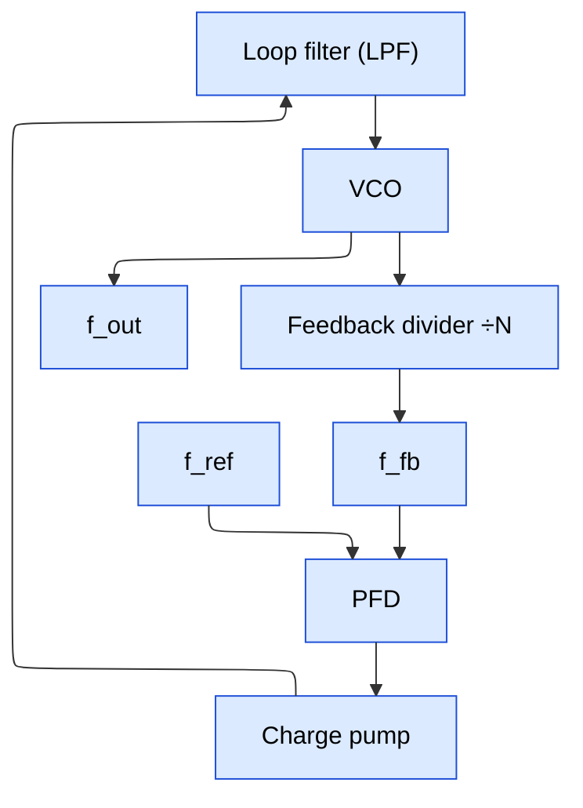
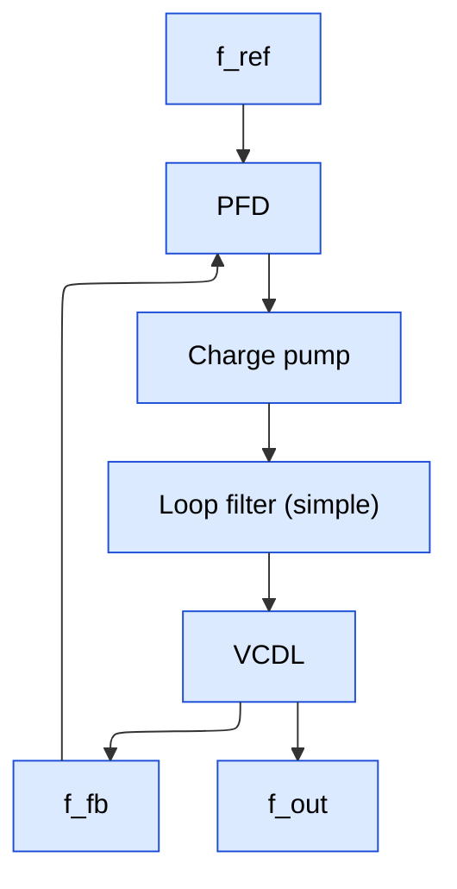

# PLL, DLL, and Clock Distribution

> Split out of the clock-division page: how clocks are *generated* (PLL/DLL) and *distributed* across the chip. Divider structures and glitch-free switching: [Clock_Division_and_Switching](Clock_Division_and_Switching.md).

---

## PLL Architecture Deep Dive

### Block Diagram



### Phase-Frequency Detector (PFD)

The PFD compares the phase AND frequency of the reference clock (f_ref) and the feedback clock (f_fb). It produces two output signals: UP and DOWN.

**3-State State Machine:**

```ascii-graph
States: IDLE, UP_ACTIVE, DOWN_ACTIVE

Transitions:
  IDLE → UP_ACTIVE:     on rising edge of f_ref
  IDLE → DOWN_ACTIVE:   on rising edge of f_fb
  UP_ACTIVE → IDLE:     on rising edge of f_fb (both edges seen → reset)
  DOWN_ACTIVE → IDLE:   on rising edge of f_ref (both edges seen → reset)

Outputs:
  UP_ACTIVE:   UP = 1, DOWN = 0  (VCO too slow → speed up)
  DOWN_ACTIVE: UP = 0, DOWN = 1  (VCO too fast → slow down)
  IDLE:        UP = 0, DOWN = 0  (phase aligned)
```

```verilog
// Simplified PFD (conceptual)
module pfd (
    input  ref_clk,
    input  fb_clk,
    input  rst_n,
    output reg up,
    output reg down
);
    // Both FFs reset when both UP and DOWN are high
    wire reset_both = up & down;

    always @(posedge ref_clk or negedge rst_n or posedge reset_both) begin
        if (!rst_n || reset_both)
            up <= 1'b0;
        else
            up <= 1'b1;
    end

    always @(posedge fb_clk or negedge rst_n or posedge reset_both) begin
        if (!rst_n || reset_both)
            down <= 1'b0;
        else
            down <= 1'b1;
    end
endmodule
```

**Dead zone problem:** When the phase difference between f_ref and f_fb is very small, both UP and DOWN pulses become very narrow. If the pulse width is shorter than the switching time of the charge pump transistors, the charge pump cannot respond — the PFD is effectively "blind" in this region. This dead zone limits the minimum phase error the PLL can correct, creating a flat region in the PFD characteristic curve that increases output jitter.

**Dead zone solutions:**
1. **Add a minimum pulse width:** Insert a delay in the reset path so that UP and DOWN are always active for at least T_min, even when the phase error is near zero. Both UP and DOWN are active simultaneously for T_min, and their currents cancel.
2. **Use a bang-bang PFD:** A 1-bit PFD that outputs only +1 or -1 (no proportional information), commonly used in CDR circuits. Eliminates dead zone but has quantization noise.

### Charge Pump

The charge pump converts the PFD's UP/DOWN pulses into a current that charges or discharges the loop filter:

```ascii-graph
            VDD
             │
         ┌───┴───┐
         │ I_up  │ (current source, typically 10-100 uA)
         │       │
  UP ───►│ SW    │──────┬──► to Loop Filter
         │       │      │
  DOWN──►│ SW    │──────┘
         │       │
         │ I_dn  │ (current sink)
         └───┬───┘
             │
            GND
```

**Charge pump mismatch:** Ideally I_up = I_dn. In practice, PMOS and NMOS current sources have different characteristics:

**Mismatch sources:**
   1. Process variation: PMOS and NMOS have different threshold voltages
2. Channel-length modulation: output impedance differs
3. Charge sharing: parasitic capacitance at the output node
4. Clock feedthrough: switching transients couple through gate-drain capacitance

Consequence: net charge injected per reference cycle is nonzero even when locked.
If I_up > I_dn: positive charge accumulates → VCO control voltage drifts up
The PFD compensates by adjusting the phase offset until average charge = 0
This creates a static phase offset between ref and fb
The periodic charge injection at f_ref creates REFERENCE SPURS at f_out ± k*f_ref

**Reference spurs:** These are spectral peaks at offsets of f_ref (and harmonics) from the carrier. Specification: typically -40 to -80 dBc depending on application. Reducing spurs requires: matched current sources, careful layout (symmetric PMOS/NMOS), charge cancellation circuits, and narrow PLL bandwidth.

### Loop Filter

The loop filter converts the charge pump current into a voltage that controls the VCO. It determines the PLL's bandwidth, stability, and transient response.

**2nd-order loop filter (most common):**

```ascii-graph
From charge pump ──┬── R1 ──┬── C1 ──┬── GND
                   │        │        │
                   └── C2 ──┘        │
                                     │
                   V_ctrl ───────────┘

Transfer function: Z(s) = (1 + s*R1*C1) / (s * (C1 + C2) * (1 + s*R1*C1*C2/(C1+C2)))
```

The resistor R1 provides a zero that ensures loop stability (phase margin > 45 degrees). Without R1 (just capacitors), the loop would be marginally stable (180 degrees phase shift = oscillation).

**Component values determine PLL behavior:**

```verilog
Loop bandwidth ≈ (I_cp * Kvco * R1) / (2π * N)
  Where:
    I_cp = charge pump current
    Kvco = VCO gain (Hz/V)
    R1   = loop filter resistor
    N    = feedback divider ratio

Phase margin ≈ atan(ω_bw * R1 * C1) - atan(ω_bw * R1 * C1 * C2 / (C1 + C2))
  Typical target: 55-65 degrees for good stability

Lock time ≈ 2π * N / (ω_bw) * ln(Δf / f_tolerance)
  Rough rule: ~100 / f_bandwidth cycles
```

**3rd-order loop filter:** Adds an additional R-C section for extra filtering of high-frequency noise and reference spurs. More complex pole-zero placement, but better spur rejection.

**Design trade-offs:**

| Parameter | Wider bandwidth | Narrower bandwidth |
|-----------|-----------------|---------------------|
| Lock time | Faster | Slower |
| Jitter from VCO | Higher (less filtering) | Lower (more filtering) |
| Jitter from reference | Lower (faster tracking) | Higher (less tracking) |
| Reference spurs | Higher | Lower |
| Stability | Harder (more phase margin needed) | Easier |
| Loop filter area | Smaller capacitors | Larger capacitors |

### VCO: Ring Oscillator vs LC Oscillator

**Ring oscillator (digital PLL / DPLL):**

```ascii-graph
┌───► INV ──► INV ──► INV ──► INV ──► INV ──┐
│                                              │
└──────────────────────────────────────────────┘
                (odd number of inverters)

Frequency = 1 / (2 * N * t_delay)
  Where N = number of stages, t_delay = inverter delay

Tuning: adjust inverter delay by changing supply voltage (current-starved)
  or switching in/out capacitive loads (digitally-controlled oscillator, DCO)
```

**Characteristics:**
- Phase noise: poor (-80 to -100 dBc/Hz at 1 MHz offset)
- Area: small (just inverters)
- Power: moderate
- Frequency range: wide tuning range (easy to cover 2:1 ratio)
- Integration: fully digital-compatible, easy to integrate in SoC
- Used in: digital PLLs, general-purpose SoC clocking, USB, PCIe (with extra jitter cleaning)

**LC oscillator (analog PLL):**

```verilog
Uses an inductor (L) and capacitor (C) tank circuit:
  f_osc = 1 / (2π * sqrt(L * C))

Tuning: use varactors (voltage-variable capacitors) to change C
  Kvco typically 100-500 MHz/V
```

**Characteristics:**
- Phase noise: excellent (-110 to -130 dBc/Hz at 1 MHz offset)
- Area: large (inductor takes significant die area, ~200x200 um in advanced nodes)
- Power: moderate to high
- Frequency range: narrow tuning range (typically 10-20%)
- Integration: requires analog design expertise, inductor modeling
- Used in: RF PLLs (wireless, SerDes), high-performance clock generation

**Kvco (VCO gain):**

- **Kvco** = `df_out / dV_ctrl  [Hz/V]`

Ring oscillator Kvco: typically 0.5-5 GHz/V (high, wide range)
LC oscillator Kvco: typically 100-500 MHz/V (lower, narrower range)

High Kvco: more sensitive to supply noise → worse jitter
Low Kvco: less sensitive → better jitter, but narrower tuning range

Design approach: use coarse digital tuning (switched capacitor banks) for
wide range + fine analog tuning (varactor) for low Kvco near the target.

### Lock Detection

Lock detection determines when the PLL has achieved phase/frequency lock:

**Methods:**

1. **Phase error monitoring:** If the UP and DOWN pulse widths from the PFD are both below a threshold for N consecutive reference cycles, declare lock. Simple to implement, directly measures the phase error.

2. **Frequency comparison:** Compare f_out (divided) against f_ref using a counter. If the counts match within tolerance over a window, declare frequency lock. Then check phase lock separately.

3. **Control voltage monitoring:** If V_ctrl stays within a narrow band for N cycles, the PLL is stable. This is indirect but robust.

**Implementation:**

```verilog
// Simple lock detector based on PFD pulse width
module lock_detect (
    input  ref_clk,
    input  up,
    input  down,
    input  rst_n,
    output reg locked
);
    parameter LOCK_COUNT = 64;   // consecutive good cycles to declare lock
    parameter UNLOCK_COUNT = 4;  // bad cycles to declare unlock

    reg [6:0] good_count;
    reg       phase_good;

    // Phase is "good" if neither UP nor DOWN is excessively long
    // Sample at reference clock edge — at lock, UP and DOWN should be very narrow
    always @(posedge ref_clk or negedge rst_n) begin
        if (!rst_n)
            phase_good <= 1'b0;
        else
            // If both UP and DOWN are low at the ref_clk edge, phase error is small
            phase_good <= ~up & ~down;
    end

    always @(posedge ref_clk or negedge rst_n) begin
        if (!rst_n) begin
            good_count <= 0;
            locked     <= 1'b0;
        end else begin
            if (phase_good) begin
                if (good_count < LOCK_COUNT)
                    good_count <= good_count + 1;
                if (good_count == LOCK_COUNT - 1)
                    locked <= 1'b1;
            end else begin
                good_count <= 0;
                if (good_count == 0)  // multiple bad cycles
                    locked <= 1'b0;
            end
        end
    end
endmodule
```

### PLL Specifications

**Lock time:** Time from enabling the PLL (or changing the divider ratio) until the output frequency is within tolerance. Typical: 5-50 us for general-purpose PLLs, 1-5 us for fast-lock designs.

```ascii-graph
Lock time ≈ (2π / ω_n) * ln(Δf_initial / f_tolerance) * damping_factor_correction
  Where ω_n = natural frequency of the loop

Faster lock: wider bandwidth, higher charge pump current
  But wider bandwidth → more jitter → design trade-off
```

**Jitter types:**

```verilog
1. Cycle-to-cycle jitter (J_cc):
   Difference between consecutive output periods.
   J_cc          = |T_{n+1} - T_n|
   Spec:         typically < 1-5% of output period
   Dominated by: VCO phase noise

2. Period jitter (J_per):
   Deviation of any single period from the ideal period.
   J_per         = T_n - T_ideal
   RMS value:    typically 1-20 ps for PLL outputs
   Includes contributions from VCO, reference, and loop noise

3. Long-term (accumulated) jitter (J_lt):
   Phase deviation accumulated over N cycles.
   J_lt(N)       = sum(T_i - T_ideal) for i = 1 to N
   Grows as sqrt(N) for random jitter (Gaussian)
   Bounded for deterministic jitter (e.g., reference spurs)
   Important for: SerDes (eye diagram), ADC sampling
```

**Phase noise:**

Phase noise is the frequency-domain representation of jitter.
Measured in dBc/Hz at a given offset from the carrier.

**Typical specs:**
   - Ring oscillator PLL: -80 to -100 dBc/Hz at 1 MHz offset
   - LC oscillator PLL:   -110 to -130 dBc/Hz at 1 MHz offset

**Relationship to jitter:**
   - J_rms = (1 / (2π * f_out)) * sqrt(2 * integral(L(f) * df, f_low, f_high))
   - Where L(f) is the single-sideband phase noise PSD

### PLL Bandwidth Considerations

PLL bandwidth (f_bw) is the -3 dB point of the closed-loop transfer function.

Rule of thumb: f_bw should be ~1/10 to 1/20 of f_ref for stability.
Too wide (> f_ref/5): loop becomes unstable, reference spurs increase
Too narrow (< f_ref/50): lock time becomes excessively long

**Within the bandwidth:**
   - PLL tracks the reference: reference noise passes through
   - VCO noise is suppressed (PLL corrects VCO wander)

**Outside the bandwidth:**
   - VCO free-runs: VCO noise dominates
   - Reference noise is filtered out

Optimal bandwidth: set f_bw at the frequency where reference noise
(multiplied by N^2) equals VCO noise. This minimizes total output jitter.

---

## DLL (Delay-Locked Loop) vs PLL

### DLL Architecture



VCDL = voltage-controlled delay line: it delays `f_ref` by a controlled amount, with `f_fb = f_out` (a delayed `f_ref`).

**VCDL (Voltage-Controlled Delay Line):**

```ascii-graph
f_ref ──► [Delay Cell 1] ──► [Delay Cell 2] ──► ... ──► [Delay Cell N] ──► f_out
                                                                              │
                                                                              ▼ feedback
                                                                           to PFD

Each delay cell: current-starved inverter pair
Total delay = N * t_cell(V_ctrl)
Tuned by V_ctrl from charge pump

Multiphase outputs available at each tap:
  Phase 0:   tap 0        = 0 degrees
  Phase 1:   tap N/4      = 90 degrees
  Phase 2:   tap N/2      = 180 degrees
  Phase 3:   tap 3N/4     = 270 degrees
```

### DLL Advantages

1. **Inherently stable (first-order system):** A DLL has only one integrator (the loop filter capacitor). A PLL has two integrators (loop filter + VCO, since VCO integrates phase from frequency). This makes the DLL inherently first-order — it cannot oscillate or become unstable regardless of bandwidth. No stability analysis (phase margin) is needed.

2. **No jitter accumulation:** In a PLL, the VCO free-runs between corrections, accumulating phase noise over time. In a DLL, the delay line does not generate new edges — it only delays the reference edges. Each output edge is derived from a reference edge, so VCO-like jitter accumulation does not occur. The output jitter is bounded by the reference jitter plus the delay line noise (which does not accumulate).

3. **Simpler loop filter:** Since the DLL is first-order, a simple capacitor (no resistor needed for zero) suffices for the loop filter. This saves area and simplifies design.

### DLL Limitations

1. **Cannot multiply frequency:** The DLL output has the same frequency as the input — it can only shift the phase. A PLL with a feedback divider can generate N * f_ref.

2. **Cannot generate arbitrary frequencies:** For clock synthesis (e.g., generating 2.4 GHz from 50 MHz reference), a PLL is required.

3. **Harmonic locking:** The DLL can falsely lock at delay = k * T_ref (integer multiple of the period) instead of delay = T_ref. This gives the same phase relationship but the delay line runs at a suboptimal operating point. Prevention: limit the delay range or detect/break harmonic lock.

4. **Limited delay range:** The VCDL must produce a delay exactly equal to T_ref. If the delay range doesn't cover T_ref at the operating voltage/temperature, the DLL cannot lock. PLLs don't have this limitation since the VCO inherently generates any frequency in its range.

### When to Use DLL vs PLL

| Application | DLL | PLL | Reason |
|-------------|-----|-----|--------|
| DDR memory interface | Yes | No | Phase align internal clock to external data; no freq multiplication needed |
| Multiphase clock generation | Yes | Possible | DLL naturally provides evenly-spaced taps |
| Clock synthesis (freq multiply) | No | Yes | DLL cannot multiply frequency |
| SerDes CDR | No | Yes | Need to synthesize recovered clock at data rate |
| DVFS (freq scaling) | No | Yes | Need to change output frequency dynamically |
| Jitter-sensitive sampling | DLL preferred | Possible | DLL has lower jitter (no accumulation) |
| Wide frequency range | No | Yes | DLL delay range is limited |

---

## Clock Distribution

### Global Clock Distribution Topologies

**H-tree:**

```ascii-graph
                        ┌───────────────────┐
                        │    Root buffer     │
                        └─────────┬─────────┘
                    ┌─────────────┴─────────────┐
              ┌─────┴─────┐               ┌─────┴─────┐
              │  Buffer   │               │  Buffer   │
              └─────┬─────┘               └─────┬─────┘
           ┌────────┴────────┐         ┌────────┴────────┐
      ┌────┴────┐      ┌────┴────┐  ┌────┴────┐    ┌────┴────┐
      │ Buffer  │      │ Buffer  │  │ Buffer  │    │ Buffer  │
      └────┬────┘      └────┬────┘  └────┬────┘    └────┴────┘
           │                │            │               │
       [sinks]          [sinks]      [sinks]         [sinks]

Properties:
  - Symmetric: all paths from root to leaves have equal wire length
  - Guarantees matched delay (low clock skew)
  - Area: moderate (balanced tree layout)
  - Used in: custom designs where skew is critical (processors)
```

**Spine (fishbone):**

```ascii-graph
  Clock source
       │
       ▼
  ═════╪═════════════════════════  (horizontal spine)
       │    │    │    │    │
       ▼    ▼    ▼    ▼    ▼
      ─┼─  ─┼─  ─┼─  ─┼─  ─┼─   (vertical ribs)
       │    │    │    │    │
     sinks sinks sinks sinks sinks

Properties:
  - Main trunk drives horizontal spine; vertical ribs branch off
  - Simple to implement in automated CTS tools
  - Skew depends on rib placement — not inherently balanced
  - Used in: most ASIC automated flows (Innovus/ICC2 CTS)
```

**Mesh (grid):**

```ascii-graph
  ──────┬──────┬──────┬──────
        │      │      │
  ──────┼──────┼──────┼──────
        │      │      │
  ──────┼──────┼──────┼──────
        │      │      │
  ──────┴──────┴──────┴──────

  Clock driven from multiple points on the mesh.
  Each intersection shorts the clock wires.

Properties:
  - Very low skew (all points are connected by multiple paths)
  - High power consumption (large capacitance of mesh wires)
  - High metal resource usage
  - Used in: ultra-high-performance processors (IBM POWER, Intel server CPUs)
  - Often combined with H-tree: H-tree drives mesh, mesh distributes locally
```

### Clock Domain Partitioning in SoC

A modern SoC has multiple clock domains, each with its own PLL or clock generator:

```ascii-graph
┌─────────────────────────────────────────────────────────┐
│  SoC                                                     │
│                                                          │
│  ┌──────────┐   ┌───────────┐   ┌───────────────────┐  │
│  │ PLL_CPU  │   │ PLL_GPU   │   │ PLL_DDR           │  │
│  │ 2.0 GHz  │   │ 1.5 GHz   │   │ 1.6 GHz          │  │
│  └────┬─────┘   └─────┬─────┘   └─────┬─────────────┘  │
│       │               │               │                  │
│  ┌────▼─────┐   ┌─────▼─────┐   ┌─────▼─────────────┐  │
│  │CPU cluster│   │  GPU     │   │DDR controller     │  │
│  │          │   │          │   │+ PHY              │  │
│  └──────────┘   └──────────┘   └────────────────────┘  │
│                                                          │
│  ┌──────────┐   ┌──────────┐   ┌───────────────────┐   │
│  │ PLL_IO   │   │ Ring OSC │   │ Crystal OSC       │   │
│  │ 500 MHz  │   │ 32 kHz   │   │ 24 MHz (always-on)│   │
│  └────┬─────┘   └────┬─────┘   └─────┬─────────────┘   │
│       │              │               │                   │
│  ┌────▼─────┐   ┌────▼─────┐   ┌────▼──────────────┐   │
│  │Peripherals│   │ RTC     │   │ Boot ROM /        │   │
│  │USB,PCIe  │   │ Timer   │   │ Power Management  │   │
│  └──────────┘   └──────────┘   └────────────────────┘   │
│                                                          │
│  CDC (clock domain crossing) bridges between all domains │
└─────────────────────────────────────────────────────────┘
```

**Key considerations:**
1. Each PLL is independently controllable for DVFS (CPU may run at 2 GHz while GPU is at 800 MHz)
2. CDC bridges (FIFO-based or handshake-based) at every domain boundary
3. Always-on domain (crystal/ring osc) for power management controller
4. Clock gating within each domain for fine-grained power control

### Clock Buffer Types

**CTS (Clock Tree Synthesis) buffers:**

**Properties of dedicated clock buffers:**
   1. Balanced rise/fall times: t_rise ≈ t_fall (within 5%)
Regular buffers may have 10-20% rise/fall imbalance
This imbalance would cause duty cycle distortion as the clock
propagates through many levels of buffers

2. Low insertion delay: optimized transistor sizing for fast edge propagation

3. High drive strength: clock nets have large fanout (thousands of FFs)

4. Special characterization: timing libraries have detailed models
for clock buffers including pulse-width-dependent delay

5. Low power: some clock buffers use smaller transistors with
special threshold voltage (HVT for reduced leakage)

**Clock inverters vs clock buffers:**

```ascii-graph
Clock inverters: CLK → INV → INV → ... → leaf
  - Each inverter inverts the signal; pairs cancel out
  - Slightly lower delay than buffers (inverter = 1 stage, buffer = 2 stages)
  - Must use even number of levels to maintain polarity
  - More commonly used in CTS because of lower delay

Clock buffers: CLK → BUF → BUF → ... → leaf
  - Non-inverting at each level
  - Slightly higher delay but polarity is always correct
  - Used when odd number of levels is needed
```

### Clock OCV (On-Chip Variation) — Special Treatment

**Why clock paths get special OCV treatment:**

In STA, OCV (on-chip variation) accounts for the fact that different parts of the chip may operate at slightly different speeds due to local process/voltage/temperature variations. For data paths, OCV is applied by derating the launch and capture clock paths differently:

**Normal OCV application:**
   - Launch clock path: derated "slow" (worst case for setup)
   - Capture clock path: derated "fast" (worst case for setup)
   - Data path: derated "slow" (worst case for setup)

This can create pessimistic results because the shared portion
of the launch and capture clock paths is derated in OPPOSITE
directions, even though it's the same physical wire/buffers.

**CPPR / CRPR (Clock Path Pessimism Removal):**

```ascii-graph
Common clock path: the portion of the clock tree shared by both
  the launch and capture flip-flops.

  Example:
    CLK → BUF1 → BUF2 → BUF3 → FF_launch
    CLK → BUF1 → BUF2 → BUF4 → FF_capture
    
    Common path: CLK → BUF1 → BUF2
    Divergence point: after BUF2

Without CPPR: BUF1-BUF2 on launch path uses slow derate
              BUF1-BUF2 on capture path uses fast derate
              Difference = artificial pessimism

With CPPR: Remove the OCV derate on the common path
           Only apply OCV from the divergence point onward
           This can recover 50-200 ps of pessimism
```

**Clock reconvergence pessimism removal is mandatory in modern STA flows.** Without it, 5-15% of paths would show false violations.

---

## Cross-references

- Dividers, glitch-free clock switching, DVFS clock MUXing: [Clock_Division_and_Switching](Clock_Division_and_Switching.md).
- Physical implementation of the distribution network — CTS targets, skew/latency, H-tree vs mesh tradeoffs in PnR: [Physical_Design](../05_Backend_Physical_Design/Physical_Design.md) §4 *Clock Tree Synthesis*.
- How STA treats the clock network — clock OCV/CRPR, gating checks, useful skew: [STA](../06_Signoff/STA.md) §11 CTS-related checks and §15 *Clock Gating Checks*.
- Jitter as an uncertainty budget in timing: [STA](../06_Signoff/STA.md) and [Constraints_SDC](../04_Synthesis/Constraints_SDC.md).
