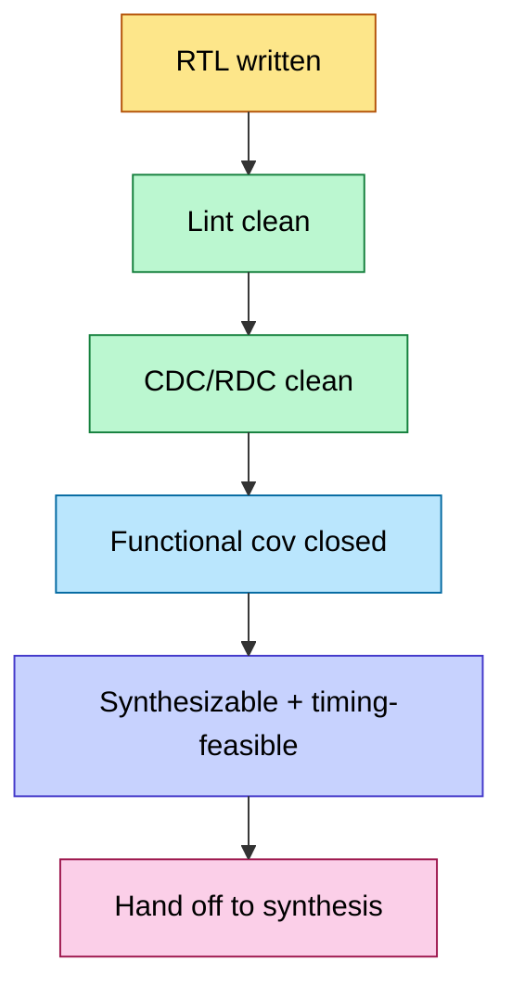

# RTL Design Methodology — Synchronous Discipline, Reset, Clocking, and Structure

> **Stage:** 03 · Frontend RTL. The *principles* that turn a microarchitecture spec into synthesizable, verifiable, timing-clean RTL — distinct from the language mechanics ([Data_Types_and_Basics](Data_Types_and_Basics.md), [Procedural_and_Processes](Procedural_and_Processes.md)) and the whiteboard drills ([RTL_Coding_Questions](../interview_prep/RTL_Coding_Questions.md)).
> **Prerequisites:** [Performance_Modeling_and_DSE](../01_Architecture_and_PPA/Performance_Modeling_and_DSE.md) (the spec), SystemVerilog basics. **Hands off to:** [Synthesis](../04_Synthesis/Synthesis_and_Optimization.md), [Lint_CDC_RDC_Signoff](Lint_CDC_RDC_Signoff.md).

---

## 0. Why this page exists

Most RTL bugs are not algorithmic — they are *methodology* failures: an inferred latch, a reset that isn't released cleanly, a clock gated without an ICG, a control/datapath tangle no one can verify. Synthesis and timing tools assume you followed a discipline; when you don't, they silently build something that mis-behaves in silicon. This page is that discipline: the synchronous-design contract, reset architecture, clock architecture, FSM and datapath/control structure, and the coding rules that keep RTL lint-clean and synthesizable.

---

## 1. The synchronous design contract

Modern digital design is **synchronous**: state changes only on a clock edge, and the only timing you must prove is setup/hold at flops ([STA](../06_Signoff/STA.md)). The rules that make this hold:

1. **Every register has exactly one clock and a defined reset.** No clock derived from data; no gating outside an ICG cell.
2. **No combinational loops.** Feedback only through a flop.
3. **No latches** unless explicitly intended (and reviewed). Latches arise by *accident* from incomplete `if`/`case` in combinational blocks — the #1 lint violation.
4. **Drive every output in every branch.** Default assignments at the top of a combinational block prevent inferred latches.
5. **Separate sequential from combinational** intent: `always_ff` for state, `always_comb` for logic. The SystemVerilog `_ff`/`_comb`/`_latch` variants make the tool *check* your intent ([Procedural_and_Processes](Procedural_and_Processes.md)).

```verilog
// Latch-free combinational block: default first, full assignment
always_comb begin
    next_state = state;          // default avoids inferred latch
    valid_o    = 1'b0;           // default every output
    unique case (state)          // 'unique' tells synth + sim it's full/non-overlapping
        IDLE: if (start) next_state = RUN;
        RUN : begin valid_o = 1'b1; if (done) next_state = IDLE; end
        default: next_state = IDLE;   // defined behavior for unreachable states
    endcase
end
```

---

## 2. Reset architecture

Reset is the most under-respected part of RTL. Decisions: **async vs sync**, **which flops need reset**, and **how reset is released**.

| Scheme | Assert | De-assert | Pros | Cons |
|---|---|---|---|---|
| **Synchronous reset** | on clk edge | on clk edge | no STA on reset path; glitch-immune | needs a running clock to reset; wider mux in datapath |
| **Asynchronous reset** | immediately | **must be synchronized** | resets without a clock; small | de-assertion can violate recovery/removal → metastability |
| **Async-assert, sync-deassert** (the standard) | immediately | synchronized to clock | best of both | one reset synchronizer per domain |

**The reset synchronizer** (async assert, sync de-assert): two flops, reset input tied to their async clear, `D` of the first tied high. Reset asserts instantly anywhere; de-assertion ripples out **synchronously**, so no flop sees reset release inside its recovery/removal window. One per clock domain. (Mechanics in [Async_Circuit_Design](Async_Circuit_Design.md).)

Further rules: **not every flop needs a reset** — reset only what the control logic requires for a clean start (FSMs, counters, valid bits); leaving datapath pipeline flops un-reset saves area and reset-tree routing, as long as a `valid` qualifier gates their use. **Reset domains** must be planned like clock domains — crossing a reset boundary needs the same care as a CDC.

---

## 3. Clock architecture

- **Minimize clock domains.** Each new asynchronous clock is a [CDC](Lint_CDC_RDC_Signoff.md) liability. Prefer a single clock with enables over many clocks.
- **Gate clocks only through ICG cells**, never with combinational AND on the clock — that creates glitches and untimeable paths. The synthesis tool inserts ICGs from RTL `if (enable)` patterns ([Power_Reduction_Techniques](../02_Power_and_Low_Power/Power_Reduction_Techniques.md)).
- **Generated/divided clocks** belong in a small, reviewed clocking block, not scattered ([Clock_Division](Clock_Division.md)).
- **Clock enables** are the synchronous alternative to gating: `if (en) q <= d;` — one clock, behavior controlled by a data-path enable. Cheaper to verify, friendlier to STA.

---

## 4. Datapath / control separation

A clean block splits into:
- **Datapath** — the registers, ALUs, muxes, FIFOs that move and transform data. Wide, regular, area-dominated; described structurally or with arithmetic operators the synthesizer maps to [adders/multipliers](../00_Fundamentals/Adders.md).
- **Control** — the FSM(s) that sequence the datapath via enables/selects, and consume status flags back from it.

Separating them makes both verifiable: control is a small state space you can cover exhaustively (or formally), and datapath is checked with directed/random data. Tangling them produces RTL that is neither.

**FSM coding:** one `always_ff` for the state register, one `always_comb` for next-state + outputs (or a registered-output variant for timing). Use an enum for states so waveforms and tools show names, not encodings. Choose encoding (binary vs one-hot) by the target — one-hot for speed/FPGA, binary for area — and let synthesis re-encode if constrained.

---

## 5. Coding for synthesis and timing

- **Write for the hardware you want.** RTL is not software; `for` loops unroll into parallel hardware, `*` infers a multiplier, a `case` infers a mux tree. Know the structure each construct builds.
- **Register block outputs** to make timing modular: a block whose outputs are registered presents a clean setup boundary, so STA at integration isn't a tangle of cross-block combinational paths.
- **Pipeline to hit frequency.** If a combinational path is too long for the target clock ([Performance_Modeling_and_DSE](../01_Architecture_and_PPA/Performance_Modeling_and_DSE.md)), cut it with a pipeline register and manage the added latency with `valid`/back-pressure.
- **Parameterize for reuse.** Width/depth parameters and `generate` blocks turn one reviewed module into a family. Reuse beats re-verification.
- **Avoid the synthesis traps:** full/parallel `case` (use `unique`/`priority`), no `#delays` in RTL, no initial blocks for reset, no multiple drivers, registered vs blocking assignment discipline (`<=` in `_ff`, `=` in `_comb`).

---

## 6. The frontend quality gates (what "done" means before hand-off)



RTL is not "done" when it simulates — it is done when it is **lint-clean** ([Lint_CDC_RDC_Signoff](Lint_CDC_RDC_Signoff.md)), **CDC-clean**, **coverage-closed** ([Verification_Planning_and_Coverage_Closure](Verification_Planning_and_Coverage_Closure.md)), and **synthesizes within the timing/area budget**. That is the contract handed to [synthesis](../04_Synthesis/Synthesis_and_Optimization.md).

---

## 7. Numbers / rules to memorize

| Rule | Why |
|---|---|
| async-assert, **sync-deassert** reset | avoids recovery/removal metastability |
| 1 reset synchronizer **per clock domain** | de-assertion must be local-synchronous |
| gate clocks **only via ICG** | combinational clock gating glitches |
| default-assign every comb output | prevents inferred latches |
| register block outputs | modular timing closure |
| `<=` in `always_ff`, `=` in `always_comb` | matches sim to synth |
| minimize clock domains | every CDC is a metastability liability |

---

## Cross-references
- Language mechanics: [Data_Types_and_Basics](Data_Types_and_Basics.md), [Procedural_and_Processes](Procedural_and_Processes.md), [OOP_and_Randomization](OOP_and_Randomization.md).
- Next gates: [Lint_CDC_RDC_Signoff](Lint_CDC_RDC_Signoff.md), [Verification_Planning_and_Coverage_Closure](Verification_Planning_and_Coverage_Closure.md), [Async_Circuit_Design](Async_Circuit_Design.md).
- Downstream: [Synthesis_and_Optimization](../04_Synthesis/Synthesis_and_Optimization.md), low-power [UPF_Power_Intent](../02_Power_and_Low_Power/UPF_Power_Intent.md).
- Drills: [RTL_Coding_Questions](../interview_prep/RTL_Coding_Questions.md).
