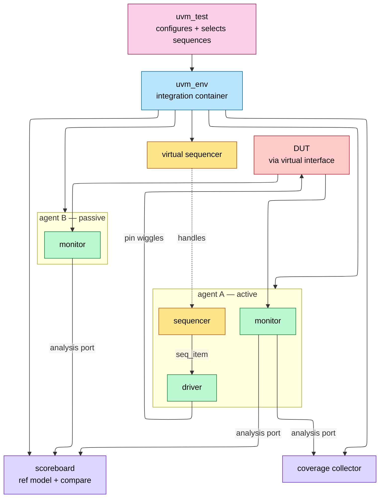
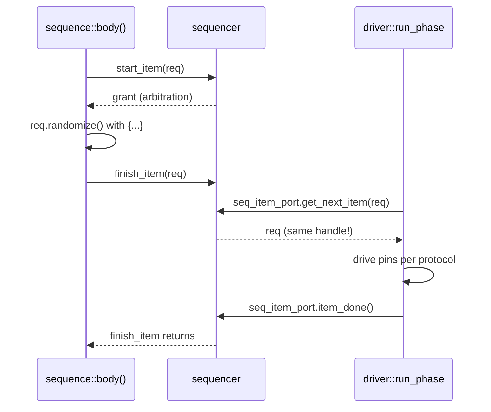

# UVM Methodology — Components, Phasing, Sequences, Factory, RAL

> Prerequisites: [OOP_and_Randomization](OOP_and_Randomization.md) (classes, polymorphism, constraints), [IPC_and_Verification](IPC_and_Verification.md) (mailboxes/events and the pre-UVM testbench), [Assertions_and_Coverage](Assertions_and_Coverage.md) (the checking layer UVM orchestrates).

---

## 0. Why this page exists

UVM (Universal Verification Methodology, IEEE 1800.2) is the industry-standard class library for constrained-random, coverage-driven verification — essentially every digital verification interview assumes it. The library itself is large, but interviews concentrate on five mechanisms: the **component hierarchy and phasing**, the **sequence/driver handshake**, the **factory** (and why `create()` instead of `new()`), **uvm_config_db**, and **RAL**. This page covers each mechanism's *why*, the canonical code skeletons, and the failure modes (objection hangs, missing `item_done`, config-db typos) that interviewers use as debugging questions.

---

## 1. Canonical testbench architecture



Separation of concerns: **stimulus generation** (sequences — *what* to send) is decoupled from **protocol driving** (driver — *how* to send it), from **observation** (monitor — never drives), from **checking** (scoreboard) and **coverage**. An agent encapsulates one interface's sequencer+driver+monitor; `is_active = UVM_PASSIVE` strips it to monitor-only for system-level reuse.

---

## 2. Class hierarchy — object vs component

```ascii-graph
uvm_void
└── uvm_object                  // transient data; no hierarchy, no phases
    ├── uvm_transaction → uvm_sequence_item     // the stimulus payload
    ├── uvm_sequence #(REQ,RSP)                 // stimulus procedure
    └── uvm_component           // quasi-static; hierarchy + phases
        ├── uvm_driver #(REQ)   ├── uvm_monitor
        ├── uvm_sequencer #(REQ)├── uvm_agent
        ├── uvm_scoreboard      ├── uvm_env
        └── uvm_test
```

The split that matters: **components** are built once at time 0, form a parent-child tree (`new(name, parent)`), and participate in phases. **Objects** (items, sequences) are created throughout the run, have no parent, and travel through TLM ports. Sequences are *objects*, not components — they run *on* a sequencer, they don't live in the tree.

---

## 3. Phasing

| Phase | Type | Direction | Purpose |
|---|---|---|---|
| `build_phase` | function | **top-down** | construct children via factory, get config |
| `connect_phase` | function | bottom-up | connect TLM ports, pass virtual interfaces down |
| `end_of_elaboration` | function | bottom-up | final topology tweaks, print hierarchy |
| `start_of_simulation` | function | bottom-up | banners, initial config display |
| **`run_phase`** | **task** | parallel | all time-consuming activity |
| `extract / check / report` | function | bottom-up | collect results, final checks, summary |
| `final_phase` | function | top-down | cleanup |

Build must be top-down — a parent constructs its children before they can build *their* children. Run-phase termination is governed by **objections**: simulation's run phase ends when all raised objections drop.

```verilog
task run_phase(uvm_phase phase);
  phase.raise_objection(this, "main stimulus");
  seq.start(env.agt.sqr);          // blocks until sequence completes
  phase.drop_objection(this, "done");
endtask
```

Classic hangs: (1) a component raises and never drops (test never ends → watchdog `+UVM_TIMEOUT`); (2) nobody raises (test ends at 0 ns). Rule of style: **only the test (or top-level virtual sequence) manages objections**; drivers/monitors never do.

(UVM also defines twelve finer run-time phases — `reset_phase`, `main_phase`, etc. Most production environments skip them and use `run_phase` + explicit sequencing; say that in interviews, it's the experienced answer.)

---

## 4. Sequences and the driver handshake

### 4.1 The protocol



Key facts interviewers probe:

- **Late randomization**: randomize *between* `start_item` and `finish_item` — the item is randomized at the moment the driver is ready, so reactive stimulus can read DUT state as late as possible.
- The driver receives the **same object handle** — no copy. Mutating it in the driver is visible to the sequence (used deliberately for responses; a bug if accidental).
- Forgetting **`item_done()`** deadlocks the sequencer: `finish_item` never returns. The #1 UVM beginner hang.
- `get_next_item` blocks; a driver loop is `forever begin get_next_item; drive; item_done; end`.
- Responses: `item_done(rsp)` or separate `rsp_port` + sequence `get_response()`; mind the response-queue overflow if the sequence never collects.

### 4.2 Sequence composition and arbitration

Sequences nest: a parent sequence `start()`s children (`` `uvm_do ``-style macros or explicit). The sequencer arbitrates among concurrent sequences (`SEQ_ARB_FIFO` default; priority/weighted/user modes); `lock()/grab()` give exclusive access (grab jumps the queue — atomic multi-item protocol bursts).

### 4.3 Virtual sequences

Multi-interface coordination: a **virtual sequence** runs on a virtual sequencer holding handles to real sequencers, starting sub-sequences on each (`axi_wr_seq.start(vsqr.axi_sqr)` in parallel with `eth_rx_seq.start(vsqr.eth_sqr)`). This is *the* mechanism for scenario-level stimulus ("DMA while config writes while traffic"). The virtual sequencer drives nothing itself — it's a handle rack.

---

## 5. The factory — why `create()` not `new()`

```verilog
class axi_item extends uvm_sequence_item;
  `uvm_object_utils(axi_item)            // registers with factory
  ...
endclass

// construction via factory:
req = axi_item::type_id::create("req");
```

Registration macros (`` `uvm_object_utils ``/`` `uvm_component_utils ``) put the type in a global registry. `create()` looks up the registry and returns *whatever type is currently overriding* the requested one:

```verilog
// in an error-injection test, no env code changes:
axi_item::type_id::set_type_override(bad_parity_axi_item::get_type());
// or per-instance:
set_inst_override_by_type("env.agt.sqr.*",
        axi_item::get_type(), bad_parity_axi_item::get_type());
```

This is **test-controlled polymorphic substitution**: derived items/drivers/scoreboards swap in without touching the environment — the mechanism that makes a UVM env a reusable product. Anything `new()`ed directly is invisible to overrides; hence the rule *factory-create everything that might ever be extended*. Overrides must be set **before** the corresponding `create` executes (practically: in the test's `build_phase`, which runs before children build).

---

## 6. uvm_config_db — hierarchical configuration

```verilog
// at tb_top (setting a virtual interface):
uvm_config_db#(virtual axi_if)::set(null, "uvm_test_top.env.agt.*", "vif", axi_vif);
// in the driver's build_phase:
if (!uvm_config_db#(virtual axi_if)::get(this, "", "vif", vif))
  `uvm_fatal("NOVIF", "axi_if not found")
```

Semantics to know cold:

- Lookup key = (context, instance path with wildcards, field name, **exact parameter type**). A `int` set is invisible to an `int unsigned` get — silent typo-class failures; always `uvm_fatal` on a failed mandatory get.
- **Precedence**: higher in the hierarchy wins (test's set beats env's set), later set wins at equal depth — deliberate, so tests can override defaults.
- Sets targeting `build_phase` consumers must happen *before* that consumer builds (top-down order makes parent build-phase sets to children safe).
- The virtual interface plumb (HW `interface` in the module world → class world) is config_db's most common job.
- For whole-agent knobs prefer a **config object** (one `uvm_object` with all settings, one db entry) over dozens of scalar entries.

---

## 7. TLM — how components talk

| Construct | Cardinality | Blocking? | Canonical use |
|---|---|---|---|
| `uvm_seq_item_pull_port` | 1:1 | yes | driver ← sequencer |
| `uvm_blocking_put/get_port` | 1:1 | yes | pipelined model handoff |
| **`uvm_analysis_port`** | **1:N (0..N)** | no (`write()`) | monitor → scoreboard + coverage + … |
| `uvm_tlm_analysis_fifo` | port→fifo | get blocks | decouple monitor rate from checker rate |

Monitors **broadcast** on analysis ports precisely because they must not care who listens (zero subscribers is legal — passive reuse). Scoreboards typically terminate analysis traffic in `uvm_tlm_analysis_fifo`s and `get()` from them in `run_phase`, or implement `write()` via `uvm_analysis_imp` (+ `` `uvm_analysis_imp_decl(_exp) `` when one scoreboard has several imps).

**Scoreboard patterns:** in-order compare (queue per stream, compare on arrival) when the DUT preserves order; out-of-order (associative array keyed by ID/address) for OoO DUTs — eviction on match, end-of-test check that the array is empty (`check_phase`). Reference model: transaction-level predictor fed by the *input* monitor.

---

## 8. RAL — the register abstraction layer

The register model mirrors the spec's register map as classes (`uvm_reg_field` → `uvm_reg` → `uvm_reg_block` with one or more `uvm_reg_map`s), almost always generated from IP-XACT/SystemRDL/CSV.

- **Frontdoor** access: `rg.write(status, value)` → the map's **adapter** converts a generic `uvm_reg_bus_op` into a bus seq_item on the right sequencer → real bus traffic, real RTL decode exercised.
- **Backdoor** access: `rg.poke/peek` via hdl_path — zero simulation time, no bus; for setup, and for verifying frontdoor independently.
- **Mirror/desired values**: the model tracks what the register *should* hold. `predict` updates it — either auto-predict on model-initiated access or, properly, an **explicit predictor** subscribed to the bus monitor so even firmware-style raw accesses update the mirror.
- `mirror(status, UVM_CHECK)` reads and compares against the mirror — the workhorse of register checking. Built-in sequences (`uvm_reg_hw_reset_seq`, bit-bash, access policies) give day-one coverage of W1C/RO/RW behaviors.

Interview one-liner: *RAL decouples "which register/field am I touching" from "which bus carries it"* — the same test runs on APB today and AXI tomorrow by swapping the adapter ([AHB_AXI_APB](../01_Architecture_and_PPA/AHB_AXI_APB.md)).

---

## 9. Minimal complete skeleton (memorize the shape)

```verilog
class axi_item extends uvm_sequence_item;
  rand bit [31:0] addr, data;  rand bit write;
  constraint c_align { addr[1:0] == 0; }
  `uvm_object_utils_begin(axi_item)
    `uvm_field_int(addr, UVM_ALL_ON)   // or hand-write do_copy/do_compare (faster)
  `uvm_object_utils_end
  function new(string name="axi_item"); super.new(name); endfunction
endclass

class axi_rand_seq extends uvm_sequence #(axi_item);
  `uvm_object_utils(axi_rand_seq)
  rand int n = 20;
  task body();
    repeat (n) begin
      req = axi_item::type_id::create("req");
      start_item(req);
      if (!req.randomize()) `uvm_error("RAND","failed")
      finish_item(req);
    end
  endtask
endclass

class axi_driver extends uvm_driver #(axi_item);
  `uvm_component_utils(axi_driver)
  virtual axi_if vif;
  function void build_phase(uvm_phase phase);
    if (!uvm_config_db#(virtual axi_if)::get(this,"","vif",vif))
      `uvm_fatal("NOVIF","")
  endfunction
  task run_phase(uvm_phase phase);
    forever begin
      seq_item_port.get_next_item(req);
      drive_one(req);                  // protocol timing lives here
      seq_item_port.item_done();
    end
  endtask
endclass

class axi_agent extends uvm_agent;
  `uvm_component_utils(axi_agent)
  axi_driver drv;  uvm_sequencer #(axi_item) sqr;  axi_monitor mon;
  function void build_phase(uvm_phase phase);
    mon = axi_monitor::type_id::create("mon", this);
    if (get_is_active() == UVM_ACTIVE) begin
      drv = axi_driver::type_id::create("drv", this);
      sqr = uvm_sequencer#(axi_item)::type_id::create("sqr", this);
    end
  endfunction
  function void connect_phase(uvm_phase phase);
    if (get_is_active() == UVM_ACTIVE)
      drv.seq_item_port.connect(sqr.seq_item_export);
  endfunction
endclass

class base_test extends uvm_test;
  `uvm_component_utils(base_test)
  axi_env env;
  function void build_phase(uvm_phase phase);
    env = axi_env::type_id::create("env", this);
  endfunction
  task run_phase(uvm_phase phase);
    axi_rand_seq seq = axi_rand_seq::type_id::create("seq");
    phase.raise_objection(this);
    seq.start(env.agt.sqr);
    phase.drop_objection(this);
  endtask
endclass
// run:  +UVM_TESTNAME=base_test  → run_test() in tb_top initial block
```

(`uvm_field_*` automation macros are convenient but slow and occasionally surprising in compare semantics; production teams often hand-implement `do_copy/do_compare/convert2string`. Knowing *that* tradeoff is itself an interview point.)

---

## 10. Facts to memorize

| Fact | Value |
|---|---|
| Standard | IEEE 1800.2 (UVM 1.2 / 2017+ library) |
| build_phase direction | top-down (only one); connect is bottom-up |
| Time-consuming phase | `run_phase` (task); all others functions |
| Run-phase end | all objections dropped |
| Driver handshake | `get_next_item` → drive → `item_done` (forget → hang) |
| Late randomization point | between `start_item` and `finish_item` |
| Factory construction | `type_id::create()`; overrides set before create, in test build |
| config_db match | context+path(wildcards)+name+**exact type**; nearer-top set wins |
| Analysis port fan-out | 0..N subscribers, non-blocking `write()` |
| Agent modes | UVM_ACTIVE (sqr+drv+mon) / UVM_PASSIVE (mon only) |
| RAL access | frontdoor (bus, time) vs backdoor (hdl_path, 0-time); explicit predictor keeps mirror honest |
| Sequencer arbitration default | SEQ_ARB_FIFO; `grab()` preempts, `lock()` queues |

---

## Cross-references

- Language mechanics underneath: [OOP_and_Randomization](OOP_and_Randomization.md) (factory = polymorphism + registry; constraints), [IPC_and_Verification](IPC_and_Verification.md) (TLM vs raw mailboxes).
- Checking layer: [Assertions_and_Coverage](Assertions_and_Coverage.md) (SVA in interfaces, covergroups in subscribers).
- Bus knowledge for agents: [AHB_AXI_APB](../01_Architecture_and_PPA/AHB_AXI_APB.md), [ACE_and_CHI](../01_Architecture_and_PPA/ACE_and_CHI.md).
- Formal complement: [Formal_Verification](Formal_Verification.md) (what UVM shouldn't be used for).
