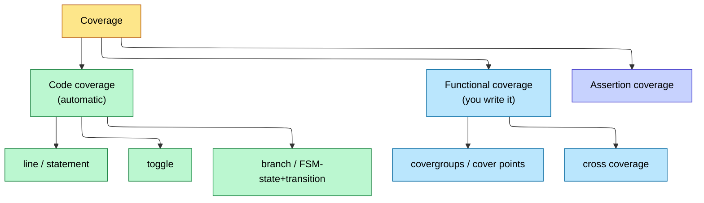
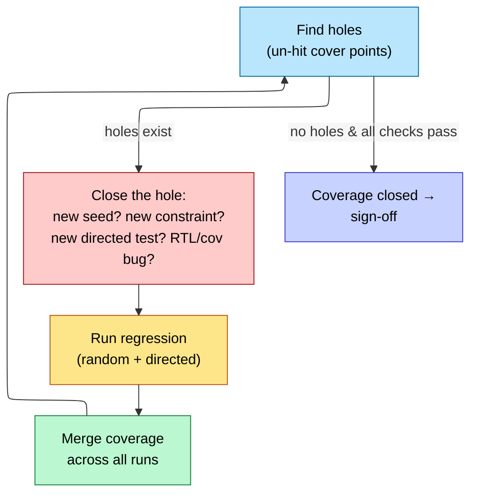

# Verification Planning and Coverage Closure

> **Stage:** 03 · Verification. The *flow* that wraps the mechanics: how you decide what to verify (vplan), measure progress (coverage), and declare "done" (closure) — distinct from the testbench machinery in [UVM_Methodology](UVM_Methodology.md) and [Assertions_and_Coverage](Assertions_and_Coverage.md).
> **Prerequisites:** [UVM_Methodology](UVM_Methodology.md), [Assertions_and_Coverage](Assertions_and_Coverage.md). **Hands off to:** sign-off / tape-out readiness.

---

## 0. Why this page exists

Verification consumes ~60–70% of an ASIC project's effort, and the hardest question isn't "how do I write a test" — it's **"am I done?"** You can run a million random cycles and still have never exercised the FIFO-full-during-reset corner. Coverage-driven verification (CDV) answers "done" with data: a **verification plan** enumerates what must be checked, **coverage** measures what's actually been hit, and **closure** is the disciplined loop that drives coverage to the target. This page is that methodology — the management layer over [UVM](UVM_Methodology.md) and [SVA](Assertions_and_Coverage.md).

---

## 1. The verification plan (vplan)

The vplan is the contract for *what* gets verified, derived from the **design spec** and **µarch spec**, before tests are written.

| Element | Content |
|---|---|
| **Features** | every spec feature → one or more verification items |
| **Stimulus** | how each feature is exercised (directed, constrained-random, sequences) |
| **Checks** | how correctness is judged (scoreboard, reference model, assertions) |
| **Coverage** | the metric that proves the feature was hit (functional cover points, assertions) |
| **Owner / status** | who, and pass/fail/coverage% |

The vplan is **executable**: modern tools link each vplan item to the coverage objects that close it, so the plan auto-annotates with live coverage numbers. Unlinked vplan items = un-verified features = risk.

---

## 2. The coverage taxonomy

"Coverage" is several different measurements; you need them all because each is blind to what the others catch.

- **Code coverage** (automatic): line, statement, branch, toggle, FSM state+transition. Measures *"did my tests execute the RTL?"* It is **necessary but not sufficient** — 100% code coverage with the wrong checks proves nothing about correctness. Its real value is the inverse: **un-covered code = definitely un-tested**.
- **Functional coverage** (hand-written `covergroup`s): measures *"did my tests hit the scenarios I care about?"* — the FIFO going full, every opcode, every burst length. This is the one tied to the spec/vplan. **Cross coverage** captures *combinations* (full FIFO **AND** back-pressure **AND** error injection) — where the real bugs hide.
- **Assertion coverage**: did the [SVA](Assertions_and_Coverage.md) properties actually fire (not vacuously pass)?

---

## 3. Closure — the loop that ends verification

For each coverage hole, the triage is a decision tree:
1. **Reachable by more random?** → add seeds / loosen constraints (cheap).
2. **Random can't reach it economically?** → write a **directed test** or a targeted constraint.
3. **Truly unreachable?** → it's dead code or an impossible cross → **waive** it (justified) or fix the coverage model.
4. **Reachable but the test fails there?** → a real **DUT bug** → fix RTL.

Closure also means **all checks pass** (zero failing assertions/scoreboard mismatches) and **regression is green and stable** (no flakiness). Coverage at 100% with failing tests is not closed.

---

## 4. Constrained-random + coverage feedback (CDV)

The dominant methodology: **constrained-random** stimulus generates volume and reaches corners a human wouldn't script; **functional coverage** measures what it actually hit; the gap drives new constraints/seeds. Optionally **coverage-driven generation** automatically biases the random generator toward un-hit bins. This is why UVM is built around randomization + covergroups — they're the two ends of the same loop.

Directed tests still matter for: reset/init sequences, known-hard corners, and quick smoke tests. The real flow is random-for-breadth + directed-for-the-stubborn-corners.

---

## 5. Sign-off criteria (the gate)

A block is "verification-signed-off" when:
- **Functional coverage = 100%** of the vplan-linked cover points (or every gap waived with justification).
- **Code coverage ≥ target** (commonly ~95–100% line/branch, ~90%+ toggle), gaps reviewed.
- **All assertions** pass and are **proven non-vacuous** (assertion coverage).
- **Regression green** across a clean, reproducible seed set.
- **Formal** ([Formal_Verification](Formal_Verification.md)) has discharged the properties it owns (control logic, CDC, connectivity).
- **GLS** ([Gate_Level_Sim_and_Emulation](Gate_Level_Sim_and_Emulation.md)) sanity + reset passes.

---

## 6. Numbers to memorize

| Quantity | Value | Why |
|---|---|---|
| Verification share of effort | ~60–70% of project | the dominant cost |
| Code coverage target | ~95–100% line/branch | un-covered = un-tested |
| Functional coverage target | 100% of vplan bins | the spec-linked metric |
| Code vs functional | necessary vs sufficient | need both |
| Where bugs hide | **cross** coverage bins | combinations, not singles |
| Vacuous assertion | passes without antecedent | assertion coverage catches it |
| Closure = | 100% cov **and** all checks pass **and** stable regression | not just coverage |

---

## 7. Interview Q&A

**Q: 100% code coverage — are you done?** No. Code coverage only proves the lines *executed*, not that the checks would have caught a bug, and it says nothing about scenarios the spec cares about (functional coverage) or combinations (cross coverage). 100% code + weak checkers can ship a broken chip. Closure needs functional coverage + passing checks too.

**Q: A cover point won't hit after a long random regression. What do you do?** Triage: is it reachable with more seeds/looser constraints (add them)? Reachable only by a specific sequence (write a directed test)? Genuinely unreachable (dead/illegal — waive with justification or fix the coverage model)? Or reachable-but-the-test-fails-there (a real DUT bug)?

**Q: How do constrained-random and functional coverage relate?** They're the two halves of CDV: random stimulus reaches breadth and corners cheaply; functional coverage measures what was actually exercised; the un-hit bins feed back as new constraints/seeds (or coverage-driven generation). One produces volume, the other measures meaning.

---

## Cross-references
- Mechanics: [Assertions_and_Coverage](Assertions_and_Coverage.md), [UVM_Methodology](UVM_Methodology.md), [OOP_and_Randomization](OOP_and_Randomization.md).
- Complementary engines: [Formal_Verification](Formal_Verification.md), [Lint_CDC_RDC_Signoff](Lint_CDC_RDC_Signoff.md), [Gate_Level_Sim_and_Emulation](Gate_Level_Sim_and_Emulation.md).
