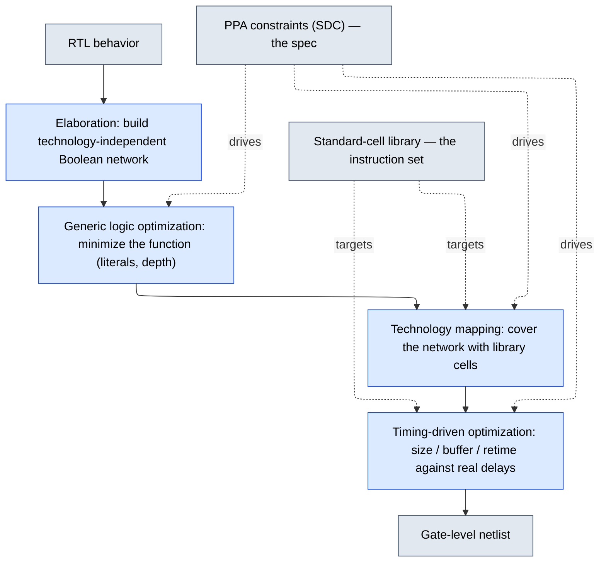

# Logic Synthesis — the Compiler from RTL to Gates

> **Prerequisites:** [RTL_Design_Methodology](../03_Frontend_RTL_and_Verification/01_RTL_Design_Methodology.md) (the synthesizable RTL this consumes, and the coding rules that make inference predictable), [Logic_Building_Blocks](../00_Fundamentals/02_Logic_Building_Blocks.md) (the gates, flops, and latches it infers and maps to), [CMOS_Fundamentals](../00_Fundamentals/01_CMOS_Fundamentals.md) (the Vt flavors, drive strength, and FO4 unit behind every cell).
> **Hands off to:** [Constraints_SDC](02_Constraints_SDC.md) (the spec it optimizes against), [STA](../06_Signoff/01_STA.md) (which scores the timing it chases), [Physical_Design](../05_Backend_Physical_Design/01_Physical_Design.md) (which places and routes the netlist and owns the wire delay synthesis can only estimate), [Formal_Verification](../03_Frontend_RTL_and_Verification/12_Formal_Verification.md) (LEC certifies that the netlist still equals the RTL).

---

## 0. Why this page exists

Synthesis is a **compiler**. It lowers a behavioral description (RTL) to a gate-level netlist, and like every compiler its real job is not translation but *optimization under a specification*: among the astronomically many netlists that compute the same Boolean function, find one that is cheap. "Cheap" is defined by the PPA constraints — clock period, area budget, power ceiling — and the "instruction set" it must lower onto is the **standard-cell library**. Every stage, every transformation, and every trade-off on this page is one instance of the same activity: **searching a space of logically-equivalent circuits for the lowest-cost point that meets the constraints.**

The previous version of this page catalogued the *commands* that drive that search. This one derives the search itself — why the stages run in the order they do, why technology mapping is a covering problem with a real complexity result, why retiming has a theory and cannot be "free speedup," and why you cannot minimize timing, area, and power at once. Signal names and TCL are demoted to the minimum a senior engineer needs to recognize a concept in a tool log; the concepts are the page.

---

## 1. The compiler analogy, taken seriously

The stages of synthesis are the stages of a compiler, in the same order and for the same reasons:

| Software compiler | Logic synthesis | Operates on |
|---|---|---|
| Lex / parse → AST → IR | **Elaboration** | RTL → technology-independent Boolean network (GTECH) |
| Target-independent optimization (`-O2` on IR) | **Generic / logic optimization** | the Boolean network — no cells yet |
| Instruction selection / code generation | **Technology mapping** | cover the network with real library cells |
| Scheduling + peephole under a machine model | **Timing-driven incremental optimization** | the mapped netlist, real cell + wire delays |

The analogy is exact in the part that matters: an optimizing compiler never emits the literal translation of the source; it rebuilds the computation into the cheapest equivalent for the target. Synthesis does the same, and three differences make it *harder*, not different in kind:

- **The cost is multi-objective.** A software compiler roughly minimizes one scalar (cycles, or code size). Synthesis balances timing, area, and power simultaneously against a hard timing constraint — a Pareto problem (§7), not a scalar minimization.
- **The instruction set is a continuum.** A CPU has one `ADD`; a cell library has the same function in a dozen drive strengths and several threshold voltages, so "instruction selection" also chooses *size* and *leakage* per gate.
- **Correctness is checked, not guaranteed.** Synthesis is aggressive enough that equivalence is not obvious by construction; a separate proof that the netlist still computes the RTL — logic equivalence checking (LEC) — is standard signoff ([Formal_Verification](../03_Frontend_RTL_and_Verification/12_Formal_Verification.md)).

Hold this frame and the rest of the page is corollaries.

---

## 2. The four stages, and why the order is forced

The order is not a convention; each phase *needs information the previous one produced*, and optimizing at the wrong level of abstraction wastes the work.

1. **Elaboration.** Resolve parameters and generics, infer the sequential elements (flip-flops, latches, RAMs) and arithmetic operators from RTL patterns, and build a Boolean network of generic gates. There is no timing or area yet — the currency here is pure *structure*.
2. **Generic (technology-independent) logic optimization.** Minimize the Boolean network while it is still abstract. **Why first:** the transformations that shrink logic — factoring, common-subexpression extraction, don't-care simplification — are properties of the *function*, cleanest to find and apply on an idealized network of generic gates. Doing them after mapping means fighting the noise of specific cell delays and undoing commitments already made. Optimize the structure before you commit to hardware.
3. **Technology mapping.** Cover the optimized network with real library cells (§4). **Why second:** only now, with a good structure, do you commit to the "instruction set" — and covering works best on a clean network.
4. **Timing-driven incremental optimization.** With real cells (and, in physical synthesis, real wires) you finally have real delays; fix the critical paths by sizing, buffering, cloning, restructuring, and local remapping. **Why last:** the delays that decide *which path is critical* do not exist until cells and wires are chosen. You cannot fix timing you cannot yet measure.

This is exactly the compiler's IR-optimize → instruction-select → schedule order, and the tools expose it that way: Cadence Genus runs the three technology-touching phases as `syn_generic` / `syn_map` / `syn_opt`; Synopsys Design Compiler folds all four into `compile_ultra`. Same pipeline, different packaging — which is all the command vocabulary a concept discussion needs.

---

## 3. Logic optimization: minimize the function before you build it

The cheapest gate is the one you never map. Before committing to cells, shrink the Boolean network itself. The cost proxies at this abstraction are technology-independent:

$$
\text{cost}_{\text{tech-indep}} \;\approx\; \underbrace{L(f)}_{\text{literal count} \;\to\; \text{area}}, \qquad \text{delay} \;\approx\; \underbrace{\text{depth}(f)}_{\text{logic levels}}
$$

where $L(f)$ = number of literals (appearances of a variable or its complement) in the factored form — a proxy for transistor count — and $\text{depth}(f)$ = number of gate levels on the longest path.

### 3.1 Two-level vs multi-level

- **Two-level (SOP / PLA).** Every function as an OR of ANDs, so exactly two gate levels — minimal, fixed delay. Minimize the number of product terms and literals (Quine–McCluskey exact, ESPRESSO heuristic). Ideal for shallow control logic and PLAs. But the area *is* the product-term count, which is **exponential** for arithmetic-like functions (a 32-bit adder's carry is a monster in SOP), so two-level is viable only for shallow logic.
- **Multi-level.** Allow arbitrary depth and trade levels for literals — this is real logic. The knobs are **factoring** ($ab + ac \to a(b+c)$), **decomposition** (break one large node into a tree of smaller ones), **extraction** (pull a shared subexpression into its own node), substitution, and elimination. Objective: minimize total literals subject to a depth bound.

### 3.2 Algebraic division and resource sharing — buying area by sharing

Common-subexpression elimination is the workhorse area transform, and it has an algebra. Treat Boolean expressions as polynomials over $\{\cdot, +\}$ and *divide*: $f = d\cdot q + r$ for a divisor $d$, quotient $q$, remainder $r$. A **kernel** is a cube-free quotient $f/c$ (dividing by a cube $c$); two functions that share a kernel share a subexpression that can be **extracted once and reused**. That is precisely resource sharing:

- **At the bit level:** $f_1 = ab + ac + x$ and $f_2 = ab + ac + y$ share the divisor $a(b+c)$. Extract $t = a(b{+}c)$; then $f_1 = t + x$, $f_2 = t + y$ — one copy of the shared logic instead of two.
- **At the operator level:** `sel ? a+b : c+d` need not build two adders. Share one adder behind input muxes: `(sel?a:c) + (sel?b:d)`. The trade is explicit — **two muxes replace one adder** — a win whenever the adder is wider than the muxes it costs, which is true for essentially every datapath width.

So resource sharing is CSE applied to the operators the elaborator inferred; the tool decides each candidate by a literal-count break-even. The carry-save and Wallace-tree rearrangements it applies to sums and products live one level down, in [Adders_and_Multipliers](../00_Fundamentals/03_Adders_and_Multipliers.md).

### 3.3 Don't-cares — optimizing over the care set

A specification rarely pins the function down on every input, and that slack is free area. Two sources:

- **Satisfiability don't-cares (SDC):** input patterns to a subnetwork that its own drivers can never produce.
- **Observability don't-cares (ODC):** input patterns whose output is masked downstream and never observed.

Let $C \subseteq \mathbb{B}^n$ be the **care set**. Synthesis is then free to implement *any* $g$ that agrees with $f$ on $C$, and picks the cheapest:

$$
g^\star \;=\; \arg\min_{\,g:\; g|_C \,=\, f|_C\,} \text{cost}(g)
$$

Because the don't-care set only *adds* freedom ($|C| \le 2^n$), the minimal $g$ is never larger than the exact function — typically **5–15% area**, and **10–30%** for control logic dominated by unreachable FSM states (the SAT solver proves those states unreachable, then treats their next-state logic as don't-care). This is *why* state encodings and fully-specified `case` statements affect area: they change the care set ([RTL_Design_Methodology](../03_Frontend_RTL_and_Verification/01_RTL_Design_Methodology.md)).

---

## 4. Technology mapping as a covering problem

Now the concept at the center of synthesis: mapping = **cover the Boolean network with library-cell patterns at minimum cost.** This is instruction selection, and it has the same theory.

**Setup.** Decompose the optimized network into a **subject graph** over a universal base (2-input NANDs + inverters — every function decomposes this way). Each library cell is a **pattern**, a small sub-DAG computing that cell's function. A **cover** assigns patterns to the subject graph so that every node is implemented and each pattern's inputs land on signals that are themselves cell outputs (or primary inputs). Minimize $\sum \text{cost}(\text{cell})$, where cost is area or arrival time.

### 4.1 Trees are easy: dynamic programming is optimal

If the subject graph is a **tree** (no reconvergent fanout), optimal covering is a textbook DP — the same algorithm as optimal instruction selection for expression trees. The optimal cost at node $n$ is

$$
C(n) \;=\; \min_{m \,\in\, \text{match}(n)} \Big[\, \text{cost}(m) \;+\!\! \sum_{l \,\in\, \text{inputs}(m)} \!\! C(l) \,\Big]
$$

where $\text{match}(n)$ = library cells whose pattern matches the subtree rooted at $n$, and $\text{inputs}(m)$ = the subject nodes feeding that match. One bottom-up pass, **optimal in $O(n\cdot p)$** ($n$ nodes, $p$ patterns). For a *delay* objective, replace cost with arrival time — $C(n) = \min_m \big(\max_{\text{inputs}} \text{arrival} + \text{delay}(m)\big)$, with load-dependent cell delay — and the same DP yields the min-depth cover.

### 4.2 DAGs are hard: reconvergent fanout breaks the DP

Real logic reconverges — a node feeds several parents — and the DP's independence assumption fails: a cell shared between two parents couples their costs. General DAG covering is **NP-hard**. Practical mappers therefore either:

- **cut the DAG into a forest** at every multi-fanout point, cover each tree optimally, and accept the seams (the classic, fast choice); or
- **enumerate cuts** — compute $k$-feasible cuts per node and DP over them. Cut-based mapping (FlowMap) achieves *depth-optimal* LUT mapping in polynomial time for the depth objective, the FPGA analogue of the same problem.

### 4.3 Matching a pattern: NPN classes

A subject subfunction matches a cell up to **N**egation of inputs, **P**ermutation of inputs, and **N**egation of the output — **NPN equivalence**. The library is preprocessed into NPN classes; at map time the subfunction is canonicalized and looked up in $O(1)$. About **500 cells at 7 nm collapse to ~50–80 classes**, which is why NAND ↔ NOR-with-inverted-inputs substitutions are free to the mapper: it can pick, per loading and area context, the cheaper of two logically-equal cells.

---

## 5. The transformation menu: each buys one thing at another's expense

Every classic transform is a move on the QoR surface — it buys one metric by spending another. Read the table as a cost model, not a feature list:

| Transformation | Buys | Costs | Governing model |
|---|---|---|---|
| Constant propagation, dead-logic / duplicate-register removal | area + power (free) | nothing (equivalence-preserving) | — |
| Common-subexpression / resource sharing (§3.2) | area | a mux/steering layer, serialization | literal-count break-even |
| Gate sizing (upsize) | drive → speed | area, input cap, leakage | logical effort |
| Buffering / cloning | drive for high fanout | area, power, a delay stage | logical effort / fanout-of-4 |
| Retiming (§6) | balances stage delay → shorter period | register relocation only | Leiserson–Saxe |
| Pipelining | throughput (shorter period) | +1 cycle latency, +registers | depth ÷ period |

### 5.1 Sizing and buffering: the logical-effort law

Driving load and fixing fanout are the same physics, and the theory is **logical effort**. Stage delay is

$$
d = g\,h + p, \qquad D_{\min} = N\,(GH)^{1/N} + P
$$

where $g$ = logical effort (a gate topology's drive penalty vs an inverter: INV $=1$, NAND2 $=4/3$, NOR2 $=5/3$), $h = C_{\text{out}}/C_{\text{in}}$ = electrical effort (fanout), $p$ = parasitic delay, and for an $N$-stage path $G=\prod g_i$, $H=C_{\text{load}}/C_{\text{in}}$, $P=\sum p_i$. The path is fastest when **every stage carries equal stage effort** $f = (GH)^{1/N}$, and the optimal per-stage effort is $\rho \approx 3.6\text{–}4$ — the origin of the **fanout-of-4** rule and of why the mapper splits a high-fanout net into $\sim\!\times 4$ buffer hops rather than driving it with one enormous cell. Sizing a gate up cuts *its* delay but raises the load it presents to *its* driver, so speed is never free: it is repaid upstream in area, input capacitance, and leakage. (This is the result; the full stage-by-stage sizing derivation is standard and omitted.)

---

## 6. Retiming: registers as a movable resource (Leiserson–Saxe)

Retiming earns its own section because it is the one timing lever with a real theory and the one most often misread as "free speedup." Concept: the **combinational logic is fixed, but the registers can slide** along the wires between gates. Moving a register relocates where the clock samples, which rebalances how much combinational delay sits in each stage — *without changing what the circuit computes*.

**Model (Leiserson–Saxe).** The circuit is a directed graph $G=(V,E)$: node $v$ is a gate with propagation delay $d(v)\ge 0$; edge $e$ carries $w(e)\in\mathbb{Z}_{\ge 0}$ registers. A **retiming** is an integer labeling $r: V \to \mathbb{Z}$ that moves $r(v)$ registers from each gate's outputs to its inputs, giving new edge weights

$$
w_r(u{\to}v) \;=\; w(u{\to}v) + r(v) - r(u)
$$

**Legality** is $w_r(e)\ge 0$ for all $e$ (no negative registers). The clock period is the longest register-free combinational path,

$$
\Phi(G) \;=\; \max_{\,p:\; w_r(p)=0\,} \; \sum_{v \in p} d(v)
$$

and retiming minimizes $\Phi$ over legal $r$. Leiserson–Saxe: "does a legal retiming with $\Phi \le c$ exist?" reduces to a system of difference constraints, feasible iff a derived graph has no negative cycle (Bellman–Ford); binary-search $c$ over the $O(|V|^2)$ candidate delays. Classic complexity $O(|V|^3 \log |V|)$; production tools restrict retiming to logic between *known* pipeline stages to stay fast.

Two facts keep retiming honest rather than magic:

- **Register count around any cycle is invariant.** Since $r$ telescopes around a loop, $\sum_{\text{cycle}} w_r = \sum_{\text{cycle}} w$. No retiming can drain a feedback loop, so the best period a *cyclic* circuit can reach is the **iteration bound** (max cycle ratio)

$$
\Phi_{\min} \;=\; \max_{\text{cycles } C} \frac{\sum_{v\in C} d(v)}{\sum_{e\in C} w(e)}
$$

  — total logic delay over registers around the tightest loop. Feed-forward pipelines have no cycles, so they *can* in principle be balanced perfectly; this is exactly why retiming pays richly on arithmetic pipelines and does nothing for an accumulator loop already at its cycle bound.
- **It moves work, it does not delete it.** Retiming shortens the *worst* stage only by lengthening a slack one; if every stage is already within ~10% of target it has nothing to give.

The guardrails are equivalence and timing-semantics constraints, not tool trivia: you cannot retime across I/O or clock-domain boundaries (it would change interface latency), cannot disturb registers with initial-value/reset semantics or `scan`/`dont_touch` attributes, and **LEC must switch to sequential equivalence checking** because register movement invalidates the combinational key-point matching ordinary mapping relies on ([Formal_Verification](../03_Frontend_RTL_and_Verification/12_Formal_Verification.md)).

---

## 7. The QoR surface: you cannot minimize timing, area, and power at once

For a fixed function, the achievable implementations fill a region of $(\text{area},\text{delay},\text{power})$ space whose lower boundary is a **Pareto frontier** — on it, improving one metric strictly worsens another. Synthesis does not "optimize PPA"; it solves a *constrained* problem,

$$
\min_{\text{netlists}} \big[\, \text{Area} + \beta\,\text{Power} \,\big] \quad \text{s.t.} \quad \text{Delay} \le T_{\text{spec}},\ \text{DRVs met}
$$

and the constraint $T_{\text{spec}}$ chooses *which point on the frontier* you land on. That single view explains the whole trade-off zoo.

### 7.1 Timing ↔ area ↔ power

- **Tighten $T_{\text{spec}}$** → the tool moves toward the min-delay end: upsized cells, flatter/more parallel logic (fewer levels), faster complex cells, lower Vt. Each buys picoseconds and costs area + leakage. The frontier is **steep** here — near minimum delay, area and power explode for tiny timing gains (the timing wall).
- **Loosen $T_{\text{spec}}$** → it moves toward the min-area end: small cells, HVT, deeper cheaper logic. The frontier is **flat** here — lots of slack recovered for little delay.
- **Fast vs small at the cell level** is the same trade in miniature: map `(a&b)|(c&d)` as one **AO22** (a single complex cell, fewer stages → faster, but larger and leakier) or as **AND2 + OR2** (smaller, one more level). Drive strength (X1…X8) and threshold voltage (HVT/SVT/LVT/ULVT) are the two continuous knobs the mapper turns per cell.

### 7.2 Multi-Vt: the leakage knob

Threshold voltage trades speed for leakage roughly exponentially ($I_{\text{leak}} \propto e^{-V_{th}/nV_T}$): LVT is fast and leaky, HVT slow and tight. The standard flow maps everything to HVT, then swaps **only critical-path cells** to SVT/LVT until timing closes — leaving about **70–80% HVT / 15–25% SVT / ~5% LVT** and cutting leakage several-fold versus an all-LVT design at the same frequency. It works precisely because only a small fraction of cells sit on critical paths (§7.4).

### 7.3 Dynamic-power transforms

Dynamic power is $P \propto \alpha C V^2 f$, so the levers attack the activity factor $\alpha$. **Clock gating** kills the clock to register banks that are not updating (dropping their effective $\alpha$ to zero on idle cycles); **operand isolation** freezes an expensive operator's inputs when its result is unused so it stops toggling. Both are **inferred from RTL structure** — an `if(en)` around a register bank, a conditionally-used result — which is why coding style matters and why realistic switching activity (a SAIF file from simulation) is back-annotated so the tool optimizes the nets that *actually* toggle rather than a flat 10% guess. Deep treatment: [Power_Reduction_Techniques](../02_Power_and_Low_Power/04_Power_Reduction_Techniques.md).

### 7.4 Why over-constraining wastes silicon

If you set $T_{\text{spec}}$ tighter than the design truly needs, the tool cannot tell the margin is worthless — it spends area, leakage, and dynamic power buying slack no one will use (upsizing, LVT swaps, logic duplication). The waste concentrates on the near-critical population, so it is expensive out of proportion to its benefit. Constrain to the *real* requirement, and use a **critical range** (`set_critical_range`) to let the tool also clean up paths just behind the worst one instead of over-serving a single path. Under-constraining is the opposite failure — the tool declares victory early and leaves timing on the table. This is why the constraint set ([Constraints_SDC](02_Constraints_SDC.md)) is a first-class PPA input, not boilerplate.

### 7.5 Effort vs runtime

Optimization effort is search depth: QoR improves sublinearly while runtime grows superlinearly. High-effort compile (`compile_ultra`, or Genus high effort) explores restructuring and remapping that basic compile does not; **incremental** compile makes only *local* moves (resize, buffer, pin-swap, clone) and is the right tool near closure but useless for a hole that is 20% of the period. It is the classic anytime-optimization curve — spend effort only while the frontier is still moving.

---

## 8. Timing-driven mapping and why layout moved into synthesis

The final stage optimizes against *real* delays — and the story of the last two decades is that "real" stopped meaning "cell delay." A path's delay is cell delay **plus wire delay**, and synthesis originally could only guess the wire half.

- **Classic synthesis used wireload models** — statistical tables mapping a net's fanout to an assumed $(R,C)$. They know nothing about placement, so they are a fiction.
- **Wire delay stopped scaling.** Gate delay shrinks each process node (smaller transistors), but interconnect $RC$ per unit length *rises* as wires get thinner and taller. The wire fraction of the critical path therefore grew every node; by roughly 28 nm and below, wireload-model error reached **2–5×** and synthesis was optimizing the wrong critical path — post-P&R timing diverged and the flow burned ECO loops reconciling the two.
- **The fix is to bring placement into synthesis.** Physical / topographical synthesis does a coarse placement *inside* the synthesis loop, extracts real wire $RC$, and optimizes against it — restoring correlation to post-P&R within about **5–10%**. This is why modern synthesis is inseparable from a floorplan, and why the netlist and its placement are produced together ([Physical_Design](../05_Backend_Physical_Design/01_Physical_Design.md)).

At scale the same stage hits a **capacity wall**: flat synthesis is superlinear in instance count (memory and runtime), so multi-million-instance designs are synthesized **hierarchically** — blocks compiled independently under budgeted constraints and characterized as timing models, and regular structures (a GPU's identical cores) synthesized once and physically replicated. It is divide-and-conquer on the same covering/optimization problem, not a different one.

---

## Numbers to memorize

| Quantity | Value | Why (section) |
|---|---|---|
| Vt inverter delay (7 nm) HVT / SVT / LVT / ULVT | ~25 / 18 / 13 / 10 ps | speed–leakage knob (§7.2) |
| Vt leakage HVT / SVT / LVT / ULVT | 1× / 3–5× / 10–20× / 30–50× | exponential in $V_{th}$ (§7.2) |
| Typical Vt mix after closure | ~70–80% HVT · 15–25% SVT · ~5% LVT | critical cells are a minority (§7.2, §7.4) |
| Drive strength X1 → X8 | area / leakage / $C_{in}$ scale ~× drive | logical effort (§5.1) |
| Optimal stage effort $\rho$ | ~3.6–4 (fanout-of-4) | equal-effort law (§5.1) |
| Logical effort $g$: INV / NAND2 / NOR2 | 1 / 4/3 / 5/3 | topology drive penalty (§5.1) |
| Don't-care area win | 5–15% (10–30% control logic) | care-set minimization (§3.3) |
| Library → NPN classes (7 nm) | ~500 cells → ~50–80 | pattern matching (§4.3) |
| Tree covering | $O(n\cdot p)$, optimal | DP (§4.1) |
| DAG covering | NP-hard | reconvergent fanout (§4.2) |
| Retiming | $O(|V|^3 \log|V|)$ | Leiserson–Saxe (§6) |
| Physical vs wireload timing correlation | ~5–10% vs 2–5× error | wire delay (§8) |

**Command vocabulary (all a concept discussion needs):** the three technology-touching stages are Genus `syn_generic` / `syn_map` / `syn_opt`; Design Compiler folds all four into `compile_ultra`, with `-incremental` for local-only closure and `-retime` / `-gate_clock` to enable §6/§7.3. The full command-and-constraint reference lives in [Constraints_SDC](02_Constraints_SDC.md).

---

## Cross-references

- **Down the stack (what synthesis maps onto):** [CMOS_Fundamentals](../00_Fundamentals/01_CMOS_Fundamentals.md) (Vt flavors, drive strength, and the FO4 unit — the knobs of §5 and §7), [Logic_Building_Blocks](../00_Fundamentals/02_Logic_Building_Blocks.md) (the gates, flops, and latches inferred and mapped), [Adders_and_Multipliers](../00_Fundamentals/03_Adders_and_Multipliers.md) (the carry-save / Wallace datapath structures that §3.2's resource sharing rearranges).
- **Up / adjacent (what drives and consumes synthesis):** [RTL_Design_Methodology](../03_Frontend_RTL_and_Verification/01_RTL_Design_Methodology.md) (the RTL contract and coding-for-inference that fixes the care set and enables gating), [Constraints_SDC](02_Constraints_SDC.md) (the $T_{\text{spec}}$ / DRV specification synthesis optimizes against), [STA](../06_Signoff/01_STA.md) (the signoff engine that scores the timing synthesis chases), [Physical_Design](../05_Backend_Physical_Design/01_Physical_Design.md) (placement, routing, and the wire delay of §8), [Formal_Verification](../03_Frontend_RTL_and_Verification/12_Formal_Verification.md) (LEC — combinational for mapping, sequential for retiming), [Power_Reduction_Techniques](../02_Power_and_Low_Power/04_Power_Reduction_Techniques.md) (clock gating, multi-Vt, and operand isolation as a power methodology).

---

## References

1. De Micheli, G., *Synthesis and Optimization of Digital Circuits*, McGraw-Hill, 1994. Two-level and multi-level optimization, algebraic division, technology mapping.
2. Hachtel, G.D. and Somenzi, F., *Logic Synthesis and Verification Algorithms*, Springer, 1996.
3. Leiserson, C.E. and Saxe, J.B., "Retiming Synchronous Circuitry," *Algorithmica*, 6(1), 1991. The retiming theory of §6.
4. Keutzer, K., "DAGON: Technology Binding and Local Optimization by DAG Matching," *DAC*, 1987. Tree covering by dynamic programming for technology mapping.
5. Cong, J. and Ding, Y., "FlowMap: An Optimal Technology Mapping Algorithm for Delay Optimization in Lookup-Table Based FPGA Designs," *IEEE TCAD*, 13(1), 1994. Cut-based depth-optimal mapping of §4.2.
6. Sutherland, I., Sproull, R., and Harris, D., *Logical Effort: Designing Fast CMOS Circuits*, Morgan Kaufmann, 1999. The sizing law of §5.1.
7. Brayton, R.K. et al., "MIS: A Multiple-Level Logic Optimization System," *IEEE TCAD*, 6(6), 1987. Multi-level optimization lineage of §3.
