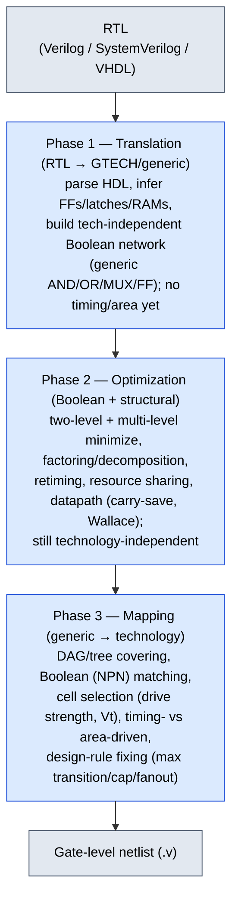

# Logic Synthesis and Optimization -- Senior Engineer Deep Dive

> Target audience: Engineers preparing for senior-level IC (integrated circuit) design interviews at
> Apple, NVIDIA, AMD, Intel, Qualcomm, Broadcom, MediaTek, etc.

---

## Table of Contents

1. [RTL-to-Gates Flow](#1-rtl-to-gates-flow)
2. [SDC Constraints — moved to Constraints_SDC](#2-sdc-constraints--moved-to-constraints_sdc)
3. [Optimization Techniques](#3-optimization-techniques)
4. [Technology Mapping](#4-technology-mapping)
5. [Timing Closure Methodology](#5-timing-closure-methodology)
6. [Area Optimization](#6-area-optimization)
7. [Power Optimization in Synthesis](#7-power-optimization-in-synthesis)
8. [Design Compiler vs Genus Comparison](#8-design-compiler-vs-genus-comparison)

---

## 1. RTL-to-Gates Flow

### 1.1 Three Phases of Synthesis



### 1.2 Synopsys Design Compiler Flow

```tcl
# ===== Synopsys Design Compiler (DC) Flow =====

# 1. Setup
set_app_var target_library "tsmc7ff_sc_rvt_ss_0p72v_m40c.db"
set_app_var link_library   "* tsmc7ff_sc_rvt_ss_0p72v_m40c.db"
set_app_var search_path    "./libs ./rtl"

# 2. Read RTL
read_verilog {top.v sub_module_a.v sub_module_b.v}
# Or: analyze + elaborate (preferred for parameterized designs)
analyze -format sverilog {top.sv sub_a.sv sub_b.sv}
elaborate top -parameters {DATA_WIDTH=64, DEPTH=16}

# 3. Link design
current_design top
link

# 4. Apply constraints (SDC)
source ./constraints/top.sdc

# 5. Compile
# Basic: compile -map_effort high
# Advanced: compile_ultra (includes datapath opt, boolean opt, auto-ungroup)
compile_ultra

# 6. Incremental optimization (optional)
compile_ultra -incremental

# 7. Reports
report_timing -nworst 10 -max_paths 50 > reports/timing.rpt
report_area                              > reports/area.rpt
report_power                             > reports/power.rpt
report_constraint -all_violators         > reports/constraints.rpt
report_qor                              > reports/qor.rpt

# 8. Write outputs
write -format verilog -hierarchy -output netlist/top.v
write_sdc -version 2.1 output/top.sdc
write -format ddc -hierarchy -output ddc/top.ddc
```

### 1.3 Cadence Genus Flow

```tcl
# ===== Cadence Genus Synthesis Flow =====

# 1. Setup
set_db init_lib_search_path ./libs
set_db library {tsmc7ff_sc_rvt_ss_0p72v_m40c.lib}

# 2. Read RTL
read_hdl -sv {top.sv sub_a.sv sub_b.sv}

# 3. Elaborate
elaborate top

# 4. Apply constraints
read_sdc ./constraints/top.sdc
# Or individual constraint commands

# 5. Three-step synthesis
syn_generic          ;# Technology-independent optimization
                      # (Boolean optimization, resource sharing)

syn_map              ;# Technology mapping to library cells
                      # (cell selection, drive strength)

syn_opt              ;# Post-mapping optimization
                      # (timing closure, DRV fixing)

# Optional: incremental optimization
syn_opt -incr

# 6. Reports
report_timing -nworst 10 > reports/timing.rpt
report_area              > reports/area.rpt
report_power             > reports/power.rpt
report_qor               > reports/qor.rpt

# 7. Write outputs
write_hdl > netlist/top.v
write_sdc > output/top.sdc
write_design -innovus -basename output/top
```

### 1.4 What Happens During Each Phase

**Phase 1 -- Translation:**

```verilog
  RTL code:
    always @(posedge clk)
      if (sel)
        q <= a + b;
      else
        q <= c & d;

  GTECH representation:
    GTECH_ADD(a, b)  → sum
    GTECH_AND(c, d)  → and_out
    GTECH_MUX(sel, and_out, sum) → mux_out
    GTECH_FD(clk, mux_out) → q
```

**Phase 2 -- Optimization (selected techniques):**

```verilog
  Boolean optimization example:
    Original: f = abc + abd + ab'c + ab'd
    Factor:   f = a(bc + bd + b'c + b'd)
            = a((b+b')(c+d))       -- wait, let's do this properly
            = a(bc + bd + b'c + b'd)
            = a(c(b+b') + d(b+b'))
            = a(c + d)
    Simplified: 1 AND + 1 OR vs original 4 ANDs + 1 OR (3 inputs each)

  Structuring:
    Decompose large functions into tree of smaller gates
    for better mapping to library cells.
```

**Phase 3 -- Technology Mapping:**

```ascii-graph
  Generic Boolean network:
    y = (a & b) | (c & d)

  Mapped to library cells (option A -- area optimized):
    AND2_X1(a, b) → n1
    AND2_X1(c, d) → n2
    OR2_X1(n1, n2) → y
    Area: 3 cells, ~6 gate equivalents

  Mapped to library cells (option B -- timing optimized):
    AO22_X2(a, b, c, d) → y    [AND-OR complex gate]
    Area: 1 cell, ~5 gate equivalents, fewer stages = faster
```

---

## 2. SDC Constraints — moved to Constraints_SDC

Synthesis is driven by the same SDC (Synopsys Design Constraints) that later drives STA (static timing analysis) and P&R (place and route). The full command-by-command
reference (create_clock / generated clocks / uncertainty / latency / clock groups, I/O delays,
false path / multicycle / max-min delay / case analysis, DRV (design rule violation) constraints, and a complete
3-clock-domain worked SDC) now lives in [Constraints_SDC](02_Constraints_SDC.md).

- Signoff-side walkthrough of a realistic block's SDC: [STA](../06_Signoff/01_STA.md) §10.
- What synthesis *does* with each constraint (optimization pressure, DRV fixing) stays on this page (§3, §5).

## 3. Optimization Techniques

### 3.1 Ungrouping

```tcl
# Remove hierarchy boundaries to allow cross-module optimization
set_ungroup [get_designs sub_module_a]
# or during compile:
compile_ultra -ungroup_all
```

```ascii-graph
  Before ungrouping:
  ┌─────────────────────┐    ┌──────────────────────┐
  │  Module A            │    │  Module B             │
  │  [logic] ──> port_a ─┼───>┼─ port_b ──> [logic]  │
  │                      │    │                       │
  └─────────────────────┘    └──────────────────────┘
  Boundary ports prevent optimization across modules.

  After ungrouping:
  ┌──────────────────────────────────────────────────┐
  │  Flattened design                                 │
  │  [logic_A] ──────────────────> [logic_B]          │
  │  (no boundary, tool can optimize the connection)  │
  └──────────────────────────────────────────────────┘
```

**When to ungroup:**
- Small modules on critical paths
- Glue logic modules
- Wrapper modules with no meaningful hierarchy

**When NOT to ungroup:**
- Large modules (makes optimization intractable)
- Modules you want to preserve for ECO (engineering change order) or debug
- Hard macros (memories, IPs)

### 3.2 Boundary Optimization

```tcl
set_boundary_optimization [get_designs sub_module] true
```

The tool can:
- Propagate constants across hierarchy boundaries
- Remove unconnected/unused ports
- Merge duplicate logic across boundaries

```verilog
  Example: Module port tied to constant
  
  Before:
    top: assign sub_inst.config = 1'b0;
    sub: always @(*) if (config) y = a; else y = b;

  After boundary optimization:
    sub: y = b;  (config=0 propagated, dead branch removed)
```

### 3.3 Retiming -- Mathematical Formulation and Detailed Analysis

Moving registers across combinational logic to balance path delays.

```ascii-graph
  Forward Retiming (pipeline register moved forward):
  ═══════════════════════════════════════════════════

  Before:
    [REG] ──> [Long Comb Logic A: 3ns] ──> [Short Comb Logic B: 0.5ns] ──> [REG]
    Critical path = 3ns (Logic A limits frequency)

  After forward retiming:
    [REG] ──> [Comb Logic A part1: 1.5ns] ──> [REG] ──> [Comb Logic A part2 + B: 2ns] ──> [REG]
    Critical path = 2ns (balanced!)


  Backward Retiming (pipeline register moved backward):
  ════════════════════════════════════════════════════

  Before:
    [REG] ──> [Short Logic: 0.5ns] ──> [Long Logic: 3ns] ──> [REG]

  After backward retiming:
    [REG] ──> [Short + Long_part1: 1.75ns] ──> [REG] ──> [Long_part2: 1.75ns] ──> [REG]
```

**Mathematical Formulation (Leiserson-Saxe):**

```text
  Given a synchronous circuit modeled as a directed graph G = (V, E):
    V = set of combinational nodes (gates)
    E = set of edges, each with weight d(v) = combinational delay of node v
    r(v) = number of flip-flops on node v (retiming variable, initially 0 or 1)

  Retiming r: V -> Z (integer assignment) moves r(v) - r_original(v)
  flip-flops from the outputs of v to its inputs.

  The retiming problem: Find r: V -> Z to minimize the clock period P,
  subject to:

  Constraint 1 (Non-negativity):
    For every edge (u -> v): r(u) + w(e) - r(v) >= 0
    where w(e) = number of FFs originally on edge e
    This ensures no edge ends up with negative FFs (physically impossible).

  Constraint 2 (I/O latency preservation):
    For every primary input node v: r(v) = 0
    For every primary output node v: r(v) = 0
    This ensures the input-to-output latency is preserved.

  Constraint 3 (Period feasibility):
    For every path p from node u to node v with W(p) = 0 FFs on the path:
    D(p) = sum of d(node) along p <= P
    where W(p) = sum of w(e) along p + r(u) - r(v) = 0
    (paths with zero FFs between them must complete in one cycle)

  The minimum clock period P* is found by binary search:
    For each candidate period P, check if a valid retiming r exists
    using a Bellman-Ford-like shortest path formulation.

  Time complexity: O(|V|^3 * log(|V| * D_max)) where D_max = max node delay.

  Practical note: Real synthesis tools use a simplified version that
  only retimes across combinational logic between known pipeline stages
  (not the full graph), making it much faster in practice.
```

**When retiming helps vs. when it doesn't:**

```verilog
  HELPS:
  - Pipeline stages with unbalanced combinational delays (1ns + 3ns)
  - Dataflow paths where FFs can be freely moved
  - Arithmetic pipelines (adders, multipliers) where partial sums
    can be retimed across addition boundaries
  - Feed-forward paths (no feedback loops)

  DOES NOT HELP:
  - Already-balanced pipeline stages (all stages within 10% of each other)
  - Paths with feedback loops (retiming changes loop state encoding)
  - Paths where every combinational segment is shorter than the target period
  - Designs where all FFs have timing-critical reset/preset logic
    (moving the FF changes when reset activates)
  - Logic that depends on exact cycle-by-cycle behavior (FSMs with
    one-hot encoding where moving FFs changes the state assignment)
```

**Constraints on retiming:**
- Cannot retime across I/O boundaries (would change interface timing)
- Cannot retime across clock domain boundaries
- Cannot retime if it changes reset behavior (initial values matter)
- Cannot retime if register has special attributes (scan, dont_touch)
- Tool must verify functional equivalence before/after

```tcl
# Enable retiming in DC
compile_ultra -retime

# In Genus
set_db design:top .retime true
syn_opt -retime
```

### 3.4 Logical Effort Design Flow -- Worked Example

Logical effort is a method for sizing gates in a combinational path to minimize delay.

```ascii-graph
  Key Definitions:
  ────────────────
  g = logical effort of a gate = ratio of its input capacitance to that
      of an inverter delivering the same output current
    INV:  g = 1 (by definition)
    NAND2: g = 4/3  (PMOS:2 + NMOS:2, vs INV PMOS:2 + NMOS:1 -> 4/3)
    NAND3: g = 5/3
    NOR2:  g = 5/3  (PMOS:4 + NMOS:1, vs INV 2+1 -> 5/3)
    NOR3:  g = 7/3

  h = electrical effort = C_out / C_in  (fanout ratio)
  p = parasitic delay of a gate (intrinsic, independent of load)
    INV: p = 1 (by convention, ~1 FO4)
    NAND2: p = 2
    NAND3: p = 3
    NOR2: p = 2
    NOR3: p = 3

  Stage delay: d = g * h + p
  Path delay:  D = sum(g_i * h_i + p_i) = G * H / N^N + sum(p_i)
    where G = product of all g_i, H = product of all h_i, N = number of stages

  Optimal stage effort: f_opt = (G * H)^(1/N) = (F)^(1/N)
    where F = G * H = path effort
  Minimum path delay: D_min = N * f_opt + P (where P = sum of parasitic delays)
```

**Worked Example: Size a 4-stage path**

```ascii-graph
  Path: INPUT --> NAND2 --> INV --> NAND3 --> NOR2 --> OUTPUT

  Given:
    C_load (at output) = 200 fF  (capacitance of the next stage)
    C_in  (at input)   = 10 fF   (input pin capacitance of the first gate)

  Step 1: Compute path logical effort G = product of all g_i
    G = g_NAND2 * g_INV * g_NAND3 * g_NOR2
    G = (4/3) * 1 * (5/3) * (5/3)
    G = (4 * 5 * 5) / (3 * 3 * 3)
    G = 100 / 27 = 3.704

  Step 2: Compute path electrical effort H = C_load / C_in
    H = 200 / 10 = 20

  Step 3: Compute path effort F = G * H
    F = 3.704 * 20 = 74.07

  Step 4: Compute optimal stage effort f_opt = F^(1/N)
    N = 4 stages
    f_opt = 74.07^(1/4)
    74.07^(0.5) = 8.606
    8.606^(0.5) = 2.934
    f_opt ≈ 2.93

  Step 5: Compute path parasitic delay P = sum of all p_i
    P = p_NAND2 + p_INV + p_NAND3 + p_NOR2
    P = 2 + 1 + 3 + 2 = 8

  Step 6: Compute minimum path delay
    D_min = N * f_opt + P = 4 * 2.93 + 8 = 11.72 + 8 = 19.72 FO4

  Step 7: Size each gate (working backwards from output)

    Gate 4 (NOR2, drives C_load = 200 fF):
      g_4 * h_4 = f_opt -> h_4 = f_opt / g_4 = 2.93 / (5/3) = 1.76
      C_in_4 = C_load / h_4 = 200 / 1.76 = 113.6 fF
      (NOR2 input cap = 113.6 fF; this is the load for gate 3)

    Gate 3 (NAND3, drives C_in_4 = 113.6 fF):
      h_3 = f_opt / g_3 = 2.93 / (5/3) = 1.76
      C_in_3 = 113.6 / 1.76 = 64.5 fF

    Gate 2 (INV, drives C_in_3 = 64.5 fF):
      h_2 = f_opt / g_2 = 2.93 / 1 = 2.93
      C_in_2 = 64.5 / 2.93 = 22.0 fF

    Gate 1 (NAND2, drives C_in_2 = 22.0 fF):
      Verify: h_1 = 22.0 / 10.0 = 2.20
      g_1 * h_1 = (4/3) * 2.20 = 2.93 = f_opt ✓ (matches!)

  Verification:
    G * H = (4/3) * 2.20 * 1 * 2.93 * (5/3) * 1.76 * (5/3) * 1.76
    = (4/3) * (5/3) * (5/3) * 2.20 * 2.93 * 1.76 * 1.76
    = 3.704 * 2.20 * 2.93 * 1.76 * 1.76
    = 3.704 * 20.0 = 74.07 ✓

  Total delay: 4 * 2.93 + 8 = 19.72 FO4
  For a 7nm process at ~12 ps/FO4: D_min ≈ 237 ps

  Key insight: Each stage has the same effective effort (g*h = f_opt).
  This is the fundamental result of logical effort -- equal effort
  per stage minimizes total delay for a given path effort.
```

### 3.5 Datapath Optimization

Synthesis tools recognize arithmetic operations and implement them efficiently.

```ascii-graph
  Carry-Save Optimization:
  ════════════════════════

  RTL: result = a + b + c + d;

  Naive implementation (3 serial adders):
    [a+b] ──> [+c] ──> [+d] ──> result
    Delay: 3 x adder_delay (critical path through carry chains)

  Carry-save optimization:
    [CSA(a,b,c)] ──> [sum1, carry1]
    [CSA(sum1, carry1, d)] ──> [sum2, carry2]
    [CPA(sum2, carry2)] ──> result
    Delay: 2 x CSA_delay + 1 x CPA_delay
    (CSA is single-gate delay; only final CPA has carry chain)


  Wallace Tree (for multiplication):
  ═══════════════════════════════════
  
  For 8x8 multiplier:
    Naive: 8 partial products, added sequentially = 7 additions
    Wallace tree: partial products reduced in parallel stages
      Stage 1: 8 rows → 6 rows (using CSAs)
      Stage 2: 6 rows → 4 rows
      Stage 3: 4 rows → 3 rows
      Stage 4: 3 rows → 2 rows
      Final:   2 rows → 1 result (CPA)
    Depth: O(log n) vs O(n)
```

**Resource sharing:**

```verilog
  // Before resource sharing:
  always @(*) begin
      if (sel)
          result = a + b;    // Adder 1
      else
          result = c + d;    // Adder 2
  end
  // Two adders instantiated

  // After resource sharing:
  // Tool transforms to:
  //   mux_a = sel ? a : c;
  //   mux_b = sel ? b : d;
  //   result = mux_a + mux_b;    // One adder!
  // Trade-off: 2 muxes added, 1 adder removed
  // Area savings if adder >> 2 muxes (true for wide datapaths)
```

```tcl
# Enable resource sharing
set_resource_allocation shared
# or
compile_ultra  ;# does this automatically
```

### 3.6 Compile Strategies

```tcl
# ── Strategy 1: Basic compile (fast, lower QoR) ──
compile -map_effort high

# ── Strategy 2: compile_ultra (best single-pass QoR) ──
compile_ultra
# Includes: auto-ungrouping, datapath opt, boolean opt, register retiming

# ── Strategy 3: compile_ultra + incremental ──
compile_ultra
# ... fix constraints, add path groups ...
compile_ultra -incremental
# Incremental only makes local changes, won't restructure

# ── Strategy 4: Two-pass with path groups ──
compile_ultra
group_path -name critical_group \
    -from [get_cells cpu_core/*] \
    -to [get_cells cpu_core/*] \
    -weight 2.0
compile_ultra -incremental

# ── Strategy 5: Topographical mode (placement-aware) ──
compile_ultra -spg  ;# Synopsys Physical Guidance
# Uses floorplan info for wire delay estimation
# Much better correlation with post-P&R timing
```

### 3.7 Path Groups

```tcl
# Path groups prioritize optimization effort on specific paths
group_path -name reg2reg_core -from [get_clocks core_clk] -to [get_clocks core_clk]
group_path -name io_in -from [get_ports *] -to [get_clocks core_clk]
group_path -name io_out -from [get_clocks core_clk] -to [get_ports *]
group_path -name memory_paths -to [get_cells mem_ctrl/*]

# Critical range: optimize all paths within N ns of the worst path
set_critical_range 0.3 [current_design]
# Optimizes paths with slack < (worst_slack + 0.3ns)
# Without this, tool only focuses on the single worst path
```

---

## 4. Technology Mapping

### 4.1 Library Cells

Standard cell naming conventions:

```ascii-graph
  Cell name format (typical):
    <function><inputs>_<drive_strength>

  Examples:
    AND2_X1  → 2-input AND, drive strength 1x
    AND2_X4  → 2-input AND, drive strength 4x (4x wider transistors)
    NAND3_X2 → 3-input NAND, drive strength 2x
    DFFR_X1  → D flip-flop with reset, 1x drive
    AO22_X1  → AND-OR: (a&b)|(c&d), 1x drive

  Vt (threshold voltage) flavors:
    HVT  → High Vt:    SLOWEST,  LEAST leakage,  most area-efficient
    SVT  → Standard Vt: MODERATE, moderate leakage
    LVT  → Low Vt:     FAST,     HIGH leakage
    ULVT → Ultra-Low Vt: FASTEST, HIGHEST leakage

  Speed comparison (7nm example, inverter delay):
    HVT:  ~25 ps
    SVT:  ~18 ps
    LVT:  ~13 ps
    ULVT: ~10 ps

  Leakage comparison:
    HVT:  1x     (baseline)
    SVT:  3-5x
    LVT:  10-20x
    ULVT: 30-50x
```

### 4.2 Cell Selection Trade-offs

```ascii-graph
  ┌──────────────────┬──────────┬──────────┬──────────┬──────────┐
  │ Property         │ X1 (min) │ X2       │ X4       │ X8 (max) │
  ├──────────────────┼──────────┼──────────┼──────────┼──────────┤
  │ Drive strength   │ Low      │ Medium   │ High     │ Highest  │
  ├──────────────────┼──────────┼──────────┼──────────┼──────────┤
  │ Speed (unloaded) │ Slowest  │ Moderate │ Fast     │ Fastest  │
  ├──────────────────┼──────────┼──────────┼──────────┼──────────┤
  │ Area             │ Smallest │ 2x       │ 4x       │ 8x       │
  ├──────────────────┼──────────┼──────────┼──────────┼──────────┤
  │ Leakage power    │ Lowest   │ 2x       │ 4x       │ 8x       │
  ├──────────────────┼──────────┼──────────┼──────────┼──────────┤
  │ Input cap        │ Lowest   │ 2x       │ 4x       │ 8x       │
  ├──────────────────┼──────────┼──────────┼──────────┼──────────┤
  │ When to use      │ Off-crit │ Default  │ Medium   │ High     │
  │                  │ paths    │ mapping  │ fanout   │ fanout   │
  │                  │          │          │ or crit  │ buffers  │
  └──────────────────┴──────────┴──────────┴──────────┴──────────┘

  Key insight: Larger drive strength helps with heavily loaded nets
  but the cell itself is slower for lightly loaded nets (larger
  internal capacitance). There is an OPTIMAL drive strength for
  each fanout/load scenario.
```

### 4.3 Mapping Algorithms -- Deep Dive

**DAG (directed acyclic graph) Covering (FlowMap Algorithm):**

```verilog
  Subject graph (Boolean network) is a DAG of 2-input gates.
  Library cells are represented as patterns (sub-DAGs).
  Mapping = covering every node in subject graph with library patterns.

  FlowMap (the industry-standard algorithm):
  1. Decompose the Boolean network into a subject graph of 2-input NAND
     gates and inverters (every Boolean function can be so decomposed).
  2. For each node, compute a "label" = minimum number of library cells
     needed to reach this node from the primary inputs. This is done by
     computing the k-feasible cut at each node (a cut is a set of input
     signals that completely determine the output).
  3. A k-feasible cut has at most k inputs. The label of a node is
     the minimum label across all k-feasible cuts.
  4. After labeling all nodes (forward pass), perform area recovery
     by re-choosing matches that minimize total area subject to the
     depth constraint from step 2.

  k is the maximum number of inputs any library cell has (typically 4-6).

  Example:
    Subject: a AND b AND c  (chain of 2 AND2 gates)
    
    Option A: AND2(a,b) -> n1; AND2(n1,c) -> out
              Cost: 2 cells, 2 levels of logic
    
    Option B: AND3(a,b,c) -> out  (if AND3 exists in library)
              Cost: 1 cell, 1 level (fewer stages = faster)
    
    FlowMap prefers B because it gives a lower depth label at "out".
```

**Tree Matching (Pattern Covering):**

```verilog
  For tree-structured subgraphs (no reconvergent fanout), the mapper
  performs optimal tree covering using dynamic programming:

  1. Each library cell pattern is stored as a tree pattern:
     AND2:      AND(A,B)        -> matches tree node with 2 children
     AOI21:     NOT(AND(A,B)|C) -> matches tree node + child structure
     OAI22:     NOT((A&B)|(C&D))-> matches 2-level tree

  2. At each leaf node of the subject tree, compute the best match
     (minimum cost) using all library patterns that match the subtree
     rooted at this node.

  3. Recursively combine: for internal nodes, try all library patterns
     that have this gate type at the root, and use the previously computed
     optimal costs for the children.

  Optimal for trees in O(n * p) where n = subject tree nodes, p = patterns.
  For general DAGs, the problem is NP-hard; heuristics decompose the DAG
  into trees at reconvergent fanout points.
```

**Boolean Matching (Graph Isomorphism for Cells):**

Two functions are NPN-equivalent if one can be transformed to the other by:
- **N**egation of inputs
- **P**ermutation of inputs
- **N**egation of output

```text
  How Boolean matching works in the mapper:
  
  1. Canonical form: For a library cell with n inputs, there are 2^n input
     combinations. The truth table (column vector of 2^n bits) IS the function.
  
  2. NPN canonical form: of all 2^n * n! * 2 possible transformations
     (negate each subset of inputs, permute inputs, negate output), find
     the lexicographically smallest truth table. This is the canonical form.
  
  3. Two functions are NPN-equivalent iff they have the same canonical form.
  
  4. The library is pre-processed into NPN classes. At mapping time, the
     subject graph sub-function is canonicalized and looked up in O(1).
  
  Example: NAND2(a,b) = NOT(AND(a,b))
           NOR2(a,b)  = NOT(OR(a,b)) = NOT(AND(NOT(a),NOT(b)))
           
  NAND2 truth table: 0111  (for inputs 00,01,10,11)
  NOR2 truth table:  1000
  NOR2 with negated inputs: NAND2 = 0111 -> SAME canonical form!
  
  The mapper can substitute NOR2 + input inverters for NAND2 (or vice versa)
  depending on what is cheaper in the actual loading/area context.
  
  For complex gates (AOI, OAI families), the same principle applies:
  compute the truth table, canonicalize, and look up matching library cells.
  At 7nm, libraries have ~500 cells; NPN grouping reduces this to ~50-80
  unique classes, making matching very fast.
```

**Don't-Care Points in Technology Mapping:**

```verilog
  Don't-care (DC) conditions allow the mapper to simplify functions beyond
  what the Boolean specification alone permits. Two types:

  1. External Don't-Cares (from fanout context):
     - If a signal A is only consumed by logic that also requires B=1,
       then the behavior when B=0 is irrelevant for the sub-function
       driving A.
     - The mapper can freely assign output values for the don't-care
       input combinations, potentially finding matches with simpler
       (fewer transistor) library cells.
     - Example: if output F = A & B, and we know B is always 1 in the
       context where F is used, we can simplify F to just A (use a
       buffer instead of AND gate).

  2. Satisfiability Don't-Cares (SDC, from unreachable states):
     - In sequential circuits, some input combinations to a combinational
       block may never occur because the controlling state machine can
       never reach the state that produces them.
     - The mapper detects these unreachable conditions via satisfiability
       analysis (SAT) on the controller logic, then treats the
       corresponding function outputs as don't-care.
     - Example: a 4-bit FSM has 16 possible states but only uses 10.
       The remaining 6 state encodings produce input combinations to the
       next-state logic that are SDC -- the mapper can optimize these
       away, often saving 10-30% of combinational area in control logic.

  Practical impact:
    Without DC:  mapper finds matches for the exact Boolean function
    With DC:     mapper optimizes the largest "care set" function that
                 is a subset of the don't-care superfunction
    Result:      typically 5-15% area improvement from DC exploitation
```

### 4.4 Multi-Vt Optimization

```tcl
  Strategy: Start all-HVT, swap to lower Vt on critical paths only.

  Flow:
    1. First compile with target_library = HVT only
       → All cells are HVT, minimum leakage
       → Many timing violations expected

    2. compile_ultra or optimize:
       → Tool swaps cells on critical paths to SVT, then LVT
       → Each swap: gain speed, pay with leakage

    3. Result: ~70-80% cells remain HVT, ~15-25% SVT, ~5% LVT

  Leakage comparison:
    All-LVT design:  1.0 mW leakage (baseline)
    Multi-Vt design:  0.2 mW leakage (5x reduction!)
    All-HVT design:  0.05 mW leakage (but can't meet timing)
```

```tcl
# In DC:
set_multi_vth_constraint -lvth_groups {LVT} -lvth_percentage 10
# Limit LVT usage to max 10% of cells

# Or use multiple libraries:
set_app_var target_library "hvt.db svt.db lvt.db"
compile_ultra
# Tool automatically picks optimal Vt per cell
```

---

## 5. Timing Closure Methodology

### 5.1 The Iterative Loop

```ascii-graph
  ┌──────────────────────────────┐
  │  Write/Refine SDC Constraints│ <──────────┐
  └──────────────┬───────────────┘            │
                 │                             │
                 v                             │
  ┌──────────────────────────────┐            │
  │  Run Synthesis (compile_ultra)│            │
  └──────────────┬───────────────┘            │
                 │                             │
                 v                             │
  ┌──────────────────────────────┐            │
  │  Analyze Timing Reports       │            │
  │  (report_timing, report_qor)  │            │
  └──────────────┬───────────────┘            │
                 │                             │
           ┌─────┴──────┐                     │
           │  Timing    │── NO ──> Fix ────────┘
           │  Met?      │         (restructure RTL,
           └─────┬──────┘          adjust constraints,
                 │ YES              add path groups,
                 v                  retime, pipeline)
  ┌──────────────────────────────┐
  │  Proceed to P&R               │
  └──────────────────────────────┘
```

### 5.2 Reading Timing Reports

```ascii-graph
  Example DC timing report:

  Startpoint: cpu/alu/reg_a (rising edge-triggered flip-flop clocked by core_clk)
  Endpoint:   cpu/wb/reg_result (rising edge-triggered flip-flop clocked by core_clk)
  Path Group: core_clk
  Path Type:  max (setup check)

  Point                                    Incr       Path
  ──────────────────────────────────────────────────────────
  clock core_clk (rise edge)               0.000      0.000
  clock network delay (ideal)              0.600      0.600
  cpu/alu/reg_a/CK (DFFR_X1)              0.000      0.600
  cpu/alu/reg_a/Q (DFFR_X1)               0.120      0.720  ← CK-to-Q delay
  cpu/alu/u_add/A[0] (AND2_X1)            0.015      0.735  ← wire delay
  cpu/alu/u_add/Y (AND2_X1)               0.085      0.820  ← cell delay
  cpu/alu/u_add2/A[0] (FA_X1)             0.010      0.830
  cpu/alu/u_add2/CO (FA_X1)               0.130      0.960  ← carry chain!
  ... (carry propagation through 32 stages) ...
  cpu/alu/u_add32/S (FA_X1)               0.095      2.850
  cpu/wb/mux_result/Y (MUX2_X1)           0.075      2.925
  cpu/wb/reg_result/D (DFFR_X1)           0.010      2.935  ← data arrival
  data arrival time                                   2.935

  clock core_clk (rise edge)               1.000      1.000  ← period
  clock network delay (ideal)              0.600      1.600
  clock uncertainty                       -0.150      1.450
  cpu/wb/reg_result/CK (DFFR_X1)          0.000      1.450
  library setup time                      -0.050      1.400
  data required time                                  1.400
  ──────────────────────────────────────────────────────────
  slack (MET/VIOLATED)                               -1.535  ← VIOLATED!

  Analysis:
    Data arrives at 2.935 ns
    Data required by 1.400 ns (1.0ns period + 0.6ns clk delay - 0.15 uncert - 0.05 setup)
    Slack = 1.400 - 2.935 = -1.535 ns (violated by 1.535 ns!)
    
  Root cause: 32-bit carry chain through ripple carry adder
  Fix: Use carry-lookahead or Kogge-Stone adder (datapath optimization)
       Or pipeline the adder into 2 stages
```

### 5.3 Common Timing Closure Techniques

```ascii-graph
  ┌───────────────────────┬────────────────────────────────────────┐
  │ Technique             │ When to Use                            │
  ├───────────────────────┼────────────────────────────────────────┤
  │ Pipelining            │ Large combo delay, can add latency     │
  │                       │ (adders, multipliers, long paths)      │
  ├───────────────────────┼────────────────────────────────────────┤
  │ Register balancing    │ Uneven pipeline stages (retiming)      │
  │                       │ compile_ultra -retime                  │
  ├───────────────────────┼────────────────────────────────────────┤
  │ Logic restructuring   │ Deep logic cones, rewrite for less     │
  │                       │ depth (e.g., tree vs chain structure)  │
  ├───────────────────────┼────────────────────────────────────────┤
  │ Architecture change   │ Fundamental bottleneck (e.g., change   │
  │                       │ from ripple to CLA adder in RTL)       │
  ├───────────────────────┼────────────────────────────────────────┤
  │ Path group + weight   │ Tool not focusing on right paths       │
  │                       │ group_path -weight 5.0                 │
  ├───────────────────────┼────────────────────────────────────────┤
  │ Critical range        │ Tool fixes WNS but many near-critical  │
  │                       │ set_critical_range 0.2                 │
  ├───────────────────────┼────────────────────────────────────────┤
  │ Multicycle path       │ Path doesn't need single-cycle timing  │
  │                       │ (config registers, slow interfaces)    │
  ├───────────────────────┼────────────────────────────────────────┤
  │ Ungroup               │ Boundary preventing cross-module opt   │
  ├───────────────────────┼────────────────────────────────────────┤
  │ Cell sizing (manual)  │ Post-compile, upsize specific cells    │
  │                       │ size_cell cpu/alu/u1 AND2_X4           │
  └───────────────────────┴────────────────────────────────────────┘
```

### 5.4 Incremental Compile

```tcl
# When to use incremental compile:
# - After initial compile_ultra achieves close-to-met timing
# - After adjusting constraints or adding path groups
# - NOT for major timing violations (> 20% of period)

compile_ultra -incremental
# Performs:
#   - Local cell resizing
#   - Buffer insertion/removal
#   - Pin swapping
#   - Gate cloning for fanout
# Does NOT:
#   - Restructure logic
#   - Remap large sections
#   - Ungroup
```

### 5.5 Hold Violation Fixing at Synthesis

```tcl
# Tell synthesis to fix hold violations
set_fix_hold [get_clocks core_clk]
# Tool inserts delay buffers on short paths

# CAUTION: Fixing hold at synthesis is approximate because
# actual clock skew is unknown pre-CTS.
# Post-CTS hold fixing (in P&R) is more accurate.
# Some teams intentionally skip hold fixing at synthesis.
```

### 5.6 Topographical Mode (DCT / DC-Topo)

```tcl
# Placement-aware synthesis for better PPA correlation
# In DC:
create_floorplan -core_utilization 0.7 -core_aspect_ratio 1.0
compile_ultra -spg  ;# Synopsys Physical Guidance

# Benefits:
# - Wire delay estimation based on actual placement (not wireload models)
# - Better correlation with post-P&R timing (within 5-10%)
# - Reduces ECO iterations between synthesis and P&R
# - Identifies congestion hotspots early

# Traditional (non-topo) synthesis uses wireload models:
# set_wire_load_model -name "medium" -library lib_name
# These are statistical estimates -- poor accuracy at advanced nodes
```

---

## 6. Area Optimization

### 6.1 Area Recovery After Timing Closure

```tcl
# After timing is met, recover area on non-critical paths:

# 1. Downsize cells with large positive slack
compile_ultra -incremental -area

# 2. Report area breakdown
report_area -hierarchy
report_reference -hierarchy  ;# shows cell type usage

# 3. Analyze specific cell usage
report_reference -by_type
#  Example output:
#  Reference    Count   Area    
#  AND2_X1      15234   30468   
#  AND2_X4       2340   18720   ← can some X4s become X1s?
#  DFFR_X1      45000   450000  
#  BUF_X8        3200   51200   ← hold buffers, are all needed?
```

### 6.2 Sequential Optimization

**Register merging:** Combine duplicate registers (same logic driving same
D input) into one register.

```ascii-graph
  Before:
    [comb_logic] ──> reg_a/D     reg_a/Q ──> [fanout1]
    [comb_logic] ──> reg_b/D     reg_b/Q ──> [fanout2]
    (reg_a and reg_b have identical D inputs)

  After merging:
    [comb_logic] ──> reg_a/D     reg_a/Q ──> [fanout1]
                                 reg_a/Q ──> [fanout2]
    (reg_b removed, its fanout driven by reg_a)
    Savings: 1 flip-flop
```

**Clock gating inference:**

```tcl
# Synthesis infers clock gating from RTL enable patterns
# RTL:
#   always @(posedge clk)
#     if (enable)
#       q <= d;
#
# Synthesizes to:
#   ICG (Integrated Clock Gating cell):
#     gated_clk = clk & enable (with latch to avoid glitch)
#   DFF with gated_clk instead of clk

# In DC:
set_clock_gating_style -sequential_cell latch \
    -minimum_bitwidth 4
# Only gate groups of 4+ FFs (overhead of ICG cell not worth it for fewer)
compile_ultra -gate_clock

# Report:
report_clock_gating
# Shows: number of ICG cells, number of gated registers, coverage %
```

### 6.3 Unused Logic Removal

```tcl
# DC automatically removes:
# - Unloaded nets (output goes nowhere)
# - Unloaded registers
# - Constants propagated through logic

# To prevent removal of specific logic:
set_dont_touch [get_cells debug_logic/*]
# Preserves cells for debug even if synthesis thinks they're unused
```

---

## 7. Power Optimization in Synthesis

### 7.1 Clock Gating Insertion

```ascii-graph
  Without clock gating:
  ═══════════════════════

  CLK ──────────────────────────> all FFs always clocked
  Power: C * V^2 * f * alpha  (alpha = activity factor ≈ 0.1-0.5)
  Even when FFs hold the same value, clock tree toggles = wasted power

  With clock gating:
  ═══════════════════

  CLK ──> [ICG] ──> gated_clk ──> group of FFs
              ^
           enable

  When enable=0: gated_clk = 0 (static), no switching power
  Savings: proportional to (1 - duty_cycle_of_enable)

  ICG cell structure (latch-based):
  
  enable ──> [Latch (transparent when CLK=0)] ──> AND ──> gated_clk
                                                    ^
  CLK ────────────────────────────────────────────┘

  Latch prevents glitch: enable sampled when CLK is LOW,
  so gated_clk rises cleanly with CLK.
```

**RTL (register-transfer level) coding for clock gating inference:**

```verilog
// GOOD: Tool infers clock gating
always @(posedge clk) begin
    if (enable)
        data_out <= data_in;
    // implicit else: data_out retains (FF holds value)
end

// BAD: Tool cannot infer clock gating (explicit else with assignment)
always @(posedge clk) begin
    if (enable)
        data_out <= data_in;
    else
        data_out <= data_out;  // self-assignment prevents gating inference
end
// (some tools handle this, but it's not guaranteed)
```

### 7.2 Operand Isolation

```ascii-graph
  Without operand isolation:
    [MUL] computes a*b EVERY cycle, even when result is unused
    (MUL inputs toggle, consuming dynamic power)

  With operand isolation:
    When result not needed: AND gates force MUL inputs to 0
    → MUL inputs don't toggle → no dynamic power in MUL
    
    ┌─────┐
  a ─┤ AND ├──> [MUL] ──> result
    │     │         
  en ┤     │
    └─────┘

    en=0: MUL inputs = 0 (static, no toggling)
    en=1: MUL inputs = a (normal operation)
```

```tcl
# In DC:
set_operand_isolation_style -logic and
compile_ultra -gate_clock  ;# also enables operand isolation
```

### 7.3 Multi-Vt Swap for Leakage Reduction

```tcl
# Post-compile leakage optimization:
# Swap non-critical cells from LVT → SVT → HVT

# In DC:
set_max_leakage_power 0.5  ;# target in mW
compile_ultra

# Or post-compile:
optimize_netlist -area  ;# includes leakage optimization

# In Genus:
set_db design:top .max_leakage_power 500  ;# in uW
syn_opt
```

### 7.4 Power-Aware Compile with SAIF

```tcl
# SAIF (Switching Activity Interchange Format) provides
# actual signal toggle rates from simulation

# 1. Run RTL simulation, dump SAIF
# (in simulator: $set_toggle_region("top"); ... $report_toggle;)

# 2. Back-annotate in synthesis
read_saif -input simulation.saif -instance top

# 3. Power-aware compile
set_max_dynamic_power 100  ;# mW
set_max_leakage_power 1    ;# mW
compile_ultra -gate_clock

# 4. Report power
report_power -hierarchy -verbose
#  Example output:
#  Hierarchy         Internal  Switching  Leakage  Total
#  ─────────────────────────────────────────────────────
#  top                25.3 mW   18.7 mW   1.2 mW  45.2 mW
#    cpu_core          15.1 mW  10.2 mW   0.8 mW  26.1 mW
#      alu              8.3 mW   5.1 mW   0.3 mW  13.7 mW
#      reg_file         3.2 mW   2.8 mW   0.2 mW   6.2 mW
#    mem_ctrl           6.4 mW   5.1 mW   0.2 mW  11.7 mW
#    periph             3.8 mW   3.4 mW   0.2 mW   7.4 mW
```

**Without SAIF (Switching Activity Interchange Format):** Tool assumes default toggle rate (typically 0.1 or 10%)
for all signals -- very inaccurate. **With SAIF:** Actual toggle rates from
realistic simulation -- much more accurate power optimization targeting.

---

## 8. Design Compiler vs Genus Comparison

### 8.1 Command Mapping Table

```ascii-graph
  ┌────────────────────────────┬────────────────────────────────────┐
  │ Design Compiler (Synopsys) │ Genus (Cadence)                    │
  ├────────────────────────────┼────────────────────────────────────┤
  │ read_verilog               │ read_hdl -sv                       │
  │ analyze -format sverilog   │ read_hdl -sv                       │
  │ elaborate                  │ elaborate                          │
  │ link                       │ (automatic after elaborate)        │
  │ current_design             │ (automatic)                        │
  ├────────────────────────────┼────────────────────────────────────┤
  │ source constraints.sdc     │ read_sdc constraints.sdc           │
  │ create_clock               │ create_clock (same SDC)            │
  ├────────────────────────────┼────────────────────────────────────┤
  │ compile_ultra              │ syn_generic + syn_map + syn_opt    │
  │ compile_ultra -incremental │ syn_opt -incr                      │
  │ compile_ultra -retime      │ set_db .retime true; syn_opt       │
  │ compile_ultra -gate_clock  │ (automatic in syn_generic)         │
  │ compile_ultra -spg (topo)  │ set_db .place true (phys synth)    │
  ├────────────────────────────┼────────────────────────────────────┤
  │ set_dont_touch             │ set_db [get_cells ...] .dont_touch true │
  │ set_ungroup                │ set_db [get_designs ..] .ungroup true   │
  │ set_boundary_optimization  │ set_db .boundary_opto true         │
  ├────────────────────────────┼────────────────────────────────────┤
  │ report_timing              │ report_timing                      │
  │ report_area                │ report_area                        │
  │ report_power               │ report_power                       │
  │ report_qor                 │ report_qor                         │
  │ report_constraint          │ report_timing -lint                │
  ├────────────────────────────┼────────────────────────────────────┤
  │ write -format verilog      │ write_hdl                          │
  │ write_sdc                  │ write_sdc                          │
  │ write -format ddc          │ write_design -innovus              │
  ├────────────────────────────┼────────────────────────────────────┤
  │ set_app_var target_library │ set_db init_lib_search_path        │
  │                            │ set_db library                     │
  └────────────────────────────┴────────────────────────────────────┘
```

### 8.2 Optimization Differences

```ascii-graph
  ┌──────────────────────┬──────────────────────┬──────────────────────┐
  │ Feature              │ Design Compiler      │ Genus                │
  ├──────────────────────┼──────────────────────┼──────────────────────┤
  │ Compile model        │ Single command        │ Three-step           │
  │                      │ (compile_ultra)      │ (generic/map/opt)    │
  ├──────────────────────┼──────────────────────┼──────────────────────┤
  │ Datapath opt         │ DesignWare libs      │ Built-in datapath    │
  │                      │ (extensive IP)       │ synthesis            │
  ├──────────────────────┼──────────────────────┼──────────────────────┤
  │ Physical awareness   │ DCT/DC-Topo (-spg)   │ Physical synthesis   │
  │                      │                      │ (Genus + Innovus)    │
  ├──────────────────────┼──────────────────────┼──────────────────────┤
  │ Multi-Vt handling    │ Excellent, mature     │ Very good            │
  ├──────────────────────┼──────────────────────┼──────────────────────┤
  │ Runtime              │ Moderate              │ Generally faster     │
  │                      │                      │ (especially large    │
  │                      │                      │  designs)            │
  ├──────────────────────┼──────────────────────┼──────────────────────┤
  │ P&R integration      │ ICC2 (Synopsys flow) │ Innovus (Cadence     │
  │                      │                      │  flow)               │
  ├──────────────────────┼──────────────────────┼──────────────────────┤
  │ Market position      │ Dominant in ASIC      │ Growing adoption,    │
  │ (as of 2025)         │ synthesis             │ strong in advanced   │
  │                      │                      │ nodes                │
  └──────────────────────┴──────────────────────┴──────────────────────┘
```

### 8.3 When Each Is Preferred

**Design Compiler (DC):**
- Mature, established flow with extensive documentation
- Best-in-class DesignWare library for complex datapaths
- Dominant tool -- most foundry reference flows use DC
- Required when downstream P&R is ICC2 (Synopsys full flow)

**Genus:**
- Often faster runtime, especially for large designs (> 5M instances)
- Three-step compile gives more control over optimization phases
- Native integration with Innovus P&R (Cadence full flow)
- Competitive or better QoR (quality of results) at advanced nodes (7nm, 5nm, 3nm)
- Growing adoption at major semiconductor companies

**Reality:** Many companies license BOTH tools and benchmark regularly.
The "better" tool depends on the specific design, library, and constraints.
Senior engineers should be proficient in both.

---

## 9. AI Accelerator Synthesis

### 10.1 Massive Parameter Count Synthesis

```ascii-graph
AI accelerator synthesis challenges:

  Modern AI accelerator complexity:
    NVIDIA H100 (GH100): ~80 billion transistors, ~2M+ standard cells (per block)
    Google TPU v5: ~30 billion transistors
    AMD MI300X: ~153 billion transistors (multi-chiplet)

  Synthesis challenges at this scale:
    1. Memory: Single flat synthesis requires >256 GB RAM for >10M instances
    2. Runtime: Full compile_ultra can take 48-72+ hours
    3. Netlist size: Gate-level Verilog can be 10-50 GB
    4. Timing convergence: millions of timing paths, thousands of violations

  Hierarchical synthesis approach:
    ┌──────────────────────────────────────────────────┐
    │                    Top Level                       │
    │  ┌──────────┐ ┌──────────┐ ┌──────────────────┐  │
    │  │ Tensor   │ │ Tensor   │ │ NoC Router       │  │
    │  │ Core 0   │ │ Core 1   │ │ (synthesized      │  │
    │  │ (separate│ │ (separate│ │  independently)   │  │
    │  │  synth)  │ │  synth)  │ │                   │  │
    │  └──────────┘ └──────────┘ └──────────────────┘  │
    │  ┌──────────┐ ┌──────────┐ ┌──────────────────┐  │
    │  │ HBM PHY  │ │ NVLink   │ │ Memory Controller │  │
    │  │ (IP)     │ │ PHY (IP) │ │ (synth)           │  │
    │  └──────────┘ └──────────┘ └──────────────────┘  │
    └──────────────────────────────────────────────────┘

    Each block synthesized independently:
      - Tensor core: 500K-2M instances per core
      - NoC: 200K-500K instances
      - Memory controller: 100K-300K instances
      - Top-level integration: stitch blocks, route interconnect

  Synthesis tool settings for large blocks:
    # Design Compiler
    set_app_var hdlin_infer_memories true
    set_app_var compile_enable_constant_propagation_with_no_boundary_opt true
    compile_ultra -no_autoungroup -timing_high_effort

    # Genus
    set_db syn_global_effort high
    syn_generic
    syn_map
    syn_opt -incr  ;# multiple rounds if needed
```

### 10.2 Multi-Instance Block Synthesis

```tcl
Multi-instance synthesis for regular structures:

  Problem: A GPU has 100+ SMs (streaming multiprocessors),
  each identical. Synthesizing each separately is wasteful.

  Solution: Synthesize once, replicate physically.

  Flow:
    1. Synthesize one SM instance with full optimization
    2. Generate LEF abstract (physical outline + pins)
    3. Floorplan: place 100+ SM instances in the die
    4. Each SM is treated as a hard macro in top-level PnR

  Multi-instance synthesis considerations:
    - All instances must use the same timing constraints
    - Physical context differs per instance (different neighbors)
    - Wire load estimation must account for actual placement
    - Use topographical synthesis with representative floorplan

  In DC:
    # Synthesize one instance with physical awareness
    create_floorplan -core_utilization 0.7 -core_aspect_ratio 0.8
    compile_ultra -spg

    # Generate LEF and timing models for replication
    write_milkway -output sm_block
    write_lef sm_block.lef
    write_lib -output sm_block.lib

  In Genus:
    set_db design:sm_block .place true
    syn_generic; syn_map; syn_opt
    write_design -innovus -basename sm_block
    write_lef sm_block.lef
```

### 10.3 Retiming and Register Balancing for Deep Pipelines

```tcl
AI accelerators use deep pipelines for throughput:

  Example: Tensor core datapath (8-stage pipeline)
    Stage 1: Input register file read
    Stage 2: Operand formatting (FP32→TF32→BF16→INT8 conversion)
    Stage 3: Pre-multiplication alignment
    Stage 4: Partial product generation (multiply)
    Stage 5: Partial product reduction (CSA tree)
    Stage 6: Final addition (CPA)
    Stage 7: Accumulation (add to accumulator)
    Stage 8: Output formatting + write-back

  Retiming for pipeline balancing:
    Without retiming:
      Stage 4 (multiply): 1.2 ns ← bottleneck
      Stage 6 (CPA):      0.5 ns ← slack
      Max frequency: 833 MHz (limited by stage 4)

    With retiming:
      Stage 4a: 0.7 ns (partial product gen + part of CSA)
      Stage 4b: 0.7 ns (rest of CSA + pre-add)
      Stage 6:  0.7 ns (CPA + part of accumulation)
      Max frequency: 1.43 GHz (balanced)

  Retiming commands:
    # DC
    compile_ultra -retime -gate_clock

    # Genus
    set_db design:tensor_core .retime true
    syn_opt -retime

  Retiming verification:
    - LEC must use sequential equivalence checking (not combinational)
    - Formality: set_dp_retime_operation -design tensor_core
    - Conformal: enable retiming-aware verification mode
    - Verify functional equivalence with retimed vs pre-retimed netlist
```

### 10.4 Verifying SDC Constraint Correctness

```tcl
Common SDC mistakes in AI accelerator designs:

  1. Missing generated clock for divided clocks:
     WRONG:
       create_clock -name clk_div2 -period 4.0 [get_pins div_ff/Q]
       # Tool treats as async to source clock!

     CORRECT:
       create_generated_clock -name clk_div2 \
           -source [get_ports clk] -divide_by 2 [get_pins div_ff/Q]

  2. Missing -add_delay for DDR constraints:
     WRONG (second constraint overwrites first):
       set_input_delay -clock clk -max 0.4 [get_ports ddr_dq]
       set_input_delay -clock clk -max 0.4 -clock_fall [get_ports ddr_dq]

     CORRECT:
       set_input_delay -clock clk -max 0.4 [get_ports ddr_dq]
       set_input_delay -clock clk -max 0.4 -clock_fall -add_delay [get_ports ddr_dq]

  3. Over-constraining with false paths:
     WRONG:
       set_false_path -from [get_clocks clk_a] -to [get_clocks clk_b]
       set_false_path -from [get_clocks clk_b] -to [get_clocks clk_a]
       # Should use set_clock_groups -asynchronous instead
       # set_false_path doesn't affect SI analysis

  4. Missing inter-clock uncertainty:
     When two clocks are synchronous (same PLL) but different phases:
       set_clock_uncertainty -setup 0.15 \
           -from [get_clocks clk_fast] -to [get_clocks clk_slow]
       # Without this, cross-clock paths may be under-constrained

  5. Hold MCP not paired with setup MCP:
     WRONG:
       set_multicycle_path 4 -setup -from [get_cells a*] -to [get_cells b*]
       # Hold check remains at default → massive hold buffer insertion

     CORRECT:
       set_multicycle_path 4 -setup -from [get_cells a*] -to [get_cells b*]
       set_multicycle_path 3 -hold  -from [get_cells a*] -to [get_cells b*]

  Verification checklist:
    1. report_timing -unconstrained → should show zero paths
    2. report_clocks → verify all clocks defined, relationships correct
    3. report_timing -loops → no combinational loops
    4. Check coverage: all ports constrained, no floating constraints
    5. Validate generated clocks: report_clock -waveform
```

---

*End of Logic Synthesis and Optimization Deep Dive*
