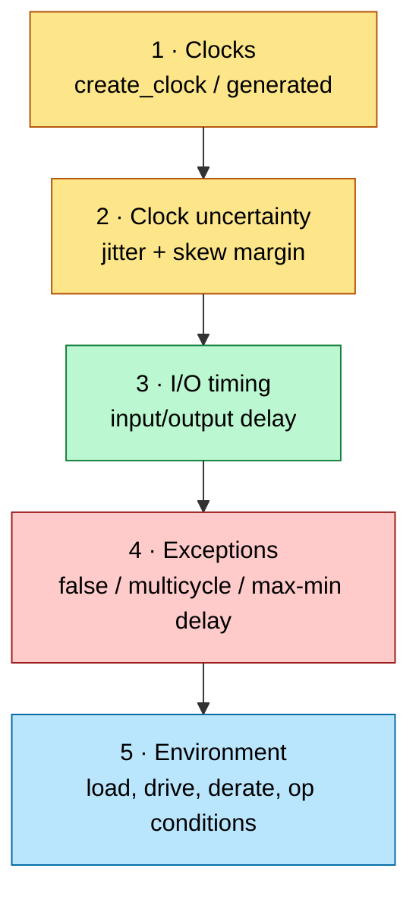
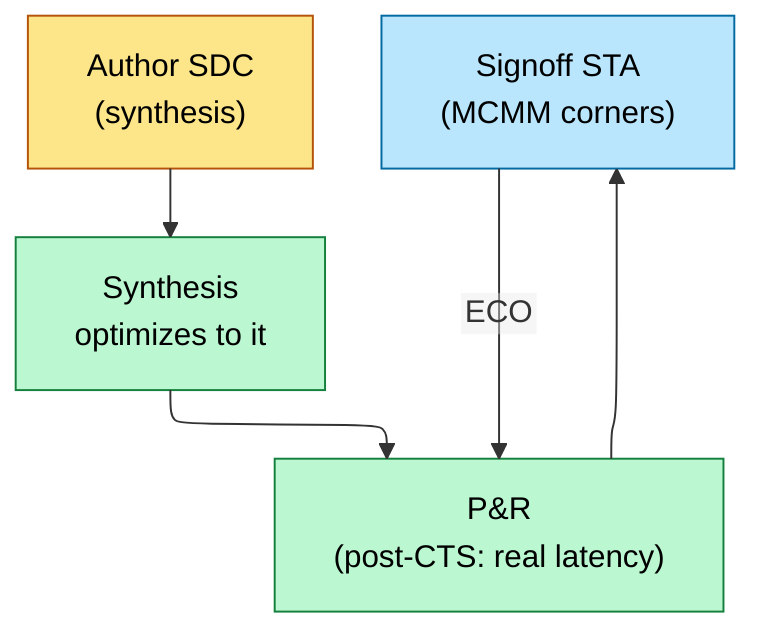

# Constraints (SDC) — Telling the Tools What "Correct Timing" Means

> **Stage:** 04 · Synthesis (authored here, consumed through [backend](../05_Backend_Physical_Design/01_Physical_Design.md) and [signoff](../06_Signoff/01_STA.md)). The Synopsys Design Constraints file is the single most leveraged artifact in the flow: it defines clocks, I/O timing, and exceptions for every downstream tool.
> **Prerequisites:** [Synthesis_and_Optimization](01_Synthesis_and_Optimization.md), [STA](../06_Signoff/01_STA.md) (which consumes SDC). **Hands off to:** synthesis, P&R, STA.

---

## 0. Why this page exists

Synthesis, place-and-route, and STA are all just optimization/checking engines — they only know what "good timing" means because **you told them**, in SDC. An unconstrained path is an un-optimized, un-checked path; an over-constrained path wastes area and power chasing timing that doesn't matter; a wrongly-declared false path *hides a real violation* that surfaces in silicon. SDC bugs are silent and expensive. This page covers the core SDC commands, the four exception types, and the discipline that keeps constraints correct across the flow. (STA *interprets* these; here we focus on *authoring* them.)

---

## 1. The five things SDC must define



If these are right, the tools optimize the right thing; if not, everything downstream inherits the error.

---

## 2. Clocks — the foundation

```tcl
# Primary clock: 1 GHz on port clk
create_clock -name clk -period 1.000 [get_ports clk]

# Generated clock: a /2 divider output is a derived clock, not a new primary
create_generated_clock -name clk_div2 -source [get_pins div_reg/Q] \
    -divide_by 2 [get_pins div_reg/Q]

# Uncertainty = jitter + (pre-CTS) estimated skew + margin
set_clock_uncertainty -setup 0.080 [get_clocks clk]
set_clock_uncertainty -hold  0.020 [get_clocks clk]
set_clock_latency 0.300 [get_clocks clk]   ;# pre-CTS estimate; real tree replaces it
```

- **Primary clocks** (`create_clock`) come in on a port/PLL output. **Generated clocks** (`create_generated_clock`) are *derived* — divided, multiplied, gated, or muxed — and MUST be declared, or STA mis-times every path they feed ([Clock_Division_and_Switching](../03_Frontend_RTL_and_Verification/04_Clock_Division_and_Switching.md)).
- **Uncertainty** models what STA can't yet know exactly: clock **jitter** plus, before CTS, an **estimated skew** budget. Post-CTS, real skew comes from the tree and uncertainty drops to jitter+margin.
- **Asynchronous clock groups**: `set_clock_groups -asynchronous` tells STA two clocks have no phase relationship, so it doesn't try to time paths between them (those are [CDC](../03_Frontend_RTL_and_Verification/07_Lint_CDC_RDC_Signoff.md) paths handled structurally, not by STA).

### 2.1 create_clock

```tcl
# Basic clock: 500 MHz, 50% duty cycle
create_clock -name sys_clk -period 2.0 [get_ports clk]
#             ^name         ^2ns=500MHz  ^clock source pin

# Clock with non-50% duty cycle (60% high, 40% low)
create_clock -name asym_clk -period 10.0 -waveform {0 6.0} [get_ports clk2]
#                                         ^rise at 0, fall at 6ns
#                                          → 60% duty cycle

# Multi-frequency waveform (e.g., DDR clock with different high/low times)
# Period = 2.5ns, waveform specifies rise/fall/rise edges explicitly
# Creates a clock with 0.8ns high, 1.7ns low (non-symmetric)
create_clock -name ddr_clk -period 2.5 -waveform {0.0 0.8} [get_ports ddr_clk_p]

# Multi-edge clock (e.g., custom waveform with 4 edges per period)
# For a clock that rises at 0, falls at 1.5, rises at 2.5, falls at 3.0
# Period = 4ns: two pulses per period (double-pulse clock)
create_clock -name custom_2pulse -period 4.0 -waveform {0.0 1.5 2.5 3.0} [get_ports clk_custom]
# The waveform list specifies edge times within one period: {rise fall rise fall ...}

# Virtual clock (no physical source pin -- for IO delay constraints)
create_clock -name vclk_ext -period 5.0
# No [get_ports ...] → virtual clock
# Used as reference for set_input_delay / set_output_delay
# when the external interface clock is not a port of this block
```

**When to use virtual clocks:**
- Constraining IO timing when the external clock is not a port of the block
- Specifying interface timing to an external chip or FPGA
- Creating a reference for IO timing that differs from the internal clock

### 2.2 create_generated_clock

```tcl
# Divide-by-2 clock from a flip-flop
create_generated_clock -name clk_div2 \
    -source [get_ports clk] \
    -divide_by 2 \
    [get_pins div_ff/Q]

# Multiply-by-3 (PLL output)
create_generated_clock -name pll_clk_3x \
    -source [get_pins pll/clk_in] \
    -multiply_by 3 \
    [get_pins pll/clk_out]

# Edge-based definition (for complex waveforms)
# Source clock: period=10, edges at 0,5,10,15,20...
# Generated clock uses source edges 1,3,5 (= times 0,10,20)
# → period = 20ns (divide by 2)
create_generated_clock -name clk_div2_edges \
    -source [get_ports clk] \
    -edges {1 3 5} \
    [get_pins mux/Y]

# Edge with shift (for phase-shifted clocks)
create_generated_clock -name clk_shifted \
    -source [get_ports clk] \
    -edges {1 2 3} \
    -edge_shift {0 0 0} \
    [get_pins buf/Y]
# edge_shift adds delay to each edge: {rise_shift fall_shift next_rise_shift}
```

**Why generated clocks matter:** The synthesis and STA tools must know the
exact phase relationship between clocks. Generated clocks maintain a defined
relationship to their source, enabling proper inter-clock timing analysis.
If you define a divided clock as `create_clock` instead of
`create_generated_clock`, the tool treats it as asynchronous to the source --
wrong!

### 2.3 set_clock_uncertainty

```tcl
# Setup uncertainty (pessimistic -- adds to required time)
set_clock_uncertainty -setup 0.15 [get_clocks sys_clk]
# Tsetup_slack = T_required - T_arrival
# T_required = T_period - T_setup - T_uncertainty
# → uncertainty REDUCES available timing margin

# Hold uncertainty
set_clock_uncertainty -hold 0.05 [get_clocks sys_clk]
# Adds margin to hold check

# Inter-clock uncertainty (between two different clocks)
set_clock_uncertainty -setup 0.25 \
    -from [get_clocks clk_a] \
    -to [get_clocks clk_b]
# Accounts for PLL jitter, clock tree skew mismatch, etc.

# Pre-CTS vs Post-CTS:
# Pre-CTS:  uncertainty = jitter + estimated_skew (larger, ~200-300ps)
# Post-CTS: uncertainty = jitter only (skew is actual, ~50-100ps)
```

**Typical values:**

```ascii-graph
  Component              Value (7nm example)
  ─────────────────────  ──────────────────
  PLL jitter             20-50 ps
  Pre-CTS clock skew     100-200 ps (estimated)
  Post-CTS residual skew 10-30 ps
  OCV derating           Applied separately (not in uncertainty)
  
  Pre-CTS setup uncertainty ≈ 150-250 ps
  Post-CTS setup uncertainty ≈ 50-80 ps
```

### 2.4 set_clock_latency

```tcl
# Source latency: delay from actual clock source to clock definition point
# (e.g., delay through PLL, off-chip oscillator to chip pin)
set_clock_latency -source -max 1.5 [get_clocks sys_clk]
set_clock_latency -source -min 1.2 [get_clocks sys_clk]

# Network latency: delay from clock definition point to flip-flop clock pins
# (estimated pre-CTS, replaced by actual propagated latency post-CTS)
set_clock_latency -max 0.8 [get_clocks sys_clk]    ;# network latency (default)
set_clock_latency -min 0.6 [get_clocks sys_clk]

# Post-CTS: set_propagated_clock replaces network latency with actual delays
set_propagated_clock [get_clocks sys_clk]
```

### 2.5 set_clock_groups

```tcl
# ──────────────────────────────────────────────────────
# ASYNCHRONOUS: clocks exist simultaneously, no phase relationship
# ──────────────────────────────────────────────────────
set_clock_groups -asynchronous \
    -group [get_clocks {sys_clk pll_clk_div2}] \
    -group [get_clocks {usb_clk}] \
    -group [get_clocks {pcie_clk}]
# No timing paths analyzed between groups
# Both clock trees ARE built (physical coexistence)
# Used for: truly independent clock sources

# ──────────────────────────────────────────────────────
# PHYSICALLY EXCLUSIVE: clocks CANNOT coexist on silicon
# ──────────────────────────────────────────────────────
set_clock_groups -physically_exclusive \
    -group [get_clocks func_clk] \
    -group [get_clocks test_clk]
# These are MUX-selected: only one reaches the clock tree at a time
# CTS can share resources between them
# Used for: clock MUX alternatives (test vs functional)

# ──────────────────────────────────────────────────────
# LOGICALLY EXCLUSIVE: both physically present but functionally exclusive
# ──────────────────────────────────────────────────────
set_clock_groups -logically_exclusive \
    -group [get_clocks mode_a_clk] \
    -group [get_clocks mode_b_clk]
# Both clock trees exist physically
# But design ensures only one is active via mode register
# CTS must build both trees independently
# Used for: mode-selected clocks where both propagate but only one is used
```

**Critical differences summary:**

```ascii-graph
  ┌──────────────────────┬──────────────┬──────────────┬──────────────┐
  │ Property             │ Asynchronous │ Phys Excl    │ Logic Excl   │
  ├──────────────────────┼──────────────┼──────────────┼──────────────┤
  │ Both on silicon?     │ YES          │ NO           │ YES          │
  ├──────────────────────┼──────────────┼──────────────┼──────────────┤
  │ Timing between?      │ NO           │ NO           │ NO           │
  ├──────────────────────┼──────────────┼──────────────┼──────────────┤
  │ Share CTS resources? │ NO           │ YES          │ NO           │
  ├──────────────────────┼──────────────┼──────────────┼──────────────┤
  │ SI/Crosstalk analysis│ YES          │ NO           │ YES          │
  │ between groups?      │              │              │              │
  ├──────────────────────┼──────────────┼──────────────┼──────────────┤
  │ Typical use case     │ Independent  │ Test vs func │ Config-mode  │
  │                      │ PLLs         │ clock mux    │ selected     │
  └──────────────────────┴──────────────┴──────────────┴──────────────┘
```

---

## 3. I/O timing — constraining the block boundary

A block doesn't know its neighbors' timing, so you model them:

```tcl
# Input: external logic launches data 0.4 ns after clk; budget the rest for our setup
set_input_delay  -clock clk 0.400 [get_ports data_in]
# Output: external flop needs data 0.3 ns before its clk edge
set_output_delay -clock clk 0.300 [get_ports data_out]
```

`set_input_delay` says "data arrives this late relative to the clock," leaving the remaining period for internal logic + setup. `set_output_delay` reserves time for the downstream flop's setup. Get these wrong and the block closes timing in isolation but fails at integration. **Budgeting** I/O delays across block boundaries so the pieces sum to the period is a core SoC discipline.

### 3.1 set_input_delay / set_output_delay

```tcl
# ──────────────────────────────────────────────────────
# set_input_delay: time from clock edge to data arriving at input port
# ──────────────────────────────────────────────────────

# Standard input delay
set_input_delay -clock sys_clk -max 1.2 [get_ports data_in]
set_input_delay -clock sys_clk -min 0.3 [get_ports data_in]
# -max used for setup analysis, -min for hold analysis

# DDR interface: data valid on both clock edges
set_input_delay -clock ddr_clk -max 0.8 [get_ports ddr_data]
set_input_delay -clock ddr_clk -max 0.8 -clock_fall -add_delay [get_ports ddr_data]
# -clock_fall: referenced to falling edge
# -add_delay: ADD this constraint (don't replace the rising edge one)

# ──────────────────────────────────────────────────────
# set_output_delay: time required at output port BEFORE next clock edge
# ──────────────────────────────────────────────────────

set_output_delay -clock sys_clk -max 1.0 [get_ports data_out]
set_output_delay -clock sys_clk -min 0.2 [get_ports data_out]
# -max: setup requirement at receiving end
# -min: hold requirement at receiving end
```

**Understanding the timing budget:**

```ascii-graph
  For input path:
  ═══════════════════════════════════════════════════
  
  External          │        This Block
  ──────────────────┼──────────────────────────────
                    │
  [ext_FF] ──delay──┼──> [input port] ──> [comb] ──> [int_FF]
                    │
  ←── input_delay ──→←── available for internal logic ──→
                    
  T_internal_max = T_period - input_delay_max - setup_time - uncertainty

  Example: period=2ns, input_delay_max=1.2ns, setup=0.05ns, uncertainty=0.1ns
  T_internal_max = 2.0 - 1.2 - 0.05 - 0.1 = 0.65 ns for internal logic


  For output path:
  ═══════════════════════════════════════════════════
  
  This Block                │        External
  ──────────────────────────┼──────────────────────
                            │
  [int_FF] ──> [comb] ──> [output port] ──delay──> [ext_FF]
                            │
  ←── available ──→←── output_delay ──→
  
  T_internal_max = T_period - output_delay_max - setup_time - uncertainty
```

---

## 4. Timing exceptions — the dangerous, powerful four

Exceptions tell STA *not* to apply the default single-cycle setup/hold check. Each is a sharp tool:

| Exception | Meaning | Use | Danger |
|---|---|---|---|
| **false_path** | "never time this path" | CDC crossings, test-only paths, static config | hides a *real* path → silicon fail |
| **multicycle_path** | "this path has N cycles, not 1" | slow datapath fed by an enable every N cycles | wrong N → setup *or* hold breaks |
| **max_delay / min_delay** | absolute path delay bound | custom/async paths STA can't infer | overrides normal checks |
| **set_disable_timing** | break a timing arc | unused arcs | over-disabling hides paths |

```tcl
set_false_path -from [get_clocks clk_a] -to [get_clocks clk_b]   ;# async CDC
set_multicycle_path 3 -setup -from [get_pins mac/*] -to [get_pins acc/*]
set_multicycle_path 2 -hold  -from [get_pins mac/*] -to [get_pins acc/*]  ;# the matching hold!
```

**The multicycle trap:** declaring `-setup 3` without the matching `-hold 2` is the classic bug — you relax the setup check but leave the hold check expecting same-cycle, which is now *wrong* and can fail silicon. Setup MCP of N almost always needs hold MCP of N−1.

**The false-path trap:** a false path is a *promise to the tool* that data never functionally propagates there. If that promise is wrong, STA never checks a path that's actually active → guaranteed escape. False paths are reviewed like waivers.

### 4.1 set_false_path

```tcl
# Between asynchronous clock domains (CDC paths)
set_false_path -from [get_clocks clk_a] -to [get_clocks clk_b]
set_false_path -from [get_clocks clk_b] -to [get_clocks clk_a]

# Test mode paths (not functional timing-critical)
set_false_path -from [get_ports scan_enable]
set_false_path -from [get_ports test_mode]

# MUX-selected paths (only one active at a time)
set_false_path -from [get_cells mux_sel_reg] -to [get_cells output_reg]
# (if mux_sel is static configuration)

# Through specific pins
set_false_path -through [get_pins mux/S]
# Use -through carefully -- it can mask real paths

# Reset paths (async reset is not timing-critical for setup)
set_false_path -from [get_ports rst_n]
```

**When NOT to use false path:**
- Do NOT false-path CDC paths that need max_delay constraints for
  reconvergence or MTBF. Use set_max_delay -datapath_only instead.
- Do NOT false-path paths just because they have large slack -- they
  might become critical after optimization.

### 4.2 set_multicycle_path

This is the **most commonly misunderstood** SDC constraint.

```tcl
# Multicycle path: data takes N clock cycles to propagate
# DEFAULT: -setup 1 (single cycle), -hold 0

# Setup multicycle of 2: data is captured 2 cycles after launch
set_multicycle_path 2 -setup -from [get_cells reg_a] -to [get_cells reg_b]

# CRITICAL: Hold adjustment is almost always needed!
# Without hold adjustment, hold check moves to cycle (N-1) = 1
# This is usually wrong -- hold should be checked at the launch edge
set_multicycle_path 1 -hold -from [get_cells reg_a] -to [get_cells reg_b]
```

**Detailed timing diagram for multicycle = 2:**

```ascii-graph
  Clock period = T

  Launch edge    Capture edge (default)    Capture edge (MCP setup 2)
       │                  │                         │
       v                  v                         v
  ───┐    ┌────┐    ┌────┐    ┌────┐    ┌────┐    ┌────┐
     └────┘    └────┘    └────┘    └────┘    └────┘    └──
       0        T        2T        3T        4T       
       ^                  ^                   ^
    Launch             Default              MCP=2
    edge              capture             capture
                      (1 cycle)           (2 cycles)

  Setup check with MCP=2:
    Data must arrive by 2T - Tsetup (instead of T - Tsetup)
    Available time = 2T (twice as much slack!)

  Hold check WITHOUT -hold adjustment:
    Hold check moves to: capture_edge - (N-1)*T = 2T - 1*T = T
    This means hold is checked at edge T, not edge 0!
    → The tool requires data to be stable past edge T
    → This is overly pessimistic and often creates violations

  Hold check WITH "set_multicycle_path 1 -hold":
    Hold check: capture_edge - N_hold*T = 2T - 1*T = T
    Wait, the -hold N means subtract N from the capture edge for hold:
    
    Correct formula:
      Setup capture edge = launch_edge + N_setup * T
      Hold check edge = setup_capture_edge - N_hold * T
    
    Default: N_setup=1, N_hold=0 → hold at launch_edge + T - 0 = launch+T
    NO! Let me be precise:

    For MCP setup=2, hold=1:
      Setup check: launch + 2T (data must arrive before this)
      Hold check:  launch + 2T - 1T = launch + T
      
    Hmm, still at T. For most multicycle paths, we want hold at launch edge:
      set_multicycle_path 2 -setup → capture at launch + 2T
      set_multicycle_path 1 -hold  → hold at launch + 2T - 1*T = launch + T
    
    Still not at launch edge. Need:
      set_multicycle_path 2 -hold → hold at launch + 2T - 2T = launch
      NO -- -hold value cannot exceed -setup value minus 1... actually:

  CORRECT RULE:
  ─────────────────────────────────────────────────────────
  Setup MCP = N means: capture edge = launch + N * T
  Hold MCP = M means:  hold check edge = (launch + N*T) - M*T = launch + (N-M)*T

  To check hold at the launch edge: M = N → but convention is M = N-1:
    set_multicycle_path N -setup
    set_multicycle_path (N-1) -hold
    → hold at launch + (N - (N-1))*T = launch + T

  That's checking hold one cycle after launch -- the standard convention.
  To check at launch edge exactly, use M = N:
    set_multicycle_path N -hold (same as -setup value)
    → hold at launch + (N-N)*T = launch edge

  INDUSTRY STANDARD PRACTICE:
    set_multicycle_path N -setup -from A -to B
    set_multicycle_path (N-1) -hold -from A -to B
    
  This gives:
    Setup: N cycles of timing budget
    Hold: checked 1 cycle after launch (safe for most designs)
  ─────────────────────────────────────────────────────────
```

**Worked example:**

```tcl
  Clock period = 2 ns (500 MHz)
  MCP = 3 (data valid every 3rd cycle)

  set_multicycle_path 3 -setup -from [get_cells slow_reg] -to [get_cells fast_reg]
  set_multicycle_path 2 -hold  -from [get_cells slow_reg] -to [get_cells fast_reg]

  Setup budget: 3 x 2ns = 6ns (minus setup time and uncertainty)
  Hold check: at launch + (3-2)*2ns = launch + 2ns

  If combinational delay from slow_reg to fast_reg = 4.5 ns:
    Setup slack = 6.0 - 0.05 - 0.1 - 4.5 = 1.35 ns ✓ (positive = good)
    Without MCP: slack = 2.0 - 0.05 - 0.1 - 4.5 = -2.65 ns ✗ (violation!)
```

### 4.3 set_max_delay / set_min_delay

```tcl
# For CDC paths where you need bounded delay (not false path)
set_max_delay 3.0 -datapath_only \
    -from [get_cells cdc_src_reg] \
    -to [get_cells cdc_dst_reg]

# -datapath_only: ignores clock path delays in the calculation
# This is CRITICAL for CDC -- you want to constrain only the
# data path delay, not include clock skew effects

# Without -datapath_only:
#   max_delay check includes: clock_path_to_launch + data_delay - clock_path_to_capture
# With -datapath_only:
#   max_delay check: data_delay only (what we want for CDC)

set_min_delay 0.5 \
    -from [get_cells fast_reg] \
    -to [get_cells slow_reg]
# Ensures minimum propagation delay (used for pulse-width guarantees, etc.)
```

### 4.4 set_case_analysis

```tcl
# Fix a pin to a constant value for mode-specific analysis
set_case_analysis 0 [get_ports test_mode]
# All paths through test_mode=0 branch are analyzed
# Paths through test_mode=1 branch are blocked

set_case_analysis 1 [get_ports func_mode_sel]

# Useful for:
# - Analyzing specific operating modes
# - Fixing clock MUX selects during functional analysis
# - Setting configuration pins to their functional values
```

### 4.5 set_disable_timing

```tcl
# Break a timing arc through a cell
set_disable_timing [get_cells clk_mux] -from S -to Y
# Disables the select-to-output arc of the mux
# Still allows input-to-output arcs

# Use case: MUX with slow select signal that doesn't affect data timing
# Warning: can hide real timing problems -- use sparingly
```

---

## 5. Operating conditions, derates, and modes

- **Corners / op-conditions**: constrain across **PVT** (process/voltage/temperature) — slow corner for setup, fast corner for hold ([STA](../06_Signoff/01_STA.md)).
- **Derates** (`set_timing_derate`): OCV/AOCV/POCV pessimism for on-chip variation.
- **Modes**: a chip has multiple functional + test modes (mission, scan-shift, at-speed) each with its own clocks/constraints → **MCMM** (multi-corner multi-mode) runs them all. The SDC is written per-mode; signoff covers the cross-product.

### 5.1 Design Rule Violation (DRV) Constraints

```tcl
# Maximum transition time (slew) on any net
set_max_transition 0.2 [current_design]
# No signal should take > 200ps to transition
# Violated: long wires, high fanout, weak drivers

# Maximum capacitance on any output pin
set_max_capacitance 0.1 [current_design]
# In pF -- limits load on any driver
# Violated: many loads on one net

# Maximum fanout
set_max_fanout 20 [current_design]
# No output should drive > 20 loads
# Tool inserts buffers to fix

# These are checked as constraints during compile:
# report_constraint -all_violators shows DRV violations
```

### 5.2 set_ideal_network / set_dont_touch

```tcl
# set_ideal_network: treat a net as having zero delay and infinite drive strength
# Used pre-CTS for clock networks (before real clock tree is built)
set_ideal_network [get_ports clk]
set_ideal_network [get_nets -of_objects [get_pins pll/clk_out]]
# Effect: no wire RC, no transition degradation, no insertion delay
# Must be REMOVED after CTS so real delays are propagated

# set_dont_touch: prevent synthesis from modifying a cell, net, or hierarchy
set_dont_touch [get_cells hardened_ip/*]
set_dont_touch [get_nets analog_net]
set_dont_touch [get_designs verified_submodule]
# Tool will NOT: optimize, buffer, resize, or restructure this object
# Use for: hand-crafted analog/mixed-signal blocks, pre-verified IP, debug structures
# WARNING: overuse prevents optimization -- apply only where necessary
```

---

## 5B. Complete worked SDC — 3-clock-domain SoC

```tcl
# ================================================================
# SDC for a 3-clock-domain SoC with DDR and SPI interfaces
# ================================================================

# ──────── Clock Definitions ────────

# Core clock: 1 GHz
create_clock -name core_clk -period 1.0 [get_ports clk_core]

# Peripheral clock: 200 MHz (from PLL, divided from core)
create_generated_clock -name peri_clk \
    -source [get_pins pll/clk_out] \
    -divide_by 5 \
    [get_pins peri_clk_div/Q]

# DDR clock: 800 MHz (from PLL)
create_generated_clock -name ddr_clk \
    -source [get_pins pll/clk_out] \
    -multiply_by 4 -divide_by 5 \
    [get_pins ddr_pll/clk_out]

# Virtual clock for SPI interface (external, 50 MHz)
create_clock -name spi_vclk -period 20.0

# Test clock (physically exclusive with core_clk)
create_clock -name test_clk -period 10.0 [get_ports tck]

# ──────── Clock Relationships ────────

# Core and peripheral are synchronous (same PLL source)
# → no special constraint needed, tool will analyze

# DDR clock is asynchronous to core (different PLL output)
set_clock_groups -asynchronous \
    -group [get_clocks {core_clk peri_clk}] \
    -group [get_clocks ddr_clk]

# Test clock physically exclusive with functional clocks
set_clock_groups -physically_exclusive \
    -group [get_clocks test_clk] \
    -group [get_clocks {core_clk peri_clk ddr_clk}]

# ──────── Clock Uncertainty ────────

# Pre-CTS (larger margin for estimated skew)
set_clock_uncertainty -setup 0.15 [get_clocks core_clk]
set_clock_uncertainty -hold  0.05 [get_clocks core_clk]
set_clock_uncertainty -setup 0.10 [get_clocks peri_clk]
set_clock_uncertainty -hold  0.03 [get_clocks peri_clk]
set_clock_uncertainty -setup 0.12 [get_clocks ddr_clk]
set_clock_uncertainty -hold  0.04 [get_clocks ddr_clk]

# Inter-clock uncertainty (core ↔ peripheral)
set_clock_uncertainty -setup 0.20 \
    -from [get_clocks core_clk] -to [get_clocks peri_clk]
set_clock_uncertainty -setup 0.20 \
    -from [get_clocks peri_clk] -to [get_clocks core_clk]

# ──────── Clock Latency ────────

set_clock_latency -source -max 0.5 [get_clocks core_clk]
set_clock_latency -source -min 0.3 [get_clocks core_clk]
set_clock_latency 0.6 [get_clocks core_clk]   ;# estimated network latency

# ──────── IO Constraints ────────

# DDR data interface (both edges)
set_input_delay -clock ddr_clk -max 0.4 [get_ports ddr_dq[*]]
set_input_delay -clock ddr_clk -min 0.1 [get_ports ddr_dq[*]]
set_input_delay -clock ddr_clk -max 0.4 -clock_fall -add_delay [get_ports ddr_dq[*]]
set_input_delay -clock ddr_clk -min 0.1 -clock_fall -add_delay [get_ports ddr_dq[*]]

set_output_delay -clock ddr_clk -max 0.3 [get_ports ddr_dq[*]]
set_output_delay -clock ddr_clk -min 0.05 [get_ports ddr_dq[*]]
set_output_delay -clock ddr_clk -max 0.3 -clock_fall -add_delay [get_ports ddr_dq[*]]
set_output_delay -clock ddr_clk -min 0.05 -clock_fall -add_delay [get_ports ddr_dq[*]]

# SPI interface (referenced to virtual clock)
set_input_delay -clock spi_vclk -max 8.0 [get_ports spi_miso]
set_input_delay -clock spi_vclk -min 1.0 [get_ports spi_miso]
set_output_delay -clock spi_vclk -max 6.0 [get_ports {spi_mosi spi_cs_n}]
set_output_delay -clock spi_vclk -min 1.0 [get_ports {spi_mosi spi_cs_n}]

# General IO
set_input_delay -clock core_clk -max 0.5 [get_ports gpio_in[*]]
set_output_delay -clock core_clk -max 0.5 [get_ports gpio_out[*]]

# ──────── False Paths ────────

set_false_path -from [get_ports rst_n]
set_false_path -from [get_ports test_mode]

# CDC false paths (handled by synchronizers, constrained with max_delay)
# Don't false-path if you need max_delay for reconvergence!

# ──────── CDC Max Delay ────────

set_max_delay 1.5 -datapath_only \
    -from [get_clocks core_clk] -to [get_clocks ddr_clk]
set_max_delay 1.5 -datapath_only \
    -from [get_clocks ddr_clk] -to [get_clocks core_clk]

# ──────── Multicycle Paths ────────

# Slow config registers: written by peri_clk, stable for 4 core_clk cycles
set_multicycle_path 4 -setup \
    -from [get_cells config_regs/*] -to [get_cells core_logic/*]
set_multicycle_path 3 -hold \
    -from [get_cells config_regs/*] -to [get_cells core_logic/*]

# ──────── Mode Analysis ────────

set_case_analysis 0 [get_ports test_mode]
set_case_analysis 0 [get_ports scan_enable]

# ──────── Design Rules ────────

set_max_transition 0.15 [current_design]
set_max_capacitance 0.08 [current_design]
set_max_fanout 30 [current_design]

# ──────── Operating Conditions ────────

set_operating_conditions -max ss_0p72v_m40c -min ff_0p88v_125c
# Worst-case (slow) for setup, best-case (fast) for hold
```

---

## 6. SDC discipline across the flow



The **same constraint intent** flows through every tool — but evolves: pre-CTS uses estimated clock latency/uncertainty; post-CTS, real CTS results replace the estimates and uncertainty shrinks to jitter. Keeping SDC consistent and reviewed (especially exceptions) is a project-long job; an unreviewed `set_false_path` is a latent tape-out bug.

---

## 7. Numbers / rules to memorize

| Rule | Why |
|---|---|
| declare **every** generated/divided/gated clock | else STA mis-times its fanout |
| setup MCP N ⟹ hold MCP **N−1** | the #1 multicycle bug |
| false_path = promise it's functionally dead | wrong promise = silicon escape |
| `set_clock_groups -asynchronous` for CDC | don't time async crossings in STA |
| pre-CTS: estimated latency/uncertainty; post-CTS: real | uncertainty → jitter+margin |
| budget I/O delays across block boundaries | pieces must sum to the period |
| constrain across PVT corners (setup=slow, hold=fast) | one SDC, many corners (MCMM) |

---

## Cross-references
- Consumed by: [STA](../06_Signoff/01_STA.md) (timing signoff), [Physical_Design](../05_Backend_Physical_Design/01_Physical_Design.md).
- Produced from: [Synthesis_and_Optimization](01_Synthesis_and_Optimization.md) — the command-level SDC reference on this page was moved here from its §2.
- Worked signoff-side walkthrough of a complete SDC on a realistic SoC block: [STA](../06_Signoff/01_STA.md) §10. Clocks: [Clock_Division_and_Switching](../03_Frontend_RTL_and_Verification/04_Clock_Division_and_Switching.md). Async groups → [Lint_CDC_RDC_Signoff](../03_Frontend_RTL_and_Verification/07_Lint_CDC_RDC_Signoff.md).
