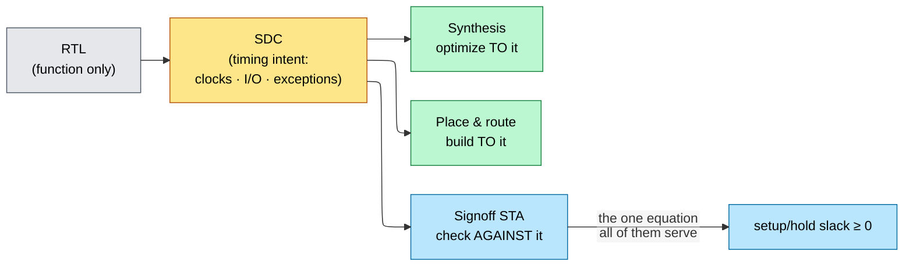

# Timing Constraints (SDC) — The Formal Specification of Timing Intent

> **Stage:** 04 · Synthesis. SDC is authored here and then read *unchanged* by every downstream engine — synthesis, place-and-route, and signoff STA all optimize and check against this one file.
> **Prerequisites:** [Synthesis_and_Optimization](01_Synthesis_and_Optimization.md) (the first tool that consumes these constraints), [STA](../06_Signoff/01_STA.md) (the setup/hold inequality every constraint feeds).
> **Hands off to:** synthesis, place-and-route, and STA — the three tools that trust this file blindly.

---

## 0. Why this page exists

RTL fixes *what* the hardware computes and where the flop boundaries sit — but a netlist has no inherent frequency, no notion of when `data_in` is valid relative to `clk`, and no idea that the scan-mux leg never toggles in mission mode. All of that is **timing intent**: information that lives outside the logic function and cannot be recovered from it. SDC (Synopsys Design Constraints) is the file where that intent is written down formally, in one language that synthesis, place-and-route (PnR), and static timing analysis (STA) all read.

Because those tools have no other source of timing truth, they trust SDC **completely**. That makes it the single highest-leverage file in the flow — it steers every optimization and every signoff decision — and simultaneously the most dangerous, because one wrong line silently redefines "correct" for every tool at once, and there is no testbench that catches it. The failure is two-sided, and both sides are expensive:

- **Under-constrain** (a missing clock, a missing I/O delay, a false path that isn't false) → a real path is never checked → the tools report *clean* and the chip fails in silicon.
- **Over-constrain** (period too tight, pessimistic uncertainty, an async clock pair left un-grouped) → the tools burn area and power chasing margin that doesn't exist, or grind against a path that can never close.

This page derives each SDC construct from the *intent it captures*, shows how every construct sets one term of the STA setup/hold inequality, and treats the trade-offs and the "constraints are unverified source code" problem as first-class. It is deliberately **not** a command reference: the exhaustive command syntax lives in vendor SDC references, while the setup/hold inequality each construct feeds is derived in [STA](../06_Signoff/01_STA.md). Here we care about *why each construct must exist, and how it goes wrong.*

---

## 1. RTL says what, SDC says when — one contract, three consumers

Synthesis, PnR, and STA are not three views of timing; they are three engines executing the **same** intent file at different points in the flow. Synthesis maps and sizes logic to *meet* it, PnR places and routes to *keep* it, STA signs off *against* it. The constraint is a shared correctness contract, and its defining property is that all three read it identically — so a bug in it is not caught by cross-checking one tool against another. They are all wrong the same way, silently.



### 1.1 Every constraint sets a term of the setup/hold inequality

The thing all three tools ultimately serve is the per-path timing check derived in full in [STA §3](../06_Signoff/01_STA.md). Setup (can the data arrive *early enough* for the next capture edge?) and hold (does it stay stable *long enough* past the launch edge?):

$$
S_{setup} \;=\; T_{clk} + T_{skew} - t_{cq} - t_{comb} - t_{su} - t_{unc} \;\ge\; 0
$$

$$
S_{hold} \;=\; t_{cq}^{\min} + t_{comb}^{\min} - T_{skew} - t_{h} \;\ge\; 0
$$

where $T_{clk}$ = clock period, $T_{skew} = T_{cap}-T_{launch}$ = capture-minus-launch clock-network delay, $t_{cq}$ = launch flop clock-to-Q, $t_{comb}$ = combinational path delay, $t_{su}/t_{h}$ = capture flop setup/hold, $t_{unc}$ = clock uncertainty. **Nothing in the RTL sets any of these.** SDC does — each construct is just a way to fill in one term, or to declare that a path should not be evaluated at all:

| STA-inequality term | The intent it encodes | SDC construct that sets it |
|---|---|---|
| $T_{clk}$ | how fast this clock runs | `create_clock` / `create_generated_clock` (× $N$ under a multicycle path) |
| $T_{skew}$ | capture-vs-launch clock arrival | `set_clock_latency` (pre-CTS estimate) → propagated latency (post-CTS) |
| $t_{unc}$ | jitter + skew margin the check must survive | `set_clock_uncertainty` |
| external launch/capture | the neighbor's clk→Q / setup *outside* the block | `set_input_delay` / `set_output_delay` |
| whether the path is checked at all | "this path is not real / gets $N$ cycles" | `set_false_path`, `set_clock_groups`, `set_multicycle_path`, `set_max_delay` |

Read the rest of this page as: for each row, *what is the intent, why can't the tool infer it, and what breaks if the number is wrong.* One structural fact to carry through — **hold has no $T_{clk}$ term.** It is a same-edge check. That single asymmetry is why multicycle paths (§4.2) are subtle and why relaxing setup silently breaks hold.

---

## 2. Clocks: the reference frame every path is measured against

A path's slack is meaningless until you name the edge that launches it and the edge that captures it. The clock definition **is** that coordinate system: it supplies $T_{clk}$ and the edge phases that every arrival/required time is measured against. An endpoint with no clock reaching it has no required time — it is simply *not checked*. So the first job of SDC is to make sure every sequential element is reachable from a defined clock.

```tcl
create_clock -name clk -period 1.0 [get_ports clk]           ;# the reference: 1 GHz, 50% duty
create_generated_clock -name clk_div2 -source [get_ports clk] \
    -divide_by 2 [get_pins div_reg/Q]                        ;# a DERIVED clock — must be declared
```

- **Primary clocks** (`create_clock`) enter on a port or PLL output and carry the period + waveform — the raw reference. A non-50 % or multi-edge waveform is just a different set of edge phases; the concept is unchanged.
- **Generated clocks** (`create_generated_clock`) are *derived* — divided, multiplied, gated, or muxed from a source.

### 2.1 Why a generated clock must be declared

A divider output is a genuine clock with its own period and a fixed *phase relationship* to its source. The tool needs that relationship to do two things: give the divider's fanout a capture clock at all (otherwise those endpoints are unconstrained and silently un-checked), and time paths that cross between the source and the divided domain with the correct edge alignment (a $\div 2$ launch edge lines up with only every other source edge). The dangerous mistake is to declare the divided clock as a fresh `create_clock` primary: now the tool has *no* phase relationship between it and the source, treats the crossing as unrelated, and mis-times every path between them — a real path either goes unchecked or is checked against the wrong edge. The relationship is derived from the divider RTL, but it is only *known to STA* once you declare it. (Divider/gater/mux structures: [Clock_Division_and_Switching](../03_Frontend_RTL_and_Verification/04_Clock_Division_and_Switching.md); the PLL that generates the source and the tree that distributes it: [PLL_DLL_and_Clock_Distribution](../03_Frontend_RTL_and_Verification/05_PLL_DLL_and_Clock_Distribution.md).)

### 2.2 Clock groups: telling the tool which clocks *don't* interact

Defining clocks builds the reference frame; clock groups define its **negative space** — pairs of clocks between which timing is meaningless and must not be attempted. Two *asynchronous* clocks (independent PLLs or crystals) have no fixed phase relationship: their edges drift to any relative offset over time, so there is no stable capture edge and the worst-case alignment makes any cross-domain path fail by construction. Timing it is not conservative — it is *wrong*, and it wastes the tool's effort forever on a path that can never close.

```tcl
set_clock_groups -asynchronous \
    -group [get_clocks core_clk] -group [get_clocks usb_clk]   ;# no timing analyzed between them
```

`set_clock_groups -asynchronous` tells STA to stop timing across the boundary (it is equivalent to a `false_path` in both directions between every clock pair in different groups). The crossing itself is then made safe **structurally** — with a synchronizer, handled by CDC review, not by STA ([Async_Design_and_CDC](../03_Frontend_RTL_and_Verification/06_Async_Design_and_CDC.md)). When a synchronizer's data path still needs a *bounded* transport delay (for reconvergence or MTBF), you constrain that with `set_max_delay -datapath_only` instead of fully removing the check.

The danger is again two-sided, and it is the whole reason clock relationships are reviewed: **forget** the group and STA chases an impossible async path — over-constraining, never closing, wasting PPA on something that isn't real; **wrongly** declare async between clocks that are actually synchronously related and a real, timeable path goes completely unchecked → silicon fail.

*Exclusive* groups are a related idea for clocks that never coexist because a mux selects between them (functional vs test). `-physically_exclusive` means only one physically reaches the tree, so clock-tree synthesis (CTS) may share resources and skip crosstalk between them; `-logically_exclusive` means both trees are physically built but design guarantees only one is active, so both are built and crosstalk is still analyzed. For the *functional* timing question — "should I time between them?" — all three (`-asynchronous`, physically/logically exclusive) answer *no*; the distinction only governs CTS resource sharing and signal-integrity analysis.

### 2.3 Uncertainty and latency: the terms that evolve across the flow

`set_clock_uncertainty` fills the $t_{unc}$ term — the margin the check must survive: jitter always, plus, *before CTS*, a budgeted estimate of the skew the real tree will introduce. `set_clock_latency` fills the pre-CTS estimate of $T_{skew}$'s constituents. Both are placeholders for physical facts that don't exist yet. After CTS, `set_propagated_clock` replaces the estimate with the tree's real delays, and uncertainty shrinks from *jitter + estimated skew* to *jitter + a small margin* (§7 has the numbers). The intent is constant; the *representation* of it tightens as the design becomes physical — the first instance of the evolution theme that §6 makes central.

---

## 3. I/O timing: modeling the world outside the block

A block's boundary paths — input port to first flop, last flop to output port — are only *half* a timing path. The other half (the driving flop upstream, or the receiving flop downstream) lives in a neighbor you are not synthesizing, so STA sees no launch flop for an input and no capture flop for an output. It cannot time half a path. `set_input_delay`/`set_output_delay` **model the missing half** as an abstract external delay relative to a reference clock.

```tcl
set_input_delay  -clock clk 0.40 [get_ports data_in]    ;# data arrives 0.40 ns after the edge
set_output_delay -clock clk 0.30 [get_ports data_out]   ;# receiver needs 0.30 ns before its edge
```

`set_input_delay` says "external logic already consumed this much of the period before the data reached my port" (it stands in for the upstream clk→Q + external combinational delay); the remainder of the period is your internal budget. `set_output_delay` reserves the far flop's setup + external delay at the output. The boundary budget is just the setup inequality restricted to the port:

$$
t_{comb}^{internal} \;\le\; T_{clk} - t_{io} - t_{su} - t_{unc}
$$

where $t_{io}$ = the input (or output) delay you declared. Get $t_{io}$ wrong and the block closes timing *in isolation* but fails at integration, because its budget didn't match the neighbor's reality. Making the boundary delays across adjacent blocks sum to the period — **budgeting** — is a core SoC discipline, and it is a negotiation: pessimistic I/O delays (assume a slow neighbor) over-constrain your own logic and waste area/power; optimistic ones under-constrain and break integration.

**Why virtual clocks.** The reference edge for a boundary path is whatever clock the *external* agent uses — and that clock is frequently not a port of your block (it clocks the neighbor, or lives at SoC top, and your block only receives data). You still need a named waveform to measure "0.40 ns after the edge" against. A **virtual clock** is a `create_clock` with no source object: a pure reference waveform, existing only to anchor I/O delays.

```tcl
create_clock -name vclk -period 5.0                      ;# no [get_ports] → virtual reference
set_input_delay -clock vclk -max 4.0 [get_ports spi_miso]
```

---

## 4. Timing exceptions: escape hatches from the single-cycle default

To time millions of paths tractably, STA applies **one** default rule everywhere: every path launches on an edge and is captured on the *very next* edge of the capture clock (single-cycle setup), with hold checked on the launch edge itself. That default is a *model*, and two classes of real path violate it. Exceptions are the escape hatches — and because each one *removes or relaxes a check*, each is also a way to hide a real bug.

Two levels of escape hatch, conceptually distinct:

- **Prune the graph** — before any path is timed. `set_case_analysis` fixes a pin to a constant (selecting a mode); constant propagation then deletes whole logic cones from analysis. `set_disable_timing` removes a specific timing arc through a cell. These change *what paths exist.*
- **Re-time paths that still exist** — the four true exceptions below. These change *how an existing path is checked.*

| Exception | Default assumption it overrides | Legitimate use | Failure mode |
|---|---|---|---|
| `set_false_path` | every structural path carries a real transition | mutually-exclusive mux legs, static config, reset, async crossings handled structurally | promises a *live* path is dead → check removed → silicon escape |
| `set_multicycle_path` | every path must settle in one period | slow datapath sampled every $N$ cycles | wrong $N$, or missing hold partner → setup *or* hold breaks |
| `set_max_delay` / `set_min_delay` | period-derived required time | custom/async paths STA can't infer (e.g. CDC datapath bound) | overrides the normal check with a hand number |
| `set_disable_timing` | the arc is real | genuinely unused arcs | over-disabling silently hides real paths |

### 4.1 False paths: a promise, not a fix

A false path is a structural path that exists in the netlist but through which **no real functional transition ever propagates end-to-end** — two mux legs that are never simultaneously selected, a quasi-static configuration register, a reset that is timed structurally, an async crossing already covered by a clock group. Timing such a path is worse than wasteful: the optimizer will spend area and buffering speeding up a path that never runs, distorting the real trade-off.

```tcl
set_false_path -from [get_clocks clk_a] -to [get_clocks clk_b]   ;# a PROMISE: never a real transition
```

The danger is that `set_false_path` is a *promise to the tool*, and the tool cannot verify it — it obeys. If the promise is wrong and the path is functionally active, STA silently skips a real check and you get a guaranteed escape. This is the **exception-abuse failure mode** in its purest form: the tempting move of pasting a `set_false_path` to make a stubborn violation disappear from the report. It works — the violation vanishes — but it has converted a *visible, fixable timing failure* into an *invisible functional bug in silicon.* False paths are therefore reviewed like waivers: each one is a claim about functionality that must be justified, not a knob.

### 4.2 Multicycle paths: relaxing setup drags hold with it

Some paths are functionally *allowed* more than one cycle: a slow multiplier whose result is only sampled every third cycle, a wide datapath behind an enable that pulses every $N$ cycles. The single-cycle default is simply too strict here — it would force the tool to close in one period a path the design gives $N$. `set_multicycle_path N -setup` moves the setup capture edge to $\text{launch} + N\cdot T_{clk}$, granting the path $N$ periods of budget.

The subtlety is the hold asymmetry from §1.1. Moving the *setup* capture edge out by $N$ makes STA reference the hold check one capture-cycle before that new edge — i.e. it drags the hold check to $\text{launch} + (N{-}1)\cdot T_{clk}$, demanding the launch flop hold its data stable for $N{-}1$ extra cycles. No ordinary logic can do that, so the hold check fails everywhere. The fix is to pull the hold check back to the launch edge with a matching hold exception:

$$
\text{hold check edge} \;=\; \text{launch} + (N_{setup} - 1 - N_{hold})\cdot T_{clk}
\;\;\Rightarrow\;\;
N_{hold} = N_{setup} - 1 \;\text{puts hold back on the launch edge.}
$$

where $N_{setup}$/$N_{hold}$ = the setup/hold multicycle multipliers (defaults 1 and 0). The default hold-edge already carries a built-in $-1$ (hold is one capture-cycle before the setup edge), which is exactly why a *bare* setup MCP leaves hold at $\text{launch}+(N{-}1)\cdot T_{clk}$ instead of at the launch edge.

```tcl
set_multicycle_path 3 -setup -from [get_pins mac/*] -to [get_pins acc/*]
set_multicycle_path 2 -hold  -from [get_pins mac/*] -to [get_pins acc/*]   ;# the mandatory N-1 partner
```

**Setup MCP of $N$ almost always needs hold MCP of $N{-}1$.** A bare `-setup 3` with no matching `-hold 2` is the single most common SDC bug: the setup relaxation is what you wanted, but the silently-moved hold check is now wrong and can fail silicon. (More multicycle scenarios and SDC recipes: [STA §5](../06_Signoff/01_STA.md).)

### 4.3 The exception algebra

When several exceptions touch one path, the tool resolves them by a fixed precedence — most-specific override wins:

$$
\texttt{false\_path} \;>\; \texttt{max/min\_delay} \;>\; \texttt{multicycle\_path} \;>\; \text{default single-cycle}
$$

and within a type, more specific object lists win, with `-from` > `-through` > `-to` as tie-breakers. This algebra is powerful and treacherous: piling on `-through` points narrows an exception until it is nearly impossible to read, and an exception written against a pin that optimization later renames or removes silently stops matching — doing *nothing* while looking authoritative. Every added exception raises the leverage of the file and lowers its verifiability, which is exactly the tension §5 and §6 are about.

---

## 5. The central trade-off: tight vs loose, and two ways to be wrong

Every constraint choice slides between two failure directions, and the two are **asymmetric** in how they hurt — which is the key to why the discipline is conservative.

| | Over-constrain (too tight) | Under-constrain (too loose) |
|---|---|---|
| Levers | period ↓, uncertainty pessimistic, I/O delays pessimistic, exceptions withheld | missing clock/group/I/O delay, false path that isn't false, wrong/absent MCP |
| What the tool does | spends area, power, buffers chasing margin that isn't there; may never converge on an impossible path | reports the path *clean* — it was never (correctly) checked |
| Cost | PPA — **visible** in area/power/timing reports, paid every die | a respin — **invisible** until silicon returns |
| When you learn | during closure | after tape-out |

The asymmetry is the whole point: over-constraining costs money you can *see and trade off*; under-constraining costs a respin you *cannot see until it is too late.* So the safe default is to let an unconstrained path be **checked** (tools flag unconstrained endpoints for this reason), and to treat every exception as a **waiver that removes a check** — reviewed, justified, and version-controlled rather than added freely.

Two named failure modes fall out of this frame:

- **Exception abuse** (§4.1) — silencing a real violation with a false path or MCP. It always trades a visible timing bug for an invisible functional one. The tell is an exception added *in response to a violation* rather than to a statement about functionality.
- **Complexity vs verifiability** — a giant SDC with thousands of interacting exceptions is not readable by inspection; no human can certify that no exception hides a live path. Past some size the constraint set itself becomes the risk, independent of the design — which forces constraints into their own verification problem.

The tight/loose knob is set per *domain*, not globally: a datapath deep in the branch-horizon of a slow interface can be loosened (real budget exists), while a source-synchronous DDR boundary is constrained tightly because its margin is genuinely small. Getting each domain's tightness to match its *real* budget — no tighter, no looser — is the craft.

---

## 6. Constraints as their own verification problem

SDC is source code that every downstream tool executes — but it ships with **no testbench.** A wrong constraint doesn't crash or produce a diff; it silently changes the definition of "correct," and every tool then agrees with it. So constraints need checking that is independent of the design, and this is a real signoff activity (constraint lint / consistency, e.g. Synopsys Formality- ESP / Cadence CCD-class checks).

What constraint validation looks for is exactly the silent failures above:

- **Unconstrained endpoints** — sequential elements with no clock, or ports with no I/O delay (the §5 under-constrain case made visible).
- **Non-propagating clocks** — a defined clock that never reaches its intended fanout because a `set_case_analysis` constant or a disabled arc blocks it.
- **Dead exceptions** — a `false_path`/MCP whose `-from/-through/-to` matches nothing (a renamed or optimized-away pin), so the exception silently does nothing.
- **Missing MCP hold partners** — a setup multicycle with no matching hold (§4.2), the highest-yield single check.
- **Conflicting / redundant exceptions** — overlaps the precedence algebra (§4.3) resolves, but perhaps not the way the author intended.

And because the *same intent* must survive synthesis → PnR → STA while its *representation* evolves (ideal → estimated → propagated clocks; uncertainty shrinking from estimated-skew to jitter+margin post-CTS; setup on the slow PVT corner, hold on the fast corner across the MCMM cross-product), the constraint must be checked for **consistency across the flow**, not just internally. An exception written against a pre-layout name that PnR renames stops applying — invisibly — unless something re-verifies it against the current netlist. This is why SDC is versioned, reviewed like RTL, and equivalence-checked between flow stages; an unreviewed `set_false_path` is a latent tape-out bug with no other line of defense.

---

## 7. Numbers and rules to memorize

| Rule | Why it bites |
|---|---|
| declare **every** generated / divided / gated / muxed clock | else its fanout is unconstrained, or timed against the wrong edge |
| setup MCP $N$ ⟹ hold MCP $N{-}1$ | a bare setup MCP silently drags the hold check $N{-}1$ cycles late → hold fails |
| `false_path` / async group = a **waiver**, not a fix | a wrong "it's dead" promise removes a real check → silicon escape |
| exception precedence: false > max/min > multicycle > default | overlaps resolve by this order, then `-from` > `-through` > `-to` specificity |
| async clock groups (or `max_delay -datapath_only`) for CDC | never let STA time an async crossing as though it were synchronous |
| budget I/O delays so the boundary sums to the period | a block clean in isolation still fails at integration if its budget was wrong |
| one SDC, many corners: setup = slow PVT, hold = fast PVT | MCMM signs off the cross-product of modes × corners |
| under-constrain > over-constrain in danger | over-constrain wastes visible PPA; under-constrain hides an invisible respin |

Quantitative margins (7 nm-class, for the $t_{unc}$ term):

| Quantity | Typical |
|---|---|
| PLL jitter | 20–50 ps |
| Pre-CTS setup uncertainty (jitter + estimated skew) | 150–250 ps |
| Post-CTS setup uncertainty (jitter + margin) | 50–80 ps |
| Post-CTS residual skew | 10–30 ps |

---

## 8. Worked problems

**1 — Multicycle setup/hold arithmetic.** Period $T_{clk}=2$ ns (500 MHz); a slow path is sampled every 3rd cycle, combinational delay $t_{comb}=4.5$ ns, $t_{su}=0.05$, $t_{unc}=0.1$. Apply `set_multicycle_path 3 -setup` and `2 -hold`. Setup budget = $3\times2 = 6$ ns, so setup slack $= 6 - 0.05 - 0.1 - 4.5 = 1.35$ ns ✓. Without the MCP the tool would enforce one cycle: $2 - 0.05 - 0.1 - 4.5 = -2.65$ ns ✗. With the `-hold 2` partner the hold check is pulled back to the launch edge ($\text{launch}+(3-1-2)\cdot T = \text{launch}+0$) — the ordinary single-cycle hold relationship the path already meets. Drop the `-hold 2` and the hold check sits at $\text{launch}+(3-1)\cdot T = \text{launch}+4$ ns, demanding two cycles of hold stability that no ordinary logic provides.

**2 — I/O budget at a boundary.** Period $T_{clk}=2$ ns, `set_input_delay -max 1.2`, $t_{su}=0.05$, $t_{unc}=0.1$. Internal combinational budget $= 2.0 - 1.2 - 0.05 - 0.1 = 0.65$ ns. If the neighbor is actually faster than assumed and really launches in 0.8 ns, the true budget is 1.05 ns — you *over-constrained* your logic by 0.4 ns and paid area/power for margin that didn't exist. If it is slower (1.5 ns) and you assumed 1.2, the path closes in your run and fails at integration — the §5 under-constrain trap.

---

## Cross-references

- **Down the stack (where the facts SDC encodes come from):** [PLL_DLL_and_Clock_Distribution](../03_Frontend_RTL_and_Verification/05_PLL_DLL_and_Clock_Distribution.md) (the PLL that makes the clock and the tree whose real latency replaces the §2.3 estimate), [Clock_Division_and_Switching](../03_Frontend_RTL_and_Verification/04_Clock_Division_and_Switching.md) (the dividers/gaters/muxes that become the generated clocks of §2.1), [Async_Design_and_CDC](../03_Frontend_RTL_and_Verification/06_Async_Design_and_CDC.md) (the async crossings that become the clock groups / `max_delay` of §2.2).
- **Up the stack (the tools that consume this file):** [Synthesis_and_Optimization](01_Synthesis_and_Optimization.md) (optimizes to it first), [Physical_Design](../05_Backend_Physical_Design/01_Physical_Design.md) (builds the real clock tree that turns estimated latency/uncertainty into propagated values), [STA](../06_Signoff/01_STA.md) (owns the setup/hold inequality of §3 and the multicycle proof of §6.2).
- **Adjacent / co-authored:** SDC is written alongside [Synthesis_and_Optimization](01_Synthesis_and_Optimization.md); its terms plug directly into the derivation in [STA §3](../06_Signoff/01_STA.md).

---

## References

1. S. Gangadharan and S. Churiwala, *Constraining Designs for Synthesis and Timing Analysis: A Practical Guide to Synopsys Design Constraints (SDC)*, Springer, 2013. The definitive treatment of SDC semantics and exception precedence.
2. J. Bhasker and R. Chadha, *Static Timing Analysis for Nanometer Designs: A Practical Approach*, Springer, 2009. Setup/hold derivation and multicycle/false-path timing.
3. Synopsys, *Synopsys Design Constraints (SDC) Format Reference Manual*. The command-level reference this page deliberately does not reproduce.
