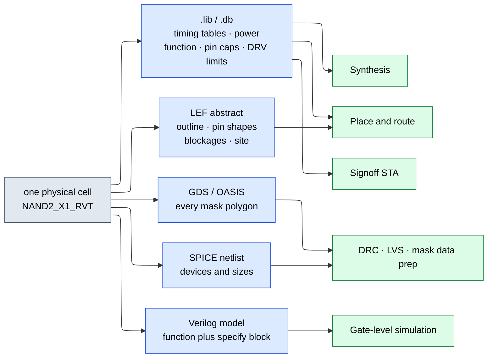
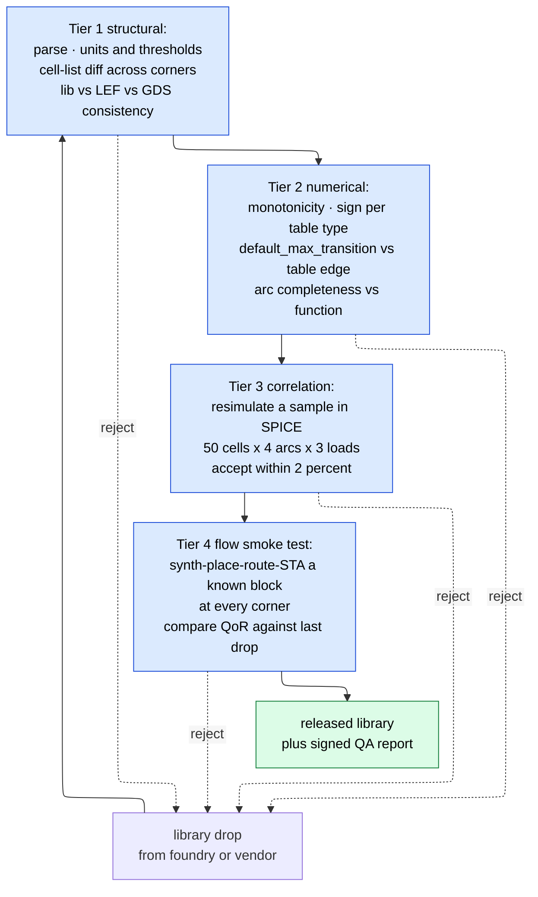

# Standard-Cell Libraries and Timing Characterization — the instruction set synthesis compiles to

> **Prerequisites:** [CMOS_Fundamentals](../00_Fundamentals/01_CMOS_Fundamentals.md) (transistor sizing, threshold voltage, leakage, and the load/slew dependence of delay — the physics every table here tabulates), [Logic_Building_Blocks](../00_Fundamentals/02_Logic_Building_Blocks.md) (the gates and flip-flops the library packages, and the setup/hold aperture this page shows how to *measure*).
> **Hands off to:** [Synthesis_and_Optimization](01_Synthesis_and_Optimization.md) (which treats this library as its instruction set and cost model), [STA](../06_Signoff/01_STA.md) (which reads these tables as the delay oracle behind every timing arc), [Physical_Design](../05_Backend_Physical_Design/01_Physical_Design.md) (which places these cells and routes to the pins LEF declares).

---

## 0. Why this page exists

Every page downstream of RTL leans on objects it never defines. Synthesis "maps to cells" and "swaps Vt flavors." STA "looks up an NLDM table" at "the SS corner." Physical design "abuts rows" and "inserts tap cells." All of it comes from one artifact — the **standard-cell library** — and that artifact is not a fact of nature. It is a *measurement campaign*: millions of SPICE simulations run by a characterization team months before you see the files, reduced to lookup tables plus a set of declared conventions.

The library sits in a uniquely unfalsifiable position. [Constraints_SDC](02_Constraints_SDC.md) makes the same argument about SDC — every tool reads it identically, so no cross-tool comparison catches a bad constraint. The library is worse. SDC is a few hundred lines you wrote and can read; a library is gigabytes of generated tables you did not write, cannot read, and whose errors do not produce error messages. They produce *plausible numbers*. A `.lib` that is 15% optimistic does not crash anything: it closes timing, passes signoff, tapes out, and returns as silicon that runs 15% slow.

So: what a cell physically is (§1), what its five views are and which tool consumes each (§2), how a timing number is manufactured from SPICE (§3), why the simple delay model broke (§4), what a "setup time" actually means given it is defined by a measurement convention (§5), why the corner list explodes and how to prune it defensibly (§6), what Vt and channel-length families cost in library count (§7), what else ships (§8), how libraries go wrong (§9), and how to read one (§10).

Afterwards you should be able to interpolate a delay by hand and state its error bars, explain why `max_transition` is a correctness constraint rather than a style rule, count a realistic MMMC scenario list and defend every entry, and run the diagnostic that separates "my design is slow" from "my library is lying to me."

---

## 1. What a standard cell physically is

### 1.1 The abutment contract forces a fixed height

Baseline: lay each logic function out at whatever size suits it. This fails instantly, and not because of the cells. Every cell needs $V_{DD}$ and $V_{SS}$; with arbitrary heights, power pins land at arbitrary $y$ and the placer must route dedicated power to each instance — consuming the lower metal layers and turning placement into a simultaneous power-routing problem.

The repair is one convention from which everything else follows: **fix the cell height and put the power rails on its top and bottom edges.** Equal-height cells then sit in **rows**, the rails become continuous stripes formed by abutment, and the placer's only obligations are to stay in-row and not overlap. Adjacent rows are **mirrored** vertically so a $V_{DD}$ edge abuts a $V_{DD}$ edge, halving the rail count and letting two rows share one n-well.

Height is quoted in **tracks** — how many routing tracks of the lowest signal layer fit inside it.

| Height | At 40 nm M2 pitch | Fins per device | Consequence |
|---|---|---|---|
| 6T | 240 nm | ~2 | densest; weakest drive; hardest pin access |
| 7.5T | 300 nm | ~3 | mainstream density/speed compromise |
| 9T | 360 nm | ~3–4 | more drive, easier routing, ~1.4× the area of 6T |
| 12T | 480 nm | ~5+ | high-performance datapath and clock cells |

A taller cell has more transistor width at the same length, so more drive current and lower delay at the same load, at linearly more area: an all-9T design is roughly 1.4–1.5× the area of the same design in 6T and 10–20% faster. Large SoCs therefore mix libraries — 6T for control, 7.5T or 9T for critical datapath and clock — in the same floorplan but in **separate row regions**, because differing heights cannot share a row.

### 1.2 The width quantum, and what "X1" means

Width is quantized by the **contacted poly pitch (CPP)** — roughly 57 nm at 7 nm, 51 nm at 5 nm, 45 nm at 3 nm. Poly prints as a uniform grating and is cut afterwards, so a cell whose width is not an integer number of CPPs breaks the grating in its neighbors. LEF formalizes this as a **SITE** (width 1 CPP, height 1 row) and every cell's `SIZE` is an integer multiple. A 3-CPP NAND2 in a 6T row at 7 nm is $3 \times 57 \times 240$ nm $\approx 0.041\ \mu\text{m}^2$ — the atom of area in every synthesis report you will read.

Within one function the library ships several sizes, referenced to the **unit drive X1**: the smallest cell sized to roughly match a minimum inverter's drive. An X2 has about twice the output current, input capacitance, and area. The sizing that defines it:

```tikz
\usepackage{circuitikz}
\begin{document}
\begin{circuitikz}[american,thick,scale=0.95,transform shape]
  \draw (1.3,4.7) node[vcc]{$V_{DD}$};
  \draw (1.3,4.1) -- (1.3,4.45);
  \draw (0,4.1) -- (2.6,4.1);
  \draw (0,3.4) node[pmos,anchor=S](PA){};
  \draw (PA.S) -- (0,4.1);
  \draw (2.6,3.4) node[pmos,anchor=S,xscale=-1](PB){};
  \draw (PB.S) -- (2.6,4.1);
  \draw (PA.D) -- (0,2.4) coordinate(YL);
  \draw (PB.D) -- (2.6,2.4) coordinate(YR);
  \draw (YL) -- (YR);
  \draw (1.3,2.4) node[circ]{};
  \draw (1.3,1.5) node[nmos,anchor=S,yscale=-1](NA){};
  \draw (NA.D) -- (1.3,2.4);
  \draw (1.3,0.4) node[nmos,anchor=S,yscale=-1](NB){};
  \draw (NB.D) -- (NA.S);
  \draw (NB.S) -- (1.3,-0.3) node[ground]{};
  \draw (PA.G) -- (-1.6,3.4) -- (-1.6,1.5) -- (NA.G);
  \draw (-1.6,2.45) node[circ]{} -- (-2.5,2.45) node[left]{$A$};
  \draw (PB.G) -- (4.4,3.4) -- (4.4,-1.4) -- (0.2,-1.4) -- (0.2,0.4) -- (NB.G);
  \draw (4.4,1.5) node[circ]{} -- (5.3,1.5) node[right]{$B$};
  \draw (YR) -- (3.4,2.4) node[right]{$Y$};
  \node[font=\small] at (1.3,3.4) {$2u \parallel 2u$};
  \node[font=\small,anchor=west] at (1.45,1.35) {$n_1$};
  \node[font=\small,anchor=west] at (2.0,0.95) {$2u$ in series};
\end{circuitikz}
\end{document}
```

The figure's contract is *equal worst-case drive to the reference inverter in both directions*. Take the unit inverter as NMOS $1u$, PMOS $2u$ (hole mobility is roughly half, so equal current needs double width). The NAND2 pull-down is two NMOS **in series**, so each must be $2u$ for the pair to match one $1u$ device; the pull-up is two PMOS **in parallel** whose worst case is one conducting, so each matches the inverter's PMOS at $2u$.

Trace it. $A=B=1$: both NMOS conduct, the stack has the conductance of $1u$, and $Y$ discharges through $n_1$ at the reference rate. $A=0,B=1$: PA conducts alone at $2u$, matching the inverter pull-up. Input capacitance at $A$ is $2u+2u = 4u$ against the inverter's $3u$, giving logical effort $g = 4/3$; the same construction for NOR2 puts *PMOS* in series at $4u$ each for $g = 5/3$, the reason NAND is the preferred primitive ([Logic_Building_Blocks](../00_Fundamentals/02_Logic_Building_Blocks.md) §1).

The failure at advanced nodes: **width is quantized too.** In FinFET or nanosheet you choose a **fin count**, and a 6T row fits two, maybe three fins per device — "$2u$" is two fins and the next size is three, a 50% jump. So the classic 2:1 P:N ratio is unrealizable; FinFET libraries run 1:1 or 2:2 fin ratios with process-level PMOS boosting, which is why rise and fall delays in a modern `.lib` are far closer than the textbook 2× predicts. And the drive ladder is *not* powers of two: real libraries ship X1, X2, X3, X4, X6, X8 at irregular ratios, and past a point extra drive needs parallel fingers, widening the cell. Synthesis's "sizing" knob is a discrete menu lookup, not a continuous optimization.

### 1.3 Pin access, multi-height cells

A cell is useless if the router cannot land a via on its pins. At advanced nodes M1/M2 are unidirectional gratings on fixed pitch, vias land on grid, and a 6T cell has few internal tracks — legal **pin-access points** can fall to one or two per pin. The failure is that a legally placed, legally connected cell becomes **unroutable in context**, its access point blocked by the neighbor beside it; that surfaces not as a cell DRC error but as unroutable nets late in place-and-route, where the fix is rip-up and re-place. Libraries respond with redundant pin shapes, explicit access-point declarations in LEF, and placement-compatibility rules. This is the strongest reason 6T libraries arrived later than track arithmetic suggested, and why [Physical_Design](../05_Backend_Physical_Design/01_Physical_Design.md) treats pin access as a placement objective.

Cells that cannot fit one row — a high-drive scan flop, a large clock buffer, a two-supply level shifter — ship as **double-height** cells. Because rows alternate orientation these carry a **row-parity** constraint, legal only where well and rail polarity match, which halves their legal positions and fragments rows around them. The cost is placement quality; the benefit is a device stack twice as tall, the only way to get large drive without going wide. Clock trees are the dominant consumer.

### 1.4 The cells that compute nothing

Roughly a third of the instances in a finished block implement no logic. Each exists because omitting it breaks something specific.

| Cell | The failure without it | What it does | Cost |
|---|---|---|---|
| **Filler** | Gaps break n-well and implant continuity and violate metal/poly **density** rules; wells float and rows fail DRC | Inert well/implant/dummy-poly at correct pitch, inserted after legalization | Blocks later ECO space unless removed first |
| **Tap** (well/substrate tie) | Well and substrate are weakly tied; a transient forward-biases the parasitic bipolar pair and the chip **latches up** destructively | Hard tie of n-well to $V_{DD}$, substrate to $V_{SS}$, on a maximum-spacing grid (20–50 µm) | Area plus a placement constraint everywhere |
| **Decap** | Switching current outruns grid delivery; the local rail droops and every nearby cell slows | MOS capacitor across the rails as a charge reservoir | Gate leakage, and a yield risk — an oxide pinhole shorts the rails, hence series-resistor variants |
| **Antenna diode** | A long metal run tied to a gate but not yet to diffusion collects plasma charge during fab and punches through the oxide before the chip is finished | Reverse-biased diode giving the charge a path to substrate | Added net capacitance plus an insertion step |
| **End-cap / boundary** | Wells and implants must terminate with correct spacing at row ends and block edges; a bare row end is a DRC violation | Correct row termination | Fixed area at every row end |
| **Tie-high / tie-low** | A gate wired straight to a rail sees the full rail transient and every ESD event, stressing thin oxide over the product's life; it also confuses LVS and antenna checking | Small transistor pair that *drives* a constant through a current-limited path | One cell per tie net, plus its leakage |

Two are commonly mistaught. Tap spacing is not style — it bounds the substrate resistance between any transistor and the nearest tie, hence the voltage a substrate current can develop, which is what triggers latch-up; many 7 nm and below libraries are **tapless**, paying a few percent of area everywhere to be free of the placement rule. And tie cells exist for *aging and ESD* reasons, not functional ones: the circuit works fine on day one, which is exactly why the rule gets violated. Mechanisms in [Fabrication_Process](../07_Manufacturing_and_Bringup/01_Fabrication_Process.md).

---

## 2. The library views, and the invariant that binds them

One cell ships as five or six files. This is not redundancy — each view is a **lossy projection** built for one consumer's inner loop, and no consumer can use another's.



Every arrow out of `CELL` deletes information deliberately. **`.lib` (Liberty)** carries timing tables, power, leakage, pin capacitances, the Boolean function, and DRV limits (`max_transition`, `max_capacitance`, `max_fanout`); it knows area as a scalar and nothing else about geometry — it cannot tell you where pin A is. **`.db`** is the same content compiled to binary, parsing in seconds instead of minutes, which matters when a corner set is 30 files. **LEF** carries the outline (`SIZE`), every pin's shape and layer, metal **blockages** (`OBS`), and the `SITE`; it has no truth table. The companion **technology LEF** carries layers, pitches, via rules, and design rules. **GDSII/OASIS** carries every polygon — complete and therefore useless in an optimization loop, since a full-chip GDS is hundreds of gigabytes with no abstraction to reason about; it is merged once at chip finishing for [DRC/LVS](../06_Signoff/03_Physical_Verification_DRC_LVS.md) and mask prep. **SPICE netlist** (`.cdl`) carries devices and sizes for LVS to compare against the netlist extracted from GDS, and is the input characterization simulates. **Verilog model** carries behavior plus a `specify` block of path delays and timing checks that SDF back-annotation overwrites, for [gate-level simulation](../03_Frontend_RTL_and_Verification/13_Gate_Level_Sim_and_Emulation.md).

Substitution is impossible in every direction: you cannot time from LEF (no function), place from `.lib` (no geometry), run a synthesis iteration against GDS (no abstraction), or LVS against `.lib` (no devices). Each view exists because its consumer's inner loop runs $10^6$–$10^9$ times and needs the smallest sufficient representation.

**The invariant: all views describe the same cell.** Names, pins, directions, and function must agree; LEF `SIZE` must equal the GDS bounding box; CDL device sizes must be the ones characterized. **Nothing in the flow enforces this** — each tool reads one or two views and is satisfied.

| Divergence | Tool that could notice | Where it detonates |
|---|---|---|
| LEF `SIZE` 3 CPP, GDS 4 CPP | none | final merged chip DRC, after routing is frozen |
| `.lib` function ≠ Verilog model | none | LEC passes, gate-level sim fails days before tape-out — or the reverse |
| Pin in `.lib`, missing in LEF | router | LVS open, or a silently unconnected input |
| LEF pin on the wrong layer | none | router "connects" to a shape the cell lacks; LVS open |
| CDL device sizes ≠ characterized netlist | none | **silicon** — slower or leakier than every model said |

The last row is why library qualification (§9) must be an *external* gate. Every tool in the flow is internally consistent with a wrong library.

---

## 3. Characterization: where a `.lib` number comes from

### 3.1 The measurement, and its price

A cell delay is not a property of the cell. It is a property of (cell, arc, direction, input slew, output load, P, V, T). Characterization pins the last five down by simulating exhaustively on a grid: foundry SPICE models fixed at one PVT point, the cell's netlist with its own extracted parasitics, a driver cell sized to hit each target slew (a real driver, not an ideal ramp, because waveform shape affects the receiver), and a capacitive load.

Measured per grid point: the **delay** (input 50% crossing to output 50% crossing), the **output transition** (between declared thresholds, conventionally 30% and 70%), the **internal energy** (rail charge that does not land on the output load — short-circuit plus internal-node charging), and **leakage per input state**, since a NAND2 leaks differently at `00` than at `11`. Thresholds are declared in the library header, not universal (§10). The result is one 2-D table set per arc per direction, and one `.lib` for that single PVT point.

The compute cost explains all corner discipline. One cell, one arc, one direction, one corner on a 7×7 grid is 49 SPICE runs. A 500-cell library averaging 4 arcs per cell, 2 directions, 10 corners:

$$
500 \times 4 \times 2 \times 49 \times 10 \;=\; 1.96 \times 10^{6}\ \text{SPICE simulations}
$$

— thousands of CPU-hours and days of wall clock, *before* constraint characterization, power tables, or variation data. "Just add a corner" costs $2\times10^5$ simulations plus a full QA re-run. That is why §6 is about pruning.

### 3.2 The NLDM table and a worked interpolation

**NLDM (non-linear delay model)** stores per arc and direction two 2-D tables — `cell_rise`/`cell_fall` for delay, `rise_transition`/`fall_transition` for output slew — indexed by input slew and total output capacitance. "Non-linear" refers to the tabulation: the function is sampled, not assumed linear. A realistic `cell_rise` for a NAND2_X1 at a slow corner, in library units of ns and pF:

| slew ↓ \ cap → | 0.5 fF | 1 fF | 2 fF | 4 fF | 8 fF | 16 fF | 32 fF |
|---|---|---|---|---|---|---|---|
| **5 ps** | 0.01031 | 0.01187 | 0.01500 | 0.02130 | 0.03402 | 0.06000 | 0.11406 |
| **10 ps** | 0.01107 | 0.01264 | 0.01578 | 0.02211 | 0.03489 | 0.06099 | 0.11529 |
| **20 ps** | 0.01258 | 0.01417 | 0.01734 | **0.02373** | **0.03663** | 0.06297 | 0.11775 |
| **40 ps** | 0.01561 | 0.01723 | 0.02046 | **0.02697** | **0.04011** | 0.06693 | 0.12267 |
| **80 ps** | 0.02167 | 0.02335 | 0.02670 | 0.03345 | 0.04707 | 0.07485 | 0.13251 |
| **160 ps** | 0.03379 | 0.03559 | 0.03918 | 0.04641 | 0.06099 | 0.09069 | 0.15219 |
| **320 ps** | 0.05803 | 0.06007 | 0.06414 | 0.07233 | 0.08883 | 0.12237 | 0.19155 |

The grid is **geometric**, not uniform, on both axes. Delay is roughly affine in load and mildly convex in slew, so equal *ratios* rather than equal *differences* hold the interpolation error uniform, and seven points cover a 64× span.

**The query.** STA asks for the A→Y rise delay at input slew $s = 25$ ps driving $C = 6$ fF. Neither is on the grid, so the tool does **bilinear interpolation** in the bracketing cell (bolded).

$$
t_x = \frac{25 - 20}{40 - 20} = 0.25, \qquad t_y = \frac{6 - 4}{8 - 4} = 0.50
$$

Interpolate along capacitance first, once per bracketing slew row:

$$
d(20, 6) = 0.02373 + 0.50\,(0.03663 - 0.02373) = 0.03018\ \text{ns}
$$
$$
d(40, 6) = 0.02697 + 0.50\,(0.04011 - 0.02697) = 0.03354\ \text{ns}
$$

Then along slew:

$$
d(25\,\text{ps}, 6\,\text{fF}) = 0.03018 + 0.25\,(0.03354 - 0.03018) = \boxed{0.03102\ \text{ns} = 31.0\ \text{ps}}
$$

Equivalently, in product form: $0.375(0.02373) + 0.375(0.03663) + 0.125(0.02697) + 0.125(0.04011) = 0.03102$. A direct SPICE run at that point gives 31.0 ps — **inside the grid, bilinear interpolation is good to a few tenths of a percent**, which is the entire justification for a 7×7 table replacing a SPICE run.

The lookup is not finished. The same interpolation runs on `rise_transition` to get the arc's **output slew** — 21.0 ps here — which becomes `index_1` for the next stage. Delay and slew co-propagate down the timing graph, one bilinear pair per arc. This is the oracle [STA](../06_Signoff/01_STA.md) §2 treats as a black box.

### 3.3 Falling off the table

Now drive 50 fF, past the 32 fF right edge. The tool does not error. It **extrapolates linearly** off the last two columns:

$$
\text{slope} = \frac{0.11775 - 0.06297}{0.032 - 0.016} = 3.424\ \text{ns/pF}
$$
$$
d_{\text{extrap}} = 0.11775 + (0.050 - 0.032)(3.424) = 0.1794\ \text{ns} = 179.4\ \text{ps}
$$

SPICE gives **213 ps**. The extrapolation is **16% optimistic**, and the error is structural, not random: past the characterized load the driver spends most of the transition in the linear region where its effective resistance rises, and the receiver's Miller capacitance grows with the now-enormous input slew. Both push real delay up; a straight line through the last two grid points captures neither.

Three consequences make this the most important paragraph in §3. **The error is one-directional** — every extrapolated arc is optimistic, so errors accumulate along a path instead of cancelling. **It compounds through the slew**, because `rise_transition` extrapolates the same way, so the next stage is looked up at a slew that is also too small and returns a delay that is also too small. And therefore **`max_transition` and `max_capacitance` are correctness constraints, not tidiness.** Their job is to keep every lookup inside the characterized grid. A design with clean timing and a DRV violation has not "mostly closed": the reported timing on those arcs is invented. The library declares its own boundary in `default_max_transition` and per-pin limits — §9 covers what happens when that declaration is wrong.

---

## 4. Why NLDM broke, and what replaced it

### 4.1 Two assumptions that stopped being true

**The load is a lumped capacitor.** The bench loads the cell with a single $C$ and the table is indexed by `total_output_net_capacitance`. The real load is an extracted RC network: near-end capacitance is visible immediately, far-end capacitance sits behind the wire resistance and is **resistively shielded** — the driver never charges it during its own transition — so lumping everything into $C_{total}$ over-estimates delay and mis-estimates slew.

The classic patch is **effective capacitance** $C_{eff} < C_{total}$: solve iteratively for the single capacitance drawing the same charge over the first half of the transition, then look up at $C_{eff}$. Every NLDM tool has done this since the mid-1990s. But $C_{eff}$ is a fitting device — one scalar standing in for a two-port network — and can be tuned to match the delay *or* the slew, not both. As wire resistance per unit length rose each node (thinner, taller wires with a growing barrier/liner fraction), the residual error grew from a few percent to 10–20% on resistive nets.

**The received waveform is a ramp described by one number.** Two waveforms with identical 30–70 transition times can produce measurably different delays in the receiver, because what matters is the trajectory through its switching region, not a two-point measurement of it. A corollary bites independently: **input capacitance is not a constant.** As the receiver's input rises, its own output swings and gate-drain overlap capacitance couples that swing back — the **Miller effect** — so apparent input capacitance before the output moves differs from the value while it slews, often by 2×. A single `capacitance` number is an average wrong in both halves.

### 4.2 Current-source models

If a voltage-source-into-a-lump model cannot reproduce waveforms on a real RC network, model the driver as something that can **drive the real network**: a time-varying current source, characterized once and solved against whatever RC the extractor produces.

**CCS (Composite Current Source)**, Synopsys, stores **output current waveforms** $I(t)$ over the same (slew, cap) grid; the delay calculator drives the extracted network with them and solves for the real voltage trajectory. CCS also carries a **receiver model** splitting input capacitance into at least two segments — $C_1$ up to the delay threshold, $C_2$ after — capturing the Miller change directly, plus separate **noise** and **power** views for crosstalk-glitch propagation and current profiles. **ECSM (Effective Current Source Model)**, Cadence, stores the **output voltage waveform** as ~20 time-voltage points and derives the current from it: different storage, equivalent capability.

| Model | Delay error vs SPICE | Size per corner | STA runtime |
|---|---|---|---|
| NLDM + $C_{eff}$ | ±10–20% on resistive nets (±2–5% on capacitive nets at older nodes) | 10–50 MB | 1× |
| CCS or ECSM | ±2–3% | 100–500 MB | 2–4× |

The cost shapes flow practice: many teams run **NLDM in synthesis and early PnR** and **CCS/ECSM only at signoff**. That buys runtime and creates a *correlation gap* — synthesis believes a path is several percent faster than signoff will say — which must then be absorbed by over-constraining synthesis, which wastes area ([Synthesis_and_Optimization](01_Synthesis_and_Optimization.md) §7.4). CCS everywhere costs 2–4× on every iteration. There is no free option, only a decision about where to spend.

### 4.3 `related_pin` capacitance: the input cap is per-arc

Liberty allows three levels of refinement, each removing a specific error: a single `capacitance` (wrong by 10–30% for one direction); `rise_capacitance`/`fall_capacitance` (separate values per direction, since NMOS and PMOS gate capacitance and Miller coupling differ); and, inside a `timing()` group tagged with `related_pin`, CCS's `receiver_capacitance1_rise`/`receiver_capacitance2_rise` — per-arc, per-direction, per-segment.

Why a NAND2's input capacitance depends on *which* pin and *what the other pin is doing* is visible in §1.2. Pin $A$ drives the upper series NMOS whose source sits on internal node $n_1$; pin $B$ drives the lower device whose source is ground. With $B = 0$, node $n_1$ is left charged and $A$'s device sees a different source potential, hence different $C_{gs}$ and different Miller contribution, than with $B = 1$. State dependence is expressed with `when` conditions on the `timing()` group.

Practical statement: **"the input cap of the cell" is a simplification that exists for hand calculation.** The number the delay calculator uses is per-arc, per-direction, and in CCS per-segment. Expect 10–30% disagreement when you compute a fanout load by hand, and do not conclude the tool is wrong.

---

## 5. Timing arcs and their semantics

An arc is the library's unit of timing information: a directed relationship between two pins of one cell, carrying either a **delay** or a **constraint**. STA builds its timing graph by instantiating every arc of every cell ([STA](../06_Signoff/01_STA.md) §2). If an arc is missing from the `.lib`, the edge is missing from the graph and the path through it is **never checked**.

### 5.1 Combinational arcs and unateness

A combinational arc says a transition on `related_pin` causes a transition on this output after a delay from `cell_rise`/`cell_fall`. `timing_sense` declares which output polarity a given input polarity produces:

| `timing_sense` | Meaning | Examples | Analysis cost |
|---|---|---|---|
| `positive_unate` | rise → rise, fall → fall | buffer, AND, OR, mux data pins | 1 arc pair |
| `negative_unate` | rise → fall, and conversely | inverter, NAND, NOR, AOI/OAI | 1 arc pair |
| `non_unate` | direction depends on other inputs | XOR, XNOR, mux **select**, latch data-through | **both** polarities propagated, worse kept — 2× |

The mux is instructive: its data pins are positive-unate, but its **select** is non-unate — a rising `S` makes `Y` rise if `D1 > D0` and fall otherwise, and the library cannot know which. Hence XOR- and mux-dense designs analyze more slowly, and a mux select is a poor place for a critical path. Finer resolution comes from **conditional arcs**: a `when : "!B"` clause gives an arc its own tables valid only in that input state (§4.3), at a multiple of the table count.

### 5.2 Constraint arcs are a different kind of object

Sequential arcs produce no delay. They produce a **required-time offset** that STA applies to a capture edge.

| `timing_type` | Constrains | Failure it prevents |
|---|---|---|
| `setup_rising` / `_falling` | latest data arrival before the edge | data caught mid-transition → metastability |
| `hold_rising` / `_falling` | earliest data change after the edge | new data races through and corrupts the sample |
| `recovery_rising` / `_falling` | latest async set/reset **de**assertion before the edge | reset release caught mid-transition |
| `removal_rising` / `_falling` | earliest deassertion after the edge | the same race, other side |
| `min_pulse_width` | shortest legal high or low pulse | the internal latch never fully opens; a capture is missed |
| `minimum_period` | shortest legal period for a macro | internal self-timed sequences do not complete |
| `non_seq_setup_rising` / `non_seq_hold_rising` | a data-to-data relationship with no clock | address unstable around a write enable |
| `skew_rising` | maximum separation of two related pins | dual-clock macros, differential inputs |

**Constraint tables are not indexed like delay tables.** `cell_rise` is indexed by (input slew, output load); `setup_rising` is indexed by (**related-pin transition**, **constrained-pin transition**) — clock slew and data slew. Output load does not appear, because setup is a property of the flop's internal sampling and has nothing to do with what Q drives. Reading `index_2` of a constraint table as capacitance is a routine and consequential misreading.

`min_pulse_width` is the check most often ignored until it fails. Clock cells with mismatched rise/fall delays shrink pulses cumulatively: a 14-level tree with 3 ps of per-level duty asymmetry delivers a pulse 42 ps narrower than the source. If the flop needs 60 ps high and receives 55 ps, it fails to capture — a functional failure no setup or hold check reports.

### 5.3 Setup and hold are defined by a failure criterion, not by physics

There is no measurable instant at which a flip-flop's setup requirement is "met." There is a continuum: as data arrives closer to the clock edge, the internal node starts nearer the metastable point and takes longer to resolve, so **clock-to-Q grows**. The curve is smooth and asymptotic and never has a corner. Setup time is *defined* as the point where clock-to-Q has degraded by a chosen fraction.

```wavedrom
{ "signal": [
  { "name": "clk",        "wave": "0.....1.....", "node": "......a" },
  { "name": "D trial 1",  "wave": "x.3.........", "node": "..b" },
  { "name": "Q trial 1",  "wave": "x.......3..." },
  { "name": "D trial 2",  "wave": "x....4......", "node": ".....c" },
  { "name": "Q trial 2",  "wave": "x........4.." },
  { "name": "D trial 3",  "wave": "x.....5.....", "node": "......d" },
  { "name": "Q trial 3",  "wave": "x..........5" }
 ],
 "edge": ["b->a wide separation: nominal clk-to-Q", "c->a declared t_su: clk-to-Q up 10 percent", "d->a inside the aperture: no resolution"],
 "head": {"text": "Setup characterization: shrink the D-to-clock separation and watch clock-to-Q degrade"}
}
```

Each trial is an independent SPICE run at one (clock slew, data slew) pair, differing only in when D changes. The trace that matters is trial 2 → trial 3: moving D six picoseconds later takes Q from "42 ps after the edge" to "never resolves." The measured sweep:

| D-to-clock separation | clock-to-Q | degradation |
|---|---|---|
| 200 ps | 42.0 ps | — (nominal) |
| 100 ps | 42.1 ps | +0.2% |
| **62 ps** | 42.4 ps | **+1.0%** ← 1% criterion |
| 48 ps | 43.1 ps | +2.6% |
| 40 ps | 44.0 ps | +4.8% |
| **36 ps** | 46.2 ps | **+10.0%** ← 10% criterion (industry default) |
| 32 ps | 49.4 ps | +17.6% |
| 28 ps | 57.5 ps | +37% |
| 24 ps | does not resolve | — |

This flop's setup time is 36 ps — *or* 62 ps, depending on the criterion the vendor chose. Both are honest points on the same curve, and the choice is a real trade (Worked problem 5). The 10% convention bakes in a **bounded optimism**: STA books nominal $t_{cq} = 42.0$ ps with $t_{su} = 36$ ps, while a flop at its setup limit costs $46.2 + 36 = 82.2$ ps — 4.2 ps optimistic, exactly 10% of nominal $t_{cq}$ by construction, and well inside the 20–50 ps of clock uncertainty already subtracted. A 1% criterion cuts that to 0.42 ps but spends 26 ps of the cycle on *every* stage. Always know which criterion your library used; two libraries characterized differently are not comparable.

**Negative hold times are legitimate.** If a flop's internal clock path is longer than its internal data path, data may change *after* the edge and still be captured; $t_h$ comes out negative, a genuine gift for hold closure. A QA check that rejects all negative constraint values is wrong (§9).

### 5.4 Setup-hold pessimism removal and the dependent table

Setup and hold are characterized independently: to find $t_{su}$, sweep data *arrival* with data *departure* held far away; for $t_h$, the reverse. Each sweep measures one edge of the required stable window while the other edge is safely distant.

The real pass/fail boundary is not a rectangle. In the plane of (data arrival, data departure) relative to the clock, the passing region is bounded by a smooth curve, and the independently characterized pair $(t_{su}, t_h)$ is the corner of the largest axis-aligned rectangle two one-dimensional sweeps can certify. That corner lies strictly inside the true passing region, so the declared pair is **conservative**: requiring stability for $t_{su} + t_h$ demands a wider window than any real failure needs. Hold is where you feel it, because hold closure is buffer-count-limited.

The repair is the **dependent (2-D) constraint table** — several points along the true contour, so STA can pick the $(t_{su}, t_h)$ pair matched to the window a path actually delivers; a path with 200 ps of setup slack does not need the setup-limited hold number. Tools call this **setup-hold pessimism removal**, and typical recovery is 5–20 ps of hold per flop, which across $10^5$ endpoints is a real reduction in inserted buffers. A known **optimism** runs the other way — a very narrow data pulse can satisfy both independent checks and still fail, because neither sweep presented a pulse that short — which is why characterization flows use a combined or iterative sweep. The constraint half of a library is harder to get right than the delay half.

---

## 6. PVT corners and the corner explosion

A `.lib` is characterized at **exactly one** process-voltage-temperature point. Everything about corner methodology follows from that sentence.

### 6.1 Process is more than one axis

The foundry publishes SPICE decks at named **skew corners**. **TT** is the center, used for power and typical reporting, never for timing signoff. **SS** and **FF** have both device types slow or both fast and bracket ordinary complementary logic, owning setup and hold signoff. **SF** and **FS** have one type slow and the other fast, and exist because some circuits depend on the **ratio** of N to P strength rather than the sum: ratioed logic, SRAM bitcells, single-ended sense amps, level shifters, and — the one that catches digital designers — anything sensitive to **duty cycle**. A long inverter chain at SF has systematically longer falls than rises, and a deep clock tree accumulates that into duty drift, interacting with `min_pulse_width` (§5.2) and with any circuit clocked on both edges. With a DDR interface, a half-rate clock, or a divider, SF/FS are not optional.

At advanced nodes a second, independent process axis appears: **interconnect**. Metal width, thickness, and dielectric vary separately from the transistors, so extraction produces several RC corners — typically `Cworst`, `Cbest`, `RCworst`, `RCbest`, and a typical — differing in whether coupling capacitance or wire resistance is maximized. They multiply against device corners rather than collapsing into them, and are the main reason corner counts *grew* at 16 nm and below ([Routing_and_Parasitic_Extraction](../05_Backend_Physical_Design/06_Routing_and_Parasitic_Extraction.md)).

### 6.2 Temperature inversion, and why "slow corner = hot" stopped being true

Delay depends on temperature through two competing mechanisms: **mobility falls as temperature rises** ($\mu \propto T^{-1.5}$ roughly), making devices slower when hot, while **threshold voltage falls as temperature rises** (roughly $-0.5$ to $-1$ mV/K), increasing overdrive $V_{DD} - V_{th}$ and making them faster when hot. Which wins depends on how large the overdrive already is. At $V_{DD} = 1.8$ V with $V_{th} = 0.45$ V, a 60 mV threshold shift is a 4% change in overdrive while mobility moves 20% — mobility dominates, hot is slow, the classical rule holds. At $V_{DD} = 0.65$ V with $V_{th} = 0.35$ V the overdrive is only 0.30 V and the same 60 mV shift is a **20%** change — the threshold term dominates and **cold becomes the slow corner**. The crossover sits around 0.6–0.9 V depending on node and Vt flavor, squarely inside every advanced-node operating range, and different flavors in one design can sit on *opposite sides* of it.

The consequence is concrete: you cannot pick one temperature per process/voltage anchor. Both extremes must be checked for setup *and* hold, because monotonicity in temperature no longer holds — a factor of two on the temperature axis with a physical cause, not a safety choice.

### 6.3 Library sets versus operating conditions

Liberty carries `nom_process`, `nom_voltage`, `nom_temperature` and an `operating_conditions()` group naming the characterized point. It also historically carries **k-factors** (`k_volt_cell_rise`, `k_temp_cell_rise`) — linear coefficients letting a tool *scale* tables to a different condition. Do not sign off on scaled libraries: with temperature inversion (§6.2) and strongly non-linear voltage dependence near threshold, k-factor errors exceed 10% and can have the wrong sign. Modern practice is **one characterized `.lib` per PVT point**, with `set_operating_conditions` merely *selecting* among loaded libraries. The failure is quiet — a flow that silently falls back to scaling because a corner was not loaded produces numbers, not errors (§9).

**Derating sits on top of corners, not instead of them.** Corners model **die-to-die** variation; **on-chip variation** is a multiplier applied via `set_timing_derate`, an AOCV depth table, or **LVF (Liberty Variation Format)** sigma tables embedded in the `.lib` for POCV. LVF is expensive — each entry needs a Monte-Carlo campaign rather than one run, costing 10–100× nominal characterization and adding 2–5× to library size — which is why it often exists for only a subset of corners, and why *the OCV method you can use is a library decision before it is an STA decision* ([STA](../06_Signoff/01_STA.md) §5).

### 6.4 The explosion, and a defensible pruning

A realistic 7 nm mobile SoC:

| Axis | Values | Count |
|---|---|---|
| Device process | SS, TT, FF | 3 |
| Voltage | 0.675 V (low), 0.750 V (nominal), 0.825 V (overdrive) | 3 |
| Temperature | −40 °C, 25 °C, 125 °C | 3 |
| Interconnect RC | Cworst, Cbest, RCworst, RCbest, Ctyp | 5 |
| Mode | mission, DVFS-low, scan-shift, scan-capture | 4 |

The naive product is $3 \times 3 \times 3 \times 5 = 135$ corners and $135 \times 4 = 540$ **MMMC scenarios** (a scenario = one corner paired with one mode, carrying its own `.lib` set, SPEF, and SDC). At three CPU-hours each that is 1,620 CPU-hours per sweep per partition — unaffordable and mostly redundant. Each cut below is justified by a check, not by a budget:

1. **A check needs one side of P and V.** Setup is max-delay (slow, low voltage); hold is min-delay (fast, high voltage). Nine P/V combinations collapse to two anchors plus `tt_0p750v` for power.
2. **Temperature does not collapse** (§6.2): both extremes per anchor.
3. **DVFS adds an operating point**, needing its own setup corners at both temperatures — that is where inversion is strongest.
4. **RC corners pair by check:** Cworst/RCworst with setup anchors, Cbest/RCbest with hold. Two per anchor, not five.
5. **Modes do not need every corner:** scan-shift runs slow, so one setup and one hold corner suffice; scan-capture is at-speed and needs the mission pair.

| # | Corner | Owns |
|---|---|---|
| 1 | `ss_0p675v_125c_cworst` | mission setup, hot |
| 2 | `ss_0p675v_m40c_cworst` | mission setup, cold (inversion) |
| 3 | `ss_0p675v_125c_rcworst` | mission setup, resistance-dominated nets |
| 4 | `ff_0p825v_m40c_cbest` | mission hold, cold |
| 5 | `ff_0p825v_125c_cbest` | mission hold, hot |
| 6 | `ff_0p825v_m40c_rcbest` | mission hold, resistance-dominated |
| 7 | `tt_0p750v_25c_ctyp` | power analysis, typical reporting |
| 8 | `ss_0p600v_125c_cworst` | DVFS-low setup, hot |
| 9 | `ss_0p600v_m40c_cworst` | DVFS-low setup, cold |

Scenario assignment: mission × corners 1–7 = 7; DVFS-low × {8, 9, 4, 6} = 4; scan-shift × {1, 4} = 2; scan-capture × {1, 2, 4, 5} = 4. **Total 17 scenarios**, down from 540 — a 32× reduction with every cut defended.

The residual cost is still large. Nine corners × four Vt flavors (§7) = 36 `.lib` files for the logic library alone at 100–500 MB each in CCS form: 4–18 GB, before macros, LVF, or I/O. Seventeen scenarios at three CPU-hours is 51 CPU-hours per sweep, times eight partitions, run two or three times a week during closure. And the marginal cost of one more corner is not one file: it is $\sim\!2\times10^5$ characterization simulations, a QA re-run, $N$ new scenarios, and permanent disk and license consumption. That is the arithmetic behind every "can we just check one more corner?" conversation.

---

## 7. Threshold-voltage flavors and channel-length families

### 7.1 A flavor is a complete separate library

[Power_Reduction_Techniques](../02_Power_and_Low_Power/04_Power_Reduction_Techniques.md) §5 derives the physics — leakage exponential in $V_{th}$, delay only polynomial — and tabulates the ratios. The *library* consequences belong here.

LVT, RVT/SVT, HVT, and ULVT versions of one NAND2 are four different cells with four names, four `.lib` entries per corner, and four GDS layouts differing in an implant or work-function-metal layer. But **they share one LEF**: identical outline, pin shapes, blockages, site count.

That single property is why Vt swapping is the dominant late-stage knob. Identical footprint means replacing `NAND2_X1_RVT` with `NAND2_X1_LVT` is a pure netlist edit — no cell moves, no reroute, no legalization, no DRC risk. Liberty expresses this through `cell_footprint`: cells sharing the string are declared swappable, and that string is what the sizing and swap engines key on. It follows that a **wrong `cell_footprint`** — two cells sharing a string but differing in pin order or function — is a library bug producing functionally incorrect ECOs, silently, at the point in the schedule you can least afford it.

The cost is library count: four flavors × nine corners = 36 files that must all exist, all be characterized, and all be mutually consistent. A missing (flavor, corner) pair does not error; it silently changes the optimizer's cell menu at that corner, so the tool closes corner 1 with cells it cannot use at corner 2 (§9).

### 7.2 Multi-channel-length devices: the other knob, and why it behaves differently

Foundries also offer devices with a **longer drawn channel** than nominal, typically one or two options 10–30% longer. Longer channels suppress short-channel effects: drain-induced barrier lowering falls, effective threshold rises, and subthreshold leakage drops 30–50% for a 5–15% delay penalty. For leakage driven by DIBL rather than by nominal threshold, an extended-L device often beats a Vt step at the same delay cost.

The critical difference is **footprint**. The extra length must fit, and at fixed CPP it usually does not — so an extended-L cell is typically one CPP wider, a 15–30% area penalty, with a *different* LEF. Therefore: **Vt swap is footprint-neutral** and available at any time including post-route ECO; **channel-length swap is footprint-changing** and must be decided at synthesis or early placement, when the tool can still absorb the area. Planning to "recover leakage with long-channel cells after route" is a scheduling error costing a full place-and-route iteration.

### 7.3 The mix, and where its leakage lives

Synthesis starts with the low-leakage flavor as default (often with `set_dont_use` on ULVT until proven necessary), maps, then swaps *up* only on violating paths worst-first; place-and-route repeats against real parasitics and then runs **leakage recovery**, swapping back *down* wherever slack allows. The converged mix quoted in [Synthesis_and_Optimization](01_Synthesis_and_Optimization.md) §7.2 hides the number that matters for power budgeting. Take a 100k-cell block at a 72 / 20 / 8 percent HVT / SVT / LVT split, relative leakages 0.2 / 1.0 / 5.0:

$$
72{,}000(0.2) + 20{,}000(1.0) + 8{,}000(5.0) = 14{,}400 + 20{,}000 + 40{,}000 = 74{,}400\ \text{units}
$$

An all-LVT build of the same block leaks $100{,}000 \times 5.0 = 500{,}000$ units — **6.7× more at the same frequency**. And inside the mixed design, the 8% of cells that are LVT contribute $40{,}000 / 74{,}400 =$ **54% of total leakage**. The first number justifies the whole multi-$V_t$ methodology and its library cost; the second says leakage debugging means examining a small identifiable population, and that an unnecessary LVT cell costs roughly 25× an unnecessary HVT one.

---

## 8. What else is in the delivery

Logic cells are the smallest part of a library release by volume. Everything below ships with the same five views and the same corner obligations, and each exists because logic cells cannot do its job.

**Memory macros, from a compiler.** SRAM is not instantiated from the cell library — a **memory compiler** takes (depth, width, column-mux factor, banking, options) and *generates* a complete view set including a `.lib` per corner. So a design with 300 distinct SRAM configurations has 300 × (corner count) generated `.lib` files; macro `.lib`s carry constructs logic cells do not (`minimum_period`, per-pin `min_pulse_width`, large `internal_power` groups); and many compilers ship **NLDM only**, forcing a mixed-model STA run with the macro at NLDM inside logic at CCS ([Memory_Circuits_and_Technologies](../00_Fundamentals/06_Memory_Circuits_and_Technologies.md)).

**I/O cells and level shifters.** I/O cells use thick-oxide devices on a higher supply, with their own row/site definition and ESD structures, characterized against pad capacitance rather than gate load. **Level shifters** straddle two supplies, so their `.lib` declares two `related_power_pin` groups and timing depends on **both** rails — their corner space is indexed by a voltage *pair*. A three-voltage design needs shifter characterization at up to six ordered pairs per process/temperature point, a multiplier routinely forgotten in corner planning ([UPF_and_CPF_Power_Intent](../02_Power_and_Low_Power/05_UPF_and_CPF_Power_Intent.md) §4).

**Integrated clock-gating (ICG) cells.** A latch plus an AND in one cell, with a `clock_gating_check` arc constraining the enable against the clock's *inactive* edge. It is a cell rather than synthesized RTL for a physical reason: built from discrete cells, the placer may separate latch from AND and route the enable through arbitrary delay, at which point the enable can change while the clock is high and a **runt pulse** escapes into the gated domain. Packaging makes the internal path a manufacturing constant and the glitch condition a checkable arc. Cost: about two gate delays of clock insertion plus a setup requirement on the enable.

**Retention and isolation cells.** A retention flop is a normal flop plus a shadow latch on an always-on supply, so its `.lib` declares two `related_power_pin` entries, a `retention_cell` attribute, and SAVE/RESTORE arcs; isolation cells carry `is_isolation_cell` and a clamp value. These **attributes are the interface** UPF-aware synthesis keys on — a library whose transistors are correct but whose attributes are missing cannot be used in a power-gated design at all, because no tool can recognize which cells satisfy which strategy ([UPF_and_CPF_Power_Intent](../02_Power_and_Low_Power/05_UPF_and_CPF_Power_Intent.md) §3, §5).

**Spare cells and ECO cells.** Both make a post-tape-out fix possible with a **metal-only** mask change — at 7 nm roughly 3–5 masks and 2–4 weeks, against a base-layer respin at 60+ masks and 10–14 weeks. That ratio is the entire budget justification. **Spare cells** are real functional cells scattered at 0.5–2% of block area with inputs tied off, rewired using existing metal; they cost area *and* leakage on every die for the life of the product, used or not. **ECO / gate-array filler cells** hold unconnected transistors in a regular pattern, personalized later by metal only — cheaper, with near-zero leakage since nothing is biased into conduction, but they need a personalization library and tool support.

**The clock-tree subset.** CTS uses a curated subset with three properties: **balanced rise/fall delay**, so a deep tree does not accumulate duty drift into a `min_pulse_width` failure (§5.2); high drive relative to input capacitance, since the clock is the highest-activity net; and low delay *variation*, which is what OCV punishes hardest. Advanced-node trees are frequently **inverter-only** — an inverter pair's rise/fall imbalance cancels pairwise, whereas a buffer is two inverters inside one cell at a fixed internal ratio CTS cannot re-balance. The subset is marked (`is_clock_cell` and vendor attributes) and the CTS setup is an allow-list, not the complement of a `set_dont_use` ([Clock_Tree_Synthesis](../05_Backend_Physical_Design/05_Clock_Tree_Synthesis.md)). Scan and DFT cells follow the same attribute-is-the-interface rule ([DFT_and_ATPG](../06_Signoff/02_DFT_and_ATPG.md)).

---

## 9. How a library goes wrong, and how you catch it first

A library defect has a property no other defect has: **every consumer trusts it identically, so no cross-tool comparison detects it.** Synthesis, PnR, and STA agree perfectly with each other and are all wrong together. Detection must be *external* to the flow and *upstream* of it.

| Defect | Mechanism of harm | Check that catches it |
|---|---|---|
| **Missing arc** — a reset-to-Q path, one input of a complex AOI, a three-state enable | No edge in the timing graph, so the path is **never analyzed**; STA reports clean | Enumerate arcs implied by each cell's `function` and compare to declared `timing()` groups; cross-check against the Verilog `specify` block |
| **Non-monotonic table** — a dip from a SPICE convergence failure or a mis-set threshold | Worse than an inaccurate number: the optimizer *discovers* that adding load makes a path faster; sizing loops oscillate and buffering goes absurd | Sweep every table and assert monotonicity along both axes. Twenty lines of script; the highest-value check in the suite |
| **`.lib` / LEF / GDS mismatch** (§2) | Detonates at final DRC, at LVS, or in silicon | View-consistency comparison of cell lists, pin lists, directions, bounding boxes. Structural fix: generate LEF *from* GDS, and gate on cell-level LVS |
| **`default_max_transition` looser than `max(index_1)`** | Slews between the table edge and the declared limit are DRV-legal and **extrapolated** (§3.3); the design closes on fabricated numbers | Assert `default_max_transition ≤ 0.9 × max(index_1)` per template, and that no per-pin value overrides upward. Treat the delay calculator's extrapolation warning as an error |
| **Uncharacterized corner** — a missing (cell, flavor, corner) triple | Tool errors out (best), silently drops the cell from that corner's menu (common, worst), or links to a neighbor and **scales** it (§6.3) | Matrix diff: every corner's `.lib` must hold the identical cell list and identical arcs. Separately assert k-factor scaling is disabled |
| **Negative-value artifacts** in CCS receiver caps or `internal_power`, from fitting residuals near zero | A negative pin capacitance can make total net load negative and the arc delay negative, breaking the DAG assumptions block-based STA relies on | Sign assertions **per table type** — noting that `setup` and `hold` values are legitimately negative (§5.3), so a blanket rule rejects good libraries |
| **Wrong units or mismatched thresholds** — `capacitive_load_unit (1, pf)` on femtofarad numbers; two libraries declaring different slew thresholds or `slew_derate_from_library` | 1000× buffering error; or every slew crossing the boundary between two libraries is off by a fixed factor, silently | Range-sanity bounds (an X1 inverter input cap must be 0.3–2 fF at 7 nm; a NAND2_X1 delay 5–100 ps) plus equality assertions on thresholds and derates across every library in the run |

Collect these into a gate that runs once per library drop and emits a signed report, cheapest checks rejecting first.



Tier 3 is the one teams skip and the only one that catches a library that is **wrong but internally self-consistent** — every table monotone, every view matching, every number plausible, and all of them 8% off because the bench used the wrong load model or the wrong SPICE deck. Structural and numerical checks cannot see that; only re-simulation against the foundry models can. Fifty cells suffice, because characterization errors are systematic rather than per-cell.

Tier 4 catches what re-simulation cannot: a change in the library's *composition* rather than its numbers. If a new drop closes the reference block 5% worse in area or 3% lower in frequency and nobody can explain why, it is a library regression until proven otherwise — a cell removed, a `dont_use` added, a footprint string changed. Keep the reference block and its QoR history for the life of the process node.

---

## 10. Reading a `.lib`

Liberty is nested attributes and groups: everything is either `attribute : value;` or `group_type (name) { ... }`. Below is a syntactically valid excerpt for the cell used throughout §3 — invented numbers, real structure.

```text
library (foundryN7_sc6t_rvt_ss_0p675v_125c) {
  technology (cmos);
  delay_model             : table_lookup;
  time_unit               : "1ns";
  voltage_unit            : "1V";
  current_unit            : "1mA";
  capacitive_load_unit    (1, pf);
  leakage_power_unit      : "1nW";

  nom_process : 1.0;  nom_voltage : 0.675;  nom_temperature : 125.0;
  operating_conditions ("ss_0p675v_125c") {
    process : 1.0;  voltage : 0.675;  temperature : 125.0;
    tree_type : balanced_tree;
  }
  default_operating_conditions : "ss_0p675v_125c";

  input_threshold_pct_rise      : 50.0;  input_threshold_pct_fall      : 50.0;
  output_threshold_pct_rise     : 50.0;  output_threshold_pct_fall     : 50.0;
  slew_lower_threshold_pct_rise : 30.0;  slew_upper_threshold_pct_rise : 70.0;
  slew_lower_threshold_pct_fall : 30.0;  slew_upper_threshold_pct_fall : 70.0;
  slew_derate_from_library      : 0.5;

  default_max_transition : 0.320;

  lu_table_template ("delay_7x7") {
    variable_1 : input_net_transition;
    variable_2 : total_output_net_capacitance;
    index_1 ("0.0050, 0.0100, 0.0200, 0.0400, 0.0800, 0.1600, 0.3200");
    index_2 ("0.00050, 0.00100, 0.00200, 0.00400, 0.00800, 0.01600, 0.03200");
  }

  cell (NAND2_X1_RVT) {
    area               : 0.0410;
    cell_footprint     : "nand2";
    cell_leakage_power : 12.40;

    pin (A) {
      direction        : input;
      capacitance      : 0.00068;
      rise_capacitance : 0.00071;
      fall_capacitance : 0.00065;
    }
    pin (B) {
      direction        : input;
      capacitance      : 0.00072;
      rise_capacitance : 0.00075;
      fall_capacitance : 0.00069;
    }

    pin (Y) {
      direction       : output;
      function        : "!(A B)";
      max_capacitance : 0.03200;
      max_transition  : 0.32000;

      timing () {
        related_pin  : "A";
        timing_sense : negative_unate;
        timing_type  : combinational;

        cell_rise (delay_7x7) {
          values ( \
            "0.01031, 0.01187, 0.01500, 0.02130, 0.03402, 0.06000, 0.11406", \
            "0.01107, 0.01264, 0.01578, 0.02211, 0.03489, 0.06099, 0.11529", \
            "0.01258, 0.01417, 0.01734, 0.02373, 0.03663, 0.06297, 0.11775", \
            "0.01561, 0.01723, 0.02046, 0.02697, 0.04011, 0.06693, 0.12267", \
            "0.02167, 0.02335, 0.02670, 0.03345, 0.04707, 0.07485, 0.13251", \
            "0.03379, 0.03559, 0.03918, 0.04641, 0.06099, 0.09069, 0.15219", \
            "0.05803, 0.06007, 0.06414, 0.07233, 0.08883, 0.12237, 0.19155" );
        }
        rise_transition (delay_7x7) {
          values ( \
            "0.00388, 0.00525, 0.00800, 0.01350, 0.02450, 0.04650, 0.09050", \
            "0.00438, 0.00575, 0.00850, 0.01400, 0.02500, 0.04700, 0.09100", \
            "0.00538, 0.00675, 0.00950, 0.01500, 0.02600, 0.04800, 0.09200", \
            "0.00738, 0.00875, 0.01150, 0.01700, 0.02800, 0.05000, 0.09400", \
            "0.01138, 0.01275, 0.01550, 0.02100, 0.03200, 0.05400, 0.09800", \
            "0.01938, 0.02075, 0.02350, 0.02900, 0.04000, 0.06200, 0.10600", \
            "0.03538, 0.03675, 0.03950, 0.04500, 0.05600, 0.07800, 0.12200" );
        }
        /* cell_fall and fall_transition: same template, same shape */
      }
      timing () {                       /* B is the lower series device: slightly slower */
        related_pin  : "B";
        timing_sense : negative_unate;
        timing_type  : combinational;
      }
      internal_power () { related_pin : "A"; /* rise_power, fall_power on the same grid */ }
    }
  }
}
```

Read it in the order that matters.

1. **The name encodes the corner** — 7 nm, 6-track, RVT, slow-slow, 0.675 V, 125 °C. If the filename says `ss` while `operating_conditions` says otherwise, stop: the name is convention, the group is truth.
2. **Units first, always.** `time_unit : "1ns"` and `capacitive_load_unit (1, pf)` mean every table number is in nanoseconds and picofarads: `0.02373` is 23.73 ps, `0.00068` is 0.68 fF. Reading a table without reading the units is how a factor of 1000 enters a hand calculation.
3. **Thresholds define what "delay" and "slew" mean here** — 50%-to-50% and 30%-to-70%. `slew_derate_from_library : 0.5` declares the relationship between stored transition values and the full-swing equivalent the tool works in. Practical rule: two libraries with different threshold declarations or derates cannot be mixed in one analysis and their transition numbers cannot be compared by eye.
4. **`default_max_transition : 0.320` matches `max(index_1) = 0.3200`** — that is the §9 check passing. If the header said `0.400`, every arc driven above 320 ps would be extrapolated and its delay invented.
5. **`lu_table_template` separates the grid from the data.** `variable_1 : input_net_transition` and `variable_2 : total_output_net_capacitance` say rows are slew and columns capacitance. **Never assume this order** — the template declares it, and constraint tables (§5.2) use entirely different variables.
6. **`cell_footprint : "nand2"`** is the swap key of §7.1; **`function : "!(A B)"`** is what LEC and technology mapping both read as the cell's meaning (Liberty uses `!` for NOT, juxtaposition or `&` for AND, `+` or `|` for OR, `^` for XOR) and is the string that must agree with the Verilog model (§2). **`timing()`** is the arc: `related_pin` names the source, `timing_sense` the polarity relationship, `timing_type` whether it is a delay or a constraint. One group per input pin — which is why arc count, not cell count, drives library size.
7. **Locate §3.2's interpolation.** `cell_rise` row 3 is `index_1 = 0.0200`, row 4 is `0.0400`; columns 4 and 5 are `index_2 = 0.00400` and `0.00800`. Those four values — 0.02373, 0.03663, 0.02697, 0.04011 — are the corners of the bilinear cell, and 0.03102 ns is the answer. The matching `rise_transition` lookup gives 0.02100 ns, which becomes the next stage's `index_1`.
8. **What is absent is as informative as what is present.** No CCS groups (`output_current_rise`, `receiver_capacitance1_rise`), so this is NLDM-only — usable for synthesis, not advanced-node signoff (§4). No LVF sigma tables, so POCV is unavailable at this corner (§6.3). No `when` conditions, so arcs are state-merged (§5.1). Each absence silently restricts what analysis you can run.

---

## Numbers to memorize

| Quantity | Value | Why it matters |
|---|---|---|
| Cell height, 6T at 40 nm M2 pitch | 240 nm; 9T = 360 nm | fixes the row grid; 9T ≈ 1.4× the area, 10–20% faster (§1.1) |
| CPP at 7 / 5 / 3 nm | ~57 / 51 / 45 nm | the width quantum; every cell is an integer multiple (§1.2) |
| NAND2_X1 area, 6T at 7 nm | ~0.041 µm² | the atom of every synthesis area report (§1.2) |
| Logical effort, NAND2 / NOR2 | 4/3 and 5/3 | the $2u$ series/parallel sizing that defines X1 (§1.2) |
| Tap-cell maximum spacing | 20–50 µm | bounds substrate resistance; latch-up is destructive (§1.4) |
| Spare-cell budget | 0.5–2% of block area | buys a metal-only ECO: 3–5 masks and 2–4 weeks vs 60+ and 10–14 weeks (§8) |
| NLDM grid; characterization cost | 7×7 geometric; ~2 × 10⁶ SPICE runs for 500 cells × 10 corners | why adding a corner is never free (§3.1) |
| Bilinear error inside the grid | ~0.1–0.5% | the justification for tables over SPICE (§3.2) |
| Extrapolation error past the grid | 10–20%, always optimistic, compounding | why `max_transition` is a correctness constraint (§3.3) |
| NLDM vs CCS/ECSM accuracy | ±10–20% on resistive nets vs ±2–3% | at 5–10× library size and 2–4× runtime (§4) |
| Library size per corner, NLDM / CCS | 10–50 MB / 100–500 MB | 4 flavors × 9 corners = 4–18 GB (§4.2, §6.4) |
| Setup criterion | 10% clock-to-Q degradation | 4.2 ps of bounded optimism vs 26 ps of pessimism at 1% (§5.3) |
| Constraint table axes | clock slew × data slew, **not** load | misreading `index_2` as capacitance is routine (§5.2) |
| Setup-hold pessimism recovery | 5–20 ps of hold per flop | dependent 2-D constraint tables (§5.4) |
| Temperature-inversion crossover | $V_{DD} \approx$ 0.6–0.9 V | both temperature extremes needed for setup *and* hold (§6.2) |
| Realistic signoff corners / MMMC scenarios | ~9 corners, ~17 scenarios (from 135 / 540) | 32× pruning, each cut defended by check ownership (§6.4) |
| LVF characterization cost | 10–100× nominal; +2–5× library size | why POCV exists at only some corners (§6.3) |
| Multi-Vt leakage win vs all-LVT | ~6.7× at equal frequency; 8% of cells hold 54% of leakage | the justification for 4 flavors × 9 corners (§7.3) |
| Extended-channel device | −30–50% leakage, +5–15% delay, +1 CPP width | footprint-changing, so not an ECO knob (§7.2) |

---

## Worked problems

**1 — Propagate a two-stage path through the NLDM tables, then fall off them.**
*Problem.* Using the §3.2 `cell_rise` and §10 `rise_transition` tables: stage 1 is a NAND2_X1 receiving a 25 ps input slew and driving 6 fF; stage 2 is an identical cell driving 12 fF. (a) Total two-stage delay. (b) The slew stage 3 sees. (c) What the tool reports if stage 2 instead drove 50 fF, and the error.

*Solution.* (a) Stage 1 was computed in §3.2: $d_1 = 0.03102$ ns $= 31.0$ ps, with an interpolated `rise_transition` of 21.0 ps — which is stage 2's `index_1`. Stage 2 at $s = 21$ ps, $C = 12$ fF brackets rows 0.0200/0.0400 and columns 0.00800/0.01600:
$$t_x = \tfrac{21-20}{40-20} = 0.05, \qquad t_y = \tfrac{12-8}{16-8} = 0.50$$
$$d(20,12) = 0.03663 + 0.50(0.06297-0.03663) = 0.04980, \qquad d(40,12) = 0.04011 + 0.50(0.06693-0.04011) = 0.05352$$
$$d_2 = 0.04980 + 0.05(0.00372) = 0.04999\ \text{ns} \approx 50.0\ \text{ps}$$
Total $= 31.0 + 50.0 = \mathbf{81.0}$ **ps**. (SPICE at the same two points: 31.0 and 49.9 ps.)

(b) The same interpolation on `rise_transition` at $(21, 12)$: row 0.0200 gives $0.02600 + 0.5(0.02200) = 0.03700$, row 0.0400 gives $0.02800 + 0.5(0.02200) = 0.03900$, then $0.03700 + 0.05(0.00200) = 0.03710$ ns $= \mathbf{37.1}$ **ps** — still inside the grid, so stage 3's lookup remains trustworthy.

(c) At 50 fF the tool extrapolates (§3.3): slope $= (0.11775-0.06297)/0.016 = 3.424$ ns/pF, giving $0.11775 + 0.018(3.424) = 0.1794$ ns $= 179.4$ ps against a SPICE truth of 213 ps — **16% optimistic and one-directional**. The extrapolated `rise_transition` is low too, so stage 3 is looked up below reality and *also* under-reports. Nothing in a timing report distinguishes an extrapolated number from an interpolated one; only the DRV limit does.

**2 — Buy 32 ps with the cheapest leakage, then check the block-level arbitrage.**
*Problem.* A path is 12 SVT stages at 25 ps each and needs 32 ps of improvement. Relative to SVT: LVT is 0.80× delay / 5.0× leakage, ULVT 0.65× / 20×. (a) How many swaps, at what leakage cost versus a blanket swap? (b) Marginal exchange rate for LVT versus ULVT, and when is ULVT rational? (c) The block-level payoff.

*Solution.* (a) Path delay 300 ps, target 268 ps. Each SVT→LVT swap saves $25(1-0.80) = 5$ ps, so delay is $300 - 5k$; $300-5k \le 268$ gives $k \ge 6.4$, so $k = 7$ and the path lands at 265 ps. Leakage in units of one SVT cell: $(12-7)(1) + 7(5) = \mathbf{40}$ units against a 12-unit baseline. A blanket swap of all twelve costs $12(5) = 60$ units for the same closed timing, so the targeted swap achieves it at **67% of the leakage cost**.

(b) LVT marginal rate: 4 extra leakage units per 5 ps, i.e. **0.8 units/ps**. ULVT: $25(1-0.65) = 8.75$ ps for 19 units, i.e. **2.17 units/ps** — 2.7× worse. ULVT is therefore never the general accelerant; it is rational only when LVT cannot reach the target at all. Here all-LVT gives $12(20) = 240$ ps, so any target above 240 ps is reachable without it.

(c) Block level, 100k cells at 72 / 20 / 8 percent HVT / SVT / LVT with relative leakages 0.2 / 1.0 / 5.0: $14{,}400 + 20{,}000 + 40{,}000 = 74{,}400$ units versus $500{,}000$ for all-LVT — **6.7×**. The 8% LVT population holds 54% of the leakage, so a leakage overshoot is always investigated by listing LVT cells with positive slack first. The price of the arbitrage is library count: four flavors × nine corners = 36 `.lib` files that must all exist and all agree (§7.1).

**3 — Count the MMMC scenarios, and price one more corner.**
*Problem.* Given the §6.4 axes (3 process, 3 voltage, 3 temperature, 5 RC, 4 modes), compute the naive scenario count, the pruned count, and the marginal cost of adding a fourth voltage point.

*Solution.* Naive: $3 \times 3 \times 3 \times 5 = 135$ corners × 4 modes $= \mathbf{540}$ **scenarios**, or 1,620 CPU-hours per partition per sweep at 3 hours each. Pruned by the ownership argument of §6.4 to 9 corners, with mission × 7, DVFS-low × 4, scan-shift × 2, scan-capture × 4 $= \mathbf{17}$ **scenarios** — a 32× reduction and 51 CPU-hours per sweep.

Adding one voltage point (say 0.55 V for deep DVFS) is not one file. Temperature inversion forces both extremes, so it is **2 new corners**; each needs a `.lib` per Vt flavor, so $2 \times 4 = 8$ characterized libraries at $\sim\!2\times10^5$ SPICE runs per corner-flavor pair; a full QA re-run (§9); 2 new scenarios per mode that uses it; and 0.8–4 GB of permanent disk plus STA license-hours. The characterization lead time — days to weeks — is usually what makes the answer "no" late in a project.

**4 — "The library is lying to you": a 1.0 GHz block that runs at 871 MHz.**
*Problem.* A block signs off at $T = 1000$ ps at SS with $+18$ ps worst setup slack, and `report_constraint -all_violators` is clean — no max-transition, max-capacitance, or max-fanout violations. First silicon at the same voltage and temperature fails above **871 MHz**. Locate the defect.

*Solution.* Work the slack backwards: 871 MHz is $T = 1148.5$ ps, so at $T = 1000$ ps the real slack is $-148.5$ ps against a reported $+18$ ps. STA is optimistic by $\mathbf{166.5}$ **ps** — far too large for OCV, crosstalk, or extraction error, and far too systematic for a marginal cell. That points at the delay calculator itself.

*Step 1, is the path even analyzed?* Yes — the path identified by shmoo and on-die monitors appears in `report_timing` at $+18$ ps, so it is not a missing arc (§9) or a wrong exception.

*Step 2, is any DRV violated?* No — but check what the limit was compared against. The SDC has `set_max_transition 0.400`, the library header has `default_max_transition : 0.400`, and `max(index_1)` across the delay templates is **0.320**. Every arc receiving a slew between 320 and 400 ps is DRV-legal and **extrapolated**.

*Step 3, quantify.* Nine stages of this 22-stage path have post-route input slews between 340 and 390 ps. Extrapolating in the slew direction off the last two rows at the 8 fF column: slope $= (0.08883 - 0.06099)/(0.320-0.160) = 0.174$ ns/ns, so at $s = 0.380$ the tool books $0.08883 + 0.060(0.174) = 0.0993$ ns $= 99.3$ ps where SPICE gives 118 ps — **18.5 ps of optimism per stage**, and $9 \times 18.5 = \mathbf{166.5}$ **ps**. The arithmetic closes exactly.

*Step 4, confirm independently.* Re-run the path with the delay calculator forced to CCS, or SPICE the extracted path: CCS drives the real RC network and does not extrapolate the NLDM grid, so a 150+ ps NLDM-versus-CCS discrepancy on one path is the signature.

*Fix and prevention.* Immediately, `set_max_transition 0.300` (10% inside the table boundary), re-optimize, re-close — and expect buffer area to grow, which is the real cost the loose limit had been hiding. Structurally, add the §9 assertion `default_max_transition ≤ 0.9 × max(index_1)` to the qualification gate and promote the extrapolation warning to an error. This survived signoff because extrapolation produces a *plausible* number rather than a NaN — the defining property of a library defect.

**5 — What a 1% setup criterion would cost.**
*Problem.* Using the §5.3 sweep, compare signing off at the 10% and 1% clock-to-Q criteria on a 1 GHz design.

*Solution.* At 10%, $t_{su} = 36$ ps; at 1%, 62 ps. The 26 ps difference lands directly in $s = T + t_{skew} - t_{cq} - t_{comb} - t_{su} - t_{unc}$ ([STA](../06_Signoff/01_STA.md) §3.1), so holding slack constant grows $T$ by 26 ps and $f_{\max}$ falls to $1000/1.026 = \mathbf{974.7}$ **MHz** — a 2.5% loss on every register-to-register path. Against that, the 10% criterion's hidden optimism is 4.2 ps per flop and the 1% criterion's is 0.42 ps. The trade is 26 ps of pessimism *everywhere* to recover 4.2 ps on the *few* paths at the boundary, and 4.2 ps is already inside post-CTS clock uncertainty — which is why 10% is the default. The selection boundary: a design with few, very deep pipeline stages concentrates the pessimism on fewer flops and may prefer tighter, and safety-critical parts sometimes mandate it. What is never acceptable is not knowing, since the two criteria differ by 70% on the same flop.

---

## Cross-references

- **Down the stack (what this consumes):** [CMOS_Fundamentals](../00_Fundamentals/01_CMOS_Fundamentals.md) (the device physics behind every table), [Logic_Building_Blocks](../00_Fundamentals/02_Logic_Building_Blocks.md) (the gate and flop topologies §1 packages and §5 characterizes), [Fabrication_Process](../07_Manufacturing_and_Bringup/01_Fabrication_Process.md) (latch-up, antenna, and implant layers motivating §1.4), [Memory_Circuits_and_Technologies](../00_Fundamentals/06_Memory_Circuits_and_Technologies.md) (the §8 macros and their compiler-generated views).
- **Up the stack (what consumes this):** [Synthesis_and_Optimization](01_Synthesis_and_Optimization.md) (mapping, sizing, and Vt swap are this library's degrees of freedom), [Constraints_SDC](02_Constraints_SDC.md) (`set_max_transition` authored against §3.3's table boundary), [Synthesis_Flow_and_QoR_Closure](04_Synthesis_Flow_and_QoR_Closure.md) (the flow consuming §6's corner set), [STA](../06_Signoff/01_STA.md) (the delay oracle of §3–§4, the arcs of §5, the derating of §6.3), [Physical_Design](../05_Backend_Physical_Design/01_Physical_Design.md) (rows, pin access, and the LEF view), [Clock_Tree_Synthesis](../05_Backend_Physical_Design/05_Clock_Tree_Synthesis.md) (§8's balanced-rise/fall subset), [Routing_and_Parasitic_Extraction](../05_Backend_Physical_Design/06_Routing_and_Parasitic_Extraction.md) (§6.1's RC corners and the networks CCS drives), [Physical_Verification_DRC_LVS](../06_Signoff/03_Physical_Verification_DRC_LVS.md) (the GDS and CDL views), [Gate_Level_Sim_and_Emulation](../03_Frontend_RTL_and_Verification/13_Gate_Level_Sim_and_Emulation.md) (the Verilog view and SDF annotation).
- **Adjacent:** [Power_Reduction_Techniques](../02_Power_and_Low_Power/04_Power_Reduction_Techniques.md) (the multi-$V_t$ physics whose library cost §7 prices), [UPF_and_CPF_Power_Intent](../02_Power_and_Low_Power/05_UPF_and_CPF_Power_Intent.md) (isolation, level-shifter, and retention cells and the attributes that make them usable), [DFT_and_ATPG](../06_Signoff/02_DFT_and_ATPG.md) (scan cells and their attributes).
- **Section index:** [00_Index](00_Index.md).

---

## References

1. Weste, N. and Harris, D., *CMOS VLSI Design: A Circuits and Systems Perspective*, 4th ed., Addison-Wesley, 2010. Standard-cell structure, row/rail organization, and the series/parallel sizing of §1.2.
2. Rabaey, J., Chandrakasan, A., and Nikolić, B., *Digital Integrated Circuits: A Design Perspective*, 2nd ed., Prentice Hall, 2003. Cell delay, load and slew dependence, and leakage behind §3 and §7.
3. Bhasker, J. and Chadha, R., *Static Timing Analysis for Nanometer Designs: A Practical Approach*, Springer, 2009. Liberty timing arcs, NLDM table semantics, constraint characterization, and derating.
4. Liberty Technical Advisory Board, *Liberty User Guides and Reference Manuals* (open format documentation, Synopsys). The syntax and group semantics of §10.
5. Si2 / Cadence, *LEF/DEF Language Reference*. The abstract physical view, SITE definitions, and pin/blockage semantics of §2.
6. Qian, J., Pullela, S., and Pillage, L., "Modeling the 'Effective Capacitance' for the RC Interconnect of CMOS Gates," *IEEE TCAD*, 13(12), 1994. The $C_{eff}$ reduction and its limits (§4.1).
7. Croix, J.F. and Wong, D.F., "Blade and Razor: Cell and Interconnect Delay Analysis Using Current-Based Models," *DAC*, 2003. The current-source cell modeling lineage behind CCS and ECSM (§4.2).
8. Sakurai, T. and Newton, A.R., "Alpha-Power Law MOSFET Model and its Applications to CMOS Inverter Delay and Other Formulas," *IEEE JSSC*, 25(2), 1990. Why delay tables have the shape they do, and why extrapolation fails asymmetrically (§3.3).
9. Chinnery, D. and Keutzer, K., *Closing the Gap Between ASIC and Custom*, Kluwer, 2002. Drive-strength ladders and Vt mixes as PPA levers (§7).

---

⬅ prev [02 · Constraints (SDC)](02_Constraints_SDC.md) · [Section Index](00_Index.md) · [Root Index](../Index.md) · next ➡ [04 · Synthesis Flow and QoR Closure](04_Synthesis_Flow_and_QoR_Closure.md)


