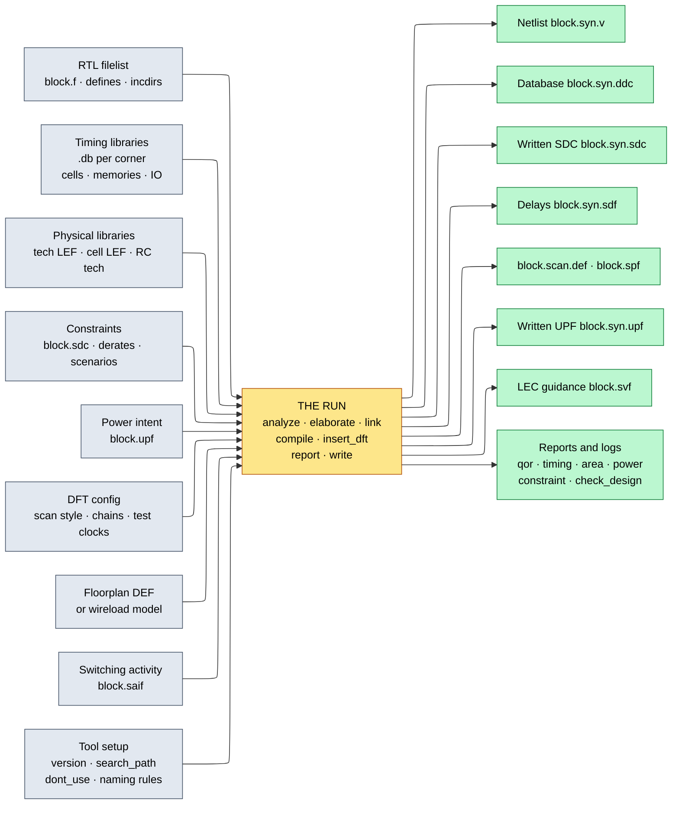
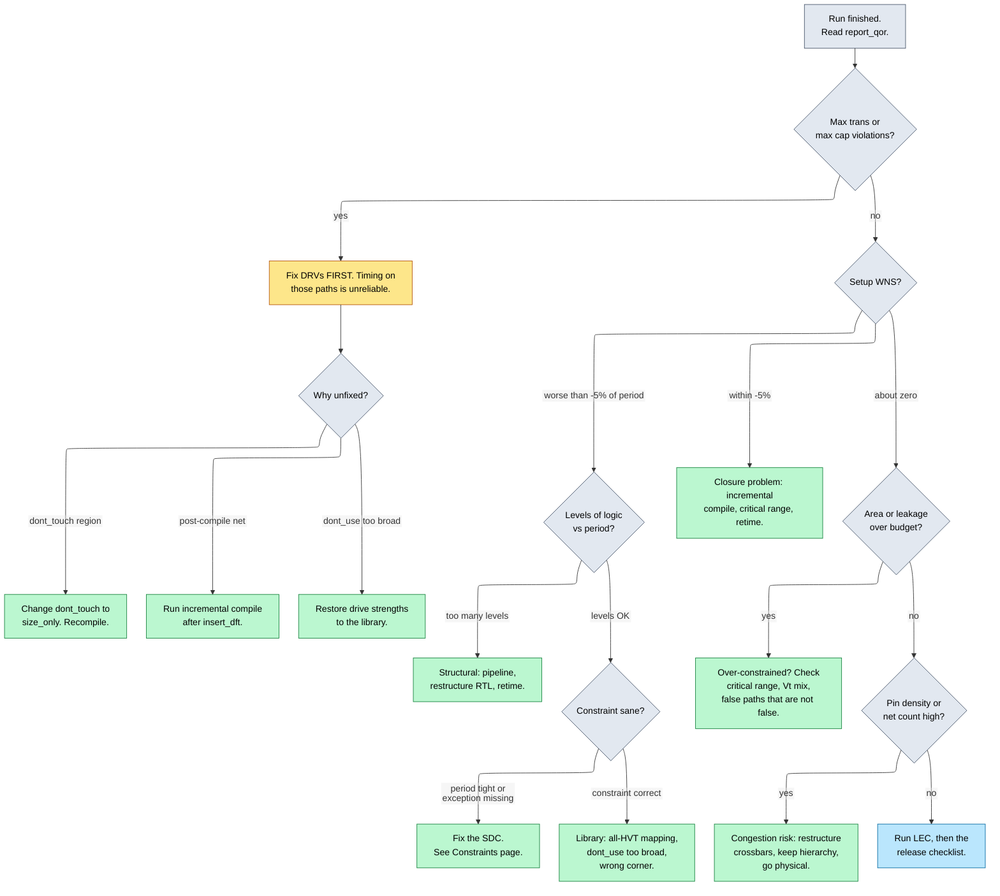

# The Synthesis Flow and QoR Closure — from a script to a signed-off netlist

> **Prerequisites:** [Synthesis_and_Optimization](01_Synthesis_and_Optimization.md) (what `compile` does inside — mapping as covering, retiming, the timing/area/power Pareto surface; never re-derived here), [Constraints_SDC](02_Constraints_SDC.md) (the SDC this flow sources, and why a wrong exception is invisible), [Standard_Cell_Libraries_and_Characterization](03_Standard_Cell_Libraries_and_Characterization.md) (the `.db`/`.lib` the run links against — corners, drive strengths, and the tables behind every `Incr` column read in §8).
> **Hands off to:** [Physical_Synthesis_and_Design_Planning](05_Physical_Synthesis_and_Design_Planning.md) (replaces this page's wireload fiction with a floorplan inside the loop), [Physical_Design](../05_Backend_Physical_Design/01_Physical_Design.md) (places and routes the netlist, and owns the wire delay and the hold fixing this page defers).

---

## 0. Why this page exists

A student who has only run a simulator has one mental model of an EDA tool: give it source and a stimulus, get waveforms, and if the waveforms are right you are done. Synthesis breaks every part of that. There is no stimulus, and there is no single right answer — there is a netlist *plus a stack of numbers*, and the numbers are as much the deliverable as the netlist. The tool will happily produce a netlist for broken RTL, nonsense constraints, and a library it only half found, and it will say so only in warnings buried in a 40,000-line log.

So the skill is not "type `compile_ultra`." It is **how to construct a run whose result you can trust, and how to read its output well enough to say what is wrong and what to change.** Page 01 explains why technology mapping is a covering problem; it does not explain why `report_area` says 85,171 when your floorplan is 60,000, or why `check_design` found four black boxes you did not know you had.

Getting the *process* wrong costs as much as getting the algorithm wrong. A run is a function of about a dozen input files, and if one is not version-controlled the run is not reproducible: a QoR regression cannot be bisected and a taped-out netlist cannot be recreated. A netlist released without logic equivalence checking (LEC) can differ functionally from the RTL that was verified, and nothing downstream notices. A netlist released with max-transition violations hands physical design a problem it cannot fix, because the offending cell was marked `dont_touch` by you.

Afterwards you should be able to: write and defend the stage order of a synthesis script; read an elaboration log and separate the two fatal warnings from the two hundred benign ones; choose a compile strategy and state its cost in debuggability and LEC; know where a block's timing budget comes from and what makes one infeasible; read `report_timing`, `report_qor`, `report_area`, `report_power`, and `report_constraint` line by line and name the culprit; and run the checklist that decides whether a netlist leaves the block.

---

## 1. The run as a data-flow: every file in, every file out

A synthesis run is a pure function from a set of input files to a set of output files. That is the operational definition of reproducibility, and it is what first-time users get wrong, because two inputs — tool version and library release — are invisible unless deliberately recorded.



**Contract:** every arrow in is a file whose content changes the netlist; every arrow out is a file some downstream tool treats as truth. **Trace:** change the SDC period from 1.00 ns to 0.95 ns and the tool re-solves the constrained optimization of [page 01 §7](01_Synthesis_and_Optimization.md) — upsizing, swapping $V_t$ — so the netlist, `report_area`, `report_power`, and every delay in the SDF change. **The trap it illustrates:** nothing in the output records *which* inputs produced it. If the library team pushed `r0p3 → r0p4` between Tuesday's run and Friday's, Friday's 4% area regression looks like an RTL bug and you spend a day bisecting innocent commits.

| Input | What it supplies | What breaks if wrong or missing |
|---|---|---|
| RTL filelist, defines, incdirs | the function to implement | a missing file becomes an unresolved reference → black box → paths through it vanish from timing |
| Timing libraries per corner | cell "instruction set", delays, setup/hold, leakage | wrong corner closes timing against a fiction; missing memory `.db` makes a macro a black box |
| Physical libraries | cell geometry, layer RC, pin access | unused in wireload mode; absent in physical mode means no coarse placement, so §9.6 returns |
| SDC | $T_{clk}$, I/O budget, exceptions ([page 02](02_Constraints_SDC.md)) | a missing clock leaves a whole cone unconstrained: reports clean, silicon fails |
| UPF | domains, isolation, level shift, retention | cells not inserted → a powered-down domain drives X into a live one |
| DFT config | scan style, chain count, test clocks | scan inserted after closure invalidates timing and area (§6) |
| Floorplan DEF **or** wireload model | the net-delay model | the largest single source of synthesis-to-PnR divergence (§9.6) |
| SAIF activity | per-net toggle rate $\alpha$ | power reports a flat guess; gating optimizes the wrong nets |
| Tool version, `search_path`, `dont_use`, naming rules | which cells are legal, what names are emitted | a drifting `dont_use` list changes QoR with no RTL change |

**Outputs, and who eats them.** `block.syn.v` goes to PnR, gate-level simulation, LEC, and ATPG; `block.syn.ddc` preserves attributes and constraint state so a later incremental session need not re-elaborate. `block.syn.sdc` is the constraint set *as the tool understood it after elaboration*, and this — not the hand-written source — is what PnR should read, because renaming during compile invalidates hand-written object references. `block.syn.sdf` carries delays for gate-level simulation ([Gate_Level_Sim_and_Emulation](../03_Frontend_RTL_and_Verification/13_Gate_Level_Sim_and_Emulation.md)); `block.scan.def` declares the chains *reorderable* and `block.spf` tells ATPG how to enter shift mode; `block.syn.upf` records the low-power cells inserted; `block.svf` is the transformation journal LEC replays (§10); the reports are the evidence that the run is releasable (§11).

**Reproducibility is a property of the whole set.** Scripts, filelist, SDC, UPF, and DFT config live in git under one tag, and the tool version string plus every library path and checksum are logged at run start and archived with the reports. Anything typed interactively is a bug. The test: *check out the tag, run one command, get the same netlist* — otherwise you cannot bisect a regression or answer "what changed?" after tape-out ([Design_Methodology_and_EDA_Infrastructure](../08_Cross_Cutting_Engineering/03_Design_Methodology_and_EDA_Infrastructure.md)).

---

## 2. The script, and why the stages are in that order

Written generically; every command has a direct counterpart in Design Compiler (DC) and Cadence Genus.

```tcl
#=====================================================================
#  syn.tcl -- block-level synthesis, revision R1.3.  DC form shown.
#=====================================================================
set BLOCK aes_core ; set REV R1.3
set LIB_ROOT /pdk/std/n7/sc7p5t/r0p4 ; set RTL_ROOT ../../rtl ; set CON ../../constraints
set RUN [file normalize ./run_${REV}]
file mkdir ${RUN}/reports ${RUN}/netlist ${RUN}/db ${RUN}/def ${RUN}/svf

# --- 1. environment: pin everything that can move QoR ----------------
set_host_options -max_cores 8                       ;# Genus: set_db max_cpus_per_server 8
puts "TOOL: [get_app_var sh_product_version]"        ;# archive the tool version
set_svf ${RUN}/svf/${BLOCK}.svf                     ;# LEC journal: MUST precede all optimization

# --- 2. libraries: the instruction set, and the corner ---------------
set search_path  [concat $search_path ${LIB_ROOT}/db ${RTL_ROOT}]
set target_library { sc7p5t_hvt_ssg0p675v125c.db
                     sc7p5t_svt_ssg0p675v125c.db
                     sc7p5t_lvt_ssg0p675v125c.db }  ;# mappable cells only
set link_library [concat * $target_library sram_2048x64_ssg.db pll_wrap_ssg.db]
set_min_library sc7p5t_svt_ssg0p675v125c.db \
    -min_version sc7p5t_svt_ffg0p825vm40c.db        ;# fast corner, used for hold
set_dont_use { sc7p5t_*/*_X0P5 sc7p5t_lvt/*_DLY* }  ;# weakest drives + delay cells banned

# --- 3. read the design: analyze -> elaborate -> link ----------------
set_app_var hdlin_infer_multibit default_all
#  analyze takes a Tcl list of files, not a filelist: -f is an abbreviation of
#  -format, so passing block.f to it silently does the wrong thing. Expand the
#  filelist yourself (or hand it to the front end with -vcs "-f block.f").
set RTL_FILES [split [string trim [read [open ${RTL_ROOT}/${BLOCK}.f]]] "\n"]
analyze -format sverilog -define {SYNTHESIS ASIC_TARGET} $RTL_FILES
elaborate ${BLOCK} -parameters "DATA_W=128,NUM_ROUNDS=10"
current_design ${BLOCK}
link                                                ;# resolve EVERY reference now
check_design -summary > ${RUN}/reports/${BLOCK}.check_design.rpt

# --- 4. constraints, derates, activity -------------------------------
source -echo -verbose ${CON}/${BLOCK}.sdc           ;# clocks, IO delay, exceptions
source ${CON}/${BLOCK}.derate.tcl                   ;# OCV / AOCV derates
read_saif -input ../sim/${BLOCK}.saif -instance_name tb/dut
check_timing > ${RUN}/reports/${BLOCK}.check_timing.rpt   ;# unconstrained endpoints

# --- 5. power intent and clock gating --------------------------------
load_upf ${CON}/${BLOCK}.upf                        ;# domains, iso, level shift, retention
set_clock_gating_style -sequential_cell latch \
    -positive_edge_logic {integrated:CKLNQ_X4} \
    -control_point before -control_signal scan_enable -minimum_bitwidth 3

# --- 6. DFT setup: test-ready compile --------------------------------
set_dft_signal -view existing_dft -type ScanClock -timing {45 55} -port clk
set_dft_signal -view existing_dft -type Reset -active_state 0 -port rst_n
set_dft_signal -view spec -type ScanEnable -active_state 1 -port scan_en
set_dft_signal -view spec -type TestMode   -active_state 1 -port test_mode
set_scan_configuration -style multiplexed_flip_flop \
    -chain_count 8 -clock_mixing no_mix -add_lockup true
create_test_protocol
dft_drc > ${RUN}/reports/${BLOCK}.dft_drc.pre.rpt

# --- 7. the net-delay model: floorplan, or the fiction ---------------
if {$PHYSICAL} { read_def ${CON}/${BLOCK}.fp.def
} else { set_wire_load_mode enclosed ; set_wire_load_model -name 100KGATES }

# --- 8. compile ------------------------------------------------------
set_app_var compile_seqmap_propagate_constants false     ;# LEC hygiene
compile_ultra -gate_clock -scan -no_autoungroup     ;# Genus: syn_generic; syn_map; syn_opt
insert_dft                                          ;# stitch chains into the scan flops
compile_ultra -incremental -gate_clock -scan        ;# repair what stitching perturbed

# --- 9. report BEFORE you write --------------------------------------
report_qor                                   > ${RUN}/reports/${BLOCK}.qor.rpt
report_timing -delay_type max -max_paths 200 -nworst 5 -input_pins -nets \
              -transition_time -capacitance  > ${RUN}/reports/${BLOCK}.timing.max.rpt
report_timing -delay_type min -max_paths 200 > ${RUN}/reports/${BLOCK}.timing.min.rpt
report_constraint -all_violators             > ${RUN}/reports/${BLOCK}.constraint.rpt
report_area  -hierarchy                      > ${RUN}/reports/${BLOCK}.area.rpt
report_power -hierarchy -analysis_effort high> ${RUN}/reports/${BLOCK}.power.rpt
report_clock_gating -gated -ungated          > ${RUN}/reports/${BLOCK}.cg.rpt
report_scan_path -view existing_dft -chain all > ${RUN}/reports/${BLOCK}.scan.rpt

# --- 10. write the deliverables --------------------------------------
change_names -rules verilog -hierarchy              ;# legal, stable identifiers, once
write -format verilog -hierarchy -output ${RUN}/netlist/${BLOCK}.syn.v
write -format ddc     -hierarchy -output ${RUN}/db/${BLOCK}.syn.ddc
write_sdc -version 2.1 ${RUN}/netlist/${BLOCK}.syn.sdc
write_sdf -version 3.0 ${RUN}/netlist/${BLOCK}.syn.sdf
write_scan_def -output ${RUN}/def/${BLOCK}.scan.def
write_test_protocol -output ${RUN}/netlist/${BLOCK}.spf
save_upf ${RUN}/netlist/${BLOCK}.syn.upf
exit
```

### 2.1 Why nothing in that order can move

1. **`set_svf` first.** The SVF journals every transformation the optimizer performs; LEC replays it to follow register merges, retiming, and FSM re-encoding (§10). Anything optimized before the journal opens is invisible to LEC and surfaces later as an unmapped key point.
2. **Libraries before RTL.** `link` needs `link_library` to resolve macros, and `set_dont_use` must precede mapping because it removes cells from the covering problem — applied later it does nothing to cells already chosen.
3. **`analyze` → `elaborate` → `link` are three different things.** `analyze` parses each file, catching syntax errors per file. `elaborate` instantiates the top module with concrete parameters, unrolls `generate`, and builds the Boolean network — the design first exists as one object here. `link` resolves every module reference and is **the only stage that reports black boxes**, so it must be explicit and its output read.
4. **`check_design` right after link**, because multiply-driven nets, unconnected inputs, and empty modules make every later report meaningless. A black box mid-path is not a slow path; it is a *missing* path.
5. **SDC after elaboration**, because constraints reference objects (`[get_pins u_div/q_reg/CK]`) that only elaboration creates. Sourcing earlier gives "cannot find object" warnings people scroll past, leaving the design half-constrained.
6. **`check_timing` before compile**, so unconstrained endpoints ([page 02 §5](02_Constraints_SDC.md)) surface before six hours of compile rather than after.
7. **UPF after link, before compile**, so isolation, level-shifter, and retention delay and area sit inside the closure loop. **Clock-gating style before compile**, because it names the integrated clock-gating (ICG) cell and the tool cannot retro-fit another without redoing the gating decisions.
8. **DFT setup before compile.** `-scan` maps to scan-equivalent flops from the first pass, putting their area and D-path mux delay inside the loop (§6) — the most important ordering rule on this page.
9. **The net-delay model before compile.** Wireload model or floorplan decides what "delay" means for every net, hence which path is critical, hence every decision the optimizer makes (§9.6).
10. **`compile` → `insert_dft` → *incremental* compile.** Stitching adds load to every `Q` and routes `scan_en` to every flop, perturbing timing and design rules; the incremental pass repairs locally, and skipping it causes the §8.5 violation.
11. **Report before write** — reports that fail §11 mean a diagnostic artifact, not a netlist. **`change_names` immediately before write, once**, because the SDC, scan DEF, SDF, and LEC setup all reference those names; running it twice, or after `write_sdc`, desynchronizes them.

### 2.2 The same flow with no EDA license

```tcl
# ---- yosys: read -> elaborate -> optimize -> map --------------------
read_liberty -lib $LIB/sky130_fd_sc_hd__tt_025C_1v80.lib
read_verilog -sv rtl/aes_core.sv rtl/sbox.sv
hierarchy -top aes_core -check     ;# = elaborate + link; -check errors on black boxes
synth -top aes_core                ;# proc; opt; fsm; memory; techmap (generic optimization)
dfflibmap -liberty $LIB/sky130_fd_sc_hd__tt_025C_1v80.lib     ;# map sequential cells
abc -liberty $LIB/sky130_fd_sc_hd__tt_025C_1v80.lib -D 2000   ;# map combinational, 2 ns
opt_clean -purge
stat -liberty $LIB/sky130_fd_sc_hd__tt_025C_1v80.lib          ;# = report_area
write_verilog -noattr netlist/aes_core.syn.v

# ---- OpenSTA: the reports ------------------------------------------
read_liberty $LIB/sky130_fd_sc_hd__tt_025C_1v80.lib
read_verilog netlist/aes_core.syn.v ; link_design aes_core
read_sdc constraints/aes_core.sdc
report_checks -path_delay max -group_count 10 -format full_clock_expanded
report_checks -path_delay min ; report_tns ; report_wns ; report_power
report_check_types -max_transition -max_capacitance -violators
```

`hierarchy -check` is `link` plus `check_design`, `synth` is generic optimization, `abc -liberty -D` is technology mapping against a delay target, and `report_checks` prints the same arrival/required/slack structure read in §8. Missing: production multi-corner handling, UPF, DFT insertion, incremental physical optimization — exactly the gap the rest of this page describes. OpenROAD's flow scripts wrap all three into a `config.mk`-driven pipeline that runs to GDS.

---

## 3. Elaboration-time surprises

Elaboration is where RTL stops being text and becomes a graph, and where most real bugs are first *visible* — almost never as errors. The tool's default posture is to keep going: substitute a default, tie an input low, infer a latch, truncate a bus, and warn.

**Parameter and generate resolution.** Elaboration evaluates parameters and unrolls `generate` for *the configuration you instantiated*, so a `generate if (WIDTH > 8)` branch that is broken never elaborates at `WIDTH = 8`. **Elaborating one configuration proves nothing about the others**; parameterized blocks need a synthesis regression per released configuration.

**Unconnected ports.** An unconnected *input* is tied to a constant or left dangling, and constant propagation can delete the whole downstream cone — an entire feature vanishes and timing still reports clean. An unconnected *output* is harmless but signals a wrong instantiation.

**Inferred latches.** A variable assigned in a combinational process but not on every path must hold its value, and the only clockless hardware that holds a value is a level-sensitive latch. Latches are legal; an *unintended* latch is a stop-the-line bug — transparent for half the cycle, so STA must do time-borrowing, hold checks tighten, and DFT cannot scan it without extra work.

**Width mismatch** truncates silently under Verilog semantics; the tool warns and obeys, and simulation truncates identically, so this is an RTL bug synthesis merely mentions first. **`X` propagation:** RTL simulation starts flops at `X`, but synthesis has no `X` and ignores `initial` blocks for ASIC targets, so a design relying on simulation-time initialization powers up arbitrarily — and conversely the netlist's flops are `X` at time 0 in gate-level simulation, where `X`-pessimism can wedge a testbench the RTL passed. The fix is architectural: reset every flop whose initial value matters ([RTL_Design_Methodology](../03_Frontend_RTL_and_Verification/01_RTL_Design_Methodology.md)). **Multiply-driven nets** have no gate-level meaning and are one of the few genuinely fatal conditions.

**Reading the log, in a fixed order.** Count errors (must be zero); read the **link** section and compare its black-box list against the expected macros; read `check_design`; diff inferred latches against the expected list (usually empty, or the ICG latches); group width mismatches by module; then compare the warning **census** — a count per message class — against the previous run. A mature block emits hundreds of benign warnings nobody reads in full; what you *can* do is notice a class jumping by 40. Identifiers differ across DC, Genus, and Yosys, so the table below gives representative text, with fatality graded **tool-fatal** (the run is invalid), **design-fatal** (the run completes, the hardware is wrong), or benign.

| # | Representative message | What it really means | Fatal? |
|---|---|---|---|
| 1 | `Unresolved reference to module 'foo'` / `creating black box` | a file missing from the filelist, or a macro `.db` missing from `link_library` | **tool-fatal** — paths through it vanish from timing |
| 2 | `Net 'n' is driven by more than one source` | two processes or assigns drive one net | **tool-fatal** |
| 3 | `Inferred memory device 'x_reg' ... latch` | a combinational process does not assign `x` on every path | **design-fatal** unless deliberate |
| 4 | `Signal 'a' is being read but is not in the sensitivity list` | simulation and synthesis will disagree | **design-fatal** |
| 5 | `Width mismatch: converting 12 bits to 8 bits` | silent truncation, or unintended zero/sign extension | **design-fatal** roughly 1 case in 5; triage each |
| 6 | `Input port 'en' of instance 'u_x' is unconnected; assumed logic 0` | dangling instance input | **design-fatal** — usually deletes a feature |
| 7 | `Register 'cnt_reg[7]' is removed: constant 0` | D is constant, or Q is unobservable | benign if intended; **design-fatal** if a feature was optimized away |
| 8 | `Case statement is not full; latch inferred` | incomplete `case` in a combinational process | **design-fatal** — same defect as #3 |
| 9 | `Timing loop detected: n1 -> n2 -> n1; breaking arc` | combinational feedback; the tool disables an arc arbitrarily | **design-fatal** — timing through the loop is unchecked |
| 10 | `Cannot find object 'u_div/q_reg/CK'` while sourcing SDC | a constraint references a name that does not exist post-elaboration | **design-fatal** — the constraint silently does nothing ([page 02 §6](02_Constraints_SDC.md)) |

Rows 1, 2, 9, 10 must be zero before you compile. Rows 3 and 8 are one defect seen twice. Row 7 costs the most engineer-hours, because "my counter disappeared" looks like a tool bug and is nearly always a missing connection upstream.

---

## 4. Compile strategies

**Baseline.** Elaborate, source SDC, one `compile`, write. Every RTL module becomes a netlist module, `report_area -hierarchy` maps onto your source tree, and LEC matches key points by hierarchical name trivially. On a 200 k-instance block at 1.0 ns: about 90 minutes at medium effort, WNS $-0.18$ ns.

**Failure.** Hierarchy boundaries are *optimization barriers*. A constant tied at the parent cannot propagate into the child, so the child builds generality it never uses; a 32-bit output port of which the parent uses 4 bits still costs 32 flops; a path crossing a boundary cannot be rebalanced across it, the child's output driver cannot be sized against the parent's real load, and duplicate logic on both sides cannot merge. On a control-heavy block that costs **3–8% area** and **5–15% of a critical path** crossing several small hierarchies.

**Derived repair — two mechanisms, usually confused.** *Boundary optimization* keeps the hierarchy but optimizes through it: constants propagate in, unused ports are removed, inverters push across, drivers size against real loads. *Ungrouping* deletes the hierarchy entirely. Both are paid in the same currency — the netlist stops resembling the RTL:

| Consequence | Boundary optimization | Ungrouping |
|---|---|---|
| LEC key-point matching at the interface | port list changes → unmatched points | module gone entirely |
| `report_area -hierarchy` attribution | preserved | destroyed; rolls up to the parent |
| ECO by hierarchical instance name | mostly works | names mangled and unstable across runs |
| Physical partitioning of that module | possible | impossible |
| Netlist reuse elsewhere | possible | impossible |
| Matching a gate waveform to RTL | hard | very hard |

**Selection boundary.** Ungroup small glue hierarchies and thin wrappers freely — they exist for RTL readability. **Never** ungroup a future physical partition, a hard-IP wrapper, a reused module, clock-generation or reset logic (you need those names for CTS and constraints), or anything you expect to ECO late.

**The auto-ungroup trap.** `compile_ultra` auto-ungroups by default, dissolving any hierarchy it estimates is small enough to pay — frequently including the module you intended as a physical partition. The failure is silent: the run succeeds, QoR improves slightly, and three weeks later PnR cannot find the partition, LEC reports 400 unmatched points, and your ECO script's instance paths do not exist.

```tcl
compile_ultra -no_autoungroup                  ;# disable the heuristic globally
set_ungroup [get_cells u_pipe_stage*] false    ;# protect specific hierarchies
set_app_var compile_ultra_ungroup_dw false     ;# keep synthetic operator hierarchies
```

The reasonable policy is `-no_autoungroup` plus explicit `set_ungroup ... true` on the wrappers you *want* dissolved — inverting the default from "the tool decides silently" to "you decide, in a reviewed file."

**Preservation: three attributes, three scopes,** constantly confused and each with a different failure mode.

| Attribute | Scope | Tool may still... | Classic misuse |
|---|---|---|---|
| `set_dont_touch` | that instance or design | nothing: not size, not buffer, not delete | applied to a whole reused module → the tool cannot buffer a net inside it → permanent max-transition violation (§8.5) |
| `set_size_only` | that cell | change drive strength and $V_t$, not structure | the right tool for a hand-instantiated synchronizer flop |
| `set_dont_use` | a *library cell*, everywhere | use any other cell | not cleared between runs; banning so many cells the mapper cannot close |

`dont_touch` is for structures whose *logic* must survive (CDC and reset synchronizers, security logic, hand-built delay chains); `size_only` is for structures whose logic must survive but whose *drive* should be optimized — which is what you almost always actually want. Using `dont_touch` where `size_only` would do is the direct cause of the most common release blocker in §11.

**Effort, and where incremental is right.** `-incremental` restricts the tool to *local* moves — resize, buffer, pin-swap, clone, local remap — so the distinction is not fast versus slow but whether structure can change. A hole of 20% of the period is structural (too many logic levels, and no amount of sizing removes a level) and needs a full recompile, retiming ([page 01 §6](01_Synthesis_and_Optimization.md)), or an RTL change. A hole of 2–3% after scan stitching or a small ECO is local: incremental fixes it in minutes and leaves the rest of the netlist alone, which matters because a full recompile re-randomizes every name and invalidates every ECO script. Effort obeys the anytime curve: medium → high on a 200 k block costs $2\text{–}4\times$ runtime for $2\text{–}5\%$ area or $3\text{–}8\%$ WNS.

---

## 5. Hierarchical synthesis and timing budgeting

Flat synthesis is superlinear in instance count. Beyond roughly **0.5–2 M instances** it runs out of memory or runtime (budget **2–4 GB RAM per 100 k instances** at high effort, 3–12 h for a 200–500 k block). Above that the design is partitioned, which immediately creates the budgeting problem.

| Strategy | How it runs | Buys | Costs |
|---|---|---|---|
| **Top-down (flat)** | one compile, all hierarchy visible | best QoR: global optimization, no budget error | runtime and memory; one long serial iteration; no team parallelism |
| **Bottom-up** | compile each leaf standalone, `dont_touch` it, compile the parent | parallel, small runs, clear ownership | interface timing is guesswork; a child compiled to a wrong budget forces a parent recompile too — endless churn |
| **Top-down with budgets** | derive per-block constraints from a top-level analysis, compile blocks in parallel | parallelism *and* interface consistency | needs a top-level model early, and a real budget derivation |

Production SoCs use the third, with the second as a fallback for IP delivered as a netlist. The top level holds an abstraction rather than gates — an **ETM**, an **ILM**, or on day one a **black box plus budget**. What each is, what each costs as a fraction of the block, and their regeneration obligations are [Physical_Synthesis §6](05_Physical_Synthesis_and_Design_Planning.md). The one number this page needs is the ETM's **5–15% boundary-path *pessimism*** (not its size): a `.lib` collapses multiple paths through a port into a worst case, which is cause 4 of §5.3.

### 5.2 Where the budget comes from

Partitioning creates the budgeting problem: each block is compiled alone, so each needs an SDC describing the world outside it, and those SDCs must jointly fit the period. The derivation — reserving $t_{cq}$, $t_{su}$, $t_{unc}$ and the top-level wire, splitting the remainder proportional to logic depth, turning the split into `set_input_delay`/`set_output_delay`, and the sum check that catches an infeasible set — belongs to design planning and is worked in full at [Physical_Synthesis §6](05_Physical_Synthesis_and_Design_Planning.md), with a re-budgeting exercise in its Worked Problem 2. Two properties of it matter to a synthesis run and are used below:

- the top-level wire is deliberately counted in **both** adjacent budgets, each block seeing the wire it drives into or receives from, so the sum of a crossing pair exceeds $T_{clk}-t_{unc}$ by exactly one wire term;
- $t_{unc}$ is the **pre-CTS** value, 150–250 ps at 7 nm ([page 02](02_Constraints_SDC.md)) — the same number §8.1's report subtracts, not the 50–80 ps that survives CTS.

### 5.3 Every block closes, the top does not

Six blocks each report WNS $=+0.005$ ns; the assembly reports $-0.090$ ns. Causes, in descending frequency:

1. **The top-level wire has no owner.** Both I/O delays were written as if the port-to-port connection were free, so 60–120 ps of routing and repeaters between blocks 400 µm apart is charged to nobody and appears only at assembly. The invariant detects exactly this: if $\text{OD}_A+\text{ID}_B$ equals $T_{clk}-t_{unc}$ with no wire term, the wire was dropped.
2. **Budgets split by convention, not structure.** "Half the period each" is defensible only at equal depth; with 6 levels against 11 it over-constrains A (wasted area and leakage) and under-constrains B (which cannot close and does not know it).
3. **Inconsistent clock assumptions** — A used `set_clock_latency 0.15`, B used `0.20`, and the top has one real tree, so the 50 ps lands entirely on crossing paths.
4. **The abstraction lied** — ETM worst-case collapse in one direction, wrong-mode characterization in the other.
5. **Top-level glue** — address decoders, clock gaters, and reset logic that live in no block and got no budget.

The countermeasure is procedural: derive budgets from one top-level source, assert the invariant by script for every crossing port, and keep clock-latency and uncertainty in a shared versioned fragment so every block reports against the same assumptions.

---

## 6. DFT-aware synthesis

Scan replaces each D flip-flop with a **scan flip-flop**: the same storage element preceded by a 2:1 multiplexer selecting the functional data `D` or the serial input `SI` from the previous flop, under a global `SE` (scan enable). Why that works — turning a sequential test problem into a combinational one — is [DFT_and_ATPG](../06_Signoff/02_DFT_and_ATPG.md). What matters here is that the substitution is not free.

```tikz
\usepackage{circuitikz}
\begin{document}
\begin{circuitikz}[american,thick,scale=0.9,transform shape]
  \draw (2.0,1.7) -- (3.3,1.1) -- (3.3,-1.1) -- (2.0,-1.7) -- cycle;
  \node at (2.35,1.0) {\small 0};
  \node at (2.35,-1.0) {\small 1};
  \node at (2.72,0.05) {\small MUX};
  \draw (0.2,1.0) node[left]{$D$}  -- (2.0,1.0);
  \draw (0.2,-1.0) node[left]{$SI$} -- (2.0,-1.0);
  \draw (2.65,-2.7) node[below]{$SE$} -- (2.65,-1.44);
  \draw (3.3,0.0) -- (4.6,0.0);
  \draw (4.6,-1.2) rectangle (6.5,1.2);
  \node at (5.55,0.85) {\small DFF};
  \node[anchor=west] at (4.65,0.05) {\small D};
  \node[anchor=east] at (6.45,0.05) {\small Q};
  \draw (5.2,-1.2) -- (5.55,-0.85) -- (5.9,-1.2);
  \draw (5.55,-2.7) node[below]{$CK$} -- (5.55,-1.2);
  \draw (6.5,0.0) -- (8.7,0.0) node[right]{$Q$};
  \draw (7.9,0.0) node[circ]{} -- (7.9,-2.4) node[below]{$SO$};
\end{circuitikz}
\end{document}
```

**Contract:** `SE = 0` selects `D` (mission mode), `SE = 1` selects `SI` (shift); `SO` is just `Q`, wired to the next cell's `SI`. **Trace:** in mission mode a signal arriving at `D` now traverses the mux before reaching the storage node, so the effective setup requirement grows by the mux delay — **15–30 ps at 7 nm, roughly 1–2 FO4** (7 nm FO4 $\approx$ 11–14 ps) — while `Q` carries an extra fanout (the next cell's `SI` pin) plus its routing, slowing every functional path *out of* that flop. **The trade-off:** the scan cell costs **+12–25% area** over a plain D flop and perturbs *both ends* of every register-to-register path, which is why it cannot be added after closure — inserting scan into a netlist that closed at 1.0 ns adds 15–30 ps of setup and extra load to every path with the optimization budget already spent.

The repair is **test-ready compile** (`compile -scan`), which maps to scan-equivalent flops from the first mapping pass so the mux delay and area are inside the loop. `insert_dft` afterwards only *stitches* — `Q` to the next `SI`, plus `SE` routing — and the incremental compile repairs the induced load. What it cannot repair is a `dont_touch` region, which is why §8.5's violation lands where it does.

```wavedrom
{ "signal": [
  { "name": "clk",      "wave": "p........" },
  { "name": "scan_en",  "wave": "1...0.1..", "node": "....a.b.." },
  { "name": "scan_in",  "wave": "2345x....", "data": ["p0","p1","p2","p3"] },
  { "name": "chain Q",  "wave": "x2345x...", "data": ["p0","p1","p2","p3"] },
  {},
  { "name": "mode",     "wave": "3...4.3..", "data": ["shift","capture","shift"] }
 ],
 "edge": ["a<->b at-speed capture window"],
 "head": {"text": "scan: load state serially, run one functional cycle, shift the result out"}
}
```

**Contract:** with `scan_en = 1` the chain is one long shift register on the functional clock; dropping it for one or two cycles lets the combinational logic drive the flops — the actual test. **Trace:** a 4-bit chain takes 4 shift cycles to load, 1 to capture, 4 to unload (overlapped with the next load). **The trade-off:** `scan_en` must reach **every flop in the block** and switch cleanly between the last shift edge and the capture edge, making it one of the highest-fanout nets in the design — and it is created *after* the main compile, so it is a structurally guaranteed max-transition risk unless the incremental pass buffers it, and an impossible one to fix inside a `dont_touch` module.

**Chain partitioning.** `set_scan_configuration` fixes four things that trade against each other. `-style multiplexed_flip_flop` is the cell above, the default because it needs no extra clocking. `-chain_count N` sets test time, proportional to the *longest* chain, $T_{test}\approx N_{pat}\,(L_{max}+1)$ cycles: doubling the count halves shift time and doubles the scan pin cost. Uncompressed chains run **1000–5000 flops**; with on-chip compression, internal chains are **100–500 flops** and there are hundreds. `-clock_mixing no_mix` keeps clock domains in separate chains, avoiding **lockup latches** (half-cycle-transparent latches that absorb shift-path skew between domains) at the cost of at least one chain per domain — which can blow the pin budget on a design with 12 clocks; `-add_lockup true` covers unavoidable mixing.

**The placement consequence people miss.** The synthesis chain order is essentially arbitrary, and if PnR routes it literally the chain wanders across the whole block, consuming enormous routing resource for a test-only signal. `write_scan_def` declares the chains as *reorderable sets* so the placer re-orders each by physical proximity. Emitting it is not bookkeeping; it is what keeps scan from becoming a congestion source (§9.5).

---

## 7. Power-aware synthesis

**Reading UPF.** `load_upf` supplies which logic belongs to which power domain, which supplies exist, and what must happen at each boundary ([UPF_and_CPF_Power_Intent](../02_Power_and_Low_Power/05_UPF_and_CPF_Power_Intent.md)). Synthesis inserts three cell classes: **isolation cells** clamping a switchable domain's outputs so a powered-down domain never drives an indeterminate level into a live one, in the functional path at 10–25 ps; **level shifters** wherever a signal crosses a voltage boundary, since a logic level is meaningful only relative to a rail; and **retention flops** carrying a shadow element on an always-on supply, at roughly **+30–60% area** plus always-on rail routing. The synthesis-specific failure: those cells must be in `target_library` and *not* caught by `set_dont_use`, because an over-broad pattern silently defeats the strategy — check inserted-cell counts against the UPF strategy count explicitly.

**Clock gating.** Dynamic power is $P=\alpha C V_{DD}^2 f$, and the clock is the one net with $\alpha=1$ by construction: it toggles every cycle whether or not data changes. That is why the clock network is typically **20–35% of dynamic power** (35–50% counting the flop-internal clock, which is what gating also kills) and why gating is the highest-yield transform synthesis has. (Why you cannot simply `AND` the clock, and why the ICG contains a latch, is derived in [Power_Reduction_Techniques §2.2](../02_Power_and_Low_Power/04_Power_Reduction_Techniques.md).) The tool finds opportunities *structurally*: RTL of the form

```systemverilog
always_ff @(posedge clk) begin
    if (en) data_q <= data_d;
end
```

elaborates into a register bank whose D input is a 2:1 mux selecting `data_d` or the flop's own `Q` — a *recirculation mux* per bit. That mux is the signature: wherever $N$ flops share one recirculation condition, the mux tree is deleted and one ICG gates the clock of all $N$. Counting in NAND2-equivalent gates (GE) — D flop $\approx 5$, 2:1 mux $\approx 2.5$, ICG $\approx 5\text{–}7$ — ungated costs $N(5+2.5)$ and gated costs $5N+6$, so gating wins on area when

$$
2.5\,N > 6 \quad\Longrightarrow\quad N > 2.4
$$

which is exactly why `-minimum_bitwidth` defaults to **3**: below that you pay an ICG to save fewer muxes than it costs, *and* add a cell CTS must balance. Full arithmetic including power in **Problem 1**.

| `set_clock_gating_style` option | Consequence |
|---|---|
| `-sequential_cell latch` | the enable is latched while the clock is low, so a late enable cannot glitch the gated clock — the standard choice |
| `-positive_edge_logic {integrated:CKLNQ_X4}` | picks a characterized, DRC-clean, CTS-friendly ICG instead of a hand-built latch plus AND |
| `-control_point before` | observability logic that lets ATPG toggle the gated flops; without it, coverage collapses |
| `-control_signal scan_enable` | `SE` forces the gate open in test — shift mode must clock every flop |
| `-minimum_bitwidth 3` | the threshold derived above |

**Gating coverage** — the fraction of gateable registers actually gated — is a release metric at **≥ 90%**; `report_clock_gating -ungated` says which banks were skipped and why (too small, no common enable, enable is the clock, register is `dont_touch`).

**Operand isolation** applies the same idea to datapath: when an expensive operator's result is unused its inputs still toggle and it burns power computing a discarded value, so AND gates hold the operands stable. The break-even is a width argument — an $n\times n$ multiplier costs $O(n^2)$ gates while isolating it costs $2n$ AND gates plus enable extraction, so at $n=32$ that is ~2000 GE against 64 GE and it pays whenever the operator idles more than a few percent of cycles, while at $n=4$ the isolation logic is a large fraction of the operator and its operand-path delay may cost more than the power saved. Isolate multipliers, dividers, and wide shifters; do not isolate incrementers.

**Activity.** Every number in `report_power` depends on per-net $\alpha$, and without annotation the tool propagates a default (commonly 0.1 on primary inputs) so the report is a shape, not a measurement. Annotating a **SAIF** (Switching Activity Interchange Format) file from an RTL simulation of a representative workload typically moves reported dynamic power by **20–50%** and changes *which* nets the optimizer targets. Choosing that workload — and why average-power and peak-power vectors are different files — is [Block_Activity_and_Power](../02_Power_and_Low_Power/02_Block_Activity_and_Power.md); signoff-grade analysis is [Power_Analysis_and_Signoff](../02_Power_and_Low_Power/06_Power_Analysis_and_Signoff.md).

---

## 8. Reading the reports

All excerpts are invented but format-faithful, and they are **mutually consistent** — one run of one block — so you can cross-check them exactly as in practice.

### 8.1 `report_timing`

```text
  Startpoint: u_ctl/mode_reg[2]  (rising edge-triggered flip-flop clocked by clk)
  Endpoint:   u_mix/acc_reg[7]   (rising edge-triggered flip-flop clocked by clk)
  Path Group: clk      Path Type: max

  Point                                   Fanout    Cap     Incr      Path
  --------------------------------------------------------------------------
  clock clk (rise edge)                                    0.000     0.000
  clock network delay (ideal)                              0.150     0.150
  u_ctl/mode_reg[2]/CK (DFFRPQ_X1)                         0.000     0.150 r
  u_ctl/mode_reg[2]/Q  (DFFRPQ_X1)             1     2.1    0.078     0.228 f
  u_ctl/U9911/ZN       (INVD_X1)              68    61.4    0.121     0.349 r
  u_alu/U2210/ZN       (NAND2_X2)              3     5.0    0.038     0.387 f
  u_alu/U2211/ZN       (AOI21_X1)              2     3.4    0.044     0.431 r
  ... 19 more combinational stages ...        --      --    0.462     0.893
  u_mix/U880/Z         (MUX2_X2)               1     2.8    0.049     0.942 f
  u_mix/acc_reg[7]/D   (DFFRPQ_X2)             1      --    0.000     0.942 f
  data arrival time                                                  0.942

  clock clk (rise edge)                                    1.000     1.000
  clock network delay (ideal)                              0.150     1.150
  clock uncertainty                                       -0.180     0.970
  u_mix/acc_reg[7]/CK  (DFFRPQ_X2)                         0.000     0.970 r
  library setup time                                      -0.061     0.909
  data required time                                                 0.909
  --------------------------------------------------------------------------
  data required time                                                 0.909
  data arrival time                                                 -0.942
  --------------------------------------------------------------------------
  slack (VIOLATED)                                                  -0.033
```

The report has exactly two halves — the two sides of the setup inequality of [page 02 §1.1](02_Constraints_SDC.md).

- **Startpoint / Endpoint** name the launch and capture flops; "input port" or "output port" instead means an I/O path governed by `set_input_delay`/`set_output_delay`. **`Incr`** is this row's contribution and **`Path`** the running sum, so $\text{Path}_i=\text{Path}_{i-1}+\text{Incr}_i$; the `r`/`f` suffix is transition direction, because rise and fall delays differ.
- **`clock network delay (ideal)` = 0.150 appears on both halves.** "Ideal" means no clock tree exists yet, so it cancels and contributes nothing to slack. Post-CTS the two numbers differ by the real skew, and that difference *does* move slack (one third of Problem 3).
- **`clock uncertainty` $-0.180$** is jitter plus a pre-CTS skew estimate, subtracted from the required time — 18% of a 1 ns period on margin, normal before CTS, shrinking to 50–80 ps after. **`library setup time` $-0.061$** is $t_{su}$ from the characterization tables ([page 03](03_Standard_Cell_Libraries_and_Characterization.md)), and **slack $=$ required $-$ arrival.**

**Find the culprit by scanning the `Incr` column for outliers, not the total.** Combinational delay is $0.942-0.228=0.714$ ns over 23 stages, averaging **31 ps/stage** — normal for 7 nm. But `u_ctl/U9911/ZN` contributes **0.121 ns**, 3.9× the average and 12.8% of the path, with fanout 68 and 61.4 fF on the weakest legal inverter. That is one under-driven high-fanout net, not a depth problem. Problem 2 completes the diagnosis.

### 8.2 `report_qor`

```text
  Timing Path Group 'clk'                   Cell Count
  ------------------------------------      ------------------------------
  Levels of Logic:                 23.00     Hierarchical Cell Count:    38
  Critical Path Length:             0.79     Leaf Cell Count:        158346
  Critical Path Slack:             -0.03     Buf/Inv Cell Count:      21106
  Critical Path Clk Period:         1.00     Combinational Cells:    117132
  Total Negative Slack:            -9.84     Sequential Cells:        41210
  No. of Violating Paths:         412.00     Macro Count:                 4
  Worst Hold Violation:            -0.21
  Total Hold Violation:          -284.61    Design Rules
  No. of Hold Violations:        2917.00     ------------------------------
                                             Total Number of Nets:   161890
  Area                                       Nets With Violations:      184
  ------------------------------------       Max Trans Violations:      167
  Combinational Area:            11127.5     Max Cap Violations:         17
  Noncombinational Area:         11538.8
  Macro/Black Box Area:          56320.0    Hostname: synth07
  Net Area:                       6184.9    CPU seconds: 39204.7
  Cell Area (netlist):           78986.3    Elapsed: 5:22:11
  Design Area:                   85171.2    Memory: 4.8 GB
```

- **WNS** ($-0.03$) is the worst path, **TNS** ($-9.84$ ns) the sum of negative slacks, **412** the count. The *ratio* is the diagnostic: $9.84/412 = 24$ ps average violation — shallow and wide, so a closure problem. The same TNS concentrated in 3 paths would be structural.
- **Levels of Logic 23** against 1.00 ns, versus a 7 nm rule of thumb of **25–35 levels at 1 GHz**: depth is fine. If this said 60, no sizing would close it. **Hold WNS $-0.21$, TNS $-284.61$** looks catastrophic and is expected and not actionable (§9.4). **167 max-transition and 17 max-capacitance violations** are release blockers.
- **41210 sequential of 158346 leaf cells** is 26% flops, reasonable for a datapath block; **Buf/Inv at 21106** is 13% of leaf cells, and above ~20% the tool is buffering its way out of something it should be restructuring out of. Runtime and memory say whether the flow survives the next revision's size.

### 8.3 `report_area`

```text
  Number of ports:      1206     Combinational area:        11127.464
  Number of nets:     161890     Buf/Inv area:               1413.184
  Number of cells:    158346     Noncombinational area:     11538.800
  Combinational:      117132     Macro/Black Box area:      56320.000
  Sequential:          41210     Net Interconnect area:      6184.930
  Macros/black boxes:      4       (Wire load has been used to compute net area)
  Buf/inv:             21106     Total cell area:           78986.264
  References:            186     Total area:                85171.194
```

Areas are in the library's area unit, usually µm² — and at 7 nm that means 117,132 combinational cells average 0.095 µm² and 41,210 flops average 0.28 µm², a 0.143 µm² mean that should match the mean-cell-area figure design planning budgets with ([page 05 §4](05_Physical_Synthesis_and_Design_Planning.md)). If it does not, one of the two is using the wrong node's numbers. Four traps. **(1)** Macros dominate and are not yours to optimize: 56,320 of 78,986 units is 71%, so "we cut area 5%" of the *standard-cell* portion (22,666 units) is a 1.4% total-area claim — always state the denominator. **(2)** `Net Interconnect area` is a wireload estimate, the same fiction as §9.6, and it disappears once you have a floorplan. **(3)** `Buf/Inv area` is a *subset* of combinational area, not an addition — 12.7% of it spent on buffering. **(4)** `Total cell area` divided by the floorplan's core area is utilization; hand off above ~75% and PnR has no room to fix anything.

### 8.4 `report_power`

```text
  Operating Conditions: ssg0p675v125c   Wire Load Model Mode: enclosed
  Voltage Units = 1V   Capacitance Units = 1.0 ff   Time Units = 1ns
  Dynamic Power Units = 1mW            Leakage Power Units = 1pW

  Cell Internal Power  =  38.4212 mW   (63%)
  Net Switching Power  =  22.6603 mW   (37%)
  Total Dynamic Power  =  61.0815 mW  (100%)
  Cell Leakage Power   =   2.7431 mW

                     Internal   Switching     Leakage      Total
  Power Group        Power      Power         Power        Power   (   %)
  -----------------------------------------------------------------------
  clock_network      15.9210      3.1084   1.2210e+08     19.152  ( 30.0%)
  register           13.7702      2.0903   8.8320e+08     16.744  ( 26.2%)
  combinational       6.4419     16.7210   1.5518e+09     24.715  ( 38.7%)
  memory              2.2881       0.7406   1.8600e+08      3.215  (  5.0%)
  io_pad              0.0000       0.0000   0.0000e+00      0.000  (  0.0%)
  -----------------------------------------------------------------------
  Total              38.4212 mW  22.6603 mW  2.7431e+09 pW  63.825 mW
```

Three physically distinct terms, three levers. **Cell internal power** is charge burned *inside* a cell per transition — short-circuit current during the input ramp plus internal node capacitance — so it scales with input slew, which is why DRV violations inflate it. **Net switching power** is $\alpha C V^2 f$ on the net capacitance driven, attacked by activity (gating, isolation) and capacitance (shorter nets, a physical lever). **Cell leakage** is static and exponential in $V_t$, attacked by $V_t$ assignment and power gating, not activity.

**The unit trap is on the header line.** Dynamic is mW, leakage is **pW**. The `combinational` row's `1.5518e+09` pW is 1.5518 mW, which is what makes its total $6.4419+16.7210+1.5518=24.715$ mW. Read that column as raw pW and you will conclude your design leaks a gigawatt.

Diagnosing it: `clock_network` at 30.0% is normal-to-high, and above 90% gating coverage the remainder is the tree itself, which belongs to CTS. `combinational` switching at 16.72 mW is the largest single entry — real logic toggling, addressed by operand isolation and by architecture. Leakage at 4.3% of total is what a mostly-HVT mapping looks like; at 25% you would check the $V_t$ mix and whether the design is over-constrained (§9.3).

### 8.5 `report_constraint -all_violators`

```text
  max_transition

                                             Required    Actual
    Pin                                      Trans       Trans      Slack
    -----------------------------------------------------------------------
    u_ctl/U9911/ZN                              0.150     0.386     -0.236 (VIOLATED)
    u_ctl/scan_en_int                           0.150     0.284     -0.134 (VIOLATED)
    u_ctl/mode_reg[2]/Q                         0.150     0.171     -0.021 (VIOLATED)
    ... 164 more

  max_capacitance

                                             Required    Actual
    Pin                                      Cap         Cap        Slack
    -----------------------------------------------------------------------
    u_ctl/U9911/ZN                             30.000    61.400    -31.400 (VIOLATED)
    ... 16 more

  max_delay/setup

                                             Required    Actual
    Endpoint                                 Path        Path       Slack
    -----------------------------------------------------------------------
    u_mix/acc_reg[7]/D                          0.909     0.942     -0.033 (VIOLATED)
    ... 411 more

  min_delay/hold

                                             Required    Actual
    Endpoint                                 Path        Path       Slack
    -----------------------------------------------------------------------
    u_dma/cnt_reg[3]/D                          0.192    -0.018     -0.210 (VIOLATED)
    ... 2916 more
```

The report is **one section per constraint type, in that order** — not a side-by-side table. Reading it means scrolling, and the ordering is the tool's, not a ranking.

Read it in order. **(1) DRVs first.** `max_transition` and `max_capacitance` are design rule violations and are not negotiable: a cell driving a slew outside its characterization range is evaluated by extrapolation, so *every timing number on that path is unreliable* and the internal power of everything it drives is understated. 167 max-trans violations means 167 places where your timing report is guessing. **(2)** The same pin heads both DRV lists — `u_ctl/U9911/ZN`, 61.4 fF against a 30 fF limit — and it is the row that dominated §8.1's critical path: one root cause, three symptoms, which is the normal shape of a real problem. **(3)** `u_ctl/scan_en_int` is the §6 prediction coming true — the scan-enable net, created by `insert_dft` after the main compile, is under-buffered. **(4)** Cross-check the setup violator count (412) against `report_qor`. **(5)** The 2917 hold violations are expected pre-CTS (§9.4).

**Why the tool did not fix the DRV.** It always can, unless it is not allowed to. Here `u_ctl` was imported from a previous project under a blanket `set_dont_touch`, so the optimizer may neither resize `U9911` nor buffer after it. The repair is `set_size_only` on the cells whose *structure* must survive (§4), then rerun incremental compile. This is the single most common release blocker in block-level synthesis.

---

## 9. The QoR triage playbook



**Contract:** the graph enforces one ordering — **DRVs before timing, timing before area, area before congestion.** **Trace:** the §8 run enters at the top, answers yes to DRVs, finds a `dont_touch` region, converts it to `size_only`, re-enters, and the remaining $-0.033$ WNS falls in the closure branch where one incremental compile finishes it. **The trade-off:** skip the DRV branch and attack the $-0.033$ by tightening the period, and you spend hours of runtime and a few percent of area optimizing a path whose reported delay was wrong to begin with.

| Symptom | Likely root causes, in order | Diagnostic | Fix |
|---|---|---|---|
| Setup WNS small negative, many paths | normal closure; DRVs inflating delay | TNS/count ratio; `report_constraint` | fix DRVs, then `compile -incremental`; `set_critical_range` for the near-critical population |
| Setup WNS large negative, few paths | logic depth; an unclosable structure | `Levels of Logic`; count stages in the path | pipeline, enable retiming ([page 01 §6](01_Synthesis_and_Optimization.md)), restructure |
| Setup WNS large negative, **all** paths | constraint error: period, missing MCP, wrong I/O delay, wrong corner | `report_timing` header; `check_timing`; the `report_power` corner line | fix the SDC ([page 02](02_Constraints_SDC.md)) |
| Fails only through one module | `dont_touch`; ungrouped away; wireload mismatch | `report_timing -through` | `size_only`; check `set_wire_load_mode` |
| Huge negative hold TNS | ideal clock pre-CTS | is CTS done? | **do nothing** — defer to PnR (§9.4) |
| Area over budget | over-constrained period; duplication from tight `max_fanout`; wrong denominator | rerun at period $\times 1.05$ and compare | relax to the real requirement (§9.3) |
| Leakage over budget | LVT used broadly; over-constrained; HVT family banned | $V_t$ mix; leakage share | relax period; check `dont_use` |
| Congestion-prone netlist | high pin density; flat wide muxes and crossbars; high average fanout | pins per unit area vs block average | restructure; preserve hierarchy; go physical (§9.5) |
| Runtime explosion | flat compile too large; exception count; scenario count; everything ungrouped | elapsed time and memory | partition (§5); prune exceptions; cut active scenarios |
| Closed in synthesis, fails after route | wireload fiction | compare synthesis net delay against post-route | physical synthesis (§9.6) |

### 9.3 Area and leakage blowup is usually a constraint

The tool cannot tell margin you need from margin you do not: a period 50 ps tighter than the requirement makes it buy that 50 ps everywhere — upsizing, HVT→LVT swaps, logic duplication. The derivation is [page 01 §7.4](01_Synthesis_and_Optimization.md); the *diagnostic* is cheap — **rerun at period $\times 1.05$ and compare area.** An 8% drop means you were on the steep part of the Pareto frontier, paying a large premium for the last 5% of frequency; a 1% drop means the area is genuinely required. The same experiment diagnoses leakage: a mostly-HVT design leaks a few percent of total power (§8.4's 4.3%), while one forced to LVT to close leaks 15–30%, and the fix is the period, not the library.

### 9.4 Why huge hold violations at synthesis are correct to ignore

From [page 02 §1.1](02_Constraints_SDC.md), $S_{hold} = t_{cq}^{\min} + t_{comb}^{\min} - T_{skew} - t_{h}$. **Hold has no $T_{clk}$ term** — it is a same-edge check dominated by $T_{skew}$, the difference in clock arrival between launch and capture. At synthesis the clock is *ideal*, with identical network delay at both ends, so every hold number is computed against a clock tree that does not exist. Fixing hold now would insert delay buffers sized against fictional skew that CTS then makes unnecessary or insufficient and PnR rips out; those buffers cost area and make setup worse where the path is also setup-critical. Hold is properly fixed after CTS, where skew is real and the placer can insert delay locally ([Physical_Design](../05_Backend_Physical_Design/01_Physical_Design.md), [Clock_Tree_Synthesis](../05_Backend_Physical_Design/05_Clock_Tree_Synthesis.md)).

The exceptions — hold you *do* care about now — are the ones independent of the clock tree: I/O paths against an external `set_input_delay -min`; paths where a `set_multicycle_path` was written without its $N-1$ hold partner ([page 02 §4.2](02_Constraints_SDC.md)); and the scan shift path between chain-adjacent flops in different clock domains, which is what lockup latches exist to solve (§6).

### 9.5 Congestion is caused at synthesis and visible before placement

Routing resource is proportional to *area*, but routing demand is proportional to the pins and nets connected within that area, so a netlist packing many small high-pin-count cells into little area demands more routing per unit area than the metal stack provides. The offenders: **large flat multiplexers** (a 64:1 mux converges 64 inputs on a small region, while a tree of 4:1 stages has the same function, slightly more delay, and far lower local pin density); **crossbars**, register files, and wide bypass networks, with $O(N^2)$ wiring by construction — architectural decisions synthesis cannot fix; and very high average fanout, which forces long buffer trees that eat tracks. Watch **pin density** — pins per unit cell area — against the block average; a region at $1.5\times$ the average is a hotspot even at modest utilization. Mitigations by increasing cost: restructure in RTL, keep the module as its own hierarchy so it can get its own physical region, add congestion-aware compile options, then move to physical synthesis so the tool sees the hotspot while still choosing gates ([Physical_Synthesis_and_Design_Planning](05_Physical_Synthesis_and_Design_Planning.md), [Floorplanning_and_Power_Planning](../05_Backend_Physical_Design/03_Floorplanning_and_Power_Planning.md)).

### 9.6 "Closed in synthesis, failed in PnR": the wireload fiction

Why the wireload model is a fiction, why its error grew every node to **2–5×**, and why a floorplan in the loop restores correlation to **5–10%** are derived in [page 01 §8](01_Synthesis_and_Optimization.md) and re-derived against measured post-route data in [Physical_Synthesis §1](05_Physical_Synthesis_and_Design_Planning.md). Neither is repeated here.

What belongs to *this* page is how the fiction shows up in the reports you have just learned to read. The tell is in `report_timing`: **any synthesis critical path reporting under ~15% wire at an advanced node is describing the model, not the circuit** — the wire share should be 30–50%. And the consequence is worse than a delay error, because the *ranking* is wrong: with fictional wire delay the apparently critical path is the one with the most *gates*, not the most *distance*, so the tool spends its area and leakage budget there and leaves the genuinely long-wire path minimum-sized. PnR cannot undo commitments already made in mapping. Problem 3 walks the resulting 15% frequency loss picosecond by picosecond.

---

## 10. Equivalence checking as a mandatory gate

Synthesis is aggressive enough that equivalence is not obvious by construction: it re-factors expressions, merges duplicate registers, propagates constants through flops, re-encodes state machines, moves registers, and dissolves hierarchy. Any of those, implemented with a bug or driven by a wrong assumption, silently changes what the circuit computes, and no synthesis report would show it. So the netlist is *proved* equal to the RTL, and that proof is a release gate.

**Key points.** LEC does not compare the designs as monolithic Boolean functions — intractable. It cuts both at **key points** (registers, primary outputs, black-box inputs, declared cut points), between which there is only combinational logic, and per-cone equivalence is a SAT/BDD problem that solves fast — which is why LEC scales to 50 M gates ([Formal_Verification §5](../03_Frontend_RTL_and_Verification/12_Formal_Verification.md)). It also creates the whole practical difficulty: **LEC must know which netlist register corresponds to which RTL register.** That is *matching* — name-based first, then function-based on the remainder — and four transformations systematically defeat it:

| Transformation | Why matching breaks | Remedy |
|---|---|---|
| **Ungrouping / boundary optimization** (§4) | hierarchical names gone or mangled, ports removed | the SVF records the ungroup; without it, hundreds of unmatched points |
| **Retiming** ([page 01 §6](01_Synthesis_and_Optimization.md)) | registers moved: different count in different places, so no 1:1 map exists | the combinational decomposition is invalid — LEC must switch to **sequential** equivalence checking, far more expensive |
| **FSM re-encoding** | state bits no longer mean what the RTL's did: binary → one-hot changes both count and encoding | SVF guidance, or verify the FSM separately with an explicit state mapping |
| **Register merging / duplication / constant propagation into flops** | one RTL register became zero or three netlist registers | SVF; and this is why the script sets `compile_seqmap_propagate_constants false` |

The **SVF** (setup verification format) file is the bridge: synthesis journals each transformation as it performs it, and LEC replays the journal to build the mapping before matching starts. That is why `set_svf` is the third line of the script.

```tcl
# --- LEC setup (Formality-flavored; Conformal is structurally identical) ---
set_svf ../syn/run_R1.3/svf/aes_core.svf          ;# the transformation journal
read_verilog -r ../rtl/aes_core.sv ../rtl/sbox.sv ;# -r = reference (the RTL)
set_top r:/WORK/aes_core
read_db  -i /pdk/std/n7/sc7p5t/r0p4/db/sc7p5t_hvt_ssg0p675v125c.db
read_db  -i /pdk/mem/db/sram_2048x64_ssg.db
read_verilog -i ../syn/run_R1.3/netlist/aes_core.syn.v   ;# -i = implementation
set_top i:/WORK/aes_core
# Test logic does not exist in the RTL. Tie it off, or every scan flop mismatches.
set_constant -type port i:/WORK/aes_core/scan_en   0
set_constant -type port i:/WORK/aes_core/test_mode 0
match                                             ;# build the key-point correspondence
report_unmatched_points > unmatched.rpt           ;# MUST be empty or explained
verify
report_failing_points   > failing.rpt             ;# MUST be empty
```

The two `set_constant` lines are the ones beginners omit. The netlist contains scan multiplexers the RTL does not, so with `scan_en` free LEC correctly reports that every scan flop's input cone differs — thousands of failing points that are not bugs. Tying `scan_en = 0` restores mission-mode equivalence, the property you actually want to prove; the *scan* mode is DFT's job, via `dft_drc` and ATPG. Likewise, with isolation and level-shifter cells inserted LEC must run power-aware, reading the UPF on the reference side, or those cells appear as unexplained logic ([UPF_and_CPF_Power_Intent §9.7](../02_Power_and_Low_Power/05_UPF_and_CPF_Power_Intent.md)).

**The release rule is binary: zero failing points and zero unmatched points, or an explicitly reviewed waiver list.** "Probably fine, only 12 unmatched" is how a functional bug reaches silicon with a verification signoff attached.

---

## 11. Release criteria and version discipline

| # | Gate | Threshold | Why it is on the list |
|---|---|---|---|
| 1 | Elaboration errors | **0** | any error means the netlist is not the design (§3) |
| 2 | Warning census reviewed | every class triaged; deltas vs previous run explained | the only tractable way to read 800 warnings (§3) |
| 3 | Unresolved references / black boxes | **0** except the documented macro list | a black box deletes paths from timing |
| 4 | `check_design` | clean, or a reviewed waiver list | multiply-driven nets, unconnected inputs |
| 5 | `check_timing` unconstrained endpoints | **0** | the under-constraint failure ([page 02 §5](02_Constraints_SDC.md)) |
| 6 | Setup WNS / TNS | WNS $\ge 0$ at the handoff period with pre-CTS uncertainty | PnR consumes margin, it does not create it |
| 7 | Hold | only clock-tree-independent hold checked; the rest documented as deferred | §9.4 |
| 8 | `max_transition` / `max_capacitance` | **0 violations** | PnR cannot fix a DRV you caused with `dont_touch` (§8.5) |
| 9 | Utilization | cell area / core area $\le$ **60–75%** | PnR needs room for buffers, CTS, and hold fixing |
| 10 | Power | within budget **with an annotated SAIF**, not default activity | §7 |
| 11 | Clock-gating coverage | $\ge$ **90%** of gateable registers, exceptions listed | §7 |
| 12 | UPF cells inserted | count matches strategy count; power-aware LEC passes | §7 |
| 13 | DFT | `dft_drc` clean; chains balanced; scan DEF written; coverage estimate meets target | §6 |
| 14 | LEC | **0 failing, 0 unmatched** points | §10 |
| 15 | Netlist hygiene | parses standalone; no `assign` aliases, no tri-state, no unconnected outputs; names legal and stable | PnR, ATPG, and GLS all re-parse it |
| 16 | Manifest | tool version, every library file plus checksum, git tag of RTL/SDC/UPF/scripts | §1 |

**Version discipline.** Tag every release across all inputs at once — `aes_core_syn_R1.3` covers RTL, SDC, UPF, DFT config, and scripts, so one string identifies the whole input set. Pin the tool and library by version string *in the script*, not the environment, so a library bump appears in a diff. Archive the reports with the netlist; a netlist without its `report_qor` is unfalsifiable. Have the run generate a manifest of every input path and checksum, which turns "reproduce from the tag" into a mechanical check. And **never hand-edit a netlist** — a change goes in the RTL or in a version-controlled, re-runnable ECO script, because the netlist is a build artifact ([Signoff_Orchestration_ECO_and_Tapeout_Readiness](../06_Signoff/04_Signoff_Orchestration_ECO_and_Tapeout_Readiness.md)).

---

## Numbers to memorize

| Quantity | Value | Why it matters |
|---|---|---|
| Scan flop area vs plain D flop | **+12–25%** | why scan must be inside the closure loop (§6) |
| Scan mux delay in the D path | **15–30 ps** at 7 nm, ~1–2 FO4 | added to *every* register-to-register path (§6) |
| Clock-gating minimum bit-width | **3** flops | ICG 6 GE vs mux 2.5 GE per bit (§7) |
| Cell areas in GE: DFF / 2:1 mux / ICG | ~**5 / 2.5 / 5–7** | the gating break-even (§7, Problem 1) |
| Clock-gating coverage target | $\ge$ **90%** of gateable registers | release gate (§7, §11) |
| Clock network share of dynamic power | **25–35%** | why gating is the highest-yield transform (§7, §8.4) |
| Wireload vs extracted net delay error | **2–5×**, biased low on long nets | the tool optimizes the wrong path (§9.6) |
| Physical synthesis correlation to post-route | **5–10%** | why a floorplan belongs in the loop (§9.6) |
| Pre-CTS clock uncertainty at 7 nm | **150–250 ps** | 15–25% of a 1 ns period spent on margin (§8.1) |
| Hold TNS pre-CTS | routinely **$10^2$–$10^3$ ns**, not actionable | ideal clock means fictional skew (§9.4) |
| Boundary optimization + ungrouping win | **3–8% area**, 5–15% on crossing paths | what hierarchy costs (§4) |
| Flat compile ceiling | **0.5–2 M instances**; **2–4 GB RAM per 100 k** | when hierarchical synthesis becomes mandatory (§5) |
| Block synthesis runtime at high effort | **3–12 h** for 200–500 k instances | why exploratory runs use medium effort (§4) |
| Levels of logic at 7 nm | **25–35** at 1 GHz on 25–40 ps loaded stages; **12–18** at 3.5 GHz *only* because those stages are FO4-light (~13 ps) and the flop/uncertainty overhead is a post-CTS 85 ps | separates closure from structural problems (§8.2) |
| Average loaded stage delay at 7 nm | **25–40 ps** | the yardstick for spotting an outlier `Incr` (§8.1) |
| Scan chain length | **1000–5000** flops uncompressed; **100–500** compressed | sets $T_{test}\approx N_{pat}(L_{max}{+}1)$ (§6) |
| ETM boundary-path pessimism | **5–15%** | why blocks close and the top does not (§5) |
| MCMM scenarios at synthesis | **2–6** (vs 30–100 at signoff) | runtime scales with the cross-product (§9) |
| Handoff utilization | **60–75%** of core area | PnR needs room for hold and DRV fixing (§8.3, §11) |
| LEC release bar | **0 failing, 0 unmatched** key points | binary gate, no partial credit (§10) |

---

## Worked problems

**1 — Area and power delta of a clock-gating decision.**
A 64-bit register bank at $f=1.0$ GHz, $V_{DD}=0.75$ V, per-flop clock-pin capacitance (including its share of the leaf clock net) $C_{ck}=1.8$ fF, per-flop internal power 0.35 µW per clocked cycle even with no data change. The enable is asserted on a fraction $\beta$ of cycles. Compare gated and ungated at $\beta=0.15$, then find the break-even width.

*Area.* Ungated with an enable needs a recirculation mux per bit: $64\times(5+2.5)=480$ GE. Gated: $64\times5+6=326$ GE. Saving **154 GE = 32%**.

*Power, ungated.* The clock reaches all 64 flops every cycle:

$$
P_{ck}/\text{flop}=C_{ck}V_{DD}^2 f = 1.8\times10^{-15}\times0.5625\times10^{9}=1.01\ \mu\text{W}
$$

Adding the 0.35 µW internal term gives 1.36 µW per flop per cycle, always; for 64 flops, **87.0 µW**.

*Power, gated.* The flops are clocked only on enabled cycles, scaling by $\beta$: $87.0\times0.15=13.1$ µW. The ICG is clocked every cycle at roughly one flop's clock load plus its enable latch, about 2.2 µW. Total **15.3 µW** — a saving of 71.7 µW, **82%**, on top of 32% of the area. (The recirculation muxes contribute little either way: in disabled cycles their output does not toggle, since they recirculate `Q`.)

*Break-even width.* Area: $2.5N>6 \Rightarrow N\ge3$. Power: $N(1-\beta)(1.36)>2.2 \Rightarrow N>2.2/(1.36\times0.85)=1.9$, so $N\ge2$. **Area binds, at $N=3$ — exactly the tool's default `-minimum_bitwidth`.**

*Selection boundary.* At $\beta=0.9$ (a bank almost always written), gated power is $87.0\times0.9+2.2=80.5$ µW against 87.0 µW — a **7.5%** saving, for which you added a cell to the clock tree that CTS must balance and that adds insertion delay. High-duty banks are poor gating candidates, and the activity annotation of §7 is what lets the tool tell the difference.

---

**2 — Diagnose the §8.1 timing path.**
*Size it.* Slack $-0.033$ on 1.000 ns is **3.3%**; TNS $-9.84$ over 412 paths is a 24 ps average violation — shallow and wide, so a closure problem, not a structural one.

*Check the structure.* 23 levels; combinational delay $0.942-0.228=0.714$ ns; $0.714/23=31$ ps per stage, inside the normal 25–40 ps band. Depth is fine, so no pipelining is needed.

*Find the outlier.* `u_ctl/U9911/ZN (INVD_X1)` contributes 0.121 ns — **3.9× the average stage**, 12.8% of the path — with fanout 68 and 61.4 fF driven by the weakest inverter in the library.

*Corroborate.* The same pin heads both DRV lists in §8.5: 61.4 fF against a 30.0 fF limit, and 0.386 ns transition against 0.150 ns. Its output slew is **2.6× outside the characterization range**, so the 0.121 ns figure is itself an extrapolation and the true delay may be worse; every downstream cell's internal power is understated for the same reason.

*Ask why the tool did not fix it.* Buffering a 68-fanout net is routine. It did not, so it was not allowed to: `u_ctl` carries a blanket `set_dont_touch` (§4).

*Fix and prediction.* Replace `dont_touch` with `size_only` on the cells whose structure must survive and rerun `compile_ultra -incremental`. The tool will upsize `U9911` or clone it into 3–4 branches of ~17 loads each; a well-driven inverter at 15 fF contributes roughly 0.030 ns, so the path recovers about $0.121-0.030=0.091$ ns:

$$
\text{slack}_{\text{new}} \approx -0.033+0.091 = +0.058\ \text{ns}
$$

and both DRV violations at that pin disappear. **This was a design-rule problem wearing a timing violation as a disguise, with a preservation attribute as the root cause.** Responding to the $-0.033$ by tightening the period or adding a false path would have hidden the DRV instead.

---

**3 — Why a design that closed at 1.2 GHz in synthesis misses by 15% after route.**
Synthesis closed at $T=0.833$ ns with WNS $=0$ in wireload mode; post-route STA reports 1.020 GHz. Account for every picosecond.

Synthesis-time composition, summing to 0.833 ns at slack 0: $t_{cq}=0.055$, cell delay $=0.520$, wireload net delay $=0.088$, $t_{su}=0.040$, uncertainty $=0.130$. Post-route, three things change:

1. **Real extracted net delay** replaces the table: 0.265 ns instead of 0.088 — a factor of **3.0×**, squarely in §9.6's band. **$+0.177$ ns.**
2. **Real clock skew.** Pre-CTS the two `clock network delay` entries were identical, so skew contributed nothing; the built tree delivers the capture edge 0.030 ns *earlier* than the launch edge on this path, subtracting directly from the setup budget. **$+0.030$ ns.**
3. **Uncertainty released.** Post-CTS the skew estimate is no longer needed: 0.130 → 0.070 ns. **$-0.060$ ns.**

$$
\Delta T = +0.177+0.030-0.060 = +0.147\ \text{ns}
\;\Longrightarrow\;
T_{\text{post}} = 0.980\ \text{ns},\quad f = 1.020\ \text{GHz}
$$

*State the miss both ways, because they differ:* frequency fell from 1.200 to 1.020 GHz, $-15.0\%$; the period grew from 0.833 to 0.980 ns, $+17.6\%$. Quoting the smaller number is a common way to under-report the problem.

*The diagnostic that would have caught it earlier.* The wire fraction of the path went from $0.088/0.663 = 13\%$ at synthesis to $0.265/0.840 = 32\%$ post-route. Any synthesis critical path reporting under ~15% wire at an advanced node is describing the model, not the circuit.

*Why PnR cannot simply recover it.* The gate sizes and logic structure were chosen to be optimal for 88 ps of wire. With 265 ps of real wire the optimal netlist has different sizes, more repeaters, and possibly fewer levels between long hops — decisions that belong to *mapping*, which PnR is not free to redo wholesale, so re-optimization typically recovers a third to a half. The actual fix is to stop synthesizing against fiction: with a floorplan in the loop ([Physical_Synthesis_and_Design_Planning](05_Physical_Synthesis_and_Design_Planning.md)) the same path would have shown ~0.24 ns of net delay from the start, and the tool would have optimized the right thing.

---

## Cross-references

- **Down the stack (what this flow consumes):** [Synthesis_and_Optimization](01_Synthesis_and_Optimization.md) (the optimizer inside `compile`), [Constraints_SDC](02_Constraints_SDC.md) (the SDC sourced in §2), [Standard_Cell_Libraries_and_Characterization](03_Standard_Cell_Libraries_and_Characterization.md) (the `.db` files and delay tables behind every `Incr`), [RTL_Design_Methodology](../03_Frontend_RTL_and_Verification/01_RTL_Design_Methodology.md) (the coding rules whose violation produces §3's warnings), [Lint_CDC_RDC_Signoff](../03_Frontend_RTL_and_Verification/07_Lint_CDC_RDC_Signoff.md) (checks that should catch §3 before synthesis runs).
- **Sideways:** [DFT_and_ATPG](../06_Signoff/02_DFT_and_ATPG.md) (why scan exists; §6 owns only its synthesis cost), [Power_Reduction_Techniques](../02_Power_and_Low_Power/04_Power_Reduction_Techniques.md) (the derivation §7 applies), [UPF_and_CPF_Power_Intent](../02_Power_and_Low_Power/05_UPF_and_CPF_Power_Intent.md) (the intent §7 reads and §10 verifies against), [Block_Activity_and_Power](../02_Power_and_Low_Power/02_Block_Activity_and_Power.md) (choosing the SAIF workload), [Power_Analysis_and_Signoff](../02_Power_and_Low_Power/06_Power_Analysis_and_Signoff.md) (what §8.4 becomes at signoff), [Formal_Verification](../03_Frontend_RTL_and_Verification/12_Formal_Verification.md) (the LEC engine of §10), [Design_Methodology_and_EDA_Infrastructure](../08_Cross_Cutting_Engineering/03_Design_Methodology_and_EDA_Infrastructure.md) (run management behind §1).
- **Up the stack (what consumes this output):** [Physical_Synthesis_and_Design_Planning](05_Physical_Synthesis_and_Design_Planning.md) (removes §9.6's fiction), [Physical_Design](../05_Backend_Physical_Design/01_Physical_Design.md) (places, routes, fixes the hold §9.4 defers), [Floorplanning_and_Power_Planning](../05_Backend_Physical_Design/03_Floorplanning_and_Power_Planning.md) (the floorplan §2 step 7 reads), [Clock_Tree_Synthesis](../05_Backend_Physical_Design/05_Clock_Tree_Synthesis.md) (turns §8.1's ideal clock delay into real skew), [STA](../06_Signoff/01_STA.md) (signs off the timing §8 estimates), [Gate_Level_Sim_and_Emulation](../03_Frontend_RTL_and_Verification/13_Gate_Level_Sim_and_Emulation.md) (consumes the netlist and SDF), [Signoff_Orchestration_ECO_and_Tapeout_Readiness](../06_Signoff/04_Signoff_Orchestration_ECO_and_Tapeout_Readiness.md) (the ECO discipline §11 forbids short-circuiting).
- **Section index:** [00_Index](00_Index.md).

---

## References

1. Bhatnagar, H., *Advanced ASIC Chip Synthesis: Using Synopsys Design Compiler, Physical Compiler and PrimeTime*, 2nd ed., Kluwer, 2002. Script structure, compile strategies, and the hierarchical budgeting taxonomy of §5.
2. Kurup, P. and Abbasi, T., *Logic Synthesis Using Synopsys*, 2nd ed., Kluwer, 1997. Elaboration behavior, inference rules, and the preservation attributes of §4.
3. Keating, M. and Bricaud, P., *Reuse Methodology Manual for System-on-a-Chip Designs*, 3rd ed., Springer, 2002. Block release criteria and the deliverable set of §11.
4. Gangadharan, S. and Churiwala, S., *Constraining Designs for Synthesis and Timing Analysis: A Practical Guide to Synopsys Design Constraints (SDC)*, Springer, 2013. The constraint semantics assumed in §2 and §5.
5. Bhasker, J. and Chadha, R., *Static Timing Analysis for Nanometer Designs: A Practical Approach*, Springer, 2009. The arrival/required/slack decomposition §8.1 reads column by column.
6. Wang, L.-T., Wu, C.-W., and Wen, X., *VLSI Test Principles and Architectures: Design for Testability*, Morgan Kaufmann, 2006. Scan cell structure, chain configuration, and lockup latches behind §6.
7. Keating, M., Flynn, D., Aitken, R., Gibbons, A., and Shi, K., *Low Power Methodology Manual for System-on-Chip Design*, Springer, 2007. Clock-gating style, gating thresholds, and operand isolation as used in §7.
8. IEEE Std 1801, *IEEE Standard for Design and Verification of Low-Power, Energy-Aware Electronic Systems* (UPF). The power-intent format read by `load_upf`.
9. Wolf, C., *Yosys Open SYnthesis Suite Manual*. The open-source flow of §2.2, including `synth`, `dfflibmap`, and the ABC mapping pass.
10. Ajayi, T. et al., "OpenROAD: Toward a Self-Driving, Open-Source Digital Layout Implementation Tool Chain," *GOMACTech*, 2019. The open RTL-to-GDS pipeline referenced at the end of §2.2.

---

⬅ prev [03 · Standard-Cell Libraries and Characterization](03_Standard_Cell_Libraries_and_Characterization.md) · [Section Index](00_Index.md) · [Root Index](../Index.md) · next ➡ [05 · Physical Synthesis and Design Planning](05_Physical_Synthesis_and_Design_Planning.md)
