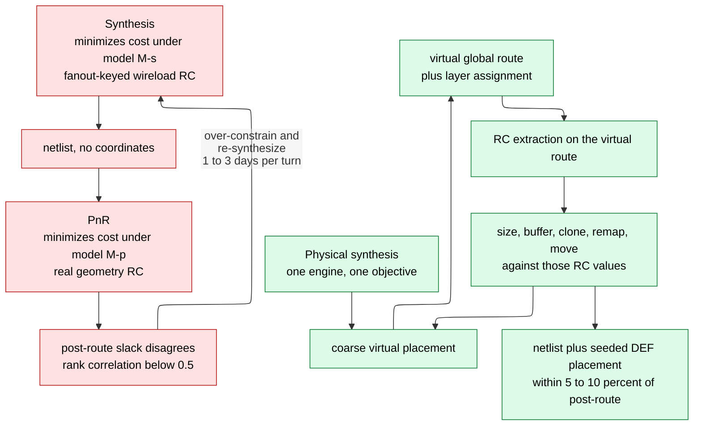

# Physical Synthesis and Design Planning — killing the wireload fiction before it reaches the backend

> **Prerequisites:** [Synthesis_and_Optimization](01_Synthesis_and_Optimization.md) (the map/optimize loop this page moves onto a floorplan; its §8 asserts the wireload model died — here it is proved), [Synthesis_Flow_and_QoR_Closure](04_Synthesis_Flow_and_QoR_Closure.md) (the flow scripting and multi-corner setup the §10 hand-off is built from), [Constraints_SDC](02_Constraints_SDC.md) (the `set_input_delay` / `set_output_delay` / uncertainty semantics every §6 budget is written in).
> **Hands off to:** [Floorplanning_and_Power_Planning](../05_Backend_Physical_Design/03_Floorplanning_and_Power_Planning.md) (turns the die estimate, macro plan, and grid template into a real floorplan and mesh), [Physical_Design](../05_Backend_Physical_Design/01_Physical_Design.md) (places, clocks, and routes each budgeted partition inside the frame fixed here), [Placement_Legalization_and_Optimization](../05_Backend_Physical_Design/04_Placement_Legalization_and_Optimization.md) (consumes the seeded placement and congestion map).

---

## 0. Why this page exists

Two things happen between "the netlist is done" and "place-and-route can start", and neither is place-and-route. First, **synthesis stopped being a purely logical activity**: around the 90–65 nm nodes its estimated wire delay became wrong by more than any margin could absorb, so a coarse placement moved *inside* the synthesis engine. Second, somebody must decide **how big the die is, how it is cut into blocks, where the memories go, what each block's timing budget is, and which signals cross which boundary** — before any block is placed, because every block-level run needs those answers as inputs. That is **design planning**: a 4–8 week phase run with a whiteboard, a spreadsheet, and three trial synthesis runs.

Skipping it ships two defects. A *correlation* defect: a netlist optimized against a fanout-keyed wire estimate spent its area and leakage on paths that turn out not to be critical, and committed a structure PnR cannot undo — PnR sizes, buffers, and moves cells, but never re-factors logic or adds a pipeline stage. A *planning* defect: a boundary in the wrong place, budgets that do not sum to the period, a memory facing the wrong way, an undeclared feedthrough. Both surface after clock tree synthesis, where fixing them costs weeks (§11). The two halves are one commitment made twice: *the wire is real, so optimize against a real floorplan*; *the floorplan is real, so decide it deliberately*. Floorplan execution and PnR proper are [Floorplanning_and_Power_Planning](../05_Backend_Physical_Design/03_Floorplanning_and_Power_Planning.md) and [Physical_Design](../05_Backend_Physical_Design/01_Physical_Design.md); this page owns the bridge.

---

## 1. The wireload-model fiction and its death

Synthesis needs a delay per net; delay needs $R$ and $C$; those need a length; before placement there is none. The **wireload model (WLM)** assumes length is a function of **fanout** alone: bin every net of a previously-routed population by fanout $f$, take the mean routed length $\bar L(f)$, publish it in the `.lib` (Liberty) file with per-micron $R$, $C$ (`fanout_length(4, 22.0)` and so on) and a `slope` $s$ for extrapolation beyond the table:

$$
L(f)=\begin{cases}\bar L(f) & f\le f_{\max}\\ \bar L(f_{\max})+s\,(f-f_{\max}) & f>f_{\max}\end{cases}
\qquad R=r\,L(f),\quad C=c\,L(f)
$$

A `wire_load_selection` table picks the model from the enclosing module's cell area. Absent: coordinates, floorplan, aspect ratio, macros, congestion, layer. A net's estimate depends on one integer.

**Trace it.** At 7 nm a minimum-width intermediate-metal wire has $r\approx5\ \Omega/\mu$m (sheet resistance $\approx100\ \text{m}\Omega/\square$ over a 20 nm width) and $c\approx0.18$ fF/µm, so $rc=0.9$ fs/µm². Drive it with a `BUF_X4` of output resistance $R_d\approx1.5$ k$\Omega$ into four `X1` pins, $C_L=2.8$ fF. Elmore delay of a lumped-T wire is $t_d = R_d(C_w+C_L) + R_w(C_w/2+C_L)$, $C_w=cL$, $R_w=rL$:

```tikz
\begin{document}
\begin{circuitikz}[scale=0.95]
  \draw (0,0) node[ground]{} -- (0,1);
  \draw (0,1) to[V=$v_{in}$] (0,3);
  \draw (0,3) to[R=$R_d$] (2,3);
  \draw (2,3) to[R=$R_w/2$] (4,3);
  \draw (4,3) to[R=$R_w/2$] (6,3);
  \draw (4,3) to[C=$C_w$] (4,0);
  \draw (6,3) to[C=$C_L$] (6,0);
  \draw (0,0) -- (6,0);
\end{circuitikz}
\end{document}
```

Contract: left of the first resistor is the driving cell, between the $R_w/2$ pair is the wire whose length the WLM guesses, $C_L$ is the receiver load the netlist knows exactly. Trace $L=22$ µm (the fanout-4 entry): $C_w=3.96$ fF, $R_w=110\ \Omega$, $t_d=1500(6.76\,\text{fF})+110(4.78\,\text{fF})=10.7$ ps. Trade-off exposed: $R_dC_w$ dominates at short $L$ while $R_wC_w/2$ grows as $L^2$ and takes over at long $L$, so one estimate lands on the wrong side of that crossover for most nets. Against the measured post-route spread of *the same fanout-4 bin* in the same block:

| Net | $L$ (µm) | $C_w$ (fF) | $R_w$ ($\Omega$) | $t_d$ (ps) | vs WLM |
|---|---|---|---|---|---|
| WLM estimate | 22 | 3.96 | 110 | **10.7** | — |
| Median | 12 | 2.16 | 60 | 7.7 | 1.4× too slow |
| 90th percentile | 95 | 17.1 | 475 | 35.2 | 3.3× **too fast** |
| Worst, unbuffered | 640 | 115.2 | 3200 | 370 | 35× too fast |
| Worst, optimally buffered | 640 | — | — | 94 | 8.8× too fast |

The last row uses $\tau(k)=rcL^2/2k+k\,t_{buf}$, minimized at $k^\star=L\sqrt{rc/2t_{buf}}=3.9\to4$ buffers with $t_{buf}=12$ ps. Even after the best possible repair the WLM is off by nearly an order of magnitude on the net that decides the block's frequency.

**The failure.** The WLM is not merely biased — bias calibrates out. It is **variance-blind**, and it feeds a min/max objective, $\text{WNS}=\min_{\text{paths}}[T_{clk}-\sum t_{\text{cell}}-\sum t_{\text{wire}}]$. A critical path is a *concatenation of tail nets*, so the mean is the wrong statistic and tuning it makes the tail worse. Why it stopped being survivable: with $\phi$ = wire share of path delay and $\epsilon$ = relative wire-estimate error, path error is $\phi\epsilon$, and both grow every node — $\phi$ because gate delay scales with the transistor while $r$ rises sharply as wires narrow (copper resistivity in a 20 nm wire is 5–6× bulk from surface and grain-boundary scattering), $\epsilon$ because bigger designs widen the spread inside each bin, so one bin now holds a 3 µm abutted net and a 640 µm cross-block net.

| Node | $\phi$ | $\epsilon$ | $\phi\epsilon$ |
|---|---|---|---|
| 180 nm | ~0.10 | ~0.5 | 5% — inside margin |
| 65 nm | ~0.30 | ~1.0 | 30% — flow starts to break |
| 28 nm | ~0.45 | ~2 | 90% — flow is broken |
| 7 nm | 0.50–0.75 | 2–5 | 100–375% — meaningless |

**The correlation gap** has two halves. *Magnitude:* post-route worst negative slack (WNS) runs **20–50% of the period** worse than the WLM-based report — 200–500 ps on a 1 ns design; physical synthesis gives **5–10%**. *Rank:* Spearman correlation between synthesis and post-route path ordering falls **below ~0.5**, so the two tools' top-1000 critical paths are different *sets*; physical synthesis restores 0.85–0.95. The rank half makes the flow non-convergent, because synthesis spends its area and leakage budget upsizing paths that post-route have positive slack while leaving the real offender minimum-sized. Over-constraining by 10–20% inflates area and leakage uniformly ([Synthesis_and_Optimization §7.4](01_Synthesis_and_Optimization.md)) without fixing the ordering, and each reconciliation loop costs a synthesis plus a PnR turn — **1–3 days on a 2 M-instance block**, of which teams burned 10–20.

---

## 2. Physical synthesis proper

Physically-aware synthesis (Synopsys *topographical* mode, Design Compiler Graphical, Fusion Compiler; Cadence physical Genus) replaces the WLM with a measurement taken inside the engine. It **reads a floorplan** — DEF (Design Exchange Format) for die/core outline, placed macros with orientations, blockages, and I/O pin locations; LEF (Library Exchange Format) for cell abstracts; a tech-LEF plus a parasitic tech file (TLU+, QRC techfile) for per-layer $r$, $c$, via resistance. It runs a **coarse virtual placement** (analytical quadratic + density), unlegalized because legality is not needed to estimate a length; a **virtual global route** on a coarse GCell grid giving per-net Steiner topology **and layer assignment** (the same 200 µm net has $r=5\ \Omega/\mu$m on M3 and $\approx0.25$ on wide M9); **extraction** of real $R$, $C$ per segment; and **re-optimization** whose moves are themselves physical — an inserted buffer has a location, so both segment lengths are known. These iterate to a fixed point and the tool writes **a netlist plus a DEF placement**.



Contract of the upper chain: two tools alternately minimize two *different* cost functions over two *different* variable sets — synthesis picks netlist $N$ under $M_s$, PnR picks placement $P$ under $M_p$. Trace one turn: synthesis picks a wide AOI cell to flatten a path it believes critical; PnR finds that path has 200 ps of slack and the real offender is a bus crossing the block, which it can only buffer — it may not re-map. A composition of two minimizations of different objectives is not a descent on anything, so it stalls or oscillates at a full tool pass per turn; the lower chain has one objective and one model, so each inner iteration is approximately a descent step and it terminates. The decisive asymmetry: **PnR cannot undo structure** — its moves are placement, sizing, buffering, cloning, and small local restructuring, never re-factoring a Boolean network, changing an adder architecture, re-mapping a mux tree to lower pin density, or retiming.

**What it can fix** (all need a length it now has): repeater planning with correct segment lengths; sizing against real load; criticality-aware restructuring (reordering an adder tree so the late input enters the fast carry position requires knowing which input is late); fanout-tree topology and driver cloning; layer-aware optimization; congestion-aware mapping (§8); refusing to clock-gate a bank whose enable arrives from across the block.

**What it cannot.** A bad floorplan — it *consumes* one, and against a placeholder outline with no macros it is the WLM with extra runtime. Clock skew — the clock is still ideal, so hold, concurrent clock-and-data, and useful skew stay downstream ([Clock_Tree_Synthesis](../05_Backend_Physical_Design/05_Clock_Tree_Synthesis.md)). Detailed-route reality (DRC, multi-patterning, via enclosure), crosstalk delta-delay, and IR drop ([Signal_Integrity_Reliability](../05_Backend_Physical_Design/02_Signal_Integrity_Reliability.md)). And **not architecture** — the hard boundary. Optimally-buffered wire delay is $\tau^\star/L=\sqrt{2\,rc\,t_{buf}}$: **0.147 ps/µm** on 7 nm minimum-width intermediate metal, **0.036 ps/µm** on wide upper metal ($r\approx0.25\ \Omega/\mu$m, $c\approx0.22$ fF/µm). In a 500 ps cycle with 300 ps spendable on pure wire, reach is 2.0 mm intermediate and about 8 mm on top metal — the latter optimistic, since repeaters must be placeable *under* the wire, which they are not over a macro array. A signal crossing 12 mm in one cycle at 2 GHz is a missing pipeline stage in the RTL, and it must be found now.

**Accuracy ladder:** wireload model, 2–5× error on wire delay, always available; **virtual route inside physical synthesis, 5–10% on path delay, needs a floorplan**; post-placement global route, 3–7%; post-detailed-route extraction (SPEF), the signoff reference. Two rules follow — **seed PnR with the physical-synthesis DEF placement** so the placer starts in the basin the optimizer found, and **run physical synthesis at the signoff corner set with signoff derates**, or the ladder is a fiction of a different kind (WP4, item f).

---

## 3. Design planning as a discipline

The sequence is fixed by data dependency: chip spec (function, per-domain frequency, power budget, package, node) → gate-count and memory estimate from trial synthesis or IP datasheets → die and core area (§4) → shape → partition into blocks → hierarchy style → macro plan (§7), interface design (§5), and budgets (§6) in parallel → power plan (§9) → hand-off (§10). One back-edge is cheap: congestion or budget infeasibility returns to *partitioning*. A 12 M-instance block that estimates to 3.57 mm² but must fit a 1.90 × 1.90 mm slot takes that edge and moves 0.5 M instances next door (§4); the same discovery after CTS is §11's catastrophe.

**Shape.** For fixed core area $A$ and aspect ratio $\rho=H/W$, the longest intra-block Manhattan distance is $\sqrt{A}(\rho^{-1/2}+\rho^{1/2})$, minimized at $\rho=1$. At $\rho=4$ it is $2.5\sqrt A$ versus $2\sqrt A$ — **25% longer worst wire for the same silicon**, about 70 ps on a 1.9 mm-scale block. Keep $\rho\in[0.5,2.0]$; a rectilinear block's concave corner is a congestion funnel and a CTS problem, since both arms need balanced insertion delay while the shortest path between them goes around the notch. What usually forces a shape is macro tiling, not choice (WP1).

| Hierarchy style | Mechanism and why it exists | Cost |
|---|---|---|
| **Flat** | one netlist, one placement, global optimization — the baseline and best QoR | runtime and memory superlinear in instances; capacity wall ~5–20 M instances; one ECO re-runs everything; no team parallelism |
| **Hierarchical** | implement each block against a budgeted SDC and a model of its neighbors, assemble at top; exists because flat runtime and capacity make big designs un-buildable | budget error (§6); interface pessimism; +3–8% area for boundary flops, feedthroughs, channels; integration risk |
| **MIB** (multiply-instantiated block) | implement one block, replicate the layout $N$ times; avoids $N\times$ effort and $N$ different results for identical logic (core arrays, GPU SMs, NPU tiles, SerDes lanes) | the one implementation must satisfy the *union* of all instances' environments; pins must work at every placement; clock latency balanced at top; any instance-specific ECO destroys the sharing |
| **Abutted vs channeled** | abutted blocks share edges and route cross traffic through feedthroughs (§5), recovering the 5–15% of die that channels cost; channels decouple pin placement and feedthrough churn between owners | abutted: pins must align with the neighbor's, grid continuity becomes a top-level constraint, every crossing net needs a planned feedthrough. Channeled: 5–15% die area |

Selection boundary: **flat is better QoR whenever it fits.** Hierarchy answers capacity, schedule, and organization, and it is paid for in QoR. Do not partition for elegance.

**Choosing the boundaries.** Min-cut hypergraph partitioning (Kernighan–Lin, Fiduccia–Mattheyses, hMETIS) is necessary and nowhere near sufficient. *Minimize crossing nets* — each becomes a pin, a budget entry, a top-level route, possibly a feedthrough; perimeter is the hard limit, since a block is **pin-limited above ~1 pin per 3–4 µm of perimeter** at 7 nm, so a 1.5 × 1.5 mm block (6000 µm perimeter) tolerates 1500–2000 pins and one needing 4000 is a mistake. *Keep timing paths inside a block* — a path crossing two boundaries has its slack split three ways with two budget errors and two pin-escape penalties, so cut where a register already exists or where the protocol tolerates latency (an AXI channel, a NoC port). *Align with clock domains*, since spanning two needs two trees, two constraint sets, internal CDC, and a top assembly balancing both. *Align with power domains*, since a gated region must be contiguous with its own switch fabric and isolation cells, and straddling an edge forces always-on nets through a region that can be off ([UPF_and_CPF_Power_Intent](../02_Power_and_Low_Power/05_UPF_and_CPF_Power_Intent.md)). *Align with delivery boundaries* — a hard IP is a partition by definition. *Balance size* within ~2–4×, or the schedule is set by the largest block. And *be floorplannable*: min-cut regularly produces sets that cannot be laid out as non-overlapping rectangles, and geometry vetoes graph theory. Because the RTL hierarchy was written for readability, partitioning is preceded by **hierarchy restructuring** — `ungroup` leaf modules so optimization crosses them, then `group` the result into physical partitions that may match no RTL module at all.

---

## 4. Worked die-size and utilization estimate

**Design.** 7 nm block: 12.0 M standard-cell instances at 0.15 µm² mean (a mix of ~0.04 µm² NAND2-class cells and ~0.27 µm² flops at 20–25% flop population), plus 48 SRAM macros of 32 KB.

1. **Cell area.** $A_{\text{cells}}=12.0\times10^{6}(0.15)=1.80\times10^{6}\ \mu\text{m}^2=1.80$ mm².
2. **PnR growth** — synthesis lacks the cells PnR adds: clock-tree buffers (3–5%), hold buffers (1–3%), DRV buffers (1–2%), tap and boundary cells (1–2%), ECO cells (1–3%). Budget **+12%**: $A_{\text{cells,eff}}=2.016$ mm².
3. **Macro area.** A 32 KB SRAM: 262,144 bits × 0.027 µm² bitcell = 7,078 µm² of array, ×1.75 for decoders, sense amps, drivers, control = **12,000 µm²** ≈ 190 × 65 µm. $A_{\text{macro}}=48(12{,}000)=0.576$ mm².
4. **Halo.** A 5 µm halo on 190 × 65 µm gives $200(75)/(190\cdot65)=1.21$; use **×1.20**: $A_{\text{macro,eff}}=0.691$ mm².
5. **Core.** Two utilizations exist and confusing them is a classic error:

$$U_{\text{chip}}=\frac{A_{\text{cells}}+A_{\text{macro}}}{A_{\text{core}}},\qquad U_{\text{eff}}=\frac{A_{\text{cells,eff}}}{A_{\text{core}}-A_{\text{macro,eff}}}$$

$U_{\text{eff}}$ — density over the area actually available to standard cells — governs routability and placer quality; $U_{\text{chip}}$ is what tools print. At $U_{\text{eff}}=0.70$: $A_{\text{core}}=0.691+2.016/0.70=\mathbf{3.571\ mm^2}$, and $U_{\text{chip}}=2.376/3.571=66.5\%$ — 3.5 points below the number you designed to, entirely from macro halos.

6. **Dimension.** At $\rho=1$, side $=\sqrt{3.571}=1.890$ mm; add a 20 µm power-ring margin → **outline 1.930 × 1.930 mm = 3.725 mm²**.

| $U_{\text{eff}}$ | placeable needed | $A_{\text{core}}$ | core side | outline | Δ |
|---|---|---|---|---|---|
| 0.65 | 3.102 mm² | 3.793 mm² | 1.948 mm | 3.950 mm² | **+6.2%** |
| 0.70 | 2.880 mm² | 3.571 mm² | 1.890 mm | 3.724 mm² | — |
| 0.75 | 2.688 mm² | 3.379 mm² | 1.838 mm | 3.528 mm² | **−5.4%** |

Five points of utilization is worth about ±6% of die — *less* than $5/70=7.1\%$, because the fixed macro footprint dilutes the lever; in WP1, where macros dominate, that lever nearly vanishes.

**Where it becomes infeasible.** Upward, the **congestion ceiling**: above $U_{\text{eff}}\approx0.80\text{–}0.85$ for 7 nm logic at normal pin density, global-route overflow appears and the placer cannot find legal sites near its optimum; the design does not fail, it silently degrades, because the router spreads cells — which *is* lowering utilization, done expensively after you already paid for the small die. A pin-dense block (§8) hits this at 0.70. Downward, a **delay floor**: wirelength scales roughly as $\sqrt{1/U}$, so 0.70 → 0.50 stretches the average net 18%. Externally, the **hard slot**: if the SoC allocated **1.90 × 1.90 mm**, the 1.930 mm outline does not fit — 1.6% linear, 3.2% area. Options: raise $U_{\text{eff}}$ to 0.75 (side $1.838+0.040=1.878$ mm ✓, 22 µm margin, at a §8 congestion risk); move logic out — max core side 1.86 mm → $A_{\text{core}}\le3.460$, placeable $\le2.769$, $A_{\text{cells,eff}}\le1.938$, $A_{\text{cells}}\le1.730$ mm² → **11.53 M instances**, so relocate **0.47 M (3.9%)**; remove macros — each frees $14{,}400\ \mu\text{m}^2$ and you need 111,000, so **8 macros**, a 256 KB architectural cut; or renegotiate the slot, moving every neighbor. **The die estimate is a constraint check, not a report** — it exists so infeasibility surfaces in week 3 at the cost of a spreadsheet, not in week 30 at the cost of a re-partition.

---

## 5. Partition interface design

**Feedthroughs.** A net launched in A and captured in C must physically get there; if B sits between them and the blocks are abutted, the only path is *through* B, so B must contain a **feedthrough** — an input pin, a wire, an output pin, connected to nothing inside B. A **routing feedthrough** is bare metal on a reserved corridor (two pins and B's tracks, no area), but an unbuffered crossing of a whole block is not viable: 1.5 mm at $\tfrac12rcL^2$ is **1.0 ns**, not the 220 ps the buffered rate suggests. A **buffered feedthrough** adds a repeater chain, costing area and power but keeping slew legal and giving B a clean in-to-out timing arc. Unplanned, the failure appears at assembly: the router finds no legal path, and the recoveries are opening a channel (a floorplan change moving every block) or re-opening B (days to weeks). Feedthroughs are a **counting** discipline — a 128-bit bus crossing three abutted blocks costs $128\times3=384$ pin pairs, **768 pins**, plus 384 repeater chains, all competing for the §3 perimeter budget. A *pipelined* feedthrough is legal only if the protocol tolerates the latency, which is why latency-insensitive interfaces earn their cost at boundaries ([Network_on_Chip](../01_Architecture_and_PPA/04_SoC_and_Chiplet_Architecture/04_On_Chip_Networks/01_Network_on_Chip.md)).

**Pin assignment.** A pin's position simultaneously sets an inside length and an outside length, **and they pull in opposite directions**: place it to suit the block's internal receiver and it may be far from the top-level driver, and vice versa. A pin on the wrong side of a 1.5 mm block costs up to 1.5 mm of extra wire — **220 ps** at 0.147 ps/µm, 44% of a 500 ps period, from one defaulted pin; times a 128-bit bus, the block is unclosable. The resolution is concurrent, iterative assignment: run a top-level trial with blocks as soft shapes and let the tool place pins by fly-line direction, feed those locations into block implementation as constraints, let the block re-negotiate only the pins whose internal path is unacceptable, then freeze (§11). Rules that follow: spread pins rather than clustering (a cluster spikes congestion exactly where escape routing is hardest); use the layer whose preferred direction points *into* the block; keep pins off corners; align to tracks; and for **abutted** neighbors align pin $i$ of A with pin $i$ of B, since a misalignment costs a jog, a via pair, and across a wide bus a channel's worth of congestion at the seam.

**Boundary flops.** The rule: every block output is driven directly by a flop, every block input lands directly on a flop.

```systemverilog
// Interface timing reduces to t_cq at the source and t_setup at the sink,
// independent of anything the block does internally.
module blk_b #(parameter int W = 128) (
  input  logic clk, rst_n,
  input  logic in_valid,          output logic out_valid,
  input  logic [W-1:0] in_data,   output logic [W-1:0] out_data
);
  logic v_q;  logic [W-1:0] d_q, result;
  always_ff @(posedge clk or negedge rst_n)
    if (!rst_n) begin v_q <= 1'b0;     d_q <= '0;      end
    else        begin v_q <= in_valid; d_q <= in_data; end
  always_comb result = {d_q[W-2:0], d_q[W-1]} ^ {d_q[0], d_q[W-1:1]};   // interior
  always_ff @(posedge clk or negedge rst_n)
    if (!rst_n) begin out_valid <= 1'b0; out_data <= '0;     end
    else        begin out_valid <= v_q;  out_data <= result; end
endmodule
```

Why it is worth a cycle: the block's contribution to a crossing path becomes exactly $t_{cq}$ out and $t_{setup}$ in — two library constants — so the only quantity left to distribute is the *wire*, which is precisely what the floorplan determines. The budget also stops moving (unregistered interface logic has a depth that changes with every re-synthesis, staling every promise A made to B), the timing model shrinks to almost nothing (§6), and ECOs decouple. **The cost when you don't:** A tightens its output delay to close, shrinking B's input budget, so B fails and demands budget back, so A fails. Unregistered interfaces need **3–6 budget iterations** to converge across an SoC; registered ones need **0–1**, each iteration being a block re-implementation. One trap: a *combinational* `ready` back-pressure signal re-creates the same cross-block path in reverse, so registering it requires a skid buffer, which must be in the RTL and not added at planning time.

```wavedrom
{ "signal": [
  { "name": "clk",                      "wave": "p......" },
  { "name": "A launch flop Q",          "wave": "x3.....", "data": ["D"] },
  { "name": "unregistered: C captures", "wave": "x.3....", "data": ["D"] },
  { "name": "registered: A out flop Q", "wave": "x.4....", "data": ["D"] },
  { "name": "registered: B out flop Q", "wave": "x..4...", "data": ["D"] },
  { "name": "registered: C captures",   "wave": "x...4..", "data": ["D"] }
 ],
 "head": {"text": "Interface registers cost cycles and buy budget independence"}
}
```

Contract: the same datum reaches C one cycle later (unregistered — one combinational path spanning A, two top-level wires, B, and C) or three (registered at each boundary). Trace: unregistered, the whole 1 ns period must cover $t_{cq}+A+w_{AB}+B+w_{BC}+C+t_{setup}$, exactly the §6 problem; registered, each cycle covers one block and one wire and the three budgets are independent. Trade-off: two extra cycles of latency for the removal of all inter-block budget coupling — good for a throughput datapath, bad for a cache-hit or branch-redirect loop.

---

## 6. Timing budgeting across partitions

A path launches in A, crosses to B, crosses to C, captures there; each block is implemented *alone*, so each needs an SDC describing the world outside it. $T_{clk}=1.00$ ns, $t_{cq}=0.05$, $t_{setup}=0.03$, $t_{unc}=0.06$ (jitter plus a pre-CTS skew allowance). Fly-lines: A→B 700 µm, B→C 500 µm. Planning number for a repeatered top-level route on mid-upper metal: **0.10 ps/µm plus 20 ps per boundary crossing** (pin escape and via stack), so $w_{AB}=90$ ps, $w_{BC}=70$ ps, leaving

$$B_{\text{total}}=1.00-0.05-0.03-0.06-0.09-0.07=\mathbf{0.70\ ns}$$

**Algorithm 1 — proportional to logic depth.** Run a fast unconstrained trial synthesis per block and measure what each *wants*: A 0.62 ns (14 levels), B 0.28 (7), C 0.45 (10); total 1.35. Allocate $B_i=\dfrac{d_i}{\sum_j d_j}B_{\text{total}}$:

| Block | trial $d_i$ | share | budget | required compression |
|---|---|---|---|---|
| A | 0.62 | 0.459 | **0.321** | 1.93× |
| B | 0.28 | 0.207 | **0.145** | 1.93× |
| C | 0.45 | 0.333 | **0.233** | 1.93× |
| | 1.35 | 1.000 | 0.699 | |

The property is in the last column: proportional budgeting demands the **same compression ratio** ($0.70/1.35=0.519$) from every block. That is its virtue — fair, one cheap trial run — and its flaw: a block already at four levels of NAND cannot give 1.93×, while one that trialed at 14 unoptimized levels can often give 3×. In SDC (`set_output_delay -max` covers everything after the port *including* capture setup; uncertainty is applied separately):

```tcl
set_clock_uncertainty 0.06 [get_clocks clk]
set_output_delay -max 0.568 -clock clk [get_ports a_out*]  ;# w_AB+B+w_BC+C+t_su -> A gets 0.322
set_input_delay  -max 0.461 -clock clk [get_ports b_in*]   ;# t_cq+A+w_AB
set_output_delay -max 0.333 -clock clk [get_ports b_out*]  ;# w_BC+C+t_su  -> B gets 0.146
set_input_delay  -max 0.676 -clock clk [get_ports c_in*]   ;# t_cq+A+w_AB+B+w_BC -> C gets 0.234
```

**The consistency check — write it as a script and run it every turn.** For every crossing path, $t_{cq}+\sum_i B_i+\sum_j w_j+t_{setup}+t_{unc}\le T_{clk}$:

$$0.05+(0.321{+}0.145{+}0.233)+(0.09{+}0.07)+0.03+0.06=0.999\le1.000\ \checkmark$$

The number-one silent failure of hierarchical design is three SDC files that each look reasonable and jointly demand 1.08 ns of a 1.00 ns period. Nothing detects it until top-level assembly, months later.

**Algorithm 2 — tool-derived.** `derive_budget` / `write_hier_constraints` and their Genus and Fusion Compiler equivalents take the **whole design virtually flattened**, run a timing analysis with ideal interfaces, and write each boundary pin's actual arrival and required time as I/O delays, so the split reflects what the logic *needs* rather than a ratio. If the flat run reports intrinsic floors A ≥ 0.300, B ≥ 0.120, C ≥ 0.220 (total 0.640), the remaining 0.060 ns spreads as margin proportional to floor → A **0.328**, B **0.132**, C **0.240**. The proportional split had parked 25 ps on B, which needed none, while giving A only 21 ps over its floor. The cost is the trial full-design run: 0.5–1 TB of memory overnight for a 40 M-instance SoC.

**Interface models.** An **ETM** (extracted timing model, a `.lib` of pin-to-pin NLDM/CCS arcs) is 1–5% of the block and suits top-level closure and IP delivery; an **ILM** (interface logic model — the real gates between boundary pins and the first/last sequential element, with parasitics, interior discarded) is 5–15% and the best accuracy short of flat. ETM pitfalls: regenerate per mode and corner (4 modes × 6 corners = 24 models per block); exceptions do not survive unless baked in; internal reconvergence is hidden, causing pessimism or optimism; clock-path pessimism removal across the boundary degrades because the shared clock path is inside the model.

**When a budget is infeasible**, options ordered by cost and blast radius: (1) **rebudget** — take slack from a block that has it, then re-run the consistency check on *every* path through the affected pins; (2) **move the blocks closer** — cheap before Freeze 1 (§11), expensive after; (3) **register the boundary** — an RTL change costing one cycle plus re-verification; (4) **relax the clock** — a product decision. Options 3 and 4 leave the physical domain entirely, which is why they are planning failures rather than tools. **A budget is a contract, and moving it is a multi-block change**: the pin that gains 30 ps here may be on four other paths that just lost it. Budgets are per mode and per corner (functional and scan-shift budgets for one pin differ — [DFT_and_ATPG](../06_Signoff/02_DFT_and_ATPG.md)), and hold budgets (`-min`) are placeholders, since real hold is decided by clock skew that does not exist until CTS.

---

## 7. Macro and memory planning

**Scale, grouping, orientation.** A mid-size CPU core carries 30–120 SRAM instances (L1I, L1D, TLBs, predictor tables, compiled register files); an L2/L3 slice 100–500; a mobile SoC 3,000–10,000. The list comes from RTL inference plus explicit instantiation, goes to the foundry memory compiler, and returns as hard macros with a footprint, a pin side, a supply requirement, and legal orientations; what is inside them is [Memory_Circuits_and_Technologies](../00_Fundamentals/06_Memory_Circuits_and_Technologies.md). Group by structure — all ways of a cache set, all banks of a scratchpad — because address, control, and write data fan out to all of them, so every micron of separation multiplies by the fanout. SRAMs usually present all pins on one edge, so a macro must face its logic: a 190 µm-wide macro flipped so its pins face outward costs every net a detour of at least 380 µm — **56 ps per net** at 0.147 ps/µm, over 150 nets, plus 57,000 µm of wire that must fit somewhere. Not all orientations are legal, since at advanced nodes poly and fin directions are fixed, so macros typically allow only R0/R180/MX/MY and not 90° rotations.

**Halo and blockages.** A **halo** (keep-out margin, **3–10 µm** at 7 nm, wider on the pin side) exists because the power ring needs space, pin escape needs space, and cells wedged against a macro edge land in pockets the router cannot reach. A **hard placement blockage** forbids cells; a **soft** one lets global placement use the region while keeping legalized bulk logic out; a **partial (density) blockage** caps density at e.g. 40% and is the standard cure for the *congestion collar* just outside a macro edge where every entering net converges. Routing blockage is implicit — macros block the metals they use internally (typically M1–M4), so anything crossing must be M5 and above, which is why macro placement more than anything else sets the upper-metal congestion pattern.

**Three objectives that disagree.** For **timing**, pull the macro into the logic on its critical path and minimize pin-to-flop distance — which strews blockages and channels through the fabric, the fastest route to a macro maze. For **routability**, push macros to the periphery, keep the core one clean rectangle, and make every channel wide enough for what crosses it — lengthening the paths timing wanted short. For **power**, place under strap intersections, spread macros so peak read/write current does not co-locate, and ensure the dual rail (array VDDM plus periphery VDD) reaches every one. The order follows from which constraints are hard: **routability and power first, since an unroutable or IR-failing floorplan is not a design**; then timing, an optimization, since a timing-suboptimal floorplan is merely a slower chip. Channel width is the arithmetic: at 7 nm, **≥ 20–30 µm** for a channel carrying real routing, and **below ~10 µm it is a dead zone** — no useful placement, poor routing, an interrupted grid.

```text
   MACRO MAZE (bad)                    BANKED (good)
   +--------------------------+        +--------------------------+
   | [M] .. [M] ...... [M]    |        | [M][M][M][M][M][M][M][M] |
   |  ... [M] .....  [M] ...  |        | [M][M][M][M][M][M][M][M] |
   | .. [M] ..... [M] ... [M] |        |  pins v  v  v  v  v  v   |
   |  [M] ..... [M] ......    |        |   standard-cell fabric   |
   | ... [M] ....... ..  [M]  |        |   one connected region   |
   +--------------------------+        +--------------------------+
```

Contract: both floorplans hold the same macro area and the same cell area; only the arrangement differs. Trace one consequence on the left: a clock buffer needs a legal site near the middle to feed the sinks there, but the middle is a 6 µm channel with no placeable row — so CTS routes around it, insertion delay grows 100+ ps, and the skew across the maze becomes the block's worst number. Trade-off: the maze was *created by timing-driven macro placement*, each macro individually pulled toward its logic with an unimplementable emergent result. Five symptoms travel together — stranded pockets with one route in and out, channel congestion as all cross traffic funnels there, CTS insertion-delay and skew inflation, density spikes where the placer cannot spread, and IR hotspots where macro bodies interrupt the grid. The preventing rule: **the standard-cell region must be simply connected**, each connected sub-region a few hundred microns across.

---

## 8. Congestion prediction at synthesis time

Congestion is routing demand exceeding track supply somewhere. Demand comes from nets, nets terminate at pins, so the first-order predictor is **pin density**; the second is how far those nets must go, a property of connectivity, not of the placer. In severity order: **crossbars and all-to-all structures** — an $N\times N$ crossbar of $W$-bit words has a bisection width of $NW$ wires *no matter how it is placed*, because every input bus must exist on both sides of any cut, so this is a property of the function; **wide muxes and many-ported register files**, the same mechanism at smaller scale; **high-pin-density cells** — AOI/OAI gates, MUX cells, full adders, and flops present more pins per µm² than simple gates, so a region synthesized entirely into complex cells for speed runs 30–50% denser in pins; and **unbuffered high-fanout nets**, since a 50,000-fanout reset before its tree is built looks to any estimator exactly like an all-to-all structure.

Physical synthesis measures all of this before placement. The **global-route overflow map** reports per GCell edge $\max(0,\text{demand}-\text{supply})$; the hand-off target is **< 0.5% of edges overflowed**, and above ~2% the design will not route without spreading, which is a die-size change. The **pin-density map**: a 7 nm logic block averages 20–25 pins/µm² at $U=0.7$, so 35+ is a flag. **Module-attributed congestion** matters most — when one module holding 4% of the area owns 55% of the overflow, you have found your crossbar.

**Rent's rule** (Landman and Russo, 1971) relates the external terminals $T$ of a logic partition to its gate count $g$: $T=t\,g^{\,p}$, with $t$ = terminals per gate for a single gate (2–5) and $p$ = the **Rent exponent**, $0\le p\le1$. It is measured, not derived: partition recursively, count terminals per level, fit on a log-log plot. $p\approx0$ is a shift register or memory array — adding gates adds no terminals. $p\approx0.5$ is a 2-D locally-connected array (systolic array, adder tree), where terminals grow like the perimeter of a square region. $p=0.55$–$0.70$ is the normal regime for random logic, control, datapath, and microprocessors. $p=0.75$–$1.0$ means crossbars and all-to-all structures, where terminals grow nearly as fast as gates.

**Why $p$ predicts congestion.** Bisect a square region of $g$ gates. Demand — nets crossing the cut — grows like $g^{p}$; supply is cut length times tracks per micron, and cut length is $\sqrt{ga/U}$, so supply grows like $g^{1/2}$:

$$\frac{\text{demand}}{\text{supply}}\;\propto\;g^{\,p-1/2}$$

For $p<0.5$ the ratio *shrinks* with size — routable at any scale. For $p>0.5$ it *grows*, so a finite size exists beyond which the structure cannot route with a fixed metal stack. That inequality is why advanced nodes ship 13–18 metal layers and why some RTL must be redesigned rather than re-placed; Donath's companion result $\bar L\propto g^{\,p-0.5}$ says the same about delay. Two caveats: $(t,p)$ must be measured on *internal* partitions, because the top block's own pin count is deliberately limited by the architect and falls below the extrapolation ("Rent's region II"); and the model is asymptotic. Counting terminals on two halves — of which $T_{\text{ext}}$ are the block's real external pins and the rest are cut-net endpoints counted twice — gives the usable pair:

$$N_{\text{cut}}(g)=t\,(g/2)^{p}-\tfrac{1}{2}T_{\text{ext}},\qquad
\text{Supply}=\eta\left(\sum_h\frac{1}{\pi_h}\right)\sqrt{\frac{g\,a}{U}}$$

with $\pi_h$ = pitch of horizontal signal layer $h$, $\eta$ = usable fraction after straps, vias, blockages (0.5–0.6), $a$ = mean cell area. Routable requires $\kappa N_{\text{cut}}\le\text{Supply}$ with detour factor $\kappa\approx1.4$.

**Numeric example: a 16 × 16 crossbar of 128-bit words.** Cut it in half; every input bus must reach output muxes on both sides, so $16\times128=\mathbf{2{,}048}$ wires cross regardless of placement. Its own area: sixteen 16:1 muxes 128 bits wide as MUX2 trees is $16\times15\times128=30{,}720$ MUX2 at 0.0752 µm² each (7 nm, ~5.5 CPP × 0.24 µm) = 2,310 µm², +25% for the 16-way input fanout buffering = **2,888 µm² of cells**, which at $U=0.70$ is 4,126 µm² — a **64.2 µm square**. Supply: M3/M5/M7 at 0.040/0.048/0.080 µm pitch give $25+20.83+12.5=58.33$ tracks per µm of cut; at $\eta=0.55$, **32.1 usable tracks/µm**; across 64.2 µm, **2,061 tracks**. Demand $=2{,}048(1.4)=2{,}867$ against 2,061: **139%** — it cannot route at its natural density. Solve for the area where it can: $W\ge2867/32.1=89.4$ µm → 7,987 µm², at which utilization is $2888/7987=\mathbf{36\%}$. **A 16×16×128b crossbar is wire-limited and occupies roughly three times the silicon its logic needs.** Fitting Rent for comparison, with $t=2.57$ and $T_{\text{ext}}\approx4{,}160$: $2048=2.57(46{,}000)^p-2080$ gives $p\approx0.69$, against 0.59 for the ordinary logic around it (WP3). That 0.10 of exponent is the whole difference between "fine forever" and "does not fit."

| RTL-level fix | Effect here | Cost |
|---|---|---|
| **Serialize** — halve the flit width, take two cycles | wires 2,048 → 1,024; needed area 7,987 → 1,997 µm²; routes at $U=72\%$ — **4× smaller** | half the bandwidth per clock, or double the crossbar clock |
| **Multistage network** — two stages of four 4×4 crossbars | MUX2 count 30,720 → 12,288; each 4×4 separately placeable with a 256-wire bisection; inter-stage links become a *structured, pipelinable bundle* the floorplan can budget | more latency and control complexity; total inter-stage wire count unchanged, only made regular |
| **Pipeline it** — register stage in the middle | halves every net length; lets the placer separate the halves; makes buffering effective | +1 cycle; needs a latency-tolerant protocol |
| **Mux at the source** — select where the data lives | removes the gather entirely | needs distributed control |
| **Lower pin density** — restrict the library subset, or 9-track instead of 7.5-track cells | more tracks per row, fewer pins per µm² | 10–20% area, slower cells |

What is *not* a real fix: **adding metal layers.** Layers multiply supply by a constant; $p$ is an exponent. WP3 shows two extra horizontal layers moving a 251%-loaded bisection to 216% — an expensive mask adder that does not change the answer.

---

## 9. Power planning inputs at this stage

Design planning does not build the grid but must prove one is possible, because the grid and the floorplan are one decision. **Per-block current** is $I_{\text{avg}}=P_{\text{block}}/V_{DD}$ with $I_{\text{peak}}\approx k\,I_{\text{avg}}$, $k\approx1.5\text{–}3$ by burstiness: the §4 block at 180 mW and 0.75 V draws 240 mA over 3.571 mm² = **67 mA/mm²**, against a typical 7 nm logic range of **20–100 mA/mm²** — above ~150 the grid stops being a template and becomes a design problem. **Grid pitch feasibility** is the coupling check: the grid pre-allocates upper-metal tracks, **25–40% of the top two layers** on a high-current block, and with a 5%-of-0.75 V = 37.5 mV static budget the pad-to-worst-cell resistance must satisfy $R_{\text{eff}}\le37.5\ \text{mV}/I_{\text{local}}$. Tightening the grid to reach it consumes tracks, and if what remains cannot carry §8's bisection demand, **the block must grow** — changing §4's die estimate, which changes the SoC floorplan. Three further couplings: macros block lower metals and interrupt straps, so §7's macro plan decides where the grid can be continuous; power gating needs switch-cell area and a contiguous domain, a floorplan constraint arriving from the UPF; and decap needs 5–15% of the core reserved, which belongs in §4's arithmetic rather than being discovered later. Grid resistance math, mesh construction, IR analysis, and electromigration limits are [Floorplanning_and_Power_Planning](../05_Backend_Physical_Design/03_Floorplanning_and_Power_Planning.md) and [Power_Analysis_and_Signoff](../02_Power_and_Low_Power/06_Power_Analysis_and_Signoff.md); what this phase owes them is a current number per block, a grid template meeting the budget on paper, and a floorplan in which it can be drawn.

---

## 10. The hand-off package

Seven artifacts plus supporting data, each with a characteristic failure. The **netlist** (post-physical-synthesis gate-level Verilog, LEC-signed) fails as a library mismatch — a cell the PnR library set does not contain. The **DEF floorplan** (die/core outline, rows, sites, tracks, macro placements with orientation, blockages, pin locations and layers, region/fence/group constraints) fails when its area disagrees with §4, meaning somebody re-planned silently. The **budgeted SDC per partition** (per mode and corner: clocks with estimated latency and uncertainty, §6's I/O delays, block-scoped exceptions, driving cells, port loads, derates) fails when the budgets do not sum to the period — silent until assembly. The **UPF** (domains, supply nets and ports, switches, isolation and level-shifter strategies, retention) fails when a domain is not contiguous. **Macro placement plus halos** fails as §7's maze. **Pin constraints** (fixed locations or a pin guide with side/order/layer/spacing rules, plus feedthrough definitions) fail as an unplanned feedthrough at assembly. **Blockages and route guides** (placement/routing/partial-density blockages, non-default rules for clock and critical nets) fail as a buffer planned where none can be placed (WP4, item e). Supporting data — LEF and tech-LEF, `.lib` per corner, parasitic tech file, neighbor models (ILM/ETM), MMMC view definition, DFT constraints, grid template script — fails one corner at a time, turning multi-corner closure into a single-corner surprise.

**Readiness checklist** — every line a script that must pass: **LEC clean**, with documented accepted non-equivalences and sequential equivalence checking where retiming ran ([Formal_Verification](../03_Frontend_RTL_and_Verification/12_Formal_Verification.md)); **netlist hygiene** — no unmapped cells, leftover `assign` or tri-states, combinational loops, undriven or multiply-driven nets, or black boxes without a model; **library consistency** — every netlist cell in every corner `.lib`, `dont_use` lists agreeing; **timing** — WNS/TNS within the agreed margin (typically WNS ≥ −5% of period) on virtual-route RC at the signoff corner set with signoff derates; **congestion** — < 0.5% overflowed GCells, no 35+ pins/µm² region; **utilization** in range with DEF area within a few percent of §4; **macro legality** — halos applied, no overlaps, legal orientations, pins facing logic, channels above minimum, cell region simply connected; **pins** — every partition inside the pin-per-perimeter limit, feedthroughs declared and instantiated, abutted neighbors aligned; **budget consistency** — the §6 sum check passing for every crossing path in every mode; **UPF** loading cleanly with contiguous domains; **DFT** — chains stitched or reorder explicitly permitted, scan-mode constraints issued ([DFT_and_ATPG](../06_Signoff/02_DFT_and_ATPG.md)); **power** — current per block estimated and a template-level IR pre-check passing; **release hygiene** — all files under one release ID with tool versions recorded.

---

## 11. Convergence and ECO discipline at this boundary

| Gate | Frozen there | Cost of breaking it later |
|---|---|---|
| **Freeze 1** — planning exit | die size, partition boundaries, macro placement, grid template | 4–8 weeks (below) |
| **Freeze 2** — block start | pin locations, feedthroughs, UPF domain shapes | re-implement both sides of every affected boundary |
| **Freeze 3** — CTS start | budgets, clock definitions, netlist structure | re-run the block from placement |
| **Open to the end** | sizing, buffer insert/delete, $V_t$ swap, hold buffers, modest useful-skew tweak | local, by design |
| **Metal-only** — after mask release | spare-cell rewire only | a fraction of a full mask set |

Each gate is the point past which a change costs an order of magnitude more, because the number of parties who must redo work jumps. Trace one: moving a single SRAM 100 µm is free before Freeze 1, costs one block re-implementation after Freeze 2, and after CTS costs a full re-run of that block from placement — the clock tree was built to the old sink positions, every hold fix was computed against the old skew, and every route in the region must be ripped. Early freezes buy convergence at the price of deciding with less information, which is why planning is front-loaded with trial runs.

**What you may change late** is exactly the open row: cell sizing, buffer insertion and deletion, and $V_t$ swaps — the standard post-route ECO mechanism, which changes delay without changing function or connectivity topology; hold buffers, always last and always local; local restructuring on **spare cells** already scattered through the layout, which if it touches only routing layers is a *metal-only* ECO; and modest useful-skew adjustment, up to where hold fixes are torn up faster than added ([Signoff_Orchestration_ECO_and_Tapeout_Readiness](../06_Signoff/04_Signoff_Orchestration_ECO_and_Tapeout_Readiness.md)). **What you may not**, after Freeze 3, at any price: **re-partition** (changes pin lists on both sides of every boundary, invalidates every budget, changes feedthroughs, re-stitches scan, moves UPF shapes, and changes the RTL hierarchy so LEC and gate-level simulation setups both change); **move a macro** (moves CTS sinks, invalidates skew and every hold fix built against it, rips routing); **change the die outline or a block shape**; **change a clock definition**; **add a pipeline stage**.

**Why re-partitioning after CTS is a schedule catastrophe.** Count the work: *every block* re-implemented because pin lists changed on both sides (**3–10 days of tool time** for a 1–3 M-instance block, plus engineering); *every budget* re-derived and re-checked across all modes; *DFT*, because chains are stitched in physical order within partitions, so ATPG patterns and test time change; *UPF*, because domain shapes follow partitions; *verification*, because the RTL hierarchy changed; and *all signoff already performed*, now void. Realistically **4–8 weeks**, landing where there is no schedule slack because CTS happens late. The alternative — 4–8 weeks of trial floorplans, trial synthesis, trial budgets, and congestion probes **before** committing — costs the same calendar at a fifth to a tenth of the risk. That comparison, not any tool feature, is the argument for design planning as a phase, and the reason its outputs sit under change control: a pin move is a multi-block change, and no single block owner can see its full cost.

---

## Numbers to memorize

| Quantity | Value | Why it matters |
|---|---|---|
| Wireload-model error on wire delay, ≤ 28 nm | 2–5× | the motivating failure (§1) |
| Wire share of path delay, 180 nm → 7 nm | ~10% → 50–75% | why WLM error stopped being survivable (§1) |
| WLM synthesis-to-post-route WNS gap | 20–50% of the period | the magnitude gap (§1) |
| WLM path-rank correlation | Spearman < 0.5 | optimization aimed at the wrong paths (§1) |
| Physical synthesis correlation | 5–10% of period, rank 0.85–0.95 | what a floorplan buys (§1, §2) |
| Optimally-buffered wire delay, intermediate / upper metal | 0.147 / 0.036 ps/µm | $\sqrt{2\,rc\,t_{buf}}$ at 7 nm (§2) |
| One-cycle buffered reach at 2 GHz | ~2 mm intermediate, ~8 mm top metal | above this, add a pipeline stage (§2) |
| Mean standard-cell area, 7 nm mixed netlist | 0.12–0.16 µm² | the die estimate's first multiplier (§4) |
| PnR cell-area growth over synthesis | +8–15% | CTS, hold, DRV, tap, ECO cells (§4) |
| Target $U_{\text{eff}}$ / congestion ceiling | 0.60–0.75 / 0.80–0.85 | the master die knob (§4) |
| Die sensitivity to 5 utilization points | ±5–6% logic-dominated, < 1% macro-dominated | know which term dominates (§4, WP1) |
| Macro halo / effective footprint | 3–10 µm / ×1.15–1.35 | (§4, §7) |
| Minimum useful macro channel, 7 nm | 20–30 µm; below ~10 µm is a dead zone | the macro-maze rule (§7) |
| Block pin limit | ~1 pin per 3–4 µm of perimeter | vetoes many min-cut partitions (§3) |
| Budget iterations, registered vs unregistered | 0–1 vs 3–6 | the value of boundary flops (§5) |
| Interface model size, ETM / ILM | 1–5% / 5–15% of the block | hierarchical timing cost (§6) |
| Rent exponent: local array / random logic / crossbar | ~0.5 / 0.55–0.70 / 0.75–1.0 | the congestion predictor (§8) |
| Rent congestion scaling | demand/supply $\propto g^{\,p-1/2}$ | why metal layers cannot fix a $p$ problem (§8) |
| Congestion targets at hand-off | < 0.5% overflowed GCells, < 35 pins/µm² | the go/no-go gate (§8) |
| Logic current density, 7 nm | 20–100 mA/mm²; > 150 is a grid problem | grid feasibility (§9) |
| Power-grid share of the top two metals | 25–40% | grid competes with signal supply (§9) |
| Re-partition after CTS | 4–8 weeks of schedule | why the freezes exist (§11) |

---

## Worked problems

**1 — Die estimate for a macro-dominated block, and finding the real lever.**
*Problem.* A 4 MB L3 slice at 7 nm: 128 data SRAMs of 32 KB (12,000 µm², 190 × 65 µm each), 24 tag/ECC macros of 8 KB (3,540 µm² each), 900,000 standard-cell instances at 0.14 µm² mean, $U_{\text{eff}}=0.65$. Estimate the die, then find which knob moves it.

*Solution.* Macros: $128(12{,}000)+24(3{,}540)=1{,}536{,}000+84{,}960=$ **1.621 mm²**. Cells: $900{,}000(0.14)=0.126$ mm²; ×1.15 growth = 0.145; placeable needed $=0.145/0.65=0.223$ mm². The macro *tiling* then sets the shape before anyone chooses one: tile the 128 data macros $16\times8$ with 10 µm channels and width $=16(190)+15(10)=3{,}190$ µm, height $=8(65)+7(10)=590$ µm — a **3.19 × 0.59 mm strip, aspect ratio 5.4**, unusable. Re-tile $8\times16$: width 1,590, height 1,190 → **1.892 mm²**, an effective halo factor of $1.892/1.536=1.13$. Add tags at ×1.20 = 0.102 and logic 0.223: $A_{\text{core}}=\mathbf{2.217\ mm^2}$; as a 1.590 mm-wide rectangle it is 1.394 mm tall, aspect ratio 1.14. Feasible.

*The lever.* Move $U_{\text{eff}}$ ±5 points: at 0.60, placeable 0.242 → core 2.236 (**+0.8%**); at 0.70, placeable 0.207 → core 2.201 (**−0.7%**). **Utilization is worth under 1% here**, because 90% of the area is macro. Move macro packing instead: 10 µm channels → 4 µm gives width $8(190)+7(4)=1{,}548$, height $16(65)+15(4)=1{,}100$ → 1.703 mm², core 2.028 mm² — **−8.5%**, ten times the utilization lever. The method is the lesson: **differentiate the estimate with respect to each knob before spending a week turning one.** (The 4 µm channel is below §7's useful-routing width, so it is legal only if nothing must cross there — which for an abutted bank array it does not.)

**2 — Re-budgeting an infeasible 3-way split (continues §6).**
*Problem.* Budgets issued: A 0.321, B 0.145, C 0.233 ns, with $w_{AB}=0.09$, $w_{BC}=0.07$, $t_{cq}=0.05$, $t_{setup}=0.03$, $t_{unc}=0.06$, $T=1.00$ ns. A reports its best achievable is **0.375 ns**; B closed at 0.118 and C at 0.229. Close the design.

*Solution.* Deficit $=0.375-0.321=\mathbf{0.054}$ ns. *Option 1, rebudget:* B has $0.145-0.118=0.027$ spare, C has 0.004 — **0.031 < 0.054**, and taking all of it leaves B and C at zero margin. *Option 2, shorten the wire:* move A and B from 700 µm to 400 µm apart, $w_{AB}=400(0.10)+20=60$ ps, saving **0.030**; with A, B, C in a row and only A moving toward B, $w_{BC}$ is unchanged. *Combined:* $0.031+0.030=0.061\ge0.054$ ✓. Issue A 0.375, B 0.120, C 0.233, $w_{AB}=0.06$, $w_{BC}=0.07$:
$$0.05+(0.375+0.120+0.233)+(0.06+0.07)+0.03+0.06=0.998\le1.000\ \checkmark$$
It closes with 2 ps of margin, and B sits 2 ps above its measured 0.118. *Option 3:* register A's output — its contribution becomes $t_{cq}$ alone and the path becomes two cycles, each with room, at +1 cycle, a protocol change, and re-verification. *Option 4:* relax $T$ to 1.06 ns, a 5.7% frequency loss and a product decision. *Decision:* take 1+2 only if a 2 ps outcome survives the corner spread it will face; otherwise take option 3, because a design closing on 2 ps at planning will not close once CTS adds real skew. Either way, **re-run the §6 check on every path through A's output and B's input pins** — the 30 ps recovered by moving A may have been the margin on a different path that also crosses $w_{AB}$.

**3 — Rent's-rule congestion estimate.**
*Problem.* A 7 nm packet classifier: 320,000 gates, mean cell area 0.13 µm², $U=0.72$, 1,100 external pins. Horizontal layers M3/M5/M7 at 0.040/0.048/0.080 µm, $\eta=0.55$, $\kappa=1.4$. Recursive hMETIS partitioning gives mean terminals $T$ = 2,900 / 1,950 / 860 / 380 at $g$ = 160,000 / 80,000 / 20,000 / 5,000. Will it route? Will a 4×-larger next generation? What would a $p=0.72$ variant do?

*Solution.* **Fit:** $p=\ln(2900/380)/\ln(160000/5000)=2.0324/3.4657=\mathbf{0.586}$; $t=380/5000^{0.586}=380/147.6=\mathbf{2.57}$. Check: $2.57(20{,}000)^{0.586}=857$ vs 860 ✓; $2.57(80{,}000)^{0.586}=1{,}931$ vs 1,950 ✓. **Supply:** $\sum1/\pi_h=25+20.83+12.5=58.33$ tracks/µm, ×$\eta$ = 32.08 usable; $W=\sqrt{320{,}000(0.13)/0.72}=\sqrt{57{,}778}=240.4$ µm → supply $=\mathbf{7{,}712}$. **Demand:** $N_{\text{cut}}=2{,}900-550=2{,}350$ nets, ×1.4 = **3,290**. Load $=42.7\%$ — **routable with margin.**

**4× gates at the same $p$** (1.28 M gates, ~2,000 external pins): $W=480.7$ µm, supply 15,424; $N_{\text{cut}}=2.57(640{,}000)^{0.586}-1{,}000=5{,}538$, ×1.4 = 7,753 → **50.3%**, still fine, and it matches the law: $4^{\,p-0.5}=4^{0.086}=1.127$ and $42.7(1.127)=48.1\%$ (the residual is the $T_{\text{ext}}$ term). **The $p=0.72$ variant at the original size:** $N_{\text{cut}}=2.57(160{,}000)^{0.72}-550=13{,}828$, ×1.4 = 19,359 against 7,712 → **251%**. Price the repairs: *add two horizontal layers* (M9 at 0.16, M11 at 0.32 µm) takes tracks/µm from 58.33 to 67.71 and supply to 8,952, load → **216%**, so two mask layers bought 35 points and did not solve it, because layers are a constant and $p$ is an exponent; *lower utilization* needs $W\ge19{,}359/32.08=603$ µm → 364,000 µm² → $U=\mathbf{11\%}$, a block six times larger than its logic; *restructure the RTL* to lower $p$ (§8) is the only repair that changes the exponent and therefore the only one that scales. Caveats to state: $(t,p)$ were fitted between 5 K and 160 K gates, and the 1,100-pin whole-block count sits deliberately below the extrapolation — the architect's I/O limit, not a measurement of the rule.

**4 — "Synthesis said 1.5 ns, post-route says 2.1 ns. Where did 0.6 ns come from?"**
*Problem.* A 12-stage 7 nm path: physical synthesis reported 1.50 ns arrival (0.72 cell, 0.78 wire — 52% wire, normal for the node); post-route extraction reports 2.10 ns. Account for the 0.60 ns, then say which items are bugs.

| # | Contributor | Mechanism | Δ (ns) |
|---|---|---|---|
| a | Route detour and Steiner error | routed length averages 1.15× the virtual estimate; both $R$ and $C$ scale, so the distributed term grows ~1.32× and the driver term ~1.15× — ~18% on the wire portion, $0.78(0.18)$ | **+0.14** |
| b | Layer demotion under congestion | 3 nets planned on M5/M6 routed on M2/M3 ($r$: 0.9 → 5 Ω/µm); those nets contributed 0.24 ns | **+0.16** |
| c | Coupling capacitance | virtual extraction used ground capacitance without switching-aware Miller coupling; SI adds delta-delay, 3–8% of stage delay | **+0.09** |
| d | Legalization and placement churn | PnR discarded the seeded placement; critical cells displaced from their virtual positions | **+0.07** |
| e | Buffer placement blocked | a repeater planned at the midpoint of a 400 µm net landed 120 µm off-center because a macro sits there | **+0.05** |
| f | Derate and corner mismatch | synthesis ran one setup corner without the stage-count-dependent AOCV/POCV derate signoff applies | **+0.06** |
| g | Slew degradation | worse transitions on longer real nets raise downstream cell delays | **+0.03** |
| | **Total** | | **+0.60** ✓ |

*Which are bugs?* (a), (c), (g) — 0.26 ns — are **expected physics** a planned 5–10% margin (75–150 ps here) should mostly have covered: borderline, not a flow failure. (b) is a **congestion failure** the §8 report should have caught before hand-off. (e) is a **floorplan hand-off failure** — physical synthesis was not given the real blockages, so it planned a buffer into a macro. (f) is a **setup mistake**: synthesis must run the signoff corner set and derates (§2, §10). (d) is a **flow mistake**: the DEF placement seed was thrown away. *Verdict:* $0.60/1.50=40\%$ against 5–10% for a correct flow, so this is not tool imprecision but a diagnosis that the floorplan, the constraints, and the plumbing are wrong. Fixing (b), (d), (e), (f) removes 0.34 ns, bringing the gap to 17% and under 10% once (b)'s congestion is fixed at source.

---

## Cross-references

- **Down the stack (what this consumes):** [Synthesis_and_Optimization](01_Synthesis_and_Optimization.md) (the optimization engine put on a floorplan), [Constraints_SDC](02_Constraints_SDC.md) (budget semantics), [Standard_Cell_Libraries_and_Characterization](03_Standard_Cell_Libraries_and_Characterization.md) (the wireload table, cell areas, corner set), [Synthesis_Flow_and_QoR_Closure](04_Synthesis_Flow_and_QoR_Closure.md) (MCMM setup and QoR reporting), [Memory_Circuits_and_Technologies](../00_Fundamentals/06_Memory_Circuits_and_Technologies.md) (what is inside §7's macros), [UPF_and_CPF_Power_Intent](../02_Power_and_Low_Power/05_UPF_and_CPF_Power_Intent.md) (power intent constraining §3).
- **Up the stack (what consumes this):** [Floorplanning_and_Power_Planning](../05_Backend_Physical_Design/03_Floorplanning_and_Power_Planning.md) (builds the real floorplan and mesh), [Physical_Design](../05_Backend_Physical_Design/01_Physical_Design.md) (PnR inside this frame), [Placement_Legalization_and_Optimization](../05_Backend_Physical_Design/04_Placement_Legalization_and_Optimization.md) (the seeded placement and congestion map), [Clock_Tree_Synthesis](../05_Backend_Physical_Design/05_Clock_Tree_Synthesis.md) (the skew §6 only estimates), [Routing_and_Parasitic_Extraction](../05_Backend_Physical_Design/06_Routing_and_Parasitic_Extraction.md) (the RC WP4 compares against), [STA](../06_Signoff/01_STA.md) (scores the budgets), [Signoff_Orchestration_ECO_and_Tapeout_Readiness](../06_Signoff/04_Signoff_Orchestration_ECO_and_Tapeout_Readiness.md) (governs §11's late ECOs).
- **Section index:** [00_Index](00_Index.md).

---

## References

1. Kahng, A.B., Lienig, J., Markov, I.L., and Hu, J., *VLSI Physical Design: From Graph Partitioning to Timing Closure*, 2nd ed., Springer, 2022. Partitioning, floorplanning, and design planning (§3–§4).
2. Landman, B.S. and Russo, R.L., "On a Pin Versus Block Relationship For Partitions of Logic Graphs," *IEEE Transactions on Computers*, C-20(12), 1971. The original statement of Rent's rule.
3. Donath, W.E., "Placement and Average Interconnection Lengths of Computer Logic," *IEEE Transactions on Circuits and Systems*, 26(4), 1979. Wirelength from the Rent exponent — the $g^{p-1/2}$ scaling of §8.
4. Christie, P. and Stroobandt, D., "The Interpretation and Application of Rent's Rule," *IEEE Transactions on VLSI Systems*, 8(6), 2000. Measuring $p$, and the region-II caveat.
5. Fiduccia, C.M. and Mattheyses, R.M., "A Linear-Time Heuristic for Improving Network Partitions," *DAC*, 1982. The classic netlist partitioner of §3.
6. Karypis, G., Aggarwal, R., Kumar, V., and Shekhar, S., "Multilevel Hypergraph Partitioning: Applications in VLSI Domain," *DAC*, 1997. The hMETIS partitioner used in WP3.
7. Bakoglu, H.B., *Circuits, Interconnections, and Packaging for VLSI*, Addison-Wesley, 1990. Distributed-RC and optimal-repeater analysis (§1, §2).
8. Sylvester, D. and Keutzer, K., "Getting to the Bottom of Deep Submicron," *ICCAD*, 1998. The wire-versus-gate scaling argument that dates the wireload model's death.
9. Ho, R., Mai, K.W., and Horowitz, M.A., "The Future of Wires," *Proceedings of the IEEE*, 89(4), 2001. Why interconnect delay does not scale; the reach limits of §2.
10. Sapatnekar, S.S., *Timing*, Springer, 2004. Slack distribution and budgeting theory behind §6.
11. IEEE Std 1801, *IEEE Standard for Design and Verification of Low-Power, Energy-Aware Electronic Systems* (UPF). The power-intent artifact of §10.
12. Synopsys, *Design Compiler User Guide* (topographical mode) and *Library Compiler Reference* (`wire_load` group syntax). Cited generically for §1 and §2.

---

⬅ prev [04 · Synthesis Flow and QoR Closure](04_Synthesis_Flow_and_QoR_Closure.md) · [Section Index](00_Index.md) · [Root Index](../Index.md) · next ➡ [05 · Backend (Physical Design)](../05_Backend_Physical_Design/00_Index.md)
