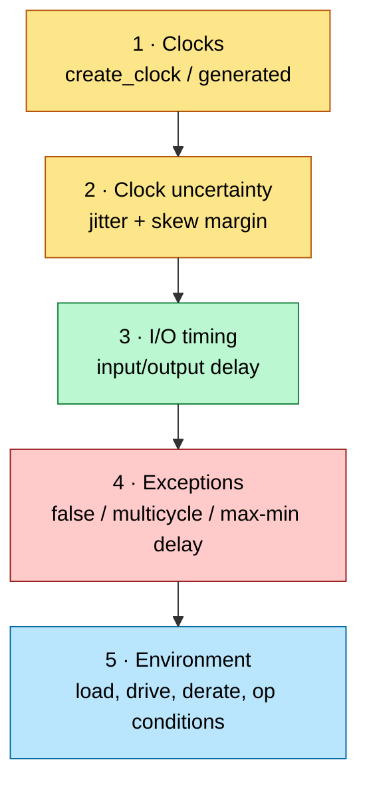
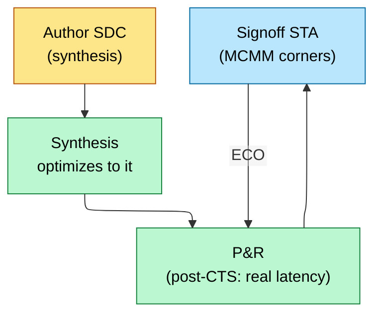

# Constraints (SDC) — Telling the Tools What "Correct Timing" Means

> **Stage:** 04 · Synthesis (authored here, consumed through [backend](../05_Backend_Physical_Design/Physical_Design.md) and [signoff](../06_Signoff/STA.md)). The Synopsys Design Constraints file is the single most leveraged artifact in the flow: it defines clocks, I/O timing, and exceptions for every downstream tool.
> **Prerequisites:** [Synthesis_and_Optimization](Synthesis_and_Optimization.md), [STA](../06_Signoff/STA.md) (which consumes SDC). **Hands off to:** synthesis, P&R, STA.

---

## 0. Why this page exists

Synthesis, place-and-route, and STA are all just optimization/checking engines — they only know what "good timing" means because **you told them**, in SDC. An unconstrained path is an un-optimized, un-checked path; an over-constrained path wastes area and power chasing timing that doesn't matter; a wrongly-declared false path *hides a real violation* that surfaces in silicon. SDC bugs are silent and expensive. This page covers the core SDC commands, the four exception types, and the discipline that keeps constraints correct across the flow. (STA *interprets* these; here we focus on *authoring* them.)

---

## 1. The five things SDC must define



If these are right, the tools optimize the right thing; if not, everything downstream inherits the error.

---

## 2. Clocks — the foundation

```tcl
# Primary clock: 1 GHz on port clk
create_clock -name clk -period 1.000 [get_ports clk]

# Generated clock: a /2 divider output is a derived clock, not a new primary
create_generated_clock -name clk_div2 -source [get_pins div_reg/Q] \
    -divide_by 2 [get_pins div_reg/Q]

# Uncertainty = jitter + (pre-CTS) estimated skew + margin
set_clock_uncertainty -setup 0.080 [get_clocks clk]
set_clock_uncertainty -hold  0.020 [get_clocks clk]
set_clock_latency 0.300 [get_clocks clk]   ;# pre-CTS estimate; real tree replaces it
```

- **Primary clocks** (`create_clock`) come in on a port/PLL output. **Generated clocks** (`create_generated_clock`) are *derived* — divided, multiplied, gated, or muxed — and MUST be declared, or STA mis-times every path they feed ([Clock_Division](../03_Frontend_RTL_and_Verification/Clock_Division.md)).
- **Uncertainty** models what STA can't yet know exactly: clock **jitter** plus, before CTS, an **estimated skew** budget. Post-CTS, real skew comes from the tree and uncertainty drops to jitter+margin.
- **Asynchronous clock groups**: `set_clock_groups -asynchronous` tells STA two clocks have no phase relationship, so it doesn't try to time paths between them (those are [CDC](../03_Frontend_RTL_and_Verification/Lint_CDC_RDC_Signoff.md) paths handled structurally, not by STA).

---

## 3. I/O timing — constraining the block boundary

A block doesn't know its neighbors' timing, so you model them:

```tcl
# Input: external logic launches data 0.4 ns after clk; budget the rest for our setup
set_input_delay  -clock clk 0.400 [get_ports data_in]
# Output: external flop needs data 0.3 ns before its clk edge
set_output_delay -clock clk 0.300 [get_ports data_out]
```

`set_input_delay` says "data arrives this late relative to the clock," leaving the remaining period for internal logic + setup. `set_output_delay` reserves time for the downstream flop's setup. Get these wrong and the block closes timing in isolation but fails at integration. **Budgeting** I/O delays across block boundaries so the pieces sum to the period is a core SoC discipline.

---

## 4. Timing exceptions — the dangerous, powerful four

Exceptions tell STA *not* to apply the default single-cycle setup/hold check. Each is a sharp tool:

| Exception | Meaning | Use | Danger |
|---|---|---|---|
| **false_path** | "never time this path" | CDC crossings, test-only paths, static config | hides a *real* path → silicon fail |
| **multicycle_path** | "this path has N cycles, not 1" | slow datapath fed by an enable every N cycles | wrong N → setup *or* hold breaks |
| **max_delay / min_delay** | absolute path delay bound | custom/async paths STA can't infer | overrides normal checks |
| **set_disable_timing** | break a timing arc | unused arcs | over-disabling hides paths |

```tcl
set_false_path -from [get_clocks clk_a] -to [get_clocks clk_b]   ;# async CDC
set_multicycle_path 3 -setup -from [get_pins mac/*] -to [get_pins acc/*]
set_multicycle_path 2 -hold  -from [get_pins mac/*] -to [get_pins acc/*]  ;# the matching hold!
```

**The multicycle trap:** declaring `-setup 3` without the matching `-hold 2` is the classic bug — you relax the setup check but leave the hold check expecting same-cycle, which is now *wrong* and can fail silicon. Setup MCP of N almost always needs hold MCP of N−1.

**The false-path trap:** a false path is a *promise to the tool* that data never functionally propagates there. If that promise is wrong, STA never checks a path that's actually active → guaranteed escape. False paths are reviewed like waivers.

---

## 5. Operating conditions, derates, and modes

- **Corners / op-conditions**: constrain across **PVT** (process/voltage/temperature) — slow corner for setup, fast corner for hold ([STA](../06_Signoff/STA.md)).
- **Derates** (`set_timing_derate`): OCV/AOCV/POCV pessimism for on-chip variation.
- **Modes**: a chip has multiple functional + test modes (mission, scan-shift, at-speed) each with its own clocks/constraints → **MCMM** (multi-corner multi-mode) runs them all. The SDC is written per-mode; signoff covers the cross-product.

---

## 6. SDC discipline across the flow



The **same constraint intent** flows through every tool — but evolves: pre-CTS uses estimated clock latency/uncertainty; post-CTS, real CTS results replace the estimates and uncertainty shrinks to jitter. Keeping SDC consistent and reviewed (especially exceptions) is a project-long job; an unreviewed `set_false_path` is a latent tape-out bug.

---

## 7. Numbers / rules to memorize

| Rule | Why |
|---|---|
| declare **every** generated/divided/gated clock | else STA mis-times its fanout |
| setup MCP N ⟹ hold MCP **N−1** | the #1 multicycle bug |
| false_path = promise it's functionally dead | wrong promise = silicon escape |
| `set_clock_groups -asynchronous` for CDC | don't time async crossings in STA |
| pre-CTS: estimated latency/uncertainty; post-CTS: real | uncertainty → jitter+margin |
| budget I/O delays across block boundaries | pieces must sum to the period |
| constrain across PVT corners (setup=slow, hold=fast) | one SDC, many corners (MCMM) |

---

## 8. Interview Q&A

**Q: What breaks if you forget to declare a divided clock?** STA treats the divider output as a normal data net on the source clock, so every flop clocked by the /2 is timed against the wrong period/edges — paths that are actually fine look failing, and real violations on the divided domain go unchecked. Always `create_generated_clock`.

**Q: You set a 3-cycle setup multicycle and the chip fails hold in silicon. Why?** You relaxed setup to 3 cycles but didn't set the matching hold multicycle (2). The default hold check still expects the data to be stable for the same-cycle relationship, which a genuinely multicycle path doesn't satisfy → hold violation. Setup MCP N needs hold MCP N−1.

**Q: When is a false path dangerous?** Always potentially — it tells STA to *stop checking* a path. If the path is in fact functionally active (you mis-judged the mode/CDC), STA never flags its violation and it fails in silicon. Treat every false_path as a reviewed waiver with explicit justification.

---

## Cross-references
- Consumed by: [STA](../06_Signoff/STA.md) (timing signoff), [Physical_Design](../05_Backend_Physical_Design/Physical_Design.md).
- Produced from: [Synthesis_and_Optimization](Synthesis_and_Optimization.md). Clocks: [Clock_Division](../03_Frontend_RTL_and_Verification/Clock_Division.md). Async groups → [Lint_CDC_RDC_Signoff](../03_Frontend_RTL_and_Verification/Lint_CDC_RDC_Signoff.md).
