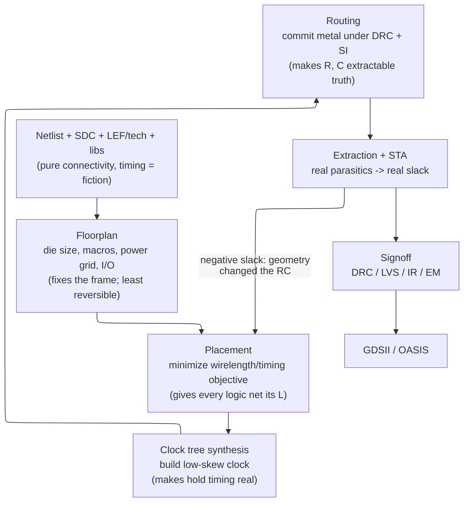

# Physical Design (Place & Route) — Concept-First Deep Dive

> **Prerequisites:** [Synthesis_and_Optimization](../04_Synthesis/01_Synthesis_and_Optimization.md) (the gate-level netlist this stage consumes and the wireload fiction it inherits), [STA](../06_Signoff/01_STA.md) (the timing model every step here is trying to make true), [Constraints_SDC](../04_Synthesis/02_Constraints_SDC.md) (the clocks and exceptions that scope timing).
> **Hands off to:** [Physical_Verification_DRC_LVS](../06_Signoff/03_Physical_Verification_DRC_LVS.md) (DRC/LVS/antenna signoff), [Signal_Integrity_Reliability](02_Signal_Integrity_Reliability.md) (crosstalk, EM, IR-drop *analysis*), [Power_Analysis_and_Signoff](../02_Power_and_Low_Power/05_Power_Analysis_and_Signoff.md) (power-grid and IR-drop signoff).

---

## 0. Why this page exists

Physical design is where a circuit stops being a graph and becomes geometry. Synthesis hands over a **netlist**: standard cells and the nets connecting their pins. It is pure *connectivity* — no coordinates, no wire lengths, no idea where anything sits on silicon. Yet synthesis already reported timing on it. That timing is **fiction**, and understanding *why* is the entire reason this stage exists and the entire reason its steps run in the order they do.

The delay that dominates a modern chip is not the gate; it is the **wire**. A wire's delay is set by its resistance and capacitance, which are set by its *length and layer* — quantities that do not exist until a cell has a location and a net has a route. Synthesis estimated wire delay from a statistical *wireload model* (a guess keyed on fanout); at 7 nm and below that guess is wrong by factors, not percentages. Every step of physical design replaces one layer of that fiction with real geometry, in the only order the dependencies allow — and then the whole thing iterates, because each step perturbs the wire delays the previous step assumed.

This page derives the PnR flow — floorplan → placement → CTS → routing → closure — **from that single fact**: *nothing about timing is real until the design has geometry, wire delay dominates, so physical effects drive everything.* For each step we ask what problem forces it to exist, formulate it as the optimization it actually is, and locate the trade-off knee real designs sit at. By the end you should read place-and-route not as a tool recipe but as a sequence of forced moves against one adversary: the $L^2$ wire.

---

## 1. The core idea: timing is fiction until there is geometry

### 1.1 The wire-RC theorem, and why it orders everything

A metal wire of length $L$ is a distributed RC line. Per unit length it carries resistance $r$ and capacitance $c$, so the wire has $R = rL$ and $C = cL$, and its first-order (Elmore) propagation delay is

$$
\tau_{wire} \;\approx\; \tfrac{1}{2}\,R\,C \;=\; \tfrac{1}{2}\, r\, c\, L^2
$$

where $r$ = resistance per unit length ($\Omega/\mu\text{m}$), $c$ = capacitance per unit length ($\text{fF}/\mu\text{m}$), $L$ = wire length. The delay grows with the **square** of length: double a wire and it is four times slower. This quadratic is the organizing fact of the whole flow:

- It cannot be evaluated until $L$ is known, and $L$ is unknown until cells are *placed* and nets are *routed*. So pre-layout timing is a guess **by construction**.
- It worsens every node. Gate delay falls with scaling, but $r$ rises sharply as wires narrow — electron surface- and grain-boundary scattering drive copper resistivity far above bulk ($\sim$100 m$\Omega/\square$ at an M1 pitch vs $\sim$17 m$\Omega/\square$ for bulk Cu) — while $c$ barely moves. Past roughly the 90–65 nm nodes, **wire delay overtook gate delay** on long nets; at 5/3 nm a cross-block route can cost more than the logic it connects.

Because $\tau \propto L^2$ is intolerable for long wires, the flow does not tolerate long wires: it inserts **repeaters** (buffers/inverters) that chop a length-$L$ wire into $k$ segments. Total delay becomes

$$
\tau(k) \;\approx\; \frac{r\,c\,L^2}{2k} \;+\; k\,t_{buf}
$$

where the first term is $k$ segments of length $L/k$ and the second is $k$ buffer delays, $t_{buf}$ = intrinsic buffer delay. Minimizing over $k$ gives $k_{opt} = L\sqrt{rc/2t_{buf}}$ and a minimum delay that is now **linear in $L$**:

$$
\tau_{min} \;\propto\; L\sqrt{r\,c\,t_{buf}}
$$

Repeaters trade the quadratic for a line — at the cost of area, power, and *placement space that must exist where the wire runs*. This is why buffering is not an afterthought but is folded into placement itself (**physical synthesis**, §6), and it is the mechanistic reason the netlist's fanout-based wireload estimate is worthless: it knows neither $L$ nor how many repeaters $L$ will demand.

### 1.2 The flow is a forced sequence of fiction-removal

Each stage makes one more thing about $\tau_{wire}$ real, and none can run before its inputs are pinned:

1. You cannot compute *any* $L$ until the **die outline, the hard macros, the power grid, and the I/O** are fixed — they are the boundary every wire lives inside. → **Floorplan** (§2).
2. Given that frame, $L$ for logic nets is set by where standard cells sit, so you **place** cells to minimize a wirelength/timing objective. → **Placement** (§3).
3. Sequential timing is measured against clock edges, and the clock is itself a vast, wire-dominated net whose skew is fiction until built. → **Clock tree synthesis** (§4).
4. Only when every net is given actual metal on actual layers do $R$ and $C$ become extractable truth. → **Routing** (§5).
5. Because step $n$ changes the geometry step $n{-}1$ assumed, slack moves under you at every stage → **timing closure iterates** (§6).

The one back-edge — extraction feeding negative slack back into placement — *is* the subject of §6. Everything else is a one-way removal of fiction.

---

## 2. Floorplanning: the highest-leverage, least-reversible decision

Floorplanning fixes the boundary conditions of every downstream optimization: the die outline, where the hard macros (SRAMs, PLLs, analog, I/O) sit, how power reaches every cell, and where signals enter and leave. It runs first because everything after it optimizes *within* the frame it sets — and it is the least reversible step in the flow, because a macro or power-grid choice that strands logic behind a blockage cannot be recovered by any amount of placement or routing effort. A mediocre netlist can be rescued by a good floorplan; a good netlist cannot survive a bad one.

Three sub-decisions, each a boundary condition the rest of the flow inherits.

**Die size from utilization.** The core must hold the cells *plus* room to route between them:

$$
A_{core} \;=\; \frac{A_{cells}}{U}, \qquad U \in [0.6,\,0.85]
$$

where $A_{cells}$ = summed standard-cell area and $U$ = target **utilization** (fraction of core occupied by cells). $U$ is the master floorplan knob, and it is a pure **density-vs-routability** trade:

- Low $U$ ($<60\%$): cells sit far apart, wires grow long ($\tau\propto L^2$ punishes this directly), area and leakage are wasted.
- High $U$ ($>85\%$): too little room between cells for the tracks nets need; routing demand exceeds track supply, congestion and DRC violations explode, and "closing timing" degenerates into spreading cells apart again — lowering $U$ the hard way.

The knee sits at 60–70% for high-frequency or congested blocks and 70–85% for control-dominated logic. Macros count against die area at their fixed size but do not consume routing tracks the same way, so a macro-heavy block tolerates higher core $U$.

**Macro placement.** Macros are large, hard, and pin-constrained, so they are positioned first — at the periphery, pins facing the standard-cell fabric, with routing channels left between them. The tool guides this with **fly-lines** (straight lines drawn per net between a macro and its logical partners): a dense fly-line bundle between two macros means "place these adjacent or pay for every one of those wires." Get it wrong and you strand congestion in a channel no router can clear.

**Power planning.** Before a single signal net is routed, a **power grid** — rings, straps, and mesh on upper metals dropping through via stacks to the M1 cell rails — is committed across the whole die. It is planned first for two reasons: it is a *pre-allocation of the scarcest resource*, upper-metal tracks, so signal routing must live in what remains; and every cell needs robust VDD/VSS or it fails to switch at speed. The grid is sized so the resistive drop $\Delta V = I\,R_{grid}$ stays within budget (typically $\le 5\%$ of VDD static, $\le 10\%$ dynamic). The grid-resistance math, IR-drop analysis, and EM current limits live in [Power_Analysis_and_Signoff](../02_Power_and_Low_Power/05_Power_Analysis_and_Signoff.md) and [Signal_Integrity_Reliability](02_Signal_Integrity_Reliability.md); the floorplanner's job is to reserve enough metal and decap that those checks *can* pass.

The through-line: floorplan quality gates everything, and its knobs — utilization, macro topology, grid density — trade against each other and against every downstream stage at once. There is no local metric that says a floorplan is good; only the closed design tells you, which is exactly why it is the decision worth the most human effort.

---

## 3. Placement as a constrained optimization problem

### 3.1 State the problem exactly

Placement assigns each of $N$ standard cells a legal position $(x_i,y_i)$ to minimize interconnect, subject to non-overlap and row-fit. Written as the objective it truly is:

$$
\min_{\{x_i,y_i\}} \; \sum_{n\,\in\,\text{nets}} \text{HPWL}(n) \quad\text{s.t. cells do not overlap and sit on legal rows}
$$

with the **half-perimeter wirelength** the cheapest good estimate of a net's routed length:

$$
\text{HPWL}(n) \;=\; \Big(\max_{i\in n} x_i - \min_{i\in n} x_i\Big) + \Big(\max_{i\in n} y_i - \min_{i\in n} y_i\Big)
$$

where $i \in n$ ranges over the pins of net $n$. HPWL is the bounding-box half-perimeter; actual routed length runs $1.0$–$1.5\times$ it. Why optimize HPWL and not true routed length? Because you cannot route until you have placed — so placement must minimize a *proxy* for a wirelength it cannot yet measure. That bootstrapping is the whole flow in miniature.

This objective, with its discrete non-overlap constraint, is a form of the **quadratic assignment problem** — NP-hard. For $N \sim 10^6$–$10^8$ cells, exact optimization is hopeless. The art of placement is choosing a *relaxation* whose optimum is cheap to compute and close to the real one.

### 3.2 The analytical relaxation, and the density force that saves it

Replace the non-smooth HPWL with a **squared** wirelength so the objective becomes differentiable:

$$
W_{qp} \;=\; \sum_{(i,j)} w_{ij}\big[(x_i - x_j)^2 + (y_i - y_j)^2\big]
$$

where $w_{ij}$ = connection weight between cells $i,j$ (multi-pin nets are decomposed into pairwise springs). This is convex; setting $\partial W/\partial x_i = 0$ for all $i$ yields a sparse **linear system**

$$
Q\,\mathbf{x} = \mathbf{b}_x, \qquad Q\,\mathbf{y} = \mathbf{b}_y
$$

where $Q$ = weighted **Laplacian** of the netlist graph and $\mathbf{b}$ encodes the fixed anchors (I/O pins, macro pins). Physically it is Hooke's law: every net is a spring $F = w_{ij}\,d$, and the solution is the minimum-energy layout, found in near-linear time with a preconditioned conjugate-gradient solver.

The relaxation has one fatal flaw that exposes the *real* problem: with only attractive springs, minimum energy is reached by piling every cell onto its neighbours — **zero wirelength by collapsing the design to a point.** Wirelength alone was never the objective; *spreading under a density limit* is. So a repulsive **density penalty** is added and the two are balanced:

$$
\min_{\mathbf{x}} \; W(\mathbf{x}) + \lambda\, D(\mathbf{x})
$$

where $D$ = density-overflow penalty (cells competing for the same region repel) and $\lambda$ = a weight ramped up over iterations so the placement spreads gradually. Modern analytical placers (RePlAce, and the GPU-native **DREAMPlace**) model $D$ by an elegant analogy — **electrostatics**: treat each cell as a charge, the target density as neutralizing background charge, and cell density as an electric potential found by solving **Poisson's equation** each iteration via FFT ($O(N\log N)$). The gradient of that potential *is* the spreading force. Wirelength is itself smoothed for the gradient with a **log-sum-exp** surrogate; for the x-span,

$$
\widetilde{\text{HPWL}}_x = \gamma\Big(\ln\!\sum_{i} e^{x_i/\gamma} + \ln\!\sum_{i} e^{-x_i/\gamma}\Big) \;\xrightarrow[\gamma\to 0]{}\; \max_i x_i - \min_i x_i
$$

with $\gamma$ = smoothing parameter. This differentiability is exactly what lets placement run as gradient descent on a GPU — the reason DREAMPlace reaches a 30–40× speedup over CPU analytical placers at equal quality (§8). (Simulated annealing, the older stochastic method, survives only for small blocks and detailed refinement: its $O(N^{1.5})$–$O(N^2)$ cost cannot touch analytical placement at scale.)

### 3.3 From continuous to legal, and from wirelength to timing

The analytical solve gives overlapping, off-grid positions. **Legalization** snaps every cell to a legal row site with the *minimum perturbation* from its analytical position — moving cells as little as possible preserves the optimality the global solve found. The tension is standard: greedy Tetris-style legalization is $O(N\log N)$ but shoves cells far; minimum-perturbation (dynamic-programming) legalization stays near the target at higher cost.

Two further forces reshape the *same* objective rather than replacing it:

- **Timing-driven placement** re-weights nets: a net on a negative-slack path gets a larger $w_{ij}$, so the solver pulls its cells closer, shortening the critical wire at the expense of slack-rich ones. This is the placement-level answer to $\tau\propto L^2$ — put the cells whose wire you cannot afford next to each other.
- **Congestion-driven placement** does the opposite locally: where predicted routing demand exceeds track supply, cells are *spread* even though it lengthens wires, because an unroutable placement has infinite delay.

These pull against each other and against density. Placement is the multi-objective knee where wirelength, timing, and routability are traded, and no single setting optimizes all three — the QoR surface of [Synthesis_and_Optimization](../04_Synthesis/01_Synthesis_and_Optimization.md) §7, reappearing in geometry.

---

## 4. Clock tree synthesis: manufacturing the timing reference

Every setup and hold check is a race between a data path and a *clock edge*. Until now the tools have treated the clock as **ideal** — reaching every flip-flop at the same instant with zero delay. That is the last big fiction, and a load-bearing one: the clock is physically one enormous high-fanout net driving hundreds of thousands of sinks, and delivering an edge to all of them simultaneously is impossible. CTS builds the buffered clock distribution and, in doing so, turns the clock from an assumption into a measured quantity — which is *why hold timing only becomes real after CTS* (§6).

Two quantities define the result:

$$
t_{skew} = \max_{i\in S} t_i - \min_{i\in S} t_i, \qquad t_{insertion} = \frac{1}{|S|}\sum_{i\in S} t_i
$$

where $t_i$ = clock arrival at sink $i$ and $S$ = the set of sinks. **Skew** is the spread of arrivals — the enemy of timing. **Insertion delay** (latency) is the average source-to-sink delay — the enemy of everything else, since it costs buffers, power, and on-chip-variation sensitivity.

### 4.1 Why skew is the thing to minimize — and sometimes not

For a launch→capture flop pair, with signed skew $\delta = t_{capture} - t_{launch}$:

$$
\text{setup:}\quad t_{cq} + t_{comb} + t_{setup} \le T_{clk} + \delta, \qquad
\text{hold:}\quad t_{cq} + t_{comb} \ge t_{hold} + \delta
$$

where $T_{clk}$ = clock period, $t_{cq}$ = clock-to-Q, $t_{comb}$ = combinational path delay, $t_{setup}/t_{hold}$ = flop constraints. Uncontrolled skew eats directly into both margins, so goal #1 is $\delta \approx 0$ everywhere. But the same equations show skew can be *spent deliberately*: give a slow stage a later capture edge ($\delta>0$) and it borrows time from the next stage. This is **useful skew**, and it converts the achievable period from the *worst* stage delay toward the *average*.

Concretely, two back-to-back stages of 3 ns and 1 ns clocked with zero skew need $T_{clk}\ge 3$ ns. Delay the middle capture edge by 0.5 ns: the first stage now sees a 3.5 ns budget and the second a 1.5 ns budget, so both close at $T_{clk} = 2.5$ ns — a 20% frequency gain from *redistributing* slack, not adding logic. The bill comes due on hold: every borrowed picosecond must be repaid with hold buffers on the fast paths. Useful skew trades **setup headroom for hold-fixing buffers and OCV risk**.

### 4.2 Building a low-skew tree: the zero-skew merge

The classical construction is **Deferred Merge Embedding (DME)**: pair sinks, compute for each pair the merge point where the two branches have equal delay, and *defer* the exact geometric embedding until the whole topology is known so it can be placed optimally bottom-up. Under the Elmore model the balance point lies a fraction $\alpha$ of the way along the wire between the two child roots:

$$
\alpha \;=\; \frac{(C_R - C_L) + \tfrac{1}{2}\,c_w L}{c_w L}
$$

where $C_L, C_R$ = downstream capacitance of the left/right subtree, $c_w$ = wire capacitance per length, $L$ = distance between the two roots. When $0\le\alpha\le1$ the merge point sits on the segment and skew is zero by construction. When the loads are too unbalanced ($\alpha\notin[0,1]$) the tool must **add wire (snaking) or a delay buffer** to the light side — the physical act of "wasting" delay to equalize it. That is the whole game of CTS: spend insertion delay and buffers to drive skew down.

### 4.3 The topology menu is a skew-vs-power trade

Real designs choose a distribution style along one axis — how much power to burn for how little skew:

- **H-tree / balanced buffer tree** — symmetric branches, moderate skew (tens of ps), moderate power; the default for most blocks.
- **Clock mesh** — every sink taps a shorted grid, so mismatches average out to `<5 ps` skew, at the cost of a permanently-switching high-capacitance grid that can dominate clock power. Reserved for where skew is worth the watts: high-performance CPU/GPU cores.
- **Multi-source spine + local sub-trees** — for reticle-scale dies a single tree cannot span 25–30 mm without huge insertion delay, so a global spine feeds per-partition trees (§7).

The trade is sharp because the **clock is the single largest dynamic-power consumer — typically 30–40% of dynamic power** — since it is the one net that toggles every cycle across the entire die. Every buffer added to cut skew adds to that 30–40%. CTS is therefore permanently torn between low skew (more buffers, mesh) and low power (fewer buffers, plain tree); the mesh-vs-tree choice is where a design declares which side it is on. Clocks are also routed with **non-default rules** (double width to cut $R$ and thus skew-inducing RC variation, double spacing to cut coupling and thus jitter), at roughly $4\times$ the routing resource of a normal wire.

---

## 5. Routing: the constrained graph search that finally commits the RC

Routing assigns every net actual metal — specific wires on specific layers with specific vias — subject to every design rule. Its conceptual role is singular: **this is the step that turns $R$ and $C$ from estimates into extracted truth.** Placement optimized HPWL, a proxy; CTS balanced an Elmore model; only after routing can a parasitic extractor read the real geometry and hand STA the actual RC (the SPEF the timing tools consume). Everything before routing was rehearsal for the numbers routing makes real (§6).

The problem is too large to solve as one search — millions of nets over billions of grid points — so it is split coarse-then-fine, the same divide-and-relax move as placement.

**Global routing** overlays a coarse grid of **GCells** and decides, per net, *which GCells it passes through* — path planning on a graph whose edges have capacity. Each net is a shortest-path search:

- **Maze / Lee routing** is breadth-first search: guaranteed shortest path, but $O(V)$ per net over the whole grid — too slow at scale.
- **A\*** prunes it with an admissible Manhattan-distance heuristic $h(n) = |x_n - x_t| + |y_n - y_t|$, exploring toward the target first for a 5–20× speedup at the same optimum.
- Nets contend for edge capacity, so routers use **negotiated-congestion (PathFinder)** rip-up-and-reroute: each over-used edge's cost rises with its *history* of congestion, losers re-route around it, and the system iterates to a global near-optimum. Congestion is the familiar ratio, per grid edge $e$:

$$
\text{overflow}(e) = \max\big(0,\; \text{demand}(e) - \text{supply}(e)\big)
$$

where demand = nets that must cross $e$ and supply = available tracks on $e$. Any positive overflow means some net must detour or promote to a higher, lower-resistance layer. This is where a too-dense floorplan (§2) comes home to roost: overflow that placement could not spread away becomes a route that cannot be built.

**Track assignment** then commits each net to specific tracks within its GCells, resolving most spacing, and **detailed routing** produces the final DRC-clean geometry — real rectangles and vias meeting minimum width, spacing, via-enclosure, end-of-line, and (at advanced nodes) coloring rules. The global-vs-detailed split is itself the trade-off: global routing is fast and sees the whole chip but is approximate; detailed routing is exact but local. So the router alternates — the global view steers the detailed work, and detailed failures feed back as congestion — rather than trying to be both at once.

### 5.1 Why the metal stack is tiered — the $L^2$ theorem, again

Long global nets ride **upper, thick metals**; short local nets ride **lower, thin metals** — for a reason that is pure §1.1. Thick upper wires have low $r$, so $\tau\propto rcL^2$ stays tolerable over long $L$; thin lower wires have high $r$ and are used only where $L$ is small. Preferred routing direction alternates horizontal/vertical by layer so orthogonal nets cross through a via. This tiering, plus repeater insertion (§1.1), is the physical answer to wire delay — and it is why an advanced node ships **13–18 metal layers** instead of four.

### 5.2 Design-rule vs density at advanced nodes

Below ~20 nm the wire pitch falls under what a single lithographic exposure can print, so each fine layer is decomposed onto **multiple masks** (multi-patterning: LELE, SADP, SAQP). Routing becomes a **graph-coloring** problem stacked on top of path-finding: adjacent tracks must land on different masks, and a net needing two same-color adjacent tracks is a **coloring conflict** the router resolves by jogging or changing layer. The rule deck balloons — from ~500 rules at 65 nm to **5000+ at N3** — and unidirectional, on-grid routing becomes mandatory. The effect is a hard tightening of the density-vs-routability knee: the same $U$ that routed cleanly at an older node congests at N3 because fewer track assignments are legal, and routing runtime grows 2–3×.

Two routing-time repairs are worth naming because both trace back to physics, not logic: **antenna fixing** (a long metal-to-gate wire accumulates plasma charge during etch and can damage the gate oxide when its antenna ratio exceeds the foundry limit; fixed by a diode near the gate or by jumping to a higher layer) and **redundant/multi-cut vias** (a single via can open; doubling drops failure probability from $\sim10^{-6}$ to $\sim10^{-12}$ and lowers via resistance and EM stress). The *checks* that police all of this — DRC, antenna, LVS — are their own signoff step: [Physical_Verification_DRC_LVS](../06_Signoff/03_Physical_Verification_DRC_LVS.md). The coupling-capacitance/crosstalk and electromigration consequences of the routed geometry go to [Signal_Integrity_Reliability](02_Signal_Integrity_Reliability.md), and the SI-aware and multi-corner timing that consumes the extracted parasitics goes to [STA](../06_Signoff/01_STA.md).

---

## 6. Timing closure: why the flow is a loop, not a pipeline

The flow reads like a pipeline — floorplan, place, CTS, route — but it *runs* as a loop, and §1.1 says why: **each stage changes the very wire delays the previous stage assumed.** Placement minimized HPWL against a *virtual* route; routing then commits a *different*, longer path with real coupling capacitance, so every net's delay shifts. CTS balanced a tree against pre-route loads; routing changes those loads. Extraction after routing feeds STA numbers no earlier step could have known. So **slack computed at each stage is provisional**, and negative slack that surfaces after routing must be pushed back into placement and buffering — the iteration on the back-edge of the §1.2 map.

The industry response is to stop pretending the stages are independent. **Physical synthesis / concurrent optimization** folds sizing, buffering (the §1.1 repeaters), and placement into one engine, because the three are coupled through $\tau\propto L^2$: you cannot choose a buffer without knowing the wire length, which you cannot know without placing the buffer. **Concurrent Clock and Data (CCD)** optimization (§4.1) goes further, letting useful skew and data-path fixing move together to recover 5–10% frequency that a fixed-then-optimize order leaves on the table. Even synthesis now runs **physically aware**, placing cells as it maps so its timing estimate is not pure wireload fiction — the layout-into-synthesis migration described in [Synthesis_and_Optimization](../04_Synthesis/01_Synthesis_and_Optimization.md) §8.

The loop must still terminate, and it does because each iteration's perturbation shrinks. Early stages deliberately leave **margin** — density headroom, conservative slack targets, spare cells — so late changes stay local, and the final mismatches are cleaned by small, targeted **ECOs** (spare-cell or metal-only edits that fix a handful of paths without disturbing the rest, at a fraction of a full mask cost). Over-constrain early and you waste area on margin you never needed; under-constrain and closure never converges. Where to sit on that convergence knee is itself a design decision, not a tool default.

---

## 7. The advanced-node regime: wire-dominated, rule-dominated

Everything above sharpens as geometry shrinks. Two facts dominate the modern regime.

**Cells are quantized and the fabric is regular.** FinFET/GAA devices quantize transistor width to an integer number of fins, so standard cells come in discrete **track heights** — 6T (ultra-dense), 7.5T (balanced), 9T (easy-to-route, high-drive). The library height a block picks is a density-vs-timing-vs-routability choice made *before* placement: taller cells give more routing tracks and drive strength (server CPUs) at more area; shorter cells pack denser (mobile SoCs) at the cost of congestion. Everything else is forced onto regular, unidirectional grids by multi-patterning (§5.2).

**The die and the wire both hit walls, so systems disaggregate.** A single exposure field caps die size at the **reticle limit** (~858 mm² standard, ~429 mm² for High-NA EUV), and $\tau\propto L^2$ makes cross-die wires expensive — so the largest designs stop being one die. They become **chiplets** on a silicon interposer or bridge (2.5D) or **stacked** dies (3D), joined by micro-bumps and through-silicon vias whose non-trivial 50–200 fF loading must be modeled in timing. Physical design then extends across die boundaries — die-to-die interfaces, per-die clock spines, thermal and power planning at 1000 W+ — but the governing moves do not change: floorplan (now *partition to minimize cross-die wire*), placement, CTS, routing, closure, exactly as derived above, applied to a stack. The packaging, power-delivery, and multi-patterning process specifics are systems/foundry topics; the PnR *principles* are invariant.

---

## 8. Where machine learning actually plugs in

ML enters physical design precisely at the steps this page framed as *optimization*, because optimization is what ML does:

- **Floorplanning as reinforcement learning** (Google, *Nature* 2021): a graph neural network encodes the netlist, a policy network places macros one at a time, reward = weighted HPWL + congestion + density after all macros land. It discovers non-obvious, non-grid macro arrangements and produces production TPU floorplans in hours — attacking exactly the least-reversible, highest-leverage decision of §2.
- **Placement as differentiable optimization** (DREAMPlace): casts §3.2's smoothed objective as a GPU tensor computation and runs gradient descent, 30–40× faster than CPU analytical placers at equal quality. It *is* the electrostatic-analogy placer with a deep-learning backend.
- **Congestion prediction** (CNN/GNN): predict the §5 overflow map from placement features *before* routing runs, closing the place↔route loop faster.
- **Design-space exploration** (Synopsys DSO.ai, Cadence Cerebrus): treat the whole tool flow as an environment and search its knobs by RL, collapsing hundreds of manual iterations to tens.

The pattern: ML does not replace the engineer or the solver; it accelerates the *search* over the same objective surfaces §2–§5 derived. Where a step is already a clean optimization, ML is now a legitimate solver for it.

---

## Numbers to memorize

| Quantity | Value | Why it matters (section) |
|---|---|---|
| Wire delay scaling | $\tau \propto r c L^2$ | forces repeaters, tiered metal, and the closure loop (§1.1) |
| Gate/wire crossover | wire > gate delay on long nets past ~90–65 nm | the premise of the entire flow (§1.1) |
| Cu resistivity, narrow wire | ~100 m$\Omega/\square$ vs ~17 bulk | why $r$ rises and wires dominate (§1.1) |
| Target utilization $U$ | 60–85% | density-vs-routability knee (§2) |
| Routing congestion | any overflow $>0$ ⇒ detour/fail; $U>85\%$ risky | routability limit (§2, §5) |
| Routed vs HPWL | routed $\approx 1.0$–$1.5\times$ HPWL | placement optimizes a proxy (§3.1) |
| Global / local clock skew (7nm, 1 GHz) | $<50$ ps / $<20$ ps | CTS quality target (§4) |
| Clock mesh skew | $<5$ ps | achievable only at high power (§4.3) |
| Insertion delay | 200–500 ps (block); 800–1500 ps (reticle die) | latency-vs-skew cost (§4) |
| Clock network power | 30–40% of dynamic power | the CTS skew-vs-power trade (§4.3) |
| Metal layers (advanced node) | 13–18 | tiered stack answers $L^2$ (§5.1) |
| DRC rule count | ~500 (65 nm) → 5000+ (N3) | design-rule-vs-density tension (§5.2) |
| Std-cell track height | 6T / 7.5T / 9T | density-vs-timing library choice (§7) |
| Reticle limit | ~858 mm² (std), ~429 mm² (High-NA EUV) | die-size wall → chiplets (§7) |
| TSV capacitive load | 50–200 fF | must be modeled in 3D timing (§7) |
| IR-drop budget | $\le 5\%$ VDD static, $\le 10\%$ dynamic | power-grid sizing (§2 → power page) |

---

## Cross-references

- **Down the stack (what PnR consumes / commits to):** [Synthesis_and_Optimization](../04_Synthesis/01_Synthesis_and_Optimization.md) (the netlist and wireload fiction PnR inherits; physically-aware synthesis in its §8), [Constraints_SDC](../04_Synthesis/02_Constraints_SDC.md) (the clocks and exceptions that scope every timing check here).
- **Up the stack (what consumes PnR's geometry):** [STA](../06_Signoff/01_STA.md) (turns extracted RC into signed-off slack; OCV/AOCV/POCV, SI timing, MCMM), [Signal_Integrity_Reliability](02_Signal_Integrity_Reliability.md) (crosstalk, electromigration, IR-drop *analysis* on the routed geometry), [Power_Analysis_and_Signoff](../02_Power_and_Low_Power/05_Power_Analysis_and_Signoff.md) (power-grid robustness and IR-drop signoff), [Physical_Verification_DRC_LVS](../06_Signoff/03_Physical_Verification_DRC_LVS.md) (DRC, LVS, antenna, DFM — the gate to GDSII).
- **Section index:** [00_Index](00_Index.md).

---

## References

1. Kahng, A.B., Lienig, J., Markov, I.L., and Hu, J., *VLSI Physical Design: From Graph Partitioning to Timing Closure*, 2nd ed., Springer, 2022. The standard text for floorplanning, placement, CTS, and routing.
2. Bakoglu, H.B., *Circuits, Interconnections, and Packaging for VLSI*, Addison-Wesley, 1990. The distributed-RC and optimal-repeater analysis behind §1.1.
3. Boese, K.D. and Kahng, A.B., "Zero-Skew Clock Routing Trees With Minimum Wirelength," *ASIC Conf.*, 1992. The DME merge-point construction of §4.2.
4. Lu, J. et al., "ePlace: Electrostatics-Based Placement Using Nesterov's Method," *ACM TODAES*, 2015. The electrostatic density model of §3.2.
5. Lin, Y. et al., "DREAMPlace: Deep Learning Toolkit-Enabled GPU Acceleration for Modern VLSI Placement," *DAC*, 2019. Differentiable, GPU-accelerated analytical placement (§3.2, §8).
6. McMurchie, L. and Ebeling, C., "PathFinder: A Negotiation-Based Performance-Driven Router," *FPGA*, 1995. The negotiated-congestion routing of §5.
7. Mirhoseini, A. et al., "A Graph Placement Methodology for Fast Chip Design," *Nature* 594, 2021. Reinforcement-learning floorplanning (§8).
