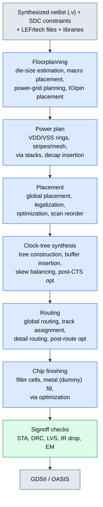
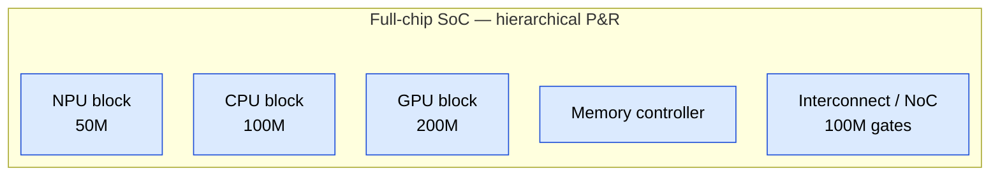

# Physical Design (PnR) — Senior Engineer Deep Dive

> Target audience: Engineers preparing for senior-level interviews at Apple, NVIDIA, AMD, Intel, Qualcomm.
> Covers the complete PnR (place and route) flow with quantitative depth, RTL/ASCII diagrams, and real design trade-offs.

---

## Table of Contents

1. [ASIC Physical Design Flow Overview](#1-asic-physical-design-flow-overview)
2. [Floorplanning](#2-floorplanning)
3. [Placement](#3-placement)
4. [Clock Tree Synthesis (CTS)](#4-clock-tree-synthesis-cts)
5. [Routing](#5-routing)
6. [Physical Verification (Signoff)](#6-physical-verification-signoff)
7. [Timing Signoff](#7-timing-signoff)
8. [Advanced Topics](#8-advanced-topics)
9. [AI/ML-Assisted Physical Design](#9-aiml-assisted-physical-design)

---

## 1. ASIC Physical Design Flow Overview

### 1.1 Complete Flow Diagram



### 1.2 Tools Landscape

| Stage           | Synopsys             | Cadence            | Siemens (Mentor)  |
|-----------------|----------------------|--------------------|-------------------|
| Place & Route   | ICC2 / Fusion Compiler | Innovus           | Aprisa            |
| STA             | PrimeTime            | Tempus             | —                 |
| Extraction      | StarRC               | Quantus            | xCalibrate        |
| IR Drop / Power | RedHawk / PTPX       | Voltus             | —                 |
| DRC/LVS         | ICV                  | Pegasus/PVS        | Calibre           |
| CTS             | (inside ICC2/FC)     | (inside Innovus)   | —                 |

**ICC2 vs Innovus — Real-World Comparison:**
- ICC2 / Fusion Compiler: tighter integration with Design Compiler (synthesis), unified data model, stronger in timing-driven flow, better for high-frequency designs (CPU cores).
- Innovus: known for superior congestion handling, faster runtime for large flat designs, GigaPlace engine is industry-leading for placement quality.
- At 5nm/3nm: both tools produce comparable results; the differentiator is usually recipe maturity and foundry-tool certification.

### 1.3 PPA Trade-offs at Each Stage

| Stage        | Performance Lever                 | Power Lever                     | Area Lever                    |
|--------------|-----------------------------------|---------------------------------|-------------------------------|
| Floorplan    | Short wire paths for critical     | Power grid robustness           | Utilization target            |
| Placement    | Timing-driven placement           | Activity-driven placement       | Minimize whitespace           |
| CTS          | Low insertion delay               | Fewer CTS buffers, gating       | CTS cell count                |
| Routing      | Minimize detour, SI clean         | Shorter wires = less dynamic pwr| Track utilization efficiency   |
| Signoff      | Multi-corner closure              | Leakage optimization, DVFS     | Fill density, via arrays      |

---

## 2. Floorplanning

### 2.1 Die Size Estimation

The most fundamental calculation in physical design:

```text
Core Area = Total Standard Cell Area / Target Utilization

Where:
  Total Standard Cell Area = sum of all cell areas from the synthesized netlist
  Target Utilization = 60-80% (technology and design dependent)
```

**Numerical Example:**

```text
Given:
  - Synthesized netlist has 2M standard cells
  - Average cell area = 0.5 um^2 (at 7nm)
  - Total standard cell area = 2M * 0.5 = 1.0 mm^2
  - 4 SRAM macros, each 0.2 mm^2 = 0.8 mm^2
  - Target utilization = 70%

Core Area = (1.0 mm^2) / 0.70 + 0.8 mm^2 = 1.43 + 0.8 = 2.23 mm^2

Die Area = Core Area + IO Ring Area
  IO ring width ~ 100-200 um on each side (bump pitch dependent)
  If core is 1.49 mm x 1.49 mm (square, AR=1):
  Die = (1.49 + 0.2 + 0.2) x (1.49 + 0.2 + 0.2) = 1.89 x 1.89 = 3.57 mm^2

Seal ring, scribe line add another ~50 um per side.
```

**Why utilization is 60-80% and not higher:**
- Below 60%: wasting silicon area, longer wires, more power
- 60-70%: comfortable routing, easy timing closure, good for high-performance
- 70-80%: standard for moderate-frequency designs
- Above 80%: severe routing congestion, timing closure becomes very difficult, DRC (design rule check) issues
- Above 85%: nearly impossible to close timing without significant architectural changes

### 2.2 Aspect Ratio

```text
Aspect Ratio (AR) = Height / Width

Ideal AR = 1.0 (square die)
Acceptable range: 0.7 to 1.4
```

**Impact of non-unity AR:**
- AR >> 1 (tall, narrow): horizontal routing tracks are short, vertical routing becomes congested, IR drop (current × resistance voltage drop across the power grid) worsens along the long dimension
- AR << 1 (wide, short): opposite problem
- Non-square dies also complicate package assembly and heat dissipation

### 2.3 Core Area vs Die Area

```ascii-graph
  +--------------------------------------------------+
  |  Scribe Line / Dicing Area                       |
  |  +--------------------------------------------+  |
  |  |  Seal Ring (guard ring, moisture barrier)   |  |
  |  |  +--------------------------------------+  |  |
  |  |  |  IO Ring (IO pads/bumps, ESD cells)  |  |  |
  |  |  |  +------------------------------+   |  |  |
  |  |  |  |  Core Area                    |   |  |  |
  |  |  |  |                               |   |  |  |
  |  |  |  |  +-------+     +---------+   |   |  |  |
  |  |  |  |  | SRAM  |     |  SRAM   |   |   |  |  |
  |  |  |  |  | Macro |     |  Macro  |   |   |  |  |
  |  |  |  |  +-------+     +---------+   |   |  |  |
  |  |  |  |                               |   |  |  |
  |  |  |  |  [Standard Cell Rows]         |   |  |  |
  |  |  |  |  |||||||||||||||||||||||||||   |   |  |  |
  |  |  |  |  |||||||||||||||||||||||||||   |   |  |  |
  |  |  |  |  |||||||||||||||||||||||||||   |   |  |  |
  |  |  |  |                               |   |  |  |
  |  |  |  +------------------------------+   |  |  |
  |  |  |  Corner Cells (at 4 corners)        |  |  |
  |  |  +--------------------------------------+  |  |
  |  +--------------------------------------------+  |
  +--------------------------------------------------+
```

- **Corner cells**: connect the IO ring power/ground at corners, ensure continuous ESD (electrostatic discharge) protection path.
- **Seal ring**: metal stack ring preventing moisture ingress into the die, mandatory foundry requirement.
- **IO ring**: contains IO pads (wire bond) or RDL (redistribution layer)/bump pads (flip-chip), ESD protection cells, level shifters.

### 2.4 Macro Placement Strategy

**General principles:**
1. Place macros at periphery (edges/corners) of the core to maximize contiguous standard cell area
2. Leave adequate channels between macros for routing (minimum 10-20 um at 7nm, technology-dependent)
3. Orient macro pins facing the standard cell area (pin accessibility)
4. Group macros that share data buses to minimize wirelength
5. Consider power grid continuity — macros should not block critical VDD/VSS stripes

**Fly-line analysis:**
Before finalizing macro positions, check fly-lines (virtual connections from netlist) to estimate wire congestion:

```ascii-graph
  Fly-Line Analysis (before macro placement optimization)
  
  +--------+                    +--------+
  |        |~~~~~~~~~~~~~~~~~~~~|        |
  | Macro  |~~~~~~~~~~~~~~~~~~~~| Macro  |    ~~~~ = fly-lines (logical connections)
  |   A    |~~~~~~~~~~~~~~~~~~~~|   B    |    Many fly-lines = place closer together
  |        |~~~~~~~~~~~~~~~~~~~~|        |
  +--------+                    +--------+
        |~~~~~
        |~~~~~
  +--------+
  | Macro  |
  |   C    |
  +--------+
  
  After optimization: move A and B adjacent, C near A
```

**Macro orientation:**
- Most macros have pins on specific sides (e.g., address/data pins on one side, power pins on another)
- Rotate macro (R0, R90, R180, R270, MX, MY) so that signal pins face the logic that drives/receives them
- SRAM (static random-access memory): typically place with data pins facing standard cell rows, address pins on the side

### 2.5 Power Planning

**Power grid structure:**

```text
  Top-level power grid (M9-M10 or top metals):
  
  VDD ========================================== (horizontal strap, M10)
  VSS ========================================== 
  VDD ==========================================
  VSS ==========================================
  
  |  |  |  |  |  |  |  |  |  |  |  |  |  |  |  (vertical straps, M9)
  V  G  V  G  V  G  V  G  V  G  V  G  V  G  V
  D  N  D  N  D  N  D  N  D  N  D  N  D  N  D
  D  D  D  D  D  D  D  D  D  D  D  D  D  D  D
  
  These connect down through via stacks to lower-level power rails:
  
  M1: VDD ---- GND ---- VDD ---- GND ---- (standard cell power rails, in rows)
```

**Power grid design parameters — Numerical Example:**

**Given:**
   - Total chip power = 2W
   - VDD = 0.75V (7nm)
   - Target IR drop budget = 5% of VDD = 37.5 mV
   - Total current = P/V = 2/0.75 = 2.67 A

- **IR Drop** = `I * R_grid`

**For a simplified 1D model:**
   - R_grid = rho * L / (W * T)

Where:
rho = sheet resistance of metal layer
L = length of power strap
W = width of power strap
T = thickness (built into sheet resistance)

**Example M9 strap:**
   - Sheet resistance (Rs) = 0.02 ohm/sq (for thick top metal)
   - Strap width = 4 um
   - Strap length = 1500 um (across chip)
   - Number of squares = 1500/4 = 375
   - R per strap = 0.02 * 375 = 7.5 ohm

But many straps in parallel:
If 50 VDD straps: R_effective = 7.5/50 = 0.15 ohm
IR drop from one end = 2.67A * 0.15 = 0.4V  (way too much!)

But current enters from both ends and is distributed:
Effective IR drop ≈ I*R/8 for distributed load = 2.67*0.15/8 = 50 mV

Still above 37.5 mV target → need more straps or wider straps.
Solution: 80 VDD straps, each 5 um wide, plus rings on all edges.

**Power strap pitch and width guidelines (7nm example):**

| Metal Layer | Typical Width | Typical Pitch | Purpose                  |
|-------------|---------------|---------------|--------------------------|
| M1          | 0.036 um      | 0.036 um      | Std cell power rails     |
| M2-M5       | 0.1-0.5 um   | 2-10 um       | Local power distribution |
| M6-M7       | 1-3 um        | 10-30 um      | Intermediate grid        |
| M8-M9       | 3-8 um        | 20-50 um      | Global grid              |
| M10+ (RDL)  | 5-15 um       | 30-80 um      | Top-level straps/rings   |

**Decap cell placement:**
- Decoupling capacitors store local charge to supply instantaneous switching current
- Place near high-switching-activity blocks (clock trees, wide buses, ALUs)
- Place in whitespace regions after placement to improve utilization
- Typical decap density: 5-15% of core area
- Critical near VDD/VSS ring connections and macro boundaries

**Power rings:**

```ascii-graph
  +--VDD-ring---------------------------------------+
  | +--VSS-ring-----------------------------------+ |
  | |                                             | |
  | |   Core Area with straps/mesh inside         | |
  | |                                             | |
  | +---------------------------------------------+ |
  +--------------------------------------------------+
  
  Ring width: 5-15 um (per ring), multiple VDD/VSS rings
  Via arrays at ring-to-strap intersections
```

### 2.6 Blockage Types

| Blockage Type   | Effect                                           | Use Case                        |
|-----------------|--------------------------------------------------|---------------------------------|
| Hard placement  | No cells can be placed here                      | Over macros, analog regions     |
| Soft placement  | Cells allowed but tool tries to avoid             | Near macros for routing         |
| Partial (e.g., 60%) | Limits placement density to specified %       | Around macros, congested areas  |
| Halo             | Keep-out region around macro                     | Ensure routing channels         |
| Routing blockage | No routing on specified layers in region         | Reserved layers for power, shielding |

**Halo vs Blockage:**
- Halo is relative to a macro (moves with the macro during optimization)
- Blockage is absolute (fixed coordinate region)
- Typical halo: 2-10 um around SRAM macros

### 2.7 Pin Placement

- IO pin locations drive the top-level signal routing topology
- Place pins on the side closest to the logic they connect to (minimizes wirelength)
- Clock pins: place centrally for balanced CTS (clock tree synthesis)
- For hierarchical designs: pin placement must match between parent and child partitions
- Pin spacing must satisfy minimum routing pitch on the pin layer

### 2.8 Floorplan Sanity Checks

1. **Channel DRC**: ensure minimum spacing between macros, macros and core boundary
2. **Placement density**: verify no region exceeds target utilization
3. **Power EM (electromigration)**: early check that power straps can handle expected current density
4. **Fly-line analysis**: verify no excessively long logical connections
5. **Timing estimation**: virtual route + trial placement to check feasibility

---

## 3. Placement

### 3.1 Global Placement

**Objective function -- Quadratic Wirelength:**

**The placement problem minimizes:**

W = Sum over all nets [ Sum over all pin pairs (i,j) in net ]
of ( (xi - xj)^2 + (yi - yj)^2 )

This is a quadratic function -> solvable via linear system:
dW/dx_i = 0  for all cells i

This produces a system of linear equations:
Q * x = b_x    (for x-coordinates)
Q * y = b_y    (for y-coordinates)

Where Q is a connectivity matrix (Laplacian of the hypergraph).

**Quadratic Placement (Force-Directed):**

```text
  Interpretation: connected cells exert "forces" pulling them together.
  The force between cells i and j connected by a net is proportional to
  their distance (like a spring: F = k * d, where k = connectivity weight).

  Algorithm:
  1. Build the Laplacian matrix Q:
     Q[i][i] = sum of all net weights connected to cell i
     Q[i][j] = -(sum of net weights between cells i and j)
     
  2. Solve Q * x = b_x and Q * y = b_y
     - b_x, b_y encode fixed pin positions (pads, macros)
     - Solution: x = Q^(-1) * b (direct solve via Cholesky factorization)
     - For 2M cells: sparse matrix, O(n * sqrt(n)) with good preconditioner

  3. Problem: cells overlap (no density constraint in pure quadratic)
     Fix: add spreading forces (density penalty)

  4. Spread and re-solve iteratively:
     - After solving, compute density per bin
     - Add pseudo-nets pulling cells from dense bins to sparse bins
     - Re-solve with updated forces
     - Converge over 20-50 iterations (temperature schedule controls force magnitude)

  ePlace (Cadence GigaPlace) uses electrostatic analogy:
    - Cells = positive charges
    - Density target = background negative charge
    - Electric potential = placement quality
    - Electric field = forces for cell movement
    - Solves Poisson's equation at each iteration (FFT-based, O(n log n))
```

**Simulated Annealing Placement:**

```text
  Used in older tools and for detailed placement refinement.
  Still relevant conceptually for understanding placement trade-offs.

  Algorithm:
  1. Start with an initial placement (from quadratic or random)
  2. Temperature schedule: T = T_start * alpha^k (alpha = 0.95, k = iteration)
     T_start: large enough to accept most moves (e.g., T_start = 10x average cost change)
     T_end: small enough to accept only improving moves (e.g., T_end = 0.001 * T_start)
  
  3. Move generation (randomly choose one):
     a. Swap two cells
     b. Move a cell to a random position
     c. Mirror/rotate a cell
     d. Swap two cells in the same row (preserve row alignment)
  
  4. Cost function (evaluate after each move):
     Cost = w_wire * HPWL + w_overlap * overlap_area + w_congestion * overflow
     
     HPWL: Half-Perimeter Wirelength (primary objective)
     Overlap: penalizes cells occupying the same area
     Congestion: penalizes regions with routing demand > supply
     Timing: optionally add negative-slack path length penalty
  
  5. Acceptance criterion (Metropolis):
     If Cost_new < Cost_old: accept
     Else: accept with probability exp(-(Cost_new - Cost_old) / T)
  
  6. At each temperature, attempt N_moves = 10 * N_cells moves
  
  Example timeline:
     Iter 1:  T=100, accept 95% of moves (exploring broadly)
     Iter 20: T=10,  accept 60% (narrowing)
     Iter 50: T=0.1, accept 5%  (only improving moves, "freezing")
  
  Typical runtime: O(N^1.5) to O(N^2) -- slower than analytical methods
  for large designs, but produces very high quality for small blocks.
```

**Numerical Example -- HPWL (half-perimeter wirelength) Calculation:**

```text
Given a net with 4 pins at coordinates:
  Pin A: (10, 20)
  Pin B: (50, 30)
  Pin C: (30, 60)
  Pin D: (40, 10)

HPWL = (max_x - min_x) + (max_y - min_y)
     = (50 - 10) + (60 - 10)
     = 40 + 50
     = 90 units

This is a fast approximation of Steiner tree wirelength.
Actual routed wirelength is typically 1.0-1.5x HPWL.
```

### 3.2 Detailed Placement (Legalization)

After global placement, cells overlap and are not aligned to rows:

```text
  Before Legalization:          After Legalization:
  
  Row 4: | A  [C]  B    |      Row 4: | A   C   B       |
  Row 3: |   [D E]      |      Row 3: |   D   E         |
  Row 2: |  [F] G    H  |  ->   Row 2: |  F   G      H   |
  Row 1: | I    J  [K]  |      Row 1: | I    J    K     |
  
  [overlapping cells]           All cells snapped to rows, no overlap
```

**Legalization algorithms:**

```ascii-graph
  Minimum Perturbation Legalization (most common):
  ──────────────────────────────────────────────────
  Goal: move cells as LITTLE as possible to achieve a legal placement.
  
  Algorithm (single-row legalization):
  1. Sort cells in each row by their global-placement x-coordinate
  2. Process cells left-to-right
  3. For each cell, place it at the nearest legal x-position that:
     - Does not overlap with the previously placed cell
     - Satisfies minimum spacing rules
     - Is on a legal site (quantized to site width)
  4. If a cell cannot fit in the current row, move to the next row
  5. After all cells are placed, run a "window-based" refinement that
     swaps cells within a small window (5-10 cells) to reduce total
     displacement from the global placement positions

  Tetris-style Legalization:
  ────────────────────────────
  1. Sort all cells by x-coordinate (left to right)
  2. Place each cell in the first available legal position:
     a. Try the same row as the global placement position
     b. If no space, try adjacent rows (up/down)
     c. Place at the nearest legal x-position
  3. This is fast O(n log n) but can produce sub-optimal results
     (cells pushed far from their ideal positions)
  
  Optimal legalization for a single row:
  ──────────────────────────────────────
  Dynamic programming approach:
  1. For N cells in a row, each with target position x_i:
  2. State: dp[i][j] = minimum total displacement for first i cells,
     with the i-th cell placed at legal position j
  3. Transition: dp[i][j] = |x_i - pos[j]| + min over k (dp[i-1][k])
     where k < j and pos[k] + spacing <= pos[j]
  4. Result: O(N * M) where M = number of legal positions in the row
     Typically M = row_width / site_width (manageable)
  5. Finds the globally optimal placement for that row with minimum
     total displacement from global placement targets
```

**Legalization rules:**
- Cells must be on legal row sites (quantized x positions based on site width)
- No overlap between cells
- Minimum spacing rules between cells
- Power rail alignment: cells must alternate orientation (N/S flip) for shared VDD/VSS rails

After global placement, cells overlap and are not aligned to rows:

```ascii-graph
  Before Legalization:          After Legalization:
  
  Row 4: | A  [C]  B    |      Row 4: | A   C   B       |
  Row 3: |   [D E]      |      Row 3: |   D   E         |
  Row 2: |  [F] G    H  |  →   Row 2: |  F   G      H   |
  Row 1: | I    J  [K]  |      Row 1: | I    J    K     |
  
  [overlapping cells]           All cells snapped to rows, no overlap
```

**Legalization rules:**
- Cells must be on legal row sites (quantized x positions based on site width)
- No overlap between cells
- Minimum spacing rules between cells
- Power rail alignment: cells must alternate orientation (N/S flip) for shared VDD/VSS rails

### 3.3 Placement Optimization

**Timing-driven placement:**
- Identify critical paths from initial timing analysis
- Pull cells on critical paths closer together
- Use "virtual routing" to estimate delays
- Net weighting: assign higher weights to timing-critical nets

**Congestion-driven placement:**
- Route demand estimated by pin count and net span per GCell
- If demand > supply (available tracks), area is congested
- Spread cells from congested areas even if it slightly worsens wirelength
- Congestion penalty in placement cost function

**Power-driven placement:**
- Cluster high-activity cells to localize switching current
- Can also spread high-activity cells to distribute heat

### 3.4 Cell Padding

```text
  Without padding:        With padding (1 site each side):
  
  |A|B|C|D|E|F|          |A| |B| |C| |D| |E| |F|
  
  Padding provides extra routing tracks between cells.
  Useful for high-fanout or congested regions.
  
  Typical: 1-2 sites padding for congested designs
  Impact: reduces effective utilization by 5-10%
```

### 3.5 Relative Placement (RPGroups)

Keep related cells physically close for timing or matching:

```ascii-graph
  RPGroup "critical_mux":
  +-------------------+
  | mux_sel_buf       |
  | mux_data0_inv     |
  | mux_inst          |
  | mux_data1_buf     |
  +-------------------+
  
  The tool places these cells within a small bounding box.
  Used for: clock muxes, critical datapaths, matched delay paths.
```

### 3.6 High Fanout Net Handling

Nets with fanout > 100-1000 are special:
- Clock nets: handled by CTS (not during placement)
- Reset nets: buffer tree inserted during placement or post-placement
- Enable signals: buffered to meet transition time requirements

```text
  Before buffering (fanout = 500):
  
  driver ---+--- sink1
            +--- sink2
            +--- sink3
            ...
            +--- sink500
  
  After buffering (tree structure):
  
  driver --- buf1 ---+--- buf1a --- sink1..sink50
                     +--- buf1b --- sink51..sink100
             buf2 ---+--- buf2a --- sink101..sink150
                     ...
```

### 3.7 Congestion Analysis

**GRC (Global Routing Congestion) Map:**

```ascii-graph
  Congestion map (color-coded):
  
  +------+------+------+------+
  | 0.3  | 0.5  | 0.8  | 0.4  |   Numbers = demand/supply ratio
  +------+------+------+------+   
  | 0.4  | 0.9  | 1.2! | 0.6  |   > 1.0 = overflow (congestion!)
  +------+------+------+------+   0.8-1.0 = near overflow (warning)
  | 0.3  | 0.7  | 0.9  | 0.5  |   < 0.7 = comfortable
  +------+------+------+------+
  | 0.2  | 0.4  | 0.5  | 0.3  |
  +------+------+------+------+
  
  GCell (1.2!) has overflow → routing will fail or detour.
  Fix: add placement blockage, increase cell padding, resize GCells.
```

### 3.8 Placement Metrics Summary

| Metric                  | Good Target          | Indicates                    |
|-------------------------|----------------------|------------------------------|
| Total HPWL              | Minimize             | Overall wirelength quality   |
| WNS (Worst Neg Slack)   | > -100ps post-place  | Timing feasibility           |
| TNS (Total Neg Slack)   | Close to 0           | Overall timing health        |
| Congestion overflow     | 0%                   | Routability                  |
| Max density per GCell   | < 85%                | Even cell distribution       |
| Cell count              | Track vs budget      | Area sanity                  |

---

## 4. Clock Tree Synthesis (CTS)

### 4.1 CTS Goals (Priority Order)

1. **Meet DRC**: transition time (slew), capacitance, fanout limits
2. **Minimize skew**: difference in clock arrival time between any two sinks
3. **Minimize insertion delay**: total delay from clock source to sinks
4. **Minimize power**: fewer buffers = less switching power on clock network
5. **Meet OCV targets**: reduce sensitivity to on-chip variation

### 4.2 Key Definitions

```ascii-graph
  Clock Source (PLL output or port)
       |
       | insertion delay = 800ps
       v
  +----+----+
  |  CTS    |
  | buffers |
  +----+----+
      / \
     /   \
    v     v
  FF_A   FF_B
  
  Arrival at FF_A = 800ps
  Arrival at FF_B = 820ps
  
  Skew = |820 - 800| = 20ps
  
  Insertion delay (latency) = average arrival = 810ps
  
  Local skew: between FFs in the same clock domain that have timing paths
  Global skew: between any two FFs in the design (usually larger)
  Useful skew: intentional skew to help timing
```

### 4.3 Tree Topologies

**H-Tree:**
```ascii-graph
  Balanced H-tree for symmetric clock distribution:
  
            CLK_IN
               |
       +-------+-------+
       |               |
   +---+---+       +---+---+
   |       |       |       |
  FF1    FF2     FF3     FF4
  
  Each branch has equal wire length → inherently balanced.
  Used in: regular array structures, memory arrays, FPGAs.
  Downside: works poorly for non-uniform sink distributions.
```

**Balanced CTS (Standard Cell Based):**
```ascii-graph
  Most common in ASIC designs.
  Tool builds a buffer tree top-down or bottom-up.
  
  CLK_IN → buf → buf → buf → FF1
                    |→ buf → FF2
              |→ buf → buf → FF3
                    |→ buf → FF4
  
  Tool balances delays by:
  - Choosing buffer sizes (drive strength)
  - Inserting delay buffers on shorter paths
  - Wire snaking (adding wire length to shorter paths)
```

**Clock Mesh:**
```ascii-graph
  +-------+-------+-------+-------+
  |       |       |       |       |
  +---+---+---+---+---+---+---+---+   Horizontal mesh wires
  |       |       |       |       |
  +---+---+---+---+---+---+---+---+
  |       |       |       |       |
  +-------+-------+-------+-------+
  
  Multiple drivers at mesh intersections.
  Extremely low skew (< 5ps achievable).
  Very high power (mesh is always switching).
  Used in: high-performance CPUs (Intel, AMD core clocks).
```

**Fishbone:**
```ascii-graph
  Central spine with branches:
  
          CLK_IN
             |
  ===+===+===+===+===+===+===   (spine)
     |   |       |   |   |
    FF1  FF2    FF3 FF4  FF5     (branches to sinks)
  
  Good for long, narrow blocks.
  Easy to balance along one dimension.
```

### 4.4 CTS Algorithm Detail

**Bottom-up clustering (Deferred Merge Embedding - DME):**

```text
Step 1: Start with sink locations
  FF_A(10,20), FF_B(50,20), FF_C(30,60), FF_D(70,60)

Step 2: Pair sinks and find merge point
  Pair (A,B): merge at (30, 20) -- equidistant in Manhattan distance
  Pair (C,D): merge at (50, 60)

Step 3: Merge the merged points
  Merge ((30,20), (50,60)): merge at (40, 40)

Step 4: Insert buffers at merge points

  Result:
                (40,40) buf_root
                /           \
        (30,20) buf1    (50,60) buf2
         /    \          /    \
      FF_A   FF_B    FF_C   FF_D
```

**Method of Means and Medians (MMM):**

```text
  A top-down approach for clock tree construction:
  
  1. Given N sinks, compute the center of mass (mean):
     x_mean = sum(x_i) / N,  y_mean = sum(y_i) / N
  
  2. Find the median splitting line through (x_mean, y_mean):
     - Sort sinks by x-coordinate (or y)
     - Split into two equal groups at the median
     - This balances the number of sinks in each subtree
  
  3. Recursively apply to each half until each group has 1 sink
  
  Example: 8 sinks at positions:
    (0,0), (2,3), (5,1), (6,5), (10,2), (12,4), (15,1), (18,3)
    
    Mean x = (0+2+5+6+10+12+15+18)/8 = 8.5
    Median x = 8 (between 6 and 10)
    
    Left group: (0,0), (2,3), (5,1), (6,5)   -> recurse
    Right group: (10,2), (12,4), (15,1), (18,3) -> recurse
    
    Left group mean x = 3.25, median x = 3.5
      Left-Left: (0,0), (2,3) -> merge point (1, 1.5)
      Left-Right: (5,1), (6,5) -> merge point (5.5, 3)
    
    Continue until all groups are single sinks.
  
  4. Insert buffers at each internal node of the tree
  
  Pros: simple, fast O(N log N), good for uniform sink distributions
  Cons: does not minimize wirelength or skew -- suboptimal for
        non-uniform distributions. Used as starting point for DME refinement.
```

**Geometric Matching (Top-Down Merging):**

```text
  A bottom-up approach that pairs sinks to minimize total wirelength:
  
  1. Compute pairwise Manhattan distances between all sinks (O(N^2))
  
  2. Find minimum-cost perfect matching (or near-perfect if N is odd):
     - Pair sinks that are closest together
     - For each pair (a, b), the merge point is at the Manhattan midpoint:
       merge_x = (x_a + x_b) / 2,  merge_y = (y_a + y_b) / 2
     - This ensures zero skew between the paired sinks (equal wire length)
  
  3. Each pair produces a "super-sink" at the merge point.
     The super-sink's load capacitance = sum of the two sinks' caps
     + wire capacitance to both sinks.
  
  4. Repeat matching on the set of super-sinks until one root remains.
  
  5. Insert buffers at each merge point, sized to drive the combined load.
  
  Example with 4 sinks:
    A(0,0), B(10,0), C(0,10), D(10,10)
    
    Round 1 matching: A-B (dist=10), C-D (dist=10)
      Merge AB at (5,0), merge CD at (5,10)
    
    Round 2 matching: AB-CD (dist=10)
      Merge ABCD at (5,5) -- the root buffer
    
    Total wirelength: 10 + 10 + 10 = 30
    Skew: 0 (all paths from root to sink are equal length: 5+5=10 each)
  
  Complexity: O(N^3) for matching at each level, O(N^3 * log N) total
  Better skew than MMM because matching explicitly minimizes wirelength.
  Greedy approximation: O(N^2) per level, used in practice for large designs.
```

**DME (Deferred Merge Embedding) -- Zero-Skew Merge Point Computation:**

```ascii-graph
  DME is the industry-standard CTS algorithm. Key idea: defer the exact
  placement of merge points until the entire tree topology is known,
  then embed them optimally bottom-up.

  Phase 1 (Bottom-Up: Compute Merge Segments):
  ─────────────────────────────────────────────
  For each pair of sub-trees (left, right) with known sink sets:

  Given:
    - Left subtree has total wire capacitance C_left, wire resistance R_left
    - Right subtree has C_right, R_right
    - The sink loading capacitances are known
    - Merge point must be on the Manhattan arc between left and right roots
    - We use Elmore delay model: T = R * C_downstream

  Zero-skew condition:
    T_left = T_right  (delay from merge point to all sinks in each subtree)

  Let the merge point be at a fraction alpha along the wire from left to right:
    Wire to left subtree:  length = alpha * L,   R = alpha * r_w, C = alpha * c_w
    Wire to right subtree: length = (1-alpha)*L, R = (1-alpha)*r_w, C = (1-alpha)*c_w

  Elmore delay balance:
    alpha * r_w * (alpha * c_w / 2 + C_left) = 
    (1-alpha) * r_w * ((1-alpha) * c_w / 2 + C_right)

  Solving for alpha:
    alpha = (C_right + c_w * L / 2 - C_left) / (c_w * L)

    where L = Manhattan distance between left and right subtree roots
          r_w, c_w = per-unit-length wire resistance and capacitance

  Special cases:
    If alpha < 0: left subtree needs MORE delay -> wire snaking on left side
    If alpha > 1: right subtree needs MORE delay -> wire snaking on right side
    If 0 <= alpha <= 1: merge point is on the line segment (ideal)

  Phase 2 (Top-Down: Embed Merge Points):
  ───────────────────────────────────────
  1. Root merge point can be placed anywhere on its merging segment
     (typically placed at the clock source or closest buffer)
  2. Once root is placed, the positions of children are determined by
     the alpha values computed in Phase 1
  3. Recurse down the tree, placing each merge point
  4. Insert buffers at each merge point, choosing the appropriate drive
     strength based on downstream load capacitance

  Example (2 sinks):
    Sink A at (0,0), load cap = 30 fF
    Sink B at (100,0), load cap = 70 fF  (heavier load)
    Wire: r_w = 0.1 ohm/um, c_w = 0.2 fF/um, L = 100 um

    Total wire cap = c_w * L = 20 fF
    alpha = (70 + 20/2 - 30) / 20 = (70 + 10 - 30) / 20 = 50/20 = 2.5
    
    alpha > 1 -> merge point is to the LEFT of sink A
    This means sink B's heavier load requires a longer wire to balance.
    
    Recompute with snaking:
    Required extra wire on B side to balance: solve for alpha that gives
    equal Elmore delay. The merge point is placed at (0,0) (at sink A),
    and a wire of length L_snake runs from (0,0) to (100,0).
    
    Balance: r_w * L_snake * (c_w * L_snake / 2 + C_B) = r_w * 0 * C_A
    Actually: the snaking wire adds delay to the B path.
    T_B = r_w * 100 * (c_w * 100/2 + 70) = 10 * (10 + 70) = 800
    T_A = 0 * 30 = 0  (merge at sink A, zero wire to A)
    
    Need to add wire to A side: wire from merge toward A and back.
    In practice, the tool inserts a delay buffer instead of snaking.

  Multi-corner CTS handling:
  ──────────────────────────
  1. Run DME for each corner (SS, TT, FF) independently
  2. The merge point alpha values differ per corner (different r_w, c_w)
  3. Choose the buffer sizes and wire lengths that satisfy skew targets
     at ALL corners simultaneously
  4. This is formulated as a multi-objective optimization:
     minimize max_skew_across_corners + insertion_delay
  5. Practical approach: optimize for the worst-corner skew, verify
     at all other corners, iterate if any corner exceeds the target
```

### 4.5 Clock Tree Cells

CTS uses special library cells optimized for:
- **Balanced rise/fall times**: normal buffers may have unequal trise/tfall. CTS buffers are designed with balanced PMOS/NMOS sizing.
- **Low skew**: tight process variation control
- **Multiple drive strengths**: CTS library typically has 8-16 buffer sizes

```text
  Typical CTS cell library:
  CLKBUF_X1, CLKBUF_X2, CLKBUF_X4, CLKBUF_X8, CLKBUF_X16
  CLKINV_X1, CLKINV_X2, CLKINV_X4, CLKINV_X8, CLKINV_X16
  
  Inverters are preferred in CTS because:
  - Inverter pair (2 inversions) has better balanced delay
  - Lower area than buffer (which is 2 inverters internally)
  - Alternating inversions naturally compensate for duty cycle distortion
```

### 4.6 Non-Default Rules (NDR) for Clock

```verilog
  Standard signal wire:       Clock wire with NDR:
  
  |-w-|  |-s-|  |-w-|         |-2w-|  |-2s-|  |-2w-|
  |   |  |   |  |   |         |    |  |    |  |    |
  |sig|  |   |  |sig|         |clk |  |    |  |sig |
  |   |  |   |  |   |         |    |  |    |  |    |
  
  w = minimum width            2w = double width
  s = minimum spacing           2s = double spacing
  
  NDR: "double width, double spacing" (2W2S)
```

**Why NDR for clocks:**
- **Double width**: reduces wire resistance → less RC (resistance-capacitance) delay variation → less skew
  - R is inversely proportional to width: halved R means halved RC delay sensitivity
- **Double spacing**: reduces coupling capacitance → less crosstalk → less jitter
  - Critical because clock jitter directly impacts timing margin
- **Cost**: NDR clock wires consume 4x the routing resources of standard wires
- **Multi-cut vias**: mandatory for clock nets for reliability

**Numerical impact:**
```verilog
Standard wire: R = 10 ohm/um, C = 0.2 fF/um, RC = 2.0 fF*ohm/um^2
NDR 2W wire:   R = 5 ohm/um,  C = 0.25 fF/um, RC = 1.25 fF*ohm/um^2  (37.5% less)
NDR 2W2S wire: R = 5 ohm/um,  C = 0.15 fF/um, RC = 0.75 fF*ohm/um^2  (62.5% less)
```

### 4.7 Useful Skew

**Concept: borrowing time from adjacent pipeline stages:**

```ascii-graph
  Without useful skew:
  
  FF_A --[combo: 3ns]-- FF_B --[combo: 1ns]-- FF_C
    ^                     ^                      ^
    CLK (0ps skew)       CLK (0ps skew)         CLK
    
  Period must be >= 3ns (bottleneck is path A→B)
  Path B→C uses only 1ns of 3ns period → 2ns wasted.
  
  With useful skew:
  
  FF_A --[combo: 3ns]-- FF_B --[combo: 1ns]-- FF_C
    ^                     ^                      ^
    CLK +500ps skew      CLK                    CLK -500ps skew
    
  Now FF_B captures 500ps later:
    Path A→B effective time = 3ns + 500ps = 3.5ns budget (but we only need 3ns, OK)
    Wait — we need: combo_delay < Period + skew_B - skew_A
    3ns < Period + 500ps - 0 → Period > 2.5ns
    
  Path B→C: 1ns < Period + (-500ps) - 0 → need Period > 1.5ns (still OK)
  
  Net result: can run at 2.5ns period instead of 3ns → 20% faster!
```

**Useful skew constraints:**
```text
Setup: T_combo < T_clk + skew   (more time for slow paths)
Hold:  T_combo > T_hold - skew  (must still meet hold with the skew)
```

The CTS tool must balance: adding skew helps setup but hurts hold (requires more hold buffers).

### 4.8 Multi-Source CTS / Clock Mesh

For clock mesh designs:
1. Build an initial tree to drive the mesh
2. Insert mesh grid (horizontal + vertical wires)
3. Multiple tree endpoints drive different mesh intersections
4. Mesh averaging effect reduces local skew to < 5ps
5. Short-circuit current between drivers with slightly different phases is the power cost

### 4.9 CTS Metrics

| Metric              | Good Target (7nm, 1GHz) | Notes                           |
|---------------------|-------------------------|---------------------------------|
| Global skew         | < 50ps                  | Across entire clock domain      |
| Local skew          | < 20ps                  | Between related FF pairs        |
| Insertion delay     | 200-500ps               | Depends on die size             |
| Transition time     | < 80ps at sinks         | DRC requirement                 |
| # CTS buffers       | Design-dependent        | Monitor for power impact        |
| Clock tree power    | 30-40% of total dynamic | Industry-typical                |
| Duty cycle distortion | < 5%                  | Important for DDR interfaces    |

### 4.10 Post-CTS Optimization

1. **Hold fixing**: insert delay buffers on short paths to meet hold timing
   - CTS creates real clock latency → hold paths now have actual timing numbers
   - Pre-CTS hold fixing is inaccurate (ideal clocks)

2. **Useful skew optimization**: after initial CTS, tool adjusts buffer sizes / adds delay to selectively skew clock arrivals

3. **CCD (Concurrent Clock and Data)**: optimizes clock and data paths simultaneously
   - Traditional: fix clock tree, then optimize data paths
   - CCD: allows clock tree adjustments alongside data path optimization
   - 5-10% frequency improvement possible with CCD

---

## 5. Routing

### 5.1 Global Routing

```ascii-graph
  Chip divided into Global Routing Cells (GCells):
  
  +------+------+------+------+
  |      |      |      |      |
  | GC00 | GC01 | GC02 | GC03 |   Each GCell has:
  |      |      |      |      |   - Horizontal tracks (supply)
  +------+------+------+------+   - Vertical tracks (supply)
  |      |      |      |      |
  | GC10 | GC11 | GC12 | GC13 |   Global router finds path through
  |      |      |      |      |   GCells for each net (coarse grid)
  +------+------+------+------+
  
  Net A: GC00 -> GC01 -> GC11    (L-shaped route)
  Net B: GC00 -> GC10 -> GC11    (another L-shape)
  
  Congestion = demand / supply per GCell edge
  If demand > supply -> overflow -> must detour or promote to higher metal
```

**Congestion Estimation:**

```text
  For each GCell boundary edge, compute:
    Demand = number of nets that must cross this edge
    Supply = number of available routing tracks on this edge
    Overflow = max(0, Demand - Supply)

  Estimation methods:
  1. Probabilistic: for a 2-pin net spanning (dx, dy) GCells,
     probability of using each horizontal edge = 1/dx, vertical = 1/dy
     Sum over all nets -> expected demand per edge

  2. Routability-driven: after global placement, run fast trial routing
     on a coarse grid. The resulting overflow map directly identifies
     congestion hotspots. Feed back to placement for correction.

  3. ML-based: recent tools (Synopsys, Cadence) train CNN/GNN models
     on placement features to predict routing congestion before routing
     runs. ~85-90% accuracy, much faster than trial routing.
```

**Maze Routing (Lee's Algorithm / BFS (breadth-first search)):**

```text
  For a 2-pin net that must be routed through the GCell grid:

  1. Start from source GCell (S), label it 0
  2. BFS expansion: label all neighbors of 0 as 1, then neighbors of 1 as 2, etc.
  3. Continue until the target GCell (T) is reached
  4. Trace back from T to S following decreasing labels -> shortest path

  Example (5x5 grid, S=(0,0), T=(4,3), obstacles marked X):
  
    S  1  2  3  4
    1  2  X  4  5
    2  3  X  5  6
    3  4  5  6  T(7)
    4  X  6  7  8

  Path: S->1->2->3->4->5->6->T (Manhattan distance = 4+3 = 7)
  The X obstacles force detours.

  Complexity: O(W * H) per net (W, H = grid dimensions)
  Guaranteed to find the shortest path (BFS property).
  
  Problem: very slow for millions of nets (each BFS touches many cells).
  Solution: A* routing (see below) reduces search space by 5-20x.
```

**A*-Based Routing:**

```ascii-graph
  A* uses a priority queue with cost function:
    f(n) = g(n) + h(n)
  
  g(n) = actual cost from source to current GCell n
  h(n) = heuristic (lower bound) cost from n to target
       = Manhattan distance from n to target (admissible heuristic)

  Priority queue processes cells in order of f(n) (lowest first).
  
  Properties:
  - With admissible h(n), A* finds the optimal (shortest) path
  - h(n) prunes the search: cells far from the target are explored last
  - Typical speedup over Lee's: 5-20x (depends on grid size and obstacles)

  Multi-net global routing with rip-up and reroute (RRR):
  ──────────────────────────────────────────────────────
  1. Order nets by criticality (timing-critical first, then by HPWL)
  2. Route each net using A* through the GCell grid
  3. If routing causes overflow on any GCell edge:
     a. Increase the cost of using that edge (congestion penalty)
     b. Identify the net(s) causing the worst overflow
     c. Rip up (remove) those nets
     d. Re-route them with the updated costs
  4. Iterate until all overflow is resolved or iteration limit reached

  Negotiation-based routing (PathFinder):
  ──────────────────────────────────────
  - Each edge has a cost that increases with historical congestion
  - Nets compete for edges; loser pays higher cost next iteration
  - Converges to a global optimum (or near-optimal) solution
  - Used in FPGA routing (VPR) and adapted for ASIC global routing
```

### 5.2 Track Assignment

Intermediate step between global and detail routing:
- Assigns each net segment to a specific track within the GCell
- Resolves most spacing conflicts
- Results in a nearly-legal route that detail router refines

### 5.3 Detail Routing

Creates actual geometric shapes (rectangles on metal layers, vias):
- Must satisfy ALL DRC rules: minimum width, spacing, enclosure, end-of-line, etc.
- Rip-up and reroute (RRR): when conflicts arise, remove conflicting segment, find alternative
- Negotiation-based routing: PathFinder algorithm -- all nets compete for tracks, penalty increases for over-used resources

**Design Rules Enforced by Detail Router:**

```ascii-graph
  Minimum Width:
    Each metal layer has a minimum feature width (e.g., M1: 28nm at 7nm)
    Wire must be at least this wide along its entire length

  Minimum Spacing:
    Two wires on the same layer must be separated by at least the
    minimum spacing for that layer (e.g., M1: 28nm)
    Spacing can depend on: wire width (wider wires need more space),
    wire length (long parallel runs may need more), and voltage

  Via Rules:
    - Minimum via size (single-cut: 20x20nm at 7nm)
    - Minimum via enclosure (metal overlap around via on each layer)
    - Minimum via spacing (distance between via cuts)
    - Maximum via resistance constraints
    - Preferred via direction (column vs row alignment)
    - Via array rules: multi-cut vias must fit within enclosure constraints

  End-of-Line (EOL) Spacing:
    ┌───┐
    │   │ <- line end
    └───┘
       ↕ EOL spacing zone (typically 1.5-2x normal spacing)
    ┌───┐
    │   │ <- adjacent line end or parallel run
    └───┘
    The router must check EOL spacing within a defined "EOL window"
    (e.g., within 50nm of the line end). This prevents lithography
    artifacts at wire corners and tips.

  Minimum Area:
    Each metal shape must have area >= A_min (e.g., 0.003 um^2 at 7nm)
    This is checked after all DRC fixes; small jog segments may violate.

  Cut Spacing (for via layers):
    Via cuts on the same cut layer must maintain minimum spacing.
    For SADP via layers, cuts may need to be on a fixed grid.
```

**Antenna Rule Checking:**

```text
  Antenna ratio = (total metal area on a specific layer that is connected
                   to a gate oxide, with no connection to higher layers)
                  / (gate oxide area)

  During routing, the tool tracks for each net:
    - Which metal layers are used
    - The area of metal on each layer that connects to gate terminals
    - Whether any connection to upper metal exists (breaks antenna path)

  Example calculation:
    Net connects: M1 segment (area 0.5 um^2) -> M2 segment (area 2.0 um^2)
                  -> gate (area 0.001 um^2)
    
    After M1 processing: antenna ratio = 0.5 / 0.001 = 500
    After M2 processing: antenna ratio = (0.5 + 2.0) / 0.001 = 2500
    
    If M2 limit = 2000 -> VIOLATION!
    Fix: insert antenna diode near the gate, or jump from M1 to M3
    before routing the long M2 segment (M3 is processed later, breaking
    the charge accumulation path during M2 processing).

  The router fixes antenna violations automatically by:
    1. Inserting antenna diode cells (preferred, if placement space exists)
    2. Breaking long wires with layer jumps (changes routing topology)
    3. Re-routing to shorten the wire on the violating layer
```

### 5.4 Routing Layer Usage

```ascii-graph
  Metal stack (typical 7nm, 13 metal layers):
  
  M13 (AP)  ─── Ultra-thick, redistribution layer (bumps)
  M12       ─── Top global routing, power straps
  M11       ─── Global routing, power straps
  M10       ─── Global routing (prefer horizontal)
  M9        ─── Global routing (prefer vertical)
  M8        ─── Semi-global (prefer horizontal)
  M7        ─── Semi-global (prefer vertical)
  M6        ─── Intermediate (prefer horizontal)
  M5        ─── Intermediate (prefer vertical)
  M4        ─── Local routing (prefer horizontal)
  M3        ─── Local routing (prefer vertical)
  M2        ─── Local routing (prefer horizontal)
  M1        ─── Intra-cell routing (std cell internal)
  
  Lower metals: high resistance, fine pitch → short, local connections
  Upper metals: low resistance, coarse pitch → long, global connections
  
  Preferred direction alternates H/V by layer to facilitate via connections.
```

### 5.5 Antenna Effect

```verilog
  During fabrication (plasma etching), metal layers are built bottom-up.
  When M3 is being etched, M3 wire collects charge from plasma.
  If M3 wire is long and connects to a gate (through M2, M1, poly):
  
       +----- Long M3 wire (charge collecting antenna) -----+
       |                                                      |
       Via                                                    (no connection yet
       |                                                       to upper metals)
       M2 segment
       |
       Via
       |
       M1 segment
       |
       Gate oxide  ← Charge damages thin gate oxide!
       |
       Transistor
  
  Antenna Ratio = (Metal area collecting charge) / (Gate area connected)
  
  Foundry specifies maximum antenna ratio per layer (e.g., 400:1 for M3).
```

**Antenna Fixing Methods:**

1. **Diode insertion**: add reverse-biased diode near the gate to discharge accumulated charge
```verilog
   Long M3 wire --- gate
                 |
                 diode (to substrate) ← bleeds off charge
```

2. **Layer jumping**: break the long wire by jumping to a higher metal layer
```text
   M3 ----+    +---- M3
          |    |
          M5---M5      (M5 processed later, breaks antenna path)
```

3. **Bridge insertion**: route part of the net on a different layer

### 5.6 Crosstalk

```ascii-graph
  Coupling capacitance between adjacent wires:
  
  Signal A ─────────────────────── (aggressor)
            ↕ Cc (coupling cap)
  Signal B ─────────────────────── (victim)
  
  When A switches, it injects noise into B through Cc.
```

**Two impacts:**

1. **Functional noise (glitch)**:
```ascii-graph
   Victim is stable at logic 0.
   Aggressor transitions 0→1.
   Coupling injects positive voltage bump on victim.
   If bump > noise margin → functional failure!
   
   Glitch amplitude ≈ Cc / (Cc + Cvictim_to_ground) * Vdd
   
   Example: Cc = 0.5fF, Cground = 1.5fF, Vdd = 0.75V
   Glitch ≈ 0.5/(0.5+1.5) * 0.75 = 0.25 * 0.75 = 0.1875V
   If noise margin = 0.2V → marginal! Need to fix.
```

2. **Timing impact**:
```ascii-graph
   Same-direction switching (aggressor and victim switch same way):
     Effective Cc is reduced → victim appears faster (speed-up)
     
   Opposite-direction switching:
     Effective Cc is increased → victim appears slower (slow-down)
     
   Miller effect: Cc_effective = Cc * (1 + delta_V_aggressor/delta_V_victim)
     Same direction: Cc_eff ≈ 0 (best case)
     Opposite direction: Cc_eff ≈ 2*Cc (worst case)
```

**Crosstalk Fixing:**

| Method         | How It Works                        | Cost              |
|----------------|-------------------------------------|--------------------|
| Spacing        | Increase distance between wires     | More routing area  |
| Shielding      | Insert VDD/VSS wire between signals | Routing resources  |
| Layer change   | Move one net to a different layer   | Via, potential detour |
| Net ordering   | Place non-switching nets adjacent   | Tool analysis time |
| Downsizing aggressor | Weaker driver = slower transition | May affect aggressor timing |
| Upsizing victim | Stronger driver = less susceptible | More power, area  |

### 5.7 Via Optimization

```ascii-graph
  Single-cut via:        Multi-cut via (2x1):      Multi-cut via (2x2):
  
  +---+                  +---+ +---+                +---+ +---+
  |   |                  |   | |   |                |   | |   |
  +---+                  +---+ +---+                +---+ +---+
                                                    +---+ +---+
  R = R_via              R = R_via/2                |   | |   |
                                                    +---+ +---+
  1 via: if it fails     2 vias: redundancy         R = R_via/4
  → open circuit         if 1 fails, other works
```

**Why multi-cut vias matter:**
- **Reliability**: single via failure probability ~10^-6. Two independent vias: ~10^-12
- **Resistance**: parallel vias reduce via resistance (important for IR drop)
- **EM**: current distributed across multiple vias, reduces current density per via
- **DFM (design for manufacturability) requirement**: many foundries mandate multi-cut vias for signoff at 7nm and below
- **Trade-off**: multi-cut vias need more space, can cause routing congestion

### 5.8 ECO Routing

Post-signoff changes (Engineering Change Order):
1. Spare cells pre-placed in the design can be repurposed
2. Only metal layers are re-routed (no base layer change = metal-only ECO)
3. Tools perform incremental routing: fix only changed nets
4. Critical: verify LVS (layout versus schematic), DRC, timing only for changed region + neighbors

```ascii-graph
  ECO flow:
  Functional bug found → RTL fix → re-synthesize affected logic
  → incremental placement (using spare cells or minimal cell swaps)
  → incremental routing → re-run signoff on affected region
  → saves 2-4 weeks vs full PnR iteration
```

---

## 6. Physical Verification and Power Signoff — Hand-Off

PnR does not end at routing; the database must pass the signoff checks, which have their own pages:

- **DRC / LVS / ERC (electrical rule check) / antenna / density-fill** — what each check is and how signoff runs it: [Physical_Verification_DRC_LVS](../06_Signoff/03_Physical_Verification_DRC_LVS.md) (the in-practice detail formerly in this section lives there).
- **Electromigration** — Black's equation, per-layer current limits, self-heating: [Signal_Integrity_Reliability](02_Signal_Integrity_Reliability.md) §4.
- **IR drop (static + dynamic)** — grid resistance models, vectorless vs vector-based, fixing: [Signal_Integrity_Reliability](02_Signal_Integrity_Reliability.md) §5 (grid design in §6).
- Power-integrity signoff criteria and tools (Voltus/RedHawk): [Power_Analysis_and_Signoff](../02_Power_and_Low_Power/05_Power_Analysis_and_Signoff.md).

The PnR engineer's responsibility: leave enough margin during implementation (density headroom, grid robustness, antenna diodes) that these checks converge without heroic ECOs.

## 7. Timing Signoff

### 7.1 MCMM (Multi-Corner Multi-Mode)

```ascii-graph
  Corners (process/voltage/temperature):
  
  Corner Name     Process    Voltage     Temperature    Purpose
  ─────────────────────────────────────────────────────────────
  SS_0p675V_125C  Slow-Slow  0.675V      125°C          Setup (worst)
  FF_0p825V_m40C  Fast-Fast  0.825V      -40°C          Hold (worst)
  TT_0p75V_25C    Typical    0.750V      25°C           Nominal
  SS_0p675V_m40C  Slow-Slow  0.675V      -40°C          Setup (cold)
  FF_0p825V_125C  Fast-Fast  0.825V      125°C          Hold (hot)
  
  Modes (functional scenarios):
  - func_mode: normal operation, highest frequency
  - scan_mode: test mode, slower clock, shift/capture constraints
  - sleep_mode: low power, most clocks gated, leakage focus
  
  MCMM matrix: every corner × every mode = a "scenario"
  Each scenario has its own SDC (constraints), SPEF (parasitics), library
  
  Typical signoff: 10-30 scenarios for a complex SoC
```

### 7.2 Extraction Corners

```ascii-graph
  Parasitic extraction produces SPEF (Standard Parasitic Exchange Format)
  
  Extraction Corner   Resistance    Capacitance    When to Use
  ──────────────────────────────────────────────────────────────
  Cworst (Cmax)       Nominal       Maximum        Setup analysis (more delay)
  Cbest (Cmin)        Nominal       Minimum        Hold analysis (less delay)
  RCworst             Maximum       Maximum        Long wire dominated paths
  RCbest              Minimum       Minimum        Short wire / gate dominated
  
  Wire delay (Elmore): T = R * C
  - Cworst: high C → more delay → harder to meet setup
  - Cbest: low C → less delay → harder to meet hold
  - RCworst: both high → maximum wire delay (long global routes)
```

### 7.3 OCV, AOCV, POCV

**On-Chip Variation (OCV):**
```text
  Cells on the same die don't all have the same delay.
  Process variation, voltage drop, temperature gradient cause differences.
  
  Traditional OCV: apply flat derate
    Data path (launch): delay * (1 + derate)    [make it slower for setup]
    Clock path (capture): delay * (1 - derate)   [make it faster for setup]
    
    Typical derate: 5-10%
    
  Problem: flat derate is pessimistic for paths with many stages.
  Statistical reasoning: variations average out over many cells.
```

**AOCV (Advanced OCV):**
```ascii-graph
  Derate depends on:
  1. Path depth (number of stages): more stages → smaller derate
  2. Physical distance: cells far apart → larger derate
  
  AOCV table (example):
  
  Depth    Derate (early/late)
  1        0.92 / 1.08
  2        0.93 / 1.07
  4        0.94 / 1.06
  8        0.95 / 1.05
  16       0.96 / 1.04
  32       0.97 / 1.03
  
  As depth increases, derate approaches 1.0 (less pessimistic).
```

**POCV (Parametric OCV):**
```text
  Statistical approach: each cell delay has a mean and sigma.
  
  Path delay = sum of (mean_i + k * sigma_i)
  
  For independent variations:
  Path sigma = sqrt(sum of sigma_i^2)
  
  Total path delay = sum(mean_i) + k * sqrt(sum(sigma_i^2))
  
  k = 3 for 3-sigma (99.87% confidence)
  
  This is less pessimistic than AOCV for deep paths:
  AOCV assumes worst-case derate for whole path.
  POCV properly accounts for statistical cancellation.
  
  Example:
  10-stage path, each cell: mean=50ps, sigma=5ps
  
  AOCV (depth=10, derate=1.05): total = 10*50*1.05 = 525ps
  POCV (3-sigma): total = 10*50 + 3*sqrt(10*25) = 500 + 3*15.8 = 547ps
  
  At depth=100:
  AOCV (depth=100, derate=1.02): total = 100*50*1.02 = 5100ps
  POCV (3-sigma): total = 100*50 + 3*sqrt(100*25) = 5000 + 3*50 = 5150ps
  
  The relative pessimism varies; POCV gives more accurate results.
```

### 7.4 SI Timing

```ascii-graph
  Crosstalk impacts timing:
  
  Setup (late arrival on data):
    Victim data path slowed by opposite-switching aggressor
    → add SI delay penalty to data arrival time
    
  Hold (early arrival on data):
    Victim data path sped up by same-switching aggressor
    → subtract SI delay from data arrival time
    
  SI-aware STA tools (PrimeTime SI, Tempus):
    - Extract coupling capacitance from SPEF
    - Determine aggressor switching windows
    - Calculate worst-case SI impact on each timing path
    - Report SI-specific slack contributions
```

### 7.5 ECO Flow

```verilog
  ECO Types:
  
  1. Functional ECO:
     - Fix a logic bug post-layout
     - Re-synthesize affected logic
     - Map to existing spare cells or minimal cell changes
     - Reroute only affected nets
     
  2. Timing ECO:
     - Fix setup/hold violations found in signoff
     - Operations: size up (faster), size down (less load), swap VT,
       insert buffer (fix transition), delete buffer (reduce delay)
     - No logic change, only cell sizing/swapping
     
  3. Metal-only ECO:
     - Change only metal routing (no cell changes)
     - Fastest turnaround
     - Limited in what it can fix
     
  ECO signoff: re-run STA, DRC, LVS only in affected region.
  Full-chip re-verification recommended for tapeout confidence.
```

---

## 8. Advanced Topics

### 8.1 FinFET-Specific Physical Design

**Fin Quantization:**
```text
  In FinFET technology, transistor width is quantized:
  
  W_eff = N_fins * W_fin
  
  Where N_fins = 1, 2, 3, 4, ... (integer number of fins)
  W_fin is fixed by the process (e.g., 7nm FinFET: ~6-7nm fin width)
  
  Impact on PD:
  - Standard cell height is quantized by fin count
    Example: 7.5T cell height = 7.5 fin pitches
    (where T = track = metal pitch, which defines cell height)
  - Cell libraries come in specific heights: 6T, 7.5T, 9T
    Shorter cells: less area, but more routing congestion (fewer M2 tracks)
    Taller cells: more routing tracks, easier to close timing, but larger area
  
  6T library: ultra-dense, for area-critical designs (mobile SoCs)
  7.5T library: balanced, most common
  9T library: easy routing, for high-performance (server CPUs)
```

**CPODE (Continuous Poly on Diffusion Edge) / PODE:**
```ascii-graph
  In FinFET, cell boundaries have specific diffusion rules:
  
  Without CPODE:
  |  Cell A  |gap|  Cell B  |
  Fin─────────  ─────────Fin     (diffusion break = gap between cells)
  
  With CPODE:
  |  Cell A  |  Cell B  |
  Fin──────────────────Fin       (continuous diffusion, dummy gate at boundary)
  
  CPODE/PODE removes the gap → significant area savings.
  But: cells sharing a CPODE boundary are electrically connected at substrate.
  PD tools must manage CPODE-aware placement to avoid unintended sharing.
```

### 8.2 Multi-Patterning

**LELE (Litho-Etch-Litho-Etch):**
```ascii-graph
  For metal pitch below lithography resolution:
  
  Step 1: Print Mask A (blue features)
  Step 2: Etch Mask A features
  Step 3: Print Mask B (green features)
  Step 4: Etch Mask B features
  
  +---+   +---+   +---+   +---+
  | B |   | G |   | B |   | G |    B = Blue mask, G = Green mask
  +---+   +---+   +---+   +---+
  
  Constraint: features on same mask must satisfy single-patterning spacing.
  Features on different masks can be closer (limited by overlay accuracy).
  
  Coloring conflict example:
  
  A ─── B ─── C         If A, B, C are all mutually close:
  |           |          A→Blue, B→Green, C→? (needs Blue, but too close to A!)
  +───────────+          → Coloring conflict → must change layout
```

**SADP (Self-Aligned Double Patterning):**
```ascii-graph
  Uses mandrels and spacers:
  
  Step 1: Create mandrel
  ┌──┐    ┌──┐    ┌──┐
  │  │    │  │    │  │     mandrels
  └──┘    └──┘    └──┘
  
  Step 2: Deposit spacer material
  ┌┬──┬┐  ┌┬──┬┐  ┌┬──┬┐
  ││  ││  ││  ││  ││  ││   spacer on sides
  └┴──┴┘  └┴──┴┘  └┴──┴┘
  
  Step 3: Remove mandrel, spacers remain
   ┌┐  ┌┐  ┌┐  ┌┐  ┌┐  ┌┐
   ││  ││  ││  ││  ││  ││   doubled pitch!
   └┘  └┘  └┘  └┘  └┘  └┘
  
  SADP produces very regular patterns.
  Routing rules become more restrictive: specific track usage patterns.
```

### 8.3 3D IC / Chiplet Design

```ascii-graph
  Traditional 2D:          2.5D (Interposer):         3D (stacked dies):
  
  +----------+             +----+ +----+               +--------+
  |   Die    |             |Die1| |Die2|               | Die 2  |
  +----------+             +----+-+----+               +---||---+  ← micro-bumps
  | Package  |             |  Interposer  |            | Die 1  |  ← TSVs
  +----------+             +-----+--------+            +--------+
                           |   Package    |            | Package|
                           +--------------+            +--------+
```

**TSV (Through-Silicon Via):**
```ascii-graph
  TSV parameters (typical):
  - Diameter: 5-10 um
  - Pitch: 20-50 um
  - Resistance: 10-50 milliohm
  - Capacitance: 50-200 fF (significant!)
  - Keep-Out Zone (KOZ): 5-15 um around each TSV (stress-induced)
  
  PD implications:
  - TSV KOZ consumes area → reduces placement density
  - TSV capacitance adds to clock/signal loading → account in timing
  - TSV assignment: which signals/power go through TSVs
  - Thermal: vertical heat path, bottom die heats up more
```

**Micro-bumps:**
```ascii-graph
  Pitch: 40-100 um (much finer than C4 bumps at 130-200 um)
  Used for die-to-die connections in 3D/2.5D
  Thousands of connections possible → enables high-bandwidth interfaces
  
  Example: HBM (High Bandwidth Memory) uses ~1000+ micro-bumps per stack
  Bandwidth = 1024 bits * 2 GHz = 256 GB/s (per stack)
```

### 8.4 Hierarchical Physical Design

For designs > 500M gates:



Hierarchical approach: each block is implemented independently (its own floorplan and P&R), then assembled and closed at the top level.

---

## Additional Backend Topics

### Parasitic Extraction (SPEF)

```ascii-graph
Parasitic extraction: Convert physical layout geometry into electrical RC network

Tools: StarRC (Synopsys), Quantus QRC (Cadence), xACT (Mentor/Siemens)

SPEF (Standard Parasitic Exchange Format):
  Industry standard file format for parasitics

  *D_NET data_bus[0] 0.4523    // net name, total cap (pF)
  *CONN
  *P data_bus[0] I              // primary port, Input
  *I u_reg/D I *C 0.012 0.005   // instance pin, input, pin cap rise/fall
  *CAP
  1 u_reg/D 0.0234              // grounded cap
  2 u_buf/Z 0.0156              // grounded cap
  3 u_reg/D u_buf/Z 0.0089      // coupling cap (for SI analysis)
  *RES
  1 u_buf/Z n1 12.5             // resistance segment (Ω)
  2 n1 u_reg/D 8.3
  *END

RC models:
  Lumped C:        Single capacitor (simplest, least accurate)
  Distributed RC:  Multiple RC segments (π-model, T-model)
  Coupled RC:      Includes coupling caps to adjacent nets (for SI)

  π-model:                    T-model:
    ──┤├──┤├──┤├──              ──┤├──R──┤├──
      C/2  R   C/2                  C    R    (distributed)

Extraction corners:
  RCbest  (Cmin, Rmin): Fastest RC → worst hold
  RCworst (Cmax, Rmax): Slowest RC → worst setup
  Cworst  (Cmax, Rmin): Maximum crosstalk noise
  Rcworst (Rmax, Cmax): Combined worst case
  
  Typically run 3-5 extraction corners × PVT corners for MCMM analysis
```

### Advanced Parasitic Considerations

```text
1. Field solver vs pattern matching:
   Pattern matching: Pre-characterizes common geometries, fast (~1 hour for 50M gates)
   Field solver: 3D Maxwell equations, slow but accurate (~10-100× slower)
   Used at 7nm and below where pattern matching accuracy degrades

2. Resistance at advanced nodes:
   Cu resistivity at narrow widths >> bulk (grain boundary + surface scattering)
   At 28nm M1 pitch: R_sheet ≈ 100+ mΩ/□ (vs bulk Cu ~17 mΩ/□)
   Extraction tools use width-dependent resistivity models

3. Via resistance:
   Single-cut via: 2-10 Ω per via (technology dependent)
   Multi-cut via: R_eff = R_via / N_cuts
   Via arrays at strap intersections: model each cut separately

4. Coupling capacitance accuracy:
   Critical for SI-aware STA
   Must capture coupling to ALL adjacent nets (not just nearest)
   Coupling window: typically 3-5 neighboring tracks on each side
```

### Design for Manufacturability (DFM) Deep Dive

```ascii-graph
DFM is the practice of designing layouts that are robust to manufacturing variation
and maximize yield, beyond minimum DRC compliance.

1. Recommended rules (RR):
   - Minimum DRC = "will it fabricate?"
   - Recommended rules = "will it yield well?"
   - Example: min wire width = 20nm (DRC), recommended = 24nm (RR)
   - Following RR gives ~5-20% yield improvement

2. Via redundancy (critical for reliability):
   - Single-cut via failure rate: 0.01-0.1% per via
   - In a design with 100M vias: expect 10K-100K single-cut failures
   - Double via: fail rate = (0.001)² ≈ 0 (effectively zero)
   - Post-route via doubling: automatically insert redundant vias where space permits
   - Target: >95% of vias should be multi-cut

3. Litho hotspot detection:
   - Run lithography simulation (model-based OPC check) on layout
   - Identify features that are near the edge of process window
   - Fix: adjust spacing, add dummy fill, change layer
   - Tools: Calibre LFD, IC Validator DFM

4. Metal fill (dummy fill):
   - Purpose: Equalize metal density across die for uniform CMP
   - Timing-aware fill: avoid adding fill too close to timing-critical nets
     (fill adds coupling capacitance → crosstalk)
   - Typical density target: 30-70% per metal layer per window
   - Fill is inserted AFTER routing but BEFORE final extraction
   - Must re-extract and re-run STA after fill insertion

5. Wire spreading and widening:
   - After routing, spread wires in uncongested regions
   - Wider wire = lower R (performance), lower EM risk (reliability)
   - Wider spacing = lower Cc (SI improvement)
   - Automated in ICC2/Innovus post-route optimization

6. OPC (Optical Proximity Correction) awareness:
   - Designers don't do OPC, but layout choices affect OPC complexity
   - Tip-to-tip spacing: too close → OPC can't resolve → yield loss
   - Jogs: short jogs harder to print than smooth lines
   - Line ends: need sufficient extension for OPC to anchor patterns
```

### Multi-Patterning Coloring Constraints

```ascii-graph
At 7nm and below, SADP/LELE requires "coloring" — assigning each feature to a mask.

Rules:
  - Features closer than single-exposure resolution must be on DIFFERENT masks
  - Features on the same mask must be spaced ≥ single-exposure minimum pitch

  Example (SADP for M2 at 7nm):
    Track pitch = 28nm → single-exposure pitch = 56nm
    Adjacent tracks MUST alternate colors (masks A and B)

    Track:  1  2  3  4  5  6  7  8
    Color:  A  B  A  B  A  B  A  B

  Coloring conflict: When a net routes on adjacent tracks, it creates a
  same-net same-mask requirement that conflicts with color alternation
  → Route must jog or change layer

  Design impact:
    - Routing is constrained (not all track assignments are valid)
    - Jogs have minimum length requirements
    - Router must be color-aware (knows legal track assignments)
    - Unidirectional routing preferred (horizontal or vertical per layer, no diagonal)
    - Design rules become more complex (~5000+ rules at 7nm vs ~500 at 65nm)

For LELE:
  - Must ensure all features are 2-colorable
  - Odd cycles in layout → coloring conflict → DRC error
  - Must fix in routing (stitching, layer change, spacing increase)
```

### Advanced CTS Topics

```ascii-graph
1. Clock Mesh:
   - Grid of clock wires covering entire block
   - All mesh points shorted → inherent low skew
   - Requires buffers/drivers at mesh entry points
   - Very high power consumption (large capacitance)
   - Used for ultra-high-performance designs (CPUs, GPUs)

   ═══VDD═══════════════════════════
   ║   ║   ║   ║   ║   ║   ║   ║   (vertical clock mesh)
   ╠═══╬═══╬═══╬═══╬═══╬═══╬═══╣   (horizontal clock mesh)
   ║   ║   ║   ║   ║   ║   ║   ║
   ╠═══╬═══╬═══╬═══╬═══╬═══╬═══╣
   ║   ║   ║   ║   ║   ║   ║   ║

2. Concurrent Clock and Data (CCD):
   - Traditional: Build clock tree first, then optimize data paths
   - CCD: Jointly optimize clock skew AND data paths
   - Intentionally adds useful skew to borrow time for critical paths
   - Can recover 5-10% frequency without RTL changes
   - set_clock_skew_adjustment in ICC2/Innovus

3. Multi-source CTS:
   - For clock meshes: multiple buffers drive the mesh from different points
   - Reduces maximum insertion delay and skew
   - Requires careful balancing of drive points

4. CTS for multi-voltage designs:
   - Clock may cross voltage domains → need level shifters in clock path
   - Level shifters add delay and jitter → must be modeled in CTS
   - ICG cells in clock path: affects CTS topology

5. Post-CTS hold fixing:
   - After CTS, hold timing is checked (fast-corner extraction)
   - Hold violations fixed by inserting delay buffers on short paths
   - Must not create new setup violations → iterative process
   - Critical: hold buffers should be placed NEAR the launch/capture FFs
     to minimize sensitivity to OCV
```

### ECO (Engineering Change Order) Flow

Types of ECOs:

1. Functional ECO:
   - Fix RTL (register-transfer level) bugs found late in the flow (post-layout)
   - Modified netlist → minimal physical changes
   - Goal: Change as few cells as possible (minimize mask cost)
   - Spare cell approach: Pre-placed unused cells → can be repurposed without changing placement
   - Metal-only ECO: Only change metal layers (cheapest mask set) Requires spare cells in the right locations

2. Timing ECO:
   - Fix timing violations found during signoff
   - Cell swaps: Replace with higher-drive or lower-Vt cell
   - Buffer insertion: Add buffers on long nets
   - Gate cloning: Duplicate a high-fanout cell
   - Useful skew: Adjust clock buffer placement
   - All changes must be legalized (no overlap, on-grid)

3. ECO flow: Read post-route design → Apply netlist changes → ECO placement (place new cells in whitespace) → ECO routing (connect new cells, minimum wire disturbance) → Re-extract → Re-run STA (static timing analysis) → Re-verify LEC (logic equivalence check), DRC, LVS

4. Metal-only ECO mask costs: Full mask set: $5-15M at 7nm (60+ masks) Metal-only ECO: $1-3M (only metal layer masks changed) → Huge cost savings if ECO can be done in metal layers only

---

## 9. AI/ML-Assisted Physical Design

### 10.1 Google Circuit Training (Nature 2021)

Google published a reinforcement learning approach to chip floorplanning that produces production-quality TPU floorplans.

**Problem formulation as RL (reinforcement learning):**
- State: current canvas with partially placed macros, netlist connectivity graph.
- action: place one macro at a specific grid coordinate on the canvas.
- reward: weighted sum of wirelength (HPWL), routing congestion, and placement density — measured after all macros are placed.
- Episode: sequentially place all macros, receive reward at the end.

**Architecture:**
- A graph neural network (GNN) encodes the netlist hypergraph (nodes = modules, edges = nets), producing an embedding that captures connectivity patterns.
- The GNN embedding feeds into a policy network (feedforward) that outputs a probability distribution over placement coordinates.
- Trained with Proximal Policy Optimization (PPO) over thousands of chip floorplanning episodes.

**Results:**
- Generates floorplans in ~6 hours (including training) that match or exceed human expert designs requiring weeks of iteration.
- Used in production for Google TPU chip generations since 2020.
- Key insight: the RL agent discovers non-regular macro arrangements (asymmetric, non-grid-aligned) that human designers would not consider but that happen to be near-optimal for the specific netlist topology.

### 10.2 DREAMPlace (UT Austin / NVIDIA, DAC 2020)

DREAMPlace reformulates analytical placement as a differentiable optimization problem that runs on GPUs.

**Approach:**
- Replaces the traditional force-directed or simulated-annealing placement engine with gradient descent on a smooth approximation of the wirelength objective (weighted average of HPWL approximations).
- Uses PyTorch as the computation backend — placement optimization becomes a sequence of GPU-accelerated dense tensor operations (matrix multiply, element-wise ops).
- Density penalty is modeled as an electrostatic potential (electric field analogy from ePlace), also differentiable.

**Performance:**
- 30-40x speedup over CPU-based analytical placers (e.g., RePlAce) with comparable or better placement quality (HPWL within 1-2%).
- Scales to designs with millions of placeable objects — a single GPU iteration processes the full placement problem.
- GPU memory: placement of 10M+ cells fits in 16-32 GB GPU memory.

### 10.3 Other AI/ML Tools in Physical Design

**NVIDIA cuLitho (GTC 2023):**
- GPU-accelerated computational lithography. Transfers the full lithography simulation pipeline (OPC (optical proximity correction), lithographic process checking) onto NVIDIA GPUs.
- NVIDIA claims 40x speedup over CPU-based lithography — reducing computation that previously took weeks on CPU clusters to hours on GPU clusters.
- Adopted by TSMC, Samsung, and Synopsys for production mask preparation at 4nm and below.

**Synopsys DSO.ai:**
- Applies reinforcement learning to design space optimization: automatically searches over synthesis parameters, cell sizing options, routing configurations, and PPA (power, performance, area) trade-off strategies.
- Treats the EDA (electronic design automation) tool flow as an environment, PPA outcomes as reward, and knob settings as actions.
- Reduces the number of design iterations from hundreds (manual exploration) to tens (ML-guided).

**Cadence Cerebrus:**
- ML-driven logic optimization across synthesis and place-and-route. Automatically tunes parameters (effort levels, optimization focus, cell selection) across multiple iterative runs.
- Reported 5-15% power reduction or 10-20% performance improvement over manually tuned flows, depending on the optimization target.

**Routing congestion prediction:**
- ML models (CNNs (convolutional neural networks), GNNs) trained on placement features predict routing congestion before the expensive routing step runs.
- Enables early floorplan/placement feedback loops — identify congestion hotspots and adjust placement without waiting for a full routing iteration.

### 10.4 Industry Adoption Status

| Stage | Tool / Approach | Adoption |
|-------|-----------------|----------|
| Floorplanning | Google RL floorplanner | Production use at Google (TPU). Other companies in evaluation. |
| Placement | DREAMPlace-style GPU acceleration | Being integrated into commercial EDA tools. Academic adoption widespread. |
| Lithography | NVIDIA cuLitho | Adopted by TSMC, Samsung, Synopsys for advanced-node mask preparation. |
| Design space exploration | Synopsys DSO.ai, Cadence Cerebrus | Shipping products with growing customer adoption at major semiconductor companies. |
| Congestion prediction | Research models + early commercial integration | Used internally by some EDA vendors; not yet a standard step in all flows. |

**The overall trend:** ML does not replace EDA engineers — it accelerates the exploration-exploitation tradeoff in the design space. Instead of manually running hundreds of parameter sweeps, ML agents explore the space systematically and converge on near-optimal configurations in 10-50x fewer iterations. The human engineer sets objectives, constraints, and validates results; the ML handles the combinatorial search.

---

## 10. AI Accelerator Physical Design

### 11.1 Power Delivery at 1000W+

Modern AI accelerators push power delivery to unprecedented levels:

```ascii-graph
Power budget evolution:
  NVIDIA A100:   ~400W (2020)
  NVIDIA H100:   ~700W (2022)
  NVIDIA B200:   1000W (2024)
  NVIDIA Rubin:  1500W+ (2026, projected)

IR drop challenge at 1000W:
  VDD = 0.75V (N5), I_total = 1000W / 0.75V = 1333A

  For 3% static IR drop budget: 22.5 mV
  Required grid resistance: R_grid = 22.5mV / 1333A = 0.017 mΩ

  At 1333A, EM limits are extremely tight:
    Each C4 bump carries ~0.25A → need 5300+ power bumps minimum
    Power bumps typically consume 40-60% of total bump map

  Power delivery stack:
    VRM (off-chip) → PCB planes → BGA balls → Package substrate
    → C4 bumps → On-die grid → Standard cell rails

  Each stage must be co-optimized:
    - Package substrate: 10-20 layer, 5-10 mΩ total
    - On-die: M9-M10 grid, heavy via stacks between layers
    - Decap: 15-25% of core area for di/dt management
```

### 11.2 Reticle-Limit Dies and Multi-Reticle Stitching

```ascii-graph
Reticle size limits (lithography field):
  N5 (5nm):  ~830 mm² maximum single die
  N3 (3nm):  ~700 mm² (tighter due to EUV constraints)
  N2 (2nm):  ~700 mm² projected

AI accelerator die sizes:
  NVIDIA H100 (GH100): 814 mm² (near N5 reticle limit)
  NVIDIA B200 (GB200): ~1600 mm² (dual-reticle, stitched)

Multi-reticle die stitching:
  ┌───────────────────────────────────────┐
  │              Stitched Die              │
  │  ┌─────────────┐  ┌─────────────┐    │
  │  │  Reticle A  │  │  Reticle B  │    │
  │  │  (Left      │  │  (Right     │    │
  │  │   Half)     │  │   Half)     │    │
  │  └──────┬──────┘  └──────┬──────┘    │
  │         │    stitch seam  │           │
  │         └─────────────────┘           │
  └───────────────────────────────────────┘

  Stitching challenges:
    - Alignment across reticle boundary (±2-4 nm)
    - DRC rules at stitch seam are tighter
    - Timing paths crossing seam have additional uncertainty
    - Requires double-exposure at boundary region
    - Mask cost: 2x reticle masks instead of 1
```

### 11.3 HBM Floorplanning

```ascii-graph
Typical AI accelerator floorplan (B200-class):

  ┌──────────────────────────────────────────────┐
  │  ┌────┐ ┌────┐  ┌──────────────┐  ┌────┐ ┌────┐ ┌────┐ │
  │  │HBM0│ │HBM1│  │              │  │HBM2│ │HBM3│ │HBM4│ │
  │  │    │ │    │  │   GPU Die    │  │    │ │    │ │    │ │
  │  └──┬─┘ └──┬─┘  │  (~1600mm²)  │  └──┬─┘ └──┬─┘ └──┬─┘ │
  │     │      │    │              │     │      │      │    │
  │═════╧══════╧════╧══════════════╧═════╧══════╧══════╧════│
  │              Silicon Interposer (CoWoS-L)                  │
  └──────────────────────────────────────────────────────────┘

  HBM-to-GPU routing:
    - 1024 data signals per HBM stack (HBM3/HBM3E)
    - 6 stacks × 1024 = 6144 data wires + control/clock
    - Interposer RDL pitch: 0.4-1.0 μm
    - Routing channel width per HBM: ~500-800 μm
    - Signal integrity: matched-length routing within ±5 μm per byte lane

  Floorplanning constraints:
    - HBM placed close to GPU to minimize interposer wiring
    - Power TSVs distributed under GPU die (not under HBM)
    - Thermal: HBMs generate 10-20W each, GPU 700-1000W
      → heat dissipation path from center of GPU is critical
    - Bump map: power bumps concentrated under GPU, signal bumps
      around periphery for HBM and other I/O
```

### 11.4 CTS for Massive Dies

```ascii-graph
Clock tree for 800-1600 mm² dies:

  Challenges:
    - 500K+ clock sinks (flip-flops, latches, ICG cells)
    - Die dimensions: 25-30 mm per side
    - Wire RC across 30 mm: ~500-1000 ps delay (even on upper metals)
    - Thermal gradient: 30-50°C across die → clock buffer delay varies
    - IR drop variation: clock buffers at different VDD see different delays

  Clock spine architecture:
                          PLL
                           │
              ┌────────────┼────────────┐
              │            │            │
         ┌────┴─────┐ ┌───┴────┐ ┌────┴─────┐
         │  Spine   │ │  Spine │ │  Spine   │
         │  Driver  │ │ Driver │ │  Driver  │
         └────┬─────┘ └───┬────┘ └────┬─────┘
              │            │            │
    ═════════╧════════════╧════════════╧═════════  Clock spine (M10-M11)
         │         │         │         │
       ┌─┴─┐    ┌─┴─┐    ┌─┴─┐    ┌─┴─┐
       │CTS│    │CTS│    │CTS│    │CTS│      Clock mesh
       │sub│    │sub│    │sub│    │sub│      segments per
       │tree│    │tree│    │tree│    │tree│    partition
       └───┘    └───┘    └───┘    └───┘

  Approach:
    1. Divide die into 4-16 clock partitions
    2. Each partition has its own CTS sub-tree
    3. Global spine connects partitions (H-tree or mesh)
    4. Skew budget: < 50ps global, < 20ps local
    5. CCD (Concurrent Clock and Data) essential for closure

  Metrics for massive die CTS:
    - Insertion delay: 800-1500 ps
    - Global skew: < 100 ps (with OCV)
    - Clock power: 40-60W (30-50% of total dynamic power)
    - CTS buffer count: 200K-1M buffers
```

### 11.5 Thermal Hotspot Management

```ascii-graph
Thermal hotspots in AI accelerators:

  Sources:
    - Tensor cores / systolic arrays: dense MAC operations
      → 50-100 W/cm² heat flux
    - HBM PHY interfaces: high-speed SerDes (6.4 Gbps per pin)
    - NoC routers: high activity factor
    - SRAM banks: moderate but sustained activity

  Thermal gradient across die:
    Hotspot (tensor core): 95-110°C
    SRAM region:            70-85°C
    I/O region:             55-70°C
    Gradient:               30-50°C

  Physical design mitigations:
    1. Thermal-aware placement: spread hot blocks
    2. Insert thermal vias under hotspots (dummy TSVs for heat)
    3. Increase metal density over hotspots for heat spreading
    4. Place decap cells near hot blocks for di/dt
    5. Floorplan hot blocks near die edges (shorter path to heatsink)
    6. On-die thermal sensors for runtime throttling

  Thermal analysis tools: Ansys RedHawk-SC, Cadence Celsius
```

### 11.6 3D IC Place-and-Route

```ascii-graph
3D IC (face-to-face or face-to-back):

  Face-to-face (F2F) bonding:
    ┌──────────────┐
    │   Top Die     │  (flipped, face down)
    │   ───μbumps───│  ← bonding interface at top
    │   Bottom Die  │  (face up)
    └──────────────┘

    Top die routing is "inverted" — requires mirror-aware PnR
    μbump pitch: 25-40 μm → 10,000+ connections/mm²

  TSV placement in 3D IC:
    - Signal TSVs: placed by PnR tool, pitch 10-40 μm
    - Power TSVs: regular array, pitch 50-100 μm
    - Thermal TSVs: dummy, placed under hotspots
    - Keep-out zone: 5-15 μm around each TSV

  PnR tool support:
    ICC2: 3D-IC flow with multi-die partitioning
    Innovus: 3D stacking support via GDS merging
    Both: support TSV cell definition, 3D timing analysis

  Timing in 3D:
    TSV delay: ~1-5 ps per TSV (negligible)
    TSV capacitance: 50-200 fF (significant loading!)
    Cross-die path: launch FF (die A) → TSV → logic → capture FF (die B)
    Must model TSV RC in extraction and STA
```

### 11.7 TSMC InFO and CoWoS Design Flows

```ascii-graph
TSMC InFO (Integrated Fan-Out) Design Flow:
  ─────────────────────────────────────────
  Used for: Mobile SoCs, mid-range AI chips
  Key: No silicon interposer, RDL on mold compound

  Flow:
    1. Die placement on carrier wafer (face-down)
    2. Mold compound injection (fills gaps)
    3. Backside grinding (thin to target thickness)
    4. RDL fabrication on mold surface
       - L/S: 1-2 μm (InFO-2D), 0.8-1.0 μm (InFO-3D)
    5. Ball placement on RDL
    6. Carrier removal and singulation

  InFO variants:
    InFO-WLP:  Single die, fan-out WLP
    InFO-PoP:  Package-on-package (SoC + DRAM)
    InFO-OS:   Organic substrate variant
    InFO-R:    RDL interposer (no TSV, chip-to-chip)
    InFO-3D:   3D stacking with InFO technology

  Design rules:
    - RDL routing must avoid mold compound voids
    - Die shift during molding: ±5-10 μm (account in routing)
    - Cu exposure for grounding/shielding
    - Warpage control: balanced RDL on both sides

TSMC CoWoS Design Flow:
  ──────────────────────
  Used for: High-performance AI accelerators (H100, B200)

  CoWoS-S (Silicon interposer):
    1. Build silicon interposer (65nm BEOL, 2-4 RDL layers)
    2. Form TSVs in interposer (via-middle)
    3. Mount dies on interposer (C4 or μbump)
    4. Underfill
    5. Attach interposer to organic substrate (C4)
    6. Encapsulate

  CoWoS-L (Large, with local Si bridges):
    - Replaces full silicon interposer with:
      local silicon bridges embedded in organic substrate
    - Supports up to 6× reticle size interposer area
    - Used for B200: dual-reticle GPU + 6 HBM3e

    ┌─────────────────────────────────────────┐
    │  Organic Substrate (large, up to 6× ret) │
    │                                          │
    │   ┌────┐     ┌────────────┐    ┌────┐   │
    │   │HBM │     │  GPU Die   │    │HBM │   │
    │   │ 0  │     │  (~1600mm²)│    │ 1  │   │
    │   └──┬─┘     └─────┬──────┘    └──┬─┘   │
    │    ┌─┴──────────────┴──────────────┴─┐   │
    │    │    Local Si Bridge (fine RDL)   │   │
    │    └──────────────────────────────────┘   │
    │                                          │
    └──────────────────────────────────────────┘

  CoWoS design considerations:
    - Die-to-die timing: ~2-5 ns latency on interposer
    - Signal integrity: tightly coupled microstrip lines on interposer
    - Warpage: large interposer bows → assembly yield impact
    - Thermal expansion mismatch between Si dies and organic substrate
```

### 11.8 Advanced Node PnR: DPT, SADP/SAQP

```ascii-graph
Double Patterning Technology (DPT) at N5/N3:

  At 7nm and below, minimum pitch requires EUV or DUV+DPT:
    N7 EUV:  single exposure for most layers (36-40 nm pitch)
    N7 DUV:  DPT required for M2-M5 (40 nm pitch → 80 nm per mask)
    N5:      EUV for critical layers, DPT for some interconnect
    N3:      EUV only for critical layers, some layers still DPT
             SADP for fin patterning, SAQP for metal layers

  SADP (Self-Aligned Double Patterning) at N3:
    - Mandrel + spacer approach for fin/metal definition
    - Routing rules: strict unidirectional per layer
    - Track-assignment constraints: specific tracks for specific colors
    - PnR tool must be color-aware during routing

  SAQP (Self-Aligned Quadruple Patterning) at N3/N2:
    - Two rounds of SADP → 4× pitch division
    - Used for fin patterning at N3 and below
    - Design rules extremely restrictive:
      • All features must be on specific grids
      • No jogs or bends within SAQP regions
      • Cut mask approach for line-end definition
    - PnR tools: ICC2/Innovus have SAQP-aware routers

  Impact on PnR:
    - Routing congestion increases (color constraints)
    - DRC rule count: 5000+ rules at N3 (vs ~500 at 65nm)
    - Runtime: 2-3× longer for routing at N3 vs N5
    - Need close collaboration with foundry for rule deck updates
    - In-design DRC checking recommended (catch errors during PnR)
```

---

## Numbers to Memorize -- Physical Design Quick Reference

| Quantity | Value | Why it matters |
|----------|-------|----------------|
| Standard cell height (N5, 7.5T) | ~0.27 um | Defines row height; determines routing track count per cell |
| Standard cell width (1 fin, N5) | ~0.054 um | Minimum placement unit; sets grid granularity for legalization |
| Minimum metal pitch (M1, N5) | ~28 nm | Finest routing pitch; limits local interconnect density |
| Minimum metal pitch (M4, N5) | ~40 nm | First general-purpose routing layer; drives local congestion |
| Minimum metal pitch (M8, N5) | ~80 nm | Semi-global routing; preferred for clock and long data routes |
| Typical die size (mobile SoC) | 80-120 mm^2 | Sets power budget, package cost, and yield expectations |
| Typical die size (AI accelerator) | 400-800 mm^2 | Approaches reticle limit; yield drops sharply with area |
| Reticle limit | 858 mm^2 (standard), 429 mm^2 (High-NA EUV) | Hard lithography limit; larger dies require stitching or chiplets |
| Placement density target | 70-85% (standard cells) | Below 70% wastes area; above 85% causes routing congestion |
| Routing congestion threshold | >90% utilization = problematic | Above this, detours and DRC violations increase sharply |
| CTS buffer insertion | 5-15% of total cells | More buffers improve skew but increase clock power |
| IR drop limit (static) | <=5% VDD | Exceeding this causes timing degradation across the die |
| IR drop limit (dynamic) | <=10% VDD | Transient droop at clock edges; fixed with decap insertion |
| EM current limit | 1-3 mA/um at 105C/10yr (per Black's equation) | Exceeding this causes wire opens/shorts over product lifetime |
| DRC violation target | 0 for tapeout | Any DRC violation is a potential yield or functionality risk |
| LVS check | Must be clean (0 errors) | Mismatch between layout and schematic means wrong silicon |
| Antenna ratio limit | 100-400 (process-dependent) | Exceeding this damages gate oxide during plasma etching |
| FinFET fin pitch (N5) | ~25 nm | Fixed by process; determines cell height quantization |
| FinFET fin count per device | 1-4 fins (typically 2) | Drive strength is quantized; coarser than planar CMOS sizing |
| Placement blockage margin | 10-20% for routing channels | Insufficient channels cause routing congestion near macros |
| Utilization vs routability | >80% utilization needs careful routing | Above 80%, routing becomes the primary bottleneck for closure |

---

*End of Physical Design Deep Dive*
