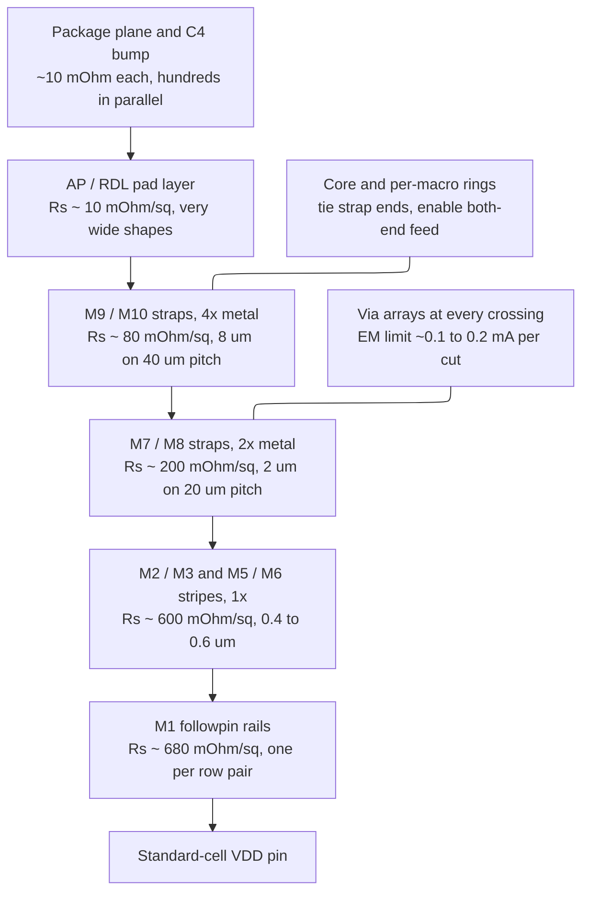
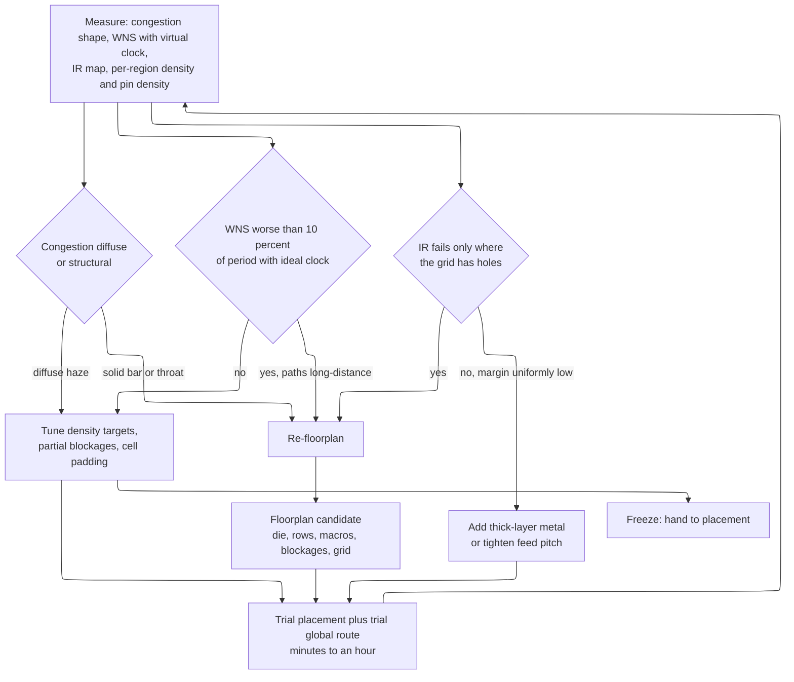

# Floorplanning and Power Planning — committing to a geometry you cannot undo

> **Prerequisites:** [Physical_Design](01_Physical_Design.md) (the PnR flow this page heads; its §2 sketches floorplanning at concept level — here we own the mechanics), [Physical_Synthesis_and_Design_Planning](../04_Synthesis/05_Physical_Synthesis_and_Design_Planning.md) (the netlist, block partition, and early area/pin budgets you arrive holding).
> **Hands off to:** [Placement_Legalization_and_Optimization](04_Placement_Legalization_and_Optimization.md) (consumes the frozen die, rows, macros, blockages, and grid as hard boundary conditions), [Clock_Tree_Synthesis](05_Clock_Tree_Synthesis.md) (builds inside the metal and placement room reserved here), [Signal_Integrity_Reliability](02_Signal_Integrity_Reliability.md) (IR-drop and EM *analysis* of the grid this page constructs).

---

## 0. Why this page exists

Every other backend step optimizes inside a box. Floorplanning *draws the box*: die outline, core area, rows, macro locations, I/O, and the path by which current reaches every transistor. Placement, clock tree synthesis (CTS), and routing then search the space that remains, and no search recovers a space drawn wrong. The irreversibility is arithmetic: moving a macro 200 µm invalidates every placement made relative to it, every clock buffer balanced against those placements, and every route between them. A floorplan change on day one costs an hour; the same change after CTS costs days and usually fails. Yet the *symptoms* — congestion, IR hotspots, a stubborn set of paths — all look like problems more optimization effort should fix, so teams spend weeks on tool settings instead of redrawing the box.

Power planning belongs on the same page because the grid *is* part of the floorplan: committed before any signal net is routed, pre-allocating the scarcest resource on the chip (upper-metal tracks), and shaped by the same macro and I/O decisions. Too thin and it fails IR and electromigration signoff months later; too thick and the block will not route at all.

---

## 1. The floorplan as a data object

A floorplan is a set of geometric records tools read as hard constraints. It lives in **DEF** (Design Exchange Format), which carries a *design instance* between tools, alongside **LEF** (Library Exchange Format), which carries the *technology* (layer names, pitches, spacing) and *cell abstracts* (bounding box, pin shapes, obstructions).

```text
VERSION 5.8 ;
DESIGN vec_cluster ;
UNITS DISTANCE MICRONS 2000 ;
DIEAREA ( 0 0 ) ( 1800000 1800000 ) ;
ROW ROW_0    core9T 40000   40000 FS DO 9555 BY 1 STEP 180 0 ;
ROW ROW_1    core9T 40000   41152 N  DO 9555 BY 1 STEP 180 0 ;
...
ROW ROW_1492 core9T 40000 1758784 N  DO 9555 BY 1 STEP 180 0 ;
TRACKS X 40064 DO 13437 STEP 128 LAYER M2 ;
TRACKS Y 40064 DO 13437 STEP 128 LAYER M3 ;
GCELLGRID X 40000 DO 431 STEP 4096 ;
COMPONENTS 1 ;
- u_l2_bank0 sram_512x128 + FIXED ( 100000 1200000 ) N ;
END COMPONENTS
```

- **`UNITS DISTANCE MICRONS 2000`** — the **database unit** (DBU) scale. Coordinates are *integers* of 0.5 nm, because design-rule checking must be exact: a "0.064 µm" spacing landing at 0.0639999 after a transform is a violation created by arithmetic. A DEF read at the wrong scale gives a design off by 10× that still looks plausible.
- **`DIEAREA`** — two points define a rectangular die (900 × 900 µm here); a point list defines a rectilinear one.
- **`ROW <name> <site> <x> <y> <orient> DO <n> BY 1 STEP <sx> 0`** — a 1-D array of **placement sites**. `core9T` is defined in the technology LEF: 180 DBU = 0.090 µm wide (one **CPP**, contacted poly pitch — the horizontal quantum of a FinFET cell) and 1152 DBU = 0.576 µm tall (**9 tracks** × the 0.064 µm M2 pitch). A cell of width $k$ CPP occupies $k$ consecutive sites and may not sit between them. The origin `40000 40000` is 20 µm in from the die edge — the **core-to-die margin**, holding the seal ring (a metal frame stopping dicing cracks), bump or pad structures, and the core power ring. Note that 860 µm of core over a 0.576 µm row gives 1493 rows and a 0.032 µm sliver that holds nothing, so core height is normally snapped to a row multiple.
- **Orientation alternation `FS, N, FS, N`** is the most consequential field. `N` is the cell as drawn; `FS` is mirrored about the horizontal axis. Cells carry VDD on one horizontal edge and VSS on the other, so alternating makes adjacent rows mirror images: VDD abuts VDD, **two rows share one rail**, and their N-wells merge. Break the alternation and you abut VDD to VSS — a short. Rows are therefore tool-generated, never hand-edited.
- **`TRACKS {X|Y} <start> DO <n> STEP <pitch> LAYER`** — legal wire centerlines; `TRACKS X` means the *x* coordinate varies, so these are **vertical** wires. At advanced nodes routing is unidirectional and on-grid, so an off-track wire is not manufacturable and this hard-quantizes every route. **`GCELLGRID`** is the global router's coarse grid (2.048 µm, ~32 M2 tracks), setting the resolution of every congestion map you will see (§12).
- **`+ FIXED (x y) N`** — `FIXED` cannot be moved by the placer, `PLACED` can, `UNPLACED` has no coordinates. Macros arrive `FIXED`, standard cells `UNPLACED`.

Also present: `PINS` (boundary ports), `BLOCKAGES` (§6), `REGIONS`/`GROUPS` (voltage areas, §10), `SPECIALNETS` (the grid, §8). Once handed to placement, four things are frozen: die outline (changing it changes the package), rows (changing them re-legalizes everything), macro locations, and the grid.

---

## 2. Area and utilization: sizing from routability, not greed

**Three numbers all called "utilization."** With $A_{std}$ = summed standard-cell area, $A_{macro}$ = macro area, $A_{blk}$ = blockage and halo area:

$$
U_{cell} = \frac{A_{std}}{A_{core}}, \qquad
U_{core} = \frac{A_{std}+A_{macro}}{A_{core}}, \qquad
U_{eff} = \frac{A_{std}}{A_{core}-A_{macro}-A_{blk}}
$$

Only $U_{eff}$ — the fraction of *placeable* area actually occupied — predicts anything, because it is what the placer experiences and the router must route through. Take 1.85 M instances × 0.42 µm² = 777,000 µm², twelve 320 × 180 µm SRAMs = 691,200 µm², 5 µm halos adding 61,200 µm², in a 1350 × 1350 = 1,822,500 µm² core: $U_{cell} = 42.6\%$, $U_{core} = 80.6\%$, $U_{eff} = 72.6\%$. A slide reporting 42.6% says "lots of headroom" while cells pack at 72.6% between the macros.

**Why the ceiling sits near 80%, and why it fell.** The naive model says *track supply* limits utilization: M2 at 0.064 µm gives 15.6 tracks/µm, and summing M2–M7 gives about 69 µm of wire per µm² raw, or ~45 after derating for the power grid (§8), via blockage, and the 0.6–0.7 track efficiency any router achieves. That is a screening check, not the binding constraint, because supply is a global average while congestion is local.

What sets the ceiling is **pin access**. A cell pin is a small M1 rectangle; connecting it means landing a legal M2 track on it while satisfying via enclosure and M2 minimum area. The number of legal access tracks per pin, $k$, is what scaling changed: $k \ge 4$ at 65 nm, so access never bound and blocks routed at 90%; $k \in \{1,2\}$ at 16 nm; and at N7/N5 double patterning puts adjacent tracks on different masks, halving effective $k$ again. When neighboring pins compete for one track window and each has one legal access point, the assignment is unsatisfiable and something must move — but at high utilization there is nowhere to move to. **Empty sites next door are the resource that resolves access conflicts, and low utilization is how you buy them.** Hence 70–80% at 16 nm, 65–75% at 7 nm, and 60–72% at N5, and hence adding metal layers does not help: M8 does not help a pin on M1 find an M2 track.

**Placement density is not pin density.** A NAND2 (3 CPP, 0.156 µm², 3 signal pins) carries 19.3 pins/µm² at full density; a scan DFF (22 CPP, 1.140 µm², 6 pins) carries 5.3; a BUF_X8 carries 4.8. Random control logic at 80% density holds ~15 pins/µm² while a datapath at the same 80% holds ~4.5 — the first congests, the second does not. Set density targets **per region from the pin-density map**; partial blockages (§6) express this. The area you ask for is then

$$
A_{core} = \max\!\left(\frac{A_{std}}{U^{target}_{eff}} + A_{macro} + A_{blk},\; A_{pad\text{-}limited},\; A_{pin\text{-}limited}\right)
$$

with $U^{target}_{eff}$ = 0.75–0.80 for buffer/flop-heavy datapath at 16 nm, 0.65–0.72 for random control logic, 0.55–0.65 at N5 with heavy bussing, plus **3–5% of cell area** for hold-fix buffers, clock buffers, and ECO cells that do not exist yet.

---

## 3. Aspect ratio and the routing-resource argument

For fixed core area $A = WH$, the longest Manhattan span is $W + A/W$, minimized at $W=\sqrt{A}$. For $A = 1$ mm²: $AR{=}1$ gives 2000 µm, $AR{=}4$ (500 × 2000) gives 2500 µm (+25%), $AR{=}16$ gives 4250 µm (+113%). With $\tau \propto L^2$ before repeatering ([Physical_Design](01_Physical_Design.md) §1.1), that is a real frequency cost on anything crossing the block.

The sharper argument is not the expected one. Horizontal track supply, as available wire length, is $(H/p)W = A/p$; vertical is $(W/p)H = A/p$. **Supply is identical in both directions and independent of aspect ratio.** What $AR$ changes is *demand*: in a 4:1 tall block nets travel four times as far vertically, so vertical demand far exceeds horizontal while supply stays isotropic — the vertical layers saturate while the horizontal layers idle, and adding layers cannot fix it because layers alternate direction. Usable window: $AR \in [0.8, 1.25]$ comfortable, $[0.5, 2.0]$ before anisotropy dominates.

**When a rectangle is forced.** $N_{pin}$ boundary ports at pitch $p_{pin}$ need perimeter $\ge N_{pin}p_{pin}$: 3000 ports at 2 µm effective pitch need 6000 µm, but a square 1 mm² block has 4000. Solving $2(W{+}H)=6000$ with $WH=10^6$ gives 2618 × 382 µm, $AR = 6.9$; the alternative is growing to 2.25 mm², +125% area. That is the quantitative argument for fewer, wider interfaces. Bump grid, package cavity, and fixed neighbors force the rest, and are negotiable at chip level only, early.

**The rectilinear-block problem.** An L, T, or notched core breaks four things. (1) **The waist** — all routing between the arms funnels through the narrower one; a 300 µm waist over four usable layers supplies $\tfrac{300}{0.069}\times4\times0.7 \approx 12{,}000$ derated tracks, and checking that against the required crossing count is the first thing to do. (2) Rows must be cut and rings become rectilinear polygons; the concave corner is where grid generators most often leave a hole (§8). (3) Fly-line and timing analysis must use rectilinear distance — two points 400 µm apart can be 1400 µm apart around an L. (4) Analytical placement assumes a rectangular domain and treats the notch as a blockage, with the density-shock behavior of §6. **Rule:** if absorbing the notch into a bounding rectangle costs under ~5–8% extra area, do that.

---

## 4. I/O planning

**Pad ring versus bump array.** A **pad ring** is what wire bonding requires: I/O cells in a ring around the core, each holding a driver, receiver, ESD (electrostatic discharge) clamp, and bond pad. The cells **abut** — rails connect by adjacency, not routing — so the ring must be continuous, making three non-logic cell types mandatory: **corner cells** that carry rails around the corner, **filler I/O** closing gaps, and **rail clamps** distributed around the ring. One missing filler breaks a supply rail for every pad downstream. A **bump array** is what flip-chip allows: bumps on an area grid over the die face connected through a redistribution layer, so drivers need not be peripheral — C4 at 130–180 µm, micro-bumps at 40–55 µm ([IC_Packaging](../07_Manufacturing_and_Bringup/02_IC_Packaging.md) §2).

**Pad-limited dies.** A peripheral ring makes area scale with the *square* of pad count: $N_{pad}p \le 4L$, so $A_{die} \ge (N_{pad}p/4)^2$. For 400 pads at 60 µm pitch, $L \ge 6000$ µm and $A \ge 36$ mm²; if the logic needs 9 mm², three quarters of the die is silicon bought to hold pads. Escapes: **staggered pads** (two offset rows, so $A$ falls ~4×), pad-over-active, and flip-chip. This is the quantitative reason to prefer a narrow serial interface over a wide parallel one.

**ESD and the power-pad ratio.** A clamp works only if a low-impedance path exists from pad through clamp along the I/O rail to a supply pad. A human-body-model (HBM) 2 kV event through the standard 1.5 kΩ network peaks near 1.3 A; if the nearest VSSIO pad is eight slots away and the rail contributes 0.4 Ω, the rail alone adds 0.52 V on top of the clamp's own 2–3 V — decisive against a gate-oxide threshold only a few volts higher. Hence rules that are rules about *distance*: one VDDIO/VSSIO pair per **4–8 signal pads**; no signal pad more than **5–8 pad slots** (~300–500 µm) from a supply pair; a **rail clamp** every ~500 µm–1 mm; analog and PLL supplies segregated with their clamp path to *their* rails.

**SSO noise and why you interleave supplies.** **Simultaneous switching output (SSO)** noise decides pad *ordering*. A 32-bit bus, each output driving 10 pF from 0 to 1.8 V in 1 ns, gives $I_{out} = C\,dV/dt = 18$ mA and $I_{tot} = 576$ mA; ramping over 0.5 ns gives $di/dt = 1.15\times10^9$ A/s, so through one 2 nH bond wire $\Delta V = L\,di/dt = 2.3$ V — the ground reference moves more than the supply. Three fixes, all floorplan decisions. *Parallel supply pads:* $k$ pads put $k$ inductances in parallel, so with $k=8$ the bounce falls to 0.29 V. *Interleave, do not cluster:* what a signal sees is its *return-loop* inductance, small only when the return is physically adjacent, so eight VSSIO pads at the corners and eight interleaved every four signals give the same count and wildly different noise. *Slew-rate control:* doubling rise time halves $di/dt$, spending I/O timing budget.

Pad order is jointly owned with the package designer, because a die-side order that forces the package substrate to cross nets adds substrate layers and costs money per unit shipped. Binding constraints: differential pairs adjacent and matched with their own return; analog and PLL pads several slots from high-$di/dt$ groups; high-current supplies where the current is drawn; and debug pads on probeable package pins.

---

## 5. Macro placement: the dominant decision

**Push macros to the periphery.** A macro blocks routing on every layer it uses (M1–M4/M5 for a typical SRAM). Centrally placed it forces every crossing net into a Manhattan detour — up to 500 µm around a 320 × 180 µm block — and fragments the cell region. At the periphery, one or two sides face the die edge where there is no logic to strand.

**Orient pins toward the logic that uses them.** For a 512 KB SRAM, 400 × 250 µm, with ~300 pins on the 400 µm edge: if that edge faces the die boundary, every net runs around the macro — at least 500 µm extra each, so **150 mm of extra wire**, ~30 pF of extra load on the block's most critical interface, plus 300 nets funneling through one corridor. Rotating 180° costs nothing and removes all of it.

**Form channels, not mazes, and keep the cell region convex.** Group macros into aligned arrays with parallel, uniform channels; an irregular arrangement creates dead-end pockets whose cost is not the *area* of the irregularity but the *bottleneck*, since every net entering a pocket crosses the same few GCells. Concavity creates waists, and waists concentrate demand exactly as §3 described.

**Halos.** A halo bans standard cells within 3–10 µm of a macro, for four independent reasons: **pin access** (300 pins fanning out need ~10 µm of accumulated track width plus room to turn); the **macro power ring**, 1–3 µm per side plus spacing; **base-layer rules** in the macro LEF whose violation is a DRC error found at signoff; and **reachability**, since a cell wedged in a 2 µm gap is routable from one side only and legalization has no incentive to notice. Size it from that edge's pin count: 2–3 µm blank, 8–12 µm on a 300-pin edge.

**Channel width.** A channel must satisfy simultaneously

$$
w_{ch} \ge 2w_{halo} + 2w_{ring} + \frac{N_{cross}\,p_{track}}{n_{layers}\,\eta} + m\,h_{row}
$$

with $\eta \approx 0.7$ the achievable track efficiency. For 240 crossing nets over three layers averaging 0.069 µm pitch, through-routing alone needs 7.9 µm; add two 5 µm halos and two 1.5 µm rings and the minimum is $7.9+10+3 = 20.9$ µm **with no cells at all**. Hence: **make a channel either zero or generous** — zero meaning abutting the macros, generous meaning ≥ 20–30 µm and ≥ 15–20 rows. A 6 µm channel is the worst of both: too narrow to place in, wide enough to lose area, and it invites the router into a slot where it will fail.

```text
BAD  — pins outward, trapped island, blocked corridor
+------------------------------------------------------------+
|  #########                            ###############       |
|  # SRAM A#   . . . . . . . . . . .    #   SRAM  B    #      |
|  #ppppppp#   . . . . . . . . . . .    #ppppppppppppp#       |
|  #########   . . . . . . . . . . .    ###############       |
|   ^pins face WEST, at the die edge      ^pins into 6um gap  |
|  ###############   +---------+   ###############            |
|  #   SRAM   C   #   | . X . . |   #    SRAM  D    #         |
|  #             #   | . . . . |    #ppppppppppppppp#         |
|  ###############   +---------+   ###############            |
|                      ^island, 4 um throat                   |
+------------------------------------------------------------+

GOOD — periphery, aligned, pins inward, one convex core
+------------------------------------------------------------+
|  #########  #########  #########  #########                 |
|  # SRAM A#  # SRAM B#  # SRAM C#  # SRAM D#                 |
|  #ppppppp#  #ppppppp#  #ppppppp#  #ppppppp#                 |
|  #########  #########  #########  #########                 |
|  . . . . . . . . . . . . . . . . . . . . . . . . . . . .    |
|  . . . . . .  one convex standard-cell region . . . . . .   |
|  . . . . . . . . . . . . . . . . . . . . . . . . . . . .    |
|  #ppppppp#  #ppppppp#  #ppppppp#  #ppppppp#                 |
|  # SRAM E#  # SRAM F#  # SRAM G#  # SRAM H#                 |
|  #########  #########  #########  #########                 |
+------------------------------------------------------------+
      #  macro body      p  pin edge      .  standard cells
```

Both panels hold eight identical macros in an identical core, so *area and utilization are the same* — everything that differs is topology. Trace one net: from a flop to a data pin on SRAM C in the bad panel it travels down the macro's east side, along the south edge, and back west, adding 680 µm, joined by ~300 siblings through one corridor. Cells in island X are legally placed because density was available, but every net crosses a 4 µm throat supplying ~122 tracks while 800 cells with ~2400 pins need far more — and nothing in placement reports it, because placement optimizes density and wirelength, not throat capacity. The good panel is not free: pushing macros to top and bottom leaves a wide, short cell region ($AR<1$) and forces macro-to-macro buses across the core. The bad panel's failures are *structural* and unrecoverable downstream; the good panel's costs are *continuous* and traded normally.

---

## 6. Blockages: banning, discouraging, capping

| Type | Forbids | What breaks without it |
|---|---|---|
| **Hard placement** | all standard cells | cells land under bumps, over analog, in a 4 µm channel, or in the clock-mesh reservation |
| **Soft placement** | global placer avoids; legalization and optimization may use | without the escape, a needed hold-fix buffer goes 40 µm away where it does not help |
| **Partial placement** | caps local density at $d\%$ | the only way to *reduce* density without exporting the problem |
| **Routing, per layer** | metal on named layers | router eats M7/M8 a later top-level bus needs, or couples into analog |
| **Partial routing** | a fraction of tracks | models an IP whose routing is absent from LEF; reserves a share for the clock mesh |
| **Macro halo** | cells within $d$ of a macro | §5 |
| **Routing halo** | metal near the macro's top layer | pins the macro's own pin-access region shut |

**Halo versus blockage.** A halo is an *attribute of a macro instance* — it moves with the macro and regenerates. A blockage is an *independent object at absolute coordinates*. During exploration you want halos; once frozen, convert the load-bearing ones to explicit blockages, because a blockage is visible identically to every tool while halo semantics vary between tools and can be silently dropped in a DEF round-trip.

**Cap density; do not ban placement.** A 100 × 100 µm hotspot at 85% holds 8500 µm² of cells. Hard-blocking it means those 8500 µm² must go somewhere, and the nearest space — a 20 µm annulus of 4400 µm² total — cannot hold them, so the placer pushes globally, wirelength jumps, and the congestion often reappears as a *denser ring* just outside. A hard blockage is a **discontinuity** in the placer's density field. A **partial blockage at 45%** is structurally different: analytical placement already carries a density penalty (the electrostatic model of [Physical_Design](01_Physical_Design.md) §3.2), and lowering the *target density* folds into the same smooth potential, so 4000 µm² redistribute over a region an order of magnitude larger than the annulus and the surroundings rise two or three points. **Hard blockages express physical impossibility; partial blockages express density preference.**

---

## 7. Power planning I — from watts to a conductance target

Take one block for §7–§9: a vector cluster, 1.2 × 1.2 mm, $P = 2.4$ W at $V_{DD}=0.75$ V, 1.5 GHz.

$$
I = \frac{P}{V_{DD}} = 3.2\ \text{A}, \qquad
J_A = \frac{I}{A} = \frac{3.2}{1.44\times10^{6}\,\mu\text{m}^2} = 2.22\times10^{-6}\ \text{A}/\mu\text{m}^2 = 2.22\ \text{A/mm}^2
$$

The **areal current density** $J_A$, not the total, drives grid design. Two refinements. *Per rail:* split power by supply domain first — an SRAM array rail draws short intense bursts over a small area, so its local $J_A$ can be 5–10× the block average. *Per region:* tile an instance-level power map at ~50 × 50 µm and take the worst tile; assume here a hotspot factor $\kappa_{hot}=5$ and a dynamic peak factor $\kappa_{dyn}=2.5$.

**Budget the drop before spending it.** Static signoff at 5% of 0.75 V allows 37.5 mV from regulator to worst cell: board, package plane, and C4 bump 15.0 mV (the package's problem); top grid AP and M9/M10 6.0 mV; mid grid M5–M8 with via stacks 8.0 mV; fine stripes M2–M4 4.0 mV; M1 followpin 4.5 mV. The on-die share, 22.5 mV, gives $R^{on\text{-}die}_{eff} \le 22.5\,\text{mV}/3.2\,\text{A} = 7.0$ mΩ. For scale, one C4 bump is ~10 mΩ and one M1–M2 via cut is ~5 Ω: the first says you need many bumps in parallel, the second many via cuts. Power planning is arranging enough parallelism.

**The distributed model.** For a bar of end-to-end resistance $R$ carrying uniform total load $I$ **fed from one end**, the current at $x$ is $I(1-x/L)$, so $\Delta V = \int_0^L rI(1-x/L)dx = IR/2$. **Fed from both ends**, each half carries $I/2$ over $R/2$ and the worst point is the middle: $\Delta V = IR/8$. Both-end feed is a **4× improvement for zero extra metal** — why grids are meshes rather than trees, and the first thing to check when a rail droops.

---

## 8. Power planning II — the structure, and one formula that sizes it



Current flows top to bottom through successively finer, more resistive meshes joined by via arrays — every hop in series, and every micrometer of strap taken from signal routing permanently, before a signal net exists. **Rings** exist not to carry current the long way but to guarantee the both-end feed of §7 for every strap, so a broken ring segment quietly quadruples the drop in the straps it should have terminated. **Followpins** are the M1 rails shared between mirrored rows (§1), the finest and most resistive metal in the grid, whose width is fixed by the library — so the only lever on rail drop is *how often you feed them*.

**One formula for every layer.** Consider one layer of parallel straps over a square region of side $t$: sheet resistance $R_s$, width $w$, pitch $p$. There are $t/p$ straps, each with $t/w$ squares, so $R_{layer} = (R_s t/w)/(t/p) = R_s p/w = R_s/\phi$ with $\phi \equiv w/p$. **The side length cancels** — mesh resistance depends only on sheet resistance and $\phi$, the fraction of the layer given to that supply net. Combining with $\Delta V = IR/8$ and tile current $I = J_A t^2$:

$$
\boxed{\;\Delta V_\ell = \frac{J_A\,t_\ell^{2}\,R_{s,\ell}}{8\,\phi_\ell}\;}
$$

where $t_\ell$ is the **feed pitch** into layer $\ell$ — the strap pitch of the layer above, or the effective power-bump pitch at the top. Three consequences: **drop scales with the square of the feed pitch**, so doubling the spacing above quadruples the drop below; **drop scales inversely with $\phi$**, the routing cost, so widening is a linear purchase while feeding more often is a quadratic one; and the formula covers the M1 rail unchanged with $\phi_{M1} = w_{rail}/h_{row}$, making the rail the last term of the same ladder rather than a special case.

**A worked grid.** Representative 16 nm-class constants (order-of-magnitude, foundry-specific), obtained from $R_s = \rho_{eff}/T$ with the *thin-film* resistivity of [Routing_and_Parasitic_Extraction](06_Routing_and_Parasitic_Extraction.md) §1.1 rather than bulk copper's 1.7 µΩ·cm — surface and grain-boundary scattering plus the barrier liner put $\rho_{eff}$ at 5.4 µΩ·cm on 1× metal, 3.6 on 2×, 2.9 on 4×, 2.0 on the thick AP. So: 1× layers M1–M5 ~0.09 µm thick at $R_s \approx 600$ mΩ/□ (rail 680); 2× layers M6–M8 ~0.18 µm at 200 mΩ/□; 4× layers M9–M10 ~0.36 µm at 80 mΩ/□; AP 1–3 µm at 7–20 mΩ/□. *Sizing a grid with bulk-copper sheet resistance understates every fine-layer term by two to three times, which is exactly where the margin is thinnest.* For the §7 block with C4 bumps at 150 µm pitch, a third of them VDD (effective VDD-bump pitch 245 µm):

| Layer | $t$ | $R_s$ | $\phi$ | $\Delta V = J_A t^2 R_s/8\phi$ |
|---|---|---|---|---|
| AP | 245 µm | 10 mΩ | 0.35 | 0.48 mV |
| M10 | 60 µm | 80 mΩ | 0.25 | 0.32 mV |
| M9 | 40 µm | 80 mΩ | 0.25 | 0.14 mV |
| M7/M8 | 40 µm | 200 mΩ | 0.12 | 0.74 mV |
| M5/M6 | 20 µm | 600 mΩ | 0.06 | 1.11 mV |
| M2/M3 | 12 µm | 600 mΩ | 0.05 | 0.48 mV |
| M1 rail | 20 µm | 680 mΩ | 0.087 | 0.87 mV |
| **Total** | | | | **4.14 mV** |

Summing the table and adding ~1 mV for via stacks gives **~5 mV static against a 22.5 mV budget** at average current — the honest and slightly surprising result that a properly meshed grid on a flip-chip die passes static IR with better than 4× margin, and that the margin sits almost entirely in the *fine* layers, where M5/M6, M2/M3 and the M1 rail together contribute 2.5 of the 4.1 mV. That locates the real failures: hotspots ($\kappa_{hot}{=}5 \Rightarrow$ 26 mV, already past the whole on-die static allocation), dynamic peak ($\times2.5 \Rightarrow$ ~65 mV = 8.7% of $V_{DD}$, just past the 8% dynamic allocation, §9), and **grid holes**. Because $\Delta V \propto t^2$, anything raising the local feed pitch is catastrophic out of proportion to its size. Four geometric causes: a **macro whose top used layer is high** blocks the mid mesh; a **channel where straps were deleted** for a bus leaves a 300 µm strip fed only from its ends, taking mid-layer $t$ from 40 to 300 µm — a factor of $(300/40)^2 = 56$ that turns a 0.74 mV term into **42 mV**; a **voltage-area boundary** cuts the rail (§10), converting $IR/8$ into $IR/2$; and a **bumpless region** where the package has no balls. Automate the check: map effective feed pitch per tile per layer and flag anything above ~1.5× nominal.

**Every percent of a layer is taken from signal.** A strap of width $w$ does not merely occupy $w/p_r$ tracks — it needs spacing, and wide-metal spacing exceeds minimum: a 2 µm strap on a 0.080 µm layer with 0.15 µm spacing blocks 29 tracks, not 25, a 16% spacing tax, plus via arrays punching through every intervening layer precisely where routing wants to turn. Typical shares, both nets: **M2/M3 ~11%** (competing directly with pin access, §2 — the most expensive percent on the chip), **M5/M6 ~14%**, **M7/M8 ~28%**, **M9/M10 ~55%**. So **buy IR margin on the thick top layers, and on fine layers buy it by increasing feed *frequency*, not width** — and because the allocation precedes placement tuning, §2's routability analysis must use post-grid track supply: a block that routes at 78% with a 5%-per-layer grid may fail at 78% with a 12% grid.

```text
SPECIALNETS 2 ;
- VDD  ( * VDD )
  + ROUTED M10 16000 + SHAPE STRIPE ( 40000 120000 ) ( 2360000 120000 )
    NEW     M9  16000 + SHAPE STRIPE ( 120000 40000 ) ( 120000 2360000 )
    NEW     M1     96 + SHAPE FOLLOWPIN ( 40000 40576 ) ( 2360000 * )
  + USE POWER ;
- VSS  ( * VSS ) ... + USE GROUND ;
END SPECIALNETS
```

`M10 16000` is an 8 µm strap and `M1 96` the 0.048 µm followpin; `SHAPE FOLLOWPIN` tells extraction and EM analysis this is a cell rail, not a stripe.

---

## 9. Power planning III — the checks the grid must survive

**Static IR.** Solve the extracted grid as $G\mathbf{v}=\mathbf{i}$ with average current injected per cell; criterion 3–5% of $V_{DD}$. The §8 hand calculation is a screening estimate of exactly this, available at floorplan time when the fix is free. Corners, current-source modeling, and the package boundary condition are [Power_Analysis_and_Signoff](../02_Power_and_Low_Power/06_Power_Analysis_and_Signoff.md) §5.

**Dynamic IR, and why decap is not optional.** Model the current as 3.2 A average with a triangular excess pulse peaking at 8 A for 150 ps each clock edge. Then $di/dt \approx 5\times10^{10}$ A/s, and even 30 pH of bump inductance would give $L\,di/dt = 1.5$ V. That does not happen, because **the transient is supplied on-die by capacitance, not through the package at all** — nothing outside the die responds in 150 ps. Decap is the mechanism by which per-edge current exists, not a margin accessory.

**The decap budget.** From charge conservation $C \ge Q_{transient}/\Delta V$: for the triangular pulse $Q = \tfrac12(8-3.2)(150\,\text{ps}) = 360$ pC, so allocating 30 mV gives $C \ge 12$ nF. Before panicking, count **intrinsic decap** — gate, junction, and well capacitance of everything *not* switching this cycle. From $P_{dyn}=\alpha CV^2f$ with 2.0 W dynamic, $C_{sw} = 2.37$ nF; at effective activity ~0.1 total device capacitance is ~24 nF, of which the non-switching ~90% decouples. **~21 nF intrinsic** covers the 12 nF requirement, which is why uniform blocks pass with little explicit decap.

**The failure is local.** In a hotspot the gates are not quiet — they are the ones drawing current — so intrinsic decap is unavailable exactly where needed. The step everyone skips is that **the two factors making a hotspot do not scale together**: current density is the product of *placement* density, which cannot exceed the block average by much more than 1.3× before legalization fails, and *activity*, which is unbounded. Take a 200 × 200 µm region at 4× the block's average current density, decomposed as 1.3× density × 3× activity. It is 1/36 of the block but draws $4/36 = 11\%$ of the charge (40 pC), needing 1.33 nF. Its device capacitance scales with *density only*: $1.3 \times 23.7/36 = 0.86$ nF. Its quiet fraction scales with *activity*: at 3× the block's 0.1 the region switches 30% and only ~70% of its gates decouple, against 90% elsewhere, so the usable part is $0.70 \times 0.86 = 0.60$ nF. The ~0.73 nF deficit is 92,000 µm² at 8 nF/mm² — **2.3× the hotspot's own area** — and decap 100 µm away is behind rail resistance too large to respond in 150 ps. *Had the 4× been pure density the deficit would nearly vanish, and had it been pure activity it would double; which one you have is the first thing to measure.* **You cannot decap your way out of a hotspot.** The fixes are upstream: de-densify with a partial blockage (§6), spread the high-activity cells, densify the local grid, and — highest leverage — **deliberately skew the clock across the region** so its flops fire over 100 ps rather than 20 ps, cutting $i_{peak}$ 3–5× at zero area cost. That is built in [Clock_Tree_Synthesis](05_Clock_Tree_Synthesis.md), but reserving the skew budget is a floorplan decision.

**Decap versus leakage.** Explicit decap is thin-oxide gate area with source and drain tied: no subthreshold path, but gate leakage, and it displaces logic. Thin-oxide MOS filler gives 6–10 nF/mm² at ~1–10 nW/µm²; thick-oxide or long-channel gives 2–4 nF/mm² at 0.02–0.1× that leakage; MIM capacitors in upper metal give 1–4 nF/mm² with negligible leakage. The trade lands on **standby**: 92,000 µm² at ~5 nW/µm² burns ~0.46 mW, or 0.02% of 2.4 W active — nothing, until the block is retained and its power drops to milliwatts, when that same 0.46 mW is a large fraction of the standby budget. Hence **thick-oxide decap in anything powered during retention**, and **place decap by the droop map, not uniformly as filler**.

**Electromigration.** Power straps carry unidirectional DC, the harshest case ([Signal_Integrity_Reliability](02_Signal_Integrity_Reliability.md) §3): $w \ge I/(J^{DC}_{max}t_m)$. A 4× M9 strap 1.5 µm wide and 0.4 µm thick carrying 30 mA gives $J = 5$ MA/cm² — failing a 1–3 MA/cm² limit by 2–5×; at $J_{max}=2$ the required width is 3.75 µm. **IR sets the average $\phi$; EM sets the local width.** The two agree in direction but bite in different places — EM where current concentrates (under a bump, at a ring corner, at a macro's power pins), IR as a distributed average — so clearing the average $\phi$ does not clear EM. Vias are worse: at ~0.1–0.2 mA per cut, a bump delivering 169 mA needs ≥ 845 cuts, which is why the connection is a large pad with a via *array* (a 20 × 20 µm pad at 0.6 µm via pitch gives $33^2 = 1089$). Arrays are simultaneously an EM fix, an IR fix, and a yield fix.

---

## 10. Multi-voltage floorplanning

**Why a power domain becomes geometry.** A row has exactly one VDD followpin, and it is one net; cells connect to it by abutment, with no choice. Therefore **a row cannot hold cells from two supplies**, and a domain boundary must fall on a row boundary or at a vertical cut where the rail is severed and the halves driven by different nets. A **voltage area** (DEF `REGION` plus `GROUP`) is that constraint: only cells of domain $D$ may be placed here, and rails inside belong to $VDD\_D$. Size it 5–15% above the naive cell-area figure to hold power switches, isolation and level-shifter cells, decap on the *switched* rail, and always-on structures crossing it; shape it as few large rectangles, because a ragged boundary has an enormous rail-cut perimeter and every cut is a grid discontinuity of the §8 kind. The logical side is [UPF_and_CPF_Power_Intent](../02_Power_and_Low_Power/05_UPF_and_CPF_Power_Intent.md); the partitioning rationale is [Low_Power_Architecture_and_Domain_Partitioning](../02_Power_and_Low_Power/03_Low_Power_Architecture_and_Domain_Partitioning.md).

```tikz
\begin{document}
\begin{circuitikz}[scale=1.0]
  \draw (-1,4) -- (8,4);
  \node at (-1.9,4) {VDD};
  \node[pmos] (M1) at (2,3.2) {};
  \draw (M1.S) -- (2,4);
  \draw (M1.G) -- (0.4,3.2) node[left]{nSLEEP};
  \draw (M1.D) -- (2,2.2);
  \draw (-1,2.2) -- (8,2.2);
  \node at (-1.9,2.2) {VVDD};
  \draw (5,2.2) to[R, l=$R_{rail}$] (5,1.2) to[C, l=$C_{blk}$] (5,0.2);
  \draw (7,2.2) to[C, l=$C_{dec}$] (7,0.2);
  \draw (-1,0.2) -- (8,0.2);
  \node at (-1.9,0.2) {VSS};
\end{circuitikz}
\end{document}
```

A header PMOS puts $R_{on}$ in series with the rail resistance and the domain capacitance; with `nSLEEP` low, VVDD tracks VDD minus $IR_{on,total}$. For 3.2 A with a 20 mV switch budget, $R_{on,total} \le 6.25$ mΩ, so at ~3 Ω per header you need **480 headers in parallel** — ~4 µm² each, 1920 µm², 0.13% of the block. *Area is not the constraint.* The constraints are that those 480 switches must be distributed so no part of the domain is far from one (the $t^2$ law applies to VVDD as to VDD) and that they must be sequenced.

**Placement styles.** **Ring** — switches around the voltage area, VVDD entering from the perimeter: simple always-on routing and sequencing, no interior disturbance, but the effective feed pitch for VVDD is the *domain width*, and $\Delta V \propto t^2$ makes it untenable above a few hundred micrometers. **Column** — switch columns at a regular pitch through the area, each feeding local rail segments: feed pitch is tens of micrometers so droop is small and it scales, at the cost that **two meshes must coexist**, the switched VVDD mesh feeding rails and an always-on VDD mesh above feeding the columns, which is more mid-layer metal planned before placement. **Distributed** — a switch every $N$th site of every $M$th row: best droop and granularity, highest enable-chain complexity.

**Inrush and the daisy chain.** Turning 480 headers on at once charges the domain: $I = C\,dV/dt = 3\,\text{nF} \times 0.75/1\,\text{ns} = 2.25$ A appearing on the always-on rail, drooping *neighboring* logic that was working correctly a nanosecond ago. Decap cannot absorb it, so the fix is to slow it: a **daisy-chained enable** where each switch's acknowledge drives the next through a buffer, usually a **weak** chain of high-$R_{on}$ switches first to bound inrush, then a **strong** chain for operating current.

```wavedrom
{ "signal": [
  { "name": "clk",        "wave": "p........." },
  { "name": "pwr_req",    "wave": "01........", "node": ".a........" },
  { "name": "weak_ack",   "wave": "0...1.....", "node": "....b....." },
  { "name": "strong_ack", "wave": "0.......1.", "node": "........c." },
  { "name": "iso_en",     "wave": "1......0.." },
  { "name": "vvdd",       "wave": "x.2..3..4.", "data": ["ramp", "near final", "full"] },
  { "name": "i_inrush",   "wave": "0.3.4.3.0.", "data": ["rise", "peak", "decay"] }
 ],
 "edge": ["a~>b weak chain bounds di/dt", "b~>c strong chain closes"],
 "head": {"text": "power-switch wake-up: sequencing is what makes inrush affordable"}
}
```

`pwr_req` starts the weak chain; `weak_ack` means the rail is near final; only then does the strong chain fire, and isolation releases last. With 480 switches in 60 links at four gate delays each, the ramp spreads over ~15 ns and peak inrush falls from 2.25 A to ~150 mA. The cost is wake-up latency — a domain waking in 15 ns cannot be gated per instruction, raising the break-even idle time that makes gating profitable. And because the chain's physical order sets the spatial wake-up wavefront, **the chain must be routed in geometric order**; one jumping across the domain creates scattered simultaneous turn-on and defeats itself.

**Always-on routing, level shifters, isolation.** A net passing through a gated area must stay driven when the domain is off: either **AON buffer cells** with a secondary always-on supply pin, requiring both the library cells *and* an unswitched strap network over the gated region — a floorplan commitment planned with the first mesh — or **unbuffered feedthrough** buffering only outside, free but limited to a few hundred micrometers at speed. A logic level is meaningful only against a rail, so driving 0.6 V into a 0.9 V domain leaves the receiving PMOS partly on, giving static crowbar current and a slow, marginal transition; a **low-to-high level shifter** therefore needs *both* supplies present and must sit where both rails exist, conventionally just inside the high-voltage destination domain in rows carrying the secondary rail, while a **high-to-low** shifter is often a plain buffer with no dual-rail need. **Isolation cells** clamp a gated domain's outputs, because a floating input to an always-on gate turns both its transistors partly on — milliamperes of crowbar across thousands of gates — so the clamp must be powered by a supply that is *on* when needed, either in the always-on domain just outside the boundary or as an AON cell inside. **Place both at the boundary**, so the segment at the wrong voltage, or floating, is short.

**The secondary-supply routing problem.** AON buffers, level shifters, isolation cells, and retention flops all need a second rail the followpin does not provide. Three answers: a **secondary rail stripe** every 8–16 rows, with cells picking it up from a pin at a fixed offset — cheap in metal but it constrains *which rows* special cells may occupy; **dedicated rows or regions** near the boundary, fully rail-equipped, which is robust and enforces "place at the boundary" by construction at some wirelength cost; or **routing the secondary supply as a special net**, flexible, expensive, and error-prone in extraction and EM. Whichever you pick, reserve 2–5% of M2/M3 around every multi-voltage boundary — discovering after placement that the secondary rail has nowhere to go is a re-floorplan.

---

## 11. Special structures the floorplan must place

These are physical-only cells and reservations: they have no netlist counterpart, so nothing upstream reminds you they exist, and each causes a signoff failure if omitted.

**Tap / well-tie cells.** A CMOS structure contains a parasitic PNPN thyristor between VDD and VSS; if the N-well or substrate floats far enough from its intended potential it latches and shorts the supplies, destroying the chip. Taps tie the well to VDD and the substrate to VSS at a *maximum distance* from any transistor, typically 15–50 µm, though FinFET libraries are often *tapless*, giving each cell its own tap. Where taps are separate cells, place them as **regular columns at floorplan time**: one every 30 µm along each row of a 1200 µm-wide, 2083-row block is ~83,000 taps at ~0.3 µm², or 1.7% of the block, and inserting them after placement forces full re-legalization.

**Endcap / boundary cells.** Standard cells assume a neighbor on each side, since N-well, implant, and at FinFET nodes dummy-fin and diffusion-break layers are completed by abutment. The last cell in a row has none, so its well and implant edges violate base-layer DRC. Endcaps supply the continuation; boundary cells do the same at the array's top and bottom and around macro and voltage-area edges. Omitting them yields thousands of base-layer DRC errors found at physical verification that are **unfixable by metal ECO** — they require re-running placement and everything after.

**Spare cells for future ECO.** After tape-out only **metal-layer** changes are affordable, and a metal-only fix can only rewire gates that already exist. Spare cells are unconnected instances — INV, NAND2/3, NOR2/3, MUX2, DFF — budgeted at 1–3% of instance count. **Distribute, do not cluster**: if the nearest spare flop is 500 µm away the fix's own wire delay destroys the fix, so place a cluster roughly every 100 × 100 µm, with inputs tied to a defined level or floating inputs cause crowbar current forever. The modern improvement is the **gate-array spare** (ECO filler): a filler containing pre-formed diffusion and poly with no metal, converted into a real gate by a metal-only change, which leaks nothing until used and occupies space that would have been filler anyway.

**Decap and filler.** Fillers close gaps so N-well and implant stay continuous and carry required dummy patterns. Insert decap first, guided by the droop map (§9), then filler. Two constraints: the narrowest filler is several sites wide, so legalization must avoid one-site gaps nothing can fill; and filler is often deferred or made removable until after the last ECO, since it must be carved out for every ECO cell.

**Physical-only cells and LVS.** Taps, endcaps, fillers, decaps, antenna diodes, and unconnected spares appear in layout but not the netlist, so LVS must be configured to expect them ([Physical_Verification_DRC_LVS](../06_Signoff/03_Physical_Verification_DRC_LVS.md)). A missing exclusion rule reports thousands of unmatched devices that are not real defects, and proving that takes a day you did not budget.

**Clock spine or mesh reservation.** A clock mesh or global spine needs metal on the same 2×/4× layers the mid power grid wants, and placement room for its large clustered drivers. CTS runs *after* the grid is frozen, so if the grid claimed those layers there is nowhere to build. Reserve explicitly: interleave mesh tracks into the strap pattern so ~5–10% of two layers is set aside, and place partial blockages where the mesh drivers will sit.

---

## 12. Floorplan quality metrics and the review checklist

A review that consists of looking at a picture produces an opinion; five measurements produce a verdict.

1. **Congestion map from trial global routing.** Percentage of GCells with overflow > 0, horizontal and vertical separately — gate **< 0.5%** each; worst tracks-over in any GCell — gate **≤ 2**. The *shape* matters more: a **diffuse haze** of 1–2% is a placement/utilization problem placement effort will fix; a **solid bar** along a macro edge, in a channel, or across a waist is a floorplan defect no effort will fix.
2. **Early timing with a virtual clock.** The tree does not exist, so run STA with an ideal clock plus uncertainty standing in for skew, jitter, and on-chip variation (150–250 ps at 1.5 GHz). Gate: **WNS no worse than ~−10% of the period** on the worst 100 paths. Then look at *where* they run — if they all traverse the die between two macros in opposite corners, that is a floorplan verdict, not a synthesis one.
3. **IR map from early power analysis.** Even with a crude uniform current model, the map's *structure* — where drop is elevated relative to neighbors — exposes grid holes long before absolute values mean anything. Supplement with the §8 effective-feed-pitch map.
4. **Utilization and pin density per region**, tiled at ~50 × 50 µm. A pin-density peak coinciding with a placement-density peak is where routing will fail.
5. **Structural checks:** row and site legality; PG connectivity (an unconnected rail island is an infinite resistance the IR solver reports as a huge drop or silently ignores); DRC on power shapes; EM on straps and vias; halo violations; and consistency between block boundary pins and the top level.



The loop is cheap on the left and expensive on the right, so the point is to reach a verdict *before* placement is committed. Trace one case: 1.8% vertical overflow in a 40 × 150 µm bar between two SRAMs answers `Q1` as "structural," so the path is `RFP` — move one macro 20 µm — not `TUNE`: one hour, one re-run. The trade-off is that the loop can run forever and floorplans have no provable optimum, so bound it by time agreed up front, not by a quality target you cannot define.

**The signs that say re-floorplan.** Any two together are decisive. (1) Congestion is localized and structural and *moves* rather than *shrinks* when you change effort — demand cannot be spread because supply is absent in that shape. (2) WNS with an ideal clock and no SI is worse than −10 to −15% of the period on long-distance paths; CTS and routing only degrade it, so this is the optimistic case. (3) Utilization must drop below ~55% to route — not a routability fix but a confession the die is too small or the macro topology wrong. (4) IR fails and the only fix left is more metal than routing can spare, trading an IR failure for a congestion failure. (5) The same twenty paths fail after three runs with materially different settings — different searches over the same space returning the same answer means the space is the constraint.

A floorplan iteration costs hours; recovery after CTS costs days to weeks and frequently fails outright, because CTS has already balanced a tree against the placement you are about to invalidate. **Re-floorplan early and often; after CTS, almost never.** The corollary is a scheduling one: budget real calendar time for floorplan exploration at the start of a block, because that is the only point at which the most consequential backend decision is also the cheapest to change.

---

## Numbers to memorize

| Quantity | Value | Why it matters |
|---|---|---|
| DEF database units | 1000–2000 DBU/µm (0.5–1 nm) | integer geometry; wrong scale = 10× wrong design (§1) |
| Core-to-die margin | 15–40 µm | seal ring, I/O, core power ring (§1) |
| Row orientation | alternate N / FS | shares rails, merges wells; break it and VDD shorts to VSS (§1) |
| Effective utilization ceiling | 70–80% at 16 nm, 65–75% at 7 nm, 60–72% at N5 | pin access, not track count, sets it (§2) |
| Pin access points per pin | $k\ge4$ at 65 nm → 1–2 at N5 | the mechanism behind the falling ceiling (§2) |
| Pin density, NAND2 vs DFF | 19.3 vs 5.3 pins/µm² at 100% | why one global density target is always wrong (§2) |
| Post-CTS / ECO area reserve | 3–5% of cell area | the netlist grows after floorplan (§2) |
| Usable core aspect ratio | 0.8–1.25 comfortable, 0.5–2.0 tolerable | supply isotropic, demand anisotropic (§3) |
| Power/ground pad ratio | 1 pair per 4–8 signal pads | ESD return-path resistance (§4) |
| Signal-to-supply pad distance | ≤ 5–8 slots, ~300–500 µm | rail $IR$ during a 1.3 A HBM event (§4) |
| Macro halo | 3–10 µm; 8–12 µm on a high-pin edge | pin fanout, macro ring, reachability (§5) |
| Macro channel width | 0 or ≥ 20–30 µm; never 5 µm | too narrow to place, wide enough to congest (§5) |
| Grid drop law | $\Delta V_\ell = J_A t_\ell^2 R_{s,\ell}/8\phi_\ell$ | one formula sizes every layer (§8) |
| Both-end vs one-end feed | $IR/8$ vs $IR/2$ — 4× | why grids are meshes and rings matter (§7) |
| Sheet resistance by tier | 1× ≈ 600, 2× ≈ 200, 4× ≈ 80, AP ≈ 10 mΩ/□ | $R_s=\rho_{eff}/T$ at *thin-film* $\rho_{eff}$, not bulk Cu (§8) |
| Layer share to power | 5–15% fine layers, 30–60% top two | each percent is taken from signal (§8) |
| Static / dynamic IR budget | 3–5% / 8–10% of $V_{DD}$ | the budget you divide across layers (§7) |
| Decap sizing | $C \ge Q_{transient}/\Delta V$; 6–10 nF/mm² MOS | and it cannot fix a hotspot — density and activity scale differently (§9) |
| Intrinsic decap | ~90% of device cap; ~21 nF for a 2 W block | why uniform blocks need little explicit decap (§9) |
| EM limits | 1–3 MA/cm² DC on straps; 0.1–0.2 mA per via cut | EM sets local width, IR sets average $\phi$ (§9) |
| Power-switch budget | 20 mV → 6.25 mΩ → ~480 headers at 3.2 A | area is cheap, sequencing is not (§10) |
| Tap cell spacing | 15–50 µm, or tapless FinFET libraries | latch-up prevention (§11) |
| Spare cell budget | 1–3% of instances, a cluster every ~100 µm | metal-only ECO needs a *nearby* gate (§11) |
| Floorplan congestion gate | < 0.5% GCells over, max ≤ 2 tracks over | and the *shape* matters more (§12) |

---

## Worked problems

**1 — Required grid metal width from a target IR drop, then the EM cross-check.** A 2.0 × 2.0 mm block dissipates 6 W at 0.8 V; the effective VDD-bump pitch is 300 µm; the top strap layer is M10 (4×, $R_s$ = 80 mΩ/□, 0.36 µm thick) with an 8 mV budget share.

$I = 6/0.8 = 7.5$ A and $J_A = 7.5/(4\times10^6) = 1.875\times10^{-6}$ A/µm². Rearranging the drop law,
$$\phi \ge \frac{J_A t^2 R_s}{8\Delta V} = \frac{(1.875\times10^{-6})(9\times10^{4})(0.080)}{8(0.008)} = \frac{1.350\times10^{-2}}{0.064} = 0.211$$
so 21.1% of M10 for VDD and the same for VSS — **42% of the layer**, which is the honest price of a top strap tier and why §8's "30–60% of the top two" is not an exaggeration — and at a 30 µm VDD pitch, $w = 0.211 \times 30 = 6.3$ µm. Now the EM check: each bump delivers $J_A t^2 = 169$ mA, so landing on two straps gives ~85 mA each; cross-section $6.3 \times 0.36 = 2.268\times10^{-8}$ cm² gives $J = 3.7$ MA/cm², **1.85× over** a 2 MA/cm² limit. The required area is $0.085/(2\times10^6) = 4.25\ \mu\text{m}^2$, i.e. $w \ge 11.8$ µm on a single strap — but the practical fix is a **wide top-layer landing pad** fanning the 169 mA onto six or more straps, since $169/6 = 28$ mA needs only 3.9 µm, which the 6.3 µm already provides. *IR sets the average $\phi$; EM sets the geometry at current concentrations, and they are cleared by different structures.* Via count follows the same logic: at 0.2 mA/cut, 169 mA needs ≥ 845 cuts, and a 20 × 20 µm pad at 0.6 µm via pitch gives $33^2 = 1089$.

**2 — Compute utilization and check routability.** 1.85 M instances at 0.42 µm² average, twelve 320 × 180 µm SRAMs with 5 µm halos, core 1350 × 1350 µm. Trial routing reports 61% average track use on M2–M6, 0.9% of GCells over, worst 4 tracks over, concentrated in a 150 × 40 µm bar between two adjacent SRAMs.

With $A_{std} = 777{,}000$, $A_{macro} = 691{,}200$, $A_{blk} = 61{,}200$ and core $1{,}822{,}500$ µm²: $U_{cell} = 42.6\%$, $U_{core} = 80.6\%$, $U_{eff} = 777{,}000/1{,}070{,}100 = 72.6\%$. The global number is not the problem — 72.6% is inside the 16 nm window and 61% average track use with 0.9% overflow is healthy. The diagnostic is the **shape**: a 150 × 40 µm bar at 4 tracks over between two macros is structural. Check the channel — 40 µm gross, but two 5 µm halos and two 1.5 µm rings leave 27 µm routable, or $27/0.069 \times 3 \times 0.7 \approx 820$ tracks, and cells placed inside consume their own share. Fix: move one SRAM 20 µm, widening the channel to 60 µm (47 µm routable, ~1430 tracks); either the core grows 20 µm in one dimension (+1.5% area, $U_{eff}$ → 70.8%) or an adjacent channel narrows by 20 µm — check that one first. Do **not** lower global utilization: dropping $U_{eff}$ to 65% needs 11.7% more *placeable* area, which on a fixed macro set is 6.9% more core area, and does nothing to the bar, whose supply is set by channel width, not cell density.

**3 — Decap sizing from a $di/dt$ spec.** The §7 block (3.2 A average at 0.75 V, 1.5 GHz) has a triangular clock-edge excess pulse peaking at 8 A for 150 ps; the dynamic budget is 8% = 60 mV, of which 30 mV is allocated to this transient.

$Q = \tfrac12(8.0-3.2)(150\times10^{-12}) = 360$ pC, so $C \ge 360\,\text{pC}/0.030 = 12$ nF. Intrinsic decap: $C_{sw} = P_{dyn}/(V^2f) = 2.0/(0.5625 \times 1.5\times10^9) = 2.37$ nF, so at effective activity ~0.1 total device capacitance is ~24 nF and the non-switching ~90% gives **~21 nF**, already covering the requirement. The hotspot is where it fails — but only if you separate its two causes. A 200 × 200 µm region at 4× the average current density is 1/36 of the area and draws $4/36 = 11\%$ of the charge — 40 pC, needing 1.33 nF. Decompose the 4× as 1.3× *placement density* (the practical legalization ceiling) × 3× *activity*. Device capacitance follows density alone: $1.3 \times 23.7/36 = 0.86$ nF. Quiet fraction follows activity alone: 30% switching leaves ~70% decoupling instead of 90%, so $0.70 \times 0.86 = 0.60$ nF is usable. The 0.73 nF deficit is 92,000 µm² at 8 nF/mm², **2.3× the hotspot's own area**, and decap outside it is behind rail resistance too large to respond in 150 ps. *The answer is not decap.* Reduce $i_{peak}$: a 50% partial blockage cuts local density by a third, spreading the cells over 2× the area halves $J_A$, and skewing the clock so the flops fire over 100 ps rather than 20 ps cuts $i_{peak}$ 3–5× at zero area cost, bringing the requirement to a few hundred picofarads. Reserve that skew budget at floorplan time; it cannot be created later.

**4 — Critique a bad floorplan.** A 1.8 × 1.8 mm block: six 400 × 250 µm SRAMs — two at the top edge with pins facing north (out of the die), two stacked vertically in the exact center with a 6 µm gap, two at the bottom-left corner rotated 90° with pins facing the corner. A 300 µm-wide cell strip runs between the center macros and the right edge. M9/M10 straps sit on a 40 µm pitch everywhere except over the center macros, where they were deleted for a macro-to-macro bus. Reported: $U_{core}$ = 74%, 1.1% overflow, WNS −180 ps against a 660 ps period with an ideal clock.

**(1) The grid hole — most dangerous, because it appears in none of the reported numbers.** Deleting M9/M10 over the center macros leaves the 300 µm strip fed from its two ends, taking mid-layer feed pitch from 40 to 300 µm; $\Delta V \propto t^2$ scales that term by $(300/40)^2 = 56\times$, turning ~0.74 mV into **~42 mV** — nearly twice the whole on-die static budget from one term, before any hotspot or dynamic factor. Fix: restore the top straps over the macros (they use M1–M5 internally, so M9/M10 are free) and route the bus on M6–M8 between straps. **(2) Center macros with a 6 µm channel.** After two 5 µm halos the routable width is negative, so it is unplaceable *and* unroutable, yet it fragments the core into left and right regions joined only around the pair's ends, forcing ~500 µm detours on every crossing net. Fix: abut the two macros and move the pair to an edge, restoring one convex region. **(3) Outward-facing pins on four of six macros** — ~300 pins each detouring 2× the macro depth, roughly $500\ \mu\text{m} \times 300 \times 4 \approx 600$ mm of avoidable wire plus four congestion corridors; rotating 180° is free. **(4) WNS −180 ps on 660 ps is −27% with an ideal clock**, well past the −10 to −15% gate, but it is a *symptom* of (2) rather than an independent defect. Ranked by cost of late discovery: grid hole, center macros, outward pins, timing. **Verdict: re-floorplan.** The 1.1% overflow and 74% utilization are not evidence the floorplan is acceptable; they are evidence that global averages do not detect structural defects.

---

## Cross-references

- **Down the stack (what this consumes):** [Physical_Synthesis_and_Design_Planning](../04_Synthesis/05_Physical_Synthesis_and_Design_Planning.md) (netlist, partition, early area and pin budgets), [Standard_Cell_Libraries_and_Characterization](../04_Synthesis/03_Standard_Cell_Libraries_and_Characterization.md) (site, row height, rail width, pin geometry), [Constraints_SDC](../04_Synthesis/02_Constraints_SDC.md) (I/O timing constraining pin placement), [Block_Activity_and_Power](../02_Power_and_Low_Power/02_Block_Activity_and_Power.md) (the power number that starts §7), [Low_Power_Architecture_and_Domain_Partitioning](../02_Power_and_Low_Power/03_Low_Power_Architecture_and_Domain_Partitioning.md) and [UPF_and_CPF_Power_Intent](../02_Power_and_Low_Power/05_UPF_and_CPF_Power_Intent.md) (the domains §10 turns into voltage areas), [IC_Packaging](../07_Manufacturing_and_Bringup/02_IC_Packaging.md) (bump array, pad ring, PDN inductance the die face must match).
- **Up the stack (what consumes this):** [Placement_Legalization_and_Optimization](04_Placement_Legalization_and_Optimization.md) (treats die, rows, macros, blockages, and grid as immovable), [Clock_Tree_Synthesis](05_Clock_Tree_Synthesis.md) (uses the metal and placement room §11 reserved and the skew budget §9 asks for), [Routing_and_Parasitic_Extraction](06_Routing_and_Parasitic_Extraction.md) (routes in the supply left after §8), [Signal_Integrity_Reliability](02_Signal_Integrity_Reliability.md) (IR and EM *analysis* of this grid), [Power_Analysis_and_Signoff](../02_Power_and_Low_Power/06_Power_Analysis_and_Signoff.md) (signoff criteria for IR, EM, decap), [Physical_Verification_DRC_LVS](../06_Signoff/03_Physical_Verification_DRC_LVS.md) (checks §11's endcap, tap, and physical-only-cell rules).
- **Adjacent:** [Physical_Design](01_Physical_Design.md) (the flow this page heads), [STA](../06_Signoff/01_STA.md) (the virtual-clock timing check of §12). **Section index:** [00_Index](00_Index.md).

---

## References

1. Kahng, A.B., Lienig, J., Markov, I.L., and Hu, J., *VLSI Physical Design: From Graph Partitioning to Timing Closure*, 2nd ed., Springer, 2022 — floorplanning formulations and the placement/routing context of §2–§6.
2. Cadence Design Systems / Si2, *LEF/DEF Language Reference*, version 5.8 — the authoritative definition of every statement annotated in §1.
3. Sherwani, N.A., *Algorithms for VLSI Physical Design Automation*, 3rd ed., Kluwer Academic, 1999 — floorplan representations and channel definition behind §5.
4. Murata, H., Fujiyoshi, K., Nakatake, S., and Kajitani, Y., "VLSI Module Placement Based on Rectangle-Packing: The Sequence-Pair," *IEEE Transactions on CAD*, 15(12), 1996 — the sequence-pair representation of §5.
5. Weste, N.H.E. and Harris, D.M., *CMOS VLSI Design: A Circuits and Systems Perspective*, 4th ed., Addison-Wesley, 2010 — power distribution, well taps and latch-up, and pad-ring structure for §4 and §11.
6. Rabaey, J.M., Chandrakasan, A., and Nikolić, B., *Digital Integrated Circuits: A Design Perspective*, 2nd ed., Prentice Hall, 2003 — the distributed-load $IR$ and simultaneous-switching-noise analysis behind §4 and §7.
7. Popovich, M., Mezhiba, A.V., and Friedman, E.G., *Power Distribution Networks with On-Chip Decoupling Capacitors*, Springer, 2008 — grid topology and the local-versus-global charge-delivery argument of §9.
8. Keating, M., Flynn, D., Aitken, R., Gibbons, A., and Shi, K., *Low Power Methodology Manual for System-on-Chip Design*, Springer, 2007 — power-switch sizing and sequencing, isolation, level-shifter, and voltage-area rules for §10.
9. IEEE Std 1801, *IEEE Standard for Design and Verification of Low-Power, Energy-Aware Electronic Systems* (Unified Power Format) — the power-intent semantics §10 implements physically.
10. Landman, B.S. and Russo, R.L., "On a Pin Versus Block Relationship For Partitions of Logic Graphs," *IEEE Transactions on Computers*, C-20(12), 1971 — Rent's rule, underlying the pin-count-versus-area scaling of §2 and §3.

---

⬅ prev [02 · Signal Integrity and Reliability](02_Signal_Integrity_Reliability.md) · [Section Index](00_Index.md) · [Root Index](../Index.md) · next ➡ [04 · Placement, Legalization, and Optimization](04_Placement_Legalization_and_Optimization.md)
