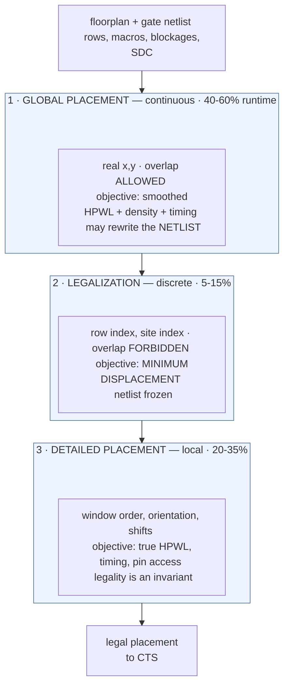

# Placement, Legalization, and In-Place Optimization — turning a netlist into coordinates that can close

> **Prerequisites:** [Floorplanning_and_Power_Planning](03_Floorplanning_and_Power_Planning.md) (the die outline, rows, macros, halos, power grid, and voltage areas this page places *into*), [Physical_Design](01_Physical_Design.md) (§1.1 for $\tau\propto L^2$; §3.1–3.2 for placement as constrained optimization — HPWL, the quadratic relaxation, the electrostatic density force, **assumed and not re-derived here**).
> **Hands off to:** [Clock_Tree_Synthesis](05_Clock_Tree_Synthesis.md) (builds onto the flop positions committed here), [Routing_and_Parasitic_Extraction](06_Routing_and_Parasitic_Extraction.md) (must realize the routing this page only estimated), [STA](../06_Signoff/01_STA.md) (replaces every estimate here with extracted RC).

---

## 0. Why this page exists

[Physical_Design](01_Physical_Design.md) §3 states placement as mathematics: minimize a smooth wirelength surrogate under a density penalty, by gradient descent on a Poisson force field. The derivation is correct and produces an answer that **cannot be manufactured** — cells overlap, sit at fractional coordinates, straddle rows, and have the wrong power-rail polarity. It solves a relaxation, not the problem.

Everything between "the analytical solve converged" and "the clock tree can be built" is this page: how that solution is snapped to a discrete row-and-site grid without being destroyed, how local search recovers what the smoothing threw away, and — invisible in the textbook formulation, dominant in practice — how the tool **edits the netlist while it places it**. A production `place_opt` sizes cells, inserts thousands of buffers, clones drivers, restructures critical cones, swaps threshold voltages, and permutes the scan chain; the exiting netlist can carry 20–30% more instances than the entering one. That is the mechanism by which timing closes, not a side effect of it.

Skipping this ships two defects: a block that times beautifully with an ideal clock and collapses at CTS, and a block reporting zero global-route overflow that then produces 40,000 DRC violations in detailed routing. Afterwards you should be able to compute HPWL by hand, derive optimal repeater count and know when *not* to buffer, read a displacement histogram as picoseconds, triage a congestion map to its root cause, and state the criteria that release a block to CTS.

---

## 1. Three phases, and why it must be three

Solving directly for legal integer positions is a quadratic assignment problem with $10^6$–$10^8$ variables whose constraint ("cells do not overlap") couples every variable to its neighbors — NP-hard, without benign practical structure. But the difficulty is not uniformly distributed. **Global** structure (which cells belong near which) is smooth and low-frequency; **local** structure (site 4,192 versus 4,193) is discrete, high-frequency, and barely affects global wirelength. Solving both at once pays combinatorial cost for the smooth part, so the flow splits by frequency band.



The middle box carries the contract students get wrong. **Legalization's objective is not wirelength.** A wirelength-minimizing legalizer would re-solve the global problem greedily on a discrete domain, contradicting a solve that used far more information. Its objective is *fidelity* — move each cell as little as possible subject to becoming legal — which is why **displacement**, not HPWL, is the metric reviewed afterwards (§3.4).

A trace: a cell exits global placement at $(412.37,\,88.91)$ µm overlapping a neighbor by 0.4 µm, and legalization lands it at $(412.377,\,88.800)$ — displacement 0.11 µm, neighbor shifts one site, global answer intact. If that row is 98% full it may instead travel 8 µm to find room, and nothing downstream recovers it: **row occupancy is the hidden variable** deciding whether legalization is rounding or destruction. The phases interleave — place, legalize, time, in-place optimize (§5), re-legalize, repeat for 3–6 rounds — which only works because legalization is cheap enough to be a subroutine.

---

## 2. The objective functions in practice

### 2.1 HPWL and its three failure modes

$$
\text{HPWL}(n) = \Big(\max_{i\in n} x_i - \min_{i\in n} x_i\Big) + \Big(\max_{i\in n} y_i - \min_{i\in n} y_i\Big)
$$

It is exact for 2- and 3-pin nets and an *underestimate* above that — a 5-pin net's Steiner tree exceeds it by only a few percent, a 10-pin net by 10–15%, corrected by a fanout factor $\approx1+0.02(p-3)$ — 4% at $p=5$, 14% at $p=10$, 20% at $p=13$ — or by a lookup-table rectilinear-Steiner estimate (FLUTE). It ignores detours: routed length runs **1.0–1.5×** HPWL, the multiplier climbing sharply past ~80% local utilization. And it is not delay — it does not know which pin drives, so two placements with equal HPWL can differ 30 ps depending on whether the driver sits at a corner of the bounding box or its center. It survives all three because it costs $O(\text{pins})$, decomposes per net, and has a trivial gradient with respect to one cell.

### 2.2 Worked HPWL on a 5-pin net, and what a net weight does

Net `n_ctl`, µm: driver `U1/Z` $(10,20)$; sinks `U2/A` $(40,25)$, `U3/A` $(15,60)$, `U4/A` $(55,18)$, `U5/A` $(30,45)$. Then $x\in[10,55]\Rightarrow45$, $y\in[18,60]\Rightarrow42$, $\text{HPWL}=\mathbf{87\ \mu m}$. Move `U3` to $(35,42)$: the $x$ extremes are unchanged (U1, U4 still bound the box) so x-span stays 45, while the new $y_{\max}=45$ (U5) gives y-span 27 and $\text{HPWL}'=\mathbf{72\ \mu m}$ — 15 µm saved for a 26.9 µm move, because the gain stopped the instant `U5` took over as extremal. **HPWL is piecewise linear with kinks wherever the extremal pin changes identity**, the non-differentiability that forces the log-sum-exp smoothing of [Physical_Design](01_Physical_Design.md) §3.2, and the reason moving a *non-extremal* pin earns nothing.

Now the weight. Cell `C` at $(30,30)$ sits on net **A** (non-critical, other pins $(10,30)$, $(20,30)$, $\text{HPWL}_A=20$) and net **B** (critical, other pin $(60,30)$, $\text{HPWL}_B=30$). Moving `C` to $(45,30)$ gives $\text{HPWL}_A=35$, $\text{HPWL}_B=15$ — total **unchanged at 50**, so a wirelength-only placer is indifferent and the tie-break keeps `C` put. Weight B by $w_B=4$ for its $-60$ ps: $1(20)+4(30)=140$ becomes $1(35)+4(15)=95$, the move saves 45, and it is accepted. What that bought: with 7 nm-class intermediate metal ($r=60\ \Omega/\mu m$, $c=0.20$ fF/µm, $rc=12\ \text{fs}/\mu m^2$) and $R_d=2$ k$\Omega$, $t=R_dcL+\tfrac12 rcL^2$ gives $12.0+5.4=17.4$ ps at $L=30$ against $6.0+1.35=7.4$ ps at $L=15$ — **10 ps** recovered on the critical path for 15 µm of extra wire on a path with slack to spare.

### 2.3 Net weighting versus path-based placement

The naive weight $w_n=\big(1+\max(0,-s_n)/T\big)^{\alpha}$ ($s_n$ = worst slack on the net, $T$ = period) has a positive-feedback pathology: shortening net $n$ makes another net on the *same path* critical, which is weighted up, which un-shortens net $n$ — the placement oscillates, and each oscillation costs a full global solve.

The repair is to recognize what the weights are. Write timing with arrival-time variables at each pin — **arc-based**, hence linear in netlist size rather than exponential in path count: minimize $\text{WL}(\mathbf{x})$ subject to $a_j \ge a_i + d_{ij}(\mathbf{x})$ for every arc, with $a_{\text{endpoint}} \le T$. Relaxing those constraints yields multipliers $\lambda_{ij}\ge0$ that enter the objective *exactly as net weights*, updated by subgradient ascent $\lambda^{(k+1)}_{ij}=\max\big(0,\lambda^{(k)}_{ij}+\eta[a_i+d_{ij}-a_j]\big)$. These converge instead of oscillating, and they satisfy flow conservation at each node — the property that stops the placer robbing one net on a path to pay another. "Path-based placement" in tool documentation almost always means this Lagrangian formulation, not literal path enumeration.

### 2.4 Congestion-driven placement by density inflation

Every 5–20 global iterations the placer runs a fast global route on a coarse **gcell** grid (5–15 tracks per side, ~1–3 µm at advanced nodes), computing demand $d_e$ against supply $s_e$ per gcell edge to give $OF_e=\max(0,d_e-s_e)$. The repair is **cell inflation**: in a congested region multiply each cell's effective area *as seen by the density penalty* by $(1+\kappa\,\overline{OF}_{\text{local}})$. The cells did not grow — only the density term thinks so, so the electrostatic force spreads them and opens tracks, at a cost of 1–4% local wirelength, applying pressure exactly where the demand is.

---

## 3. Legalization mechanics

### 3.1 The row and site grid

**Row height** $=T\times(\text{metal-2 pitch})$ for a $T$-track library: at 7 nm-class (M2 pitch $\approx40$ nm) a 6T library gives 240 nm. **Site width** $=$ **CPP** (contacted poly pitch), $\approx57$ nm at 7 nm-class, and every cell width is an integer number of CPP, so a 3-CPP inverter is 171 nm wide. Legal means $x$ an integer multiple of the site width from the row origin, $y$ a row origin, orientation matching the row's rails, and no overlap.

```text
   y                                        site pitch = 1 CPP  |<->|
   |  VDD  ==========================================================  y = 4h
   |       [ INV_X4 ][ NAND2_X1 ][  AOI21_X2  ][ FILL ][ DCAP ]        row 3 : MX
   |  VSS  ==========================================================  y = 3h  shared
   |       [ BUF_X8 ][    MUX2_X2    ][ TAP ][ INV_X1 ][  FILL  ]      row 2 : R0
   |  VDD  ==========================================================  y = 2h  shared
   |       [  DHFF_X2 -- double-height, occupies rows 0 AND 1;   ]
   |       [  legal only where the base rail is VSS (even row)   ]     rows 0-1 : R0
   |  VSS  ==========================================================  y = 0
   +-----------------------------------------------------------------> x
```

Rows alternate orientation so adjacent rows **share** a rail — row 2 (`R0`, VSS low) abuts row 3 (`MX`, mirrored, VDD low), sharing the VDD rail at $y=3h$ and recovering roughly one M1 track per row. The cost appears immediately: `DHFF_X2` is **double-height** with rails VSS-bottom/VDD-top, so it is legal only where the row below has VSS at its base — every other row. Its candidate row set is half the size and it moves in steps of $2h$, so legalizers place multi-height cells first on their restricted grid, then fit single-height cells around the holes.

### 3.2 Row assignment: Tetris versus Abacus

**Tetris** (greedy) sorts by $x$ and gives each cell the leftmost free site at or right of its target $x$ in the best nearby row — $O(N\log N)$, seconds for a million cells. It never moves a cell it already placed, so in a full row every later arrival is shoved further right and displacement accumulates monotonically along the row.

**Abacus** repairs that with **clusters** of abutting cells: when a new cell would overlap the previous cluster, merge and recompute the cluster's optimal left edge in closed form. Minimizing $\sum_k q_k(x_k-x^*_k)^2$ under abutment, for target positions $x^*_k$, widths $w_k$, weights $q_k$:

$$
x_{\text{cluster}} = \frac{\sum_k q_k\big(x^*_k - \sum_{j<k} w_j\big)}{\sum_k q_k}
$$

a running weighted average maintained in $O(1)$ per merge, so already-placed cells *do* move — the cluster reflows. Cost: 2–4× Tetris runtime for typically 2–5× less mean displacement on dense rows. $q_k$ is the timing lever — set it proportional to criticality and the reflow holds critical cells in place while sliding slack-rich ones. Tetris still wins for incremental legalization after optimization touched 200 cells in a 60%-full block.

### 3.3 Orientation and the advanced-node rules

Mirroring about the **vertical** axis (`MY`) reverses pin $x$-positions inside the cell and leaves rails alone — always legal, and a free HPWL lever (§4). Mirroring about the **horizontal** axis (`MX`) swaps VDD and VSS and is *mandatory* in alternating rows; a legalizer that moves a cell one row without it has shorted the rails, which LVS catches only after a full route has been thrown away. Three rule families turn legalization into constrained packing:

- **Minimum implant width / same-$V_t$ clustering.** The implant layer setting a cell's threshold flavor has a minimum drawn width, often 3–5 CPP, so a 3-CPP LVT cell alone between HVT neighbors is an illegal island; same-$V_t$ cells must be grouped into runs or padded with implant-matching filler. **$V_t$ mixing is not free at site granularity**, and a single-cell $V_t$ ECO (§5) can force a filler swap around it.
- **Cell-edge compatibility.** Libraries tag each cell edge with an `EDGETYPE` and the technology declares required spacing per pair (`CELLEDGESPACING`); incompatible edges cannot abut, so gap sites appear and effective utilization drops a few percent for reasons no area report explains.
- **Well taps.** Latch-up immunity requires a tap within **25–50 µm** of every cell; taps are pre-placed on a fixed pitch and immovable — permanent obstacles in every row.

Two further invariants are silently violated by naive implementations: a cell must not cross a **voltage-area** boundary even when the nearest legal site is in another domain (§9), and must not land under a hard **blockage or macro halo**, which reserve routing and buffer space (§12).

### 3.4 The displacement metric — does timing survive?

Report $\delta_i=\lVert\mathbf{p}_i^{\text{legal}}-\mathbf{p}_i^{\text{global}}\rVert_1$ as a distribution, never a mean. Healthy at 65–70% utilization: **mean $<1$ µm**, **99.9th pct $<5$ µm**, **max $<10$ µm**, **HPWL growth $<1$–2%**. The tail is what kills you, because tail cells come from the densest regions, and dense regions hold tightly-coupled logic — which is where critical paths are.

Converting to picoseconds: displacement $\delta$ changes each incident net's length by up to $\delta$, so with $c=0.20$ fF/µm and $R_d\approx3$ k$\Omega$, $\Delta t \approx R_d c\,\delta = 0.6$ ps per µm per net. For a 12-stage path with mean displacement 1.2 µm and half the nets stretched, $12\times0.5\times(2\times1.2)\times0.6\approx8.6$ ps: a path with $+30$ ps margin survives, one at $-5$ ps does not. The tell is **WNS degrading while HPWL barely moves**, and what resolves it is the displacement of *the cells on the worst path*, not the histogram.

---

## 4. Detailed placement: the move set, and why it is worth 5–10%

Legalization produced something faithful to a *smoothed* objective, and two systematic errors remain: the log-sum-exp surrogate with finite $\gamma$ rounded off the true HPWL kinks, so at the scale of a few cell widths the global solve optimized the wrong function; and legalization added displacement it never tried to recover. Local search under the *real* objective returns **5–10% of total wirelength**, more on dense blocks.

| Move | What it changes | Why it pays |
|---|---|---|
| **Mirror (`MY`)** | orientation only | free — relocates pins up to a cell width with no footprint, legality, or rail change; ~0.6 µm on a 684 nm flop with `Q` at one edge |
| **Single-cell shift** | $x$ within a row, ordering fixed | exact 1-D optimum via the §3.2 cluster reflow; whitespace migrates to where it buys the most |
| **Local reordering** | permutation of $m$ adjacent cells | all $m!$ orderings enumerated ($m=6\to720$), cost independent of design size. **Most of the recovery comes from here** — the only move that fixes local *ordering*, exactly what the smoothed objective could not see |
| **Global swap / IS matching** | cell ↔ slot assignment | move a cell to its optimal region (median box over its nets); generalized as a min-cost bipartite matching over net-disjoint cells, relocating thousands at once |

**Pin access changes the answer at advanced nodes.** A cell's input pin is a short M1/M2 shape reachable from a handful of track positions, sometimes one or two, so two cells with conflicting pin patterns placed adjacently form a pair no detailed router can resolve even with abundant track capacity. Detailed placement must therefore carry a **pin-access cost** — a per-site score for how many access points a cell's pins retain given its neighbors. Ignoring it produces the unroutable-but-clean placement of §12; the mitigations are cell padding on offending cell types (§7.2) and restricting the library subset.

---

## 5. In-place optimization: the part students never hear about

Everything above moved cells. These transforms **change the netlist**, and they are where most timing closure happens. Ordering principle: *topology-changing transforms run first, while positions are still cheap to change; identity-only transforms run last, because they are footprint-neutral and need no re-legalization.*

| # | Transform | Mechanism | Cost | Makes things worse when |
|---|---|---|---|---|
| 1 | **Logic restructuring** | remap a critical cone to the same function with a different structure — skew a balanced tree so the latest input traverses fewest levels, decompose a stack-dominated AOI, re-associate a carry chain | area; and the netlist stops matching synthesis structurally, so equivalence checking is harder to converge and name-based SDC/UPF references break | under multi-corner multi-mode: "the latest input" is corner-dependent, so restructuring for the slow corner can wreck the fast corner or the test mode |
| 2 | **Pin swapping** | commutative inputs differ in delay by transistor stack position; put the late signal on the fast pin | none — no area, power, or legalization; **5–20 ps** free | the two nets differ greatly in capacitance, so the swap also moves load between driving stages |
| 3 | **Sizing** | higher/lower-drive variant of the same function | area (`_X8` ≈ 4× `_X1`), leakage ∝ transistor width, dynamic power, and **input capacitance**, which loads the previous stage | the cell's own input net is critical — upsizing pushes the problem upstream. Logical effort caps the gain: stage delay bottoms out near a stage effort of 4 |
| 4 | **Buffering** | mandatory **DRV fixing** first (max transition/cap/fanout — a net outside `.lib` slew range has *no valid delay model*), then slack-driven insertion (§6) | 8–15 ps intrinsic per buffer at 7 nm-class plus area and switching power; buffers and inverters reach **15–30% of instances** | the net is short — a buffer in a 6 µm net removes ~0.5 ps of wire RC and adds ~10 ps of its own |
| 5 | **Cloning** | a driver whose 40 sinks split between two corners has no good single position; duplicate it, each copy taking the nearer half | the gate's area doubles, the *upstream* net sees two input capacitances, and new names appear that synthesis never emitted | the sink clusters interleave rather than separate — both copies land in the same place for double the area. Test spatial clustering, not fanout count |
| 6 | **Useful-skew hints** | annotate a flop with a desired clock offset so [CTS](05_Clock_Tree_Synthesis.md) *builds* the skew instead of fighting it | the borrowed slack leaves the downstream stage's setup budget, and the offset must be realizable in CTS's topology | always partly — positive skew to a capture flop relaxes setup on the incoming path and tightens **hold** on it by the same amount. Skew redistributes; it never creates |
| 7 | **$V_t$ swap** | HVT/RVT/LVT differ ~40–80 mV of threshold; **LVT ≈ 15–25% faster, 4–10× leakier than RVT** — that is one *adjacent-flavor step*, not the full span; end to end LVT is 10–30× an HVT cell ([CMOS_Fundamentals §4.3](../00_Fundamentals/01_CMOS_Fundamentals.md)). Sweep positive-slack cells downward in leakage order | almost nothing structural — variants are **footprint-identical**, so no legalization and no re-route, only re-timing (plus an implant-matching filler fix, §3.3) | run at one corner: leakage is worst hot and high-$V$, timing worst at low $V$, so single-corner recovery is a measurement, not a fix ([Power_Reduction_Techniques](../02_Power_and_Low_Power/04_Power_Reduction_Techniques.md)) |

Step 7 alone typically ends with 60–80% of instances at RVT or HVT, leakage down 30–50%, WNS unchanged by construction. The ordering is load-bearing: running $V_t$ swap before buffering wastes it, because buffering changes every load and hence every slack it consumed, and running restructuring after buffering is worse, because restructuring deletes the cone the buffers were inserted into.

---

## 6. Buffer insertion theory

### 6.1 The baseline and its failure

$t_{\text{unbuf}} = R_d cL + \tfrac12 rcL^2$. With $r=60\ \Omega/\mu m$, $c=0.20$ fF/µm ($rc=12\ \text{fs}/\mu m^2$) and $R_d=2.5$ k$\Omega$, a 50 µm net costs $25+15=40$ ps, a 200 µm net $100+240=340$ ps, and a 500 µm net $250+1500=\mathbf{1750\ ps}$ — more than a cycle at 1 GHz, for a net crossing a fifth of a modest block. A stronger driver cannot help: $R_d$ scales only the linear term, while the quadratic term is pure wire.

### 6.2 The derivation

Split into $k$ segments of length $\ell=L/k$, each driven by an identical buffer with intrinsic delay $t_b$, output resistance $R_b$, input capacitance $C_b$.

```tikz
\begin{document}
\begin{circuitikz}[scale=0.82, transform shape]
  \draw (0,0) to[amp] (1.6,0) -- (2.0,0) coordinate (m1);
  \draw (m1) to[C=$c\ell/2$] ++(0,-1.5) node[ground]{};
  \draw (m1) to[R=$r\ell$] (4.2,0) coordinate (n1);
  \draw (n1) to[C=$c\ell/2$] ++(0,-1.5) node[ground]{};
  \draw (n1) -- (4.7,0) to[amp] (6.3,0) -- (6.7,0) coordinate (m2);
  \draw (m2) to[C=$c\ell/2$] ++(0,-1.5) node[ground]{};
  \draw (m2) to[R=$r\ell$] (8.9,0) coordinate (n2);
  \draw (n2) to[C=$c\ell/2$] ++(0,-1.5) node[ground]{};
  \draw (n2) -- (9.4,0) to[amp] (11.0,0) -- (11.6,0);
\end{circuitikz}
\end{document}
```

The repeated stage is buffer → one $\pi$-segment of wire → next buffer's input capacitance, with Elmore delay $t_{\text{stage}}=t_b+R_b(c\ell+C_b)+r\ell\big(\tfrac{c\ell}{2}+C_b\big)$. Multiplying by $k$ and substituting $\ell=L/k$:

$$
T(k) = k\,(t_b + R_b C_b) \;+\; \big(R_b c + r C_b\big)L \;+\; \frac{r c L^2}{2k}
$$

a cost linear in **buffer count**, a cost linear in **length** and independent of $k$, and the quadratic wire term **divided by $k$**. Setting $dT/dk=0$:

$$
\boxed{\;k_{\text{opt}} = L\sqrt{\frac{rc}{2(t_b+R_bC_b)}},\qquad \ell_{\text{opt}} = \sqrt{\frac{2(t_b+R_bC_b)}{rc}}\;}
$$

$\ell_{\text{opt}}$ **does not depend on $L$** — it is a property of the technology and the buffer alone, which is what makes buffering a rule rather than a per-net optimization. Substituting back (using $\frac{rcL^2}{2k_{\text{opt}}}=k_{\text{opt}}(t_b+R_bC_b)$) gives $T_{\text{opt}} = L\big[\sqrt{2rc(t_b+R_bC_b)} + R_bc + rC_b\big]$: **delay is now linear in $L$.** Repeaters convert an $O(L^2)$ law into an $O(L)$ law at fixed cost per unit length, which is why global signals have budgetable delay at all.

### 6.3 Numbers, and the flatness of the optimum

Add $t_b=8$ ps, $R_b=2.5$ k$\Omega$, $C_b=2$ fF, so $t_b+R_bC_b=13$ ps and $\ell_{\text{opt}}=\sqrt{2(13\times10^{-12})/(12\times10^{-15})}=\sqrt{2167}=46.5\ \mu m$. For $L=500$ µm, $k_{\text{opt}}=10.8\to11$ and $T(11)=143+310+136=\mathbf{589\ ps}$ against 1750 ps unbuffered — **3.0×**, for 11 buffers ($\approx4.4\ \mu m^2$) and ~7 µW at 1 GHz, 10% activity. Check the neighbors: $k=8$ gives 602 ps, $k=16$ gives 612 ps. **A $\pm30$–45% error in $k$ costs under 4% of delay**, because $T(k)$ sums a term linear in $k$ and a term in $1/k$; real flows therefore adopt a project-wide spacing near $\ell_{\text{opt}}$, often deliberately larger to save power, and lose almost nothing. Corollary: a pass inserting buffers every 15 µm at this node is not optimizing delay — it is satisfying a max-transition rule, and the transition target is what to examine.

### 6.4 From uniform repeaters to van Ginneken trees

The derivation assumes a **two-pin wire** and **uniform** buffers. A real net is a tree of sinks with wildly different criticality, where the right move is usually to **decouple** the slack-rich sinks from the critical one rather than buffer evenly.

Van Ginneken's algorithm solves that exactly by dynamic programming, bottom-up over the routing tree. Each node carries candidate **options** $(C,q)$ = (downstream capacitance, required arrival time): a wire propagates an option through its Elmore delay; a branch takes the Cartesian product of children (adding $C$, taking $\min$ of $q$); each legal buffer site adds an option with $C\to C_b$, $q\to q-t_b-R_bC$. Then **prune** — $(C_1,q_1)$ dominates $(C_2,q_2)$ if $C_1\le C_2$ *and* $q_1\ge q_2$ — and at the root take the option maximizing required time. That is maximum-**slack** buffering, exactly, in $O(n^2)$ originally and $O(n\log n)$ later; optimizing slack rather than wirelength or total delay is what produces qualitatively different trees.

**Decoupling, worked.** A driver ($R_d=2$ k$\Omega$) feeds a 20 µm trunk to a branch point, then 30 µm to critical sink A ($C_A=10$ fF, required 150 ps) and 100 µm to slack-rich sink B ($C_B=20$ fF, required 600 ps); segments are trunk $1200\ \Omega/4$ fF, branch A $1800\ \Omega/6$ fF, branch B $6000\ \Omega/20$ fF, total 60 fF. By Elmore ($\sum_k R_kC_{\text{downstream}(k)}$, in $\Omega\cdot$fF), $D_A = 2000(60)+1200(58)+1800(13) = 213$ ps, so slack at A is $\mathbf{-63\ ps}$. Insert one buffer at the branch point on the **B** branch only: the driver's load collapses to $4+6+10+C_b(2)=22$ fF, $D_A' = 2000(22)+1200(20)+1800(13) = 91.4$ ps, and slack at A becomes $\mathbf{+58.6\ ps}$ — **122 ps** from a buffer that is not on the critical path at all, because it stripped 38 fF off a driver whose $R_dC$ term dominated. B pays for it whenever the driver was not already overloaded: with a strong driver ($R_d=500\ \Omega$) B's arrival goes 280 → 323 ps. That deliberate trade is unavailable to any algorithm minimizing total wirelength or total delay.

---

## 7. Congestion

### 7.1 What the placer can see, and the overflow metric

Congestion is a routing property predicted by a tool that has not routed, at one of three fidelity levels: **pin/cell-density screens** (nearly free, blind to nets passing *through* a region); **RSMT-based demand** (fast Steiner trees projected onto the gcell grid — cheap, captures through-traffic); and a **trial global route** (seconds to minutes per call, highest fidelity — "GRC-based congestion" in tool reports).

Overflow is reported three ways and all three matter: **total overflow** $\sum_e OF_e$, which should reach 0 by end of placement; the **overflowed-edge fraction** per layer, below ~0.1%; and **spatial clustering**, the real discriminator — 500 scattered overflowed edges are a router problem, 500 in one contiguous $10\times10$-gcell region are a *placement* problem, because the router can detour around isolated pressure but not around a saturated region. Supply $s_e$ is not the raw track count: subtract power-grid straps (often 20–35% of upper-layer tracks), macro shadows, blockages, and a via derate, since a via from M3 to M4 consumes track resource on *both* layers near the transition.

### 7.2 Density and padding, the two levers

Global utilization (cell area / placeable area) of **65–75%** is the normal band at 7 nm-class — lower for control-heavy high-fanout logic, higher for regular datapaths, and falling to 60–72% at N5 ([Floorplanning_and_Power_Planning](03_Floorplanning_and_Power_Planning.md) §2). What actually predicts routability is **local** density in a moving window (20 µm × 20 µm is common), capped at **80–85%**, and the relationship is nonlinear near the knee: past ~75% global utilization each additional 5% typically raises total overflow 15–30%, because the whitespace that absorbed detours has run out.

**Cell padding** adds a keepout of $n$ sites beside specific instances so nothing can abut them — the surgical version of a density limit. Standard uses: 1–2 sites per side on complex high-pin-count cells (MUX4, AOI222, full adders), which have high pin density and poor pin access; 1 site per side across a region flagged by a congestion map; and padding on flip-flops **before CTS** to reserve room for clock buffers that do not exist yet. Cost is pure area — a 1-site pad on both sides of a 3-CPP inverter grows its footprint 67%.

### 7.3 Symptom → cause → earliest fix

| Congestion symptom | Likely cause | Earliest stage that can fix it |
|---|---|---|
| Uniform mild overflow across the block | Global utilization too high for the metal stack | **Floorplan** — grow the block or cut logic |
| Dense band hugging one macro face | All macro pins on one face, logic pulled to them, no halo | **Floorplan** — halo, macro flip/rotate, pin plan |
| Compact island at 90%+ local density, block at 62% | Tightly-connected cluster (crossbar, wide mux tree, RF bypass) whose wirelength gradient beats the density force | **RTL** — placement can only mitigate with padding/blockage |
| Overflow only on M2/M3 | Pin access / local access congestion, not global demand | **Placement** — padding, library subsetting, pin-access-aware DP |
| Overflow in a channel between macros | Channel too narrow for the nets that must cross | **Floorplan** — widen or re-partition |
| Overflow along the block edge near I/O | Port placement clustered; feedthrough traffic | **Floorplan / block pin assignment** |
| Overflow appears only after CTS | Clock buffers added into already-tight regions; wide/shielded clock rules | **Placement** — reserve density via flop padding |
| Overflow rises every timing-driven iteration | Net weights piling cells up; timing vs congestion weights mis-balanced | **Placement** — cap net weights, raise congestion weight |

The pattern the table encodes: **congestion is usually not a placement defect.** Placement is merely the first stage with enough geometry to detect it, and four of eight rows are only fixable upstream — which is why a congestion map is read as a floorplan review artifact as much as a placement one ([Floorplanning_and_Power_Planning](03_Floorplanning_and_Power_Planning.md)).

---

## 8. Scan-chain reordering

### 8.1 Why the ATPG-ordered chain is terrible, and why it is a *functional* problem

DFT insertion stitches flops into chains by traversing hierarchy — the order reflects module structure and instance naming and has **no spatial meaning**, so consecutive flops can sit at opposite corners. The chain structure itself is covered in [DFT_and_ATPG](../06_Signoff/02_DFT_and_ATPG.md); its geometry is this page's problem.

Take a 1 mm × 1 mm block with 20,000 roughly uniform scan flops. For a **random** order the expected separation between two independent uniform points in a unit square is $\mathbb{E}|x_1-x_2| = 1/3$ per axis, so the expected Manhattan distance is $2/3$ — $\approx0.667$ mm per link and $\text{WL}\approx13.3$ m. For a **spatially ordered** chain the tour is essentially a travelling-salesman path of length $\beta\sqrt{nA}$ with $\beta\approx0.71$ (the Beardwood–Halton–Hammersley constant), giving $0.71\sqrt{20{,}000\times1\ \text{mm}^2}\approx100$ mm — **a factor of ~130**, more leverage than any other single placement transform.

"Scan only runs at 20 MHz, who cares" is the wrong intuition. In a mux-D scan cell, flop $i$'s **`Q` output** drives both its functional fanout **and** flop $i{+}1$'s scan input, so the scan wire is a permanent capacitive load on a functional output. Random order: 667 µm × 0.2 fF/µm = **133 fF** on a `Q` pin, which at $R_{cq}\sim3$ k$\Omega$ is ~400 ps of added delay, destroying the functional path. Reordered: 5 µm ⇒ **1 fF**, negligible. Scan reordering is a functional timing transform that happens to also cut test wirelength and congestion.

### 8.2 Constraints and the re-annotation obligation

The permutation is legal because a scan chain is a **pure shift register** — any ordering still shifts every flop's state in and out; only the mapping from chain *position* to flop *identity* changes. The tool re-solves each chain as a short tour over flop coordinates subject to: same clock domain **and edge** (mixing edges needs a lockup latch, which reordering must preserve or re-insert at the new boundaries); same scan enable and shift clock; **chain-length balance**, since the longest chain sets test time (commonly $\pm1$ flop); **fixed head and tail**, bound to the scan I/O or a compressed-scan decompressor/compactor channel; and power-domain compatibility (§9).

The new order **must** be written back as a scan DEF — the `SCANCHAINS` section with its `START` / `FLOATING` / `ORDERED` / `STOP` constructs — and ATPG must regenerate or re-map patterns against that file. If it does not, the pattern set assumes the *old* mapping, every pattern fails on the tester, and the failure mimics a chain-integrity manufacturing defect, sending a bring-up team hunting a silicon problem that does not exist. The rule: **scan DEF out of PnR, scan DEF into ATPG, checksum the flop order between them.**

### 8.3 The hold risk it creates

Reordering drives scan wire length toward zero, and a zero-length wire has no delay. Shift-mode hold requires $t_{cq}+t_{\text{net}} \ge t_{\text{hold}}+t_{\text{skew}}$: with $t_{cq}=40$ ps, $t_{\text{hold}}=20$ ps, and launch-to-capture skew 60 ps, you need $t_{\text{net}}\ge40$ ps — roughly **two buffers** per link, where 667 µm of wire previously supplied it for free. Shift-mode skew is often *worse* than functional skew, because shift may use a different test clock while the tree was optimized for functional mode. Shift is a real silicon mode and must be hold-clean: a shift-hold failure means the chain cannot be loaded and **no** pattern passes. Price it honestly: two buffers on each link that shift-mode skew actually breaks — commonly a third to all of 20,000 links — is **15,000–40,000 cells**, which on a block of this size is the "10%+ of instances with heavy scan" band of [Clock_Tree_Synthesis](05_Clock_Tree_Synthesis.md) §9, not a rounding error. The accounting still favors reordering overwhelmingly — 13.2 m of wire eliminated against 40,000 minimum-size buffers — but it must be budgeted, not discovered, and the fixing happens after CTS when skew becomes real.

```wavedrom
{ "signal": [
  { "name": "shift_clk",    "wave": "P........" },
  { "name": "scan_en",      "wave": "01......." },
  { "name": "FF_i / Q",     "wave": "x.3.4.5..", "data": ["b0","b1","b2"], "node": "..a" },
  { "name": "FF_i+1 / SI",  "wave": "x.3.4.5..", "data": ["b0","b1","b2"], "node": "..b" },
  { "name": "clk @ FF_i+1", "wave": "P........" }
 ],
 "edge": ["a~>b near-zero wire delay after reorder"],
 "head": {"text": "shift mode: reordering removes the wire delay that was holding the race open"}
}
```

The contract: with `scan_en` high, each `Q` must reach the next flop's `SI` within one shift cycle. The race is **not** against the period — at 20 MHz there is 50 ns of setup slack — it is against the **same edge**, since `FF_i+1` must not capture `b1` on the very edge that launched it from `FF_i`. Before reordering the 667 µm wire contributed the ~400 ps of §8.1 and the race was safe by accident; after, the only defense is $t_{cq} > t_{\text{hold}}+t_{\text{skew}}$, which at 60 ps of shift skew it is not.

---

## 9. Placement with power intent

Power intent — domains, isolation, level shifting, retention, always-on — is specified in UPF or CPF and derived in [UPF_and_CPF_Power_Intent](../02_Power_and_Low_Power/05_UPF_and_CPF_Power_Intent.md). Placement is where it becomes geometry, and where four violation classes are created.

| Object | Placement legality rule | What fails if you break it |
|---|---|---|
| **Any cell in a voltage area** | must legalize *inside* its domain's region — hard, even when the nearest legal site is 8 µm away in another domain | a soft-constraint legalizer creates cells wired to one supply while sitting over another domain's rails. Trigger: a voltage area at 90%+ local utilization, where the search escapes the boundary hunting for space |
| **Isolation cell** | in the always-on (destination) domain, physically *outside* the switchable area, near the boundary | it must still have power at the instant it clamps; placed inside the switchable region it loses its supply exactly when its output must be valid and drives an unknown into always-on logic — with no simulation signature unless the flow models supply corruption |
| **Level shifter** | only where both rails are routed — a dual-rail row or always-on strip — and at the boundary, not merely somewhere legal | placed deep inside the high-voltage destination, a low-to-high shifter leaves a long wire carrying the *low* swing through the high-voltage region, where noise margin is worst ([Signal_Integrity_Reliability](02_Signal_Integrity_Reliability.md)) |
| **Always-on buffer in a switchable domain** | inside the region but on the AON supply, via a secondary power pin (LEF-declared, routed to the AON grid) or an always-on strip | the isolation enable, retention `SAVE`/`RESTORE`, and power-switch daisy chain must stay live while the logic around them is dark. The placer must be told to use only AON-capable cells here *and* to reserve routing to the AON rail |

The most common power-intent bug in the whole flow is *created by the optimizer*, not the designer: a buffering pass (§5) sees a long isolation-enable net crossing a switchable domain, decides it violates max-transition, and inserts an ordinary buffer powered by the switchable rail. When the domain powers down the enable is corrupted, the isolation cells clamp wrong or float, and garbage propagates into the always-on side — with nothing in the netlist looking wrong. **The check that catches it** is the multi-voltage rule check (`check_mv_design` / `verify_power_domain`, repeated as a signoff static low-power check), which reports cells outside their voltage area, missing or wrong-direction isolation, missing level shifters, isolation inside the switchable domain, always-on nets driven by non-AON cells, and AON cells with unconnected secondary power. It must run **after every optimization pass**, because every pass can create these from a clean start.

---

## 10. Placement for timing, for power, for area

The cost function's weights *are* the design intent: $\Phi=\alpha\,\text{WL}+\beta\,\text{(timing)}+\gamma\,\text{(congestion)}+\delta\,\text{(power)}+\lambda D(\mathbf{x})$. The same 200k-instance netlist, run three ways:

| | **Timing-first** | **Power-first** | **Area-first** |
|---|---|---|---|
| Weight emphasis | $\beta$ high, $\gamma$ moderate, $\delta\approx0$ | $\delta$ high, $\beta$ just enough to close | high density target, $\gamma$ low |
| Utilization | 60% | 70% | 80% |
| $V_t$ mix | LVT 25–35% | LVT $<5$%, HVT-heavy | RVT-dominant |
| Sizing / buffering | upsize on any negative slack; $\ell<\ell_{\text{opt}}$ | downsize above $+50$ ps slack; $\ell>\ell_{\text{opt}}$ | area-optimal; DRV-only |
| Total HPWL | 1.04× | 1.00× | 1.09× |
| WNS (ideal clock) | $-5$ ps | $-20$ ps | $-90$ ps |
| Total power | 108 mW | 78 mW | 95 mW |
| Block area | 1.05 mm² | 0.95 mm² | 0.86 mm² |
| Route overflow | near zero | low | high, clustered |

Three non-obvious consequences. **Minimum wirelength is not the timing-first placement** — it carries 4% *more* total wire, because net weighting shortens critical nets by lengthening others. **Area-first costs power**: cramming to 80% raises congestion, congestion forces detours, detours add wire capacitance, and wire capacitance is dynamic power — 22% more than power-first while being 9% smaller. **Power-first is not just $V_t$ swapping**: its biggest lever is placing *high-activity* nets short, since $P=\alpha fCV^2$ and $C$ is wire-dominated at advanced nodes. In production the answer is rarely one of the three — timing-first weights inside a critical region, power-first elsewhere, expressed as per-net weights and per-region density targets.

---

## 11. Quality metrics and the review gate

Placement is signed off before CTS because CTS commits buffer positions that are nearly impossible to unwind.

| Artifact | What to look at | Pass criterion |
|---|---|---|
| **Displacement histogram** | the tail, and the cells on the 20 worst paths | mean $<1$ µm, 99.9th pct $<5$ µm, no unexplained outlier $>10$ µm |
| **Density map** | local density in a 20 µm window, and *contiguity* | peak $\le85$%; no hot region larger than ~$10\times10$ gcells |
| **Pin-density map** | pins per gcell, especially M1/M2 | no gcell above ~70% of available access points |
| **Global-route overflow** | total, overflowed-edge % per layer, clustering | zero total; $<0.1$% edges; no clustered hotspot |
| **WNS/TNS, ideal clock** | the optimistic bound | positive by at least the expected CTS skew + jitter |
| **WNS/TNS, estimated clock tree** | the honest preview | the delta to ideal is the CTS budget; it must match the pre-CTS uncertainty you set |
| **Leakage / area / $V_t$ mix** | LVT fraction, total leakage | LVT within budget (often $\le15$–20% of instances) |
| **Multi-voltage check (§9)** | every violation class | zero |
| **Scan DEF** | flop order matches what ATPG will read | checksum match |
| **Congestion trend** | overflow across the last three iterations | monotonically improving, not oscillating |

Pre-CTS timing runs with a zero-skew, zero-latency clock, optimistic by exactly what CTS will cost, so teams cover the gap with a **pre-CTS clock uncertainty** of typically 150–250 ps at 1.5 GHz — it must cover skew, jitter, and on-chip variation on a tree nobody has built, so it scales with insertion depth and die size rather than with the period, and [Floorplanning_and_Power_Planning](03_Floorplanning_and_Power_Planning.md) §12 uses the same band for its virtual-clock check — dropping to 40–70 ps post-CTS when skew becomes real and only jitter plus on-chip variation remains. An analysis with a tool-estimated virtual tree converts that guess into a measurement: if ideal-clock WNS is $+20$ ps and estimated-tree WNS is $-60$ ps, the block is **not** ready whatever the ideal number says. **Hold is deliberately absent** — with an ideal clock, skew is zero, so pre-CTS hold analysis is fiction and fixing it inserts buffers CTS then makes unnecessary. The exception is a structural hold problem (a same-edge path with no logic at all); real hold closure follows CTS ([Clock_Tree_Synthesis](05_Clock_Tree_Synthesis.md), [STA](../06_Signoff/01_STA.md)).

---

## 12. Common failures and their signatures

| Failure | Signature | Mechanism | Fix, and where |
|---|---|---|---|
| **Cells piled at a macro edge** | a 2–10 µm band of very high density hugging one macro face, with a pin-density spike and clustered overflow | all the macro's pins are on one face, so the wirelength objective drags every connected cell to them and the density penalty loses locally — a thin band at 95% costs little density against a large wirelength gain | a **halo** sized for the buffers the connection needs, 5–15 µm at advanced nodes — a *floorplan* decision. A soft blockage is a stopgap; if the pins face a wall, only flipping the macro helps |
| **Density hot-spot island** | global utilization 62%, a 30 µm × 30 µm region at 95%, overflow clustered exactly there — and HPWL *good* | a tightly connected cluster whose internal net count makes its wirelength gradient exceed the density force at the current $\lambda$. The placer is correct; the objective is the problem | padding or a partial blockage capping local density at 60% — but an $N\times N$ crossbar has $O(N^2)$ wires and no placement shortens them, so if padding fails the answer is **RTL** restructuring |
| **Timing collapses at legalization** | global WNS $-8$ ps → post-legal $-70$ ps, HPWL $+0.8$%, mean displacement 0.9 µm — **every aggregate looks fine** | the aggregates hide the tail: the critical path's cells sat in the densest region and a handful moved 6–12 µm. Ten cells out of 200,000 do not move a mean | report the worst path's cells' displacements specifically, then lower target density there, raise $q_k$ in the Abacus reflow, or pin them and legalize around. The general repair is criticality-aware legalization |
| **Looks fine, is unroutable** | zero global-route overflow and a clean density map, then 20,000+ detail-route DRCs on M1/M2 clustered by **cell type or adjacent-cell pair**, not by region | global routing counts tracks crossing gcell edges and never asks whether a pin shape is reachable from a given track; two neighbors can block each other's one or two access points in a half-empty region. Clustering by *pair* not *place* is the tell | padding on the offending cell types, enabling the detailed placer's pin-access cost, restricting the library subset, or a library-level fix. **"Zero overflow" is never sufficient evidence of routability** ([Routing_and_Parasitic_Extraction](06_Routing_and_Parasitic_Extraction.md)) |

---

## Numbers to memorize

| Quantity | Value | Why it matters |
|---|---|---|
| Routed length / HPWL | 1.0–1.5× | HPWL is a proxy; multiplier grows past ~80% utilization (§2.1) |
| Detailed-placement WL recovery | 5–10% | the payoff justifying a separate phase (§4) |
| Legalization displacement target | mean $<1$ µm; 99.9th pct $<5$ µm | says whether the global solve survived (§3.4) |
| Legalization HPWL growth | $<1$–2% | above this, row occupancy is too high (§3.4) |
| Displacement → delay | $\approx0.6$ ps per µm per net ($R_d\!=\!3$ k$\Omega$) | turns a histogram into picoseconds (§3.4) |
| Wire $r$, $c$ (7 nm-class intermediate) | 50–80 $\Omega$/µm, 0.18–0.22 fF/µm | every RC estimate on this page (§6.1) |
| Buffer intrinsic delay $t_b$ | 8–15 ps (7 nm-class) | the crossover below which buffering loses (§5, §6.2) |
| Optimal repeater spacing $\ell_{\text{opt}}$ | 40–60 µm (7 nm-class intermediate metal) | independent of net length — a technology constant (§6.2) |
| Flatness of the buffer optimum | $\pm30$–45% in $k$ costs $<4$% delay | why buffer counts are never solved per net (§6.3) |
| Buffers + inverters after optimization | 15–30% of instances | buffering is an area and leakage event (§5) |
| LVT vs RVT | ~15–25% faster, 4–10× leakier | the currency of $V_t$ recovery (§5) |
| Global utilization / local density cap | 65–75% global at 7 nm; 80–85% per 20 µm window | the numbers that predict routability (§7.2) |
| Utilization knee | $+5$% utilization ⇒ $+15$–30% overflow past ~75% | congestion is nonlinear (§7.2) |
| Row height / site width (7 nm-class, 6T) | 240 nm / 57 nm (CPP) | the legalization grid (§3.1) |
| Well-tap spacing | every 25–50 µm | immovable obstacles in every row (§3.3) |
| Scan reorder wirelength gain | ~130× on a 20k-flop block | random order vs. spatial tour (§8.1) |
| Scan link load, random vs reordered | ~133 fF vs ~1 fF | why it is a *functional* timing fix (§8.1) |
| Shift-mode hold fix after reorder | $\approx40$ ps ≈ 2 buffers per link ⇒ 15–40k cells on a 20k-flop chain set | the cost of the reorder trade (§8.3) |
| Pre-CTS / post-CTS clock uncertainty | 150–250 ps / 40–70 ps at 1.5 GHz | the stand-in for a clock tree that does not exist yet (§11) |

---

## Worked problems

**1 — HPWL of a net set, and one cell move.** $N_1$: $(10,20)$, $(40,25)$, $(15,60)$, $(55,18)$, $(30,45)$. $N_2$: $(30,45)$, $(70,50)$. $N_3$: $(30,45)$, $(28,10)$, $(60,12)$. Cell `U5` at $(30,45)$ is on all three. Find total HPWL, the effect of moving `U5` to $(45,35)$, and whether the move survives when $N_2$ (at $-40$ ps) is weighted $w=3$ against $w=1$ elsewhere.

Before: $N_1=45+42=87$, $N_2=40+5=45$, $N_3=32+35=67$, total $\mathbf{199\ \mu m}$. After: $N_1$ is **unchanged at 87** — U1 and U4 still bound $x$, U3 still sets $y_{\max}$, so `U5` was an interior pin and the placer earns nothing there; $N_2=25+15=40$, $N_3=32+25=57$, total $\mathbf{184\ \mu m}$, saving 15 µm. Weighted, $289 \to 264$ saves 25 instead of 15. The *ranking* also changed: $N_2$'s 5 µm now contributes 15 units against $N_3$'s 10 µm contributing 10, so a competing move helping $N_3$ at $N_2$'s expense would now be rejected. Weighting does not merely scale the objective; it reorders which moves survive.

**2 — Optimal buffer count.** A 1.2 mm global signal on metal with $r=25\ \Omega/\mu m$, $c=0.16$ fF/µm; repeater $t_b=10$ ps, $R_b=1.8$ k$\Omega$, $C_b=4$ fF; driver 1.8 k$\Omega$. Find $\ell_{\text{opt}}$ and $k_{\text{opt}}$, compare buffered to unbuffered, and price a 100 µm project standard.

$rc=4.0\ \text{fs}/\mu m^2$ and $R_bC_b=7.2$ ps, so $t_b+R_bC_b=17.2$ ps and $\ell_{\text{opt}}=\sqrt{2(17.2\times10^{-12})/(4.0\times10^{-15})}=\sqrt{8600}=92.7\ \mu m$, giving $k_{\text{opt}}=1200/92.7=12.9\to\mathbf{13}$ — roughly double the §6.3 spacing, which is exactly why global signals are promoted to thick, low-$r$ metal. With $R_bc=0.288$ and $rC_b=0.10$ ps/µm, $T(13)=223.6+465.6+221.5=\mathbf{911\ ps}$ against unbuffered $345.6+2880=\mathbf{3226\ ps}$ — **3.5×**, recovering 2.3 ns on one net. At 100 µm spacing ($k=12$), $T=206.4+465.6+240=912$ ps: a penalty of **1 ps out of 911**, under 0.15%, for one fewer buffer — §6.3's flatness result in action.

**3 — Legalization displacement and timing impact.** 200,000 cells: 92% below 0.5 µm, 6% at 0.5–2 µm, 1.8% at 2–6 µm, 0.2% above 6 µm (max 14 µm); HPWL grew 0.9%. The worst path has 14 stages — eleven cells below 0.5 µm, three at 7.5, 9.0, 11 µm. With $R_d\approx3$ k$\Omega$, $c=0.2$ fF/µm and pre-legalization WNS $-6$ ps, estimate post-legalization WNS and diagnose.

Aggregates first: mean $\approx0.92(0.25)+0.06(1.25)+0.018(4)+0.002(9)\approx0.40$ µm with HPWL $+0.9$% — both inside §3.4's criteria, so **the aggregates say healthy**. Path view at 0.6 ps/µm/net, displacement adding to both incident nets: $11\times2\times0.5\times0.6=6.6$ ps from the small cells, then $9.0$, $10.8$, and $13.2$ ps from the three outliers, summing to $\approx39.6$ ps and $\approx45$ ps once slew degradation inflates it 10–20%. So $\text{WNS}_{\text{post}}\approx-6-45=\mathbf{-51\ ps}$.

The diagnosis: 0.2% of cells carry the failure and three of them are on the worst path — not a coincidence, since critical paths live in dense regions and dense regions produce the tail. The fix is local (reduce target density or pad the region holding those three cells, then re-legalize with criticality-weighted displacement); lowering *block* utilization would also work and would be the wrong response, costing area everywhere to fix three cells.

**4 — Congestion triage.** A 900 µm × 900 µm block: global utilization 64%; one 40 µm × 40 µm region at 93%, the rest below 70%; total overflow 3,100, of which 2,700 lie on M2/M3 inside that region and 400 are scattered; pin density there is 2.4× the block average; the region holds a 64-to-1 mux tree serving a register-file read port. Timing is clean. Cause, this week's actions, earliest true fix?

*Evidence.* 64% global utilization rules out a die-size problem. Overflow is spatially clustered **and** concentrated on the two lowest signal layers, pointing at local access rather than long-distance demand, and pin density 2.4× confirms pin-limited, not area-limited — row 3 of §7.3 with a component of row 4. The cause is structural: a 64:1 mux tree converges 64 inputs through ~6 levels plus a select decode fanning to every level, so net count per unit area is intrinsically high and the wirelength gradient beats the density force. The placer is not malfunctioning; the structure is dense by construction.

*This week.* Pad the mux cells 1–2 sites per side, converting pin-limited congestion into area at a controlled rate; add a partial blockage capping local density at 60–65% (expect HPWL $+\sim1$% and the region's overflow to fall sharply); raise the congestion weight $\gamma$ or inflation gain $\kappa$ so §2.4's mechanism targets the region *during* global placement rather than after; and check whether high-pin-count MUX4 cells are in use, restricting to MUX2 here if so.

*Earliest true fix.* If the density cap must drop below ~55% to clear the overflow, the structure is the problem and the fix is upstream of physical design entirely: pipeline the mux tree so a register stage splits it into two placeable halves, reduce the radix, or restructure the read port — an **RTL** change. Reserving more floorplan area is cheaper but only helps if the congestion is area-limited, which the 2.4× pin density says it is not.

---

## Cross-references

- **Down the stack (what this consumes):** [Floorplanning_and_Power_Planning](03_Floorplanning_and_Power_Planning.md) (rows, macros, halos, voltage areas), [Physical_Design](01_Physical_Design.md) (the analytical formulation assumed throughout), [Physical_Synthesis_and_Design_Planning](../04_Synthesis/05_Physical_Synthesis_and_Design_Planning.md) (the incoming netlist and its first cut at positions), [Standard_Cell_Libraries_and_Characterization](../04_Synthesis/03_Standard_Cell_Libraries_and_Characterization.md) (row height, site width, $V_t$ variants, cell-edge rules), [Constraints_SDC](../04_Synthesis/02_Constraints_SDC.md) (the clocks defining every slack optimized here), [DFT_and_ATPG](../06_Signoff/02_DFT_and_ATPG.md) (the scan chain reordered in §8), [UPF_and_CPF_Power_Intent](../02_Power_and_Low_Power/05_UPF_and_CPF_Power_Intent.md) (the rules enforced in §9).
- **Up the stack (what consumes this):** [Clock_Tree_Synthesis](05_Clock_Tree_Synthesis.md) (builds onto these flop positions), [Routing_and_Parasitic_Extraction](06_Routing_and_Parasitic_Extraction.md) (inherits the pin-access debt of §4 and §12), [STA](../06_Signoff/01_STA.md) (extracted RC replaces every estimate here), [Signal_Integrity_Reliability](02_Signal_Integrity_Reliability.md) (consequences of these density and buffering choices), [Power_Reduction_Techniques](../02_Power_and_Low_Power/04_Power_Reduction_Techniques.md) (leakage-vs-speed behind $V_t$ recovery), [Signoff_Orchestration_ECO_and_Tapeout_Readiness](../06_Signoff/04_Signoff_Orchestration_ECO_and_Tapeout_Readiness.md) (late ECOs reuse every §5 transform).
- **Section index:** [00_Index](00_Index.md).

---

## References

1. Kahng, A.B., Lienig, J., Markov, I.L., and Hu, J., *VLSI Physical Design: From Graph Partitioning to Timing Closure*, 2nd ed., Springer, 2022. Reference treatment of placement, legalization, and routability estimation.
2. Spindler, P., Schlichtmann, U., and Johannes, F.M., "Abacus: Fast Legalization of Standard Cell Circuits with Minimal Movement," *ISPD*, 2008. The cluster reflow of §3.2.
3. Hill, D., "Method and system for high speed detailed placement of cells within an integrated circuit design," US Patent, 2002. The greedy "Tetris" legalizer of §3.2.
4. van Ginneken, L.P.P.P., "Buffer Placement in Distributed RC-tree Networks for Minimal Elmore Delay," *IEEE ISCAS*, 1990. The buffer-tree dynamic program of §6.4.
5. Shi, W. and Li, Z., "An $O(n\log n)$ Time Algorithm for Optimal Buffer Insertion," *DAC*, 2003. Complexity reduction of that formulation.
6. Bakoglu, H.B., *Circuits, Interconnections, and Packaging for VLSI*, Addison-Wesley, 1990. The optimal-repeater analysis re-derived in §6.2.
7. Pan, M., Viswanathan, N., and Chu, C., "An Efficient and Effective Detailed Placement Algorithm," *ICCAD*, 2005. The move set of §4.
8. Chu, C. and Wong, Y.-C., "FLUTE: Fast Lookup Table Based Rectilinear Steiner Minimal Tree Algorithm for VLSI Design," *IEEE TCAD*, 2008. The Steiner estimate behind congestion demand in §7.1.
9. IEEE Std 1801, *IEEE Standard for Design and Verification of Low-Power, Energy-Aware Electronic Systems* (UPF). The voltage-area, isolation, and always-on semantics of §9.
10. *LEF/DEF Language Reference*, Cadence Design Systems / Si2. The `SCANCHAINS` section of §8.2 and the site/row and `EDGETYPE` constructs of §3.

---

⬅ prev [03 · Floorplanning and Power Planning](03_Floorplanning_and_Power_Planning.md) · [Section Index](00_Index.md) · [Root Index](../Index.md) · next ➡ [05 · Clock Tree Synthesis](05_Clock_Tree_Synthesis.md)
